# Chapter 1 — The Modern Web Platform & Browser Internals

When a user enters a URL and presses Enter, it is tempting to summarize what happens next in a single sentence:

> The browser downloads HTML, CSS, and JavaScript and displays the page.

That description is not completely wrong. It is simply too weak to support modern front-end engineering.

A browser does not passively wait for three kinds of files and assemble them after everything has downloaded. It begins useful work as soon as information becomes available. It navigates across networks, receives streams of data, discovers additional resources, parses markup, constructs internal representations, executes JavaScript, calculates styles, determines geometry, paints pixels, schedules asynchronous work, responds to input, and continuously decides what work should happen next.

Modern front-end applications therefore run inside an active **browser runtime**.

Understanding that runtime explains many things that otherwise appear mysterious:

* why one script delays a page while another does not;
* why an image declared in HTML may start downloading earlier than one created by JavaScript;
* why CSS can delay visible rendering without stopping HTML parsing in exactly the same way as a script;
* why a Promise callback usually runs before a zero-delay timer;
* why changing an element's width may require different browser work from moving it with a transform;
* why an application can have downloaded all its files and still feel unresponsive;
* and why frameworks such as React and Vue cannot escape the physical constraints of the browser underneath them.

This chapter develops one mental model that we will reuse throughout the book.

The story is:

**navigation → resource discovery → parsing → execution → rendering → scheduling → interaction**

The purpose is not to turn the reader into a Chromium, Firefox, or Safari engineer. Browser engines contain enormous amounts of implementation detail that ordinary front-end developers rarely need.

Instead, we will build a model detailed enough to explain real application behavior while remaining general enough to survive changes in frameworks and browser implementations.

---

# 1. The Browser as an Application Runtime

A browser is often described as software for viewing web pages. From a front-end engineering perspective, that description is no longer sufficient.

A modern browser provides an execution environment that includes:

* networking;
* document parsing;
* CSS processing;
* layout;
* graphics;
* JavaScript execution;
* events;
* timers;
* storage;
* multimedia;
* accessibility integration;
* security boundaries;
* background workers;
* and a large collection of Web APIs.

A web application does not merely appear *inside* the browser.

The browser provides much of the environment in which the application exists.

Several conceptual subsystems cooperate.

## Browser engine

The browser engine coordinates the interpretation and presentation of web content.

At a practical level, it participates in work such as:

* parsing HTML;
* interpreting CSS;
* building internal document structures;
* calculating styles;
* performing layout;
* preparing visual output;
* coordinating script execution with document processing.

Different browsers organize this internally in different ways. We do not need to know which exact internal thread performs every action.

What matters is the type of work that must happen.

## JavaScript engine

JavaScript is executed by a JavaScript engine.

Its responsibilities include:

* parsing JavaScript;
* compiling or interpreting code;
* executing functions;
* maintaining execution state;
* managing objects and memory;
* reclaiming unused memory through garbage collection.

Modern engines employ sophisticated optimization techniques, including just-in-time compilation, but we will treat those only as awareness-level concepts.

The important fact is much simpler:

> JavaScript execution consumes time, and long-running JavaScript can delay other work the browser needs to perform.

## Networking

The browser also acts as a network client.

It must be able to:

* locate servers;
* establish or reuse connections;
* negotiate secure communication;
* send HTTP requests;
* receive HTTP responses;
* cache resources;
* schedule multiple downloads.

This does not require us to become network engineers.

But front-end developers must understand that a resource cannot be rendered before it is discovered, requested, received, and processed.

## Rendering

HTML and CSS do not directly correspond to pixels.

The browser must determine:

* which elements exist;
* what styles apply;
* which elements participate in visual output;
* how large those elements are;
* where they are positioned;
* what must be painted;
* how painted content is combined into the final frame.

A useful high-level model is:

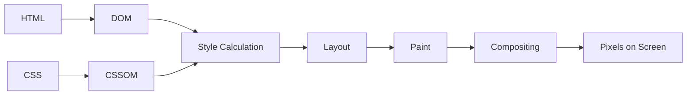

We will build this model carefully later in the chapter.

## Browser APIs

Many things developers casually call “JavaScript features” are actually provided by the browser environment.

For example:

```js
document.querySelector(...)
fetch(...)
setTimeout(...)
localStorage
IntersectionObserver
requestAnimationFrame(...)
```

These are not all part of the JavaScript language itself.

The browser provides them.

That distinction becomes particularly important when we examine asynchronous work and the event loop.

## Storage

Browsers can also persist data through mechanisms such as:

* cookies;
* Web Storage;
* IndexedDB;
* Cache Storage.

Those mechanisms become important later in the book, especially in Chapter 10.

## Process isolation

Modern browsers also divide work into multiple processes for reasons including:

* stability;
* security;
* fault isolation;
* graphics handling;
* networking;
* extension isolation.

A tab crashing should not necessarily terminate the browser. One website should not casually obtain unrestricted access to another.

For this chapter, only one consequence matters:

> The browser can perform many activities concurrently, but ordinary page JavaScript, DOM interaction, user events, and significant rendering work still compete for limited main-thread time.

That is one of the foundations of front-end performance.

---

# 2. From Navigation to Resource Discovery

Consider this URL:

```text
https://shop.example.com/products?page=2
```

Before the browser can render anything, it must first navigate to the requested resource.

We can identify several pieces:

```text
https://
```

is the scheme.

```text
shop.example.com
```

is the host.

```text
/products
```

is the path.

```text
?page=2
```

is the query string.

Later, routing and application-state chapters will treat URLs as part of application architecture.

For now, we care about what happens after navigation begins.

A useful simplified sequence is:

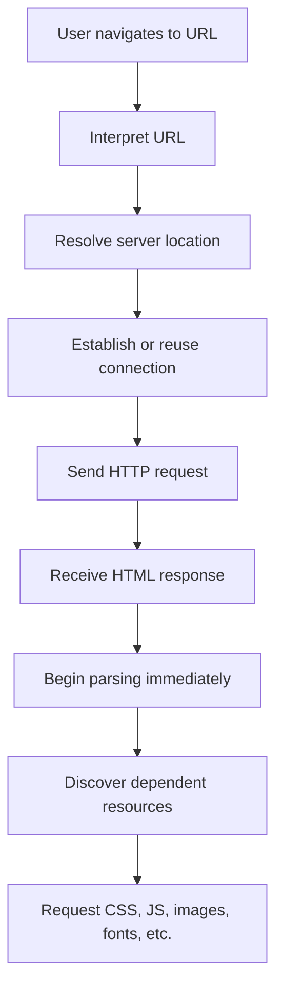

The important part is that these stages overlap.

The browser does **not** generally wait until the entire HTML document has downloaded before beginning document processing.

## DNS, conceptually

Humans use names such as:

```text
example.com
```

Networks ultimately need addressing information that can be used to reach servers.

DNS participates in resolving that name.

The result may already be cached, so a complete lookup is not necessarily required on every navigation.

The practical lesson is:

> Contacting a new origin can require setup work before the browser can request the actual resource.

This becomes relevant when applications depend on several third-party domains for:

* fonts;
* images;
* analytics;
* APIs;
* advertising;
* CDNs;
* authentication.

## Connection establishment

For HTTPS, the browser may need to perform work related to:

* network connection establishment;
* secure TLS negotiation;
* HTTP protocol setup.

Existing connections can sometimes be reused.

Again, our purpose is not to learn packet-level networking.

The engineering lesson is:

> A very small resource hosted on a new origin may still be expensive if the browser first has to establish communication with that origin.

## The initial HTTP request

The browser requests the document.

Conceptually:

```http
GET /products HTTP/...
Host: shop.example.com
```

The server responds:

```http
HTTP/... 200 OK
Content-Type: text/html
```

followed by the document body.

The browser can begin processing the response progressively.

That means resource loading is not:

```text
download everything
↓
start browser work
```

It is closer to:

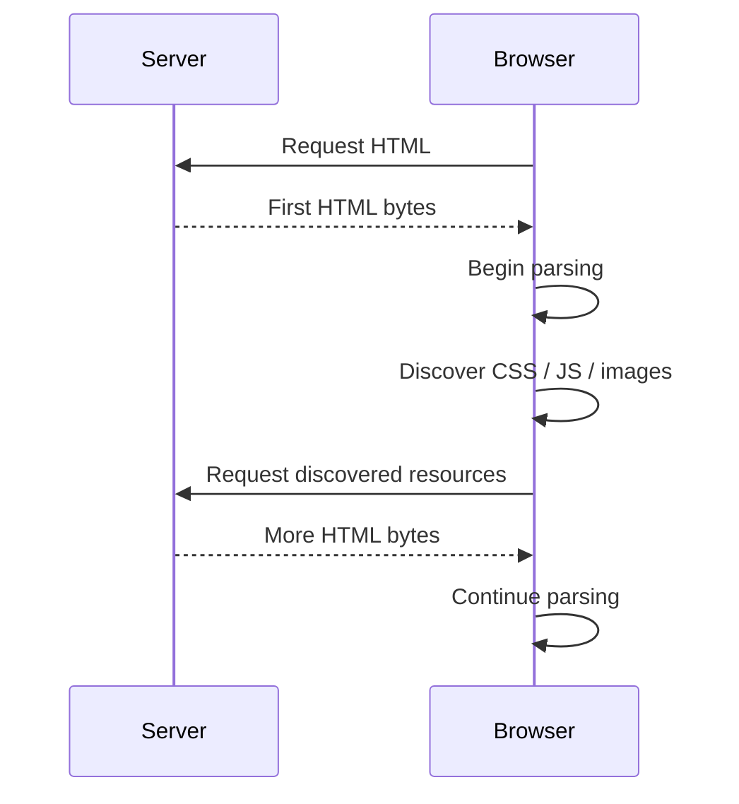

This progressive behavior is central to understanding resource waterfalls.

---

## A small running example

We will use this page throughout the chapter:

```html
<!doctype html>
<html lang="en">
  <head>
    <meta charset="utf-8">
    <meta name="viewport" content="width=device-width">

    <title>Browser Runtime Demo</title>

    <link rel="stylesheet" href="styles.css">

    <script src="legacy.js"></script>
    <script defer src="app.js"></script>
  </head>

  <body>
    <main>
      <h1>Products</h1>

      <button id="load-products">
        Load products
      </button>

      <div id="status"></div>

      
    </main>
  </body>
</html>
```

Even this tiny page creates several questions:

* When is `styles.css` discovered?
* When is `legacy.js` downloaded?
* When does it execute?
* Does `app.js` execute immediately?
* When is `hero.webp` discovered?
* Can the browser request resources located later in the document while parsing is blocked?
* Does the browser need the complete HTML before creating the `<h1>`?

To answer these questions, we need to understand parsing and resource discovery together.

---

## Resource discovery is part of performance

A browser cannot request a resource before it knows that resource exists.

This sounds obvious, but it has important consequences.

Compare:

```html

```

with:

```js
const image = document.createElement("img");
image.src = "hero.webp";
document.body.append(image);
```

In the first case, the image URL is visible directly in markup.

In the second, the browser does not know about the image until the JavaScript executes.

We can express the difference as:


versus:

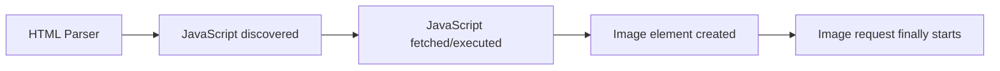

The file itself has not changed.

Only its **discoverability** has changed.

That leads to an important principle:

> Resources important to the initial user experience should generally be discoverable as early as practical.

That does not mean everything belongs in HTML.

It means discovery timing is part of architecture.

---

## CSS creates dependency chains

Resources referenced inside CSS may be discovered later than resources declared directly in HTML.

For example:

```css
.hero {
  background-image: url("hero-background.webp");
}
```

A simplified dependency chain is:


Similarly, fonts introduced through `@font-face` require CSS to be discovered and processed before the browser knows which font resource is needed.

This creates a broader rule:

> The browser's loading timeline depends not only on resource size, but also on the dependency chain through which the resource becomes discoverable.

---

## The preload scanner and speculative discovery

HTML parsing can sometimes be interrupted by a blocking script.

If the browser simply stopped all useful document-related work whenever that happened, pages would create unnecessary network waterfalls.

Browsers therefore employ speculative resource-discovery mechanisms, commonly discussed as a **preload scanner**.

The durable idea is:

> While the main parser is blocked or still working through the document, the browser may inspect available markup ahead and discover resources that are likely to be needed.

For example:

```html
<script src="legacy.js"></script>

<link rel="stylesheet" href="later.css">

<script defer src="app.js"></script>
```

Even if the main parser must wait for `legacy.js`, speculative scanning may still notice:

* `later.css`;
* `hero.webp`;
* `app.js`;

and begin fetching them.

A conceptual timeline:

```mermaid
gantt
    title Main Parsing and Speculative Resource Discovery
    dateFormat X
    axisFormat %L

    section Main parser
    Parse HTML             :a1, 0, 3
    Blocked by script      :a2, 3, 5
    Resume parsing         :a3, 8, 4

    section Resource discovery
    Discover later CSS     :b1, 3, 1
    Discover deferred JS   :b2, 4, 1
    Discover image         :b3, 5, 1

    section Network
    Fetch CSS              :c1, 4, 5
    Fetch deferred JS      :c2, 5, 4
    Fetch image            :c3, 6, 5
```

This does **not** mean the browser immediately discovers everything.

Resources introduced only by JavaScript may remain invisible until the JavaScript runs.

Resources buried inside CSS may depend on the stylesheet being retrieved and processed.

Also, the exact browser implementation should not be treated as a universal rule. We care about speculative resource discovery as an engineering concept, not whether every browser uses exactly the same thread or mechanism.

---

## Resource hints

Sometimes developers know that an important resource will be needed before the browser would naturally discover it.

Resource hints can help.

### Preload

`preload` communicates that a resource is important to the **current navigation**.

```html
<link
  rel="preload"
  href="/fonts/interface.woff2"
  as="font"
  type="font/woff2"
  crossorigin
>
```

The browser can fetch it earlier than normal discovery might allow.

But preload is not free.

If everything is declared important, nothing is meaningfully prioritized.

Excessive preloading can cause less important resources to compete with truly critical ones.

### Prefetch

`prefetch` indicates that a resource may be useful for a **future navigation**.

```html
<link
  rel="prefetch"
  href="/next-page-data.json"
>
```

It is a speculative hint, not a guarantee.

### Preconnect

`preconnect` asks the browser to begin connection setup with another origin before an actual resource request is known.

```html
<link
  rel="preconnect"
  href="https://cdn.example.net"
>
```

This can reduce future connection setup time.

Again, restraint matters.

Preconnecting to many speculative origins can waste resources.

The broader principle is:

> Resource hints should solve identified discovery or connection problems, not be added automatically.

---

# 3. Parsing HTML and Loading Scripts

Once HTML bytes arrive, the browser begins parsing them into a runtime document structure.

That structure is the **Document Object Model**, or DOM.

Consider:

```html
<main>
  <h1>Products</h1>
  <button>Load</button>
</main>
```

A simplified conceptual structure is:

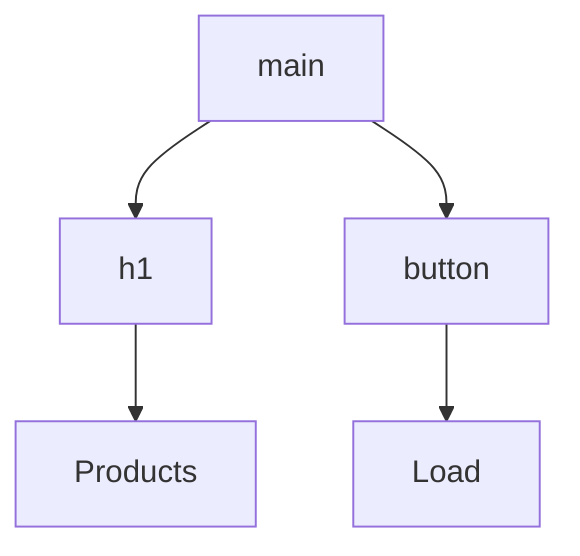

The actual DOM contains more detail, but the tree model is useful.

HTML is source markup.

The DOM is a live runtime representation.

That distinction becomes important as soon as JavaScript modifies the page.

For example:

```html
<div id="status"></div>
```

followed later by:

```js
document.querySelector("#status").textContent = "Loaded";
```

The original HTML response has not changed.

The DOM has.

So:

> **HTML is the source document; the DOM is the browser's live document model.**

---

## Parsing is progressive

The browser does not need to wait for the closing `</html>` before constructing the DOM.

As markup arrives, parsing proceeds.

Conceptually:

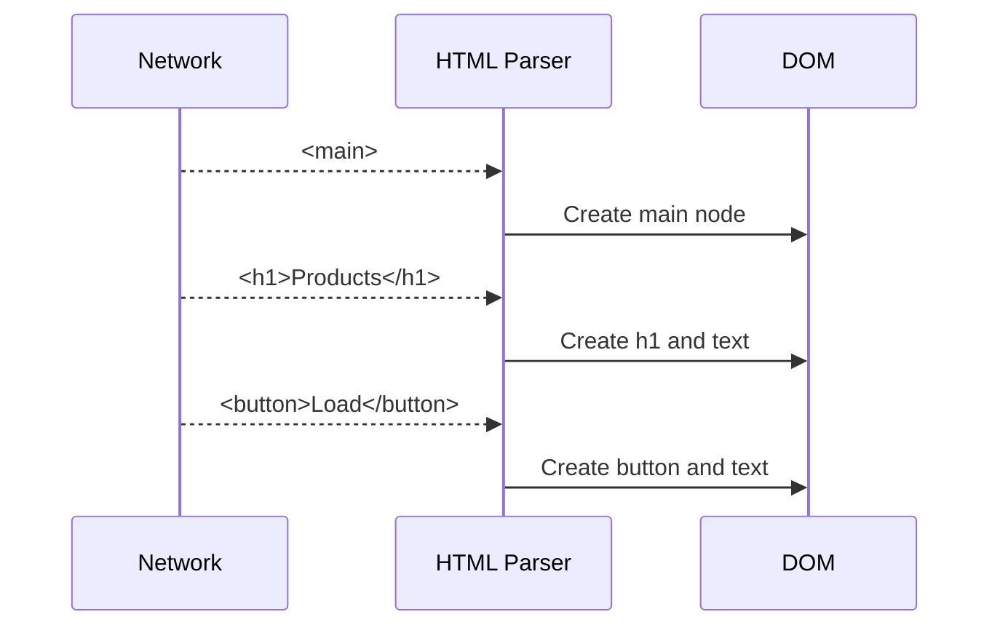

This progressive behavior is one reason documents can begin rendering before every byte has arrived.

---

## Why scripts can interrupt parsing

Now consider:

```html
<script src="legacy.js"></script>
```

For a classic script without `async`, `defer`, or module behavior, the browser must account for the possibility that the script:

* inspects the document;
* changes the document;
* writes additional markup;
* depends on what has already been parsed.

As a result, parsing may pause until the script is available and has executed.

Conceptually:

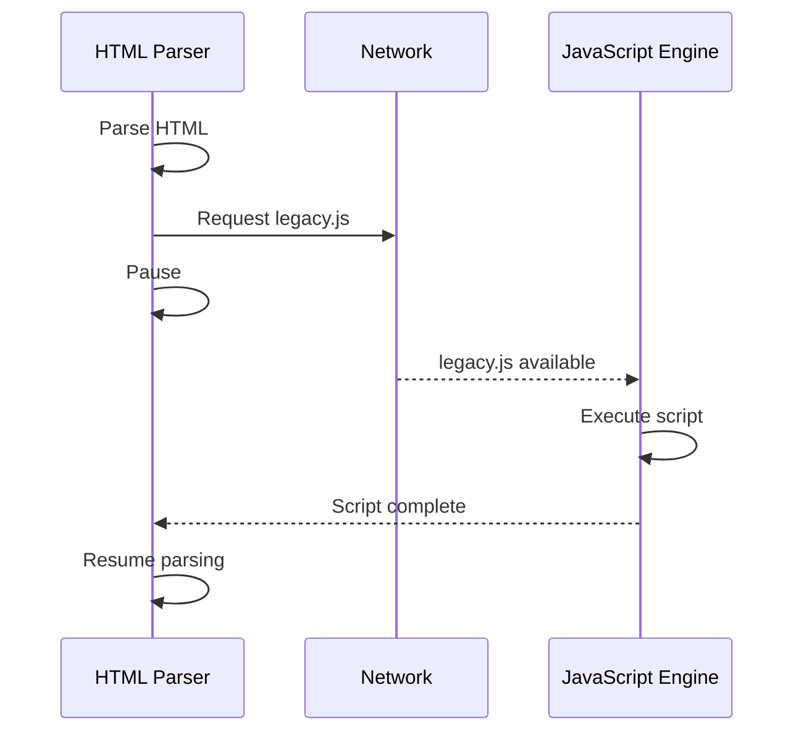

This is what we mean by a **parser-blocking script**.

The solution is not “JavaScript is bad.”

The solution is understanding whether code actually needs to execute at that point.

---

## Classic script, `defer`, `async`, and modules

Modern browsers provide several loading models.

### Classic script

```html
<script src="app.js"></script>
```

Typical behavior:

* parsing may pause;
* the script is fetched if necessary;
* the script executes;
* parsing resumes.

### Deferred script

```html
<script defer src="app.js"></script>
```

The browser can fetch the script while HTML parsing continues.

Execution waits until parsing is complete.

Deferred classic scripts also preserve document order.

```html
<script defer src="library.js"></script>
<script defer src="application.js"></script>
```

will execute conceptually as:

```text
library.js
application.js
```

even if their downloads finish in another order.

### Async script

```html
<script async src="analytics.js"></script>
```

The script can download while parsing continues.

Once available, it may execute as soon as possible.

Its execution order relative to other async scripts is not guaranteed by document order.

That makes `async` useful for independent scripts.

### Module script

```html
<script type="module" src="main.js"></script>
```

Module scripts:

* support `import` and `export`;
* use module scope;
* participate in a module dependency graph;
* are deferred by default.

They therefore usually do not require a separate `defer` attribute.

---

## The loading models together

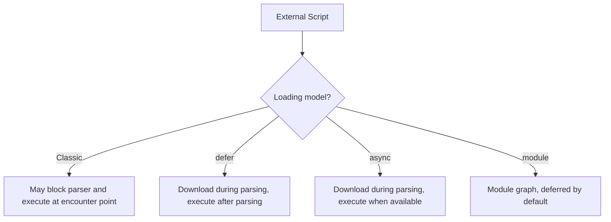

A compact comparison:

| Script style | Parsing may continue while fetching? | Typical execution timing | Ordered relative to similar scripts? |
| ------------ | -----------------------------------: | ------------------------ | ------------------------------------ |
| Classic      |                         Not reliably | At encounter point       | Yes                                  |
| `defer`      |                                  Yes | After parsing            | Yes                                  |
| `async`      |                                  Yes | When available           | No                                   |
| Module       |                                  Yes | Deferred by default      | Dependency/module rules              |

The table is less important than the questions behind it:

* When is the script discovered?
* When can it download?
* When can it execute?
* What must wait?
* Does execution order matter?

Those questions remain useful even when frameworks and build tools hide the original `<script>` tags.

---

## A common mistake: “Put scripts at the bottom”

Older advice often said:

> Put all scripts before `</body>`.

That sometimes reduced parser blocking because more HTML had already been parsed before the script was reached.

But modern loading controls such as:

* `defer`;
* `async`;
* ES modules;

give us more precise control.

The goal is not to memorize placement folklore.

The goal is to understand browser behavior.

---

# 4. From DOM and CSSOM to Pixels

At this point, the browser may have a DOM.

But document structure alone is not enough to determine visual output.

CSS also needs to be processed.

Consider:

```css
body {
  font-family: system-ui;
  margin: 0;
}

h1 {
  color: navy;
}
```

The browser parses stylesheet information into structures commonly discussed through the **CSS Object Model**, or CSSOM.

So our mental model becomes:

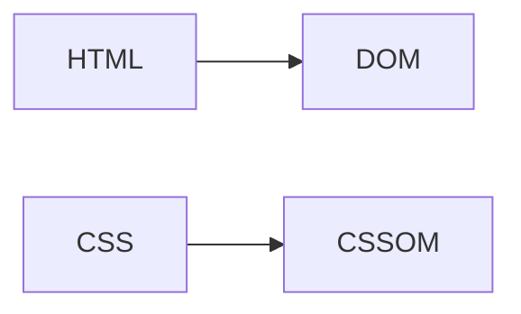

DOM and CSSOM are separate concerns.

The DOM tells the browser what the document contains.

CSSOM-related style information helps determine how it should be presented.

---

## CSS and rendering

CSS is generally considered render-blocking because the browser does not want to paint the page using incomplete styling information when required CSS is known to be incoming.

This does **not** mean CSS blocks HTML parsing in exactly the same way as a classic script.

The distinction matters.

A useful simplified model is:

* HTML parsing can continue;
* CSS can download in parallel;
* final styled rendering may wait for necessary style information;
* JavaScript can introduce interactions between these systems.

The browser pipeline is interconnected.

---

## Style calculation

Once document structure and styling information are available, the browser determines the computed styles that apply to elements.

Suppose the DOM contains:

```html
<button class="primary">Buy</button>
```

and CSS contains:

```css
button {
  padding: 0.5rem 1rem;
}

.primary {
  background: navy;
  color: white;
}
```

The browser must resolve:

* browser defaults;
* inherited styles;
* author rules;
* specificity;
* source order;
* cascade rules.

Chapter 3 will study those mechanisms in depth.

Here, we need only this definition:

> **Style calculation determines the effective styles that participate in rendering.**

---

## From document structure to renderable content

Not every DOM node produces visible output.

For example:

```css
.hidden {
  display: none;
}
```

removes an element from normal layout participation.

Elements in `<head>` also do not generally produce visible page boxes.

So the browser effectively needs a representation of the content that participates in rendering.

This is often explained using the conceptual term **render tree**.

We should treat it as a useful mental model rather than assume every engine exposes exactly the same internal data structure.

---

## Layout

Once the browser knows which content participates in rendering and what styles apply, it must determine geometry.

Layout answers questions such as:

* How wide is the element?
* How tall is it?
* Where is it positioned?
* How does it relate to its parent?
* Where does text wrap?
* Where does the next element begin?

For example:

```css
.card {
  width: 50%;
}
```

cannot be resolved geometrically without knowing the dimensions of the containing context.

Layout therefore involves relationships among elements.

---

## Layout can happen again

Suppose JavaScript performs:

```js
element.style.width = "800px";
```

If this changes geometry, the browser may need to recalculate layout for affected parts of the page.

This is often called **reflow**.

Potential causes include changes involving:

* width;
* height;
* position;
* font metrics;
* inserted content;
* removed content.

This does **not** mean every layout change recalculates the entire document from the beginning.

Browsers are highly optimized.

The correct lesson is:

> Changes that affect geometry can require more rendering work than changes that leave geometry unchanged.

---

## Paint

After geometry is known, the browser must determine what visual content to draw.

Paint can involve:

* text;
* colors;
* borders;
* shadows;
* backgrounds;
* images.

A simple distinction is:

**Layout asks where.**

**Paint asks what visual content appears there.**

---

## Compositing

Modern browsers may paint content into separate surfaces or layers and then combine those layers into a final frame.

That final assembly stage is **compositing**.

Certain operations, such as some transforms and opacity changes, can sometimes be performed without repeating earlier stages of the pipeline.

But this does not justify simplistic advice such as:

> Put everything on its own GPU layer.

Layers have memory and management costs.

Compositing is mostly the browser's responsibility.

For this chapter, the important mental model is:

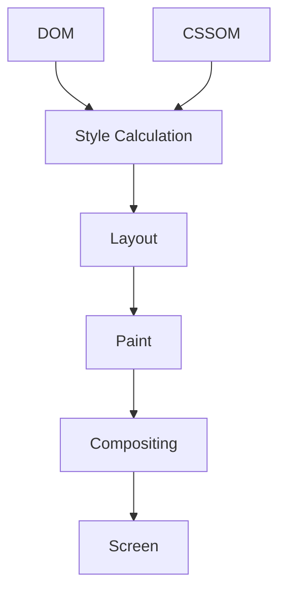

Different changes can enter this pipeline at different points.

---

## Not every visual update costs the same

Compare:

```js
element.style.width = "900px";
```

with:

```js
element.style.transform = "translateX(20px)";
```

A width change may require new layout calculations.

A transform may, under suitable conditions, be handled later in the pipeline.

This does **not** mean transforms are universally cheap or width changes are universally catastrophic.

The correct engineering principle is:

> Understand the likely category of browser work, then measure actual behavior.

That distinction becomes central in Chapter 15.

---

## The critical rendering path

We can now assemble the main rendering path:

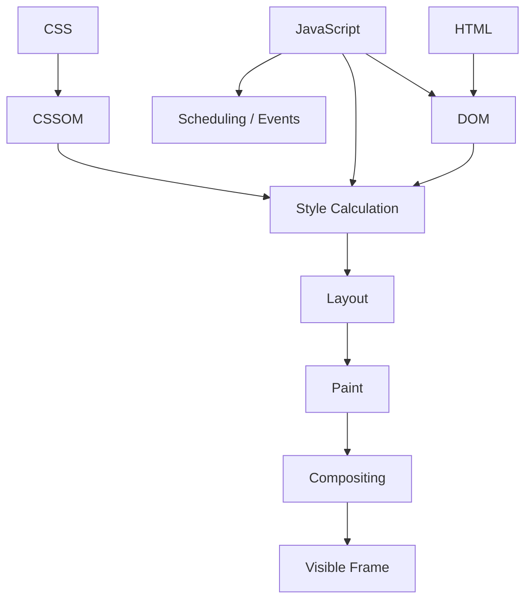

The **Critical Rendering Path** is the sequence of work required to transform page resources into visible output.

JavaScript can affect that path by:

* modifying the DOM;
* changing classes/styles;
* creating new resources;
* blocking parsing;
* occupying main-thread time.

Fonts and images also participate indirectly.

An image may affect geometry and visual stability.

A font may affect:

* text size;
* wrapping;
* layout;
* paint timing.

Chapter 15 will treat these as optimization targets.

Here, we only need the model.

---

# 5. JavaScript Scheduling and the Event Loop

We now understand how documents become pixels.

But a modern application does not render once and stop.

It responds to:

* clicks;
* typing;
* timers;
* network responses;
* promises;
* animations;
* application state changes.

To understand those behaviors, we need a scheduling model.

---

## JavaScript and the main thread

A common simplification says:

> JavaScript is single-threaded.

That is only useful when qualified.

Browsers can:

* perform networking concurrently;
* decode images;
* use worker threads;
* perform GPU-related work;
* manage multiple browser processes.

But ordinary page JavaScript, DOM interaction, user events, and important rendering work are heavily coordinated through the browser's main thread.

That means long-running synchronous JavaScript can make an application feel frozen.

Consider:

```js
const start = performance.now();

while (performance.now() - start < 5000) {
  // intentionally expensive synchronous work
}
```

For approximately five seconds, the browser has far fewer opportunities to:

* respond to clicks;
* process keyboard input;
* update rendering;
* run other scheduled JavaScript.

This is what developers mean when they say:

> The main thread is blocked.

---

## The call stack

JavaScript executes functions through a call stack.

Consider:

```js
function third() {
  console.log("third");
}

function second() {
  third();
}

function first() {
  second();
}

first();
```

The stack evolves conceptually as:

```mermaid
flowchart BT
    A[first()]
    B[second()]
    C[third()]

    A --> B
    B --> C
```

At the deepest point:

```text
third()
second()
first()
```

When `third()` finishes, it leaves the stack.

Then `second()` finishes.

Then `first()` finishes.

Only one piece of ordinary synchronous JavaScript executes on that stack at a time.

The interesting question is how asynchronous work joins the process.

---

## Browser APIs perform work outside the current call stack

Consider:

```js
setTimeout(() => {
  console.log("Timer finished");
}, 1000);
```

JavaScript does not hold the callback on the stack for one second.

The browser's timer facilities track the delay.

Later, the callback becomes eligible to run.

Similarly:

```js
button.addEventListener("click", () => {
  console.log("clicked");
});
```

does not keep the handler executing or waiting on the stack.

The browser waits for the event.

This coordination leads to the event loop.

---

## Tasks

Various browser events result in work being scheduled as **tasks**.

Examples include:

* timer callbacks;
* user events;
* some messaging operations.

A simplified task queue might contain:

```text
timer callback
click handler
message event
```

But the event loop is not just one task queue.

Microtasks behave differently.

---

## Microtasks

Promise reactions are scheduled as **microtasks**.

Consider:

```js
console.log("A");

Promise.resolve().then(() => {
  console.log("B");
});

console.log("C");
```

The result is:

```text
A
C
B
```

The Promise callback does not run immediately.

It waits until current synchronous work completes.

Then it runs as a microtask.

Now compare:

```js
console.log("start");

setTimeout(() => {
  console.log("timeout");
}, 0);

Promise.resolve().then(() => {
  console.log("promise");
});

console.log("end");
```

The typical output is:

```text
start
end
promise
timeout
```

The reason is easier to understand visually.

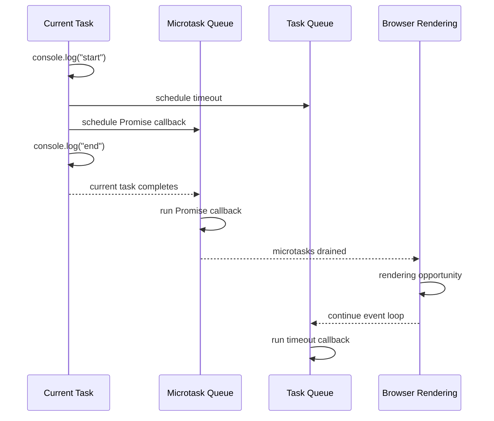

A zero-millisecond timeout therefore does **not** mean:

> Run immediately.

It means the callback may become eligible for a later task after at least the requested delay.

---

## A practical event-loop model

A useful browser-level model is:

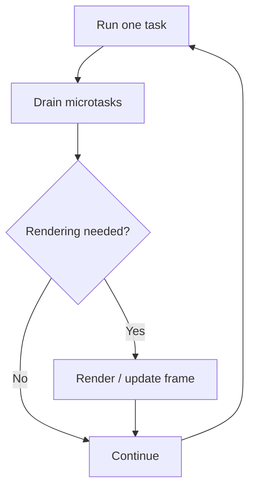

This is intentionally simplified.

Real browser scheduling is more complex.

But it is much better than imagining one giant queue.

---

## Microtasks can also cause problems

Because microtasks are drained before the browser proceeds to the next ordinary task, a continuously replenished microtask queue can delay other work.

For example:

```js
function repeat() {
  queueMicrotask(repeat);
}

repeat();
```

This creates an endless stream of microtasks.

The lesson is:

> Microtasks are not background work and they are not free.

They occupy a privileged scheduling position.

---

## Rendering and event handling interact

Imagine:

```html
<button id="save">Save</button>
```

with:

```js
saveButton.addEventListener("click", () => {
  performVeryExpensiveCalculation();
});
```

The click becomes scheduled work.

The handler executes.

If it takes two seconds synchronously, the browser cannot simply ignore the handler and render a perfectly responsive interface on the same execution path.

This is one reason performance involves more than download size.

The browser must repeatedly regain control in order to:

* process user input;
* calculate styles;
* perform layout;
* paint;
* produce frames.

Long tasks interfere with that rhythm.

---

## DOM changes do not instantly become pixels

Suppose:

```js
panel.classList.add("open");
```

JavaScript changes application state represented in the DOM.

That does not mean new pixels are painted at the exact machine instruction where `classList.add()` executes.

The browser eventually needs to account for:

* changed styling;
* possible geometry changes;
* paint work;
* compositing.

This gives us a useful distinction:

> JavaScript can request or cause visual changes. The browser controls how those changes become visible frames.

---

## Why framework developers still need this

React, Vue, Svelte, Angular, and other frameworks still operate within these browser constraints.

When a framework:

* batches updates;
* schedules work;
* creates promises;
* handles input;
* changes the DOM;
* loads modules;

it still depends on the browser's scheduling and rendering machinery.

Frameworks can abstract platform APIs.

They cannot abolish the platform.

---

# 6. Seeing the Browser Work with DevTools

The concepts in this chapter become much more useful when they can be observed.

Modern browsers provide developer tools that expose much of the loading, document, JavaScript, and rendering behavior we have discussed.

The exact interface differs among Chrome, Edge, Firefox, Safari, and other browsers, but the major concepts are similar.

Our goal is not to master DevTools in one chapter.

It is to make browser behavior visible.

---

## Elements: inspect the live DOM

The Elements panel shows the browser's current DOM.

This matters because the DOM may no longer match the server's original HTML.

Try:

```js
document.querySelector("h1").textContent = "Changed at runtime";
```

The source response has not changed.

The DOM has.

In the Elements panel, you can also:

* inspect computed styles;
* change attributes;
* experiment with classes;
* examine box geometry;
* test CSS declarations.

This directly reinforces the distinction:

**HTML source ≠ current DOM**

---

## Console: inspect the runtime

The Console is an interactive environment.

Try:

```js
document.querySelector("h1")
```

or:

```js
performance.getEntriesByType("resource")
```

The latter exposes timing information for loaded resources.

The console can therefore help investigate:

* DOM state;
* runtime variables;
* browser APIs;
* resource timing.

---

## Network: inspect resource discovery and loading

Reload the page with the Network panel open.

Observe:

* the HTML document;
* CSS;
* scripts;
* images;
* fonts;
* API requests.

Pay attention to:

* request start time;
* duration;
* initiator;
* size;
* cache status;
* priority where available;
* waterfall position.

A particularly useful question is:

> Why did this request start at this point?

That question leads directly back to:

* discovery;
* dependency chains;
* parser blocking;
* JavaScript execution;
* CSS processing.

---

## Sources: inspect execution

The Sources panel allows you to:

* inspect loaded JavaScript;
* set breakpoints;
* step through execution;
* inspect the call stack.

Set a breakpoint inside `legacy.js`.

Reload the running example.

When execution stops, observe how document processing is affected.

The conceptual parser-blocking model becomes concrete.

---

## Performance: observe browser work over time

The Performance panel can expose activity such as:

* JavaScript execution;
* style recalculation;
* layout;
* paint;
* user events;
* network activity.

Do not attempt to interpret every detail yet.

For Chapter 1, simply identify the categories.

Chapter 15 will return to performance profiling with much greater depth.

---

## Practical experiment 1: parser blocking

Create:

```html
<!doctype html>
<html>
  <head>
    <script>
      const start = performance.now();

      while (performance.now() - start < 3000) {
        // intentionally block for demonstration
      }
    </script>
  </head>

  <body>
    <h1>Can you see me?</h1>
  </body>
</html>
```

Reload the page.

Now move the script after the heading.

Then repeat using an external script with `defer`.

Do not merely record which version feels faster.

Explain why.

---

## Practical experiment 2: resource discoverability

Compare:

```html

```

with:

```js
setTimeout(() => {
  const image = new Image();
  image.src = "hero.webp";
  document.body.append(image);
}, 2000);
```

Observe both versions in the Network panel.

The image file is identical.

The discovery timeline is not.

---

## Practical experiment 3: tasks and microtasks

Create:

```html
<button id="run">Run experiment</button>

<script type="module">
  document.querySelector("#run").addEventListener("click", () => {
    console.log("1: click handler");

    setTimeout(() => {
      console.log("4: timer");
    }, 0);

    Promise.resolve().then(() => {
      console.log("3: promise");
    });

    console.log("2: handler ending");
  });
</script>
```

The expected order is:

```text
1: click handler
2: handler ending
3: promise
4: timer
```

The experiment demonstrates:

* synchronous execution;
* microtask scheduling;
* later task execution.

---

## Practical experiment 4: rendering work

Create several hundred elements.

Change:

```js
element.style.width = "900px";
```

Record a Performance trace.

Then try:

```js
element.style.transform = "translateX(20px)";
```

Record again.

Do not conclude:

> transform is always fast.

Instead ask:

* Was layout recorded?
* Was paint recorded?
* Was compositing involved?
* How much work occurred?

That habit—**observe rather than repeat folklore**—will matter throughout the book.

---

# 7. Putting the Browser Mental Model Together

We can now connect everything.

The following diagram is the central model for this chapter:

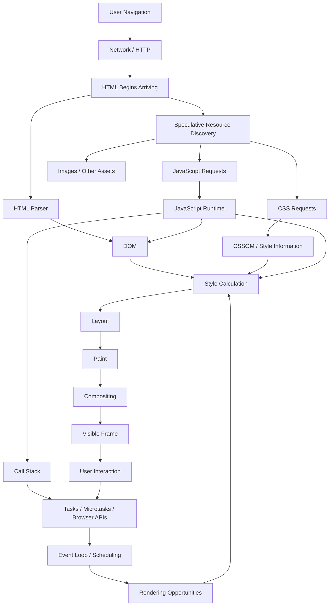

The important lesson is not that every browser literally uses exactly this internal diagram.

The important lesson is that these systems are interconnected.

Network timing affects resource availability.

Resource discovery affects request timing.

Script behavior affects parsing.

JavaScript affects DOM and style.

DOM and CSS affect layout.

Long-running JavaScript affects responsiveness.

User input returns more work to the event loop.

The browser is a continuously operating runtime.

---

## Walking through the running example

Return to:

```html
<link rel="stylesheet" href="styles.css">

<script src="legacy.js"></script>
<script defer src="app.js"></script>
```

and later:

```html

```

A useful conceptual walkthrough is:

### 1. Navigation begins

The browser interprets the URL, resolves the destination, establishes or reuses a connection, and requests HTML.

### 2. HTML begins arriving

Parsing can start before the complete document has arrived.

### 3. CSS is discovered

The browser encounters:

```html
<link rel="stylesheet" href="styles.css">
```

and requests it.

### 4. A classic script is discovered

The parser encounters:

```html
<script src="legacy.js"></script>
```

and may need to pause.

### 5. Speculative discovery continues

Available markup ahead may reveal:

```html
<script defer src="app.js">
```

and:

```html

```

allowing those requests to begin before the main parser naturally reaches them.

### 6. `legacy.js` executes

Once required conditions are satisfied, the blocking script runs.

### 7. Parsing resumes

DOM construction continues.

### 8. CSS becomes available

The stylesheet is parsed and participates in style calculation.

### 9. The deferred script waits

`app.js` may already be downloaded, but its execution waits until HTML parsing is complete.

### 10. Rendering work proceeds

The browser performs:

* style calculation;
* layout;
* paint;
* compositing.

### 11. Deferred JavaScript executes

After parsing completes, the deferred application code executes.

### 12. Interaction begins

Event listeners, asynchronous operations, user input, and subsequent rendering continue through the browser's scheduling systems.

That is the runtime model we will carry into the remainder of the book.

---

# Misconceptions to Leave Behind

Rather than placing these misconceptions in isolated mini-sections throughout the chapter, we can now correct them using the complete model.

### “The browser waits for the full HTML before doing anything.”

No.

HTML processing is progressive, and resource requests may begin while the rest of the document is still arriving.

### “All resources start downloading together.”

No.

Discovery depends on where and how resources are referenced.

Some are found directly in HTML.

Others depend on CSS or JavaScript.

### “HTML and DOM are the same thing.”

No.

HTML is source markup.

The DOM is a mutable runtime representation.

### “CSS only changes appearance.”

No.

CSS affects:

* geometry;
* layout;
* visibility;
* responsive behavior;
* rendering work.

### “JavaScript runs in parallel with rendering.”

Not in the simplistic sense.

The browser can perform many things concurrently, but long-running main-thread JavaScript can directly delay input and rendering.

### “The event loop is one queue.”

No.

At minimum, front-end developers need to distinguish ordinary tasks, microtasks, and rendering opportunities.

### “Every DOM update rerenders the entire page.”

No.

Different mutations can require different combinations of:

* style calculation;
* layout;
* paint;
* compositing.

### “Preloading more resources always makes a page faster.”

No.

Priority is finite.

Promoting unimportant resources can hurt more important ones.

### “Frameworks replace browser knowledge.”

No.

Frameworks run on top of browser behavior.

They change how developers express application logic, not the underlying physics of the platform.

---

# Chapter Summary

A modern browser is an application runtime.

It coordinates:

* navigation;
* network requests;
* progressive HTML parsing;
* speculative resource discovery;
* DOM construction;
* CSS processing;
* JavaScript execution;
* asynchronous scheduling;
* style calculation;
* layout;
* paint;
* compositing;
* and user interaction.

The key mental model is:


HTML becomes the DOM.

CSS contributes to styling structures used during rendering.

Classic scripts can block parsing.

`defer`, `async`, and module scripts change when downloading and execution occur.

Speculative resource discovery helps the browser find some resources before the main parser naturally reaches them.

The rendering process can be simplified as:


JavaScript execution is coordinated through the event loop.

A useful simplified scheduling model is:

```mermaid
flowchart LR
    A[Task] --> B[Microtasks]
    B --> C[Rendering Opportunity]
    C --> D[Next Task]
    D --> B
```

These are not obscure browser-engine details.

They are the physical environment within which every framework, state library, rendering architecture, build tool, and performance technique in the rest of this book must operate.

---

# Review Questions

1. Why is a browser better understood as an application runtime than as a file viewer?

2. What is the difference between HTML and the DOM?

3. Why may a classic external script interrupt HTML parsing?

4. What problem does speculative resource discovery help reduce?

5. Why may a resource created by JavaScript be discovered later than the same resource declared in HTML?

6. Why can CSS create additional resource dependency chains?

7. What is the difference between classic, deferred, async, and module scripts?

8. Why does a module script normally not require `defer`?

9. What role does the CSSOM play in rendering?

10. What is the difference between style calculation, layout, paint, and compositing?

11. Why can long-running JavaScript make the interface unresponsive?

12. What is the practical difference between a task and a microtask?

13. Why does a zero-delay timer not execute immediately?

14. What problem can an endlessly replenished microtask queue cause?

15. Why is resource discoverability an architectural concern?

16. What is the difference between `preload`, `prefetch`, and `preconnect`?

17. Why can excessive use of resource hints make performance worse?

18. Why is it inaccurate to say that every DOM update rerenders the whole page?

---

# End-of-Chapter Practical Lab — Observe a Page from Navigation to Interaction

Create a small project containing:

```text
chapter-01-runtime/
├── index.html
├── styles.css
├── legacy.js
├── app.js
└── hero.webp
```

Use the chapter's running example as the starting point.

## Stage 1 — Observe the initial waterfall

Open DevTools → Network.

Reload.

Record:

* which resource was requested first;
* when CSS began;
* when each script began;
* when the image began;
* which request initiated each resource.

Draw your own Mermaid sequence diagram of what you observed.

## Stage 2 — Change script loading

Test:

```html
<script src="app.js"></script>
```

then:

```html
<script defer src="app.js"></script>
```

then:

```html
<script async src="app.js"></script>
```

then:

```html
<script type="module" src="app.js"></script>
```

Add console messages before and after each script.

Explain the execution differences.

## Stage 3 — Delay image discoverability

First load:

```html

```

Then remove it and create the image from JavaScript after two seconds.

Compare the waterfall.

Explain why the same image begins loading at different times.

## Stage 4 — Observe tasks and microtasks

Run:

```js
console.log("one");

setTimeout(() => {
  console.log("two");
}, 0);

queueMicrotask(() => {
  console.log("three");
});

Promise.resolve().then(() => {
  console.log("four");
});

console.log("five");
```

Predict the output before executing it.

Then explain the result using the event-loop diagram from the chapter.

## Stage 5 — Observe rendering work

Create several hundred elements.

Record a Performance trace while changing element dimensions.

Repeat using a transform.

Identify:

* JavaScript;
* style calculation;
* layout;
* paint;
* compositing where visible.

Do not judge one technique from theory alone.

Use the trace.

## Stage 6 — Explain the browser without notes

Finally, close the chapter.

From memory, draw a Mermaid diagram connecting:

* navigation;
* HTML;
* resource discovery;
* preload scanning;
* scripts;
* DOM;
* CSSOM;
* JavaScript runtime;
* tasks;
* microtasks;
* layout;
* paint;
* compositing;
* user interaction.

If you can explain that diagram clearly to another developer, you have achieved the primary objective of Chapter 1.

---

# Key Terms

**Browser runtime** — the combined execution environment providing networking, parsing, rendering, JavaScript, events, storage, and Web APIs.

**DOM** — the browser's live object representation of a document.

**CSSOM** — the browser's representation of stylesheet information used during style processing.

**HTML parser** — the system that processes HTML markup and constructs document nodes.

**Speculative resource discovery** — browser behavior that scans available markup ahead of normal parsing progress to discover resources earlier.

**Preload scanner** — a common term for speculative markup scanning used to initiate potentially useful resource requests.

**Parser-blocking script** — a script whose loading or execution can pause normal HTML parsing.

**Critical Rendering Path** — the work required to transform document resources into visible output.

**Style calculation** — determining the effective styles that apply to rendered elements.

**Layout** — calculating element geometry and position.

**Paint** — producing the visual drawing information for page content.

**Compositing** — combining painted layers or surfaces into the final displayed frame.

**Call stack** — the structure representing currently executing JavaScript function calls.

**Task** — scheduled browser work such as certain event or timer callbacks.

**Microtask** — follow-up work processed after current JavaScript completes and before the next normal task; Promise reactions use microtasks.

**Event loop** — the browser coordination mechanism through which JavaScript tasks, microtasks, rendering opportunities, and user events progress.

**`defer`** — a classic-script loading mode that allows downloading during parsing and delays execution until parsing is complete.

**`async`** — a script-loading mode that allows downloading during parsing and execution when the resource becomes available without preserving normal document order.

**Module script** — JavaScript loaded through the ES Module system; module scripts are deferred by default.

**Preload** — a hint that an important resource required by the current navigation should be fetched earlier.

**Prefetch** — a hint that a resource may be useful for a future navigation.

**Preconnect** — a hint encouraging early connection setup with another origin.

---

# Closing Perspective

The browser is constantly coordinating work.

It navigates.

It receives data.

It discovers resources.

It parses.

It executes.

It calculates.

It paints.

It schedules.

It responds.

It repeats.

Front-end engineering begins when those activities stop being invisible magic.

Every technology introduced later in this book—TypeScript, components, React, Vue, state management, server rendering, caching, bundling, testing, design systems, and performance tooling—ultimately operates within the browser constraints introduced here.

That is why browser internals belong at the beginning of the book.

Before learning how modern frameworks abstract the web platform, we first need to understand the platform they are abstracting.
