# Chapter 2 — Semantic HTML, Accessibility, Internationalization & the DOM

A browser can render almost any page built from `<div>` and `<span>` elements.

That does not mean it should.

Consider these two fragments:

```html
<div class="heading">Service Requests</div>

<div class="navigation">
  <div class="link">Home</div>
  <div class="link">Requests</div>
</div>

<div class="content">
  ...
</div>
```

and:

```html
<h1>Service Requests</h1>

<nav aria-label="Primary">
  <a href="/">Home</a>
  <a href="/requests">Requests</a>
</nav>

<main>
  ...
</main>
```

A stylesheet could make the two versions look almost identical.

To a screenshot, they might appear equivalent.

To the browser, however, they communicate very different information.

The second version identifies:

* a heading;
* navigation;
* links;
* the main content of the page.

Those meanings matter because the browser does more than paint pixels.

HTML contributes information used by:

* browsers;
* keyboard interaction;
* forms;
* accessibility APIs;
* assistive technologies;
* search systems;
* developer tools;
* JavaScript;
* browser extensions;
* and other software that needs to understand a page rather than merely look at it.

That is what **semantic HTML** gives us: meaning encoded in the document itself.

This chapter begins with that meaning and gradually connects it to the runtime concepts introduced in Chapter 1.

Our progression is:

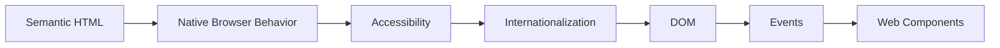

The important theme is that these are not unrelated subjects.

Semantic HTML becomes the DOM.

The browser uses that DOM to expose accessibility information.

Language and direction are part of the document's meaning.

JavaScript queries and changes the same DOM.

Events travel through its structure.

Web Components extend it.

The document is therefore not merely markup.

It is an **interface model** shared by the browser, JavaScript, users, and assistive technologies.

---

# 1. HTML Describes Meaning, Not Appearance

HTML has visual defaults.

An `<h1>` is usually large and bold.

A `<button>` usually looks like a button.

A `<blockquote>` may be indented.

Those defaults can make it tempting to choose HTML according to appearance:

> “I need large text, so I'll use an `<h1>`.”

or:

> “I don't like the browser's button style, so I'll use a `<div>`.”

Both approaches reverse the relationship between HTML and CSS.

HTML should primarily answer:

> **What is this?**

CSS should primarily answer:

> **How should it look?**

JavaScript can then answer:

> **How should it behave when application logic is required?**

A heading should be a heading because it introduces a section of content, not because we want large typography. MDN likewise emphasizes that heading levels should represent logical structure rather than being chosen for font size, and that headings serve as important navigation signposts for assistive technology.

This gives us one of the book's first durable principles:

> **Choose HTML according to meaning and behavior before styling it according to appearance.**

---

## A running example: a public-service portal

Throughout this chapter, we will gradually construct a small multilingual public-service interface.

Its first version might contain:

* a site header;
* primary navigation;
* a main page;
* information about a service;
* a service-request form;
* a table showing existing requests;
* a small interactive status filter.

A sensible high-level structure might be:

```html
<body>
  <header>
    ...
  </header>

  <main>
    ...
  </main>

  <footer>
    ...
  </footer>
</body>
```

Within `<main>`, we may have several meaningful regions.

```html
<main>
  <h1>Citizen Services</h1>

  <section>
    <h2>Request a document</h2>
    ...
  </section>

  <section>
    <h2>Your recent requests</h2>
    ...
  </section>
</main>
```

Before adding styling or JavaScript, the document already says something about itself.

That is valuable.

---

# 2. Building a Meaningful Document Structure

A good HTML document has hierarchy.

Readers visually infer hierarchy from:

* headings;
* spacing;
* font size;
* grouping;
* position.

Software cannot safely rely on visual appearance alone.

HTML therefore provides structural elements that communicate these relationships explicitly.

A simplified semantic page might look like this:

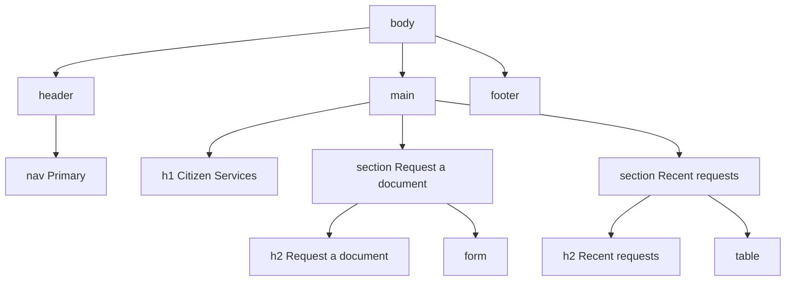

This structure is useful even before CSS exists.

---

## Headings create content hierarchy

HTML provides six heading levels:

```html
<h1>Citizen Services</h1>
<h2>Request a document</h2>
<h3>Required information</h3>
```

The numbers describe hierarchy.

They do **not** mean:

```text
h1 = very large
h2 = slightly smaller
h3 = smaller again
```

CSS controls typography.

HTML controls structure.

A logical hierarchy might be:

```html
<h1>Citizen Services</h1>

<h2>Identity Documents</h2>

<h3>Request an ID card</h3>

<h3>Replace a lost ID card</h3>

<h2>Housing Services</h2>

<h3>Address registration</h3>
```

A structure such as:

```html
<h1>Citizen Services</h1>
<h4>Identity Documents</h4>
<h2>Request an ID card</h2>
```

communicates a confusing hierarchy even if CSS makes it appear visually acceptable.

Screen-reader software can expose a list of headings that users navigate directly, which makes logical heading order particularly important.

---

## Do not rely on an imaginary automatic document outline

Older explanations of HTML sometimes suggested that sectioning elements such as `<section>` and `<article>` would automatically produce a sophisticated document outline regardless of heading levels.

That idea should not guide modern markup.

Use real heading levels that accurately represent the content hierarchy.

Do not write:

```html
<section>
  <h1>Identity Documents</h1>

  <section>
    <h1>Request an ID Card</h1>
  </section>
</section>
```

merely because an abstract outline algorithm appears to make the structure sensible.

Prefer explicit hierarchy:

```html
<h1>Citizen Services</h1>

<section>
  <h2>Identity Documents</h2>

  <section>
    <h3>Request an ID Card</h3>
  </section>
</section>
```

The markup should make sense to browsers and users as it actually exists.

---

# 3. Structural Elements and What They Mean

Semantic HTML does not mean replacing every `<div>` with a more elaborate element.

`<div>` is useful when no more specific semantic element applies.

The goal is not:

> “Never use a div.”

The goal is:

> “Do not use a generic container when the document actually has a meaningful structure that HTML can express.”

---

## `<main>`

`<main>` represents the dominant content of the document.

For our application:

```html
<main>
  <h1>Citizen Services</h1>
  ...
</main>
```

The site logo, repeated navigation, and global footer normally sit outside the main content.

A page should generally present one active main content region to users.

---

## `<nav>`

`<nav>` represents a significant navigation block.

For example:

```html
<nav aria-label="Primary">
  <a href="/">Home</a>
  <a href="/services">Services</a>
  <a href="/requests">My Requests</a>
</nav>
```

Not every collection of links needs to become `<nav>`.

A paragraph containing one related link is not a navigation region.

Use `<nav>` for meaningful navigation systems.

If a page contains several navigation landmarks, providing labels can help distinguish them—for example, “Primary navigation” and “Footer navigation.” MDN specifically notes this usefulness when multiple `<nav>` regions occur on a page.

---

## `<header>`

`<header>` represents introductory content for a page or section.

At document level:

```html
<header>
  <a href="/">City Services</a>

  <nav aria-label="Primary">
    ...
  </nav>
</header>
```

Inside an article:

```html
<article>
  <header>
    <h2>New Digital ID Service</h2>
    <p>Published 12 September</p>
  </header>

  ...
</article>
```

Context matters.

A top-level page header can act as the document's banner landmark, while a header inside an article is simply introductory content for that section.

---

## `<footer>`

Like `<header>`, `<footer>` is contextual.

At page level:

```html
<footer>
  <p>City Services Department</p>
</footer>
```

Within an article:

```html
<article>
  ...
  <footer>
    <p>Last updated: 20 September</p>
  </footer>
</article>
```

The element does not necessarily mean “the bottom of the browser window.”

It means footer information for its surrounding context.

---

## `<section>`

A `<section>` represents a thematic grouping of content.

For example:

```html
<section>
  <h2>Housing Services</h2>

  <p>
    Apply for address registration and residential documentation.
  </p>
</section>
```

Use it when the grouping has meaning.

Avoid:

```html
<section class="red-background">
```

when the only reason for the element is styling.

A `<div>` may be more appropriate for a generic styling wrapper.

---

## `<article>`

An `<article>` represents content that forms a meaningful self-contained unit.

Examples might include:

* news article;
* forum post;
* service announcement;
* product review;
* blog entry.

For example:

```html
<article>
  <h2>New Online Passport Renewal Service</h2>

  <p>
    Citizens can now submit renewal requests online.
  </p>
</article>
```

A page may contain several articles.

---

## `<aside>`

`<aside>` represents content that is related but secondary to surrounding content.

For example:

```html
<aside>
  <h2>Before you apply</h2>

  <p>
    You will need a valid identification document.
  </p>
</aside>
```

It does not simply mean:

> “Put this visually on the right.”

CSS determines physical placement.

HTML expresses the relationship.

---

# 4. Lists, Tables, Figures, and Media Carry Meaning Too

Semantic HTML extends beyond large page regions.

---

## Lists

If content is conceptually a list, represent it as one.

For unordered items:

```html
<ul>
  <li>Identity card</li>
  <li>Passport</li>
  <li>Residence certificate</li>
</ul>
```

For ordered steps:

```html
<ol>
  <li>Complete the form.</li>
  <li>Upload the required document.</li>
  <li>Review your request.</li>
  <li>Submit.</li>
</ol>
```

Do not create visual bullets manually using paragraphs when the content is structurally a list.

---

## Tables

Use tables for **tabular relationships**, not for page layout.

For example:

```html
<table>
  <caption>Your recent requests</caption>

  <thead>
    <tr>
      <th scope="col">Reference</th>
      <th scope="col">Service</th>
      <th scope="col">Status</th>
    </tr>
  </thead>

  <tbody>
    <tr>
      <td>SR-1042</td>
      <td>Residence certificate</td>
      <td>Processing</td>
    </tr>
  </tbody>
</table>
```

The table communicates relationships among rows, columns, headings, and cells.

CSS Grid should usually handle page layout.

HTML tables should represent data that is actually tabular.

---

## Figures and captions

`<figure>` groups self-contained content with an optional caption.

For example:

```html
<figure>
  

  <figcaption>
    Central service centre location.
  </figcaption>
</figure>
```

Figures are not limited to images.

They can contain:

* diagrams;
* code;
* charts;
* quotations;
* other self-contained referenced material.

---

## Images and alternative text

An image should have an `alt` attribute.

But the correct value depends on purpose.

Informative:

```html

```

Decorative:

```html

```

The objective is not to describe every pixel.

The alternative should communicate the information or function the image contributes in context.

---

## Audio and video

Media interfaces should consider:

* controls;
* captions;
* transcripts where appropriate;
* alternatives for information communicated only through sound or visuals.

We will not turn this chapter into a full multimedia-accessibility guide.

The point is broader:

> Semantics describe what content *means*, not merely where it appears.

---

# 5. Native Controls Are More Powerful Than They Look

A common mistake in modern front-end development is rebuilding browser controls from generic elements before understanding what native controls already provide.

Compare:

```html
<div class="button" onclick="save()">
  Save
</div>
```

with:

```html
<button type="button">
  Save
</button>
```

CSS can make them look identical.

They are not equivalent.

The button comes with built-in semantics and expected interaction behavior.

Browsers and accessibility APIs expose native controls with roles, names, states, and values that assistive technologies can consume.

---

## Buttons perform actions

Use a button for actions such as:

* Save;
* Delete;
* Open menu;
* Submit;
* Expand;
* Refresh;
* Add item.

```html
<button type="button">
  Refresh requests
</button>
```

The browser already understands that this is an interactive control.

---

## Links navigate

Use links for navigation:

```html
<a href="/requests/SR-1042">
  View request SR-1042
</a>
```

A link means:

> Navigate to another location or resource.

A button means:

> Perform an action.

Styling does not change that distinction.

A button can look like textual navigation.

A link can look like a large colorful button.

Choose the element according to behavior.

---

## The clickable `<div>` problem

Suppose we write:

```html
<div class="save-button">
  Save
</div>
```

and add:

```js
document
  .querySelector(".save-button")
  .addEventListener("click", save);
```

Mouse users may be able to activate it.

But we have not automatically created:

* button semantics;
* normal keyboard behavior;
* expected focus behavior;
* form behavior.

Developers then start rebuilding browser functionality manually.

They may add:

```html
<div
  role="button"
  tabindex="0"
>
  Save
</div>
```

then JavaScript for keyboard input.

Then focus styles.

Then disabled-state logic.

Then ARIA state.

Eventually they have attempted to recreate:

```html
<button type="button">
```

with more code and more opportunities for mistakes.

This is why native HTML should be our starting point.

---

## Native checkboxes

Compare:

```html
<input
  id="notifications"
  type="checkbox"
  name="notifications"
>

<label for="notifications">
  Notify me when my request changes
</label>
```

with a custom clickable square built from `<div>` elements.

The native checkbox already provides:

* checkbox semantics;
* checked/unchecked state;
* keyboard behavior;
* form participation;
* browser accessibility mapping.

Custom components can be justified when requirements genuinely exceed native behavior.

But “custom” should be a decision, not the default.

---

## Native disclosure

HTML even provides disclosure behavior:

```html
<details>
  <summary>What documents do I need?</summary>

  <p>
    Bring your ID card and proof of address.
  </p>
</details>
```

Without JavaScript, users can open and close the content.

A front-end engineer should know what the platform already offers before importing or implementing an alternative.

---

# 6. Accessibility Begins with Structure

Accessibility is sometimes treated as a final testing phase:

> Build the interface first. Make it accessible later.

That approach is expensive because accessibility is influenced by decisions made at the beginning:

* which element was selected;
* how headings are organized;
* whether controls have labels;
* whether navigation works by keyboard;
* whether focus is visible;
* whether information is communicated only through color;
* whether language and direction are declared correctly.

Accessibility is therefore part of **interface architecture**.

---

## The accessibility tree

In Chapter 1, we saw the DOM as the browser's runtime document representation.

The browser also exposes relevant semantic information through platform accessibility APIs.

A useful conceptual model is:

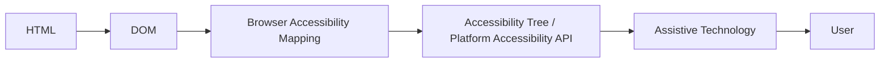

This is deliberately simplified.

Not every DOM node appears meaningfully in the accessibility representation.

What matters is that information such as:

* role;
* accessible name;
* state;
* value;
* relationships

can be communicated to assistive technology.

Native HTML elements already provide many of these semantics. W3C guidance notes that browsers map native form controls and links into accessibility APIs with relevant roles, names, states, and values.

---

# 7. The Accessible Name

Suppose a screen-reader user encounters an input.

Knowing:

> “There is a text box.”

is often insufficient.

The user also needs to know:

> “What is this text box for?”

The **accessible name** helps answer that question.

Consider:

```html
<label for="full-name">
  Full name
</label>

<input
  id="full-name"
  name="fullName"
>
```

The label provides the input's accessible name.

Similarly:

```html
<button type="submit">
  Submit request
</button>
```

gets its accessible name from its text content.

And:

```html
<a href="/requests">
  My requests
</a>
```

uses the link's content as its accessible name.

W3C's accessibility guidance describes an accessible name as the programmatically determined label that communicates an element's purpose and helps distinguish it from other elements.

---

## Visible labels are valuable

This is preferable:

```html
<label for="email">
  Email address
</label>

<input
  id="email"
  name="email"
  type="email"
>
```

to relying on:

```html
<input
  type="email"
  placeholder="Email address"
>
```

A placeholder is not a robust replacement for a label.

It may disappear as the user types and may communicate different information.

Visible labels benefit many users, not only users of screen readers.

Explicit `<label for="...">` association also gives users a larger activation area for controls such as checkboxes and radio buttons. W3C recommends properly associated labels for form controls.

---

# 8. Keyboard Interaction Is Part of the Interface

A user may interact with the page using:

* mouse;
* touchscreen;
* keyboard;
* switch device;
* voice input;
* assistive technology;
* combinations of these.

A usable interface should not assume that every action begins with a mouse click.

Native HTML helps because interactive controls already participate in keyboard navigation.

---

## Focus

Keyboard users typically move among interactive elements through focus.

Elements such as:

* links;
* buttons;
* form controls

are normally focusable without extra markup.

Developers should avoid destroying this behavior.

For example:

```css
button:focus {
  outline: none;
}
```

can remove an important visible indication of the user's current location.

If the default focus appearance is replaced, the replacement should remain clearly visible.

---

## Focus order

The normal focus sequence should usually follow the logical document order.

A common warning sign is heavy use of:

```html
tabindex="5"
tabindex="10"
tabindex="20"
```

Positive tabindex values create a separate manual focus sequence that can become difficult to maintain.

A better document structure often removes the need.

`tabindex="-1"` has a different use: it can allow an element to receive programmatic focus without placing it in normal sequential keyboard navigation.

For example, after opening a client-side page or dialog, application logic may sometimes need to place focus deliberately.

We will revisit such patterns later.

---

# 9. Forms Are an Accessibility System, Not Just Input Boxes

Forms combine:

* semantics;
* labels;
* grouping;
* keyboard behavior;
* validation;
* error feedback;
* application data.

Chapter 8 will handle complex form architecture.

Here we establish the browser-level foundation.

---

## A basic form

```html
<form action="/requests" method="post">
  <div>
    <label for="service">
      Service
    </label>

    <select id="service" name="service" required>
      <option value="">
        Select a service
      </option>

      <option value="residence">
        Residence certificate
      </option>

      <option value="identity">
        Identity document
      </option>
    </select>
  </div>

  <div>
    <label for="details">
      Request details
    </label>

    <textarea
      id="details"
      name="details"
      required
    ></textarea>
  </div>

  <button type="submit">
    Submit request
  </button>
</form>
```

Even without JavaScript, this form already has substantial behavior.

---

## Native validation

HTML provides constraint attributes such as:

```html
required
```

```html
type="email"
```

```html
minlength="10"
```

```html
min="1"
```

```html
max="100"
```

and, where justified:

```html
pattern="..."
```

For example:

```html
<label for="email">
  Email address
</label>

<input
  id="email"
  name="email"
  type="email"
  required
>
```

The browser can participate in validation.

That does **not** remove the need for server-side validation.

Anything received by a server must still be treated as untrusted input.

Chapter 5 will examine runtime boundaries, and Chapter 13 will address security in greater depth.

---

## Group related controls

Suppose the user must choose one delivery method:

```html
<fieldset>
  <legend>Delivery method</legend>

  <label>
    <input
      type="radio"
      name="delivery"
      value="email"
    >
    Email
  </label>

  <label>
    <input
      type="radio"
      name="delivery"
      value="collection"
    >
    Collect in person
  </label>
</fieldset>
```

`<fieldset>` and `<legend>` communicate that the controls belong to one conceptual group. W3C's accessible-forms guidance specifically recommends `<fieldset>` and `<legend>` for grouped controls.

---

## Error association

Consider:

```html
<label for="national-id">
  National ID
</label>

<input
  id="national-id"
  name="nationalId"
  aria-describedby="national-id-help national-id-error"
  aria-invalid="true"
>

<p id="national-id-help">
  Enter the 12-digit number printed on your card.
</p>

<p id="national-id-error">
  National ID must contain 12 digits.
</p>
```

The visible label tells the user what the field is.

Additional text can describe requirements or errors.

`aria-describedby` can associate supplementary descriptive text with a control; it is intended for more verbose information than the control's concise accessible name.

We will revisit form error architecture later.

For now, remember:

> A red border alone is not a complete error message.

---

# 10. ARIA: Add Semantics Only When HTML Cannot Express Them

ARIA stands for **Accessible Rich Internet Applications**.

It provides roles, states, and properties that can communicate interface semantics that are not otherwise adequately expressed.

ARIA is valuable.

ARIA is also frequently overused.

W3C's first rule of ARIA is straightforward: if a native HTML element already provides the required semantics and behavior, use it instead of repurposing another element with ARIA.

---

## Roles

A role can communicate what an element represents.

For example:

```html
<div role="status">
  Request submitted successfully.
</div>
```

The role adds accessibility semantics.

But this:

```html
<div role="button">
  Save
</div>
```

does not magically make the element behave like a complete native button.

ARIA can communicate semantics.

It does not automatically provide all native browser behavior.

---

## States and properties

ARIA can communicate information such as:

```html
aria-expanded="true"
```

```html
aria-selected="false"
```

```html
aria-invalid="true"
```

```html
aria-describedby="error-message"
```

These are useful when building interface patterns whose state needs to be exposed.

But ARIA values must remain synchronized with the actual interface.

An element saying:

```html
aria-expanded="false"
```

while visibly displaying expanded content creates conflicting information.

---

## ARIA can make good HTML worse

Consider:

```html
<button role="heading">
  Submit
</button>
```

The developer has overwritten the button's natural semantics with something inappropriate.

Or:

```html
<h2 aria-level="5">
  Applications
</h2>
```

when no unusual accessibility problem requires it.

Native document structure can usually communicate the correct hierarchy more reliably.

ARIA should solve a semantic gap—not create a second competing semantic system.

W3C guidance likewise recommends native HTML equivalents whenever practical instead of unnecessary structural ARIA roles.

---

# 11. Internationalization Begins in HTML

An interface can be structurally semantic and technically accessible yet still mishandle human language.

Internationalization is often postponed until late in development:

> We'll translate it later.

But language affects:

* text direction;
* pronunciation;
* formatting;
* layout;
* typography;
* user input;
* search;
* routing;
* component architecture.

Some of these concerns begin directly in HTML.

---

## Declare the document language

For an English page:

```html
<html lang="en">
```

For Arabic:

```html
<html lang="ar" dir="rtl">
```

For Central Kurdish/Sorani content:

```html
<html lang="ckb" dir="rtl">
```

The language declaration can help user agents and assistive technologies process content appropriately.

If a portion of the page switches language, mark that change.

```html
<p lang="en">
  Application approved.
</p>

<p lang="ckb" dir="rtl">
  داواکارییەکەت پەسەند کرا.
</p>
```

Language and direction are related, but they are not the same thing.

---

# 12. Language Does Not Automatically Determine Direction

A particularly important point is:

```html
lang="ar"
```

does **not** automatically mean:

```html
dir="rtl"
```

The `lang` attribute declares language.

The `dir` attribute declares base text direction.

MDN explicitly notes that `lang` does not imply base direction and recommends explicit direction information, particularly for RTL documents.

So a primarily RTL document should state both:

```html
<html lang="ckb" dir="rtl">
```

---

## `dir="ltr"`

Left-to-right base direction:

```html
<p dir="ltr">
  Request ID: SR-1042
</p>
```

## `dir="rtl"`

Right-to-left base direction:

```html
<p lang="ckb" dir="rtl">
  ژمارەی داواکاری: SR-1042
</p>
```

## `dir="auto"`

Sometimes the application does not know the direction in advance.

For user-generated content:

```html
<p dir="auto">
  ...
</p>
```

the browser can infer an appropriate base direction from the text.

MDN recommends `dir="auto"` for content whose direction is unknown, such as user input or external data.

---

# 13. Bidirectional Text Is More Than Alignment

Consider an RTL sentence containing:

* English product name;
* reference number;
* punctuation;
* Arabic-script text.

For example:

```text
داواکارییەکەی John42 ژمارەی SR-1042 ـە.
```

The browser is handling several directional runs simultaneously.

Simply writing:

```css
text-align: right;
```

does not solve bidirectional text semantics.

Text alignment and text direction are different concepts.

This is why direction should usually be expressed semantically through HTML rather than simulated only with CSS. MDN notes that directionality is related to content meaning and recommends HTML's `dir` attribute where possible.

---

## Isolating user-generated text with `<bdi>`

Suppose we display a list of usernames whose writing direction is unknown.

```html
<ul>
  <li>
    <bdi>John_42</bdi>: 12 requests
  </li>

  <li>
    <bdi>ڕۆژان</bdi>: 8 requests
  </li>

  <li>
    <bdi>علي</bdi>: 5 requests
  </li>
</ul>
```

`<bdi>` means **bidirectional isolate**.

It helps isolate the directionality of its content from surrounding text.

This is particularly useful for:

* usernames;
* titles;
* external data;
* user-generated text

whose direction is not known in advance. MDN explains that `<bdi>` is designed for exactly this kind of mixed-direction isolation and behaves as though `dir="auto"` were used when direction is unspecified.

---

## `<bdo>` deliberately overrides direction

`<bdo>` means **bidirectional override**.

For example:

```html
<bdo dir="rtl">
  ABC123
</bdo>
```

It forces text rendering direction rather than merely establishing a base direction.

This is far less commonly needed.

It should be used only when intentionally overriding the text's normal directional behavior.

A useful distinction is:

```text
dir     → establish base direction
bdi     → isolate unknown directional content
bdo     → deliberately override direction
```

---

# 14. RTL Is Not “Mirror Everything”

Supporting RTL interfaces does not mean taking an LTR screenshot and horizontally flipping it.

Some things should follow writing direction:

* navigation flow;
* text alignment where appropriate;
* spacing relationships;
* previous/next directional cues in some contexts.

Other things may remain unchanged:

* media playback icons;
* certain charts;
* clocks;
* logos;
* numerical or technical content depending on context.

Chapter 3 will examine CSS logical properties such as:

```css
margin-inline-start
padding-inline-end
inset-inline-start
```

which help components adapt to writing direction without maintaining separate left/right styles.

For Chapter 2, the important principle is:

> Direction is part of the content model, not merely a visual theme.

---

# 15. The DOM: HTML Becomes a Live Tree

Chapter 1 introduced the DOM as the browser's runtime representation of the document.

Now we will use it directly.

Consider:

```html
<main id="services">
  <h1>Citizen Services</h1>

  <section>
    <h2>Documents</h2>

    <button type="button">
      Show services
    </button>
  </section>
</main>
```

A simplified DOM representation is:

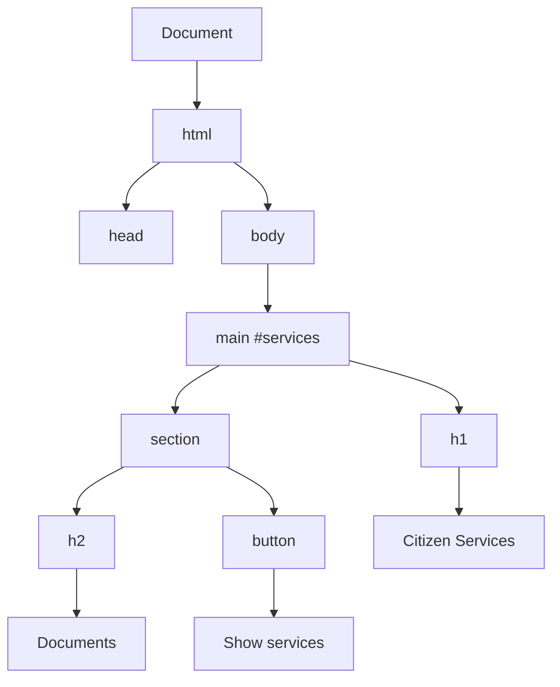

Notice that the tree contains more than elements.

Text itself appears as text nodes.

The DOM is a tree of **nodes**.

---

# 16. Nodes and Elements

An **Element** is one type of DOM node.

Other node types include:

* `Document`;
* text nodes;
* comments;
* document fragments.

For example:

```html
<h1>Citizen Services</h1>
```

conceptually contains:

```text
Element: h1
└── Text: "Citizen Services"
```

This distinction matters when traversing the DOM.

---

# 17. Querying the DOM

JavaScript can find elements using methods such as:

```js
const heading =
  document.querySelector("h1");
```

or:

```js
const forms =
  document.querySelectorAll("form");
```

Selectors can be more specific:

```js
const requestForm =
  document.querySelector("#request-form");
```

```js
const submitButton =
  document.querySelector(
    '#request-form button[type="submit"]'
  );
```

The important goal is not to create extremely clever selectors.

Prefer selectors that remain understandable and maintainable.

---

## `querySelector()` versus `querySelectorAll()`

`querySelector()` returns the first matching element or `null`.

```js
const main = document.querySelector("main");
```

`querySelectorAll()` returns all matching elements in a static `NodeList`.

```js
const buttons =
  document.querySelectorAll("button");
```

which can be iterated:

```js
for (const button of buttons) {
  console.log(button.textContent);
}
```

---

# 18. Traversing Relationships

The DOM tree allows us to move among related elements.

For example:

```js
element.parentElement
```

```js
element.children
```

```js
element.firstElementChild
```

```js
element.nextElementSibling
```

Methods such as:

```js
element.closest("section")
```

can be particularly useful.

Suppose a button sits inside a request row.

Instead of relying on deeply nested parent traversal, we might write:

```js
const row =
  button.closest("[data-request-id]");
```

This says:

> Find the nearest ancestor representing a request.

That expresses intent more clearly.

---

# 19. Creating and Inserting Elements

The DOM can be changed programmatically.

```js
const message =
  document.createElement("p");

message.textContent =
  "Your request was submitted.";

document
  .querySelector("#status")
  .append(message);
```

The steps are:

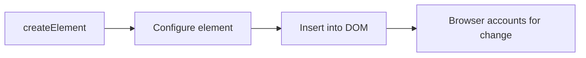

Other useful methods include:

```js
append()
prepend()
before()
after()
replaceWith()
replaceChildren()
remove()
```

---

## Prefer safe text insertion for untrusted text

Suppose a user enters:

```text
<script>...</script>
```

and we merely want to display those characters as text.

This is safe for that purpose:

```js
output.textContent = userInput;
```

Be much more careful with:

```js
output.innerHTML = userInput;
```

because HTML parsing changes the security model.

Chapter 13 will examine XSS properly.

For now, remember:

> If you want text, insert text—not HTML.

---

# 20. Attributes and Properties Are Related but Not Identical

Consider:

```html
<input
  id="full-name"
  value="Initial Name"
>
```

JavaScript can inspect the attribute:

```js
input.getAttribute("value");
```

and the property:

```js
input.value;
```

Initially they may appear equivalent.

But after the user edits the field, the live property can represent the current state while the original content attribute may still represent the initial/default value.

This distinction is important.

HTML attributes initialize and describe markup.

DOM properties represent the live JavaScript-facing state of objects.

The mapping is not always one-to-one.

---

## Boolean state is especially important

Consider:

```html
<input
  type="checkbox"
  checked
>
```

JavaScript can inspect:

```js
checkbox.checked
```

as the live checked state.

Application code should generally use the relevant DOM property when working with live control state.

---

# 21. The Event System Connects Users to the DOM

A static DOM is not enough for an interactive application.

Users:

* click;
* type;
* submit;
* focus;
* select;
* scroll;
* drag;
* touch;
* navigate.

The browser represents many of these occurrences as **events**.

For example:

```js
const button =
  document.querySelector("#refresh");

button.addEventListener("click", () => {
  console.log("Refresh requested");
});
```

The browser calls the handler when the event occurs.

But events do more than simply appear on one element.

They participate in DOM structure.

---

# 22. Event Propagation

Consider:

```html
<main>
  <section>
    <button>
      Submit
    </button>
  </section>
</main>
```

A click originates around the button, but the event can travel through ancestors.

A simplified model is:

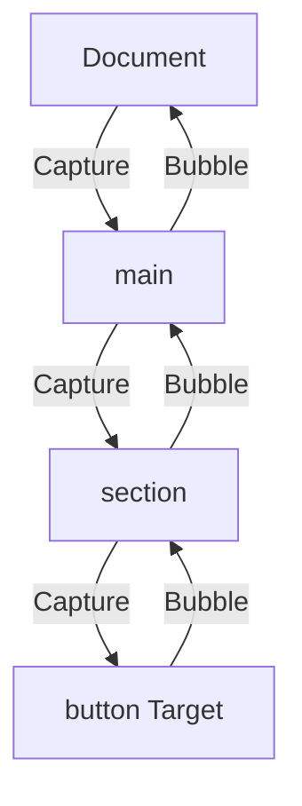

The three useful conceptual stages are:

1. capturing;
2. target;
3. bubbling.

Not every event bubbles, but many commonly used interface events do.

MDN exposes an event's `bubbles` property specifically to indicate whether it propagates upward through the DOM tree.

---

# 23. `event.target` and `event.currentTarget`

Suppose:

```html
<button id="save">
  <span>Save request</span>
</button>
```

and:

```js
const button =
  document.querySelector("#save");

button.addEventListener("click", event => {
  console.log(event.target);
  console.log(event.currentTarget);
});
```

If the user clicks the `<span>`, then:

`event.target`

may be the `<span>` where the event originated.

`event.currentTarget`

is the `<button>` whose listener is currently executing.

This distinction becomes especially important in event delegation.

---

# 24. Default Actions and Propagation Are Different Things

A link has a default action:

```html
<a href="/services">
  Services
</a>
```

Clicking it normally navigates.

JavaScript can call:

```js
event.preventDefault();
```

to prevent the default action when appropriate.

That is different from:

```js
event.stopPropagation();
```

which stops the event from continuing through the propagation path.

MDN explicitly distinguishes `stopPropagation()` from `preventDefault()`: stopping propagation does not itself cancel the browser's default action.

Do not use either automatically.

Ask why the browser's normal behavior needs to be changed.

---

# 25. Event Delegation

Suppose we render 500 request rows:

```html
<ul id="requests">
  <li data-request-id="SR-1001">
    Residence certificate
    <button data-action="view">
      View
    </button>
  </li>

  <li data-request-id="SR-1002">
    Identity document
    <button data-action="view">
      View
    </button>
  </li>

  ...
</ul>
```

One approach is:

```js
const buttons =
  document.querySelectorAll(
    "#requests button"
  );

for (const button of buttons) {
  button.addEventListener(
    "click",
    handleView
  );
}
```

That may work.

But bubbling allows another architecture:

```js
const requests =
  document.querySelector("#requests");

requests.addEventListener("click", event => {
  const button =
    event.target.closest(
      'button[data-action="view"]'
    );

  if (!button) {
    return;
  }

  const request =
    button.closest("[data-request-id]");

  console.log(
    request.dataset.requestId
  );
});
```

Now the parent listens once.

When a relevant descendant is clicked, the handler determines what happened.

Conceptually:

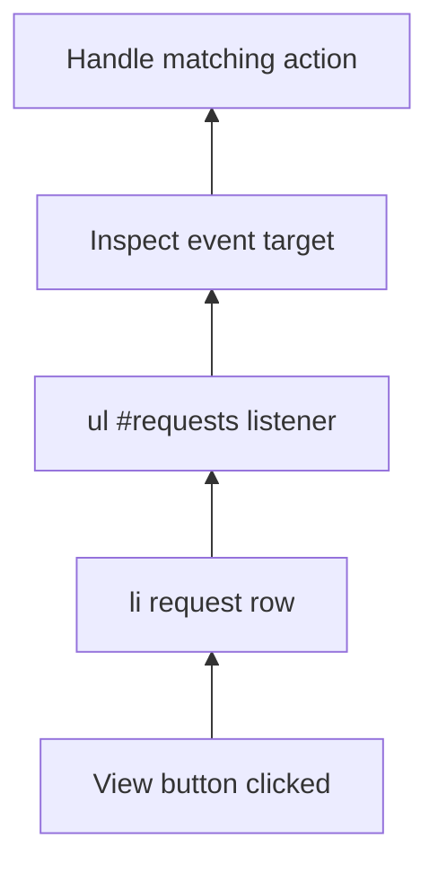

This is **event delegation**.

It can be particularly useful for:

* large collections;
* dynamically inserted elements;
* repeated controls.

Do not interpret this as:

> One listener is always better than many.

Use delegation where the event structure naturally supports it.

---

# 26. A Multilingual Service Interface

We can now combine semantics, accessibility, directionality, DOM interaction, and events.

Consider:

```html
<!doctype html>

<html lang="en" dir="ltr">
  <head>
    <meta charset="utf-8">

    <title>
      Citizen Services
    </title>
  </head>

  <body>
    <header>
      <a href="/">
        Citizen Services
      </a>

      <nav aria-label="Primary">
        <a href="/services">
          Services
        </a>

        <a href="/requests">
          My requests
        </a>
      </nav>
    </header>

    <main>
      <h1>Citizen Services</h1>

      <section aria-labelledby="new-request-heading">
        <h2 id="new-request-heading">
          New request
        </h2>

        <form id="request-form">
          <div>
            <label for="service">
              Service
            </label>

            <select
              id="service"
              name="service"
              required
            >
              <option value="">
                Select a service
              </option>

              <option value="residence">
                Residence certificate
              </option>

              <option value="identity">
                Identity document
              </option>
            </select>
          </div>

          <div>
            <label for="details">
              Details
            </label>

            <textarea
              id="details"
              name="details"
              required
            ></textarea>
          </div>

          <button type="submit">
            Submit request
          </button>
        </form>

        <p
          id="form-status"
          role="status"
        ></p>
      </section>

      <section aria-labelledby="requests-heading">
        <h2 id="requests-heading">
          Recent requests
        </h2>

        <table>
          <caption>
            Your most recent requests
          </caption>

          <thead>
            <tr>
              <th scope="col">
                Reference
              </th>

              <th scope="col">
                Service
              </th>

              <th scope="col">
                Status
              </th>
            </tr>
          </thead>

          <tbody id="request-rows">
            <tr>
              <td>
                <a href="/requests/SR-1042">
                  SR-1042
                </a>
              </td>

              <td>
                Residence certificate
              </td>

              <td>
                Processing
              </td>
            </tr>
          </tbody>
        </table>
      </section>

      <section
        lang="ckb"
        dir="rtl"
        aria-labelledby="kurdish-help"
      >
        <h2 id="kurdish-help">
          یارمەتی
        </h2>

        <p>
          بۆ زانیاری زیاتر پەیوەندی بکە.
        </p>
      </section>
    </main>

    <footer>
      <p>
        City Services Department
      </p>
    </footer>
  </body>
</html>
```

This page is not “accessible” merely because it contains semantic HTML.

Accessibility is broader than markup alone.

But semantic HTML has given us a much stronger starting point.

---

# 27. DOM Interaction with the Service Interface

We can add a small interaction:

```js
const form =
  document.querySelector(
    "#request-form"
  );

const status =
  document.querySelector(
    "#form-status"
  );

form.addEventListener(
  "submit",
  event => {
    event.preventDefault();

    status.textContent =
      "Your request is ready to be submitted.";
  }
);
```

Several concepts now connect.

The `<form>` has native semantics.

The submit button participates in form behavior.

A submit event reaches JavaScript.

JavaScript prevents actual navigation only because our demonstration is not yet connected to a server.

Then JavaScript updates the DOM.

The status region already has meaningful semantics:

```html
role="status"
```

so assistive technology can potentially expose relevant updates without us creating a completely custom interaction model.

Chapter 9 will eventually replace this demonstration with proper server communication.

---

# 28. Web Components: Extending HTML

So far we have used HTML elements defined by the platform:

```html
<button>
<nav>
<table>
<form>
```

The Web Components platform makes it possible to define reusable custom elements.

For example:

```html
<service-alert>
  Office closes at 3:00 PM today.
</service-alert>
```

The browser does not natively provide a `<service-alert>` element.

We can define one.

Web Components are not one single API. They are a family of related platform capabilities, especially:

* Custom Elements;
* Shadow DOM;
* templates;
* slots.

MDN describes Web Components using these same major mechanisms.

Our objective here is to understand where they fit.

We are **not** building a production Web Components architecture.

---

# 29. Custom Elements

A simple custom element can be defined like this:

```js
class ServiceAlert
  extends HTMLElement {

  connectedCallback() {
    if (this.dataset.ready) {
      return;
    }

    this.dataset.ready = "true";

    const strong =
      document.createElement("strong");

    strong.textContent =
      "Important: ";

    this.prepend(strong);
  }
}

customElements.define(
  "service-alert",
  ServiceAlert
);
```

Then HTML can use:

```html
<service-alert>
  Office closes at 3:00 PM today.
</service-alert>
```

The custom element becomes another DOM element with custom behavior.

Custom elements are registered through the browser's `CustomElementRegistry`, normally via `customElements.define()`.

---

# 30. Shadow DOM

Suppose a reusable component contains:

```html
<button>
  Close
</button>
```

and the host page contains global CSS:

```css
button {
  background: red;
}
```

A reusable component may not want arbitrary page CSS to unintentionally alter its internal implementation.

Shadow DOM provides a form of DOM and style encapsulation.

Conceptually:

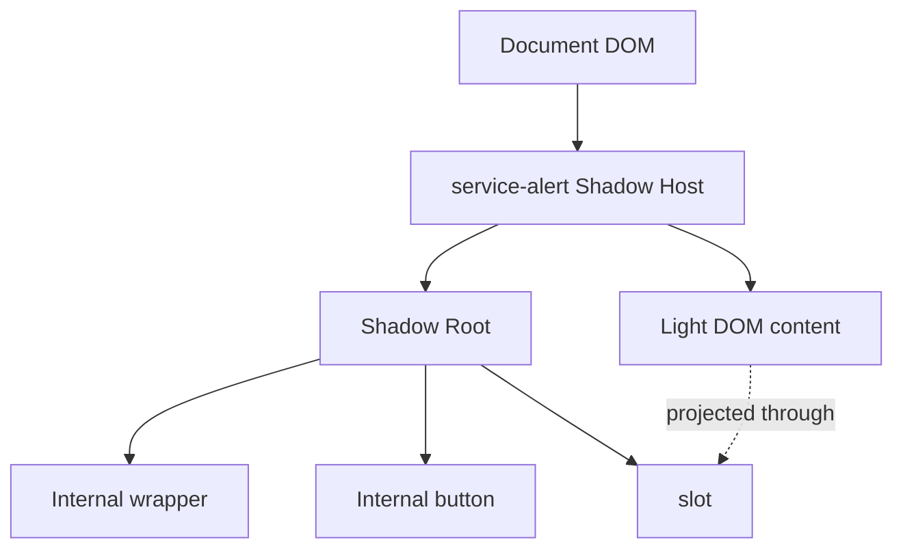

A component might create an open shadow root:

```js
class ServiceAlert
  extends HTMLElement {

  constructor() {
    super();

    const shadow =
      this.attachShadow({
        mode: "open"
      });

    const wrapper =
      document.createElement("div");

    const slot =
      document.createElement("slot");

    wrapper.append(slot);
    shadow.append(wrapper);
  }
}

customElements.define(
  "service-alert",
  ServiceAlert
);
```

MDN describes Shadow DOM as attaching an encapsulated DOM tree to an element so that component internals are protected from accidental page-level CSS and DOM interference.

This is **encapsulation**, not a general-purpose security boundary.

Do not store secrets in Shadow DOM and assume they are hidden from the user.

---

# 31. Slots

A slot defines where external content can appear inside a component's internal template.

For example, a component could expose:

```html
<service-card>
  <span slot="title">
    Residence certificate
  </span>

  Apply for proof of residence.
</service-card>
```

Inside its shadow tree:

```html
<article>
  <h2>
    <slot name="title"></slot>
  </h2>

  <div>
    <slot></slot>
  </div>
</article>
```

The named slot receives:

```html
<span slot="title">
```

while the unnamed slot receives remaining content.

MDN defines `<slot>` as a placeholder inside a Web Component that can be filled with markup supplied by the component's user.

---

# 32. Web Components Do Not Replace Semantic HTML

The ability to invent:

```html
<service-action>
```

does not mean semantics cease to matter.

If the component performs a button action, its internal implementation still needs appropriate interaction semantics.

If it contains a heading, that heading still affects document accessibility.

If it displays multilingual content, `lang` and `dir` still matter.

If it creates controls, they still need accessible names.

Web Components extend the web platform.

They do not suspend its rules.

That is why this book introduces semantics *before* components.

---

# 33. Putting the Chapter Together

We can now see the full relationship:

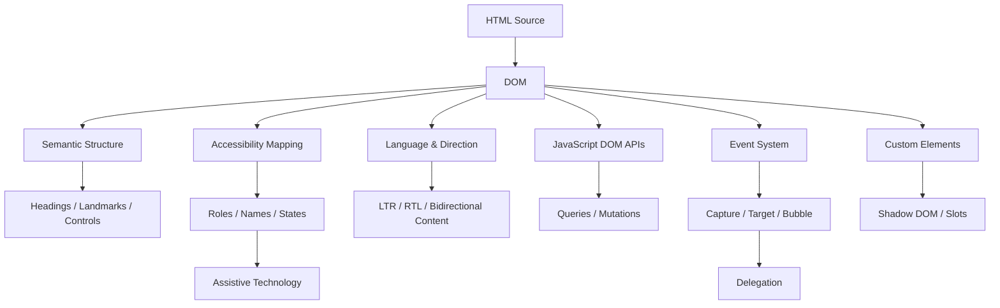

These are not isolated technologies.

They are different ways of interpreting and interacting with one document model.

The browser uses semantics to provide behavior.

Accessibility systems use semantics to expose meaning.

Internationalization information changes how content should be interpreted.

JavaScript treats the document as a live tree.

Events flow through that tree.

Web Components create new reusable structures inside it.

---

# 34. Misconceptions to Leave Behind

## “If it looks like a heading, it is a heading.”

No.

Appearance is CSS.

A heading needs heading semantics.

---

## “A `<div>` can replace any HTML element.”

Visually, perhaps.

Semantically and behaviorally, no.

Generic elements do not automatically acquire native semantics and behavior because they have the same CSS.

---

## “ARIA makes custom controls accessible.”

ARIA can communicate semantics and state.

It does not automatically implement:

* keyboard behavior;
* focus management;
* form behavior;
* event handling.

Native elements should normally be preferred when they solve the problem.

---

## “Placeholder text is a form label.”

No.

A persistent, programmatically associated label serves a different purpose.

Use `<label>` for ordinary form fields.

---

## “Accessibility means supporting screen readers.”

Screen readers are important, but accessibility also includes concerns involving:

* keyboard interaction;
* low vision;
* zoom;
* motor disabilities;
* cognitive accessibility;
* speech input;
* color perception;
* motion;
* and more.

This chapter introduces interface foundations, not the entire accessibility discipline.

---

## “RTL means align everything right.”

No.

Directionality affects the ordering and interpretation of text and layout relationships.

It is not merely `text-align: right`.

---

## “`lang="ar"` automatically gives the page RTL direction.”

No.

Language and direction should be expressed separately where needed.

---

## “DOM means HTML.”

No.

HTML is source markup.

The DOM is a live object model that can change after parsing.

---

## “Attributes and DOM properties are always identical.”

No.

Attributes represent markup-level information.

Properties can represent live runtime state.

---

## “`stopPropagation()` prevents the browser action.”

No.

It stops propagation.

`preventDefault()` deals with cancellable default browser behavior.

---

## “Every repeated element needs its own event listener.”

Not necessarily.

Bubbling makes event delegation possible.

---

## “Shadow DOM is a security feature.”

Not in the sense of protecting secrets from users or malicious code with broader page access.

It is primarily an encapsulation mechanism.

---

# Chapter Summary

HTML is not merely a syntax for placing content on a page.

It is a semantic language for describing interfaces.

A strong document begins with meaningful structure:

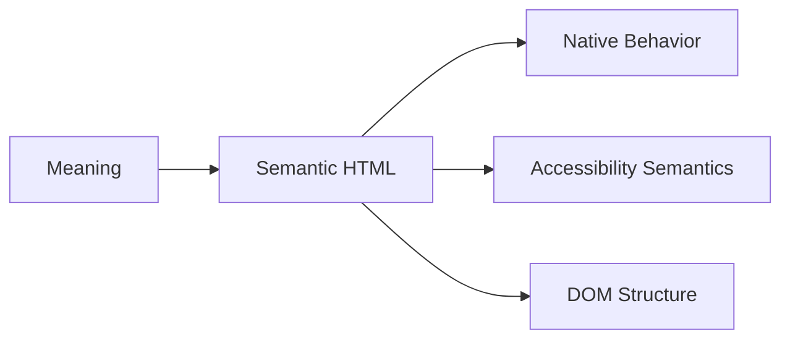

Headings express hierarchy.

Elements such as:

* `<main>`;
* `<nav>`;
* `<article>`;
* `<section>`;
* `<aside>`;
* `<header>`;
* `<footer>`

communicate document relationships when used appropriately.

Native controls such as buttons, links, inputs, checkboxes, and disclosure elements provide substantial browser behavior before JavaScript is added.

Accessibility begins with these architectural choices.

A simplified accessibility relationship is:

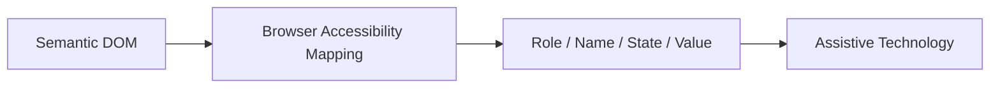

Accessible names communicate the purpose of interactive controls.

HTML labels, button text, link text, image alternatives, and ARIA naming mechanisms all participate depending on context.

ARIA is useful when native HTML cannot express the required semantics, but it should not replace suitable HTML merely because developers want custom markup.

Internationalization also begins at document level.

`lang` declares language.

`dir` establishes base direction.

`<bdi>` can isolate unknown directional content.

`<bdo>` deliberately overrides direction.

The browser transforms HTML into the DOM, a live tree of nodes.

JavaScript can:

* query it;
* traverse it;
* create nodes;
* insert content;
* remove content;
* update live properties.

Events connect user interaction with this tree.

A useful propagation model is:

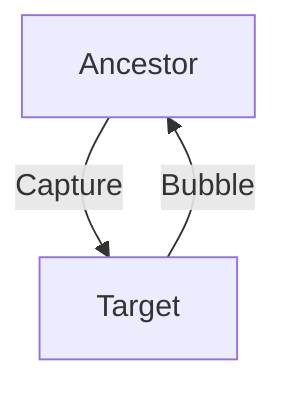

Bubbling makes event delegation possible.

Finally, Web Components extend the platform through:

* Custom Elements;
* Shadow DOM;
* templates;
* slots.

They provide reusable encapsulated structures, but they do not replace the need for correct semantics, accessibility, and internationalization.

The central lesson of this chapter is:

> **Meaning comes before styling and behavior.**

When the underlying document accurately describes the interface, the browser can do more work for us—and JavaScript has less broken behavior to reconstruct.

---

# Review Questions

1. What is the difference between semantic and presentational HTML?

2. Why should heading levels represent document hierarchy rather than visual size?

3. When is `<section>` more appropriate than `<div>`?

4. What is the difference between `<section>` and `<article>`?

5. Why should tables represent tabular data rather than page layout?

6. When should a button be used instead of a link?

7. What browser behavior would need to be recreated if a `<div>` were used as a custom button?

8. What is an accessible name?

9. How does a `<label>` contribute to the accessible name of a form control?

10. Why should placeholder text not replace an ordinary form label?

11. What is the first rule to consider before adding an ARIA role?

12. What is the difference between an ARIA role, state, and property?

13. Why can incorrect ARIA make otherwise useful HTML worse?

14. What is the difference between `lang` and `dir`?

15. When is `dir="auto"` useful?

16. What problem does `<bdi>` solve?

17. How does `<bdo>` differ from `<bdi>`?

18. What is the difference between a DOM node and an Element?

19. What is the difference between an HTML attribute and a live DOM property?

20. What are the capture, target, and bubble stages of event propagation?

21. What is the difference between `event.target` and `event.currentTarget`?

22. What is the difference between `preventDefault()` and `stopPropagation()`?

23. What is event delegation, and when can it be useful?

24. What problem do Custom Elements solve?

25. What kind of encapsulation does Shadow DOM provide?

26. What is the purpose of a `<slot>`?

---

# End-of-Chapter Practical Lab — Build a Semantic Multilingual Service Interface

Create the following project:

```text
chapter-02-semantics/
├── index.html
├── styles.css
└── app.js
```

The visual design is deliberately secondary.

The objective is to build a strong document and interaction model first.

## Stage 1 — Create the document hierarchy

Build a page containing:

* site header;
* primary navigation;
* main content;
* page heading;
* two service sections;
* footer.

Inspect the page with CSS disabled.

Ask:

> Does the document still make structural sense?

---

## Stage 2 — Add meaningful content structures

Add:

* one ordered list of application steps;
* one recent-requests table;
* one figure with caption;
* one secondary information aside.

Do not use tables for layout.

---

## Stage 3 — Build an accessible form

Create a request form containing:

* text input;
* email input;
* select;
* textarea;
* radio-button group;
* checkbox;
* submit button.

Every normal control should have an appropriate visible label.

Use:

```html
<fieldset>
<legend>
```

for the radio-button group.

Add native validation attributes where appropriate.

---

## Stage 4 — Test keyboard interaction

Navigate the interface without using the mouse.

Verify that:

* links receive focus;
* buttons receive focus;
* form controls receive focus;
* focus is visible;
* activation behaves as expected;
* focus order follows a logical sequence.

Record any part of the page that requires a mouse.

Fix it.

---

## Stage 5 — Add multilingual content

Add at least:

* one English region;
* one Sorani Kurdish or Arabic RTL region;
* one mixed-direction user-generated string.

Use appropriate:

```html
lang
dir
bdi
```

markup.

Do not solve direction only with CSS alignment.

---

## Stage 6 — Inspect the accessibility representation

Using the browser's accessibility tools where available, inspect several elements:

* page heading;
* navigation region;
* text input;
* checkbox;
* submit button;
* status region.

Identify:

* role;
* accessible name;
* state where applicable.

Compare a native button with a plain `<div>`.

---

## Stage 7 — Manipulate the DOM

Use JavaScript to:

* locate the form;
* create a status message;
* append a new request row;
* remove an item;
* change visible text safely with `textContent`.

Observe the resulting DOM using DevTools.

---

## Stage 8 — Add event delegation

Create several request items containing action buttons.

Instead of attaching an individual listener to every button, attach one listener to the containing list or table region.

Use:

```js
event.target.closest(...)
```

to identify the requested action.

Explain why the solution works in terms of event bubbling.

---

## Stage 9 — Create a small Web Component

Create:

```html
<service-alert>
```

with:

* Custom Element registration;
* Shadow DOM;
* one `<slot>`;
* minimal internal styling.

Keep the component simple.

The purpose is to demonstrate platform concepts, not to build a component framework.

---

## Stage 10 — Draw the architecture

Without referring to the chapter, produce a Mermaid diagram showing the relationship among:

* HTML;
* DOM;
* semantic elements;
* accessibility mapping;
* language/direction;
* JavaScript;
* events;
* Custom Elements;
* Shadow DOM.

If you can explain why those concepts belong in the same chapter, you have understood its central idea.

---

# Key Terms

**Semantic HTML** — HTML chosen according to the meaning and role of content rather than merely its visual appearance.

**Heading hierarchy** — the logical organization of content using `<h1>` through `<h6>`.

**Landmark** — a meaningful page region that can assist navigation, such as main content or navigation.

**Native control** — an interactive HTML element whose semantics and behavior are provided by the browser.

**Accessibility tree** — a conceptual representation of interface semantics exposed by the browser through accessibility APIs.

**Accessible name** — the programmatically determined label identifying an interface element to assistive technologies.

**ARIA** — Accessible Rich Internet Applications; a set of roles, states, and properties used to supplement accessibility semantics where necessary.

**Role** — accessibility semantics communicating what an interface element represents.

**State** — accessibility information that can change, such as expanded or selected.

**Property** — additional accessibility information describing an element or relationship.

**`lang`** — an HTML attribute declaring the language of content.

**`dir`** — an HTML attribute declaring base text direction.

**LTR** — left-to-right writing direction.

**RTL** — right-to-left writing direction.

**Bidirectional text** — content containing runs of text with different writing directions.

**`<bdi>`** — bidirectional isolate; isolates content whose direction may differ from its surroundings.

**`<bdo>`** — bidirectional override; explicitly overrides normal text direction.

**DOM** — the browser's live object representation of the document.

**Node** — a unit in the DOM tree, including elements, text, comments, and documents.

**Element** — a DOM node corresponding to an HTML or other markup element.

**Attribute** — markup-level information declared on an element.

**Property** — JavaScript-facing state or functionality of a DOM object.

**Event** — an object representing an occurrence such as a click, input, submission, or keyboard interaction.

**Event target** — the element where an event originated.

**Event propagation** — movement of an event through capturing, target, and bubbling stages.

**Event delegation** — handling descendant events through a listener placed on an ancestor.

**Default action** — browser behavior normally associated with an event, such as navigating when a link is activated.

**Custom Element** — a developer-defined HTML element registered through the Web Components APIs.

**Shadow DOM** — an encapsulated DOM subtree associated with a host element.

**Shadow host** — the element to which a shadow root is attached.

**Slot** — a placeholder inside a Web Component through which external content can be projected into its internal structure.

---

# Closing Perspective

A modern front-end interface begins before JavaScript.

Before state management, before component libraries, before client-side routing, and before frameworks, there is a document.

That document has structure.

It has language.

It has direction.

It contains controls.

It communicates meaning to the browser.

The browser turns it into a DOM.

Accessibility systems derive information from it.

Users interact with it.

Events travel through it.

JavaScript changes it.

Custom Elements can extend it.

When the document is poorly designed, later layers are forced to repair problems that did not need to exist.

A clickable `<div>` requires JavaScript to imitate a button.

Poor heading structure requires assistive technology users to decipher a page whose visual design may appear obvious to everyone else.

Missing text direction can make multilingual content confusing.

A badly chosen DOM structure can make event handling unnecessarily complicated.

Semantic HTML therefore is not “beginner material” that professional front-end developers graduate beyond.

It is part of the architecture of the application.

The more correctly we describe the interface to the browser, the less code we need to write to explain that interface again.
