# Chapter 3 — Modern CSS Architecture & Layout Systems

CSS is sometimes introduced as the part of web development that “makes HTML look good.”

That description becomes inadequate very quickly.

Modern CSS determines much more than colors and decoration. It controls:

* how elements participate in layout;
* how available space is distributed;
* how interfaces adapt to different screens and containers;
* how content responds to writing direction;
* how design decisions propagate through an application;
* how components interact with themes;
* how styles from multiple sources compete;
* and how a large front-end system remains maintainable.

In other words, CSS is both a **layout system** and an **architectural system**.

Consider a dashboard containing:

* navigation;
* a search area;
* summary cards;
* a product catalogue;
* action buttons;
* status indicators.

The interface might appear simple in a screenshot.

But its CSS must answer architectural questions:

> What happens when the page becomes narrow?

> What happens when a card appears in a narrow sidebar instead of the main content area?

> How should nested card content align when descriptions have different lengths?

> What happens when the interface switches from English to Sorani Kurdish or Arabic?

> Which styles should win when a third-party component library and our application both define rules?

> How can changing one design token update the entire application without searching through hundreds of declarations?

These are not merely styling questions.

They are system-design questions expressed through CSS.

Our progression in this chapter is:

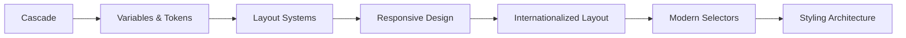

The goal is not to memorize hundreds of CSS properties.

It is to understand enough of the language's major systems that CSS becomes predictable rather than mysterious.

---

# 1. The Cascade Is the Foundation

The first letter in CSS stands for **Cascading**.

That is not historical trivia.

The cascade is the mechanism that allows many different style declarations to coexist and still produce one final value for each property on each element.

Consider:

```html
<button class="action primary">
  Submit request
</button>
```

and:

```css
button {
  background: gray;
}

.action {
  background: blue;
}

.primary {
  background: green;
}
```

Which background wins?

It is tempting to answer:

> The last one.

In this particular example, that happens to be true.

But source order is only one part of the cascade.

As applications grow, declarations may differ by:

* origin;
* importance;
* cascade layer;
* specificity;
* scope;
* source order.

A more useful mental model is that CSS progressively narrows competing declarations until one wins.

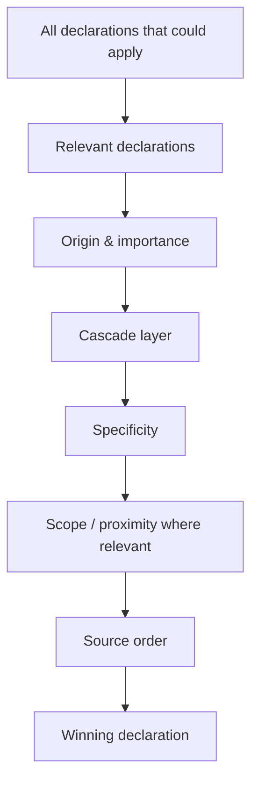

We do not need to memorize the entire CSS specification's cascade algorithm to work effectively.

We do need to understand why a declaration wins.

---

# 2. Browser, User, and Author Styles

A webpage does not begin with an empty styling system.

Browsers provide **user-agent styles**.

That is why an unstyled heading is usually:

* bold;
* larger than surrounding text;
* separated by margins.

A browser may conceptually provide something like:

```css
h1 {
  display: block;
  font-size: 2em;
  font-weight: bold;
}
```

The exact rules differ between browsers.

Users may also have their own styles or preferences.

Then the website's styles—the styles we write—belong to the **author origin**.

For everyday front-end work, most cascade conflicts occur among author styles, but remembering that author CSS is not the only source becomes important for accessibility and `!important`.

---

# 3. Inheritance

Some CSS properties naturally pass from ancestors to descendants.

For example:

```css
body {
  color: #222;
  font-family: system-ui, sans-serif;
}
```

means descendant text normally inherits those values.

We do not need to write:

```css
h1 {
  font-family: system-ui, sans-serif;
}

p {
  font-family: system-ui, sans-serif;
}

button {
  font-family: system-ui, sans-serif;
}
```

for every descendant simply because the same design language applies throughout the page.

Inheritance is part of CSS architecture.

It allows broad decisions to be made high in the tree and specialized where necessary.

But not every property inherits.

For example:

```css
margin
padding
border
width
```

normally do not inherit.

That makes sense.

If every child automatically inherited its parent's `margin: 2rem`, layout would quickly become chaotic.

A useful conceptual distinction is:

> Properties describing textual or inherited presentation often propagate naturally.

> Properties describing an element's own box geometry often do not.

Do not treat this as a rule without exceptions. Learn to check whether a property inherits when behavior is unclear.

---

# 4. Specificity: More Than a Score

Specificity answers a narrower question than many developers assume.

It does **not** determine the winner across every possible cascade conflict.

It matters only after declarations have already survived higher-level cascade decisions such as origin, importance, and layer precedence.

Consider:

```css
button {
  color: black;
}

.action {
  color: blue;
}
```

The class selector has greater specificity, so blue wins.

Now:

```css
#request-form button {
  color: red;
}

button.primary {
  color: green;
}
```

The first selector carries an ID selector, giving it stronger specificity.

This can become problematic when styles are written as progressively more powerful selectors merely to override earlier CSS.

A project may deteriorate into:

```css
button {
  ...
}

.card button {
  ...
}

.dashboard .card button {
  ...
}

#main-dashboard .card button.primary {
  ...
}
```

followed eventually by:

```css
color: blue !important;
```

At that point CSS feels unpredictable, but the real problem is usually architectural.

The stylesheet has become a specificity competition.

---

## Do not reduce specificity to arithmetic alone

Specificity can be represented by categories involving:

* IDs;
* classes, attributes, and pseudo-classes;
* element and pseudo-element selectors.

Understanding those categories is useful.

But the practical question is not:

> What is the largest specificity number I can create?

It is:

> Can I make the intended relationship obvious with low, controlled specificity?

For example:

```css
.product-card {
  ...
}

.product-card__title {
  ...
}

.product-card__action {
  ...
}
```

is often easier to reason about than repeatedly nesting selectors around page structure.

Modern tools such as cascade layers and `:where()` give us even better architectural control.

---

# 5. Source Order

When competing declarations have equal cascade position and specificity, later declarations usually win.

```css
.notice {
  color: blue;
}

.notice {
  color: green;
}
```

produces green text.

This is the simplest cascade case.

Unfortunately, many developers learn:

> “Last CSS wins.”

and assume this explains the entire cascade.

It does not.

Layers make that especially clear.

---

# 6. Cascade Layers: Controlling Precedence Architecturally

Large applications rarely contain CSS from one source.

A project may include:

* browser defaults;
* reset styles;
* third-party components;
* design-system styles;
* application components;
* utilities;
* local overrides.

Without architectural control, those styles all compete in the same author origin.

Cascade layers let us establish precedence intentionally.

Consider:

```css
@layer reset, vendor, base, components, utilities;
```

We have declared five layers in a specific order.

Later:

```css
@layer base {
  button {
    font: inherit;
  }
}

@layer components {
  .primary-button {
    background: navy;
  }
}

@layer utilities {
  .hidden {
    display: none;
  }
}
```

For **normal declarations**, later layers have greater precedence than earlier layers. Normal styles outside any layer have greater precedence than normal layered author styles.

That gives us a conceptual order:

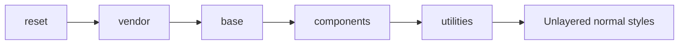

Later does not mean later in the physical file after the layer order has been established.

It means later in the declared **layer order**.

---

## Layer precedence comes before specificity

This is extremely important.

Suppose:

```css
@layer vendor, components;

@layer vendor {
  #application .card button.action {
    color: red;
  }
}

@layer components {
  .button {
    color: blue;
  }
}
```

The vendor selector looks dramatically more specific.

But the component rule is in a later layer.

For normal declarations, layer precedence is resolved before specificity within competing layers.

The blue component declaration can therefore win despite its lower specificity.

This is exactly why cascade layers are architecturally valuable.

Without layers, developers often try to defeat third-party CSS using increasingly complex selectors.

With layers, they can control the entire category's precedence.

---

# 7. Unlayered Styles and the Important Exception

Suppose:

```css
@layer components {
  .button {
    color: blue;
  }
}

.button {
  color: green;
}
```

For normal author declarations, the unlayered style wins over layered styles.

That sometimes leads to an oversimplified statement:

> “Unlayered styles always win.”

That is false.

The ordering reverses for `!important`.

For important declarations, layered important styles outrank unlayered important styles, and **earlier layers outrank later layers**. This reversal is deliberate and is part of CSS's protection model.

Suppose:

```css
@layer base, components;

@layer base {
  .button {
    color: black !important;
  }
}

@layer components {
  .button {
    color: blue !important;
  }
}

.button {
  color: green !important;
}
```

The important declaration from the earlier `base` layer has greater precedence than the later `components` layer and the unlayered important declaration.

Conceptually:

### Normal declarations

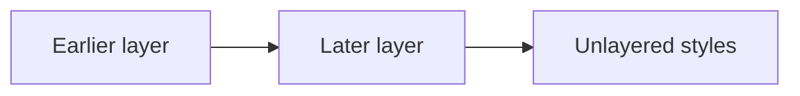

### Important declarations

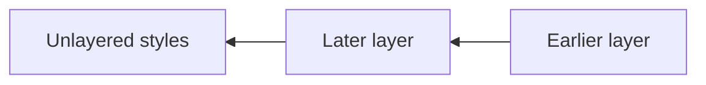

The diagram's reversed direction represents reversed layer precedence.

This reversal can seem strange at first.

It becomes useful when we think about defensive CSS.

A team might place foundational accessibility or reset protections in an early layer and mark only truly critical declarations important. The reversal makes it harder for later code to casually defeat them.

The real lesson is:

> Cascade layers are not just folders for CSS. They control precedence.

---

# 8. A Practical Layer Architecture

For our catalogue/dashboard project, we might begin with:

```css
@layer reset, base, theme, components, utilities;
```

Then:

```css
@layer reset {
  *,
  *::before,
  *::after {
    box-sizing: border-box;
  }

  body {
    margin: 0;
  }
}
```

```css
@layer base {
  body {
    font-family: system-ui, sans-serif;
    line-height: 1.5;
  }

  button,
  input,
  textarea,
  select {
    font: inherit;
  }
}
```

```css
@layer theme {
  :root {
    --color-surface: white;
    --color-text: #202124;
  }
}
```

```css
@layer components {
  .product-card {
    ...
  }
}
```

```css
@layer utilities {
  .visually-hidden {
    ...
  }
}
```

This does not mean every project needs exactly these layers.

The architectural benefit is that precedence is deliberate rather than accidental.

---

# 9. Custom Properties: Values That Participate in the Cascade

CSS custom properties are often introduced as “CSS variables.”

That is useful shorthand, but custom properties have behavior deeply connected to the cascade and inheritance.

Declare one:

```css
:root {
  --brand-color: #173b74;
}
```

Use it:

```css
.primary-button {
  background: var(--brand-color);
}
```

Custom properties can be scoped.

```css
.product-card {
  --card-accent: steelblue;
}
```

Descendants can use:

```css
.product-card__status {
  color: var(--card-accent);
}
```

Because custom properties participate in inheritance, a component can define a local value that affects its descendants.

---

# 10. Custom Properties Are More Than Find-and-Replace

Imagine hard-coded values:

```css
.header {
  background: #173b74;
}

.button {
  background: #173b74;
}

.link {
  color: #173b74;
}
```

A custom property centralizes the decision:

```css
:root {
  --color-brand: #173b74;
}
```

Then:

```css
.header {
  background: var(--color-brand);
}

.button {
  background: var(--color-brand);
}

.link {
  color: var(--color-brand);
}
```

But this still leaves a design question.

Is `#173b74` really one concept everywhere?

Suppose later the button requires a darker color than links.

If our token is:

```css
--blue-700: #173b74;
```

we have a raw palette value.

If we instead use:

```css
--color-action-primary: var(--blue-700);
```

we introduce semantic meaning.

That distinction leads to design tokens.

---

# 11. Raw Tokens and Semantic Tokens

A design system may begin with raw values:

```css
:root {
  --blue-100: #dbe9ff;
  --blue-500: #3367b1;
  --blue-700: #173b74;

  --gray-100: #f5f6f7;
  --gray-700: #40464d;
  --gray-900: #202124;

  --space-1: 0.25rem;
  --space-2: 0.5rem;
  --space-3: 0.75rem;
  --space-4: 1rem;
  --space-6: 1.5rem;

  --radius-small: 0.25rem;
  --radius-medium: 0.5rem;
}
```

Then semantic tokens can describe purpose:

```css
:root {
  --color-page-background: var(--gray-100);
  --color-surface: white;
  --color-text: var(--gray-900);
  --color-text-muted: var(--gray-700);

  --color-action-primary: var(--blue-700);
  --color-action-primary-hover: var(--blue-500);
}
```

Now components depend on meaning:

```css
.primary-button {
  background: var(--color-action-primary);
}
```

rather than on arbitrary palette choices.

A conceptual token chain is:

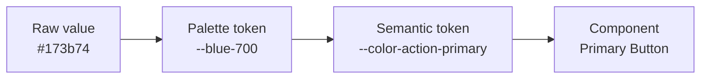

This becomes valuable for themes.

---

# 12. Theming with Custom Properties

Suppose the default theme contains:

```css
:root {
  color-scheme: light;

  --color-page-background: #f6f7f9;
  --color-surface: #ffffff;
  --color-text: #202124;
}
```

A dark theme might redefine the semantic tokens:

```css
[data-theme="dark"] {
  color-scheme: dark;

  --color-page-background: #15181c;
  --color-surface: #20252b;
  --color-text: #f4f5f6;
}
```

Components do not need separate dark-mode implementations:

```css
.product-card {
  background: var(--color-surface);
  color: var(--color-text);
}
```

The theme changes the variables upstream.

This is an architectural benefit.

Instead of:

```text
Theme knows every component
```

we aim for:

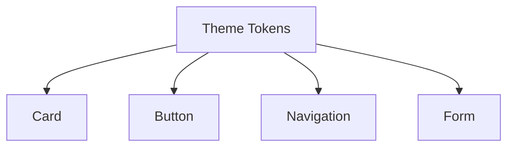

Components depend on a stable semantic token contract.

---

# 13. Normal Flow: The Layout System You Already Have

Before Flexbox and Grid, there is **normal flow**.

Block elements generally stack in the block direction.

Inline content flows in the inline direction.

For example:

```html
<h1>Products</h1>
<p>Browse available products.</p>
<p>Use filters to narrow the list.</p>
```

already has a functioning layout without:

```css
position: absolute;
```

or:

```css
display: flex;
```

This matters because beginners often start by trying to position every element manually.

A stronger principle is:

> Let normal flow solve the layout until you have a reason to introduce another layout system.

Normal flow provides:

* document order;
* natural content expansion;
* responsive behavior;
* a sensible baseline for accessibility.

Flexbox and Grid should enhance that flow, not compensate for a document that has been unnecessarily removed from it.

---

# 14. Positioning

CSS positioning can deliberately modify normal flow.

The major values include:

```css
position: static;
position: relative;
position: absolute;
position: fixed;
position: sticky;
```

We do not need to make positioning the centerpiece of modern layout because Flexbox and Grid now solve many problems that were historically attempted with absolute positioning.

But understanding the categories remains essential.

`relative` often establishes a positioning context.

`absolute` removes an element from normal flow and positions it relative to an appropriate containing block.

`fixed` can attach an element relative to the viewport or relevant containing context.

`sticky` behaves in normal flow until scroll conditions make it stick within its scroll context.

Use positioning for problems that are actually positional.

Do not construct entire page layouts through manually chosen coordinates.

---

# 15. Flexbox: Layout Along One Main Axis

Flexbox is particularly useful when the primary problem is distributing or aligning items along one dimension.

Suppose our toolbar contains:

```html
<div class="toolbar">
  <h2>Products</h2>

  <div class="toolbar__actions">
    <button>Filter</button>
    <button>Add product</button>
  </div>
</div>
```

CSS:

```css
.toolbar {
  display: flex;
  justify-content: space-between;
  align-items: center;
  gap: 1rem;
}
```

The main question is horizontal distribution.

Flexbox fits naturally.

---

## Main axis and cross axis

The terminology matters more than memorizing `row` as horizontal.

The **main axis** follows `flex-direction`.

The **cross axis** runs perpendicular to it.

```css
.toolbar {
  display: flex;
  flex-direction: row;
}
```

typically gives:

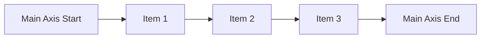

If:

```css
flex-direction: column;
```

the main axis changes.

This axis-based thinking becomes especially valuable for internationalized layouts.

---

# 16. Flex Sizing

Consider:

```css
.sidebar {
  flex: 0 0 16rem;
}

.content {
  flex: 1 1 auto;
}
```

These values relate to:

* growth;
* shrinkage;
* basis.

It is often enough to reason conceptually:

> Can this item grow?

> Can it shrink?

> What size does it begin from?

For example:

```css
.search {
  flex: 1;
}
```

allows the search area to consume remaining main-axis space.

Flexbox is excellent for:

* toolbars;
* navigation;
* button groups;
* form rows;
* vertically aligned stacks;
* small component layouts.

It is less convenient when many items must align simultaneously across rows and columns.

That is where Grid becomes more natural.

---

# 17. Grid: Two-Dimensional Layout

CSS Grid is designed for layouts where rows and columns matter together.

Suppose our dashboard contains:

* sidebar;
* primary content;
* summary cards.

A high-level page grid might be:

```css
.dashboard {
  display: grid;
  grid-template-columns: 16rem minmax(0, 1fr);
  gap: 1.5rem;
}
```

Conceptually:

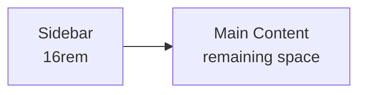

Within the content:

```css
.summary-grid {
  display: grid;
  grid-template-columns:
    repeat(
      auto-fit,
      minmax(min(16rem, 100%), 1fr)
    );
  gap: 1rem;
}
```

The browser can create as many columns as fit while respecting a useful minimum size.

This is dramatically different from manually calculating every breakpoint in JavaScript.

---

# 18. Grid Tracks

Grid creates **tracks**.

For example:

```css
.catalogue {
  display: grid;
  grid-template-columns:
    1fr 2fr 1fr;
}
```

creates three column tracks.

`fr` units distribute available space.

A more practical grid might use:

```css
grid-template-columns:
  minmax(12rem, 18rem)
  minmax(0, 1fr);
```

The first column has controlled flexibility.

The second consumes remaining space and is allowed to shrink below its content's intrinsic minimum where appropriate because of `minmax(0, 1fr)`.

This kind of sizing is one reason modern CSS layout should be understood rather than copied from snippets.

---

# 19. Intrinsic Sizing

Traditional layout thinking often starts with fixed numbers:

```css
width: 300px;
```

Modern CSS allows content itself to participate more directly in sizing decisions.

Important concepts include:

* `min-content`;
* `max-content`;
* `fit-content()`;
* `minmax()`.

---

## `min-content`

Conceptually, `min-content` asks:

> How narrow could this content become without avoidable overflow?

Text may wrap aggressively.

---

## `max-content`

Conceptually:

> How wide would the content prefer to be if wrapping were avoided?

---

## `fit-content()`

`fit-content()` allows content-based sizing while constraining growth.

For example:

```css
grid-template-columns:
  fit-content(16rem) 1fr;
```

This can be more robust than arbitrary fixed widths.

---

# 20. Alignment

Both Flexbox and Grid expose powerful alignment systems.

Common properties include:

```css
justify-content
align-items
align-content
justify-items
align-self
justify-self
```

Do not memorize them as:

> justify = horizontal
> align = vertical

That is often true in simple LTR row layouts but not universally.

Think in terms of:

* main/cross axes for Flexbox;
* inline/block axes and grid alignment for Grid.

This prepares us for writing-mode-independent CSS.

---

# 21. Grid or Flexbox?

A useful starting heuristic is:

> **Flexbox when the main problem is one-dimensional distribution.**

> **Grid when rows and columns need coordinated structure.**

But this is not a competition.

A Grid layout may contain Flexbox components.

A Flexbox toolbar may sit inside a Grid dashboard.

For example:

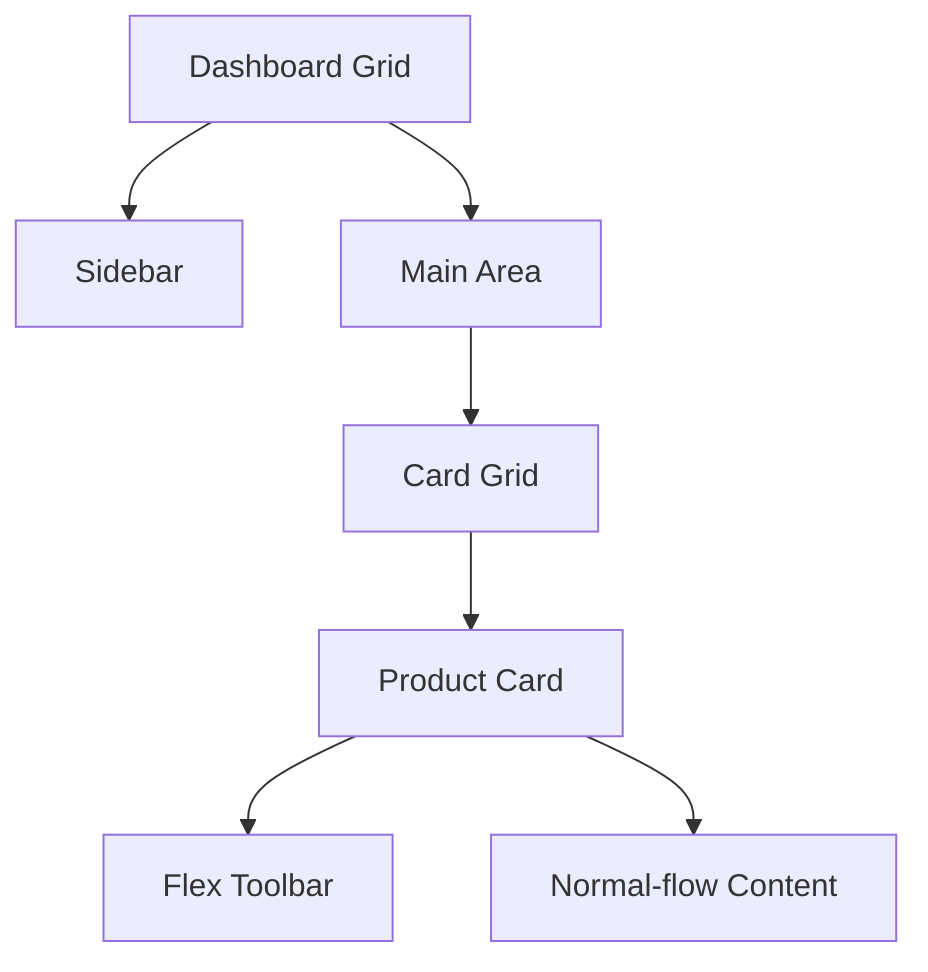

Modern layouts are often composed from several systems.

---

# 22. Nested Grids and Their Limitation

Suppose we have three product cards:

```html
<article class="product-card">
  <h2>Product A</h2>
  <p>Short description.</p>
  <p class="metadata">In stock</p>
  <button>View</button>
</article>
```

Each card can itself become a grid:

```css
.product-card {
  display: grid;
  grid-template-rows:
    auto
    1fr
    auto
    auto;
}
```

That works inside each card.

But each card creates an **independent grid**.

If one title wraps to two lines and another does not, internal rows across separate cards do not automatically align with one another.

We may end up with:

```text
Card A              Card B
Title                A much longer
Description          title wrapping
Metadata             Description
Button               Metadata
                     Button
```

Each card is internally correct, but the rows are not coordinated across cards.

---

# 23. Subgrid: Inheriting Grid Tracks

Subgrid solves a particular nested-alignment problem.

A nested grid can inherit track sizing from its parent rather than defining an independent set of tracks.

MDN describes `subgrid` as allowing a nested grid to use tracks established by its parent instead of creating independent track sizing.

For our catalogue:

```css
.product-grid {
  display: grid;
  grid-template-columns:
    repeat(
      auto-fit,
      minmax(16rem, 1fr)
    );

  grid-auto-rows: auto;
  gap: 1rem;
}
```

Each card:

```css
.product-card {
  display: grid;
  grid-row: span 4;

  grid-template-rows: subgrid;

  gap: 0;
}
```

Now each card spans four parent row tracks corresponding conceptually to:

1. title;
2. description;
3. metadata;
4. action.

A conceptual layout becomes:

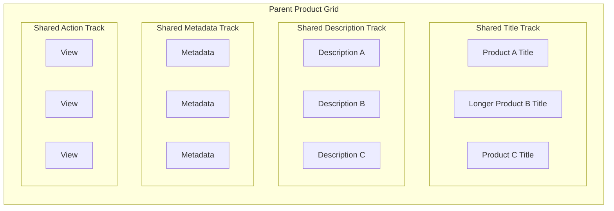

The important architectural idea is:

> Nested components can participate in parent grid alignment without JavaScript measuring heights.

That is a real use case for Subgrid.

It is not merely “another Grid feature.”

---

# 24. When Not to Use Subgrid

Subgrid is useful when nested content genuinely needs to share parent tracks.

If each nested component should control its own layout independently, an ordinary nested grid may be more appropriate.

Do not convert every nested grid into:

```css
grid-template-columns: subgrid;
```

because the feature exists.

Use it when alignment relationships cross component boundaries.

---

# 25. Responsive Design Is Not a List of Devices

Responsive design was once commonly taught as a collection of target widths:

```css
@media (max-width: 768px) {
  ...
}
```

```css
@media (max-width: 480px) {
  ...
}
```

Those values then became labels:

* desktop;
* tablet;
* mobile.

That model can still be useful at a broad level, but responsive design is stronger when it responds to **layout needs**, not assumed device categories.

Ask:

> At what width does this layout stop working well?

That point should motivate a breakpoint.

---

# 26. Begin with Fluid Layout

Before adding media queries, allow layout to respond naturally.

For example:

```css
.page {
  width: min(100% - 2rem, 80rem);
  margin-inline: auto;
}
```

This says:

* use available width;
* maintain side breathing room;
* stop growing after a useful maximum.

No breakpoint is needed.

Similarly:

```css
img {
  max-inline-size: 100%;
  block-size: auto;
}
```

allows images to shrink with their container.

Responsive CSS should not begin with twenty media queries.

It should begin with flexible defaults.

---

# 27. Media Queries: Responding to the Environment

Media queries apply rules according to characteristics of the viewport or device environment.

For example:

```css
.dashboard {
  display: block;
}

@media (min-width: 60rem) {
  .dashboard {
    display: grid;
    grid-template-columns:
      16rem minmax(0, 1fr);
  }
}
```

This is a useful page-level decision.

On narrower viewports, the sidebar can stack.

On wider viewports, it can become a persistent column.

Media queries can also respond to more than width, including capabilities and user preferences.

---

# 28. Container Queries: Responding to Component Space

Suppose a product card sometimes appears:

* in a full-width catalogue;
* inside a narrow dashboard panel;
* inside a sidebar;
* within a modal.

A viewport media query cannot directly tell the component how much space **it** has.

A 1400-pixel viewport does not guarantee that the card is wide.

The card may occupy a 280-pixel sidebar.

Container queries let a component respond to characteristics of a containing element rather than only to viewport dimensions.

First establish a query container:

```css
.catalogue-panel {
  container-type: inline-size;
}
```

Then:

```css
.product-card {
  display: grid;
  gap: 1rem;
}

@container (min-width: 32rem) {
  .product-card {
    grid-template-columns:
      8rem 1fr;
  }
}
```

Now the product card adapts according to the space available in its container.

---

# 29. Media Queries and Container Queries Solve Different Problems

A useful distinction is:

### Media query

> What is true about the viewport or device environment?

### Container query

> What is true about the space or state of this component's containing context?

Conceptually:

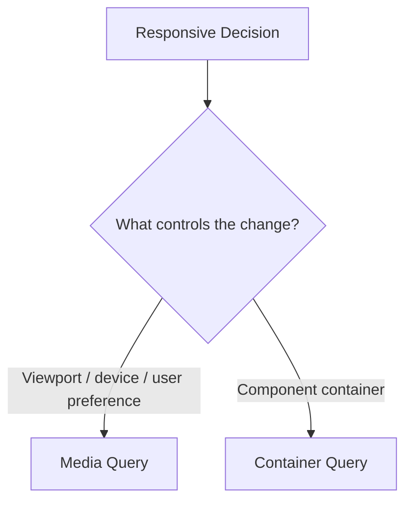

Container queries are **not** replacements for media queries.

Page-level navigation may depend on viewport space.

A reusable product card may depend on its own container.

Use the mechanism that corresponds to the actual relationship.

---

# 30. Named Containers

Large interfaces may contain multiple possible containers.

We can name one:

```css
.catalogue {
  container-name: product-area;
  container-type: inline-size;
}
```

or with the shorthand:

```css
.catalogue {
  container:
    product-area / inline-size;
}
```

Then target it:

```css
@container product-area (min-width: 50rem) {
  .product-card {
    ...
  }
}
```

Naming makes the relationship explicit.

The component does not simply respond to whichever query container happens to be nearest.

---

# 31. Container Query Units

Container-relative units allow values to relate to query-container dimensions.

For example:

```css
.product-card__title {
  font-size:
    clamp(
      1rem,
      3cqi,
      1.5rem
    );
}
```

The `cqi` unit relates to the container's inline size.

This can support component-level fluidity.

Do not use it merely to demonstrate clever CSS.

Use it when component scale should meaningfully depend on available container space.

---

# 32. Responsive Typography

Fixed typography:

```css
h1 {
  font-size: 48px;
}
```

may feel oversized in narrow layouts and modest on very large screens.

A fluid approach can use `clamp()`:

```css
h1 {
  font-size:
    clamp(
      2rem,
      1.4rem + 2vw,
      4rem
    );
}
```

This defines:

* minimum size;
* fluid preferred calculation;
* maximum size.

The type scales smoothly instead of jumping at many arbitrary breakpoints.

This does not mean every font size should be fluid.

Body text still needs sensible readability constraints.

---

# 33. Modern Viewport Units

Traditional:

```css
100vh
```

has historically caused difficulties on mobile browsers where browser UI changes the visible viewport.

Modern CSS provides several viewport-unit variants, including concepts such as:

* small viewport;
* large viewport;
* dynamic viewport.

For example:

```css
.hero {
  min-block-size: 100dvh;
}
```

can follow changes in dynamic viewport size.

These units are useful tools, not universal replacements for every `vh`.

Choose based on the desired behavior.

---

# 34. Responsive Images Are Part of Layout

A responsive interface should not load unnecessarily large image resources simply because CSS later shrinks them.

HTML provides responsive-image mechanisms such as:

```html

```

CSS still determines layout.

HTML helps the browser choose an appropriate image resource.

We will treat image optimization in more depth in Chapter 15.

For now, remember:

> Responsive layout and responsive resource selection are related but distinct problems.

---

# 35. CSS Has Logical Axes, Not Just Left and Right

In Chapter 2, we introduced document direction through:

```html
dir="ltr"
```

and:

```html
dir="rtl"
```

CSS should ideally respect those semantics.

Historically, developers wrote:

```css
.card {
  margin-left: 1rem;
  padding-right: 2rem;
}
```

Those are **physical** directions.

They refer to left and right regardless of language.

CSS logical properties let us express relationships according to the writing system.

For example:

```css
.card {
  margin-inline-start: 1rem;
  padding-inline-end: 2rem;
}
```

In an LTR horizontal writing mode:

```text
inline-start = left
inline-end   = right
```

In RTL:

```text
inline-start = right
inline-end   = left
```

The CSS does not need a second mirrored copy.

---

# 36. Inline and Block Axes

A useful mental model is:

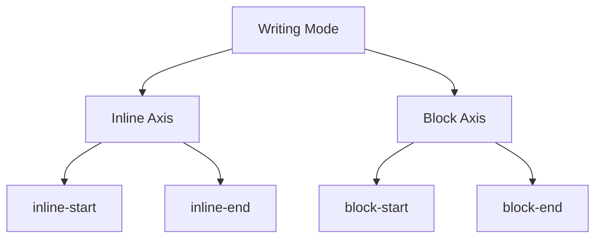

For English and Sorani Kurdish in their common horizontal writing modes:

* the block axis generally proceeds vertically;
* the inline direction differs.

English:

```text
inline-start → left
inline-end   → right
```

Sorani/Arabic:

```text
inline-start → right
inline-end   → left
```

This is why logical properties are more robust than hard-coded physical directions.

---

# 37. Logical Sizes

CSS also provides logical size properties.

Instead of:

```css
width: 100%;
height: 3rem;
```

we may use:

```css
inline-size: 100%;
block-size: 3rem;
```

Likewise:

```css
max-inline-size: 70rem;
min-block-size: 10rem;
```

Whether to use logical sizes everywhere depends on the project.

But understanding them is essential for writing systems that should adapt to different writing modes.

---

# 38. Direction-Independent Components

Suppose an alert icon should appear before text.

A physical implementation:

```css
.alert__icon {
  margin-right: 0.5rem;
}
```

works naturally in LTR.

In RTL, we may want the spacing on the opposite side.

A logical version:

```css
.alert__icon {
  margin-inline-end: 0.5rem;
}
```

works according to writing direction.

Similarly:

```css
.notification {
  border-inline-start:
    0.25rem solid
    var(--color-accent);
}
```

places the accent border on the logical starting side.

This is not merely a convenience.

It reduces duplicated RTL styles and makes direction support architectural rather than corrective.

---

# 39. Some Things Should Not Mirror

Logical CSS does not imply:

> Mirror every visual decision.

A media play icon may retain its familiar direction.

A company logo should not be reflected.

A graph's time axis may follow the data's intended semantics.

Certain technical strings remain LTR inside an RTL page.

Internationalization requires judgment.

The principle is:

> Encode relationships logically where direction should matter, and preserve physical orientation where direction should not matter.

---

# 40. Modern Selectors Help Express Relationships More Clearly

CSS selectors have evolved considerably.

Several modern selectors allow us to express patterns that previously required more markup, JavaScript, or highly repetitive CSS.

We will focus on practical uses rather than creating a selector encyclopaedia.

---

# 41. `:is()`: Group Alternatives

Suppose we write:

```css
.card h2,
.card h3,
.card h4 {
  line-height: 1.2;
}
```

We can express the shared structure as:

```css
.card :is(h2, h3, h4) {
  line-height: 1.2;
}
```

`:is()` is particularly useful when alternative selectors appear inside a more complex selector structure.

But remember that specificity behavior still matters.

Do not use it merely to make selectors look clever.

---

# 42. `:where()`: Match Without Adding Specificity

`:where()` looks similar to `:is()`:

```css
:where(h1, h2, h3) {
  margin-block-start: 0;
}
```

The crucial architectural feature is that `:where()` contributes zero specificity.

That makes it particularly useful for:

* base styles;
* resets;
* component defaults;
* rules designed to be easily overridden.

For example:

```css
@layer base {
  :where(
    button,
    input,
    textarea,
    select
  ) {
    font: inherit;
  }
}
```

Later component rules can override the defaults without entering a specificity contest.

---

# 43. `:has()`: Select Based on Relationships

`:has()` allows selection based on descendants or relative relationships.

Suppose a form group should look different when it contains an invalid input:

```css
.form-group:has(:invalid) {
  border-color: crimson;
}
```

Or a card containing a featured badge:

```css
.product-card:has(
  .product-card__badge--featured
) {
  outline:
    2px solid
    var(--color-featured);
}
```

Or a label wrapping a checked checkbox:

```css
.preference:has(
  input:checked
) {
  background:
    var(--color-selected);
}
```

This can eliminate JavaScript that exists only to add parent-state classes for styling.

But `:has()` should not become an excuse for excessively complicated relationship selectors.

The same maintainability principles still apply.

---

# 44. CSS Nesting

Component-oriented CSS often has related selectors.

Without nesting:

```css
.product-card {
  ...
}

.product-card__title {
  ...
}

.product-card__action {
  ...
}

.product-card__action:hover {
  ...
}
```

Nesting can express some relationships more locally:

```css
.product-card {
  ...

  .product-card__title {
    ...
  }

  .product-card__action {
    ...

    &:hover {
      ...
    }
  }
}
```

This can improve locality.

It can also recreate the old problem of deeply nested preprocessors if abused.

Avoid structures like:

```css
.dashboard {
  .main {
    .catalogue {
      .card {
        .content {
          .actions {
            button {
              ...
            }
          }
        }
      }
    }
  }
}
```

Deep DOM-shaped selectors create unnecessary coupling.

Nesting is syntax.

It is not an architecture.

---

# 45. User Preferences Are Part of Responsive Design

Responsive design is not only about dimensions.

Users may express preferences through their operating system or browser.

One important example is reduced motion.

```css
.card {
  transition:
    transform 200ms ease;
}

.card:hover {
  transform:
    translateY(-0.25rem);
}

@media (
  prefers-reduced-motion: reduce
) {
  .card {
    transition: none;
  }

  .card:hover {
    transform: none;
  }
}
```

The goal is not necessarily to remove every animation.

It is to avoid unnecessary motion that may cause discomfort or interfere with use.

This demonstrates a broader idea:

> Responsive design means responding to the user's environment and preferences, not only screen width.

---

# 46. Motion Should Communicate Something

Animation can help users understand:

* state changes;
* spatial relationships;
* entering/exiting content;
* progress;
* focus of attention.

Animation can also become decorative noise.

A useful motion architecture should answer:

> What does this transition communicate?

> Is the duration consistent?

> What happens for users requesting reduced motion?

For our purposes, working knowledge is sufficient.

Advanced animation design belongs outside this book's core scope.

---

# 47. From Stylesheets to Styling Architecture

So far, we have focused mostly on CSS itself.

Large applications introduce another question:

> How should CSS be organized?

There is no single correct answer.

Common approaches include:

* plain global CSS;
* component-oriented CSS;
* CSS Modules;
* utility-first CSS;
* CSS-in-JS.

Each solves some problems and introduces others.

The book should not declare one universal winner.

We should understand the trade-offs.

---

# 48. Plain CSS

Plain CSS is sometimes unfairly treated as a primitive approach.

Modern CSS now includes:

* layers;
* nesting;
* custom properties;
* Grid;
* Subgrid;
* container queries;
* logical properties;
* sophisticated selectors.

For many applications, well-architected plain CSS is entirely sufficient.

A possible structure:

```text
styles/
├── reset.css
├── tokens.css
├── base.css
├── layout.css
├── components/
│   ├── button.css
│   ├── product-card.css
│   └── form.css
└── utilities.css
```

Combined with cascade layers, this can remain predictable.

Benefits include:

* native platform behavior;
* no runtime styling library;
* minimal tooling requirements;
* portability.

Potential problems include:

* accidental global collisions;
* naming discipline;
* dead styles in large projects;
* unclear ownership without conventions.

Plain CSS is not automatically simple.

It still requires architecture.

---

# 49. Component-Oriented CSS

A component-oriented style may deliberately scope naming by convention:

```css
.product-card {
  ...
}

.product-card__title {
  ...
}

.product-card__price {
  ...
}

.product-card--featured {
  ...
}
```

The naming itself communicates ownership.

This resembles methodologies such as BEM without requiring the book to prescribe one complete methodology.

Advantages include:

* clear ownership;
* predictable selectors;
* low coupling to page structure.

The cost is naming verbosity.

For many teams, that trade is acceptable.

---

# 50. CSS Modules

CSS Modules usually transform locally scoped class names during the build process.

A component might import:

```js
import styles from "./ProductCard.module.css";
```

and use:

```jsx
<article className={styles.card}>
```

The author writes:

```css
.card {
  ...
}
```

but the build system produces a generated name that avoids ordinary global collisions.

The conceptual architecture is:

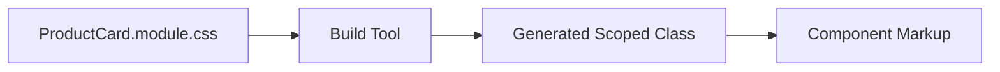

Advantages:

* local class scope;
* ordinary CSS semantics;
* good fit with component systems.

Costs:

* build-tool dependency;
* generated names can complicate some debugging;
* global tokens and shared rules still need architecture.

CSS Modules solve **name isolation**.

They do not solve every CSS design problem.

---

# 51. Utility-First CSS

A utility-first approach composes small classes directly in markup.

Conceptually:

```html
<button
  class="
    px-4
    py-2
    rounded
    font-semibold
  "
>
  Submit
</button>
```

Tailwind is a prominent example of this approach.

The architectural idea is not:

> CSS disappears.

Instead:

> Much of the design vocabulary is expressed through predefined utility classes applied in markup.

Potential benefits:

* rapid composition;
* constrained design vocabulary;
* reduced need to invent class names;
* styles remain close to markup.

Potential costs:

* visually dense class attributes;
* team dependence on the utility system;
* abstraction decisions move from stylesheets into markup/component composition;
* reusable patterns may still need extraction.

A utility-first architecture can be maintainable.

It can also become chaotic if every component contains long arbitrary combinations without design conventions.

The tool does not remove the need for architecture.

---

# 52. CSS-in-JS

CSS-in-JS refers to a family of approaches where styling is defined or generated through JavaScript or component tooling.

Historically, examples have included runtime-generated styles as well as build-time extracted approaches.

The category is therefore broad.

Possible motivations include:

* component-local styling;
* JavaScript-driven variants;
* shared values between component logic and styling;
* automatic scoping.

Potential costs can include:

* runtime work in some implementations;
* framework/tool coupling;
* server-rendering complexity;
* debugging indirection;
* increased dependency on build tooling.

Do not evaluate “CSS-in-JS” as though every library has identical runtime behavior.

The architecture depends heavily on the particular implementation.

---

# 53. Compare Problems, Not Fashion

Suppose a team asks:

> Should we use Tailwind, CSS Modules, or CSS-in-JS?

That question lacks context.

A better discussion asks:

* How large is the team?
* Are styles primarily global or component-local?
* Is runtime theming important?
* How much framework coupling is acceptable?
* Do we already have a design system?
* How should third-party CSS be controlled?
* What build tooling already exists?
* How easily should styles be overridden?
* How much runtime styling cost is acceptable?
* What conventions can the team reliably maintain?

Then architecture follows requirements.

---

# 54. A Practical Comparison

The same conceptual button could be expressed several ways.

## Plain component CSS

```html
<button class="primary-button">
  Submit
</button>
```

```css
.primary-button {
  padding:
    var(--space-2)
    var(--space-4);

  background:
    var(--color-action-primary);

  color: white;
}
```

## CSS Module

```jsx
<button className={styles.primaryButton}>
  Submit
</button>
```

## Utility-first

Conceptually:

```html
<button
  class="
    px-4
    py-2
    bg-brand
    text-white
  "
>
  Submit
</button>
```

The browser ultimately receives CSS.

What changes is:

* authoring model;
* naming;
* locality;
* tooling;
* reuse strategy.

That is the right level at which to compare styling architectures.

---

# 55. Building the Running Catalogue Interface

We can now combine the chapter's major ideas.

Our page contains:

```html
<div class="dashboard">
  <aside class="sidebar">
    ...
  </aside>

  <main class="main-content">
    <header class="toolbar">
      ...
    </header>

    <section class="catalogue">
      <div class="product-grid">
        ...
      </div>
    </section>
  </main>
</div>
```

A sensible stylesheet begins with cascade architecture:

```css
@layer
  reset,
  base,
  theme,
  layout,
  components,
  utilities;
```

---

## Tokens

```css
@layer theme {
  :root {
    --color-page:
      #f4f6f8;

    --color-surface:
      #ffffff;

    --color-text:
      #1f252c;

    --color-muted:
      #626d78;

    --color-action:
      #174b8c;

    --space-1:
      0.25rem;

    --space-2:
      0.5rem;

    --space-3:
      0.75rem;

    --space-4:
      1rem;

    --space-6:
      1.5rem;

    --radius:
      0.75rem;
  }

  [data-theme="dark"] {
    --color-page:
      #11161b;

    --color-surface:
      #1d242b;

    --color-text:
      #f4f6f8;

    --color-muted:
      #aab2bb;

    --color-action:
      #78aef2;
  }
}
```

Components consume semantic values.

---

## Page layout

```css
@layer layout {
  .dashboard {
    min-block-size: 100dvh;
  }

  @media (min-width: 60rem) {
    .dashboard {
      display: grid;

      grid-template-columns:
        16rem
        minmax(0, 1fr);
    }
  }
}
```

The narrow layout uses natural flow.

The wider layout introduces Grid only when needed.

---

## Toolbar

```css
@layer components {
  .toolbar {
    display: flex;

    align-items: center;
    justify-content:
      space-between;

    flex-wrap: wrap;

    gap:
      var(--space-4);
  }
}
```

Flexbox solves the one-dimensional distribution problem.

---

## Catalogue container

```css
@layer layout {
  .catalogue {
    container:
      catalogue / inline-size;
  }
}
```

Now product components can respond to available catalogue width.

---

## Product grid

```css
@layer components {
  .product-grid {
    display: grid;

    grid-template-columns:
      repeat(
        auto-fit,
        minmax(
          min(16rem, 100%),
          1fr
        )
      );

    gap:
      var(--space-4);
  }
}
```

---

## Product cards

```css
.product-card {
  display: grid;

  grid-template-rows:
    auto
    1fr
    auto
    auto;

  gap:
    var(--space-3);

  padding:
    var(--space-4);

  background:
    var(--color-surface);

  color:
    var(--color-text);

  border-radius:
    var(--radius);
}
```

If cross-card row alignment becomes a requirement, we can restructure the parent and use Subgrid rather than measuring content heights with JavaScript.

---

## Container adaptation

```css
@container catalogue (
  min-width: 45rem
) {
  .product-card--featured {
    grid-column:
      span 2;

    grid-template-columns:
      10rem
      1fr;
  }
}
```

The component responds to catalogue space.

Not merely viewport width.

---

## RTL-safe spacing

Instead of:

```css
.product-card__icon {
  margin-right: 0.5rem;
}
```

use:

```css
.product-card__icon {
  margin-inline-end:
    0.5rem;
}
```

Now the component naturally adapts to direction.

---

## Reduced motion

```css
.product-card {
  transition:
    transform 160ms ease,
    box-shadow 160ms ease;
}

.product-card:hover {
  transform:
    translateY(-0.2rem);
}

@media (
  prefers-reduced-motion: reduce
) {
  .product-card {
    transition: none;
  }

  .product-card:hover {
    transform: none;
  }
}
```

Now the interface responds not only to space, but also to user preferences.

---

# 56. CSS Architecture as a Dependency System

We can now see CSS architecture as several layers of dependency.

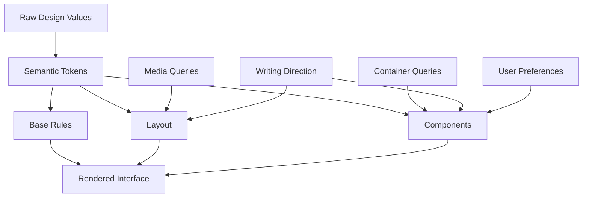

This perspective is more useful than viewing CSS as isolated selectors.

A change in one layer should propagate intentionally.

A design token changes theme values.

A container query adapts a component.

A media query changes page-level layout.

Direction changes logical relationships.

The cascade resolves competing declarations.

---

# 57. Misconceptions to Leave Behind

## “Specificity decides every CSS conflict.”

No.

Specificity is only one stage of the cascade.

Origin, importance, and layer precedence can resolve a conflict before specificity is compared.

---

## “The most specific selector is the best selector.”

No.

Excessive specificity increases coupling and makes future overrides harder.

Controlled low specificity is often easier to maintain.

---

## “Unlayered CSS always beats layered CSS.”

Only for normal declarations within the relevant author-origin context.

Important declarations reverse layer ordering, and layered important declarations outrank unlayered important declarations.

---

## “`!important` is simply the strongest possible CSS.”

No.

Its relationship with:

* origin;
* layers;
* inline styles;
* transitions

is more nuanced.

Treat it as part of the cascade model, not an emergency hammer.

---

## “Flexbox replaced Grid.”

No.

They solve overlapping but different layout problems.

They are often used together.

---

## “Grid replaced Flexbox.”

Also no.

A toolbar is often more naturally expressed with Flexbox.

A two-dimensional catalogue may be more naturally expressed with Grid.

---

## “Subgrid is just nested Grid.”

Not exactly.

An ordinary nested grid establishes independent tracks.

Subgrid allows nested grid items to participate in track sizing inherited from the parent grid.

---

## “Responsive design means phone, tablet, desktop.”

That is too narrow.

Responsive design adapts to:

* available space;
* component context;
* viewport characteristics;
* user preferences;
* content.

---

## “Container queries replace media queries.”

No.

Media queries respond to viewport/device conditions.

Container queries respond to containing contexts.

Use the one that matches the problem.

---

## “RTL means copy the stylesheet and swap every left/right.”

No.

Logical properties allow many relationships to follow writing direction automatically.

And not every visual should mirror.

---

## “CSS variables are just text substitution.”

No.

Custom properties participate in:

* inheritance;
* scope;
* cascade;
* runtime updates.

That makes them particularly valuable for tokens and themes.

---

## “CSS Modules solve CSS architecture.”

They solve one important problem: local name scoping.

They do not decide:

* token architecture;
* component boundaries;
* cascade strategy;
* responsive behavior;
* theming.

---

## “Utility-first CSS means there is no CSS architecture.”

No.

Architecture still exists.

Its decisions move into:

* utility definitions;
* design constraints;
* component composition;
* team conventions.

---

## “CSS-in-JS is one technology.”

No.

It describes a broad category containing approaches with very different build-time and runtime behavior.

Evaluate the actual implementation.

---

# Chapter Summary

Modern CSS is a system for managing relationships.

The cascade determines which declarations win.

A useful conceptual sequence is:

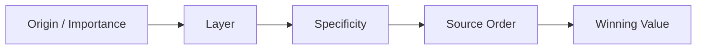

Cascade layers allow large applications to establish precedence intentionally.

For normal declarations:

```text
earlier layer
    <
later layer
    <
unlayered styles
```

For important declarations, layer ordering reverses.

Custom properties allow values to participate in:

* inheritance;
* cascade;
* scope;
* runtime theming.

Design tokens build abstraction on top of those capabilities.

Modern layout is composed from several systems.

Normal flow provides a robust default.

Flexbox is strong for one-dimensional distribution.

Grid coordinates rows and columns.

Subgrid allows nested grids to inherit parent tracks where cross-component alignment requires it.

Responsive design should begin with flexible layout rather than device labels.

Media queries respond to environmental and viewport conditions.

Container queries allow reusable components to respond to their containing context.

Logical properties help the same component adapt between LTR and RTL without maintaining mirrored stylesheets.

Selectors such as:

```css
:is()
:where()
:has()
```

allow relationships to be expressed more directly.

Native nesting can improve locality when used with restraint.

User-preference media queries remind us that responsiveness includes people, not only screens.

Finally, CSS organization can take many forms:

* plain CSS;
* component-oriented CSS;
* CSS Modules;
* utility-first CSS;
* CSS-in-JS.

The correct question is not:

> Which approach is universally best?

It is:

> Which approach gives this application and team the clearest ownership, lowest unnecessary complexity, and most predictable evolution?

The core principle of this chapter is therefore:

> **CSS should be designed as a system of controlled relationships, not accumulated as a sequence of overrides.**

---

# Review Questions

1. What does the cascade determine?

2. Why is specificity only one part of the cascade?

3. What is the practical difference between inheritance and the cascade?

4. Why can a lower-specificity selector in a later cascade layer defeat a higher-specificity selector in an earlier layer?

5. For normal declarations, how do unlayered author styles compare with layered author styles?

6. What happens to layer precedence when declarations use `!important`?

7. Why might cascade layers be useful when importing third-party CSS?

8. How are CSS custom properties different from simple preprocessor variables?

9. What is the difference between a raw design token and a semantic design token?

10. How can semantic tokens simplify theming?

11. What is normal flow, and why should developers avoid abandoning it unnecessarily?

12. When is Flexbox generally a natural fit?

13. When is Grid generally a natural fit?

14. What problem does Subgrid solve that an ordinary nested grid does not?

15. What do `min-content`, `max-content`, and `fit-content()` express conceptually?

16. Why should responsive breakpoints normally follow layout needs instead of named device categories?

17. What is the difference between a media query and a container query?

18. Why can a component require a container query even on a very wide viewport?

19. What is the difference between physical and logical CSS properties?

20. Why is `margin-inline-end` often preferable to `margin-right` in reusable multilingual components?

21. Why does RTL support involve more than right-aligning text?

22. What is the purpose of `:is()`?

23. Why is `:where()` particularly useful for low-specificity defaults?

24. What kind of relationship can `:has()` express?

25. What risk can excessive CSS nesting create?

26. Why is `prefers-reduced-motion` part of responsive interface design?

27. What problem does CSS Modules primarily address?

28. What trade-offs does utility-first CSS introduce?

29. Why should CSS-in-JS approaches be evaluated individually rather than as one identical technology?

30. Why is “the last declaration always wins” an inadequate mental model?

---

# End-of-Chapter Practical Lab — Build a Responsive Multilingual Catalogue

Create:

```text
chapter-03-css/
├── index.html
└── styles.css
```

Use semantic HTML based on Chapter 2.

The project should contain:

* dashboard shell;
* navigation/sidebar;
* toolbar;
* summary cards;
* product catalogue;
* status badges;
* actions;
* LTR and RTL modes.

---

## Stage 1 — Establish the Cascade

Create:

```css
@layer
  reset,
  base,
  theme,
  layout,
  components,
  utilities;
```

Place styles into appropriate layers.

Then deliberately create a conflict between:

* an early-layer highly specific selector;
* a later-layer low-specificity selector.

Predict which wins before testing it.

Repeat using `!important`.

Explain why the result changes.

---

## Stage 2 — Build the Token System

Create raw tokens for:

* color;
* spacing;
* radius.

Then create semantic tokens for:

* page background;
* surface;
* text;
* muted text;
* primary action;
* destructive action.

Components should use semantic tokens rather than raw palette values wherever practical.

---

## Stage 3 — Add Theme Switching

Implement:

```html
data-theme="light"
```

and:

```html
data-theme="dark"
```

by redefining semantic custom properties.

Avoid writing a separate complete dark-mode stylesheet for every component.

---

## Stage 4 — Build the Page Layout

Start with normal flow.

Then use a media query to create a wide-screen two-column dashboard.

Explain why this is a viewport-level decision.

---

## Stage 5 — Build the Toolbar with Flexbox

Use Flexbox for:

* heading;
* search;
* actions.

Test:

* narrow width;
* long button labels;
* translated text.

Avoid relying on fixed dimensions.

---

## Stage 6 — Build the Product Grid

Use CSS Grid with:

```css
repeat()
minmax()
auto-fit
```

or another defensible strategy.

The catalogue should adapt naturally as space changes.

---

## Stage 7 — Demonstrate Subgrid

Create product cards containing:

* title;
* description;
* metadata;
* action.

Make descriptions deliberately different lengths.

First build each card as an independent grid.

Observe the alignment.

Then implement a parent-grid/Subgrid arrangement so corresponding internal tracks align.

Explain what relationship Subgrid created.

---

## Stage 8 — Add Container Queries

Place the same product component in:

* wide catalogue;
* narrow sidebar or panel.

Create a container query so the card changes layout according to its own available space.

Resize the page while observing that viewport width alone does not determine the component layout.

---

## Stage 9 — Make the Interface RTL-Safe

Use logical properties for:

* margins;
* padding;
* border emphasis;
* positioning where appropriate.

Switch:

```html
dir="ltr"
```

to:

```html
dir="rtl"
```

The layout should adapt without a separate mirrored stylesheet.

Record any physical-direction declarations that remain and explain why they should remain physical.

---

## Stage 10 — Respect Reduced Motion

Add one meaningful transition.

Then implement:

```css
@media (
  prefers-reduced-motion: reduce
) {
  ...
}
```

Provide an appropriate reduced-motion version.

Do not simply disable every visual feedback mechanism without considering usability.

---

## Stage 11 — Use Modern Selectors

Include appropriate examples of:

```css
:is()
:where()
:has()
```

For each, explain why that selector improves the stylesheet.

Do not add them merely to satisfy the exercise.

---

## Stage 12 — Draw the CSS Architecture

From memory, create a Mermaid diagram connecting:

* cascade layers;
* tokens;
* themes;
* page layout;
* components;
* media queries;
* container queries;
* writing direction;
* user preferences.

The diagram should show **dependencies**, not just a list of features.

---

# Key Terms

**Cascade** — the CSS process used to resolve competing declarations and determine final property values.

**Origin** — the source category of a CSS declaration, such as user-agent, user, or author styles.

**Inheritance** — the mechanism by which some computed property values propagate from ancestors to descendants.

**Specificity** — selector precedence used when competing declarations have otherwise reached the same relevant cascade level.

**Cascade layer** — a named or anonymous CSS layer that establishes controlled precedence among groups of declarations.

**`@layer`** — the CSS at-rule used to declare and populate cascade layers.

**Custom property** — a CSS-defined property, usually prefixed with `--`, whose value participates in normal CSS cascade and inheritance.

**Design token** — a named representation of a reusable design decision such as a color, spacing value, radius, or semantic role.

**Semantic token** — a design token named according to purpose rather than raw value.

**Normal flow** — the browser's default layout behavior before specialized positioning, Flexbox, or Grid is applied.

**Flexbox** — a CSS layout system primarily designed around one-dimensional distribution and alignment.

**Main axis** — the primary Flexbox layout axis established by `flex-direction`.

**Cross axis** — the axis perpendicular to the Flexbox main axis.

**Grid** — a two-dimensional CSS layout system based on rows and columns.

**Grid track** — a row or column within a CSS Grid.

**Subgrid** — a Grid capability allowing a nested grid to use track definitions inherited from its parent grid.

**Intrinsic sizing** — sizing based partly on the natural requirements of content.

**`min-content`** — an intrinsic size representing a content's smallest practical size.

**`max-content`** — an intrinsic size representing the space content would prefer without wrapping.

**`fit-content()`** — a sizing function combining intrinsic sizing with an upper constraint.

**Media query** — conditional CSS based on characteristics of the viewport, device, or user environment.

**Container query** — conditional CSS based on a containing element's characteristics rather than only the viewport.

**Query container** — an element established as a context that descendants can target through container queries.

**Logical property** — a CSS property expressed relative to writing mode and direction rather than fixed physical directions.

**Inline axis** — the axis along which text and inline content normally flow.

**Block axis** — the axis along which blocks are normally laid out.

**`:is()`** — a functional pseudo-class that matches any selector in a supplied selector list.

**`:where()`** — a selector-list pseudo-class similar to `:is()` but with zero specificity contribution.

**`:has()`** — a relational pseudo-class allowing selection based on relative element relationships.

**CSS nesting** — CSS syntax allowing related selectors to be nested within other style rules.

**`prefers-reduced-motion`** — a media feature exposing a user's preference for reducing non-essential motion.

**CSS Module** — a build-time CSS approach that commonly provides locally scoped class names.

**Utility-first CSS** — an approach where interfaces are composed using many small purpose-specific CSS classes.

**CSS-in-JS** — a broad family of approaches in which JavaScript or JavaScript-aware tooling participates in defining, generating, or scoping styles.

---

# Closing Perspective

CSS becomes difficult when it is treated as a collection of exceptions.

A rule is added.

Another rule overrides it.

A more specific selector defeats that override.

An `!important` declaration defeats the selector.

A component works on desktop.

A media query repairs it on mobile.

A second language requires another stylesheet.

A long product title breaks the card.

JavaScript measures the cards and sets their heights.

Eventually, nobody is sure why the interface looks the way it does.

Modern CSS gives us better tools.

The cascade can be structured through layers.

Values can flow through custom properties and semantic tokens.

Normal flow can carry much of the layout.

Flexbox can solve one-dimensional relationships.

Grid can solve two-dimensional structure.

Subgrid can preserve alignment across nested components.

Media queries can respond to the environment.

Container queries can respond to component context.

Logical properties can express relationships without assuming LTR.

Modern selectors can describe relationships that once required JavaScript.

User preferences can participate in responsive behavior.

And styling strategies can be selected according to architectural needs rather than fashion.

The strongest CSS is therefore not the stylesheet containing the most advanced features.

It is the stylesheet whose relationships are clear enough that the next developer can predict what will happen before opening DevTools.

That is the transition from **styling a page** to **engineering a CSS system**.
