# Chapter 4 — Modern JavaScript & Asynchronous Programming

JavaScript began as a small scripting language for adding interaction to web pages.

Modern front-end applications ask much more from it.

JavaScript now coordinates:

- interface state;
- browser events;
- API requests;
- modules;
- dynamic loading;
- data transformation;
- application logic;
- localization;
- cancellation;
- concurrency;
- and communication between large parts of an application.

A developer who understands only JavaScript syntax can still write working code.

A front-end engineer needs a stronger mental model.

They need to understand:

- where variables actually live;
- why closures work;
- how objects inherit behavior;
- how modules create boundaries;
- why immutable update patterns are useful;
- how asynchronous work is scheduled;
- what happens when several requests run at the same time;
- how to prevent stale work from overwriting newer results;
- and how to present values correctly for different locales.

This chapter assumes that the reader already understands basic JavaScript syntax:

```js
const name = "Sara";

if (name) {
  console.log(name);
}

for (const item of items) {
  console.log(item);
}
```

We will not reteach variables, loops, or basic functions.

Instead, we will move from introductory JavaScript toward the language understanding needed for modern front-end engineering.

Our progression is:


The core idea is simple:

> **Modern JavaScript is not only about writing instructions. It is about controlling state, boundaries, timing, and data flow.**

---

# 1. Lexical Scope: Where a Name Can Be Used

Consider:

```js
const applicationName = "Citizen Portal";

function showApplicationName() {
  console.log(applicationName);
}

showApplicationName();
```

The function can access `applicationName` even though the variable was declared outside the function.

Now:

```js
function greet() {
  const message = "Welcome";
  console.log(message);
}

greet();

console.log(message);
```

The final line fails because `message` belongs to the scope created by `greet()`.

This is **lexical scope**.

The word *lexical* is important.

JavaScript determines scope from the structure of the source code.

A function can access values declared in its own scope and in outer scopes that surround it.

Conceptually:

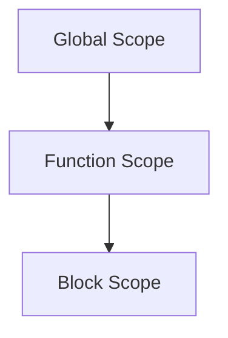

An inner scope can look outward.

An outer scope cannot look inward.

---

## Block Scope

`let` and `const` are block scoped.

```js
if (loggedIn) {
  const message = "Welcome back";
  console.log(message);
}

console.log(message);
```

The final line cannot access `message`.

A block such as:

```js
{
  ...
}
```

can therefore establish a useful lifetime boundary for variables.

This is one reason modern JavaScript generally prefers `let` and `const` over `var`.

`var` follows older function-scoping rules and has hoisting behavior that can make code harder to reason about.

We do not need a historical study of `var`.

The practical rule is:

> Prefer `const` by default, use `let` when reassignment is genuinely required, and understand that both respect block scope.

---

# 2. Closures: Functions Remember Their Lexical Environment

A closure is one of the most important ideas in JavaScript.

Consider:

```js
function createCounter() {
  let count = 0;

  return function increment() {
    count += 1;
    return count;
  };
}

const counter = createCounter();

console.log(counter()); // 1
console.log(counter()); // 2
console.log(counter()); // 3
```

At first glance, this may appear strange.

`createCounter()` already finished.

Why does `count` still exist?

Because the returned function closes over the lexical environment in which it was created.

We can think of it conceptually as:

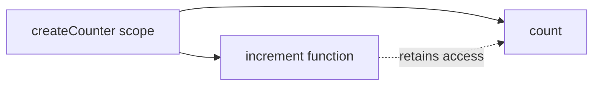

The function does not copy the value `count = 0`.

It retains access to the binding itself.

That is why later calls continue from the previous value.

---

# 3. Closures in Front-End Development

Closures are not an academic language curiosity.

They appear constantly in front-end code.

## Event handlers

```js
function attachDeleteHandler(button, itemId) {
  button.addEventListener("click", () => {
    console.log(`Delete ${itemId}`);
  });
}
```

The arrow function remembers `itemId`.

Even after `attachDeleteHandler()` returns, the handler still has access to the value associated with that call.

---

## Callback configuration

```js
function createLogger(prefix) {
  return message => {
    console.log(`[${prefix}] ${message}`);
  };
}

const apiLogger = createLogger("API");
const uiLogger = createLogger("UI");

apiLogger("Request started");
uiLogger("Modal opened");
```

Each returned function carries a different lexical environment.

---

## Stateful factories

```js
function createToggle(initialState = false) {
  let active = initialState;

  return {
    get value() {
      return active;
    },

    toggle() {
      active = !active;
      return active;
    }
  };
}

const menuState = createToggle();

menuState.toggle();
console.log(menuState.value);
```

The internal variable remains private to the factory.

This kind of pattern appears in libraries, utilities, and framework internals.

---

# 4. Closures Can Also Keep Data Alive

Closures retain access to variables.

That can be useful.

It can also affect memory.

Suppose:

```js
function attachHandler(button) {
  const veryLargeObject = loadLargeDataset();

  button.addEventListener("click", () => {
    console.log(veryLargeObject.summary);
  });
}
```

As long as the event handler remains reachable, the closure may keep `veryLargeObject` reachable too.

That does not automatically mean there is a memory leak.

But it illustrates an important principle:

> Scope affects not only naming. It can affect object lifetime.

Chapter 15 will revisit memory behavior from a performance perspective.

---

# 5. Objects and JavaScript's Prototype Model

JavaScript objects are collections of properties.

```js
const user = {
  id: 42,
  name: "Sara",
  active: true
};
```

Properties can hold:

- primitive values;
- arrays;
- other objects;
- functions.

```js
const user = {
  name: "Sara",

  greet() {
    return `Hello, ${this.name}`;
  }
};
```

But JavaScript's object model goes beyond storing properties.

Objects can delegate property lookup through a **prototype chain**.

---

# 6. Prototype Delegation

Consider:

```js
const animal = {
  speak() {
    console.log("Some sound");
  }
};

const dog = Object.create(animal);

dog.name = "Luna";

dog.speak();
```

`dog` does not have its own `speak` property.

JavaScript looks for the property on `dog`.

It does not find it.

Then it follows the object's prototype.

There, it finds `animal.speak`.

Conceptually:


Property lookup moves along this chain until:

- the property is found; or
- the chain reaches `null`.

This is JavaScript's prototype-based inheritance model.

---

# 7. Constructor Functions and Prototypes

Before `class` syntax became common, constructor functions were widely used:

```js
function User(name) {
  this.name = name;
}

User.prototype.greet = function () {
  return `Hello, ${this.name}`;
};

const sara = new User("Sara");
```

The object created by `new User()` delegates behavior through `User.prototype`.

Modern JavaScript usually expresses this relationship more clearly using classes.

---

# 8. Classes Are Syntax Over the Prototype System

A modern version:

```js
class User {
  constructor(name) {
    this.name = name;
  }

  greet() {
    return `Hello, ${this.name}`;
  }
}

const sara = new User("Sara");
```

This is easier for many developers to read.

But it does not replace JavaScript's prototype model.

Instances still relate to prototype objects.

Conceptually:


Understanding this helps explain framework and library behavior, especially when inspecting objects in DevTools.

---

# 9. Composition Is Often Simpler Than Deep Inheritance

Classes can be useful.

Deep inheritance trees often are not.

Suppose:

```text
User
└── StaffUser
    └── Administrator
        └── RegionalAdministrator
```

The deeper the tree becomes, the harder it can be to understand where behavior comes from.

Front-end code often benefits from composition instead.

For example:

```js
function canEdit(user) {
  return user.permissions.includes("edit");
}

function canDelete(user) {
  return user.permissions.includes("delete");
}
```

instead of encoding every behavior in a deep class hierarchy.

This principle will become even more important in Chapter 6 when we discuss component architecture.

---

# 10. Destructuring

Modern JavaScript frequently extracts values from objects and arrays.

```js
const user = {
  id: 42,
  name: "Sara",
  role: "editor"
};

const { name, role } = user;
```

The same can appear directly in function parameters:

```js
function renderUser({ name, role }) {
  console.log(`${name} — ${role}`);
}
```

Array destructuring:

```js
const coordinates = [36.19, 44.01];

const [latitude, longitude] = coordinates;
```

Destructuring can make data dependencies explicit.

But excessive destructuring can also reduce clarity if dozens of values are extracted far away from where they are used.

Use it when it improves readability.

---

# 11. Rest and Spread

The same `...` syntax has several related uses.

## Object spread

```js
const original = {
  id: 42,
  name: "Sara",
  active: true
};

const updated = {
  ...original,
  active: false
};
```

`updated` is a new object.

`original` is unchanged.

---

## Array spread

```js
const first = [1, 2, 3];

const second = [
  ...first,
  4
];
```

---

## Rest parameters

```js
function sum(...values) {
  return values.reduce(
    (total, value) => total + value,
    0
  );
}
```

The syntax is compact, but remember that object and array spread are **shallow**.

---

# 12. Shallow Copying

Consider:

```js
const user = {
  name: "Sara",
  settings: {
    theme: "dark"
  }
};

const copy = {
  ...user
};

copy.settings.theme = "light";

console.log(user.settings.theme);
```

The result is:

```text
light
```

Why?

The outer object was copied.

The nested `settings` object was not deeply cloned.

Both objects still reference the same nested object.

Conceptually:

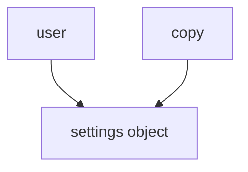

This matters greatly when performing immutable updates.

---

# 13. Optional Chaining

Suppose API data may omit nested values.

Without optional chaining:

```js
if (
  user &&
  user.profile &&
  user.profile.address
) {
  console.log(
    user.profile.address.city
  );
}
```

With optional chaining:

```js
const city =
  user?.profile?.address?.city;
```

If any part before `city` is `null` or `undefined`, the expression returns `undefined` instead of throwing.

Optional chaining does **not** mean:

> Ignore all invalid data.

It is useful for genuinely optional structures.

If data is required by the application contract, silently returning `undefined` may hide a problem.

Chapter 5 will examine runtime validation more carefully.

---

# 14. Nullish Coalescing

Consider:

```js
const pageSize =
  settings.pageSize || 20;
```

This treats all falsy values as absent.

That includes:

```text
0
""
false
null
undefined
```

Sometimes only `null` and `undefined` should mean “missing.”

Use:

```js
const pageSize =
  settings.pageSize ?? 20;
```

Now:

```js
0 ?? 20
```

returns `0`.

This is especially useful for configuration values where zero or false are legitimate values.

---

# 15. Transforming Collections

Front-end applications constantly transform arrays.

Common tools include:

- `map()`;
- `filter()`;
- `find()`;
- `some()`;
- `every()`;
- `reduce()`.

---

## `map()`

Transform every element:

```js
const users = [
  { id: 1, name: "Sara" },
  { id: 2, name: "Alan" }
];

const names =
  users.map(user => user.name);
```

Result:

```js
["Sara", "Alan"]
```

Use `map()` when the output should contain one transformed item for each input item.

---

## `filter()`

Keep only matching values:

```js
const activeUsers =
  users.filter(user => user.active);
```

---

## `find()`

Find the first matching item:

```js
const user =
  users.find(user => user.id === 42);
```

---

## `some()` and `every()`

```js
const hasErrors =
  fields.some(field => field.error);
```

```js
const allValid =
  fields.every(field => field.valid);
```

These methods often communicate intent more clearly than manual loops.

---

# 16. Use `reduce()` When It Clarifies, Not Because It Can

`reduce()` is powerful.

For example:

```js
const total =
  prices.reduce(
    (sum, price) => sum + price,
    0
  );
```

This is clear.

But developers sometimes use `reduce()` for transformations better expressed with simpler methods.

A complex nested accumulator can become harder to understand than:

- a `for...of` loop;
- `map()`;
- `filter()`;
- several named steps.

The goal is not functional cleverness.

The goal is readable data flow.

---

# 17. Immutable Update Patterns

JavaScript objects are mutable.

```js
const user = {
  name: "Sara",
  active: true
};

user.active = false;
```

There is nothing inherently invalid about mutation.

However, modern UI architectures frequently benefit from **immutable update patterns**.

Instead of modifying the existing object:

```js
user.active = false;
```

create a new representation:

```js
const updatedUser = {
  ...user,
  active: false
};
```

Why?

Because identity can communicate change.

---

# 18. Identity and Change Detection

Consider:

```js
const original = {
  active: true
};

const sameObject = original;

sameObject.active = false;

console.log(
  original === sameObject
);
```

Result:

```text
true
```

The object changed internally, but its identity did not.

Now:

```js
const updated = {
  ...original,
  active: false
};

console.log(
  original === updated
);
```

Result:

```text
false
```

A new object creates a new identity.

Many UI systems can use identity comparisons to detect whether something changed.

This is one reason immutable updates are useful in state management.

---

# 19. Updating Nested Data Immutably

Suppose:

```js
const state = {
  user: {
    name: "Sara",
    preferences: {
      theme: "dark"
    }
  }
};
```

A safe immutable update might be:

```js
const nextState = {
  ...state,

  user: {
    ...state.user,

    preferences: {
      ...state.user.preferences,
      theme: "light"
    }
  }
};
```

This can become verbose.

Libraries and framework tooling often help with deeper state.

But the underlying idea remains useful:

> If a state model depends on identity-based change detection, create new values along the path that changed.

---

# 20. Do Not Turn Immutability into Dogma

Local mutation can be perfectly reasonable.

For example:

```js
const values = [];

for (const item of items) {
  if (item.active) {
    values.push(item.id);
  }
}
```

This mutation is local, controlled, and easy to understand.

Likewise, browser APIs are often inherently mutable:

```js
element.classList.add("active");
```

The useful principle is not:

> Never mutate anything.

It is:

> Avoid hidden shared mutation when application correctness depends on knowing when state changed.

---

# 21. ES Modules: JavaScript Boundaries

Large applications need boundaries.

Without modules, a codebase can degenerate into one shared global namespace:

```js
window.users = ...
window.settings = ...
window.api = ...
window.utils = ...
```

Any file can accidentally interfere with another.

ES Modules provide explicit imports and exports.

---

# 22. Named Exports

`math.js`:

```js
export function add(a, b) {
  return a + b;
}

export function subtract(a, b) {
  return a - b;
}
```

Import:

```js
import {
  add,
  subtract
} from "./math.js";
```

The import clearly states dependencies.

---

# 23. Default Exports

A module may also provide a default export:

```js
export default function createApiClient() {
  ...
}
```

Import:

```js
import createApiClient
  from "./api-client.js";
```

A module can combine default and named exports, but excessive use of default exports can sometimes make refactoring or auto-import behavior less explicit.

The book will not prescribe a universal rule.

The important idea is that modules define boundaries.

---

# 24. Module Scope

Variables declared inside a module do not automatically become global browser variables.

```js
const secretInternalValue = 42;
```

in a module remains scoped to that module unless exported.

This is a major improvement over scripts that implicitly share globals.

---

# 25. Module Graphs

Suppose:

```text
main.js
├── api.js
├── ui.js
│   ├── format.js
│   └── modal.js
└── state.js
```

Each `import` creates a dependency relationship.

Conceptually:

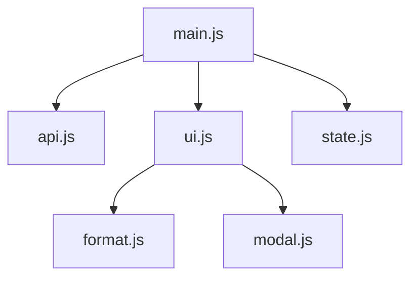

This forms a **module graph**.

Build tools later use this graph for:

- bundling;
- tree shaking;
- code splitting;
- dependency analysis.

Chapter 12 will revisit the same graph from the tooling perspective.

---

# 26. Dynamic Imports

Static imports are loaded as part of the module graph:

```js
import { openEditor }
  from "./editor.js";
```

Sometimes code should only load when needed.

Use:

```js
const module =
  await import("./editor.js");

module.openEditor();
```

Dynamic `import()` returns a Promise.

This makes it useful for lazy loading.

For example:

```js
button.addEventListener(
  "click",
  async () => {
    const {
      openReportDesigner
    } = await import(
      "./report-designer.js"
    );

    openReportDesigner();
  }
);
```

Now a large report designer does not need to load during initial application startup if most users never open it.

Conceptually:


Dynamic imports connect JavaScript language features directly to code splitting, which we will study later.

---

# 27. Iteration: More Than `for` Loops

JavaScript supports a general **iterable protocol**.

An iterable is something that can provide a sequence of values.

Common built-in iterables include:

- arrays;
- strings;
- maps;
- sets;
- some DOM collections.

This is why:

```js
for (const item of items) {
  ...
}
```

works across several data structures.

---

# 28. Iterators

An iterator conceptually produces values one at a time.

An iterator returns objects like:

```js
{
  value: ...,
  done: false
}
```

until completion:

```js
{
  value: undefined,
  done: true
}
```

Most front-end developers rarely create manual iterators.

Understanding the concept helps explain:

- `for...of`;
- generators;
- async iteration.

---

# 29. Generators

Generator functions can pause and resume.

```js
function* idGenerator() {
  let id = 1;

  while (true) {
    yield id;
    id += 1;
  }
}

const ids = idGenerator();

console.log(ids.next().value); // 1
console.log(ids.next().value); // 2
```

The `yield` keyword produces a value and pauses the generator.

The next call resumes from that point.

Generators can be useful for:

- custom sequences;
- lazy computation;
- controlled iteration.

They are useful working knowledge, but they are not central to most everyday front-end code.

---

# 30. Async Iteration

Some data arrives over time.

Async iteration allows:

```js
for await (const chunk of stream) {
  ...
}
```

Instead of producing all values immediately, an async iterable can await future values.

This becomes relevant for:

- streams;
- paginated sequences;
- incremental data;
- some real-time APIs.

We will not build a complete streaming architecture here.

The goal is to understand the language mechanism.

---

# 31. From Callbacks to Promises

Asynchronous programming becomes easier to understand if we see how its abstractions evolved.

Suppose we have an older callback-style API:

```js
loadUser(42, function (error, user) {
  if (error) {
    handleError(error);
    return;
  }

  renderUser(user);
});
```

Now suppose loading the user is followed by more asynchronous work:

```js
loadUser(42, function (error, user) {
  if (error) {
    handleError(error);
    return;
  }

  loadOrders(
    user.id,
    function (error, orders) {
      if (error) {
        handleError(error);
        return;
      }

      loadRecommendations(
        orders,
        function (
          error,
          recommendations
        ) {
          ...
        }
      );
    }
  );
});
```

The problem is not that callbacks are inherently wrong.

The problem is that deeply nested continuation logic becomes difficult to read, compose, and handle consistently.

Promises provide a different model.

---

# 32. A Promise Represents a Future Result

A Promise is an object representing eventual completion or failure.

A Promise can conceptually be:

```text
pending
fulfilled
rejected
```

State transition:

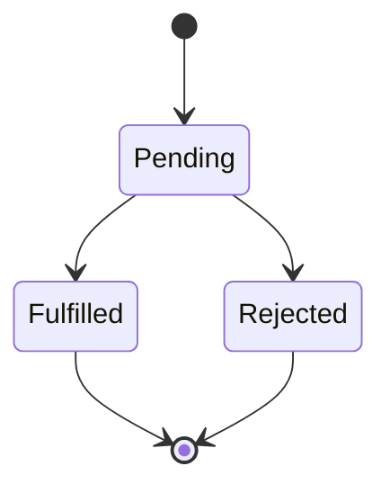

Once settled, a Promise does not return to `pending`.

---

# 33. Creating a Promise

Many browser APIs already return Promises.

You do not normally need to wrap everything manually.

But understanding construction is useful:

```js
const promise =
  new Promise((resolve, reject) => {
    performOperation(
      result => resolve(result),
      error => reject(error)
    );
  });
```

`resolve()` fulfills the Promise.

`reject()` rejects it.

---

# 34. Consuming a Promise

```js
fetch("/api/user/42")
  .then(response => {
    return response.json();
  })
  .then(user => {
    renderUser(user);
  })
  .catch(error => {
    handleError(error);
  });
```

Each `.then()` returns another Promise.

This enables composition.

---

# 35. Promise Chaining

Suppose:

```js
loadUser(42)
  .then(user => {
    return loadOrders(user.id);
  })
  .then(orders => {
    return loadRecommendations(orders);
  })
  .then(recommendations => {
    renderRecommendations(
      recommendations
    );
  })
  .catch(error => {
    handleError(error);
  });
```

Compared with deeply nested callbacks, the dependency chain is clearer.

Conceptually:

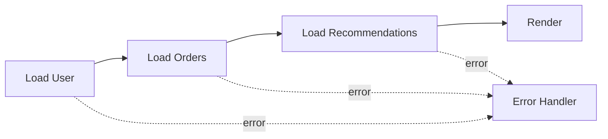

---

# 36. Promise Errors Propagate Through the Chain

If a `.then()` callback throws:

```js
loadUser(42)
  .then(user => {
    throw new Error(
      "Unexpected user state"
    );
  })
  .catch(error => {
    console.error(error);
  });
```

the returned Promise becomes rejected and the rejection can be handled downstream.

Similarly, if a Promise returned from `.then()` rejects, the chain can propagate that error.

This creates a more consistent error model than manually checking every callback.

---

# 37. `async` and `await`

Promises are composable, but long `.then()` chains can still be harder to read than ordinary control flow.

`async` and `await` allow Promise-based logic to look more sequential.

```js
async function showUser(id) {
  const response =
    await fetch(`/api/users/${id}`);

  const user =
    await response.json();

  renderUser(user);
}
```

`await` pauses the **async function's progression**, not the entire browser thread.

Other browser work can continue while the awaited Promise is pending.

That distinction is essential.

---

# 38. `async` Functions Always Return Promises

Consider:

```js
async function answer() {
  return 42;
}
```

Calling:

```js
const result = answer();
```

does not assign `42` directly.

`result` is a Promise fulfilled with `42`.

So:

```js
answer().then(value => {
  console.log(value);
});
```

prints:

```text
42
```

This makes `async` functions naturally composable with other Promise-based APIs.

---

# 39. Error Handling with `async` / `await`

Promise rejection can be handled using ordinary `try...catch`.

```js
async function loadUser(id) {
  try {
    const response =
      await fetch(
        `/api/users/${id}`
      );

    if (!response.ok) {
      throw new Error(
        `HTTP ${response.status}`
      );
    }

    return await response.json();
  } catch (error) {
    console.error(
      "Could not load user",
      error
    );

    throw error;
  }
}
```

`try...catch` works because rejected awaited Promises behave like thrown errors inside the async function.

---

# 40. Not Every Error Is a Network Error

One common mistake with `fetch()` is assuming that:

```js
await fetch("/missing")
```

rejects for every HTTP error.

It does not.

A response such as:

```text
404 Not Found
```

or:

```text
500 Internal Server Error
```

still produces an HTTP response.

You should normally check:

```js
if (!response.ok) {
  ...
}
```

Promise rejection is generally associated with failures such as:

- network failure;
- abort;
- certain browser-level failures.

This distinction becomes important in Chapter 9 when we model remote data states.

---

# 41. Sequential Asynchronous Work

Consider:

```js
const user =
  await loadUser();

const products =
  await loadProducts();
```

This is sequential.

`loadProducts()` does not start until `loadUser()` finishes.

Sometimes that is correct.

Perhaps the second request depends on the first:

```js
const user =
  await loadUser();

const permissions =
  await loadPermissions(user.id);
```

The dependency is real.

Sequential execution matches the architecture.

---

# 42. Accidental Sequential Work

Now suppose two requests are independent:

```js
const user =
  await loadUser();

const products =
  await loadProducts();
```

If each takes one second, total waiting may approach two seconds.

But nothing requires the second request to wait for the first.

Start both:

```js
const userPromise =
  loadUser();

const productsPromise =
  loadProducts();

const user =
  await userPromise;

const products =
  await productsPromise;
```

Or more clearly:

```js
const [
  user,
  products
] = await Promise.all([
  loadUser(),
  loadProducts()
]);
```

Conceptually:

### Sequential

```mermaid
gantt
    title Sequential Requests
    dateFormat X
    axisFormat %L

    section Work
    Load User      :a1, 0, 5
    Load Products  :a2, 5, 5
```

### Concurrent

```mermaid
gantt
    title Concurrent Requests
    dateFormat X
    axisFormat %L

    section Work
    Load User      :a1, 0, 5
    Load Products  :a2, 0, 5
```

Concurrency can reduce total waiting when work is independent.

---

# 43. `Promise.all()`

`Promise.all()` waits for all supplied Promises to fulfill.

```js
const [
  profile,
  notifications,
  preferences
] = await Promise.all([
  loadProfile(),
  loadNotifications(),
  loadPreferences()
]);
```

If one rejects, `Promise.all()` rejects.

This is useful when the operation should be treated as a single combined requirement.

For example:

> The dashboard cannot initialize successfully unless all three resources load.

---

# 44. `Promise.allSettled()`

Sometimes all results are useful even if some fail.

```js
const results =
  await Promise.allSettled([
    loadWeather(),
    loadNews(),
    loadExchangeRates()
  ]);
```

Each result reports whether it fulfilled or rejected.

Conceptually:

```js
[
  {
    status: "fulfilled",
    value: ...
  },
  {
    status: "rejected",
    reason: ...
  }
]
```

This fits dashboards where independent widgets may fail separately.

The application can still render partial success.

---

# 45. Concurrency Is Not Parallelism

These words are often mixed together.

For front-end engineering, a useful distinction is:

**Concurrency**

> Several operations can be in progress during overlapping periods.

**Parallelism**

> Several operations are literally executing simultaneously.

Multiple network requests can be concurrent even if JavaScript callback execution is coordinated through one main-thread call stack.

The browser and operating system may perform networking work in parallel with other activities.

Do not assume:

```js
Promise.all(...)
```

means JavaScript function bodies are executing simultaneously on several cores.

---

# 46. Race Conditions

Concurrency introduces new problems.

Suppose the user searches for:

```text
c
ca
cat
```

Each keystroke triggers a request.

```js
searchInput.addEventListener(
  "input",
  async event => {
    const query =
      event.target.value;

    const results =
      await search(query);

    renderResults(results);
  }
);
```

What if:

- request for `c` is slow;
- request for `ca` is faster;
- request for `cat` is fastest?

A possible completion order:

```text
cat
ca
c
```

The UI could end by displaying results for `c`, even though the user currently typed `cat`.

That is a **race condition**.

The final result depends on timing.

---

# 47. Race Conditions Are About Correctness

A race condition is not necessarily a performance problem.

The application may be fast and still wrong.

Consider:

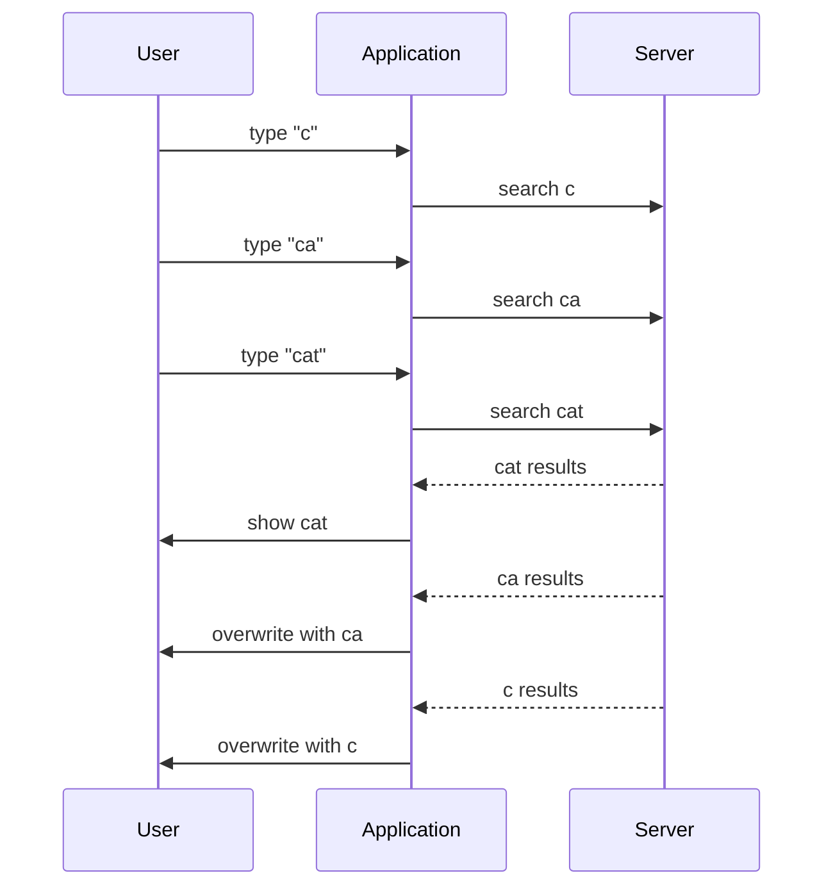

The browser did exactly what we asked.

Our application model was wrong.

---

# 48. Strategy 1: Ignore Stale Results

One solution is to track the latest request.

```js
let latestRequest = 0;

async function runSearch(query) {
  const requestId =
    ++latestRequest;

  const results =
    await search(query);

  if (requestId !== latestRequest) {
    return;
  }

  renderResults(results);
}
```

Old requests may still consume network resources, but their responses cannot overwrite newer results.

---

# 49. Strategy 2: Cancel Outdated Work

A stronger solution may cancel obsolete requests.

`fetch()` supports `AbortController`.

```js
let currentController;

async function runSearch(query) {
  currentController?.abort();

  currentController =
    new AbortController();

  try {
    const response =
      await fetch(
        `/api/search?q=${encodeURIComponent(query)}`,
        {
          signal:
            currentController.signal
        }
      );

    const results =
      await response.json();

    renderResults(results);
  } catch (error) {
    if (
      error.name === "AbortError"
    ) {
      return;
    }

    throw error;
  }
}
```

When a new search begins:

```js
currentController?.abort();
```

signals the previous request that its result is no longer required.

This reduces both stale updates and unnecessary work.

---

# 50. AbortController Is a General Cancellation Signal

Create a controller:

```js
const controller =
  new AbortController();
```

Pass its signal:

```js
fetch(url, {
  signal: controller.signal
});
```

Cancel:

```js
controller.abort();
```

The signal can sometimes be shared among related operations.

For example:

```js
const controller =
  new AbortController();

const options = {
  signal: controller.signal
};

const userRequest =
  fetch("/api/user", options);

const settingsRequest =
  fetch("/api/settings", options);
```

Calling:

```js
controller.abort();
```

can cancel both.

This is useful when several requests belong to one UI operation that becomes irrelevant.

---

# 51. Cancellation Is an Application Design Problem

Do not think of cancellation only as an API technique.

Ask:

> When is work no longer useful?

Examples:

- user navigated away;
- modal closed;
- search query changed;
- component removed;
- operation superseded by newer work;
- application entered another state.

A well-designed asynchronous system explicitly models obsolescence.

---

# 52. Debouncing User Input

Cancellation addresses outdated work after it begins.

Sometimes we should avoid starting unnecessary work in the first place.

Imagine a search field where users type quickly.

We may wait briefly after the last keystroke before sending the request.

A simple debounce:

```js
function debounce(
  callback,
  delay
) {
  let timerId;

  return (...args) => {
    clearTimeout(timerId);

    timerId = setTimeout(
      () => {
        callback(...args);
      },
      delay
    );
  };
}
```

Use:

```js
const handleSearch =
  debounce(
    query => {
      runSearch(query);
    },
    250
  );
```

Then:

```js
searchInput.addEventListener(
  "input",
  event => {
    handleSearch(
      event.target.value
    );
  }
);
```

The closure retains `timerId`.

This connects one of the chapter's first concepts—closures—to asynchronous UI behavior.

---

# 53. Debounce and Cancellation Solve Different Problems

Debouncing:

> Avoid starting work until input stabilizes.

Cancellation:

> Stop work that has already become irrelevant.

They can be combined.

A robust search system may:

1. debounce input;
2. cancel the previous request;
3. start the new request;
4. ignore any stale completion that still appears.

Conceptually:

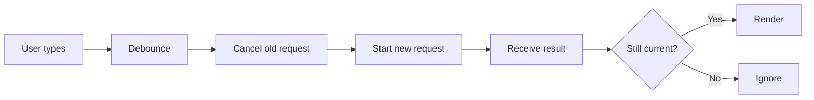

---

# 54. Error Propagation Across Application Layers

Suppose:

```js
async function fetchUser(id) {
  const response =
    await fetch(`/api/users/${id}`);

  if (!response.ok) {
    throw new Error(
      `Could not fetch user: ${response.status}`
    );
  }

  return response.json();
}
```

A higher layer may decide what to do:

```js
async function showUser(id) {
  try {
    const user =
      await fetchUser(id);

    renderUser(user);
  } catch (error) {
    showUserError(error);
  }
}
```

This separation is useful.

The data layer can explain that an operation failed.

The UI layer can decide how failure should be presented.

Avoid catching an error merely to hide it:

```js
try {
  ...
} catch (error) {
  // do nothing
}
```

unless ignoring the error is a deliberate and safe application decision.

---

# 55. `finally`

Sometimes cleanup should happen regardless of success or failure.

```js
async function save() {
  setSaving(true);

  try {
    await saveDocument();
    showSuccess();
  } catch (error) {
    showError(error);
  } finally {
    setSaving(false);
  }
}
```

The loading state resets in either case.

This is a good example of ordinary control-flow features working naturally with async functions.

---

# 56. Avoid Unhandled Promise Rejections

This is risky:

```js
saveDocument();
```

if the function returns a Promise that may reject and nothing observes the failure.

Prefer intentional handling:

```js
await saveDocument();
```

inside an async flow, or:

```js
saveDocument().catch(
  handleSaveError
);
```

When intentionally starting a Promise without awaiting it, make that decision visible and ensure failures are handled appropriately.

---

# 57. Internationalization Is More Than Translation

A front-end can translate all its text and still display data incorrectly.

Consider:

```text
1,234.56
```

and:

```text
1.234,56
```

Both may represent the same number under different formatting conventions.

Likewise:

```text
09/10/2026
```

is ambiguous.

Does it mean:

- 9 October?
- 10 September?

Locale-aware formatting belongs to the application layer.

JavaScript provides the `Intl` family of APIs for this purpose.

---

# 58. `Intl.NumberFormat`

Instead of manually constructing separators:

```js
const formatter =
  new Intl.NumberFormat(
    "en-US"
  );

console.log(
  formatter.format(1234567.89)
);
```

A different locale:

```js
const formatter =
  new Intl.NumberFormat(
    "de-DE"
  );
```

may produce a different representation.

The application supplies the value.

The locale determines formatting conventions.

---

# 59. Currency Formatting

```js
const formatter =
  new Intl.NumberFormat(
    "en-US",
    {
      style: "currency",
      currency: "USD"
    }
  );

console.log(
  formatter.format(1499.5)
);
```

For Iraqi dinars:

```js
const formatter =
  new Intl.NumberFormat(
    "ar-IQ",
    {
      style: "currency",
      currency: "IQD"
    }
  );
```

Do not manually concatenate:

```js
amount + " IQD"
```

when the objective is locale-aware currency presentation.

The locale and currency are separate concepts.

---

# 60. `Intl.DateTimeFormat`

A date formatter:

```js
const formatter =
  new Intl.DateTimeFormat(
    "en-GB",
    {
      dateStyle: "long"
    }
  );
```

Use:

```js
formatter.format(
  new Date()
);
```

Another locale can present the same date differently.

Applications should generally store or transport date/time data in unambiguous machine-oriented forms and format for humans at presentation boundaries.

---

# 61. Dates Need More Than Formatting

`Intl.DateTimeFormat` controls presentation.

It does not remove difficult questions involving:

- time zones;
- daylight-saving transitions;
- date-only values;
- server/client interpretation.

Do not confuse:

> “The date displays correctly.”

with:

> “The application modeled time correctly.”

This book will not become a complete time-handling manual, but front-end developers should remain cautious.

---

# 62. Relative Time

Instead of manually writing:

```text
3 days ago
```

use:

```js
const relative =
  new Intl.RelativeTimeFormat(
    "en",
    {
      numeric: "auto"
    }
  );

console.log(
  relative.format(-3, "day")
);
```

This supports locale-aware wording.

---

# 63. Plural Rules

Pluralization is more complex than:

```js
count === 1
  ? "item"
  : "items";
```

Different languages have different plural systems.

`Intl.PluralRules` can identify the locale-specific plural category.

```js
const rules =
  new Intl.PluralRules("en");

console.log(
  rules.select(1)
);
```

The output might be:

```text
one
```

while:

```js
rules.select(2)
```

might produce:

```text
other
```

Translation systems can use these categories to select correct message forms.

---

# 64. `Intl.Segmenter`

Text segmentation is not universally equivalent to:

```js
text.split(" ")
```

Different languages have different rules for:

- words;
- graphemes;
- sentence boundaries.

`Intl.Segmenter` provides locale-aware segmentation.

For example:

```js
const segmenter =
  new Intl.Segmenter(
    "en",
    {
      granularity: "word"
    }
  );

for (
  const segment
  of segmenter.segment(
    "Modern frontend engineering"
  )
) {
  console.log(segment.segment);
}
```

This can support features such as:

- word counting;
- text navigation;
- editors;
- search tools;
- language-aware UI behavior.

It is Working Knowledge, not a central everyday requirement.

---

# 65. Dynamic Imports and Internationalization

Modules and localization can interact.

Suppose an application has translation resources:

```text
locales/
├── en.js
├── ar.js
└── ckb.js
```

Instead of loading every locale:

```js
async function loadLocale(
  locale
) {
  return import(
    `./locales/${locale}.js`
  );
}
```

Now only the needed module can be loaded.

This is a small example of how language features combine:

- modules;
- Promises;
- async/await;
- internationalization.

---

# 66. Putting the Chapter Together: A Cancelable Search

We can now combine many concepts in one realistic feature.

Requirements:

- wait briefly while the user types;
- cancel the previous search;
- prevent stale responses;
- load a result-rendering module only when needed;
- format result counts for the current locale.

---

## Step 1: Debounce

```js
function debounce(
  callback,
  delay
) {
  let timerId;

  return (...args) => {
    clearTimeout(timerId);

    timerId = setTimeout(
      () => callback(...args),
      delay
    );
  };
}
```

This uses a closure.

---

## Step 2: Search controller

```js
function createSearchController({
  locale
}) {
  let controller = null;
  let requestId = 0;

  const numberFormatter =
    new Intl.NumberFormat(
      locale
    );

  async function search(query) {
    controller?.abort();

    controller =
      new AbortController();

    const currentRequest =
      ++requestId;

    try {
      const response =
        await fetch(
          `/api/search?q=${
            encodeURIComponent(query)
          }`,
          {
            signal:
              controller.signal
          }
        );

      if (!response.ok) {
        throw new Error(
          `Search failed: ${
            response.status
          }`
        );
      }

      const data =
        await response.json();

      if (
        currentRequest !==
        requestId
      ) {
        return;
      }

      const {
        renderSearchResults
      } = await import(
        "./search-results.js"
      );

      renderSearchResults({
        results: data.results,

        totalLabel:
          numberFormatter.format(
            data.total
          )
      });
    } catch (error) {
      if (
        error.name ===
        "AbortError"
      ) {
        return;
      }

      throw error;
    }
  }

  return {
    search
  };
}
```

This uses:

- closure state;
- `Intl.NumberFormat`;
- `AbortController`;
- async/await;
- error propagation;
- dynamic import;
- race-condition protection.

---

## Step 3: Connect the input

```js
const searchController =
  createSearchController({
    locale:
      document.documentElement.lang
      || "en"
  });

const searchInput =
  document.querySelector(
    "#search"
  );

const handleInput =
  debounce(
    event => {
      const query =
        event.target.value.trim();

      if (!query) {
        return;
      }

      searchController
        .search(query)
        .catch(error => {
          console.error(error);
        });
    },
    250
  );

searchInput.addEventListener(
  "input",
  handleInput
);
```

The example is intentionally framework-free.

React and Vue will later provide different ways to structure the same behavior.

The JavaScript principles remain.

---

# 67. A Mental Model for Modern Front-End JavaScript

We can summarize the chapter as a set of relationships.

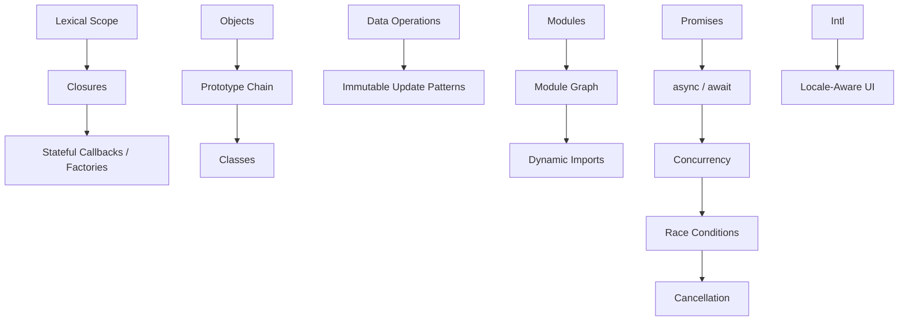

The language features are not isolated tricks.

They combine to form application architecture.

---

# Misconceptions to Leave Behind

## “A closure copies variables.”

No.

A closure retains access to lexical bindings.

That is why the observed value can change over time.

---

## “Classes replaced prototypes.”

No.

Class syntax provides a more familiar way to express behavior built on JavaScript's prototype system.

---

## “Spread creates a deep copy.”

No.

Object and array spread are shallow.

Nested object references remain shared unless those nested levels are copied too.

---

## “Immutability means mutation is always wrong.”

No.

Immutable update patterns are particularly valuable for shared application state and identity-based change detection.

Local controlled mutation can be perfectly reasonable.

---

## “Optional chaining fixes bad data.”

No.

Optional chaining prevents errors when genuinely optional values are absent.

It does not validate data or prove that required values are correct.

---

## “ES Modules are only file organization.”

No.

Modules create explicit dependency boundaries and a module graph that affects loading, tooling, bundling, and code splitting.

---

## “`await` blocks the browser.”

No.

`await` pauses progression of the async function until the Promise settles.

It does not synchronously freeze the browser in the way a CPU-heavy loop does.

---

## “Two awaits always mean the operations must happen one after another.”

No.

Independent asynchronous operations can often start together and be awaited concurrently.

---

## “`Promise.all()` makes JavaScript run on several CPU cores.”

No.

It coordinates concurrent Promise-based operations.

That does not imply parallel execution of ordinary JavaScript callbacks on several main threads.

---

## “Race conditions only happen in multithreaded programs.”

No.

Overlapping asynchronous operations can complete in different orders and create race conditions in ordinary browser applications.

---

## “Debouncing and cancellation are the same.”

No.

Debouncing delays starting work.

Cancellation stops or invalidates work that has already started.

---

## “A rejected `fetch()` means the server returned an error status.”

Not necessarily.

HTTP error responses such as 404 or 500 still produce responses.

The application must inspect the response status.

---

## “Internationalization means translating strings.”

No.

It also involves locale-sensitive formatting of:

- numbers;
- currency;
- dates;
- relative time;
- plural categories;
- text segmentation.

---

# Chapter Summary

Modern JavaScript front-end engineering depends on more than syntax.

Lexical scope determines where names are visible.

Closures allow functions to retain access to surrounding bindings after the outer function returns.

This makes patterns such as:

- event handlers;
- factories;
- debouncing;
- encapsulated state

possible.

JavaScript objects use prototype delegation.

Classes provide syntax over that model rather than replacing it.

Modern syntax such as:

```js
destructuring
spread/rest
optional chaining
nullish coalescing
```

helps express data operations more clearly when used deliberately.

Array methods such as:

```js
map()
filter()
find()
some()
every()
reduce()
```

allow intent-oriented data transformation.

Immutable update patterns are useful when application state relies on object identity to signal change.

ES Modules create explicit dependency boundaries.

Static imports build the normal module graph.

Dynamic `import()` allows code to load when needed.

Iteration protocols explain how:

```js
for...of
generators
async iteration
```

relate.

Asynchronous programming progresses conceptually from:

```text
callbacks
↓
Promises
↓
async / await
```

Promises provide a composable representation of future completion or failure.

`async` and `await` make Promise-based control flow easier to read.

Independent asynchronous work can often run concurrently:

```js
await Promise.all(...)
```

while `Promise.allSettled()` is useful when partial success matters.

Concurrency introduces race conditions.

Applications must sometimes:

- ignore stale responses;
- cancel obsolete requests;
- or both.

`AbortController` provides a standard cancellation mechanism for operations such as `fetch()`.

Finally, `Intl` APIs help turn machine values into human-facing values appropriate for the user's locale.

The central lesson is:

> **Modern JavaScript engineering is largely about controlling scope, identity, dependencies, timing, and data interpretation.**

---

# Review Questions

1. What does lexical scope mean?

2. Why can an inner function access values declared by an outer function?

3. What is a closure?

4. How are closures useful in event handlers?

5. How can closures affect object lifetime?

6. What is the prototype chain?

7. How do JavaScript classes relate to prototypes?

8. Why is composition often preferable to deep class inheritance?

9. What is the difference between object spread and a deep copy?

10. When is optional chaining appropriate?

11. What problem does nullish coalescing solve that `||` does not?

12. When is `map()` more appropriate than `filter()`?

13. Why can `reduce()` sometimes make code harder to understand?

14. Why are immutable update patterns useful in UI state?

15. Why does immutability not mean all mutation is wrong?

16. What boundary does an ES Module create?

17. What is a module graph?

18. What is the difference between a static import and a dynamic import?

19. What is an iterable?

20. What does a generator's `yield` do?

21. What is async iteration useful for?

22. What states can a Promise have?

23. How do Promise chains propagate errors?

24. What does `await` actually pause?

25. Why should an HTTP response's `ok` status normally be checked after `fetch()`?

26. What is the difference between sequential and concurrent asynchronous work?

27. When should `Promise.all()` be used?

28. When might `Promise.allSettled()` be preferable?

29. What is the difference between concurrency and parallelism?

30. What is a race condition?

31. How can stale request results corrupt UI state?

32. What does `AbortController` solve?

33. How does debouncing differ from cancellation?

34. Why should errors not normally be silently swallowed?

35. What role does `finally` play in asynchronous UI logic?

36. Why should applications use `Intl.NumberFormat` rather than manually inserting number separators?

37. How does `Intl.DateTimeFormat` differ from proper date/time modeling?

38. What problem does `Intl.PluralRules` help solve?

39. Why might `Intl.Segmenter` be useful?

---

# End-of-Chapter Practical Lab — Build a Cancelable Locale-Aware Search

Create:

```text
chapter-04-javascript/
├── index.html
├── app.js
├── search-controller.js
├── search-results.js
└── locales/
    ├── en.js
    ├── ar.js
    └── ckb.js
```

The project should remain framework-free.

The goal is to make language behavior visible before React or Vue abstracts it.

## Stage 1 — Closure State

Create:

```js
function createCounter() {
  ...
}
```

with private state.

Create two counters and verify that their state remains independent.

Explain why.

---

## Stage 2 — Immutable Updates

Create an application state object containing:

- search query;
- filters;
- pagination;
- preferences.

Perform one update through mutation.

Perform the same update immutably.

Compare object identities at each nested level.

---

## Stage 3 — Split Code into Modules

Create separate modules for:

- search controller;
- display formatting;
- result rendering.

Use named exports where appropriate.

Draw the module graph with Mermaid.

---

## Stage 4 — Dynamic Import

Do not load the result renderer initially.

Load it using:

```js
await import(...)
```

only after the first successful search.

Observe the Network panel.

---

## Stage 5 — Sequential vs Concurrent Requests

Simulate or use two independent requests.

First:

```js
const a = await loadA();
const b = await loadB();
```

Measure approximate total duration.

Then:

```js
const [a, b] =
  await Promise.all([
    loadA(),
    loadB()
  ]);
```

Compare.

Explain why the second version is only correct if the operations are independent.

---

## Stage 6 — Create a Race Condition

Trigger search requests for:

```text
c
ca
cat
```

with different artificial delays.

Allow responses to arrive out of order.

Observe the stale-result bug.

Document the completion order.

---

## Stage 7 — Prevent Stale Results

Add a request ID strategy.

Verify that older results can no longer overwrite the latest search.

---

## Stage 8 — Add Cancellation

Replace or complement request IDs with:

```js
AbortController
```

Cancel outdated requests.

Handle `AbortError` separately from real failures.

---

## Stage 9 — Add Debouncing

Add:

```js
debounce()
```

using closure state.

Compare network activity before and after debouncing.

Explain why debouncing does not replace cancellation.

---

## Stage 10 — Add Locale-Aware Output

Format:

- total result count;
- currency;
- date;
- relative update time

using `Intl`.

Test at least:

```text
en-US
ar-IQ
ckb-IQ
```

where platform support permits.

Do not manually construct thousands separators or currency placement.

---

## Stage 11 — Draw the Async Flow

Create a Mermaid sequence diagram showing:

- user input;
- debounce;
- cancellation;
- fetch;
- response;
- stale-check;
- dynamic import;
- rendering.

Your diagram should explain timing rather than simply list functions.

---

# Key Terms

**Lexical scope** — scope determined by the location of declarations in source-code structure.

**Block scope** — a scope established by a block for declarations such as `let` and `const`.

**Closure** — a function together with retained access to lexical bindings from the environment where it was created.

**Prototype** — an object used by another object as a delegation target for property lookup.

**Prototype chain** — the sequence of prototype relationships followed during property lookup.

**Class** — JavaScript syntax for expressing constructor/prototype-based object patterns.

**Destructuring** — syntax for extracting values from objects or arrays.

**Spread syntax** — syntax using `...` to copy or expand iterable/object members into a new context.

**Rest syntax** — syntax using `...` to collect remaining values.

**Optional chaining** — `?.` syntax that safely stops property access when an intermediate value is `null` or `undefined`.

**Nullish coalescing** — `??` syntax that provides a fallback only for `null` or `undefined`.

**Immutable update** — producing a new value representing changed state instead of modifying the previous shared value in place.

**ES Module** — JavaScript module using `import` and `export`.

**Module graph** — the dependency graph formed by relationships among imported modules.

**Dynamic import** — the Promise-based `import()` expression used to load a module at runtime.

**Iterable** — an object that can provide values through JavaScript's iteration protocol.

**Iterator** — an object that produces successive values through `next()`.

**Generator** — a resumable function declared with `function*` and controlled through `yield`.

**Async iterable** — an iterable whose values may become available asynchronously.

**Promise** — an object representing future fulfillment or rejection.

**Fulfilled** — a Promise state representing successful completion.

**Rejected** — a Promise state representing failure.

**`async` function** — a function that always returns a Promise and supports `await`.

**`await`** — syntax that pauses progression of an async function until a Promise settles.

**Concurrency** — multiple operations making progress during overlapping time periods.

**Parallelism** — operations executing literally at the same time.

**Race condition** — incorrect or unpredictable behavior caused by operations completing in timing-dependent order.

**AbortController** — a browser API that creates cancellation signals for compatible asynchronous operations.

**Debounce** — delaying an operation until activity has remained quiet for a specified interval.

**Intl** — JavaScript's internationalization API namespace.

**`Intl.NumberFormat`** — locale-aware number and currency formatter.

**`Intl.DateTimeFormat`** — locale-aware date/time formatter.

**`Intl.RelativeTimeFormat`** — locale-aware formatter for expressions such as “3 days ago.”

**`Intl.PluralRules`** — API for selecting locale-specific plural categories.

**`Intl.Segmenter`** — locale-aware text segmentation API.

---

# Closing Perspective

Modern front-end JavaScript is not difficult because the language has many keywords.

Its difficulty comes from relationships.

A callback executes later but still remembers the scope in which it was created.

An object may not contain a method itself but may find that method through its prototype.

A spread operation appears to copy an object but may still share nested references.

An `await` looks sequential but may sit inside a system containing many concurrent operations.

A network request may succeed technically but return data that is no longer relevant.

A value such as `1234.5` is mathematically simple but may require very different human presentation depending on locale.

These relationships are what separate introductory JavaScript from application engineering.

The browser does not only ask:

> What code should run?

A modern application also has to ask:

> What state does this function retain?

> What data is shared?

> What should remain immutable?

> Which module owns this behavior?

> Which work depends on which other work?

> Which operations can happen concurrently?

> Which result is still relevant?

> Which operation should be cancelled?

> How should this value be presented to this user?

When these questions are answered deliberately, asynchronous JavaScript becomes far easier to reason about.

That mental model will become especially important in the next chapter.

Chapter 5 adds TypeScript and runtime validation, giving us stronger tools for answering another fundamental front-end question:

> **What data can this application safely assume it has?**
