# Chapter 5 — TypeScript, Runtime Contracts & Safe Data Boundaries

JavaScript is flexible.

That flexibility is one of its greatest strengths.

It is also one of the reasons large front-end applications can become difficult to reason about.

Consider:

```js
function showUser(user) {
  console.log(user.name.toUpperCase());
}
```

What is `user`?

Does it always have a `name`?

Is `name` always a string?

Could `user` be `null`?

Could an API return:

```json
{
  "name": 42
}
```

instead of:

```json
{
  "name": "Sara"
}
```

JavaScript does not answer these questions before the function runs.

TypeScript adds a static type system that helps us describe and check many of these assumptions while developing the application.

For example:

```ts
interface User {
  id: number;
  name: string;
}

function showUser(user: User) {
  console.log(
    user.name.toUpperCase()
  );
}
```

Now the editor and compiler can reason about the expected shape of `user`.

That is extremely useful.

But it introduces a dangerous misunderstanding:

> If TypeScript says a value is a `User`, then the value must really be a valid `User` at runtime.

That statement is false.

TypeScript checks code before execution.

The browser executes JavaScript.

Type annotations are erased.

If external data is wrong, no type annotation can magically repair it.

This chapter therefore has two equally important goals.

First:

> Use TypeScript to model application data and catch mistakes before runtime.

Second:

> Understand exactly where TypeScript stops protecting you.

The chapter's progression is:

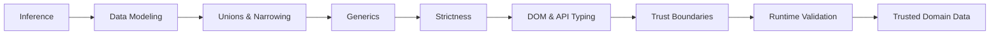

The central lesson is:

> **Static types describe what our program believes. Runtime validation checks what the outside world actually gave us.**

---

# 1. TypeScript Is JavaScript Plus Static Type Analysis

TypeScript is designed as a superset of JavaScript.

Valid JavaScript is generally valid TypeScript, though type-checking rules may report problems depending on configuration.

Consider:

```ts
const message = "Hello";
```

TypeScript understands that `message` is a string.

We did not need to write:

```ts
const message: string =
  "Hello";
```

This is **type inference**.

The compiler can often determine useful types directly from the code.

That should be our starting point.

---

# 2. Type Inference First

Beginners sometimes assume that TypeScript means annotating everything.

They may write:

```ts
const count: number = 5;

const active: boolean = true;

const title: string =
  "Citizen Services";
```

Those annotations are correct.

They are usually unnecessary.

TypeScript already knows:

```ts
const count = 5;
const active = true;
const title =
  "Citizen Services";
```

The inferred types are already useful.

Excessive annotations can make code noisier without adding information.

A good rule is:

> **Let TypeScript infer local values when the type is obvious. Add annotations where they clarify boundaries, contracts, or intent.**

---

# 3. Where Explicit Types Add Value

Annotations become especially useful at boundaries.

For example:

```ts
function calculateTotal(
  prices: number[]
): number {
  return prices.reduce(
    (sum, price) =>
      sum + price,
    0
  );
}
```

The function boundary communicates:

- input is an array of numbers;
- output is a number.

Similarly:

```ts
interface User {
  id: number;
  name: string;
}

function renderUser(
  user: User
): void {
  ...
}
```

The annotation documents and checks the contract.

Useful annotation locations often include:

- public functions;
- exported APIs;
- component props;
- domain models;
- library boundaries;
- callbacks whose types are not obvious;
- values whose intended type is broader than the inferred literal.

---

# 4. Literal Inference

TypeScript sometimes infers a very specific type.

Consider:

```ts
const status =
  "pending";
```

Because `status` cannot be reassigned, TypeScript can infer the literal type:

```text
"pending"
```

rather than only:

```text
string
```

This becomes useful when modeling finite states.

With `let`:

```ts
let status =
  "pending";
```

TypeScript will commonly widen the type because the variable may later hold another string.

This difference between a literal type and a broader primitive type becomes important when we design unions.

---

# 5. Model Data, Do Not Merely Label It

Suppose an application handles service requests.

A weak model might be:

```ts
const request:
  Record<string, unknown> =
  ...;
```

That says very little.

A stronger model:

```ts
interface ServiceRequest {
  id: string;
  citizenName: string;
  service:
    "residence"
    | "identity"
    | "passport";

  status:
    "draft"
    | "submitted"
    | "processing"
    | "approved"
    | "rejected";

  submittedAt:
    string | null;
}
```

Now the model communicates domain rules.

A service cannot accidentally become:

```text
"pizza"
```

without TypeScript objecting.

A status cannot casually become:

```text
"almost done"
```

unless the type is updated.

This is where TypeScript becomes more than autocomplete.

It becomes a way to encode application knowledge.

---

# 6. Interfaces

Interfaces describe object shapes.

```ts
interface User {
  id: number;
  name: string;
  email: string;
}
```

A function can require that shape:

```ts
function sendWelcomeEmail(
  user: User
) {
  console.log(
    `Sending to ${user.email}`
  );
}
```

Interfaces can extend other interfaces:

```ts
interface Person {
  id: number;
  name: string;
}

interface StaffMember
  extends Person {
  department: string;
}
```

This can be useful when the domain genuinely contains hierarchical relationships.

Do not build large inheritance trees merely because the language permits them.

---

# 7. Type Aliases

A type alias can describe object types too:

```ts
type User = {
  id: number;
  name: string;
  email: string;
};
```

It can also name unions and other combinations:

```ts
type RequestStatus =
  | "draft"
  | "submitted"
  | "processing"
  | "approved"
  | "rejected";
```

or:

```ts
type Identifier =
  string | number;
```

In everyday application code, interfaces and type aliases overlap significantly.

A practical convention might be:

- use interfaces for many object contracts;
- use type aliases for unions, compositions, and cases where the type expression itself is important.

But this is a team convention, not a law.

---

# 8. Literal Types

Literal types allow exact values to become part of a type.

```ts
type Theme =
  "light" | "dark";
```

Now:

```ts
let theme: Theme =
  "light";
```

is valid.

But:

```ts
theme = "blue";
```

is not.

Literal unions are often clearer than unrestricted strings for finite application states.

They improve:

- autocomplete;
- refactoring;
- exhaustiveness;
- correctness.

---

# 9. Unions

A union means:

> This value may be one of several types.

For example:

```ts
type SearchResult =
  UserResult
  | ProductResult;
```

or:

```ts
function formatId(
  id: string | number
) {
  return String(id);
}
```

When a value has a union type, TypeScript will not allow operations that are unsafe for one of the possible members.

For example:

```ts
function formatId(
  id: string | number
) {
  return id.toUpperCase();
}
```

fails because numbers do not have `toUpperCase()`.

Before using string-specific behavior, we must **narrow** the union.

---

# 10. Narrowing with `typeof`

```ts
function formatId(
  id: string | number
) {
  if (
    typeof id === "string"
  ) {
    return id.toUpperCase();
  }

  return id.toString();
}
```

Inside the first branch, TypeScript understands:

```text
id: string
```

Inside the second:

```text
id: number
```

The runtime condition and the static type system work together.

---

# 11. Property Checks

Suppose:

```ts
type ApiError = {
  message: string;
  code: number;
};

type ValidationError = {
  message: string;
  fields:
    Record<string, string>;
};
```

We can narrow with:

```ts
function handleError(
  error:
    ApiError
    | ValidationError
) {
  if ("fields" in error) {
    showFieldErrors(
      error.fields
    );
    return;
  }

  console.log(error.code);
}
```

The property check gives TypeScript information about which union member is possible.

---

# 12. Discriminated Unions

One of TypeScript's most useful modeling patterns is a **discriminated union**.

Consider application request state:

```ts
type RequestState =
  | {
      status: "idle";
    }
  | {
      status: "loading";
    }
  | {
      status: "success";
      data: ServiceRequest[];
    }
  | {
      status: "error";
      error: Error;
    };
```

The `status` property is the discriminant.

Now:

```ts
function renderState(
  state: RequestState
) {
  switch (state.status) {
    case "idle":
      return "Ready";

    case "loading":
      return "Loading...";

    case "success":
      return `${state.data.length} requests`;

    case "error":
      return state.error.message;
  }
}
```

When `status` is `"success"`, TypeScript knows `data` exists.

When `status` is `"error"`, TypeScript knows `error` exists.

This is more powerful than:

```ts
type RequestState = {
  loading: boolean;
  data?:
    ServiceRequest[];

  error?:
    Error;
};
```

because that weaker model permits impossible combinations such as:

```ts
{
  loading: true,
  data: [...],
  error: new Error(...)
}
```

A discriminated union can make impossible states harder to represent.

---

# 13. Type Modeling as State Design

We can visualize the difference.

A loosely modeled state:

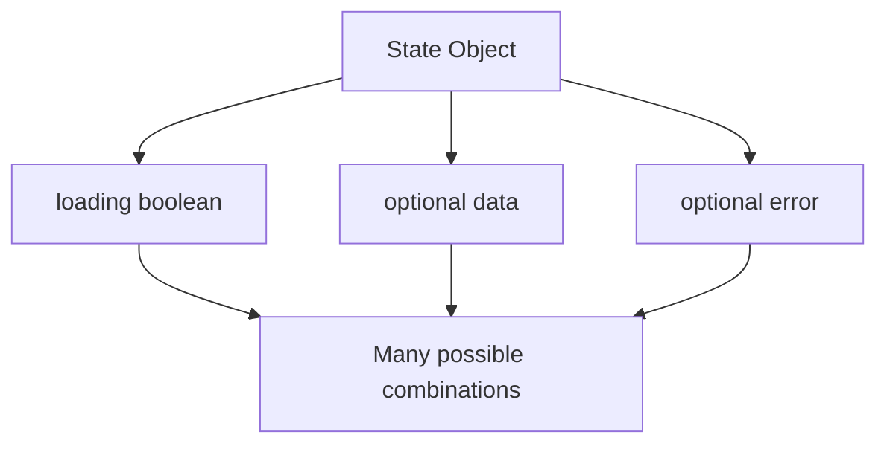

A discriminated union:

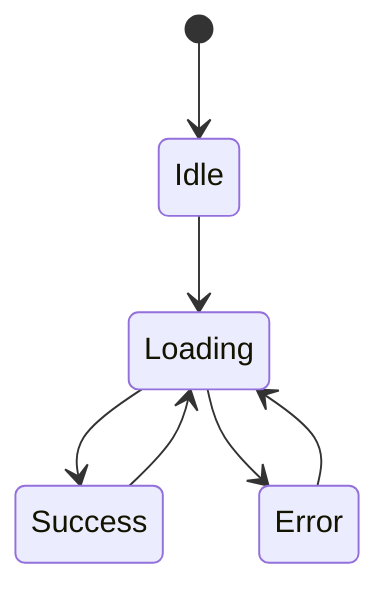

The second model communicates the application's valid states more directly.

This is one reason types are architectural tools.

---

# 14. Intersections

An intersection combines requirements.

```ts
type Timestamped = {
  createdAt: string;
  updatedAt: string;
};

type User = {
  id: number;
  name: string;
};

type TimestampedUser =
  User & Timestamped;
```

A `TimestampedUser` must satisfy both structures.

Intersections can be useful for composition.

Do not overuse them when a direct object type would be clearer.

---

# 15. `unknown`: The Honest Type for Untrusted Values

Suppose data comes from outside the application.

What is its type?

Developers often reach for:

```ts
any
```

That turns off much of TypeScript's protection.

Consider:

```ts
function processValue(
  value: any
) {
  console.log(
    value.name.toUpperCase()
  );
}
```

TypeScript allows this even if `value` is:

```ts
null
```

or:

```ts
42
```

`any` essentially says:

> Trust me. Stop checking.

Sometimes that is necessary when interoperating with poorly typed systems.

It should not be the default for unknown external data.

A safer type is:

```ts
unknown
```

---

# 16. `unknown` Requires Proof Before Use

```ts
function processValue(
  value: unknown
) {
  console.log(
    value.name
  );
}
```

TypeScript rejects this.

That is exactly what we want.

The type says:

> A value exists, but we do not yet know what it is.

We must narrow it.

For example:

```ts
function printValue(
  value: unknown
) {
  if (
    typeof value === "string"
  ) {
    console.log(
      value.toUpperCase()
    );
  }
}
```

`unknown` forces us to earn certainty.

This makes it an excellent starting type at trust boundaries.

---

# 17. Custom Type Guards

Sometimes narrowing logic is reusable.

Suppose:

```ts
interface User {
  id: number;
  name: string;
}
```

We might write:

```ts
function isUser(
  value: unknown
): value is User {
  if (
    typeof value !== "object"
    || value === null
  ) {
    return false;
  }

  const candidate =
    value as Record<
      string,
      unknown
    >;

  return (
    typeof candidate.id
      === "number"
    &&
    typeof candidate.name
      === "string"
  );
}
```

Now:

```ts
function handleData(
  data: unknown
) {
  if (!isUser(data)) {
    throw new Error(
      "Invalid user data"
    );
  }

  console.log(
    data.name.toUpperCase()
  );
}
```

Inside the successful branch, TypeScript knows `data` is a `User`.

This is a custom type guard.

---

# 18. Type Guards Can Still Be Wrong

A custom type guard is ordinary JavaScript logic.

TypeScript trusts the predicate signature:

```ts
value is User
```

If the implementation lies, the type system becomes misleading.

For example:

```ts
function isUser(
  value: unknown
): value is User {
  return true;
}
```

TypeScript cannot prove that our validation logic is correct.

This is another reminder:

> Static types can check how we use declared contracts. They cannot automatically verify the real external world.

For more complex data, schema validators can reduce the amount of handwritten checking.

---

# 19. `never` and Exhaustiveness

The `never` type represents a value that should never occur.

It becomes especially useful when checking discriminated unions.

Consider:

```ts
type Status =
  | "draft"
  | "submitted"
  | "approved";
```

A function:

```ts
function label(
  status: Status
): string {
  switch (status) {
    case "draft":
      return "Draft";

    case "submitted":
      return "Submitted";

    case "approved":
      return "Approved";
  }
}
```

This works.

But if we later add:

```ts
| "rejected"
```

we want TypeScript to force us to update the function.

An exhaustive helper:

```ts
function assertNever(
  value: never
): never {
  throw new Error(
    `Unexpected value: ${value}`
  );
}
```

Then:

```ts
function label(
  status: Status
): string {
  switch (status) {
    case "draft":
      return "Draft";

    case "submitted":
      return "Submitted";

    case "approved":
      return "Approved";

    default:
      return assertNever(
        status
      );
  }
}
```

If `Status` gains a new member and the switch does not handle it, the default branch no longer receives `never`.

TypeScript reports a problem.

That gives us compile-time pressure to handle every valid case.

---

# 20. Generics: Preserve Relationships Between Types

Suppose we write:

```ts
function first(
  values: any[]
): any {
  return values[0];
}
```

This works at runtime.

But the type system loses information.

If we call:

```ts
const user =
  first(users);
```

the result is `any`.

We want the function to say:

> Whatever element type comes in, the same element type comes out.

Generics express this relationship.

```ts
function first<T>(
  values: T[]
): T | undefined {
  return values[0];
}
```

Now:

```ts
const user =
  first<User>(users);
```

has type:

```text
User | undefined
```

Often TypeScript can infer `T`:

```ts
const user =
  first(users);
```

The generic parameter represents a type relationship, not merely a placeholder.

---

# 21. A Generic API Result

Applications often represent remote operations with a shared structure.

```ts
type ApiResult<T> =
  | {
      ok: true;
      data: T;
    }
  | {
      ok: false;
      error: string;
    };
```

Now:

```ts
type UserResult =
  ApiResult<User>;
```

and:

```ts
type ProductResult =
  ApiResult<Product[]>;
```

reuse the same response pattern without losing domain-specific data types.

The generic says:

> The wrapper is stable; the successful payload varies.

---

# 22. Generic Functions

Suppose we need to group items by a key.

```ts
function groupBy<T>(
  items: T[],
  getKey:
    (item: T) => string
): Record<string, T[]> {
  const groups:
    Record<string, T[]> =
      {};

  for (
    const item of items
  ) {
    const key =
      getKey(item);

    groups[key] ??= [];
    groups[key].push(item);
  }

  return groups;
}
```

Use:

```ts
const byStatus =
  groupBy(
    requests,
    request =>
      request.status
  );
```

The function remains reusable while preserving the caller's item type.

---

# 23. Generic Constraints

Sometimes a generic function needs a minimum capability.

Suppose:

```ts
function getId<T>(
  item: T
) {
  return item.id;
}
```

TypeScript objects because nothing says `T` has an `id`.

Add a constraint:

```ts
function getId<
  T extends {
    id: string | number;
  }
>(
  item: T
) {
  return item.id;
}
```

Now the function works with any type containing a compatible `id`.

Generics should describe meaningful relationships.

Do not introduce them merely to make code look sophisticated.

---

# 24. Generic Table Example

A reusable table can be modeled conceptually as:

```ts
type Column<T> = {
  header: string;

  render:
    (item: T) => string;
};

type TableOptions<T> = {
  items: T[];
  columns:
    Column<T>[];
};
```

For users:

```ts
const columns:
  Column<User>[] = [
    {
      header: "Name",

      render:
        user =>
          user.name
    },

    {
      header: "Email",

      render:
        user =>
          user.email
    }
  ];
```

The renderer automatically receives a `User`.

No `any` is required.

This is the kind of generic abstraction that improves real application code.

---

# 25. Generic Component APIs

React or Vue component APIs often use similar patterns.

Conceptually:

```ts
type SelectOption<T> = {
  value: T;
  label: string;
};

type SelectProps<T> = {
  options:
    SelectOption<T>[];

  value: T;

  onChange:
    (value: T) => void;
};
```

A select for a user ID can preserve that user-ID type.

A select for a request status can preserve the status union.

The component remains reusable without discarding type information.

We will return to component design in Chapter 6.

---

# 26. Utility Types: Useful, but Do Not Hide the Domain

TypeScript includes utility types that transform existing types.

Common examples include:

```ts
Partial<T>
Required<T>
Readonly<T>
Pick<T, K>
Omit<T, K>
Record<K, V>
ReturnType<F>
Awaited<T>
```

These can reduce repetition.

For example:

```ts
interface User {
  id: number;
  name: string;
  email: string;
  active: boolean;
}
```

An update input:

```ts
type UserUpdate =
  Partial<
    Pick<
      User,
      "name"
      | "email"
      | "active"
    >
  >;
```

This says those selected fields are optional.

That may be appropriate for a patch-style form.

But if the domain has specific rules, an explicit type can be clearer:

```ts
type UserUpdate = {
  name?: string;
  email?: string;
  active?: boolean;
};
```

Utility types are tools.

They should not turn straightforward domain contracts into unreadable type algebra.

---

# 27. Strict TypeScript Is a Design Choice

TypeScript can operate with different degrees of strictness.

A weak configuration may allow code that undermines many benefits of the type system.

For example, an untyped function parameter might quietly become `any`.

Strict settings push uncertainty into places where developers must address it.

Rather than memorize every compiler option, understand the major principles.

---

# 28. Avoid Implicit `any`

This is dangerous:

```ts
function showUser(user) {
  console.log(user.name);
}
```

If `user` becomes implicit `any`, the function effectively opts out of type checking.

A stricter configuration forces us to state or infer a useful type.

---

# 29. Null and Undefined Matter

Without strict null checking, a value typed as:

```ts
string
```

may effectively allow `null` or `undefined` in ways that do not reflect runtime assumptions.

With strict null behavior:

```ts
function showName(
  name: string | null
) {
  if (name === null) {
    return "Unknown";
  }

  return name.toUpperCase();
}
```

The type forces us to handle absence.

This is usually closer to reality.

---

# 30. Indexed Access Can Be Unsafe

Consider:

```ts
const names =
  ["Sara", "Alan"];

const first =
  names[10];
```

At runtime:

```text
undefined
```

Yet some type configurations may treat indexed access optimistically.

Strict projects often benefit from settings that make potentially missing indexed values visible in the type system.

The broader lesson is:

> Prefer type configurations that reflect actual runtime possibility rather than convenient assumptions.

---

# 31. Strictness Does Not Mean Maximum Ceremony

A strict TypeScript project should not become:

```ts
const name:
  string =
  "Sara";
```

everywhere.

Strictness is about catching unsafe assumptions.

Inference should still do most local work.

A healthy TypeScript style looks like:

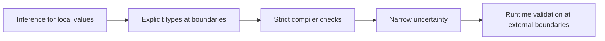

---

# 32. Typing the DOM

TypeScript includes types for browser APIs.

Suppose:

```ts
const button =
  document.querySelector(
    "#save"
  );
```

The result might be:

```text
Element | null
```

TypeScript is correct.

The selector may find nothing.

And even if it finds something, the general selector does not prove it is a button.

We need to narrow.

---

# 33. Null Checking DOM Queries

```ts
const button =
  document.querySelector(
    "#save"
  );

if (!button) {
  throw new Error(
    "Save button missing"
  );
}

button.addEventListener(
  "click",
  () => {
    ...
  }
);
```

This is safer than:

```ts
const button =
  document.querySelector(
    "#save"
  )!;
```

The non-null assertion:

```ts
!
```

says:

> Trust me, this is not null.

Sometimes that assumption is justified.

But it is still an assertion, not runtime verification.

---

# 34. Query a Specific Element Type

`querySelector()` can work with generic element types.

For example:

```ts
const form =
  document.querySelector<
    HTMLFormElement
  >(
    "#request-form"
  );
```

The result is:

```text
HTMLFormElement | null
```

We still need null handling.

Once narrowed, TypeScript knows form-specific properties and methods.

---

# 35. Event Typing

Suppose:

```ts
const input =
  document.querySelector<
    HTMLInputElement
  >("#search");

if (!input) {
  throw new Error(
    "Search input missing"
  );
}

input.addEventListener(
  "input",
  event => {
    console.log(
      event.currentTarget
    );
  }
);
```

DOM library definitions can infer useful event information.

But `event.target` is deliberately broad because events can originate from many node types.

Do not solve every typing inconvenience with:

```ts
as HTMLInputElement
```

without checking whether the assumption is structurally guaranteed.

---

# 36. API Typing: The Dangerous Shortcut

Suppose:

```ts
interface User {
  id: number;
  name: string;
  email: string;
}
```

We fetch:

```ts
const response =
  await fetch(
    "/api/user/42"
  );

const data =
  await response.json();
```

What is `data`?

This is where many TypeScript applications become unsafe.

Developers write:

```ts
const user =
  data as User;
```

Then:

```ts
console.log(
  user.name.toUpperCase()
);
```

The editor is happy.

The compiler is happy.

But what if the server returned:

```json
{
  "id": 42,
  "name": null,
  "email": "sara@example.com"
}
```

TypeScript does not validate this response.

The JavaScript crashes when calling:

```js
null.toUpperCase()
```

This is the **boundary illusion**.

---

# 37. The Boundary Illusion

A type assertion can make code *look* safe.

It does not make data safe.

Consider:

```ts
const user =
  responseData as User;
```

This statement means:

> TypeScript, treat `responseData` as `User`.

It does **not** mean:

> JavaScript, inspect this value and verify that it is a valid User.

Type assertions are erased when TypeScript is compiled to JavaScript.

A conceptual pipeline:

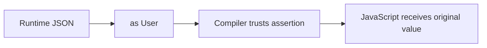

No validation step exists.

---

# 38. Assertions Can Hide Bugs

Suppose:

```ts
interface User {
  id: number;
  name: string;
}
```

Then:

```ts
const data:
  unknown = {
    id: "not-a-number",
    name: 99
  };

const user =
  data as User;
```

At runtime, the object is still:

```js
{
  id: "not-a-number",
  name: 99
}
```

Nothing changed.

No conversion happened.

No parsing happened.

No validation happened.

`as User` changed only the compiler's belief.

This distinction is fundamental.

---

# 39. Casting and Assertion Are Not the Same as Conversion

Developers sometimes call:

```ts
value as User
```

a “cast.”

That wording can suggest runtime conversion.

But TypeScript assertions do not convert values.

Compare:

```ts
const value =
  "42";

const number =
  Number(value);
```

This performs a runtime conversion.

After execution, `number` is actually a number.

But:

```ts
const number =
  value as unknown as number;
```

does not transform `"42"` into `42`.

It simply lies to the type checker.

Use assertions only when you have knowledge that the compiler cannot express—not as a substitute for checking data.

---

# 40. Trust Boundaries

A **trust boundary** is a point where data enters your trusted application logic from a source you do not fully control.

Important front-end boundaries include:

- API responses;
- URL parameters;
- browser storage;
- form input;
- server-rendered embedded data;
- external configuration;
- postMessage data;
- third-party SDKs;
- imported files;
- user-generated content.

A useful model is:

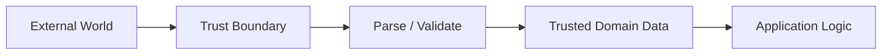

The critical transition is:

```text
unknown
↓
validated
↓
trusted domain value
```

---

# 41. APIs Are Untrusted at Runtime

Even if your backend is written by the same team, runtime failures can occur.

The server may:

- deploy a mismatched version;
- return null unexpectedly;
- omit a field;
- serialize a number as a string;
- return an error payload where success was expected;
- produce stale legacy data;
- be replaced by a mock or test server;
- contain its own bug.

TypeScript in the frontend cannot inspect the server's runtime behavior.

An API contract can be documented or shared.

Runtime validation is still the only way the browser can verify the actual value it received.

---

# 42. URL Parameters Are Strings Until Proven Otherwise

Suppose:

```text
/products?page=5
```

We read:

```ts
const params =
  new URLSearchParams(
    location.search
  );

const page =
  params.get("page");
```

The type is roughly:

```text
string | null
```

If our application wants a positive integer, we need to parse and validate.

```ts
function parsePage(
  value: string | null
): number {
  if (value === null) {
    return 1;
  }

  const page =
    Number.parseInt(
      value,
      10
    );

  if (
    !Number.isInteger(page)
    || page < 1
  ) {
    return 1;
  }

  return page;
}
```

The URL says:

```text
page=hello
```

because users can edit URLs.

Treat that as normal reality, not as an impossible edge case.

---

# 43. Browser Storage Is Also a Boundary

Suppose:

```ts
const raw =
  localStorage.getItem(
    "preferences"
  );
```

Even if our application originally stored the value, it may now be:

- old;
- malformed;
- manually edited;
- left behind by a previous version;
- missing.

This is unsafe:

```ts
const preferences =
  JSON.parse(raw!)
    as Preferences;
```

A safer approach is:

```text
read string
↓
parse JSON
↓
treat as unknown
↓
validate
↓
use as Preferences
```

---

# 44. Forms Are Runtime Data

TypeScript can type the DOM element:

```ts
const input:
  HTMLInputElement =
  ...;
```

But it cannot guarantee that:

```ts
input.value
```

contains a valid email, ID, date, amount, or business rule.

User input is external data.

HTML validation helps.

Server validation is required for security and correctness.

Application-level runtime validation may also be useful before constructing trusted domain values.

---

# 45. External Configuration

Suppose the application loads:

```json
{
  "apiBaseUrl":
    "https://api.example.com",
  "pageSize":
    20
}
```

A TypeScript interface:

```ts
interface Config {
  apiBaseUrl: string;
  pageSize: number;
}
```

does not verify the file.

If configuration can change independently of the compiled frontend, validate it.

Configuration errors can otherwise cause confusing failures far away from the boundary.

---

# 46. Manual Runtime Validation

For simple data, manual validation may be enough.

Suppose:

```ts
interface User {
  id: number;
  name: string;
  email: string;
}
```

We can define:

```ts
function parseUser(
  value: unknown
): User {
  if (
    typeof value !== "object"
    || value === null
  ) {
    throw new Error(
      "User must be an object"
    );
  }

  const candidate =
    value as Record<
      string,
      unknown
    >;

  if (
    typeof candidate.id
      !== "number"
  ) {
    throw new Error(
      "User.id must be a number"
    );
  }

  if (
    typeof candidate.name
      !== "string"
  ) {
    throw new Error(
      "User.name must be a string"
    );
  }

  if (
    typeof candidate.email
      !== "string"
  ) {
    throw new Error(
      "User.email must be a string"
    );
  }

  return {
    id:
      candidate.id,

    name:
      candidate.name,

    email:
      candidate.email
  };
}
```

Now the function performs actual runtime checks.

The returned object can reasonably be treated as a `User`.

---

# 47. Parsing Is Better Than Blind Assertion

Compare these two pipelines.

## Unsafe

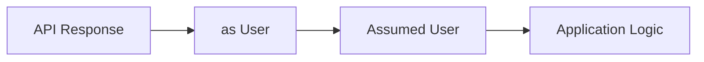

The assertion creates no runtime evidence.

## Safer

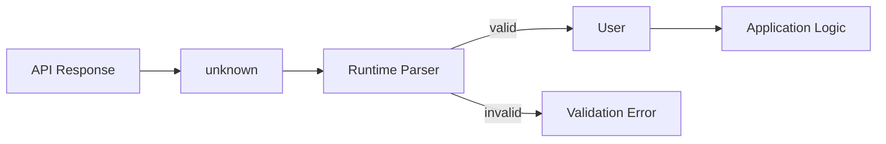

The second version makes trust explicit.

This is one of the chapter's most important diagrams.

---

# 48. Parse, Do Not Merely Check

A powerful design principle is:

> **Parse external data into a trusted domain representation.**

Why “parse” rather than only “validate”?

Because application boundaries may need to:

- check shape;
- convert types;
- normalize strings;
- provide defaults;
- reject invalid values;
- transform transport representation into domain representation.

For example, an API may send:

```json
{
  "createdAt":
    "2026-09-23T10:00:00Z"
}
```

Your domain model may choose to keep this as a string or convert it to another representation.

The important thing is that the conversion happens deliberately at the boundary.

---

# 49. Validation Errors Should Be Useful

This:

```ts
throw new Error(
  "Invalid data"
);
```

may be enough for a small exercise.

Production systems often benefit from more precise information.

For example:

```ts
type ValidationIssue = {
  path: string[];
  message: string;
};
```

Then malformed data might produce:

```js
[
  {
    path: ["email"],
    message:
      "Expected string"
  }
]
```

Useful error reporting helps:

- debugging;
- logging;
- monitoring;
- form feedback;
- API-contract investigation.

---

# 50. Schema Libraries

Handwritten validators become verbose for large object graphs.

Schema libraries allow developers to describe a runtime schema and derive or associate static types.

One representative library is Zod.

The important concept is not the brand.

It is:

> **One executable schema validates runtime values before they enter trusted code.**

---

# 51. Zod as a Representative Example

Conceptually:

```ts
import { z }
  from "zod";

const UserSchema =
  z.object({
    id:
      z.number(),

    name:
      z.string(),

    email:
      z.string().email()
  });
```

A type can be inferred:

```ts
type User =
  z.infer<
    typeof UserSchema
  >;
```

Now runtime parsing:

```ts
const user =
  UserSchema.parse(
    externalData
  );
```

If valid, `user` matches the schema.

If invalid, parsing fails with structured validation information.

This creates a useful connection:

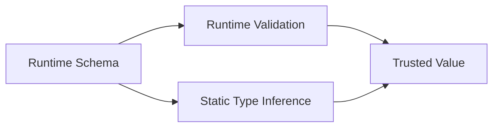

The same conceptual contract supports both runtime and compile-time use.

---

# 52. Safe Parsing

Sometimes validation failure is an expected application state rather than an exception.

A schema library may provide a result-oriented API.

Conceptually:

```ts
const result =
  UserSchema.safeParse(
    externalData
  );

if (!result.success) {
  console.error(
    result.error
  );

  return;
}

const user =
  result.data;
```

This works well when invalid data should be handled explicitly rather than thrown.

---

# 53. Schema Validation Does Not Remove Domain Logic

Suppose:

```ts
const AppointmentSchema =
  z.object({
    start:
      z.string(),

    end:
      z.string()
  });
```

Both strings may be syntactically valid.

But business logic might require:

```text
end > start
```

Similarly:

- a start date may need to precede an end date;
- a quantity may need to be available in stock;
- a username may need to be unique;
- a user may need permission for an operation.

Runtime schema validation checks structure and configured rules.

It does not automatically understand every domain invariant.

The type system and validator support domain logic.

They do not replace it.

---

# 54. Transport Types and Domain Types Can Differ

Suppose an API returns:

```json
{
  "id":
    "USR-42",
  "createdAt":
    "2026-09-23T10:00:00Z"
}
```

We could use the same type everywhere.

But a larger application may benefit from separating:

```ts
type UserDto = {
  id: string;
  createdAt: string;
};
```

from an internal domain representation.

For example:

```ts
type User = {
  id: UserId;
  createdAt:
    Date;
};
```

A boundary parser performs the conversion.

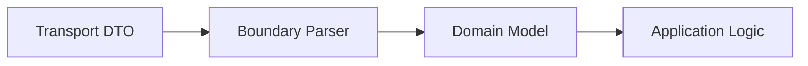

This keeps transport quirks from spreading throughout the codebase.

---

# 55. A Complete API Boundary Example

Suppose:

```ts
interface User {
  id: number;
  name: string;
  email: string;
}
```

The unsafe version:

```ts
async function loadUser(
  id: number
): Promise<User> {
  const response =
    await fetch(
      `/api/users/${id}`
    );

  const data =
    await response.json();

  return data as User;
}
```

The return type makes a promise:

```text
Promise<User>
```

But the implementation did not prove that promise.

---

# 56. Better: Return `unknown` from the Raw Boundary

Conceptually:

```ts
async function fetchJson(
  url: string
): Promise<unknown> {
  const response =
    await fetch(url);

  if (!response.ok) {
    throw new Error(
      `HTTP ${response.status}`
    );
  }

  return response.json();
}
```

Now the raw network layer is honest:

```text
I received some JSON-compatible value.
I do not yet know whether it matches the domain.
```

Then:

```ts
async function loadUser(
  id: number
): Promise<User> {
  const raw =
    await fetchJson(
      `/api/users/${id}`
    );

  return parseUser(raw);
}
```

The trusted return type is justified by runtime parsing.

---

# 57. Boundary Architecture

This layering is powerful:

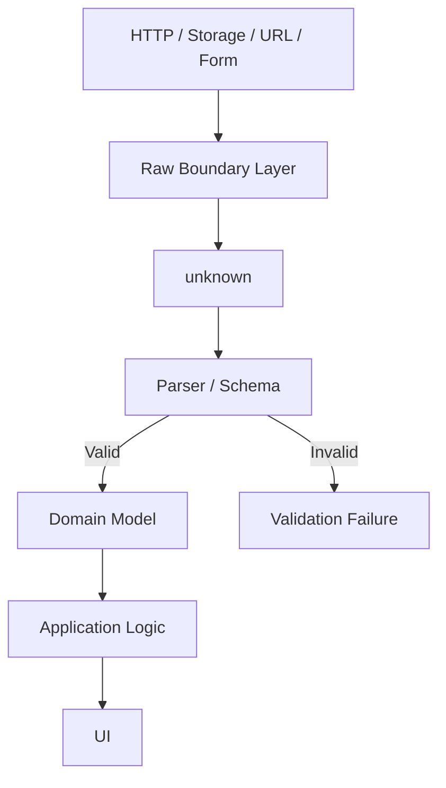

Application code after the parser can be simpler because uncertainty is concentrated at the edge.

Instead of checking everywhere:

```ts
if (
  typeof user.name
    === "string"
) {
  ...
}
```

the parser establishes that guarantee once.

---

# 58. The "Parse, Then Trust" Principle

A healthy architecture often looks like:

```text
external value
↓
unknown
↓
validate / parse
↓
trusted domain type
↓
ordinary application code
```

This is much better than:

```text
external value
↓
as SomeType
↓
pretend everything is valid
```

The first model creates evidence.

The second creates confidence without evidence.

---

# 59. The `satisfies` Operator

Sometimes we want TypeScript to verify that a value conforms to a type without discarding useful inference.

Consider:

```ts
type RouteConfig = {
  path: string;
  secure: boolean;
};

const routes = {
  dashboard: {
    path: "/dashboard",
    secure: true
  },

  help: {
    path: "/help",
    secure: false
  }
} satisfies
  Record<
    string,
    RouteConfig
  >;
```

This checks that the object conforms to the expected structure while preserving useful information about the specific keys.

`satisfies` is helpful for:

- configuration objects;
- lookup tables;
- component maps;
- route definitions.

It is a static checking tool.

Like other TypeScript syntax, it performs no runtime validation.

---

# 60. Assertions Have Legitimate Uses

Not every use of `as` is wrong.

Sometimes the developer knows something the compiler cannot prove.

For example, after a runtime check:

```ts
const element =
  document.getElementById(
    "request-form"
  );

if (
  !(element
    instanceof
      HTMLFormElement)
) {
  throw new Error(
    "Expected form"
  );
}

const form = element;
```

No assertion is needed here because runtime narrowing works.

But some APIs or framework boundaries can make the compiler unable to preserve knowledge cleanly.

An assertion may then be practical.

The rule is:

> Use assertions to express knowledge you actually possess—not to avoid inconvenient compiler errors.

---

# 61. Double Assertions Are a Warning Sign

Code like:

```ts
const user =
  value
    as unknown
    as User;
```

should attract attention.

It effectively says:

> Ignore incompatibility and force the compiler to accept this.

There may be rare framework or interop situations where such code is necessary.

At application boundaries, it is usually a sign that validation or modeling is missing.

---

# 62. Non-Null Assertions Are Also Assertions

Consider:

```ts
const form =
  document.querySelector(
    "#request-form"
  )!;
```

The `!` means:

> Treat this as non-null.

If the element is missing, runtime code can still fail.

The assertion does not create the element.

Compare:

```ts
const form =
  document.querySelector(
    "#request-form"
  );

if (!form) {
  throw new Error(
    "Request form missing"
  );
}
```

The second version establishes runtime evidence.

Use non-null assertions only when the invariant is genuinely guaranteed elsewhere and the assertion improves rather than hides the design.

---

# 63. Structural Typing

TypeScript is primarily structurally typed.

Suppose:

```ts
interface User {
  id: string;
  name: string;
}
```

and:

```ts
interface ProductOwner {
  id: string;
  name: string;
}
```

These interfaces have the same shape.

A value satisfying one also structurally satisfies the other.

```ts
const user: User = {
  id: "U-1",
  name: "Sara"
};

const owner:
  ProductOwner =
  user;
```

TypeScript accepts this because it compares structure.

That is often convenient.

It enables flexible composition and duck-typing-style patterns.

But sometimes domain meaning matters even when representation is identical.

---

# 64. Structural Typing's Identifier Problem

Suppose:

```ts
type UserId = string;
type ProductId = string;
```

Then:

```ts
function loadUser(
  id: UserId
) {
  ...
}
```

can be called with:

```ts
const productId:
  ProductId =
  "P-42";

loadUser(productId);
```

TypeScript sees both as `string`.

The domain sees them as different concepts.

For most applications, this may be acceptable.

For some domains, mixing identifiers would be dangerous.

---

# 65. Branded Types

One advanced pattern simulates nominal distinctions through branding.

For example:

```ts
declare const userIdBrand:
  unique symbol;

type UserId =
  string & {
    readonly
    [userIdBrand]:
      "UserId";
  };
```

Similarly:

```ts
declare const productIdBrand:
  unique symbol;

type ProductId =
  string & {
    readonly
    [productIdBrand]:
      "ProductId";
  };
```

Now the type system distinguishes them.

Conceptually:

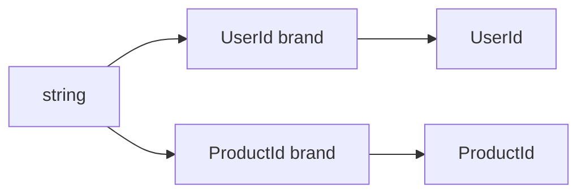

Even though both are represented as strings at runtime, they carry different static identities.

---

# 66. Creating Branded Values Safely

Do not simply write:

```ts
const id =
  raw as UserId;
```

at an untrusted boundary and assume safety.

Instead, parse first.

```ts
function parseUserId(
  value: unknown
): UserId {
  if (
    typeof value !== "string"
    ||
    !value.startsWith(
      "U-"
    )
  ) {
    throw new Error(
      "Invalid UserId"
    );
  }

  return value as UserId;
}
```

Here the assertion occurs **after runtime evidence**.

The brand captures a proven invariant in the static type system.

That is much stronger than branding arbitrary external data.

---

# 67. When Branded Types Are Worth It

Branded types can help in systems with many same-representation concepts:

- user IDs;
- product IDs;
- order IDs;
- account numbers;
- validated email addresses;
- normalized URLs;
- currencies or units.

But they add complexity.

For a small application:

```ts
type UserId = string;
```

may be completely adequate.

Do not introduce branding merely because it looks advanced.

Use it when accidental substitution would be a meaningful source of bugs.

---

# 68. Branded Types Do Not Exist at Runtime

After compilation, a branded `UserId` is still a string.

The brand exists only in the TypeScript type system.

That means:

- runtime validation is still required;
- serialization does not preserve a special brand;
- values loaded from storage need parsing again;
- values received from APIs need parsing again.

Branding improves static modeling after a boundary.

It does not replace the boundary.

---

# 69. Typed Data Does Not Mean Safe Data

We can now distinguish several levels of confidence.

### Level 1 — Untyped external value

```ts
unknown
```

We know almost nothing.

### Level 2 — Asserted value

```ts
value as User
```

The compiler believes us.

Runtime evidence may still be zero.

### Level 3 — Narrowed value

```ts
if (isUser(value)) {
  ...
}
```

Runtime checks provide evidence.

### Level 4 — Parsed domain value

```ts
const user =
  UserSchema.parse(value);
```

The boundary validates and returns a trusted representation.

### Level 5 — Domain-specific refined value

```ts
const userId =
  parseUserId(rawId);
```

The value may now represent stronger domain invariants.

Conceptually:

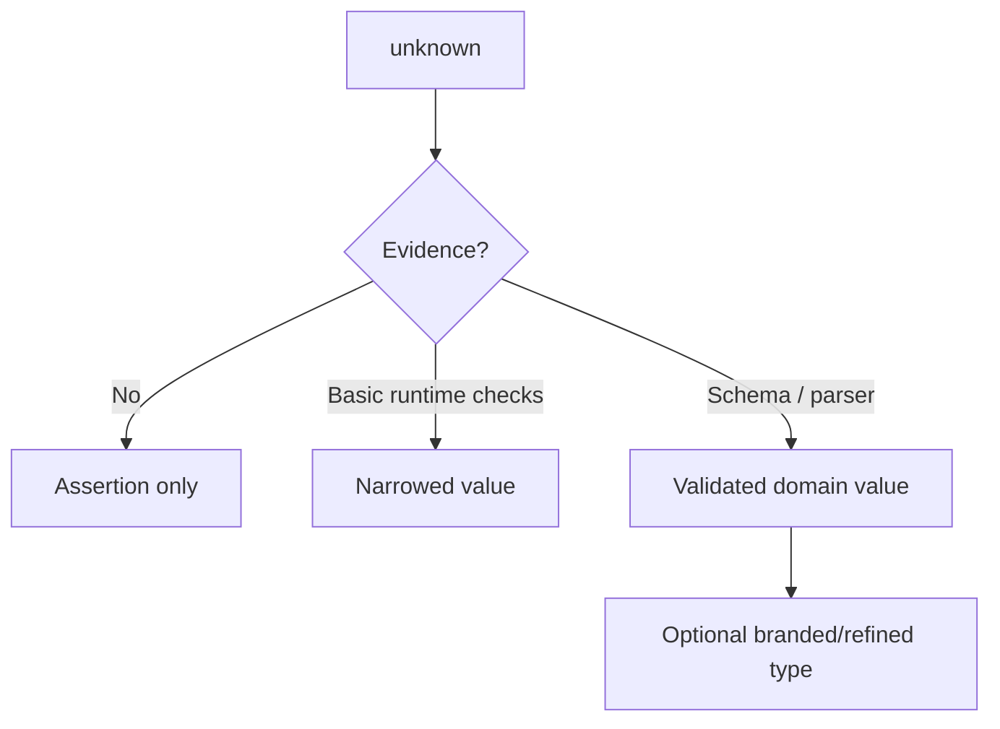

The key difference is not how sophisticated the TypeScript syntax looks.

It is whether runtime evidence exists.

---

# 70. TypeScript and APIs: Static Contracts Still Matter

Runtime validation does not make static API types unnecessary.

Static types still provide enormous value.

Suppose:

```ts
type CreateRequestInput = {
  serviceId: string;
  details: string;
};

type CreateRequestResult = {
  id: string;
  status:
    "submitted";
};
```

These types help frontend code:

- construct requests correctly;
- use responses correctly after validation;
- refactor safely;
- provide editor assistance;
- communicate intent.

The architecture is therefore not:

```text
TypeScript OR validation
```

It is:

```text
TypeScript AND validation
```

They solve different problems.

---

# 71. Shared Types Are Not Runtime Validation

A full-stack team may share a TypeScript type:

```ts
export interface User {
  id: number;
  name: string;
}
```

between client and server.

That reduces duplication.

It still does not guarantee the HTTP response is valid.

Possible failures include:

- old server version;
- proxy transformation;
- corrupted cache;
- bug in serialization;
- non-TypeScript service;
- test fixture drift.

Shared types align source-level intent.

Runtime validation verifies the actual value.

---

# 72. Generated API Types

Some systems generate TypeScript definitions from:

- OpenAPI;
- GraphQL schemas;
- RPC contracts;
- other interface descriptions.

This can greatly improve consistency.

Generated static types are still static.

Unless runtime parsing is also generated or performed, the browser is trusting the transport.

Generated contracts reduce mismatch risk.

They do not abolish trust boundaries.

---

# 73. Runtime Validation Strategy Should Be Proportionate

Do we need to validate every object at every function call?

No.

That would be wasteful and noisy.

Validate where trust changes.

For example:

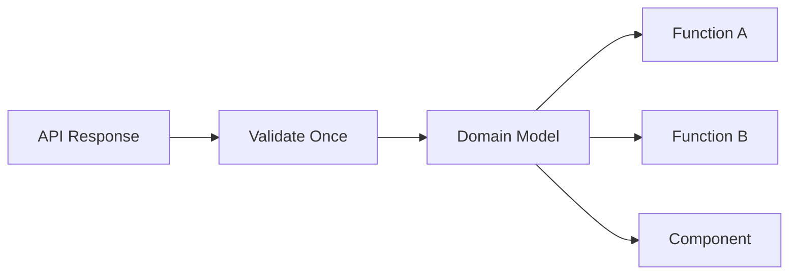

If the boundary produced a trusted `User`, downstream application code can rely on that contract.

We do not need to repeatedly verify:

```ts
typeof user.name
  === "string"
```

everywhere.

The purpose of validation is to **concentrate uncertainty at boundaries**, not spread defensive checking through the entire application.

---

# 74. Safe Configuration Example

Suppose:

```ts
type AppConfig = {
  apiBaseUrl: string;
  pageSize: number;
  features: {
    newSearch: boolean;
  };
};
```

Unsafe:

```ts
const config =
  window.APP_CONFIG
    as AppConfig;
```

Safer conceptual parser:

```ts
function parseConfig(
  value: unknown
): AppConfig {
  ...
}
```

Then:

```ts
const config =
  parseConfig(
    window.APP_CONFIG
  );
```

Now the rest of the application can rely on:

```ts
config.pageSize
```

being a number.

---

# 75. URL Boundary Example

Suppose filters come from the URL.

```text
/products?status=active&page=3
```

Domain types:

```ts
type ProductStatus =
  | "active"
  | "archived";

type ProductFilters = {
  status:
    ProductStatus;

  page:
    number;
};
```

Parser:

```ts
function parseStatus(
  value: string | null
): ProductStatus {
  if (
    value === "active"
    ||
    value === "archived"
  ) {
    return value;
  }

  return "active";
}
```

```ts
function parsePage(
  value: string | null
): number {
  const parsed =
    Number(value);

  if (
    !Number.isInteger(
      parsed
    )
    ||
    parsed < 1
  ) {
    return 1;
  }

  return parsed;
}
```

Then:

```ts
function parseFilters(
  search:
    URLSearchParams
): ProductFilters {
  return {
    status:
      parseStatus(
        search.get(
          "status"
        )
      ),

    page:
      parsePage(
        search.get(
          "page"
        )
      )
  };
}
```

Now route state becomes a trusted domain object.

---

# 76. Storage Boundary Example

Suppose preferences are stored:

```ts
type Preferences = {
  theme:
    "light"
    | "dark";

  pageSize:
    number;
};
```

Unsafe:

```ts
const preferences =
  JSON.parse(
    localStorage
      .getItem(
        "preferences"
      )!
  ) as Preferences;
```

Safer:

```ts
function loadPreferences():
  Preferences {
  const raw =
    localStorage
      .getItem(
        "preferences"
      );

  if (!raw) {
    return {
      theme: "light",
      pageSize: 20
    };
  }

  let parsed:
    unknown;

  try {
    parsed =
      JSON.parse(raw);
  } catch {
    return {
      theme: "light",
      pageSize: 20
    };
  }

  return parsePreferences(
    parsed
  );
}
```

The boundary handles:

- missing data;
- invalid JSON;
- incorrect structure.

Application code receives a valid `Preferences` object.

---

# 77. Form Boundary Example

Suppose a quantity input:

```html
<input
  id="quantity"
  type="number"
  min="1"
>
```

In JavaScript:

```ts
const quantityInput =
  document.querySelector<
    HTMLInputElement
  >("#quantity");
```

The DOM element is typed.

But:

```ts
quantityInput.value
```

is still a string.

Even:

```ts
quantityInput.valueAsNumber
```

can yield `NaN`.

TypeScript typing the element does not prove business validity.

Parse and validate:

```ts
function parseQuantity(
  value: number
): number {
  if (
    !Number.isInteger(value)
    ||
    value < 1
  ) {
    throw new Error(
      "Quantity must be a positive integer"
    );
  }

  return value;
}
```

The trusted domain value appears only after the runtime check.

---

# 78. Exhaustiveness in UI State

Consider:

```ts
type ViewState =
  | {
      kind: "loading";
    }
  | {
      kind: "empty";
    }
  | {
      kind: "ready";
      users: User[];
    }
  | {
      kind: "error";
      message: string;
    };
```

A renderer:

```ts
function renderView(
  state: ViewState
): string {
  switch (state.kind) {
    case "loading":
      return "Loading...";

    case "empty":
      return "No users";

    case "ready":
      return `${
        state.users.length
      } users`;

    case "error":
      return state.message;

    default:
      return assertNever(
        state
      );
  }
}
```

If a later feature adds:

```ts
{
  kind: "offline";
}
```

the compiler can force the rendering code to address it.

This is a strong example of static types protecting application evolution.

---

# 79. Typed Errors and Result Types

Throwing exceptions is not the only way to model expected failure.

For some operations, a result union is useful.

```ts
type Result<T, E> =
  | {
      ok: true;
      value: T;
    }
  | {
      ok: false;
      error: E;
    };
```

Then:

```ts
type ParseUserError = {
  issues:
    string[];
};
```

A parser could return:

```ts
Result<
  User,
  ParseUserError
>
```

instead of throwing.

This can make expected validation failure explicit in the function signature.

Do not force every function into a result wrapper.

Use the pattern when expected failure is part of ordinary control flow.

---

# 80. TypeScript Does Not Replace Tests

A type system can prove many useful properties.

It cannot prove:

- that the API server is online;
- that a button visually appears correctly;
- that a user can complete a checkout;
- that a calculation implements the correct business rule;
- that a translation is accurate;
- that a permission rule matches organizational policy.

TypeScript complements testing.

It does not replace it.

Chapter 16 will examine testing strategy in detail.

---

# 81. TypeScript Does Not Replace Security

If a form value has static type:

```ts
string
```

that does not mean the string is safe HTML.

If an object has type:

```ts
AuthenticatedUser
```

that does not prove a backend authorization decision.

If a value has type:

```ts
AdminRole
```

that does not mean the browser should be trusted to enforce access control.

Static types help developers avoid programming mistakes.

Security boundaries still require runtime enforcement.

Chapter 13 will return to this distinction.

---

# 82. TypeScript Does Not Replace Runtime Contracts

We can now separate responsibilities clearly.

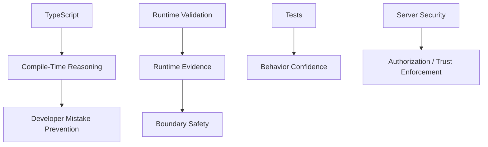

These systems complement each other.

No single one solves every problem.

---

# 83. Practical Example: The Malformed User Response

We will now follow the complete failure and repair path required by this chapter.

Suppose our frontend expects:

```ts
interface User {
  id: number;
  name: string;
  email: string;
}
```

The API unexpectedly returns:

```json
{
  "id": "42",
  "name": null,
  "email": "sara@example.com"
}
```

---

# 84. Step 1 — The Misleading Assertion

```ts
async function loadUser():
  Promise<User> {
  const response =
    await fetch(
      "/api/user"
    );

  const data =
    await response.json();

  return data as User;
}
```

Then:

```ts
const user =
  await loadUser();

console.log(
  user.name.toUpperCase()
);
```

TypeScript accepts the code.

Runtime fails.

The assertion created an illusion of safety.

---

# 85. Step 2 — Tell the Truth with `unknown`

Change the raw fetch boundary:

```ts
async function fetchUserRaw():
  Promise<unknown> {
  const response =
    await fetch(
      "/api/user"
    );

  if (!response.ok) {
    throw new Error(
      `HTTP ${response.status}`
    );
  }

  return response.json();
}
```

Now:

```ts
const data =
  await fetchUserRaw();
```

has type:

```text
unknown
```

Application code cannot casually call:

```ts
data.name
```

The type system is correctly forcing us to prove the value.

---

# 86. Step 3 — Validate

Manual parser:

```ts
function parseUser(
  value: unknown
): User {
  if (
    typeof value !== "object"
    ||
    value === null
  ) {
    throw new Error(
      "Expected user object"
    );
  }

  const object =
    value as Record<
      string,
      unknown
    >;

  if (
    typeof object.id
      !== "number"
  ) {
    throw new Error(
      "Invalid user id"
    );
  }

  if (
    typeof object.name
      !== "string"
  ) {
    throw new Error(
      "Invalid user name"
    );
  }

  if (
    typeof object.email
      !== "string"
  ) {
    throw new Error(
      "Invalid user email"
    );
  }

  return {
    id:
      object.id,

    name:
      object.name,

    email:
      object.email
  };
}
```

The malformed API response fails here.

The error occurs at the boundary rather than much later in unrelated UI code.

---

# 87. Step 4 — Create Trusted Domain Data

```ts
async function loadUser():
  Promise<User> {
  const raw =
    await fetchUserRaw();

  return parseUser(raw);
}
```

Now the function's return type is justified.

Downstream code can safely rely on:

```ts
user.name
```

being a string according to the parser's contract.

---

# 88. Step 5 — Replace Handwritten Validation When Complexity Grows

As domain objects expand, a schema library may improve maintainability.

Conceptually:

```ts
const UserSchema =
  z.object({
    id:
      z.number(),

    name:
      z.string(),

    email:
      z.string().email()
  });
```

Then:

```ts
type User =
  z.infer<
    typeof UserSchema
  >;
```

and:

```ts
async function loadUser():
  Promise<User> {
  const raw =
    await fetchUserRaw();

  return UserSchema.parse(
    raw
  );
}
```

The architectural pattern remains the same even if the library changes.

---

# 89. The Trusted Core

A useful application design is to keep the uncertain world at the edges.

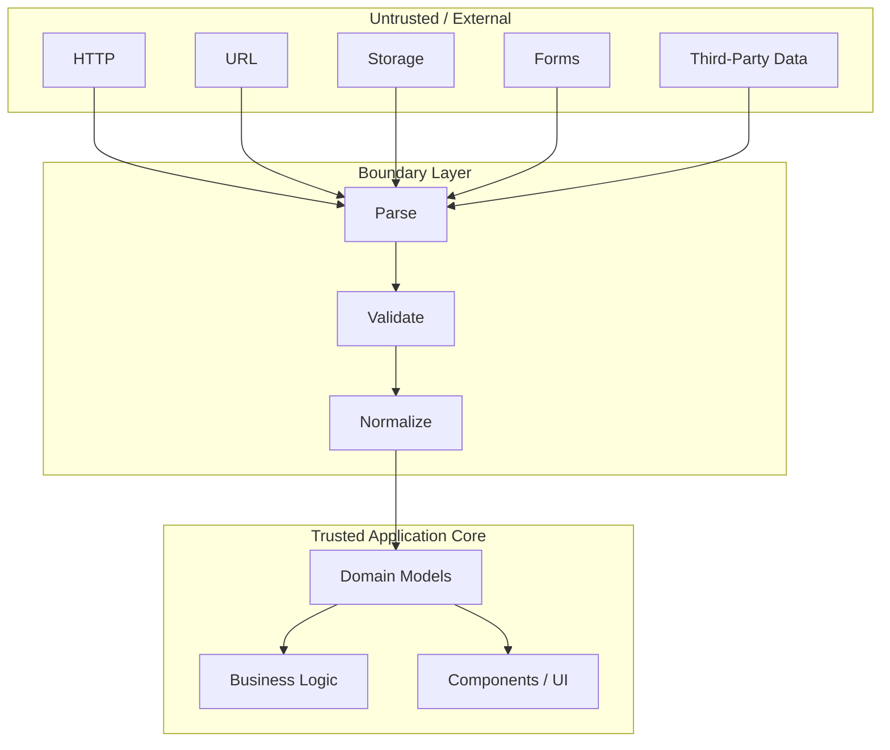

This architecture simplifies the center of the application.

The boundary is strict so that the core can be simpler.

---

# Misconceptions to Leave Behind

## “TypeScript validates API responses.”

No.

TypeScript performs static analysis.

The browser receives runtime values that still require validation where trust matters.

---

## “If the compiler accepts `as User`, the data is a User.”

No.

A type assertion changes the compiler's interpretation.

It performs no runtime check.

---

## “Type assertions convert values.”

No.

```ts
"42" as unknown as number
```

does not produce the number `42`.

Runtime conversion requires actual JavaScript logic.

---

## “`any` means unknown data.”

Not safely.

`any` disables most checking.

`unknown` is the better representation when a value exists but has not yet been verified.

---

## “`unknown` is inconvenient, so it should be avoided.”

The inconvenience is intentional.

It forces the code to establish evidence before using uncertain values.

---

## “A custom type guard is automatically correct.”

No.

A type guard is runtime code.

If its logic is wrong, TypeScript can be misled.

---

## “Generics make code more reusable automatically.”

No.

Generics help preserve relationships among types.

A generic abstraction that does not represent a useful relationship can make code harder to understand.

---

## “Strict TypeScript means annotating everything.”

No.

Inference remains valuable.

Strictness is about rejecting unsafe assumptions.

---

## “Shared frontend/backend types eliminate runtime validation.”

No.

They align source-level contracts but do not prove what actually crossed the network.

---

## “Schema libraries replace business rules.”

No.

A schema can validate shape and configured constraints.

Domain logic still exists.

---

## “Branded types make runtime strings safer.”

Only after a legitimate boundary parser creates the branded value.

The brand itself exists only at compile time.

---

## “A non-null assertion proves that a DOM element exists.”

No.

It only tells TypeScript to stop warning.

Runtime reality remains unchanged.

---

## “TypeScript replaces tests.”

No.

Types, runtime validation, tests, and security controls solve different classes of problems.

---

# Chapter Summary

TypeScript improves front-end engineering by making assumptions explicit and checking many of them before runtime.

But effective TypeScript begins with inference.

Local values such as:

```ts
const name =
  "Sara";
```

rarely need redundant annotations.

Explicit types are most valuable at meaningful boundaries:

- functions;
- modules;
- components;
- APIs;
- domain models.

Interfaces and type aliases model application data.

Literal types and unions describe finite possibilities.

Discriminated unions make state machines and UI states safer.

Narrowing uses runtime evidence to refine static uncertainty.

Important tools include:

```ts
typeof
in
discriminants
custom guards
unknown
never
```

Generics preserve relationships between types.

For example:

```ts
ApiResult<User>
```

and:

```ts
ApiResult<Product[]>
```

share one structure without discarding payload information.

Strict TypeScript helps the code reflect runtime possibilities more accurately.

It should work with inference, not replace it.

The most important distinction in the chapter is the difference between static confidence and runtime evidence.

Unsafe:

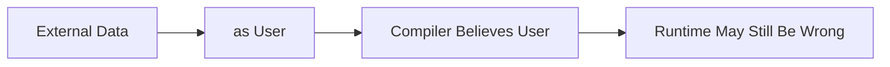

Safer:

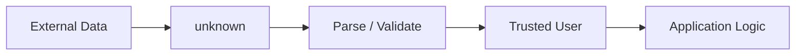

Trust boundaries include:

- APIs;
- URL parameters;
- browser storage;
- forms;
- external configuration;
- third-party input.

Validate at those boundaries.

Then let the trusted application core work with domain types.

Schema libraries such as Zod can help when handwritten validation becomes too verbose, but the concept is broader than any library:

> **External values should earn trusted types through runtime evidence.**

Branded types can add stronger distinctions among structurally identical values such as `UserId` and `ProductId`, but they are an advanced modeling technique and should be used only when the domain benefits.

The central lesson is:

> **TypeScript protects the relationship between the code and its declared assumptions. Runtime validation protects the relationship between those assumptions and the outside world.**

You need both.

---

# Review Questions

1. What is type inference?

2. Why should local variables not always receive explicit type annotations?

3. Where are explicit type annotations especially valuable?

4. What is structural typing?

5. What is the practical difference between an interface and a type alias?

6. What is a literal type?

7. What is a union type?

8. Why does a union often require narrowing before use?

9. How does `typeof` narrowing work?

10. What is a property-based narrowing check?

11. What is a discriminated union?

12. Why can discriminated unions prevent impossible application states?

13. What is an intersection type?

14. What is the difference between `any` and `unknown`?

15. Why is `unknown` appropriate for untrusted runtime values?

16. What is a custom type guard?

17. Why can a badly implemented type guard still create unsafe code?

18. What does the `never` type represent?

19. How can `never` help with exhaustive `switch` statements?

20. What problem do generics solve?

21. What does a generic constraint do?

22. Why can utility types become harmful when overused?

23. What is the purpose of strict TypeScript settings?

24. Why is strictness compatible with type inference?

25. Why does `querySelector()` often return a nullable type?

26. What is a non-null assertion, and why does it not provide runtime safety?

27. Why is `response as User` not validation?

28. What happens to TypeScript type assertions after compilation?

29. What is a trust boundary?

30. Why are URL parameters a trust boundary?

31. Why should data from `localStorage` be treated as untrusted?

32. Why are form values runtime data even in a TypeScript application?

33. What is the difference between runtime validation and static typing?

34. What does it mean to parse external data into a domain model?

35. Why might transport types and domain types be different?

36. What is a schema validator?

37. Why should Zod be thought of as one implementation of runtime contracts rather than the conceptual foundation?

38. What does the `satisfies` operator do?

39. Why does `satisfies` not provide runtime validation?

40. What is a branded type?

41. Why can branded types help distinguish `UserId` from `ProductId`?

42. Why should branded values still be created through runtime parsers at external boundaries?

43. Why do shared client/server TypeScript types not eliminate runtime validation?

44. Why should validation normally be concentrated at boundaries rather than repeated throughout application logic?

45. How do TypeScript, runtime validation, tests, and security controls complement one another?

---

# End-of-Chapter Practical Lab — Build a Safe Data Boundary

Create:

```text
chapter-05-typescript/
├── index.html
├── app.ts
├── api.ts
├── models.ts
├── parsers.ts
├── storage.ts
└── schemas.ts
```

The goal is to build one feature twice:

1. unsafely, using assertions;
2. safely, using runtime boundaries.

---

## Stage 1 — Model the Domain

Create types for:

```ts
User
ServiceRequest
RequestStatus
Preferences
```

Use literal unions where appropriate.

Create a discriminated union representing:

```text
idle
loading
success
error
```

request states.

---

## Stage 2 — Test Type Inference

Create several local values.

Allow TypeScript to infer them.

Then add explicit annotations only where they communicate useful contracts.

Identify at least three annotations that were redundant and remove them.

---

## Stage 3 — Introduce `unknown`

Create:

```ts
function receiveExternalValue():
  unknown {
  ...
}
```

Attempt to access properties without narrowing.

Observe TypeScript's error.

Then narrow using:

```ts
typeof
in
```

and a custom type guard.

---

## Stage 4 — Build an Exhaustive Renderer

Use a discriminated union for application state.

Render each state with a `switch`.

Create:

```ts
assertNever()
```

for the default branch.

Add a new state to the union and verify that the compiler identifies the unhandled case.

---

## Stage 5 — Create a Generic API Result

Create:

```ts
type ApiResult<T> =
  ...
```

Use it with:

```ts
User
ServiceRequest[]
Preferences
```

Demonstrate that each result preserves its own payload type.

---

## Stage 6 — Create the Unsafe API

Simulate an API response:

```json
{
  "id": "42",
  "name": null,
  "email": "sara@example.com"
}
```

Write:

```ts
const user =
  data as User;
```

Call:

```ts
user.name.toUpperCase()
```

Observe the runtime failure.

Explain why TypeScript did not protect you.

---

## Stage 7 — Replace the Assertion with `unknown`

Change the raw API layer so it returns:

```ts
Promise<unknown>
```

Verify that application code can no longer use the value without narrowing.

---

## Stage 8 — Write a Manual Parser

Implement:

```ts
parseUser(
  value: unknown
): User
```

Validate:

- object shape;
- ID type;
- name type;
- email type.

Return a new trusted `User`.

Reject malformed input.

---

## Stage 9 — Add a Schema Library

Implement the same contract with a runtime schema library such as Zod.

Compare:

- code size;
- error reporting;
- inferred static types;
- readability.

Do not judge only by line count.

---

## Stage 10 — Validate URL State

Read:

```text
?status=active&page=3
```

using:

```ts
URLSearchParams
```

Parse into:

```ts
ProductFilters
```

Reject or normalize:

```text
?page=-5
?page=hello
?status=unknown
```

The resulting application state should always be valid.

---

## Stage 11 — Validate Browser Storage

Store preferences in:

```ts
localStorage
```

Then manually corrupt the stored value using DevTools.

Reload the application.

The parser should:

- reject invalid JSON;
- reject invalid fields;
- fall back safely.

---

## Stage 12 — Add Branded IDs

Create:

```ts
UserId
ProductId
```

as branded types.

Verify that:

```ts
loadUser(productId)
```

fails at compile time.

Create parser functions that validate prefixes before producing branded IDs.

---

## Stage 13 — Draw the Trust Architecture

Create a Mermaid diagram showing:

```text
API
URL
Storage
Forms
Configuration
```

flowing through:

```text
unknown
→ parser
→ validation
→ domain types
→ application logic
```

Your diagram should clearly identify where trust changes.

---

# Key Terms

**TypeScript** — a statically typed language layer built on JavaScript that performs type analysis before runtime.

**Type inference** — TypeScript's ability to determine a type from surrounding code without an explicit annotation.

**Type annotation** — explicit syntax declaring the intended type of a value, parameter, return value, or structure.

**Interface** — a TypeScript declaration commonly used to describe object contracts.

**Type alias** — a named TypeScript type expression that can represent objects, unions, intersections, primitives, and other combinations.

**Literal type** — a type representing an exact value such as `"approved"` rather than the broader `string`.

**Union type** — a type representing one of several alternatives.

**Discriminated union** — a union whose members contain a common literal property that allows safe narrowing.

**Intersection type** — a type requiring compatibility with multiple combined type structures.

**Narrowing** — the process by which runtime checks allow TypeScript to refine a broader type into a more specific one.

**`unknown`** — a safe top type representing a value whose structure is not yet known and must be narrowed before use.

**`any`** — a type that largely disables TypeScript checking for a value.

**Type guard** — runtime logic that allows TypeScript to narrow a value to a more specific type.

**Type predicate** — syntax such as `value is User` used by a custom type guard.

**`never`** — a type representing values that should not occur.

**Exhaustiveness checking** — ensuring that every possible union member or state has been handled.

**Generic** — a type parameter that preserves relationships among types across reusable functions, types, or components.

**Generic constraint** — a requirement restricting which types can be used for a generic parameter.

**Utility type** — a built-in TypeScript type transformation such as `Partial`, `Pick`, `Omit`, or `Record`.

**Strict mode** — a group of TypeScript compiler checks designed to reject more unsafe assumptions.

**Non-null assertion** — the postfix `!` operator telling TypeScript to treat a value as non-null without performing a runtime check.

**Type assertion** — syntax such as `value as User` that changes TypeScript's static interpretation without runtime validation.

**Structural typing** — compatibility based primarily on the structure of values rather than explicit nominal identity.

**Trust boundary** — a point where data crosses from an external or unverified source into trusted application logic.

**Runtime validation** — executable checks performed while the application is running to verify actual values.

**Parser** — code that accepts an untrusted representation and either produces a trusted domain value or reports failure.

**Domain model** — an application-level representation designed around the meanings and invariants of the problem domain.

**DTO** — Data Transfer Object; a structure representing data as transported between systems.

**Schema** — an executable or declarative description of expected runtime data structure and constraints.

**Zod** — a TypeScript-oriented runtime schema library used in this chapter as one representative implementation of runtime validation.

**`satisfies`** — a TypeScript operator that checks compatibility with a type while preserving useful inference of the original expression.

**Branded type** — a static pattern that distinguishes structurally identical runtime values through an additional compile-time marker.

**Nominal typing** — type compatibility based on explicit type identity rather than only structural shape; TypeScript can simulate aspects of this with branding.

---

# Closing Perspective

TypeScript is powerful because it makes assumptions visible.

A JavaScript function might silently assume:

```text
user exists
user.name exists
user.name is a string
user.id is a number
```

TypeScript can encode those assumptions.

The compiler can then warn when our own code violates them.

That is a major improvement.

But front-end applications do not live entirely inside the compiler's world.

They communicate with:

- servers;
- browsers;
- URLs;
- storage;
- users;
- configuration;
- third-party systems.

Those systems provide runtime values.

TypeScript cannot inspect those values merely because an interface exists in source code.

This is why:

```ts
const user =
  response as User;
```

is one of the most important lines in this chapter.

It looks like certainty.

It is only an assertion.

A stronger application does this instead:

```text
external data
↓
unknown
↓
runtime parsing
↓
validation
↓
trusted domain value
↓
application logic
```

Once uncertainty has been handled at the boundary, TypeScript becomes even more valuable.

The application core can work with:

- well-modeled unions;
- generic APIs;
- exhaustive state handling;
- precise identifiers;
- safe component contracts.

The combination is stronger than either system alone.

Static types give us compile-time confidence.

Runtime contracts give us evidence.

The boundary between those two worlds is where reliable front-end engineering begins.
