# Chapter 6 — Component-Driven Architecture & Design Patterns

Modern front-end applications are rarely built as one continuous script operating on one continuous document.

Instead, they are usually divided into **components**.

A component might be:

- a button;
- a form field;
- a search box;
- a product card;
- a navigation bar;
- a modal;
- a data table;
- a dashboard panel;
- an entire feature area.

This sounds simple.

But the difficult question is not:

> How do I create a component?

Framework documentation can answer that quickly.

The difficult question is:

> **Where should one component end and another begin?**

That is an architectural question.

A poor component boundary can create:

- tightly coupled code;
- duplicated behavior;
- confusing state ownership;
- difficult testing;
- fragile reuse;
- excessive props;
- excessive events;
- hidden dependencies;
- or a forest of tiny components that makes simple behavior hard to follow.

A good boundary makes responsibility clearer.

It helps developers reason about:

- what a unit owns;
- what it needs from outside;
- what it exposes;
- what changes together;
- what can vary independently;
- and what should remain private.

This chapter is therefore not mainly about React components or Vue components.

It is about **component architecture**.

React and Vue will appear as examples because they are widely used component systems, but the principles should remain useful even when a framework changes.

Our progression is:

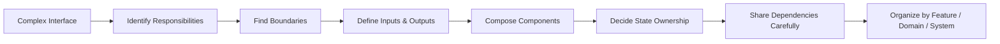

The central principle is:

> **A component should exist because it owns a coherent responsibility—not merely because some markup can be extracted into another file.**

---

# 1. Why Components Exist

Before discussing patterns, we should ask a more basic question.

Why do front-end applications use components at all?

Consider a page containing:

- navigation;
- filters;
- product cards;
- pagination;
- a shopping basket;
- status messages.

One implementation could place everything into one large function or file.

It might work.

At first.

But as the interface grows, several problems appear.

We need a way to divide the system into understandable units.

Components help with five major concerns:

- reasoning;
- reuse;
- isolation;
- testing;
- ownership.

---

# 2. Components Reduce the Amount We Must Understand at Once

Suppose we have a catalogue page.

Without meaningful boundaries:

```text
CataloguePage
- search input behavior
- filter logic
- product layout
- price formatting
- stock badge
- cart button
- pagination
- loading state
- error state
- analytics event
- keyboard handling
- responsive behavior
- modal behavior
```

Everything is technically in one place.

But mentally, the developer must understand everything together.

A component boundary reduces this burden.

For example:

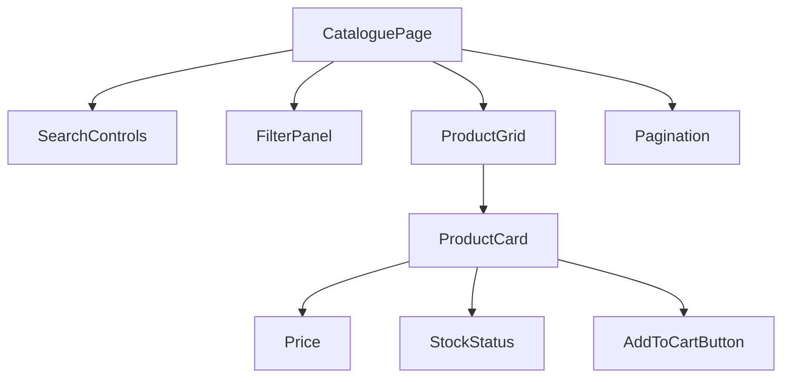

The purpose of the diagram is not to prescribe this exact structure.

It shows how architecture can create **reasoning boundaries**.

If a bug appears in price formatting, we may only need to inspect the price-related unit.

If the filter layout changes, we may not need to understand cart behavior.

Good decomposition narrows the scope of reasoning.

---

# 3. Reuse Is Useful, but It Is Not the Only Reason for Components

Components are often introduced as reusable UI pieces.

That is true.

A button may appear hundreds of times.

A modal pattern may be reused throughout an application.

But reuse is not required for a component to be valuable.

Suppose a component appears exactly once:

```text
AnnualBudgetApprovalPanel
```

It may still deserve its own component because it owns:

- a coherent domain responsibility;
- substantial behavior;
- a clear state model;
- a meaningful testing boundary.

This distinction matters.

If we only extract components when they are reusable, large domain-specific features become monolithic.

A more useful rule is:

> **Reuse is one reason to create a component. Responsibility is a stronger reason.**

---

# 4. Isolation

A component can isolate:

- implementation details;
- local state;
- CSS;
- interactions;
- dependencies;
- internal markup.

For example, a date-picker component may expose:

```text
value
onChange
disabled
```

while hiding:

- calendar-grid logic;
- month navigation;
- keyboard behavior;
- date-cell generation;
- focus management.

The caller should not need to know how every internal detail works.

This is encapsulation.

A strong component API gives callers what they need without exposing implementation details they should not control.

---

# 5. Testing Boundaries

Components can create natural test boundaries.

A date-picker can be tested for:

- selected date behavior;
- keyboard navigation;
- disabled dates;
- accessible labels.

The surrounding page does not need to reproduce every internal test.

This does not mean:

> Every component needs an isolated test.

Testing should follow risk and behavior.

But coherent component boundaries often make behavior easier to test.

Chapter 16 will explore testing strategy in detail.

---

# 6. Team Ownership

Architecture also affects people.

Suppose one team owns:

```text
Payments
```

and another owns:

```text
Scheduling
```

If the frontend mirrors meaningful domain boundaries, ownership becomes clearer.

For example:

```text
features/
├── payments/
├── scheduling/
├── patients/
└── reporting/
```

can communicate more than a purely technical structure such as:

```text
components/
hooks/
helpers/
utils/
```

This becomes increasingly important as teams grow.

Component architecture is therefore connected to organizational architecture.

We will return to this in Chapter 14.

---

# 7. The First Bad Extreme: One Giant Component

Consider this pseudocode:

```jsx
function Dashboard() {
  // user state
  // search state
  // filter state
  // modal state
  // pagination state
  // API loading
  // error handling
  // sorting
  // permissions
  // table rendering
  // card rendering
  // toolbar rendering
  // modal rendering
  // notifications
  // analytics
  // hundreds of lines...
}
```

The problem is not the number of lines by itself.

A large function can sometimes be coherent.

The problem is when unrelated responsibilities accumulate.

Warning signs include:

- many unrelated state variables;
- functions that operate on different conceptual parts of the page;
- sections that change for unrelated reasons;
- different teams frequently editing the same file;
- tests requiring massive setup;
- many conditionals controlling unrelated UI regions.

This indicates that the component may be carrying several responsibilities.

---

# 8. The Second Bad Extreme: Component Explosion

Over-decomposition can be just as harmful.

Consider:

```text
ProductCard
├── ProductCardHeader
│   ├── ProductCardTitleWrapper
│   │   └── ProductCardTitleText
├── ProductCardBody
│   ├── ProductDescriptionWrapper
│   │   └── ProductDescriptionText
└── ProductCardFooter
    ├── ProductActionWrapper
    │   └── ProductActionButtonWrapper
```

If each component contains two lines of markup and exists only because:

> Every HTML element should become a component,

we have not improved architecture.

We have created indirection.

Now understanding one product card requires navigating many files and component boundaries.

A good component architecture minimizes two costs:

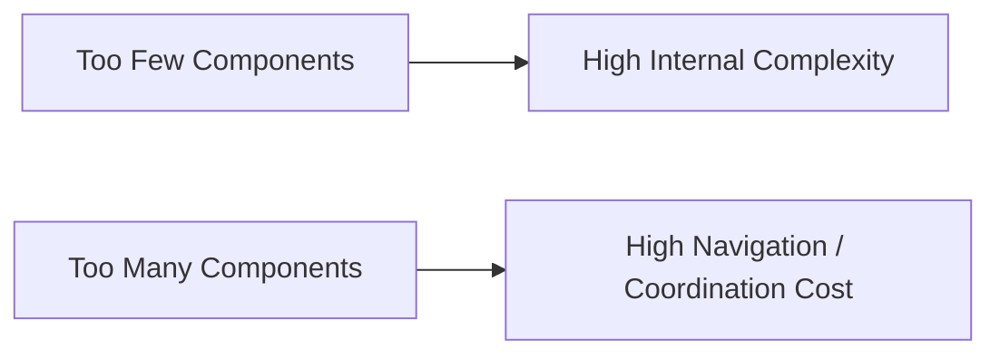

The goal is not maximum decomposition.

The goal is **useful decomposition**.

---

# 9. Finding Component Boundaries

There is no universal formula for component boundaries.

But several questions are highly useful.

Ask:

1. What changes together?
2. What owns this behavior?
3. What represents one domain concept?
4. What is genuinely reusable?
5. What should remain private?
6. What can be tested independently?
7. What has a stable input/output contract?
8. What changes for a different reason from its neighbors?

These questions are more useful than:

> Is this JSX block longer than 30 lines?

or:

> Does this HTML have three nested divs?

---

# 10. What Changes Together?

Suppose a product card contains:

- product name;
- price;
- stock state;
- action button.

If all of these are rendered from the same product data and usually change together, they may belong to one `ProductCard`.

But suppose price formatting is reused throughout:

- product cards;
- cart;
- checkout;
- order history.

Then `Price` or a shared price-formatting utility may deserve its own boundary.

The question is not:

> Can it be separated?

Almost everything can be separated.

The question is:

> Does separating it create a useful independent responsibility?

---

# 11. What Owns the Behavior?

Suppose a modal includes:

- open/close behavior;
- Escape-key handling;
- focus management;
- backdrop behavior.

Those behaviors form a coherent responsibility.

A modal component can own them.

The caller should ideally not need to write:

```js
document.addEventListener("keydown", ...)
document.body.style.overflow = ...
focus(...)
```

every time a modal is used.

The component boundary owns the interaction contract.

---

# 12. What Represents One Domain Concept?

Technical UI parts are not the only candidates for components.

Suppose a hospital application displays:

```text
PatientAdmissionSummary
```

This may contain:

- patient identity;
- ward;
- bed;
- admission time;
- attending doctor;
- status.

Even if used only on one page, it represents a meaningful domain concept.

A domain component can be more valuable than five generic layout components.

This distinction will become important when we compare feature-oriented and domain-oriented decomposition later.

---

# 13. What Is Genuinely Reusable?

Reuse should be evidence-based.

Suppose we see two similar cards.

It is tempting to extract:

```text
UniversalCard
```

with props such as:

```text
showHeader
showFooter
showBadge
showIcon
compact
bordered
horizontal
clickable
editable
showActions
```

Soon the “reusable” component has dozens of boolean switches.

This is a warning sign.

The abstraction may be trying to represent several different components.

A better approach may be:

- shared low-level primitives;
- composition;
- separate domain-specific components.

Do not abstract because two things currently look similar.

Abstract when they share a stable concept.

---

# 14. What Should Remain Private?

Suppose `SearchBox` internally uses:

- input state;
- debounce timer;
- loading indicator;
- clear button.

The parent may only need:

```text
query
onQueryChange
```

or perhaps:

```text
onSearch
```

Exposing internal details such as:

```text
debounceTimerId
inputFocused
clearButtonVisible
```

would unnecessarily couple callers to implementation.

Good component APIs create a boundary between:


The public contract should change more slowly than the private implementation.

---

# 15. A Deliberately Monolithic Example

Consider a catalogue interface.

In one component:

```jsx
function CataloguePage() {
  const [query, setQuery] = useState("");
  const [category, setCategory] = useState("all");
  const [selectedProduct, setSelectedProduct] = useState(null);

  // load products
  // filter products
  // search logic
  // open product details
  // render toolbar
  // render filters
  // render cards
  // render modal

  return (
    <main>
      {/* many sections */}
    </main>
  );
}
```

This may be perfectly acceptable at the beginning.

Do not extract components before responsibilities emerge.

Premature architecture can be as harmful as no architecture.

As features grow, boundaries become visible.

---

# 16. First Refactoring: Separate Stable Visual Responsibilities

We might identify:

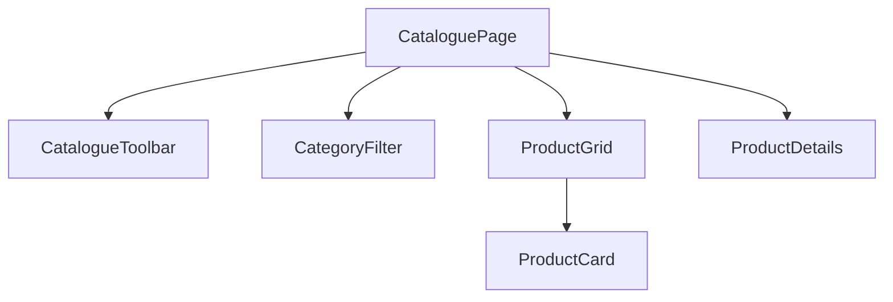

`CataloguePage` still coordinates the feature.

But individual UI responsibilities become explicit.

The parent may still own:

- query;
- category;
- selected product;
- fetched product data.

This is reasonable.

Decomposition does not imply state must move into every child.

---

# 17. A Component Boundary Is Not Necessarily a State Boundary

This is crucial.

Suppose:

```text
CataloguePage
└── CategoryFilter
```

The category state might remain in the parent because:

- filtering affects ProductGrid;
- the selected category appears in the URL;
- multiple sibling components depend on it.

The child can remain a visual/interaction boundary while state ownership stays above it.

Architecture involves two related but separate decisions:

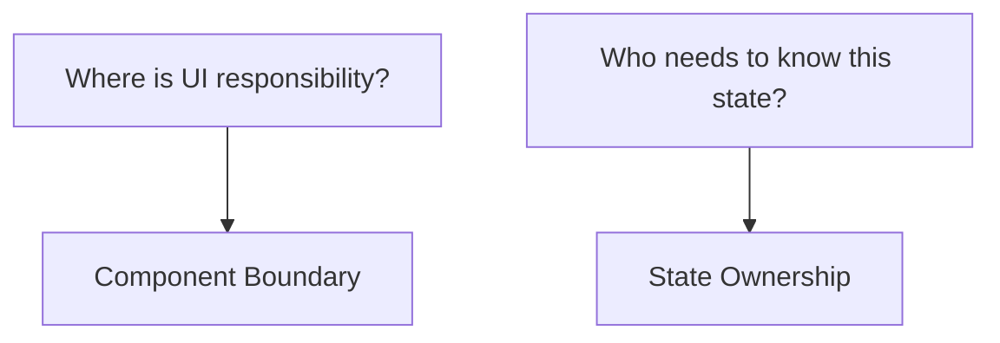

Do not assume every component must own all of its own data.

Chapter 8 will study state ownership in greater depth.

---

# 18. Inputs and Outputs

A component boundary needs a communication model.

Conceptually, components receive **inputs** and produce **outputs**.

Inputs may include:

- data;
- configuration;
- child content;
- dependencies.

Outputs may include:

- callbacks;
- emitted events;
- state changes exposed to a parent.

A generic model:

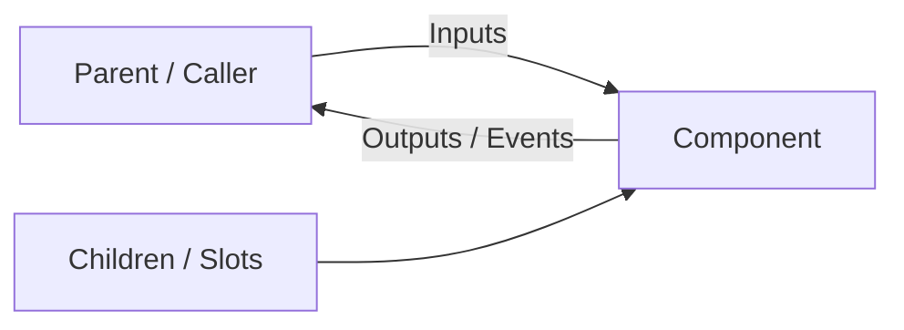

Different frameworks use different terminology, but the architectural relationship remains similar.

---

# 19. Props

In React, inputs are commonly expressed through **props**.

For example:

```jsx
function ProductCard({
  product,
  onSelect
}) {
  return (
    <article>
      <h2>{product.name}</h2>

      <button
        onClick={() =>
          onSelect(product.id)
        }
      >
        View
      </button>
    </article>
  );
}
```

The parent passes:

```jsx
<ProductCard
  product={product}
  onSelect={handleSelect}
/>
```

The child receives data and a way to communicate an action.

---

# 20. Vue Props and Events

Vue uses a similar conceptual model.

A child may receive a prop:

```vue
<script setup>
defineProps({
  product: Object
});

const emit =
  defineEmits([
    "select"
  ]);
</script>
```

and emit:

```vue
<button
  @click="
    emit(
      'select',
      product.id
    )
  "
>
  View
</button>
```

Parent:

```vue
<ProductCard
  :product="product"
  @select="handleSelect"
/>
```

Syntax differs.

Architecture is similar:

```text
Parent
↓ data
Child
↑ event
Parent
```

---

# 21. Callbacks and Events

React often passes callback functions:

```jsx
onSelect={handleSelect}
```

Vue commonly emits named events:

```vue
@select="handleSelect"
```

The design question is not which syntax is superior.

The question is:

> What information should cross the component boundary?

A weak API might expose too much:

```js
onClick(event, product, index, internalState, element)
```

A stronger domain API might be:

```js
onSelect(product.id)
```

The second communicates intent rather than implementation.

---

# 22. Prefer Intent-Oriented APIs

Compare:

```jsx
<ProductCard
  onButtonClick={
    event => ...
  }
/>
```

with:

```jsx
<ProductCard
  onAddToCart={
    productId => ...
  }
/>
```

The first exposes a DOM detail.

The second exposes application intent.

Intent-oriented APIs are often easier to evolve.

If the component later replaces a button with another interaction mechanism, callers do not need to change.

The component contract remains:

```text
User requested adding this product to cart.
```

---

# 23. Children and Slots

Some components should accept arbitrary content rather than dozens of formatting props.

React uses `children`:

```jsx
function Panel({
  title,
  children
}) {
  return (
    <section className="panel">
      <h2>{title}</h2>
      {children}
    </section>
  );
}
```

Usage:

```jsx
<Panel title="Recent Requests">
  <RequestTable />
</Panel>
```

Vue offers **slots**:

```vue
<template>
  <section class="panel">
    <h2>{{ title }}</h2>

    <slot />
  </section>
</template>
```

Usage:

```vue
<Panel title="Recent Requests">
  <RequestTable />
</Panel>
```

The architectural concept is composition.

The container owns:

- structure;
- styling;
- perhaps behavior.

The caller supplies content.

---

# 24. Named Slots and Structured Composition

Sometimes a component has several composition points.

Conceptually:

```text
Card
├── Header
├── Body
└── Footer
```

In React, one API might be:

```jsx
<Card
  header={<ProductHeader />}
  footer={<ProductActions />}
>
  <ProductDescription />
</Card>
```

Vue can use named slots:

```vue
<Card>
  <template #header>
    <ProductHeader />
  </template>

  <ProductDescription />

  <template #footer>
    <ProductActions />
  </template>
</Card>
```

Composition can be more flexible than adding props such as:

```text
showHeader
headerIcon
headerColor
showFooter
footerButton
footerAlignment
```

A component API should avoid becoming a configuration language for every possible variation.

---

# 25. Composition Over Inheritance

Traditional object-oriented architecture often uses inheritance to specialize behavior.

UI component systems generally benefit more from composition.

Instead of:

```text
BaseCard
└── ProductCard
    └── FeaturedProductCard
        └── DiscountedFeaturedProductCard
```

we can compose features:

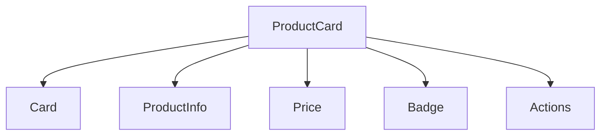

Different combinations can reuse the same primitives without creating a deep inheritance hierarchy.

This is one of the most important component design principles.

---

# 26. Wrapper Components

A wrapper component adds structure or behavior around arbitrary child content.

For example:

```jsx
function ErrorBoundaryLayout({
  children
}) {
  return (
    <div className="error-layout">
      {children}
    </div>
  );
}
```

or:

```jsx
function AuthenticatedArea({
  children
}) {
  // authentication check
  return children;
}
```

Wrappers can be useful.

Too many wrappers can create deeply nested component trees that are difficult to inspect.

Use them when they own a real cross-cutting responsibility.

---

# 27. Controlled Components

A **controlled component** receives its important state from outside.

Conceptually:

```jsx
function SearchInput({
  value,
  onChange
}) {
  return (
    <input
      value={value}
      onChange={
        event =>
          onChange(
            event.target.value
          )
      }
    />
  );
}
```

Parent:

```jsx
const [
  query,
  setQuery
] = useState("");

<SearchInput
  value={query}
  onChange={setQuery}
/>
```

The parent owns the value.

The child renders and communicates changes.

Data flow:

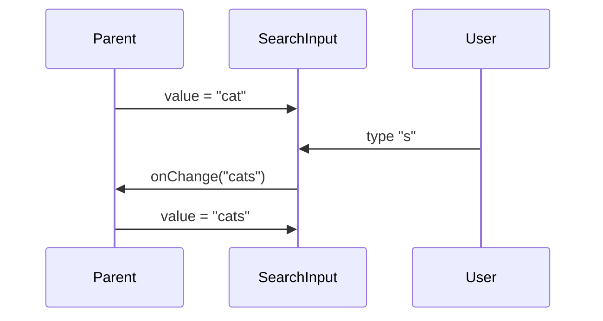

The component is controlled by external state.

---

# 28. Uncontrolled Components

An uncontrolled component manages important state internally.

Conceptually:

```jsx
function SearchInput({
  defaultValue = ""
}) {
  const [
    value,
    setValue
  ] = useState(
    defaultValue
  );

  return (
    <input
      value={value}
      onChange={
        event =>
          setValue(
            event.target.value
          )
      }
    />
  );
}
```

The parent initializes the component but does not control each state change.

Native form controls can also be used in an uncontrolled style where the DOM owns the current value.

---

# 29. Controlled vs Uncontrolled Is an Ownership Decision

Neither is universally better.

Controlled behavior is useful when:

- parent state must remain synchronized;
- multiple components depend on the value;
- URL state must reflect the value;
- validation or transformation happens centrally;
- application logic needs immediate access.

Uncontrolled behavior is useful when:

- state is primarily local;
- the parent only needs the final value;
- simpler integration is desirable;
- native form behavior is sufficient.

The design question is:

> Who should own this state?

That is more important than the terminology.

---

# 30. Avoid Half-Controlled APIs

A component becomes difficult to reason about when it mixes internal and external state ambiguously.

Suppose:

```jsx
<Tabs
  selectedTab={selectedTab}
  defaultSelectedTab="overview"
/>
```

Which value wins?

What happens if `selectedTab` later becomes undefined?

A stronger API should make the mode clear.

For example:

Controlled:

```jsx
<Tabs
  value={selectedTab}
  onValueChange={
    setSelectedTab
  }
/>
```

Uncontrolled:

```jsx
<Tabs
  defaultValue="overview"
/>
```

A component may support both modes, but the rules should be explicit.

---

# 31. Component API Design

A component's public API is often more important than its internal implementation.

Suppose we have:

```jsx
<Modal
  open={open}
  title="Delete request"
  confirmText="Delete"
  cancelText="Cancel"
  showCloseIcon
  closeOnBackdrop
  closeOnEscape
  danger
  size="small"
  centered
  padded
  ...
/>
```

This may be acceptable.

But as props accumulate, ask whether the component is becoming overly configurable.

A component with 25 boolean props may be hiding several different use cases behind one abstraction.

---

# 32. Good APIs Minimize Invalid Combinations

Suppose a button API has:

```ts
type ButtonProps = {
  primary?: boolean;
  secondary?: boolean;
  destructive?: boolean;
};
```

This permits:

```jsx
<Button
  primary
  secondary
  destructive
/>
```

What does that mean?

A stronger API:

```ts
type ButtonVariant =
  | "primary"
  | "secondary"
  | "destructive";

type ButtonProps = {
  variant:
    ButtonVariant;
};
```

The invalid combination cannot be expressed.

Component API design and TypeScript modeling reinforce one another.

---

# 33. Prefer a Small Stable Public Surface

Suppose a table component exposes:

```text
items
columns
sort
onSortChange
selectedRows
onSelectionChange
```

That may be enough.

If callers also receive:

```text
internalRowCache
virtualizationEngine
currentMeasurementMap
pendingResizeObserverEntries
```

implementation details have escaped.

The public API should expose what callers need to use the component effectively.

Everything else should remain private.

---

# 34. Compound Components

Sometimes a single large props object becomes less expressive than a family of coordinated components.

Consider tabs.

A monolithic API might look like:

```jsx
<Tabs
  labels={[
    "Overview",
    "History",
    "Notes"
  ]}
  panels={[
    <Overview />,
    <History />,
    <Notes />
  ]}
/>
```

A compound API might look like:

```jsx
<Tabs>
  <Tabs.List>
    <Tabs.Trigger value="overview">
      Overview
    </Tabs.Trigger>

    <Tabs.Trigger value="history">
      History
    </Tabs.Trigger>
  </Tabs.List>

  <Tabs.Panel value="overview">
    <Overview />
  </Tabs.Panel>

  <Tabs.Panel value="history">
    <History />
  </Tabs.Panel>
</Tabs>
```

The components cooperate as one conceptual system.

---

# 35. Why Compound Components Can Help

Compound components are useful when:

- several pieces belong to one interaction model;
- users need flexible composition;
- a flat prop list would become awkward;
- internal context can coordinate shared state.

Conceptually:

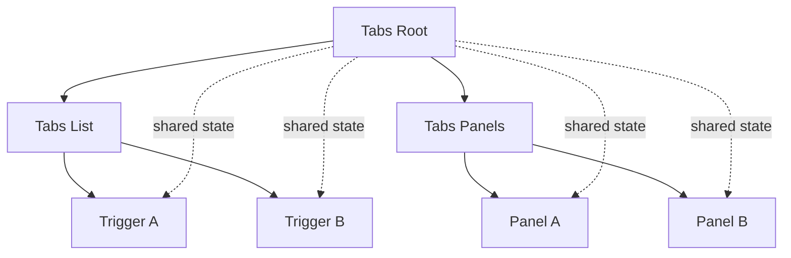

The root owns the interaction state.

Child components participate in the contract.

---

# 36. The Cost of Compound Components

Compound APIs can also hide complexity.

Potential issues include:

- dependence on context;
- unexpected behavior when pieces are used outside the root;
- harder static analysis;
- more framework-specific implementation.

Use the pattern when it creates meaningful composition.

Do not convert every component into a namespace of subcomponents.

---

# 37. Headless Components

A **headless component** provides behavior without prescribing most visual styling.

For example, a headless combobox might provide:

- open/closed state;
- keyboard navigation;
- selected item;
- highlighted item;
- ARIA relationships;
- events.

But leave markup styling to the caller.

Conceptually:

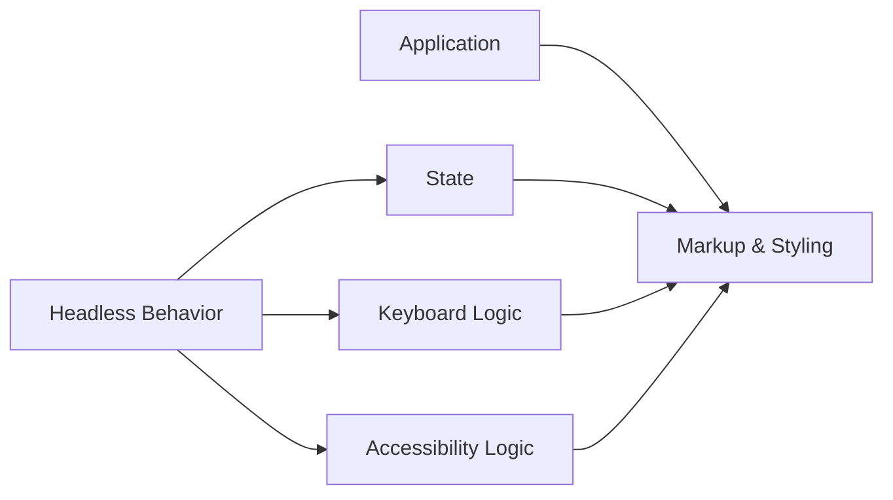

This separates behavior from presentation.

---

# 38. Why Headless UI Exists

Design systems often need:

- consistent accessible interaction;
- flexible visual design.

A fully styled component library may be too restrictive.

A completely custom implementation may duplicate difficult interaction logic.

Headless components sit between those extremes.

They can be particularly useful for complex controls such as:

- comboboxes;
- menus;
- listboxes;
- dialogs;
- tabs.

But they are not necessary for simple elements that native HTML already solves.

Do not build a headless button system to replace `<button>`.

---

# 39. Dependency Sharing

Components often need access to shared capabilities.

Examples:

- theme;
- current user;
- localization;
- router;
- form context;
- feature flags.

The naive solution is to pass everything through every intermediate component.

For example:

```text
App
↓ user
Layout
↓ user
Sidebar
↓ user
Menu
↓ user
Avatar
```

Intermediate components may not use `user`.

They only forward it.

This is often called **prop drilling**.

---

# 40. React Context

React Context allows a value to be made available to descendants without passing it explicitly through every intermediate component.

Conceptually:

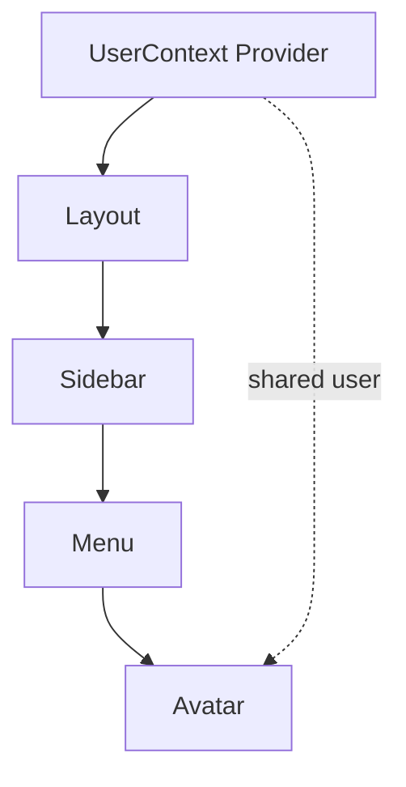

A descendant can read the context.

This is useful for data that is genuinely shared across a subtree.

---

# 41. Vue Provide / Inject

Vue provides a conceptually similar mechanism.

An ancestor can:

```text
provide
```

a dependency.

A descendant can:

```text
inject
```

it.

Again, the important concept is not syntax.

It is:

> A dependency can be supplied through component context instead of passed manually through every layer.

---

# 42. Context Is Not Automatically Better Than Props

Context reduces explicit plumbing.

It also makes dependencies less visible at the component call site.

Compare:

```jsx
<UserAvatar
  user={user}
/>
```

with:

```jsx
<UserAvatar />
```

where `UserAvatar` silently depends on:

```text
UserContext
ThemeContext
LocaleContext
PermissionContext
```

The second call looks simpler but may hide more dependencies.

Use context for truly shared ambient concerns.

Do not use it merely because passing one prop feels inconvenient.

---

# 43. Dependency Injection

The broader architectural idea behind Context and provide/inject is **dependency injection**.

A component needs something:

```text
API client
logger
translator
feature service
```

Instead of constructing the dependency internally:

```js
const api =
  new ApiClient(
    "https://..."
  );
```

the dependency can be supplied from outside.

Conceptually:

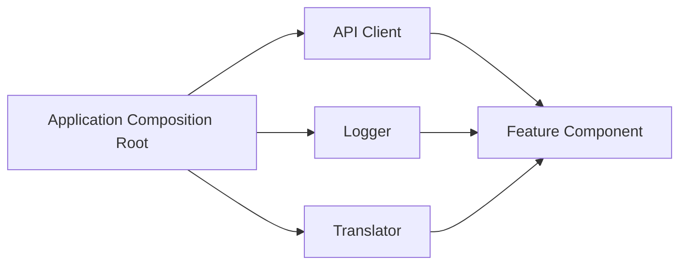

The feature depends on interfaces/capabilities rather than deciding how they are created.

---

# 44. Why Dependency Injection Helps

It can improve:

- testability;
- configuration;
- replacement;
- environment-specific behavior;
- ownership.

For example, tests can provide:

```text
FakeApiClient
```

instead of the real network client.

A production application can provide:

```text
HttpApiClient
```

The component's responsibility remains unchanged.

---

# 45. Dependency Injection Can Also Be Overused

A small component should not require a complex service container merely to format a date.

Over-engineered dependency injection can produce:

- indirection;
- hidden configuration;
- lifecycle complexity;
- difficult debugging.

Use it where dependencies genuinely vary or need controlled ownership.

---

# 46. Reusable Components vs Application Components

Not all components should be designed for reuse outside their feature.

This distinction is valuable.

## Reusable UI component

Examples:

```text
Button
Dialog
TextField
DataTable
Tabs
```

Its API should generally be:

- generic;
- stable;
- domain-neutral.

## Application-specific component

Examples:

```text
PatientAdmissionSummary
ExamInvigilationAssignment
HospitalQueueStatus
ProductCheckoutSummary
```

These can depend directly on domain concepts.

Trying to make them universally reusable can weaken their meaning.

---

# 47. Reuse Has Levels

A useful model:

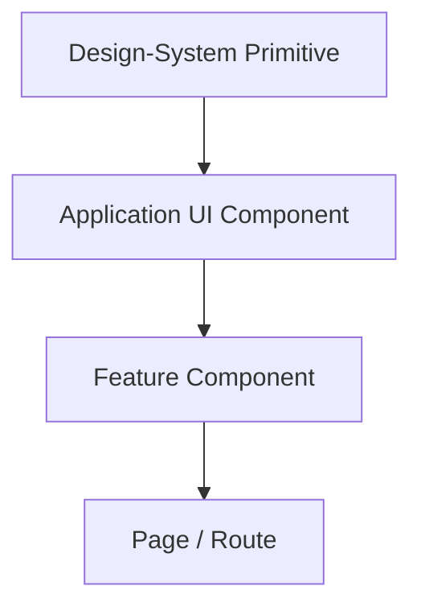

For example:

```text
Button
↓
ConfirmationDialog
↓
DeletePatientDialog
↓
PatientPage
```

Each layer can become more domain-specific.

This is often healthier than creating one universal component that handles every use case through configuration.

---

# 48. Premature Abstraction

Suppose two forms both contain:

- name;
- phone;
- address.

We might immediately create:

```text
UniversalPersonForm
```

But one form is for:

```text
Patient Registration
```

and another is for:

```text
Staff Registration
```

Their requirements may diverge:

- validation;
- permissions;
- optional fields;
- submission lifecycle;
- business rules.

Abstracting too early may couple them unnecessarily.

A useful heuristic is:

> Wait until repeated structure and behavior are stable enough that the abstraction is obvious.

Three similar examples often reveal a better abstraction than one or two.

This is sometimes called the “rule of three,” though it should not be treated as a strict law.

---

# 49. Duplication Can Be Cheaper Than the Wrong Abstraction

Developers are taught:

> Don't repeat yourself.

That principle is useful.

But avoiding every small duplication can create worse architecture.

Compare two costs:

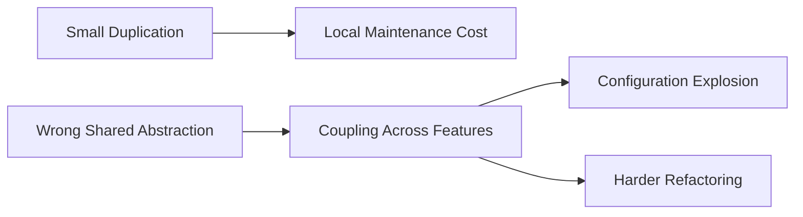

Temporary duplication may be cheaper while requirements are still evolving.

The goal is not zero duplication.

The goal is appropriate knowledge sharing.

---

# 50. Design Methodologies Are Lenses, Not Laws

Teams often look for a taxonomy that tells them exactly how to organize components.

Examples include:

- Atomic Design;
- feature-oriented structure;
- domain-oriented structure;
- design-system layers.

These can be helpful.

None should be treated as the one correct architecture.

A methodology is valuable if it improves shared reasoning.

It becomes harmful when developers distort the application merely to satisfy the taxonomy.

---

# 51. Atomic Design

Atomic Design describes interfaces using levels commonly described as:

- atoms;
- molecules;
- organisms;
- templates;
- pages.

A rough example:

```text
Atom:
Button

Molecule:
SearchField

Organism:
SearchToolbar

Template:
CatalogueLayout

Page:
ProductCatalogue
```

This can help design systems think about increasing composition.

But real applications do not always fit neatly into these categories.

---

# 52. The Strength of Atomic Design

Atomic Design can help teams discuss:

- reusable primitives;
- composition;
- visual systems;
- design-system inventory.

It is particularly useful when designers and developers share a component vocabulary.

---

# 53. The Limitation of Atomic Design

The taxonomy is primarily structural.

It does not necessarily express domain ownership.

For example:

```text
DischargeMedicationReconciliation
```

is a strong healthcare domain concept.

Trying to decide whether it is a:

```text
molecule
organism
template
```

may not improve architecture.

A domain model may be more useful than a visual taxonomy.

---

# 54. Feature-Oriented Decomposition

A feature-oriented application structure groups code according to user capabilities.

For example:

```text
features/
├── authentication/
├── search/
├── checkout/
├── reporting/
└── notifications/
```

Each feature might contain:

```text
components/
api/
state/
types/
tests/
```

locally.

This can improve cohesion.

Code that changes together often lives together.

---

# 55. Layer-Oriented Structure

An alternative is:

```text
components/
api/
hooks/
types/
utils/
pages/
```

This groups by technical type.

It can be simple in small projects.

But as the application grows, one feature may be scattered across many directories.

For example, “checkout” might require jumping among:

```text
components/CheckoutForm
api/checkout
types/Checkout
hooks/useCheckout
pages/Checkout
```

Feature-oriented structures try to reduce that scattering.

---

# 56. Domain-Oriented Decomposition

A domain-oriented architecture groups code around business capabilities.

For a hospital system:

```text
domains/
├── patients/
├── appointments/
├── pharmacy/
├── admissions/
└── billing/
```

Each domain may contain multiple features.

For example:

```text
patients/
├── registration/
├── profile/
├── search/
└── history/
```

This can align architecture with business ownership.

It becomes especially valuable in large systems.

---

# 57. Technical Reuse Still Crosses Domains

Domain boundaries do not mean duplicating every low-level UI primitive.

A project may contain:

```text
shared/
├── ui/
│   ├── Button
│   ├── Dialog
│   └── FormField
├── formatting/
└── platform/
```

while business code remains organized by domain.

Conceptually:

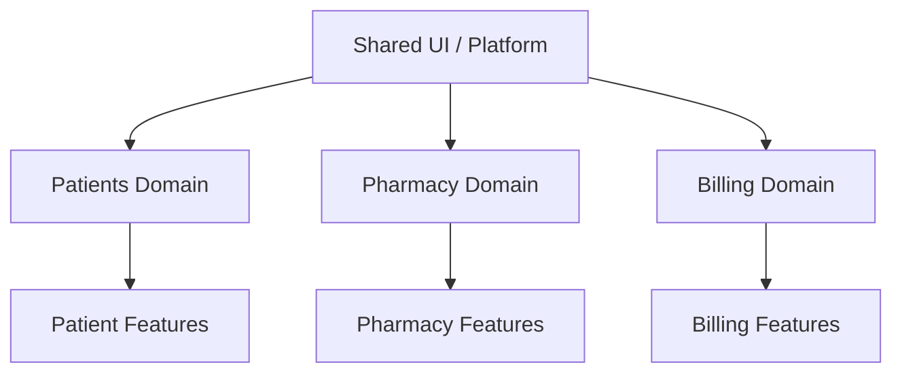

The important question is which knowledge is truly shared.

---

# 58. Domain Components Should Speak Domain Language

Compare:

```text
InfoPanel
```

with:

```text
PatientAllergySummary
```

If the component exists specifically to display allergy information, the domain name is often better.

Similarly:

```text
ActionForm
```

may be weaker than:

```text
MedicationOrderForm
```

Domain language improves communication among:

- developers;
- product owners;
- designers;
- subject-matter experts.

Architecture should reflect what the application actually does.

---

# 59. Component APIs Should Reflect Domain Intent

Suppose:

```jsx
<PatientStatusBadge
  color="green"
  text="Active"
/>
```

The caller is deciding presentation details.

A domain-oriented API may be:

```jsx
<PatientStatusBadge
  status="active"
/>
```

Now the component owns the visual mapping.

Benefits include:

- consistency;
- easier theme changes;
- less duplicated logic;
- stronger domain meaning.

The public API communicates the concept:

```text
patient status
```

rather than:

```text
green label
```

---

# 60. Avoid Boolean Prop Explosion

Suppose:

```jsx
<ProductCard
  compact
  featured
  clickable
  showPrice
  showImage
  horizontal
  elevated
  showBadge
  allowDelete
/>
```

Some boolean props are perfectly reasonable.

Many interacting booleans create combinatorial complexity.

Nine booleans theoretically allow:

```text
2^9 = 512
```

combinations.

Most are probably untested.

Some may be nonsensical.

Consider:

- variants;
- composition;
- separate components;
- structured configuration.

For example:

```jsx
<ProductCard
  variant="compact"
  actions={
    <ProductActions />
  }
/>
```

may communicate intent more clearly.

---

# 61. Stable Components Do Not Depend on the Entire Application

Suppose:

```jsx
function ProductCard() {
  const router =
    useApplicationRouter();

  const store =
    useGlobalStore();

  const analytics =
    useAnalytics();

  const permissions =
    usePermissionSystem();

  const locale =
    useCurrentLocale();

  ...
}
```

This component is deeply attached to its environment.

That may be appropriate for a feature-level component.

It may be inappropriate for a reusable product-card primitive.

Ask which dependencies should be injected or passed explicitly.

The more broadly reusable a component should be, the more carefully its environmental dependencies should be controlled.

---

# 62. Smart and Presentational Components

Older React literature often used terms such as:

```text
container component
presentational component
```

or:

```text
smart
dumb
```

These labels are not universal architectural laws.

But the distinction can still be useful.

One unit may coordinate:

- data loading;
- permissions;
- routing;
- feature state.

Another may focus on:

- displaying data;
- emitting user intent.

For example:

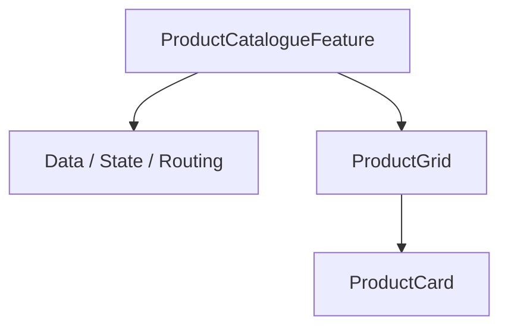

The separation can make reuse and testing easier.

But do not force every feature into exactly two layers.

---

# 63. React Example: Refactoring the Catalogue

Suppose the initial React component is:

```jsx
function CataloguePage() {
  const [
    query,
    setQuery
  ] = useState("");

  const [
    selectedProduct,
    setSelectedProduct
  ] = useState(null);

  const products =
    useProducts(query);

  return (
    <main>
      <header>
        <h1>Products</h1>

        <input
          value={query}
          onChange={
            event =>
              setQuery(
                event.target.value
              )
          }
        />
      </header>

      <div className="grid">
        {products.map(
          product => (
            <article
              key={product.id}
            >
              <h2>
                {product.name}
              </h2>

              <p>
                {product.description}
              </p>

              <button
                onClick={() =>
                  setSelectedProduct(
                    product
                  )
                }
              >
                View
              </button>
            </article>
          )
        )}
      </div>

      {selectedProduct && (
        <div className="modal">
          ...
        </div>
      )}
    </main>
  );
}
```

This is not terrible.

It is simply beginning to show several responsibilities.

A reasonable decomposition:

```jsx
function CataloguePage() {
  const [
    query,
    setQuery
  ] = useState("");

  const [
    selectedProduct,
    setSelectedProduct
  ] = useState(null);

  const products =
    useProducts(query);

  return (
    <main>
      <CatalogueToolbar
        query={query}
        onQueryChange={
          setQuery
        }
      />

      <ProductGrid
        products={products}
        onSelect={
          setSelectedProduct
        }
      />

      <ProductDetailsDialog
        product={
          selectedProduct
        }
        onClose={() =>
          setSelectedProduct(
            null
          )
        }
      />
    </main>
  );
}
```

The parent still owns shared coordination.

Children own narrower responsibilities.

---

# 64. React Example: Product Grid

```jsx
function ProductGrid({
  products,
  onSelect
}) {
  return (
    <div className="grid">
      {products.map(
        product => (
          <ProductCard
            key={product.id}
            product={product}
            onSelect={
              onSelect
            }
          />
        )
      )}
    </div>
  );
}
```

And:

```jsx
function ProductCard({
  product,
  onSelect
}) {
  return (
    <article>
      <h2>
        {product.name}
      </h2>

      <p>
        {product.description}
      </p>

      <button
        type="button"
        onClick={() =>
          onSelect(
            product
          )
        }
      >
        View
      </button>
    </article>
  );
}
```

The API is small and intent-oriented.

---

# 65. Vue Example: Equivalent Architecture

The architecture can remain almost identical.

`CataloguePage.vue`:

```vue
<script setup>
import {
  ref
} from "vue";

import CatalogueToolbar
  from "./CatalogueToolbar.vue";

import ProductGrid
  from "./ProductGrid.vue";

import ProductDetailsDialog
  from "./ProductDetailsDialog.vue";

const query =
  ref("");

const selectedProduct =
  ref(null);
</script>

<template>
  <main>
    <CatalogueToolbar
      v-model="query"
    />

    <ProductGrid
      :products="products"
      @select="
        selectedProduct = $event
      "
    />

    <ProductDetailsDialog
      :product="
        selectedProduct
      "
      @close="
        selectedProduct = null
      "
    />
  </main>
</template>
```

The syntax differs.

The architectural roles do not.

---

# 66. Vue Example: Product Card

```vue
<script setup>
defineProps({
  product: {
    type: Object,
    required: true
  }
});

const emit =
  defineEmits([
    "select"
  ]);
</script>

<template>
  <article>
    <h2>
      {{ product.name }}
    </h2>

    <p>
      {{ product.description }}
    </p>

    <button
      type="button"
      @click="
        emit(
          'select',
          product
        )
      "
    >
      View
    </button>
  </article>
</template>
```

Again:

```text
input:
product

output:
select
```

Framework syntax is secondary.

The contract is primary.

---

# 67. Compare the Architecture, Not the Syntax

React:

```text
props
callbacks
children
Context
```

Vue:

```text
props
emits
slots
provide/inject
```

At the architectural level:

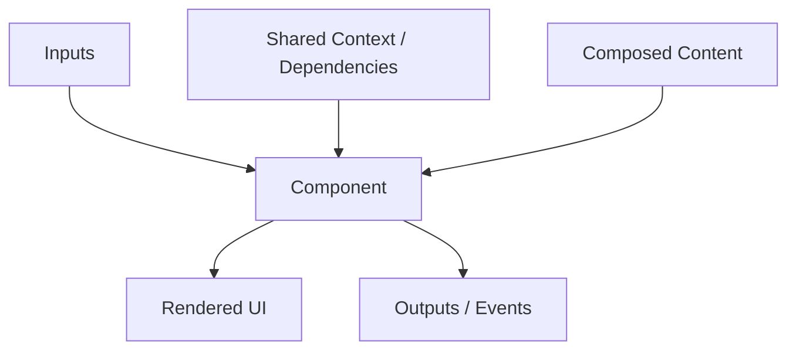

This model survives framework changes.

That is exactly what we want from architectural knowledge.

---

# 68. Recognizing an Oversized Component

There is no universal line count.

Instead, look for symptoms.

An oversized component often has:

- many unrelated states;
- many unrelated effects;
- several independent user workflows;
- multiple domain concepts;
- long sections that rarely interact;
- a large prop interface because too much has been combined;
- tests covering unrelated behaviors.

Ask:

> If this part changed, which other parts should remain unaffected?

If the answer identifies stable regions, those may be component boundaries.

---

# 69. Recognizing Over-Fragmentation

An over-fragmented architecture often has:

- components that only rename a single element;
- files that contain almost no independent behavior;
- props passed through many wrappers without transformation;
- difficulty tracing a simple user interaction;
- names describing DOM structure rather than responsibility.

Examples:

```text
HeaderLeftWrapper
HeaderLeftTextWrapper
HeaderLeftText
```

These names may indicate that the code mirrors DOM nesting rather than conceptual structure.

---

# 70. A Useful Extraction Test

Before extracting a new component, ask:

### Does it have its own responsibility?

If yes, extraction may help.

### Does it have a meaningful public API?

If yes, the boundary may be stable.

### Does it change for different reasons?

If yes, separation can reduce coupling.

### Is it reused?

If yes, extraction may help—but reuse alone is not required.

### Will extraction reduce or increase navigation cost?

If a two-line component creates another file without improving reasoning, keep it local.

---

# 71. Local Components Are Valid

Not every component needs to become a globally reusable file.

A page may contain:

```jsx
function SummaryRow(...) {
  ...
}
```

defined near the feature that uses it.

This can be a useful local abstraction.

The component can later move into shared infrastructure if genuine reuse appears.

Architecture can evolve.

We do not need to predict the application's final structure on day one.

---

# 72. Colocation

Related code is often easier to maintain when kept near the feature.

For example:

```text
ProductCard/
├── ProductCard.tsx
├── ProductCard.css
├── ProductCard.test.tsx
└── ProductCard.types.ts
```

or a feature:

```text
catalogue/
├── CataloguePage.tsx
├── ProductGrid.tsx
├── ProductCard.tsx
├── catalogue.api.ts
├── catalogue.types.ts
└── catalogue.test.ts
```

The exact structure is less important than cohesion.

Files that change together should often live together.

---

# 73. Component Boundaries and Performance

Developers sometimes create component boundaries primarily to improve performance.

That can be useful in some frameworks.

But it is dangerous to optimize architecture around assumptions that have not been measured.

A component boundary should first make conceptual sense.

Then performance techniques such as:

- memoization;
- lazy loading;
- selective rendering;

can be applied where measurements justify them.

Chapter 7 will examine rendering behavior.

Chapter 15 will examine performance measurement.

---

# 74. Component Boundaries and Accessibility

Component abstraction should not erase HTML semantics.

Suppose we create:

```jsx
<Action>
  Save
</Action>
```

If `Action` renders:

```html
<div>
```

with a click handler, callers may assume they are using a proper action control while the implementation loses native button behavior.

Reusable component APIs should preserve or strengthen accessibility.

For example:

```jsx
<Button>
  Save
</Button>
```

should normally render a real:

```html
<button>
```

unless there is a compelling reason not to.

A design system can make good semantics easier to use consistently.

---

# 75. Component Boundaries and Internationalization

A component API should avoid assuming one language.

Weak:

```jsx
<DeleteButton
  width={80}
/>
```

where the design only fits the English word:

```text
Delete
```

Another language may require much more space.

Better components:

- allow content to determine size;
- accept translated labels;
- use logical CSS;
- avoid hard-coded text direction.

Component architecture should support internationalized content rather than treat translation as a later visual patch.

---

# 76. Component Boundaries and Security

Reusable components that render arbitrary HTML should be treated carefully.

An API like:

```jsx
<Content
  html={userContent}
/>
```

creates a very different trust boundary from:

```jsx
<Content>
  {userContent}
</Content>
```

where text is escaped normally by the framework.

Component APIs should make dangerous behavior explicit rather than convenient.

Security considerations will be developed in Chapter 13.

---

# 77. The Public API Is a Contract

Every component has a contract whether documented or not.

The contract includes:

- required inputs;
- optional inputs;
- emitted actions;
- allowed composition;
- state ownership;
- accessibility behavior;
- lifecycle assumptions.

A strong contract minimizes surprising behavior.

Conceptually:

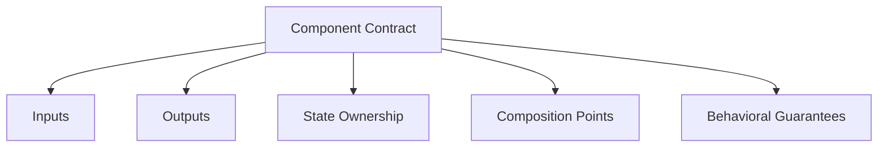

Internal implementation can change as long as the contract remains stable.

That is one reason component APIs deserve architectural attention.

---

# 78. A Component Is Not Necessarily a Design-System Component

Suppose a product application contains:

```text
OrderSummary
```

This is a component.

That does not automatically mean it belongs in a shared design system.

Design-system components usually represent broadly reusable visual or interaction primitives.

Examples:

```text
Button
Dialog
Tabs
Select
Tooltip
```

Feature components represent product/domain behavior.

Examples:

```text
OrderSummary
PatientMedicationList
CourseRegistrationPanel
```

Mixing these layers can create a “shared components” folder containing hundreds of unrelated business concepts.

Chapter 14 will explore design systems properly.

---

# 79. One Possible Layering Model

A large application might use:

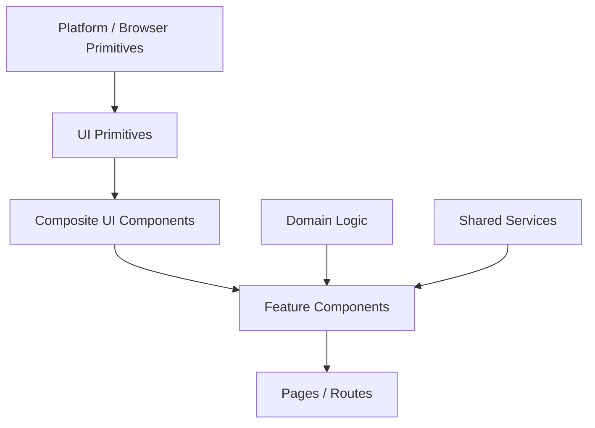

Example:

```text
button
↓
confirmation dialog
↓
delete request dialog
↓
request management feature
↓
request management page
```

Each layer increases domain specificity.

This is a useful mental model, not a mandatory directory structure.

---

# 80. Practical Refactoring Strategy

When facing a large component, do not immediately rewrite everything.

Use a gradual process.

### Step 1 — Identify responsibilities

Mark regions such as:

```text
search
filters
results
selection
modal
pagination
```

### Step 2 — Identify shared state

Ask which parts depend on the same state.

### Step 3 — Extract stable visual responsibilities

Move coherent regions into child components.

### Step 4 — Keep coordination in the parent initially

Do not move state unnecessarily.

### Step 5 — Refine APIs

Replace implementation-oriented props with intent-oriented ones.

### Step 6 — Move truly reusable primitives downward

Only after reuse becomes clear.

### Step 7 — Introduce context or dependency injection only when explicit passing becomes genuinely burdensome.

This process reduces architectural risk.

---

# 81. Refactoring the Monolith

Suppose we begin with:

```mermaid
flowchart TD
    A[CataloguePage<br/>Everything]
```

After first decomposition:

```mermaid
flowchart TD
    A[CataloguePage] --> B[Toolbar]
    A --> C[FilterPanel]
    A --> D[ProductGrid]
    A --> E[DetailsDialog]
```

Then inside ProductGrid:

```mermaid
flowchart TD
    A[ProductGrid] --> B[ProductCard]
    B --> C[Price]
    B --> D[StockBadge]
    B --> E[ProductActions]
```

Do not keep decomposing unless each new boundary remains meaningful.

---

# 82. A Decision Checklist for Component Boundaries

Before creating a component, ask:

- Does this represent one coherent responsibility?
- Does it own behavior or state?
- Does it represent a domain concept?
- Does it have a useful public contract?
- Does it change for different reasons from surrounding code?
- Is it reused or likely to be reused?
- Would extracting it reduce cognitive load?
- Would extraction create unnecessary indirection?
- Can its internal details remain private?
- Does it preserve semantic HTML?
- Does its API support localization and accessibility?
- Does it depend on too much global context?
- Is the abstraction based on stable knowledge or only visual similarity?

No one answer determines the result.

Architecture is judgment.

---

# 83. Misconceptions to Leave Behind

## “Every repeated piece of markup should become a component.”

No.

Repeated markup may indicate reuse.

It may also be trivial duplication that does not justify another abstraction.

---

## “Components exist mainly for reuse.”

No.

They also create responsibility, reasoning, testing, and ownership boundaries.

---

## “Smaller components are always better.”

No.

Over-fragmentation creates navigation and coordination cost.

---

## “A component should own all of its own state.”

No.

State ownership depends on who needs the state.

A component boundary and a state boundary are not the same thing.

---

## “Props are implementation details.”

No.

Props are part of a component's public contract.

They should be designed deliberately.

---

## “More props mean a more flexible component.”

Not necessarily.

Too many configuration props can indicate that several concepts are being forced into one abstraction.

---

## “Context is better than prop drilling.”

Not automatically.

Context reduces explicit passing but can make dependencies less visible.

Use it for genuine shared context.

---

## “Reusable means generic.”

Not always.

Domain-specific components can be extremely valuable even when used once.

---

## “Atomic Design is the correct component architecture.”

No.

It is one useful design-system lens.

Feature-oriented or domain-oriented decomposition may better represent application architecture.

---

## “Headless components are always more flexible and therefore better.”

No.

They add implementation responsibility to callers.

Use them when behavioral reuse and visual flexibility justify the trade-off.

---

## “Compound components are more advanced, so they are better APIs.”

No.

They are useful when multiple pieces genuinely form one coordinated interaction model.

---

## “If two things look similar, they should share one component.”

Not necessarily.

Visual similarity does not prove shared responsibility or future behavior.

---

## “DRY means eliminating all duplication immediately.”

No.

The wrong abstraction can be more expensive than temporary duplication.

---

## “A framework decides the architecture.”

No.

React and Vue provide component mechanisms.

They do not decide your domain boundaries, ownership model, or abstraction quality.

---

# Chapter Summary

Component architecture is the practice of dividing an interface into meaningful units with clear responsibilities.

Components exist for more than reuse.

They support:

- reasoning;
- isolation;
- testing;
- team ownership;
- composition;
- encapsulation.

A good component boundary usually represents something coherent.

Useful questions include:

```text
What changes together?
What owns this behavior?
What represents one domain concept?
What should remain private?
What is genuinely reusable?
```

Two extremes should be avoided.

Too little decomposition creates monolithic components.

Too much decomposition creates component explosion and unnecessary indirection.

Component communication can be modeled as:

```mermaid
flowchart LR
    A[Parent] -->|Inputs| B[Component]
    B -->|Events / Callbacks| A
    C[Children / Slots] --> B
```

React commonly expresses this through:

```text
props
callbacks
children
Context
```

Vue commonly expresses it through:

```text
props
emits
slots
provide/inject
```

The syntax differs.

The architectural relationships remain similar.

Composition is usually more flexible than deep inheritance.

Controlled components receive important state from outside.

Uncontrolled components manage important state internally.

The correct choice depends on ownership.

Component APIs should:

- express intent;
- minimize invalid combinations;
- hide implementation details;
- remain stable where possible.

More advanced patterns include:

- compound components;
- headless UI;
- dependency injection.

These patterns are useful only when they solve real architectural problems.

Component organization can follow several lenses:

- Atomic Design;
- feature-oriented decomposition;
- domain-oriented decomposition.

None is universally correct.

Large applications often benefit from separating:

```text
shared UI primitives
domain-specific components
feature components
pages/routes
```

The chapter's central principle is:

> **A component is a boundary of responsibility before it is a unit of reuse.**

When boundaries are chosen well, front-end architecture becomes easier to reason about, test, evolve, and distribute across teams.

---

# Review Questions

1. Why do components exist beyond simple code reuse?

2. What is a reasoning boundary?

3. Why can a component be useful even if it appears only once?

4. What are common symptoms of an oversized component?

5. What are common symptoms of over-fragmentation?

6. Why is line count alone a poor rule for deciding component boundaries?

7. What does the question “What changes together?” help identify?

8. Why should component APIs hide private implementation details?

9. What is the difference between a component boundary and a state boundary?

10. What is an input to a component?

11. What is an output from a component?

12. How do callbacks and emitted events differ syntactically between React and Vue while remaining conceptually similar?

13. Why are intent-oriented callback APIs often stronger than DOM-oriented callback APIs?

14. What role do `children` play in React composition?

15. What role do slots play in Vue composition?

16. Why can composition be preferable to inheritance?

17. What is a wrapper component?

18. What is a controlled component?

19. What is an uncontrolled component?

20. When is controlled state useful?

21. When is uncontrolled state useful?

22. Why should a component avoid ambiguous half-controlled behavior?

23. Why can many boolean props indicate a weak component API?

24. What is a compound component?

25. When does a compound component pattern improve an API?

26. What is a headless component?

27. Why are headless components particularly useful for complex interactions?

28. Why should native HTML still be preferred for simple controls?

29. What is prop drilling?

30. What problem can React Context solve?

31. What problem can Vue provide/inject solve?

32. Why can excessive context usage make dependencies harder to understand?

33. What is dependency injection?

34. How can dependency injection improve testing?

35. What is the difference between a reusable UI component and an application-specific component?

36. Why can premature abstraction create more coupling than duplication?

37. What is Atomic Design?

38. What is a limitation of Atomic Design for domain-heavy applications?

39. What is feature-oriented decomposition?

40. What is domain-oriented decomposition?

41. Why might domain-oriented components use business terminology in their names?

42. Why should shared design-system components avoid unnecessary domain knowledge?

43. Why should component APIs support accessibility rather than merely visual reuse?

44. How can internationalization affect component API design?

45. Why should performance not be the only reason to create a component boundary?

---

# End-of-Chapter Practical Lab — Refactor a Monolithic Catalogue

Create:

```text
chapter-06-components/
├── vanilla/
├── react/
└── vue/
```

The same conceptual interface will be explored in multiple implementations.

The purpose is not to compare which framework is better.

The purpose is to test whether the **architecture survives syntax changes**.

---

## Stage 1 — Build the Monolith

Create one catalogue feature containing:

- page heading;
- search input;
- category filter;
- product grid;
- product cards;
- product selection;
- details dialog;
- pagination.

Initially keep it deliberately combined.

Document the responsibilities you can identify.

---

## Stage 2 — Mark Change Boundaries

For each section, answer:

```text
What state does it need?
What events does it produce?
What can change independently?
What domain concept does it represent?
```

Do not extract components yet.

---

## Stage 3 — Draw the Current Architecture

Create a Mermaid diagram for the monolithic version.

Example:

```mermaid
flowchart TD
    A[CataloguePage] --> B[Search Logic]
    A --> C[Filter Logic]
    A --> D[Product Rendering]
    A --> E[Selection Logic]
    A --> F[Dialog Logic]
```

Identify which responsibilities are strongly related and which are not.

---

## Stage 4 — Extract First-Level Components

Refactor into:

```text
CatalogueToolbar
CategoryFilter
ProductGrid
ProductDetailsDialog
```

Keep shared state in the page initially.

Do not move state simply because a child component exists.

---

## Stage 5 — Extract ProductCard

Create:

```text
ProductCard
```

with a small intent-oriented API.

Avoid props such as:

```text
buttonColor
headingTag
showTopPadding
internalLayout
```

unless there is a genuine requirement.

Prefer domain-facing inputs such as:

```text
product
onSelect
```

---

## Stage 6 — Compare React and Vue APIs

Implement the same component relationship in:

```text
React:
props
callbacks
children
Context

Vue:
props
emits
slots
provide/inject
```

Create a Mermaid diagram showing the shared architectural model.

---

## Stage 7 — Add a Controlled Search Input

Implement:

```text
value
onChange / update event
```

with the parent owning search state.

Then implement an uncontrolled version with internal state.

Document the trade-offs.

---

## Stage 8 — Create a Composition Component

Build a reusable:

```text
Panel
```

that accepts:

- title;
- arbitrary body content;
- optional action region.

Use:

```text
React children
```

and:

```text
Vue slots
```

rather than adding many specialized boolean props.

---

## Stage 9 — Build a Compound Tabs API

Create a small tabs component using a compound design.

Conceptual API:

```text
Tabs
Tabs.List
Tabs.Trigger
Tabs.Panel
```

The root should own selected-tab state.

Document why the compound API is or is not clearer than a single large props object.

---

## Stage 10 — Explore Headless Behavior

Create a simple headless disclosure or menu behavior layer.

Separate:

```text
state
keyboard behavior
accessibility state
```

from:

```text
visual markup
styling
```

Compare this with simply using native HTML where appropriate.

Explain whether the abstraction was justified.

---

## Stage 11 — Add Shared Dependency Context

Provide one shared dependency such as:

```text
locale
theme
current user
```

through:

```text
React Context
```

and:

```text
Vue provide/inject
```

Compare that with explicit props.

Explain why one approach is more suitable in this particular case.

---

## Stage 12 — Identify Premature Abstraction

Find two visually similar pieces.

Attempt to create a shared component.

Then ask:

```text
Do they really share behavior?
Will they evolve together?
Does the abstraction require many conditionals?
```

If the abstraction becomes awkward, keep them separate.

Document the decision.

---

## Stage 13 — Reorganize by Feature or Domain

Create two candidate directory structures.

### Technical/layer-oriented

```text
components/
hooks/
types/
api/
pages/
```

### Feature/domain-oriented

```text
catalogue/
cart/
checkout/
shared/
```

Compare which structure keeps related change together.

---

## Stage 14 — Draw the Final Architecture

Create a Mermaid diagram containing:

- page/feature coordinator;
- local UI components;
- reusable UI primitives;
- shared dependencies;
- domain state;
- event flow.

The diagram should make ownership clear.

---

# Key Terms

**Component** — a unit of interface structure and/or behavior with a defined responsibility and public contract.

**Component boundary** — the architectural division determining what a component owns and what remains outside it.

**Decomposition** — breaking a larger system into smaller coherent responsibilities.

**Cohesion** — the degree to which responsibilities within a unit belong together.

**Coupling** — the degree to which one unit depends on details of another.

**Encapsulation** — hiding internal implementation while exposing a deliberate public interface.

**Component API** — the public contract through which a component receives inputs, exposes composition points, and communicates outputs.

**Props** — inputs passed to a component, commonly associated with React and similar component systems.

**Event emission** — communication from a child component to its surrounding application through named events.

**Callback** — a function passed to another unit so that the receiver can communicate or delegate behavior.

**Children** — nested content supplied to a React component for composition.

**Slot** — a Vue or Web Components composition point into which caller-provided content is inserted.

**Composition** — building larger interface behavior from smaller collaborating units.

**Wrapper component** — a component that provides surrounding structure or behavior for supplied child content.

**Controlled component** — a component whose important state is owned and supplied externally.

**Uncontrolled component** — a component that owns important state internally.

**Compound component** — a coordinated family of components that together represent one interaction model.

**Headless component** — a component or behavior abstraction that provides interaction logic with minimal prescribed visual presentation.

**Prop drilling** — passing data through intermediate components that do not themselves use it.

**React Context** — React's mechanism for making values available to descendants without explicit prop passing through every intermediate component.

**Provide/inject** — Vue's ancestor-to-descendant dependency-sharing mechanism.

**Dependency injection** — supplying dependencies from outside a unit rather than constructing them internally.

**Public contract** — the stable interface a component exposes to callers.

**Private implementation** — internal details that callers should not rely on.

**Premature abstraction** — creating a shared abstraction before the common concept and requirements are sufficiently stable.

**Boolean prop explosion** — a component API containing many independent boolean switches that create large numbers of possible combinations.

**Atomic Design** — a design methodology organizing interface elements into conceptual levels such as atoms, molecules, organisms, templates, and pages.

**Feature-oriented decomposition** — organizing code around user-facing capabilities or features.

**Domain-oriented decomposition** — organizing code around business concepts and capabilities.

**Design-system primitive** — a broadly reusable visual or interaction component intended for use across many features.

**Feature component** — a component representing behavior within a particular application capability.

**Domain component** — a component representing a meaningful business concept.

**Colocation** — placing related code, styles, tests, and types near the feature or component they belong to.

---

# Closing Perspective

Component architecture is easy to misunderstand because frameworks make creating components easy.

A developer can create a new React or Vue component in seconds.

That does not mean the boundary is good.

The important questions happen before syntax.

What does this unit own?

What should remain private?

What information should enter?

What should come out?

What state belongs here?

What changes together?

What should be reusable?

What should remain deliberately specific to this domain?

Good component architecture reduces the amount of the system a developer must understand at one time.

It creates boundaries around coherent responsibilities.

But decomposition has a cost.

Every component creates:

- another name;
- another contract;
- another place to navigate;
- another boundary through which information may need to flow.

That means architecture is not a contest to create the smallest possible components.

A monolith is difficult because too much is connected.

An over-fragmented system is difficult because too much is separated.

The goal lies between them.

React and Vue give us mechanisms:

```text
props
events
callbacks
children
slots
context
provide/inject
```

But those mechanisms do not choose the architecture for us.

A framework cannot decide whether:

```text
ProductCard
```

is a useful component.

It cannot decide whether:

```text
UniversalCard
```

is premature abstraction.

It cannot decide whether a state belongs inside the child or above it.

It cannot decide whether a hospital feature should be organized by pages, technical layers, or clinical domains.

Those are engineering decisions.

The strongest component systems are therefore not those with the most abstractions.

They are those whose boundaries reflect how the application actually changes.

That idea leads directly into the next chapter.

Once components exist, a new question appears:

> **When application state changes, how does the component system determine what should update?**

Chapter 7 answers that question by examining reactivity and rendering mechanics.
