# Chapter 7 — Reactivity & Rendering Mechanics

A user clicks a button.

Application state changes.

The interface changes.

That sequence feels almost instantaneous:

```text
state changed
↓
screen changed
```

But a modern component framework performs substantial work between those two events.

It must determine:

- what state changed;
- which components depend on that state;
- which component functions or render logic should run again;
- which values can be reused;
- which parts of the rendered result are different;
- which DOM operations are actually necessary;
- when those DOM operations should occur;
- whether several updates can be combined;
- and whether side effects should run afterward.

Different frameworks answer these questions differently.

React and Vue both support **state-driven interfaces**, but their internal mental models are not identical.

React generally asks components to render again and then determines what changed.

Vue builds reactive dependency relationships so that changes can trigger the effects and components that depend on them.

Other systems use **signals** or even compiler analysis to make dependencies still more explicit or fine-grained.

The important goal of this chapter is not to memorize framework internals.

It is to understand the architectural path between:

> **state changed**

and:

> **the interface changed.**

Our progression is:

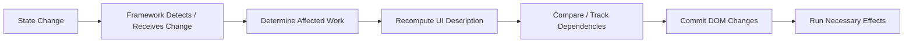

The exact path differs by framework.

The core principle does not:

> **The visible interface is derived from application state, and a reactive system keeps those two worlds synchronized.**

---

# 1. From Manual DOM Updates to State-Driven UI

Without a reactive framework, we might write:

```html
<button id="increment">
  Increment
</button>

<p id="count">
  0
</p>
```

and:

```js
let count = 0;

const button =
  document.querySelector(
    "#increment"
  );

const output =
  document.querySelector(
    "#count"
  );

button.addEventListener(
  "click",
  () => {
    count += 1;

    output.textContent =
      String(count);
  }
);
```

The application performs two jobs manually.

First:

```text
update application data
```

Then:

```text
update DOM to match
```

For a counter, that is easy.

For a large interface, synchronization becomes much harder.

Suppose changing one product affects:

- cart total;
- stock count;
- order summary;
- notification badge;
- checkout button state;
- analytics;
- recommendations.

Manual DOM coordination quickly becomes fragile.

Reactive component systems try to reverse the responsibility.

Instead of saying:

> Change this DOM node, then this one, then this one.

we say:

> Here is the current state. The UI should look like this.

---

# 2. UI as a Function of State

A useful conceptual model is:

```text
UI = f(state)
```

For example:

```js
function view(count) {
  return `
    <button>
      Count: ${count}
    </button>
  `;
}
```

The exact syntax is unimportant.

The architectural idea is:

> For a given application state, there is a corresponding interface description.

A framework then helps keep the real DOM synchronized with that description.

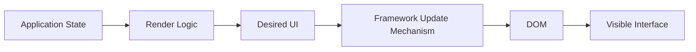

This model has several advantages.

We can reason about:

- state;
- rendering;
- events;
- side effects

as related but distinct concerns.

---

# 3. Reactivity Does Not Mean “Everything Runs Automatically”

The word **reactive** can sound magical.

It is not.

A reactive system needs a mechanism for answering questions such as:

```text
What changed?
Who depends on it?
What should run again?
What output changed?
When should DOM updates occur?
```

Different systems use different strategies.

At a high level:

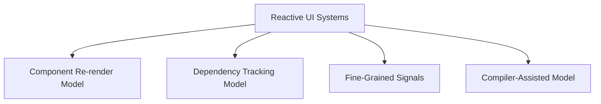

React is strongly associated with component re-rendering and reconciliation.

Vue combines component rendering with explicit runtime dependency tracking.

Signal-based systems often track smaller reactive units.

Compilers can analyze code and automate some optimization decisions.

We will compare these models without treating one as universally superior.

---

# 4. State Is Not the Same as Every Variable

Consider:

```js
const taxRate = 0.05;
```

This is a value.

It is not necessarily **state**.

State is information whose change matters to the application's behavior or rendered output over time.

Examples include:

- selected tab;
- current user;
- search query;
- cart contents;
- loading status;
- form input;
- modal visibility.

A useful question is:

> If this value changes, should the system remember that change and potentially update the interface?

If yes, it may be state.

But even then, not every value related to state should itself be stored as state.

That distinction becomes crucial when we discuss derived values.

---

# 5. A Small Running Example

We will use a simple product catalogue.

The interface contains:

- search query;
- category filter;
- products;
- selected product;
- cart count.

Conceptually:

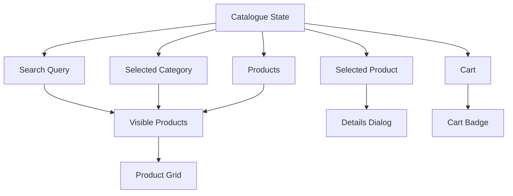

Notice that `Visible Products` can be calculated from:

- query;
- category;
- products.

It may not need to be stored separately.

This distinction between **source state** and **derived state** will return later.

---

# 6. The React Mental Model

React's model can be understood through three broad phases:

1. trigger;
2. render;
3. commit.

A state update requests work.

React renders affected component logic to determine the desired interface.

Then React commits necessary changes to the DOM.

A useful conceptual pipeline is:

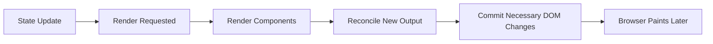

The browser's own rendering pipeline from Chapter 1 still applies afterward.

React does not paint pixels itself.

It changes DOM state.

The browser eventually performs style calculation, layout, paint, and compositing as needed.

---

# 7. React Render Does Not Mean “Rewrite the DOM”

This distinction is fundamental.

When developers hear:

> The component re-rendered.

they sometimes imagine:

> React destroyed and rebuilt that entire section of the DOM.

That is not what the term means.

In React, rendering primarily means:

> Run component rendering logic to calculate what the interface should look like now.

For example:

```jsx
function Counter({
  count
}) {
  return (
    <p>
      Count: {count}
    </p>
  );
}
```

A new `count` may cause the component function to run again.

React then determines whether DOM changes are actually required.

If:

```text
previous count = 4
new count = 5
```

React may only need to update the relevant text node.

So:

```text
React render
```

and:

```text
DOM mutation
```

are not synonymous.

---

# 8. Render Should Behave Like a Pure Calculation

A component's render logic should normally behave like a pure calculation.

Conceptually:

```text
same inputs
→
same output
```

Render logic should not unexpectedly:

- write to external storage;
- send network requests;
- mutate unrelated objects;
- manipulate arbitrary DOM outside React;
- trigger analytics.

Why?

Because rendering may occur more than once.

Framework scheduling may decide when to run it.

Development tools or strict checks may deliberately invoke rendering multiple times to expose unsafe assumptions.

The safest mental model is:

> Render describes UI. It should not perform external synchronization.

External synchronization belongs to event handlers or Effects depending on why the work must happen.

---

# 9. Reconciliation

After React produces the next UI description, it must determine what changed relative to the previous one.

This process is commonly described as **reconciliation**.

Suppose previous output is conceptually:

```jsx
<ul>
  <li>A</li>
  <li>B</li>
</ul>
```

and the next output is:

```jsx
<ul>
  <li>A</li>
  <li>C</li>
</ul>
```

React does not need to replace the entire `<ul>`.

It can determine that one child changed.

A simplified view:

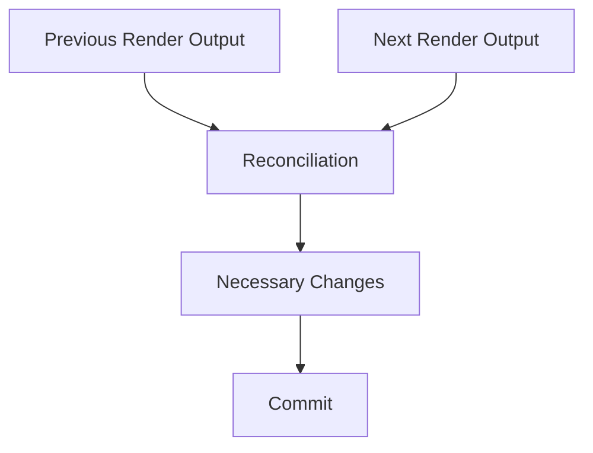

Reconciliation is one reason people use the phrase **Virtual DOM**.

But that phrase should be handled carefully.

---

# 10. Virtual DOM Without the Mythology

A useful mental model is:

> React creates an in-memory description of UI, compares relationships between previous and next descriptions, then commits necessary host-environment changes.

That does **not** mean:

- DOM access is always slow;
- Virtual DOM is automatically faster than every alternative;
- every state update compares the entire application;
- Virtual DOM is the defining feature of all modern frameworks.

It is one strategy for declarative UI.

The architectural benefit is primarily that developers can express:

```text
what the UI should be
```

rather than manually coordinating every DOM mutation.

Performance depends on many factors.

---

# 11. Commit Phase

After React determines required changes, it **commits** them.

The commit phase is where React applies changes to the host environment, such as the browser DOM.

Conceptually:

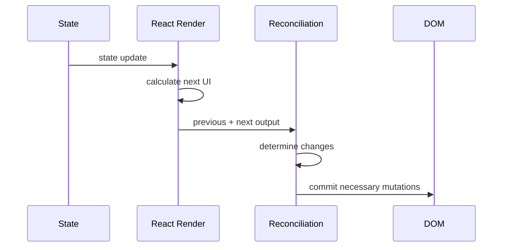

Render calculates.

Commit changes.

Keeping these concepts separate helps explain many React behaviors.

---

# 12. Parent Rendering and Child Rendering

Suppose:

```jsx
function Dashboard() {
  const [
    theme,
    setTheme
  ] = useState("light");

  return (
    <>
      <ThemeButton
        theme={theme}
        onChange={setTheme}
      />

      <ExpensiveReport />
    </>
  );
}
```

When `Dashboard` renders again, its child components normally participate in rendering too.

This does not automatically mean their DOM changes.

`ExpensiveReport` may render again but produce the same result.

React can then commit no DOM change for that subtree.

This distinction gives us three different performance questions:

```text
Did a component render?
Did its calculation cost matter?
Did React change the DOM?
```

These are not identical questions.

---

# 13. Component Identity

State preservation depends on component identity.

Suppose:

```jsx
function App() {
  return (
    <Counter />
  );
}
```

React needs to know whether a component in the next render is:

- the same conceptual component continuing;
- or a new component replacing the old one.

Identity depends strongly on:

- component type;
- position in the rendered tree;
- keys where applicable.

This determines whether local state is preserved or reset.

---

# 14. State Is Associated with a Position in the Render Tree

Consider:

```jsx
{showCounter && (
  <Counter />
)}
```

If `Counter` remains the same component type in the same position across renders, React can preserve its state.

But if that position changes identity, state can reset.

Conceptually:

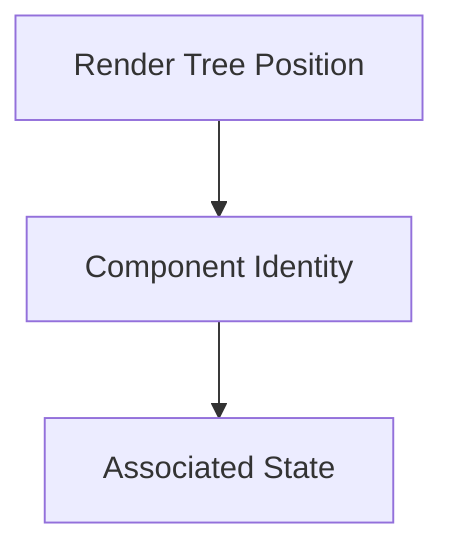

State should not be imagined as living inside the JSX text itself.

React maintains state and associates it with component identity in the rendered tree.

---

# 15. Keys Are About Identity, Not Silence

Developers often first encounter keys because React warns:

> Each child in a list should have a unique key.

It is easy to misunderstand keys as:

> Some attribute added to remove a warning.

Keys are more important than that.

They help React determine which item in one render corresponds to which item in the next render.

Suppose:

```jsx
const products = [
  {
    id: "P1",
    name: "Laptop"
  },
  {
    id: "P2",
    name: "Tablet"
  }
];
```

Render:

```jsx
{products.map(
  product => (
    <ProductRow
      key={product.id}
      product={product}
    />
  )
)}
```

The key says:

```text
P1 remains P1
P2 remains P2
```

even if order changes.

---

# 16. Why Array Index Keys Can Be Dangerous

Consider:

```jsx
{products.map(
  (product, index) => (
    <ProductRow
      key={index}
      product={product}
    />
  )
)}
```

If the list never changes order, this may appear fine.

But suppose an item is inserted at the beginning.

Before:

```text
index 0 → Laptop
index 1 → Tablet
```

After:

```text
index 0 → Phone
index 1 → Laptop
index 2 → Tablet
```

React sees position/key relationships rather than domain identity.

Local row state can become associated with the wrong item.

Stable domain IDs usually make better keys.

---

# 17. Keys Can Intentionally Reset State

Keys are also useful outside ordinary list rendering.

Suppose a profile form should reset completely when the user changes.

```jsx
<ProfileForm
  key={userId}
  userId={userId}
/>
```

When `userId` changes, React treats the keyed subtree as a new identity.

Its local state resets.

This can be clearer than using an Effect to manually reset several state variables.

A key therefore participates directly in the state-preservation model.

---

# 18. State as a Snapshot

React state behaves like a snapshot for a particular render.

Suppose:

```jsx
function Counter() {
  const [
    count,
    setCount
  ] = useState(0);

  function handleClick() {
    setCount(
      count + 1
    );

    console.log(count);
  }

  ...
}
```

If `count` was `0` for the current render, logging immediately after `setCount` still prints the current render's value.

Calling the setter requests another render.

It does not mutate the already-running render's snapshot.

This helps explain React batching and updater functions.

---

# 19. Batching State Updates

Suppose:

```jsx
setCount(
  count + 1
);

setOtherValue(
  "updated"
);
```

React can group multiple state updates before processing the next render.

This is **batching**.

The architectural benefit is that the application does not need to render an intermediate state after every setter call.

Conceptually:

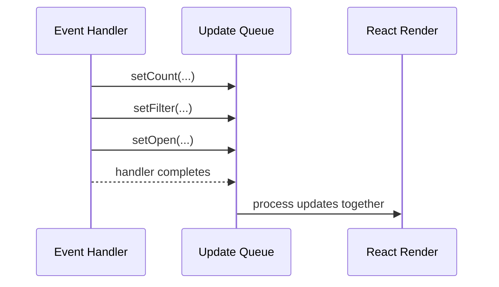

Batching reduces unnecessary work and avoids partially updated UI states.

---

# 20. Updating from Previous State

Suppose:

```jsx
setCount(
  count + 1
);

setCount(
  count + 1
);

setCount(
  count + 1
);
```

If all three calls use the same render snapshot, they may all request:

```text
replace with count + 1
```

To apply several updates sequentially, use updater functions:

```jsx
setCount(
  current =>
    current + 1
);

setCount(
  current =>
    current + 1
);

setCount(
  current =>
    current + 1
);
```

Each updater receives the queued result of the previous update.

This is another case where understanding the rendering model matters more than memorizing syntax.

---

# 21. Derived Values Should Usually Be Calculated

Suppose:

```jsx
const [
  firstName,
  setFirstName
] = useState("");

const [
  lastName,
  setLastName
] = useState("");

const [
  fullName,
  setFullName
] = useState("");
```

Then:

```jsx
useEffect(() => {
  setFullName(
    `${firstName} ${lastName}`
  );
}, [
  firstName,
  lastName
]);
```

This stores the same underlying information twice.

`fullName` is not independent source state.

It can be calculated:

```jsx
const fullName =
  `${firstName} ${lastName}`;
```

This is simpler.

It cannot become stale relative to its inputs.

---

# 22. Source State vs Derived State

A useful model is:

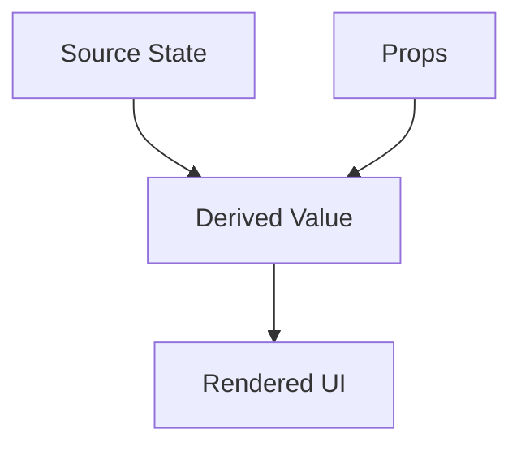

Examples of source state:

- selected category;
- products;
- search query.

Derived values:

- filtered products;
- total price;
- full name;
- whether a button should be disabled.

If a value can be calculated reliably from current state and props, storing it separately creates synchronization work.

---

# 23. Duplicated State Creates Inconsistency

Suppose we store:

```text
products
filteredProducts
```

Then every product update must remember to update both.

Potentially:

```text
products changed
filteredProducts did not
```

Now the application contains two conflicting truths.

A better design:

```js
const filteredProducts =
  products.filter(...);
```

One source of truth.

One derived value.

This principle applies across frameworks.

---

# 24. Expensive Derived Values

Not every derived value is cheap.

Suppose filtering 100,000 rows is expensive.

React may compute:

```jsx
const visibleRows =
  expensiveFilter(
    rows,
    query
  );
```

on every relevant render.

If measurement shows this matters, memoization can cache the result:

```jsx
const visibleRows =
  useMemo(
    () =>
      expensiveFilter(
        rows,
        query
      ),
    [
      rows,
      query
    ]
  );
```

The important distinction is:

> `useMemo` is a performance optimization.

The application should still be logically correct without it.

Do not use memoization to repair incorrect state architecture.

---

# 25. Memoization

Memoization means reusing a previous calculation result when its inputs are unchanged.

Conceptually:

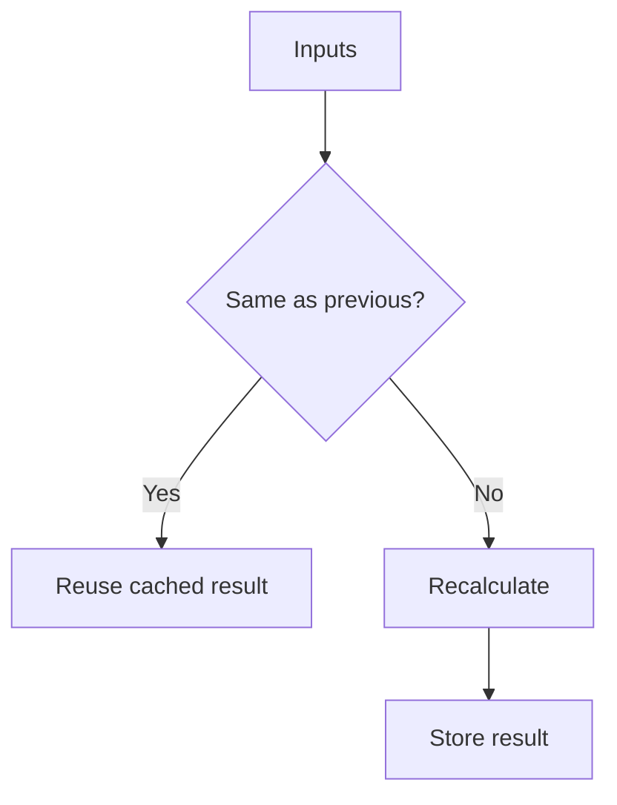

Memoization has costs:

- dependency tracking;
- comparison;
- memory;
- code complexity.

It should be applied where useful, not everywhere.

---

# 26. Referential Identity and Memoization

Consider:

```jsx
const options = {
  sort: "name"
};
```

This creates a new object each time the component renders.

Even if its contents are identical:

```js
previousOptions
  !==
nextOptions
```

by object identity.

This can affect memoization strategies that compare references.

Developers sometimes respond by memoizing every object and callback.

That can create more complexity than value.

Prefer to first ask:

- Is there a real performance problem?
- Does this value need stable identity?
- Can the architecture avoid unnecessary dependencies?

Only then introduce memoization.

---

# 27. Effects: Synchronizing with Something Outside Rendering

React Effects are frequently misunderstood.

An Effect is useful when a component needs to synchronize with something **outside the normal render calculation**.

Examples:

- browser API;
- external widget;
- network subscription;
- timer;
- media player;
- manually managed DOM integration.

For example:

```jsx
useEffect(() => {
  document.title =
    `${unreadCount} unread`;
}, [
  unreadCount
]);
```

The component is synchronizing application state with an external browser side effect: the document title.

---

# 28. Effects Are Not for Ordinary Derivation

This is usually unnecessary:

```jsx
const [
  visibleProducts,
  setVisibleProducts
] = useState([]);

useEffect(() => {
  setVisibleProducts(
    products.filter(
      product =>
        product.name
          .includes(query)
    )
  );
}, [
  products,
  query
]);
```

Why?

The component first renders.

Then the Effect runs.

Then it changes state.

Then another render occurs.

But the value was already calculable during the original render.

Prefer:

```jsx
const visibleProducts =
  products.filter(
    product =>
      product.name
        .includes(query)
  );
```

The general rule is:

> If the value can be derived during rendering from current state and props, derive it there.

Effects should not become a second state-synchronization system inside the component.

---

# 29. Events and Effects Answer Different Questions

Suppose a user clicks:

```text
Buy
```

and we need to send an order.

That work belongs naturally in the event path:

```jsx
async function handleBuy() {
  await submitOrder(
    product.id
  );
}
```

Why?

Because we know exactly why it happened:

```text
the user clicked Buy
```

An Effect answers a different question:

> Because this component is currently rendered with these values, what external system must be synchronized?

Keeping that distinction helps avoid confusing Effects.

---

# 30. Effect Cleanup

Some Effects establish resources that need cleanup.

For example:

```jsx
useEffect(() => {
  const connection =
    createConnection(
      roomId
    );

  connection.connect();

  return () => {
    connection.disconnect();
  };
}, [
  roomId
]);
```

The cleanup runs when synchronization must be undone, such as:

- before replacing the Effect due to dependency changes;
- when the component leaves the relevant tree.

This pattern matters for:

- subscriptions;
- timers;
- observers;
- event listeners;
- connections.

---

# 31. React Rendering Summary

At this point, a useful React mental model is:

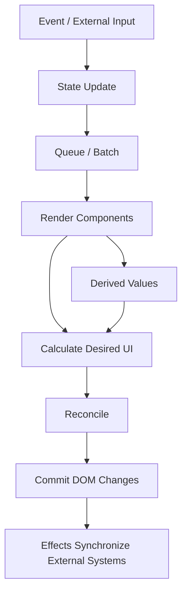

This is simplified.

It intentionally avoids internal Fiber implementation details.

Those are not required to reason about most application behavior.

---

# 32. The Vue Mental Model

Vue also provides state-driven UI, but its reactivity model differs.

Vue can track reactive dependencies as values are accessed.

When reactive state changes, Vue can trigger effects that depended on that state.

A simplified model is:

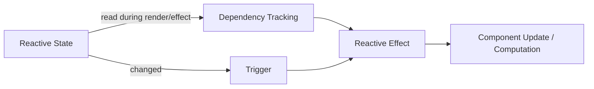

Vue's runtime reactivity uses mechanisms including:

- refs;
- proxies;
- tracked reads;
- triggered writes.

---

# 33. Vue `ref()`

A basic reactive value:

```js
import {
  ref
} from "vue";

const count =
  ref(0);
```

In JavaScript:

```js
count.value += 1;
```

The wrapper gives Vue an interception point.

Conceptually:

```js
const count = {
  get value() {
    trackDependency();
    return internalValue;
  },

  set value(next) {
    internalValue = next;
    triggerDependents();
  }
};
```

This is only conceptual pseudocode.

The real implementation is more sophisticated.

The important idea is:

> Reading can establish a dependency. Writing can notify dependents.

---

# 34. Vue `reactive()`

For objects:

```js
import {
  reactive
} from "vue";

const state =
  reactive({
    count: 0,
    query: ""
  });
```

Vue uses JavaScript Proxy behavior to observe property access and mutation.

For example:

```js
state.count += 1;
```

can trigger reactive work for consumers that depend on `state.count`.

Conceptually:

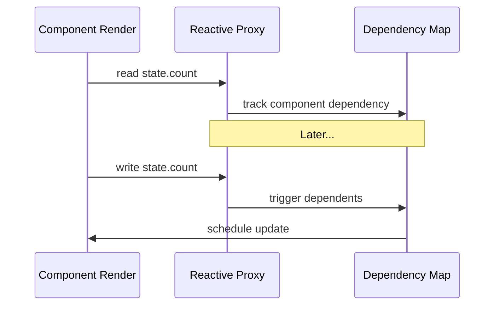

This dependency tracking is a major difference from a purely component-wide rerender mental model.

---

# 35. The Proxy and the Original Object Are Not the Same Object

Consider:

```js
const raw = {};

const proxy =
  reactive(raw);

console.log(
  raw === proxy
);
```

The result is false.

The Proxy is a different JavaScript object identity.

This can matter when integrating with:

- identity-sensitive libraries;
- Maps or Sets;
- external state systems.

The practical rule is:

> Once an object enters Vue's reactive system, use the reactive representation consistently.

---

# 36. Destructuring Can Break a Reactive Connection

Suppose:

```js
const state =
  reactive({
    count: 0
  });

let {
  count
} = state;
```

The local `count` is now an ordinary number.

Changing it:

```js
count += 1;
```

does not update:

```js
state.count
```

and it is no longer a reactive property access.

This is why Vue's `ref()` model is often convenient when values need to be passed independently.

The broader lesson is:

> Reactive dependency tracking depends on how values are accessed.

---

# 37. Vue Component Rendering as a Reactive Effect

A useful conceptual model is that a Vue component render depends on reactive values.

Suppose:

```vue
<script setup>
import {
  ref
} from "vue";

const count =
  ref(0);
</script>

<template>
  <button
    @click="count++"
  >
    {{ count }}
  </button>
</template>
```

During rendering, the template reads `count`.

Vue records that dependency.

Later, changing `count` can schedule the relevant component update.

Conceptually:

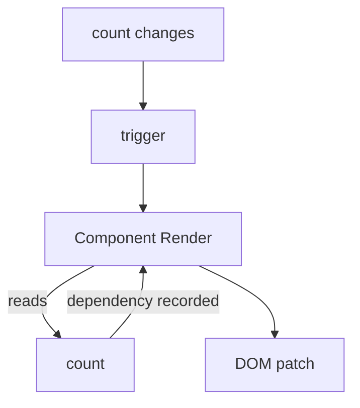

---

# 38. Vue DOM Updates Are Scheduled

When reactive state changes, Vue does not necessarily synchronously mutate the DOM at the exact assignment line.

Updates are buffered and scheduled.

For example:

```js
count.value += 1;
```

then immediately reading DOM text may still observe the previous DOM state until Vue's queued update is flushed.

Vue provides:

```js
await nextTick();
```

for cases where code genuinely needs to wait until pending DOM updates have been applied.

This is another example of batching.

---

# 39. Vue Batching

Suppose:

```js
count.value += 1;
name.value =
  "Updated";
active.value =
  true;
```

Vue can batch reactive changes so a component does not need to update the DOM after every individual assignment.

Conceptually:

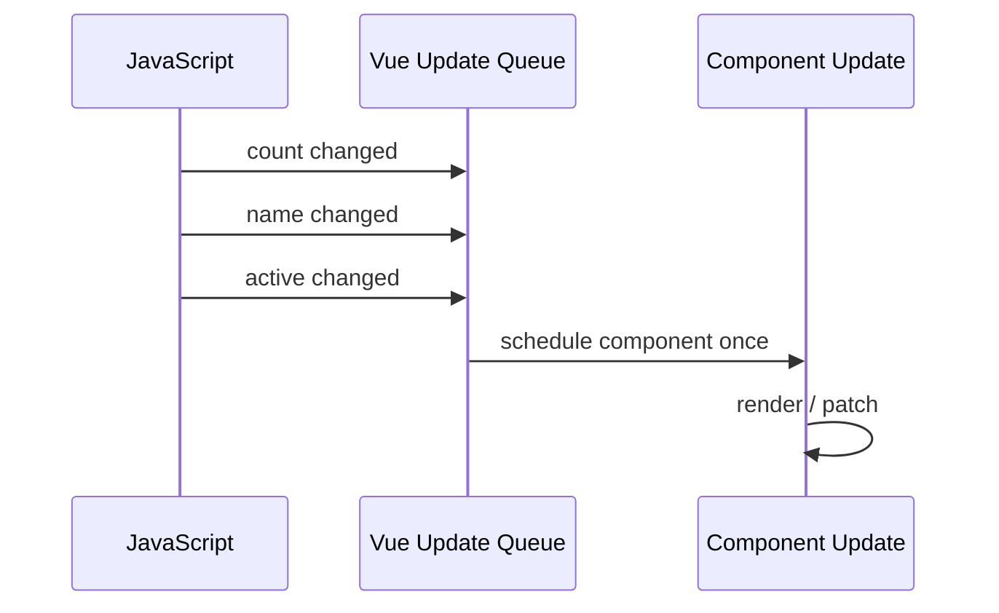

Batching is not unique to Vue.

It is a common reactive-system optimization.

---

# 40. Computed Values

Suppose:

```js
const firstName =
  ref("Sara");

const lastName =
  ref("Ahmed");
```

We could store:

```js
const fullName =
  ref("");
```

and watch both source values.

But this duplicates state.

Vue provides `computed()` for derived values:

```js
const fullName =
  computed(
    () =>
      `${firstName.value} ${lastName.value}`
  );
```

The computed value depends on:

- `firstName`;
- `lastName`.

Vue tracks those dependencies.

When neither changed, the previous computed result can be reused.

---

# 41. Computed Values Represent Derivation

Conceptually:

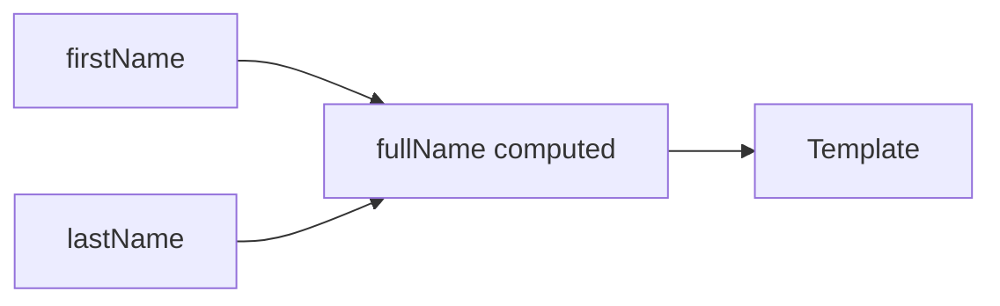

No separate synchronization step is required.

This reflects the same architectural principle we saw in React:

> If a value is derived from other state, prefer derivation over duplicated state.

The implementation mechanism differs.

The principle is shared.

---

# 42. Vue Watchers

Sometimes we need to react to a state change with an actual side effect.

Vue provides watchers.

For example:

```js
watch(
  query,
  async newQuery => {
    await search(
      newQuery
    );
  }
);
```

A watcher is useful when a reactive value changing should cause something outside ordinary computed rendering.

Examples include:

- asynchronous request;
- browser storage synchronization;
- external library integration;
- analytics;
- imperative DOM behavior.

This is conceptually similar to the role of Effects in React.

---

# 43. Watchers Should Not Replace Computed Values

Suppose:

```js
const firstName =
  ref("");

const lastName =
  ref("");

const fullName =
  ref("");

watch(
  [
    firstName,
    lastName
  ],
  () => {
    fullName.value =
      `${firstName.value} ${lastName.value}`;
  }
);
```

This works.

But the relationship is a pure derivation.

Prefer:

```js
const fullName =
  computed(
    () =>
      `${firstName.value} ${lastName.value}`
  );
```

Computed values describe **what a value is**.

Watchers describe **what side effect should occur when something changes**.

That distinction is architecturally valuable.

---

# 44. `watch()` and `watchEffect()`

Vue offers both explicit-source and automatic-dependency watcher styles.

Conceptually:

```js
watch(
  query,
  newValue => {
    ...
  }
);
```

says:

> Run this when `query` changes.

While:

```js
watchEffect(
  () => {
    console.log(
      query.value,
      category.value
    );
  }
);
```

can track reactive values used during the callback.

The first makes the dependency source explicit.

The second can be convenient when the effect naturally depends on whatever it reads.

Neither should be used as a substitute for a computed value.

---

# 45. Cleanup in Watchers

Asynchronous watchers can create race conditions.

Suppose query changes:

```text
c
ca
cat
```

and each change starts a request.

The watcher should prevent stale work from winning.

Conceptually:

```js
watch(
  query,
  async (
    value,
    _oldValue,
    onCleanup
  ) => {
    const controller =
      new AbortController();

    onCleanup(() => {
      controller.abort();
    });

    const result =
      await search(
        value,
        {
          signal:
            controller.signal
        }
      );

    ...
  }
);
```

The exact API details can vary with Vue patterns and versions, but the architectural point is stable:

> Reactive side effects need lifecycle-aware cleanup just like React Effects.

---

# 46. React and Vue Share the Goal, Not the Same Mechanism

At a high level, both frameworks let developers express UI declaratively.

But their runtime mental models differ.

A simplified comparison:

| Concern | React | Vue |
|---|---|---|
| State change | setter/update queues render work | reactive mutation triggers dependents |
| Dependency model | component render relationships + explicit Hook dependencies | runtime tracked reactive dependencies |
| Derived values | calculate during render; optionally memoize | `computed()` is a reactive derived value |
| Side effects | Effects | watchers / watchEffect |
| DOM update | reconciliation then commit | component update and patching |
| Batching | state updates can be batched | reactive updates are buffered/batched |

This table is deliberately conceptual.

Neither framework can be understood completely from one row.

---

# 47. Reactivity Granularity

**Granularity** asks:

> How small can the system's unit of dependency/update be?

At one extreme:

```text
something changed
→
rerun a large component tree
```

At another:

```text
one reactive value changed
→
update one dependent expression
```

Frameworks occupy different points on this spectrum.

Even within one framework, optimization mechanisms can change effective granularity.

---

# 48. Fine-Grained Reactivity

Fine-grained reactivity tracks dependencies at smaller units than broad component rerenders.

Suppose:

```text
firstName
lastName
age
cartCount
```

and only:

```text
cartCount
```

changes.

A fine-grained system may know exactly which computations depend on `cartCount`.

Conceptually:

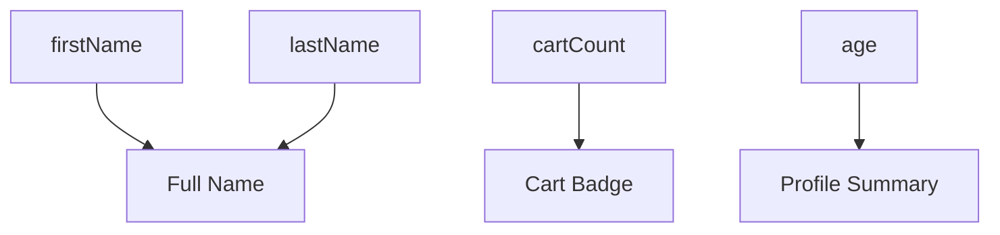

Changing `cartCount` need only invalidate the Cart Badge dependency path.

This is similar to spreadsheet cells.

One cell changes.

Only formulas depending on it need recomputation.

---

# 49. Signals

A **signal** is a reactive value designed to expose dependency relationships.

Different libraries and frameworks implement signals differently.

A conceptual signal might look like:

```js
const count =
  signal(0);

effect(() => {
  console.log(
    count.value
  );
});

count.value += 1;
```

Reading the signal during a reactive computation registers a dependency.

Writing to the signal triggers dependents.

The conceptual graph:

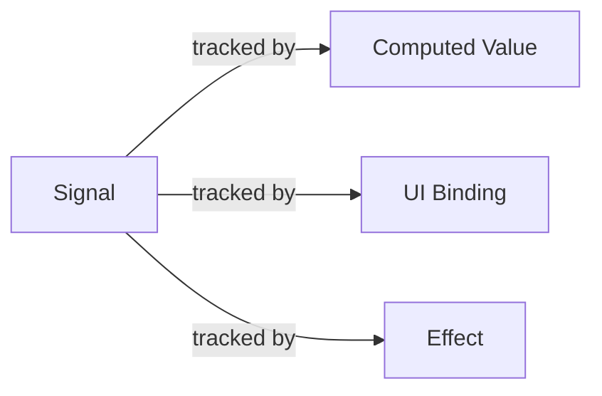

The important idea is **dependency-level tracking**, not the syntax of a particular signals library.

---

# 50. Signals Are Not Automatically Faster

A more fine-grained model can reduce unnecessary recomputation.

It can also introduce:

- new mental models;
- dependency graphs;
- lifecycle concerns;
- library-specific APIs;
- debugging differences.

Performance cannot be judged from one architectural slogan.

Ask:

- How large is the app?
- Where is actual work occurring?
- What does the framework already optimize?
- Is unnecessary rerendering measurable?
- What complexity does another reactive primitive introduce?

Fine-grained reactivity is an architectural option, not a universal prescription.

---

# 51. Scheduling

A reactive framework does not necessarily process every update immediately.

It can schedule work.

Scheduling allows the framework to decide:

- when updates are processed;
- whether updates can be grouped;
- which work is urgent;
- whether work can be reused or skipped.

A simplified scheduler:

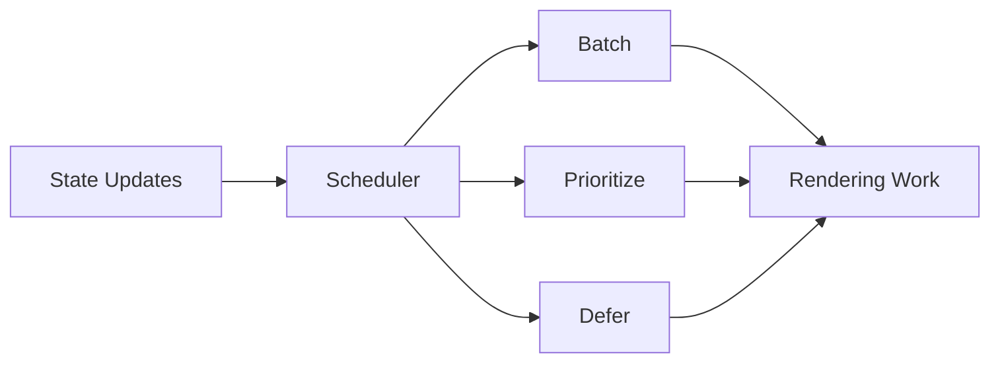

We do not need internal scheduler implementation details.

The practical lesson is:

> State setters are requests to the framework's update system, not commands saying “mutate the DOM immediately at this line.”

---

# 52. Why Scheduling Exists

Suppose one event updates:

- search query;
- filter selection;
- selected page;
- status text.

If the framework committed the DOM after every assignment:

```text
update 1
→ render
→ DOM

update 2
→ render
→ DOM

update 3
→ render
→ DOM
```

work could multiply.

Batching allows:

```text
update 1
update 2
update 3
↓
one coordinated rendering pass
```

This often produces:

- better performance;
- fewer intermediate states;
- more consistent UI.

---

# 53. Scheduling Changes How We Think About “Immediately”

Developers often write:

```js
setState(...);

readDOM();
```

and expect the DOM to already reflect the new state.

Reactive frameworks may not work that way.

The state change schedules framework work.

DOM changes happen later in the update cycle.

This is why frameworks expose mechanisms such as:

- React commit/effect timing;
- Vue `nextTick()`.

Use these mechanisms only when code truly depends on completed DOM updates.

Do not build application logic around constantly forcing synchronous updates.

---

# 54. Unnecessary Rendering Work

A render is not automatically a problem.

Rendering a tiny component may be cheaper than elaborate memoization machinery.

Performance problems appear when rendering repeatedly performs meaningful work.

Examples:

- large list transformation;
- expensive calculation;
- complex child tree;
- frequent state changes;
- repeated object processing.

Before optimizing, identify the actual cost.

---

# 55. Example: Expensive Filtering

Suppose:

```jsx
const visibleRows =
  rows
    .filter(...)
    .sort(...)
    .map(...);
```

for 100,000 records.

If this calculation happens frequently, it may matter.

Potential strategies include:

- memoizing the computation;
- reducing data earlier;
- moving work to the server;
- virtualizing rendering;
- debouncing input;
- changing state architecture.

Do not assume memoization is always the best answer.

---

# 56. Memoization Should Follow Measurement

A healthy sequence is:

```mermaid
flowchart LR
    A[Observe Slow UI] --> B[Measure]
    B --> C[Identify Cause]
    C --> D[Choose Optimization]
    D --> E[Measure Again]
```

An unhealthy sequence:

```text
add useMemo everywhere
add memo everywhere
add useCallback everywhere
hope
```

Memoization adds complexity.

Use it when it avoids meaningful repeated work.

---

# 57. Component Memoization

React can sometimes skip rendering a component when relevant props have not changed according to the memoization strategy.

Conceptually:

```mermaid
flowchart TD
    A[Parent Renders] --> B{Child Inputs Changed?}
    B -->|No| C[Reuse Previous Child Work]
    B -->|Yes| D[Render Child]
```

This can help when:

- child rendering is expensive;
- parent rerenders frequently;
- inputs remain stable.

It may provide little value when:

- child rendering is cheap;
- props change every time;
- object/callback identities are unstable;
- added complexity outweighs saved work.

---

# 58. Vue and Reactive Selectivity

Vue's runtime dependency tracking can reduce some unnecessary work automatically because component render effects are associated with reactive dependencies.

But Vue applications can still perform unnecessary work.

Examples:

- expensive computed dependencies invalidating too often;
- large reactive objects;
- unnecessary deep watchers;
- unstable component trees;
- huge lists;
- effects doing redundant work.

No framework removes the need for performance reasoning.

---

# 59. Identity and List Rendering in Vue

Vue also needs stable identity when rendering lists.

For example:

```vue
<ProductRow
  v-for="product in products"
  :key="product.id"
  :product="product"
/>
```

The key helps the renderer track item identity when the list changes.

The broader principle is framework-independent:

> When a rendered collection changes over time, stable domain identity helps the framework preserve the correct relationship between data and UI instances.

Keys are not merely React-specific warning suppression.

---

# 60. State Preservation Is an Architectural Concern

Imagine editing two products.

If component identity is wrong, local form state may move to the wrong product.

If identity is intentionally changed, state may reset.

Therefore:

```text
identity
→
state preservation
→
user experience
```

This is why list keys, component position, and conditional rendering patterns deserve architectural attention.

---

# 61. Conditional Rendering and Identity

Consider:

```jsx
{isCompany
  ? <CompanyForm />
  : <PersonForm />
}
```

These are different component types.

Switching can reset local state because React sees different identities.

Now:

```jsx
<Form
  type={
    isCompany
      ? "company"
      : "person"
  }
/>
```

may preserve state differently because the component type and position remain stable.

Neither behavior is automatically right.

Ask:

> Should this state survive the transition?

Identity should match product semantics.

---

# 62. Effects and Watchers Can Create Feedback Loops

Suppose:

```text
state A changes
→ watcher changes state B
→ watcher changes state A
```

Reactive systems can enter loops or produce repeated work.

For example, an Effect that derives state:

```jsx
useEffect(() => {
  setFilteredProducts(
    filterProducts(
      products,
      query
    )
  );
}, [
  products,
  query
]);
```

creates an extra update path.

A computed/derived value avoids the feedback cycle.

The safest reactive architectures minimize duplicated synchronization.

---

# 63. Reactive Graphs

We can think of application reactivity as a graph.

```mermaid
flowchart LR
    A[Products] --> D[Visible Products]
    B[Query] --> D
    C[Category] --> D

    D --> E[Product Grid]

    F[Cart] --> G[Cart Count]
    G --> H[Header Badge]

    I[Selected Product] --> J[Details Dialog]
```

Good architecture keeps this graph understandable.

Problems arise when extra duplicated state creates unnecessary edges:

```mermaid
flowchart LR
    A[Products] --> B[Filtered Products State]
    C[Query] --> B
    D[Category] --> B
    B --> E[Grid]

    A --> F[Effect]
    C --> F
    D --> F
    F --> B
```

The second system needs synchronization machinery.

The first expresses dependency directly.

---

# 64. Compiler-Assisted Optimization

Historically, developers often had to manually tell frameworks:

```text
this value can be reused
this callback should retain identity
this component can skip work
```

Modern framework tooling increasingly moves some optimization analysis toward build time.

A compiler can inspect code and potentially determine:

- which values are stable;
- which computations can be cached;
- which component output can be reused;
- where updates can be made more selective.

This does not change the core UI architecture.

It changes who performs some optimization decisions:

```mermaid
flowchart LR
    A[Developer Source] --> B[Compiler Analysis]
    B --> C[Optimized Component Code]
    C --> D[Runtime Framework]
```

---

# 65. React Compiler as an Example

React Compiler is one example of compiler-assisted optimization.

Its purpose includes automatically applying memoization-style optimizations in places where developers previously might have added manual memoization.

The architectural direction is important:

> Frameworks can move optimization work from application authors into tooling.

That can reduce the need for manual:

- value memoization;
- function memoization;
- component memoization

in supported code paths.

But the compiler does not remove the need for good architecture.

It cannot make a poor state model conceptually correct.

---

# 66. Compiler Optimization Does Not Replace Understanding

Suppose the application stores:

```text
products
filteredProducts
sortedProducts
visibleProducts
```

all as independent state synchronized by Effects.

A compiler may optimize calculations.

The architecture is still unnecessarily complicated.

Likewise, if component identity is wrong, automatic memoization does not fix the product semantics.

Optimization and correctness are different problems.

A useful principle:

> **Let architecture establish correctness and clarity. Let measurement and tooling optimize the remaining cost.**

---

# 67. Comparing Four Reactive Strategies

A broad conceptual comparison:

```mermaid
flowchart TD
    A[State Change] --> B{Reactive Strategy}

    B --> C[Component Re-render]
    B --> D[Runtime Dependency Tracking]
    B --> E[Fine-Grained Signals]
    B --> F[Compiler-Assisted Selectivity]

    C --> G[Reconcile Component Output]
    D --> H[Trigger Tracked Effects]
    E --> I[Trigger Direct Dependents]
    F --> J[Reuse / Optimize Generated Work]
```

Real frameworks can combine more than one strategy.

Do not interpret the diagram as mutually exclusive categories.

---

# 68. Practical Comparison: Searchable Product List

We will implement the same conceptual behavior in React and Vue.

Requirements:

- search query;
- product list;
- derived filtered list;
- selected product;
- details panel;
- count of visible items.

The goal is to observe:

- source state;
- derived state;
- update behavior;
- side-effect boundaries.

---

# 69. React Version

```jsx
import {
  useState
} from "react";

export function Catalogue({
  products
}) {
  const [
    query,
    setQuery
  ] = useState("");

  const [
    selectedId,
    setSelectedId
  ] = useState(null);

  const visibleProducts =
    products.filter(
      product =>
        product.name
          .toLowerCase()
          .includes(
            query
              .toLowerCase()
          )
    );

  const selectedProduct =
    products.find(
      product =>
        product.id
          === selectedId
    );

  return (
    <>
      <SearchInput
        value={query}
        onChange={
          setQuery
        }
      />

      <p>
        {
          visibleProducts.length
        } products
      </p>

      <ProductGrid
        products={
          visibleProducts
        }
        onSelect={
          setSelectedId
        }
      />

      <ProductDetails
        product={
          selectedProduct
        }
      />
    </>
  );
}
```

Notice what is stored:

```text
query
selectedId
```

Notice what is derived:

```text
visibleProducts
selectedProduct
visibleProducts.length
```

This keeps source state minimal.

---

# 70. A React Anti-Pattern Version

Less desirable:

```jsx
const [
  visibleProducts,
  setVisibleProducts
] = useState(products);

useEffect(() => {
  setVisibleProducts(
    products.filter(
      product =>
        product.name
          .includes(query)
    )
  );
}, [
  products,
  query
]);
```

Now:

```text
query changes
↓
render with old visibleProducts
↓
Effect runs
↓
setVisibleProducts
↓
second render
```

The derived-state version removes this extra synchronization path.

---

# 71. Vue Version

```vue
<script setup>
import {
  ref,
  computed
} from "vue";

const props =
  defineProps({
    products: {
      type: Array,
      required: true
    }
  });

const query =
  ref("");

const selectedId =
  ref(null);

const visibleProducts =
  computed(() => {
    const normalized =
      query.value
        .toLowerCase();

    return props.products
      .filter(
        product =>
          product.name
            .toLowerCase()
            .includes(
              normalized
            )
      );
  });

const selectedProduct =
  computed(() =>
    props.products
      .find(
        product =>
          product.id
            === selectedId.value
      )
  );
</script>

<template>
  <SearchInput
    v-model="query"
  />

  <p>
    {{ visibleProducts.length }}
    products
  </p>

  <ProductGrid
    :products="
      visibleProducts
    "
    @select="
      selectedId = $event
    "
  />

  <ProductDetails
    :product="
      selectedProduct
    "
  />
</template>
```

Again:

```text
query
selectedId
```

are source state.

`computed()` expresses derived relationships.

---

# 72. Comparing the Same Dependency Graph

Despite syntax differences, both versions describe essentially the same dependency graph:

```mermaid
flowchart LR
    A[Products] --> C[Visible Products]
    B[Query] --> C
    C --> D[Product Grid]
    C --> E[Visible Count]

    A --> G[Selected Product]
    F[Selected ID] --> G
    G --> H[Details Panel]
```

React recalculates derived values as part of rendering unless memoized.

Vue represents the derived values through tracked computed dependencies.

The architecture is the same.

The runtime mechanism differs.

---

# 73. Tracing React Updates

Suppose query changes from:

```text
ca
```

to:

```text
cat
```

Conceptually:

```mermaid
sequenceDiagram
    participant U as User
    participant S as State
    participant R as React Render
    participant G as ProductGrid
    participant D as DOM

    U->>S: query = "cat"
    S->>R: schedule render
    R->>R: calculate visibleProducts
    R->>G: render with new products
    R->>D: commit necessary changes
```

Not every DOM node necessarily changes.

But the component render calculations participate according to the React model and optimization boundaries.

---

# 74. Tracing Vue Updates

The equivalent Vue path:

```mermaid
sequenceDiagram
    participant U as User
    participant Q as query ref
    participant C as computed visibleProducts
    participant V as Vue Component
    participant D as DOM

    U->>Q: query.value = "cat"
    Q->>C: invalidate dependency
    C->>V: updated value needed
    V->>V: component update
    V->>D: patch necessary DOM
```

The diagram intentionally emphasizes dependency tracking.

The result for the user may look identical.

The path to it differs.

---

# 75. What Should We Measure?

When performance becomes a concern, ask specific questions.

For React:

- Which components render frequently?
- Which renders are expensive?
- Which props change identity unnecessarily?
- Are calculations expensive?
- Are large lists involved?
- Are Effects creating extra renders?

For Vue:

- Which reactive values trigger updates?
- Are computed dependencies invalidating unnecessarily?
- Are watchers performing redundant work?
- Are large structures deeply reactive without need?
- Are list updates expensive?

Framework DevTools can help answer these questions.

---

# 76. Unnecessary Render Work vs Necessary UI Change

Suppose:

```text
theme changed
```

and an expensive report rerenders even though the report's data did not change.

The DOM may remain identical.

But CPU time was still spent calculating the report.

That may be an optimization opportunity.

Conversely, a component rendering again in 0.05 milliseconds may not matter.

Do not optimize by counting rerenders alone.

Optimize expensive work.

---

# 77. State Location Affects Rendering

Suppose hover state is stored at the top of the application:

```text
App
└── hoveredProductId
```

Every hover may cause high-level rendering work.

If only one product card needs the state, keeping it closer to the card can reduce the scope of updates.

This connects Chapter 6 and Chapter 8:

> State ownership is also a rendering decision.

Do not globalize state without reason.

---

# 78. Derived State Affects Rendering

Duplicated derived state can create:

- extra updates;
- Effects/watchers;
- stale values;
- additional renders.

Minimal source state often gives both:

- clearer architecture;
- less reactive work.

Correctness and performance can align.

---

# 79. Component Identity Affects User Experience

Imagine a user typing into a form.

A parent rerender accidentally changes the component's identity.

The input state resets.

The user loses their work.

This is not merely an implementation detail.

Identity choices affect:

- text input;
- scroll position;
- animation state;
- selection;
- local component state.

Understanding keys and tree position is therefore part of interface correctness.

---

# 80. Side Effects Should Cross a Boundary

A useful model is:

```mermaid
flowchart TD
    A[State / Props] --> B[Render / Computed Derivation]
    B --> C[UI]

    D[User Event] --> E[Event Handler]
    E --> A

    A --> F[Effect / Watcher]
    F --> G[External System]
```

Examples of external systems:

- network subscription;
- local storage;
- browser title;
- map widget;
- video player;
- WebSocket;
- analytics system.

Effects and watchers belong at these boundaries.

Not in ordinary derivation.

---

# 81. The Reactive System Should Not Become a Mystery Network

Reactive programming can become hard to understand when everything watches everything else.

For example:

```text
state A
→ watcher updates B
→ watcher updates C
→ effect updates D
→ D causes A to update
```

This creates implicit control flow.

Prefer:

- explicit events;
- direct derivation;
- clear ownership;
- minimal Effects/watchers.

Reactive mechanisms are powerful because they remove manual synchronization.

Using too many synchronization effects can recreate the problem in a less visible form.

---

# 82. A Practical Decision Model

When a value changes, ask:

### Is another value directly calculable from it?

Use derivation:

```text
React render calculation
Vue computed
```

### Does user action cause an operation?

Use an event handler.

### Must an external system remain synchronized?

Use:

```text
React Effect
Vue watcher / watchEffect
```

### Is calculation expensive and repeated unnecessarily?

Measure, then consider memoization.

### Is update scope too broad?

Reconsider:

- state ownership;
- component boundaries;
- dependency granularity.

This decision model prevents many reactive design mistakes.

---

# 83. React vs Vue: A More Detailed Mental Comparison

## React

Think:

```text
state update
→ schedule component work
→ render component functions
→ compare desired output
→ commit needed DOM changes
```

Important concepts:

- state snapshot;
- component identity;
- keys;
- render purity;
- batching;
- Effects;
- optional memoization.

## Vue

Think:

```text
reactive read
→ track dependency

reactive write
→ trigger dependency
→ schedule update
→ patch DOM
```

Important concepts:

- refs;
- reactive proxies;
- tracked dependencies;
- computed values;
- watchers;
- batching;
- `nextTick`.

Neither simplified model captures every internal detail.

Both are sufficiently accurate for architectural reasoning.

---

# 84. Signals as a Third Mental Model

Think:

```text
signal read
→ dependency registered

signal write
→ direct dependents invalidated
```

This can provide smaller reactive units.

A conceptual example:

```mermaid
flowchart TD
    A[Price Signal] --> B[Formatted Price]
    B --> C[Price Text]

    D[Cart Signal] --> E[Cart Count]
    E --> F[Cart Badge]
```

Changing cart state need not imply recalculating the price path.

Again, this is awareness-level knowledge.

Do not adopt a signals library merely to follow a trend.

---

# 85. Compiler-Assisted Model

Think:

```text
developer writes ordinary component code
↓
compiler analyzes dependencies/stability
↓
generated code avoids some unnecessary work
```

This can move optimization responsibility away from repetitive manual annotations.

The direction is significant because it suggests a broader evolution:

```mermaid
flowchart LR
    A[Runtime Heuristics] --> B[Manual Optimization]
    B --> C[Compiler Analysis]
    C --> D[More Automatic Selectivity]
```

Framework evolution may change the amount of optimization code application developers need to write.

The underlying architectural principles remain useful.

---

# 86. What This Chapter Is Not Teaching

We are deliberately not studying:

- React Fiber node structure;
- lanes or scheduler internals;
- Vue compiler-generated patch flags in depth;
- reactive effect implementation source code;
- specialized signals frameworks;
- low-level framework renderer source.

Those topics can be valuable for framework contributors and deep performance specialists.

They are not necessary for the book's core architectural goals.

---

# 87. Misconceptions to Leave Behind

## “State changed, so the DOM changes immediately.”

Not necessarily.

Frameworks can schedule and batch work before committing DOM changes.

---

## “A React re-render means React rebuilt the DOM subtree.”

No.

Render means React recalculated component output.

The commit phase applies only necessary DOM changes.

---

## “Virtual DOM means React is always faster than direct DOM manipulation.”

No.

Virtual DOM is a declarative update strategy, not a universal performance guarantee.

---

## “Every rerender is a performance bug.”

No.

Many renders are inexpensive.

Optimize measured cost, not render counts alone.

---

## “Keys only remove React warnings.”

No.

Keys participate in component identity and state preservation.

---

## “Array indexes are always safe keys.”

No.

When list order changes, index-based identity can associate component state with the wrong domain item.

---

## “Derived values should be stored in state.”

Usually not.

If a value can be calculated from current source state and props, derive it.

---

## “Effects are how React responds to any state change.”

No.

Effects are primarily for synchronizing with external systems.

Ordinary derived values should usually be computed during render.

---

## “Vue watchers are the normal way to calculate derived values.”

No.

Computed values are generally better for pure derivation.

Watchers are suited to side effects.

---

## “Vue reactivity makes every JavaScript variable reactive.”

No.

Vue tracks values through reactive APIs such as refs and proxies.

Plain destructured primitives can lose reactive connection.

---

## “A Vue state assignment updates the DOM synchronously.”

Not necessarily.

Vue batches DOM update work and exposes `nextTick()` when code genuinely needs to await the flush.

---

## “Memoization should be added by default.”

No.

Memoization is a performance optimization with its own costs.

Measure first.

---

## “Fine-grained reactivity is automatically superior.”

No.

It changes dependency granularity and can reduce work, but architecture, complexity, tooling, and actual workloads still matter.

---

## “Signals are one standardized technology.”

No.

Different frameworks and libraries implement signal-like reactive primitives differently.

The architectural idea is fine-grained dependency tracking.

---

## “Compiler optimization makes architecture irrelevant.”

No.

A compiler cannot make duplicated state, incorrect ownership, or wrong component identity conceptually sound.

---

# Chapter Summary

A state-driven interface can be expressed conceptually as:

```text
UI = f(state)
```

Reactive frameworks maintain the relationship between changing state and visible UI.

React's high-level model is:

```mermaid
flowchart LR
    A[State Update] --> B[Render]
    B --> C[Reconciliation]
    C --> D[Commit]
    D --> E[DOM]
```

Rendering means calculating the desired UI.

It does not necessarily mean changing the DOM.

React associates local state with component identity in the render tree.

Identity depends on:

- component type;
- position;
- keys where relevant.

Stable keys help list items retain correct identity.

Changing a key can intentionally reset component state.

React batches updates so multiple state changes can be processed together.

Derived values should normally be calculated rather than duplicated in state.

Effects should primarily synchronize with external systems.

Vue's conceptual model emphasizes reactive dependency tracking:

```mermaid
flowchart LR
    A[Reactive Read] --> B[Track Dependency]
    C[Reactive Write] --> D[Trigger]
    D --> E[Dependent Effect / Component]
    E --> F[DOM Patch]
```

Vue provides:

- `ref()`;
- `reactive()`;
- `computed()`;
- `watch()`;
- `watchEffect()`.

Computed values represent derivation.

Watchers represent reactive side effects.

Vue also batches DOM updates.

Fine-grained reactive systems and signals reduce dependency granularity further.

Compiler-assisted optimization can move some memoization decisions from developers into tooling.

But the chapter's most important lesson is not framework-specific:

> **Keep source state minimal, derive what can be derived, make identity stable, use side effects only for real synchronization boundaries, and optimize measured work rather than guessed work.**

---

# Review Questions

1. What does `UI = f(state)` mean conceptually?

2. Why is manual DOM synchronization difficult in large applications?

3. What is a reactive dependency?

4. In React, what are the broad trigger, render, and commit stages?

5. Why does a React rerender not necessarily cause a DOM mutation?

6. Why should render logic be pure?

7. What is reconciliation?

8. What is a useful, non-mythological definition of Virtual DOM?

9. What happens during React's commit phase?

10. Why can a parent render cause child render calculations?

11. What is component identity?

12. How does React associate state with the render tree?

13. Why are keys important?

14. Why can array indexes be poor keys for reorderable lists?

15. How can changing a key intentionally reset state?

16. What does it mean that React state behaves as a snapshot?

17. What is batching?

18. Why are updater functions useful when updating the same state several times?

19. What is source state?

20. What is derived state?

21. Why can duplicated derived state become inconsistent?

22. When should `useMemo` be considered?

23. Why is memoization not a correctness mechanism?

24. What are Effects primarily for?

25. Why is an Effect usually unnecessary for a value that can be calculated during render?

26. What is Effect cleanup?

27. How does Vue's `ref()` conceptually track reactive access and mutation?

28. How does `reactive()` differ conceptually from `ref()`?

29. Why is a reactive Proxy not identical to the original raw object?

30. How can destructuring break a Vue reactive connection?

31. How does a Vue component become dependent on reactive state?

32. Why does Vue batch DOM updates?

33. What does `nextTick()` represent?

34. What is a computed value?

35. Why is a computed value preferable to a watcher for pure derivation?

36. What is a watcher useful for?

37. Why do asynchronous watchers need cleanup or stale-work handling?

38. What does reactivity granularity mean?

39. What is fine-grained reactivity?

40. What is a signal conceptually?

41. Why are signals not automatically a performance win?

42. What does scheduling allow a framework to do?

43. Why should a state setter not be viewed as an immediate DOM command?

44. Why is counting rerenders an incomplete performance measurement?

45. How can state location affect rendering cost?

46. What problem does compiler-assisted optimization try to reduce?

47. Why does compiler optimization not replace good state architecture?

48. What architectural principle is shared by React computed render values and Vue computed values?

49. How are React Effects and Vue watchers conceptually similar?

50. Why should reactive architecture minimize synchronization chains?

---

# End-of-Chapter Practical Lab — Trace State to the Screen

Create:

```text
chapter-07-reactivity/
├── react/
│   ├── App.jsx
│   ├── Catalogue.jsx
│   ├── ProductGrid.jsx
│   └── ProductCard.jsx
└── vue/
    ├── App.vue
    ├── Catalogue.vue
    ├── ProductGrid.vue
    └── ProductCard.vue
```

The two implementations should provide equivalent behavior.

The goal is not to compare which framework is better.

The goal is to observe how each framework connects state changes to UI updates.

---

## Stage 1 — Build Source State

Use:

```text
query
selectedCategory
selectedProductId
cartItems
```

as source state.

Do not store:

```text
visibleProducts
visibleCount
selectedProduct
cartCount
```

if they can be derived.

Document the dependency graph.

---

## Stage 2 — Draw the Dependency Graph

Create a Mermaid diagram similar to:

```mermaid
flowchart LR
    A[Products] --> D[Visible Products]
    B[Query] --> D
    C[Category] --> D

    D --> E[Grid]
    D --> F[Visible Count]

    G[Selected ID] --> H[Selected Product]
    A --> H
    H --> I[Details]

    J[Cart Items] --> K[Cart Count]
```

Explain which values are source state and which are derived.

---

## Stage 3 — Trace React Rendering

Add temporary development logging to:

```text
Catalogue
ProductGrid
ProductCard
```

Change only the search query.

Record:

- which components rendered;
- what calculations ran;
- which DOM nodes actually changed.

Do not assume a render implies a DOM mutation.

---

## Stage 4 — Explore React Identity

Render a list with stable:

```jsx
key={product.id}
```

Give each ProductCard local state.

Reorder the list.

Verify that state stays associated with the correct product.

Then temporarily use:

```jsx
key={index}
```

Reorder again.

Observe what happens.

Document why.

---

## Stage 5 — Reset State with a Key

Create a product-edit form with local draft state.

Switch between products.

First preserve the same component identity.

Then render:

```jsx
<ProductEditor
  key={product.id}
  product={product}
/>
```

Observe the state reset.

Explain when reset is desirable.

---

## Stage 6 — Demonstrate React Batching

Create a counter.

Run:

```jsx
setCount(
  count + 1
);

setCount(
  count + 1
);

setCount(
  count + 1
);
```

Observe the result.

Then use:

```jsx
setCount(
  value => value + 1
);
```

three times.

Explain the difference through state snapshots and queued updater functions.

---

## Stage 7 — Create a Derived-State Anti-Pattern

Store:

```text
products
query
visibleProducts
```

and synchronize `visibleProducts` through an Effect.

Observe the extra render path.

Then remove the duplicated state and derive directly.

Compare the flow.

---

## Stage 8 — Add Memoization Only After Measurement

Create an intentionally expensive filter function.

Measure render cost.

Then use memoization.

Measure again.

Answer:

```text
Did memoization materially improve this case?
What complexity did it add?
```

If the improvement is negligible, remove the memoization.

---

## Stage 9 — Build the Equivalent Vue State

Use:

```js
ref()
```

for scalar source state.

Use:

```js
computed()
```

for:

```text
visibleProducts
selectedProduct
cartCount
```

Do not use watchers for pure calculations.

---

## Stage 10 — Observe Vue Dependency Tracking

Change:

```text
query
```

and observe which computed values and components are affected.

Use Vue DevTools or development debugging tools where available.

Document which dependencies actually changed.

---

## Stage 11 — Demonstrate Vue Batching

Perform several reactive assignments synchronously.

Inspect the DOM immediately.

Then:

```js
await nextTick();
```

and inspect again.

Explain why reactive state and committed DOM are not always synchronized at the exact assignment line.

---

## Stage 12 — Replace a Computed Value with a Watcher

Temporarily replace:

```js
const visibleProducts =
  computed(...)
```

with:

```text
watch source
→ assign visibleProducts ref
```

Compare:

- code complexity;
- number of state variables;
- synchronization risk.

Restore the computed version.

---

## Stage 13 — Add a Real Side Effect

Choose one:

- synchronize document title;
- synchronize localStorage;
- establish an external subscription;
- start a search request.

Implement it with:

```text
React Effect
```

and:

```text
Vue watcher
```

Include cleanup where needed.

Explain why the work is a genuine side effect rather than derivation.

---

## Stage 14 — Create an Async Race

Use query changes:

```text
c
ca
cat
```

with simulated response delays.

Allow stale results to arrive.

Then implement cleanup/cancellation.

Connect the lesson back to Chapter 4.

---

## Stage 15 — Compare Update Models

Create two Mermaid diagrams.

### React

```text
state update
→ render
→ reconcile
→ commit
```

### Vue

```text
reactive mutation
→ dependency trigger
→ scheduled component update
→ patch
```

Add the actual components from your lab to each diagram.

---

## Stage 16 — Identify Unnecessary Work

Use framework development tools to identify one example of unnecessary work.

Possible causes:

- state stored too high;
- unstable prop identity;
- expensive derived calculation;
- duplicated state;
- unnecessary watcher/Effect.

Fix the architecture before adding optimization APIs where possible.

---

## Stage 17 — Explain Signals

Without installing a signal library, draw a Mermaid dependency graph explaining how a signal-based system could update only:

```text
cart badge
```

when:

```text
cartCount
```

changes.

Compare that dependency granularity with the component-level mental model.

---

## Stage 18 — Final Architecture Explanation

Write a short explanation answering:

> What happens conceptually between a state update and a visible DOM change in React?

Then answer:

> What happens conceptually between a reactive state mutation and a visible DOM change in Vue?

The explanations should be accurate without mentioning low-level React Fiber or Vue renderer internals.

---

# Key Terms

**State-driven UI** — an interface model in which visible output is derived from current application state.

**Reactivity** — a system in which changes to data cause dependent computations or interface work to update.

**Render** — the process of calculating what a component's UI should be for current inputs and state.

**Reconciliation** — React's process of comparing rendered relationships and determining what host changes are required.

**Commit** — the phase in which React applies necessary changes to the browser DOM or other host environment.

**Virtual DOM** — a broad term for in-memory UI representations used to calculate changes before updating the real DOM; it should not be treated as an automatic performance guarantee.

**Component identity** — the framework's understanding of whether a rendered component instance corresponds to the same conceptual component across updates.

**Key** — a stable identifier used by renderers to distinguish sibling/list identities and, in React, also usable to intentionally reset subtree state.

**State preservation** — retaining local component state across renders when component identity remains stable.

**State reset** — discarding local component state when identity changes.

**State snapshot** — the fixed state values associated with one React render.

**Batching** — combining multiple state changes so update work can be processed together.

**Source state** — independent state that represents primary application information.

**Derived state/value** — information that can be calculated from current source state or inputs.

**Memoization** — caching a previous calculation or rendering result so it can be reused when relevant inputs remain unchanged.

**Effect** — React's mechanism for synchronizing a component with an external system after rendering.

**Effect cleanup** — logic that reverses or disposes synchronization work when an Effect becomes obsolete.

**`ref()`** — a Vue API that wraps a value in a reactive container whose `.value` access participates in dependency tracking.

**`reactive()`** — a Vue API that creates a reactive Proxy for an object.

**Proxy** — a JavaScript object that can intercept operations such as property reads and writes; Vue uses Proxies for reactive objects.

**Dependency tracking** — recording which computations or components read which reactive values.

**Triggering** — notifying dependent reactive work when a tracked value changes.

**Computed value** — a Vue reactive value derived from other reactive dependencies and recomputed as needed.

**Watcher** — Vue logic that runs side-effect code when specified reactive dependencies change.

**`watchEffect()`** — Vue API that runs an effect while automatically tracking reactive values read during its execution.

**`nextTick()`** — a Vue API for awaiting the framework's pending DOM update flush.

**Granularity** — the size of the unit at which dependencies and updates are tracked.

**Fine-grained reactivity** — a reactive model that tracks dependencies at small units such as individual signals or expressions.

**Signal** — a reactive primitive whose reads and writes participate in dependency tracking; exact APIs vary across frameworks and libraries.

**Scheduling** — framework control over when queued update work is processed.

**Compiler-assisted optimization** — build-time analysis that transforms component code to reduce unnecessary runtime work.

**React Compiler** — a React compiler technology used in this chapter as an example of automatically applying memoization-style optimizations.

---

# Closing Perspective

Reactive interfaces can appear deceptively simple.

The developer writes:

```js
setCount(5);
```

or:

```js
count.value = 5;
```

and the screen changes.

But between those two moments lies an architecture.

The framework must decide:

```text
what changed?
what depends on it?
what should run again?
what can be reused?
what DOM work is necessary?
when should that work happen?
what side effects must follow?
```

React and Vue answer those questions differently.

React encourages a mental model built around:

```text
state update
→ render
→ reconciliation
→ commit
```

Vue emphasizes:

```text
reactive access
→ dependency tracking
→ reactive mutation
→ trigger
→ scheduled component update
```

Signals make dependencies smaller and more explicit.

Compilers can automate optimizations that developers previously performed manually.

Yet across all of these mechanisms, the strongest application architecture follows the same principles.

Store the minimum source state necessary.

Derive everything that can be derived.

Keep component identity aligned with domain identity.

Use keys deliberately.

Treat Effects and watchers as synchronization boundaries, not as default calculation tools.

Keep state near the parts of the interface that own it.

Measure expensive work before memoizing it.

And remember that reactive magic is still computation.

A framework can automate the synchronization between state and DOM.

It cannot decide whether the state model itself makes sense.

That question belongs to architecture.

The next chapter takes that problem further.

Once we understand how state changes become interface updates, we need to decide:

> **Where should application state live, which state belongs in the URL or server cache, and how should routing and forms participate in that architecture?**

That is the subject of Chapter 8.
