# Chapter 8 — State Management, Routing & Form Architecture

As front-end applications grow, one question appears again and again:

> Where should this state live?

At first, the answer may seem obvious.

A modal is open or closed.

A search box contains text.

A user selects a category.

A page displays data from an API.

A form contains unsaved changes.

A route contains an ID.

A filter appears in the URL.

All of these are “state” in some sense.

But they are not the same kind of state.

Treating them as if they were interchangeable creates many common architectural problems:

- everything is placed in one global store;
- server data is copied into client state and becomes stale;
- filters exist both in the URL and in component state;
- form values are duplicated in several places;
- modal visibility is stored globally even though one component owns it;
- derived values are stored instead of calculated;
- route state disappears when the page is refreshed;
- navigation changes accidentally reset important interface state.

A strong application therefore needs more than a state-management library.

It needs a **state model**.

This chapter develops that model.

The central workflow is:

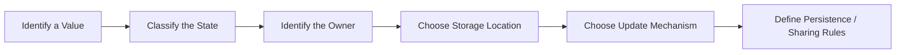

Routing and forms are included because they are two of the largest sources of state-management decisions in front-end systems.

The central principle is:

> **Keep state as close as practical to the code that owns it, and move it outward only when another responsibility genuinely needs to share, persist, or address it.**

---

# 1. “State” Is Not One Thing

Consider an administrative product catalogue.

The interface contains:

- search query;
- selected category;
- sort order;
- current page;
- product records from the server;
- whether an edit dialog is open;
- which product is being edited;
- current form values;
- whether a field has been touched;
- current user preferences;
- whether a sidebar is collapsed;
- calculated count of visible products.

It would be possible to place everything inside one object:

```js
const state = {
  query: "",
  category: "all",
  sort: "name",
  page: 1,
  products: [],
  editDialogOpen: false,
  editingProductId: null,
  formValues: {},
  touchedFields: {},
  preferences: {},
  sidebarCollapsed: false,
  visibleCount: 0
};
```

But this hides important distinctions.

Some values belong to the URL.

Some come from the server.

Some belong only to a modal.

Some should be persisted.

Some should not be stored at all.

Before deciding where state lives, classify it.

---

# 2. A Practical State Taxonomy

A useful taxonomy for front-end applications is:

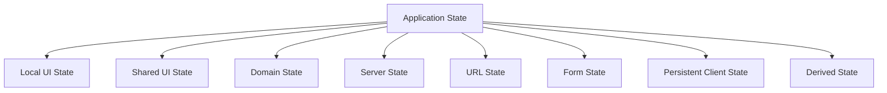

These categories can overlap conceptually.

The purpose is not to create rigid boxes.

The purpose is to ask better architectural questions.

---

# 3. Local UI State

Local UI state affects a small part of the interface and is owned by a nearby component.

Examples:

- accordion expanded/collapsed;
- local tab selection;
- tooltip visibility;
- modal open state;
- input focus helper state;
- temporary menu visibility.

For example:

```text
ProductCard
└── quickActionsOpen
```

If only the card needs that value, keeping it local is usually simpler.

React conceptually:

```jsx
const [
  open,
  setOpen
] = useState(false);
```

Vue conceptually:

```js
const open =
  ref(false);
```

The important decision is not the API.

It is ownership.

---

# 4. Shared UI State

Some interface state affects several related components.

Example:

```text
CataloguePage
├── FilterSummary
├── ProductGrid
└── ClearFiltersButton
```

All three may need access to the selected filters.

That state may need to move to a common ancestor or a shared state mechanism.

Conceptually:

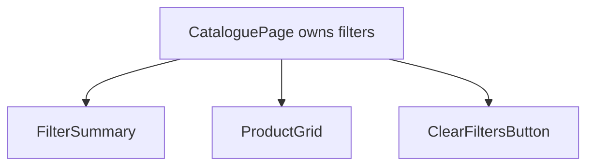

This is sometimes called **lifting state up**.

The principle is:

> Move state to the lowest common owner that needs to coordinate it.

Do not move it directly to a global store merely because two components need it.

---

# 5. Domain State

Domain state represents meaningful business concepts.

Examples:

- selected patient;
- active invoice;
- shopping cart;
- exam assignment;
- admission workflow;
- current order draft.

Domain state is not necessarily global.

A shopping cart may be widely shared.

A hospital admission draft may belong only to one workflow.

The important feature is that the state has meaning in the problem domain.

For example:

```ts
type AdmissionDraft = {
  patientId: PatientId;
  wardId: WardId;
  requestedBedType: BedType;
  notes: string;
};
```

This is different from:

```text
modalOpen
```

even though both are technically state.

---

# 6. Server State

Server state is data whose authoritative source is outside the current browser application.

Examples:

- products loaded from an API;
- patient records;
- account balances;
- current inventory;
- messages;
- reports;
- permissions returned by the backend.

This category is extremely important.

Server state has properties that ordinary local UI state usually does not.

It may be:

- asynchronous;
- cached;
- stale;
- invalidated;
- refreshed;
- shared by other users;
- updated outside the browser;
- subject to permissions;
- paginated;
- partially loaded.

This makes server state fundamentally different from:

```text
isModalOpen
```

---

# 7. Server State Is Not “Just Another Global Variable”

Suppose an application loads products.

A naive pattern:

```js
const [
  products,
  setProducts
] = useState([]);
```

This is not automatically wrong.

But once the application needs:

- cache lifetime;
- background refresh;
- retries;
- optimistic updates;
- deduplication;
- pagination;
- invalidation;

plain component state becomes an incomplete model.

A stronger conceptual separation is:

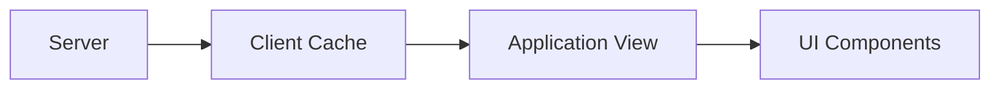

The client cache is a representation of remote state.

It is not necessarily the source of truth.

Chapter 9 will treat server-state caching in depth.

For this chapter, remember:

> **Do not casually copy server data into unrelated client state and then expect the copies to remain synchronized.**

---

# 8. Cached Data

Cache state is related to server state but worth distinguishing.

Suppose the server owns:

```text
Product P-42
```

The browser may cache the last known representation.

That cached value may include metadata such as:

- when it was fetched;
- whether it is stale;
- whether a refetch is active;
- whether a mutation invalidated it.

Conceptually:

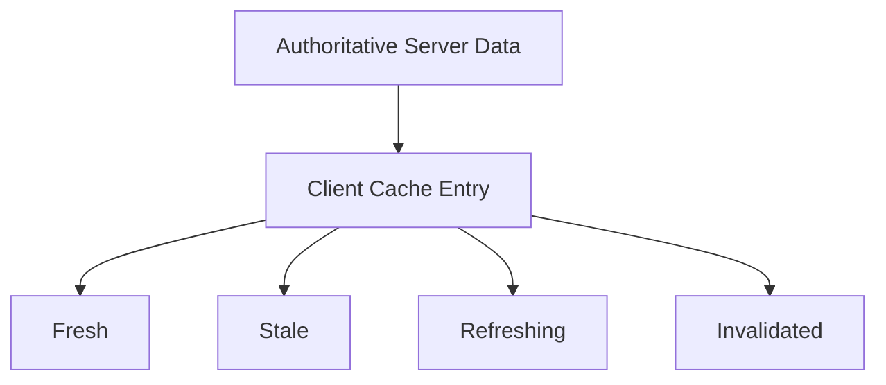

That lifecycle differs from ordinary local UI state.

---

# 9. URL State

The URL can also hold application state.

Consider:

```text
/products?q=laptop&category=office&sort=price&page=2
```

The URL expresses:

- search query;
- category;
- sort order;
- current page.

This has powerful consequences.

The current view can be:

- bookmarked;
- shared;
- restored after refresh;
- navigated with browser Back/Forward;
- opened in another tab.

URL state is therefore not just routing metadata.

It is part of the application state model.

---

# 10. Form State

Forms contain their own state concerns.

Examples:

- field values;
- validation errors;
- touched state;
- dirty state;
- submission state;
- dynamic rows;
- current step;
- cross-field relationships.

A form can be small:

```text
email
password
```

or extremely complex:

```text
multi-step hospital admission workflow
```

The complexity of the form should determine the architecture.

Do not use a large form-state framework for a three-field form merely because it exists.

---

# 11. Persistent Client State

Some state should survive reloads.

Examples:

- theme preference;
- locale choice;
- dismissed onboarding;
- table-density preference;
- last selected workspace where appropriate.

Possible storage mechanisms include:

- localStorage;
- IndexedDB;
- cookies;
- server-side user preferences.

Persistence changes the state model.

Now we must consider:

- versioning;
- stale formats;
- migration;
- synchronization;
- validation.

As Chapter 5 established, persisted client data should be treated as a runtime boundary when read back.

---

# 12. Derived State

Derived state is information calculated from other values.

Examples:

```text
filteredProducts
cartTotal
fullName
visibleCount
isSubmitDisabled
```

If:

```text
visibleProducts =
products + query + category
```

then storing all four creates duplicated truth.

Prefer:

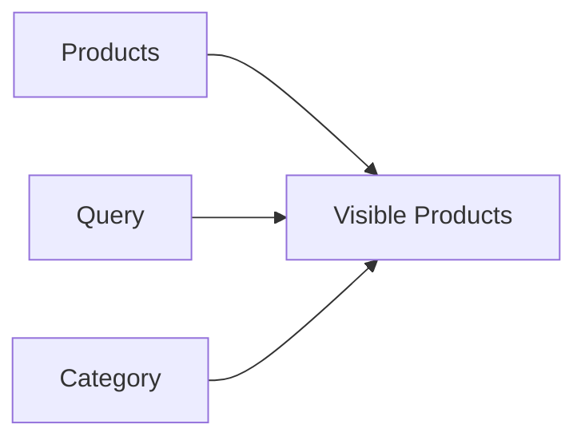

instead of:

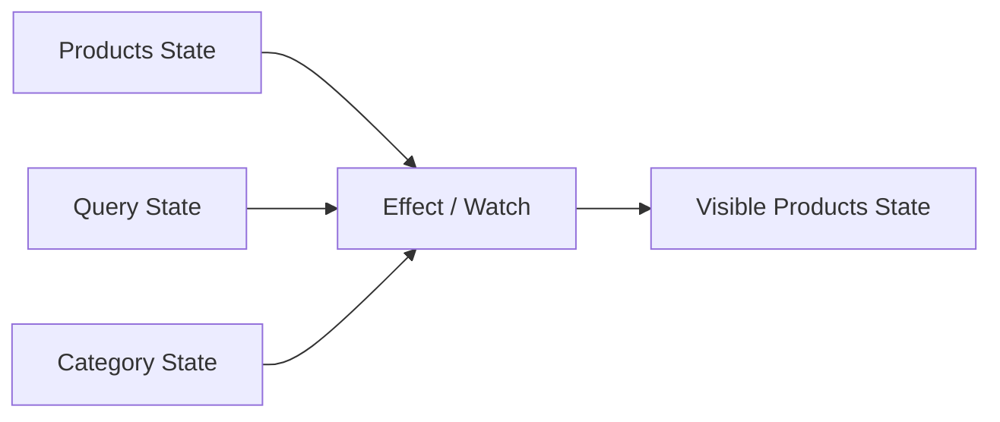

The principle from Chapter 7 remains:

> Derive what can be derived.

---

# 13. Ownership: Who Is Responsible for the State?

Once a value is classified, ask:

> Who owns it?

Ownership means:

- who can change it;
- who needs to read it;
- who defines its lifecycle;
- who decides when it resets.

Consider:

```text
ProductDetailsDialog
```

If the dialog alone owns whether an internal accordion is expanded, keep it local.

If the current selected product determines:

- dialog content;
- URL;
- keyboard shortcut;
- side panel;

then selection belongs higher.

---

# 14. Keep State as Close as Practical

A useful default is:

```text
local need
→ local state

shared sibling need
→ common ancestor

cross-feature need
→ shared store/context only if justified

shareable navigation state
→ URL

remote authoritative data
→ server-state/cache layer

persistent user preference
→ persistence boundary
```

This can be expressed as:

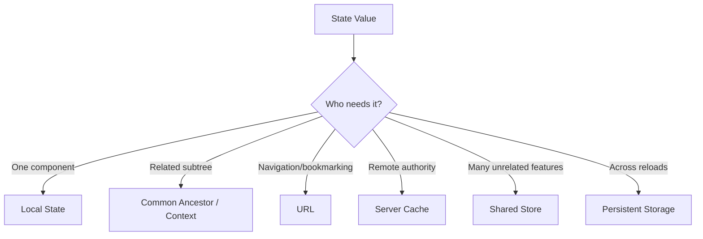

This is a heuristic, not a law.

---

# 15. State Should Move Outward for a Reason

Common reasons include:

- two siblings need the same value;
- navigation should reproduce the state;
- state must survive component removal;
- unrelated features coordinate through it;
- persistence is required;
- domain workflows need centralized transitions.

Bad reason:

> I may need it globally later.

Premature globalization makes dependencies harder to understand.

---

# 16. Global State Has a Cost

A global store can be useful.

It can also become an application-wide dumping ground.

When everything is global:

- ownership becomes unclear;
- stale state survives too long;
- unrelated features become coupled;
- tests require global setup;
- debugging becomes harder;
- components depend on hidden ambient state.

A store is an architectural tool, not a default destination.

---

# 17. Reducers: Make Transitions Explicit

As state transitions become more complex, direct setters can become difficult to coordinate.

Consider:

```js
setItems(...);
setSelectedId(...);
setDirty(...);
setError(...);
```

A reducer expresses transitions as one conceptual operation.

For example:

```ts
type State = {
  items: Item[];
  selectedId:
    string | null;
  dirty: boolean;
};

type Action =
  | {
      type: "item-selected";
      id: string;
    }
  | {
      type: "item-updated";
      item: Item;
    }
  | {
      type: "reset";
    };
```

Then:

```ts
function reducer(
  state: State,
  action: Action
): State {
  switch (action.type) {
    case "item-selected":
      return {
        ...state,
        selectedId:
          action.id
      };

    case "item-updated":
      return {
        ...state,
        items:
          state.items.map(
            item =>
              item.id ===
              action.item.id
                ? action.item
                : item
          ),
        dirty: true
      };

    case "reset":
      return initialState;
  }
}
```

The architectural benefit is explicit transition logic.

---

# 18. Unidirectional Data Flow

Reducers fit a broader model:

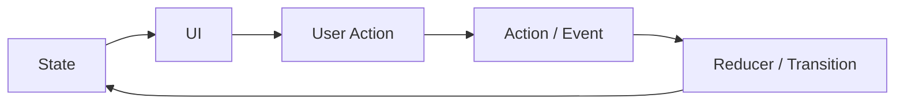

The flow is easier to reason about than arbitrary mutation from many directions.

This does not mean every component needs a reducer.

Use reducers when:

- state has several related fields;
- transitions matter;
- many update paths exist;
- one event should update several related values coherently.

---

# 19. Stores

A store is a state container shared beyond one component.

It may provide:

- state;
- actions;
- derived selectors;
- subscriptions;
- persistence;
- DevTools integration.

Examples exist in both React and Vue ecosystems.

But the architectural questions come first:

- What belongs in the store?
- What should remain local?
- What is server state?
- What is URL state?
- What can be derived?

A store should not become a replacement for thinking.

---

# 20. Store Boundaries

Suppose an application has:

```text
authentication
shopping cart
notifications
catalogue
admin filters
```

One giant store may couple unrelated concerns.

A more modular structure can be:

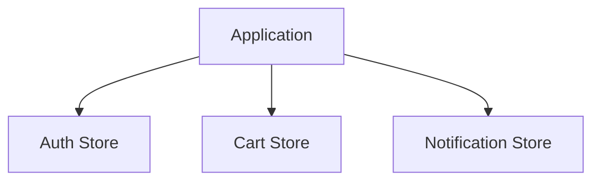

But even this should not absorb:

```text
every open dropdown
every text field
every API response
```

Local state should remain local.

---

# 21. Reducers vs Stores

A reducer answers:

> How does this state transition in response to an action?

A store answers:

> Where is shared state held and how do consumers access/update it?

A store may use a reducer internally.

They are related but not identical concepts.

---

# 22. State Machines

Some workflows have explicit allowed states and transitions.

Consider a document approval flow:

```text
draft
→ submitted
→ under-review
→ approved
```

with rejection:

```text
under-review
→ rejected
```

A boolean-based model might be:

```ts
{
  submitted: true,
  approved: true,
  rejected: true
}
```

which can represent nonsense.

A state machine makes valid transitions explicit.

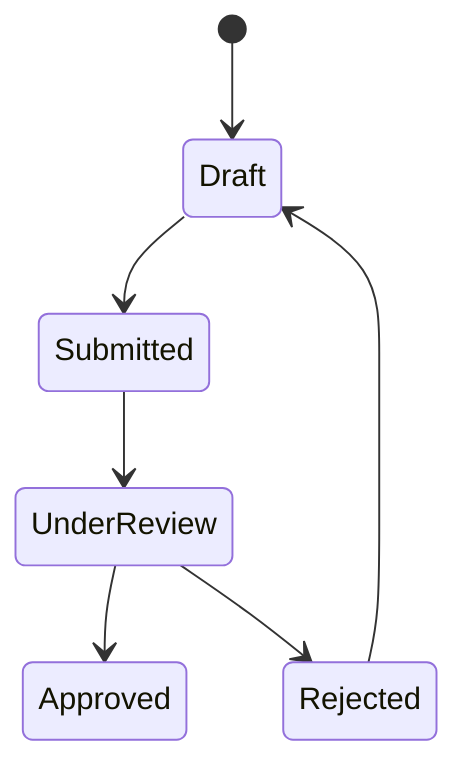

This is especially useful when invalid transitions matter.

---

# 23. State Machines as Working Knowledge

You do not need a specialized state-machine library to benefit from the model.

Even a discriminated union can help:

```ts
type ApprovalState =
  | {
      status: "draft";
    }
  | {
      status: "submitted";
      submittedAt: string;
    }
  | {
      status:
        "under-review";
      reviewerId: string;
    }
  | {
      status: "approved";
      approvedAt: string;
    }
  | {
      status: "rejected";
      reason: string;
    };
```

The key idea is:

> Model transitions and valid states explicitly when workflow correctness matters.

---

# 24. Routing Is State Architecture

Routing is often introduced as:

> Map URL paths to components.

That is correct but incomplete.

Routing also determines:

- navigation history;
- which parts of the UI persist;
- what state is addressable;
- what can be bookmarked;
- which layouts remain mounted;
- when data loads;
- where errors belong.

Routing is therefore part of application architecture.

---

# 25. Paths

Consider:

```text
/products
/products/P-42
/settings
/admin/users
```

These paths identify application locations.

A router maps them to UI structure.

Conceptually:

```mermaid
flowchart TD
    A[/products] --> B[ProductList]
    C[/products/:id] --> D[ProductDetails]
    E[/settings] --> F[SettingsPage]
    G[/admin/users] --> H[UserAdmin]
```

---

# 26. Route Parameters

A dynamic route:

```text
/products/:productId
```

may match:

```text
/products/P-42
```

with:

```text
productId = P-42
```

Route parameters usually identify a resource or structural route segment.

Examples:

```text
/users/42
/orders/ORD-20
/courses/CS101
```

As Chapter 5 emphasized, route parameters arrive as external runtime values.

Parse and validate them.

Do not assume:

```text
/users/abc
```

cannot occur.

---

# 27. Query/Search Parameters

Query parameters are useful for view state:

```text
/products?category=office&sort=price&page=2
```

They are especially suitable for values that should be:

- shareable;
- bookmarkable;
- restorable;
- navigable through browser history.

Common examples:

- search query;
- filtering;
- sorting;
- pagination;
- selected tab when it represents meaningful navigation.

---

# 28. Path Parameter or Query Parameter?

A practical distinction:

### Path parameter

Use when the value identifies the resource or structural location.

```text
/products/P-42
```

### Query parameter

Use when the value modifies the current view.

```text
/products?sort=price
```

This is not an absolute rule.

But it usually creates readable URLs.

---

# 29. Nested Routes

Applications often have hierarchical navigation.

For example:

```text
/admin
/admin/users
/admin/users/42
/admin/roles
```

A route tree:

```mermaid
flowchart TD
    A[/admin] --> B[AdminLayout]
    B --> C[/users]
    B --> D[/roles]

    C --> E[/users/:id]
```

The parent can provide:

- shared navigation;
- breadcrumbs;
- permissions;
- layout.

Nested routing maps naturally to nested interface structure.

---

# 30. Layout Routes

A layout route renders shared UI around child routes.

Conceptually:

```text
AdminLayout
├── Header
├── Sidebar
└── ChildRoute
```

The layout may remain mounted while child content changes.

This has important consequences for:

- state preservation;
- scroll behavior;
- data reuse;
- transitions.

Routing decisions therefore affect component lifecycle.

---

# 31. Navigation

Navigation can be initiated by:

- links;
- buttons where an action truly requires navigation;
- redirects;
- programmatic routing;
- form submission;
- browser history.

Prefer semantic links for ordinary navigation:

```html
<a href="/products">
  Products
</a>
```

Framework routers often enhance these links so full document reload is avoided where appropriate.

But the semantic concept remains navigation.

---

# 32. Browser History

The browser maintains navigation history.

Users expect:

- Back;
- Forward;
- refresh;
- deep linking

to behave sensibly.

A client-side router should cooperate with this model rather than inventing an unrelated navigation system.

The History API allows SPAs to update address-bar state without full-page navigation.

Framework routers typically manage this for you.

---

# 33. Redirects

A redirect changes navigation intentionally.

Examples:

- unauthenticated user goes to sign-in;
- old URL redirects to new route;
- completed wizard moves to confirmation;
- default nested route selects an initial child.

Redirects should represent navigation rules.

They should not become a substitute for rendering conditional content.

---

# 34. File-Based Routing

Some frameworks generate route structure from files.

Conceptually:

```text
pages/
├── index
├── products/
│   ├── index
│   └── [id]
└── settings
```

may correspond to:

```text
/
/products
/products/:id
/settings
```

File-based routing is a convention for declaring route structure.

The important architectural concepts remain:

- nesting;
- parameters;
- layouts;
- ownership;
- loading;
- state preservation.

Do not confuse the routing convention with the underlying routing model.

---

# 35. The URL as State

Suppose a catalogue view has:

```text
query
category
sort
page
```

If these values are stored only in component state:

```text
user configures view
↓
refresh
↓
view resets
```

If they live in the URL:

```text
/products?q=monitor&category=office&sort=price&page=3
```

then the view becomes addressable.

This is a strong architectural benefit.

---

# 36. Shareable State Belongs Naturally in the URL

A useful rule is:

> If a user would reasonably want to bookmark, share, revisit, or navigate back to this view, consider representing it in the URL.

Good candidates include:

- search query;
- filters;
- sort;
- pagination;
- selected report range;
- selected meaningful tab;
- resource identity.

---

# 37. What Usually Should Not Go in the URL?

Not every state value belongs there.

Avoid placing sensitive or transient data such as:

- passwords;
- authentication tokens;
- unsaved form secrets;
- large object payloads;
- hover state;
- temporary animation state;
- local dropdown visibility.

Also avoid turning the URL into an encoded global-store dump.

The URL should remain meaningful and reasonably stable.

---

# 38. URL State Should Have One Owner

A common bug occurs when the same filter exists in:

```text
component state
+
URL query
+
global store
```

Now which one is authoritative?

A stronger design picks one source of truth.

For shareable filter state:

```text
URL
→ parse
→ domain filter model
→ UI
```

User interactions update the URL.

The UI derives from it.

---

# 39. Parsing URL State

Suppose:

```text
/products?page=abc&sort=unknown
```

The router gives us strings.

Our application wants:

```ts
type ProductSort =
  | "name"
  | "price";

type ProductViewState = {
  page: number;
  sort: ProductSort;
};
```

We need parsing.

Conceptually:

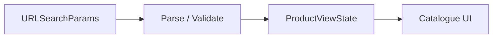

This connects directly to Chapter 5's trust-boundary model.

---

# 40. Example: URL-Based Filtering

Suppose the URL is:

```text
/products?q=laptop&category=office&page=2
```

A parser:

```ts
function parsePage(
  value: string | null
): number {
  const number =
    Number(value);

  if (
    !Number.isInteger(number)
    ||
    number < 1
  ) {
    return 1;
  }

  return number;
}
```

Search query:

```ts
function parseQuery(
  value: string | null
): string {
  return (
    value
      ?.trim()
      .slice(0, 100)
    ?? ""
  );
}
```

Now URL input becomes valid application state.

---

# 41. Routing UX Is Part of Architecture

Changing routes affects user experience.

A technically correct router can still feel poor if it mishandles:

- loading;
- pending navigation;
- errors;
- scroll;
- focus;
- state preservation.

Routing is therefore both structural and experiential.

---

# 42. Pending Navigation

Suppose a user clicks:

```text
Reports
```

and the new route needs data and code.

If the interface appears frozen, navigation feels broken.

A routing system may expose pending state.

The UI can show:

- progress indicator;
- skeleton;
- disabled repeated action;
- preserved old content with pending affordance.

The goal is to communicate:

> Navigation has started and work is in progress.

---

# 43. Loading States

Loading can occur at different levels:

```text
whole route
nested panel
single widget
```

Do not automatically replace the entire page with:

```text
Loading...
```

if only one nested region is fetching data.

Nested routes can support nested loading boundaries.

This preserves surrounding context.

---

# 44. Route Errors

Different route failures require different handling.

Examples:

- route not found;
- resource not found;
- access denied;
- network failure;
- unexpected exception.

A good architecture places errors near the level that can recover or explain them.

Conceptually:

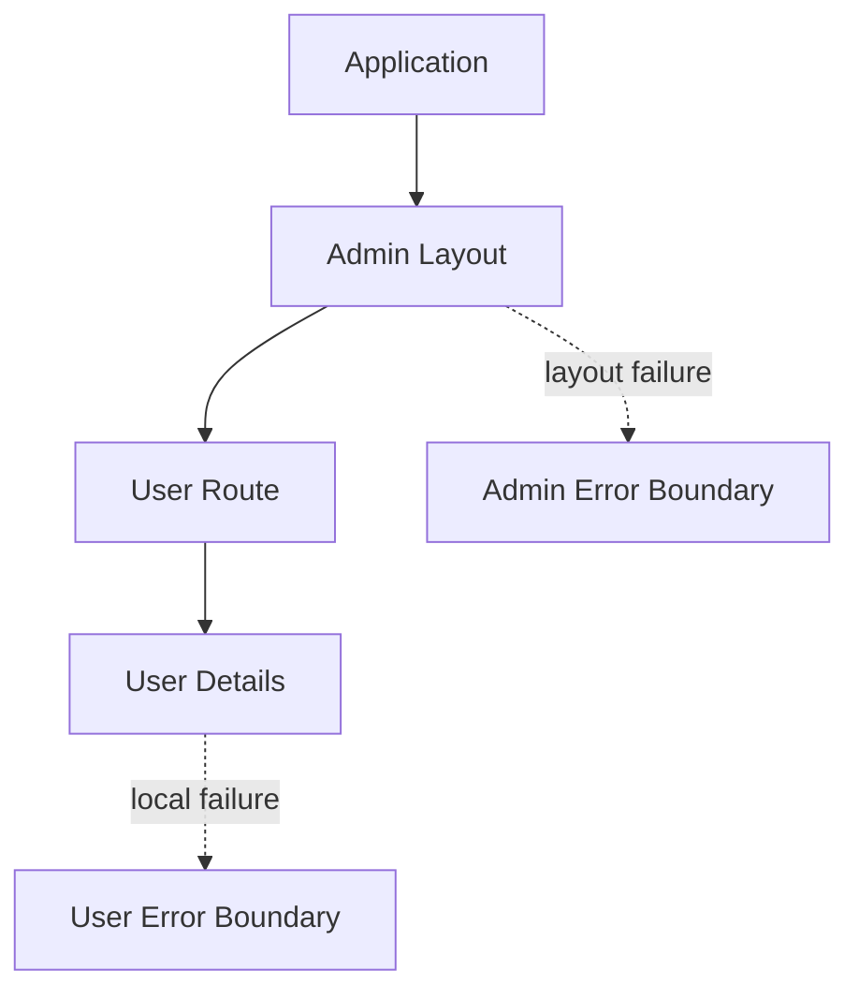

Do not force every error into one global screen.

---

# 45. Scroll Restoration

Users expect:

- Back to return near the previous scroll position;
- navigation to a new page to begin appropriately;
- anchor navigation to work.

SPAs can accidentally lose these behaviors.

A router may provide scroll-restoration support.

Where it does not, the application may need explicit policy.

The policy should follow navigation semantics, not arbitrary `scrollTo(0, 0)` on every route change.

---

# 46. Focus After Navigation

Accessibility matters during client-side navigation.

A full document navigation naturally changes document context.

Client-side navigation may update only part of the DOM.

Keyboard and assistive-technology users still need understandable focus and heading structure.

Common considerations:

- meaningful page heading;
- focus placement where appropriate;
- announcement of navigation change;
- avoiding focus loss.

Routing UX and accessibility are connected.

---

# 47. State Preservation Across Routes

Suppose:

```text
/products
```

contains:

- search query;
- scroll position;
- selected filters.

The user opens:

```text
/products/P-42
```

then presses Back.

Should the catalogue restore:

- filters?
- page?
- scroll?
- search text?

Often yes.

URL state helps.

Layout routing and browser history can also preserve context.

Architecture should decide deliberately.

---

# 48. Route-Level Code Splitting

Routes create natural code boundaries.

Suppose the admin reporting page includes a large charting library.

Users who never open reports should not necessarily download it during initial startup.

A route can dynamically load its code.

Conceptually:

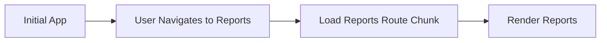

Chapter 12 will treat code splitting in more depth.

Here, the important point is:

> Routing structure often influences delivery architecture.

---

# 49. Form Architecture Is State Architecture

Forms are often treated as a collection of inputs.

Complex forms are really stateful workflows.

A form may need to know:

- current values;
- original values;
- touched fields;
- dirty fields;
- validation results;
- current step;
- dynamic rows;
- cross-field relationships;
- whether the user can leave safely.

That is a state model.

---

# 50. Controlled Forms

In a controlled approach, application state owns current field values.

React-style example:

```jsx
const [
  name,
  setName
] = useState("");

<input
  value={name}
  onChange={
    event =>
      setName(
        event.target.value
      )
  }
/>
```

Advantages:

- application always knows current value;
- easy to derive validation;
- easy to coordinate fields.

Costs:

- more state/update code;
- potentially more rendering work in large forms.

---

# 51. Uncontrolled Forms

In an uncontrolled approach, native form controls hold current values.

For example:

```html
<form>
  <input
    name="name"
  >
</form>
```

JavaScript reads values when needed through:

```js
new FormData(form)
```

This can be simple and robust for many forms.

Advantages:

- less synchronization code;
- browser remains state owner;
- fewer application updates during typing.

Controlled and uncontrolled are not moral categories.

Choose according to requirements.

---

# 52. Hybrid Form Architectures

A form may use:

- uncontrolled text inputs;
- controlled custom components;
- local state for current step;
- derived validation;
- URL state for wizard step where appropriate.

Do not assume one entire form must follow one single state technique.

The architecture should remain coherent, but different field types may justify different mechanisms.

---

# 53. Form Values

The most obvious form state is field values.

Example:

```ts
type ProductFormValues = {
  name: string;
  price: string;
  category: string;
  active: boolean;
};
```

Notice `price` may remain a string while editing.

Why?

Because intermediate user input can be:

```text
""
"."
"12."
```

which is not always a valid domain number yet.

Form representation and domain representation can differ.

---

# 54. Form Model vs Domain Model

Suppose the domain requires:

```ts
type Product = {
  name: string;
  price: number;
};
```

The form may use:

```ts
type ProductForm = {
  name: string;
  price: string;
};
```

At submission boundary:

```text
ProductForm
↓
parse / validate
↓
ProductUpdate
```

This follows the Chapter 5 boundary principle.

Do not force partially edited user input into a fully valid domain model too early.

---

# 55. Touched State

A field may be invalid before the user interacts with it.

Suppose a required field starts empty.

Should the page immediately display:

```text
This field is required.
```

before the user has done anything?

Often not.

`touched` state records whether the user has interacted with the field.

Example:

```ts
type TouchedState = {
  name: boolean;
  email: boolean;
};
```

This can control when validation feedback becomes visible.

---

# 56. Dirty State

Dirty means the current value differs from its initial value.

Examples:

- field dirty;
- form dirty.

This supports behavior such as:

- enable Save only after changes;
- warn before leaving;
- show “unsaved changes” indicator.

Conceptually:

```text
initial value
vs
current value
→ dirty?
```

Do not manually maintain dirty flags if they can be reliably derived from initial/current values.

For large forms, a form library may optimize this comparison.

---

# 57. Validation State

Validation can occur at several layers.

### Field-level

```text
email syntax
required
minimum length
```

### Cross-field

```text
end date must follow start date
password confirmation must match
```

### Domain/business

```text
requested quantity must not exceed allowed amount
```

### Server-side

```text
username already exists
permission denied
```

Chapter 9 will address server submission and mutation responses.

This chapter focuses on client form architecture.

---

# 58. Derive Validation Where Practical

Suppose:

```ts
const password = "...";
const confirmPassword = "...";
```

We can derive:

```ts
const passwordsMatch =
  password
    ===
  confirmPassword;
```

Do not necessarily store:

```text
passwordsMatch
```

as another state value.

The same principle applies to many validation states.

---

# 59. Cross-Field Validation

Consider booking dates.

```ts
type BookingForm = {
  startDate: string;
  endDate: string;
};
```

Validation:

```ts
function validateBooking(
  values: BookingForm
) {
  const errors:
    Record<string, string> =
    {};

  if (
    values.startDate
    &&
    values.endDate
    &&
    values.endDate
      <
    values.startDate
  ) {
    errors.endDate =
      "End date must not be before start date.";
  }

  return errors;
}
```

The error belongs to a relationship, not a single isolated field.

This is why complex forms often need a form-level validation model.

---

# 60. Dynamic Fields

Some forms contain repeated sections.

Examples:

- invoice line items;
- household members;
- medications;
- education history;
- contact methods.

State might look like:

```ts
type ContactMethod = {
  id: string;
  type:
    "email"
    | "phone";
  value: string;
};

type ContactForm = {
  contacts:
    ContactMethod[];
};
```

Stable IDs matter.

Using array indexes as identity can create the same problems discussed in Chapter 7 for list rendering.

---

# 61. Dynamic Field Operations

Typical operations include:

```text
add row
remove row
reorder row
duplicate row
```

A reducer may become useful.

For example:

```ts
type FormAction =
  | {
      type: "contact-added";
    }
  | {
      type: "contact-removed";
      id: string;
    }
  | {
      type: "contact-changed";
      id: string;
      field:
        "type"
        | "value";
      value: string;
    };
```

This makes complex transitions explicit.

---

# 62. Multistep Forms

A multistep form adds workflow state.

Example:

```text
Step 1 — Personal Information
Step 2 — Address
Step 3 — Documents
Step 4 — Review
```

The architecture must decide:

- where current step lives;
- whether completed steps remain mounted;
- whether users can navigate backward;
- whether state persists after refresh;
- whether steps are addressable via URL;
- when validation occurs.

This is more than styling a progress bar.

---

# 63. URL and Multistep Forms

Sometimes step state belongs in the URL.

For example:

```text
/application/personal
/application/address
/application/documents
/application/review
```

Advantages:

- deep linking;
- browser Back/Forward;
- refresh preservation;
- route-level code splitting.

But if the form contains sensitive or incomplete state, values themselves should generally not be encoded directly into the URL.

The route may identify the step while the draft is stored elsewhere.

---

# 64. Wizard State Machine

A complex wizard can benefit from explicit transitions.

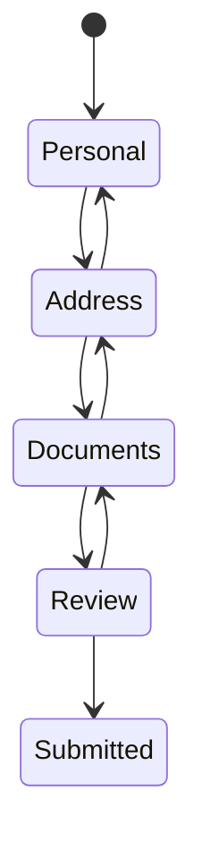

Validation rules can guard transitions.

For example:

```text
Personal → Address
only if personal information valid
```

This is a practical use of state-machine thinking.

---

# 65. Form Libraries

Form libraries can provide:

- registration;
- validation;
- touched/dirty tracking;
- dynamic fields;
- performance optimizations;
- schema integration.

But using a library does not remove architecture decisions.

You still need to decide:

- controlled vs uncontrolled style;
- validation boundaries;
- form/domain model separation;
- step ownership;
- server error mapping.

Use a form library when it reduces meaningful complexity.

Not because every form requires one.

---

# 66. When Native HTML Is Enough

A login form:

```html
<form>
  <label>
    Email
    <input
      type="email"
      name="email"
      required
    >
  </label>

  <label>
    Password
    <input
      type="password"
      name="password"
      required
    >
  </label>

  <button>
    Sign in
  </button>
</form>
```

may need very little client state.

The browser already provides:

- input state;
- focus;
- validation;
- submission semantics.

Do not rebuild browser behavior unnecessarily.

---

# 67. When a Form Library Becomes Justified

A library becomes more attractive when forms include:

- dozens of fields;
- nested objects;
- repeated arrays;
- conditional sections;
- multistep workflows;
- complicated validation;
- server error mapping;
- autosave;
- draft persistence.

The value lies in reducing coordination complexity.

---

# 68. Administrative Catalogue Example

We will now combine routing, state taxonomy, server data, and form state.

Requirements:

- list products;
- search;
- filter by category;
- sort;
- paginate;
- open edit dialog;
- edit complex product information;
- preserve filters in URL;
- keep server data separate from local UI state.

A useful architecture:

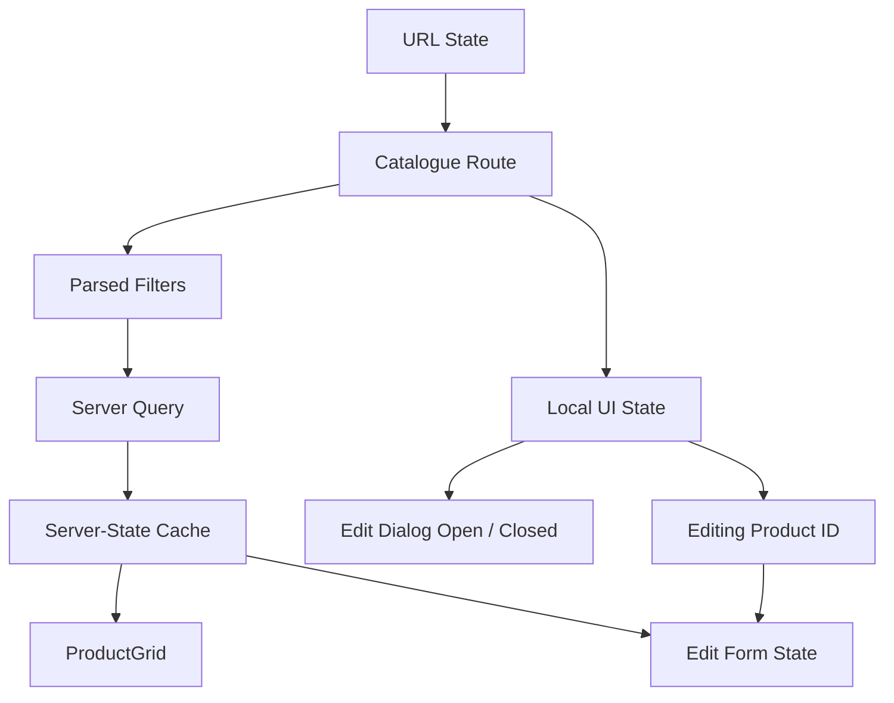

Notice that one “page” contains several state systems.

That is normal.

---

# 69. State Classification for the Example

### URL state

```text
query
category
sort
page
```

### Server state

```text
products
total count
categories from API
```

### Local UI state

```text
edit dialog open
temporary expansion state
```

### Domain/form state

```text
product edit draft
```

### Derived state

```text
is form dirty
visible page count
can submit
```

The architecture becomes clearer immediately.

---

# 70. Avoid Duplicating URL State

Weak:

```text
URL query
+
component query state
+
global filter store
```

Stronger:

```text
URL
↓
parsed filter object
↓
components
```

When user changes filter:

```text
UI event
↓
update URL
↓
router produces new parsed state
↓
server query updates
```

One source of truth.

---

# 71. Avoid Copying Server Data into the Form Too Early

Suppose product data arrives:

```ts
type Product = {
  id: string;
  name: string;
  price: number;
};
```

When edit dialog opens, create a form draft:

```ts
type ProductForm = {
  name: string;
  price: string;
};
```

The form draft is intentionally separate.

Why?

Because unsaved edits should not mutate cached server data directly.

Conceptually:

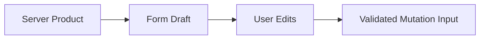

Chapter 9 will continue from the mutation input to server submission.

---

# 72. Modal State Should Stay Local Unless Navigation Owns It

If edit dialog state is purely transient:

```text
editModalOpen
editingId
```

may live in the route component.

But if the application should support:

```text
/products/P-42/edit
```

as a deep-linkable view, then the route itself may own the edit state.

The correct location depends on UX semantics.

Ask:

> Should refreshing or sharing the URL preserve this state?

If yes, route state may be appropriate.

---

# 73. Selected Tabs: Local or URL?

This is a common decision.

Suppose:

```text
User Profile
├── Overview
├── Orders
└── Security
```

If tabs represent meaningful sections users may share:

```text
/users/42?tab=orders
```

or nested routes:

```text
/users/42/orders
```

may be appropriate.

If tabs are minor visual organization:

```text
compact
details
```

local state may be better.

Again:

> Addressability should drive the decision.

---

# 74. Pagination State

Pagination is usually a strong URL candidate.

```text
?page=4
```

Why?

Because:

- Back should restore it;
- refresh should preserve it;
- shared link should show the same page.

Cursor-based pagination may use a different URL form, but the principle remains.

---

# 75. Sort State

Sort state often belongs in the URL:

```text
?sort=price-desc
```

unless the sort is a purely local temporary visualization.

The URL should use stable semantic values.

Avoid encoding internal component details such as:

```text
?sortControlIndex=3
```

Prefer:

```text
?sort=price-desc
```

---

# 76. Search State

Search can exist at several levels.

### Local suggestion input

```text
user types
→ show autocomplete
```

This may remain local until submission.

### Search results route

```text
/search?q=reactivity
```

Now the query is meaningful URL state.

The distinction is whether the text represents:

- unfinished local interaction;
- or current navigable application state.

---

# 77. Persistent Preferences

Suppose table density can be:

```text
comfortable
compact
```

This may belong in:

- localStorage;
- user profile on server;
- both with synchronization.

It usually does not belong in:

```text
?density=compact
```

unless sharing that view configuration has value.

The state taxonomy helps prevent overusing the URL.

---

# 78. One Value Can Change Category Over Time

State categories are architectural decisions, not permanent properties.

Example:

Version 1:

```text
selected tab
→ local state
```

Version 2 introduces deep linking:

```text
selected tab
→ URL state
```

Version 3 synchronizes tab across multiple windows:

```text
perhaps another shared mechanism
```

As product requirements change, state ownership can change.

Architecture should evolve deliberately.

---

# 79. A State Placement Decision Tree

A useful heuristic:

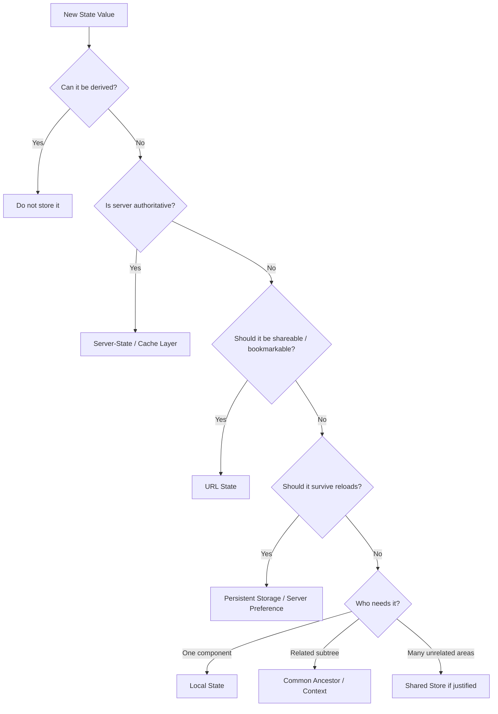

No decision tree replaces judgment.

But this is a strong starting point.

---

# 80. Common State Smells

Several patterns often indicate architectural problems.

### State copied from props without a reason

```js
const [
  localUser,
  setLocalUser
] = useState(user);
```

If `user` changes, should local state update?

If yes, duplication may be wrong.

If no, perhaps this is intentionally a draft.

Name it accordingly.

---

### Derived values stored as state

```text
products
filteredProducts
visibleCount
```

often creates synchronization.

---

### Everything global

A store contains:

```text
hovered row
open dropdown
temporary input
server cache
form draft
theme
```

with no ownership distinction.

---

### Same value in URL and component state

This creates competing truths.

---

### Effects/watchers used to synchronize local copies

This often indicates duplicated state.

---

# 81. Routing Smells

### Route reflects implementation rather than domain

Weak:

```text
/app/page2/component7
```

Better:

```text
/orders/ORD-42
```

### Important view state disappears on refresh

Maybe URL state is missing.

### Back button behaves surprisingly

History integration may be wrong.

### Changing child route destroys parent context unnecessarily

Layout structure may be wrong.

### Huge initial bundle for rarely used routes

Route-level splitting may be missing.

---

# 82. Form Smells

### Every keystroke updates a global store

Usually unnecessary.

### Validation duplicated in many components

Central form validation may be needed.

### Domain model and unfinished input forced to be identical

This creates awkward invalid intermediate states.

### Dirty/touched flags manually synchronized everywhere

A form architecture or library may help.

### Multistep form uses many unrelated booleans

A reducer or state machine may be clearer.

---

# 83. React Example: URL-State Catalogue

Conceptually:

```jsx
function CatalogueRoute() {
  const [
    searchParams,
    setSearchParams
  ] =
    useSearchParams();

  const filters =
    parseFilters(
      searchParams
    );

  const products =
    useProducts(filters);

  function updateQuery(
    query
  ) {
    const next =
      new URLSearchParams(
        searchParams
      );

    if (query) {
      next.set(
        "q",
        query
      );
    } else {
      next.delete("q");
    }

    next.set(
      "page",
      "1"
    );

    setSearchParams(next);
  }

  return (
    <Catalogue
      filters={filters}
      products={products}
      onQueryChange={
        updateQuery
      }
    />
  );
}
```

The exact router API may differ.

The architectural pattern is:

```text
URL
→ parsed state
→ query/cache
→ UI
```

---

# 84. Vue Example: URL-State Catalogue

Conceptually:

```js
const route =
  useRoute();

const router =
  useRouter();

const filters =
  computed(() =>
    parseFilters(
      route.query
    )
  );

function updateQuery(
  query
) {
  router.push({
    query: {
      ...route.query,
      q:
        query || undefined,
      page:
        "1"
    }
  });
}
```

Again, syntax differs.

The state architecture is the same.

---

# 85. Forms in React and Vue

React may use:

- controlled inputs;
- uncontrolled refs;
- form libraries.

Vue may use:

- `v-model`;
- refs/reactive objects;
- form libraries.

But the design questions are framework-independent:

- Who owns current values?
- Is partial input allowed?
- What is derived?
- When is validation shown?
- How are dynamic fields identified?
- What survives step changes?
- What becomes a domain object?

---

# 86. A Complex Edit Form Model

Suppose a product editor contains:

```ts
type ProductEditForm = {
  name: string;
  description: string;
  price: string;
  categoryId: string;
  active: boolean;

  variants:
    {
      id: string;
      label: string;
      stock: string;
    }[];
};
```

Additional UI state:

```ts
type ProductFormMeta = {
  touched:
    Record<string, boolean>;

  currentSection:
    "general"
    | "pricing"
    | "variants";
};
```

Derived values:

```text
errors
dirty
canSubmit
totalStock
```

This separation is useful.

---

# 87. Form Reducer Example

Complex updates may benefit from a reducer.

```ts
type FormAction =
  | {
      type: "name-changed";
      value: string;
    }
  | {
      type:
        "variant-added";
    }
  | {
      type:
        "variant-stock-changed";
      id: string;
      value: string;
    }
  | {
      type: "reset";
      values:
        ProductEditForm;
    };
```

This centralizes transitions.

Do not use a reducer merely because the form has several fields.

Use it when transition logic benefits from explicit coordination.

---

# 88. State Machine Example for the Form Workflow

Suppose:

```text
editing
→ validating
→ ready
→ submitting
→ success
```

with errors:

```text
validating → editing
submitting → editing
```

A machine model:

```mermaid
stateDiagram-v2
    [*] --> Editing
    Editing --> Validating
    Validating --> Editing: invalid
    Validating --> Ready: valid
    Ready --> Editing: field changed
    Ready --> Submitting
    Submitting --> Success
    Submitting --> Editing: server error
```

This can prevent contradictory flags such as:

```text
isSubmitting = true
isSuccess = true
hasValidationErrors = true
```

State machines become valuable when lifecycle transitions themselves are the problem.

---

# 89. Route + Form Interaction

Suppose:

```text
/products/P-42/edit
```

loads product P-42.

Architecture:

```mermaid
flowchart TD
    A[Route productId] --> B[Validate ID]
    B --> C[Load Server Product]
    C --> D[Create Form Draft]
    D --> E[User Edits]
    E --> F[Validate Form]
```

The route ID is URL state.

The product is server state.

The draft is form state.

These should not be collapsed into one object.

---

# 90. Unsaved Changes and Navigation

A dirty form creates a routing concern.

If the user navigates away:

```text
current form dirty?
```

The application may need to:

- warn;
- save draft;
- allow navigation;
- block navigation in limited circumstances.

This is where form architecture and routing architecture meet.

The correct UX depends on the application.

Avoid aggressive blockers for trivial forms.

But protect significant unsaved work.

---

# 91. Persistence for Long Forms

Large forms may need draft persistence.

Possible strategies:

- localStorage;
- IndexedDB;
- server-side draft;
- route-specific temporary store.

Now the form crosses another boundary.

Persisted drafts should be:

- versioned;
- validated on restore;
- migrated or discarded when schema changes.

This is especially important for long-lived applications.

---

# 92. State Preservation Across Component Removal

Suppose a route changes from:

```text
/edit/general
```

to:

```text
/edit/variants
```

If each route unmounts the other form section, local state may disappear.

Possible strategies:

- keep parent form state above route sections;
- persist draft;
- use one route layout that owns form state;
- store only current section in URL.

Architecture should align with expected persistence.

---

# 93. Local State vs Context vs Store

A useful comparison:

| Mechanism | Best fit |
|---|---|
| Local component state | one component / tightly local behavior |
| Lifted state | related siblings |
| Context / provide-inject | shared subtree dependency |
| Reducer | coordinated transitions |
| Shared store | broad cross-feature state |
| URL | addressable/shareable state |
| Server cache | remote authoritative data |
| Persistent storage | state that survives reload |

The table is not a ranking.

Each mechanism solves a different ownership problem.

---

# 94. Server State vs Client State

A useful split:

```mermaid
flowchart TD
    A[Application State] --> B[Client-Owned]
    A --> C[Server-Owned]

    B --> D[UI]
    B --> E[Forms]
    B --> F[URL]
    B --> G[Preferences]

    C --> H[Remote Records]
    C --> I[Cache]
```

A front-end should not pretend server-owned data becomes client-owned merely because it was fetched.

That distinction shapes invalidation and synchronization.

---

# 95. URL State vs Persistent State

Both survive some navigation contexts, but they serve different purposes.

### URL

Best for:

- shareability;
- navigation history;
- deep linking.

### Persistence storage

Best for:

- user preferences;
- local drafts;
- non-shareable continuity.

For example:

```text
?page=3
```

belongs naturally in URL.

```text
dark theme
```

often belongs in persistent preference storage.

---

# 96. Form State vs URL State

A wizard may expose:

```text
step=documents
```

in URL.

But individual form values such as:

```text
nationalId
homeAddress
medicalNotes
```

generally should not be encoded in the URL.

Separate:

```text
where the user is
```

from:

```text
what private data the user entered
```

This improves privacy and architecture.

---

# 97. State Ownership and Testing

Well-placed state makes tests simpler.

If filters live in URL:

- route tests can assert URL behavior;
- component tests can receive parsed filters.

If edit form state lives inside the form:

- form tests can focus on form transitions.

If remote data uses a cache layer:

- server-state tests can mock that boundary.

Poor state placement makes tests require unrelated infrastructure.

---

# 98. State Ownership and Team Scale

As applications grow, state boundaries affect ownership.

For example:

```text
Auth Team
→ authentication state

Catalogue Team
→ catalogue URL + feature state

Platform Team
→ router + cache infrastructure

Design System
→ local component interaction state
```

This reduces cross-team coupling.

Chapter 14 will extend this into organizational architecture.

---

# 99. A Practical State Review

When reviewing a feature, create a table like this:

| Value | Category | Owner | Persistence | Source of Truth |
|---|---|---|---|---|
| query | URL state | catalogue route | browser history | URL |
| page | URL state | catalogue route | browser history | URL |
| products | server state | query/cache layer | cache policy | server |
| editOpen | local UI | catalogue route | none | component |
| productDraft | form state | editor | optional draft | form |
| darkMode | preference | app/user settings | persistent | preference store |
| visibleCount | derived | none | none | calculated |

This simple exercise often reveals architectural mistakes immediately.

---

# 100. Misconceptions to Leave Behind

## “State management means choosing Redux, Pinia, or another library.”

No.

State management begins with classification and ownership.

A library comes later.

---

## “All shared state belongs in a global store.”

No.

Related components can often share through a common owner or context.

---

## “Server data becomes client state after fetching.”

Not conceptually.

Its authority still belongs to the server.

The browser usually holds a cache.

---

## “The URL is just for routing.”

No.

The URL can represent meaningful application view state.

---

## “Every UI option should go into the URL.”

No.

Use the URL for addressable/shareable state, not transient implementation details.

---

## “The same filter can safely live in URL and local state.”

Only if one is clearly derived from the other.

Two independent copies create synchronization risk.

---

## “Forms are just collections of controlled inputs.”

No.

Forms may have complex state, validation, workflow, and persistence requirements.

---

## “Controlled forms are always better.”

No.

Uncontrolled native forms can be simpler and more performant for many use cases.

---

## “A form's edit representation must match the domain model.”

No.

Incomplete user input often needs a different representation until parsed and validated.

---

## “Dirty and touched mean the same thing.”

No.

Touched means interacted with.

Dirty means changed from initial value.

---

## “A reducer is only for global state.”

No.

Reducers are useful whenever transitions among related state benefit from explicit modeling.

---

## “State machines require a specialized library.”

No.

The important idea is explicit valid states and transitions.

A union plus transition function can be enough.

---

## “Nested routes are only a URL organization technique.”

No.

They also influence layouts, data boundaries, state preservation, and loading behavior.

---

## “Back/Forward behavior is the router's problem, not architecture.”

It is both.

Navigation history is part of user experience and state restoration.

---

## “Route-level code splitting is purely a build-tool concern.”

No.

Routing structure often defines natural delivery boundaries.

---

# Chapter Summary

State management is not one mechanism.

It is the discipline of deciding:

```text
what kind of state is this?
who owns it?
where should it live?
how long should it live?
who is the source of truth?
```

A useful taxonomy includes:

- local UI state;
- shared UI state;
- domain state;
- server state;
- cached data;
- URL state;
- form state;
- persistent state;
- derived state.

The default principle is:

> **Keep state as close as practical to the code that owns it.**

Move state outward only when:

- multiple components require coordination;
- navigation should reproduce it;
- it must survive component lifecycle;
- persistence is needed;
- broad cross-feature access is genuinely necessary.

Server state should be treated differently from ordinary UI state because it is remotely authoritative and may be:

- asynchronous;
- stale;
- cached;
- invalidated;
- refreshed.

URL state is powerful for:

- filtering;
- sorting;
- search;
- pagination;
- meaningful tabs.

It creates shareable and restorable views.

Routing is more than path matching.

It also defines:

- nested layouts;
- navigation history;
- loading boundaries;
- errors;
- scroll restoration;
- state preservation;
- code-splitting boundaries.

Forms are stateful workflows.

Their state may include:

- values;
- touched fields;
- dirty status;
- validation;
- dynamic fields;
- multistep progress.

Controlled and uncontrolled approaches are both valid.

Reducers help when transitions become coordinated.

State machines help when valid transitions themselves matter.

A useful final decision model is:

```mermaid
flowchart TD
    A[Value] --> B{Derived?}
    B -->|Yes| C[Calculate It]
    B -->|No| D{Remote Authority?}
    D -->|Yes| E[Server Cache]
    D -->|No| F{Addressable?}
    F -->|Yes| G[URL]
    F -->|No| H{Persistent?}
    H -->|Yes| I[Persistence Layer]
    H -->|No| J{Scope?}
    J -->|Local| K[Component]
    J -->|Subtree| L[Ancestor / Context]
    J -->|Broad| M[Shared Store]
```

The chapter's central lesson is:

> **Do not choose a state-management mechanism before understanding the state you are managing.**

---

# Review Questions

1. Why is “state” not one single category?

2. What is local UI state?

3. What is shared UI state?

4. What is domain state?

5. Why is server state different from ordinary client state?

6. What is cached data?

7. What kinds of state belong naturally in the URL?

8. What is form state?

9. What is persistent client state?

10. What is derived state?

11. What does state ownership mean?

12. Why should state usually remain as close as practical to its owner?

13. When should state be lifted to a common ancestor?

14. Why should global state be used cautiously?

15. What does a reducer provide?

16. What is unidirectional data flow?

17. How does a store differ conceptually from a reducer?

18. What problem do state machines help model?

19. Why can several booleans create invalid workflow states?

20. What is a route parameter?

21. What is a query/search parameter?

22. When is a path parameter usually preferable to a query parameter?

23. What is a nested route?

24. What is a layout route?

25. Why is browser history part of routing architecture?

26. What is a redirect?

27. What is file-based routing?

28. Why is the URL a useful state container?

29. What should generally not be placed in the URL?

30. Why should URL state have one source of truth?

31. Why should route parameters and query parameters be parsed?

32. What is pending navigation?

33. Why should loading boundaries be as local as practical?

34. Why does client-side routing need to consider focus management?

35. What is scroll restoration?

36. How can route structure influence state preservation?

37. Why are routes natural code-splitting boundaries?

38. What is the difference between controlled and uncontrolled forms?

39. Why may form values differ from the domain model?

40. What is touched state?

41. What is dirty state?

42. How does field-level validation differ from cross-field validation?

43. Why should validation often be derived rather than stored?

44. What challenges do dynamic fields introduce?

45. Why are stable IDs important in dynamic form arrays?

46. What additional state does a multistep form introduce?

47. When might wizard step state belong in the URL?

48. Why should sensitive form values generally not be encoded into URLs?

49. When is a form library justified?

50. How can a state machine clarify a complex form workflow?

51. Why can unsaved changes become a routing concern?

52. How should persisted form drafts be treated when reloaded?

53. What is the difference between context and a shared store?

54. Why should server data not be copied into unrelated client state?

55. Why can one value legitimately move from local state to URL state as product requirements evolve?

---

# End-of-Chapter Practical Lab — Build a Routed Administrative Catalogue

Create:

```text
chapter-08-state/
├── react/
│   ├── routes/
│   ├── catalogue/
│   └── product-editor/
└── vue/
    ├── routes/
    ├── catalogue/
    └── product-editor/
```

Implement the same conceptual feature in both frameworks.

The purpose is to practice state placement, not framework syntax.

---

## Stage 1 — Create the State Inventory

Before coding, list:

```text
query
category
sort
page
products
selectedProduct
editDialogOpen
editDraft
touched
dirty
theme
visibleCount
```

For each value, classify it as:

```text
local UI
shared UI
domain
server
URL
form
persistent
derived
```

Do not continue until every value has an owner.

---

## Stage 2 — Build URL-Based Filters

Use the URL for:

```text
query
category
sort
page
```

Example:

```text
/products?q=monitor&category=office&sort=price&page=2
```

Refresh the page.

The same view should be restored.

Copy the URL into another tab.

The view should remain equivalent.

---

## Stage 3 — Parse the URL

Do not use query strings directly.

Create:

```ts
parseCatalogueState(...)
```

that returns a validated domain object.

Handle:

```text
?page=-1
?page=hello
?sort=unknown
```

safely.

---

## Stage 4 — Keep Server State Separate

Simulate or fetch products through a server-data layer.

Do not copy the entire product list into a global UI store.

Model:

```text
loading
success
error
stale
```

conceptually.

Chapter 9 will deepen this layer.

---

## Stage 5 — Add Local Modal State

Create an edit dialog.

If the dialog is not deep-linkable, keep:

```text
editOpen
editingProductId
```

local to the catalogue route or nearby feature owner.

Explain why global state is unnecessary.

---

## Stage 6 — Convert Editing to a Route

Now change the UX so product editing can be linked directly:

```text
/products/P-42/edit
```

Move selection ownership into route state.

Compare the architecture before and after.

Explain why the same concept now belongs in a different state category.

---

## Stage 7 — Create a Complex Edit Form

The form should include:

- name;
- description;
- price;
- category;
- active flag;
- dynamic product variants.

Use a separate form model.

Do not mutate cached server data directly.

---

## Stage 8 — Track Touched and Dirty State

Implement:

```text
touched
dirty
```

separately.

Demonstrate:

```text
field touched but unchanged
```

and:

```text
field changed but not yet blurred
```

to prove the concepts differ.

---

## Stage 9 — Add Cross-Field Validation

Add a rule involving at least two fields.

For example:

```text
discount price < regular price
```

or:

```text
sale end date > sale start date
```

Do not store the validation result if it can be derived cleanly.

---

## Stage 10 — Add Dynamic Fields

Allow product variants to be:

- added;
- removed;
- edited.

Give every variant a stable ID.

Reorder variants and verify state remains attached to the correct item.

---

## Stage 11 — Add a Reducer

Refactor the complex form transitions into a reducer.

Use actions such as:

```text
field-changed
variant-added
variant-removed
reset
```

Evaluate whether the reducer improved clarity.

If not, explain why.

---

## Stage 12 — Model the Workflow as a State Machine

Create a Mermaid state diagram for:

```text
editing
validating
ready
submitting
success
error
```

Do not necessarily implement a machine library.

The purpose is to make valid transitions explicit.

---

## Stage 13 — Add Navigation UX

Implement:

- pending navigation indicator;
- route-level error state;
- scroll restoration behavior;
- logical focus placement after navigation.

Document the expected Back-button behavior.

---

## Stage 14 — Route-Level Code Splitting

Lazy-load the product editor route.

Inspect the Network panel.

Verify that editor code is loaded only when the edit route is visited.

---

## Stage 15 — Add Persistence

Persist one appropriate preference such as:

```text
theme
table density
```

Do not place it in the URL.

Validate the persisted value when reading it back.

---

## Stage 16 — Create the Final State Map

Build a Mermaid diagram containing:

```text
URL state
local UI state
server state
form state
persistent preference
derived state
```

Show arrows only where dependencies actually exist.

The final architecture should make ownership visible.

---

# Key Terms

**State taxonomy** — classification of application state according to responsibility, authority, lifetime, and sharing needs.

**Local UI state** — interface state owned by one component or a very small local region.

**Shared UI state** — interface state needed by several related components.

**Domain state** — state representing meaningful business or application concepts.

**Server state** — remotely authoritative data retrieved from and synchronized with a server.

**Cached data** — a local representation of server state retained according to cache rules.

**URL state** — application state represented in the browser address, path, query string, or related navigation state.

**Form state** — values and metadata related to user input and editing workflows.

**Persistent state** — state stored beyond the current component or page lifetime.

**Derived state** — a value calculated from other current state rather than independently stored.

**State ownership** — responsibility for reading, updating, resetting, and defining the lifecycle of a state value.

**Lift state up** — moving state to a common ancestor so several descendants can coordinate around one source of truth.

**Reducer** — a function describing how state transitions in response to explicit actions.

**Unidirectional data flow** — an architecture where state produces UI and user actions flow back through explicit transition mechanisms.

**Store** — a shared state container accessible beyond one local component boundary.

**State machine** — a model consisting of explicit states and valid transitions between them.

**Route** — a mapping between a navigation location and application structure.

**Route parameter** — a dynamic value embedded in a route path, often identifying a resource.

**Query parameter** — a key/value value in the URL used to refine or configure a view.

**Nested route** — a route rendered within a parent route structure.

**Layout route** — a route that provides persistent surrounding UI for child routes.

**Redirect** — intentional navigation from one location to another.

**File-based routing** — a routing convention where file structure declares route structure.

**Navigation history** — the browser-maintained sequence of visited locations used by Back and Forward navigation.

**Pending navigation** — a state where navigation has started but the next route is not yet fully ready.

**Scroll restoration** — restoring or assigning scroll position according to navigation semantics.

**Route-level code splitting** — loading route-specific code only when that route is needed.

**Controlled form** — a form/input architecture where application state owns current field values.

**Uncontrolled form** — a form/input architecture where native form controls own current values until read by application code.

**Touched** — form metadata indicating that a field has been interacted with.

**Dirty** — form metadata indicating that current value differs from its initial value.

**Cross-field validation** — validation based on relationships among multiple fields.

**Dynamic field** — a form field or group that can be added, removed, reordered, or generated at runtime.

**Multistep form** — a form workflow divided into sequential or navigable steps.

**Draft state** — an editable representation not yet committed to the authoritative domain/server state.

**Source of truth** — the authoritative representation from which other views or values should be derived.

---

# Closing Perspective

State management becomes difficult when every value is treated as the same kind of thing.

A modal flag is not the same as a product record.

A product record is not the same as a URL filter.

A URL filter is not the same as a form draft.

A form draft is not the same as a derived validation result.

The most important skill in state architecture is therefore classification.

Before asking:

> Which library should we use?

ask:

> What is this state?

Then ask:

> Who owns it?

Then:

> Should it be addressable?

> Should it persist?

> Is the server authoritative?

> Can it be derived?

> How many components genuinely need it?

Many complex state problems become simpler after those questions are answered.

Routing belongs in this discussion because the URL is one of the web platform's most powerful state containers.

Forms belong here because they represent temporary, partially valid, user-controlled state that often differs from domain data.

Reducers and state machines belong here because some state becomes easier to understand when transitions are explicit.

And global stores belong here only after simpler ownership models stop being sufficient.

The strongest state architecture is usually not the one with the most powerful library.

It is the one where every important value has an obvious home and one clear source of truth.

The next chapter introduces a new layer of complexity.

Once local, URL, and form state are properly separated from remote data, we can ask:

> **How should the application communicate with servers, cache remote state, handle mutations, and present failure and latency to users?**

That is the subject of Chapter 9.
