# Chapter 9 — Client-Server Communication, APIs & Cache Management

A front-end application can manage local state perfectly and still feel unreliable if it communicates with the server poorly.

The interface may need to:

- load data;
- submit forms;
- update records;
- upload files;
- retry failures;
- display stale information;
- refresh in the background;
- coordinate several requests;
- preserve responsive interaction while mutations are pending;
- and recover when the network, server, or user action does not behave as expected.

This introduces a new kind of state.

In Chapter 8, we separated:

- local UI state;
- URL state;
- form state;
- persistent state;
- server state.

Now we focus on the last category.

Server state has an important property:

> **The browser usually does not own the authoritative value.**

The application may display a copy of a product record, a patient record, an account balance, or a message list.

But another user, another device, a background service, or the server itself may change that data.

The browser therefore works with **remote state under uncertainty**.

It must answer questions such as:

- Is the data loaded?
- Is it still fresh?
- Should it be requested again?
- What happens while a request is in progress?
- What if the server returns an error?
- What if an update succeeds locally but fails remotely?
- What if two requests overlap?
- What if a form submission is rejected?
- What if one part of a page can load while another cannot?

This chapter builds a systematic model for those questions.

Our progression is:

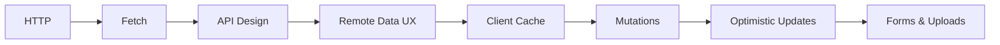

The central lesson is:

> **Client-server communication is not merely “call an API and put the JSON in state.” It is the management of remote data, uncertainty, latency, failure, and synchronization.**

---

# 1. The Browser and the Server Have Different Responsibilities

Consider a product-management application.

The browser may know:

```text
Product P-42
name = "Monitor"
price = 250
stock = 8
```

But that information may have been loaded thirty seconds ago.

Meanwhile:

- another staff member changes the price;
- a customer buys two units;
- an inventory service updates stock;
- an administrator archives the product.

The browser's local representation is therefore not automatically authoritative.

A useful model is:

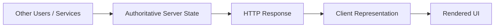

The browser works with a representation of remote truth.

That representation may become stale.

---

# 2. HTTP Is the Application's Communication Foundation

Modern front-end frameworks can make data loading feel like a framework feature.

Underneath, web applications still depend heavily on HTTP.

A basic request-response exchange looks like:

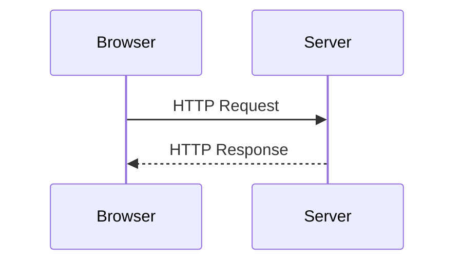

A request may include:

- method;
- URL;
- headers;
- body;
- cookies or other credentials.

A response may include:

- status;
- headers;
- body.

Understanding these pieces helps us reason about APIs independently of any one framework.

---

# 3. HTTP Methods Express Intent

Common methods include:

```text
GET
POST
PUT
PATCH
DELETE
```

These are not merely different spellings of “call the server.”

They communicate different intentions.

A typical REST-style interpretation is:

```text
GET     → retrieve
POST    → create or trigger
PUT     → replace
PATCH   → partially update
DELETE  → remove
```

For example:

```http
GET /api/products/P-42
```

requests a product.

```http
POST /api/products
```

may create one.

```http
PATCH /api/products/P-42
```

may change selected fields.

The exact semantics belong to the API contract, but HTTP methods provide a shared vocabulary.

---

# 4. Safe and Idempotent Operations

Two concepts are useful when reasoning about HTTP behavior.

## Safe

A safe method is intended not to change server state through its normal semantics.

`GET` is the most important example.

A request such as:

```http
GET /api/products
```

should not secretly delete products or approve invoices.

Safe operations are easier to:

- cache;
- prefetch;
- retry automatically.

## Idempotent

An idempotent operation can be performed repeatedly with the same intended effect as performing it once.

For example:

```http
PUT /api/preferences/theme
```

with:

```json
{
  "theme": "dark"
}
```

may remain effectively the same after repeated identical requests.

By contrast:

```http
POST /api/orders
```

may create another order every time it is sent.

This matters for:

- retries;
- offline behavior;
- duplicate submissions.

Do not assume all requests can safely be retried.

---

# 5. Request Headers

Headers carry metadata.

Examples include:

```http
Accept: application/json
Content-Type: application/json
Authorization: Bearer ...
If-None-Match: "..."
```

A particularly important distinction is:

### `Accept`

What response representation does the client prefer?

### `Content-Type`

What format is the body currently being sent?

For example:

```js
fetch("/api/products", {
  method: "POST",

  headers: {
    "Content-Type":
      "application/json"
  },

  body:
    JSON.stringify({
      name: "Monitor",
      price: 250
    })
});
```

The `Content-Type` describes the request body.

---

# 6. Status Codes Are Part of the Contract

HTTP responses contain status codes.

Useful categories include:

```text
2xx → successful result
3xx → redirection-related behavior
4xx → client/request-related failure
5xx → server failure
```

Examples:

```text
200 OK
201 Created
204 No Content
400 Bad Request
401 Unauthorized
403 Forbidden
404 Not Found
409 Conflict
422 Unprocessable Content
500 Internal Server Error
503 Service Unavailable
```

Do not turn status handling into:

```js
if (status === 200) {
  ...
}
```

for every request.

Different successful operations may legitimately use different 2xx statuses.

Similarly, different failures require different UX.

---

# 7. `fetch()` Does Not Reject for Every HTTP Error

This is one of the most important practical details.

Consider:

```js
const response =
  await fetch(
    "/api/products/P-42"
  );
```

If the server returns:

```text
404 Not Found
```

the Promise usually fulfills with a `Response`.

It does not reject merely because the status is 404.

Therefore:

```js
if (!response.ok) {
  throw new Error(
    `HTTP ${response.status}`
  );
}
```

is often necessary.

Promise rejection is more closely associated with failures such as:

- network failure;
- request cancellation;
- certain browser-level failures.

This distinction separates:

```text
server responded with an error
```

from:

```text
no usable HTTP response was obtained
```

---

# 8. A Small Fetch Helper

A useful baseline:

```ts
async function fetchJson(
  url: string,
  options?: RequestInit
): Promise<unknown> {
  const response =
    await fetch(
      url,
      options
    );

  if (!response.ok) {
    throw new Error(
      `HTTP ${response.status}`
    );
  }

  return response.json();
}
```

Notice the return type:

```ts
Promise<unknown>
```

Why not:

```ts
Promise<User>
```

or:

```ts
Promise<Product[]>
```

Because Chapter 5 established that network data is a trust boundary.

The transport layer receives runtime data.

A parser or schema should validate it before it becomes trusted domain data.

---

# 9. Network Layer and Domain Layer Should Not Be Confused

A useful architecture is:

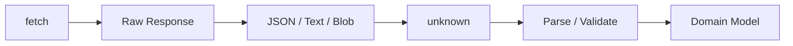

This separation gives each layer one responsibility.

The transport layer knows:

- URL;
- method;
- headers;
- response status.

The parser knows:

- expected structure;
- validation;
- normalization.

The application layer knows:

- business meaning.

---

# 10. JSON Is a Representation, Not a Type Guarantee

Suppose an API sends:

```json
{
  "id": "P-42",
  "price": 250
}
```

JSON tells us that the payload contains:

- an object;
- a string;
- a number.

It does not prove:

- `id` is a valid ProductId;
- `price` is non-negative;
- the product exists;
- the caller has access;
- the data is current.

The domain contract adds those meanings.

---

# 11. Request Bodies

Many API operations send JSON:

```js
await fetch(
  "/api/products",
  {
    method: "POST",

    headers: {
      "Content-Type":
        "application/json"
    },

    body:
      JSON.stringify({
        name: "Monitor",
        price: 250
      })
  }
);
```

But not all requests should use JSON.

Other body formats include:

- FormData;
- URL-encoded data;
- binary bodies;
- streams.

Choose the representation that fits the operation.

---

# 12. Credentials and Cookies

A browser may include cookies according to:

- origin relationships;
- cookie attributes;
- fetch credential settings;
- browser security policy.

A request might use:

```js
fetch(
  "/api/account",
  {
    credentials:
      "include"
  }
);
```

when cross-origin credentials are intentionally required.

Do not treat credentials as a casual request option.

They interact with:

- authentication;
- SameSite cookies;
- CORS;
- CSRF.

Chapter 13 will examine those security concerns in depth.

---

# 13. Cancellation

Chapter 4 introduced `AbortController`.

It remains essential for data loading.

Suppose the user navigates away while a request is pending.

The result may no longer be useful.

```js
const controller =
  new AbortController();

fetch(
  "/api/products",
  {
    signal:
      controller.signal
  }
);
```

Cancel:

```js
controller.abort();
```

Cancellation is especially important for:

- search;
- route changes;
- rapidly changing filters;
- component lifecycle;
- superseded requests.

---

# 14. Timeouts Are Application Policy

`fetch()` does not magically know how long your application is willing to wait.

A timeout can be implemented through cancellation.

Conceptually:

```js
const controller =
  new AbortController();

const timeoutId =
  setTimeout(
    () =>
      controller.abort(),
    10_000
  );

try {
  const response =
    await fetch(
      url,
      {
        signal:
          controller.signal
      }
    );

  ...
} finally {
  clearTimeout(
    timeoutId
  );
}
```

But choose timeouts according to the operation.

A 5-second timeout suitable for autocomplete may be inappropriate for a large report download.

Timeouts are UX and application-policy decisions.

---

# 15. Retry Carefully

Network operations can fail temporarily.

Retries can help.

But automatic retry is not always safe.

Retrying:

```http
GET /api/products
```

may be reasonable.

Retrying:

```http
POST /api/payments
```

without an idempotency strategy could be dangerous.

A retry policy should consider:

- request method;
- server contract;
- idempotency;
- failure type;
- retry count;
- delay/backoff;
- user expectations.

Do not write:

```text
retry every failed request three times
```

as a universal rule.

---

# 16. Exponential Backoff

For temporary server/network failures, systems often increase delay between attempts.

Conceptually:

```text
attempt 1
↓ wait 1s
attempt 2
↓ wait 2s
attempt 3
↓ wait 4s
attempt 4
```

A simple model:

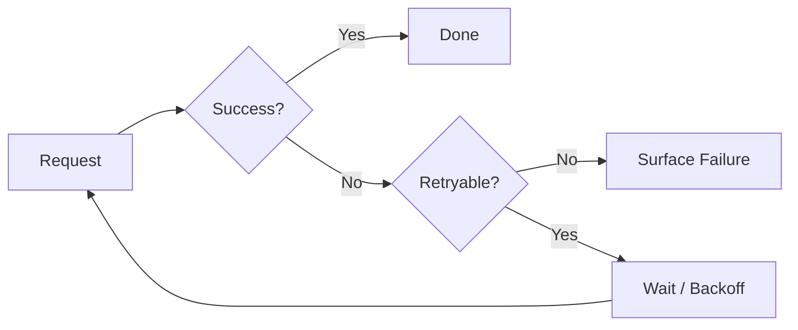

Production systems often add jitter so many clients do not retry simultaneously.

The details belong to resilient networking design rather than every individual component.

---

# 17. API Design Affects Front-End Architecture

A front-end can only be as simple as its API contract allows.

Suppose the UI needs:

```text
product list
category
price
stock
thumbnail
```

but the API requires:

```text
GET products
then GET category for each product
then GET stock for each product
```

The front-end may create an expensive request waterfall.

API design and UI requirements should therefore be considered together.

---

# 18. REST as a Resource-Oriented Style

REST-style APIs commonly organize operations around resources.

For example:

```text
GET    /products
GET    /products/P-42
POST   /products
PATCH  /products/P-42
DELETE /products/P-42
```

This can be easy to reason about because URLs identify resources and HTTP methods express operations.

REST is an architectural style, not a rigid URL naming law.

---

# 19. Collections and Resources

A common distinction:

```text
/products
```

represents a collection.

```text
/products/P-42
```

represents one resource.

A collection endpoint may support:

- filtering;
- sorting;
- pagination.

Example:

```text
/products?category=office&sort=price&page=2
```

This connects naturally to the URL-state architecture from Chapter 8.

The browser route and server query may use similar view parameters without being the same URL.

---

# 20. Pagination

Large datasets should rarely be downloaded all at once.

Common strategies include:

- offset/page pagination;
- cursor pagination.

Page-based:

```text
?page=4&pageSize=25
```

Cursor-based:

```text
?after=eyJpZCI6...
```

Cursor approaches can behave better when data changes frequently, while page numbers are intuitive for some user interfaces.

The API and UX should be designed together.

---

# 21. Filtering and Sorting

An API might accept:

```text
?status=active&sort=price-desc
```

Important considerations include:

- allowed filters;
- allowed sort fields;
- stable semantics;
- server validation;
- index/performance cost.

Do not expose arbitrary database expressions through query parameters merely because the client can send them.

---

# 22. API Versioning and Compatibility

Clients and servers can evolve at different times.

Changing:

```json
{
  "name": "Sara"
}
```

to:

```json
{
  "fullName": "Sara"
}
```

can break older clients.

Strategies include:

- additive evolution;
- explicit API versions;
- negotiated capabilities;
- compatibility windows.

Front-end engineers should care because deployment is rarely perfectly simultaneous across:

- browser caches;
- mobile clients;
- server nodes;
- CDNs.

Runtime validation can reveal contract drift earlier.

---

# 23. GraphQL: Ask for a Shape of Data

REST is not the only API model.

GraphQL lets clients express a query describing requested fields.

Conceptually:

```graphql
query ProductPage {
  product(id: "P-42") {
    id
    name
    price
    category {
      id
      name
    }
  }
}
```

The response follows the requested shape.

This can reduce cases where:

- one endpoint returns too much data;
- several endpoints must be combined for one screen.

---

# 24. GraphQL Schemas

A GraphQL schema defines:

- object types;
- fields;
- arguments;
- relationships;
- mutations.

A simplified schema:

```graphql
type Product {
  id: ID!
  name: String!
  price: Float!
}

type Query {
  product(id: ID!): Product
}
```

The schema can support strong client tooling and generated types.

But remember the distinction from Chapter 5:

> Generated static types do not magically validate every runtime transport value unless the system also provides runtime guarantees or validation.

---

# 25. GraphQL Mutations

GraphQL typically models writes through mutations.

Example:

```graphql
mutation UpdateProduct(
  $id: ID!,
  $input: ProductInput!
) {
  updateProduct(
    id: $id,
    input: $input
  ) {
    id
    name
    price
  }
}
```

The mutation result can return the updated entity.

Client caches can then update their representation.

---

# 26. GraphQL Trade-Offs

Potential benefits:

- client-selected fields;
- strong schema tooling;
- fewer bespoke endpoints;
- useful generated types;
- powerful graph traversal.

Potential costs:

- caching complexity;
- query-cost management;
- schema governance;
- client tooling;
- error semantics;
- server implementation complexity.

GraphQL is not “better REST.”

It is a different contract model with different trade-offs.

This book treats it as Working Knowledge.

---

# 27. REST and GraphQL Can Coexist

An application may use:

- REST for uploads;
- GraphQL for application data;
- WebSockets for live updates.

Architecture does not require one protocol to solve every communication problem.

Choose according to:

- server capability;
- team expertise;
- caching requirements;
- data relationships;
- operational constraints.

---

# 28. Remote Data Has UI States

A data request is not simply:

```text
data or no data
```

Useful states often include:

```text
idle
loading
success
empty
error
stale
refreshing
```

A conceptual state machine:

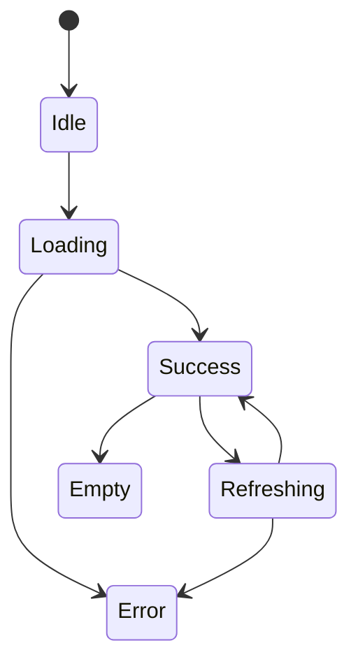

Real applications may model this differently.

The important lesson is that asynchronous data has a lifecycle.

---

# 29. Loading Is Not the Same as Empty

Suppose:

```js
products.length === 0
```

What does that mean?

Possible meanings:

- request has not started;
- request is loading;
- request succeeded with zero products;
- request failed and state was cleared.

One array cannot express all of those states cleanly.

A better model separates status from data.

For example:

```ts
type ProductQueryState =
  | {
      status: "loading";
    }
  | {
      status: "success";
      data: Product[];
    }
  | {
      status: "error";
      error: Error;
    };
```

Then an empty successful array is explicitly different from loading.

---

# 30. Loading UI Should Match Scope

If the entire route is unavailable, a route-level skeleton may be appropriate.

If only a dashboard widget is refreshing, replacing the entire page with a spinner is disruptive.

Think in layers:

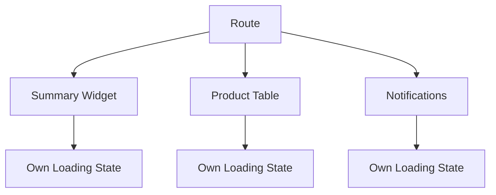

Localized loading preserves context.

---

# 31. Skeletons, Spinners, and Existing Content

Different loading strategies fit different situations.

### Spinner

Useful when:

- size is uncertain;
- operation is short;
- layout cannot be predicted.

### Skeleton

Useful when:

- layout is known;
- initial loading would otherwise create large visual jumps.

### Preserve existing content

Useful during background refresh.

For example:

```text
current data remains visible
+
small refreshing indicator
```

This is often better than blanking the page.

---

# 32. Empty State Is Product State

An empty result should explain what happened.

Examples:

```text
No products exist yet.
```

versus:

```text
No products match the current filters.
```

These are different states.

The second should often offer:

```text
Clear filters
```

Empty-state design belongs to application behavior, not decoration.

---

# 33. Error States Need Recovery

A useful error UI should answer:

- What failed?
- What can the user do?
- Is existing data still usable?
- Is retry safe?

For example:

```text
Could not refresh products.
Showing data from 10:42.
[Retry]
```

may be better than:

```text
Error 500
```

Remote-state UX should preserve useful context where possible.

---

# 34. Client Caching

If the application requests:

```text
GET /products/P-42
```

several times, should it always contact the server?

Not necessarily.

A client cache can store the result.

Conceptually:

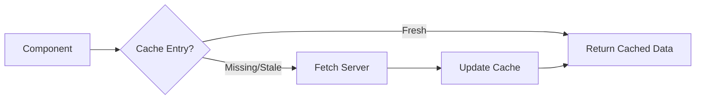

Caching can improve:

- perceived speed;
- network efficiency;
- navigation;
- repeated component access.

But caching introduces freshness questions.

---

# 35. Freshness

Cached data exists on a spectrum.

```text
fresh
↓
aging
↓
stale
↓
invalid
```

A cache policy asks:

> For how long can this representation be reused without checking the server?

The answer depends on the data.

Examples:

### Country list

May remain valid for a long time.

### Product inventory

May change often.

### Bank account balance

May need very aggressive freshness.

Caching policy belongs to domain requirements.

---

# 36. Stale Does Not Mean Wrong

A stale cache entry often means:

> The system should consider checking for a newer version.

It does not necessarily mean:

> This data must not be displayed.

This distinction enables **stale-while-revalidate** behavior.

The UI can display cached data immediately while refreshing in the background.

---

# 37. Stale-While-Revalidate as a Client Pattern

Conceptually:

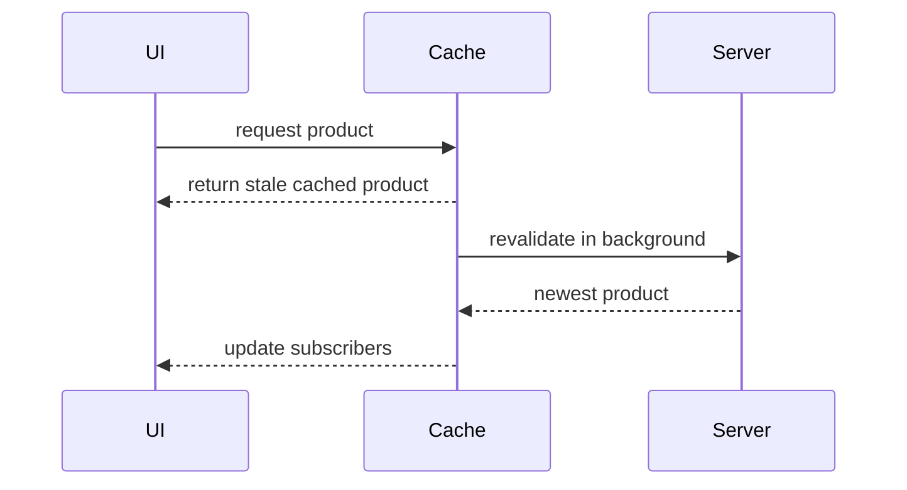

The user sees content quickly.

The application later updates if new data arrives.

This is a powerful UX pattern.

---

# 38. Cache Keys

A cache needs to distinguish requests.

For example:

```text
products?page=1
products?page=2
products?category=office&page=1
product:P-42
```

A query key conceptually identifies:

```text
what data does this cache entry represent?
```

A structured key might be:

```js
[
  "products",
  {
    category: "office",
    page: 1
  }
]
```

The exact API depends on the cache library.

The principle is stable.

---

# 39. Cache Keys Must Include Relevant Inputs

Suppose:

```text
/products?category=office
```

and:

```text
/products?category=medical
```

both use the cache key:

```text
products
```

The second request may incorrectly reuse the first result.

Cache identity should reflect every input that changes the remote result.

---

# 40. Deduplication

Suppose three components request the same user at nearly the same time.

Without coordination:

```text
GET /users/42
GET /users/42
GET /users/42
```

A server-state library may deduplicate these into one in-flight request.

Conceptually:

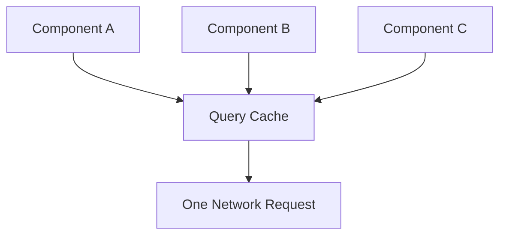

This is one reason remote data deserves specialized management.

---

# 41. Revalidation

Revalidation means checking whether cached data should be updated.

Possible triggers include:

- component mount;
- route navigation;
- window focus;
- network reconnection;
- explicit refresh;
- elapsed freshness period;
- mutation completion.

Not every application needs every trigger.

Use policies appropriate to the data.

---

# 42. Invalidation

Suppose we update product P-42.

The cache may contain:

```text
product P-42
product list page 1
office category list
search result containing P-42
```

Which entries are now potentially stale?

A mutation may invalidate related queries.

Conceptually:

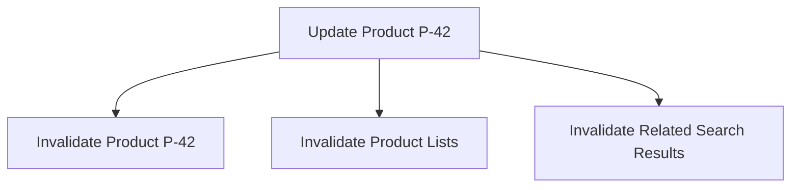

Invalidation is one of the central problems of client caching.

---

# 43. Invalidation vs Direct Cache Update

After a mutation, we can sometimes directly update cached data.

Suppose server returns:

```json
{
  "id": "P-42",
  "name": "New Name",
  "price": 275
}
```

The client can replace the cached P-42 entry immediately.

For related lists, options include:

- update them directly;
- invalidate and refetch.

Direct updates can be efficient.

Invalidation is often simpler and safer.

Choose based on:

- cache complexity;
- mutation frequency;
- consistency requirements.

---

# 44. Mutations

A **query** usually retrieves remote data.

A **mutation** changes remote state.

Examples:

```text
create product
update user
delete request
approve invoice
submit form
```

Mutation lifecycle often includes:

```text
idle
pending
success
error
```

and may affect cache state.

---

# 45. Mutation UX

When a user clicks:

```text
Save
```

the interface should answer:

- Did the click register?
- Is saving still in progress?
- Can Save be clicked again?
- Can the user continue editing?
- What happens if it fails?
- What happens if they navigate away?

A mutation is both a network operation and a UI state transition.

---

# 46. Prevent Duplicate Submission

A common pattern:

```text
Save clicked
↓
request pending
↓
Save temporarily disabled
```

But disabling is not always enough.

Network retries, browser refresh, or double taps can still create duplicate operations.

For high-value creates such as:

- payment;
- order;
- reservation;

server-side idempotency mechanisms may be required.

Client UI alone cannot guarantee exactly-once behavior.

---

# 47. Pessimistic Updates

A pessimistic update waits for server confirmation before showing the final state.

Example:

```text
User clicks Delete
↓
show pending
↓
server confirms
↓
remove item
```

Benefits:

- simple consistency model;
- server remains clearly authoritative.

Costs:

- interface may feel slower.

This is appropriate when the action is risky or likely to be rejected.

---

# 48. Optimistic Updates

An optimistic update changes the UI before server confirmation.

Example:

```text
User checks task complete
↓
UI immediately shows complete
↓
request sent
↓
server confirms
```

This can make the interface feel instantaneous.

Conceptually:

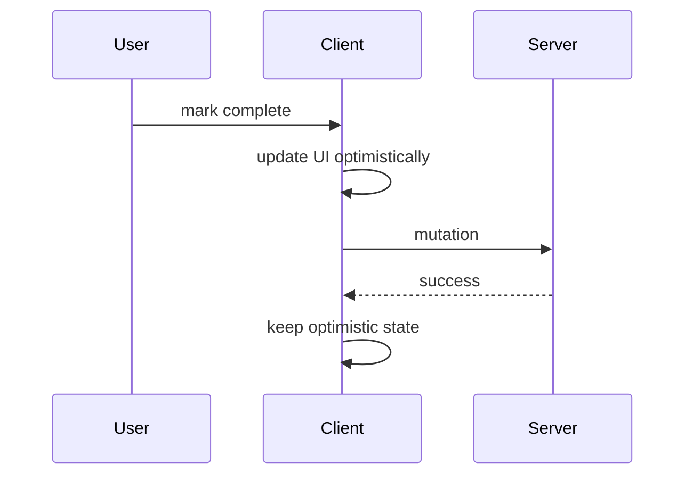

But failure requires recovery.

---

# 49. Optimistic Rollback

If the mutation fails:

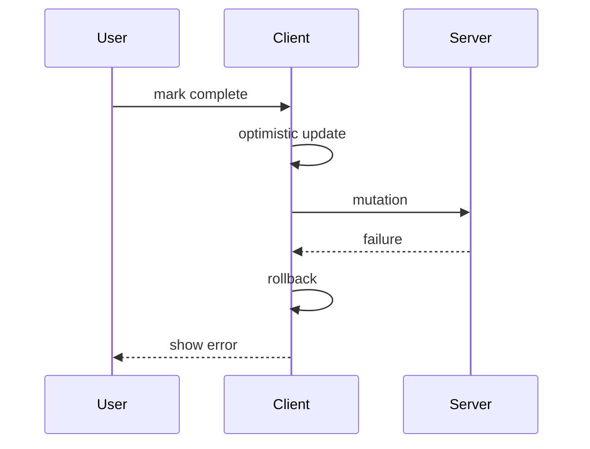

The client needs the previous state or another way to reconstruct it.

Optimistic updates therefore increase complexity.

Use them where:

- success is likely;
- action is reversible;
- immediate feedback has real UX value.

---

# 50. Not Every Mutation Should Be Optimistic

Be cautious with:

- financial transfers;
- permission changes;
- irreversible deletion;
- medical orders;
- operations with complex server validation.

For these, displaying:

```text
Saving...
```

until confirmation may be more appropriate.

Optimistic UI is a design choice, not a performance requirement.

---

# 51. Conflict and Concurrency

Suppose two users edit the same record.

User A loads:

```text
version 5
```

User B also loads:

```text
version 5
```

A saves.

Server now has:

```text
version 6
```

B saves their old version.

Should B overwrite A?

This is a concurrency problem.

Possible strategies include:

- last write wins;
- version numbers;
- ETags;
- optimistic concurrency control;
- explicit conflict UI.

The front-end must sometimes surface conflict rather than pretend every mutation is independent.

---

# 52. Conditional Requests

HTTP supports validators such as:

- ETag;
- Last-Modified.

A response may include:

```http
ETag: "abc123"
```

A later request can send:

```http
If-None-Match: "abc123"
```

If unchanged, the server may respond without resending the full representation.

Conditional requests can support efficient cache revalidation.

The browser's HTTP cache may handle many cases automatically.

Application-level query caches solve related but different problems.

---

# 53. Browser HTTP Cache vs Application/Query Cache

These are not the same thing.

## Browser HTTP cache

Works at HTTP resource level.

It uses mechanisms such as:

- Cache-Control;
- ETag;
- Last-Modified.

## Application/server-state cache

Works at application data level.

It may know:

```text
product P-42
current user
page 2 of search results
```

Conceptually:

```mermaid
flowchart TD
    A[Application Query Cache] --> B[fetch()]
    B --> C[Browser HTTP Cache]
    C --> D[Network / Server]
```

Both layers may participate.

Do not treat one as a replacement for the other.

---

# 54. `Cache-Control`

Servers can influence HTTP caching with headers such as:

```http
Cache-Control: max-age=3600
```

or policies that require revalidation.

The exact strategy depends on:

- public vs private data;
- sensitivity;
- freshness;
- CDN behavior;
- browser caching.

Front-end engineers do not need to become CDN specialists, but they should understand that caching can occur below application code.

---

# 55. Forms and Server Mutations

Chapter 8 covered form state.

Now we cross the network boundary.

A form submission often follows:

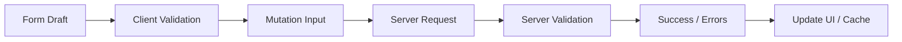

Client validation improves UX.

Server validation remains authoritative.

---

# 56. Native Form Submission

HTML already has a server communication mechanism:

```html
<form
  method="post"
  action="/requests"
>
  ...
</form>
```

This can work without JavaScript.

That matters for:

- progressive enhancement;
- reliability;
- accessibility;
- simple applications.

Modern frameworks can enhance this behavior rather than always replacing it.

---

# 57. `FormData`

JavaScript can read a form using:

```js
const formData =
  new FormData(form);
```

This preserves the browser's form model.

Values can be sent:

```js
await fetch(
  "/api/requests",
  {
    method: "POST",
    body: formData
  }
);
```

When using FormData, the browser can set the appropriate multipart boundary automatically.

Do not manually set a multipart `Content-Type` boundary unless you truly know what you are doing.

---

# 58. JSON Form Submission

Some APIs expect JSON.

```js
const payload = {
  name:
    form.elements.name.value,

  price:
    Number(
      form.elements.price.value
    )
};
```

Then:

```js
await fetch(
  "/api/products",
  {
    method: "POST",

    headers: {
      "Content-Type":
        "application/json"
    },

    body:
      JSON.stringify(
        payload
      )
  }
);
```

The important architectural step is:

```text
form representation
↓
parse / validate
↓
mutation payload
```

Do not simply serialize every form field and assume the server contract matches.

---

# 59. Server Validation Errors

Suppose the server rejects:

```text
email already registered
```

or:

```text
requested date unavailable
```

The browser could not fully determine these conditions in advance.

The server response should provide enough structure for the UI to map errors appropriately.

Conceptually:

```json
{
  "message":
    "Validation failed",

  "fields": {
    "email":
      "Email is already registered"
  }
}
```

The exact contract may differ.

The important point is that server validation errors are normal application state.

---

# 60. Mapping Server Errors to Fields

Suppose:

```ts
type FieldErrors = {
  [field: string]:
    string | undefined;
};
```

The form can display:

```text
email → already registered
```

near the appropriate field.

But not every error belongs to a field.

Examples:

- payment service unavailable;
- permission denied;
- record changed by another user.

These may belong at form or page level.

---

# 61. Do Not Merge Client and Server Validation Carelessly

Client validation may say:

```text
email syntax valid
```

Server may say:

```text
email already exists
```

Both can be true.

A strong form model distinguishes:

- local validation;
- server field errors;
- global submission errors.

When the user edits a field after a server error, decide when that server error should clear.

---

# 62. Progressive Enhancement

Suppose the browser has full JavaScript support.

We can enhance:

- validation;
- pending UI;
- optimistic feedback;
- inline errors.

But the underlying form may still preserve ordinary semantics.

Conceptually:

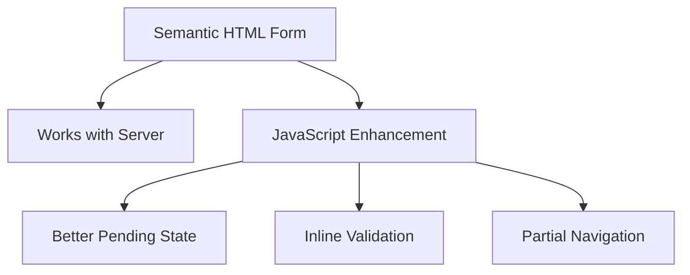

This approach can improve resilience.

---

# 63. File Uploads

Files require special treatment.

HTML:

```html
<input
  type="file"
  name="attachment"
>
```

FormData can include files:

```js
const data =
  new FormData(form);

await fetch(
  "/api/upload",
  {
    method: "POST",
    body: data
  }
);
```

Large files may require:

- progress reporting;
- chunking;
- resumable upload;
- size validation;
- server scanning.

Those specialized architectures are outside the chapter's core scope.

---

# 64. Authentication Failures Are Not Ordinary Validation Errors

Suppose a request returns:

```text
401
```

or:

```text
403
```

These typically represent authentication or authorization concerns.

Do not map them to:

```text
Invalid email field
```

The application may need to:

- refresh authentication;
- redirect to sign-in;
- show an access-denied state.

Chapter 13 will cover authentication architecture.

---

# 65. Search Example: Query, Cache, and Cancellation

Consider a catalogue search.

URL:

```text
/products?q=monitor&page=2
```

Architecture:

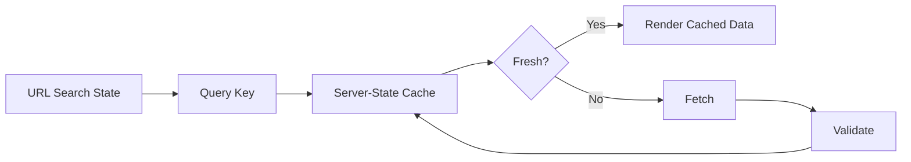

If the user types quickly:

```text
m
mo
mon
monitor
```

we may also use:

- debounce;
- cancellation;
- cache keys.

Each search value represents a different remote query.

---

# 66. Query Keys and URL State Fit Naturally Together

Suppose URL state is:

```ts
type CatalogueFilters = {
  q: string;
  category: string | null;
  page: number;
};
```

A query key might conceptually be:

```js
[
  "products",
  filters
]
```

When the URL changes, the filter object changes.

The cache identifies a different remote representation.

This is a clean relationship:

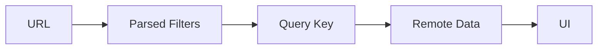

---

# 67. Avoid Copying Query Data into Another Store

Weak architecture:

```text
URL
↓
filter store
↓
query library
↓
copy results into global store
↓
component state
```

Every copy adds synchronization risk.

Prefer direct relationships unless another representation has a clear responsibility.

For example:

```text
URL filters
→ query cache
→ UI
```

This is enough for many pages.

---

# 68. Dependent Queries

Sometimes one request depends on another.

Example:

```text
load current user
↓
obtain organization ID
↓
load organization settings
```

This dependency is real.

Do not force concurrency when later input does not yet exist.

Conceptually:

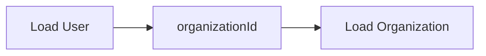

Independent requests can be concurrent.

Dependent requests cannot.

---

# 69. Request Waterfalls

A request waterfall occurs when operations wait unnecessarily.

Example:

```text
load product
↓
load category
↓
load manufacturer
↓
load permissions
```

If those requests could have been combined or started earlier, latency multiplies.

Potential solutions include:

- concurrent requests;
- API aggregation;
- server rendering;
- GraphQL;
- route loaders;
- better endpoint design.

The right solution depends on where the dependency actually exists.

---

# 70. Parallel Fetching

If independent:

```js
const [
  categories,
  permissions
] =
  await Promise.all([
    loadCategories(),
    loadPermissions()
  ]);
```

This applies Chapter 4's concurrency principle to remote data.

Again:

> Do not create artificial sequential dependencies.

---

# 71. Partial Failure

Suppose a dashboard loads:

- account summary;
- notifications;
- weather;
- recent activity.

If weather fails, should the whole dashboard fail?

Probably not.

Independent sections can use separate boundaries.

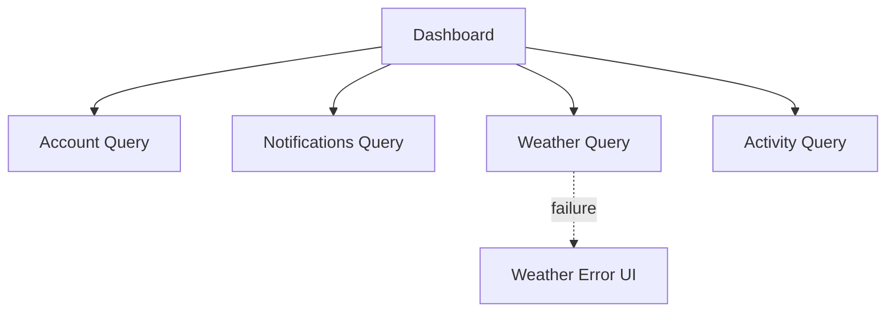

This is one reason component and route boundaries matter for data architecture.

---

# 72. `Promise.all()` and Partial Failure

This:

```js
await Promise.all([
  loadAccount(),
  loadNotifications(),
  loadWeather()
]);
```

rejects when one member rejects.

That may be appropriate if all are required.

If partial success is acceptable, options include:

- separate query boundaries;
- `Promise.allSettled()`;
- individual error handling.

The architectural requirement should determine the concurrency primitive.

---

# 73. Background Refresh

Suppose the page already displays products.

The application decides to refresh.

Do not necessarily return to:

```text
full-page loading spinner
```

A richer state model distinguishes:

```text
initial loading
```

from:

```text
refreshing existing data
```

Conceptually:

```mermaid
stateDiagram-v2
    [*] --> Loading
    Loading --> Ready
    Ready --> Refreshing
    Refreshing --> Ready
    Refreshing --> Ready: failed, stale data retained
```

This supports smoother UX.

---

# 74. Stale Data with an Error

A refresh may fail while cached data remains available.

The UI can represent:

```text
data available
+
refresh failed
```

rather than collapsing to:

```text
no data
```

This is a good example of why binary:

```text
loading / error
```

flags can be insufficient.

---

# 75. Mutation Followed by Revalidation

A common safe strategy:

```text
submit mutation
↓
server succeeds
↓
invalidate affected queries
↓
refetch
```

This delegates final truth back to the server.

Conceptually:

```mermaid
sequenceDiagram
    participant U as UI
    participant C as Cache
    participant S as Server

    U->>S: PATCH product
    S-->>U: success
    U->>C: invalidate product queries
    C->>S: refetch
    S-->>C: authoritative data
    C-->>U: rerender
```

This may cause an extra network request but keeps consistency logic straightforward.

---

# 76. Mutation Response as Cache Update

If the mutation returns the complete authoritative updated product:

```json
{
  "id": "P-42",
  "name": "Monitor Pro",
  "price": 275
}
```

the cache can use it directly.

This avoids a refetch for the detail entry.

Related lists may still require:

- direct update;
- invalidation.

The correct approach depends on how many cached representations exist.

---

# 77. Optimistic Cache Update

Suppose the user changes:

```text
task complete = true
```

An optimistic strategy:

1. snapshot current cache;
2. update cache immediately;
3. send mutation;
4. keep result on success;
5. restore snapshot on failure;
6. revalidate if necessary.

This is powerful but should be implemented by a cache/mutation layer rather than repeated manually in every component.

---

# 78. Server-State Libraries

Libraries such as query/cache managers can provide:

- caching;
- query identity;
- loading state;
- retries;
- background refetch;
- invalidation;
- mutation lifecycle;
- deduplication.

The names and APIs vary.

The conceptual value is that server state receives specialized treatment rather than being forced into generic global state.

This book does not turn Chapter 9 into a particular library tutorial.

---

# 79. A Useful Separation of Responsibilities

One possible architecture:

```mermaid
flowchart TD
    A[Route / Component] --> B[Query Layer]
    B --> C[HTTP Client]
    C --> D[Server]

    D --> E[Raw Response]
    E --> F[Runtime Parser]
    F --> B

    B --> G[Cache]
    G --> A
```

For mutations:

```mermaid
flowchart TD
    A[Form / UI Event] --> B[Mutation Layer]
    B --> C[HTTP Client]
    C --> D[Server]
    D --> E[Validated Response]
    E --> F[Cache Update / Invalidation]
    F --> A
```

This keeps responsibilities visible.

---

# 80. Do Not Hide Every HTTP Detail Behind One Giant API Service

A common abstraction:

```js
api.doEverything(...)
```

can become difficult to reason about.

A better design often exposes domain-oriented operations:

```text
loadProduct
searchProducts
updateProduct
archiveProduct
```

The HTTP client can remain lower level:

```text
get JSON
post JSON
handle common headers
```

Domain operations then map transport behavior to business intent.

---

# 81. Transport Errors vs Domain Errors

Consider two failures:

```text
503 Service Unavailable
```

and:

```text
Cannot archive product because active orders reference it.
```

The first is transport/service availability.

The second is a domain rule.

The UI may handle them differently.

A useful error model distinguishes:

- network error;
- HTTP error;
- validation error;
- authorization error;
- conflict;
- domain error;
- unexpected application error.

Do not reduce all failures to:

```text
Something went wrong.
```

unless no better information is safely available.

---

# 82. Error Normalization

Different endpoints may return different failure bodies.

A client boundary can normalize them into application error types.

Conceptually:

```ts
type AppError =
  | {
      kind:
        "network";
      message: string;
    }
  | {
      kind:
        "validation";
      fields:
        Record<
          string,
          string
        >;
    }
  | {
      kind:
        "forbidden";
    }
  | {
      kind:
        "conflict";
      message: string;
    }
  | {
      kind:
        "unexpected";
      message: string;
    };
```

This gives UI code a predictable contract.

---

# 83. Do Not Leak Sensitive Server Detail

A server may log:

```text
database connection failed for db-prod-03
```

The client usually should not display that internal detail.

The API should return user-safe error information while server logs preserve diagnostic detail.

Error architecture must balance:

- useful feedback;
- security;
- observability.

Chapter 17 will discuss production observability.

---

# 84. Practical Architecture: Administrative Catalogue

We now extend the Chapter 8 catalogue.

State:

### URL

```text
q
category
sort
page
```

### Server state

```text
products
categories
product detail
```

### Local UI

```text
dialog open
temporary selection
```

### Form state

```text
edit draft
```

Communication layer:

```mermaid
flowchart TD
    A[Catalogue URL] --> B[Parse Filters]
    B --> C[Product Query]
    C --> D[Query Cache]
    D --> E[HTTP]
    E --> F[Products API]

    F --> G[Runtime Validation]
    G --> D

    D --> H[Catalogue UI]

    H --> I[Edit Form]
    I --> J[Mutation]
    J --> E

    J --> K[Invalidate / Update Cache]
    K --> D
```

This architecture preserves the distinctions from the previous chapters.

---

# 85. Product Query

Conceptually:

```ts
type CatalogueFilters = {
  q: string;
  category:
    string | null;
  sort:
    "name"
    | "price";
  page: number;
};
```

A domain API:

```ts
async function searchProducts(
  filters:
    CatalogueFilters,
  signal?: AbortSignal
): Promise<ProductPage> {
  const url =
    buildProductUrl(
      filters
    );

  const raw =
    await fetchJson(
      url,
      {
        signal
      }
    );

  return parseProductPage(
    raw
  );
}
```

Notice:

- typed input;
- cancellation;
- raw network boundary;
- runtime parser;
- trusted return value.

This combines Chapters 4, 5, 8, and 9.

---

# 86. Product Page Model

```ts
type ProductPage = {
  items:
    Product[];

  page:
    number;

  pageSize:
    number;

  total:
    number;
};
```

The UI can derive:

```text
total pages
has next page
has previous page
```

rather than storing them independently unless the API provides meaningful separate values.

---

# 87. Query Lifecycle

Conceptually:

```mermaid
stateDiagram-v2
    [*] --> Loading
    Loading --> Ready
    Loading --> Error
    Ready --> Refreshing
    Refreshing --> Ready
    Refreshing --> Ready: refresh error + stale retained
```

The UI should distinguish initial loading from background refresh.

---

# 88. Editing a Product

Flow:

```mermaid
sequenceDiagram
    participant U as User
    participant F as Form
    participant M as Mutation
    participant S as Server
    participant C as Cache

    U->>F: edit fields
    F->>F: local validation
    U->>M: Save
    M->>S: PATCH /products/P-42

    alt success
        S-->>M: updated product
        M->>C: update / invalidate cache
        C-->>U: refreshed UI
    else validation failure
        S-->>M: field errors
        M-->>F: map errors
    else transport failure
        S-->>M: failure
        M-->>U: retryable error state
    end
```

This is the full front-end mutation lifecycle.

---

# 89. Form Submission Should Not Destroy the Draft on Failure

Suppose save fails.

A poor implementation resets the form because submission ended.

The user loses all work.

Better:

```text
draft remains
+
error shown
+
user can correct / retry
```

Form state and server mutation state should remain separate enough to support recovery.

---

# 90. Server Validation and Local Draft

If the server returns:

```text
price must be at least 10
```

the form can display the error while preserving:

```text
name
description
category
variants
```

The user should not need to re-enter unrelated fields.

This is one reason mutation errors belong to the form workflow.

---

# 91. Successful Mutation and Dirty State

After a successful save:

```text
server returns authoritative updated product
```

the form can:

- close;
- reset dirty state;
- update initial values;
- remain open with “Saved” state.

The UX decision depends on the product.

But the application should no longer compare against the old initial server snapshot if the form remains open.

---

# 92. Optimistic Edit Example

For a simple toggle:

```text
active / inactive
```

an optimistic update may be reasonable.

For a complex product editor:

```text
name
price
variants
permissions
inventory
```

pessimistic confirmation may be safer.

Optimistic behavior should be chosen per mutation, not globally.

---

# 93. Search and Cancellation

When URL query changes rapidly:

```text
?q=m
?q=mo
?q=mon
```

old requests may still be in flight.

The query layer can cancel obsolete requests.

Even with caching, stale request ordering still matters.

A robust data layer combines:

- query identity;
- cancellation;
- cache semantics.

---

# 94. Pagination and Cache Retention

When moving from:

```text
page 1
```

to:

```text
page 2
```

the application might:

- show a full loading state;
- preserve page 1 until page 2 arrives;
- prefetch page 2;
- cache both.

The best UX depends on:

- data size;
- latency;
- navigation behavior.

Server-state libraries often make these strategies easier to implement.

---

# 95. Prefetching Remote Data

If a user is likely to navigate to:

```text
next page
```

the application may fetch it before the click.

Conceptually:

```mermaid
sequenceDiagram
    participant U as User
    participant C as Client Cache
    participant S as Server

    U->>C: viewing page 1
    C->>S: prefetch page 2
    S-->>C: cache page 2

    U->>C: navigate to page 2
    C-->>U: immediate cached page 2
```

Prefetch only when likelihood and cost justify it.

Do not download large datasets speculatively without reason.

---

# 96. Client Cache Is Not a Database

A query cache is usually optimized for:

- remote representations;
- freshness;
- refetch;
- subscriptions.

It is not necessarily suitable for:

- complex offline relational data;
- large local editing models;
- permanent business records.

Do not turn every cache into an application database.

Chapter 10 will discuss offline storage and IndexedDB.

---

# 97. Server State and Offline State Are Different Problems

A cached GET response may help during brief network loss.

A true offline-first application requires more:

- durable storage;
- local writes;
- conflict handling;
- synchronization;
- retry queues.

Those topics belong primarily to Chapter 10.

This chapter focuses on online client-server synchronization and caching.

---

# 98. Progressive Enhancement for Forms

A good web architecture can start with:

```text
HTML form
→ server endpoint
```

Then enhance with:

- fetch;
- inline pending state;
- partial updates;
- validation;
- optimistic UI where appropriate.

This preserves platform semantics while adding richer behavior.

Frameworks may provide their own form-action abstractions, but the underlying model remains useful.

---

# 99. When to Use REST, GraphQL, or Something Else

Do not choose an API style because it is fashionable.

Ask:

- What does the backend already support?
- How complex are data relationships?
- How important is HTTP caching?
- Do clients need flexible field selection?
- How many client types exist?
- What tooling does the team understand?
- What operational complexity is acceptable?

REST and GraphQL are both capable.

The architecture should fit the system.

---

# 100. A Client-Server Decision Checklist

For every remote operation, ask:

### What is the source of truth?

Usually the server.

### How is the request identified?

Method + URL/query or GraphQL operation.

### What data crosses the boundary?

Validate it.

### Can the operation be cancelled?

Especially for obsolete reads.

### Can it be retried safely?

Consider idempotency.

### Should results be cached?

If yes, define freshness.

### What invalidates the cache?

Mutations, time, focus, explicit events?

### What does loading look like?

Initial vs refresh.

### What does failure look like?

Field, widget, route, or global?

### Can the UI update optimistically?

Only where safe and valuable.

### How is conflict handled?

Especially for concurrent editing.

This turns “API call” into an engineering decision.

---

# 101. Misconceptions to Leave Behind

## “`fetch()` rejects for every 4xx or 5xx response.”

No.

A valid HTTP error response usually still produces a fulfilled `Response`.

Check status.

## “If TypeScript says the response is `User`, the server returned a valid User.”

No.

Runtime data still crosses a trust boundary.

Validate it.

## “GET, POST, PUT, PATCH, and DELETE are interchangeable.”

No.

They communicate different operation semantics and can affect caching, retry, and idempotency.

## “Every failed request should be retried.”

No.

Retry safety depends on the operation and failure.

## “REST means every endpoint must follow one perfect URL formula.”

No.

REST is an architectural style centered around resource semantics and HTTP behavior.

## “GraphQL eliminates all API problems.”

No.

It changes the contract model and introduces its own caching, governance, and operational concerns.

## “Loading and empty are the same state.”

No.

A successful empty result is different from data that has not loaded.

## “If refresh fails, all cached data should disappear.”

Not necessarily.

Stale data may still be useful.

## “Cache means the data is correct.”

No.

Cached data is a representation with a freshness policy.

## “Stale means unusable.”

No.

Stale often means the application should revalidate.

It can still be displayed.

## “Every mutation should be optimistic.”

No.

Optimistic updates increase complexity and may be inappropriate for risky operations.

## “Client disabling prevents duplicate financial operations.”

No.

Server-side idempotency or equivalent guarantees may still be necessary.

## “Browser HTTP cache and query cache are the same.”

No.

They operate at different layers and solve different problems.

## “Forms only need client validation.”

No.

The server must validate authoritative mutations.

## “Every server error belongs next to a form field.”

No.

Some errors are:

- authorization;
- conflict;
- service failure;
- global domain failure.

## “A successful mutation means every related cache entry is automatically correct.”

No.

Related cached representations may need direct update or invalidation.

## “A server-state library replaces API design.”

No.

Poor endpoint design can still create waterfalls, excessive requests, and difficult consistency.

---

# Chapter Summary

Client-server communication is the management of remote state under uncertainty.

HTTP provides the underlying request-response model.

A request contains concepts such as:

- method;
- URL;
- headers;
- body;
- credentials.

A response contains:

- status;
- headers;
- body.

`fetch()` provides a Promise-based browser API, but an HTTP error response does not automatically reject the Promise.

Always distinguish:

```text
network failure
```

from:

```text
HTTP error response
```

Network data should remain:

```text
unknown
```

until parsed and validated.

A strong boundary looks like:

```mermaid
flowchart LR
    A[HTTP] --> B[Raw Runtime Data]
    B --> C[Validation]
    C --> D[Trusted Domain Data]
```

REST organizes communication around resources and HTTP semantics.

GraphQL provides a schema-driven query model where clients request a data shape.

Neither approach is universally superior.

Remote data needs explicit UI states such as:

```text
loading
success
empty
error
stale
refreshing
```

Client caches improve responsiveness and reduce duplicate work.

A useful cache lifecycle includes:

```text
fresh
stale
revalidating
invalidated
```

Cache keys must reflect every input that changes the remote result.

Mutations change server state and often require:

- pending UI;
- error handling;
- cache update;
- invalidation;
- revalidation.

Optimistic updates can provide immediate feedback but require rollback and should be used selectively.

Forms cross the network through a pipeline such as:

```mermaid
flowchart LR
    A[Form Draft] --> B[Client Validation]
    B --> C[Mutation Payload]
    C --> D[Server Validation]
    D --> E[Response]
    E --> F[Form / Cache / UI Update]
```

Client validation improves UX.

Server validation remains authoritative.

The chapter's central principle is:

> **Treat remote data as a synchronized representation of server-owned state—not as an ordinary local variable.**

---

# Review Questions

1. Why is server state different from local UI state?

2. What information can an HTTP request contain?

3. What information can an HTTP response contain?

4. What is the conceptual role of GET?

5. What is idempotency?

6. Why does idempotency matter for retries?

7. What is the difference between `Accept` and `Content-Type`?

8. Why should front-end code usually interpret status-code categories rather than only status 200?

9. Why does `fetch()` not reject for every 404 or 500 response?

10. Why should a generic JSON fetch layer often return `unknown`?

11. What does runtime validation add after JSON parsing?

12. When should `AbortController` be used?

13. Why are timeouts application-policy decisions?

14. Why is retrying every request dangerous?

15. What is exponential backoff?

16. How can API design create client request waterfalls?

17. What does a REST-style resource URL represent?

18. What is the difference between collection and resource endpoints?

19. Why is pagination important?

20. How does cursor pagination differ conceptually from page-based pagination?

21. What problem does API versioning or compatibility strategy address?

22. What is GraphQL's basic query model?

23. What is a GraphQL schema?

24. What is a GraphQL mutation?

25. What trade-offs can GraphQL introduce?

26. Why can REST and GraphQL coexist in one application?

27. Why is an empty result different from loading?

28. What is the difference between initial loading and background refresh?

29. Why might existing content remain visible during revalidation?

30. What is a client cache?

31. What does freshness mean?

32. What does stale mean?

33. What is stale-while-revalidate?

34. What is a cache key?

35. Why must all relevant request inputs be part of cache identity?

36. What is request deduplication?

37. What is revalidation?

38. What is invalidation?

39. When might direct cache update be preferable to invalidation?

40. What is a mutation?

41. What is a pessimistic mutation UX?

42. What is an optimistic update?

43. Why does optimistic UI require rollback?

44. When should optimistic updates be avoided?

45. What is an edit conflict?

46. What are conditional requests?

47. What role does an ETag play?

48. How does browser HTTP caching differ from application-level server-state caching?

49. What does `Cache-Control` influence?

50. Why should form submission preserve user drafts after failure?

51. What is `FormData`?

52. Why should developers generally let the browser set multipart boundaries?

53. Why must server-side validation still occur when the browser already validates the form?

54. How should field validation errors differ from global submission errors?

55. What is progressive enhancement?

56. Why are route/URL filters natural inputs to server-state query keys?

57. Why should query results usually not be copied into a separate global store?

58. What is a dependent query?

59. What is a request waterfall?

60. When is `Promise.all()` appropriate for remote requests?

61. Why might partial failures be handled at smaller UI boundaries?

62. What is a background refresh?

63. What happens in a mutation-invalidate-refetch flow?

64. Why can a mutation response sometimes update the cache directly?

65. What should a server-state library manage conceptually?

66. Why is a query cache not necessarily a local database?

67. How does offline-first architecture differ from ordinary query caching?

68. Why should API style be selected according to system needs rather than fashion?

---

# End-of-Chapter Practical Lab — Build a Cached Administrative API Client

Extend the Chapter 8 administrative catalogue.

Create:

```text
chapter-09-data/
├── api/
│   ├── http.ts
│   ├── products.ts
│   └── errors.ts
├── schemas/
│   └── product.ts
├── queries/
│   └── products.ts
├── mutations/
│   └── update-product.ts
├── react/
└── vue/
```

The project should demonstrate the same architecture in React and Vue without becoming tied to one server-state library.

## Stage 1 — Build the HTTP Boundary

Create:

```ts
fetchJson(
  url,
  options
): Promise<unknown>
```

It should:

- call `fetch`;
- check `response.ok`;
- distinguish cancellation;
- return runtime data as `unknown`.

Do not assert the domain type here.

## Stage 2 — Add Runtime Validation

Create a product schema or parser.

Simulate malformed responses such as:

```json
{
  "id": 42,
  "name": null,
  "price": "250"
}
```

Verify that malformed data fails at the boundary.

## Stage 3 — Model Remote UI States

Build an explicit UI for:

```text
loading
success
empty
error
refreshing
```

Do not represent all of them with:

```text
products = []
```

## Stage 4 — Add Search and Cancellation

Drive search from URL state.

Change rapidly:

```text
?q=m
?q=mo
?q=mon
```

Cancel obsolete requests.

Verify that stale responses cannot overwrite current results.

## Stage 5 — Build a Simple Query Cache

You may use a small educational cache or a production query library.

The cache should identify data by:

```text
query key
```

including:

```text
query
category
sort
page
```

Demonstrate a cache miss and a cache hit.

## Stage 6 — Add Freshness

Assign a short freshness period for the exercise.

Demonstrate:

```text
fresh cache
```

versus:

```text
stale cache
```

When stale, show cached data immediately and revalidate in the background.

## Stage 7 — Deduplicate Requests

Render two components that need the same product.

Verify that the query layer can share one in-flight request rather than issuing duplicates where your chosen implementation supports this.

## Stage 8 — Add Pagination

Support:

```text
?page=1
?page=2
```

Keep separate cache entries.

Navigate Back and Forward.

Observe how URL state and cache state cooperate.

## Stage 9 — Add a Mutation

Create product editing.

Flow:

```text
form draft
→ client validation
→ PATCH
→ server result
```

Keep draft state separate from cached product state.

## Stage 10 — Handle Server Validation

Return a simulated response containing:

```text
field errors
```

Map them to the relevant form controls.

Also simulate a global domain error that does not belong to one field.

## Stage 11 — Invalidate After Save

After successful update:

```text
invalidate product detail
invalidate relevant product lists
```

Refetch and observe authoritative server state.

## Stage 12 — Directly Update One Cache Entry

Modify the mutation so the server returns the complete updated product.

Use that response to update the product detail cache directly.

Decide whether lists still require invalidation.

Explain your choice.

## Stage 13 — Add an Optimistic Toggle

Create a simple:

```text
active / inactive
```

toggle.

Update the UI before the server responds.

Simulate success.

Then simulate failure.

Rollback to the previous state.

Explain why this mutation is a better optimistic candidate than the full product editor.

## Stage 14 — Simulate Partial Dashboard Failure

Add three independently loaded widgets.

Make one fail.

The other two should remain usable.

Do not collapse the whole route into a single error state.

## Stage 15 — Compare Browser Cache and Query Cache

Configure an API response with development caching headers if your local server supports it.

Observe:

- browser Network panel;
- application cache behavior.

Explain why the two cache layers are different.

## Stage 16 — Add a Native FormData Submission

Create a file attachment or simple multipart form.

Use:

```js
new FormData(form)
```

Send it with `fetch`.

Do not manually create the multipart boundary header.

## Stage 17 — Draw the Full Data Architecture

Create a Mermaid diagram containing:

```text
URL
query key
client cache
HTTP client
runtime parser
server
mutation
invalidation
form errors
```

The diagram should make sources of truth explicit.

---

# Key Terms

**HTTP** — the application protocol used by browsers and servers for request-response communication on the web.

**HTTP method** — a request method such as GET, POST, PUT, PATCH, or DELETE that communicates operation semantics.

**Safe method** — an HTTP method intended not to alter server state through normal semantics.

**Idempotent operation** — an operation whose repeated execution has the same intended effect as one execution.

**Header** — metadata attached to an HTTP request or response.

**Status code** — numeric HTTP response status indicating the broad result of a request.

**Fetch API** — the browser's Promise-based API for network requests.

**Request cancellation** — stopping work that is no longer needed, commonly with `AbortController`.

**Timeout** — application policy defining how long an operation should be allowed to remain pending before being cancelled or treated as failed.

**Retry** — attempting an operation again after failure.

**Backoff** — increasing delay between retry attempts.

**REST** — an architectural style commonly organizing APIs around resources, HTTP methods, and representations.

**Resource** — a conceptual entity or collection addressable through an API.

**Pagination** — retrieving a large collection in smaller pages or cursor-defined segments.

**GraphQL** — a schema-based API query language and runtime model in which clients request specific data shapes.

**GraphQL schema** — the type and operation contract exposed by a GraphQL service.

**Query** — an operation that retrieves remote data.

**Mutation** — an operation that changes remote data.

**Server state** — remotely authoritative application data represented locally in the browser.

**Client cache** — an application-level store of remote data representations and related freshness metadata.

**Fresh** — cache state considered reusable without immediate revalidation.

**Stale** — cache state that may still be displayed but should generally be considered for revalidation.

**Revalidation** — checking whether cached remote data should be refreshed.

**Invalidation** — marking cached data as no longer safely fresh because related remote state may have changed.

**Cache key** — structured identity describing which remote data a cache entry represents.

**Request deduplication** — combining identical simultaneous remote requests so one network operation can satisfy multiple consumers.

**Stale-while-revalidate** — a strategy that displays cached data immediately while refreshing it in the background.

**Optimistic update** — updating local UI or cache before server confirmation.

**Rollback** — restoring previous client state after an optimistic mutation fails.

**Pessimistic update** — waiting for server confirmation before reflecting the final mutation result.

**Conflict** — a situation in which concurrent edits or state changes cannot be safely applied without reconciliation.

**ETag** — an HTTP response validator that can help clients or caches determine whether a representation changed.

**Conditional request** — an HTTP request that includes validators such as ETag-related headers to avoid transferring unchanged content.

**HTTP cache** — caching performed at the HTTP/browser/CDN layer according to HTTP caching rules.

**Application/query cache** — an application-aware cache representing domain queries and remote data. This is distinct from the deprecated browser Application Cache API.

**FormData** — a browser API representing form fields and files for form-style submission.

**Progressive enhancement** — starting from a functional platform-level experience and adding richer JavaScript behavior without making the enhancement the only possible path.

**Field error** — a validation failure associated with a specific form field.

**Global submission error** — a form or mutation failure that does not belong to one individual field.

**Request waterfall** — avoidable sequential network dependency that increases total latency.

**Dependent query** — a remote query that cannot begin until another operation provides required input.

---

# Closing Perspective

Remote data is where front-end applications meet systems they do not fully control.

The browser does not control:

- network latency;
- server availability;
- concurrent users;
- stale caches;
- backend validation;
- deployment mismatches;
- resource conflicts.

That uncertainty changes architecture.

A product record loaded into the browser is not simply another object.

It is a local representation of remote state.

A form submission is not simply a button click.

It is a transition across a trust boundary.

A query cache is not simply an array stored globally.

It is a system for managing:

- identity;
- freshness;
- revalidation;
- invalidation;
- synchronization.

A mutation is not finished merely because the request was sent.

The application must decide:

- what the user sees while waiting;
- what happens on failure;
- what cache entries changed;
- whether an optimistic result must be rolled back;
- whether the server rejected the user's data.

Good data architecture therefore begins with clear ownership.

The URL may own the current filter.

The form may own the unsaved draft.

The server owns the authoritative product.

The query cache owns a temporary local representation.

The UI derives what it shows from all of them.

When those responsibilities remain separate, remote data becomes manageable.

The next chapter moves beyond ordinary request-response applications.

We will examine systems that must remain useful:

- while data changes continuously;
- while the network disappears;
- while local data must survive reloads;
- and while the browser becomes an active synchronization participant.

That is the subject of Chapter 10: **Real-Time Communication, Offline Systems & Client Persistence**.
