# Chapter 10 — Real-Time Communication, Offline Systems & Client Persistence

A traditional web application often follows a simple rhythm:

```text
request
↓
response
↓
render
```

The browser asks for information.

The server responds.

The interface updates.

That model remains important, but many applications need more.

A messaging application should receive new messages without the user refreshing.

A dashboard may need live status updates.

A collaborative interface may need to exchange data continuously.

A field application may need to keep working after the network disappears.

A user may create records while offline and expect them to synchronize later.

A Progressive Web App may need to start even when the server cannot be reached.

These requirements change the architecture.

The browser is no longer only a temporary presentation layer.

It can become:

- a live communication endpoint;
- a local data store;
- a cache;
- an offline runtime;
- a synchronization participant.

This chapter develops the mental models needed for that transition.

Our progression is:

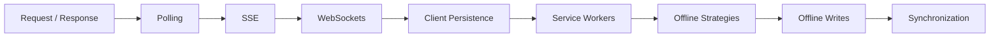

WebRTC will also be introduced as an awareness-level technology for peer-to-peer media and data.

The central lesson is:

> **Real-time and offline systems are not individual browser APIs. They are synchronization architectures.**

---

# 1. “Real-Time” Is a Requirement, Not One Technology

Teams often say:

> We need real-time updates.

But “real-time” can mean many different things.

A stock ticker may need updates several times per second.

A hospital queue display may need changes within a few seconds.

A notification badge may be acceptable if updated every minute.

A dashboard may only need refresh every five minutes.

Before selecting a technology, ask:

> How quickly must changes become visible?

A useful spectrum is:

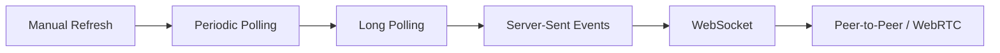

Moving right generally increases connection and synchronization complexity.

Do not adopt the most sophisticated mechanism merely because it sounds modern.

---

# 2. Start with the Simplest Communication Model

Suppose a dashboard displays the number of pending requests.

If updating every 60 seconds is sufficient:

```js
async function refreshCount() {
  const response =
    await fetch(
      "/api/pending-count"
    );

  ...
}

setInterval(
  refreshCount,
  60_000
);
```

This is ordinary **polling**.

It is not architecturally inferior merely because newer technologies exist.

Polling may be the best choice when:

- update frequency is low;
- data is cheap to retrieve;
- infrastructure simplicity matters;
- slight delay is acceptable.

The first architectural rule is:

> **Choose the least complex communication model that meets the latency requirement.**

---

# 3. Polling

Polling asks the server repeatedly:

```text
Anything new?
Anything new?
Anything new?
```

Conceptually:

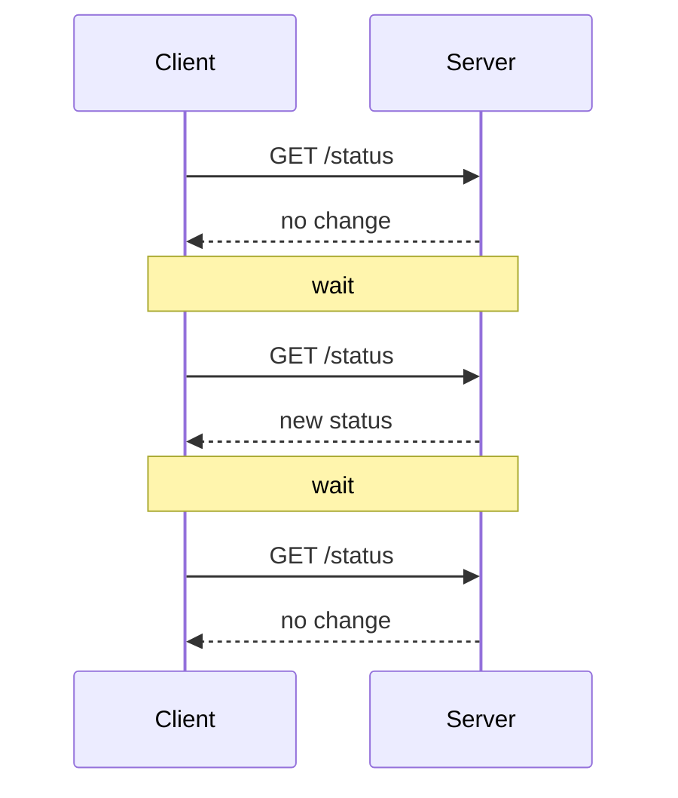

Its strengths are simplicity and ordinary HTTP semantics.

Its weakness is repeated requests even when nothing changed.

---

# 4. Polling Interval Is a Trade-Off

Suppose the interval is:

```text
1 second
```

Updates appear quickly.

But the application generates many requests.

Suppose it is:

```text
5 minutes
```

Traffic is lower.

But the data may remain stale for several minutes.

So:

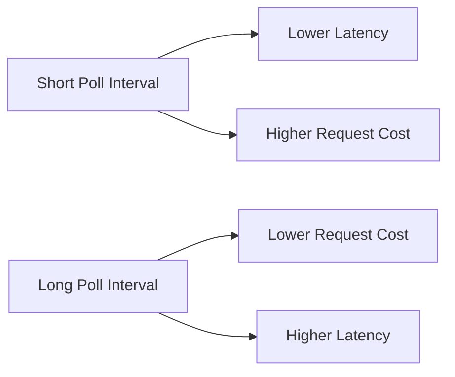

There is no universally correct interval.

It depends on:

- freshness requirements;
- user count;
- request cost;
- server capacity;
- visibility of the page.

---

# 5. Poll Only When Useful

A dashboard hidden in a background tab may not need the same refresh frequency.

Possible improvements include:

- pause or reduce polling when document is hidden;
- stop when component unmounts;
- stop when user navigates away;
- refresh immediately when page becomes visible again.

This is a lifecycle problem.

A polling loop should have:

```text
start
pause
resume
stop
```

not merely:

```text
setInterval forever
```

---

# 6. Avoid Overlapping Poll Requests

Suppose polling occurs every five seconds.

One request takes eight seconds.

A naive `setInterval()` can create:

```text
request A
request B
request C
```

all in flight simultaneously.

A safer pattern may schedule the next poll **after** the current operation finishes.

Conceptually:

```js
async function poll() {
  try {
    await refresh();
  } finally {
    setTimeout(
      poll,
      5000
    );
  }
}
```

Now the system does not unintentionally build a request queue.

---

# 7. Long Polling

Long polling reduces repeated empty requests.

The client sends a request.

The server waits until:

- new data is available; or
- a timeout occurs.

Then the client immediately opens another request.

Conceptually:

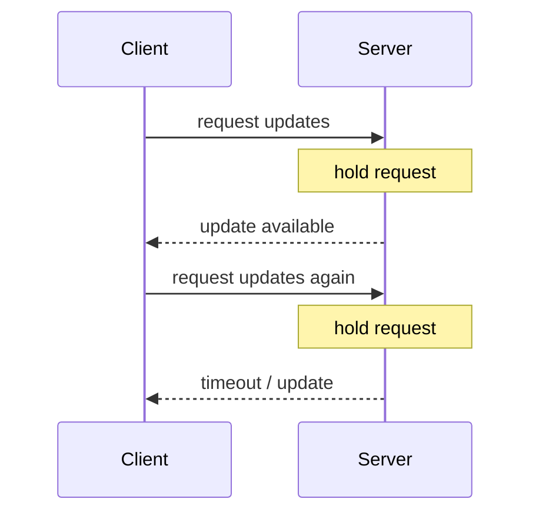

Long polling can approximate server push using ordinary HTTP.

It can be useful where more specialized streaming infrastructure is unavailable.

---

# 8. Long Polling Is Still Repeated HTTP

Long polling does not create one permanent bidirectional connection.

It still involves a sequence of requests.

Compared with ordinary polling:

- fewer empty responses may be sent;
- updates can arrive quickly;
- server connection handling becomes more involved.

It is a useful transitional model but not always the best fit for high-frequency communication.

---

# 9. Server-Sent Events

**Server-Sent Events**, or SSE, allow the server to continuously send events to the browser over an HTTP connection.

The browser uses:

```js
const source =
  new EventSource(
    "/events"
  );
```

Then:

```js
source.addEventListener(
  "message",
  event => {
    console.log(
      event.data
    );
  }
);
```

The key architectural property is:

> SSE is primarily server → client.

The browser receives a stream of events.

The client does not use the SSE connection itself to send arbitrary messages back.

---

# 10. SSE Architecture

Conceptually:

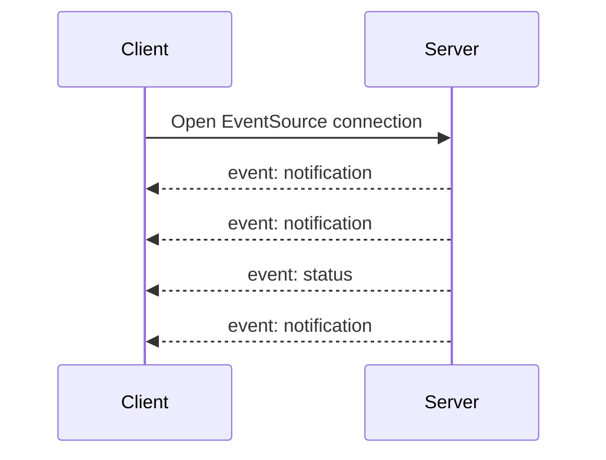

The connection remains open.

The server pushes data as events occur.

---

# 11. When SSE Fits Well

SSE is especially suitable when:

```text
most live traffic flows
server → browser
```

Examples:

- notifications;
- job progress;
- monitoring dashboards;
- news feeds;
- queue status;
- server logs;
- deployment progress.

The client can still use ordinary HTTP requests for commands:

```text
client → server
```

This combination is often simpler than using a fully bidirectional socket for everything.

---

# 12. Commands over HTTP, Events over SSE

Consider a job-processing application.

Client starts a job:

```http
POST /jobs
```

The server responds:

```text
jobId = J-42
```

The browser then receives progress over SSE:

```text
20%
45%
80%
complete
```

Architecture:

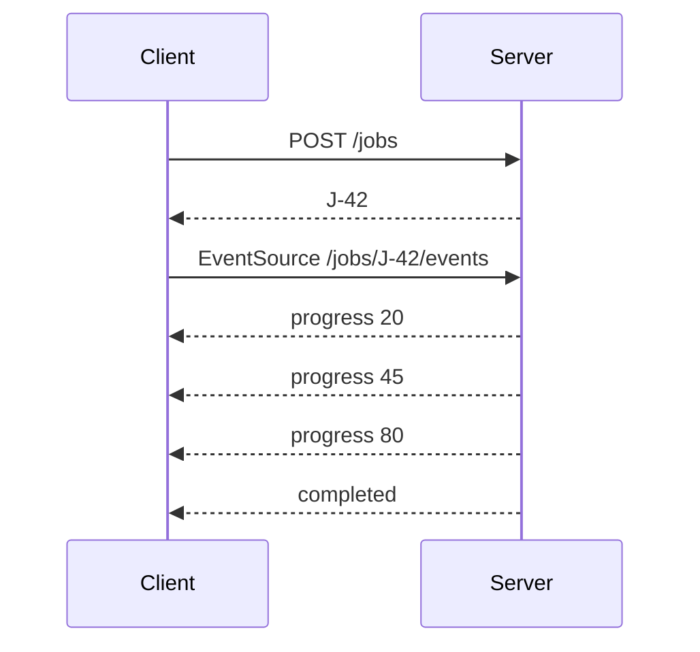

The responsibilities remain clear.

---

# 13. Named SSE Events

Servers can send named event types.

Client:

```js
source.addEventListener(
  "progress",
  event => {
    ...
  }
);

source.addEventListener(
  "complete",
  event => {
    ...
  }
);
```

This produces a domain-oriented event stream rather than one generic message handler.

Use meaningful event contracts.

Avoid turning event payloads into unstructured strings that every component parses differently.

---

# 14. Reconnection

Long-lived connections break.

Networks change.

Devices sleep.

Servers restart.

SSE is designed with reconnection behavior in mind.

Applications should still consider:

- duplicate events;
- missed events;
- stale state;
- reconnection status.

A live stream does not remove the need for consistency.

---

# 15. Events Should Have Identity Where Necessary

Suppose the client receives:

```text
event 101
event 102
```

Disconnects.

Then reconnects.

If the server can resume after:

```text
event 102
```

the client can avoid missing updates.

Event identity can therefore matter.

The exact mechanism depends on the protocol and server architecture.

The architectural principle is:

> **Reconnect logic should define how the client gets from “possibly stale” back to “known current.”**

---

# 16. WebSockets

WebSockets create a long-lived, bidirectional communication channel between browser and server.

Client:

```js
const socket =
  new WebSocket(
    "wss://example.com/socket"
  );
```

Handlers:

```js
socket.addEventListener(
  "open",
  () => {
    ...
  }
);

socket.addEventListener(
  "message",
  event => {
    ...
  }
);

socket.addEventListener(
  "close",
  () => {
    ...
  }
);
```

Send:

```js
socket.send(
  JSON.stringify({
    type:
      "chat-message",

    text:
      "Hello"
  })
);
```

Unlike SSE, communication can naturally flow in both directions over the same connection.

---

# 17. WebSocket Architecture

Conceptually:

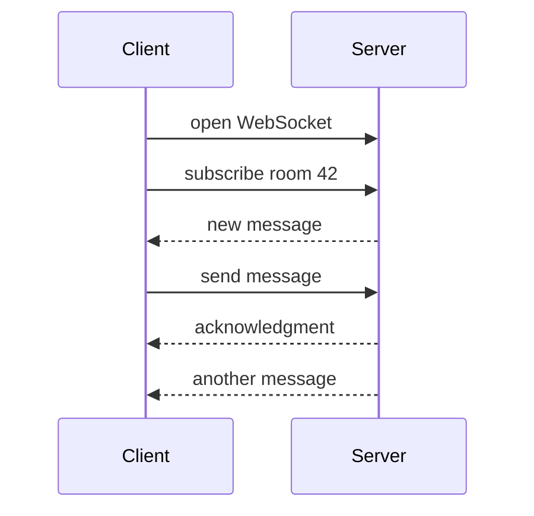

This fits systems with ongoing bidirectional interaction.

---

# 18. When WebSockets Fit

Examples include:

- chat;
- collaborative editing;
- multiplayer games;
- live command/control systems;
- trading interfaces;
- shared cursors;
- interactive dashboards where the client also sends frequent live events.

A WebSocket is not automatically appropriate for:

```text
one notification every ten minutes
```

SSE or polling may be simpler.

---

# 19. A WebSocket Is a Transport, Not an Application Protocol

Calling:

```js
socket.send(...)
```

does not define:

- message types;
- authentication rules;
- acknowledgment;
- retry;
- ordering;
- versioning;
- subscriptions.

Your application needs a protocol.

For example:

```json
{
  "type":
    "subscribe",
  "channel":
    "orders"
}
```

or:

```json
{
  "type":
    "order-updated",
  "version":
    3,
  "payload": {
    "id":
      "ORD-42"
  }
}
```

A socket without a clear message protocol becomes difficult to evolve.

---

# 20. Design Message Envelopes Deliberately

A useful event envelope may contain:

```ts
type Message<T> = {
  type: string;
  id?: string;
  timestamp?: string;
  payload: T;
};
```

Real systems may also include:

- correlation ID;
- schema version;
- sequence number;
- channel;
- user/tenant context.

Do not add fields without reason.

But define enough structure that clients can reason about incoming data.

---

# 21. Runtime Validation Still Applies

WebSocket data is external data.

This is unsafe:

```ts
const message =
  JSON.parse(
    event.data
  ) as ServerMessage;
```

Chapter 5 still applies.

Better:

```text
socket message
↓
parse
↓
unknown
↓
validate
↓
trusted event
```

A long-lived connection does not create trusted types.

---

# 22. Connection State Is UI State

A WebSocket-based application may need to represent:

```text
connecting
connected
reconnecting
offline
failed
```

Conceptually:

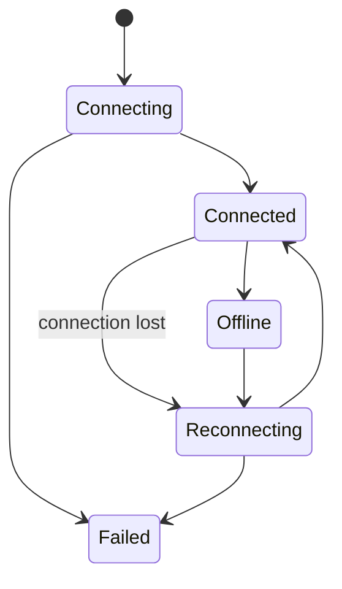

The user may need to know whether live updates are currently reliable.

---

# 23. Reconnection Is Not “Just Reopen the Socket”

Suppose the client disconnects for thirty seconds.

During that period, five order updates occur.

After reconnecting:

```text
Does the server replay them?
Does the client refetch current state?
Does it request events since sequence 100?
```

A reconnect strategy must define recovery.

Common patterns include:

- resubscribe and refetch;
- event sequence replay;
- snapshot + subsequent events.

---

# 24. Snapshot Plus Events

A strong pattern for many live systems is:

```text
load current state snapshot
↓
subscribe to future events
```

Conceptually:

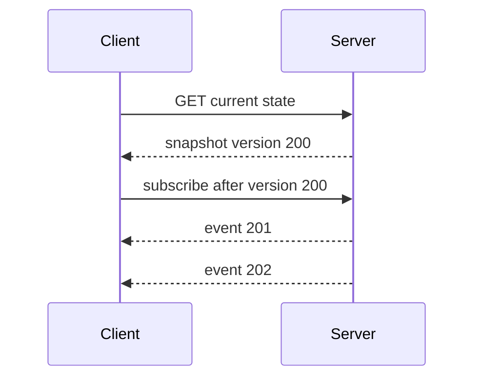

This helps define a consistency boundary.

If the event stream is lost, the client can reload a snapshot.

---

# 25. Ordering

Messages can represent an ordered sequence.

If event 42 depends on event 41, the client must know what to do when:

```text
42 appears
before
41
```

Possible approaches include:

- transport ordering guarantees;
- sequence numbers;
- buffering;
- replay;
- refreshing the full state.

Do not assume all distributed events arrive exactly once and in the ideal order.

---

# 26. Duplicates

Reconnection and retry may cause duplicate delivery.

Suppose:

```text
event ID E-81
```

is processed.

The connection drops before acknowledgment is known.

The event is delivered again.

If processing is not idempotent, duplicate effects can occur.

Applications may need event IDs and deduplication.

---

# 27. Backpressure

What if messages arrive faster than the client can process or transmit them?

The WebSocket API exposes information such as queued outgoing bytes through `bufferedAmount`.

Architecturally, backpressure means:

> The producer and consumer operate at different speeds.

Possible responses include:

- batch updates;
- drop low-value events;
- reduce event frequency;
- aggregate server-side;
- pause producers where protocol allows;
- disconnect when limits are exceeded.

A live connection should not be treated as an infinite pipe.

---

# 28. WebSocket Reconnect Backoff

If a server is down and 100,000 browsers immediately reconnect every 100 milliseconds, the outage can become worse.

Reconnect logic should usually use:

- delay;
- increasing backoff;
- jitter;
- upper bound.

Conceptually:

```text
disconnect
↓
wait
↓
retry
↓
wait longer
↓
retry
```

The connection lifecycle belongs in a centralized communication layer rather than repeated in components.

---

# 29. Polling, SSE, or WebSocket?

A practical comparison:

| Requirement | Polling | SSE | WebSocket |
|---|---|---|---|
| Simple infrastructure | Strong | Moderate | More complex |
| Server → client updates | Yes, delayed | Strong | Strong |
| Client → server live messages | Ordinary HTTP | Ordinary HTTP | Strong |
| Long-lived connection | No | Yes | Yes |
| Bidirectional channel | No | No | Yes |
| Automatic periodic requests | Yes | No | No |
| Good fit for low-frequency changes | Strong | Strong | Sometimes unnecessary |
| Good fit for chat/collaboration | Weak | Limited | Strong |

No mechanism is universally superior.

---

# 30. Decision Model for Live Communication

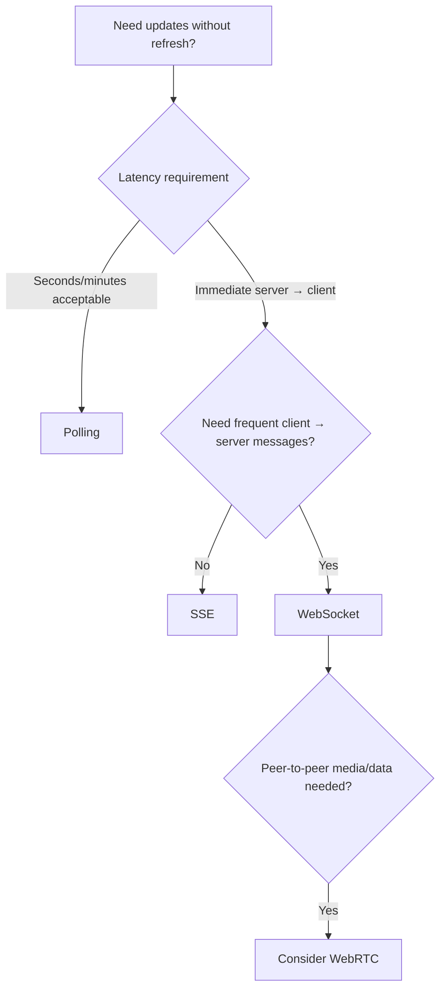

This is only a starting heuristic.

Infrastructure and product constraints still matter.

---

# 31. WebRTC: A Different Kind of Real-Time

WebRTC is designed for peer-oriented real-time communication.

It can support:

- audio;
- video;
- screen sharing;
- peer-to-peer data channels.

Conceptually:

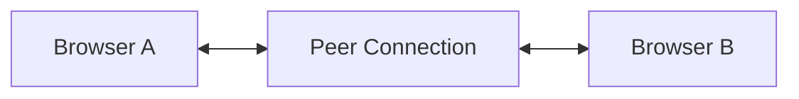

This differs from the ordinary model:

```text
browser
↔
application server
```

However, real WebRTC applications still usually need servers for setup and connectivity support.

---

# 32. Signaling

Two browsers cannot simply discover each other magically.

They need a signaling process to exchange connection information.

Signaling can use:

- WebSocket;
- HTTP;
- another messaging system.

Conceptually:

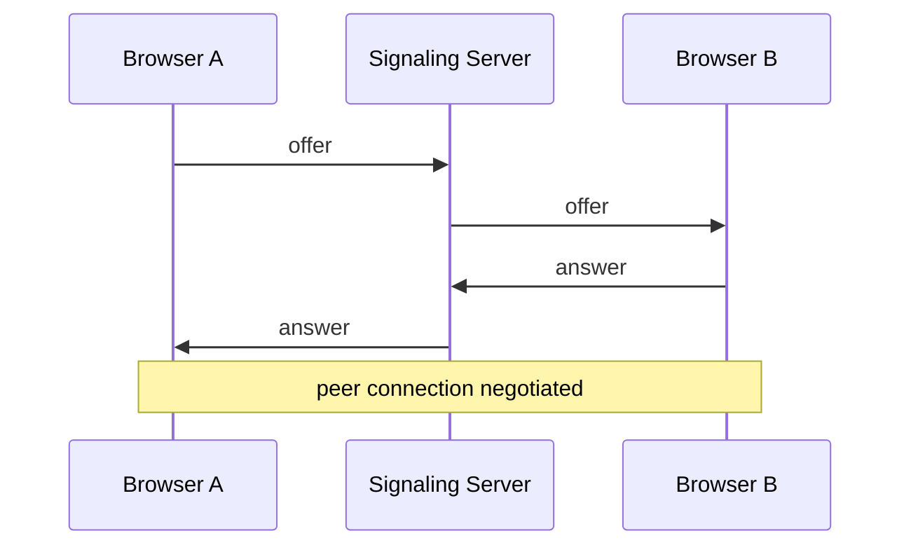

WebRTC does not standardize one application signaling protocol.

---

# 33. NAT Traversal and Relay

Direct browser-to-browser connectivity can be blocked by:

- NAT;
- firewalls;
- network topology.

WebRTC uses connectivity mechanisms such as:

- ICE;
- STUN;
- TURN.

At awareness level:

- **STUN** helps a peer understand its externally visible network address;
- **TURN** can relay traffic when direct peer communication cannot be established;
- **ICE** coordinates candidate connectivity options.

The important lesson is:

> “Peer-to-peer” does not mean “no servers are required.”

---

# 34. WebRTC Data Channels

WebRTC can also exchange arbitrary data through data channels.

Possible uses:

- peer file transfer;
- game state;
- collaborative data;
- metadata.

But do not choose WebRTC data channels simply because two clients exchange messages.

WebSockets are often much simpler when a central server already owns the application state.

WebRTC is awareness-level in this book.

---

# 35. Client Persistence

Real-time communication handles changing data.

Offline systems require another capability:

> The browser must keep data locally.

Several browser storage mechanisms exist.

They solve different problems.

Important categories include:

- cookies;
- localStorage;
- sessionStorage;
- IndexedDB;
- Cache Storage.

---

# 36. Cookies

Cookies are small pieces of browser-managed data that can participate in HTTP requests.

They remain important for:

- sessions;
- authentication architecture;
- selected preferences.

Cookies are **not** the general-purpose database for modern client applications.

They also have important security properties that belong to Chapter 13.

For this chapter, remember:

> Cookies have a network/request role that other client stores do not.

---

# 37. `localStorage`

`localStorage` stores string key/value pairs for an origin and can persist across browser sessions.

Example:

```js
localStorage.setItem(
  "theme",
  "dark"
);

const theme =
  localStorage.getItem(
    "theme"
  );
```

It is useful for small values such as:

- theme preference;
- dismissed notices;
- simple local settings.

But it has architectural limitations.

---

# 38. `localStorage` Is Synchronous

Operations such as:

```js
localStorage.getItem(...)
localStorage.setItem(...)
```

are synchronous.

That means they execute on the calling JavaScript thread.

For small preference values, this is usually manageable.

For large or frequent storage work, synchronous access can harm responsiveness.

Do not use `localStorage` as a large application database.

---

# 39. `localStorage` Stores Strings

This:

```js
localStorage.setItem(
  "preferences",
  JSON.stringify(
    preferences
  )
);
```

and:

```js
const raw =
  localStorage.getItem(
    "preferences"
  );
```

requires:

```text
string
↓
parse JSON
↓
unknown
↓
runtime validation
↓
Preferences
```

Chapter 5's trust-boundary model applies again.

Persisted data can be:

- old;
- malformed;
- manually changed;
- written by an earlier application version.

---

# 40. `sessionStorage`

`sessionStorage` has a similar key/value API but a different lifetime.

It is associated with a page session and is separated by top-level browsing context.

This makes it useful for some temporary tab-specific state.

Examples might include:

- temporary wizard continuity;
- local tab session data.

Do not confuse “session” with secure authentication session.

The name refers to storage lifetime, not application security.

---

# 41. Storage Events

Changes to Web Storage can notify other same-origin documents through the `storage` event.

This can support simple cross-tab coordination.

For example:

```text
Tab A changes theme
↓
Tab B receives storage event
↓
Tab B updates theme
```

For richer inter-tab communication, other browser mechanisms may be more appropriate.

The important point is that browser tabs are not always isolated application universes.

---

# 42. IndexedDB

IndexedDB is the browser's structured client-side database.

It is appropriate for:

- larger structured datasets;
- offline records;
- object stores;
- indexes;
- files/blobs;
- asynchronous storage operations.

Conceptually:

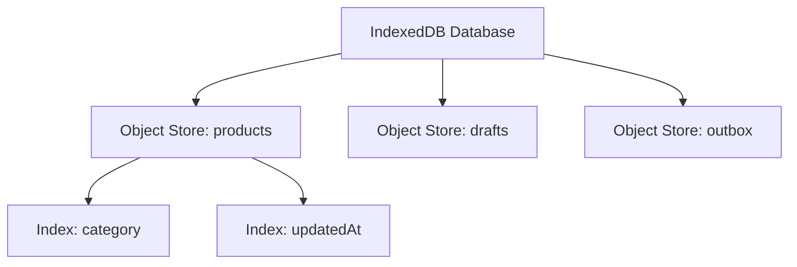

It is far closer to a local database than `localStorage`.

---

# 43. IndexedDB Is Transactional

IndexedDB operations occur through transactions.

A transaction groups operations with a defined mode such as:

```text
readonly
readwrite
```

Conceptually:

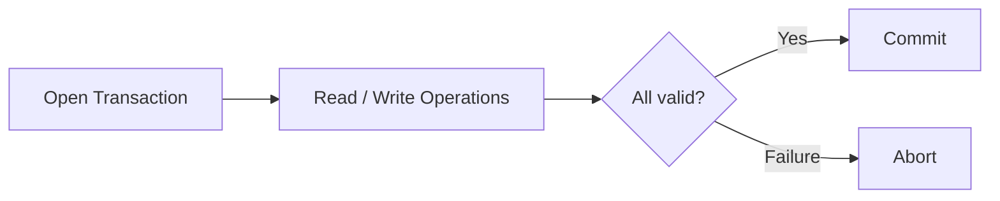

This matters when multiple related local updates should remain coherent.

---

# 44. IndexedDB Is Asynchronous

Unlike Web Storage, IndexedDB is designed around asynchronous operations.

That makes it more appropriate for larger data.

Its native API is lower level than many developers prefer.

Applications often use small wrapper libraries.

The architectural concept matters more than the wrapper:

> **Use a structured, asynchronous client database when local application data is substantial.**

---

# 45. IndexedDB Versioning

Database structure changes over time.

Suppose version 1 stores:

```text
products
```

Version 2 needs:

```text
products
outbox
```

The database opening process can perform schema migration.

This means local persistence needs the same kind of evolution thinking as server databases.

Persistent browser data outlives deployments.

---

# 46. Cache Storage

The browser `Cache` interface stores:

```text
Request → Response
```

pairs.

`CacheStorage` manages named `Cache` objects. Together, these interfaces are commonly discussed as the Cache API.

It is particularly useful for:

- HTML;
- CSS;
- JavaScript;
- images;
- API response caching;
- offline resources.

Conceptually:

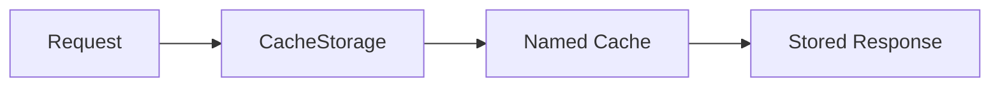

This is different from IndexedDB.

---

# 47. Cache Storage vs IndexedDB

A useful distinction:

### Cache Storage

Best when the thing being stored is naturally:

```text
request → response
```

Examples:

- `/app.css`;
- `/logo.svg`;
- `/api/articles/42`.

### IndexedDB

Best when the application wants structured records:

```text
draft object
outbox item
customer record
offline entity
```

Do not force structured application data into Cache Storage merely because the API contains the word “cache.”

---

# 48. Storage Is Not Guaranteed Forever

Browser storage is subject to:

- quotas;
- eviction policies;
- user clearing site data;
- private browsing behavior;
- storage pressure.

An offline-capable web application should not assume:

> If I stored it once, it is immortal.

Important unsynchronized user data may require:

- persistent-storage requests where appropriate;
- server synchronization;
- clear UX about draft state.

---

# 49. Storage Quotas

Applications can inspect storage estimates through browser storage APIs.

Conceptually:

```js
const estimate =
  await navigator.storage
    .estimate();
```

The application can learn approximate:

- usage;
- quota.

Do not hard-code one universal number of megabytes.

Storage capacity and eviction behavior vary by browser and environment.

---

# 50. Choose Storage by Data Semantics

A useful comparison:

| Need | Likely mechanism |
|---|---|
| Authentication/session cookie | Cookie |
| Small persistent preference | localStorage |
| Tab-lifetime key/value state | sessionStorage |
| Large structured offline dataset | IndexedDB |
| HTTP request/response assets | Cache API |

This is a starting point.

Security, privacy, persistence, and browser support may modify the decision.

---

# 51. Service Workers

A Service Worker is an event-driven worker associated with an origin and scope.

It can sit between controlled pages and the network.

Conceptually:

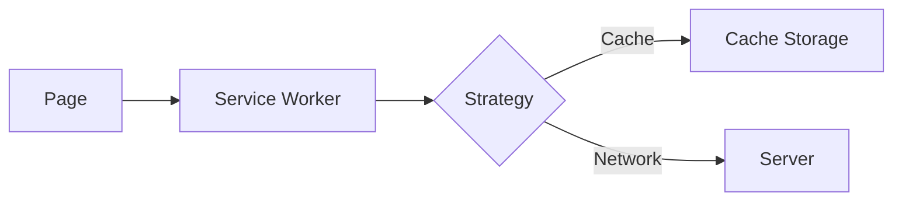

This makes Service Workers central to advanced offline behavior.

---

# 52. Service Workers Run Outside the Page

A Service Worker:

- does not have ordinary DOM access;
- can run separately from the page's main JavaScript;
- responds to lifecycle and network-related events;
- is designed around asynchronous APIs.

This is why it can continue participating in network/cache logic even when no component is currently rendering.

Do not think of it as:

```text
another script tag
```

It is a separate execution context.

---

# 53. Secure Context Requirement

Service Workers are powerful.

They can intercept requests for controlled pages.

Therefore, production use requires secure contexts such as HTTPS.

Local development environments are commonly treated specially.

Architecturally:

> A feature with authority over network interception must not be exposed casually over insecure delivery.

---

# 54. Service Worker Lifecycle

Important stages include:

```text
registration
installation
activation
control
update
```

A simplified lifecycle:

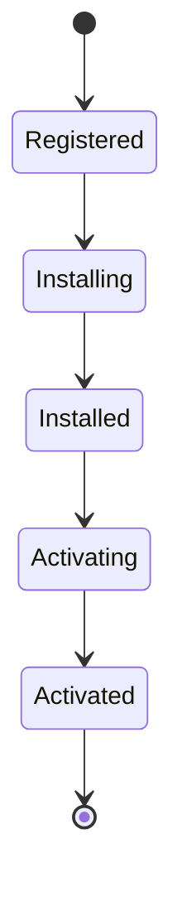

Updates introduce additional lifecycle details.

The key lesson is:

> A newly downloaded Service Worker does not simply replace the active one at an arbitrary instant without lifecycle rules.

---

# 55. Installation

The `install` event is often used to prepare resources needed for an offline shell.

Conceptually:

```js
self.addEventListener(
  "install",
  event => {
    event.waitUntil(
      cacheCoreAssets()
    );
  }
);
```

Typical assets might include:

- application HTML shell;
- CSS;
- essential JavaScript;
- logo;
- offline fallback page.

Do not cache the entire internet.

Cache intentionally.

---

# 56. Activation

The `activate` event is often a good place to:

- remove obsolete caches;
- finalize a new Service Worker version.

For example:

```text
cache-v4
replaces
cache-v3
```

Old cached assets should not accumulate forever.

---

# 57. Fetch Interception

Once active and controlling a page, a Service Worker can receive fetch events.

Conceptually:

```js
self.addEventListener(
  "fetch",
  event => {
    event.respondWith(
      chooseResponse(
        event.request
      )
    );
  }
);
```

Now the application can decide:

- cache first;
- network first;
- cache only;
- network only;
- stale while revalidate;
- custom fallback.

This is the heart of Service Worker request strategy.

---

# 58. Service Worker Does Not Mean “Offline Automatically”

Registering:

```js
navigator.serviceWorker
  .register("/sw.js");
```

does not automatically make an application work offline.

You still need to decide:

- what should be cached;
- when;
- how cache updates;
- which requests bypass cache;
- what happens offline;
- how versions are handled.

The Service Worker is infrastructure.

The offline behavior is architecture.

---

# 59. Cache-First Strategy

A cache-first strategy asks the cache before the network.

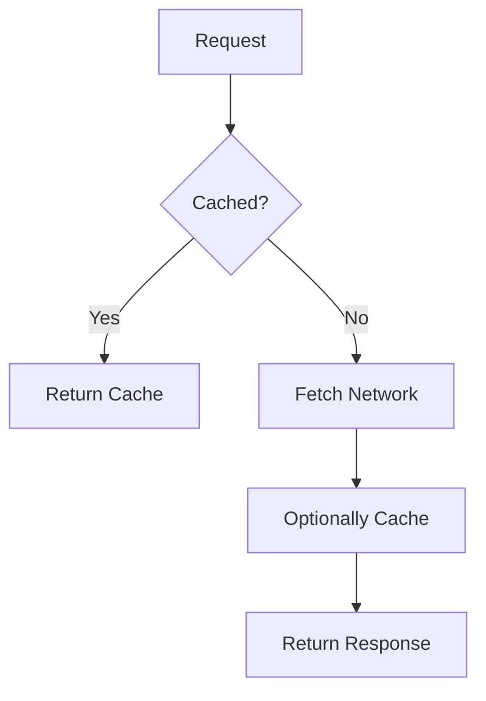

This can fit:

- versioned static assets;
- fonts;
- images;
- resources that rarely change.

Advantages:

- very fast cached responses;
- strong offline behavior.

Risk:

- stale content if invalidation/update is poorly designed.

---

# 60. Network-First Strategy

A network-first strategy prefers fresh server data.

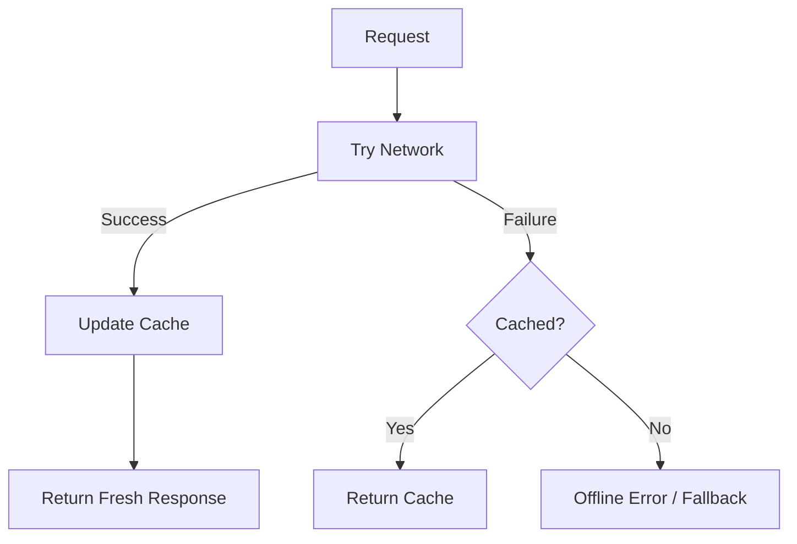

This can fit:

- frequently changing content;
- API data where freshness matters.

Cost:

- normal operation waits for the network.

---

# 61. Stale-While-Revalidate

The same concept from Chapter 9 can exist at the Service Worker level.

```mermaid
flowchart TD
    A[Request] --> B{Cached?}
    B -->|Yes| C[Return Cache Immediately]
    B -->|No| D[Fetch Network]

    C --> E[Fetch Network in Background]
    E --> F[Update Cache]

    D --> F
```

This can balance:

- fast display;
- eventual freshness.

But remember that browser-level and application-level caching can interact.

Avoid duplicating strategies blindly at two layers.

---

# 62. Network-Only and Cache-Only

Some resources should always use network.

Examples may include:

- highly sensitive dynamic operations;
- requests whose caching semantics are unsuitable.

Some specialized resources may intentionally be cache-only.

The point is that a Service Worker strategy should be selected **per request category**, not as one universal rule.

---

# 63. A Strategy Matrix

Example architecture:

| Resource | Strategy |
|---|---|
| Versioned JS/CSS | Cache first |
| App shell | Cache first / controlled update |
| Product images | Cache first or stale-while-revalidate |
| Product list API | Network first or application/query cache |
| Offline fallback | Cache only |
| Mutation requests | Network, with offline queue if designed |

The exact table is application-specific.

---

# 64. Offline Fallback

Suppose navigation occurs while offline.

The Service Worker may return an offline page:

```text
You are offline.
Previously saved records are still available.
```

This is better than the browser's generic network failure.

But an offline page should communicate what remains possible.

A good offline experience answers:

- What is unavailable?
- What data is still present?
- Can work continue locally?
- Will changes synchronize later?

---

# 65. Offline-Capable vs Offline-First

These terms should not be treated as identical.

### Offline-capable

The application provides some useful behavior without connectivity.

Examples:

- shell loads;
- cached articles readable;
- draft survives.

### Offline-first

Offline operation is a primary architectural mode.

The application assumes connectivity may be absent and designs writes, reads, and synchronization accordingly.

Offline-first is significantly more complex.

---

# 66. Detecting Online/Offline Is Not Perfect Connectivity Testing

Browsers expose:

```js
navigator.onLine
```

and online/offline events.

These can be useful hints.

But:

```text
online
```

does not guarantee your application server is reachable.

The network may exist while:

- DNS fails;
- captive portal blocks access;
- server is down;
- API route is unavailable.

Treat browser connectivity status as a signal, not absolute truth.

---

# 67. Offline Reads

Offline reading can use:

- Cache Storage;
- IndexedDB;
- application/query cache;
- previously synchronized records.

Example:

```mermaid
flowchart TD
    A[User Opens Record] --> B{Network available?}

    B -->|Yes| C[Fetch / Revalidate]
    B -->|No| D{Local record exists?}

    D -->|Yes| E[Show Local Copy]
    D -->|No| F[Explain Unavailable Offline]
```

Do not claim offline support for data that was never made locally available.

---

# 68. Offline Writes

Offline reads are relatively easy.

Offline writes are harder.

Suppose a field worker creates an inspection while offline.

The application must:

1. assign a local identity;
2. save the draft locally;
3. mark it unsynchronized;
4. eventually send it to the server;
5. handle success or rejection;
6. reconcile server identity/version.

This requires an **outbox** model.

---

# 69. The Outbox Pattern

An outbox stores operations that should be synchronized later.

Example record:

```ts
type OutboxItem = {
  id: string;
  operation:
    "create-inspection";

  payload:
    InspectionDraft;

  createdAt:
    string;

  attempts:
    number;
};
```

Architecture:

```mermaid
flowchart LR
    A[User Action] --> B[Local Domain Update]
    B --> C[IndexedDB]
    B --> D[Outbox]

    D --> E{Network Available?}
    E -->|Yes| F[Send to Server]
    E -->|No| G[Wait]

    F --> H{Success?}
    H -->|Yes| I[Remove Outbox Item]
    H -->|No| J[Retry / Conflict / Error]
```

This is a real synchronization system.

---

# 70. Local Identity vs Server Identity

Suppose a record is created offline.

It does not yet have a server-generated ID.

One strategy is to use client-generated IDs that the server accepts.

Another is:

```text
local temporary ID
↓
server creation
↓
replace / map to server ID
```

The second approach creates additional reconciliation complexity.

Identity design matters strongly in offline-first systems.

---

# 71. Pending Synchronization Is User-Relevant State

An offline application should not hide synchronization status.

Possible states:

```text
Saved locally
Waiting for connection
Syncing
Synced
Sync failed
Conflict requires attention
```

For important records, these states should be visible.

A green “Saved” message can be misleading if the data exists only on one device and has never reached the server.

---

# 72. Sync Is Not the Same as Retry

Retry assumes:

> Send the same operation later.

Synchronization may need to answer:

- Has the server state changed?
- Is this operation still valid?
- Is the local version based on old data?
- Can operations be merged?
- Should one side win?

That is a much harder problem.

---

# 73. Conflict Example

Suppose a record starts as:

```text
status = open
priority = normal
```

Offline user A changes:

```text
priority = urgent
```

Online user B changes:

```text
status = closed
```

When A reconnects, can both changes be applied?

Possibly.

Now suppose both change:

```text
priority
```

to different values.

The system needs a conflict policy.

---

# 74. Conflict Policies

Possible strategies include:

### Last write wins

Newest accepted write replaces older value.

Simple, but can lose information.

### Server wins

Reject or discard local conflicting change.

Safe for authority, but may frustrate users.

### Client wins

Overwrite server state.

Risky in multi-user systems.

### Field-level merge

Merge non-overlapping changes.

More complex.

### Manual resolution

Ask the user to resolve conflict.

Appropriate for high-value data.

There is no universal answer.

Conflict policy belongs to the domain.

---

# 75. Version-Based Conflict Detection

A record may include:

```text
version = 12
```

Offline edit is based on version 12.

Server is now version 14.

Client submits:

```text
update based on version 12
```

Server can reject with conflict.

Conceptually:

```mermaid
sequenceDiagram
    participant C as Client
    participant S as Server

    C->>S: PATCH record, baseVersion=12
    Note over S: current version = 14
    S-->>C: Conflict
    C-->>C: resolve / refresh / merge
```

This prevents silent overwrite.

---

# 76. Operation Logs

Some collaborative or offline systems synchronize operations rather than whole records.

Instead of:

```text
replace document with this version
```

they exchange:

```text
insert character
move item
change field
```

This can support richer merge strategies.

But it introduces substantially more complexity.

Technologies such as:

- Operational Transformation;
- CRDTs

belong to specialized collaborative-system design.

They are outside this chapter's core depth.

---

# 77. Eventual Consistency

Offline-capable systems often cannot guarantee that every device sees the same data immediately.

Instead, they may provide **eventual consistency**:

> If updates stop and synchronization succeeds, replicas eventually converge.

For the user, this means the application must sometimes display:

```text
local state may not yet match server state
```

This is a product and UX concern, not merely a database concept.

---

# 78. Background Sync

The Background Synchronization API can allow a Service Worker to defer work until connectivity becomes available.

Conceptually:

```text
offline action
↓
register sync
↓
browser later has connectivity
↓
Service Worker receives sync event
↓
send outbox
```

This is useful for some offline-write scenarios.

However, browser support is not universal.

A robust architecture needs a fallback such as:

```text
attempt synchronization when application starts or regains connectivity
```

Do not design critical data integrity around an API without considering its availability.

---

# 79. Background Sync as an Enhancement

A safe mental model:

```mermaid
flowchart TD
    A[Outbox Exists] --> B{Background Sync supported?}

    B -->|Yes| C[Register Sync]
    B -->|No| D[Sync on App Resume / Online Event]

    C --> E[Service Worker Sends]
    D --> E
```

The outbox is the architectural foundation.

Background Sync is an enhancement to when the outbox can be processed.

---

# 80. Periodic Background Sync

Some environments also support periodic background synchronization.

This can be useful for:

- refreshing content;
- preparing data before the user opens the application.

But support is more limited.

Treat periodic background work as progressive enhancement rather than a universal browser capability.

---

# 81. Service Worker Update Risk

Caching JavaScript application shells introduces a versioning problem.

Suppose:

```text
HTML version 5
JavaScript version 4
```

are accidentally mixed.

The application may break.

Asset hashing and coordinated cache versioning help prevent mismatched resources.

Offline architecture must include deployment/update architecture.

---

# 82. Cache Versioning

One simple educational pattern:

```text
app-cache-v1
app-cache-v2
app-cache-v3
```

Activation can remove older versions.

Production build tools often automate more sophisticated asset revisioning.

The principle is:

> Cached application code needs explicit version evolution.

---

# 83. Do Not Cache Every API Response Forever

Suppose a patient record is cached indefinitely.

Problems include:

- stale clinical data;
- privacy exposure;
- device sharing;
- retention concerns.

Offline caching must consider:

- sensitivity;
- freshness;
- user identity;
- logout behavior;
- storage policy.

Offline capability does not override security requirements.

---

# 84. User Identity and Offline Data

If user A signs out and user B signs in on the same browser, should B see A's cached records?

Obviously not.

An application may need to:

- namespace local data by account;
- clear sensitive caches on logout;
- encrypt or avoid local persistence for sensitive content;
- enforce server authorization after reconnect.

This is where offline architecture meets security.

---

# 85. Cache API Is Not Authorization

A Service Worker can return a cached response.

That does not prove the current user is still authorized to see it.

For sensitive applications, offline access rules need deliberate design.

Chapter 13 will deepen authentication and browser security.

---

# 86. Progressive Web Apps

A Progressive Web App, or PWA, is not one API.

It is an application approach combining web capabilities that can provide app-like experiences.

Common capabilities include:

- installability;
- manifest metadata;
- Service Workers;
- offline behavior;
- background capabilities where supported.

The web app manifest may define:

- application name;
- icons;
- start URL;
- display behavior;
- theme metadata.

But a manifest alone does not make a good PWA.

---

# 87. Installability Is Not the Same as Offline Support

An application may be installable but still require network access for most functions.

Another application may work offline without being installed.

Treat these as separate concerns:

```mermaid
flowchart TD
    A[PWA Capabilities] --> B[Installability]
    A --> C[Offline Behavior]
    A --> D[Background Features]
    A --> E[Platform Integration]
```

The product should choose the capabilities that create actual value.

---

# 88. App Shell

An offline-capable application often caches a minimal **application shell**:

- root HTML;
- core CSS;
- startup JavaScript;
- essential icons;
- offline page.

Then application data can load separately.

Conceptually:

```mermaid
flowchart TD
    A[Cached App Shell] --> B[Application Starts]
    B --> C{Network?}
    C -->|Yes| D[Load Fresh Data]
    C -->|No| E[Load Local Data]
```

This separates:

```text
can the interface start?
```

from:

```text
is fresh server data available?
```

---

# 89. Offline-First Data Architecture

A serious offline-first system may use:

```mermaid
flowchart TD
    A[UI] --> B[Local Repository]
    B --> C[IndexedDB]

    B --> D[Sync Engine]
    D --> E[Outbox]
    D --> F[Server API]

    F --> G[Remote Changes]
    G --> D
    D --> C
```

The UI reads from the local repository.

The synchronization engine keeps local and remote data aligned.

This differs fundamentally from:

```text
component
→ fetch server
→ render
```

---

# 90. Local-First Interaction

In some offline architectures, a user action writes locally first.

Example:

```text
create inspection
↓
store in IndexedDB
↓
UI immediately shows it
↓
queue synchronization
↓
server eventually accepts
```

This gives excellent responsiveness and offline capability.

But it introduces:

- pending state;
- conflict state;
- local identity;
- sync error handling.

The product must justify that complexity.

---

# 91. Network-First Interaction

Other applications should remain server-first.

Example:

```text
approve payment
↓
server validates
↓
server commits
↓
UI updates
```

Offline approval may be unacceptable.

The architecture should follow domain risk.

Not every application should become offline-first.

---

# 92. Selecting Offline Scope

A useful compromise is partial offline support.

For example, a hospital application may allow:

```text
offline:
view previously downloaded reference material
write temporary notes

online only:
medication order
patient discharge
billing finalization
```

Offline capability can be scoped per workflow.

This is often safer than treating the entire application uniformly.

---

# 93. Real-Time + Offline Together

Some applications need both.

Example:

- online: receive live changes through WebSocket;
- offline: work from IndexedDB;
- reconnect: synchronize outbox and reload missed server changes;
- resume live stream.

Architecture:

```mermaid
flowchart TD
    A[Online Live State] --> B[WebSocket / SSE]
    B --> C[Local Repository]
    C --> D[UI]

    E[Offline Edits] --> C
    E --> F[Outbox]

    G[Reconnect] --> H[Sync Outbox]
    H --> I[Refresh Snapshot]
    I --> J[Resume Live Stream]
    J --> C
```

This is significantly more complex than either feature alone.

---

# 94. Reconnect Sequence

A robust reconnect may follow:

```text
1. network returns
2. authenticate if needed
3. send pending local operations
4. resolve conflicts
5. fetch latest authoritative snapshot
6. resume live subscription
```

The exact order can vary.

The important thing is that it is deliberate.

---

# 95. Avoid Double Applying Events

Suppose:

1. local optimistic update applies;
2. server accepts it;
3. WebSocket broadcasts the same update back.

If the client blindly applies both, state may double-change.

Messages may need:

- operation IDs;
- event IDs;
- origin IDs.

Then the client can recognize:

```text
this server event confirms my already-applied operation
```

instead of applying it as new.

---

# 96. Data Freshness After Reconnect

The browser may have been offline for hours.

Do not assume replay will always cover every event.

A safer model for many systems:

```text
reconnect
↓
synchronize pending writes
↓
reload authoritative state
↓
resume live events
```

The reload establishes a known-good snapshot.

---

# 97. Practical Project: Offline-Capable Field Inspections

For this chapter's practical treatment, imagine a field-inspection application.

Requirements:

- inspectors see assigned inspections;
- assignments update live when online;
- inspector can open a downloaded inspection offline;
- inspector can fill a report offline;
- report is stored locally;
- pending reports synchronize later;
- user can see synchronization status.

This gives us one coherent example for:

- SSE/WebSocket comparison;
- IndexedDB;
- Service Workers;
- offline shell;
- outbox;
- conflict handling.

---

# 98. Data Model

Server record:

```ts
type Inspection = {
  id: string;
  location: string;
  status:
    "assigned"
    | "in-progress"
    | "submitted";

  version: number;
};
```

Local draft:

```ts
type InspectionDraft = {
  inspectionId: string;
  notes: string;
  answers:
    Record<
      string,
      string
    >;

  baseVersion:
    number;

  syncStatus:
    "local"
    | "pending"
    | "syncing"
    | "synced"
    | "conflict";
};
```

The local model includes synchronization metadata that the server model does not need.

---

# 99. Local Repository

Instead of components calling IndexedDB directly everywhere, create a repository boundary:

```ts
interface InspectionRepository {
  getAssigned():
    Promise<
      Inspection[]
    >;

  getDraft(
    id: string
  ):
    Promise<
      InspectionDraft
      | undefined
    >;

  saveDraft(
    draft:
      InspectionDraft
  ):
    Promise<void>;
}
```

This keeps persistence details away from UI components.

---

# 100. Sync Engine

A synchronization module can own:

- outbox reads;
- retries;
- conflict responses;
- server acknowledgments;
- local status changes.

Conceptually:

```mermaid
flowchart LR
    A[IndexedDB Outbox] --> B[Sync Engine]
    B --> C[Server API]
    C --> D{Result}

    D -->|Accepted| E[Mark Synced]
    D -->|Conflict| F[Mark Conflict]
    D -->|Temporary Failure| G[Retry Later]
```

The UI does not need to implement synchronization itself.

---

# 101. Live Assignment Updates

While online, the application might receive:

```text
inspection-assigned
inspection-cancelled
inspection-updated
```

through SSE or WebSocket.

The live transport should update the local repository.

Then the UI reacts to the repository's current state.

This reduces separate online/offline models.

---

# 102. One Local Data Model

A strong offline architecture often tries to avoid:

```text
online UI uses server data
offline UI uses completely different local data
```

Instead:

```text
network synchronization
↓
local repository
↓
UI
```

This can make online and offline behavior more consistent.

It also increases the importance of the local persistence layer.

---

# 103. When This Architecture Is Too Much

Do not implement:

```text
Service Worker
IndexedDB
outbox
conflict resolution
live stream
background sync
```

for a marketing website.

Use complexity only when product requirements justify it.

A useful progression is:

```text
ordinary HTTP
↓
client cache
↓
live updates
↓
offline read
↓
offline write
↓
full synchronization
```

Stop at the level the product actually needs.

---

# 104. Misconceptions to Leave Behind

## “Real-time means WebSocket.”

No.

Polling, long polling, SSE, WebSockets, and WebRTC solve different real-time requirements.

---

## “Polling is outdated.”

No.

Polling remains a good solution when freshness requirements and request costs make it appropriate.

---

## “SSE and WebSocket are the same.”

No.

SSE is primarily server-to-client streaming over HTTP.

WebSocket provides a bidirectional message channel.

---

## “A WebSocket automatically handles reconnection.”

No.

Application reconnection and state recovery still require design.

---

## “Messages will always arrive exactly once.”

Do not assume that.

Retries, reconnects, and distributed systems can create missed or duplicate processing scenarios.

---

## “WebRTC means browsers connect directly with no servers.”

No.

Signaling and NAT traversal infrastructure are commonly required, and TURN may relay traffic.

---

## “`localStorage` is a database.”

No.

It is synchronous string key/value storage suitable for smaller data.

---

## “Data in `localStorage` is trusted because our app wrote it.”

No.

Persisted client data is still a runtime boundary when read.

---

## “IndexedDB is just bigger localStorage.”

No.

It is an asynchronous transactional structured-data database with indexes and object stores.

---

## “Cache Storage and IndexedDB are interchangeable.”

No.

Cache Storage is naturally request/response oriented.

IndexedDB is structured application data storage.

---

## “Service Worker registration makes an app offline.”

No.

Offline behavior requires deliberate caching and fallback strategies.

---

## “Cache-first is the best offline strategy for everything.”

No.

Strategy should match resource freshness and semantics.

---

## “`navigator.onLine` proves the server is reachable.”

No.

It is only a connectivity signal.

---

## “Offline support means only caching GET responses.”

No.

Offline writes require local persistence, outbox processing, synchronization, and potentially conflict resolution.

---

## “Retry and synchronization are the same.”

No.

Synchronization must reconcile multiple evolving copies of data.

---

## “Background Sync is universally supported.”

No.

Treat it as progressive enhancement and provide another synchronization path.

---

## “PWA means installable website.”

That is incomplete.

PWA architecture may involve installability, offline behavior, Service Workers, manifests, and other progressive capabilities.

---

## “Every application should be offline-first.”

No.

Offline-first architecture has substantial complexity and should be justified by product needs.

---

# Chapter Summary

Real-time communication begins with a latency requirement.

The simplest useful mechanism should usually be preferred.

Polling:

```text
client asks periodically
```

Long polling:

```text
server holds the request until data is available
```

Server-Sent Events:

```text
server continuously pushes events to client
```

WebSocket:

```text
client and server exchange messages bidirectionally
```

WebRTC adds peer-oriented media and data communication but introduces signaling and connectivity infrastructure.

A decision model is:

```mermaid
flowchart TD
    A[Need live updates?] --> B{How fast?}
    B -->|Low frequency| C[Polling]
    B -->|Immediate server push| D{Bidirectional?}
    D -->|No| E[SSE]
    D -->|Yes| F[WebSocket]
    F --> G{Peer media/data?}
    G -->|Yes| H[WebRTC]
```

Persistent client storage should also be selected by semantics.

- cookies have HTTP/session roles;
- `localStorage` stores small persistent strings synchronously;
- `sessionStorage` provides tab/session-scoped key/value storage;
- IndexedDB stores significant structured data asynchronously;
- Cache Storage stores Request/Response pairs.

Service Workers provide a programmable interception layer between controlled pages and network/cache resources.

Common strategies include:

- cache first;
- network first;
- stale while revalidate;
- network only;
- cache only.

Offline reading is much simpler than offline writing.

Offline writes introduce:

- local identity;
- durable drafts;
- outbox queues;
- synchronization;
- retries;
- conflicts;
- status communication.

Background Sync can improve this architecture where supported, but should be treated as an enhancement rather than the sole synchronization mechanism.

The central principle of the chapter is:

> **Offline and real-time features should be designed around data ownership, synchronization, and recovery—not around isolated browser APIs.**

---

# Review Questions

1. Why is “real-time” a requirement rather than a specific technology?

2. When can ordinary polling be the best solution?

3. What trade-off is controlled by polling interval?

4. Why should polling consider page visibility and lifecycle?

5. Why can `setInterval()` create overlapping requests?

6. What is long polling?

7. How does long polling differ from ordinary polling?

8. What is Server-Sent Events?

9. In which direction does SSE primarily communicate?

10. When does SSE fit better than a WebSocket?

11. Why can commands use HTTP while events use SSE?

12. Why does a reconnect strategy need to consider missed events?

13. What is a WebSocket?

14. Why is WebSocket appropriate for chat and collaboration?

15. Why is a WebSocket transport not the same as an application protocol?

16. What information might a structured message envelope contain?

17. Why must WebSocket messages still be runtime validated?

18. What connection states may a live UI need to expose?

19. Why is reopening a socket not enough after disconnection?

20. What is the snapshot-plus-events pattern?

21. Why can event ordering matter?

22. Why may applications need event deduplication?

23. What is backpressure?

24. Why should reconnect use backoff?

25. When should polling be preferred over a long-lived connection?

26. What is WebRTC used for?

27. What is signaling?

28. What roles do ICE, STUN, and TURN play conceptually?

29. Why does peer-to-peer communication still commonly require servers?

30. What is a WebRTC data channel?

31. What is `localStorage` appropriate for?

32. Why can large amounts of `localStorage` activity harm responsiveness?

33. What is the difference between `localStorage` and `sessionStorage`?

34. Why must data read from local storage be validated?

35. What is IndexedDB?

36. Why is IndexedDB more suitable for large structured datasets?

37. What is an IndexedDB transaction?

38. Why does IndexedDB schema versioning matter?

39. What does the Cache API store?

40. How does Cache Storage differ from IndexedDB?

41. Why can browser storage not be assumed permanent?

42. What is a Service Worker?

43. Why does a Service Worker not have ordinary DOM access?

44. Why are Service Workers restricted to secure contexts?

45. What are the major Service Worker lifecycle stages?

46. What commonly happens during the install event?

47. What commonly happens during activation?

48. What does fetch interception allow a Service Worker to do?

49. Why does Service Worker registration not automatically provide offline support?

50. What is cache-first?

51. What is network-first?

52. What is stale-while-revalidate?

53. Why should caching strategies differ by resource type?

54. What is an offline fallback?

55. What is the difference between offline-capable and offline-first?

56. Why is `navigator.onLine` not proof that an API is reachable?

57. What additional complexity appears with offline writes?

58. What is the outbox pattern?

59. Why does offline creation create an identity problem?

60. Which synchronization states may be important to show users?

61. How does synchronization differ from simple retry?

62. What kinds of conflict policies are possible?

63. What is version-based conflict detection?

64. What is eventual consistency?

65. What does Background Sync provide?

66. Why should Background Sync be treated as progressive enhancement?

67. Why can Service Worker updates create version mismatch problems?

68. Why should sensitive application data be cached carefully?

69. Why does logout matter to offline storage design?

70. What is a PWA?

71. Why is installability different from offline support?

72. What is an application shell?

73. What is local-first interaction?

74. Why is server-first still appropriate for some workflows?

75. How can real-time and offline synchronization coexist?

76. Why can live server events accidentally double-apply an optimistic local update?

77. Why may a reconnect need a fresh authoritative snapshot?

78. What is the principle behind using one local repository for both online and offline UI?

79. When is a full offline-first architecture unnecessary?

---

# End-of-Chapter Practical Lab — Build an Offline-Capable Field Inspection App

Create:

```text
chapter-10-realtime-offline/
├── app/
│   ├── inspections/
│   ├── sync/
│   └── storage/
├── public/
│   ├── manifest.webmanifest
│   └── offline.html
├── service-worker.js
└── server-simulator/
```

The application should work as an educational architecture exercise rather than a production synchronization engine.

---

## Stage 1 — Implement Polling

Create a simulated assignment endpoint.

Poll every few seconds.

Observe:

- request frequency;
- update latency.

Then pause polling when the page is hidden.

---

## Stage 2 — Prevent Poll Overlap

Add artificial server delay longer than the polling interval.

Observe overlapping requests.

Replace fixed `setInterval()` behavior with a schedule that begins after each request finishes.

---

## Stage 3 — Replace Polling with SSE

Create or simulate an SSE endpoint.

Receive:

```text
inspection-assigned
inspection-updated
inspection-cancelled
```

events.

Compare request activity with polling.

---

## Stage 4 — Compare SSE and WebSocket

Implement a small WebSocket version if infrastructure allows.

Send:

```text
subscribe
acknowledge assignment
```

over the same channel.

Write a short comparison explaining whether bidirectional sockets actually improve this use case.

---

## Stage 5 — Add Connection State

Represent:

```text
connecting
connected
reconnecting
offline
failed
```

in the UI.

Simulate a server restart.

Show the user when live updates are unavailable.

---

## Stage 6 — Design Reconnection

After reconnect:

1. reload current assignment snapshot;
2. resume event subscription.

Draw this process as a Mermaid sequence diagram.

---

## Stage 7 — Explore WebRTC Conceptually

Do not build a complete WebRTC application.

Create a Mermaid diagram showing:

```text
Browser A
Signaling Server
Browser B
STUN/TURN
```

Explain why WebRTC would be justified for:

```text
live video inspection
```

but probably unnecessary for ordinary inspection status events.

---

## Stage 8 — Add Local Preferences

Store:

```text
theme
list density
```

in `localStorage`.

Reload the application.

Validate restored values before use.

---

## Stage 9 — Add IndexedDB

Create stores for:

```text
inspections
drafts
outbox
```

Download an inspection and verify it can be opened after the server simulator is stopped.

---

## Stage 10 — Register a Service Worker

Cache:

```text
application shell
core CSS
core JavaScript
offline page
```

Reload while offline.

Verify that the application shell still starts.

---

## Stage 11 — Implement Cache-First Assets

Use cache-first for versioned static resources.

Observe requests in DevTools.

Explain why this strategy is appropriate for these assets.

---

## Stage 12 — Implement Network-First Data

For an appropriate read endpoint:

```text
try network
↓
update cache
↓
fallback to cached response
```

Compare this with the IndexedDB domain repository.

Explain which layer should own which data.

---

## Stage 13 — Add Offline Fallback

Navigate to an uncached resource while offline.

Return a deliberate offline response instead of a generic browser network error.

---

## Stage 14 — Build an Offline Draft

Allow an inspector to enter:

```text
notes
answers
result
```

while offline.

Persist the draft in IndexedDB.

Reload the browser and verify the draft remains.

---

## Stage 15 — Create the Outbox

When the user submits offline:

```text
save locally
mark pending
add operation to outbox
```

Display:

```text
Waiting to synchronize
```

Do not claim the report is fully submitted.

---

## Stage 16 — Synchronize on Reconnect

When the server becomes available:

```text
read outbox
send pending operation
receive success
remove outbox item
mark record synced
```

Simulate temporary failure and retry.

---

## Stage 17 — Add Conflict Detection

Give every inspection a version number.

Create:

```text
local draft based on version 3
server now version 4
```

Return a conflict.

Display:

```text
This record changed on the server.
Review before resubmitting.
```

Do not silently overwrite.

---

## Stage 18 — Treat Background Sync as Enhancement

If the browser supports Background Sync, register outbox synchronization.

If it does not, synchronize when:

```text
application starts
window regains connectivity
user presses Retry
```

The application should remain functional without Background Sync.

---

## Stage 19 — Version the Service Worker Cache

Create:

```text
inspection-shell-v1
```

then:

```text
inspection-shell-v2
```

Use activation to remove obsolete caches.

Observe the update lifecycle.

---

## Stage 20 — Draw the Full Architecture

Create a Mermaid diagram containing:

```text
UI
local repository
IndexedDB
outbox
sync engine
Service Worker
Cache Storage
SSE/WebSocket
HTTP API
server
```

Distinguish:

```text
live updates
offline reads
offline writes
static-resource caching
```

Do not draw every API as though it solves the same problem.

---

# Key Terms

**Polling** — repeatedly requesting the server at an interval to discover new or changed data.

**Long polling** — an HTTP pattern where the server holds a request until data becomes available or a timeout occurs.

**Server-Sent Events (SSE)** — a browser/server streaming mechanism in which the server can continuously send events to the client over an HTTP connection.

**EventSource** — the browser API used to consume Server-Sent Events.

**WebSocket** — a long-lived bidirectional communication channel between client and server.

**Message protocol** — the application-defined structure and semantics of messages sent across a transport.

**Connection state** — the current lifecycle condition of a long-lived communication channel, such as connected or reconnecting.

**Backpressure** — a condition where data is produced faster than the receiver or transport can process it.

**WebRTC** — a set of browser technologies for peer-oriented real-time media and data communication.

**Signaling** — the application process used by WebRTC peers to exchange connection-negotiation information.

**ICE** — the WebRTC connectivity framework used to discover workable paths between peers.

**STUN** — a protocol commonly used to discover externally visible network information for peer connectivity.

**TURN** — a relay mechanism used when peers cannot communicate directly.

**RTCDataChannel** — a WebRTC mechanism for exchanging arbitrary data between peers.

**Client persistence** — retaining application data in browser storage beyond one in-memory page lifecycle.

**localStorage** — synchronous origin-scoped persistent string key/value storage.

**sessionStorage** — synchronous origin- and tab/session-scoped string key/value storage.

**IndexedDB** — an asynchronous transactional browser database for significant structured data.

**Object store** — an IndexedDB collection containing structured records.

**Transaction** — a grouped IndexedDB operation scope that can commit or abort.

**Cache interface** — browser storage for persistent Request/Response pairs.

**CacheStorage** — the interface used to manage named Cache objects.

**Cache API** — the browser caching interfaces centered on `Cache` and `CacheStorage`.

**Service Worker** — an event-driven worker capable of intercepting requests and coordinating caches and background browser capabilities for controlled pages.

**Service Worker scope** — the URL range for which a registered Service Worker can control clients.

**Install event** — a Service Worker lifecycle event commonly used to prepare required cached resources.

**Activate event** — a Service Worker lifecycle event often used for cleanup and version transition.

**Fetch event** — a Service Worker event allowing requests to be intercepted and answered through custom strategies.

**Cache-first** — a strategy that prefers a cached response and uses network when needed.

**Network-first** — a strategy that prefers network and falls back to cache when the network fails.

**Stale-while-revalidate** — a strategy that returns cached data immediately while updating the cache in the background.

**Offline fallback** — a deliberately cached response shown when normal network navigation cannot be completed.

**Offline-capable** — an application that provides some useful functionality without a network.

**Offline-first** — an architecture where disconnected operation is treated as a normal primary mode rather than an exceptional fallback.

**Outbox** — a durable local queue of operations waiting to synchronize with a server.

**Synchronization** — the process of reconciling local and remote changes so replicas reach an acceptable consistent state.

**Conflict** — a situation where local and remote changes cannot be applied together automatically under the chosen rules.

**Version-based conflict detection** — detecting stale writes by comparing the version on which a local change was based with the current remote version.

**Eventual consistency** — a model where distributed copies may temporarily differ but are expected to converge after synchronization completes.

**Background Sync** — a browser capability that can defer Service Worker synchronization tasks until connectivity is available, where supported.

**PWA** — Progressive Web App; a web application that progressively uses platform capabilities such as installation, offline behavior, and background features where appropriate.

**Application shell** — the minimal interface resources required to start the application independently from its dynamic data.

---

# Closing Perspective

The web began with documents that were requested, downloaded, and displayed.

Modern applications can behave very differently.

A browser can maintain a live connection.

It can receive server events.

It can store structured records.

It can intercept network requests.

It can start from cached application code.

It can accept work while disconnected.

It can synchronize that work later.

These capabilities are powerful.

They are also easy to misuse if treated as isolated APIs.

A WebSocket does not answer:

> What happens after reconnect?

IndexedDB does not answer:

> Which copy of this record is authoritative?

A Service Worker does not answer:

> Which resources should be cached?

Background Sync does not answer:

> What if the server changed the record while we were offline?

Those are architecture questions.

The correct design begins with requirements:

```text
How fresh must the data be?
Who owns the truth?
What must work offline?
Which writes are safe offline?
How are conflicts detected?
How does the user know whether work is synchronized?
```

Then choose technologies.

Polling may be enough.

SSE may provide a clean server-push channel.

WebSockets may be justified for active bidirectional interaction.

WebRTC may be needed for peer media.

IndexedDB may support durable offline records.

Service Workers may provide cached startup and network fallbacks.

An outbox may preserve unsent work.

But each technology adds responsibility.

The strongest architecture uses only as much synchronization machinery as the product actually needs.

The next chapter moves to another architectural dimension.

So far, the browser has usually been the place where the application executes after receiving HTML and JavaScript.

Modern web systems can distribute rendering work across:

- build time;
- server request time;
- streaming responses;
- browser hydration;
- server and client component boundaries.

That is the subject of Chapter 11: **Rendering Topologies — CSR, SSR, SSG & Beyond**.
