# Chapter 11 — Rendering Topologies: CSR, SSR, SSG & Beyond

For many years, front-end rendering discussions were framed as a simple choice:

```text
render on the server
```

or:

```text
render in the browser
```

Modern applications have made that distinction much less complete.

A single application may now:

- generate some routes at build time;
- render other routes for each request;
- stream slow regions progressively;
- cache generated pages at a CDN;
- render some components only on the server;
- hydrate interactive components in the browser;
- keep most of a page as static HTML;
- render an administrative section entirely on the client;
- or combine several of these strategies in one route.

The important question is therefore no longer:

> Is this application server-rendered or client-rendered?

A better question is:

> **Where does each part of the interface render, when does that work happen, what data crosses the server/client boundary, and how much JavaScript must the browser execute before the interface is interactive?**

That is the subject of this chapter.

We will study:

- Client-Side Rendering;
- Single-Page Applications;
- Server-Side Rendering;
- Static Site Generation;
- hydration;
- streaming;
- server and client component boundaries;
- hybrid rendering;
- islands;
- partial hydration;
- resumability.

The goal is not to declare one rendering mode superior.

The goal is to build a model that lets us choose intelligently.

Our progression is:


The central principle is:

> **Rendering architecture is the placement of computation across build time, server time, network transfer, and browser time.**

---

# 1. Rendering Is Work

When a component becomes HTML, some system must perform work.

That work may include:

- executing templates or components;
- loading data;
- formatting content;
- deciding conditional markup;
- producing HTML;
- creating interactive state;
- attaching behavior.

The work can happen at different times.

A useful model is:

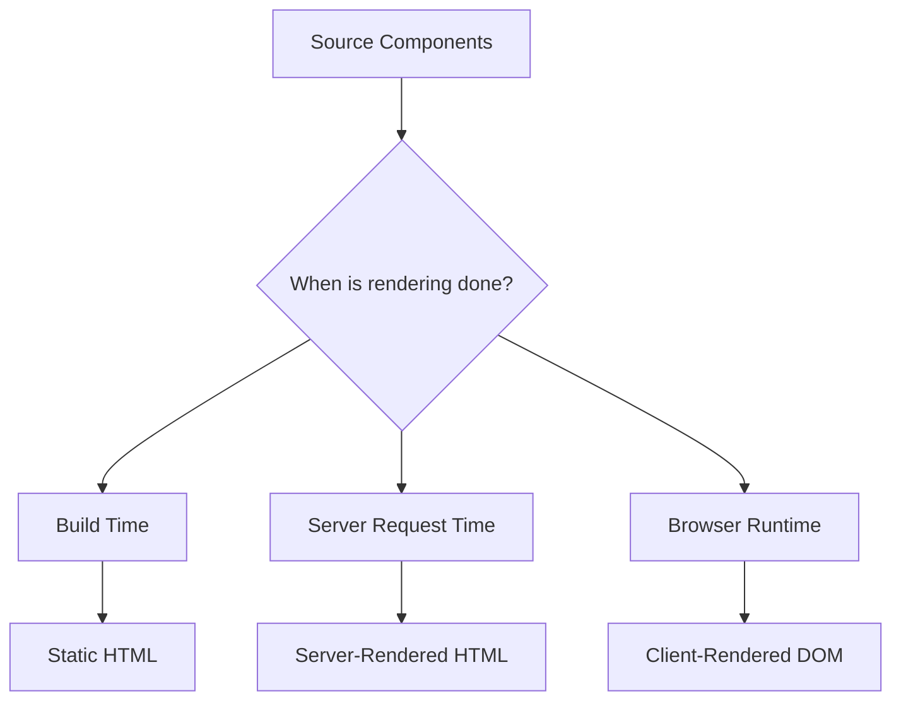

These locations have different costs and capabilities.

---

# 2. Build Time, Request Time, and Browser Time

Suppose a documentation page changes once a week.

We could render it:

```text
every visitor request
```

but that repeats work unnecessarily.

Build-time rendering may be better.

Now suppose a personalized bank account page depends on the currently authenticated user.

Build time cannot know the user's balance.

The page needs runtime data.

Now suppose a highly interactive internal dashboard depends heavily on browser state and APIs.

Client rendering may be appropriate.

The correct topology follows the nature of the page.

---

# 3. The Four Main Questions

When evaluating a route, ask four questions.

## Where does rendering happen?

```text
build system
server
edge runtime
browser
```

## When does it happen?

```text
deployment
request
background regeneration
navigation
state update
```

## What is transferred?

```text
HTML
JavaScript
serialized data
component payload
assets
```

## What must execute in the browser?

```text
nothing
small interactive islands
hydration
full client application
```

These questions are more useful than attaching one label to the entire application.

---

# 4. Client-Side Rendering

In **Client-Side Rendering**, or CSR, the server commonly returns a relatively small HTML shell.

For example:

```html
<!doctype html>
<html>
  <head>
    <title>Admin Portal</title>
  </head>

  <body>
    <div id="app"></div>

    <script
      type="module"
      src="/app.js"
    ></script>
  </body>
</html>
```

The browser then:

1. receives HTML;
2. discovers JavaScript;
3. downloads JavaScript;
4. parses and executes it;
5. starts the application;
6. fetches data if needed;
7. creates the interface.

Conceptually:

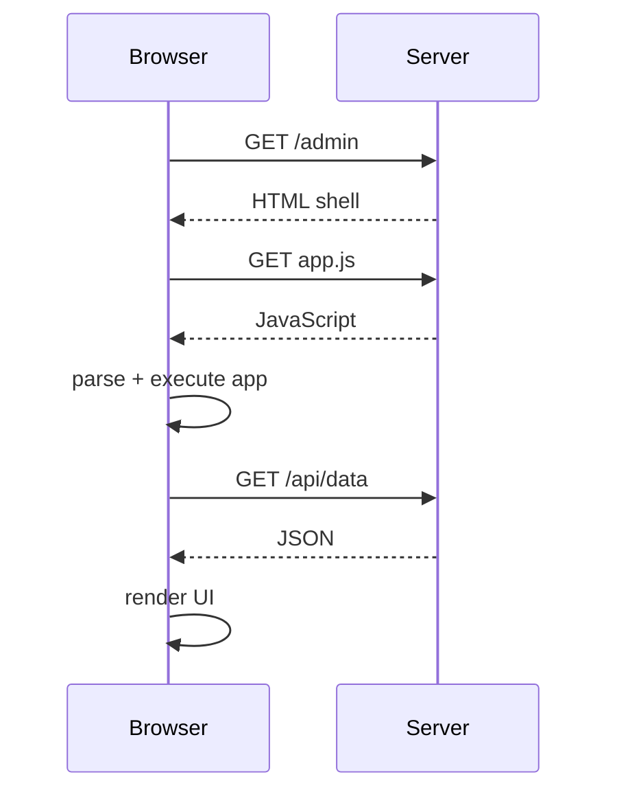

---

# 5. CSR Moves Initial Rendering to the Browser

With CSR, the server may do little UI rendering work.

Instead, the browser becomes responsible for initial application construction.

This can simplify deployment:

```text
HTML
CSS
JavaScript
static hosting
```

But it also means the user may wait on JavaScript before meaningful interface content appears.

The browser path can become:


Every stage can add latency.

---

# 6. Single-Page Applications

CSR is strongly associated with **Single-Page Applications**, or SPAs.

An SPA usually loads one application shell and then handles navigation in the browser.

Instead of:

```text
click link
↓
request entirely new HTML document
```

the application may perform:

```text
click link
↓
client router changes route
↓
load route code/data
↓
update current document
```

Conceptually:

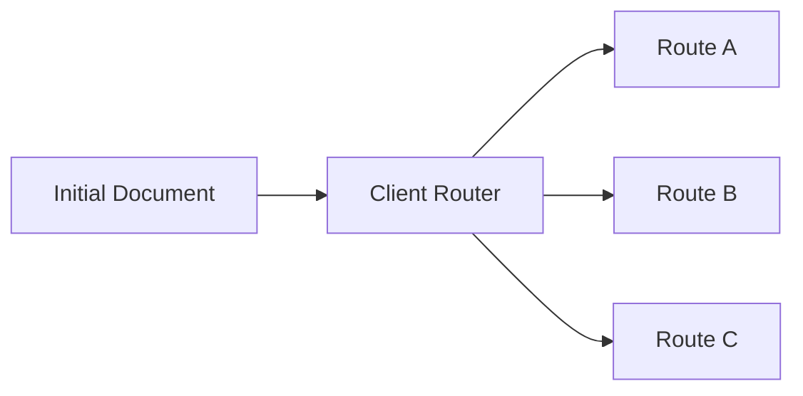

This can create fluid application-style navigation.

---

# 7. CSR Strengths

CSR can be attractive when:

- the application is highly interactive;
- most content is behind authentication;
- public search indexing is not central;
- static hosting simplicity matters;
- browser-only APIs dominate;
- navigation should feel application-like;
- offline operation matters.

Typical examples include:

- administration systems;
- internal dashboards;
- rich editors;
- design tools;
- device-control interfaces.

But these are tendencies, not rules.

---

# 8. CSR Costs

The initial browser may need to do substantial work before useful UI appears.

Costs can include:

- JavaScript download;
- JavaScript parse/compile;
- framework startup;
- route initialization;
- client data fetching;
- initial render.

On powerful desktops with fast networks, the delay may appear small.

On:

- slower phones;
- weak CPUs;
- high-latency connections;

JavaScript startup can become significant.

Performance architecture must consider both network and CPU.

---

# 9. CSR and Search Engines

A simplistic statement would be:

> Client-rendered pages cannot be indexed.

That is too broad.

Some search engines can execute JavaScript.

However, relying entirely on client rendering can still introduce:

- delayed content discovery;
- crawler differences;
- rendering budgets;
- incomplete support from non-search crawlers;
- poorer link preview behavior.

Public content that benefits from immediate HTML often fits server or static rendering better.

Do not treat rendering strategy as an SEO magic switch.

Search quality also depends on:

- semantic HTML;
- metadata;
- content quality;
- crawlability;
- links;
- performance.

---

# 10. Server-Side Rendering

With **Server-Side Rendering**, or SSR, the server renders HTML for a request.

The browser may receive:

```html
<main>
  <h1>Product Catalogue</h1>

  <article>
    <h2>Monitor</h2>
    <p>$250</p>
  </article>
</main>
```

before the browser-side framework starts.

Conceptually:

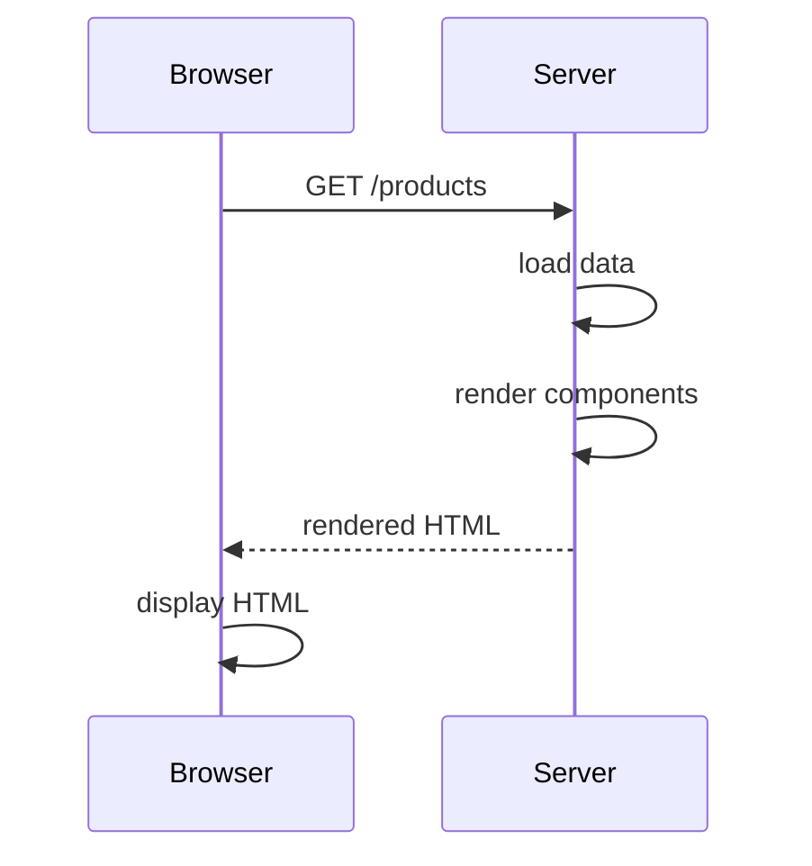

If the page is interactive, JavaScript may arrive afterward and hydrate it.

---

# 11. SSR Changes the Initial Critical Path

Compare CSR:

```text
HTML shell
↓
JavaScript
↓
client data
↓
render
```

with SSR:

```text
request
↓
server data
↓
server render
↓
HTML
↓
browser display
```

SSR can make useful content available before client application startup.

But server work now becomes part of request latency.

We exchanged one set of costs for another.

---

# 12. SSR Does Not Mean “No JavaScript”

This is a common misconception.

An SSR React or Vue application can still send substantial JavaScript.

The server may render the initial HTML.

Then the browser downloads framework/application code to make the interface interactive.

The path becomes:

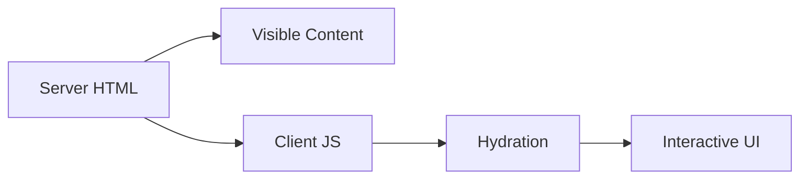

So there are two milestones:

```text
content visible
```

and:

```text
application interactive
```

They are not the same.

---

# 13. SSR Does Not Automatically Improve Every Page

A personalized application route might require:

- authentication;
- database queries;
- API calls;
- rendering;
- server compute.

If all work must complete before the server sends HTML, the response can be slow.

A badly designed SSR application may produce:

```text
browser waits
↓
server waits on database
↓
server waits on API
↓
server renders
↓
browser finally receives HTML
```

Rendering location does not eliminate dependency waterfalls.

---

# 14. Time to First Byte Matters

With SSR, the browser cannot process HTML that has not yet arrived.

If server rendering waits too long, **Time to First Byte** can increase.

A rendering strategy should therefore consider:

- data latency;
- server compute;
- caching;
- streaming;
- geographic placement.

Later, Chapter 15 will measure these effects more formally.

---

# 15. Static Site Generation

**Static Site Generation**, or SSG, moves rendering to build time.

Suppose we have:

```text
/about
/docs/install
/blog/reactivity
```

The build process produces:

```text
about/index.html
docs/install/index.html
blog/reactivity/index.html
```

Conceptually:


No application server needs to render those pages for every request.

---

# 16. SSG Strengths

Static output can be:

- served very quickly;
- distributed through CDNs;
- inexpensive to host;
- resilient to application-server failure;
- cacheable for long periods.

It is especially suitable for content that changes less frequently than it is read.

Examples:

- documentation;
- marketing pages;
- public guides;
- blogs;
- reference content;
- product content that tolerates regeneration.

---

# 17. SSG Moves Cost to Deployment

If a site contains:

```text
100 pages
```

build-time rendering is easy.

If it contains:

```text
5,000,000 product pages
```

generating every page on every deployment may be unrealistic.

So SSG has a different scaling problem:

```text
server request cost
```

is reduced, but:

```text
build cost
```

can grow.

A rendering strategy distributes cost.

It does not make cost disappear.

---

# 18. Static Does Not Mean Non-Interactive

A statically generated page can still load JavaScript and become interactive.

For example:

```text
build time:
generate product HTML

browser:
hydrate add-to-cart component
```

SSG describes when initial HTML is generated.

It does not define whether the browser later executes JavaScript.

This distinction is essential.

---

# 19. Static Data Can Become Stale

Suppose a product page is generated Monday:

```text
price = $250
```

Price changes Tuesday:

```text
price = $275
```

If the page is not regenerated, static HTML remains stale.

Possible strategies include:

- rebuild entire site;
- rebuild affected routes;
- client fetch dynamic fields;
- regenerate pages on demand;
- time-based revalidation.

Modern frameworks provide several hybrid options.

---

# 20. CSR, SSR, and SSG Are About Initial Rendering

A useful comparison:

| Strategy | Initial HTML generated |
|---|---|
| CSR | in browser |
| SSR | on server for request |
| SSG | during build |

But after initial load, all three may still behave like client applications.

For example:

```text
SSG initial page
↓
hydrate
↓
client navigation
↓
client-rendered interaction
```

Do not confuse initial rendering with the entire application lifecycle.

---

# 21. Hydration

**Hydration** connects server-generated HTML with client-side application behavior.

Suppose the server sends:

```html
<button>
  Count: 0
</button>
```

The HTML is visible.

But without client JavaScript, the framework does not yet have:

- component state;
- event handler behavior;
- internal render relationships.

Hydration initializes the client-side application over the existing HTML.

Conceptually:

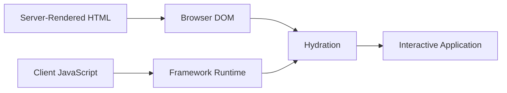

---

# 22. Hydration Reuses Existing HTML

Hydration should not be imagined as:

```text
delete server HTML
rebuild everything
```

The framework expects the existing server HTML to correspond to what the client would initially render.

It attaches runtime behavior and reconciles where necessary.

This is why server and client output need to agree.

---

# 23. Hydration Mismatches

Suppose server rendering produces:

```html
<p>
  Good morning
</p>
```

but the browser's first render expects:

```html
<p>
  Good evening
</p>
```

The outputs differ.

This may produce a **hydration mismatch**.

Common causes include:

- browser-only data;
- current time;
- random values;
- locale/time-zone differences;
- client storage;
- conditional checks using `window`;
- invalid HTML structure.

---

# 24. Browser-Only APIs

Server code cannot directly access browser-specific APIs such as:

```text
window
document
localStorage
```

A component that assumes these exist during server rendering can fail.

Architectures need clear boundaries for browser-only behavior.

For example:

```text
server:
render generic theme

browser:
read stored user theme
apply preference
```

But that can also create visual changes after hydration.

The correct solution depends on the data and user experience.

---

# 25. Deterministic Initial Rendering

A healthy hydration principle is:

> Server and client should agree on the initial render for hydrated regions.

If a value differs by environment, consider:

- transferring it explicitly;
- deferring it until after hydration;
- rendering that component only on the client;
- isolating the dynamic region.

Do not sprinkle environment checks randomly through rendering code.

---

# 26. Hydration Has CPU Cost

SSR can make HTML visible earlier.

But the browser may still need to:

- download client code;
- parse it;
- execute it;
- rebuild framework state;
- attach behavior.

That means an SSR page can be:

```text
visible
```

while still not fully interactive.

Large hydrated applications can therefore have significant startup cost.

---

# 27. The Server-to-Client Handoff

This chapter needs a more precise model than:

> SSR sends everything twice.

That statement is often too simplistic.

The real issue is that server-rendered interactive applications must transfer enough information for the browser to continue correctly.

Depending on the architecture, that may involve:

- rendered HTML;
- JavaScript code;
- serialized data;
- route payloads;
- component/state metadata.

Conceptually:

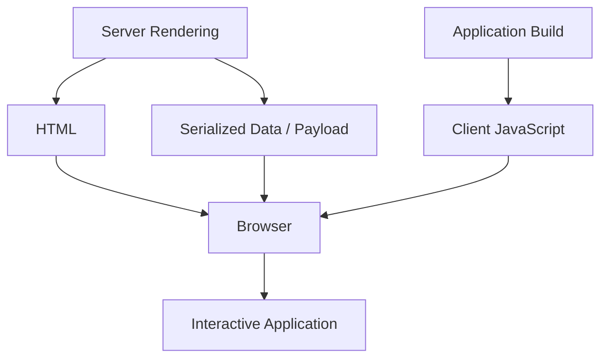

The exact representation varies by framework.

---

# 28. Serialization Cost

Suppose a server loads:

```json
{
  "products": [
    ...
  ]
}
```

and uses it to generate HTML.

The browser may also need some form of that data to initialize client state or navigation behavior.

This can create duplication of representation:

```text
information encoded into HTML
+
information serialized for client runtime
```

But not every SSR system serializes every piece of data in the same way.

Do not teach:

> SSR always sends all data twice.

Instead ask:

> **What state must cross the server/client boundary for this interactive region to continue in the browser?**

---

# 29. Serialization Has Constraints

Not every server-side value can cross directly into the browser.

Simple serializable values are easy:

```text
string
number
boolean
array
plain object
```

Other values may require transformation:

- database connection;
- file handle;
- class instance;
- function closure;
- secret credential.

The server/client boundary should be treated as an architectural boundary.

It should expose data, not arbitrary server runtime state.

---

# 30. Secrets Must Stay Server-Side

Suppose a server component has:

```text
DATABASE_PASSWORD
```

It may use the secret to fetch data.

The secret should not be serialized into client payloads.

A rendering architecture can improve security boundaries when server-only code remains server-side.

But careless serialization can still leak data.

The rule remains:

> Only transfer information the browser is allowed to possess.

---

# 31. Hydration Is Not Free Just Because HTML Exists

Imagine a page with:

```text
1000 interactive components
```

The server may already have rendered all the HTML.

The browser can still spend substantial time:

- loading code;
- reconstructing component relationships;
- initializing event behavior.

This motivates architectures that reduce how much of the page needs client hydration.

---

# 32. Partial Hydration

**Partial hydration** means that only selected interactive regions are hydrated.

Suppose a news article contains:

```text
Header
Article
Related links
Image carousel
Comments widget
Footer
```

Only:

```text
Image carousel
Comments widget
```

may require client JavaScript.

Architecture:

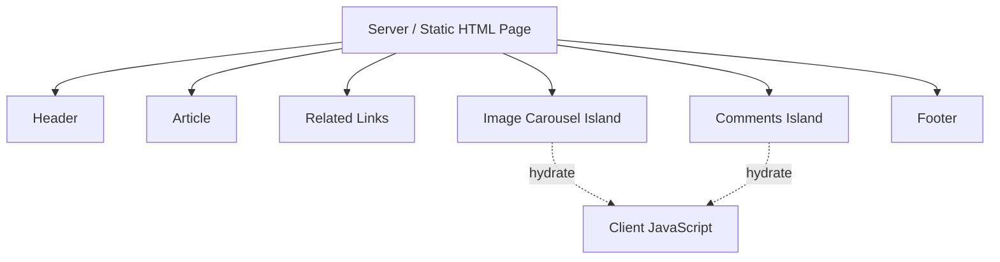

The rest remains ordinary HTML.

---

# 33. Islands Architecture

An **island** is an interactive region embedded within mostly static or server-rendered content.

Think:

```text
sea of HTML
+
small islands of interaction
```

Examples:

- search widget;
- carousel;
- shopping cart indicator;
- comments;
- personalized user menu.

The architecture reduces page-wide client JavaScript.

---

# 34. Islands Change the Default

A traditional SPA often assumes:

```text
everything is part of one client application
```

Islands architecture assumes:

```text
everything is HTML unless interactivity requires JavaScript
```

This inversion can be powerful for content-oriented sites.

But it may be awkward for applications with deep shared client state across the entire page.

---

# 35. Island Hydration Timing

An interactive island does not always need to hydrate immediately.

Possible policies include:

```text
hydrate immediately
hydrate when browser is idle
hydrate when visible
hydrate after media query matches
```

A below-the-fold carousel might not need any JavaScript until the user approaches it.

This reduces startup work.

---

# 36. Islands Have Boundaries

If two islands need constant synchronized state, the architecture may become complicated.

For example:

```text
Filter Island
↔
Product Grid Island
↔
Cart Island
↔
Price Summary Island
```

At some point, a coherent client application may be simpler.

Islands are a tool, not a mandate.

---

# 37. Streaming

Traditional SSR can wait until the entire page is ready before sending it.

Suppose:

```text
header data = 20ms
main dashboard = 100ms
slow analytics = 4 seconds
```

Without streaming:

```text
slowest dependency blocks whole HTML response
```

Streaming allows the server to send completed sections progressively.

Conceptually:

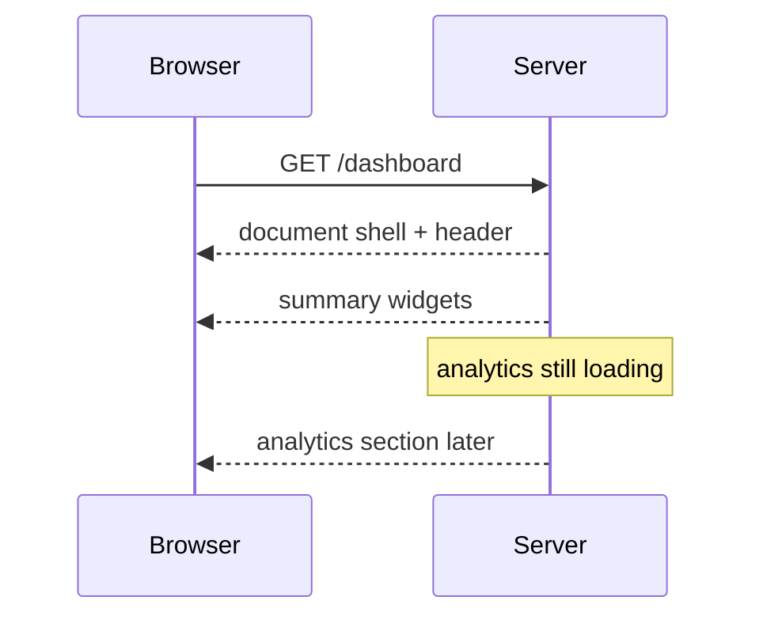

The browser can begin processing earlier content before every server dependency completes.

---

# 38. Streaming Changes Timing, Not Necessarily Total Work

Streaming is sometimes described as if it removes server or hydration cost.

It does not.

It changes **when results become available**.

The application may still need to:

- load slow data;
- render every section;
- transfer client JavaScript;
- hydrate interactive regions.

The benefit is that one slow boundary does not necessarily block everything before it.

---

# 39. Streaming Boundaries Are UX Boundaries

Suppose a dashboard contains:

```text
navigation
account summary
sales graph
recent orders
```

If the graph is slow, we could stream:

```text
navigation
account summary
recent orders
```

first.

The user sees useful structure.

A placeholder represents the graph.

This requires deliberate boundary design.

Too few streaming boundaries:

```text
one slow component blocks too much
```

Too many:

```text
page pops together chaotically
```

The right granularity is a UX decision.

---

# 40. Suspense as a Boundary Concept

React's Suspense provides one way to express:

```text
this part may not be ready yet
```

Conceptually:

```jsx
<Suspense
  fallback={
    <ChartSkeleton />
  }
>
  <SalesChart />
</Suspense>
```

The important architecture is not the component syntax.

It is:

```text
fast region
does not wait for
slow region
```

Other frameworks express similar ideas differently.

---

# 41. Streaming and Loading States

Chapter 9 distinguished:

```text
initial loading
refreshing
partial failure
```

Streaming adds another dimension:

```text
server has started returning route
but one region is still pending
```

Loading UI can therefore exist:

- before any HTML arrives;
- inside a streamed boundary;
- during client navigation;
- during background refresh.

Do not use one global spinner for all of these states.

---

# 42. SSR and Streaming

SSR answers:

> Where is initial HTML rendered?

Streaming answers:

> Must all rendered HTML wait before transmission?

They are related but different concepts.

A server can:

```text
render entire page
then send
```

or:

```text
render progressively
stream chunks
```

Streaming is a delivery strategy layered onto server rendering.

---

# 43. Static Generation and Streaming Can Also Mix

A page shell may be pre-generated.

A personalized region may be rendered dynamically.

For example:

```text
static:
product description
documentation
marketing content

dynamic:
current stock
user discount
account menu
```

Modern architectures increasingly combine output at different times.

The page is not required to have one global rendering mode.

---

# 44. Hybrid Rendering

**Hybrid rendering** means different parts or routes of an application use different rendering strategies.

Example:

```text
/                  → SSG
/blog/**            → SSG
/products/**        → cached server rendering
/account/**         → SSR
/admin/**           → CSR
```

Conceptually:

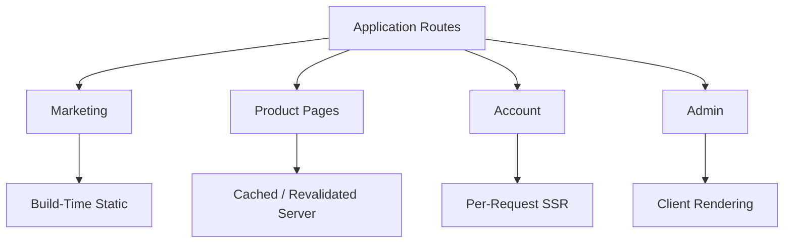

This is often more realistic than one rendering mode for an entire product.

---

# 45. Route-Level Strategy

Rendering is frequently a **route decision**.

Ask per route:

- Is content public?
- Is it personalized?
- How frequently does it change?
- Does it need indexing?
- Is interaction heavy?
- Can it be cached?
- What infrastructure is available?

Then select the topology.

This is a better approach than:

> Our company uses SSR.

---

# 46. Revalidation and Incremental Generation

Between pure SSG and per-request SSR lies a family of strategies.

A route can be:

1. generated;
2. cached;
3. served repeatedly;
4. regenerated after some condition.

Conceptually:

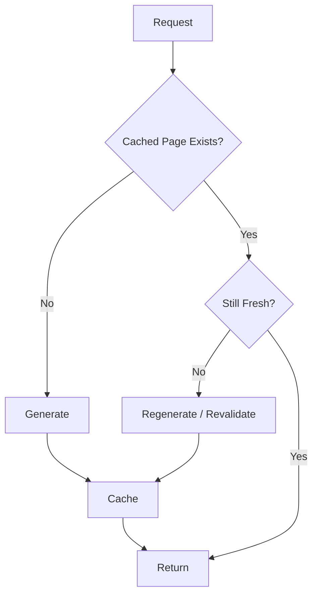

Frameworks use different terminology for variations of this model.

---

# 47. Incremental Static Regeneration

Some systems use the term **Incremental Static Regeneration**, or ISR.

The high-level idea is:

> Static-like cached output can be refreshed without rebuilding the entire site deployment.

This is especially useful for:

- large content catalogs;
- product pages;
- CMS-backed content.

Do not treat ISR as a universal web standard.

It is a framework/platform pattern.

---

# 48. Stale-While-Revalidate Rendering

Another model resembles the caching concept from Chapters 9 and 10.

A cached page is returned quickly.

Meanwhile, the server regenerates a fresher version.

Conceptually:

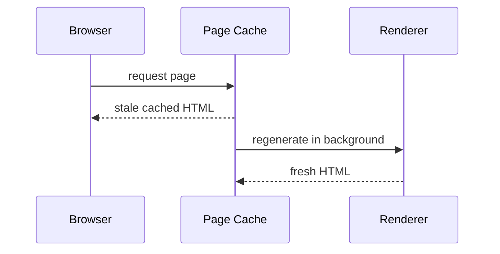

The next visitor receives the updated page.

Again, terminology varies by framework.

---

# 49. Edge Rendering

**Edge rendering** means server-side work runs geographically closer to users through edge infrastructure.

The key point is:

> Edge is primarily a deployment location, not a separate fundamental rendering topology.

The rendering may still be:

```text
SSR
cached rendering
streaming
```

It simply executes in an edge environment.

---

# 50. Edge Runtime Trade-Offs

Running closer to users can reduce network latency.

But edge environments may have:

- runtime restrictions;
- different APIs;
- limited connection models;
- cold-start characteristics;
- database-distance concerns.

Moving rendering closer to the user does not help if the renderer must then contact a database thousands of kilometers away.

Architecture must consider the whole dependency path.

---

# 51. Rendering Near the Data vs Near the User

Suppose:

```text
user → edge renderer = 20ms
edge renderer → database = 300ms
```

Compare:

```text
user → regional server = 90ms
server → database = 5ms
```

The second architecture may be faster overall.

Deployment geography should follow data relationships, not marketing terminology.

---

# 52. React Server Components

**React Server Components**, or RSC, introduce a component type that executes outside the client application environment.

A Server Component can perform work such as:

- reading from a database;
- reading files;
- calling internal services;
- using server-only libraries.

Its implementation does not need to be included in the client bundle merely because its rendered result appears on the page.

This is distinct from ordinary SSR.

---

# 53. SSR and Server Components Are Not the Same Thing

This distinction is important.

SSR is about:

> generating HTML on the server.

Server Components are about:

> defining components whose execution remains outside the client bundle and whose result crosses a server/client component boundary.

A system can combine:

```text
Server Components
+
SSR
+
streaming
+
Client Components
```

These mechanisms solve different problems.

---

# 54. Server Components Can Run at Different Times

The word “Server” can cause confusion.

A Server Component may execute:

- at build time;
- on a server for each request;
- during another framework-controlled server operation.

The defining characteristic is not:

```text
runs on every HTTP request
```

It is:

```text
does not become ordinary client component code
```

The framework determines when and where it executes.

---

# 55. Server Components Can Reduce Client JavaScript

Suppose rendering Markdown requires a large library.

Traditional client rendering:

```text
download Markdown parser
download sanitization library
run both in browser
```

A Server Component can run those libraries outside the browser and send only the result.

Conceptually:


This can reduce client bundle size.

---

# 56. Client Components

Interactive browser behavior still needs client-side code.

Examples include components using:

- browser state;
- event handlers;
- Effects;
- DOM APIs;
- local interaction.

A modern React framework may therefore divide the tree:

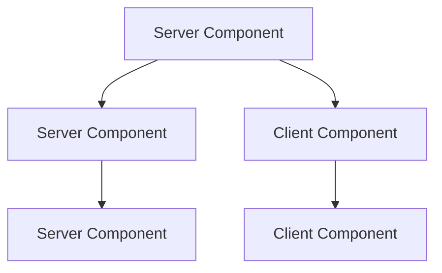

The boundary affects what code and data cross into the browser.

---

# 57. Server/Client Boundaries Are Architectural Boundaries

If almost every component is marked client-side, much of the server-component benefit disappears.

If interactive responsibilities are kept near their true owners, more code can remain server-only.

This resembles Chapter 8's state principle:

> Keep client responsibility as local as practical.

Not every wrapper, layout, and formatter needs browser execution.

---

# 58. Data Can Be Loaded Near Server Rendering

A server-side component can often access data closer to the server environment.

Instead of:

```text
browser
→ public API
→ server
→ database
```

architecture may allow:

```text
server component
→ database/service
```

This can reduce client-side request waterfalls.

But direct data access must still respect:

- authentication;
- authorization;
- caching;
- transaction rules.

Server rendering does not bypass security architecture.

---

# 59. The Server Component Payload

Frameworks using Server Components transfer more than ordinary HTML.

They may send a structured representation describing server-rendered component results and relationships that the client framework can merge with client-side components.

The exact wire format is framework-specific.

The important architectural point is:

> **Server and client component systems need a handoff representation that is not simply “HTML plus nothing else.”**

Do not teach internal protocol details as stable application knowledge.

---

# 60. Server Components and Hydration

Server Components themselves do not hydrate as ordinary client components because their implementation does not execute in the browser.

But Client Components in the resulting application still need client runtime behavior.

So an RSC application can reduce hydration scope without eliminating client hydration entirely.

Conceptually:

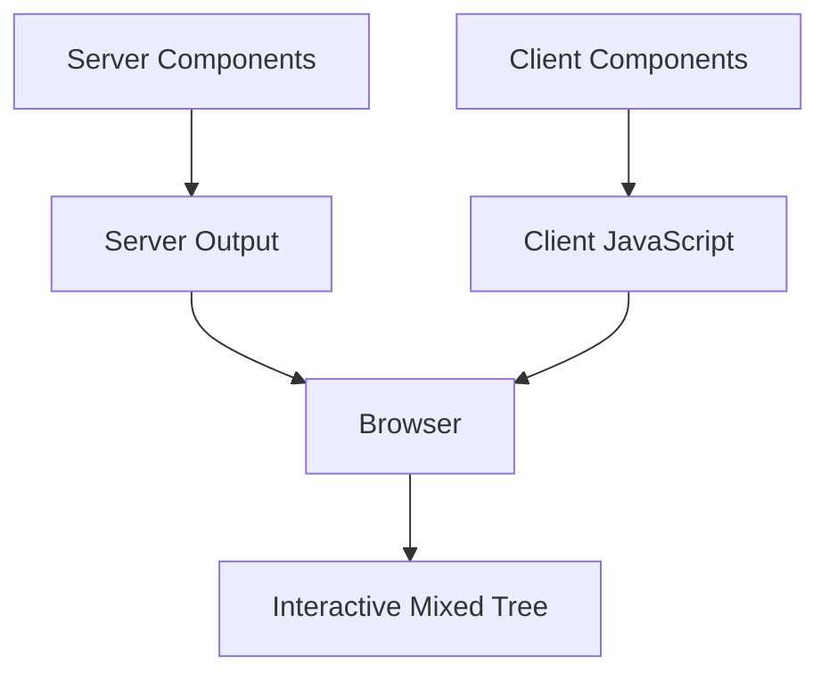

---

# 61. Next.js as a Case Study

Modern Next.js provides a useful example of combining several rendering concepts.

Its App Router can involve:

- Server Components;
- Client Components;
- server rendering;
- static generation;
- streaming;
- caching;
- revalidation;
- route-level behavior.

The lesson is not:

> Learn every Next.js rendering flag.

The lesson is:

> A modern framework can treat rendering as a composition of strategies rather than one global mode.

---

# 62. Next.js Public and Private Routes

A product might use:

```text
marketing pages
→ statically generated

product pages
→ cached/revalidated

account
→ personalized server rendering

complex editor
→ substantial client component tree
```

All can exist inside one framework.

That is hybrid architecture.

---

# 63. Nuxt as a Case Study

Nuxt provides a Vue-oriented example.

A Nuxt application can use:

- universal/server rendering;
- client-side rendering;
- prerendering;
- per-route rules;
- SWR-style caching;
- incremental/static regeneration patterns;
- edge deployment.

Again, architecture can differ route by route.

---

# 64. Nuxt Universal Rendering

In universal rendering, Vue code participates on both server and client.

A simplified lifecycle:

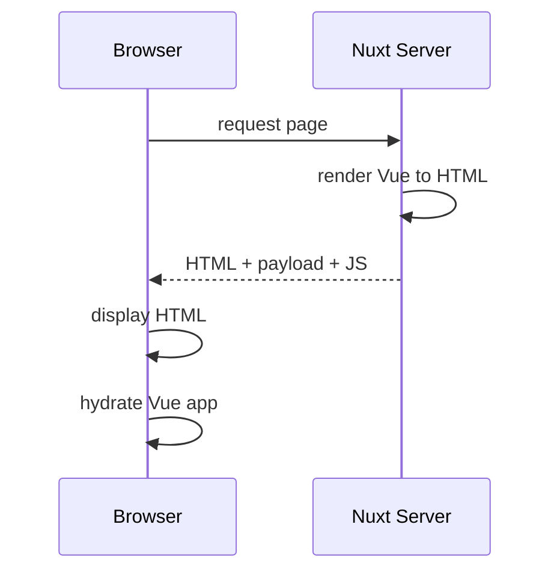

The page gains immediate HTML and later client interactivity.

---

# 65. Nuxt Hybrid Rules

Conceptually, routes might use rules such as:

```text
/               → prerender
/products/**    → revalidate/cached
/blog/**        → static/cached
/admin/**       → client-only
```

The specific configuration syntax can evolve.

The durable concept is:

> Route characteristics determine rendering policy.

---

# 66. Frameworks Should Not Become the Mental Model

A reader should be able to move between:

```text
Next
Nuxt
Astro
another future framework
```

and still ask:

```text
Where does rendering happen?
When does it happen?
What is cached?
What is serialized?
What hydrates?
What remains server-only?
```

Those questions survive framework changes.

---

# 67. Hydration Payload Overhead

Suppose a server renders a complex table.

The browser receives:

- HTML for rows;
- JavaScript for interaction;
- some serialized state needed to continue.

This may be entirely worthwhile.

But it has transfer and CPU cost.

Rendering architecture should consider the **total delivered experience**, not merely:

```text
HTML response size
```

or:

```text
JavaScript bundle size
```

in isolation.

---

# 68. The “Double Data” Oversimplification

Developers sometimes say:

> SSR duplicates everything because data is in HTML and JSON.

That can happen in some architectures.

But it is not a law of SSR.

Different systems may:

- serialize route data;
- embed only selected state;
- stream structured component payloads;
- keep some data server-only;
- refetch on the client;
- avoid hydration for static regions.

Teach the underlying cost:

> **Server-to-client handoff may require multiple representations of some information.**

Then inspect the actual framework and route.

---

# 69. Streaming Does Not Eliminate Handoff Cost

Suppose streaming sends page sections earlier.

The browser may still need:

- client JavaScript;
- serialized state;
- hydration.

Streaming improves **delivery timing**.

It does not inherently remove:

- JavaScript execution;
- hydration;
- serialization;
- client component code.

Avoid treating streaming as a universal hydration solution.

---

# 70. Server Components Change the Handoff Shape

Server Components can keep some code and computation entirely server-side.

This can reduce:

- client bundle size;
- duplicated client fetching;
- hydration scope.

But the mixed tree still requires:

- server/client boundary representation;
- client code for interactive components.

The architecture has changed—not disappeared.

---

# 71. Resumability

**Resumability** proposes a different server-to-client transition.

Traditional hydration broadly reconstructs enough client runtime state to continue the application.

Resumability tries to serialize execution relationships so the browser can continue from server-produced state without replaying the whole component initialization path.

Conceptually:

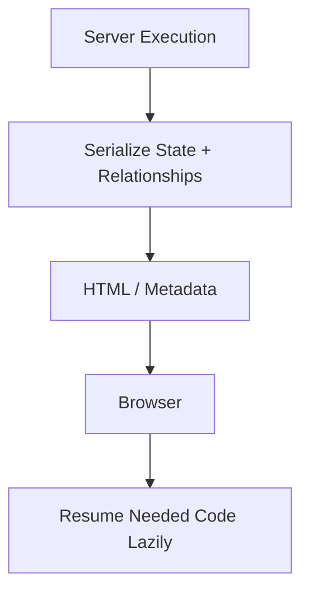

This is an awareness-level concept.

---

# 72. Hydration vs Resumability

A simplified comparison:

### Hydration

```text
server renders
↓
browser downloads code
↓
framework reconstructs client application
↓
interactivity
```

### Resumability

```text
server renders
↓
execution relationships serialized
↓
browser resumes relevant behavior when needed
```

Real implementations contain many more details.

The conceptual difference is enough for architectural awareness.

---

# 73. Qwik as a Resumability Example

Qwik is a representative framework built around resumability.

Its architecture aims to:

- serialize relevant execution state;
- avoid eagerly running large amounts of application code;
- lazy-load behavior near the moment it is needed.

The durable lesson is not Qwik syntax.

It is that hydration is not the only possible server/client continuation model.

---

# 74. Resumability Has Constraints

Serialization becomes a central architectural requirement.

Not every arbitrary runtime object can be paused, serialized, and resumed.

Applications may need to structure:

- closures;
- state;
- dependencies;
- event handlers

in forms the framework can preserve.

So resumability moves complexity rather than making all complexity disappear.

---

# 75. Rendering Topologies as a Continuum

Instead of separate boxes, imagine a continuum.

```mermaid
flowchart LR
    A[Mostly Browser] --> B[CSR]
    B --> C[SSR + Hydration]
    C --> D[Server Components]
    D --> E[Partial Hydration / Islands]
    E --> F[Resumability]
    F --> G[Mostly Server / HTML]
```

This diagram is conceptual, not a ranking.

Different approaches distribute:

- code;
- data;
- compute;
- interactivity

differently.

---

# 76. Choosing a Rendering Strategy

Suppose we have four routes.

### Marketing homepage

Characteristics:

- public;
- changes weekly;
- content-heavy;
- light interaction.

Likely fit:

```text
SSG / prerender
+
small interactive islands
```

### Product catalogue

Characteristics:

- public;
- frequently updated;
- search/filter;
- indexable.

Possible fit:

```text
cached SSR / revalidation
+
client interaction
```

### Account page

Characteristics:

- personalized;
- authenticated;
- dynamic.

Possible fit:

```text
per-request server rendering
or
CSR after authenticated shell
```

### Rich internal editor

Characteristics:

- highly interactive;
- large browser state;
- not public.

Possible fit:

```text
CSR / SPA-heavy client application
```

There is no requirement that these routes use the same topology.

---

# 77. A Route Decision Matrix

| Question | Pushes Toward |
|---|---|
| Public mostly-static content? | SSG |
| Personalized on every request? | SSR |
| Heavy browser interactivity? | CSR / client components |
| Large server-only dependencies? | server components |
| Only a few interactive regions? | islands / partial hydration |
| Slow independent server regions? | streaming |
| Huge content catalogue? | incremental/cached generation |
| Offline-first application? | stronger client execution |

These are signals, not deterministic rules.

---

# 78. Personalization

Personalization reduces cacheability.

Suppose homepage HTML contains:

```text
Welcome, Polla
```

Now output differs by user.

A whole-page shared CDN cache becomes difficult.

Alternative architecture:

```text
static/cacheable shell
+
dynamic account island
```

or:

```text
server-render personalized whole page
```

The right solution depends on how much of the page is personalized.

---

# 79. Cacheability as an Architectural Resource

Rendering strategy and caching are deeply related.

Static output is easy to cache.

Per-user output is harder.

A route with:

```text
95% shared content
5% personalized content
```

may benefit from isolating the personalized region.

This can improve:

- cache hit rate;
- server cost;
- latency.

---

# 80. Authentication and Rendering

Authenticated pages introduce questions such as:

- Can the HTML be publicly cached?
- Does the server need session access?
- Should user data be embedded in HTML?
- Does the client fetch after authentication?
- Can server components access protected data?

Security constraints can dominate rendering choices.

Chapter 13 will revisit this.

---

# 81. Error Handling Across Topologies

CSR errors can happen during:

- code loading;
- API fetching;
- browser rendering.

SSR errors can happen during:

- server data loading;
- rendering;
- serialization.

Streaming adds:

- region-specific server failures after earlier HTML already arrived.

Hybrid applications need layered error boundaries.

There is no single “page failed” state.

---

# 82. Route Loading Across Topologies

Chapter 8 discussed route-level loading.

Rendering topology changes what “loading” means.

### CSR

```text
load JS
load data
render
```

### SSR

```text
wait for server response
then hydrate
```

### Streaming SSR

```text
receive shell
receive sections progressively
hydrate interactive parts
```

### SSG

```text
HTML usually ready immediately
dynamic client regions may still load
```

Design loading UX according to actual architecture.

---

# 83. Navigation After Initial Load

Initial rendering and later navigation may differ.

A server-rendered application may perform client-side navigation after hydration.

For example:

```text
first visit
→ SSR

later route click
→ fetch framework payload
→ client updates route
```

So measuring only the first page load does not describe the full application experience.

---

# 84. Full Document Navigation Still Has Value

Modern applications do not always need SPA navigation.

Traditional navigation provides:

- simple browser semantics;
- natural document lifecycle;
- strong isolation;
- less persistent client state.

For content-heavy sites, multi-page navigation may remain excellent.

Do not assume:

```text
SPA navigation
```

is automatically more modern or superior.

---

# 85. Progressive Enhancement and Rendering

A server-rendered form can work:

```text
without JavaScript
```

Then JavaScript can enhance:

- inline validation;
- pending state;
- partial navigation.

This architecture reduces dependence on client startup.

Rendering topology and progressive enhancement are closely related.

---

# 86. Performance Is Multi-Dimensional

A rendering strategy may improve one metric while hurting another.

For example:

SSR may improve:

- early content display.

But increase:

- server compute;
- TTFB;
- hydration CPU.

CSR may reduce server cost.

But increase:

- initial JS dependency;
- startup delay.

SSG may make delivery extremely fast.

But increase:

- build time;
- staleness complexity.

Never compare rendering strategies on one performance number.

---

# 87. JavaScript Budget

One of the strongest rendering questions is:

> How much JavaScript must this page send and execute?

A static article might need:

```text
almost none
```

A spreadsheet editor may justifiably require substantial JavaScript.

Performance architecture should match interaction density.

Do not send an entire application runtime merely because one button needs behavior.

---

# 88. HTML Is Already a Runtime Format

A common mistake is to treat HTML as a temporary placeholder until JavaScript takes over.

But the browser already knows how to:

- render text;
- navigate links;
- submit forms;
- focus controls;
- provide semantics;
- load media.

Rendering architecture should use native browser capabilities where possible.

This connects back to Chapters 1 and 2.

---

# 89. Server Work Has Operational Cost

SSR requires compute somewhere.

At scale:

```text
1 request
→ one render
```

multiplied by:

```text
millions of requests
```

can become expensive.

Caching can reduce repeated rendering.

Static generation can eliminate request-time rendering.

Hybrid architecture lets expensive rendering be reserved for routes that need it.

---

# 90. Build Work Has Operational Cost

SSG can shift computation to deployment.

Huge static sites may experience:

- long builds;
- large artifact counts;
- slow invalidation;
- deployment complexity.

Incremental generation and on-demand revalidation exist partly to manage this trade-off.

Again:

> Rendering work moves. It does not vanish.

---

# 91. Client Work Has Device Cost

CSR shifts computation to user devices.

That can reduce server cost.

But the user pays through:

- bandwidth;
- CPU;
- battery;
- memory.

A cheap server architecture can create an expensive user experience.

Architecture should consider who bears the cost.

---

# 92. The Rendering Cost Triangle

A useful model:

```mermaid
flowchart TD
    A[Rendering Cost] --> B[Build Infrastructure]
    A --> C[Server Infrastructure]
    A --> D[User Device]

    B --> E[SSG-heavy]
    C --> F[SSR-heavy]
    D --> G[CSR-heavy]
```

Hybrid architectures distribute work across all three.

The ideal distribution depends on the application.

---

# 93. Content Freshness

Another major axis is:

```text
How quickly must published changes become visible?
```

### Rarely changes

SSG fits well.

### Changes every hour

Revalidation may work.

### Changes every request

SSR may fit.

### Changes continuously after load

Client/server live data may be required.

Rendering and real-time architecture intersect.

---

# 94. User-Specific State

Another axis:

```text
Does output depend on the current user?
```

If no:

```text
shared caching becomes easier
```

If yes:

```text
request-time or client-time personalization becomes more likely
```

But component-level isolation may preserve cacheability for the rest of the page.

---

# 95. Interaction Density

Ask:

> How much of this page actually requires application JavaScript?

A documentation page:

```text
2%
```

A design editor:

```text
95%
```

Those pages should probably not use the same client strategy.

Islands and server components both attempt, in different ways, to prevent non-interactive content from unnecessarily increasing client application cost.

---

# 96. Practical Treatment: One Application, Several Topologies

Imagine a product platform with:

```text
/
marketing home

/products
public catalogue

/products/P-42
public product details

/account
personalized account

/admin
internal management interface
```

We will reason about each separately.

---

# 97. Home Page

Requirements:

- public;
- content-driven;
- changes weekly;
- one newsletter form;
- one carousel.

A strong candidate:

```text
static generation
+
small interactive islands
```

Architecture:

```mermaid
flowchart TD
    A[Build] --> B[Static Homepage HTML]
    B --> C[Browser]

    C --> D[Static Content]
    C --> E[Newsletter Island]
    C --> F[Carousel Island]
```

Most visitors avoid unnecessary application JavaScript.

---

# 98. Product Catalogue

Requirements:

- public;
- products change during the day;
- filters and pagination;
- search visibility matters.

Possible approach:

```text
cached server rendering
+
revalidation
+
client-side filter navigation
```

The first request gets useful HTML.

Later interactions may use client navigation.

---

# 99. Product Detail

Requirements:

- shared product content;
- stock changes frequently;
- user-specific discount possible.

A hybrid design:

```text
static/cached:
name
description
images

dynamic:
stock
user price
cart action
```

Conceptually:

```mermaid
flowchart TD
    A[Product Page] --> B[Shared Cached Content]
    A --> C[Dynamic Stock]
    A --> D[Personalized Price]
    A --> E[Cart Client Component]
```

This avoids making the entire page uncacheable because of small dynamic regions.

---

# 100. Account Page

Requirements:

- authenticated;
- personalized;
- private;
- moderate interactivity.

Possible design:

```text
server render protected data
+
hydrate interactive account controls
```

or:

```text
authenticated shell
+
client queries
```

Choose based on:

- security model;
- infrastructure;
- caching;
- latency.

---

# 101. Admin Application

Requirements:

- authenticated;
- highly interactive;
- complex tables/forms;
- no public indexing requirement.

CSR may be completely reasonable.

The application can still use:

- server APIs;
- route-level lazy loading;
- client caching.

Do not force SSR into a route whose benefits are minimal.

---

# 102. Next.js Comparative Example

The same architecture might be expressed in Next through a mixture of:

- static Server Component routes;
- cached/revalidated data;
- request-time server work;
- Client Components;
- Suspense streaming.

The exact framework APIs will evolve.

Our architecture should not depend on memorizing all of them.

---

# 103. Nuxt Comparative Example

The Vue implementation might use:

- prerendered routes;
- universal rendering;
- route rules;
- cached responses;
- client-only admin routes.

The topology remains recognizable.

That is the value of learning the concepts before framework configuration.

---

# 104. A Rendering Topology Diagram

A mature application can look like:

```mermaid
flowchart TD
    A[Application] --> B[Static Routes]
    A --> C[Cached Dynamic Routes]
    A --> D[Personalized SSR Routes]
    A --> E[Client-Heavy Routes]

    B --> F[Small Islands]
    C --> G[Streaming Dynamic Regions]
    D --> H[Server + Client Components]
    E --> I[SPA Runtime]
```

There is no architectural requirement that one strategy dominate.

---

# 105. Decision Checklist

For every route, ask:

### Is the content public?

If yes, server/static HTML may be valuable.

### How often does it change?

This affects static generation and revalidation.

### Is it user-specific?

This affects caching and request-time rendering.

### How interactive is it?

This affects client JavaScript needs.

### Does it need browser-only APIs?

Some parts may need client-only execution.

### Can the output be cached?

Caching can dramatically reduce server cost.

### Are data dependencies slow?

Streaming may improve progressive delivery.

### Can interaction be isolated?

Islands or client boundaries may reduce hydration.

### How much state must cross to the browser?

Inspect serialization.

### What happens after initial navigation?

Consider subsequent route behavior too.

---

# 106. Common Rendering Smells

## Entire site forced into CSR because one page is interactive

Likely over-broad.

## Entire application SSR because “SSR is faster”

Not necessarily.

## Every component marked client-side

Server boundaries may be lost.

## Static page ships a huge framework bundle

Client JavaScript may be unnecessary.

## Personalized region prevents caching the entire page

Consider isolation.

## Slow widget blocks all SSR HTML

Consider streaming boundary.

## Same remote data fetched on server and immediately fetched again on client

Inspect handoff and cache architecture.

## Hydration mismatches fixed with random client-only checks

The initial render model may be wrong.

---

# 107. Hydration Mismatch Is Usually a Modeling Signal

A mismatch warning is often not merely a nuisance to suppress.

It may reveal that:

- server and client use different inputs;
- environment-dependent values were rendered too early;
- state was not serialized;
- component boundaries are incorrect.

Treat mismatch as architecture feedback.

---

# 108. Avoid Browser Detection During Render

Code like:

```js
const isBrowser =
  typeof window !==
    "undefined";
```

inside component rendering can create different initial outputs.

Sometimes it is necessary.

Often it indicates the need for:

- client-only component boundary;
- effect-time browser access;
- explicit server/client value transfer.

Make environment boundaries obvious.

---

# 109. Dates and Time Zones

A classic mismatch:

```text
server:
23 September 10:00 UTC

browser:
23 September 13:00 Baghdad
```

If both environments format independently, initial HTML can differ.

Possible solutions:

- render stable machine value then localize later;
- send user time zone to server when known;
- isolate client-only formatting.

The right choice depends on UX.

---

# 110. Random Values

This is unsafe during hydrated initial rendering:

```js
Math.random()
```

if server and client execute independently.

IDs and generated values should be deterministic or framework-managed when they participate in initial markup identity.

Again, hydration correctness depends on deterministic initial output.

---

# 111. Streaming and Accessibility

Progressive rendering should preserve:

- meaningful heading order;
- stable focus;
- understandable loading states;
- sensible announcements.

A streamed page that visually “pops in” without semantic structure may be confusing to assistive-technology users.

Performance and accessibility should not be separated.

---

# 112. Streaming and Layout Stability

Fallbacks should approximate the eventual content size where practical.

Otherwise:

```text
small placeholder
↓
large component arrives
↓
layout jumps
```

Streaming UX should work with the layout principles from Chapter 3 and the performance principles of Chapter 15.

---

# 113. SSG and Content Publishing

Static rendering fits content pipelines especially well.

Workflow:

```mermaid
flowchart LR
    A[Markdown / CMS] --> B[Build]
    B --> C[HTML]
    C --> D[CDN]
    D --> E[Reader]
```

This is one reason static-site approaches remain powerful even in the age of rich frontend frameworks.

---

# 114. Rendering Topology and Deployment

Rendering strategy affects deployment requirements.

### CSR

May need only:

```text
static hosting
```

### SSG

Needs:

```text
build system
+
static hosting
```

### SSR

Needs:

```text
runtime renderer
+
scaling
+
monitoring
```

### Edge SSR

Needs:

```text
edge-compatible runtime
+
compatible data access
```

Architecture and operations are connected.

---

# 115. Rendering Topology and Failure Modes

Static page failure:

```text
usually deployment/build problem
```

SSR failure:

```text
can happen per request
```

CSR failure:

```text
may happen during browser startup
```

Hybrid applications need monitoring across:

- build;
- server;
- browser.

Chapter 17 will revisit observability across these layers.

---

# 116. Out of Scope

This chapter deliberately does not attempt to teach:

- framework-specific routing APIs in full;
- React Server Components wire protocol internals;
- React Fiber implementation;
- Vue server-renderer internals;
- edge-provider-specific deployment configuration;
- advanced CDN cache-key engineering;
- framework source code;
- search-engine optimization as a specialty;
- Qwik implementation internals.

The goal is architectural understanding.

---

# Misconceptions to Leave Behind

## “CSR means no server.”

No.

The server may still provide APIs, authentication, files, and business logic.

CSR means initial UI rendering is primarily performed in the browser.

---

## “SPA and CSR are identical.”

Not exactly.

SPAs commonly use CSR, but routing architecture and rendering topology are separate concepts.

---

## “SSR means the page does not need JavaScript.”

No.

Interactive SSR applications often hydrate client JavaScript afterward.

---

## “SSR always makes a page faster.”

No.

It can improve early HTML delivery but also adds server latency and may still require substantial hydration.

---

## “SSG means the site cannot be interactive.”

No.

Static HTML can still hydrate or load interactive islands.

---

## “Static means always fresh.”

No.

Static output can become stale and needs regeneration policy.

---

## “Hydration rebuilds the DOM from scratch.”

Not normally.

Hydration attaches client runtime behavior to matching server-rendered markup.

---

## “Hydration mismatch is just an annoying warning.”

No.

It often indicates that server and client initial rendering assumptions differ.

---

## “SSR always sends all data twice.”

No.

Some architectures duplicate representations of some state, but actual server-to-client handoff varies.

Inspect what is serialized.

---

## “Streaming removes hydration.”

No.

Streaming changes when server output arrives.

Client interactivity may still require JavaScript and hydration.

---

## “Server Components are just SSR.”

No.

SSR generates HTML on the server.

Server Components define components that remain outside the ordinary client component bundle.

They can be combined.

---

## “A Server Component always runs on every HTTP request.”

No.

Frameworks may execute Server Components at build time or request time depending on configuration.

---

## “If a framework supports Server Components, the client needs no JavaScript.”

No.

Interactive Client Components still require browser code.

---

## “Islands are automatically better than SPAs.”

No.

They are especially useful where interactivity is sparse.

Highly integrated interactive applications may fit a coherent client app better.

---

## “Edge rendering is a new rendering mode.”

Not fundamentally.

It is primarily server rendering or related work deployed closer to users.

---

## “Edge is always faster.”

No.

Data-source distance and runtime restrictions can dominate.

---

## “Resumability is just faster hydration.”

Not conceptually.

Resumability attempts to avoid reconstructing the client application through ordinary hydration.

---

## “Hybrid rendering means the architecture is inconsistent.”

No.

Different routes often have legitimately different requirements.

Hybrid rendering can reflect those differences explicitly.

---

# Chapter Summary

Rendering architecture asks:

```text
where does UI work happen?
when does it happen?
what crosses the network?
what must run in the browser?
```

Client-Side Rendering performs initial interface work primarily in the browser.

Its simplified path is:

```mermaid
flowchart LR
    A[HTML Shell] --> B[JavaScript]
    B --> C[Client Data]
    C --> D[Browser Render]
```

Server-Side Rendering performs initial component rendering on a server.

```mermaid
flowchart LR
    A[Request] --> B[Server Data]
    B --> C[Server Render]
    C --> D[HTML]
    D --> E[Browser]
```

Static Site Generation moves rendering to build time.

```mermaid
flowchart LR
    A[Build] --> B[Static HTML]
    B --> C[CDN]
    C --> D[Browser]
```

Interactive SSR and SSG pages may still require hydration.

Hydration connects client runtime behavior to server-generated HTML.

Server and client must agree on the initial hydrated output.

Server-to-client handoff may involve:

- HTML;
- serialized data;
- JavaScript;
- structured framework payloads.

This can create transfer and execution overhead, but it should not be reduced to the inaccurate rule:

```text
SSR always sends everything twice
```

Streaming allows server-rendered regions to arrive progressively rather than waiting for the slowest dependency.

It improves timing.

It does not automatically eliminate hydration or serialization.

React Server Components provide a different server/client boundary.

Server Component implementation code can remain outside the browser bundle, while interactive Client Components still execute in the browser.

Hybrid rendering allows routes or regions to use different strategies.

A realistic application may combine:

```text
SSG
SSR
cached regeneration
CSR
streaming
server components
interactive islands
```

Islands and partial hydration reduce client JavaScript by activating only selected interactive regions.

Resumability represents another model where serialized execution relationships allow the browser to continue without traditional eager hydration.

The chapter's central principle is:

> **Rendering is not one mode selected for an entire application. It is the deliberate distribution of work across build infrastructure, server infrastructure, network transfer, and user devices.**

---

# Review Questions

1. What four questions help evaluate a rendering topology?

2. What is Client-Side Rendering?

3. What steps commonly occur before a CSR interface becomes visible?

4. What is a Single-Page Application?

5. Why can CSR be appropriate for internal applications?

6. What are the main initial-load costs of CSR?

7. Why is “CSR cannot be indexed” an oversimplification?

8. What is Server-Side Rendering?

9. How does SSR change the initial request path?

10. Why does SSR not imply zero client JavaScript?

11. What is the difference between visible content and interactive content?

12. How can SSR increase Time to First Byte?

13. What is Static Site Generation?

14. Why can SSG be inexpensive to serve?

15. What scaling problem can very large SSG sites encounter?

16. Why does SSG not imply a non-interactive page?

17. How can static HTML become stale?

18. What do CSR, SSR, and SSG primarily describe?

19. What is hydration?

20. Why does hydration expect server and client initial output to match?

21. What can cause hydration mismatches?

22. Why are browser-only APIs relevant to SSR?

23. What is deterministic initial rendering?

24. Why does hydration have CPU cost?

25. What is the server-to-client handoff?

26. Why can serialization create payload overhead?

27. Why is “SSR sends everything twice” too simplistic?

28. Why should secrets not cross the server/client boundary?

29. What is partial hydration?

30. What is an island?

31. When is islands architecture especially useful?

32. Why can many tightly coupled islands become awkward?

33. What is streaming?

34. How does streaming change the SSR timeline?

35. Why does streaming not necessarily reduce total work?

36. Why are streaming boundaries also UX boundaries?

37. How is Suspense related to streaming conceptually?

38. How are SSR and streaming different concepts?

39. What is hybrid rendering?

40. Why is rendering often best decided per route?

41. What is incremental regeneration conceptually?

42. What is stale-while-revalidate rendering?

43. Why is edge rendering primarily a deployment concern?

44. Why is rendering closer to users not always faster?

45. What is a React Server Component?

46. Why are Server Components not the same as SSR?

47. Can a Server Component run at build time?

48. How can Server Components reduce client JavaScript?

49. What is a Client Component?

50. Why are server/client component boundaries architectural boundaries?

51. Why can server-side data access reduce browser request waterfalls?

52. What is the conceptual role of a Server Component payload?

53. Do Server Components eliminate all hydration?

54. Why are Next.js and Nuxt useful as architectural case studies rather than conceptual foundations?

55. What is hydration payload overhead?

56. How does streaming affect handoff cost?

57. What is resumability?

58. How does resumability conceptually differ from hydration?

59. Why does resumability introduce serialization constraints?

60. Why is one rendering topology rarely best for every route?

61. How does personalization affect cacheability?

62. Why can isolating personalized regions improve caching?

63. How can authentication influence rendering choices?

64. Why should errors be considered differently in CSR, SSR, and streaming?

65. Why can first-load rendering differ from later navigation behavior?

66. Why are full-document navigations still valuable?

67. How does progressive enhancement relate to rendering topology?

68. Why is rendering performance multidimensional?

69. What is a JavaScript budget?

70. Why should interaction density influence rendering choice?

71. How are build, server, and user-device costs related?

72. Why does content freshness influence rendering choice?

73. Why should architecture inspect actual serialization rather than rely on slogans?

74. Why should hydration mismatch be treated as a modeling signal?

75. How do rendering choices influence deployment infrastructure?

---

# End-of-Chapter Practical Lab — Render One Product Platform Four Ways

Create:

```text
chapter-11-rendering/
├── csr/
├── ssr/
├── ssg/
├── hybrid/
└── notes/
```

The goal is not to build four complete production applications.

The goal is to observe where work occurs.

Use the same conceptual product data and interface in each version.

---

## Stage 1 — Build the CSR Version

Create an HTML shell:

```html
<div id="app"></div>
```

Load the application JavaScript.

Fetch product data from a simulated API.

Use DevTools to record:

```text
HTML arrival
JavaScript download
API request
first product content
```

Draw the timeline with Mermaid.

---

## Stage 2 — Build an SSR Version

Render the product list to HTML on a development server.

The initial response should contain product names.

Then hydrate one interactive control.

Compare:

```text
initial HTML
client JavaScript
time until interaction
```

with the CSR version.

---

## Stage 3 — Create a Hydration Mismatch Deliberately

Render a value based on:

```text
current time
```

independently on server and browser.

Observe the mismatch.

Fix it using one coherent strategy:

- serialized value;
- client-only rendering;
- deterministic initial value.

Document why the fix works.

---

## Stage 4 — Inspect the Server-to-Client Handoff

Record:

```text
HTML bytes
serialized data/payload
JavaScript bytes
```

Identify which product information appears in more than one representation.

Do not simply state:

```text
SSR duplicates everything
```

Describe the actual handoff.

---

## Stage 5 — Build the SSG Version

Generate product HTML during build.

Serve it from a static server.

Stop the application rendering server entirely.

Confirm that the page still loads.

Then change product data without rebuilding.

Observe staleness.

---

## Stage 6 — Add Static Interactivity

Add:

```text
Add to cart
```

to the static page.

Hydrate only the interactive code required for cart behavior where your chosen tooling permits.

Explain how static generation and browser interactivity coexist.

---

## Stage 7 — Simulate Revalidation

Implement or conceptually simulate:

```text
cached generated page
↓
expiry
↓
regenerate
```

Draw the lifecycle.

Explain how this differs from rebuilding the entire site.

---

## Stage 8 — Add Streaming

Create one deliberately slow server region:

```text
Recommendations
```

Render the rest of the product page immediately.

Use a streaming-capable framework or server environment.

Observe that the slow region no longer blocks all earlier UI.

---

## Stage 9 — Design Streaming Boundaries

Try two extremes.

### One boundary

```text
entire product page
```

### Many tiny boundaries

```text
title
price
stock
description
recommendations
```

Compare the user experience.

Choose a sensible grouping.

---

## Stage 10 — Compare Next.js Conceptually

Map the product application into:

```text
Server Components
Client Components
streaming boundaries
static/cached routes
```

You do not need to reproduce every Next API.

Draw the architecture.

---

## Stage 11 — Compare Nuxt Conceptually

Map the same application into:

```text
prerendered routes
universal routes
client-only admin route
cached/revalidated product route
```

Again, focus on topology.

---

## Stage 12 — Build a Hybrid Route Plan

For:

```text
/
 /products
 /products/:id
 /account
 /admin
```

assign one primary rendering strategy to each.

Write one paragraph justifying every choice.

---

## Stage 13 — Isolate Personalization

Assume product content is shared but the user receives a personalized discount.

Design:

```text
shared cacheable product content
+
dynamic personalized price
```

Draw the boundary.

Explain how the design improves cacheability.

---

## Stage 14 — Explore Islands

Create or diagram an article page containing:

```text
static article
search widget
carousel
comments
```

Hydrate only the interactive regions if your tooling supports islands.

Record which JavaScript the page loads initially.

---

## Stage 15 — Delay Island Hydration

Configure one low-priority interactive region to activate only when:

```text
visible
```

or:

```text
browser idle
```

Observe the effect on initial JavaScript work.

---

## Stage 16 — Explore Resumability Conceptually

Do not build a complete resumable framework.

Draw two diagrams:

### Hydration

```text
server render
→ HTML
→ client code
→ rebuild runtime relationships
→ interactive
```

### Resumability

```text
server render
→ serialized runtime relationships
→ browser
→ resume behavior lazily
```

Explain the conceptual difference without claiming that one approach universally wins.

---

## Stage 17 — Build a Rendering Decision Matrix

For these routes:

```text
marketing page
documentation
public product catalogue
account
admin editor
live dashboard
```

record:

```text
public?
personalized?
update frequency?
interaction density?
cacheable?
chosen topology?
```

Use the matrix to justify architecture.

---

## Stage 18 — Measure JavaScript Responsibility

For each version estimate or inspect:

```text
JavaScript shipped
JavaScript executed
HTML delivered
server work
build work
```

The purpose is not precise benchmarking.

The purpose is to see where work moved.

---

## Stage 19 — Draw the Final Hybrid Architecture

Create one Mermaid diagram showing:

```text
build time
server request time
cache/CDN
browser
server components
client components
streamed boundaries
```

Use arrows to show what crosses each boundary.

---

# Key Terms

**Rendering topology** — the architectural distribution of UI rendering work across build time, server execution, delivery, and browser execution.

**Client-Side Rendering (CSR)** — generating the primary application interface in the browser through client JavaScript.

**Single-Page Application (SPA)** — an application that commonly maintains one document and handles route transitions through client-side application logic.

**Server-Side Rendering (SSR)** — generating initial page HTML in a server environment in response to a request or equivalent runtime operation.

**Static Site Generation (SSG)** — generating HTML during a build or prerendering process rather than rendering it for every request.

**Prerendering** — generating route output ahead of a user's request.

**Hydration** — initializing client framework behavior on top of server-generated or statically generated HTML.

**Hydration mismatch** — disagreement between server-generated HTML and the client's expected initial render.

**Deterministic rendering** — rendering where equivalent inputs produce compatible server and client initial output.

**Server-to-client handoff** — the transfer of HTML, data, code, and framework metadata needed to continue an application from server output into browser execution.

**Serialization** — converting application data or state into a transferable representation.

**Streaming** — progressively sending server-rendered output as regions become ready rather than waiting for the whole page.

**Suspense boundary** — a rendering boundary that can display fallback UI while dependent content is not yet ready.

**Partial hydration** — hydrating only selected interactive regions instead of an entire page-wide application.

**Islands architecture** — an architecture where small interactive client regions exist within primarily static or server-rendered HTML.

**Island** — an independently interactive region within an otherwise non-client-heavy page.

**Hybrid rendering** — using multiple rendering strategies across different routes or regions of one application.

**Revalidation** — regenerating or confirming cached rendered output after a freshness condition changes.

**Incremental Static Regeneration (ISR)** — a framework pattern for updating statically cached pages incrementally without rebuilding the entire site.

**Edge rendering** — performing server rendering or related request-time work in geographically distributed edge infrastructure.

**Server Component** — a component whose implementation executes outside the ordinary client application environment and whose result is delivered across a server/client boundary.

**Client Component** — a component intended to execute in the browser for interactive or browser-dependent behavior.

**React Server Components (RSC)** — React's server component model for composing server-executed and browser-executed components.

**Component payload** — a framework-specific structured representation used to transfer server component results and relationships to a client runtime.

**JavaScript budget** — an intentional limit or target for how much client JavaScript a route should download and execute.

**Interaction density** — the proportion and complexity of a page that genuinely requires browser-side application behavior.

**Cacheability** — the degree to which generated output can be reused safely across requests or users.

**Resumability** — an architecture that serializes execution relationships so browser behavior can continue from server-produced state without traditional eager hydration.

**Static hosting** — serving prebuilt files without request-time application rendering.

**Universal rendering** — a model, commonly used in Vue/Nuxt terminology, where an application participates in both server rendering and client hydration.

---

# Closing Perspective

Rendering architecture used to sound like a binary decision.

```text
server
or
client
```

That model is no longer sufficient.

Modern web applications can distribute work across:

```text
build system
server
cache
CDN
edge runtime
browser
```

A route may be static.

Another may be personalized.

One section may stream.

One component may remain server-only.

Another may hydrate immediately.

A third may not load JavaScript until it becomes visible.

The most useful question is therefore not:

> Which rendering mode does our application use?

It is:

> **Where should this specific work happen?**

Static content can be rendered before the user arrives.

Personalized content can be rendered when the user requests it.

Heavy server-only libraries can remain outside the browser.

Interaction can be restricted to the components that need it.

Slow server regions can stream independently.

Highly interactive tools can remain client-heavy where that model is appropriate.

The architecture is a placement problem.

We are placing:

- computation;
- data;
- code;
- caching;
- interactivity.

Every placement has a cost.

Build-time rendering costs deployment work.

Request-time rendering costs server resources.

Client rendering costs user bandwidth and CPU.

Serialization costs bytes.

Hydration costs browser execution.

Caching introduces freshness rules.

Streaming introduces boundary design.

The best topology is the one whose costs match the route's actual requirements.

The next chapter changes focus from **where application code executes** to **how that code is transformed and delivered**.

We will examine:

- package management;
- module graphs;
- bundling;
- transpilation;
- code splitting;
- Vite;
- Rollup;
- esbuild;
- development servers;
- linting;
- formatting;
- source maps;
- and collaborative developer workflows.

That is the subject of Chapter 12: **Modern Build Systems, Development Tooling & Team Workflows**.
