# Chapter 12 — Modern Build Systems, Development Tooling & Team Workflows

Modern front-end source code is rarely delivered to users exactly as developers write it.

A development project may contain:

- TypeScript;
- JSX or Vue Single-File Components;
- CSS modules;
- images;
- imported fonts;
- JSON;
- environment-specific configuration;
- third-party packages;
- dynamically loaded routes;
- tests;
- lint rules;
- formatting rules.

The browser, however, ultimately needs deployable assets such as:

```text
HTML
CSS
JavaScript
images
fonts
```

Between those two worlds sits the **front-end toolchain**.

That toolchain may:

- resolve modules;
- transform TypeScript;
- transform JSX;
- process framework files;
- serve modules during development;
- replace changed modules without reloading the whole page;
- bundle modules for production;
- remove unused code;
- split code into chunks;
- minify output;
- fingerprint asset filenames;
- generate source maps;
- run linting;
- run type checking;
- run tests;
- coordinate multiple packages in a workspace.

This sounds like one system.

It is usually several systems cooperating.

A useful first model is:

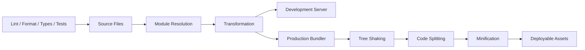

The goal of this chapter is not to memorize configuration files.

Configuration syntax changes too quickly.

Instead, we will understand:

- what each tool is trying to accomplish;
- why development and production pipelines differ;
- how module graphs drive modern tooling;
- how Vite fits into the architecture;
- how Rollup, esbuild, Rolldown, and Turbopack differ conceptually;
- how packages and workspaces affect application structure;
- how a team builds a repeatable development workflow.

The central principle is:

> **Build tools should make source code convenient for developers while producing predictable, efficient artifacts for browsers and deployment systems.**

---

# 1. The Toolchain Exists Because Source Code and Delivery Code Have Different Needs

Developers want code that is easy to:

- organize;
- read;
- reuse;
- type-check;
- test;
- refactor.

Browsers need code that is:

- valid for the target browsers;
- loadable through URLs;
- efficient to transfer;
- efficient to execute;
- correctly connected to assets.

These goals overlap, but they are not identical.

A project may contain:

```ts
import {
  calculateTotal
} from "./pricing";

import styles
  from "./Checkout.module.css";

import logoUrl
  from "./logo.svg";
```

During development, this organization is useful.

For production, the toolchain may transform it into output such as:

```text
/assets/index-D7Kx29.js
/assets/checkout-B83Lm2.css
/assets/logo-A9Jf4.svg
```

The development structure remains readable.

The delivery structure becomes optimized.

---

## 1.1 Development and production optimize for different things

A development environment prioritizes:

```text
fast startup
fast feedback
clear errors
good source maps
incremental updates
```

A production build prioritizes:

```text
small output
fewer unnecessary requests
long-term caching
compatibility
stable asset references
```

These priorities can conflict.

For example, aggressive minification is useful in production.

It is annoying during development.

Bundling thousands of files may help production loading.

Bundling the entire application before every development edit may slow feedback.

Modern tooling therefore often has distinct development and production strategies.

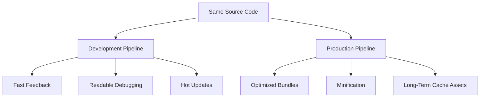

---

# 2. Package Management Is the Beginning of the Toolchain

Before bundlers and dev servers, most projects depend on packages.

A `package.json` file describes a Node/JavaScript package or application.

A simplified example:

```json
{
  "name": "catalogue-app",
  "private": true,
  "scripts": {
    "dev": "vite",
    "build": "vite build",
    "test": "vitest",
    "lint": "eslint ."
  },
  "dependencies": {
    "react": "...",
    "react-dom": "..."
  },
  "devDependencies": {
    "vite": "...",
    "typescript": "...",
    "eslint": "..."
  }
}
```

The exact versions are deliberately omitted here.

Book prose should not become obsolete because one package released a minor update.

---

## 2.1 Dependencies and development dependencies

A useful conceptual distinction is:

### Runtime/application dependency

The project needs it as part of the application or package contract.

Examples may include:

```text
React
Vue
router
runtime validation library
```

### Development dependency

The project needs it to develop, validate, or build the application.

Examples may include:

```text
TypeScript
Vite
ESLint
Vitest
Playwright
```

For deployed browser applications, the final build usually contains selected output from these dependency graphs rather than shipping `node_modules` as a folder.

---

## 2.2 Semantic version ranges are constraints, not exact installations

A package declaration may describe an allowed version range.

The lockfile records the resolved dependency graph used by the package manager.

Conceptually:

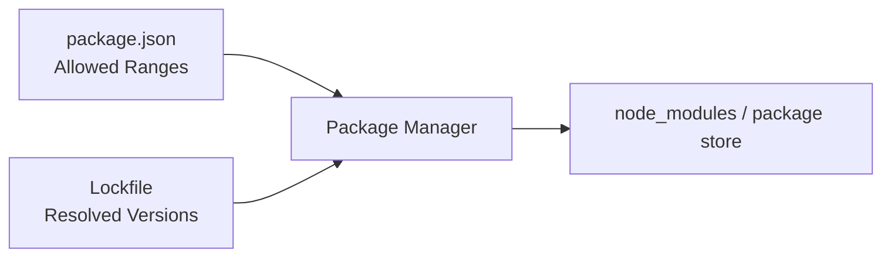

This distinction matters for reproducibility.

Two developers should not casually receive different dependency graphs merely because they installed on different days.

---

## 2.3 Lockfiles belong in application repositories

For ordinary applications, commit the package-manager lockfile.

Examples include:

```text
package-lock.json
pnpm-lock.yaml
yarn.lock
```

The lockfile helps keep:

- local development;
- CI;
- production builds

on a consistent resolved dependency graph.

Do not maintain several package-manager lockfiles accidentally in one repository.

Choose one package-management workflow for the project.

---

## 2.4 Package scripts create a common interface

A team should not require every developer to memorize internal tool commands.

Prefer scripts such as:

```json
{
  "scripts": {
    "dev": "vite",
    "build": "vite build",
    "typecheck": "tsc --noEmit",
    "lint": "eslint .",
    "test": "vitest run",
    "test:e2e": "playwright test"
  }
}
```

Then documentation and CI can use:

```text
npm run build
npm run test
```

or the equivalent package-manager command.

This creates a stable team interface even if the underlying tooling later changes.

---

# 3. ES Modules Are the Structural Foundation

Modern frontend tooling is built around the JavaScript module graph.

A module imports other modules:

```js
import {
  formatPrice
} from "./format-price.js";

import {
  cart
} from "./cart.js";
```

Those modules import others.

The result is a graph.

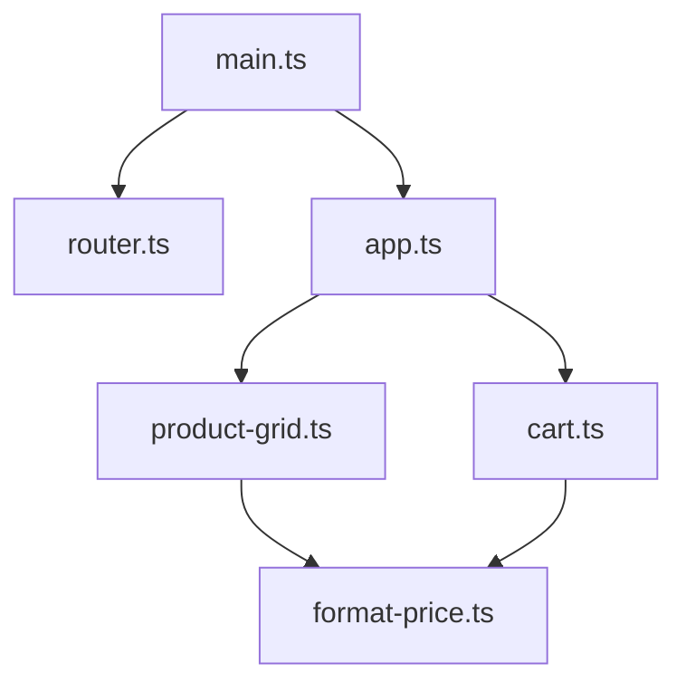

This graph is one of the most important structures in modern tooling.

A build tool can use it to answer:

- Which files are reachable?
- Which dependencies belong together?
- Which code is unused?
- Which modules can become separate chunks?
- Which module changed during development?

---

## 3.1 Static imports are analyzable

Consider:

```js
import {
  calculateTotal
} from "./pricing.js";
```

The dependency is visible from source syntax.

A tool can analyze it without running the application.

This makes possible:

- static dependency graphs;
- tree shaking;
- bundling;
- preloading analysis.

Dynamic loading changes the graph structure.

---

## 3.2 Dynamic imports create asynchronous boundaries

Consider:

```js
const module =
  await import(
    "./reporting.js"
  );
```

The application does not necessarily need `reporting.js` in the initial bundle.

A bundler can create another chunk.

Conceptually:

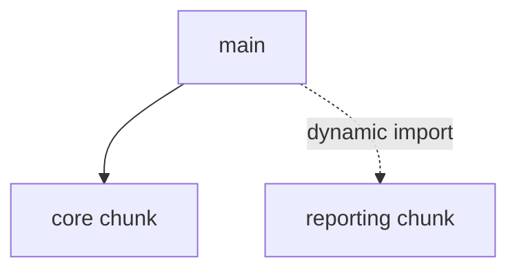

This is the foundation of code splitting.

---

## 3.3 CommonJS still exists

The ecosystem contains older package formats such as CommonJS:

```js
const package =
  require("package");
```

Modern tools frequently need compatibility logic when consuming packages published in different formats.

This is one reason package resolution is more complicated than:

```text
find file
load file
```

The tool may need to consider:

- package exports;
- ESM;
- CommonJS;
- browser conditions;
- server conditions;
- development/production conditions.

---

# 4. Module Resolution

When source contains:

```js
import {
  Button
} from "@company/ui";
```

the tool must determine what file or entry point that import refers to.

This is **module resolution**.

Resolution may inspect:

- relative paths;
- package names;
- aliases;
- package metadata;
- extensions;
- exports maps;
- environment conditions.

A simplified model:

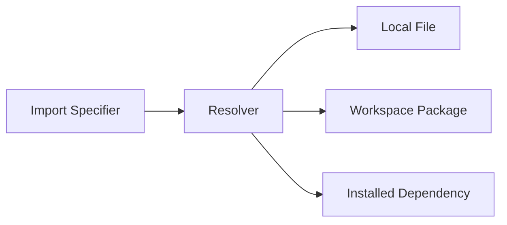

Incorrect resolution can produce:

- duplicate packages;
- browser/server code confusion;
- unexpected package entry points.

---

## 4.1 Aliases can improve architecture—or hide it

A project may define:

```text
@ui/*
@features/*
@domain/*
```

instead of deep relative imports:

```text
../../../../shared/ui/Button
```

This can improve readability.

But aliases should not disguise bad dependency directions.

For example:

```text
shared UI
→ imports checkout business logic
```

is architecturally suspicious regardless of how elegant the alias looks.

Build configuration does not replace dependency architecture.

---

# 5. Transformation

Browsers execute JavaScript.

Developers may write source that requires transformation.

Examples:

- TypeScript syntax;
- JSX;
- newer syntax targeting older browsers;
- framework-specific files.

Conceptually:

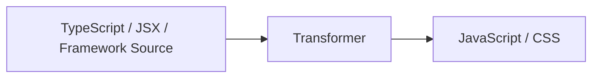

Transformation is not the same as bundling.

A transformer can process one file.

A bundler works across the dependency graph.

---

## 5.1 TypeScript compilation has two jobs that can be separated

TypeScript tooling may perform:

```text
type checking
```

and:

```text
syntax transformation
```

These do not have to be performed by the same tool.

A fast development tool may strip TypeScript syntax quickly.

A separate `tsc --noEmit` process may perform full type analysis.

Architecture:

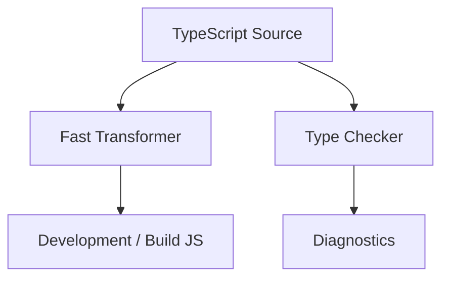

This separation is common in modern toolchains.

---

## 5.2 Transpilation and polyfills are different

A transformer can rewrite syntax.

For example, it may convert newer syntax into older syntax.

But some platform APIs require runtime support.

Transforming:

```js
const value =
  object?.property;
```

is a syntax concern.

Providing a missing:

```text
Promise
fetch
Intl feature
```

may require a polyfill or alternate implementation.

Do not assume transpilation creates every missing web API.

---

# 6. Development Servers

A development server serves the project locally while providing development-specific behavior.

Typical responsibilities include:

- serving source modules;
- transforming files on request;
- error overlays;
- module invalidation;
- HMR;
- proxying API requests;
- serving public assets.

The development server should optimize the edit-feedback loop.

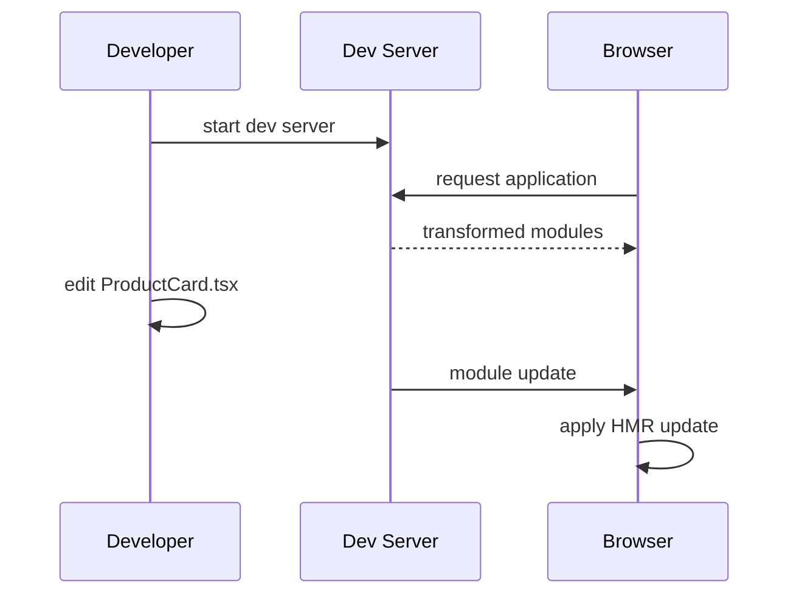

---

# 7. Hot Module Replacement

**Hot Module Replacement**, or HMR, updates changed modules while preserving as much running application state as possible.

Without HMR:

```text
edit file
↓
full page reload
↓
application restarts
↓
developer recreates state
```

With HMR:

```text
edit module
↓
tool identifies affected graph
↓
browser receives update
↓
framework replaces affected module
```

This can dramatically improve development speed.

---

## 7.1 Fast Refresh is framework-aware HMR

React environments often provide **Fast Refresh**, which attempts to preserve component state when edits are compatible.

This is more specific than generic module replacement.

The tool and framework cooperate.

The developer experience goal is:

> Change component code and see the result without losing the entire application session.

---

## 7.2 HMR correctness matters

A development environment that behaves differently from production can hide bugs.

HMR is a development convenience.

Developers must still test:

- clean application startup;
- real route navigation;
- production builds;
- reload behavior.

Do not assume:

```text
worked after HMR
```

means:

```text
works from a clean start
```

---

# 8. Vite as the Reference Development Tool

Vite is our reference build tool because it provides a useful architecture for understanding modern development workflows.

At a conceptual level Vite provides:

- a development server;
- module transformation;
- HMR;
- plugin integration;
- an optimized production build.

During development, its architecture has historically emphasized serving application source modules on demand using native ESM.

Conceptually:

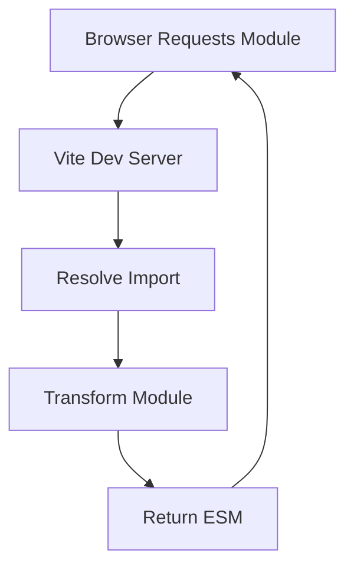

The browser requests what it needs.

The tool does not need to eagerly generate the complete application output before the first development page is served.

---

## 8.1 Dependency pre-bundling

Third-party packages can contain:

- CommonJS;
- many internal ESM files;
- compatibility patterns.

Vite can prepare dependencies so development loading remains efficient.

A conceptual separation is:

```text
application source
→ changes frequently
→ serve/transform on demand

dependencies
→ change rarely
→ prepare efficiently
```

This is an optimization of the development workflow, not application architecture.

---

## 8.2 Vite's architecture has evolved

An older description of Vite was:

```text
development:
esbuild-assisted transformations

production:
Rollup bundling
```

That was historically accurate and explains much of Vite's ecosystem lineage.

In Vite 8, the toolchain changed substantially.

Vite 8 uses **Rolldown**, a Rust-based bundler designed to unify the toolchain more closely. Future Vite releases may change these implementation details.

This is exactly why the book should teach:

```text
dev server
module graph
transform
bundle
plugin system
```

before teaching:

```text
which internal tool performs each operation this year
```

Implementation changes.

The architectural responsibilities remain.

---

## 8.3 Native ESM remains an important mental model

During development, native ESM makes it possible to request modules directly.

For example:

```html
<script
  type="module"
  src="/src/main.ts"
></script>
```

The browser can follow imports.

The development server can transform requested source modules.

This reduces the need for an expensive full initial bundle.

However, extremely large applications can produce many module requests, which is one reason modern tooling continues exploring more bundled or hybrid development approaches.

---

# 9. Production Bundling

Development can favor many small modules.

Production has different constraints.

Suppose the source graph contains:

```text
2,000 modules
```

Shipping all of those as independent nested browser requests may be inefficient.

A bundler groups modules into deployment assets.

Conceptually:

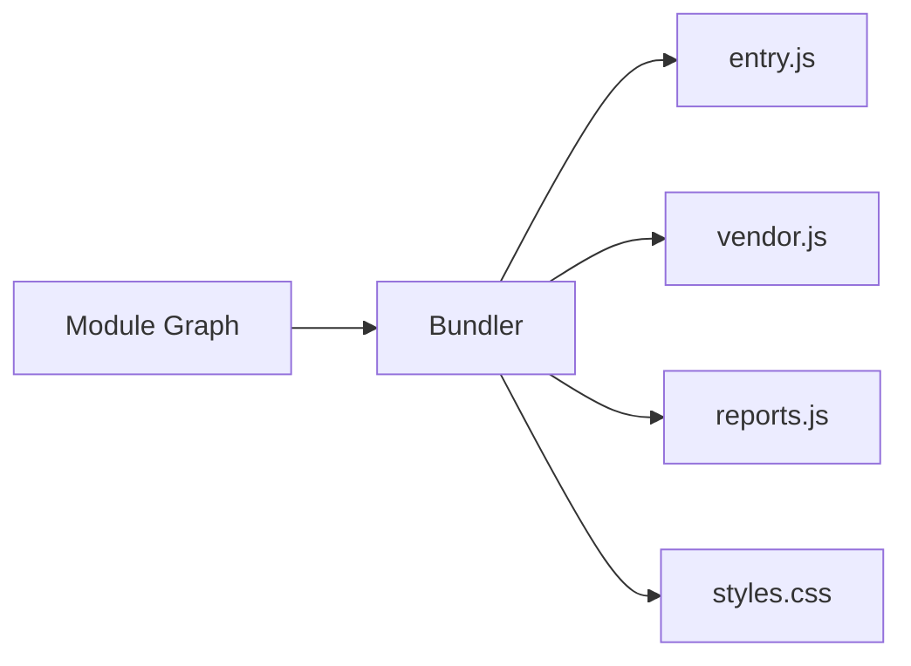

The ideal output depends on:

- route structure;
- dynamic imports;
- caching;
- shared dependencies.

---

# 10. Bundling Is More Than Concatenation

A bundler does not simply join files.

It may:

- resolve modules;
- analyze imports/exports;
- transform syntax;
- remove unreachable code;
- rename symbols;
- split output;
- extract CSS;
- fingerprint assets;
- rewrite URLs.

That requires a graph-aware system.

---

# 11. Tree Shaking

**Tree shaking** removes unused code based on static module analysis.

Suppose:

```js
// math.js

export function add(
  a,
  b
) {
  return a + b;
}

export function multiply(
  a,
  b
) {
  return a * b;
}
```

Application:

```js
import {
  add
} from "./math.js";

console.log(
  add(2, 3)
);
```

A production bundler may omit `multiply` if it can prove it is unused.

Conceptually:

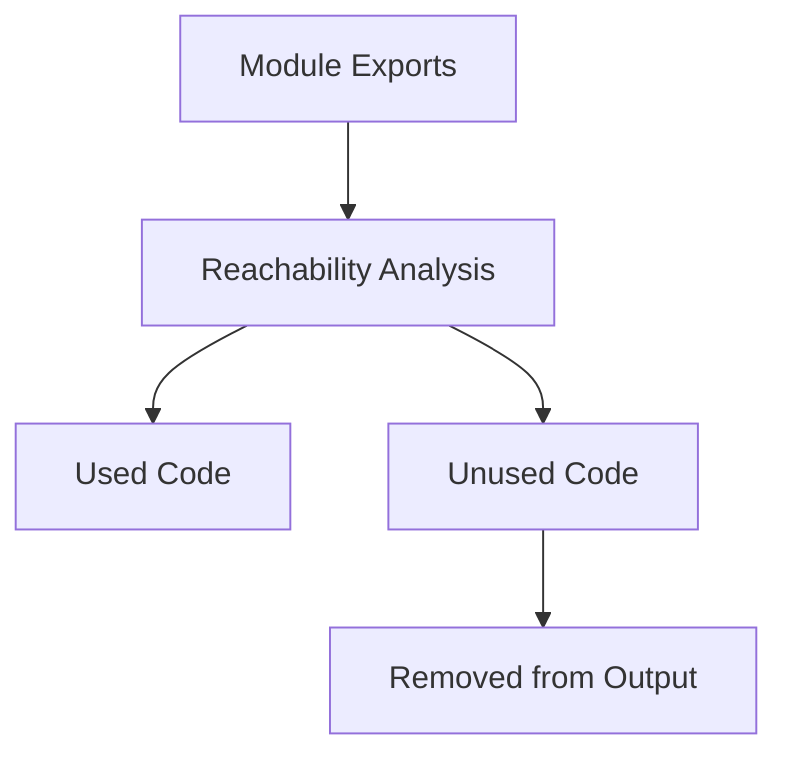

---

## 11.1 Tree shaking depends on analyzable code

Static ES module imports make unused-export analysis easier.

Highly dynamic patterns can make analysis harder.

Package authors also affect tree shaking through:

- module format;
- side-effect declarations;
- export structure.

Do not assume:

```text
unused in my file
```

always means:

```text
removed from production bundle
```

Inspect output when size matters.

---

## 11.2 Side effects matter

Consider:

```js
import "./register-global-handler.js";
```

The imported module may be used only for side effects.

A bundler must not remove it merely because no named value is imported.

Package metadata and analysis help tools distinguish safe removal from required execution.

This is why “tree shaking” is not simply deleting unreferenced text.

---

# 12. Minification

Minification reduces output size.

Possible transformations include:

- removing whitespace;
- shortening local identifiers;
- simplifying expressions;
- removing unreachable code.

Readable source:

```js
function calculateTotal(
  price,
  quantity
) {
  return price * quantity;
}
```

might become something like:

```js
function c(t,n){return t*n}
```

Production users do not need developer-friendly variable names in transferred code.

Developers do.

That is where source maps become important.

---

# 13. Source Maps

A production stack trace may refer to:

```text
app-D7Kx29.js:1:43821
```

That is not useful if the developer wrote:

```text
src/features/cart/calculate.ts:42
```

A source map records relationships between generated output and original source.

Conceptually:

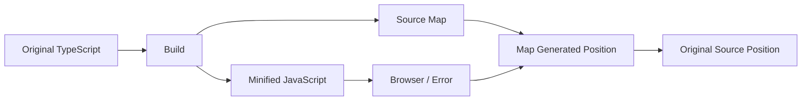

Source maps are essential for debugging transformed code.

---

## 13.1 Production source maps require policy

Teams should decide:

- Are source maps deployed publicly?
- Are they uploaded privately to an error-monitoring platform?
- Are source contents embedded?
- Who can access them?

Source maps can reveal original application structure.

They are useful operational artifacts and should be handled deliberately.

Chapter 17 will return to production error monitoring.

---

# 14. Asset Fingerprinting

A production build may generate:

```text
app-8F3D21.js
styles-112BC9.css
```

where the name contains a content-related hash.

If content changes:

```text
app-8F3D21.js
```

becomes:

```text
app-A91C77.js
```

This supports long-lived browser caching.

Conceptually:

```text
same content
→ same URL

changed content
→ changed URL
```

Now the server/CDN can cache fingerprinted assets aggressively.

---

# 15. Code Splitting

A single huge JavaScript file is simple:

```text
app.js
```

But a user visiting:

```text
/dashboard
```

may not need the code for:

```text
/video-editor
```

Code splitting creates multiple chunks.

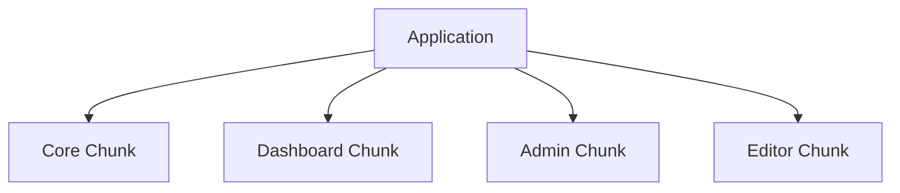

The browser loads chunks when needed.

---

## 15.1 Dynamic imports create explicit split points

Example:

```js
const editor =
  await import(
    "./editor.js"
  );
```

A bundler can place `editor.js` and its unique dependencies in a separate chunk.

Framework routers often use dynamic imports internally or through route APIs to implement route-level lazy loading.

---

## 15.2 Route-level splitting is usually a strong default

Routes already represent meaningful user-navigation boundaries.

For example:

```text
/
 /products
 /reports
 /admin
```

The user may never visit `/admin`.

Loading its code only on demand can reduce initial cost.

This connects Chapter 8 routing with Chapter 15 performance.

---

## 15.3 More chunks are not always better

Splitting every tiny component into a separate network chunk can create:

- request overhead;
- scheduling overhead;
- cache fragmentation;
- waterfall risks.

The goal is not:

```text
maximum number of files
```

It is:

```text
appropriate loading boundaries
```

---

# 16. Shared Chunks

Suppose both:

```text
reports
```

and:

```text
admin
```

use a charting library.

A bundler may create a shared chunk.

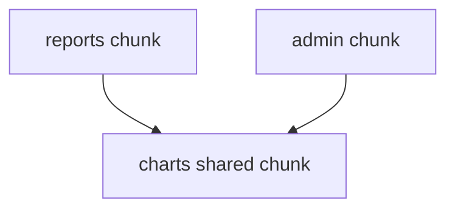

This can avoid duplication.

But it can also create loading dependencies.

Bundler chunk strategy is a trade-off among:

- duplication;
- caching;
- request count;
- route independence.

---

# 17. Preloading and Prefetching Split Code

Code splitting can introduce future-load delay.

If navigation to Reports is highly likely, the application may preload or prefetch the chunk.

This connects directly to Chapter 1's resource-discovery model.

Architecture:

```text
split code
+
smart future loading
```

is often stronger than:

```text
put everything in initial bundle
```

or:

```text
never load anything until click
```

---

# 18. CSS in the Build Pipeline

CSS may enter the graph through:

```js
import "./styles.css";
```

or framework-specific styling systems.

A build tool may:

- resolve CSS imports;
- process modules;
- transform URLs;
- combine files;
- minify output;
- extract production styles.

The CSS architecture from Chapter 3 remains conceptually separate.

A bundler should deliver the styling strategy.

It should not determine the styling architecture for the team.

---

# 19. Asset Imports

Modern tools often allow:

```js
import logoUrl
  from "./logo.svg";
```

The build can:

- copy the asset;
- fingerprint it;
- return the final URL.

Similarly, CSS can reference:

```css
background:
  url("./pattern.png");
```

The build pipeline rewrites the URL appropriately.

This is one reason assets participate in the module/build graph even when they are not JavaScript.

---

# 20. Environment Variables

Build tools often expose selected environment configuration.

Examples:

```text
API base URL
analytics identifier
feature endpoint
```

But frontend environment variables deserve one critical rule:

> **Anything embedded into browser JavaScript is visible to the user.**

A variable named:

```text
SECRET_API_KEY
```

does not become secret because it came from a `.env` file.

If the build injects it into client code, the browser receives it.

---

## 20.1 Build-time and runtime configuration differ

Build-time:

```text
value baked into generated JavaScript
```

Runtime:

```text
value supplied when application runs
```

This distinction affects deployments.

Suppose one build must run in:

```text
test
staging
production
```

If every endpoint is baked at build time, the team may need a separate build per environment.

Runtime configuration can support one immutable artifact deployed to multiple environments.

There is no universal answer.

---

# 21. Vite Production Builds

Vite provides an optimized production build command.

The architectural responsibilities include:

- follow module graph;
- bundle;
- split;
- optimize;
- emit assets.

In the Vite 8 toolchain, Rolldown is the unified bundler foundation. Treat this as a version-specific implementation detail rather than a permanent definition of Vite.

Older projects and ecosystem knowledge may still reference Rollup because Vite's plugin model and history are strongly connected to it.

Readers should understand both:

```text
the current implementation
```

and:

```text
the durable bundling concepts
```

without confusing them.

---

# 22. Rollup

Rollup is a JavaScript module bundler strongly associated with:

- ES module analysis;
- tree shaking;
- code splitting;
- library builds;
- plugin-driven customization.

Conceptually:


Rollup remains important for understanding the ecosystem even when a higher-level tool handles bundling automatically.

---

## 22.1 When would a developer use Rollup directly?

Possible cases include:

- library publishing;
- unusual build pipelines;
- custom output formats;
- specialized plugin workflows.

For ordinary application development, a higher-level tool such as Vite is often more convenient.

Use the highest-level tool that solves the problem cleanly.

---

# 23. esbuild

esbuild is a high-performance build and transformation tool.

It can perform tasks such as:

- bundling;
- TypeScript syntax stripping;
- JSX transformation;
- minification;
- source-map generation.

Its API distinguishes conceptually between:

```text
transform one input
```

and:

```text
build across files
```

This distinction is useful even when another tool embeds or replaces esbuild internally.

---

## 23.1 Why fast native tooling matters

Older JavaScript-based build pipelines sometimes became slow on very large codebases.

Modern tooling increasingly uses:

- Go;
- Rust;

for performance-sensitive parsing, transformation, and bundling.

Examples include:

```text
esbuild
Rolldown
Turbopack
SWC
Oxc
```

The durable lesson is:

> Toolchain implementation performance affects developer feedback loops.

It does not change the semantic responsibility of the build.

---

# 24. Rolldown

Rolldown is a Rust-based bundler associated with the modern Vite toolchain.

Its role is useful as an example of toolchain evolution.

A higher-level system wants:

```text
fast development
+
consistent production behavior
+
shared plugin model
```

Unifying underlying tooling can reduce differences between:

```text
development transform
```

and:

```text
production bundle
```

This matters because dev/prod inconsistencies are a source of bugs.

---

# 25. Turbopack

Turbopack is an incremental Rust-based bundler integrated with Next.js.

Its architecture emphasizes ideas such as:

- one graph across environments;
- incremental computation;
- cached work;
- lazy bundling.

By current Next.js versions, Turbopack is the default bundler for both development and production builds.

The important conceptual model is:

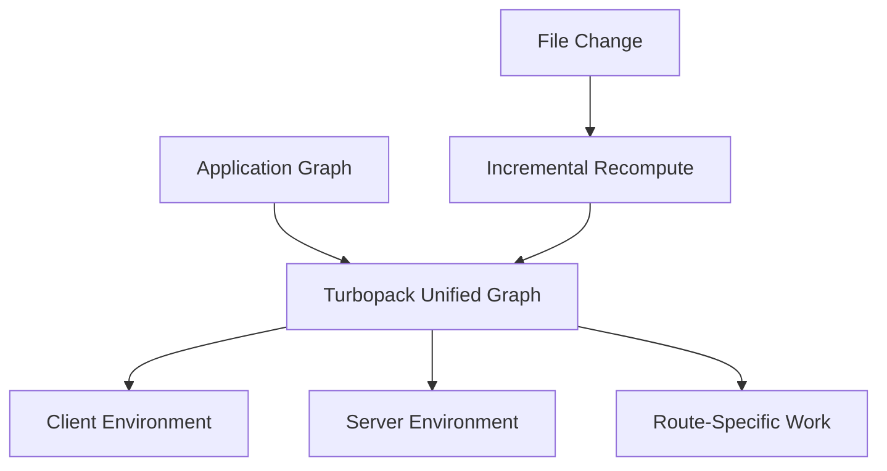

Do not turn this chapter into a Turbopack configuration guide.

Use it to understand another modern strategy for making large application builds incremental.

---

# 26. Vite and Turbopack Solve Related Problems Differently

At a high level:

### Vite development model

Historically centered heavily on:

```text
serve source modules on demand
+
native ESM
+
fast transformations
```

with its architecture now evolving toward a more unified native toolchain.

### Turbopack

Emphasizes:

```text
incremental bundling
+
lazy graph computation
+
multiple execution environments
```

Neither description is a universal performance verdict.

Tool suitability depends on:

- framework;
- project size;
- plugin needs;
- ecosystem;
- deployment model.

---

# 27. The Tool Is Often Chosen by the Framework

In modern projects, developers frequently do not choose a low-level bundler directly.

For example:

```text
Next.js
→ framework manages bundler

Nuxt
→ framework manages Vite integration

Astro
→ framework manages Vite integration
```

This is good abstraction.

Application developers should not rebuild framework build infrastructure unless requirements justify it.

Know what the toolchain does.

Do not configure every layer merely because configuration is possible.

---

# 28. Plugins

Build systems expose plugin mechanisms to extend behavior.

A plugin might:

- transform custom file formats;
- inject virtual modules;
- rewrite imports;
- analyze bundles;
- integrate framework compilation.

Conceptually:

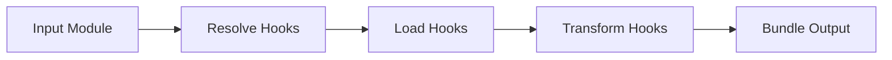

Plugins are powerful.

They also increase coupling to the build system.

Prefer established integrations over bespoke build magic when possible.

---

# 29. Avoid Toolchain Configuration as a Hobby

A mature project can accumulate:

```text
custom loader
custom plugin
custom transformer
custom alias
custom preprocessor
custom Babel rule
custom build script
```

Eventually only one person understands how builds work.

A useful rule is:

> Prefer convention and defaults until the project has a concrete requirement that defaults cannot meet.

Configuration has maintenance cost.

---

# 30. Linting

A linter analyzes source code for problematic patterns.

Examples may include:

- unreachable code;
- suspicious logic;
- framework rule violations;
- accessibility rules;
- unsafe patterns;
- inconsistent imports.

ESLint is a common JavaScript/TypeScript linter.

The important distinction is:

```text
linting
≠
formatting
≠
type checking
≠
testing
```

They overlap but solve different problems.

---

# 31. Formatting

A formatter makes source layout consistent.

It answers questions such as:

```text
spaces?
line wrapping?
quote style?
trailing punctuation?
```

These are usually not the best use of human review time.

Automated formatting reduces style debate.

A formatter should make code consistent.

It should not be treated as proof that the code is correct.

---

# 32. Type Checking

TypeScript type checking verifies static contracts.

It can detect:

- invalid assignments;
- missing properties;
- impossible union handling;
- incorrect generic relationships.

It cannot determine:

- whether product requirements are right;
- whether runtime API data is valid;
- whether an interaction works;
- whether the UI is accessible.

Type checking belongs in the quality pipeline, not as a replacement for other checks.

---

# 33. Testing

Testing tools belong in the development workflow even though Chapter 16 will cover them properly.

At this point, understand the pipeline:


A real team may execute some steps in parallel.

The conceptual point is that the build is only one quality gate.

---

# 34. Local Feedback Should Be Fast

If every save requires:

```text
full lint
full type check
all tests
full production build
```

developers may wait constantly.

A healthy workflow divides:

### Immediate feedback

```text
editor diagnostics
format-on-save
HMR
targeted tests
```

### Pre-commit / pre-push

```text
focused lint
focused tests
```

### CI

```text
complete checks
production build
broader tests
```

Tooling should reinforce the development rhythm rather than interrupt it.

---

# 35. Git Is Part of the Engineering Toolchain

Build tooling is not useful without a reproducible change workflow.

Git provides:

- history;
- branches;
- commits;
- reviewable diffs;
- merge/rebase workflows.

The project should define enough conventions that contributors know:

- where work starts;
- how changes are reviewed;
- what checks must pass;
- how releases are created.

---

# 36. Keep Commits Reviewable

A commit that changes:

```text
feature logic
formatting entire repository
dependency upgrade
folder rename
```

all at once is difficult to review.

Prefer changes with coherent intent.

This makes:

- code review;
- debugging;
- rollback;
- history analysis

more useful.

---

# 37. Formatting Should Not Dominate Diffs

If automatic formatting changes thousands of unrelated lines, the functional change becomes difficult to inspect.

Good team practice includes:

- shared formatter version;
- shared configuration;
- consistent line endings;
- formatting established early.

Tooling should reduce noise.

---

# 38. Generated Files Need a Policy

Some generated output belongs in version control.

Some does not.

Usually application build artifacts such as:

```text
dist/
```

are generated in CI and are not committed.

But generated files such as:

- API clients;
- schema bindings;
- documentation snapshots

may be committed if the team intentionally treats them as source artifacts.

The rule is not:

```text
never commit generated files
```

It is:

> Define who generates them, when, and how drift is detected.

---

# 39. Environment Reproducibility

A build that works only on one developer's laptop is not a reliable build.

A project should reduce environmental assumptions through:

- lockfiles;
- documented runtime versions;
- package scripts;
- CI;
- reproducible configuration.

Possible sources of drift include:

- Node version;
- package manager version;
- native dependencies;
- environment variables;
- OS behavior.

---

# 40. CI as the Shared Verification Environment

Continuous Integration runs checks outside an individual developer machine.

Typical pipeline:

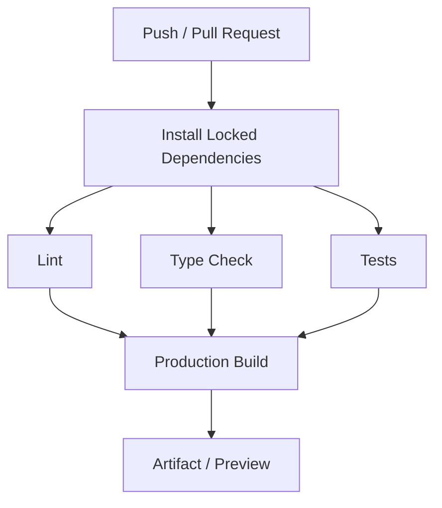

Chapter 17 will extend this into deployment.

For now, understand CI as the place where the team proves:

> The repository can be built and validated from a clean environment.

---

# 41. Build Once, Deploy Predictably

A strong deployment pipeline often prefers:

```text
source commit
↓
one production build
↓
immutable artifact
↓
deploy artifact
```

rather than rebuilding differently on every server.

This reduces questions such as:

```text
Which dependency version built production?
Which environment compiled this asset?
```

Some frameworks require runtime build/platform integration, but the reproducibility principle still matters.

---

# 42. Workspaces

As a repository grows, it may contain multiple packages.

Example:

```text
repo/
├── apps/
│   ├── admin/
│   └── public-site/
├── packages/
│   ├── ui/
│   ├── domain/
│   └── config/
└── package.json
```

A workspace-aware package manager can treat these local packages as part of one managed repository.

Conceptually:

```mermaid
flowchart TD
    A[Workspace Root] --> B[apps/admin]
    A --> C[apps/public-site]
    A --> D[packages/ui]
    A --> E[packages/domain]

    B --> D
    B --> E
    C --> D
```

---

## 42.1 Workspaces solve package coordination

Without workspaces, a developer might need to:

- publish a package;
- install it elsewhere;
- manually link it.

Workspaces let package managers link local packages automatically according to the repository configuration.

This improves:

- shared development;
- dependency management;
- package scripts.

---

## 42.2 Workspace does not automatically mean monorepo architecture

A workspace is a package-management capability.

A **monorepo** is an organizational repository strategy.

They often appear together, but they are not identical concepts.

A monorepo may use workspaces.

A workspace may contain only a few related packages.

---

# 43. Monorepo Benefits

Potential advantages include:

- atomic cross-package changes;
- shared tooling;
- shared types;
- consistent dependency versions;
- easier refactoring across application boundaries.

Example:

```text
change Button API
+
update admin usage
+
update public-site usage
```

can happen in one commit.

---

# 44. Monorepo Costs

Potential costs include:

- larger CI scope;
- complex dependency graphs;
- ownership ambiguity;
- broad build invalidation;
- permission/release complexity.

Tooling may need:

- affected-project detection;
- task caching;
- dependency-aware builds.

Do not adopt a monorepo because large companies use one.

Adopt it when repository-wide coordination benefits the team.

---

# 45. Package Boundaries Should Represent Architecture

A poor package structure might contain:

```text
utils
helpers
misc
common
shared2
```

A stronger structure can express responsibilities:

```text
@company/ui
@company/auth
@company/catalogue-domain
@company/eslint-config
```

Package boundaries create stronger coupling rules than file folders.

Use them deliberately.

---

# 46. Internal Packages Need Public APIs Too

Suppose:

```text
@company/ui
```

contains:

```text
src/internal/theme/private-color-map.ts
```

Application code should not necessarily import that internal file directly.

Prefer stable package exports.

Conceptually:

```mermaid
flowchart LR
    A[Application] --> B[Package Public API]
    B --> C[Internal Modules]
```

This mirrors component encapsulation from Chapter 6 at package scale.

---

# 47. Dependency Direction Matters

Suppose:

```text
ui
→ imports checkout feature
```

Now the shared UI package depends on a higher-level domain feature.

This makes reuse difficult.

A healthier direction may be:

```text
shared primitives
↓
domain packages
↓
feature applications
```

Build tools can resolve circular dependencies.

That does not make them good architecture.

---

# 48. Circular Dependencies

Module A imports B.

B imports A.

```mermaid
flowchart LR
    A[Module A] --> B[Module B]
    B --> A
```

JavaScript module systems can sometimes execute such graphs.

But circular dependencies can cause:

- initialization surprises;
- unclear ownership;
- architectural coupling.

A build warning about cycles may reveal a design problem rather than merely a tool problem.

---

# 49. Dependency Graph Analysis

Bundle analysis tools can visualize:

- which packages dominate output;
- duplicated dependencies;
- unexpected imports;
- chunk composition.

This is valuable because package cost is often invisible in source code.

A single line:

```js
import library
```

may pull substantial code into the client graph.

Chapter 15 will use bundle analysis for performance work.

---

# 50. Development vs Production Differences

Development usually includes:

- detailed warnings;
- source maps;
- unminified code;
- HMR runtime;
- extra framework checks.

Production usually removes or changes many of these.

Therefore always test the production build.

Potential bugs include:

- incorrect environment checks;
- missing assets;
- bad base paths;
- tree-shaken side effects;
- production-only minification issues.

---

# 51. `dev` Is Not a Production Server

Running:

```text
vite
```

or a framework's development mode on a public production machine is usually wrong.

Development servers prioritize:

- diagnostics;
- rebuild speed;
- HMR.

Production delivery needs:

- optimized assets;
- security;
- caching;
- stable process behavior.

Use the production build and deployment architecture intended by the framework/tool.

---

# 52. Build Targets

A production build may target a defined set of browser capabilities.

If the target includes older browsers, the tool may need more syntax lowering.

If only modern browsers are supported, output can remain more modern.

Trade-off:

```mermaid
flowchart LR
    A[Older Browser Target] --> B[More Transformation]
    B --> C[Potentially Larger Output]

    D[Modern Browser Target] --> E[Less Transformation]
```

The browser-support policy should reflect actual users.

Do not support obsolete browsers accidentally because an old configuration was copied forward.

---

# 53. Baseline and Browser Policy

Modern tools increasingly express browser support using contemporary browser-compatibility baselines.

The important team decision is not one exact Vite default.

It is:

> Which browser capabilities does this product promise to support?

That policy should inform:

- build target;
- testing;
- polyfills;
- CSS strategy.

---

# 54. Library Builds vs Application Builds

An application build can assume:

```text
this output will be deployed together
```

A library build has different concerns.

It may need:

- multiple module formats;
- external peer dependencies;
- public type declarations;
- stable package exports.

This is one reason Rollup and similar low-level bundlers remain valuable for library authors.

Do not use application defaults blindly for published packages.

---

# 55. Dependency Externalization

Suppose a React component library bundles React itself.

An application could end up with:

```text
its React
+
library's React
```

This can create:

- duplicate bytes;
- runtime incompatibilities.

Libraries often mark framework runtimes as peer/external dependencies.

The build system should reflect the package contract.

---

# 56. Tree Shaking and Package Design

A library published as:

```js
export {
  Button,
  Modal,
  DatePicker,
  HugeEditor
}
```

can still tree-shake well if modules and side effects are designed appropriately.

But package design matters.

One giant side-effectful entry point can make selective consumption harder.

Build performance and library API design interact.

---

# 57. Development Proxying

During development:

```text
frontend:
localhost:5173

API:
localhost:8000
```

A dev server may proxy:

```text
/api/*
```

to the backend.

This can simplify local development and avoid some origin differences.

But remember:

> A development proxy is not the production security architecture.

Production CORS/authentication behavior still needs proper design.

---

# 58. HTTPS in Development

Some browser features require secure contexts.

Development environments may therefore need local HTTPS for testing:

- Service Workers in non-localhost scenarios;
- secure cookies;
- some device/browser APIs.

Use appropriate local certificates or framework support.

Do not wait until production to discover secure-context assumptions.

---

# 59. Environment Parity

Development cannot perfectly match production.

But major behavioral assumptions should be tested in a production-like environment.

Differences may include:

- domain;
- HTTPS;
- CDN;
- compression;
- caching headers;
- server rendering;
- environment variables.

Preview deployments can reduce this gap.

Chapter 17 will discuss them further.

---

# 60. Team Tooling Should Be Boring

The best toolchain often becomes nearly invisible.

A developer should be able to:

```text
clone
install
run dev
test
build
```

without understanding custom shell magic.

A healthy project might document:

```bash
npm ci
npm run dev
npm run test
npm run build
```

The exact package manager may differ.

The workflow should be predictable.

---

# 61. Avoid Global Tool Dependencies

If the project requires:

```text
a globally installed CLI version
```

developers and CI can drift.

Prefer project-local dependencies invoked through:

- package scripts;
- package-manager execution.

This keeps tool versions coupled to the repository.

---

# 62. Editor Integration Is Part of Developer Experience

Useful integrations include:

- TypeScript language service;
- ESLint diagnostics;
- formatter;
- CSS tooling;
- framework extension.

But repository checks remain authoritative.

A developer's editor may be misconfigured.

CI should still catch violations.

---

# 63. Pre-Commit Hooks

A Git hook can run checks before a commit.

Useful small checks include:

- format changed files;
- lint changed files;
- reject obvious generated mistakes.

Do not make every commit run a 20-minute test suite.

Slow hooks encourage developers to bypass them.

Use CI for complete verification.

---

# 64. Dependency Updates

Dependencies evolve.

Updates can include:

- bug fixes;
- security fixes;
- browser-support changes;
- breaking changes.

A team needs a policy for:

- update frequency;
- automated update pull requests;
- lockfile review;
- testing.

Ignoring dependencies indefinitely creates upgrade cliffs.

Updating every package immediately without testing creates instability.

---

# 65. Toolchain Dependencies Have Supply-Chain Risk

Build tools and plugins execute with developer/CI permissions.

A malicious dependency can potentially access:

- source code;
- environment variables;
- build credentials.

This makes dependency governance a security concern.

Chapter 13 will discuss supply-chain security more deeply.

For now:

- minimize unnecessary packages;
- review suspicious install scripts;
- keep lockfiles;
- use trusted ecosystem packages;
- update deliberately.

---

# 66. A Reference Workflow

A practical project workflow may be:

```mermaid
flowchart TD
    A[Clone Repository] --> B[Install Locked Dependencies]
    B --> C[Start Dev Server]
    C --> D[Edit]
    D --> E[HMR Feedback]

    D --> F[Format / Lint / Types]
    F --> G[Focused Tests]

    G --> H[Commit]
    H --> I[Pull Request]
    I --> J[CI]
    J --> K[Production Build]
    K --> L[Preview / Artifact]
```

This is not the only workflow.

It is a coherent baseline.

---

# 67. Practical Project Structure

Suppose our catalogue project has become:

```text
catalogue-platform/
├── apps/
│   ├── admin/
│   └── storefront/
├── packages/
│   ├── ui/
│   ├── catalogue-domain/
│   └── tooling/
├── package.json
├── tsconfig.json
└── README.md
```

This lets us explore:

- workspaces;
- shared UI;
- shared domain types;
- independent application entry points.

---

# 68. Build Pipeline for the Storefront

Development:

```mermaid
flowchart LR
    A[Browser] --> B[Vite Dev Server]
    B --> C[Source Modules]
    C --> D[Transform]
    D --> B

    E[Edit] --> F[HMR]
    F --> A
```

Production:

```mermaid
flowchart LR
    A[Source Graph] --> B[Vite Build / Rolldown]
    B --> C[Tree Shake]
    C --> D[Code Split]
    D --> E[Minify]
    E --> F[Fingerprint Assets]
    F --> G[dist/]
```

These are different pipelines over the same source project.

---

# 69. Lazy Loading Reports

Suppose Admin contains:

```text
Products
Users
Reports
```

The reports feature imports a large charting library.

Use a dynamic import at the route boundary.

Conceptually:

```js
const ReportsPage =
  lazy(
    () =>
      import(
        "./reports/ReportsPage"
      )
  );
```

The exact API differs across frameworks.

The architectural result is:

```text
initial admin bundle
does not require
reports implementation
```

until navigation.

---

# 70. Inspect the Build Instead of Guessing

After production build, inspect:

```text
chunk sizes
asset graph
source maps
dynamic chunks
duplicate dependencies
```

A warning such as:

```text
chunk larger than expected
```

is not automatically a failure.

Ask:

- Is the code required initially?
- Can it be split?
- Is a dependency unexpectedly large?
- Does compression change the practical cost?
- Is the route performance actually poor?

Bundle size is evidence, not a score by itself.

---

# 71. Toolchain Smells

## Build configuration nobody understands

Maintenance risk.

## Every project has different lint rules

Team friction.

## Lockfile constantly regenerated by different package managers

Workflow inconsistency.

## Dev works but production build is rarely run

Production-only bugs accumulate.

## Huge initial bundle despite route structure

Code splitting may be missing.

## Hundreds of tiny chunks

Splitting may be excessive.

## Secrets in frontend environment variables

Security boundary is wrong.

## Internal package imports through private file paths

Package encapsulation is weak.

## Circular dependencies everywhere

Architectural boundaries may be unclear.

---

# 72. Tool Choice Should Follow Responsibility

Ask:

### Need a high-level application development server and build?

Use the framework's supported tool or a tool such as Vite.

### Need specialized library bundling?

A lower-level bundler such as Rollup may be appropriate.

### Need very fast transformation or custom build integration?

esbuild may be useful.

### Building Next.js?

Use the framework-supported Turbopack/Webpack path rather than replacing the build stack casually.

### Need multiple local packages?

Use package-manager workspaces before inventing manual linking scripts.

The default should be integration, not reinvention.

---

# 73. Current Tooling Changes—Architecture Remains

Front-end build tools evolve quickly.

In recent years we have seen shifts such as:

```text
Webpack-heavy ecosystems
↓
native-ESM development
↓
esbuild / SWC acceleration
↓
Rust-based bundlers and compilers
↓
unified multi-environment graphs
```

A book that teaches only configuration syntax becomes outdated quickly.

A durable mental model is:

```mermaid
flowchart LR
    A[Source] --> B[Resolve]
    B --> C[Transform]
    C --> D[Analyze Graph]
    D --> E[Split / Bundle]
    E --> F[Optimize]
    F --> G[Emit]
```

Every modern toolchain has to solve some version of these responsibilities.

---

# 74. Misconceptions to Leave Behind

## “A build tool is just a compiler.”

Too narrow.

Modern build tools may handle modules, assets, HMR, bundling, code splitting, optimization, and plugins.

---

## “Bundling means concatenating JavaScript files.”

No.

Bundlers analyze dependency graphs, imports, exports, assets, and output boundaries.

---

## “TypeScript must use `tsc` to produce JavaScript.”

No.

Other tools can transform TypeScript syntax.

`tsc` may still be used separately for type checking.

---

## “Transpilation provides missing browser APIs.”

No.

Syntax transformation and runtime polyfills are different concerns.

---

## “Vite never bundles during development and always uses Rollup in production.”

That is an outdated oversimplification.

Vite's architecture has evolved. In the Vite 8 toolchain, Rolldown is the unified bundler foundation; future releases may change this implementation detail.

Learn the responsibilities rather than freezing your mental model to one internal implementation.

---

## “Rollup is obsolete because Vite changed internals.”

No.

Rollup remains an important bundler and ecosystem influence, especially for specialized and library builds.

---

## “esbuild is only a TypeScript transpiler.”

No.

It can transform, bundle, minify, tree-shake, and generate source maps.

---

## “Turbopack is just Webpack rewritten in Rust.”

No.

It has a different incremental architecture centered around a unified graph and cached/lazy computation.

---

## “More code splitting is always better.”

No.

Too many chunks can add loading complexity and request overhead.

---

## “Tree shaking removes anything I do not call.”

Not automatically.

Static analysis, module format, and side effects determine what can safely be removed.

---

## “Minification makes source maps unnecessary.”

The opposite.

Minified output makes source mapping even more useful for debugging.

---

## “`.env` values are secret.”

Not if they are bundled into browser code.

Client-delivered configuration is visible to users.

---

## “A monorepo and workspaces are the same thing.”

No.

A monorepo is a repository organization strategy.

Workspaces are package-management features that often support it.

---

## “A shared package should expose all of its internal files.”

No.

Internal packages benefit from public API boundaries just like components do.

---

## “If a circular dependency builds successfully, it is architecturally fine.”

Not necessarily.

Cycles often reveal unclear ownership.

---

## “The development server is good enough for production.”

No.

Development servers prioritize developer feedback, not production delivery.

---

## “Linting, formatting, type checking, and testing are the same quality gate.”

No.

They detect different classes of problems.

---

# Chapter Summary

Modern frontend tooling connects developer-oriented source code with browser-oriented deployment artifacts.

The central structure is the module graph.

```mermaid
flowchart LR
    A[Modules] --> B[Dependency Graph]
    B --> C[Development Server]
    B --> D[Production Bundler]
```

During development, the toolchain prioritizes:

- fast startup;
- fast transformations;
- HMR;
- clear diagnostics.

During production, it prioritizes:

- optimized chunks;
- tree shaking;
- minification;
- asset fingerprinting;
- caching.

Package management provides:

- dependency resolution;
- lockfiles;
- scripts;
- workspaces.

ES Modules make dependency relationships statically analyzable.

Dynamic `import()` creates natural asynchronous code-splitting boundaries.

Transformation converts source syntax such as TypeScript or JSX into browser-consumable code.

Bundling operates across the module graph.

Tree shaking removes code the bundler can prove is unnecessary.

Minification reduces transfer size.

Source maps connect generated output back to original source.

Code splitting reduces initial delivery by loading features on demand.

Route-level splitting is often a strong default.

Vite is the book's reference high-level build tool.

Its implementation has evolved significantly. Vite 8 uses a Rolldown-based toolchain, while Rollup and esbuild remain important concepts and ecosystem technologies.

Rollup illustrates graph-aware ES module bundling and library-oriented workflows.

esbuild illustrates high-performance transformation, bundling, and minification.

Turbopack illustrates incremental, lazy, multi-environment build graphs within Next.js.

Team workflow extends beyond the bundler.

A healthy repository also defines:

- formatting;
- linting;
- type checking;
- tests;
- Git conventions;
- CI;
- reproducible dependencies.

Workspaces help coordinate multiple packages inside one repository.

The chapter's central lesson is:

> **The best build system is not the one with the most configuration. It is the one that gives developers fast, predictable feedback while producing reproducible, efficient artifacts for the environments the application actually supports.**

---

# Review Questions

1. Why do development source code and production delivery code have different requirements?

2. What are the main priorities of a development pipeline?

3. What are the main priorities of a production pipeline?

4. What role does `package.json` play?

5. What is the difference between dependencies and development dependencies?

6. What is the role of a lockfile?

7. Why should an application normally commit its lockfile?

8. Why are package scripts useful for teams?

9. What is a module graph?

10. Why are static ES module imports useful to build tools?

11. What does dynamic `import()` communicate to a bundler?

12. Why does CommonJS still matter to modern tooling?

13. What is module resolution?

14. What kinds of information may influence module resolution?

15. When can import aliases help architecture?

16. Why can aliases also hide poor dependency direction?

17. What is transformation?

18. How does transformation differ from bundling?

19. Why can TypeScript type checking be separated from TypeScript syntax transformation?

20. What is the difference between transpilation and a polyfill?

21. What does a development server do?

22. What is Hot Module Replacement?

23. How is framework-aware Fast Refresh related to HMR?

24. Why should developers still test clean startup after HMR?

25. What is Vite's role in a modern project?

26. What does native ESM enable during development?

27. Why does Vite pre-process or pre-bundle some dependencies?

28. Why is the old “esbuild dev + Rollup build” description of Vite no longer a safe timeless explanation?

29. What role does Rolldown play in current Vite?

30. Why is production bundling still useful even when browsers support ESM?

31. Why is bundling more than file concatenation?

32. What is tree shaking?

33. Why do side effects complicate tree shaking?

34. What is minification?

35. What is a source map?

36. Why do production source maps need an access/deployment policy?

37. What is asset fingerprinting?

38. How does fingerprinting improve caching?

39. What is code splitting?

40. Why are dynamic imports useful for code splitting?

41. Why is route-level code splitting often a strong default?

42. Why can excessive code splitting hurt performance?

43. What is a shared chunk?

44. Why may split code be preloaded or prefetched?

45. How can CSS participate in the build graph?

46. How can imported images participate in the build graph?

47. Why should client environment variables never be assumed secret?

48. What is the difference between build-time and runtime configuration?

49. What is Rollup conceptually useful for?

50. When might a developer use Rollup directly?

51. What kinds of work can esbuild perform?

52. Why have native-language build tools become common?

53. What problem does toolchain unification attempt to reduce?

54. What architectural ideas does Turbopack emphasize?

55. Why should a framework often own the bundler integration?

56. What is a build plugin?

57. Why can too much custom build configuration become a maintenance problem?

58. What does linting detect?

59. How does formatting differ from linting?

60. How does type checking differ from testing?

61. Why should local feedback be faster than complete CI verification?

62. Why is Git part of the engineering workflow?

63. Why are focused commits easier to review?

64. Why should formatting not dominate functional diffs?

65. When might generated files be committed?

66. What makes a build reproducible?

67. What does CI prove about a repository?

68. What does “build once, deploy predictably” mean?

69. What is a workspace?

70. What problem do package-manager workspaces solve?

71. How does a workspace differ from a monorepo?

72. What are potential benefits of a monorepo?

73. What are potential costs of a monorepo?

74. Why should package boundaries express architecture?

75. Why should internal packages expose public APIs?

76. Why does dependency direction matter across packages?

77. What is a circular dependency?

78. Why can build success hide architectural cycle problems?

79. What can bundle analysis reveal?

80. Why should the production build be tested regularly?

81. Why is a dev server not normally a production server?

82. What is a build target?

83. Why should browser targets reflect actual product policy?

84. How do application and library builds differ?

85. Why might a library externalize React or Vue?

86. What is development proxying?

87. Why does a dev proxy not replace production CORS/security design?

88. Why might HTTPS be needed during development?

89. Why are preview environments useful?

90. Why should toolchain workflows be “boring”?

---

# End-of-Chapter Practical Lab — Build and Inspect a Modern Front-End Toolchain

Create:

```text
chapter-12-tooling/
├── apps/
│   ├── storefront/
│   └── admin/
├── packages/
│   ├── ui/
│   └── catalogue-domain/
├── package.json
├── tsconfig.json
└── README.md
```

Use Vite for the standalone application examples unless your selected framework already manages its build system.

The point is not to reproduce every build option.

The point is to observe the pipeline.

---

## Stage 1 — Create the Workspace

Configure:

```text
apps/storefront
apps/admin
packages/ui
packages/catalogue-domain
```

as workspaces.

Import:

```text
@catalogue/ui
```

from both applications.

Confirm the package manager links the local workspace package without publishing it.

---

## Stage 2 — Inspect the Module Graph

Create:

```text
main.ts
catalogue.ts
product-card.ts
format-price.ts
```

Draw the imports with Mermaid.

Then add a circular dependency deliberately.

Observe whether tooling warns.

Refactor the cycle away by improving responsibility boundaries.

---

## Stage 3 — Observe Vite Development

Start the development server.

Open DevTools Network.

Observe source module requests.

Edit:

```text
ProductCard
```

and observe HMR behavior.

Record:

```text
what changed?
what did not reload?
was component state preserved?
```

---

## Stage 4 — Compare a Full Reload

Disable or intentionally break HMR for one change.

Perform a full reload.

Compare:

- feedback time;
- state preservation;
- network activity.

Explain why HMR is a development optimization rather than production behavior.

---

## Stage 5 — Separate Type Checking

Create a TypeScript mistake.

Observe whether the dev transformation can still emit/serve JavaScript.

Then run:

```text
typecheck
```

separately.

Explain the distinction between:

```text
transformation
```

and:

```text
static type analysis
```

---

## Stage 6 — Create a Production Build

Run the production build.

Inspect:

```text
dist/
```

Identify:

- JavaScript chunks;
- CSS;
- fingerprinted assets;
- source maps if enabled.

Map each generated artifact back to source responsibilities.

---

## Stage 7 — Explore Tree Shaking

Create:

```ts
export function used() {
  ...
}

export function unused() {
  ...
}
```

Import only `used`.

Build for production.

Inspect output.

Then introduce a top-level side effect and observe how it affects removal.

---

## Stage 8 — Explore Minification

Compare development JavaScript with production JavaScript.

Record differences in:

- whitespace;
- names;
- module structure.

Use source maps to debug a production error back to the TypeScript source.

---

## Stage 9 — Add Route-Level Code Splitting

Create a large Reports route.

Load it dynamically.

Build again.

Verify that Reports appears in a separate chunk.

Open Storefront or Admin without visiting Reports.

Confirm the Reports chunk is not initially requested.

---

## Stage 10 — Prefetch a Lazy Route

Add an intentional prefetch/preload strategy for Reports when the user is likely to navigate there.

Observe the network timing.

Explain the trade-off:

```text
earlier bandwidth
vs
faster future navigation
```

---

## Stage 11 — Analyze a Large Dependency

Add one deliberately large educational dependency or use an existing charting package.

Inspect the bundle.

Answer:

```text
Which chunk contains it?
Is it loaded initially?
Can it move behind a route boundary?
```

Do not optimize by guesswork.

---

## Stage 12 — Add Linting and Formatting

Configure:

```text
lint
format
```

scripts.

Create:

- one formatting problem;
- one actual lint rule violation.

Observe that the two tools solve different problems.

---

## Stage 13 — Add CI-Style Verification

Create a script sequence for:

```text
install
lint
typecheck
test
build
```

Run it from a clean checkout or clean environment if possible.

The repository should not depend on a globally installed build CLI.

---

## Stage 14 — Compare Build-Time and Runtime Configuration

Create:

```text
API_BASE_URL
```

as a build-time client variable.

Inspect the built JavaScript and prove it is visible.

Then design a runtime-config alternative.

Explain when each model is preferable.

---

## Stage 15 — Explore Package Encapsulation

In:

```text
packages/ui
```

create:

```text
public Button export
private internal theme helper
```

Attempt to import the private file directly.

Then expose only the intended public API through package exports or project convention.

Explain why this resembles component encapsulation.

---

## Stage 16 — Compare Vite and Low-Level Bundler Responsibilities

Create a table:

```text
development server
HMR
module resolution
transform
bundle
tree shake
minify
plugin ecosystem
```

Map conceptually to:

```text
Vite
Rollup
esbuild
Rolldown
```

Do not treat the table as a permanent implementation guarantee.

The goal is to understand responsibilities.

---

## Stage 17 — Research Turbopack Through a Next.js Example

If using Next.js separately, inspect the default development/build pipeline.

Observe that Turbopack is framework-integrated.

Draw a Mermaid diagram showing:

```text
client graph
server graph
incremental rebuild
route demand
```

Compare conceptually with the Vite development model.

---

## Stage 18 — Create a Build Architecture Diagram

Your final Mermaid diagram should contain:

```text
source
package resolution
module graph
transform
development server
HMR
production bundler
tree shaking
code splitting
minification
source maps
dist
CI
```

Use separate arrows for:

```text
development
```

and:

```text
production
```

so the two paths are visually distinct.

---

# Key Terms

**Toolchain** — the collection of tools that transform, validate, test, package, and deliver source code.

**Package manager** — software that resolves, installs, and manages project dependencies.

**`package.json`** — package/application metadata describing scripts, dependencies, package identity, and related configuration.

**Lockfile** — a file recording resolved dependency versions to support reproducible installations.

**Dependency** — a package required by an application or library.

**Development dependency** — a package used primarily during development, validation, testing, or building.

**Package script** — a named repository command defined in package metadata.

**ES Module (ESM)** — the standardized JavaScript module system using `import` and `export`.

**Module graph** — the directed graph formed by modules and their import relationships.

**Module resolution** — determining which file or package entry an import specifier refers to.

**CommonJS** — an older JavaScript module system based on `require()` and `module.exports`.

**Transformation** — converting source syntax or representation into another representation, often one file at a time.

**Transpilation** — transforming source language syntax to another compatible syntax level.

**Polyfill** — runtime code that provides a platform capability missing from a target environment.

**Development server** — a local server optimized for rapid developer feedback, source transformation, and HMR.

**Hot Module Replacement (HMR)** — updating changed modules in a running application without a complete page reload.

**Fast Refresh** — framework-aware hot updating designed to preserve compatible component state during development.

**Bundler** — a tool that analyzes a dependency graph and emits optimized deployment assets.

**Tree shaking** — removing code that static analysis determines is unused and safe to omit.

**Side effect** — module execution behavior that matters even if no exported value is referenced.

**Minification** — reducing generated code size through syntax and identifier transformations.

**Source map** — metadata mapping generated code positions back to original source positions.

**Asset fingerprinting** — including content-related hashes in filenames to support long-term caching and cache invalidation.

**Code splitting** — dividing application output into multiple chunks that can be loaded independently.

**Dynamic import** — the `import()` expression used to load a JavaScript module asynchronously and commonly create a code-splitting boundary.

**Chunk** — an emitted JavaScript or CSS asset produced by bundling/splitting.

**Shared chunk** — a chunk containing code needed by several entry points or lazy chunks.

**Vite** — a modern frontend development/build tool used in this book as the reference high-level toolchain.

**Rollup** — an ES-module-oriented JavaScript bundler known for tree shaking, code splitting, and plugin-driven build workflows.

**esbuild** — a high-performance build and transformation tool written in Go.

**Rolldown** — a Rust-based bundler used by the current Vite toolchain.

**Turbopack** — a Rust-based incremental bundler integrated with Next.js and designed around lazy, cached, multi-environment graph computation.

**Plugin** — an extension that participates in build-system resolution, loading, transformation, analysis, or output.

**Linting** — static source analysis for problematic or undesirable patterns.

**Formatting** — automatically applying consistent source-code layout conventions.

**Type checking** — static verification of type relationships and contracts.

**Build target** — the set of language/platform capabilities generated output is expected to run on.

**Workspace** — a package-manager feature for managing multiple local packages under one root project.

**Monorepo** — a repository strategy in which several applications or packages are maintained in one source repository.

**Package boundary** — the public API and dependency relationship separating one package from others.

**Circular dependency** — a module/package graph in which dependencies eventually point back to an earlier node.

**Bundle analysis** — inspection of generated chunks to understand dependency size and composition.

**CI (Continuous Integration)** — automated validation of repository changes in a clean/shared environment.

---

# Closing Perspective

Modern front-end development can look deceptively simple.

A developer writes:

```text
npm run dev
```

and a browser opens.

But behind that command is a large set of responsibilities:

```text
resolve modules
transform source
serve files
track changes
replace modules
analyze dependencies
split code
remove unused code
minify output
fingerprint assets
generate source maps
```

The important architectural skill is not memorizing which tool performs each responsibility in one version of one framework.

That changes.

Vite itself demonstrates this.

Its architecture evolved from a toolchain strongly associated with:

```text
native ESM development
esbuild
Rollup
```

toward a more unified Rolldown-based implementation.

Next.js moved from a Webpack-centered build story toward Turbopack as the default.

Other tools will evolve again.

The durable ideas remain.

The browser receives modules and assets.

The development environment needs fast feedback.

The production environment needs efficient, cacheable delivery.

The module graph lets tools understand dependency relationships.

Dynamic imports create loading boundaries.

Tree shaking removes provably unused work.

Code splitting prevents unrelated features from being downloaded too early.

Source maps preserve debuggability after transformation.

Package managers preserve dependency graphs.

Workspaces coordinate multiple packages.

Linting, typing, testing, Git, and CI make the toolchain a team workflow instead of one person's laptop configuration.

A mature build system should become boring.

Developers should be able to concentrate on the application because the toolchain reliably answers:

```text
How do I run it?
How do I test it?
How do I build it?
What exactly will be deployed?
```

The next chapter moves from **how code is built and delivered** to **how the browser protects that code and the user's data**.

We will examine:

- same-origin policy;
- CORS;
- XSS;
- CSRF;
- Content Security Policy;
- cookies;
- authentication;
- OAuth and OpenID Connect;
- secret handling;
- subresource integrity;
- supply-chain risk;
- browser isolation.

That is the subject of Chapter 13: **Front-End Security, Authentication & Browser Isolation**.
