# Chapter 13 — Front-End Security, Authentication & Browser Isolation

Front-end security is often introduced as a list of attacks:

```text
XSS
CSRF
CORS
clickjacking
token theft
```

That list is useful, but it can create the wrong mental model.

Security is not a collection of unrelated bugs.

Modern browser security is built around a set of boundaries:

- origins;
- sites;
- browsing contexts;
- cookies;
- network requests;
- executable code;
- trusted and untrusted data;
- authenticated identities.

The browser enforces many of these boundaries automatically.

Application code then decides where to preserve them, where to relax them, and where mistakes can accidentally bypass them.

A useful high-level model is:

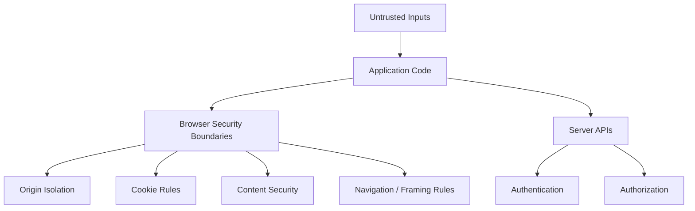

The most important lesson in this chapter is:

> **Front-end security is the disciplined preservation of trust boundaries.**

That means understanding:

- what the browser protects automatically;
- what the server must validate;
- which data is untrusted;
- where credentials are stored and sent;
- which origins are allowed to communicate;
- which code is allowed to execute;
- what happens when those assumptions fail.

We will cover:

- the same-origin policy;
- origins and sites;
- CORS;
- cross-site scripting;
- Content Security Policy;
- Trusted Types;
- CSRF;
- cookies;
- authentication and authorization;
- session architectures;
- bearer tokens;
- OAuth 2.0 and OpenID Connect;
- PKCE;
- secrets;
- Subresource Integrity;
- supply-chain risk;
- clickjacking;
- COOP;
- COEP;
- CORP.

The goal is not to turn the reader into a penetration tester.

The goal is to give front-end engineers enough security architecture to avoid designing vulnerable systems by accident.

---

# 1. Security Begins with Trust Boundaries

Consider this code:

```js
const response =
  await fetch(
    "/api/profile"
  );

const user =
  await response.json();
```

The browser received data.

What do we know?

Not much yet.

The data crossed:

```text
server
→ network
→ browser
```

Even if the server is ours, application architecture should still define:

- expected schema;
- authentication;
- authorization;
- error handling.

Now consider:

```js
const comment =
  searchParams.get(
    "comment"
  );
```

That value crossed:

```text
URL
→ application
```

Or:

```js
const saved =
  localStorage.getItem(
    "settings"
  );
```

That crossed:

```text
persistent browser storage
→ application
```

Chapter 5 introduced these as runtime boundaries.

Security adds another question:

> Can this value affect executable code, privileged requests, or protected information?

---

# 2. The Browser Is a Multi-Origin Security Runtime

A user may open:

```text
bank.example
mail.example
attacker.example
```

in the same browser.

If every page could freely read every other page's data, web security would collapse.

The browser therefore isolates origins.

This is one of the foundations of the web security model.

---

# 3. What Is an Origin?

An origin is defined primarily by:

```text
scheme
+
host
+
port
```

Examples:

```text
https://example.com
https://api.example.com
http://example.com
https://example.com:8443
```

These are not all the same origin.

For example:

```text
https://example.com
```

and:

```text
https://api.example.com
```

have different hosts.

Therefore they are different origins.

---

# 4. Same-Origin Examples

Assume the current page is:

```text
https://example.com/products
```

Then:

```text
https://example.com/account
```

is same-origin.

But:

```text
http://example.com/account
```

differs by scheme.

```text
https://api.example.com/account
```

differs by host.

```text
https://example.com:8443/account
```

differs by port.

A useful diagram:

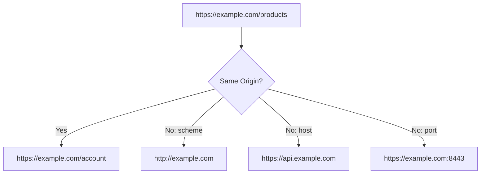

---

# 5. Origin Is Not the Same as Site

Modern cookie and browser-security discussions also use the concept of a **site**.

Very roughly, a site groups related registrable-domain contexts and includes scheme in modern browser definitions.

For example:

```text
https://app.example.com
https://api.example.com
```

are different origins.

But they may be considered same-site.

This distinction matters for:

- SameSite cookies;
- some cross-site protections.

Do not use:

```text
same-origin
```

and:

```text
same-site
```

as synonyms.

---

# 6. The Same-Origin Policy

The **Same-Origin Policy**, or SOP, restricts how code from one origin interacts with resources from another origin.

The browser generally prevents arbitrary cross-origin JavaScript from reading protected data.

For example, script running at:

```text
https://attacker.example
```

should not be able to do:

```js
const response =
  await fetch(
    "https://bank.example/account"
  );

const balance =
  await response.text();
```

and freely read the result.

If that were allowed, merely visiting an attacker page could expose authenticated data from other sites.

---

# 7. Same-Origin Policy Is Not “No Cross-Origin Activity”

The web relies heavily on cross-origin resources.

Pages commonly load:

- images;
- scripts;
- fonts;
- stylesheets;
- frames;
- APIs.

Different resource types have different rules.

The same-origin policy is not:

> Nothing can cross origins.

It is more accurately:

> The browser restricts how cross-origin resources can be read and interacted with.

This distinction explains why CORS exists.

---

# 8. Cross-Origin Reads Are the Core Concern

An attacker page may be able to cause some kinds of cross-origin requests.

The critical restriction is often whether attacker JavaScript can read the response.

For example, a cross-origin image may display:

```html

```

without giving application JavaScript arbitrary access to the response bytes.

Browser security distinguishes:

```text
requesting
embedding
reading
```

These are not identical capabilities.

---

# 9. Browser Storage Is Origin-Scoped

Web Storage and IndexedDB are separated by origin.

JavaScript from:

```text
https://attacker.example
```

cannot simply read:

```text
localStorage
```

belonging to:

```text
https://bank.example
```

This is another form of origin isolation.

Cookies follow related but distinct domain/site rules and need their own treatment later.

---

# 10. CORS

**Cross-Origin Resource Sharing**, or CORS, is a protocol that allows a server to tell the browser:

> This origin is allowed to read my response.

Suppose the application runs at:

```text
https://app.example.com
```

and calls:

```text
https://api.example.com
```

Those are different origins.

The API can return a header such as:

```http
Access-Control-Allow-Origin:
https://app.example.com
```

The browser can then allow the requesting JavaScript to access the response under the CORS rules.

---

# 11. CORS Is a Server Permission

This code:

```js
fetch(
  "https://api.example.com/data"
);
```

does not itself grant cross-origin access.

The receiving server must return appropriate CORS response headers.

Architecture:

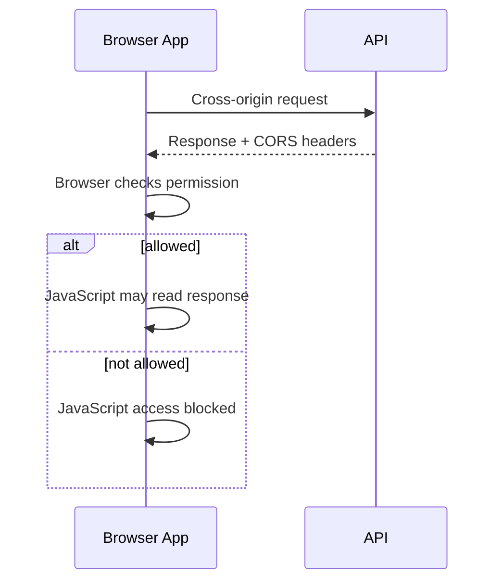

CORS is enforced by the browser.

---

# 12. CORS Is Not an Authentication System

Suppose an API allows:

```http
Access-Control-Allow-Origin: *
```

That does not mean:

> Every user is authorized.

CORS answers:

> Which browser origins may read this response?

Authentication answers:

> Who is this caller?

Authorization answers:

> What may this caller do?

These are different layers.

A server endpoint still needs authentication and authorization even if its CORS configuration is restrictive.

---

# 13. CORS Does Not Protect the Server from Non-Browser Clients

An attacker can write:

```text
curl
server script
mobile app
custom HTTP client
```

that ignores browser CORS enforcement.

Therefore:

> CORS must never be treated as API access control.

The server must enforce permissions independently.

---

# 14. Simple and Preflighted CORS Requests

Some cross-origin requests can be sent directly under CORS rules.

Others trigger a **preflight** request.

A preflight uses:

```http
OPTIONS
```

to ask:

```text
May this origin send this method and these headers?
```

Conceptually:

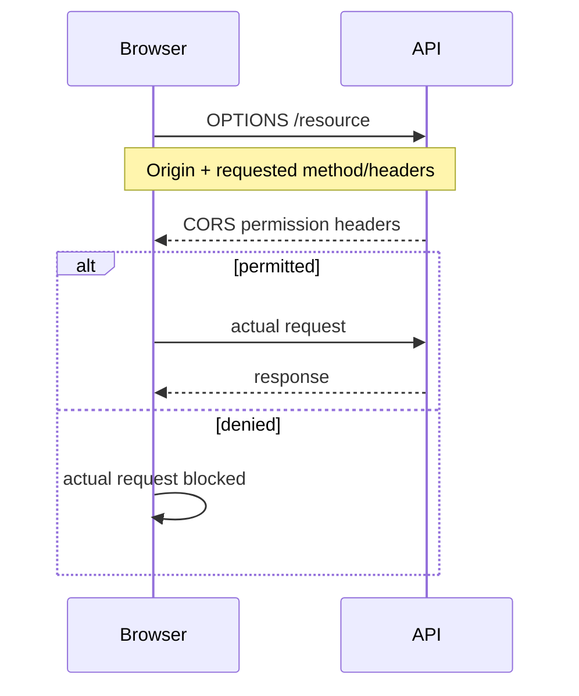

---

# 15. Preflight Is Not a Failure

Developers sometimes see:

```text
OPTIONS
```

in DevTools and assume something is wrong.

Preflight is normal for many cross-origin requests.

It often appears when requests use:

- non-safelisted methods;
- custom headers;
- certain content types.

The goal should not be:

> Eliminate every preflight.

The goal is:

> Configure intentional cross-origin communication correctly.

---

# 16. Credentials and CORS

Cross-origin requests involving cookies or other browser credentials require additional care.

A client may use:

```js
fetch(
  "https://api.example.com/account",
  {
    credentials:
      "include"
  }
);
```

The server then needs compatible CORS policy.

Credentialed cross-origin access should use explicit allowed origins rather than a broad wildcard policy.

Security-sensitive CORS should be narrow and intentional.

---

# 17. CORS Errors Often Reveal Architecture Problems

Common causes include:

- frontend and API origins not planned together;
- accidental development/production differences;
- wildcard rules used with credentials;
- missing allowed headers;
- missing allowed methods;
- incorrect proxy assumptions.

Do not solve CORS errors by copying random headers until the browser stops complaining.

Document:

```text
which frontend origins
may call
which APIs
with which credentials
```

---

# 18. Development Proxies Can Hide CORS

Chapter 12 introduced development proxying.

Suppose:

```text
browser → localhost:5173/api
```

and the dev server proxies to:

```text
localhost:8000
```

From the browser's perspective, it may appear same-origin.

Production may instead use:

```text
app.example.com
api.example.com
```

Now CORS rules matter.

Do not let a development proxy hide an unplanned production origin architecture.

---

# 19. Cross-Site Scripting

**Cross-Site Scripting**, or XSS, occurs when untrusted data becomes executable or otherwise dangerous browser content.

A simplistic example:

```js
output.innerHTML =
  userInput;
```

If `userInput` contains malicious HTML or script-capable markup, the browser may interpret it as active content.

The core failure is:

```text
data
was interpreted as
code/markup
```

A trust boundary collapsed.

---

# 20. XSS Is More Than `<script>` Tags

An outdated mental model is:

```text
XSS = attacker inserts <script>
```

Modern XSS can involve dangerous execution contexts such as:

- HTML;
- event-handler attributes;
- JavaScript URLs;
- DOM APIs that parse markup;
- framework escape hatches.

The defense must therefore follow **context**.

---

# 21. Safe Rendering by Default

Modern frameworks usually escape values inserted into ordinary text positions.

React:

```jsx
<p>
  {userComment}
</p>
```

Vue:

```vue
<p>
  {{ userComment }}
</p>
```

Ordinary interpolation is treated as text rather than raw executable HTML.

This is one of the strongest practical protections frameworks provide.

Do not bypass it casually.

---

# 22. Dangerous Escape Hatches

React exposes:

```text
dangerouslySetInnerHTML
```

Vue exposes:

```text
v-html
```

The names differ.

The architectural meaning is similar:

> The framework is no longer escaping this content for you.

If the content is untrusted HTML, it should normally be sanitized first.

Example conceptually:

```text
untrusted HTML
↓
HTML sanitizer
↓
approved HTML
↓
raw HTML rendering
```

---

# 23. Encoding and Sanitization Are Different

Suppose the user enters:

```text
<b>Hello</b>
```

### Output encoding

Treats it as text.

User sees:

```text
<b>Hello</b>
```

### Sanitization

Parses HTML and removes disallowed structures while preserving allowed markup.

User may see:

**Hello**

depending on the sanitizer policy.

Use encoding when HTML is not needed.

Use sanitization only when the product intentionally accepts HTML.

---

# 24. Prefer Text over HTML

If a feature needs:

```text
username
comment
title
status
```

ordinary text rendering is usually the correct choice.

Do not create HTML strings because:

```text
it is easier to style
```

The safest raw HTML is the raw HTML you do not need.

---

# 25. DOM-Based XSS

Not every XSS vulnerability comes directly from server-rendered HTML.

Browser code can create DOM-based XSS.

Example:

```js
const message =
  new URLSearchParams(
    location.search
  ).get("message");

document.querySelector(
  "#output"
).innerHTML =
  message;
```

The server may never see the payload.

The dangerous flow exists entirely in the browser:

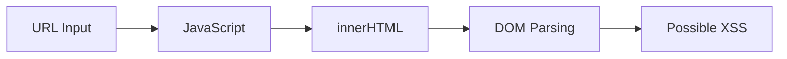

---

# 26. Sources and Sinks

A useful XSS model is:

### Source

Where untrusted data enters.

Examples:

```text
URL
API
postMessage
storage
user input
```

### Sink

Where data enters a security-sensitive browser operation.

Examples include:

```text
innerHTML
outerHTML
document.write
script URL assignment
```

Security analysis can trace:

```text
source
→ transformations
→ sink
```

---

# 27. `textContent` Is Safer for Text

If the intent is text:

```js
element.textContent =
  userInput;
```

is safer than:

```js
element.innerHTML =
  userInput;
```

because the browser does not interpret the string as HTML markup.

Choosing the correct DOM API is part of security design.

---

# 28. URL Handling Needs Context

Suppose user-controlled data becomes:

```html
<a href="...">
```

The issue is not HTML encoding alone.

The application may also need to prevent dangerous or unexpected URL schemes.

For externally supplied links, validate intended protocols such as:

```text
https:
http:
```

according to product requirements.

Security is context-sensitive.

---

# 29. Avoid `eval()`-Style Execution

APIs that interpret strings as code increase attack surface.

Examples include:

```text
eval()
new Function()
string-based timers
```

Modern application architecture rarely needs them.

Treat dynamic code execution as a high-risk design requiring strong justification.

---

# 30. Sanitizing Rich HTML

Suppose a CMS allows:

```text
paragraphs
links
strong text
lists
```

but not:

```text
scripts
iframes
event handlers
```

Use a well-maintained HTML sanitizer with an explicit policy.

Do not build a sanitizer with string replacements such as:

```js
html.replace(
  "<script>",
  ""
);
```

HTML parsing is complex.

Security-sensitive parsing should use specialized, tested libraries.

---

# 31. Sanitization Should Happen Near the Trust Boundary

A clean architecture:

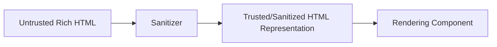

This is easier to review than sanitizing unpredictably throughout the component tree.

---

# 32. Content Security Policy

**Content Security Policy**, or CSP, lets a site tell the browser which resources and execution sources are permitted.

It is delivered through an HTTP response header such as:

```http
Content-Security-Policy:
default-src 'self';
script-src 'self';
object-src 'none'
```

A policy can restrict:

- scripts;
- styles;
- images;
- frames;
- connections;
- objects;
- other resources.

CSP is a major defense-in-depth control.

---

# 33. CSP Is Defense in Depth

CSP should not replace safe rendering.

A weak architecture is:

```text
unsafe HTML everywhere
+
hope CSP saves us
```

A stronger architecture is:

```text
safe framework rendering
+
sanitization where HTML is required
+
CSP as an additional containment layer
```

This layered model is important.

---

# 34. `default-src`

A policy can define a fallback:

```http
Content-Security-Policy:
default-src 'self'
```

Then more specific directives can override particular resource types.

Example:

```http
script-src 'self'
img-src 'self' https://images.example
connect-src 'self' https://api.example
```

This gives the browser an explicit resource-loading policy.

---

# 35. Script Policies

A strict script policy tries to prevent arbitrary script execution.

Historically, applications often relied on source allowlists.

Modern strong CSP designs may use:

- nonces;
- hashes;
- `strict-dynamic` in compatible strategies.

The exact production policy depends on framework and deployment architecture.

Do not copy CSP strings without understanding how application scripts are generated.

---

# 36. Nonces

A server can generate a random nonce for a response.

Header:

```http
Content-Security-Policy:
script-src 'nonce-randomValue'
```

Markup:

```html
<script
  nonce="randomValue"
>
  ...
</script>
```

Only script elements with an allowed nonce participate under the policy.

The nonce should be:

- unpredictable;
- generated for the response;
- not reused as a long-term secret.

---

# 37. CSP Report-Only Mode

Before enforcing a new CSP, applications can use:

```http
Content-Security-Policy-Report-Only
```

This lets the browser report violations without blocking them.

A migration can be:

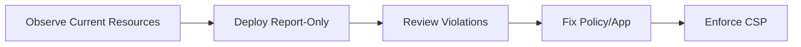

This is often safer for established applications.

---

# 38. CSP and Third-Party Scripts

Analytics, chat widgets, payment providers, and tag managers can complicate CSP.

Every allowed third-party script increases trust.

Ask:

- Is this script necessary?
- Who controls its origin?
- Can its permissions be narrowed?
- Can it be self-hosted?
- Can SRI be used?
- What data can it access?

A script executing in your origin is powerful.

---

# 39. Trusted Types

Trusted Types are a browser security mechanism designed to reduce DOM XSS by restricting dangerous DOM sinks.

A policy can require that certain sinks accept special trusted objects rather than arbitrary strings.

Conceptually:

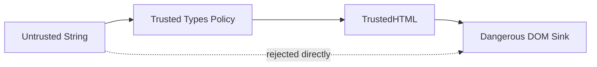

This makes dangerous HTML-producing paths explicit and auditable.

---

# 40. Trusted Types Are Not Sanitization by Themselves

A Trusted Types policy can still be badly written.

If a policy simply says:

```text
trust every string
```

the architecture gains little.

A strong policy can wrap a sanitizer.

Conceptually:

```text
untrusted string
↓
sanitizer
↓
TrustedHTML
↓
DOM sink
```

Trusted Types control *who can create trusted values*.

They do not automatically decide whether content is safe.

---

# 41. Trusted Types and CSP

Trusted Types enforcement can be enabled through CSP directives.

This creates another defense layer around DOM XSS sinks.

As browser support has improved, Trusted Types are increasingly practical for modern applications, but compatibility and rollout still need testing.

Treat them as advanced defense in depth.

Safe rendering remains primary.

---

# 42. Cross-Site Request Forgery

**Cross-Site Request Forgery**, or CSRF, occurs when another site causes a victim's browser to perform an unwanted authenticated action.

The classic problem exists because the browser may automatically send cookies.

Suppose the user is logged in to:

```text
https://bank.example
```

A malicious page attempts to trigger:

```text
POST /transfer
```

If the bank trusts only the presence of the session cookie, the browser may appear authenticated.

The attacker does not need to read the response to cause damage.

---

# 43. XSS and CSRF Are Different

### XSS

Attacker-controlled data executes in the target application's origin.

### CSRF

A different site causes the victim's browser to send an unwanted authenticated request.

Conceptually:

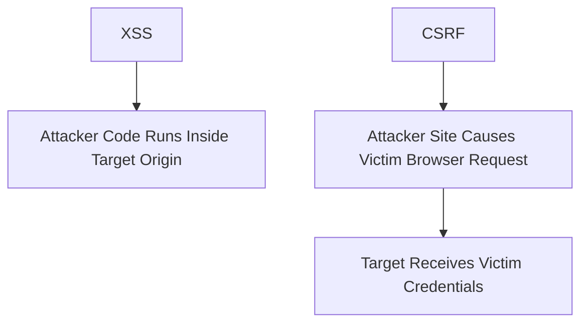

XSS can often defeat CSRF defenses because code running inside the target origin has much greater power.

---

# 44. CSRF Tokens

A common defense for cookie-authenticated applications is a CSRF token.

The application requires a value that an attacker site cannot simply guess or supply through an ordinary cross-site form.

Flow:

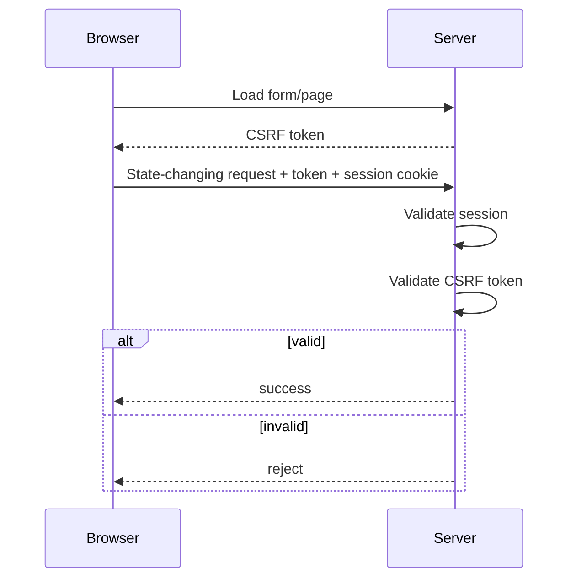

Use framework-provided CSRF protections where available.

---

# 45. CSRF Applies to State-Changing Requests

A well-designed GET should not perform dangerous state changes.

For example:

```text
GET /delete-account
```

is poor API design.

State changes should use appropriate methods and include protection.

This also connects with Chapter 9's HTTP method semantics.

---

# 46. SameSite Cookies

The `SameSite` cookie attribute controls whether a cookie is included in certain cross-site requests.

Common values include:

```text
Strict
Lax
None
```

These settings can reduce CSRF exposure.

But SameSite should not be treated as the only CSRF defense for every architecture.

Browser behavior, navigation flows, and application requirements matter.

---

# 47. Origin and Referer Checks

Servers can sometimes validate headers such as:

```text
Origin
Referer
```

for state-changing requests.

These can provide additional CSRF protection.

They should be implemented according to a documented server security strategy rather than as a random frontend workaround.

The server must own CSRF validation.

---

# 48. Cookie Authentication

A server may create a session:

```text
login
↓
server creates session
↓
browser receives session cookie
↓
browser sends cookie on matching requests
```

Architecture:

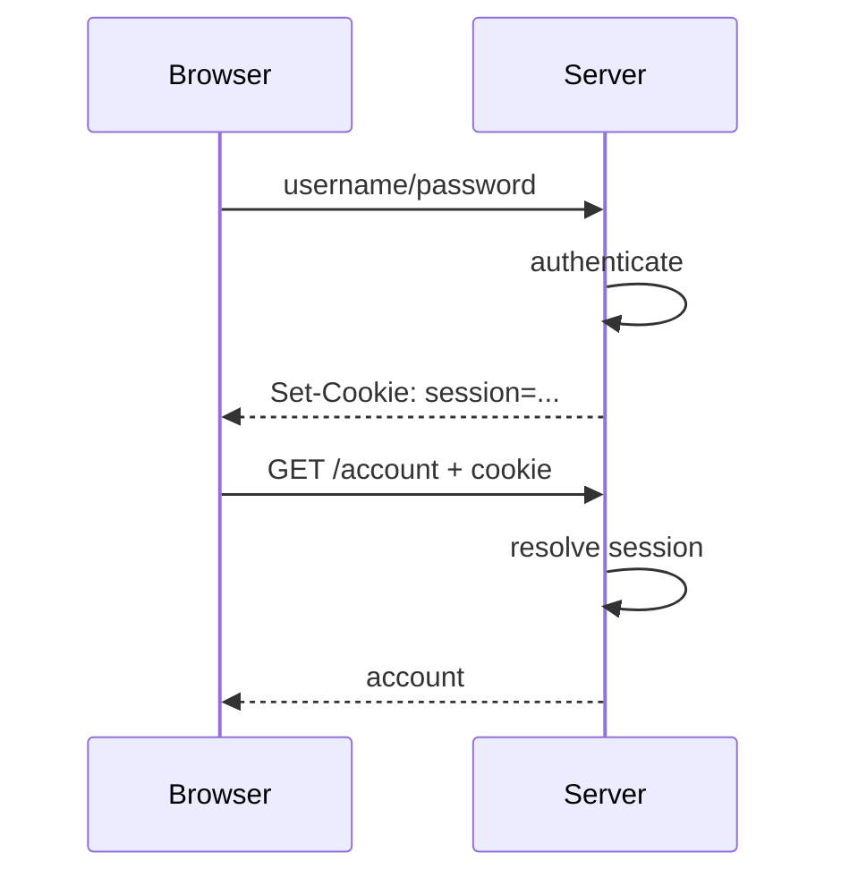

The cookie often stores a session identifier rather than the entire server-side session state.

---

# 49. `HttpOnly`

A cookie can be marked:

```http
HttpOnly
```

This prevents ordinary page JavaScript from reading it through `document.cookie`.

That reduces some token/session theft paths during XSS.

It does **not** make XSS harmless.

Injected code can still perform authenticated actions from within the page.

---

# 50. `Secure`

A cookie marked:

```http
Secure
```

is sent only over secure HTTPS connections, subject to browser rules.

Authentication cookies should normally use secure transport.

Production authentication over plain HTTP is not acceptable.

---

# 51. `SameSite`

`SameSite` controls cross-site cookie inclusion behavior.

Example:

```http
Set-Cookie:
session=...;
Secure;
HttpOnly;
SameSite=Lax
```

The correct value depends on:

- application navigation;
- embedded contexts;
- identity-provider flows;
- cross-site requirements.

Do not copy one SameSite setting universally.

---

# 52. Cookie `Domain` and `Path`

Cookies may be scoped by:

```text
Domain
Path
```

But `Path` should not be treated as a strong security boundary between applications.

If multiple sensitive applications share a broad cookie domain, compromise in one sibling context may increase risk.

Cookie scope should be as narrow as practical.

---

# 53. Session Fixation and Rotation

After successful login or privilege change, session identifiers may need rotation.

This reduces risks where an attacker somehow influenced or obtained a previous session identifier.

Session lifecycle belongs to server authentication design.

Front-end code should not invent session IDs.

---

# 54. Logout

Logout should do more than:

```text
hide account UI
```

The authoritative session/token state should be invalidated according to the authentication design.

The browser may also need to clear:

- sensitive caches;
- local user data;
- offline records;
- in-memory state.

Chapter 10's offline storage makes logout more complex.

---

# 55. Authentication vs Authorization

These two concepts must remain distinct.

### Authentication

> Who are you?

### Authorization

> What are you allowed to do?

A user can be authenticated and still unauthorized for a resource.

For example:

```text
authenticated nurse
```

may still be unable to:

```text
change hospital billing rules
```

---

# 56. Front-End Authorization Is Not Security Enforcement

The UI may hide unauthorized controls:

```jsx
{canDelete && (
  <DeleteButton />
)}
```

This improves UX.

It is not sufficient security.

An attacker can bypass the UI and call the API directly.

The server must enforce:

```text
Is this authenticated identity permitted to perform this operation?
```

The frontend can reflect authorization.

It cannot be the sole enforcement layer.

---

# 57. Permissions Should Come from an Authoritative Model

A brittle frontend might contain:

```js
if (
  user.role === "admin"
) {
  ...
}
```

throughout the application.

As authorization grows, prefer a capability-oriented model:

```text
canViewReports
canEditUser
canApproveOrder
```

or server-returned permissions.

This reduces role-name coupling.

But the server still enforces the real permission.

---

# 58. Bearer Tokens

A bearer token grants access to whoever possesses it.

Conceptually:

```http
Authorization:
Bearer eyJ...
```

The server validates the token and its claims/scopes according to the security architecture.

The dangerous property is obvious:

> If an attacker steals a bearer token, they may be able to use it.

Token storage therefore matters.

---

# 59. Browser Token Storage Is a Security Trade-Off

Common options include:

- JavaScript memory;
- Web Storage;
- cookies;
- a backend-for-frontend session.

Every option has different exposure.

For example:

### localStorage

Convenient across reloads.

But readable by JavaScript in the origin.

An XSS vulnerability can expose stored tokens.

### HttpOnly cookie

Not readable through ordinary JavaScript.

But automatic cookie sending creates CSRF considerations.

There is no universal single-line rule that solves all browser authentication architectures.

---

# 60. Prefer Architecture over Token Folklore

Statements such as:

```text
Never use cookies
```

or:

```text
Never use tokens
```

are too simplistic.

Ask:

- Is there a same-origin backend?
- Is the application an SPA?
- Is there a separate API domain?
- Does the app call third-party APIs?
- Is offline access required?
- Can a backend-for-frontend be used?
- What are the XSS and CSRF threat models?

The correct pattern depends on system structure.

---

# 61. Backend-for-Frontend

A **Backend-for-Frontend**, or BFF, can act as a trusted server-side intermediary for the browser.

Conceptually:

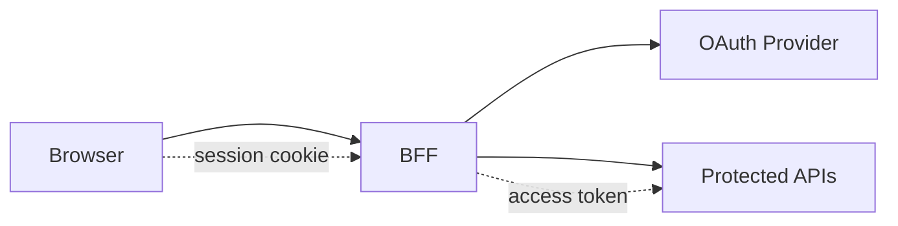

The browser may use a secure session cookie.

The BFF holds or manages API tokens server-side.

This can reduce direct token exposure to browser JavaScript.

It adds server infrastructure and operational complexity.

---

# 62. OAuth Is Delegated Authorization

OAuth 2.0 is primarily an authorization framework.

A user can authorize a client to access a protected resource.

Conceptually:

```text
resource owner
authorizes
client
to access
resource server
through
authorization server
```

OAuth itself should not be described simply as:

> login protocol.

OpenID Connect adds identity/authentication semantics on top of OAuth.

---

# 63. OAuth Roles

Important roles include:

- resource owner;
- client;
- authorization server;
- resource server.

Conceptually:

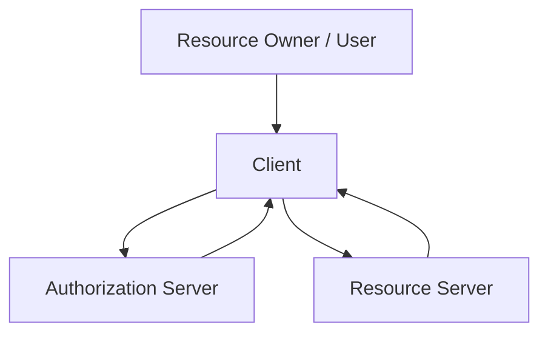

The real protocol flow contains redirects and tokens.

This model keeps responsibilities clear.

---

# 64. Authorization Code Flow

Modern browser OAuth designs commonly use the Authorization Code flow.

A simplified sequence:

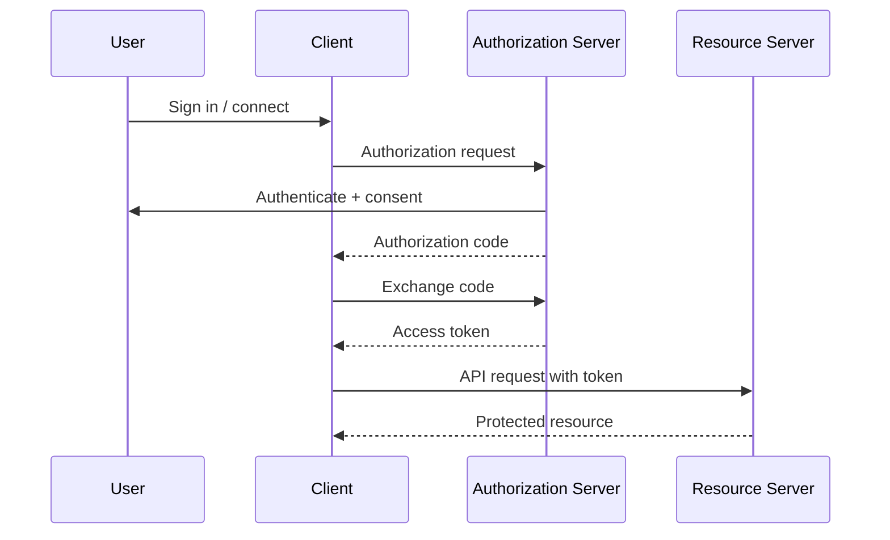

Browser-based application details require additional protections.

---

# 65. PKCE

**Proof Key for Code Exchange**, or PKCE, protects the authorization-code flow from code interception/injection threats.

The client creates:

```text
code verifier
↓
derived code challenge
```

The challenge is sent with the authorization request.

Later, the client presents the verifier when exchanging the authorization code.

Conceptually:

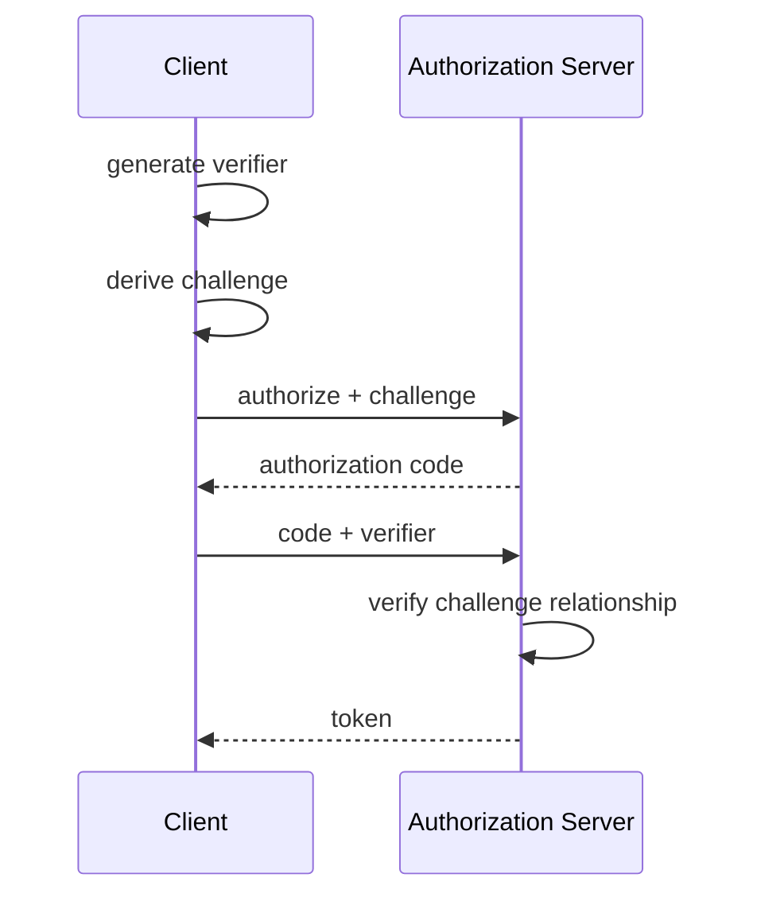

Current OAuth security guidance requires browser-based public clients to use PKCE with the Authorization Code flow, and requires authorization servers to support it. Legacy providers may impose compatibility constraints, so deployments still need to verify the provider’s supported flow.

---

# 66. Avoid Legacy Implicit Token Delivery

Older OAuth browser applications sometimes received access tokens directly through front-channel redirects.

Modern OAuth security guidance has moved away from those legacy implicit patterns.

Prefer current authorization-code-based flows with PKCE and modern security recommendations.

Security protocols evolve.

Do not copy ten-year-old OAuth tutorials.

---

# 67. Browser-Based OAuth Has Its Own Threat Model

Browser applications have special properties:

- code is delivered to the user;
- JavaScript cannot safely hold a long-term client secret;
- XSS can access browser-held tokens;
- redirects cross security boundaries.

Current browser-focused OAuth best practices treat these constraints explicitly.

This is why architecture should use up-to-date identity libraries and standards rather than implement protocol details manually.

---

# 68. OpenID Connect

**OpenID Connect**, or OIDC, adds an identity layer on top of OAuth 2.0.

It introduces concepts such as:

- ID Token;
- standardized user claims;
- identity-provider discovery.

A simplified model:

```text
OAuth:
authorization to access resources

OIDC:
authentication / identity information
built on OAuth mechanisms
```

Do not use access tokens and ID tokens interchangeably.

---

# 69. ID Token vs Access Token

### ID Token

Describes authentication information about the user/session for the client.

### Access Token

Is presented to a protected resource/API according to the authorization architecture.

A common mistake is sending an ID Token to an API merely because it is a signed JWT.

Token purpose matters.

---

# 70. JWT Is a Format, Not an Authentication Architecture

JSON Web Tokens, or JWTs, are a token format.

They can carry claims and signatures.

But:

```text
JWT
```

does not automatically mean:

- secure;
- OAuth;
- stateless session;
- correct authorization.

Security depends on:

- issuer;
- audience;
- signature verification;
- expiration;
- algorithm policy;
- key management;
- token purpose.

Do not reduce identity architecture to:

> We use JWT.

---

# 71. Token Validation Belongs at the Resource Server

An API receiving an access token must validate it according to the authorization architecture.

Frontend code may inspect token data for UI purposes.

But browser checks cannot enforce protected API access.

The protected server must validate:

- token validity;
- audience;
- issuer;
- expiry;
- scope/permissions.

---

# 72. Front-End Token Decoding Is Not Verification

A client can decode a JWT payload.

That does not mean the browser has established trust in it.

For UI hints, decoding may be useful.

For security authorization:

```text
server verification
```

is required.

Do not write:

```js
const claims =
  decodeJwt(token);

if (
  claims.admin
) {
  // secure operation
}
```

and treat that as authorization.

---

# 73. Refresh Tokens

Refresh tokens can obtain new access tokens without full user authentication.

They are high-value credentials.

Browser-based application guidance places strong constraints around them.

Architectures may use:

- rotation;
- expiration;
- sender constraints;
- BFF patterns.

Do not store long-lived refresh tokens casually in Web Storage.

Use established identity libraries and current provider guidance.

---

# 74. OAuth State and Nonce

Redirect-based authorization flows need transaction binding.

Mechanisms such as:

```text
state
nonce
PKCE
```

serve different protections depending on the protocol.

Do not invent homemade equivalents.

Use standards-compliant identity libraries.

Authentication protocol correctness is not a good place for custom creativity.

---

# 75. Redirect URI Validation

Authorization servers should use tightly registered redirect URIs.

A loose rule such as:

```text
https://example.com/*
```

can create token/code leakage opportunities depending on system design.

Exact redirect matching is a strong modern security principle.

The redirect endpoint is part of the authentication boundary.

---

# 76. Open Redirects

An endpoint such as:

```text
/redirect?to=https://attacker.example
```

can become dangerous when used inside authentication flows.

Open redirects can help attackers bounce users or credentials through trusted domains.

Redirect destinations should be restricted to intentional locations.

---

# 77. Secrets Do Not Belong in Front-End Bundles

This deserves an explicit rule:

> **Anything shipped to the browser is available to the browser user.**

That includes values embedded through:

- JavaScript source;
- environment variables;
- source maps;
- HTML;
- network responses.

A frontend build cannot securely contain:

```text
database password
private API secret
OAuth confidential-client secret
private signing key
```

---

# 78. Public API Keys Are Not Always Secrets

Some services issue browser-visible identifiers or API keys intended to identify a project rather than authenticate a privileged backend.

Examples may include:

- map client identifiers;
- public analytics keys.

These still need restrictions such as:

- origin restrictions;
- quotas;
- limited permissions.

The word:

```text
key
```

does not automatically mean:

```text
secret
```

Understand the provider's security model.

---

# 79. Environment Variables Are Not a Vault

Chapter 12 introduced frontend environment variables.

If:

```text
VITE_SECRET_KEY
```

is compiled into the browser bundle, it is not secret.

Renaming it:

```text
PUBLIC_SECRET
```

does not change that.

Secrets belong on trusted server infrastructure.

---

# 80. Subresource Integrity

**Subresource Integrity**, or SRI, lets a page specify a cryptographic hash for an externally loaded resource.

Example:

```html
<script
  src="https://cdn.example/library.js"
  integrity="sha384-..."
  crossorigin="anonymous"
></script>
```

The browser verifies that the downloaded resource matches the expected content.

If it does not, the resource is blocked.

---

# 81. What SRI Protects Against

Suppose your page trusts:

```text
cdn.example
```

but the CDN resource is unexpectedly modified.

SRI can detect:

```text
received bytes
≠
expected hash
```

This is especially useful for fixed-version third-party resources.

It does not help when the resource is intentionally updated unless the page's integrity value is also updated.

---

# 82. SRI and CORS

Cross-origin SRI resources require compatible CORS behavior.

This is one reason security controls often interact.

A valid SRI attribute is not enough if the resource cannot be fetched under the required mode.

Test the complete deployment architecture.

---

# 83. Dependency Supply-Chain Risk

Modern front-end projects may install hundreds or thousands of transitive packages.

A malicious or compromised package can potentially affect:

- developer machines;
- CI;
- source code;
- build output;
- production bundles.

This makes dependency management a security concern.

---

# 84. Build-Time Dependencies Can Be Highly Privileged

A package that never ships to users may still execute during:

```text
npm install
build
test
```

That means it may access:

- CI environment variables;
- source repository;
- filesystem;
- credentials available to the build environment.

Do not assume:

```text
devDependency
```

means:

```text
low security risk
```

---

# 85. Reduce Supply-Chain Exposure

Useful practices include:

- minimize unnecessary dependencies;
- commit lockfiles;
- review unexpected dependency changes;
- use automated vulnerability scanning;
- keep packages updated deliberately;
- avoid abandoned packages for critical paths;
- restrict CI credentials;
- prefer reputable dependencies;
- review install scripts where risk is high.

Security is partly about reducing unnecessary trust.

---

# 86. Dependency Pinning Is Not Enough

A lockfile can prevent surprise version drift.

It does not prove the pinned version is safe.

A locked malicious dependency remains malicious.

Use lockfiles for reproducibility.

Use security review, updates, and monitoring for risk management.

---

# 87. Third-Party Scripts Are Supply-Chain Dependencies Too

A script loaded from:

```html
<script
  src="https://third-party.example/widget.js"
></script>
```

may execute with significant privileges in the page.

Third-party scripts can access:

- DOM content;
- non-HttpOnly browser storage;
- user interactions;
- network capabilities allowed by the page.

Treat every third-party script as trusted code.

---

# 88. Clickjacking

Clickjacking tricks users into interacting with a page that has been visually embedded or overlaid in another page.

For example, an attacker may place a transparent target application inside an iframe and position misleading controls above it.

The user thinks they are clicking one thing.

They are actually clicking another.

---

# 89. Preventing Unauthorized Framing

Modern CSP can restrict framing using:

```http
Content-Security-Policy:
frame-ancestors 'self'
```

or selected allowed origins.

Historically, sites used:

```http
X-Frame-Options
```

which still exists in deployments.

`frame-ancestors` provides modern framing policy control.

---

# 90. Browser Isolation

Modern browsers expose additional headers that can isolate browsing contexts and cross-origin resources.

Important examples include:

- COOP;
- COEP;
- CORP.

These are advanced architectural controls.

They should not be described as mandatory for every application.

Their main role is to strengthen cross-origin isolation and resource policies for specific threat/performance scenarios.

---

# 91. COOP

**Cross-Origin-Opener-Policy**, or COOP, controls how top-level documents relate to other browsing contexts, especially opener relationships.

A page can use policies such as:

```http
Cross-Origin-Opener-Policy:
same-origin
```

to isolate itself from certain cross-origin windows into separate browsing context groups.

This can reduce cross-origin interaction surfaces.

---

# 92. `window.opener`

Without appropriate isolation, a page opened through:

```js
window.open(...)
```

may have relationships through:

```text
window.opener
```

subject to browser security restrictions.

COOP can strengthen separation.

This matters for:

- cross-origin isolation;
- popup architectures;
- side-channel defenses.

It should be selected carefully because some legitimate popup integrations rely on opener relationships.

---

# 93. COEP

**Cross-Origin-Embedder-Policy**, or COEP, controls which cross-origin resources a document may embed when those resources do not explicitly grant permission.

A strong policy may require compatible:

- CORS;
- CORP.

Example:

```http
Cross-Origin-Embedder-Policy:
require-corp
```

This can prevent embedding cross-origin resources that have not opted into appropriate sharing.

---

# 94. CORP

**Cross-Origin-Resource-Policy**, or CORP, is set by a resource to declare where it may be loaded in certain cross-origin contexts.

Possible policies include:

```text
same-origin
same-site
cross-origin
```

Example:

```http
Cross-Origin-Resource-Policy:
same-origin
```

This tells browsers to restrict certain no-CORS cross-origin use of the resource.

---

# 95. COOP + COEP and Cross-Origin Isolation

A document using compatible COOP and COEP policies can become **cross-origin isolated**.

This can be required for certain powerful browser capabilities such as some uses of:

```text
SharedArrayBuffer
```

The architecture is approximately:

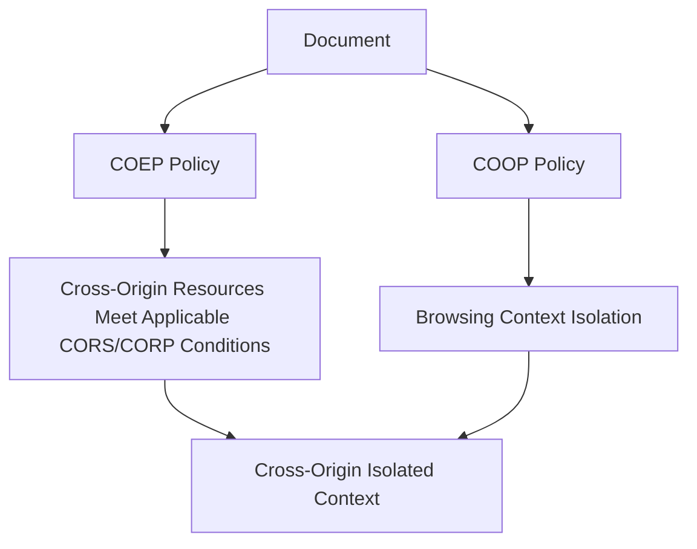

Do not adopt this policy casually.

It changes resource-loading and popup behavior.

---

# 96. CORP, CORS, and COEP Are Different

These names are easy to confuse.

### CORS

Allows cross-origin script access to responses under defined rules.

### CORP

Lets a resource restrict where certain cross-origin loads are permitted.

### COEP

Lets a document require embedded cross-origin resources to explicitly cooperate.

They solve related but different problems.

---

# 97. Security Headers Need Testing

A strong header configuration can accidentally break:

- analytics;
- CDN images;
- fonts;
- embedded payments;
- authentication popups;
- PDF display;
- third-party widgets.

Deploy policies through:

```text
inventory
testing
reporting
gradual enforcement
```

Security that breaks required functionality will often be disabled under pressure.

Design it carefully.

---

# 98. Security Architecture for a Typical SPA

Consider:

```text
https://app.example.com
https://api.example.com
https://auth.example-idp.com
```

A reasonable architecture needs to define:

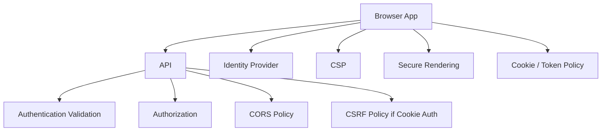

The individual controls reinforce one another.

---

# 99. Example: Cookie Session SPA

Suppose the API and frontend use cookie-based sessions.

Flow:

```text
login
↓
server creates session
↓
Secure + HttpOnly cookie
↓
browser sends cookie automatically
↓
state-changing requests include CSRF protection
```

The architecture may use:

- SameSite cookie settings;
- CSRF token;
- strict CORS;
- server authorization.

No single control replaces the others.

---

# 100. Example: OAuth SPA

Suppose a pure browser application calls an external API through OAuth.

The architecture may use:

- Authorization Code flow;
- PKCE;
- exact redirect URIs;
- modern browser OAuth best practices;
- careful token lifetime/storage;
- runtime XSS defense.

The application should use a mature OAuth/OIDC client library.

Protocol implementation from scratch is rarely justified.

---

# 101. Example: BFF Architecture

Suppose a sensitive enterprise application can run a same-origin backend.

A BFF architecture may use:

```text
Browser
→ secure session cookie
→ BFF
→ access token
→ APIs
```

Advantages can include:

- access tokens kept out of ordinary browser JavaScript;
- centralized OAuth handling;
- server-controlled session lifecycle.

Costs include:

- server infrastructure;
- CSRF considerations for cookie requests;
- proxy/backend maintenance.

Architecture is a trade-off.

---

# 102. Security UX

Security controls affect users.

Examples:

- session expiry;
- reauthentication;
- MFA prompts;
- forbidden actions;
- permission changes;
- offline authentication limits.

A user-friendly system should explain:

```text
what happened
what the user can do
```

without exposing sensitive internal detail.

Example:

```text
Your session expired. Sign in again to continue.
```

is better than:

```text
JWT validation failed: exp claim < now
```

---

# 103. Error Messages Must Not Leak Sensitive Detail

A production API should not expose:

```text
SQL query
database hostname
stack trace
private file path
token validation internals
```

to ordinary users.

The browser needs safe actionable information.

Developers need detailed diagnostics through:

- server logs;
- monitoring;
- trace IDs.

Chapter 17 will cover observability.

---

# 104. Security and Logging

Be careful not to log:

- passwords;
- access tokens;
- refresh tokens;
- session IDs;
- sensitive personal data;
- full authorization headers.

This applies to:

- browser console;
- analytics;
- server logs;
- error-monitoring tools.

Debugging convenience can become credential leakage.

---

# 105. Sensitive Data in URLs

URLs may be recorded in:

- browser history;
- server logs;
- proxies;
- analytics;
- screenshots;
- Referer headers depending on policy.

Do not place:

```text
password
access token
sensitive form data
```

in query strings.

This connects directly to Chapter 8's URL-state rules.

---

# 106. `postMessage`

Cross-origin windows and frames can communicate intentionally through:

```js
window.postMessage(...)
```

This is a legitimate escape hatch from strict origin isolation.

But receivers must validate:

- `event.origin`;
- expected message structure;
- message type.

Unsafe:

```js
window.addEventListener(
  "message",
  event => {
    performAction(
      event.data
    );
  }
);
```

Better architecture validates both origin and payload.

---

# 107. `postMessage` Origin Validation

Conceptually:

```js
window.addEventListener(
  "message",
  event => {
    if (
      event.origin
        !==
      "https://trusted.example"
    ) {
      return;
    }

    const message =
      parseMessage(
        event.data
      );

    ...
  }
);
```

This combines:

```text
origin validation
+
runtime data validation
```

Do not use `"*"` as a target origin for sensitive messages unless the architecture truly allows any origin.

---

# 108. Iframes Are Security Boundaries

Embedded frames may need:

- sandboxing;
- origin restrictions;
- permission policies;
- postMessage protocols.

An iframe is not merely a layout element.

It creates another browsing context with security consequences.

Use `sandbox` capabilities deliberately for untrusted or semi-trusted embedded content.

---

# 109. Dependency on Framework Escaping Is Good—But Not Sufficient

React, Vue, and similar frameworks reduce XSS risk through escaping.

But vulnerabilities can still occur through:

- raw HTML APIs;
- unsafe URLs;
- third-party widgets;
- DOM manipulation;
- server-generated HTML;
- compromised dependencies.

Framework security is a strong default.

It is not a reason to stop thinking about trust boundaries.

---

# 110. Security Review Checklist

For a feature, ask:

### Inputs

Where does untrusted data enter?

### Rendering

Can any untrusted value become HTML, script, style, or URL?

### Requests

Which requests change state?

### Credentials

How are credentials carried?

### CSRF

Are cookie-authenticated mutations protected?

### CORS

Which origins are allowed to read API responses?

### Authentication

Who establishes identity?

### Authorization

Where is permission enforced?

### Storage

What sensitive data exists in browser storage?

### Third Parties

Which external scripts execute in our origin?

### Headers

What browser policies are enforced?

### Logout

What sensitive local state must be cleared?

---

# 111. A Layered Security Model

A mature browser application can be viewed as layers:

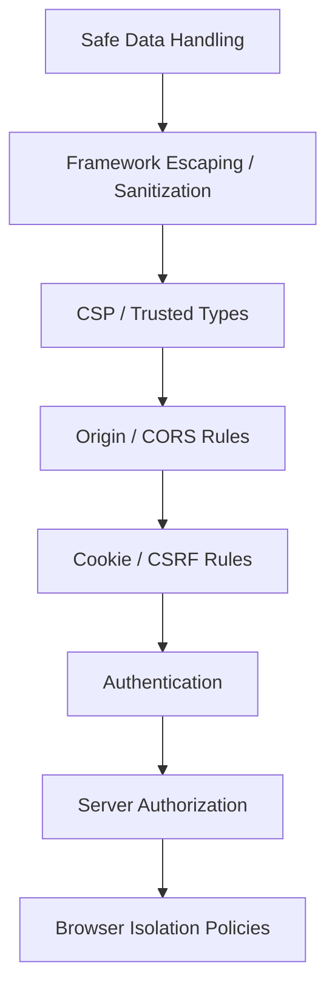

No single layer is enough.

A failure in one layer should not automatically become a total compromise.

That is the principle of defense in depth.

---

# 112. Misconceptions to Leave Behind

## “CORS protects my API from attackers.”

No.

CORS controls browser cross-origin read access.

The API still needs authentication and authorization.

---

## “If CORS blocks my request, the server did not receive it.”

Not always.

Some requests may be sent but the browser blocks JavaScript from reading the response.

Preflighted requests have different behavior.

---

## “Using `Access-Control-Allow-Origin: *` makes an API public.”

Not by itself.

It makes browser-readable cross-origin access broad for compatible requests.

Server permissions are separate.

---

## “XSS means someone inserted a `<script>` tag.”

Too narrow.

XSS includes many ways untrusted data can reach executable browser contexts.

---

## “React/Vue make XSS impossible.”

No.

Their default escaping helps substantially, but raw HTML APIs, dangerous URLs, and external code can still create vulnerabilities.

---

## “Sanitization and encoding are the same.”

No.

Encoding displays data as text.

Sanitization allows a controlled subset of markup.

---

## “CSP prevents XSS by itself.”

No.

CSP is defense in depth.

Safe rendering and sanitization remain primary.

---

## “Trusted Types automatically sanitize HTML.”

No.

Trusted Types restrict dangerous sinks to approved trusted objects.

The policy still needs safe content creation.

---

## “CSRF is the same as XSS.”

No.

CSRF abuses authenticated browser requests from another site.

XSS executes attacker-controlled code in the target origin.

---

## “SameSite cookies make CSRF tokens obsolete everywhere.”

No.

SameSite is valuable protection, but CSRF architecture still depends on request and authentication design.

---

## “HttpOnly prevents XSS.”

No.

It prevents ordinary JavaScript from reading the cookie.

XSS can still act using the victim's authenticated browser context.

---

## “If the Delete button is hidden, unauthorized users cannot delete.”

No.

Server authorization must enforce the operation.

---

## “JWT means secure authentication.”

No.

JWT is a token format.

Security depends on validation and architecture.

---

## “The browser can securely store a confidential OAuth client secret.”

No.

Browser-delivered code cannot protect a long-term application secret from the user.

---

## “OAuth is a login protocol.”

Not exactly.

OAuth is primarily delegated authorization.

OpenID Connect adds authentication/identity.

---

## “ID Tokens and Access Tokens are interchangeable.”

No.

They have different audiences and purposes.

---

## “localStorage is always wrong for tokens.”

Too absolute.

It has meaningful XSS exposure, but authentication architecture should be evaluated as a whole rather than by slogans.

---

## “HttpOnly cookies solve authentication security completely.”

No.

They improve token/session secrecy from JavaScript but introduce other considerations such as CSRF and cookie scope.

---

## “Anything in `.env` is secret.”

Not if it is built into browser-delivered code.

---

## “SRI protects all third-party scripts automatically.”

No.

It protects resources whose expected hash is declared and remains fixed.

---

## “Lockfiles eliminate supply-chain risk.”

No.

They improve reproducibility.

They do not prove dependencies are trustworthy.

---

## “COOP, COEP, and CORP should be added to every website.”

No.

They solve specific cross-origin isolation/resource problems and can break legitimate integrations.

---

## “Security headers can be copied from another site.”

They should be adapted to the application's real resource, framing, authentication, and integration requirements.

---

# Chapter Summary

Front-end security is built around trust boundaries.

The browser's same-origin policy isolates origins defined by:

```text
scheme
host
port
```

Same-origin and same-site are different concepts.

CORS allows a server to grant selected browser origins access to cross-origin responses.

It is not authentication or authorization.

XSS occurs when untrusted data reaches executable or dangerous browser contexts.

The strongest default is:

```text
render data as text
```

Framework escaping helps, but raw HTML escape hatches require sanitization.

A useful XSS model is:

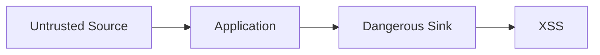

Content Security Policy restricts which resources and code execution paths the browser permits.

CSP is defense in depth rather than the primary replacement for secure rendering.

Trusted Types can further restrict dangerous DOM sinks and make trusted HTML creation explicit.

CSRF occurs when another site causes the victim's browser to perform an unwanted authenticated request.

Cookie-based applications commonly use:

- CSRF tokens;
- SameSite settings;
- server-side validation of request origin/context.

Cookie security attributes include:

```text
Secure
HttpOnly
SameSite
Domain
Path
```

Authentication answers:

```text
Who is the user?
```

Authorization answers:

```text
What may the user do?
```

Frontend permission checks improve UX.

Server authorization provides security.

OAuth 2.0 provides delegated authorization.

Modern browser OAuth should follow current security best practices using authorization-code flows with PKCE and established libraries.

OpenID Connect adds an authentication/identity layer.

Browser applications cannot securely contain confidential client secrets.

A BFF architecture can keep access tokens on a trusted server and expose a session-oriented interface to the browser.

Subresource Integrity verifies that selected external resources match expected cryptographic hashes.

Supply-chain security includes both runtime and build-time dependencies.

Browser isolation controls such as:

- COOP;
- COEP;
- CORP

strengthen specific cross-origin boundaries but should be adopted deliberately.

The central principle is:

> **Security is strongest when several independent controls preserve the same trust boundaries instead of relying on one mechanism to prevent every failure.**

---

# Review Questions

1. What is a trust boundary?

2. What three values primarily define an origin?

3. Why are `https://example.com` and `https://api.example.com` different origins?

4. What is the difference between same-origin and same-site?

5. What is the Same-Origin Policy?

6. Why does the web still allow many cross-origin resources despite the Same-Origin Policy?

7. Why is cross-origin reading often more sensitive than simply sending or embedding a resource?

8. How is browser storage isolated by origin?

9. What problem does CORS solve?

10. Who grants CORS permission?

11. Why is CORS not an authentication mechanism?

12. Why does CORS not protect an API from non-browser clients?

13. What is a CORS preflight?

14. Which HTTP method is normally used for preflight?

15. Why should developers not try to eliminate every preflight?

16. What additional issues appear with credentialed CORS requests?

17. How can a development proxy hide production CORS problems?

18. What is XSS?

19. Why is defining XSS as “injected script tags” too narrow?

20. How do React and Vue ordinary text interpolation reduce XSS risk?

21. Why are raw HTML escape hatches dangerous?

22. What is the difference between output encoding and HTML sanitization?

23. Why should text rendering be preferred when rich HTML is unnecessary?

24. What is DOM-based XSS?

25. What is an XSS source?

26. What is an XSS sink?

27. Why is `textContent` preferable to `innerHTML` for plain text?

28. Why do user-controlled URLs require contextual validation?

29. Why should `eval()`-style execution generally be avoided?

30. Why should teams use an established HTML sanitizer rather than custom string replacement?

31. What is Content Security Policy?

32. Why is CSP defense in depth?

33. What does `default-src` do conceptually?

34. What does a script nonce accomplish?

35. What is CSP Report-Only mode useful for?

36. Why should third-party scripts be treated as highly trusted code?

37. What problem do Trusted Types address?

38. Why are Trusted Types not a sanitizer by themselves?

39. How can Trusted Types and CSP work together?

40. What is CSRF?

41. How does CSRF differ from XSS?

42. Why do automatically sent cookies matter to CSRF?

43. What is a CSRF token?

44. Why should state-changing actions not normally use GET?

45. What does the SameSite cookie attribute control?

46. Why may Origin/Referer validation help defend against CSRF?

47. How does cookie-based session authentication work conceptually?

48. What does `HttpOnly` protect?

49. What does `Secure` protect?

50. Why is cookie `Path` not a strong application security boundary?

51. Why can session identifiers need rotation?

52. What should logout invalidate?

53. What is the difference between authentication and authorization?

54. Why can frontend authorization checks not enforce security alone?

55. What is a capability-oriented permission model?

56. What is a bearer token?

57. Why does bearer-token storage matter?

58. What security trade-offs exist between Web Storage and HttpOnly cookies?

59. What is a Backend-for-Frontend?

60. How can a BFF reduce browser token exposure?

61. What is OAuth primarily designed to do?

62. What roles exist in OAuth?

63. What is the Authorization Code flow?

64. What problem does PKCE address?

65. Why are older implicit browser OAuth flows discouraged in modern guidance?

66. Why do browser-based OAuth clients have a special threat model?

67. What does OpenID Connect add to OAuth?

68. What is the difference between an ID Token and an Access Token?

69. Why is JWT only a format?

70. Where must protected API token validation occur?

71. Why is decoding a JWT in the browser not authorization?

72. Why are refresh tokens high-value credentials?

73. Why should OAuth `state`, `nonce`, and PKCE not be replaced with homemade mechanisms?

74. Why should redirect URIs be tightly controlled?

75. What is an open redirect?

76. Why can frontend bundles not contain secrets?

77. When can a browser-visible API key still be legitimate?

78. What is Subresource Integrity?

79. What does SRI verify?

80. Why does SRI interact with CORS?

81. What is software supply-chain risk?

82. Why can development dependencies still be security-sensitive?

83. Why does a lockfile not prove a dependency is safe?

84. Why are third-party scripts part of the application's trust boundary?

85. What is clickjacking?

86. What does `frame-ancestors` control?

87. What is COOP?

88. What is COEP?

89. What is CORP?

90. How are CORS, CORP, and COEP different?

91. What is cross-origin isolation?

92. Why can browser-isolation headers break integrations?

93. Why should sensitive data generally not appear in URLs?

94. What must a secure `postMessage` receiver validate?

95. Why should iframe use be considered part of security architecture?

96. Why should production error messages avoid internal system details?

97. Why should authentication tokens not be logged?

98. What does defense in depth mean in front-end security?

---

# End-of-Chapter Practical Lab — Secure a Front-End Application Boundary

Create:

```text
chapter-13-security/
├── app/
│   ├── rendering/
│   ├── auth/
│   ├── messaging/
│   └── api/
├── server/
│   ├── cors/
│   ├── session/
│   └── csrf/
└── notes/
```

The lab is intentionally defensive.

Its goal is to observe browser protections and then implement safer architecture.

---

## Stage 1 — Map the Origins

Run:

```text
frontend:
http://localhost:5173

API:
http://localhost:8000
```

Write down:

```text
scheme
host
port
```

for both.

Explain why the two endpoints are different origins.

---

## Stage 2 — Observe a CORS Failure

From the frontend, request:

```text
http://localhost:8000/api/profile
```

without CORS permission.

Observe the browser error.

Then inspect the server logs.

Determine whether:

- the request reached the server;
- JavaScript was allowed to read the response.

Do not describe CORS merely as “the server blocked the request.”

---

## Stage 3 — Add Explicit CORS Permission

Configure the API to allow only:

```text
http://localhost:5173
```

Do not begin with:

```text
*
```

for a credentialed scenario.

Verify the browser can read the response.

---

## Stage 4 — Trigger a Preflight

Send a cross-origin request using:

```text
PATCH
```

and a custom request header.

Observe:

```text
OPTIONS
```

before the real request.

Draw the exchange as a Mermaid sequence diagram.

---

## Stage 5 — Demonstrate Safe Text Rendering

Take this input:

```html

```

Render it safely through:

```text
React interpolation
Vue interpolation
textContent
```

Observe that it appears as text or otherwise does not execute as raw HTML.

Do not build a real exploit against another system.

---

## Stage 6 — Identify a Dangerous Sink

In a local educational page only, examine:

```js
element.innerHTML =
  untrustedValue;
```

Do not retain this code in the finished application.

Replace it with:

```text
textContent
```

or a safely sanitized rich-HTML path.

Document the source-to-sink flow.

---

## Stage 7 — Add Rich-Text Sanitization

Assume a product description intentionally supports:

```text
paragraph
strong
emphasis
links
lists
```

Use a reputable sanitizer.

Create an explicit allowlist policy.

Render the sanitized output through the framework's raw HTML mechanism.

Document why ordinary escaping could not satisfy this specific rich-text requirement.

---

## Stage 8 — Add a CSP in Report-Only Mode

Start with a report-only policy.

Inventory:

```text
scripts
styles
images
API connections
frames
```

Review violations.

Tighten the policy before enforcement.

Do not copy a random CSP from the internet.

---

## Stage 9 — Enforce a Basic CSP

Move from report-only to enforcement.

Ensure that:

- application scripts load;
- API requests work;
- required images load;
- unauthorized script sources remain blocked.

Record which directives were necessary.

---

## Stage 10 — Explore Trusted Types

If supported in your target browser environment, enable Trusted Types enforcement in a small test area.

Create one policy that sanitizes HTML before creating trusted HTML.

Verify that direct string assignment to a protected dangerous sink is rejected.

Treat this as an advanced defense-in-depth exercise.

---

## Stage 11 — Implement a Cookie Session

Create a local educational session flow:

```text
login
→ server session
→ Secure/HttpOnly-style cookie where environment permits
```

Do not expose the session identifier to application JavaScript.

Observe requests in DevTools.

---

## Stage 12 — Add CSRF Protection

Create a state-changing request:

```text
POST /api/profile
```

Require a CSRF token.

Test:

```text
valid session + valid token
→ accepted

valid session + missing/invalid token
→ rejected
```

Document why session authentication alone is insufficient.

---

## Stage 13 — Experiment with SameSite

Compare cookie behavior conceptually or in a controlled local environment using:

```text
Strict
Lax
None
```

Document which navigation/integration patterns change.

Do not select a production value merely because it is “the strictest.”

---

## Stage 14 — Separate Authentication and Authorization

Create two users:

```text
viewer
editor
```

Both are authenticated.

Only editor may update products.

Hide the Edit button for viewer.

Then call the API directly as viewer.

The server must still reject the update.

This demonstrates:

```text
UI permission
≠
server enforcement
```

---

## Stage 15 — Draw a BFF Architecture

Do not implement a full production OAuth system.

Create a Mermaid diagram showing:

```text
Browser
BFF
Authorization Server
Resource API
```

Place:

```text
session cookie
```

between browser and BFF.

Place:

```text
access token
```

between BFF and resource API.

Explain the security trade-off.

---

## Stage 16 — Model OAuth Authorization Code + PKCE

Create a Mermaid sequence diagram showing:

```text
client generates verifier
client derives challenge
authorization redirect
authorization code
token exchange with verifier
```

Do not implement cryptography manually.

The exercise is architectural.

---

## Stage 17 — Compare ID and Access Tokens

Create a table with:

```text
purpose
intended consumer
typical use
should API accept it?
```

for:

```text
ID Token
Access Token
```

Explain why the two are not interchangeable.

---

## Stage 18 — Search the Bundle for Secrets

Add a fake value:

```text
TEST_SECRET_DO_NOT_USE
```

through the frontend environment-variable mechanism.

Build the application.

Search the generated bundle.

Observe that the value is visible.

Remove it.

Document the rule:

```text
browser bundle
=
public to the user
```

---

## Stage 19 — Add SRI to a Fixed External Resource

For a local/demo fixed resource or suitable test CDN, add:

```text
integrity
crossorigin
```

Modify the served resource without changing the integrity value.

Observe that the browser refuses the changed resource.

Do not use this lab as an excuse to add unnecessary third-party production scripts.

---

## Stage 20 — Inventory Third-Party Trust

List every third-party script in the project.

For each, record:

```text
owner
purpose
data access
SRI possible?
CSP source?
removable?
```

Remove at least one unnecessary dependency or script if present.

---

## Stage 21 — Secure `postMessage`

Create a parent page and child frame.

Send a structured message.

Receiver must validate:

```text
event.origin
message schema
message type
```

Attempt a message from an unapproved origin in the controlled lab.

Verify it is ignored.

---

## Stage 22 — Explore Framing Policy

Add:

```text
frame-ancestors
```

through CSP.

Attempt to embed the application in another test page.

Observe the browser behavior.

Explain how this relates to clickjacking.

---

## Stage 23 — Diagram COOP, COEP, and CORP

Do not enable these blindly in the main application.

Create a Mermaid diagram showing:

```text
top-level document
COOP
COEP
cross-origin resource
CORP/CORS
```

Explain what each policy controls.

Optionally test cross-origin isolation in an isolated demo environment.

---

## Stage 24 — Build the Security Architecture Map

Create one final Mermaid diagram containing:

```text
untrusted inputs
safe rendering
sanitizer
CSP
browser origin
CORS
session/token
CSRF
authentication
authorization
API
third-party resources
```

Every arrow should indicate a real trust transition.

---

# Key Terms

**Trust boundary** — a point where data, code, identity, or authority moves between components with different trust assumptions.

**Origin** — the security identity primarily defined by scheme, host, and port.

**Site** — a broader browser concept used by features such as SameSite cookies and based on registrable-domain relationships plus scheme.

**Same-Origin Policy (SOP)** — browser restrictions that isolate cross-origin documents, data, and script access.

**CORS** — Cross-Origin Resource Sharing; an HTTP protocol allowing servers to grant selected browser origins permission to access cross-origin responses.

**Preflight** — an `OPTIONS` request used by browsers to verify permission for certain cross-origin requests.

**Credentialed request** — a request that includes browser credentials such as cookies under the applicable fetch/CORS rules.

**XSS** — Cross-Site Scripting; injection or execution of attacker-controlled content in a trusted browser origin.

**DOM-based XSS** — XSS caused primarily by browser-side JavaScript moving untrusted data into dangerous DOM operations.

**Source** — a location where untrusted data enters an application.

**Sink** — a security-sensitive operation that can interpret data as executable or dangerous content.

**Output encoding** — representing untrusted data so that it is displayed as data rather than interpreted as markup or code.

**Sanitization** — parsing potentially unsafe markup and removing or transforming disallowed content according to a security policy.

**Content Security Policy (CSP)** — browser-enforced policy restricting resource loading, script execution, framing, and related behaviors.

**Nonce** — a per-response unpredictable value used by some CSP strategies to authorize selected inline/script elements.

**Trusted Types** — browser APIs and CSP directives that restrict selected DOM XSS sinks to specially created trusted values.

**CSRF** — Cross-Site Request Forgery; causing a victim's authenticated browser to perform an unintended state-changing request.

**CSRF token** — an unpredictable request value validated by the server to distinguish authorized application requests from forged cross-site requests.

**Cookie** — browser-managed name/value data associated with domain/path/security rules and often sent automatically with matching HTTP requests.

**HttpOnly** — a cookie attribute preventing ordinary page JavaScript from reading the cookie.

**Secure** — a cookie attribute restricting sending to secure HTTPS connections.

**SameSite** — a cookie attribute controlling cookie inclusion in cross-site contexts.

**Authentication** — establishing who a user or client is.

**Authorization** — determining what an authenticated identity is permitted to do.

**Session** — server/application state representing an authenticated interaction over time.

**Bearer token** — an access credential usable by whoever possesses it.

**Backend-for-Frontend (BFF)** — a server component dedicated to a frontend that can manage sessions, tokens, API aggregation, and related browser/server boundaries.

**OAuth 2.0** — an authorization framework enabling delegated access to protected resources.

**Authorization Code flow** — an OAuth flow where an authorization code is returned through the browser and later exchanged for tokens.

**PKCE** — Proof Key for Code Exchange; a mechanism binding an authorization request and code exchange through a verifier/challenge pair.

**OpenID Connect (OIDC)** — an identity/authentication layer built on OAuth 2.0 mechanisms.

**ID Token** — an OpenID Connect token carrying authentication-related claims for the client.

**Access Token** — a credential used to access a protected resource according to an authorization framework.

**Refresh Token** — a credential used to obtain new access tokens under defined authorization-server policy.

**JWT** — JSON Web Token; a compact token format carrying claims, often signed or otherwise cryptographically protected.

**Redirect URI** — the registered client endpoint to which an authorization server redirects after an authorization interaction.

**Open redirect** — a redirect endpoint that allows arbitrary attacker-selected destinations.

**Subresource Integrity (SRI)** — a browser mechanism verifying that an external resource matches an expected cryptographic hash.

**Supply-chain security** — management of risks introduced through third-party code, packages, build tools, registries, and external resources.

**Clickjacking** — deceiving a user into interacting with a framed or overlaid interface different from what they believe they are using.

**`frame-ancestors`** — a CSP directive restricting which origins may embed a page in frames.

**COOP** — Cross-Origin-Opener-Policy; a policy controlling browsing-context relationships and opener isolation.

**COEP** — Cross-Origin-Embedder-Policy; a policy requiring cross-origin embedded resources to meet explicit sharing conditions.

**CORP** — Cross-Origin-Resource-Policy; a resource policy controlling permitted cross-origin loading for certain requests.

**Cross-origin isolation** — a browser state created through compatible isolation policies that separates a document more strongly from cross-origin contexts and enables selected powerful APIs.

**Defense in depth** — using multiple independent security controls so one failure does not automatically compromise the system.

---

# Closing Perspective

The browser already contains a sophisticated security architecture.

It isolates origins.

It limits cross-origin reads.

It controls cookie sending.

It can restrict framing.

It can reject unexpected script sources.

It can enforce resource-integrity checks.

It can isolate browsing contexts.

But the browser cannot decide:

```text
Which user should access this record?
Should this HTML be trusted?
Is this API origin legitimate?
Should this form submission be accepted?
Is this token being used for its intended purpose?
```

Those are application decisions.

Security therefore emerges from cooperation between:

```text
browser
frontend
backend
identity system
deployment infrastructure
```

A secure application does not rely on one magic control.

Not CSP.

Not SameSite.

Not JWT.

Not CORS.

Not an authentication library.

Instead, it preserves trust boundaries at every layer.

Untrusted text stays data.

Rich HTML is sanitized.

Dangerous sinks are restricted.

Cross-origin communication is explicit.

Cookies are scoped carefully.

State-changing requests are protected.

Identity is established through current protocol guidance.

Authorization is enforced on the server.

Secrets remain on trusted infrastructure.

Third-party code is treated as trusted code, because that is effectively what it becomes when executed.

Isolation headers are introduced when their security benefits justify their compatibility cost.

This layered mindset is more durable than memorizing attack names.

It also prepares us for the next architectural problem.

As applications grow, security and correctness are no longer only questions inside one component or one repository.

Large organizations must coordinate:

- design systems;
- shared packages;
- independent teams;
- monorepos;
- deployment boundaries;
- micro-frontends.

The next chapter therefore moves from browser security boundaries to **organizational and application-scale boundaries**.

That is the subject of Chapter 14: **Scaling Front-End Architecture — Design Systems, Monorepos & Micro-Frontends**.
