# Chapter 14 — Scaling Front-End Architecture: Design Systems, Monorepos & Micro-Frontends

A small front-end application can be organized around one team, one repository, and one deployable application.

As the product grows, the difficult problems change.

The team may now need to answer questions such as:

- How should shared components be governed?
- Which visual rules belong in a design system?
- Where should design tokens live?
- Which code belongs in reusable packages?
- How should multiple applications share domain logic?
- Should everything live in one repository?
- How do teams release shared packages safely?
- When does independent deployment justify micro-frontends?
- How can several teams build one product without creating one tightly coupled codebase?

These are no longer only component-design questions.

They are **organizational architecture questions**.

The codebase begins to reflect:

- team boundaries;
- ownership;
- release processes;
- package contracts;
- design governance;
- deployment independence.

A useful progression is:


The central principle of this chapter is:

> **Front-end architecture scales best when code boundaries, design boundaries, ownership boundaries, and deployment boundaries are aligned intentionally.**

This chapter covers design systems, package versioning, workspaces, monorepos, and platform engineering at Working Knowledge depth.

Micro-frontends and Module Federation are treated at Awareness depth because they solve a narrower class of organizational scaling problems and introduce substantial complexity.

---

# 1. Scale Changes the Nature of Front-End Problems

Suppose one developer maintains:

```text
ProductCard
Button
Modal
Table
FormField
```

If a component API changes, the same developer can update every call site.

Now imagine:

```text
12 teams
4 applications
3 brands
2 mobile web experiences
1 shared component library
```

A small component change can affect dozens of projects.

The problem changes from:

> How do we build a Button?

to:

> How do we evolve Button without breaking several teams?

This is the difference between **implementation reuse** and **governed reuse**.

---

# 2. Technical Scale and Organizational Scale Are Different

An application may contain:

```text
500,000 lines of code
```

and still be owned by one closely coordinated team.

Another application may be much smaller but developed by:

```text
10 independent product teams
```

The second may have harder architectural coordination.

A useful model is:

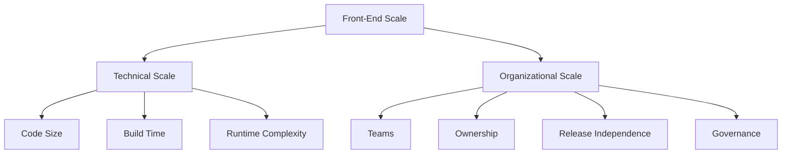

Micro-frontends mainly address organizational and deployment scale.

Monorepos often address coordination scale.

Design systems address UI consistency at scale.

Do not treat all of these as solutions to the same problem.

---

# 3. Reuse Is Not Automatically Good

A common goal is:

> We should reuse everything.

That sounds efficient.

But forced reuse can create fragile abstractions.

Suppose two interfaces contain visually similar cards.

One represents:

```text
Product
```

The other represents:

```text
Patient
```

Their current appearance may match.

Their domain behavior may not.

A shared component that tries to represent both can become:

```text
Card
with 27 props
and 14 conditional branches
```

This is not healthy reuse.

---

# 4. Prefer Stable Shared Concepts

Good shared abstractions often represent stable concepts such as:

```text
Button
TextInput
Dialog
Stack
Grid
Tooltip
Badge
Table primitive
```

These are primarily interface primitives.

Domain-specific components such as:

```text
PatientAdmissionCard
InvoiceApprovalPanel
ProductInventoryEditor
```

usually belong closer to the domain feature.

Conceptually:

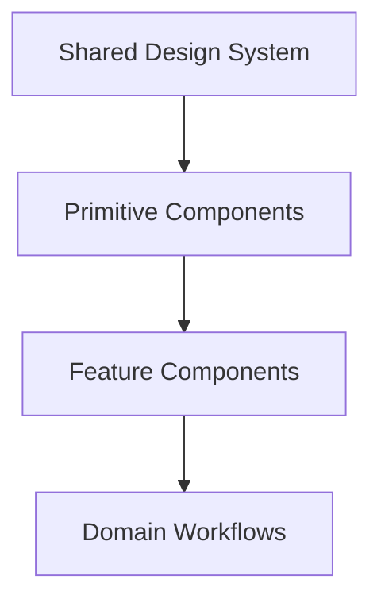

Reuse becomes narrower as domain meaning increases.

---

# 5. Component Library vs Design System

These terms are often used interchangeably.

They are related but not identical.

## Component library

A collection of reusable implementation components.

Examples:

```text
Button
Input
Dialog
Tabs
Table
```

## Design system

A broader system containing:

- design principles;
- visual language;
- tokens;
- typography;
- spacing;
- components;
- interaction guidance;
- accessibility guidance;
- content patterns;
- contribution rules;
- governance.

A component library is often the implementation layer of a design system.

---

# 6. A Design System Is a Product

A weak design-system effort treats the library as:

```text
shared folder where components go
```

A mature design system behaves like a product.

It has:

- users;
- maintainers;
- documentation;
- roadmap;
- issue tracking;
- release process;
- deprecation policy.

Its users are product teams.

Its value is reducing repeated design and implementation decisions.

---

# 7. Design-System Architecture

A useful conceptual structure:

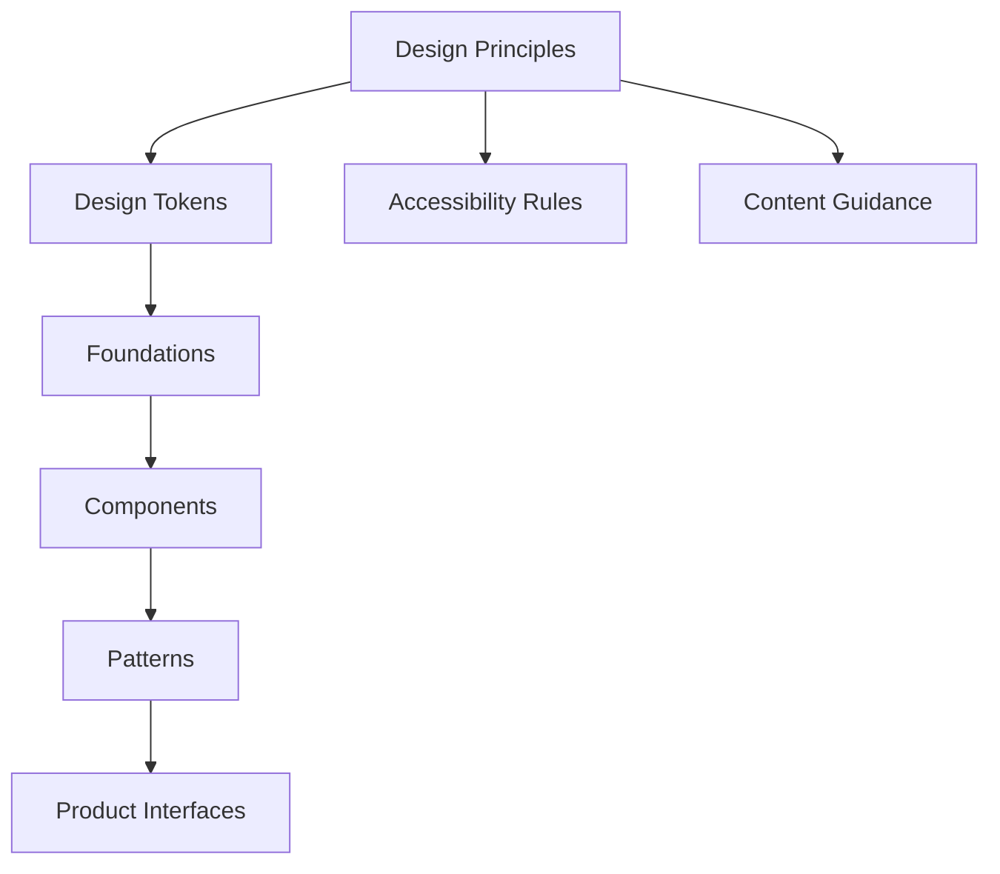

Each level depends on more stable lower-level decisions.

---

# 8. Foundations

Design-system foundations often include:

- typography;
- spacing;
- color;
- elevation;
- motion;
- iconography;
- border radius;
- responsive rules.

These are broader than individual components.

For example:

```text
Button padding
Input padding
Card padding
```

may all derive from one spacing system.

That is more coherent than every component inventing spacing independently.

---

# 9. Design Tokens

A **design token** gives a semantic name to a design decision.

Raw CSS:

```css
color: #1f4f9a;
```

Token-style representation:

```text
color.action.primary
```

or:

```css
--color-action-primary
```

The value is not important by itself.

The relationship is.

---

# 10. Raw Tokens and Semantic Tokens

A design system may distinguish:

### Raw/foundation tokens

```text
blue.500
space.4
font.size.300
```

### Semantic tokens

```text
color.text.primary
color.action.primary
space.component.inline
```

Architecture:

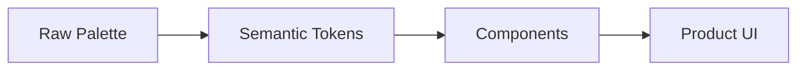

Semantic tokens describe purpose rather than appearance.

This allows the raw implementation to change.

---

# 11. Why Semantic Tokens Matter

Suppose:

```text
color.action.primary = blue.600
```

A new brand may define:

```text
color.action.primary = green.600
```

Components still use:

```text
color.action.primary
```

The design meaning remains stable.

This is stronger than product code containing:

```text
#0057b8
```

everywhere.

---

# 12. Token Interoperability

Design tokens have historically existed in many custom JSON formats.

The ecosystem is moving toward more interoperable formats across:

- design tools;
- code generators;
- platforms;
- build systems.

The Design Tokens Community Group has published a stable format specification, which is significant because design tokens increasingly need to travel between tools rather than live in one proprietary structure.

For architecture, the important point is:

> Design decisions should be represented in a platform-independent layer before becoming CSS variables, native mobile values, or design-tool styles.

---

# 13. Token Pipeline

Conceptually:

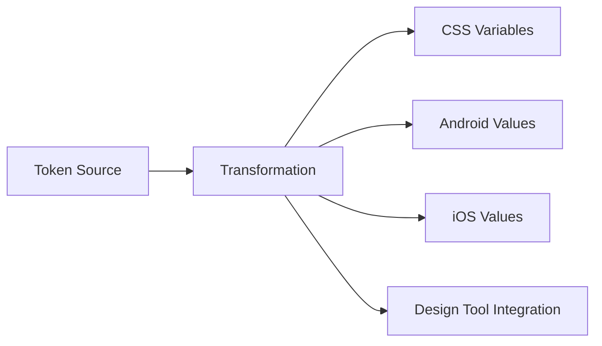

A web project may only use CSS today.

A platform-neutral token model can preserve future flexibility.

---

# 14. CSS Variables as Runtime Tokens

On the web, custom properties are a natural implementation target.

Example:

```css
:root {
  --color-text-primary:
    #1a1a1a;

  --color-surface:
    #ffffff;
}
```

Dark theme:

```css
[data-theme="dark"] {
  --color-text-primary:
    #f5f5f5;

  --color-surface:
    #111111;
}
```

Components use the semantic token rather than theme-specific values.

This connects directly to Chapter 3.

---

# 15. Tokens Are Not a Complete Design System

A token file does not define:

- Button behavior;
- keyboard interaction;
- focus management;
- Dialog semantics;
- form validation patterns.

Tokens encode design decisions.

Components and patterns encode interface behavior.

Do not reduce design systems to:

```text
shared colors
```

---

# 16. Component API Stability Matters More at Scale

Suppose a Button API is:

```jsx
<Button
  variant="primary"
  size="medium"
/>
```

Ten teams use it.

Changing:

```text
variant
```

to:

```text
appearance
```

creates migration work.

A public component API is effectively a contract.

This means design-system maintainers should think like library authors.

---

# 17. Public vs Internal Component APIs

A component may expose:

```text
public props
events
slots/children
CSS customization hooks
```

Internally it may use:

```text
private classes
internal components
implementation utilities
```

Consumers should depend only on the public surface.

Architecture:

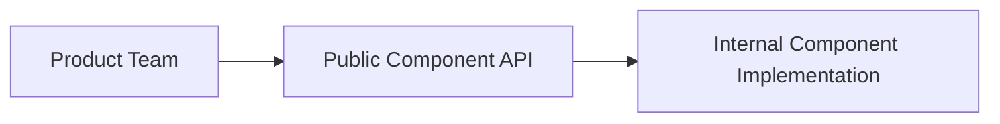

This allows internal refactoring without breaking consumers.

---

# 18. Escape Hatches

A component system needs flexibility.

But excessive escape hatches undermine consistency.

Examples:

```text
arbitrary className overrides
raw internal DOM access
unrestricted CSS selectors
slot anything anywhere
```

A healthy system balances:

```text
consistency
+
composition
+
intentional customization
```

A rigid system gets bypassed.

An unrestricted system stops being a system.

---

# 19. Headless Components at Scale

Chapter 6 introduced headless UI.

At design-system scale, headless primitives can be useful when:

- behavior should be shared;
- visual treatment varies by brand;
- accessibility logic is complex.

Example:

```text
Dialog behavior
```

can be shared separately from:

```text
Dialog visual styling
```

But splitting behavior and visuals also increases implementation complexity.

Use this pattern where variation justifies it.

---

# 20. Accessibility Is Part of the Component Contract

If a shared Dialog handles:

- focus trapping;
- Escape behavior;
- accessible labeling;
- return focus;

correctly, every product team benefits.

This is one of the strongest reasons to centralize complex interaction primitives.

A shared component can multiply good accessibility.

It can also multiply a bug.

Therefore shared components require stronger testing than one-off feature code.

---

# 21. Design-System Documentation

A mature component should document:

- purpose;
- examples;
- API;
- accessibility behavior;
- content guidance;
- allowed variants;
- anti-patterns.

The goal is not only:

> Here is the code.

The goal is:

> Here is when this component should be used.

This reduces inappropriate reuse.

---

# 22. Component Explorers

Tools such as Storybook-style component explorers can provide:

- isolated examples;
- state variations;
- documentation;
- interaction testing;
- visual review.

The exact tool is less important than the workflow:

```text
component
→ examples
→ review
→ regression testing
```

This makes shared UI behavior visible before it enters product pages.

---

# 23. Design-System Versioning

A design system evolves.

Changes can be:

- bug fixes;
- new components;
- new variants;
- breaking API changes;
- token changes;
- visual redesign.

Consumers need a predictable upgrade model.

This is where package versioning enters architecture.

---

# 24. Semantic Versioning

A common convention is:

```text
MAJOR.MINOR.PATCH
```

Conceptually:

### PATCH

Compatible bug fix.

### MINOR

Backward-compatible new capability.

### MAJOR

Breaking change.

Reality is more nuanced.

A visual change can be breaking even if TypeScript signatures do not change.

Versioning should reflect consumer impact, not only code syntax.

---

# 25. Visual Changes Can Be Breaking Changes

Suppose Button height changes:

```text
40px
→
48px
```

No API changed.

But product layouts may break.

Likewise:

```text
default focus style changed
default spacing changed
font metrics changed
```

may affect screenshots and layouts.

Design systems need to treat visual behavior as part of the contract.

---

# 26. Deprecation

Instead of immediately removing an old API:

```text
Button tone="danger"
```

a library can deprecate it.

Documentation can say:

```text
Use intent="danger" instead.
```

A future major version removes the old API.

This gives consumers migration time.

---

# 27. Deprecation Lifecycle

A useful lifecycle:


Do not keep every deprecated API forever.

Otherwise complexity accumulates indefinitely.

---

# 28. Codemods

A codemod automatically transforms source code.

Suppose:

```jsx
<Button
  tone="danger"
/>
```

becomes:

```jsx
<Button
  intent="danger"
/>
```

A codemod can migrate many applications automatically.

For large organizations, migration tooling can be as important as API design.

---

# 29. Release Notes and Migration Guides

A shared package should communicate:

```text
what changed
why it changed
who is affected
how to migrate
```

Do not force consumers to reverse-engineer release differences from Git commits.

Architecture includes communication.

---

# 30. Shared Packages

Beyond UI, organizations may share packages such as:

```text
@company/ui
@company/auth
@company/http
@company/analytics
@company/catalogue-domain
@company/eslint-config
```

Each package creates an architectural boundary.

The most important question is:

> What stable responsibility does this package own?

---

# 31. Package Boundaries Are Stronger Than Folders

Inside one application:

```text
src/utils/
```

is only a convention.

A package boundary can define:

- public exports;
- dependency rules;
- version;
- release lifecycle.

Architecture:

```mermaid
flowchart TD
    A[Application] --> B[@company/ui]
    A --> C[@company/domain]
    A --> D[@company/auth]

    B --> E[Internal UI Modules]
    C --> F[Internal Domain Modules]
```

This makes responsibility more explicit.

---

# 32. Avoid the “Shared Everything” Package

A package called:

```text
@company/shared
```

often becomes:

```text
helpers
types
constants
components
API clients
business rules
```

for every application.

This creates a dependency magnet.

Eventually every application depends on everything.

Prefer smaller responsibility-oriented packages.

---

# 33. Shared Domain Packages

Some domain knowledge can legitimately be shared.

Example:

```ts
export type Currency =
  "USD"
  | "EUR"
  | "IQD";
```

or:

```ts
export function calculateTax(
  ...
) {
  ...
}
```

But be careful.

If two applications represent different workflow contexts, forcing them through one domain package can create coupling.

Shared code should represent genuinely shared semantics.

---

# 34. Shared Types Can Create False Confidence

Suppose frontend and backend both use:

```ts
type User = ...
```

from one shared package.

This can improve compile-time consistency.

But it does not remove the runtime boundary.

Network data must still be validated.

Shared static types do not prove:

```text
deployed backend
and
deployed frontend
```

are using matching versions at runtime.

Chapter 5 still applies.

---

# 35. Internal Package Dependency Direction

A healthy architecture may look like:

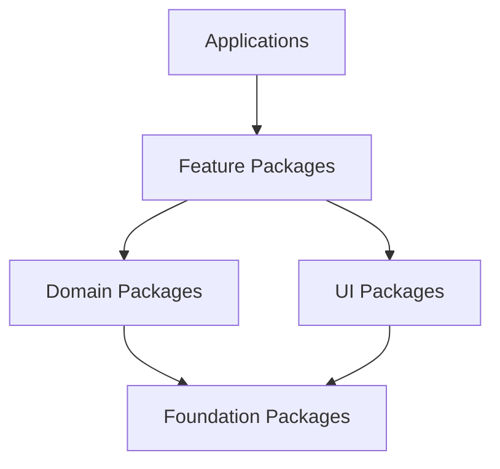

Lower-level packages should not import higher-level applications.

This keeps dependency direction understandable.

---

# 36. Workspaces

Chapter 12 introduced package-manager workspaces.

A repository may contain:

```text
apps/
packages/
```

managed under one root.

Workspaces simplify:

- local package linking;
- dependency installation;
- shared scripts.

Modern package managers support this pattern directly.

The architectural benefit is not the directory layout.

It is the ability to coordinate related packages without publishing every intermediate change.

---

# 37. Monorepo

A **monorepo** stores several related projects in one repository.

Example:

```text
company-web/
├── apps/
│   ├── admin/
│   ├── storefront/
│   └── docs/
├── packages/
│   ├── ui/
│   ├── auth/
│   └── analytics/
└── tooling/
```

A monorepo is not simply:

```text
one large application
```

It can contain multiple independently deployed applications.

---

# 38. Monorepo Benefits

Potential benefits include:

### Atomic changes

Update shared package and consumers together.

### Refactoring

Search and modify across applications.

### Shared tooling

One place for:

```text
lint
TypeScript config
test config
build conventions
```

### Visibility

Teams can see how shared libraries are used.

### Dependency consistency

Common versions can be coordinated.

These benefits can be substantial.

---

# 39. Monorepo Costs

Potential costs include:

- repository size;
- slow CI;
- broad permissions;
- complex ownership;
- dependency graph growth;
- release coordination.

A monorepo does not automatically solve architecture.

It can make coupling easier because every project is physically nearby.

Governance still matters.

---

# 40. Monorepo vs Polyrepo

A **polyrepo** strategy uses separate repositories.

Conceptual comparison:

| Concern | Monorepo | Polyrepo |
|---|---|---|
| Cross-project refactoring | Easier | Harder |
| Atomic changes | Easier | Requires coordination |
| Isolation | Lower by default | Stronger |
| Repository size | Larger | Smaller |
| Independent permissions | More complex | Natural |
| Shared tooling | Easier | Requires distribution |

Neither strategy is universally correct.

---

# 41. Monorepo Is Not Micro-Frontend Architecture

This distinction is essential.

You can have:

```text
monorepo
+
one deployed application
```

You can also have:

```text
monorepo
+
five independent applications
```

And:

```text
micro-frontends
+
multiple repositories
```

Repository structure and runtime composition are different architectural dimensions.

---

# 42. Task Graphs

A monorepo may contain dependencies such as:

```text
admin
→ ui
→ tokens
```

The build system can construct a task graph.


If only `admin` changes, rebuilding unrelated packages may be unnecessary.

Task-graph tooling can improve CI efficiency.

---

# 43. Affected Builds

Suppose this change affects:

```text
packages/ui/Button
```

Consumers:

```text
admin
storefront
docs
```

may need testing.

But:

```text
analytics-service-ui
```

might not.

An affected-project system computes which tasks need to run from the dependency graph.

This becomes increasingly valuable as monorepos grow.

---

# 44. Caching Build Tasks

If a build task has:

```text
same source inputs
same dependencies
same configuration
```

its output may be reusable.

Task caching can avoid repeating:

- build;
- lint;
- tests.

This is distinct from browser caching.

It is developer/CI computation caching.

---

# 45. Remote Build Cache

A team can share task results.

Conceptually:

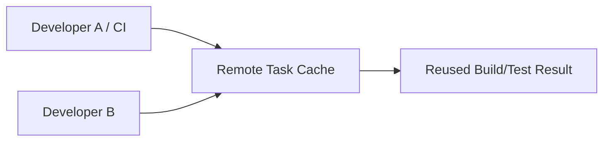

This can improve large-repository feedback time.

But cached tasks must have correct input definitions.

A wrong cache key can reuse invalid output.

---

# 46. Repository Ownership

Large repositories need ownership rules.

Examples:

```text
packages/ui
→ Design Systems Team

packages/auth
→ Identity Team

apps/admin
→ Admin Product Team
```

Ownership may be documented through:

- CODEOWNERS;
- repository metadata;
- internal catalogs.

Code ownership should reflect real responsibility.

---

# 47. Ownership Does Not Mean Gatekeeping Every Change

If one central team must manually approve every trivial use or contribution, the system becomes a bottleneck.

Healthy ownership distinguishes:

```text
maintain responsibility
```

from:

```text
personally implement every change
```

Contribution models matter.

---

# 48. Federated Contribution

A design-system team may own standards while product teams contribute components or fixes.

A contribution path can be:


This distributes implementation without abandoning consistency.

---

# 49. Platform Teams

As organizations grow, some teams provide shared frontend infrastructure.

A platform team may own:

- application templates;
- build standards;
- CI workflows;
- deployment tooling;
- authentication integration;
- observability integration;
- design-system infrastructure;
- testing defaults.

The platform should reduce cognitive load for product teams.

---

# 50. Platform as a Product

A platform team should not become:

```text
the team that says no
```

It should provide:

```text
paved roads
```

that make the safe, supported approach easier.

For example:

```text
create new frontend app
```

could automatically include:

- TypeScript strict mode;
- testing;
- linting;
- monitoring;
- security headers;
- deployment pipeline.

Standardization becomes a productivity tool.

---

# 51. Paved Road vs Mandatory Road

A **paved road** is a supported default path.

Teams can use:

```text
recommended framework
recommended build
recommended deployment
```

with minimal setup.

Exceptions may still be possible when requirements justify them.

This is healthier than:

```text
every team invents everything
```

or:

```text
every team is forbidden from deviating under any circumstances
```

---

# 52. Golden Path

A mature platform may provide a **golden path**:

```text
repository template
+
CI
+
monitoring
+
security defaults
+
design system
+
deployment
```

The ideal developer experience is:

```text
focus on product behavior
```

rather than rebuilding infrastructure.

---

# 53. Shared Infrastructure Must Remain Replaceable

Centralized tooling can become dangerous if every application depends on one undocumented internal abstraction.

For example:

```text
@company/magic-framework
```

that wraps:

- router;
- auth;
- API;
- build;
- deployment;
- analytics

may become impossible to upgrade.

Platform abstractions should expose stable responsibilities and avoid unnecessary hidden coupling.

---

# 54. Versioning Internal Packages

A monorepo does not eliminate versioning concerns.

Possible models include:

### Fixed/lockstep versions

All packages share one release version.

### Independent versions

Each package versions separately.

### Source-consumed internal packages

Applications build directly from workspace source.

Each model has trade-offs.

The correct choice depends on:

- independent publishing;
- release cadence;
- external consumers;
- deployment model.

---

# 55. Lockstep Versioning

Example:

```text
@company/ui 4.2.0
@company/auth 4.2.0
@company/data 4.2.0
```

Advantages:

- simple release story.

Costs:

- unrelated packages appear to change together;
- version meaning becomes less specific.

This can work for tightly coupled framework packages.

---

# 56. Independent Versioning

Example:

```text
@company/ui 7.1.0
@company/auth 3.4.2
@company/data 5.0.0
```

Advantages:

- versions reflect each package's changes.

Costs:

- more release coordination;
- dependency compatibility can become complex.

This fits more independently reusable packages.

---

# 57. Source Consumption in Monorepos

An application may import workspace source directly.

That simplifies local development.

But deployment and release architecture still need answers:

- Which commit produced production?
- Are all apps deployed together?
- Can one app use an older UI package?
- Can packages be published externally?

Repository convenience does not remove release decisions.

---

# 58. Design-System Distribution

A design system can be consumed as:

```text
npm package
workspace package
source package
CDN assets
```

For modern component systems, package distribution is common.

A product team should not copy component source manually into each app.

Copying creates divergence.

---

# 59. Shared Runtime Dependencies

Suppose every application uses React.

A shared component package may declare React as a peer dependency rather than bundling another copy.

Otherwise a consumer could accidentally receive multiple framework runtimes.

Package contracts need to distinguish:

```text
dependencies
peer dependencies
dev dependencies
```

This connects to Chapter 12.

---

# 60. Micro-Frontends

A **micro-frontend** architecture divides one user-facing product into independently owned frontend applications or slices.

The motivation is often organizational:

```text
Team A owns checkout
Team B owns account
Team C owns search
```

Each team may need:

- independent codebase;
- independent release;
- technology autonomy.

This resembles microservices thinking applied to frontend delivery.

---

# 61. Micro-Frontends Are Not “Small Components”

A Button is not a micro-frontend.

A ProductCard is not a micro-frontend.

Micro-frontends usually represent larger business capabilities or route-level areas.

Examples:

```text
checkout
account management
seller dashboard
search
```

A useful boundary is often aligned with a team-owned business domain.

---

# 62. Micro-Frontend Motivation

The strongest reasons are organizational.

Examples:

- teams cannot release independently;
- one frontend repository/build blocks many teams;
- domains have clear ownership;
- deployment cadence differs substantially;
- acquisitions bring independently developed products.

Weak reason:

> Micro-frontends are modern.

Do not adopt the pattern without a scaling problem that it solves.

---

# 63. Vertical Slicing

A healthy micro-frontend boundary often owns a vertical slice:

```text
route
UI
domain logic
API integration
tests
deployment
```

For example:

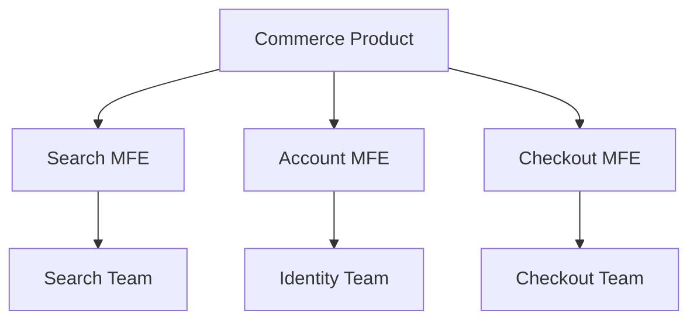

This aligns runtime architecture with team ownership.

---

# 64. Route-Level Composition

One simple micro-frontend strategy is route-level separation.

Example:

```text
/search
→ Search app

/account
→ Account app

/checkout
→ Checkout app
```

A gateway or server routes requests to different frontend applications.

This provides strong isolation.

It can be simpler than combining multiple frameworks inside one page.

---

# 65. Server-Side Composition

The server or edge layer can compose page fragments from several applications.

Conceptually:

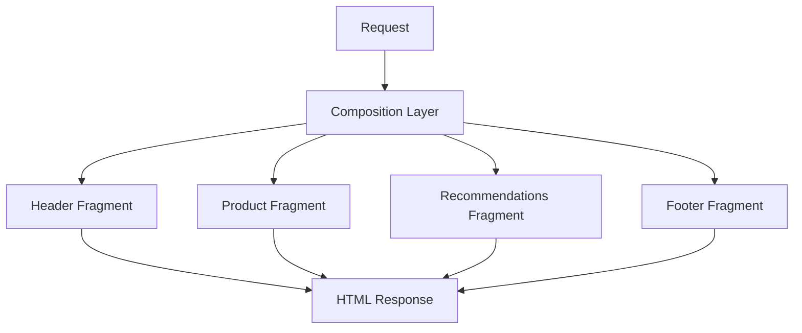

This approach keeps composition outside browser runtime.

It introduces server orchestration complexity.

---

# 66. Client-Side Composition

A host application can load frontend fragments at runtime.

Conceptually:

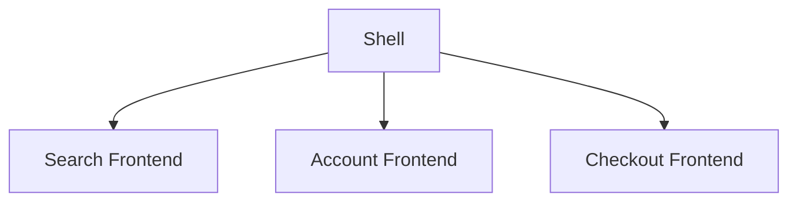

This can enable independent deployment.

It also introduces questions about:

- shared dependencies;
- routing;
- global state;
- CSS isolation;
- error containment.

---

# 67. Build-Time Composition

Another approach is publishing packages.

Team A publishes:

```text
@company/search
```

The shell imports it at build time.

This has strong build integration.

But updates require rebuilding/redeploying the shell.

Therefore it does **not** provide true runtime deployment independence.

Do not call every shared package a micro-frontend.

---

# 68. Runtime Independence

A strong micro-frontend architecture often aims for:

```text
Team A deploys Search
without
rebuilding Checkout
```

This independence is the primary architectural benefit.

But it also means compatibility must be handled at runtime.

That is harder than compile-time package compatibility.

---

# 69. Micro-Frontend Shell

Many architectures contain an **application shell**.

The shell may own:

- top-level navigation;
- authentication context;
- route mapping;
- global layout;
- design-system baseline;
- telemetry integration.

But the shell should avoid becoming:

```text
the real monolith
```

If every business decision still lives in the shell, independence is superficial.

---

# 70. Shared State Across Micro-Frontends

This is one of the hardest problems.

Suppose:

```text
Search MFE
```

selects a product.

```text
Cart MFE
```

needs to know.

Possible communication mechanisms include:

- URL;
- browser events;
- shared service;
- shared API/server state;
- intentionally shared runtime store.

The safest default is:

> Share as little client state as possible.

Cross-MFE state creates coupling.

---

# 71. Prefer Server and URL Contracts

If two micro-frontends can coordinate through:

```text
server state
```

or:

```text
URL state
```

that is often more robust than sharing internal in-memory objects.

Example:

```text
/product/P-42
```

is a stable cross-application contract.

A shared React context instance across independently deployed apps is much more fragile.

---

# 72. Custom Events

Browser custom events can provide a lightweight communication mechanism.

Example:

```js
window.dispatchEvent(
  new CustomEvent(
    "cart:item-added",
    {
      detail: {
        productId:
          "P-42"
      }
    }
  )
);
```

Consumers can listen.

But event names and payload schemas become public contracts.

Version them conceptually like APIs.

---

# 73. Micro-Frontend Contract Design

Contracts may include:

- route paths;
- DOM mounting points;
- custom events;
- shared dependency versions;
- component APIs;
- authentication context;
- design tokens.

The key principle is:

> Independent deployment increases the importance of stable contracts.

Compile-time errors may no longer protect you.

---

# 74. CSS Isolation

Independent frontends can interfere through global CSS.

Suppose one team writes:

```css
button {
  border: 0;
}
```

This can affect another team.

Possible mitigation includes:

- shared design system;
- CSS Modules;
- scoped styles;
- Shadow DOM in appropriate cases;
- namespace conventions.

A micro-frontend architecture without styling governance can become visually unstable.

---

# 75. Design System as the Visual Contract

Micro-frontends need visual consistency.

A shared design system can provide:

- tokens;
- components;
- typography;
- spacing;
- accessibility behavior.

This lets independently deployed slices still feel like one product.

Architecture:

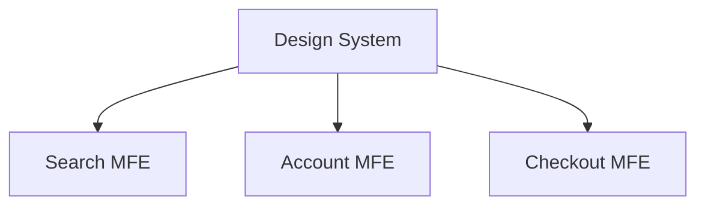

The design system becomes an organizational contract.

---

# 76. Design-System Version Drift

Independent deployment can produce:

```text
Search → UI v7
Account → UI v6
Checkout → UI v5
```

The product may show visible inconsistency.

Micro-frontends therefore need an upgrade strategy.

Independent deployment does not mean:

```text
never coordinate anything
```

---

# 77. Shared Runtime Dependencies

If each MFE ships:

```text
React
router
design system
```

the page may download duplicates.

Runtime sharing can reduce duplication.

But shared dependencies create compatibility coupling.

For example:

```text
Search requires React A
Checkout requires React B
```

The architecture must decide whether:

- each ships its own runtime;
- one shared runtime is enforced;
- compatible ranges are negotiated.

There is no free option.

---

# 78. Module Federation

**Module Federation** is a runtime module-sharing and composition model associated with modern bundler ecosystems.

Its important idea is:

> One independently built application can expose modules that another application loads at runtime.

Conceptually:


This can support independently deployed micro-frontends.

---

# 79. Host and Remote

A typical conceptual model includes:

### Host

Loads remote modules.

### Remote

Exposes modules such as:

```text
CheckoutApp
SearchWidget
AccountRoutes
```

The host does not need the remote implementation during its own original compilation in the same way as a normal local module.

The integration occurs at runtime.

---

# 80. Runtime Module Loading

Suppose Checkout exposes:

```text
./CheckoutApp
```

The shell can load it when the checkout route is visited.

Architecture:

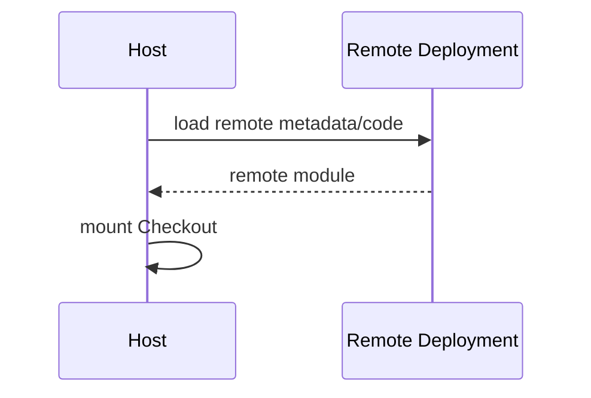

If Checkout deploys a new compatible version, the shell can consume it without rebuilding.

That is powerful.

It also creates runtime failure modes.

---

# 81. Runtime Failure

What happens if:

```text
remote server unavailable
```

?

The shell must not simply crash.

It may need:

```text
error boundary
fallback
retry
maintenance message
```

Runtime composition turns deployment availability into UI reliability architecture.

---

# 82. Shared Dependencies in Module Federation

Federation systems may allow libraries to be shared.

Conceptually:

```text
host has React
remote requests compatible React
→ reuse shared runtime
```

This can reduce duplicate downloads.

But compatibility rules become critical.

If one remote requires an incompatible runtime, choices become difficult.

---

# 83. Singleton Dependencies

Some runtime libraries should not exist multiple times in one integrated application.

Examples may include:

- framework runtime;
- router context;
- state container.

Federation can configure selected dependencies as singleton-like shared resources.

This reduces duplication.

It increases coordination requirements.

---

# 84. Version Compatibility

Runtime sharing needs rules such as:

```text
required version
compatible range
fallback
strict mode
```

This is now runtime dependency management.

That is more complex than package-manager resolution during one build.

Do not adopt federation without operational maturity.

---

# 85. Deployment Independence vs Runtime Coupling

Module Federation can provide:

```text
independent deployment
```

while still creating:

```text
runtime dependency
```

between host and remote.

This is an important trade-off.

Independent release does not mean independent failure.

---

# 86. Micro-Frontend Observability

Suppose a page fails.

Which team owns the error?

A mature architecture should tag telemetry with:

```text
application slice
version
team
route
deployment
```

Otherwise one integrated page becomes operationally opaque.

Chapter 17 will expand this.

---

# 87. Micro-Frontend Testing

Testing layers may include:

### Remote independently

Does Checkout work alone?

### Contract testing

Does it expose the expected integration surface?

### Shell integration

Can the host load and mount it?

### End-to-end

Does the customer journey work across Search → Cart → Checkout?

Independence must not eliminate integrated testing.

---

# 88. Micro-Frontend Deployment

One possible architecture:

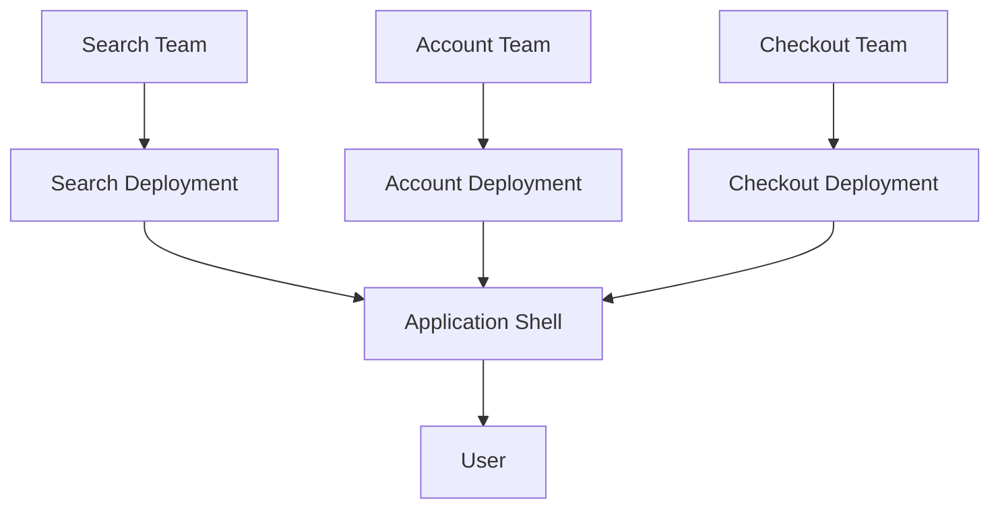

Each deployment can move independently.

The shell needs compatibility and rollback strategies.

---

# 89. Rollback

Suppose Checkout version 31 breaks production.

A strong deployment system should allow:

```text
31
↓ rollback
30
```

without requiring all other micro-frontends to redeploy.

Independent deployment should come with independent rollback.

Otherwise the organizational benefit is incomplete.

---

# 90. Canary Releases

A team might expose a new remote version to:

```text
5% of traffic
```

before full release.

This can reduce deployment risk.

But mixed-version operation means:

```text
host + old remote
host + new remote
```

must both be compatible during rollout.

Runtime architecture affects release strategy.

---

# 91. Micro-Frontend Security

Runtime-loaded code executes with substantial application privileges.

A compromised remote can potentially access:

- DOM;
- browser storage;
- user interaction;
- APIs available to the origin.

Micro-frontends do not create automatic security isolation merely because different teams own them.

If stronger isolation is required, technologies such as:

- iframes;
- separate origins;

may be necessary.

---

# 92. Same-Origin Micro-Frontends Share Trust

If:

```text
search.example.com code
```

is loaded into:

```text
app.example.com
```

and executes in the app's context, the code may have broad access.

Team boundaries are not browser security boundaries.

This connects directly to Chapter 13.

---

# 93. Iframe Isolation

An iframe can provide stronger runtime separation.

Conceptually:

```mermaid
flowchart LR
    A[Host] --> B[iframe]
    B --> C[Separate Origin App]
```

Communication occurs through explicit mechanisms such as:

```text
postMessage
```

Benefits:

- stronger isolation.

Costs:

- integration complexity;
- navigation issues;
- accessibility;
- sizing;
- styling;
- communication.

Use when actual security or legacy isolation justifies it.

---

# 94. Independent Frameworks

Micro-frontends sometimes allow:

```text
Search → React
Account → Vue
Legacy → Angular
```

This can help during migrations or acquisitions.

But running several frameworks in one page increases:

- bytes;
- runtime complexity;
- developer cognitive load.

Technology independence should solve a real organizational need.

Do not treat framework diversity as a goal.

---

# 95. The Conway's Law Effect

Software architecture often reflects communication structures.

If:

```text
Team Search
Team Checkout
Team Account
```

own separate business domains, architecture may naturally align with those boundaries.

If one micro-frontend spans work from five teams, ownership becomes unclear.

Architecture should make team responsibility easier, not harder.

---

# 96. Team Topology and Front-End Architecture

A useful model:

```mermaid
flowchart TD
    A[Stream-Aligned Product Teams] --> B[Business Capabilities]

    C[Platform Team] --> D[Tooling / Deployment / Standards]

    E[Design System Team] --> F[Shared UI Language]

    B --> G[Customer Product]
    D --> G
    F --> G
```

The platform and design system reduce repeated infrastructure work.

Product teams own business outcomes.

---

# 97. When a Monolith Is Better

A modular frontend monolith can be excellent.

Characteristics:

```text
one deployment
clear feature modules
shared build
strong internal boundaries
```

Advantages:

- simpler integration;
- simpler debugging;
- atomic releases;
- fewer runtime failure modes.

Do not split into micro-frontends if a modular monolith is working well.

---

# 98. Modular Monolith First

A useful progression is:

```text
single app
↓
feature modules
↓
internal packages
↓
clear ownership
↓
independent deployments only if needed
```

This lets the organization discover stable boundaries before adding runtime distribution.

Premature micro-frontends can freeze poor boundaries into deployment contracts.

---

# 99. Signs Micro-Frontends May Be Justified

Potential signals include:

- many autonomous teams blocked by one release train;
- very large application with clear business-domain ownership;
- independent deployment is a real requirement;
- acquisitions must coexist temporarily;
- technology migration must happen incrementally;
- organizational boundaries are stable.

Even then, evaluate alternatives first.

---

# 100. Signs Micro-Frontends Are Probably Unnecessary

Warning signs:

```text
one small team
one application
same release cadence
same framework
no deployment bottleneck
```

If the main motivation is:

> Everyone is talking about micro-frontends.

do not proceed.

Architecture should solve actual constraints.

---

# 101. Decision Ladder

Before introducing runtime micro-frontends, consider:

```mermaid
flowchart TD
    A[Scaling Problem] --> B{Can feature modules solve it?}

    B -->|Yes| C[Modular Monolith]
    B -->|No| D{Can packages/workspaces solve it?}

    D -->|Yes| E[Shared Packages / Monorepo]
    D -->|No| F{Need independent deployment?}

    F -->|No| G[Keep Build-Time Integration]
    F -->|Yes| H[Evaluate Micro-Frontends]
```

This prevents solving an organizational problem with unnecessary runtime machinery.

---

# 102. Architecture Decision: Design System

Use a design system when:

- multiple products repeat interface decisions;
- accessibility behavior should be centralized;
- brand consistency matters;
- teams are duplicating foundational components.

Do not wait until 300 inconsistent components exist.

But do not build a 100-component system before product teams have actual repeated needs.

---

# 103. Architecture Decision: Monorepo

Consider a monorepo when:

- cross-project changes are common;
- shared packages are numerous;
- shared tooling is valuable;
- atomic refactoring matters.

Avoid assuming monorepo means:

```text
one team owns everything
```

Ownership can remain distributed.

---

# 104. Architecture Decision: Separate Repositories

Separate repositories can be appropriate when:

- permissions differ substantially;
- product lifecycles are independent;
- organizations are separate;
- deployment pipelines differ strongly;
- source visibility must be isolated.

The cost is more difficult cross-repository changes.

---

# 105. Architecture Decision: Runtime Federation

Consider Module Federation or similar runtime composition when:

- independent deployment is essential;
- a host/remote contract is acceptable;
- operational monitoring is mature;
- runtime failure is manageable;
- shared dependency strategy is clear.

Do not choose it simply to avoid publishing packages.

---

# 106. Migration Strategy

Suppose a large monolithic application needs decomposition.

Do not rewrite everything.

A gradual strategy can be:

```mermaid
flowchart LR
    A[Monolith] --> B[Identify Domain Boundary]
    B --> C[Extract Internal Module]
    C --> D[Assign Team Ownership]
    D --> E[Extract Package if Useful]
    E --> F[Independent Deployment if Justified]
```

Each step adds stronger isolation.

Stop when the problem is solved.

---

# 107. Strangler Pattern

A legacy application can be replaced gradually.

Example:

```text
/legacy/*
→ old frontend

/account/*
→ new frontend

/search/*
→ new frontend
```

As new areas replace old ones, the old application shrinks.

This is often safer than a full rewrite.

---

# 108. Shared Navigation During Migration

Several applications still need to feel like one product.

A shared navigation shell can provide:

- header;
- account menu;
- global search;
- route transition.

But keep domain logic out of the shell where possible.

The shell should integrate applications, not absorb them.

---

# 109. Cross-App Routing

Routes are one of the strongest contracts between independently deployed frontend areas.

Example:

```text
/account
/search
/checkout
```

Links can move between applications using ordinary browser navigation.

This provides a simple composition model.

Not every transition must remain within one SPA runtime.

---

# 110. Full Page Navigation Can Be a Feature

Developers often try to preserve SPA navigation across every micro-frontend boundary.

But full-page navigation offers:

- isolation;
- clean runtime reset;
- simple deployment independence;
- browser-standard behavior.

If transition latency is acceptable, it may be the simpler architecture.

Use SPA-style runtime composition only when the UX benefit justifies it.

---

# 111. Design-System Governance at Enterprise Scale

A mature design-system team may define:

```text
component proposal
accessibility review
API review
design review
release
deprecation
```

Governance should protect consistency without becoming bureaucratic.

The process should become more formal only as reuse impact grows.

---

# 112. Contribution Tiers

One model:

### Foundation

Highly governed:

```text
Button
Input
Dialog
Tokens
```

### Shared patterns

Moderate governance:

```text
DateRangePicker
DataTable
SearchFilters
```

### Product-specific

Owned by product team:

```text
PatientAdmissionPanel
InvoiceApprovalForm
```

Not every component needs design-system status.

---

# 113. Design-System Adoption

A design system only creates value if teams actually use it.

Adoption depends on:

- component quality;
- documentation;
- accessibility;
- migration support;
- support responsiveness;
- compatibility.

Mandating a poor component library creates local workarounds.

Make the shared path the easiest path.

---

# 114. Measuring Design-System Value

Useful signals may include:

- adoption across products;
- reduction in duplicated components;
- accessibility defects;
- upgrade lag;
- component usage;
- contribution activity;
- migration time.

Do not measure only:

```text
number of components published
```

More components are not automatically more value.

---

# 115. Measuring Monorepo Health

Signals can include:

- CI duration;
- cache hit rate;
- dependency cycles;
- cross-package change frequency;
- build graph size;
- ownership clarity.

A monorepo that takes two hours to validate every typo is not healthy simply because all code is centralized.

---

# 116. Measuring Micro-Frontend Health

Useful signals may include:

- deployment independence;
- cross-team release coordination;
- runtime failure frequency;
- duplicate JavaScript;
- contract breakages;
- upgrade drift;
- customer performance.

If teams still coordinate every release, the micro-frontend architecture may not be providing its intended benefit.

---

# 117. Avoid Architecture by Organization Chart Alone

Team boundaries change.

If every temporary team becomes a permanent runtime boundary, architecture can become fragmented.

Prefer boundaries around stable business capabilities.

Teams can move around them over time.

---

# 118. Stable Business Capabilities

Examples:

```text
checkout
identity
search
catalogue
billing
```

are often more stable than:

```text
Team Blue
Team Phoenix
Team 7
```

Architecture should outlive team naming.

---

# 119. Contracts Over Implementation Sharing

As independence increases, focus shifts from:

```text
share implementation
```

to:

```text
share contract
```

Examples:

```text
route contract
event schema
component API
token schema
API contract
```

This is a major scaling transition.

---

# 120. Build-Time Safety vs Runtime Safety

In one monorepo build:

```text
TypeScript can catch mismatch
```

In runtime federation:

```text
remote deployed later
```

the mismatch may appear only in production.

Therefore runtime-composed systems need stronger:

- compatibility rules;
- contract tests;
- monitoring;
- fallback behavior.

Independent deployment trades compile-time coordination for runtime resilience.

---

# 121. Failure Containment

Suppose Recommendations fails.

Should Checkout fail?

Probably not.

Micro-frontends should have containment boundaries.

Conceptually:

```mermaid
flowchart TD
    A[Shell] --> B[Search]
    A --> C[Recommendations]
    A --> D[Checkout]

    C -. failure .-> E[Recommendations Fallback]

    B --> F[Page Continues]
    D --> F
```

The architecture should degrade locally where possible.

---

# 122. Global Failure Dependencies

Some dependencies are truly global:

```text
authentication
routing shell
design token CSS
```

If they fail, many areas may fail.

Keep the set of global dependencies small.

The more shared runtime infrastructure exists, the less independent the applications really are.

---

# 123. Versioned Contracts

A runtime event could be:

```json
{
  "type":
    "cart:item-added",
  "version":
    2,
  "payload": {
    "productId":
      "P-42"
  }
}
```

Versioning may become useful as contracts evolve.

Do not add version fields mechanically.

But runtime independence requires a compatibility story.

---

# 124. Consumer-Driven Contract Thinking

If a remote exposes:

```text
CheckoutApp
```

the host depends on expectations.

Tests can verify:

- module exists;
- mounting API exists;
- required props/events remain compatible.

This resembles API contract testing.

Frontend runtime composition needs the same discipline as distributed backend systems.

---

# 125. Security Boundaries vs Team Boundaries

This distinction deserves repetition.

```text
Team ownership
```

does not equal:

```text
browser security isolation
```

Two independently deployed modules running in the same page origin usually share substantial browser authority.

If true isolation is required, architecture must use browser-enforced mechanisms.

---

# 126. Performance Budget Across Micro-Frontends

Each team may say:

```text
our bundle is only 300 KB
```

Five teams can produce:

```text
1.5 MB
```

plus duplicated frameworks.

The shell needs page-level performance governance.

A distributed organization still creates one customer experience.

---

# 127. Shared Performance Budget

A platform team may define:

```text
initial JS budget
route JS budget
image policy
Core Web Vitals targets
```

Each micro-frontend consumes part of the shared budget.

This connects Chapter 14 to Chapter 15.

---

# 128. The Architecture Spectrum

Front-end scale is not binary.

A useful spectrum is:

```mermaid
flowchart LR
    A[Single Application] --> B[Feature Modules]
    B --> C[Internal Packages]
    C --> D[Monorepo Applications]
    D --> E[Route-Level Independent Apps]
    E --> F[Runtime Micro-Frontends]
    F --> G[Strongly Isolated Embedded Apps]
```

Moving right usually increases:

- independence;
- deployment flexibility.

It also increases:

- integration complexity;
- runtime failure modes;
- governance cost.

Choose the smallest level that solves the problem.

---

# 129. Misconceptions to Leave Behind

## “A design system is a component library.”

Incomplete.

A design system also includes principles, tokens, patterns, accessibility guidance, and governance.

---

## “Design tokens are just CSS variables.”

No.

Tokens represent platform-independent design decisions.

CSS variables are one possible web implementation.

---

## “Every reusable component belongs in the design system.”

No.

Domain-specific components often belong closer to product features.

---

## “More abstraction means more reuse.”

Not necessarily.

Premature abstraction can create complex generic components that fit nothing well.

---

## “Semantic versioning means only TypeScript API changes can be breaking.”

No.

Visual and behavioral changes can break consumers too.

---

## “Deprecated APIs should remain forever.”

No.

Deprecation should lead to migration and eventual removal.

---

## “A monorepo means one application.”

No.

A monorepo can contain many independently deployed applications and packages.

---

## “Workspaces and monorepos are identical.”

No.

Workspaces are package-management capabilities.

A monorepo is a repository strategy.

---

## “Monorepos automatically improve architecture.”

No.

They make coordination easier but can also make coupling easier.

---

## “A platform team should control every product decision.”

No.

The platform should provide shared infrastructure and supported paths while product teams own business behavior.

---

## “Micro-frontends mean breaking a page into tiny components.”

No.

They usually represent independently owned business capabilities or application slices.

---

## “Micro-frontends are more scalable than monoliths.”

Not automatically.

They mainly help when organizational/deployment independence is a real bottleneck.

---

## “Independent deployment means no coordination.”

No.

Runtime contracts, shared dependencies, design systems, and compatibility still require governance.

---

## “Module Federation makes micro-frontends easy.”

It solves runtime module composition.

It does not solve domain boundaries, ownership, CSS isolation, compatibility, observability, or UX.

---

## “Module Federation means remotes cannot break the host.”

No.

Runtime dependencies can fail and need containment.

---

## “Shared dependencies are always better.”

No.

They reduce duplication but increase runtime compatibility coupling.

---

## “Different teams automatically require different frameworks.”

No.

Technology diversity adds cost and should solve a real migration or autonomy problem.

---

## “Micro-frontends provide security isolation.”

Not when modules execute in the same browser origin/context.

Team isolation and browser security isolation are different.

---

## “Full page navigation is outdated.”

No.

It can provide strong isolation and simple deployment boundaries.

---

## “Every large company should use a monorepo.”

No.

Repository strategy should match collaboration and ownership needs.

---

## “Every enterprise should have a design system.”

Often useful, but the scope should emerge from repeated needs rather than bureaucracy.

---

# Chapter Summary

Scaling frontend architecture is not only about more code.

It is about more:

```text
teams
products
owners
releases
contracts
```

A design system scales visual and interaction decisions.

It may contain:

- principles;
- tokens;
- foundations;
- components;
- patterns;
- accessibility guidance;
- governance.

Design tokens represent reusable design decisions in a platform-independent form.

Semantic tokens describe purpose:

```text
color.action.primary
```

rather than raw implementation:

```text
blue.600
```

Shared component APIs become contracts at scale.

They therefore need:

- versioning;
- deprecation;
- documentation;
- migration support.

Shared packages create stronger architectural boundaries than folders.

They should represent stable responsibilities.

Workspaces make multiple local packages easier to coordinate.

A monorepo stores several applications and packages in one repository.

It can improve:

- atomic changes;
- refactoring;
- shared tooling;
- dependency consistency.

It also creates:

- CI complexity;
- ownership challenges;
- coupling risk.

Platform teams can provide paved roads for:

- build tooling;
- CI;
- deployment;
- observability;
- security;
- design systems.

Micro-frontends divide one product into independently owned frontend slices.

Their strongest justification is usually:

```text
organizational and deployment independence
```

rather than runtime performance.

A micro-frontend can be composed:

- by route;
- on the server;
- at build time;
- at runtime.

Module Federation is one runtime module-composition approach.

It can load independently built remote modules into a host application.

But runtime composition adds:

- compatibility concerns;
- availability concerns;
- shared-dependency complexity;
- contract testing;
- observability needs.

The safest architectural progression is usually:

```mermaid
flowchart LR
    A[Single App] --> B[Feature Modules]
    B --> C[Shared Packages]
    C --> D[Monorepo / Multiple Apps]
    D --> E[Independent Deployments]
    E --> F[Runtime Federation if Needed]
```

The chapter's central principle is:

> **Scale architecture only as far as the organization's real coordination problem requires.**

---

# Review Questions

1. How does organizational scale differ from technical scale?

2. Why can reuse become harmful?

3. What kinds of components are usually good design-system candidates?

4. What is the difference between a component library and a design system?

5. Why should a design system be treated as a product?

6. What are design-system foundations?

7. What is a design token?

8. What is the difference between a raw token and a semantic token?

9. Why are semantic tokens useful for theming?

10. Why are CSS variables not the same thing as design tokens?

11. Why is token interoperability valuable?

12. What responsibilities belong beyond tokens in a design system?

13. Why does component API stability matter more at scale?

14. What is a public component API?

15. Why are unrestricted escape hatches risky?

16. When can headless components help a design system?

17. Why is accessibility part of a component contract?

18. What should design-system documentation explain beyond API syntax?

19. What is semantic versioning?

20. Why can a visual change be breaking?

21. What is deprecation?

22. What is a codemod?

23. Why are migration guides important?

24. What makes a good shared package?

25. Why is a generic “shared” package often problematic?

26. When should domain logic be shared?

27. Why do shared TypeScript types not eliminate runtime validation?

28. What is dependency direction between packages?

29. What are package-manager workspaces?

30. What is a monorepo?

31. What are important monorepo benefits?

32. What are important monorepo costs?

33. How does a monorepo differ from a polyrepo?

34. Why is monorepo architecture different from micro-frontend architecture?

35. What is a task graph?

36. What is an affected build?

37. Why can build-task caching improve monorepo performance?

38. What is repository ownership?

39. Why should ownership not become unnecessary gatekeeping?

40. What is federated contribution?

41. What does a frontend platform team typically own?

42. What does “platform as a product” mean?

43. What is a paved road?

44. What is a golden path?

45. Why can an oversized internal framework become dangerous?

46. What is lockstep package versioning?

47. What is independent package versioning?

48. Why does source consumption in a monorepo not eliminate release decisions?

49. What is a micro-frontend?

50. Why is a small UI component not normally a micro-frontend?

51. What are the strongest motivations for micro-frontends?

52. What is vertical slicing?

53. What is route-level composition?

54. What is server-side frontend composition?

55. What is client-side composition?

56. Why is build-time package composition not the same as runtime micro-frontends?

57. What does independent deployment mean?

58. What responsibilities might an application shell own?

59. Why should shared state between micro-frontends be minimized?

60. Why are URL and server state useful cross-frontend contracts?

61. What are the risks of using custom events between micro-frontends?

62. What kinds of contracts exist between micro-frontends?

63. Why can global CSS cause micro-frontend problems?

64. Why is a shared design system important in independently deployed interfaces?

65. What is design-system version drift?

66. Why can independent micro-frontends duplicate framework runtimes?

67. What is Module Federation conceptually?

68. What is a host?

69. What is a remote?

70. What new failure mode appears when modules are loaded at runtime?

71. Why are shared runtime dependencies both useful and risky?

72. What is a singleton shared dependency?

73. Why does version compatibility become a runtime concern in federation?

74. Why does independent deployment not imply independent failure?

75. What does micro-frontend observability need to identify?

76. What testing layers are useful for micro-frontends?

77. Why should independent deployment also support independent rollback?

78. How do canary releases affect compatibility requirements?

79. Why are micro-frontends not automatic security boundaries?

80. When might iframe isolation be justified?

81. What cost does framework diversity introduce?

82. How does Conway's Law relate to frontend architecture?

83. What should a platform team provide to product teams?

84. Why can a modular monolith be the better architecture?

85. What does “modular monolith first” mean?

86. Which signals suggest micro-frontends may be justified?

87. Which signals suggest they probably are not?

88. What is the purpose of the micro-frontend decision ladder?

89. How can a monolithic application be decomposed gradually?

90. What is the strangler pattern?

91. Why can full-page navigation be useful between independently deployed apps?

92. What is design-system governance?

93. Why should not every shared component receive the same governance level?

94. What affects design-system adoption?

95. How can design-system value be measured?

96. How can monorepo health be measured?

97. How can micro-frontend health be measured?

98. Why should architecture align with stable business capabilities rather than temporary team names?

99. Why do runtime-composed systems need stronger contract testing?

100. What is failure containment?

101. Why should global runtime dependencies be minimized?

102. Why is a page-level performance budget important in micro-frontends?

103. What trade-off occurs as architecture moves from a single app toward runtime federation?

---

# End-of-Chapter Practical Lab — Scale One Front-End from App to Platform

Create:

```text
chapter-14-scale/
├── apps/
│   ├── storefront/
│   ├── admin/
│   └── docs/
├── packages/
│   ├── tokens/
│   ├── ui/
│   ├── catalogue-domain/
│   └── platform-config/
├── federation-demo/
│   ├── shell/
│   └── checkout/
└── architecture/
```

The lab should evolve one project through several scaling levels.

The goal is to understand why each new boundary exists.

---

## Stage 1 — Identify Repeated UI

Start with:

```text
Storefront
Admin
Docs
```

Each has its own:

```text
Button
Input
Card
```

Compare them.

Identify which differences are:

```text
accidental inconsistency
```

and which are:

```text
legitimate product differences
```

Do not centralize everything yet.

---

## Stage 2 — Create Design Tokens

Create platform-neutral token definitions for:

```text
color
spacing
typography
radius
```

Separate:

```text
raw values
```

from:

```text
semantic values
```

Example:

```text
blue.600
→
color.action.primary
```

Generate or map them to CSS custom properties.

---

## Stage 3 — Add Light and Dark Themes

Use semantic tokens so components do not need theme-specific values.

Create:

```text
light
dark
```

theme mappings.

Change the raw palette without modifying Button implementation.

Explain why semantic tokens created that flexibility.

---

## Stage 4 — Build a Shared Button

Create:

```text
@company/ui/Button
```

Expose only a deliberate API.

Document:

```text
intent
size
disabled
loading
```

Do not expose internal classes as the primary customization API.

---

## Stage 5 — Add Accessibility Contract

Document and test:

```text
keyboard behavior
focus state
accessible name
disabled behavior
```

Treat accessibility as part of the shared component contract.

---

## Stage 6 — Build Component Documentation

Create isolated examples for:

```text
default
primary
danger
disabled
loading
```

Use a component explorer if desired.

Add:

```text
when to use
when not to use
```

guidance.

---

## Stage 7 — Simulate a Breaking Change

Rename:

```text
tone
```

to:

```text
intent
```

Create:

```text
deprecation warning
migration guide
```

Optionally write a simple codemod or scripted transformation.

---

## Stage 8 — Create Workspace Packages

Create:

```text
@company/tokens
@company/ui
@company/catalogue-domain
```

Use package-manager workspaces.

The applications should consume local packages without publishing them externally.

---

## Stage 9 — Enforce Package Public APIs

Expose:

```text
@company/ui
```

through a deliberate package entry.

Prevent product applications from importing:

```text
@company/ui/src/internal/...
```

Document why this improves refactoring safety.

---

## Stage 10 — Draw the Package Dependency Graph

Create a Mermaid diagram showing:

```text
storefront
admin
docs
ui
tokens
catalogue-domain
```

Ensure dependency direction is clear.

Introduce one bad dependency intentionally.

Refactor it away.

---

## Stage 11 — Add Ownership

Assign conceptual owners:

```text
ui
→ Design System Team

catalogue-domain
→ Catalogue Team

admin
→ Admin Team
```

Create a CODEOWNERS-style ownership document or equivalent.

Explain why ownership reflects maintenance responsibility rather than exclusive permission to contribute.

---

## Stage 12 — Add Shared Tooling

Create:

```text
platform-config
```

for:

```text
lint config
TypeScript config
test defaults
```

Do not hide application architecture inside this package.

Keep it focused on platform/tooling responsibility.

---

## Stage 13 — Simulate an Atomic Cross-App Change

Change:

```text
Button API
```

and update:

```text
storefront
admin
docs
```

in one repository change.

Explain why monorepo atomicity is useful.

---

## Stage 14 — Simulate Affected Builds

Change only:

```text
catalogue-domain
```

Identify which apps/packages actually depend on it.

Draw the affected build graph.

Do not run unrelated tests conceptually.

---

## Stage 15 — Add Task Caching Conceptually

Define task inputs for:

```text
lint
test
build
```

Explain when a cached result is safe to reuse.

Explain the risk of incomplete cache inputs.

---

## Stage 16 — Design a Platform Golden Path

Document the default for a new application:

```text
TypeScript
lint
test
CI
monitoring
security defaults
design system
deployment
```

The goal is to reduce repeated setup.

Do not require product-specific business architecture.

---

## Stage 17 — Model Route-Level App Separation

Split conceptually:

```text
/
→ storefront

/admin
→ admin
```

Serve them as separate applications.

Use ordinary full-document navigation between areas.

Evaluate whether this already provides enough independence.

---

## Stage 18 — Build a Micro-Frontend Decision Record

Before implementing runtime federation, write an ADR answering:

```text
What problem are we solving?
Why are packages insufficient?
Why is route-level separation insufficient?
Why do we need independent deployment?
What new risks are introduced?
```

If the answer is weak, stop.

That is a valid lab result.

---

## Stage 19 — Build a Small Federation Demo

If proceeding, create:

```text
shell
checkout remote
```

The checkout application exposes one route-level module.

The shell loads it at runtime.

Keep the integration intentionally small.

---

## Stage 20 — Add Remote Failure Handling

Stop the Checkout remote.

The shell should render:

```text
Checkout is temporarily unavailable.
```

without crashing unrelated navigation.

This demonstrates runtime failure containment.

---

## Stage 21 — Explore Shared Dependencies

Configure or conceptually model:

```text
React/Vue runtime
design system
```

as shared dependencies.

Then answer:

```text
What happens if versions are incompatible?
```

Document the trade-off between:

```text
duplicate runtime
```

and:

```text
shared version coupling
```

---

## Stage 22 — Add an Integration Contract

Define the Checkout remote contract:

```ts
type CheckoutMountOptions = {
  container:
    HTMLElement;

  cartId:
    string;

  onComplete:
    (
      orderId:
        string
    ) => void;
};
```

Treat it as a public API.

Document versioning expectations.

---

## Stage 23 — Avoid Shared In-Memory Domain State

Instead of importing a global Cart store across shell and remote, coordinate using:

```text
cart ID
server API
URL where appropriate
```

Explain why this preserves deployment independence better.

---

## Stage 24 — Add a Custom Event

Create one low-coupling integration event:

```text
cart:item-added
```

Define and validate its payload.

Document:

```text
producer
consumers
event schema
```

Treat the event as a runtime contract.

---

## Stage 25 — Explore CSS Collision

In the remote, intentionally add:

```css
button {
  color: red;
}
```

Observe whether it affects the host.

Fix the problem using your chosen styling isolation strategy.

Explain why global CSS and independently deployed frontends conflict.

---

## Stage 26 — Use the Design System Across Host and Remote

Render the same shared Button in:

```text
shell
checkout
```

Then deliberately create version drift.

Compare the visual results.

Design an upgrade policy.

---

## Stage 27 — Draw the Runtime Architecture

Create a Mermaid diagram showing:

```text
browser
shell
remote frontend
shared design system
API
auth
telemetry
```

Mark:

```text
compile-time dependency
runtime dependency
network dependency
```

differently if possible.

---

## Stage 28 — Compare Three Architectures

Create a decision table for:

```text
modular monolith
monorepo with separate apps
runtime micro-frontends
```

Compare:

```text
deployment independence
runtime complexity
developer experience
failure isolation
performance
team autonomy
```

Do not declare one universally best.

---

## Stage 29 — Create the Final Scaling ADR

Choose the architecture you would recommend for:

```text
3 teams
2 web applications
shared design system
one release per day
same framework
```

Then choose for:

```text
20 teams
8 business domains
independent release requirements
multiple acquired legacy applications
```

Explain why the architecture changes.

---

# Key Terms

**Technical scale** — growth in code size, runtime complexity, build complexity, or application workload.

**Organizational scale** — growth in teams, ownership boundaries, release coordination, and governance.

**Component library** — a reusable set of implementation components.

**Design system** — a governed collection of design principles, tokens, foundations, components, patterns, accessibility guidance, and usage rules.

**Design token** — a platform-independent representation of a reusable design decision.

**Raw token** — a low-level design value such as a palette color or spacing step.

**Semantic token** — a token named according to design purpose rather than raw appearance.

**Token pipeline** — transformation of platform-neutral design tokens into platform-specific representations such as CSS custom properties.

**Component contract** — the public API, behavior, styling expectations, and accessibility guarantees exposed by a shared component.

**Deprecation** — marking an API as supported temporarily but planned for future removal.

**Codemod** — automated source-code transformation used to migrate APIs or syntax.

**Semantic Versioning** — a versioning convention using major, minor, and patch numbers to communicate compatibility intent.

**Shared package** — a package used by several applications or features to encapsulate reusable responsibility.

**Package public API** — the supported exports consumers may depend on.

**Workspace** — package-manager support for managing several local packages under one root project.

**Monorepo** — a source repository containing several applications, packages, or services.

**Polyrepo** — an organizational model using separate repositories for separate projects or packages.

**Task graph** — dependency graph describing the order and relationships among build, test, lint, or other repository tasks.

**Affected build** — running tasks only for projects influenced by a change according to dependency relationships.

**Task cache** — stored output of a deterministic development/CI task reused when its inputs have not changed.

**Platform team** — a team providing shared infrastructure, tooling, standards, and supported workflows to product teams.

**Paved road** — a supported, documented default engineering path designed to be easier than custom infrastructure.

**Golden path** — an integrated recommended workflow covering the common lifecycle of an application.

**Micro-frontend** — an independently owned and often independently deployed frontend application slice representing a larger business capability.

**Vertical slice** — a boundary containing UI, logic, data integration, tests, and ownership for one business capability.

**Application shell** — the host layer that integrates independently owned frontend areas and may provide global navigation and infrastructure.

**Runtime composition** — integrating independently built frontend modules while the application is running.

**Build-time composition** — integrating packages/modules into one application during the build.

**Module Federation** — a runtime module-sharing/composition model enabling independently built applications to expose and consume modules.

**Host** — an application that loads one or more federated remote modules.

**Remote** — an independently built deployment exposing modules for runtime consumption.

**Shared dependency** — a runtime library reused among independently built applications.

**Singleton dependency** — a shared runtime dependency intended to have one compatible instance in the integrated page.

**Runtime contract** — a compatibility agreement that must hold between independently deployed software while the system is running.

**Failure containment** — limiting the impact of one application or module failure so unrelated areas continue functioning.

**Design-system drift** — inconsistent design-system versions or implementations across products.

**Conway's Law** — the observation that system designs often reflect the communication structures of the organizations that create them.

**Strangler pattern** — gradually replacing parts of a legacy system while allowing old and new systems to coexist during migration.

---

# Closing Perspective

Front-end architecture does not scale simply by adding folders.

As organizations grow, architecture becomes a coordination system.

A design system coordinates interface decisions.

A package coordinates a reusable technical responsibility.

A monorepo coordinates source changes.

A platform team coordinates infrastructure.

A micro-frontend coordinates independent deployment boundaries.

Each solves a different scaling problem.

The mistake is to jump directly to the most distributed solution.

A large frontend often benefits first from:

```text
clear component boundaries
clear feature boundaries
clear packages
clear ownership
```

Only after those boundaries become stable should deployment independence be considered.

A design system should not become:

```text
a dumping ground for every component
```

A monorepo should not become:

```text
permission to import anything from anywhere
```

A platform team should not become:

```text
central bureaucracy
```

And micro-frontends should not become:

```text
distributed frontend complexity without organizational benefit
```

The strongest architecture aligns four things:

```text
business boundary
team ownership
code boundary
deployment boundary
```

But alignment should be proportional.

A single team may need only modules.

Several teams may benefit from packages and a monorepo.

Dozens of autonomous teams may eventually need independent frontend deployments.

The architecture should grow because the coordination problem grew.

Not because the architecture diagram looked more sophisticated.

The next chapter shifts from organizational scale to runtime experience.

Once applications contain many components, packages, teams, network requests, and rendering boundaries, we need to answer:

> **How fast does the product actually feel to users, and where is time being spent?**

That is the subject of Chapter 15: **Core Web Vitals & Performance Engineering**.
