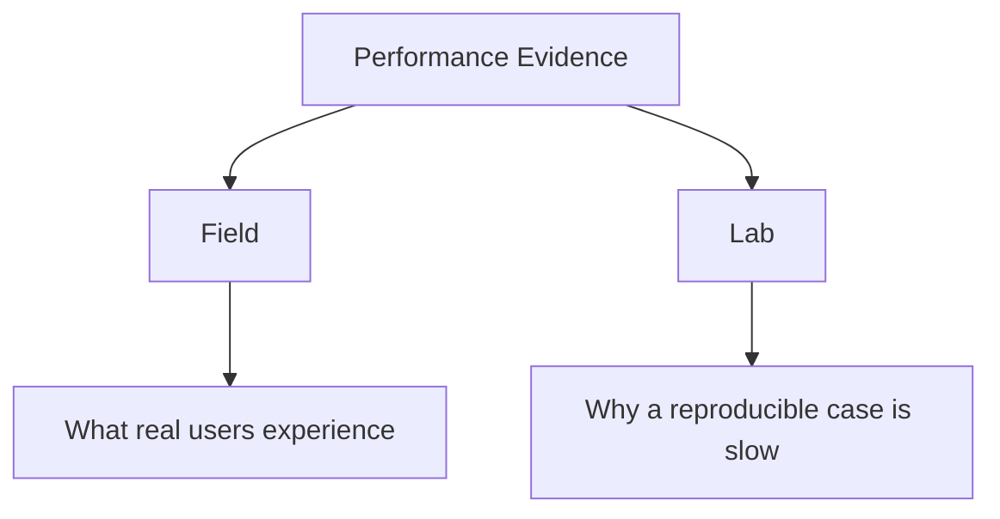
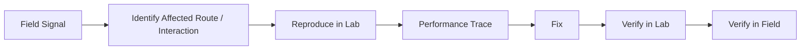
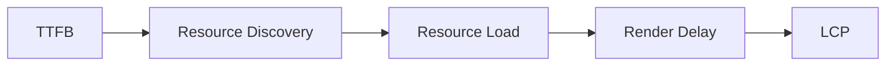
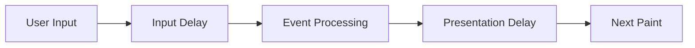
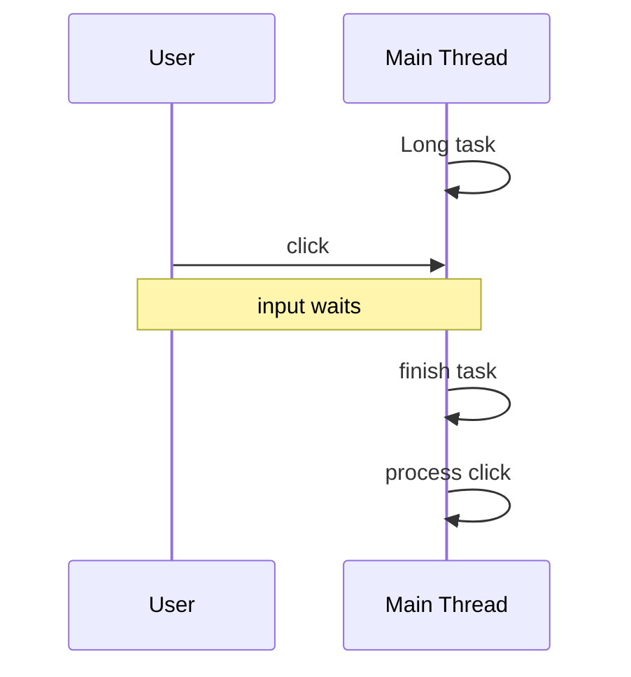
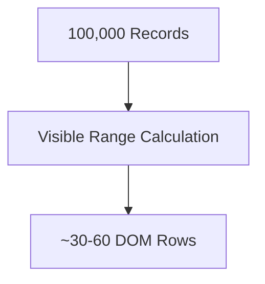
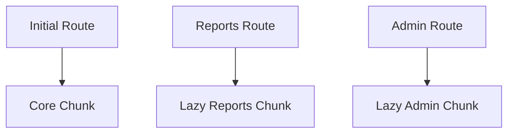
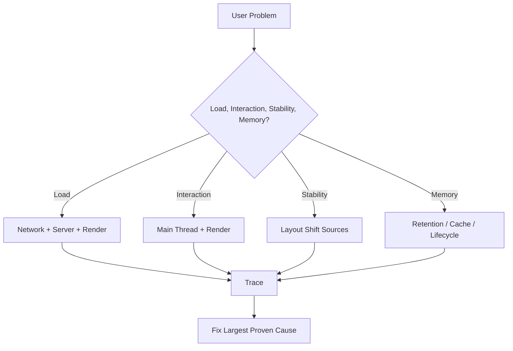
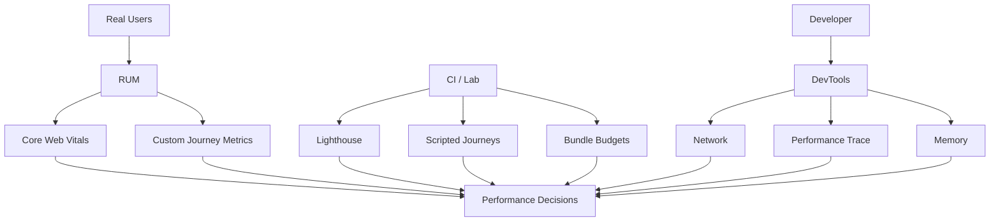
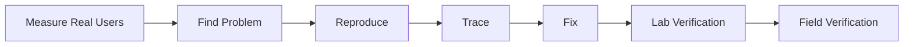

# Chapter 15 — Core Web Vitals & Performance Engineering

Performance is easy to discuss badly.

A team can say:

```text
The app feels fast on my laptop.
```

A dashboard can say:

```text
Performance score: 94.
```

A bundle analyzer can say:

```text
JavaScript: 420 KB.
```

A user can still experience:

```text
slow loading
delayed clicks
jumping content
```

All of those statements can be true at the same time.

Front-end performance is not one number.

It is the study of how quickly and reliably users can:

- see meaningful content;
- understand page structure;
- interact;
- receive feedback;
- complete tasks;
- move between views.

A useful starting model is:


Different performance metrics observe different parts of this journey.

The current Core Web Vitals focus on three user-centered dimensions:

```text
loading
responsiveness
visual stability
```

represented by:

```text
LCP
INP
CLS
```

But these metrics are not a complete performance strategy.

A mature performance practice also considers:

- server latency;
- network waterfalls;
- JavaScript execution;
- main-thread blocking;
- rendering cost;
- images;
- fonts;
- caching;
- memory;
- long-lived sessions;
- route transitions;
- real-user monitoring;
- performance budgets.

The central principle of this chapter is:

> **Performance engineering begins with measuring user experience, then tracing slow experience back to specific network, CPU, rendering, and architectural causes.**

---

# 1. Performance Is a User Experience Property

A page can download quickly but respond slowly.

A page can respond quickly but shift visually.

A page can have small JavaScript but wait on a slow server.

Therefore:

```text
small files
≠
fast experience
```

and:

```text
good benchmark
≠
good experience for every user
```

Performance must be connected to user-visible outcomes.

---

# 2. The Performance Journey

Consider a product page.

The user navigates.

The browser must:

1. resolve the destination;
2. establish connections where necessary;
3. receive HTML;
4. discover critical resources;
5. download CSS/images/scripts;
6. render meaningful content;
7. initialize interactive behavior;
8. respond to later interactions.

Different problems occur at different stages.


Performance debugging should first determine:

> Which stage is actually slow?

---

# 3. Core Web Vitals

The current Core Web Vitals are:

- **Largest Contentful Paint (LCP)** — loading experience;
- **Interaction to Next Paint (INP)** — responsiveness;
- **Cumulative Layout Shift (CLS)** — visual stability.

The recommended “good” thresholds are:

| Metric | Good |
|---|---:|
| LCP | 2.5 seconds or less |
| INP | 200 milliseconds or less |
| CLS | 0.1 or less |

These targets are evaluated using field data at the **75th percentile**, typically considered separately for mobile and desktop populations.

The percentile matters.

A median can hide poor experiences affecting a substantial minority of users.

---

# 4. Why the 75th Percentile Matters

Suppose 100 page visits have these experiences:

```text
75 users → LCP ≤ 2.5s
25 users → LCP > 2.5s
```

The page is around the threshold at the 75th percentile.

Now suppose:

```text
50 users → excellent
50 users → very slow
```

The average might look acceptable.

But half the users have a poor experience.

Percentiles reveal distribution more clearly than one mean.

---

# 5. Field Data vs Lab Data

Two major kinds of performance evidence exist.

## Field data

Measurements from real users in real environments.

Includes variation in:

- devices;
- network;
- geography;
- CPU;
- browser state;
- user behavior.

## Lab data

Measurements collected under controlled conditions.

Useful for:

- reproducing problems;
- comparing changes;
- tracing work;
- debugging.

Conceptually:



Neither replaces the other.

---

# 6. Field Data Answers “What Is Happening?”

Suppose real-user monitoring shows:

```text
INP:
desktop good
mobile poor
```

Now we know:

> Mobile interaction responsiveness is a real user problem.

But field data alone may not tell us exactly which JavaScript function caused it.

That is where lab reproduction and traces become useful.

---

# 7. Lab Data Answers “Why Might It Be Happening?”

A local trace may reveal:

```text
button click
↓
120 ms JavaScript
↓
70 ms style/layout
↓
paint
```

Now we have a concrete optimization target.

The strongest workflow is:



---

# 8. Synthetic Testing

Synthetic testing runs known scenarios under controlled settings.

Examples:

- Lighthouse;
- scripted browser tests;
- throttled network;
- throttled CPU;
- CI performance tests.

Benefits:

- repeatability;
- before/after comparison;
- automated regression detection.

Limitations:

- one device profile;
- one network model;
- scripted behavior;
- not the entire user population.

Use synthetic tests as engineering instruments.

Do not confuse them with reality itself.

---

# 9. Real User Monitoring

**Real User Monitoring**, or RUM, collects performance measurements from actual sessions.

A RUM system may record:

- LCP;
- INP;
- CLS;
- navigation timing;
- route;
- device category;
- browser;
- connection context;
- application version.

This allows questions such as:

```text
Which route has poor INP?
Did version 4.8 regress mobile LCP?
Are users in one region slower?
```

---

# 10. Segment Performance Data

A global number can hide the actual problem.

Useful segmentation includes:

- route;
- mobile/desktop;
- browser;
- geography;
- application version;
- authenticated/anonymous;
- rendering mode.

For example:

```text
global LCP = acceptable
```

may hide:

```text
/product/* on mobile = poor
```

Performance is often local to a route or workflow.

---

# 11. Largest Contentful Paint

**Largest Contentful Paint**, or LCP, measures when the largest qualifying visible content element in the viewport is rendered.

Common LCP candidates include:

- hero image;
- large heading;
- major text block;
- poster image.

LCP attempts to answer:

> When did the page's main visible content appear?

---

# 12. LCP Is Not Just Image Download Time

Suppose the LCP element is a hero image.

The timeline may include:

```text
server response
↓
HTML parsing
↓
image discovered
↓
image requested
↓
image downloaded
↓
image decoded
↓
image rendered
```

A slow LCP may come from any earlier stage.

Conceptually:



Optimizing only the image file may miss the real cause.

---

# 13. LCP Subparts

A useful engineering decomposition is:

```text
Time to First Byte
+
resource load delay
+
resource load duration
+
element render delay
```

For text-based LCP, the exact resource-load portion differs.

The important mental model is:

> LCP is an end-to-end result of server, network, discovery, and rendering behavior.

---

# 14. Time to First Byte

**Time to First Byte**, or TTFB, reflects how long the browser waits before receiving the first response byte.

Possible causes of poor TTFB include:

- server computation;
- slow database;
- redirects;
- geographic distance;
- cache miss;
- overloaded infrastructure.

A front-end engineer should not respond to high TTFB by compressing JavaScript.

Fix the layer that is slow.

---

# 15. Redirects Add Delay

A navigation path such as:

```text
http://example.com
↓
https://example.com
↓
www.example.com
↓
/home
```

adds round trips.

Some redirects are necessary.

Chains of avoidable redirects waste time before useful HTML arrives.

Use DevTools Network to inspect the actual path.

---

# 16. LCP Resource Discovery

A resource cannot download before the browser knows it exists.

Good:

```html

```

The parser can discover the image directly.

Less discoverable patterns may delay loading:

- image introduced only after client JavaScript executes;
- CSS background image in a late stylesheet;
- data fetched before image URL becomes known.

Chapter 1's preload scanner discussion applies directly here.

---

# 17. Prioritize the LCP Resource

If an image is the likely LCP element, it should usually not be:

```text
lazy-loaded below initial priority
```

A visible hero image might use appropriate browser priority hints when justified.

For example:

```html

```

Do not assign high priority to every image.

Priority works only when it distinguishes important resources.

---

# 18. Do Not Lazy-Load Above-the-Fold LCP Images

Lazy loading is useful for off-screen content.

This can be harmful:

```html

```

when the hero is immediately visible and becomes LCP.

The browser may intentionally delay it.

Optimization patterns must match resource role.

---

# 19. Preload Selectively

A preload can tell the browser early:

> This resource is important and will soon be needed.

Example:

```html
<link
  rel="preload"
  as="image"
  href="/hero.webp"
>
```

But unnecessary preloads compete for bandwidth.

Use preload when ordinary discovery is too late and the resource is genuinely important.

Do not preload everything.

---

# 20. Optimize LCP Images

Useful techniques include:

- correct dimensions;
- modern efficient formats;
- responsive image sources;
- strong compression;
- avoiding oversized intrinsic images;
- CDN delivery where appropriate.

Example:

```html

```

The browser can select an appropriate source.

---

# 21. Responsive Images Reduce Waste

Without `srcset`, a phone may download:

```text
4000 × 2500 image
```

to display at:

```text
360 px wide
```

That wastes:

- network bytes;
- decoding work;
- memory.

Responsive image markup communicates available variants to the browser.

---

# 22. Image Dimensions Also Help CLS

Specifying:

```text
width
height
```

or an appropriate CSS aspect ratio lets the browser reserve space before the image downloads.

This benefits both:

- loading;
- visual stability.

Performance improvements often affect several metrics.

---

# 23. LCP Text Can Be Delayed by Fonts

Suppose the largest visible content is a heading rendered in a web font.

Font loading may delay or alter rendering depending on the font strategy.

Performance architecture must therefore include fonts.

---

# 24. Interaction to Next Paint

**Interaction to Next Paint**, or INP, measures responsiveness to user interactions across the page's lifecycle.

It focuses on interactions such as:

- clicks;
- taps;
- keyboard actions.

The key question is:

> After the user interacts, how long until the browser can present the next visual response?

---

# 25. INP Is a Lifecycle Metric

Loading metrics focus heavily on page startup.

INP can be affected minutes after the page loads.

For example:

```text
open dashboard
↓
work for 15 minutes
↓
click Export
↓
UI freezes for 1 second
```

The initial load may have been excellent.

Responsiveness still failed.

This is why performance engineering must consider long-lived application behavior.

---

# 26. Anatomy of an Interaction

A useful model is:



The interaction latency can come from:

- waiting for existing main-thread work;
- slow event handlers;
- framework rendering;
- style/layout;
- painting.

---

# 27. Input Delay

Suppose the user clicks a button while the main thread is executing a 300 ms JavaScript task.

The click event must wait.



The click handler itself could be fast.

The interaction still feels delayed.

---

# 28. Main Thread Contention

JavaScript, style, layout, and many browser tasks compete for the main thread.

A long-running computation can block:

- event processing;
- rendering;
- scrolling;
- input response.

This is why “JavaScript performance” is often “main-thread scheduling performance.”

---

# 29. Long Tasks

A long task is a main-thread task that occupies the thread for a substantial period.

Long tasks reduce opportunities for the browser to respond to user input.

A conceptual timeline:

```text
|----------- 180 ms task -----------|
                               click arrives
                               waits...
```

Breaking work into smaller tasks can allow the browser to process higher-priority interaction work sooner.

---

# 30. Yielding

Suppose application code processes 20,000 items synchronously.

Instead of:

```js
for (
  const item
  of items
) {
  expensiveWork(item);
}
```

the architecture may:

- batch work;
- yield between batches;
- move work off the main thread;
- avoid doing the work at all.

The best optimization is often removing unnecessary work rather than slicing it.

---

# 31. Avoid Work Before Optimizing Work

Before optimizing a slow function, ask:

```text
Why are we doing this?
```

Examples:

- recalculating a list that did not change;
- parsing data repeatedly;
- rendering invisible rows;
- sorting the same collection several times;
- running an effect unnecessarily.

Chapter 7's derived-state and rendering discussions matter here.

---

# 32. Event Handler Work

A click handler might do:

```text
validate 500 fields
sort 20,000 records
update global state
render huge table
write localStorage
send analytics
```

all before the browser can paint.

A more responsive design may separate:

```text
immediate visual feedback
```

from:

```text
lower-priority follow-up work
```

The user should see acknowledgment quickly.

---

# 33. Rendering Can Dominate INP

Even a small handler can trigger expensive rendering.

Example:

```text
click
↓
set filter
↓
render 10,000 rows
↓
layout huge DOM
↓
paint
```

The handler was not the real problem.

The interaction triggered too much UI work.

---

# 34. Reduce Render Scope

Suppose only:

```text
CartCount
```

changes.

If the entire application rerenders expensive components unnecessarily, responsiveness suffers.

Framework-specific techniques include:

- better state ownership;
- memoization when justified;
- smaller reactive dependencies;
- virtualization.

Use architectural boundaries before micro-optimizations.

---

# 35. Virtualize Large Lists

A table contains:

```text
100,000 rows
```

The viewport shows:

```text
30 rows
```

Rendering all 100,000 DOM rows is usually wasteful.

Virtualization renders the visible window plus a buffer.

Conceptually:



This can reduce:

- DOM size;
- layout work;
- rendering work;
- memory.

---

# 36. Virtualization Has UX Costs

Virtualized interfaces can complicate:

- browser find-in-page;
- accessibility;
- print;
- dynamic row heights;
- focus;
- scroll restoration.

Do not virtualize small lists automatically.

Use it where DOM scale actually creates a problem.

---

# 37. Web Workers

CPU-heavy work can sometimes move to a Web Worker.

Examples:

- large calculations;
- parsing;
- compression;
- image processing;
- data transformations.

Architecture:


The worker cannot directly manipulate the DOM.

That separation is useful.

---

# 38. Worker Communication Has Cost

Data must cross between main thread and worker.

Large object graphs can create serialization/copy overhead unless transferable/shared mechanisms are appropriate.

A worker is not automatically faster.

Use one when:

```text
main-thread blocking cost
>
communication/coordination cost
```

---

# 39. Interaction Feedback First

When a user presses:

```text
Generate Report
```

a good first response may be:

```text
button changes to Generating…
```

Then expensive work begins.

This confirms the action.

Performance is partly perceived responsiveness.

Users tolerate waiting better when the system clearly responds.

---

# 40. Cumulative Layout Shift

**Cumulative Layout Shift**, or CLS, measures unexpected visual movement.

Imagine reading:

```text
Confirm Order
```

and just before clicking, an image loads above the button.

The button moves.

The user clicks:

```text
Delete Order
```

instead.

This is not merely cosmetic.

Visual instability can cause real errors.

---

# 41. Layout Shift Sources

Common causes include:

- images without dimensions;
- ads/embeds without reserved space;
- dynamically inserted banners;
- late font changes;
- content inserted above existing content;
- animations that change layout.

The general problem is:

```text
browser did not know how much space to reserve
```

or:

```text
application moved existing content unexpectedly
```

---

# 42. Reserve Space

For media:

```html

```

The browser can infer aspect ratio.

For embeds:

```css
.video-shell {
  aspect-ratio:
    16 / 9;
}
```

For dynamic widgets:

```text
reserve expected region
before content arrives
```

Space reservation is one of the strongest CLS defenses.

---

# 43. User-Initiated Changes Are Different

Not every layout movement is bad.

If the user clicks:

```text
Show details
```

and the panel expands, that movement is expected.

CLS is concerned with unexpected instability.

The product should distinguish:

```text
interaction-driven layout change
```

from:

```text
surprise layout change
```

---

# 44. Avoid Inserting Content Above the View

Suppose a page loads.

Then after three seconds:

```text
Promotional banner
```

appears above the heading.

Everything moves down.

If the banner is necessary:

- reserve its space;
- place it where it does not displace active content;
- introduce it in a user-initiated context.

---

# 45. Fonts and Layout Shift

A fallback font may have different metrics from the final web font.

When the final font loads:

```text
line lengths change
line wrapping changes
element heights change
```

This can shift content.

Font strategy affects:

- rendering speed;
- layout stability;
- branding.

---

# 46. Font Loading Strategy

Consider:

- whether the custom font is actually needed;
- number of weights;
- file format;
- preload;
- `font-display`;
- fallback metrics;
- subset strategy.

Do not ship:

```text
8 font weights
3 scripts
full Unicode range
```

when the product uses two weights and one language set.

---

# 47. `font-display`

CSS can define:

```css
@font-face {
  font-family:
    "Example";

  src:
    url("/example.woff2")
    format("woff2");

  font-display:
    swap;
}
```

Different `font-display` strategies trade:

- invisible text;
- fallback duration;
- font swapping.

Choose deliberately.

---

# 48. Font Preloading

A critical font may be preloaded.

But the usual rule applies:

> Preload only what is genuinely critical.

Preloading many font files can compete with:

- CSS;
- LCP image;
- application JavaScript.

Resource prioritization is a shared budget.

---

# 49. System Fonts Can Be Excellent

Not every product needs a custom web font.

A system font stack may provide:

- zero font download;
- immediate text;
- familiar platform rendering.

Brand requirements may justify custom fonts.

Performance cost should still be understood.

---

# 50. Network Performance

A page can be CPU-efficient but network-heavy.

Network cost includes:

- DNS;
- connection setup;
- TLS;
- server wait;
- transfer;
- request sequencing.

The Network panel helps reveal where time goes.

---

# 51. Request Waterfalls

A waterfall occurs when one resource is discovered only after another completes.

Example:

```text
HTML
↓
JavaScript
↓
API request
↓
image URL discovered
↓
image request
```

Each dependency adds delay.

Chapter 1 introduced discovery.

Chapter 9 introduced API waterfalls.

Performance engineering joins them into one delivery path.

---

# 52. Flatten Unnecessary Waterfalls

Suppose:

```text
component JS
must load
before
API request can begin
```

Could the request start:

- on the server?
- through a route loader?
- earlier in HTML?
- concurrently with code?

The best optimization may be architectural rather than network tuning.

---

# 53. Connection Reuse

Modern HTTP versions can carry multiple requests efficiently over shared connections.

Still, excessive origin fragmentation can cause extra:

- DNS;
- connection setup;
- TLS.

A page loading assets from many unrelated domains can pay repeated connection costs.

Third-party resources should justify their origin cost.

---

# 54. Compression

Text resources should generally use transport compression such as:

- Brotli;
- gzip.

Typical compressible resources:

- HTML;
- CSS;
- JavaScript;
- JSON;
- SVG.

Already-compressed formats such as many images/videos gain less.

Compression is usually a server/CDN responsibility, but frontend engineers should verify it.

---

# 55. Compression Does Not Remove JavaScript Execution Cost

A 500 KB JavaScript file may transfer as:

```text
150 KB compressed
```

The browser still needs to:

- decompress;
- parse;
- compile;
- execute

the larger logical program.

Therefore:

```text
compressed transfer size
```

and:

```text
JavaScript execution cost
```

are different.

---

# 56. JavaScript Is Expensive in Several Ways

JavaScript has:

1. network cost;
2. parse cost;
3. compile cost;
4. execution cost;
5. memory cost;
6. framework/render side effects.

Two equal-size scripts may have different runtime costs.

Bundle size is an important signal.

It is not a complete performance measure.

---

# 57. Reduce Unnecessary JavaScript

Questions to ask:

- Is this library needed?
- Can browser HTML/CSS solve the behavior?
- Can this feature be lazy-loaded?
- Is the dependency tree-shakeable?
- Is this third-party script worth its cost?
- Can server/static rendering remove client code?

The cheapest JavaScript to execute is JavaScript never shipped.

---

# 58. Route-Level Code Splitting

Chapter 12 introduced route splitting.

Performance reason:

```text
user visits /catalogue
```

should not necessarily download:

```text
/admin/report-builder
```

Architecture:



This reduces initial network and execution work.

---

# 59. Component-Level Lazy Loading

Some heavy features can be loaded later:

```text
chart editor
map
rich text editor
video tool
```

But lazy loading introduces a new wait at first use.

Consider:

- probability of use;
- chunk size;
- user timing;
- prefetch opportunities.

Do not split purely because a component is large.

---

# 60. Third-Party JavaScript

Third-party scripts can dominate performance.

Examples:

- analytics;
- advertising;
- customer support;
- tag managers;
- experimentation tools;
- embedded social widgets.

They can add:

- network requests;
- main-thread tasks;
- DOM changes;
- layout shifts.

Inventory third-party code regularly.

---

# 61. Third-Party Cost Is Shared Product Cost

A marketing team may add:

```text
analytics script
```

A support team adds:

```text
chat widget
```

Advertising adds:

```text
tracking tags
```

Each addition may look small in isolation.

Users experience all of them together.

Performance governance must cross organizational boundaries.

---

# 62. Lazy-Load Third-Party Features

A chat widget may not need to initialize before LCP.

Possible strategies:

```text
load after interaction
load after consent
load after main content
load when visible
```

But delay must still meet product requirements.

Do not defer critical functionality merely to improve a score.

---

# 63. CSS Performance

CSS affects:

- render blocking;
- style calculation;
- layout;
- paint.

Large stylesheets are not automatically slow.

Problems can come from:

- unused CSS;
- complex invalidation;
- enormous DOM;
- layout-heavy effects.

Measure before rewriting selectors based on folklore.

---

# 64. Critical CSS

A page needs some styles before meaningful content can render.

Architectures may:

- inline selected critical styles;
- load primary stylesheet early;
- split route CSS.

The goal is:

```text
necessary visual structure available early
```

without:

```text
duplicating or bloating CSS unnecessarily
```

---

# 65. Avoid Flashing Unstyled Content

If HTML arrives before important CSS, users may see:

```text
unstyled layout
↓
styled layout
```

This can be visually disruptive.

Primary CSS should be discoverable and prioritized appropriately.

Do not defer all CSS in the name of “non-blocking resources.”

---

# 66. DOM Size

A very large DOM increases potential cost for:

- style calculation;
- layout;
- memory;
- querying;
- rendering.

Examples:

```text
hidden tabs all rendered
10,000 table rows
deep nested wrappers
```

Reducing unnecessary DOM can improve responsiveness.

---

# 67. DOM Depth and Complexity

The exact number of nodes that is “too many” depends on the application.

Avoid fixed mythology such as:

```text
never exceed exactly N nodes
```

Instead inspect:

- trace cost;
- layout duration;
- style recalculation;
- memory;
- interaction latency.

Performance engineering should follow evidence.

---

# 68. Layout

Layout determines geometry.

Some application patterns cause repeated synchronous layout calculation.

Example:

```js
element.style.width =
  "100px";

const height =
  element.offsetHeight;

element.style.width =
  "200px";

const nextHeight =
  element.offsetHeight;
```

Reading layout-sensitive properties after writes can force repeated layout.

This is often called layout thrashing.

---

# 69. Batch Reads and Writes

A stronger pattern is:

```text
read geometry
read geometry
↓
perform writes
perform writes
```

rather than alternating:

```text
write
read
write
read
```

Frameworks often reduce direct DOM manipulation, but custom measurement code can still create this problem.

Use the Performance panel to prove it.

---

# 70. Paint and Composite

After layout, visual changes may require paint.

Some properties can be handled more efficiently through compositing than others.

Animations using properties such as:

```text
transform
opacity
```

often avoid repeated layout.

But:

> “Only animate transform and opacity” is a useful heuristic, not a universal law.

Measure complex animations.

---

# 71. `will-change`

CSS provides:

```css
will-change:
  transform;
```

to hint that an element is expected to change.

This can help the browser prepare.

But overusing `will-change` may consume additional memory/resources.

Use it selectively for known performance problems.

---

# 72. Animation Frame Budget

At 60 Hz, the browser has roughly:

```text
16.7 ms
```

per frame interval.

Not all of that time belongs to application JavaScript.

The browser may need:

- input;
- style;
- layout;
- paint;
- compositing.

If a frame's work exceeds available time, animation can appear janky.

Higher-refresh-rate devices have even shorter frame intervals.

---

# 73. `requestAnimationFrame`

For visual updates synchronized with browser rendering:

```js
requestAnimationFrame(
  () => {
    updateVisualState();
  }
);
```

can coordinate work with the rendering cycle.

It does not make expensive work cheap.

A 100 ms callback inside `requestAnimationFrame` is still slow.

Scheduling is not optimization by itself.

---

# 74. Caching

Caching can reduce repeated network work.

Layers may include:

```text
browser HTTP cache
CDN cache
service worker cache
application query cache
```

Each solves a different problem.

Chapter 9 and Chapter 10 introduced these layers.

Performance engineering ensures they work together intentionally.

---

# 75. Fingerprinted Static Assets

Production builds often produce:

```text
app-82F1A.js
styles-A76B.css
```

If the filename changes with content, these assets can often receive long cache lifetimes.

When content changes:

```text
new hash
→ new URL
```

This enables efficient repeat visits.

---

# 76. HTML Cache Policy Differs from Hashed Assets

A common strategy is:

```text
HTML:
revalidate frequently

hashed JS/CSS:
cache for a long time
```

Why?

HTML references the current asset filenames.

If stale HTML points to old resources incorrectly, deployment problems may occur.

Caching policy should reflect asset identity.

---

# 77. API Caching

API responses need domain-specific freshness policies.

Example:

```text
country list
→ long-lived cache

inventory
→ short-lived cache

account balance
→ aggressive revalidation
```

Performance cannot override correctness.

A fast wrong value is not a successful optimization.

---

# 78. Cache Hit Rate

If a CDN is configured but almost every request misses, it provides little performance benefit.

Measure:

- hit;
- miss;
- revalidation;
- bypass.

Performance engineering includes verifying that caching works in production, not merely adding headers.

---

# 79. Prefetching

Prefetching downloads something before the user explicitly needs it.

Examples:

- likely next route;
- next pagination page;
- hover-intent data.

This trades:

```text
extra early bandwidth
```

for:

```text
faster future action
```

Only prefetch when the expected benefit justifies the cost.

---

# 80. Speculation Can Waste User Resources

Aggressive prefetching can waste:

- mobile data;
- battery;
- server capacity.

A user may never perform the predicted navigation.

Performance optimization should not become resource consumption for its own sake.

---

# 81. Preconnect

If the application will soon connect to an important third-party origin, preconnect can establish connection work early.

Example:

```html
<link
  rel="preconnect"
  href="https://fonts.example"
>
```

Use it for a small number of critical origins.

Connecting early to many origins wastes resources.

---

# 82. DNS Prefetch

A lighter hint can resolve DNS earlier:

```html
<link
  rel="dns-prefetch"
  href="//example-cdn.com"
>
```

This is less aggressive than full preconnect.

Again, resource hints should reflect actual critical paths.

---

# 83. Performance and Rendering Topology

Chapter 11 showed:

```text
CSR
SSR
SSG
streaming
islands
```

Performance differs by topology.

### CSR

Potential cost:

```text
JavaScript before meaningful UI
```

### SSR

Potential benefit:

```text
early HTML
```

Potential cost:

```text
server latency + hydration
```

### SSG

Potential benefit:

```text
fast cached HTML
```

### Islands

Potential benefit:

```text
reduced client JS
```

There is no topology that guarantees performance.

---

# 84. Hydration Cost

A server-rendered page can display quickly but still execute substantial JavaScript to hydrate.

Therefore measure:

```text
visible
```

and:

```text
responsive
```

separately.

An application that looks ready while ignoring clicks creates poor perceived quality.

---

# 85. Streaming Performance

Streaming can reduce the time before useful regions appear.

But a poorly designed stream can create:

- layout shifts;
- too many placeholders;
- client hydration bursts.

Performance optimization needs stable layout and sensible boundaries.

---

# 86. Soft Navigations and SPA Performance

Traditional page-load metrics focus on full navigations.

SPAs also have route transitions that may not create a new document.

A user cares about:

```text
clicked Products
↓
how long until Products appears?
```

not whether the browser technically performed a full navigation.

Modern performance tooling is increasingly improving support for measuring these soft-navigation experiences.

Architecturally, the lesson is stable:

> Measure meaningful client-side transitions, not only first page load.

---

# 87. Route Transition Metrics

A product can define its own user-centric route metric:

```text
navigation intent
↓
new route content visible
```

or:

```text
filter changed
↓
new results rendered
```

These product metrics complement generic Core Web Vitals.

Performance engineering should follow important user journeys.

---

# 88. User Timing API

The platform allows custom marks and measures.

Example:

```js
performance.mark(
  "report-start"
);

await generateReport();

performance.mark(
  "report-end"
);

performance.measure(
  "report-generation",
  "report-start",
  "report-end"
);
```

This can measure domain-specific operations.

Use semantic names.

---

# 89. PerformanceObserver

The browser exposes performance entries to JavaScript through `PerformanceObserver`.

A monitoring library can observe supported metrics and timing entries.

Conceptually:

```js
const observer =
  new PerformanceObserver(
    list => {
      for (
        const entry
        of list.getEntries()
      ) {
        ...
      }
    }
  );
```

Use established libraries for Core Web Vitals calculation when possible rather than reimplementing complex metric logic.

---

# 90. DevTools Performance Panel

The Performance panel can reveal:

- main-thread activity;
- interactions;
- scripting;
- rendering;
- painting;
- long tasks;
- frames;
- screenshots;
- network relationships.

A trace is one of the most powerful tools in performance engineering.

But traces can look intimidating.

Start from the user problem.

---

# 91. Trace from the Interaction

Suppose:

```text
Add to Cart
```

feels slow.

Record:

1. before click;
2. click;
3. resulting update.

Then locate the interaction in the trace.

Ask:

```text
Was input delayed?
Was handler slow?
Was rendering slow?
Was paint delayed?
```

This is more useful than scanning the entire timeline randomly.

---

# 92. Flame Charts

A flame chart visualizes nested execution over time.

Wide blocks mean:

```text
more time
```

Nested blocks show call relationships.

A hot function is not automatically the bug.

Ask:

```text
Why is this function called?
How often?
Can the work be avoided?
```

---

# 93. Bottom-Up Analysis

A bottom-up view groups time by function or activity.

This can answer:

```text
Which functions consumed most CPU?
```

Useful for:

- heavy computation;
- repeated library calls;
- excessive framework work.

Again, high CPU time should be tied back to a user-visible problem.

---

# 94. Network Panel

Use the Network panel to inspect:

- request start;
- queueing;
- DNS/connect;
- TTFB;
- transfer;
- initiator;
- priority;
- response headers;
- cache status.

A network waterfall can reveal architecture more clearly than source code.

---

# 95. Coverage and Bundle Analysis

Unused-code tools can estimate code loaded but not executed during a scenario.

Bundle analyzers show:

- package size;
- chunk composition;
- duplication.

These tools answer different questions.

A module unused on the homepage may still be required on another route.

Do not delete code based on one Coverage snapshot without understanding route usage.

---

# 96. Lighthouse

Lighthouse provides synthetic auditing across areas including performance.

It is useful for:

- quick baselines;
- diagnostics;
- regression comparisons;
- common opportunities.

But a single Lighthouse score should not become the team's only KPI.

Reasons include:

- lab conditions;
- score weighting;
- run-to-run variance;
- limited interaction coverage.

Use the diagnostics behind the score.

---

# 97. Repeat Measurements

One lab run can be noisy.

Run tests several times.

Look for consistent differences.

A change from:

```text
91
to
92
```

may be noise.

A repeatable reduction in:

```text
LCP resource delay
```

is stronger evidence.

---

# 98. CPU Throttling

Your development machine is probably faster than many user devices.

CPU throttling can expose:

- expensive JavaScript;
- hydration cost;
- slow interactions.

It is still a simulation.

Field data provides the real device distribution.

---

# 99. Network Throttling

Simulated slower networks can reveal:

- large initial bundles;
- image waste;
- waterfall delays;
- blocking resources.

But real mobile networks have:

- latency variation;
- packet loss;
- radio behavior.

Again:

```text
lab for diagnosis
field for reality
```

---

# 100. Memory Performance

Performance is not only speed.

Long-lived applications may leak memory.

Symptoms include:

- increasing memory over time;
- slow tab;
- browser crash;
- repeated garbage collection;
- degraded interactions.

This is particularly relevant for:

- dashboards;
- editors;
- SPAs;
- WebSocket applications.

---

# 101. Memory Leaks

A memory leak occurs when objects remain reachable even though the application no longer needs them.

Common causes include:

- event listeners not removed;
- timers never stopped;
- large caches without eviction;
- DOM nodes retained by closures;
- subscriptions never disposed.

Architecture should have lifecycle cleanup.

---

# 102. Detached DOM Nodes

A DOM element can be removed from the document but still retained in memory by JavaScript.

For example:

```text
DOM node removed
+
array still references node
```

The browser cannot garbage-collect it.

Memory tools can identify detached nodes and retaining paths.

---

# 103. Unbounded Caches

A client cache that stores:

```text
every product
every search
every page
forever
```

may eventually consume large memory.

Caching needs:

- size policy;
- time policy;
- eviction;
- lifecycle.

Performance and cache correctness are related.

---

# 104. Subscription Cleanup

A component subscribes:

```js
window.addEventListener(
  "resize",
  handler
);
```

When removed, it should usually clean up:

```js
window.removeEventListener(
  "resize",
  handler
);
```

The same principle applies to:

- WebSockets;
- observers;
- timers;
- framework subscriptions.

Chapter 7's effects should include lifecycle responsibility.

---

# 105. Memory Profiling

Browser memory tools can provide:

- heap snapshots;
- allocation sampling;
- retaining paths;
- object counts.

A practical workflow:

```text
snapshot
↓
perform workflow repeatedly
↓
force/allow GC
↓
snapshot again
↓
compare retained objects
```

Look for growth that should have disappeared.

---

# 106. Performance Budgets

A **performance budget** sets explicit limits before regressions become severe.

Possible budgets:

```text
initial JavaScript ≤ target
LCP ≤ target
INP ≤ target
CLS ≤ target
hero image ≤ target
third-party JS ≤ target
```

Budgets turn:

```text
performance matters
```

into:

```text
what limit are we willing to exceed?
```

---

# 107. Budgets Need Context

A universal rule such as:

```text
Every site must ship less than 100 KB JavaScript
```

is too simplistic.

A news article and a CAD editor have different functional needs.

A useful budget is:

- route-specific;
- user-centered;
- based on target devices/networks;
- tied to business requirements.

---

# 108. Bundle Budgets

A build can fail or warn if:

```text
initial JS > agreed limit
```

This catches growth before deployment.

But bundle budgets alone cannot detect:

- slow API;
- layout shifts;
- expensive interactions.

Use several kinds of budgets.

---

# 109. Metric Budgets

CI synthetic tests can enforce ranges such as:

```text
LCP under lab target
CLS under target
```

But avoid brittle thresholds that fail randomly due to measurement noise.

Use:

- repeat runs;
- tolerance;
- trend analysis.

Performance CI should detect meaningful regressions.

---

# 110. User-Journey Budgets

For application workflows, custom budgets can be more valuable.

Example:

```text
search typing response:
< 100 ms local feedback

open patient record:
< 2 s typical field experience

route transition:
< agreed target
```

These align engineering work with product use.

---

# 111. Performance Regression

Performance tends to degrade incrementally.

One pull request adds:

```text
20 KB
```

Another adds:

```text
30 ms
```

Another adds:

```text
one third-party script
```

No single change feels disastrous.

After six months the application is slow.

Budgets and continuous measurement catch gradual decline.

---

# 112. Performance Ownership

If nobody owns performance, everyone can accidentally degrade it.

Ownership may be distributed:

```text
feature team
→ route performance

platform team
→ tooling/budgets

design system
→ component cost

backend team
→ server latency
```

Performance is a cross-team responsibility.

---

# 113. Performance Review in Pull Requests

Useful questions include:

- Did this add a large dependency?
- Does this run on initial load?
- Is the image correctly sized?
- Does it create layout shift?
- Does it add third-party code?
- Does it render a large list?
- Does it change a critical route?

Not every pull request needs a performance trace.

Critical paths deserve more scrutiny.

---

# 114. Performance and Accessibility

Performance problems can disproportionately affect assistive-technology users.

Examples:

- delayed focus;
- DOM replacement;
- unstable layout;
- blocked keyboard interactions.

An optimization that removes semantics or keyboard support is not a valid improvement.

Quality attributes interact.

---

# 115. Performance and Internationalization

Internationalization changes performance characteristics.

Examples:

- Arabic/Kurdish font files;
- longer translated labels;
- RTL layouts;
- locale data;
- large ICU/Intl polyfills for older environments.

Measure representative locales.

Do not benchmark only English if the product serves multiple languages.

---

# 116. Font Subsetting and Multilingual Products

A Latin-only font subset may be small.

A full multilingual font can be much larger.

Possible strategies include:

- Unicode-range subsets;
- language-specific font files;
- variable fonts where appropriate.

But avoid creating a flash or missing-glyph problem.

Performance must preserve language correctness.

---

# 117. Performance and Security

Security controls may add cost:

- CSP reporting;
- authentication round trips;
- third-party scanning;
- isolation policies.

Do not remove critical security because a benchmark improved.

Optimize within security requirements.

Likewise, reducing third-party scripts can improve both:

- security;
- performance.

---

# 118. Performance and Offline Architecture

Service Worker caching can make repeat visits fast.

It can also create:

- stale assets;
- complex update behavior;
- extra storage.

Chapter 10's offline strategies should be evaluated with performance and correctness together.

---

# 119. Performance and Micro-Frontends

Chapter 14 introduced independent frontends.

Each team may ship:

```text
its own runtime
its own analytics
its own design-system version
```

Page-level performance can degrade through duplication.

Micro-frontend governance should include shared performance budgets.

---

# 120. Performance Architecture Example

Consider an e-commerce product page.

Initial problems:

```text
LCP = slow
INP = poor
CLS = unstable
```

We investigate separately.

---

# 121. Diagnose LCP

Trace shows:

```text
TTFB: 400 ms
HTML arrives
hero URL discovered through late JS
image request starts at 1.4 s
image finishes at 2.6 s
renders at 2.8 s
```

Main issue:

```text
resource discovery delay
```

Not necessarily image compression.

Fix:

- expose image in initial HTML;
- avoid lazy-loading it;
- apply correct priority.

---

# 122. Diagnose INP

User clicks:

```text
Select variant
```

Trace shows:

```text
80 ms input delay
120 ms handler
110 ms render/layout
```

Potential fixes:

- remove unrelated main-thread tasks;
- reduce handler work;
- render only affected components;
- virtualize expensive region if needed.

One metric can have several causes.

---

# 123. Diagnose CLS

Trace shows product image area initially has:

```text
height = 0
```

When image loads:

```text
height = 600 px
```

Content moves.

Fix:

```text
width/height
or
aspect-ratio
```

This is structural.

No JavaScript optimization is needed.

---

# 124. Optimization Should Match Cause

A useful table:

| Symptom | Likely investigation |
|---|---|
| Slow LCP | TTFB, discovery, image/font load, render delay |
| Poor INP | long tasks, handlers, framework render, layout |
| High CLS | missing dimensions, late content, fonts |
| Slow route | code/data waterfall, lazy chunk, server query |
| Long session slowdown | memory, caches, subscriptions |
| Mobile-only slowdown | CPU, network, bundle execution |

This prevents random optimization.

---

# 125. Performance Triage

When performance is poor:



Do not begin by rewriting the framework.

---

# 126. The Biggest Cause First

Suppose:

```text
hero image = 3 MB
```

and:

```text
JavaScript utility saves 4 ms
```

Optimize the image first.

Performance work should follow impact.

Small micro-optimizations can consume large engineering effort for negligible user benefit.

---

# 127. Performance Is a Constraint, Not a Cleanup Phase

If performance is considered only before launch, architecture may already be expensive.

Decisions that affect performance include:

- rendering topology;
- state ownership;
- package selection;
- design-system components;
- image pipeline;
- API design;
- routing;
- third-party scripts.

Performance belongs in design.

---

# 128. Performance Hypotheses

Good performance work begins with a hypothesis.

Example:

> Product LCP is slow because the hero image is discovered only after client JavaScript executes.

Test it.

If true, change discovery.

If false, inspect the next likely cause.

Avoid:

```text
Let's rewrite it in another framework because it feels slow.
```

---

# 129. Before/After Measurement

For every meaningful optimization:

```text
before
↓
change
↓
after
```

Measure under comparable conditions.

Document:

- metric;
- scenario;
- device/network;
- sample method.

Without before/after evidence, performance work becomes anecdotal.

---

# 130. Avoid Benchmark Theater

A team can choose a benchmark that makes its architecture look good.

Examples:

- desktop only;
- warm cache only;
- no interaction;
- one ideal route;
- perfect network.

A responsible performance report includes representative user conditions.

---

# 131. Production Verification

A lab improvement can fail to improve field performance because:

- users hit different routes;
- CDN behavior differs;
- devices differ;
- third-party scripts behave differently;
- traffic distribution changed.

After deployment, verify the metric in real users.

Performance optimization is not complete at merge time.

---

# 132. Core Web Vitals Are Not Business Metrics

A good LCP does not prove users can complete checkout.

A poor INP may correlate with business impact, but the metric is still a performance signal.

Combine technical metrics with product outcomes such as:

```text
conversion
task completion
abandonment
support incidents
```

Do not optimize scores disconnected from user value.

---

# 133. Core Web Vitals Are Not the Whole Experience

Core Web Vitals intentionally focus on broadly applicable user experience dimensions.

They do not directly measure:

- API correctness;
- offline availability;
- animation quality;
- route-specific workflow completion;
- memory leaks;
- every soft navigation.

Use them as a foundation.

Add domain-specific metrics.

---

# 134. A Performance Measurement Stack

A mature system may combine:



No one tool provides all the answers.

---

# 135. Performance Dashboard Design

A useful dashboard should show trends rather than only current values.

Possible views:

```text
LCP p75 by route
INP p75 by device
CLS p75 by version
JavaScript bundle trend
error/performance correlation
```

This helps detect regressions and identify affected populations.

---

# 136. Percentiles Beyond p75

Core Web Vitals recommendations use p75.

Operationally, teams may also inspect:

```text
p50
p75
p90
p95
```

Why?

A p75 improvement may still leave a severe long tail.

Do not replace the official threshold methodology.

Use additional percentiles for diagnosis.

---

# 137. Sample Size Matters

A route with:

```text
20 visits
```

does not provide the same confidence as one with:

```text
2,000,000 visits
```

Performance dashboards should display sample size.

Avoid making major architectural decisions from tiny populations.

---

# 138. Performance Budgets by Route

Example:

```text
Marketing Home
initial JS: small
LCP target: aggressive

Admin Editor
initial JS: larger
INP target: strict
```

Budgets can differ because user needs differ.

But every route should still respect user device constraints.

---

# 139. Component Performance Contracts

A design-system component may have a performance contract.

For example, a DataTable should document:

```text
intended row scale
virtualization behavior
expensive features
```

A component that works well with:

```text
50 rows
```

may not be appropriate for:

```text
100,000 rows
```

Shared components need scalability guidance.

---

# 140. Performance and Architecture Decisions

Chapter 18 will formalize architecture decision-making.

Performance evidence should enter those decisions explicitly.

For example:

```text
ADR:
Use server rendering for public product pages

Reason:
Improve initial HTML and reduce client data waterfall

Trade-off:
Server runtime + hydration cost
```

Performance is one quality attribute among several.

---

# 141. A Performance Culture

A strong team does not ask:

```text
Who made the site slow?
```

It asks:

```text
Which system behavior regressed?
How can we make it visible earlier?
Which guardrail would prevent recurrence?
```

Performance engineering works best as continuous system improvement rather than blame.

---

# 142. Misconceptions to Leave Behind

## “Performance means Lighthouse score.”

No.

Lighthouse is one synthetic diagnostic tool.

Real-user performance requires field measurement.

---

## “If the app is fast on my machine, it is fast.”

No.

Users have different devices, networks, and workloads.

---

## “Average performance is enough.”

No.

Averages can hide slow user populations.

Percentiles reveal distribution.

---

## “Core Web Vitals are SEO metrics.”

Too narrow.

They are user-experience metrics used in several contexts, including search-related systems.

They should be improved because users benefit.

---

## “LCP is image download time.”

No.

LCP includes server, discovery, loading, and rendering delays.

---

## “Every above-the-fold image should be preloaded.”

No.

Preload only truly critical resources.

---

## “Lazy loading always improves performance.”

No.

Lazy-loading the LCP image can make loading worse.

---

## “INP measures JavaScript handler duration.”

Incomplete.

It includes input delay, processing, and time until the next paint.

---

## “If my click handler is fast, INP must be good.”

No.

Existing long tasks or expensive rendering can still delay feedback.

---

## “Memoization automatically improves performance.”

No.

Memoization has cost and should address measured repeated work.

---

## “Virtualize every list.”

No.

Virtualization adds complexity and is justified by scale.

---

## “Web Workers make code faster.”

Not necessarily.

They move eligible work off the main thread but introduce communication cost.

---

## “CLS means nothing on an interactive application.”

No.

Unexpected movement can harm any interface.

---

## “Every layout movement increases CLS equally.”

No.

Expected interaction-driven movement is treated differently from unexpected shifts.

---

## “Custom fonts are always worth the cost.”

No.

They should justify network and layout effects.

---

## “Compression solves JavaScript bloat.”

No.

Compressed bytes still become code that must be parsed and executed.

---

## “Bundle size is performance.”

It is one important input.

Runtime execution, server latency, images, rendering, and interaction cost also matter.

---

## “More code splitting is always faster.”

No.

Excessive chunks can introduce request and navigation overhead.

---

## “Third-party scripts are someone else's performance problem.”

No.

They execute in the user's page.

Their cost is your product's cost.

---

## “A huge DOM is always slow.”

Not automatically.

DOM complexity becomes a problem when traces show expensive style/layout/render/memory work.

---

## “`will-change` makes animations faster.”

It can help selected cases but overuse consumes resources.

---

## “Caching makes data correct and fast.”

Caching can make access fast.

Freshness and correctness still need policy.

---

## “Prefetch everything.”

No.

Unused speculation wastes bandwidth and server resources.

---

## “SSR guarantees good Core Web Vitals.”

No.

Server delay, hydration, images, JavaScript, and layout can still be poor.

---

## “A 95 Lighthouse score means the release is safe.”

No.

Field performance and critical user journeys still need verification.

---

## “Performance optimization is a final polish.”

No.

Major performance characteristics are determined by architecture.

---

# Chapter Summary

Performance engineering connects user experience with system behavior.

The current Core Web Vitals are:

```text
LCP
INP
CLS
```

They represent:

```text
loading
responsiveness
visual stability
```

Recommended good thresholds are:

```text
LCP ≤ 2.5 s
INP ≤ 200 ms
CLS ≤ 0.1
```

evaluated at the 75th percentile of field experiences.

Field data answers:

```text
What are real users experiencing?
```

Lab data helps answer:

```text
Why is a reproducible scenario slow?
```

A mature workflow is:



LCP depends on the full delivery path:

```text
TTFB
resource discovery
resource loading
render delay
```

INP depends on:

```text
input delay
event processing
rendering/presentation delay
```

CLS depends on preventing unexpected layout movement through:

- reserved dimensions;
- stable content insertion;
- thoughtful font loading;
- predictable layout.

Performance also requires managing:

- JavaScript;
- DOM size;
- rendering;
- images;
- fonts;
- network waterfalls;
- caching;
- third parties;
- memory.

DevTools provides several complementary views:

- Network;
- Performance;
- Memory;
- Coverage.

Synthetic tools and CI budgets help detect regressions.

RUM confirms what real users experience.

Performance budgets can constrain:

- bundles;
- images;
- metrics;
- user journeys.

The central principle of the chapter is:

> **Measure the user-visible problem first, locate the system cause second, and optimize the largest proven cause rather than guessing.**

---

# Review Questions

1. Why is performance not one number?

2. What are the current Core Web Vitals?

3. What user-experience dimension does LCP measure?

4. What user-experience dimension does INP measure?

5. What user-experience dimension does CLS measure?

6. What are the recommended “good” thresholds for LCP, INP, and CLS?

7. Why are Core Web Vitals evaluated at the 75th percentile?

8. What is field performance data?

9. What is lab performance data?

10. Why should field and lab measurement be used together?

11. What is synthetic testing?

12. What is Real User Monitoring?

13. Why should RUM data be segmented by route and device type?

14. What does LCP attempt to represent?

15. Why is LCP not simply image download duration?

16. What stages can contribute to LCP?

17. What is TTFB?

18. How can redirect chains hurt loading?

19. Why does resource discovery matter to LCP?

20. Why should an above-the-fold LCP image usually not be lazy-loaded?

21. What is `fetchpriority` intended to communicate?

22. When can preload help?

23. Why should preload be used selectively?

24. How do responsive images reduce network waste?

25. Why do image dimensions help CLS?

26. How can font loading affect LCP?

27. What does INP measure across a page lifecycle?

28. Why can a page have good load performance but poor INP?

29. What are the three conceptual parts of interaction latency?

30. What is input delay?

31. What is main-thread contention?

32. Why do long tasks harm responsiveness?

33. Why should unnecessary work be removed before micro-optimizing work?

34. How can framework rendering contribute to poor INP?

35. What is virtualization?

36. When is list virtualization useful?

37. What costs does virtualization introduce?

38. When can a Web Worker help?

39. Why can worker communication offset worker benefits?

40. Why is immediate interaction feedback important?

41. What does CLS measure?

42. What are common layout-shift causes?

43. How does reserving space prevent CLS?

44. Why is user-triggered expansion different from unexpected layout shift?

45. How can web fonts create layout movement?

46. What is `font-display`?

47. Why should font preloading be selective?

48. What advantages do system fonts provide?

49. What is a network waterfall?

50. How can architecture flatten a request waterfall?

51. Why can many resource origins increase loading cost?

52. What kinds of resources benefit from transport compression?

53. Why does compression not remove JavaScript execution cost?

54. What costs does JavaScript impose besides download size?

55. Why is route-level splitting useful?

56. What trade-off does lazy loading introduce?

57. Why are third-party scripts part of your performance budget?

58. What kinds of work can CSS cause?

59. What is critical CSS conceptually?

60. Why can delaying all CSS be harmful?

61. How can a large DOM affect performance?

62. Why should DOM-size rules be evidence-based rather than fixed mythology?

63. What is layout thrashing?

64. Why should DOM reads and writes be batched?

65. Why are `transform` and `opacity` often useful for animation?

66. Why should `will-change` not be applied everywhere?

67. What is a frame budget?

68. What does `requestAnimationFrame` provide?

69. What caching layers can affect frontend performance?

70. Why are fingerprinted static assets suitable for long-lived caching?

71. Why should HTML often have a different cache policy from hashed JavaScript?

72. Why must API caching respect correctness requirements?

73. What is cache hit rate?

74. What is prefetching?

75. Why can aggressive prefetching be harmful?

76. What does preconnect do?

77. How does rendering topology influence performance?

78. Why can hydration hurt responsiveness even when SSR shows content quickly?

79. What performance concerns can streaming introduce?

80. Why should SPA route transitions be measured separately from full page loads?

81. What is the User Timing API useful for?

82. What is `PerformanceObserver`?

83. What can the DevTools Performance panel reveal?

84. Why should a performance trace start from a specific user problem?

85. What does a flame chart show?

86. What can bottom-up analysis reveal?

87. What information is useful in the Network panel?

88. How does bundle analysis differ from Coverage?

89. Why should Lighthouse not be the only performance KPI?

90. Why should synthetic measurements be repeated?

91. Why is CPU throttling useful?

92. Why is network throttling still only a simulation?

93. Why does memory matter to performance?

94. What is a memory leak?

95. What is a detached DOM node?

96. Why can unbounded client caches create memory problems?

97. Why do subscriptions and timers need cleanup?

98. What is a performance budget?

99. Why should performance budgets be route-specific?

100. Why are bundle budgets insufficient by themselves?

101. What is a user-journey performance budget?

102. Why does performance tend to regress gradually?

103. Who should own performance in a large organization?

104. How does accessibility interact with performance?

105. Why should multilingual products test performance across representative locales?

106. How can font subsetting help multilingual sites?

107. Why should security not be weakened to improve performance metrics?

108. How can micro-frontends create performance duplication?

109. Why must optimization match the measured cause?

110. What is performance triage?

111. Why should the largest proven bottleneck be fixed first?

112. Why is performance an architectural constraint rather than final cleanup?

113. What is a performance hypothesis?

114. Why is before/after measurement important?

115. What is benchmark theater?

116. Why should a lab improvement be verified in production?

117. Why are Core Web Vitals not business metrics?

118. Why are Core Web Vitals not a complete measure of application quality?

119. What components make up a mature performance measurement stack?

120. Why does sample size matter in RUM?

---

# End-of-Chapter Practical Lab — Diagnose and Improve a Slow Product Interface

Create:

```text
chapter-15-performance/
├── baseline/
├── optimized/
├── measurements/
│   ├── network/
│   ├── traces/
│   └── notes/
└── budgets/
```

The purpose is not to maximize a score.

The purpose is to practice evidence-driven performance engineering.

---

## Stage 1 — Build a Deliberately Slow Baseline

Create a product page with:

- large hero image;
- custom font;
- large initial JavaScript;
- 2,000 rendered product rows;
- one delayed banner;
- one expensive filter interaction.

Record the baseline before optimizing.

---

## Stage 2 — Measure Core Web Vitals

Record:

```text
LCP
INP
CLS
```

where your local tooling supports them.

Also record:

```text
device profile
CPU throttling
network conditions
browser version
```

Do not compare measurements collected under unrelated conditions.

---

## Stage 3 — Inspect LCP

Identify the LCP element.

Determine:

```text
TTFB
discovery time
request start
request duration
render time
```

Draw a Mermaid timeline showing where the delay occurs.

---

## Stage 4 — Optimize Hero Delivery

If the hero is the LCP element:

- size it correctly;
- use an appropriate format;
- add responsive sources;
- remove inappropriate lazy loading;
- improve discovery/priority where justified.

Measure again.

Document which subpart improved.

---

## Stage 5 — Create a Resource Priority Experiment

Compare:

```text
ordinary image discovery
```

with:

```text
high-priority/preloaded hero
```

under controlled conditions.

Do not preload several competing images.

Record whether LCP actually improves.

---

## Stage 6 — Diagnose INP

Create an expensive interaction:

```text
Filter products
```

Record a Performance trace.

Separate the interaction into:

```text
input delay
processing
presentation delay
```

Identify the largest contributor.

---

## Stage 7 — Remove Unnecessary Work

Before introducing memoization, inspect whether the filter action:

- recomputes unrelated values;
- renders invisible content;
- updates overly broad state.

Reduce unnecessary work.

Measure again.

---

## Stage 8 — Virtualize the Large List

Compare:

```text
2,000 DOM rows
```

with a virtualized visible range.

Measure:

- DOM node count;
- interaction responsiveness;
- memory where useful.

Also test:

- keyboard navigation;
- scroll behavior.

Document the trade-off.

---

## Stage 9 — Move CPU Work to a Worker

Create one intentionally CPU-heavy transformation.

Measure it on the main thread.

Then move it to a Web Worker.

Compare:

```text
total operation time
main-thread blocking
interaction responsiveness
```

Explain whether the worker improved the user experience.

---

## Stage 10 — Diagnose CLS

Remove image dimensions and insert a banner above existing content after delay.

Observe layout shifts.

Then:

- restore dimensions/aspect ratio;
- reserve banner space.

Measure again.

---

## Stage 11 — Test Font Strategy

Compare:

```text
multiple custom font files
```

with:

```text
reduced weights/subsets
```

or a system-font baseline.

Observe:

- requests;
- text rendering;
- layout shifts;
- LCP if affected.

Do not choose only by file size; evaluate product requirements.

---

## Stage 12 — Inspect Network Waterfalls

Record initial navigation.

Identify:

```text
critical path
sequential dependencies
late-discovered resources
third-party requests
```

Create a Mermaid dependency diagram.

---

## Stage 13 — Remove an Artificial Waterfall

Create:

```text
load route code
→ fetch config
→ fetch products
```

Then restructure independent work to start earlier or concurrently.

Measure the route.

Explain why the optimization is architectural.

---

## Stage 14 — Inspect JavaScript

Use bundle analysis.

Find:

- largest packages;
- duplicate packages;
- route-specific code in initial chunk.

Move one heavy feature behind a dynamic import.

Measure:

```text
initial transfer
initial execution
first use of lazy feature
```

---

## Stage 15 — Audit Third-Party Scripts

List:

```text
analytics
chat
embeds
experimentation
```

For each, record:

```text
network bytes
main-thread work
criticality
loading strategy
owner
```

Delay or remove one unnecessary non-critical script.

---

## Stage 16 — Add Caching

Configure fingerprinted static assets with a long-lived cache strategy.

Reload.

Observe:

```text
network transfer on first visit
network transfer on repeat visit
```

Confirm the correct asset URLs change after content changes.

---

## Stage 17 — Measure an SPA Route Transition

Create:

```text
/products
→
/reports
```

Record:

```text
click
route chunk load
data request
route render
```

Define a custom route-transition measure.

Use it as a product performance metric.

---

## Stage 18 — Add User Timing

Mark an application-specific operation:

```text
report generation
```

with:

```js
performance.mark(...)
performance.measure(...)
```

Collect and display the measure.

Explain why domain metrics complement generic Core Web Vitals.

---

## Stage 19 — Investigate Memory

Navigate repeatedly:

```text
Products
→ Reports
→ Products
```

while creating/disposing:

- event listeners;
- timers;
- large data.

Take memory snapshots.

Identify whether objects accumulate.

Fix one intentional leak.

---

## Stage 20 — Create Performance Budgets

Define budgets for the lab:

```text
initial JavaScript
hero image
LCP
INP
CLS
route transition
```

Explain why each threshold was chosen.

Do not simply copy arbitrary internet numbers for application-specific budgets.

---

## Stage 21 — Add a CI Guardrail

Create a simple CI-style check for one measurable property such as:

```text
initial bundle size
```

Make it fail when the budget is exceeded.

Then document why field metrics still require production monitoring.

---

## Stage 22 — Build a RUM Design

You do not need a production analytics backend.

Design the event schema for:

```text
metric
value
route
device category
app version
```

Do not include unnecessary personal data.

Draw the RUM pipeline with Mermaid.

---

## Stage 23 — Build a Performance Regression Report

Compare:

```text
baseline
optimized
```

For each major change, record:

```text
hypothesis
evidence
change
before
after
trade-off
```

Avoid claiming improvement where measurement is inconclusive.

---

## Stage 24 — Draw the Final Performance Architecture

Create one Mermaid diagram containing:

```text
browser
CDN
server
HTML
CSS
JavaScript
images
client cache
RUM
DevTools/lab
CI budgets
```

Show where performance can be measured and optimized.

---

# Key Terms

**Performance engineering** — the systematic measurement, diagnosis, optimization, and regression prevention of user-visible system performance.

**Core Web Vitals** — a set of user-centered web performance metrics currently consisting of LCP, INP, and CLS.

**Largest Contentful Paint (LCP)** — a metric representing when the largest qualifying visible content element in the initial viewport is rendered.

**Interaction to Next Paint (INP)** — a responsiveness metric based on the latency of user interactions across a page visit.

**Cumulative Layout Shift (CLS)** — a metric representing unexpected visual layout instability.

**Percentile** — a statistical position describing the value below which a percentage of observations fall.

**p75** — the 75th percentile; the value that 75% of measured experiences are at or below.

**Field data** — performance data collected from real users and real environments.

**Lab data** — performance data collected under controlled conditions.

**Synthetic testing** — scripted or controlled performance measurement rather than observation of actual users.

**Real User Monitoring (RUM)** — collection of performance measurements from real application sessions.

**Time to First Byte (TTFB)** — elapsed time from navigation/request start until the first response byte is received.

**Resource discovery** — the point at which the browser learns that a resource should be requested.

**Preload** — a browser hint to fetch a known important resource early.

**Fetch priority** — information communicating the relative importance of selected resource requests.

**Responsive image** — an image delivered from multiple candidate sources/sizes so the browser can select an appropriate resource.

**Input delay** — time between a user interaction beginning and the browser starting the relevant event processing.

**Long task** — a main-thread task occupying the thread long enough to interfere with timely interaction and rendering.

**Main thread** — the browser thread responsible for much JavaScript execution, DOM work, style/layout, and interaction processing.

**Virtualization** — rendering only the visible portion of a much larger data collection.

**Web Worker** — a separate browser execution context for eligible JavaScript computation away from the main thread.

**Layout shift** — movement of visible page content between rendered frames.

**`font-display`** — CSS descriptor controlling how fallback and downloaded fonts participate in text rendering.

**Network waterfall** — timing/dependency visualization showing how network requests are sequenced.

**Compression** — encoding transferred resources to reduce network bytes.

**Route-level code splitting** — loading route-specific JavaScript separately rather than including all routes in the initial bundle.

**Critical CSS** — the styling required for the initial visible layout/content to render correctly.

**Layout thrashing** — repeated forced layout caused by interleaving layout-affecting writes with layout-sensitive reads.

**Compositing** — combining painted layers into the final frame, often allowing some visual changes without full layout/paint.

**Frame budget** — approximate time available to prepare one rendered frame at the display's refresh rate.

**Cache hit** — a request satisfied from a cache rather than requiring the underlying origin work.

**Prefetching** — fetching a likely future resource before it is explicitly requested.

**Preconnect** — a resource hint that begins connection establishment to an origin early.

**Soft navigation** — an application navigation that changes meaningful route/content state without a traditional full-document navigation.

**User Timing API** — browser API for application-defined performance marks and measures.

**PerformanceObserver** — browser API for observing supported performance entry types.

**Performance trace** — a recorded timeline of browser/network/main-thread/rendering activity used for diagnosis.

**Flame chart** — a timeline visualization of nested execution activity.

**Bundle analysis** — inspection of generated JavaScript chunks and the packages contributing to them.

**Memory leak** — memory retained after the application no longer needs it because references prevent garbage collection.

**Detached DOM node** — a DOM node removed from the document but still retained by JavaScript references.

**Performance budget** — an explicit acceptable limit for a performance metric, asset size, resource category, or user journey.

**Performance regression** — a measurable degradation in user-visible performance compared with an earlier baseline.

**Performance hypothesis** — a testable explanation for a measured performance problem.

---

# Closing Perspective

Performance work becomes much easier when we stop treating “fast” as one vague property.

A page can load quickly.

A button can still respond slowly.

A stable page can still execute too much JavaScript.

A tiny bundle can still wait three seconds for the server.

A server-rendered page can appear immediately and remain unresponsive while hydration blocks the main thread.

The right approach is therefore not:

```text
optimize everything
```

It is:

```text
measure
identify
trace
fix
verify
```

Core Web Vitals give us a useful shared language.

LCP asks whether meaningful content appears quickly.

INP asks whether user interactions receive timely visual response.

CLS asks whether the interface remains visually stable.

But good performance engineering goes further.

It understands the network path.

It understands JavaScript cost.

It understands rendering.

It understands images and fonts.

It understands caches.

It understands memory over long sessions.

It understands that third-party scripts are still part of the product.

And it understands that real users—not our development laptops—are the final measurement environment.

The strongest performance teams do not chase scores blindly.

They create feedback loops.

A regression becomes visible.

A trace explains the cause.

A fix addresses the cause.

A budget prevents recurrence.

Field monitoring confirms that real users improved.

That turns performance from occasional cleanup into an engineering capability.

The next chapter moves from **how quickly the interface works** to **how confidently we know it works correctly**.

We will examine:

- static analysis;
- unit tests;
- component tests;
- integration tests;
- end-to-end tests;
- behavior-oriented queries;
- accessibility-aware testing;
- network mocking;
- visual regression;
- flaky test management.

That is the subject of Chapter 16: **Testing Strategies for Resilient Interfaces**.
