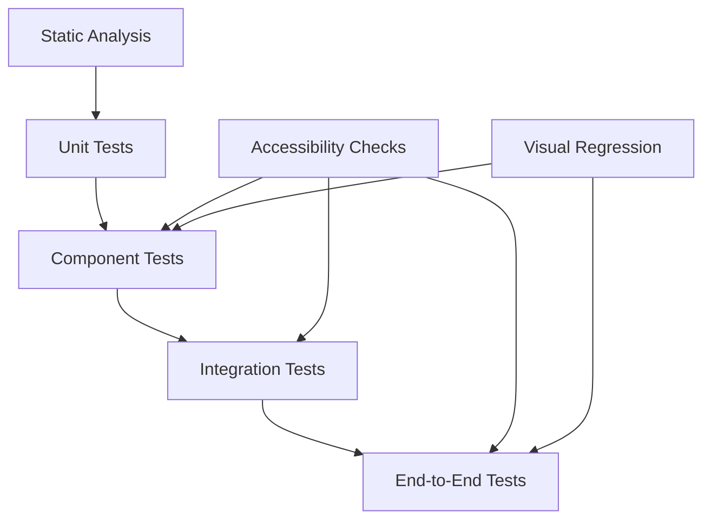
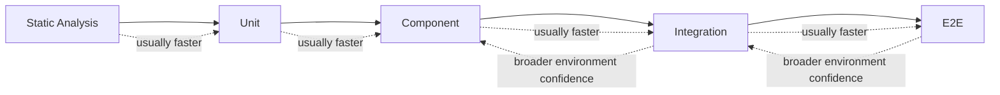
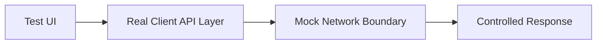
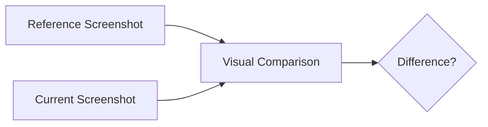
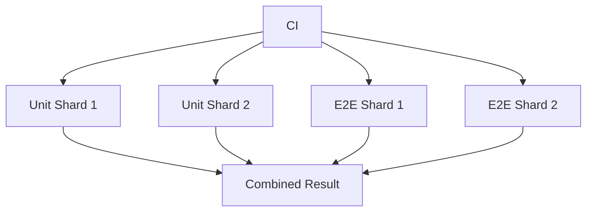
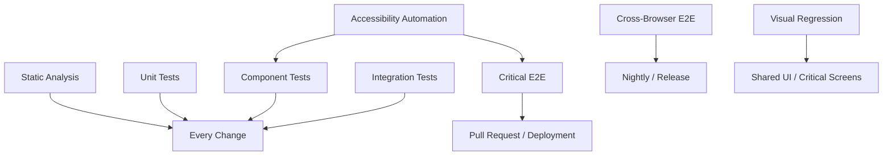

# Chapter 16 — Testing Strategies for Resilient Interfaces

Front-end applications fail in many different ways.

A function can return the wrong value.

A component can render the wrong state.

A form can reject valid input.

A route can lose state during navigation.

An API failure can leave the interface unusable.

A dialog can appear visually correct but fail keyboard interaction.

A checkout flow can work in isolated tests and still break in the browser.

No single test type can protect against all of these failures.

This is why mature front-end testing is not:

```text
unit tests
or
end-to-end tests
```

It is a layered strategy.

A useful model is:



Each layer answers a different question.

Static analysis asks:

> Does the code violate known structural constraints?

Unit tests ask:

> Does this small piece of logic behave correctly?

Component tests ask:

> Does this interface component behave correctly from the user's perspective?

Integration tests ask:

> Do several parts work together correctly?

End-to-end tests ask:

> Can the user complete the real workflow in a real browser environment?

The central principle of this chapter is:

> **Test at the lowest level that gives meaningful confidence, but test important behavior at the level where users actually experience it.**

This chapter focuses on:

- static analysis;
- unit tests;
- component tests;
- integration tests;
- end-to-end tests;
- behavior-oriented queries;
- accessibility-aware testing;
- Vitest;
- Playwright;
- network mocking;
- visual regression;
- automated accessibility checks;
- flaky test management.

The goal is not to maximize the number of tests.

The goal is to create a reliable feedback system.

---

# 1. Testing Is Risk Management

A test exists because something matters enough that we want to detect when it breaks.

That means the first question is not:

> What should we test?

It is:

> What failures would be expensive, dangerous, embarrassing, or difficult to detect manually?

Examples:

```text
checkout submits wrong total
```

high risk.

```text
button border radius changes by 1 px
```

usually lower risk.

```text
patient form loses unsaved data
```

high risk.

```text
marketing card wraps one line differently
```

possibly low risk.

Testing effort should follow risk.

---

# 2. Confidence Comes from Different Evidence

Consider an order calculation.

A unit test proves:

```text
calculateTotal()
```

returns the expected value.

That does not prove:

```text
the UI sends the correct quantity
```

A component test may prove the form updates.

That does not prove:

```text
the production API accepts the request
```

An end-to-end test may prove the whole flow.

But if every mathematical edge case is tested only through a browser, the suite becomes slow and difficult to diagnose.

Different layers provide different confidence.

---

# 3. Testing Pyramid, Trophy, and Reality

You may encounter metaphors such as:

```text
testing pyramid
testing trophy
testing diamond
```

These are heuristics.

A useful general idea is:

```text
many fast focused checks
some integration tests
fewer expensive browser journeys
```

But frontend applications vary.

A component-heavy application may benefit from many component tests.

A simple static site may need few tests at all.

Do not optimize for the shape of a diagram.

Optimize for useful confidence.

---

# 4. The Cost-Confidence Spectrum

A simplified spectrum:



Higher-level tests often cover more real integration.

They also tend to be:

- slower;
- harder to debug;
- more sensitive to environment;
- more expensive to maintain.

Use them where the confidence is worth the cost.

---

# 5. Static Analysis Is Part of Testing Strategy

Testing discussions sometimes begin only with executable tests.

But static analysis catches many defects before runtime.

Examples:

- TypeScript;
- ESLint;
- framework lint rules;
- accessibility lint rules;
- import-boundary rules.

TypeScript may catch:

```ts
const total:
  number =
  "100";
```

before any test runs.

Linting may catch:

```text
unhandled Promise
invalid hook usage
missing dependency
unsafe pattern
```

depending on configuration.

These are extremely cheap quality checks.

---

# 6. Static Analysis Has Limits

Static analysis cannot prove:

- the Save button updates the correct record;
- the dialog returns focus correctly in every browser;
- the API response is actually valid;
- the route works after deployment;
- a user can complete checkout.

It provides structural confidence.

Runtime behavior still needs tests.

---

# 7. Unit Tests

A unit test focuses on a small piece of logic.

Example:

```ts
function calculateSubtotal(
  price: number,
  quantity: number
) {
  return price * quantity;
}
```

Test:

```ts
import {
  expect,
  test
} from "vitest";

test(
  "calculates subtotal",
  () => {
    expect(
      calculateSubtotal(
        25,
        4
      )
    ).toBe(100);
  }
);
```

This test is:

- fast;
- deterministic;
- easy to understand.

---

# 8. Good Unit-Test Candidates

Strong candidates include:

- parsers;
- formatters;
- validators;
- reducers;
- state transitions;
- calculation functions;
- sorting/filtering logic;
- permission logic;
- data transformations.

These functions can often be tested without a browser.

---

# 9. Avoid Unit Testing Language Syntax

Weak test:

```text
array.map returns a new array
```

The JavaScript platform already tests JavaScript.

Test application behavior.

Example:

```text
sortProducts places unavailable items last
```

is meaningful.

---

# 10. Test Behavior, Not Line Count

Coverage tools may show:

```text
95% statement coverage
```

That does not prove the correct behavior is tested.

Example:

```ts
if (
  user.isAdmin
) {
  allowDelete();
}
```

A test may execute both lines without verifying the permission rule correctly.

Coverage tells us:

> Which code executed during tests?

It does not tell us:

> Did the tests make useful assertions?

---

# 11. Component Tests

A component test renders an interface component and interacts with it.

Suppose:

```text
QuantitySelector
```

contains:

```text
Decrease button
Current quantity
Increase button
```

A useful test asks:

```text
When the user presses Increase,
does the displayed quantity change?
```

This is stronger than testing:

```text
internal state variable becomes 2
```

---

# 12. Component Tests Should Resemble User Interaction

A guiding principle is:

> **Behavioral tests should normally select and interact with the interface through its user-visible and accessibility semantics, not through implementation details.**

For example:

```ts
const button =
  screen.getByRole(
    "button",
    {
      name:
        "Add to cart"
    }
  );
```

Then:

```ts
await user.click(
  button
);
```

This test speaks the language of the interface.

---

# 13. Why Role-Based Queries Are Valuable

A button can be identified by:

```text
role = button
accessible name = Add to cart
```

This reflects how browsers expose semantics to users and assistive technologies.

It also tends to survive implementation refactors.

For example:

```html
<button>
  Add to cart
</button>
```

may later include:

```html
<button>
  <svg ...></svg>
  <span>
    Add to cart
  </span>
</button>
```

The accessible behavior remains the same.

The test can remain the same.

---

# 14. Accessible Name

The **accessible name** is the name exposed for an accessible object.

It may come from:

- element text;
- associated label;
- `aria-label`;
- `aria-labelledby`;
- other rules defined by the accessible-name computation.

Example:

```html
<button>
  Save order
</button>
```

has an accessible name similar to:

```text
Save order
```

A test can use:

```ts
getByRole(
  "button",
  {
    name:
      "Save order"
  }
)
```

The important point is conceptual:

> Test tools use accessibility semantics defined by web platform rules; they do not invent a separate naming model.

---

# 15. Accessible Name Computation Is a Web Standard Concept

It is tempting to say:

> Testing Library computes names.

More accurately:

The testing tool implements or relies on behavior aligned with the web accessibility naming rules.

Accessible naming belongs to the web platform accessibility model.

Testing tools expose convenient queries using that model.

This distinction matters because the accessibility tree and accessible names are not testing-library inventions.

---

# 16. Preferred Query Order

A useful testing priority is generally:

```text
role + accessible name
labels
visible text
alt text
other user-facing semantics
test ID when necessary
```

Examples:

```ts
screen.getByRole(
  "button",
  {
    name:
      /submit/i
  }
);

screen.getByLabelText(
  "Email"
);

screen.getByText(
  "Order submitted"
);
```

These selectors describe what the user experiences.

---

# 17. `getByLabelText` for Forms

For:

```html
<label
  for="email"
>
  Email
</label>

<input
  id="email"
  type="email"
>
```

a test can query:

```ts
screen.getByLabelText(
  "Email"
);
```

This creates an additional benefit.

If the developer removes the label association, the test may fail.

The test therefore reinforces accessible form construction.

---

# 18. Role Queries Do Not Replace Accessibility Audits

A test such as:

```ts
getByRole(
  "button",
  {
    name:
      "Submit"
  }
);
```

provides useful evidence.

It does not prove:

- correct color contrast;
- keyboard behavior across the entire interface;
- screen-reader usability;
- complete WCAG compliance.

Role-based querying is an accessibility-supportive testing habit.

It is not a full accessibility audit.

---

# 19. Test IDs Are Legitimate Fallbacks

Sometimes the UI has no stable user-facing semantic identifier for the thing a test needs.

Example:

```text
canvas rendering surface
```

or:

```text
non-user-visible instrumentation hook
```

A test ID can be appropriate.

Example:

```html
<div
  data-testid=
    "chart-canvas"
></div>
```

The problem is not the existence of test IDs.

The problem is using them as the default even when better user-facing queries exist.

---

# 20. Avoid Overfitting to CSS Selectors

A brittle test:

```ts
document.querySelector(
  ".modal > .actions > .primary"
);
```

depends heavily on markup and styling structure.

A stronger test may use:

```ts
getByRole(
  "button",
  {
    name:
      "Confirm"
  }
);
```

CSS selectors are not forbidden.

They are simply usually a weaker default for behavioral tests.

---

# 21. Avoid Testing Internal State

Weak:

```text
expect component.state.open
to equal true
```

Stronger:

```text
click Open dialog
expect dialog to appear
```

The user experiences the dialog.

The user does not experience the internal state variable.

Implementation-focused tests discourage refactoring.

---

# 22. Avoid Testing Private Methods

Suppose a component has:

```text
calculateFilteredRows()
```

as an internal helper.

If users only care that:

```text
choosing Active
shows active rows
```

test the behavior.

If the filtering logic itself is complex, extract it into a pure function and unit test that function separately.

This creates a clean boundary.

---

# 23. Component Test Example

Imagine:

```text
SearchBox
```

Requirements:

1. user types query;
2. Search button becomes usable;
3. submit callback receives the query.

Test conceptually:

```ts
test(
  "submits the entered query",
  async () => {
    const onSearch =
      vi.fn();

    render(
      <SearchBox
        onSearch={
          onSearch
        }
      />
    );

    await user.type(
      screen.getByRole(
        "textbox",
        {
          name:
            "Search"
        }
      ),
      "monitor"
    );

    await user.click(
      screen.getByRole(
        "button",
        {
          name:
            "Search"
        }
      )
    );

    expect(
      onSearch
    ).toHaveBeenCalledWith(
      "monitor"
    );
  }
);
```

The test interacts through visible semantics.

---

# 24. Integration Tests

Integration tests verify several units working together.

Example:

```text
EditProductForm
+
runtime validation
+
mutation layer
+
query cache
```

A test might verify:

```text
user edits price
↓
submits
↓
request is sent
↓
server returns updated product
↓
UI shows updated price
```

This catches boundary problems that isolated unit tests cannot.

---

# 25. Integration Is a Spectrum

There is no universal line between:

```text
component test
```

and:

```text
integration test
```

One team may call a rendered component with mocked API an integration test.

Another may call it a component test.

Do not argue excessively about labels.

Document what environment and boundaries the test includes.

---

# 26. Browser Simulation vs Real Browser

Component tests may run in:

- simulated DOM environments;
- actual browsers.

Simulated environments are fast and convenient.

Real browsers provide more accurate behavior for:

- layout-related APIs;
- focus;
- events;
- browser-specific behavior;
- native platform semantics.

Use the environment appropriate to the risk.

---

# 27. Vitest

Vitest is the book's reference fast test runner because it integrates well with the modern Vite ecosystem.

It can support:

- unit tests;
- component-related tests;
- mocking;
- coverage;
- browser-mode testing.

A simple test:

```ts
import {
  describe,
  expect,
  it
} from "vitest";

describe(
  "calculateTax",
  () => {
    it(
      "calculates 10 percent",
      () => {
        expect(
          calculateTax(
            100
          )
        ).toBe(10);
      }
    );
  }
);
```

The specific runner matters less than testing architecture.

---

# 28. Test Runner Responsibilities

A test runner commonly provides:

- test discovery;
- test lifecycle;
- assertions;
- parallelism;
- mocks;
- coverage integration;
- watch mode.

It does not automatically determine:

```text
what is worth testing
```

That remains an engineering decision.

---

# 29. Watch Mode

During development:

```text
edit source
↓
rerun affected tests
```

provides fast feedback.

This is analogous to HMR in application development.

A test suite that takes:

```text
40 minutes
```

for every local change will be ignored.

Testing architecture should preserve short feedback loops.

---

# 30. Browser Mode

Modern test runners can increasingly execute tests in real browser contexts.

Vitest Browser Mode, for example, can run tests using browser providers including Playwright.

This can reduce the gap between:

```text
component test
```

and:

```text
real browser behavior
```

Use browser execution when platform fidelity matters.

Do not move every pure function test into a browser unnecessarily.

---

# 31. Simulated DOM Still Has Value

A fast simulated DOM environment can be excellent for:

- rendering basic components;
- form behavior;
- state transitions;
- DOM structure;
- event handling.

It may not faithfully implement:

- full layout;
- browser rendering;
- every native API.

Know what your environment can and cannot prove.

---

# 32. User Event Simulation

A poor test may invoke:

```text
handler()
```

directly.

A stronger component test often simulates:

```text
click
type
tab
keyboard
```

because event sequences can matter.

For example, typing is not simply:

```text
set input.value
```

Real interaction produces browser events and focus behavior.

Use user-oriented event utilities where practical.

---

# 33. Keyboard Testing

Important interfaces should be tested through keyboard interaction where keyboard behavior is part of the contract.

Examples:

```text
Tab to button
Enter activates
Escape closes dialog
Arrow keys move tabs
```

This is particularly important for custom composite widgets.

Do not rely only on mouse clicks.

---

# 34. Focus Testing

Focus is part of interface state.

For a dialog:

```text
open dialog
↓
focus moves inside
↓
user closes
↓
focus returns to opener
```

This behavior should be tested when it matters.

Example conceptual assertion:

```text
expect Close button
to have focus
```

Focus bugs can make an otherwise functional interface unusable by keyboard.

---

# 35. Testing Async UI

Modern interfaces often contain asynchronous states:

```text
loading
success
error
refreshing
```

Tests should wait for observable behavior.

Example:

```ts
expect(
  screen.getByText(
    "Loading..."
  )
).toBeInTheDocument();

expect(
  await screen.findByText(
    "Monitor"
  )
).toBeInTheDocument();
```

Avoid fixed sleeps such as:

```text
wait 500 ms
```

unless testing time itself.

---

# 36. Avoid Arbitrary Sleeps

Weak:

```ts
await delay(
  1000
);
```

Then:

```text
hope UI finished
```

This creates slow and flaky tests.

Prefer waiting for:

- visible element;
- network completion;
- state transition;
- stable condition.

Modern test tools provide retry/wait behavior for this reason.

---

# 37. Assertions Should Match User Outcomes

Weak:

```text
expect fetch called once
```

when the real requirement is:

```text
user sees saved product
```

The request assertion may be useful.

But the user outcome is stronger.

A test can assert both when transport behavior matters.

---

# 38. Mocking

A mock replaces a real dependency with controlled behavior.

Examples:

- function;
- module;
- clock;
- network request;
- storage;
- browser API.

Mocking helps isolate behavior.

It also creates risk:

> Your test may pass because the mock behaves differently from reality.

Use mocks deliberately.

---

# 39. Mock at Stable Boundaries

A good mock boundary is often:

```text
network API
clock
external service
browser permission
```

A weaker pattern is mocking every internal function.

If:

```text
Component A mocks helper B
helper B mocks helper C
```

tests may only verify your mock arrangement.

---

# 40. Mocking Internal Modules Can Over-Couple Tests

Suppose:

```text
CheckoutForm
```

internally calls:

```text
validateCart
```

If the test mocks `validateCart`, it now depends on internal architecture.

Refactoring validation into another module breaks the test even if behavior is unchanged.

Prefer mocking external boundaries.

---

# 41. Network Mocking

Network mocking allows realistic UI tests without depending on a live backend.

Instead of mocking:

```text
fetch()
```

directly in every test, a network layer can intercept:

```text
GET /api/products
```

and return a controlled response.

Conceptually:



This exercises more real frontend behavior.

---

# 42. Mock Service Worker Style

Tools in the Mock Service Worker family intercept requests at the network boundary.

A test can define:

```text
GET /api/products
→ success response
```

or:

```text
GET /api/products
→ 500
```

The UI code still uses its normal request layer.

This creates useful integration fidelity.

---

# 43. Test Success, Error, and Empty States

For a product list:

```text
success with products
empty success
network failure
validation failure
slow loading
```

are different scenarios.

Tests should represent meaningful states.

Do not test only the happy path.

---

# 44. Test Cancellation and Races Where Relevant

Chapter 4 and Chapter 9 introduced cancellation and stale-response races.

For a search interface, test:

```text
query A starts
query B starts
B finishes
A finishes later
```

The interface should still show:

```text
B
```

if B is current.

Race-condition tests are especially valuable because manual reproduction is unreliable.

---

# 45. Fake Timers

Time-based features may use:

- debounce;
- retry delay;
- expiration;
- polling.

Instead of waiting real seconds, test runners can use fake timers.

Conceptually:

```text
schedule 500 ms
↓
advance virtual time
↓
assert behavior
```

Use fake timers when testing time logic.

Avoid mixing them carelessly with real browser timing APIs.

---

# 46. Test Data Builders

Large objects make tests noisy.

Weak:

```ts
const product = {
  id: "P-1",
  name: "Monitor",
  description: "...",
  price: 250,
  stock: 5,
  category: "office",
  createdAt: "...",
  updatedAt: "...",
  ...
};
```

Repeated in every test.

A builder can create valid defaults:

```ts
const product =
  buildProduct({
    stock: 0
  });
```

This keeps the test focused on relevant differences.

---

# 47. Avoid Magic Fixtures

A giant fixture file called:

```text
test-data.json
```

may be reused everywhere.

Tests become unclear because nobody knows which fields matter.

Prefer small scenario-specific data.

Test data should make the intended case obvious.

---

# 48. Integration Test Example

Suppose the user edits product price.

Test:

```text
render route
server returns product
user changes Price
user presses Save
mock server accepts update
query invalidates
UI shows new price
```

This verifies several real boundaries:

- form;
- validation;
- mutation;
- network;
- cache;
- rendering.

That is high-value integration coverage.

---

# 49. End-to-End Testing

An end-to-end test exercises the application through a real browser against a running system or realistic environment.

Example:

```text
open login page
↓
sign in
↓
navigate to catalogue
↓
edit product
↓
save
↓
reload
↓
verify persisted value
```

This tests the system from the user's perspective.

---

# 50. Playwright

Playwright is the book's reference end-to-end browser-testing tool.

It supports browser engines such as:

- Chromium;
- Firefox;
- WebKit.

A test might look like:

```ts
import {
  expect,
  test
} from "@playwright/test";

test(
  "user updates product",
  async ({
    page
  }) => {
    await page.goto(
      "/products/P-42"
    );

    await page
      .getByRole(
        "button",
        {
          name:
            "Edit"
        }
      )
      .click();

    await page
      .getByLabel(
        "Price"
      )
      .fill(
        "275"
      );

    await page
      .getByRole(
        "button",
        {
          name:
            "Save"
        }
      )
      .click();

    await expect(
      page.getByText(
        "$275"
      )
    ).toBeVisible();
  }
);
```

The test reads like a user journey.

---

# 51. Playwright Locators

Playwright locators provide retryable element targeting.

Recommended user-facing locators include:

```text
getByRole
getByLabel
getByText
getByAltText
getByTestId
```

Role locators can include the accessible name.

Example:

```ts
page.getByRole(
  "button",
  {
    name:
      "Save"
  }
);
```

This is generally more robust than selecting:

```text
#save-btn-v2
```

unless the identifier is the intentional contract.

---

# 52. Auto-Waiting

Modern browser-testing tools wait for relevant conditions.

For example, clicking a locator may wait until the element is:

- present;
- actionable;
- ready.

This reduces the need for manual waits.

Do not add:

```text
sleep 2 seconds
```

before every click.

That makes tests slower and less reliable.

---

# 53. Web-First Assertions

Instead of:

```text
read value immediately
then compare
```

use retrying assertions such as:

```ts
await expect(
  page.getByText(
    "Saved"
  )
).toBeVisible();
```

The assertion waits for the expected UI condition within its timeout.

This matches asynchronous web behavior.

---

# 54. Test Real User Journeys

Good E2E candidates include:

- login;
- checkout;
- account recovery;
- record creation;
- permission-sensitive workflow;
- critical route navigation.

Do not test every tiny component variation through E2E.

That creates an unnecessarily slow suite.

---

# 55. The Critical Path Suite

A production system may define a small critical E2E set:

```text
user can sign in
user can search
user can create order
user can complete payment
```

Run it:

- before deployment;
- after deployment;
- on important environments.

Broader scenarios can run less frequently if necessary.

---

# 56. E2E Tests Should Use Realistic Data Isolation

Parallel E2E tests can interfere.

Example:

```text
Test A deletes Product P-1
Test B expects Product P-1
```

The tests become flaky.

Use:

- per-test records;
- isolated accounts;
- generated IDs;
- resettable environments.

Shared mutable fixtures are dangerous.

---

# 57. Test Setup Through APIs

Suppose a test needs a customer with five orders.

Creating it through the UI every time may be slow.

It can be reasonable to set up preconditions through an API:

```text
API creates customer
API creates orders
browser tests UI behavior
```

The user journey under test remains browser-based.

Not every prerequisite must be created through the UI.

---

# 58. Do Not Bypass the Behavior Under Test

If the test is:

```text
user can register
```

do not create the user directly through the API.

That bypasses the behavior.

If the test is:

```text
existing user can edit profile
```

API-based user setup is reasonable.

The setup method depends on what is being tested.

---

# 59. E2E Authentication

Repeated login through the UI for every test can be slow.

A suite may authenticate once and reuse controlled session state.

But keep at least dedicated tests for:

- login;
- logout;
- session expiry;
- relevant auth flows.

Optimization should not remove authentication coverage.

---

# 60. Multi-Browser Testing

Not every test needs to run in every browser on every commit.

A balanced strategy might be:

```text
critical suite:
Chromium + Firefox + WebKit

broader suite:
primary browser on PR
all browsers nightly
```

The exact strategy depends on:

- browser support policy;
- CI cost;
- product risk.

---

# 61. Mobile Viewports

Responsive behavior should be tested at representative viewports.

But:

```text
375 × 667
```

is not a complete mobile simulation.

Device behavior also includes:

- touch;
- CPU;
- browser;
- network.

Use viewport tests for layout confidence.

Use real/device-level testing where the product risk justifies it.

---

# 62. Accessibility-Oriented Testing

Accessibility should appear throughout the test strategy.

Useful automated checks include:

- semantic queries;
- keyboard interaction;
- focus behavior;
- automated rules;
- accessible names;
- form labels.

This should not be postponed to:

```text
final accessibility audit
```

---

# 63. Semantic Querying as a Quality Signal

Suppose the intended control is visually a button.

If:

```ts
getByRole(
  "button",
  {
    name:
      "Save"
  }
)
```

cannot find it because the markup is:

```html
<div
  onclick="..."
>
  Save
</div>
```

the failing test has revealed an interface-semantics problem.

This is useful feedback.

---

# 64. But Queries Are Not Accessibility Certification

A page can have excellent role-based tests and still have:

- poor contrast;
- confusing reading order;
- incorrect live-region behavior;
- inaccessible custom drag/drop;
- cognitive accessibility issues.

Use multiple levels of accessibility testing.

---

# 65. Automated Accessibility Checks

Tools such as axe-based integrations can detect many machine-testable issues.

Examples may include:

- missing labels;
- invalid ARIA;
- some contrast failures;
- structural problems.

They cannot prove complete accessibility.

Automated accessibility testing is valuable because it cheaply catches recurring violations.

---

# 66. Component-Level Accessibility Automation

A shared component library is an excellent place for automated accessibility checks.

If:

```text
Dialog
Tabs
Menu
FormField
```

are tested centrally, every consumer benefits.

This connects to Chapter 14's design-system quality strategy.

---

# 67. E2E Accessibility Checks

Critical pages can run automated checks after real browser rendering.

This may catch integration issues such as:

- duplicate IDs;
- page-level landmark problems;
- generated ARIA errors.

But manual accessibility testing remains necessary for important products.

---

# 68. Keyboard Journeys

A useful E2E scenario may use:

```text
Tab
Shift+Tab
Enter
Space
Arrow keys
Escape
```

instead of clicking everything with a mouse.

For critical interfaces, test the keyboard path intentionally.

---

# 69. Screen Reader Testing

Automating screen-reader behavior remains more specialized and cannot be reduced to ordinary DOM assertions.

For high-impact applications, human testing with assistive technologies may be required.

The engineering suite should support that work through:

- correct semantics;
- stable accessible names;
- automated rule coverage.

Do not claim that component tests replace assistive-technology testing.

---

# 70. Visual Regression Testing

Behavioral tests may pass while the interface looks wrong.

Example:

```text
button exists
click works
```

but CSS makes:

```text
text invisible
```

Visual regression can compare screenshots.

Architecture:



This can detect unintended visual changes.

---

# 71. Visual Tests Are Especially Useful for Design Systems

Shared components have stable visual contracts.

Useful visual states include:

```text
default
hover
focus
disabled
error
dark theme
RTL
mobile width
```

A visual test can catch changes that ordinary DOM assertions cannot.

---

# 72. Visual Regression Noise

Screenshot tests can be noisy because of:

- font rendering;
- anti-aliasing;
- animation;
- time-dependent content;
- platform differences.

Control the environment.

Examples:

- fixed viewport;
- stable fonts;
- disable animations;
- deterministic data;
- consistent browser image.

---

# 73. Visual Tests Should Not Replace Behavioral Tests

A screenshot can show:

```text
dialog appears
```

but does not prove:

```text
Escape closes it
focus returns
Save works
```

Use visual testing for visual contracts.

Use behavior tests for behavior.

---

# 74. Snapshot Testing

Snapshot tests serialize output and compare future output.

Example:

```text
component tree
```

or:

```text
JSON result
```

can be stored as a snapshot.

Snapshots can be useful for stable structured output.

But large DOM snapshots often become noisy.

---

# 75. Snapshot Approval Risk

A snapshot fails.

Developer runs:

```text
update snapshots
```

without reviewing changes.

The test now provides little protection.

Snapshots are useful only when developers can understand and review the diff.

Prefer focused assertions for important behavior.

---

# 76. Contract Tests

Distributed frontend systems increasingly depend on contracts.

Examples:

- API schema;
- micro-frontend mounting interface;
- runtime event shape;
- shared package behavior.

Contract tests verify compatibility between producer and consumer expectations.

This becomes especially important with independent deployment.

---

# 77. API Contract Testing

Suppose frontend expects:

```json
{
  "id": "P-42",
  "price": 275
}
```

A contract test can verify the API still satisfies the agreed shape.

Runtime validation remains necessary.

Contract testing helps detect breaking producer changes earlier.

---

# 78. Schema-Driven Testing

If the API publishes:

- OpenAPI;
- GraphQL schema;
- another machine-readable contract;

tests and generated clients can use it.

But generated types still do not remove runtime trust boundaries.

Chapter 5's distinction remains.

---

# 79. Test the Boundary You Actually Depend On

If the frontend depends on:

```text
status 409 means conflict
```

test that contract.

If it depends on:

```text
field errors contain a field map
```

test that.

Avoid testing server implementation details that are irrelevant to the frontend.

---

# 80. Network Conditions

Browser tests can simulate:

- offline;
- slow response;
- failed request;
- delayed response.

These scenarios are valuable for Chapters 9 and 10 behavior.

Example:

```text
user presses Save
network fails
draft remains
Retry appears
```

That is critical behavior.

---

# 81. Test Offline Behavior Where Promised

If the product claims:

```text
works offline
```

test:

```text
app shell loads
cached record opens
draft persists
outbox shows pending
reconnect syncs
```

Do not treat Service Worker registration as proof of offline functionality.

---

# 82. Test Real Error Recovery

An error test should not stop at:

```text
error message appears
```

Also test:

```text
user can retry
existing data remains
draft is preserved
navigation still works
```

Resilience is about recovery.

---

# 83. Flaky Tests

A flaky test sometimes passes and sometimes fails without relevant application changes.

This is dangerous.

Developers learn:

> Red tests may be meaningless.

Eventually they rerun until green.

The suite loses authority.

---

# 84. Common Causes of Flakiness

Examples:

- arbitrary sleeps;
- shared test data;
- race conditions;
- dependency on network services;
- animation;
- unstable selectors;
- clock/time zone;
- random IDs;
- order-dependent tests;
- eventual asynchronous state.

Flakiness is usually a system-design problem.

---

# 85. Never Normalize Flakiness

Do not say:

```text
That test always fails once.
Just rerun it.
```

Treat recurring flakiness as a defect.

Options:

- fix;
- quarantine temporarily;
- delete low-value test;
- redesign the test.

A test that nobody trusts has negative value.

---

# 86. Retries

Test runners can retry failed tests.

Retries can be useful to:

- gather traces;
- reduce infrastructure noise.

But retries can also hide real race conditions.

If a test passes only on retry, investigate.

Do not use retries as the primary flakiness strategy.

---

# 87. Trace Artifacts

When a browser test fails, collect:

- screenshot;
- trace;
- network log;
- console output;
- video where useful.

A Playwright trace can make CI failure debugging far easier than:

```text
Timeout exceeded
```

alone.

Good test infrastructure optimizes debugging time.

---

# 88. Failure Messages

A test should fail with useful context.

Good:

```text
Expected button "Submit order"
to become enabled after valid address
```

Weak:

```text
expected true to be false
```

Assertions should describe intent.

---

# 89. Test Names Are Documentation

Good:

```text
"preserves the draft when save fails"
```

Weak:

```text
"test form 3"
```

A test suite should communicate expected behavior to future developers.

---

# 90. Arrange–Act–Assert

A useful test structure:

```text
Arrange
Act
Assert
```

Example:

```text
Arrange:
render product with stock 0

Act:
attempt Add to cart

Assert:
button disabled / unavailable message
```

Do not force every test into ceremonial comments.

Use the pattern to keep logic clear.

---

# 91. Given–When–Then

Another style:

```text
Given:
user has unsaved draft

When:
save request fails

Then:
draft remains
```

This is particularly useful for business behavior.

Again, the structure matters more than naming convention.

---

# 92. One Test Can Have Several Assertions

A myth says:

> Every test must contain one assertion.

That is too rigid.

If one behavior naturally produces:

```text
dialog appears
focus moves to heading
Cancel button visible
```

several related assertions may be appropriate.

The better rule is:

> One test should usually represent one coherent behavior or scenario.

---

# 93. Avoid Mega Tests

A test that does:

```text
login
create product
edit product
delete product
logout
register new user
buy item
```

is difficult to debug.

If it fails halfway, the cause is unclear.

Split workflows by meaningful behavior while preserving critical end-to-end journeys where needed.

---

# 94. Test Independence

Tests should ideally run:

```text
alone
in any order
in parallel
```

A test should not depend on:

```text
the previous test created data
```

unless the suite explicitly models a serial journey.

Independent tests are easier to diagnose.

---

# 95. Parallel Execution

Modern runners can execute tests concurrently.

Benefits:

- faster CI.

Requirements:

- isolated data;
- independent resources;
- deterministic setup.

Parallelism exposes hidden coupling.

That is useful feedback.

---

# 96. Determinism

A test should control relevant sources of variation:

- current time;
- random value;
- locale;
- time zone;
- network;
- feature flags.

For example, date formatting may differ if CI uses:

```text
UTC
```

while local development uses:

```text
Asia/Baghdad
```

When time zone matters, set it deliberately.

---

# 97. Locale Testing

Internationalized applications should test representative locales.

Examples:

```text
English LTR
Sorani Kurdish RTL
Arabic RTL
long-text locale
```

Useful checks include:

- formatting;
- text expansion;
- logical layout;
- directionality.

A test suite that only runs English may miss real product failures.

---

# 98. RTL Testing

For RTL support, test:

- navigation direction;
- icons that should or should not mirror;
- logical spacing;
- table alignment;
- form layout.

Visual regression can be particularly useful here.

This connects Chapter 2 and Chapter 3 with Chapter 16.

---

# 99. Date and Time Testing

Date bugs often arise from:

- time zone;
- DST;
- locale;
- boundary dates.

Test domain-relevant edge cases:

```text
midnight
month change
year change
DST transition where applicable
```

Do not test the entire calendar unless the product requires it.

---

# 100. Browser APIs Need Realistic Tests

If a feature depends on:

- Clipboard;
- ResizeObserver;
- IntersectionObserver;
- File API;
- Service Worker;
- IndexedDB;

a pure Node test may not prove enough.

Choose the appropriate environment.

Mock APIs for small logic tests.

Use real browser tests for critical integration.

---

# 101. Testing Service Workers

Service Workers involve:

- registration;
- lifecycle;
- cache;
- offline request interception.

These are browser behaviors.

Test important Service Worker workflows in a real browser environment.

Unit-test pure strategy logic separately where possible.

---

# 102. Testing WebSockets and SSE

For live communication, test:

```text
connect
receive event
disconnect
reconnect
duplicate message
missed state recovery
```

A deterministic local server or controlled mock can help.

Avoid depending on an unreliable shared external service.

---

# 103. Race Testing

Race conditions require deliberate timing control.

Example:

```text
request A starts
request B starts
B resolves
A resolves
```

Use controlled Promises or network delays.

Verify:

```text
A does not overwrite B
```

This is one of the strongest uses of deterministic mocks.

---

# 104. Error Boundary Testing

If the framework supports error boundaries, verify:

```text
child throws
↓
local fallback appears
↓
rest of page remains usable
```

Do not test only successful rendering.

Failure containment is part of resilient UI.

---

# 105. Loading Boundary Testing

Chapter 11 introduced streaming/loading boundaries.

Test:

```text
fast region renders
slow region shows fallback
slow region resolves
fallback disappears
```

Avoid assertions tied to implementation internals.

Test the user-visible sequence.

---

# 106. Cache Behavior Testing

For server-state caches, useful tests include:

```text
same query deduplicates
stale data remains during refresh
mutation invalidates related query
optimistic update rolls back
```

Not every cache-library internal algorithm needs a test.

Test your application's cache policy.

---

# 107. Optimistic Update Test

Scenario:

```text
active = false
```

User toggles:

```text
active = true
```

UI updates immediately.

Server fails.

Expected:

```text
active returns to false
error appears
```

This is important user behavior.

It is more valuable than asserting internal mutation callback order.

---

# 108. Testing Forms

Forms deserve several layers.

Unit:

```text
validation rule
```

Component:

```text
field error appears
```

Integration:

```text
server field error maps correctly
```

E2E:

```text
user completes important workflow
```

This layered strategy prevents every form test from becoming a large browser test.

---

# 109. Validation Testing

Client validation tests should cover meaningful cases:

```text
required field
invalid email
cross-field rule
```

Do not duplicate every server validation rule unnecessarily unless client behavior depends on it.

The server remains authoritative.

---

# 110. Server Error Mapping

Suppose server responds:

```json
{
  "fields": {
    "email":
      "Already registered"
  }
}
```

Test:

```text
error appears near Email
other draft fields remain intact
```

This verifies user recovery.

---

# 111. Testing Routing

Important route tests include:

- route parameter parsing;
- query state;
- redirects;
- protected routes;
- nested layouts;
- back/forward behavior;
- scroll restoration where important.

Use component/integration tests for route logic.

Use E2E for critical navigation behavior.

---

# 112. URL State Tests

For:

```text
/products?q=monitor&page=2
```

test that:

- UI reflects query;
- reload preserves filter;
- Back restores previous state;
- generated links are shareable.

These are user-level URL behaviors.

---

# 113. Route Code-Splitting Tests

You generally do not need to assert:

```text
webpack/vite generated file X
```

inside behavior tests.

But performance/build tests may verify:

```text
reports code not loaded initially
```

when this is a meaningful performance contract.

Choose the test layer based on the requirement.

---

# 114. Permission Testing

Frontend permission behavior:

```text
viewer does not see Edit
editor sees Edit
```

should be tested.

Server authorization:

```text
viewer cannot PATCH product
```

must also be tested on the server/API side.

Frontend tests are not authorization enforcement.

---

# 115. Security Testing Boundaries

Front-end tests can verify:

- dangerous HTML is sanitized;
- login redirect works;
- CSRF token is included;
- unauthorized UI is hidden;
- logout clears sensitive local state.

They do not replace:

- penetration testing;
- dependency scanning;
- server security tests.

Chapter 13's layered security model still applies.

---

# 116. Test Coverage Metrics

Coverage types may include:

- statements;
- branches;
- functions;
- lines.

Branch coverage can be particularly useful for logic with:

```text
success/error
permission yes/no
state A/state B
```

But no percentage is automatically “correct.”

---

# 117. Coverage as a Map, Not a Grade

Use coverage to find:

```text
important untested logic
```

not to optimize for:

```text
100%
```

A trivial getter does not need the same attention as payment calculation.

Coverage should guide questions, not become the product objective.

---

# 118. Mutation Testing

Mutation testing changes code deliberately:

```text
>
becomes
>=
```

or:

```text
true
becomes
false
```

Then it checks whether tests fail.

If tests still pass, they may not actually protect that behavior.

Mutation testing can reveal weak assertions.

It is computationally expensive and usually a Working Knowledge technique.

---

# 119. Property-Based Testing

Instead of testing only chosen examples, property-based testing generates many inputs.

Example property:

```text
for any positive price and quantity,
subtotal >= 0
```

Useful for:

- parsers;
- transformations;
- mathematical logic;
- serialization.

It can expose edge cases humans did not think to write manually.

Not every UI component needs property-based testing.

---

# 120. Visual Testing of Themes

A design system may test:

```text
light
dark
high contrast
RTL
```

through screenshot variants.

This can catch:

- token mistakes;
- missing theme overrides;
- inverted icons;
- contrast-related visual issues.

Combine visual tests with semantic/accessibility tests.

---

# 121. Cross-Browser CSS Testing

Complex layout behavior can vary.

For critical UI:

```text
grid
sticky
dialog
forms
```

test supported browser engines.

Do not run every unit test in all browsers.

Use cross-browser execution where browser differences matter.

---

# 122. Responsive Visual Testing

Capture representative widths:

```text
small mobile
large mobile
tablet
desktop
```

Avoid dozens of arbitrary sizes unless layout breakpoints justify them.

Container-query components may need isolated width testing independent of viewport.

---

# 123. Test Environment Strategy

A mature system often has:

```text
local
CI
preview/staging
production monitoring
```

Different tests fit different places.

Local:

- fast unit/component.

CI:

- full unit/integration;
- selected E2E.

Preview:

- deployment integration;
- browser tests.

Production:

- smoke tests;
- monitoring;
- RUM/errors.

---

# 124. Smoke Tests

A smoke test verifies that critical deployed behavior is available.

Example:

```text
homepage loads
login page loads
API health works
critical route renders
```

It does not deeply test every feature.

A small smoke suite after deployment can catch catastrophic release problems quickly.

---

# 125. Production Tests Must Be Safe

Do not run destructive test behavior against real customer data.

Production smoke tests should use:

- read-only checks;
- dedicated synthetic accounts;
- reversible isolated actions.

Operational testing needs safety boundaries.

---

# 126. Feature Flags and Testing

If a feature can be:

```text
on
off
```

both states may need coverage during rollout.

A common bug is:

```text
new feature tested
old fallback forgotten
```

Remove dead flag paths after rollout to reduce test matrix complexity.

---

# 127. Test Matrix Explosion

Variables may include:

```text
browser
locale
theme
feature flag
user role
device
```

Testing every combination is often impossible.

Use risk-based pairings.

Example:

```text
critical checkout
→ all supported browsers

dark RTL admin table
→ one representative browser

unit logic
→ environment independent
```

Design the matrix intentionally.

---

# 128. CI Test Parallelism

CI can split tests across workers.

A useful architecture:



Parallelism reduces feedback time.

But test isolation must support it.

---

# 129. Test Selection

Large monorepos may not need every test for every change.

If:

```text
packages/ui/Button
```

changes, run affected:

- UI tests;
- consuming application tests;
- relevant visual tests.

This connects Chapter 14's affected-build concept with test strategy.

---

# 130. Quarantining Flaky Tests

If a flaky test cannot be fixed immediately:

- remove it from required gating temporarily;
- track an owner;
- create an issue;
- preserve visibility.

Do not silently ignore failures.

A quarantine should be temporary and explicit.

---

# 131. Deleting Low-Value Tests

Tests are code.

They require maintenance.

Delete a test when:

- behavior no longer matters;
- it duplicates stronger coverage;
- it is implementation-coupled and adds no confidence;
- maintenance cost exceeds value.

More tests are not automatically better.

---

# 132. Test Maintenance

When behavior intentionally changes:

```text
product requirement changed
```

tests should change too.

The test suite is executable documentation of current expectations.

Do not preserve old tests only because:

```text
they already exist
```

---

# 133. Testing Refactors

A good behavioral suite supports refactoring.

You should be able to change:

- internal component structure;
- helper functions;
- file organization;

without rewriting every test.

If implementation refactoring breaks many tests while user behavior is unchanged, the tests may be too coupled.

---

# 134. Test Architecture Smells

## Every test queries `data-testid`

Likely not testing user semantics.

## Every internal function is mocked

Likely over-coupled.

## Component refactor breaks hundreds of tests

Likely implementation-detail testing.

## E2E suite takes hours

Too much behavior may be tested only at the highest level.

## Test failures disappear on retry

Flakiness is normalized.

## Coverage is 100% but critical bugs escape

Coverage is being treated as a target rather than evidence.

## Snapshots are updated without review

Tests provide little protection.

## Production bugs cannot be reproduced in test environments

Environment fidelity may be insufficient.

---

# 135. A Balanced Testing Strategy

One possible strategy:



The exact cadence depends on cost and risk.

---

# 136. Test Strategy by Layer

A practical example:

### Static

```text
TypeScript
ESLint
```

### Unit

```text
pricing
validation
reducers
parsers
```

### Component

```text
Button
Dialog
ProductForm
Filters
```

### Integration

```text
ProductForm + mutation + cache
Search + URL + API
```

### E2E

```text
sign in
create product
checkout
```

This creates overlapping confidence without duplicating every detail at every layer.

---

# 137. Testing a Dialog

Unit:

```text
probably little value for raw Dialog internals
```

Component:

```text
opens
has role=dialog
has accessible name
Escape closes
focus enters
focus returns
```

Visual:

```text
light/dark/mobile
```

E2E:

```text
only if dialog participates in a critical workflow
```

This is proportional testing.

---

# 138. Testing a Pricing Function

Unit:

```text
many edge cases
```

Component:

```text
price displayed correctly in UI
```

E2E:

```text
critical checkout total
```

Do not test every mathematical combination through E2E.

---

# 139. Testing Search

Unit:

```text
query parser
```

Component:

```text
input and clear behavior
```

Integration:

```text
URL query
network response
loading/error/results
race cancellation
```

E2E:

```text
user can search and open result
```

Each layer protects different behavior.

---

# 140. Testing Offline Drafts

Unit:

```text
outbox state transitions
```

Integration:

```text
save to IndexedDB
reload draft
```

E2E:

```text
go offline
edit
reload
reconnect
sync
```

Offline functionality deserves a real-browser path because browser storage and Service Workers matter.

---

# 141. Testing Micro-Frontends

Remote unit/component:

```text
works independently
```

Contract:

```text
host interface compatible
```

Host integration:

```text
remote loads
failure fallback works
```

E2E:

```text
customer journey crosses frontends
```

This connects Chapter 14's runtime architecture to testing.

---

# 142. Testing Rendering Topologies

For SSR/SSG/hydration:

test:

```text
initial HTML contains critical content
hydration succeeds
interactive control works
```

For streaming:

```text
shell arrives
fallback visible
slow region resolves
```

For client-only routes:

```text
loading and recovery are correct
```

Testing should reflect the topology.

---

# 143. Testing Performance Contracts

Performance belongs mainly to Chapter 15, but some performance expectations can become tests.

Examples:

- bundle budget;
- route chunk not initial;
- no severe layout shift in visual scenario;
- no regression beyond synthetic threshold.

Do not turn every benchmark into a brittle test.

Use guardrails for important constraints.

---

# 144. Testing Security Contracts

Examples:

```text
untrusted HTML sanitized
logout clears user cache
protected route redirects
viewer cannot see admin UI
```

But remember:

frontend tests cannot prove server authorization.

Cross-layer security requires server and integration coverage.

---

# 145. Test Strategy Document

For a substantial application, document:

```text
what each test layer covers
which tools are used
where tests run
browser matrix
fixture strategy
flaky-test policy
coverage expectations
critical journeys
```

This reduces ad hoc decisions.

---

# 146. Testing Philosophy

A good testing culture asks:

```text
What confidence does this test buy?
What failure does it catch?
What does it cost to maintain?
At what layer is it cheapest and still meaningful?
```

This is more useful than:

```text
We need more tests.
```

---

# 147. Misconceptions to Leave Behind

## “100% code coverage means the application is well tested.”

No.

Coverage shows execution, not correctness of assertions.

---

## “Unit tests are always better because they are fast.”

No.

Some failures only appear through integration.

---

## “E2E tests give the most confidence, so everything should be E2E.”

No.

They are expensive, slower, and harder to diagnose.

Use them for important integrated journeys.

---

## “Component tests should inspect component state.”

Usually not.

Behavioral tests should prefer user-visible outcomes.

---

## “CSS selectors are forbidden in tests.”

No.

They are simply often weaker than semantic user-facing locators for behavioral tests.

---

## “Test IDs are bad.”

No.

They are useful fallbacks when semantic/user-facing locators are not appropriate.

---

## “Role queries test the accessibility tree completely.”

No.

They use accessibility semantics and provide useful early feedback.

They do not replace accessibility audits.

---

## “Accessible name is a Testing Library concept.”

No.

Accessible names come from web accessibility standards and browser semantics.

---

## “If `getByRole` passes, the component is accessible.”

No.

Many accessibility requirements are not covered by one query.

---

## “A simulated DOM is the same as a browser.”

No.

It is useful but does not reproduce every browser behavior.

---

## “Every component test should run in a real browser.”

No.

Use browser fidelity where it adds confidence.

---

## “Mocks make tests reliable.”

Mocks make dependencies controllable.

Too many mocks can make tests unrealistic.

---

## “Mock every internal module.”

No.

Prefer stable external boundaries.

---

## “Waiting one second fixes async tests.”

It often creates slow flaky tests.

Wait for meaningful conditions.

---

## “Playwright needs manual sleeps between actions.”

No.

Its locator/action/assertion model includes waiting behavior.

---

## “Every E2E test should log in through the UI.”

No.

Use API/session setup when login itself is not the behavior under test.

---

## “Every test should run in every browser.”

Not necessarily.

Use a risk-based browser matrix.

---

## “Visual regression tests replace component behavior tests.”

No.

Visual and behavioral correctness are different.

---

## “Snapshot tests make assertions unnecessary.”

No.

Large snapshots can hide important changes.

---

## “Retries solve flaky tests.”

No.

Retries can hide instability.

Investigate recurring failures.

---

## “A flaky test is better than no test.”

Not always.

An untrusted test can damage the entire suite's credibility.

---

## “More tests always mean higher quality.”

No.

High-value, maintainable tests matter more than raw count.

---

# Chapter Summary

Front-end testing is a layered confidence strategy.

Static analysis catches structural defects cheaply.

Unit tests protect focused logic.

Component tests verify interface behavior.

Integration tests verify boundaries working together.

End-to-end tests protect critical user journeys in real browsers.

A useful principle is:

```text
test at the lowest level
that still proves
the behavior you care about
```

Behavioral UI tests should usually interact through:

- roles;
- accessible names;
- labels;
- visible text;
- other user-facing semantics.

For example:

```ts
getByRole(
  "button",
  {
    name:
      "Save"
  }
)
```

is often stronger than selecting an implementation-specific CSS class.

This has two benefits:

1. tests resemble real interaction;
2. tests encourage semantic accessible interfaces.

But semantic querying is not an accessibility audit.

Accessibility testing also needs:

- keyboard tests;
- focus tests;
- automated rules;
- manual assistive-technology testing where risk justifies it.

Vitest provides a fast modern environment for unit and component-oriented tests.

Browser-mode testing can increase platform fidelity where necessary.

Playwright provides real-browser end-to-end testing and robust locators.

Network mocking should usually occur at stable boundaries rather than mocking every internal function.

Visual regression adds confidence for:

- design systems;
- themes;
- responsive layouts;
- RTL interfaces.

Flaky tests must be treated as defects.

A mature testing system also defines:

- deterministic data;
- isolated test state;
- browser matrix;
- CI parallelism;
- failure artifacts;
- quarantine policy;
- ownership.

The central principle is:

> **A resilient test suite protects behavior users depend on while remaining fast enough, deterministic enough, and understandable enough that developers trust it.**

---

# Review Questions

1. Why is testing fundamentally risk management?

2. Why can one test layer not provide complete confidence?

3. What does static analysis contribute to testing strategy?

4. What can static analysis not prove?

5. What is a unit test?

6. Which kinds of logic are strong unit-test candidates?

7. Why should application tests avoid re-testing JavaScript language behavior?

8. Why is code coverage not proof of correct tests?

9. What is a component test?

10. What does behavior-oriented testing mean?

11. Why are role-based queries useful?

12. What is an accessible name?

13. Where can an accessible name come from?

14. Why is accessible-name computation not a testing-library invention?

15. What query types should usually be preferred for UI behavior?

16. Why is `getByLabelText` useful for forms?

17. Why do role queries not replace accessibility audits?

18. When are test IDs appropriate?

19. Why are CSS selectors often brittle in behavioral tests?

20. Why should internal component state usually not be asserted directly?

21. When should complex internal logic be extracted into a pure function?

22. What is an integration test?

23. Why is the boundary between component and integration tests flexible?

24. When is a simulated DOM environment useful?

25. When is a real browser more appropriate?

26. What role does Vitest play in this book's testing stack?

27. What does a test runner provide?

28. Why is watch mode valuable?

29. What is browser-mode testing?

30. Why should pure function tests usually remain outside the browser?

31. Why is user-event simulation stronger than directly invoking handlers?

32. Why should keyboard behavior be tested?

33. Why is focus part of component behavior?

34. How should async UI tests wait for results?

35. Why are arbitrary sleeps a source of flakiness?

36. Why should assertions focus on user outcomes?

37. What is mocking?

38. Why can excessive mocking reduce confidence?

39. What is a stable mocking boundary?

40. Why can mocking internal modules over-couple tests?

41. What is network mocking?

42. Why is network interception often better than mocking `fetch()` everywhere?

43. Which remote-data states should often be tested?

44. Why should race conditions be tested deliberately?

45. What are fake timers useful for?

46. Why are test-data builders useful?

47. What is wrong with giant shared fixtures?

48. What does an integration test of a form mutation protect?

49. What is end-to-end testing?

50. Why is Playwright useful for E2E tests?

51. What are Playwright locators?

52. What does auto-waiting provide?

53. What are web-first assertions?

54. Which workflows are good E2E candidates?

55. What is a critical-path E2E suite?

56. Why must E2E test data be isolated?

57. When is API setup appropriate for an E2E test?

58. When should setup not bypass the behavior being tested?

59. Why can session reuse speed up E2E suites?

60. Why should login still have dedicated coverage?

61. Why does browser coverage need a risk-based strategy?

62. Why is viewport testing not equivalent to real mobile-device testing?

63. How should accessibility appear across the test strategy?

64. Why can semantic querying reveal poor markup?

65. Why can an interface still be inaccessible when role-based tests pass?

66. What can automated accessibility tools detect?

67. Why is a design system a good place for accessibility automation?

68. Why are E2E accessibility checks useful?

69. What is the value of keyboard journey tests?

70. Why can screen-reader testing not be reduced to DOM queries?

71. What is visual regression testing?

72. Why is it useful for design systems?

73. What causes visual-test noise?

74. Why should visual tests not replace behavioral tests?

75. What is snapshot testing?

76. Why can large snapshots become low value?

77. What is a contract test?

78. Why are contract tests increasingly important for independently deployed systems?

79. How can API schemas support testing?

80. Why should tests focus on the API behavior the frontend actually depends on?

81. How can network failure scenarios be tested?

82. Which behaviors should an offline-capable product test?

83. Why should error tests include recovery?

84. What is a flaky test?

85. What commonly causes flakiness?

86. Why should flakiness never become normal?

87. When can test retries be useful?

88. Why can retries hide real problems?

89. Which artifacts help debug browser-test failures?

90. Why are test names important?

91. What is Arrange–Act–Assert?

92. What is Given–When–Then?

93. Why can a test legitimately contain several assertions?

94. What is a mega test?

95. Why should tests usually be independent?

96. What does parallel execution require?

97. Which environmental values should tests control for determinism?

98. Why should multilingual applications test representative locales?

99. What should RTL tests consider?

100. Why are dates and time zones common sources of test failures?

101. When do browser APIs require real-browser tests?

102. Why should Service Worker workflows be tested in browsers?

103. Which live-connection behaviors deserve tests?

104. How can controlled timing expose races?

105. What should an error-boundary test verify?

106. How can loading boundaries be tested?

107. Which cache behaviors are valuable to test?

108. How should optimistic rollback be tested?

109. How should form testing be distributed across layers?

110. Why should server errors preserve form drafts?

111. Which routing behaviors deserve tests?

112. Why are URL-state tests important?

113. When might code-splitting behavior itself be tested?

114. Why does frontend permission testing not replace server authorization tests?

115. Which security behaviors can frontend tests reasonably verify?

116. What does branch coverage reveal?

117. Why should coverage be used as a map rather than a grade?

118. What is mutation testing?

119. What is property-based testing?

120. Why is visual testing useful for themes and RTL?

121. When should CSS behavior be tested across browser engines?

122. How should local, CI, preview, and production testing differ?

123. What is a smoke test?

124. Why must production smoke tests be safe?

125. How do feature flags increase the testing matrix?

126. How should teams control test-matrix explosion?

127. How can CI parallelism reduce feedback time?

128. What is affected-test selection?

129. What is test quarantine?

130. When should a test be deleted?

131. Why does a good test suite support refactoring?

132. What does it mean when internal refactoring breaks many tests?

133. Why is a balanced testing strategy better than maximizing one test layer?

134. How should a Dialog be tested across layers?

135. How should a pricing function be tested across layers?

136. How should search be tested across layers?

137. How should offline drafts be tested across layers?

138. How should micro-frontends be tested?

139. How should SSR/hydration behavior be tested?

140. What makes a test worth keeping?

---

# End-of-Chapter Practical Lab — Build a Layered Test Strategy for the Catalogue Application

Create:

```text
chapter-16-testing/
├── src/
├── tests/
│   ├── unit/
│   ├── component/
│   ├── integration/
│   └── e2e/
├── visual/
├── fixtures/
└── test-strategy.md
```

Use:

```text
Vitest
Playwright
```

as reference tools.

A Testing Library-style semantic query approach may be used for component testing.

The goal is not to maximize coverage.

The goal is to build confidence at appropriate levels.

---

## Stage 1 — Define Risk

List the catalogue application's highest-risk behaviors:

```text
search
edit product
save product
permission checks
offline draft
```

Rank them by impact.

Write down which failures deserve E2E protection and which can be covered lower in the stack.

---

## Stage 2 — Add Static Checks

Configure:

```text
TypeScript
linting
```

Create deliberate errors:

```text
wrong type
invalid import
unused variable
```

Observe which failures are caught without running tests.

Document the boundary of static analysis.

---

## Stage 3 — Unit Test Pricing Logic

Create tests for:

```text
subtotal
discount
tax
total
```

Include:

```text
zero quantity
fractional price
invalid input policy
```

Keep browser/UI code out of these tests.

---

## Stage 4 — Unit Test URL Parsing

Given:

```text
/products?q=monitor&page=2
```

test:

```text
query
page
sort defaults
invalid page fallback
```

This protects Chapter 8's URL-state boundary.

---

## Stage 5 — Component Test a Search Form

Render:

```text
SearchBox
```

Find the input through its label.

Find the submit button through:

```text
role + accessible name
```

Type a query.

Submit.

Assert the callback receives the expected value.

Do not use `data-testid` unless necessary.

---

## Stage 6 — Compare Selector Quality

Write three variants:

```text
CSS class selector
test ID
role + accessible name
```

Refactor component markup without changing behavior.

Observe which test survives most naturally.

Explain why.

---

## Stage 7 — Test Accessible Form Labels

Break the relationship between:

```text
Email label
Email input
```

Observe that the label-based test fails.

Restore correct markup.

Document why this is useful accessibility feedback.

---

## Stage 8 — Test Keyboard Behavior

Create a dialog test:

```text
Tab to Open
Enter
dialog appears
Escape
dialog closes
focus returns
```

Do not test only mouse clicks.

---

## Stage 9 — Test Focus Management

Assert:

```text
initial dialog focus
```

and:

```text
return focus
```

after close.

This is part of the Dialog behavior contract.

---

## Stage 10 — Add Automated Accessibility Check

Run an axe-style automated check against the rendered Dialog or form.

Introduce one deliberate accessibility violation.

Verify the tool reports it.

Then explain which accessibility issues this automated test still cannot detect.

---

## Stage 11 — Add Network Mocking

Intercept:

```text
GET /api/products
```

Return:

```text
products
```

Render the product list.

Verify the application uses its real API client while the test controls only the network response.

---

## Stage 12 — Test Remote States

Create scenarios:

```text
loading
success
empty
500 error
malformed payload
```

Verify each user-visible state.

For malformed data, ensure runtime validation rejects it.

---

## Stage 13 — Test Search Race Handling

Control two responses:

```text
query A
query B
```

Resolve B first.

Resolve A later.

Verify the UI still displays B.

This tests stale-response protection.

---

## Stage 14 — Test a Product Mutation

Integration scenario:

```text
load product
click Edit
change Price
click Save
server succeeds
UI updates
```

Verify:

- loading/pending behavior;
- success;
- cache refresh/update.

---

## Stage 15 — Test Server Validation Failure

Return:

```json
{
  "fields": {
    "price":
      "Price must be positive"
  }
}
```

Verify:

- Price error appears near field;
- Name draft remains;
- dialog/form stays usable.

---

## Stage 16 — Test Optimistic Rollback

For:

```text
active toggle
```

make UI update immediately.

Then return server failure.

Verify rollback.

Assert user sees an error.

---

## Stage 17 — Add Playwright E2E

Start the application.

Write a browser test:

```text
open catalogue
search Monitor
open product
edit price
save
reload
verify new value
```

Use user-facing locators.

---

## Stage 18 — Add E2E Failure Artifacts

Configure failure output to retain:

```text
screenshot
trace
```

where practical.

Break the test intentionally.

Use the trace to determine why it failed.

---

## Stage 19 — Test Back/Forward Navigation

Set:

```text
?q=monitor&page=2
```

Navigate elsewhere.

Press Back.

Verify:

- URL;
- search;
- pagination

are restored correctly.

---

## Stage 20 — Test Multiple Browsers

Run the critical catalogue E2E in:

```text
Chromium
Firefox
WebKit
```

Record any differences.

Do not automatically multiply every unit test across browsers.

---

## Stage 21 — Test Mobile Layout

Use a representative mobile viewport.

Verify:

- filters remain usable;
- dialog fits;
- buttons remain reachable.

Add one keyboard/accessibility check.

---

## Stage 22 — Add Visual Regression

Capture:

```text
ProductCard
Dialog
ProductTable
```

in:

```text
light
dark
```

and at least one narrow width.

Stabilize:

- fonts;
- data;
- animations.

Review visual diffs intentionally.

---

## Stage 23 — Add RTL Visual Coverage

Render the catalogue in:

```text
dir="rtl"
```

with representative Sorani or Arabic text.

Capture:

```text
toolbar
table
dialog
```

Verify logical spacing and alignment.

---

## Stage 24 — Test Offline Draft

Use a real browser test.

Workflow:

```text
open product
go offline
edit draft
reload
draft remains
go online
sync
```

Use the real storage/service-worker path if your implementation supports it.

---

## Stage 25 — Test Memory-Sensitive Cleanup

For one component with:

```text
window event listener
timer
```

mount and unmount repeatedly.

Verify cleanup through instrumentation or a focused test.

This does not replace full memory profiling, but it protects known lifecycle contracts.

---

## Stage 26 — Create a Flaky Test Intentionally

Write:

```text
click
sleep 100 ms
expect result
```

with a result that sometimes takes longer.

Observe failure.

Replace fixed sleep with a condition-based assertion.

Explain why the second version is stronger.

---

## Stage 27 — Create Test Data Builders

Replace repeated large Product fixtures with:

```ts
buildProduct({
  stock: 0
});
```

Keep defaults valid.

Make scenario-specific differences obvious.

---

## Stage 28 — Add a Contract Test

Define the frontend expectation for:

```text
Product API
```

including:

```text
id
name
price
version
```

Verify a sample/contract response satisfies the expected schema.

Explain why runtime validation is still necessary.

---

## Stage 29 — Create the Browser Matrix

Write:

```text
PR:
Chromium critical E2E

nightly:
Chromium + Firefox + WebKit

component:
fast default environment

shared UI:
browser + visual where needed
```

Justify the strategy.

---

## Stage 30 — Create a Flaky-Test Policy

Document:

```text
when retry is allowed
when quarantine is allowed
who owns quarantine
maximum quarantine period
required failure artifacts
```

The goal is to preserve trust in the suite.

---

## Stage 31 — Create the Final Test Architecture Diagram

Use Mermaid to show:

```text
source
static analysis
unit
component
integration
network mocks
E2E
visual tests
accessibility checks
CI
preview environment
```

Show which layers use:

```text
simulated environment
```

and which use:

```text
real browser
```

---

# Key Terms

**Testing strategy** — the planned combination of test types, tools, environments, and execution stages used to manage software risk.

**Static analysis** — analysis of source code without executing normal application behavior.

**Unit test** — a focused test of a small unit of logic or behavior.

**Component test** — a test that renders and interacts with a UI component in isolation or limited context.

**Integration test** — a test verifying several application parts or boundaries working together.

**End-to-end (E2E) test** — a test exercising a real application workflow through a browser and integrated system environment.

**Behavioral test** — a test focused on externally observable behavior rather than internal implementation.

**Implementation detail** — internal structure that users and external consumers do not depend on.

**Accessible name** — the name exposed for an accessible object according to web accessibility naming rules.

**Role query** — an element query based on semantic/accessibility role, optionally filtered by accessible name or state.

**Test ID** — an intentionally added identifier used by tests when a stronger user-facing selector is not appropriate.

**Vitest** — a modern JavaScript/TypeScript test runner integrated closely with the Vite ecosystem.

**Browser Mode** — test execution in an actual browser context rather than only a simulated DOM environment.

**Playwright** — a browser automation and testing framework supporting modern browser engines.

**Locator** — a Playwright abstraction for finding and interacting with elements using retryable semantics.

**Auto-waiting** — automatic waiting for an element/action to reach the required condition before an operation proceeds.

**Web-first assertion** — an assertion designed to retry until the expected browser-visible condition occurs or times out.

**Mock** — a controlled replacement for a real dependency.

**Network mocking** — intercepting network requests and returning controlled responses for tests.

**Fake timer** — a test mechanism that controls the passage of time without waiting for real time.

**Fixture** — controlled data or environment setup used by tests.

**Test-data builder** — a helper that creates valid test objects with concise scenario-specific overrides.

**Visual regression test** — a comparison between expected and current rendered screenshots.

**Snapshot test** — a test comparing serialized output with a stored reference snapshot.

**Contract test** — a test verifying compatibility expectations between independently evolving components or services.

**Automated accessibility testing** — machine-executed checks for accessibility rules that can be evaluated programmatically.

**Flaky test** — a test whose result changes nondeterministically without relevant application changes.

**Test retry** — rerunning a failed test automatically.

**Test quarantine** — temporarily removing a known unstable test from blocking CI while preserving visibility and ownership.

**Test isolation** — ensuring tests do not depend on hidden state created by other tests.

**Deterministic test** — a test whose result is controlled by explicit inputs and conditions rather than uncontrolled variation.

**Smoke test** — a small test set verifying that critical deployed functionality is available.

**Coverage** — measurement of which source statements, branches, functions, or lines execute during tests.

**Mutation testing** — deliberately changing implementation logic to verify that tests detect the change.

**Property-based testing** — generating many inputs and checking general behavioral properties rather than only fixed examples.

**Test matrix** — the selected combinations of browsers, devices, locales, roles, flags, or environments used for testing.

**Critical path** — a high-value user workflow whose failure would have significant impact.

---

# Closing Perspective

A strong test suite is not the suite with the most tests.

It is the suite that developers trust.

That trust comes from several properties.

Tests must be meaningful.

They must protect behavior users care about.

They must fail for understandable reasons.

They must run quickly enough that developers actually use them.

They must be stable enough that red means something is wrong.

And they must operate at the right level.

A pricing formula belongs mostly in unit tests.

A Dialog belongs mostly in component tests.

A product-edit workflow deserves integration coverage.

Checkout deserves end-to-end protection.

Accessibility should not be treated as a separate phase.

It should influence:

- selectors;
- keyboard tests;
- focus tests;
- automated checks;
- design-system tests.

Semantic queries such as:

```text
button + accessible name
```

are particularly valuable because they align tests with the way the interface is exposed to users.

But semantic queries are not a complete accessibility strategy.

Similarly, browser tests are powerful but not a reason to move every assertion to E2E.

The strongest testing architecture uses the cheapest layer that provides real confidence.

Then it adds higher-level tests where boundaries matter.

This produces a system like:

```text
static analysis
↓
unit confidence
↓
component behavior
↓
integration confidence
↓
critical browser journeys
```

The result is not perfect certainty.

No test suite can provide that.

The result is controlled risk.

The next chapter moves from development-time confidence to production-time confidence.

Once software has been tested and shipped, we still need to know:

- Was the deployment successful?
- Are users experiencing errors?
- Did performance regress?
- Which version introduced the problem?
- Can we release gradually?
- Can we roll back safely?
- How do we observe the system after it leaves CI?

That is the subject of Chapter 17: **Continuous Delivery, Observability & Maintenance**.
