# Chapter 17 — Continuous Delivery, Observability & Maintenance

Shipping software is not the end of front-end engineering.

It is the point where the application enters the environment we cannot fully control:

```text
real browsers
real networks
real users
real data
real deployments
```

A build can pass.

Tests can pass.

The application can still fail in production.

A CDN can serve stale HTML.

A feature flag can expose a broken path.

A third-party script can degrade performance.

An API can change unexpectedly.

A browser-specific problem can affect only one user population.

A deployment can succeed technically while creating a serious user regression.

For this reason, production engineering must answer four questions:

```text
Can we release safely?
Can we see what happened?
Can we recover quickly?
Can we keep the system healthy over time?
```

This chapter develops the architecture behind those questions.

We will study:

- Continuous Integration;
- Continuous Delivery;
- deployment environments;
- preview deployments;
- release artifacts;
- deployment strategies;
- feature flags;
- gradual rollout;
- rollback;
- frontend observability;
- error monitoring;
- Real User Monitoring;
- logs, metrics, and traces;
- release correlation;
- dependency maintenance;
- technical debt;
- browser support;
- long-term application maintenance.

Advanced rollout strategies, experimentation systems, and session replay will be treated at awareness level.

A useful lifecycle is:

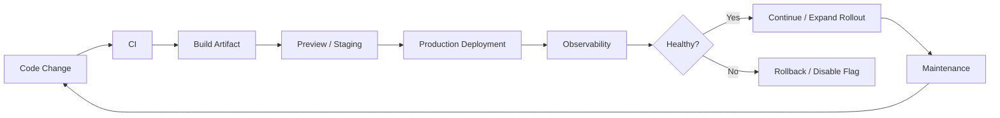

The central principle of this chapter is:

> **A mature front-end system is designed not only to be built and tested, but also to be released, observed, recovered, and maintained repeatedly.**

---

# 1. Delivery Is Part of Architecture

A front-end architecture is incomplete if it explains:

```text
components
state
routing
data
```

but not:

```text
how this version reaches users
```

Deployment affects:

- configuration;
- caching;
- asset URLs;
- server rendering;
- feature availability;
- rollback;
- security;
- observability.

A production system is therefore:

```text
source architecture
+
delivery architecture
+
operational architecture
```

---

# 2. Continuous Integration

**Continuous Integration**, or CI, is the automated validation of repository changes in a clean/shared environment.

A typical pipeline may run:

```text
install
lint
type check
unit tests
component/integration tests
production build
selected E2E tests
```

Conceptually:

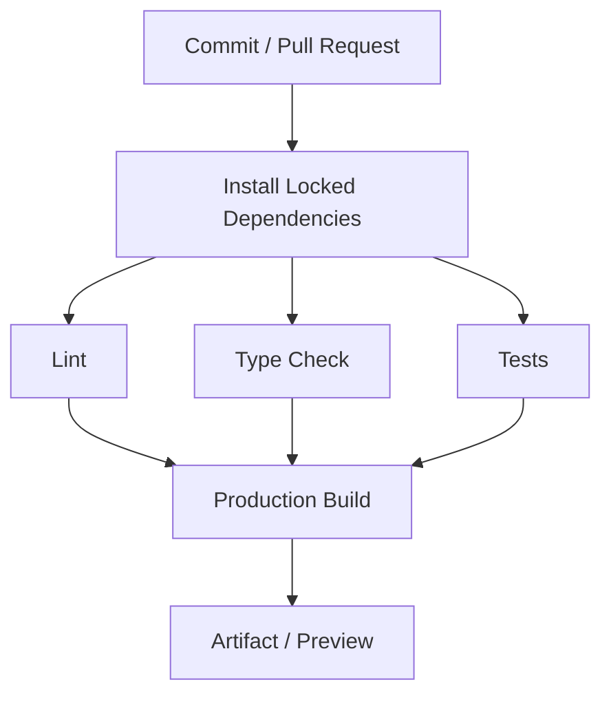

CI gives the team one important guarantee:

> The repository can be validated independently of one developer's laptop.

---

# 3. CI Is More Than “Run Tests on GitHub”

GitHub Actions is one possible CI platform.

Others exist.

The durable concept is a workflow engine that:

- starts from an event;
- runs reproducible jobs;
- reports success/failure;
- preserves useful artifacts.

Do not tie the mental model to one YAML syntax.

---

# 4. CI Events

A pipeline may run on:

```text
pull request
push to main
tag
manual trigger
scheduled trigger
```

Different events serve different purposes.

Example:

```text
pull request
→ validate change

main branch
→ build release candidate

tag
→ create release

nightly
→ broad browser/dependency checks
```

Do not run every expensive task on every keystroke.

---

# 5. Fast Feedback Still Matters

A CI pipeline that requires:

```text
90 minutes
```

before a developer learns about a trivial type error is unhealthy.

Put fast deterministic failures early.

Example:

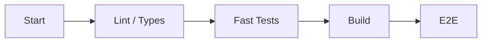

Failing early saves compute and human time.

---

# 6. Parallel CI

Independent checks can run in parallel.

For example:

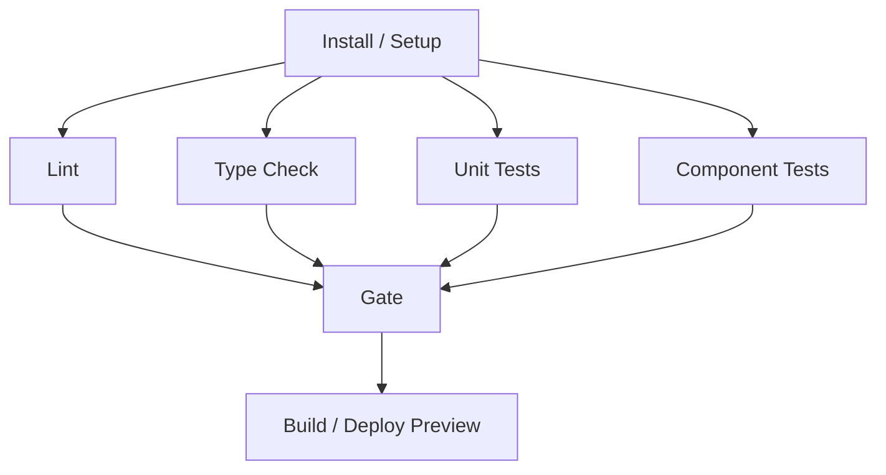

Parallelization reduces elapsed time.

It may increase total compute consumption.

Optimize for useful feedback, not only theoretical parallelism.

---

# 7. CI Caching

CI can cache:

- package-manager downloads;
- build-task outputs;
- framework caches;
- monorepo task results.

Do not confuse:

```text
dependency cache
```

with:

```text
deployable build artifact
```

A cache is disposable optimization.

An artifact is an output intended for inspection or deployment.

---

# 8. Reproducibility

A healthy CI build should depend on known inputs:

- repository commit;
- lockfile;
- runtime/tool versions;
- explicit configuration;
- environment variables.

If the same commit builds differently without an intentional input change, debugging becomes harder.

Reproducibility improves:

- rollback;
- auditing;
- incident response.

---

# 9. Continuous Delivery

**Continuous Delivery** means software is kept in a state where it can be released safely and repeatedly.

It does not necessarily mean:

```text
every commit automatically reaches production
```

That stronger model is often called **Continuous Deployment**.

Useful distinction:

### Continuous Integration

```text
Can this change merge safely?
```

### Continuous Delivery

```text
Is the software ready to release?
```

### Continuous Deployment

```text
Does an accepted change automatically reach users?
```

Organizations may choose different release control.

---

# 10. Build Artifact

A production build should create an identifiable output.

Examples:

```text
static dist/
server application bundle
container image
deployment package
```

The artifact should correspond to a known source revision.

Useful metadata includes:

```text
commit SHA
release version
build time
```

This allows production telemetry to answer:

> Which code produced this error?

---

# 11. Immutable Artifacts

A strong pattern is:

```text
build once
↓
deploy same artifact
```

rather than:

```text
build separately in staging
build again differently in production
```

If staging tested one artifact and production built another, the team did not deploy exactly what it tested.

Immutable artifact promotion reduces that uncertainty.

---

# 12. Static Front-End Artifact

For a Vite-style static SPA, artifact might be:

```text
dist/
├── index.html
├── assets/
│   ├── app-82F.js
│   └── styles-19A.css
```

Deployment copies that output to:

- object storage;
- CDN origin;
- static hosting.

This is operationally simple.

SSR and hybrid frameworks add runtime infrastructure.

---

# 13. Server-Rendered Artifact

A server-rendered framework may require:

```text
server bundle
static assets
runtime configuration
```

Deployment must coordinate all three.

If:

```text
server version N
```

serves:

```text
client assets version N-1
```

the application may fail.

Deployment architecture must preserve compatibility.

---

# 14. Environments

Common environments include:

```text
development
preview
staging
production
```

These names are conventions.

The important question is:

> What purpose does each environment serve?

Do not maintain environments merely because another company does.

---

# 15. Development Environment

Development optimizes:

- debugging;
- HMR;
- local services;
- fast feedback.

It should not be mistaken for production behavior.

Chapter 12 already established this.

---

# 16. Preview Environment

A **preview environment** is associated with a branch or pull request.

It allows reviewers to open the actual application version.

Flow:

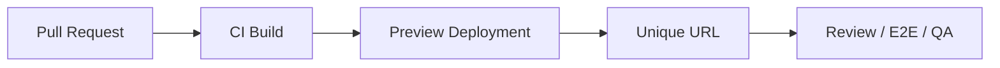

This is valuable for:

- visual review;
- product review;
- accessibility checks;
- integration testing.

---

# 17. Preview Environments Improve Communication

A designer can inspect:

```text
the actual branch
```

rather than screenshots.

A product owner can test:

```text
the real interaction
```

before merge.

A reviewer can inspect:

- responsive behavior;
- keyboard flow;
- network requests.

Preview deployments connect code review to product behavior.

---

# 18. Preview Environment Data

Preview environments need a data strategy.

Options include:

- mock APIs;
- dedicated test database;
- shared staging API;
- isolated ephemeral backend.

Each has trade-offs.

A preview using production customer data creates security and privacy concerns.

---

# 19. Staging

A staging environment aims to approximate production.

Possible uses:

- final integration;
- release validation;
- performance checks;
- external-system testing;
- training.

But staging is never perfectly identical to production.

Differences may include:

- traffic;
- data size;
- CDN state;
- third parties;
- user behavior.

Passing staging is useful evidence.

It is not proof production will be healthy.

---

# 20. Production

Production is where real users depend on the application.

Production architecture should provide:

- observability;
- rollback;
- controlled credentials;
- deployment history;
- safe configuration.

Production should not be:

```text
the place where we discover what version is running
```

Version identity must be explicit.

---

# 21. Deployment Protection

A delivery system may protect production through rules such as:

- approved branch;
- required CI;
- manual approval;
- release window;
- security checks;
- observability health gate.

The point is not bureaucracy.

The point is preventing unsafe state transitions.

---

# 22. Environment Secrets

Production credentials should be scoped to the deployment environment.

A pull-request build should not automatically receive production secrets.

A useful trust model:

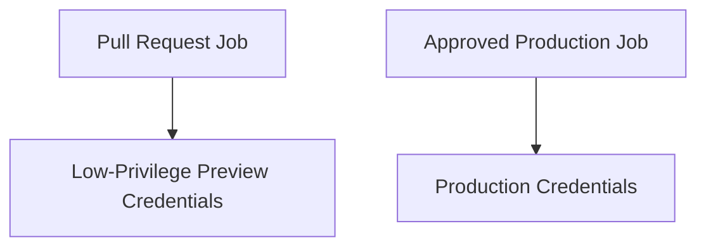

Credential access should match deployment authority.

---

# 23. Principle of Least Privilege

A deployment job should have only the permissions it needs.

For a static site deployment, it may need:

```text
upload site artifact
invalidate selected CDN paths
```

It may not need:

```text
database administrator
organization owner
```

CI systems are powerful security boundaries.

---

# 24. Deployment Concurrency

Suppose:

```text
version A begins deploying
version B begins 20 seconds later
```

If both modify the same production environment, results can be unpredictable.

Deployment systems often serialize deployments per environment.

Conceptually:

```text
production deployment queue
```

rather than:

```text
several versions racing
```

---

# 25. Deployment History

Keep a record of:

```text
what
when
who/what triggered
which commit
which environment
result
```

During an incident, the first question is often:

> What changed recently?

Deployment history answers quickly.

---

# 26. Release Version

Every deployed frontend should expose an internal version identifier.

Possible forms:

```text
2026.09.23.3
Git SHA
release ID
```

It can be included in:

- error reports;
- telemetry;
- support diagnostics.

Do not rely on humans to infer version from asset filenames.

---

# 27. Release Correlation

Suppose error rate rises at:

```text
10:15
```

Release `abc123` deployed at:

```text
10:12
```

That correlation is immediately useful.

Architecture:

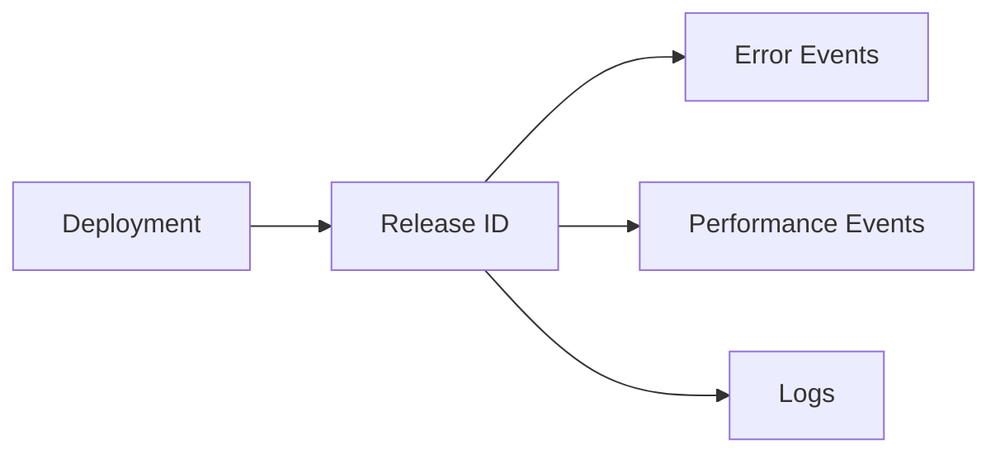

Observability should know deployment versions.

---

# 28. Deployment Strategies

A simple deployment replaces old version with new version.

More advanced strategies control how quickly users move to the new version.

Common concepts include:

- rolling deployment;
- blue-green deployment;
- canary release;
- feature flags.

These strategies solve different problems.

---

# 29. Rolling Deployment

A rolling deployment gradually replaces old application instances with new ones.

For static/CDN frontends, the analogy may involve:

- asset/version rollout;
- edge propagation;
- server instance replacement.

During transition:

```text
old
+
new
```

may coexist.

Compatibility matters.

---

# 30. Backward Compatibility During Deployment

Suppose frontend N expects:

```text
API field newStatus
```

but some API instances still run N-1.

The deployment can break.

Distributed systems should tolerate temporary version overlap.

Possible techniques:

- additive API changes;
- staged deployment;
- versioned endpoints;
- compatibility windows.

Frontend/backend release coordination is part of delivery architecture.

---

# 31. Blue-Green Deployment

Blue-green maintains two production-like environments.

Example:

```text
Blue
→ current production

Green
→ new release
```

After verification, traffic switches.

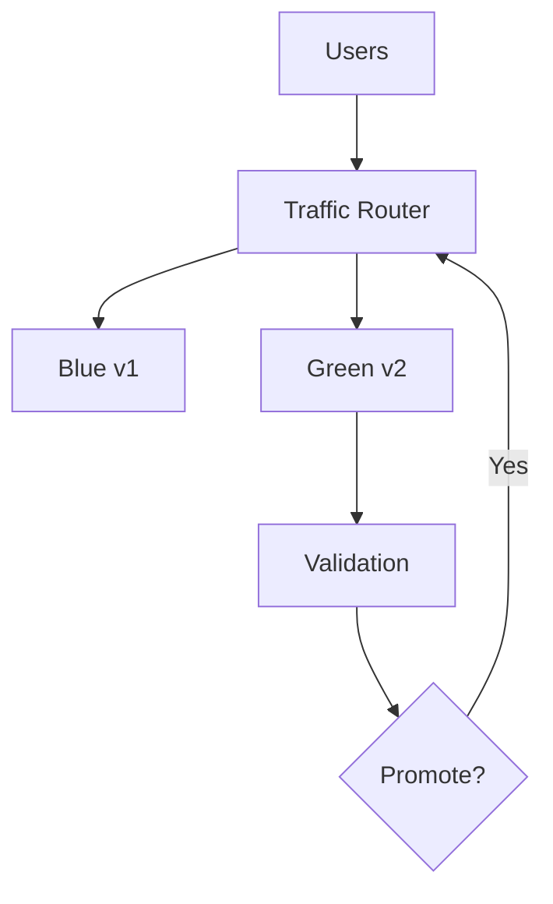

Rollback can switch traffic back.

---

# 32. Blue-Green Trade-Off

Benefits:

- clean rollback;
- full new environment available before traffic switch.

Costs:

- duplicated infrastructure;
- database compatibility;
- cache/session considerations.

A static frontend can implement similar concepts with versioned deployments and traffic aliases.

---

# 33. Canary Release

A canary release exposes a new version to a small population first.

Example:

```text
5%
↓
25%
↓
50%
↓
100%
```

At each stage observe:

- errors;
- performance;
- business health.

Architecture:

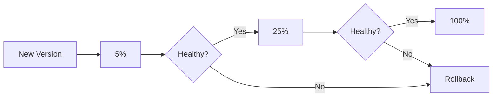

This reduces blast radius.

---

# 34. Release Strategy vs Feature Strategy

A canary deployment controls:

```text
which users receive new application version
```

A feature flag controls:

```text
which behavior is active
```

These can be combined.

Do not confuse them.

---

# 35. Feature Flags

A feature flag allows behavior to change at runtime without deploying new source code.

Simple form:

```ts
if (
  flags.newCheckout
) {
  renderNewCheckout();
} else {
  renderOldCheckout();
}
```

This decouples:

```text
deployment
```

from:

```text
feature release
```

That is a powerful operational capability.

---

# 36. Feature Flags Are Not Just Boolean Constants

A real flag system may evaluate based on:

- environment;
- user group;
- organization;
- geography;
- percentage;
- application version.

Conceptually:

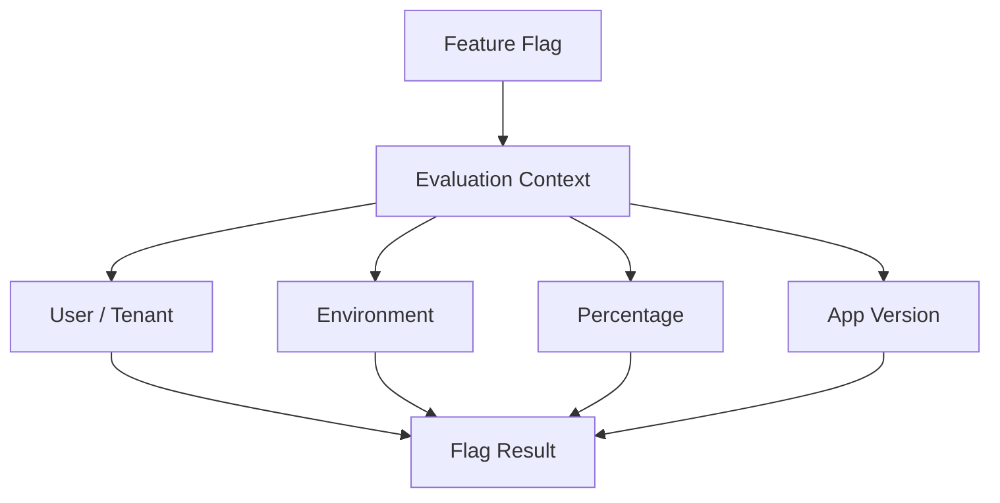

This requires governance.

---

# 37. Vendor-Neutral Flag APIs

Feature flagging has increasingly developed vendor-neutral interfaces.

OpenFeature is one example: it defines a standard API that can sit above different flag providers.

The durable architectural idea is:

> Business code should depend on a stable flag-evaluation abstraction rather than spreading vendor-specific SDK calls everywhere.

This reduces tool lock-in.

---

# 38. Flag Evaluation Location

Flags can be evaluated:

```text
server-side
client-side
edge-side
```

Client evaluation has an important security rule:

> Any flag configuration delivered to the browser should be considered visible to the user.

Do not put secret launch information or authorization logic solely in browser flags.

---

# 39. Feature Flags Are Not Authorization

Dangerous:

```ts
if (
  flags.canAccessAdmin
) {
  showAdmin();
}
```

and assume access is secure.

A user can manipulate browser code or call the API.

Authorization must remain server-enforced.

A feature flag controls product behavior.

It is not a permission boundary.

---

# 40. Release Flags

A release flag hides incomplete functionality.

Example:

```text
new search UI
```

can be deployed:

```text
flag off
```

Then enabled later.

This reduces the need for long-lived branches.

---

# 41. Operational Flags

An operational flag can disable expensive or unstable behavior.

Example:

```text
live recommendations
```

causes API overload.

Operations can disable it without a new deployment.

This can become a valuable incident-response tool.

---

# 42. Experiment Flags

An experiment may expose:

```text
variant A
variant B
```

to different user groups.

This requires statistical and product discipline.

A/B experimentation is Awareness depth in this book.

Do not treat ordinary feature flags as an automatic experimentation platform.

---

# 43. Permission Flags

Some products use flags for subscription entitlements or licensing.

Be careful with terminology.

If access has security or financial consequences, the authoritative entitlement must be enforced server-side.

The frontend flag can adapt UX.

---

# 44. Flag Lifecycle

A flag should have:

```text
owner
purpose
creation date
expected removal
```

A useful lifecycle:

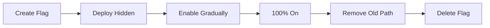

Flags should not become permanent accidental architecture.

---

# 45. Flag Debt

Imagine code:

```ts
if (
  newCheckout
) {
  if (
    newPayments
  ) {
    ...
  } else {
    ...
  }
} else {
  ...
}
```

Several old flags create combinatorial complexity.

The application now has many possible behavior states.

Remove completed release flags quickly.

Feature flags are temporary complexity.

---

# 46. Kill Switch

A **kill switch** is an operational control designed to disable a problematic feature quickly.

Example:

```text
disable WebSocket live updates
↓
fall back to polling
```

or:

```text
disable recommendation widget
```

Critical kill switches should be:

- tested;
- documented;
- accessible to authorized operators.

An untested emergency switch may fail during the emergency.

---

# 47. Rollback

Rollback returns production to a known safer version.

Possible forms:

- redeploy previous artifact;
- switch deployment alias;
- revert traffic;
- disable feature flag.

Fast rollback is one of the strongest production safety mechanisms.

---

# 48. Rollback Must Be Practiced

A rollback process documented but never tested may contain hidden failures.

Teams should know:

```text
where previous artifact exists
how traffic switches
which database/API changes are compatible
who can initiate rollback
```

Recovery is an engineering capability.

---

# 49. Database/API Compatibility and Rollback

Frontend rollback can fail if backend contracts changed irreversibly.

Example:

```text
frontend v2 deployed
backend removes field required by v1
```

Now rollback to v1 does not work.

Release architecture should use compatibility windows.

Backward-compatible API evolution makes rollback safer.

---

# 50. Forward Fix vs Rollback

When production breaks, teams may choose:

### Rollback

Return to previous known version.

### Forward fix

Deploy a new correction.

Rollback is often safer when:

- impact is high;
- previous version is known healthy;
- fix uncertainty is high.

Forward fix may be better when:

- rollback impossible;
- data migration already occurred;
- issue is small and understood.

Incident response should prioritize user recovery over developer pride.

---

# 51. Observability

**Observability** is the ability to understand system behavior from the information it emits.

For frontends, important signals include:

- errors;
- performance;
- network failures;
- release version;
- user journey events;
- browser/environment context.

Observability answers:

> What is happening in production?

and:

> Why might it be happening?

---

# 52. Monitoring vs Observability

Monitoring often focuses on known questions:

```text
error rate > threshold?
LCP poor?
API unavailable?
```

Observability supports investigation of unexpected questions.

In practice, the terms overlap.

The useful goal is:

> Production behavior should be visible enough to diagnose real user problems.

---

# 53. Three Traditional Telemetry Signals

Observability discussions often group telemetry into:

```text
logs
metrics
traces
```

Conceptually:

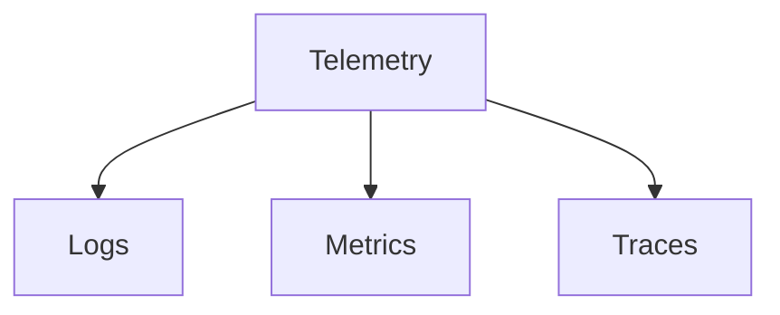

Front-end systems also commonly include:

- error events;
- RUM;
- user journey analytics.

These categories overlap.

---

# 54. Logs

A log is a structured record of an event.

Example:

```json
{
  "level":
    "error",
  "event":
    "product-save-failed",
  "release":
    "abc123",
  "route":
    "/products/P-42"
}
```

Structured logs are easier to query than:

```text
Something broke!!!!
```

Do not log sensitive values unnecessarily.

---

# 55. Browser Console Is Not Production Observability

A `console.error()` may help local debugging.

It does not create a reliable production incident system.

Users do not send developers their console automatically.

Production errors should be reported through intentional telemetry.

---

# 56. Metrics

Metrics aggregate numeric behavior over time.

Examples:

```text
error rate
LCP p75
INP p75
API failure percentage
checkout completion
```

Metrics are efficient for:

- trends;
- thresholds;
- dashboards.

They lose per-event detail.

---

# 57. High Cardinality

Suppose a metric label contains:

```text
userId
```

with millions of values.

This creates high cardinality.

Observability systems can become expensive or difficult to query.

Use dimensions intentionally.

Good common labels:

```text
route
release
browser family
device class
```

depending on the system.

---

# 58. Traces

A distributed trace connects related operations across system boundaries.

Example:

```text
browser navigation
↓
API request
↓
backend service
↓
database query
```

Conceptually:

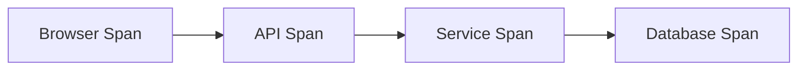

This can expose where end-to-end latency occurs.

---

# 59. Spans

A trace contains spans representing operations.

Possible fields include:

```text
start time
duration
operation name
status
attributes
parent relationship
```

The value comes from preserving causal relationships.

---

# 60. Front-End Tracing Has Special Challenges

Browser tracing must consider:

- privacy;
- sampling;
- page lifecycle;
- cross-origin propagation;
- JavaScript SDK overhead;
- third-party requests.

The ecosystem is still evolving.

Open standards such as OpenTelemetry are important, but browser instrumentation maturity differs from server instrumentation.

Architect around concepts rather than assuming one universal browser telemetry implementation.

---

# 61. OpenTelemetry

OpenTelemetry provides vendor-neutral APIs, SDKs, and semantic conventions for telemetry such as:

- traces;
- metrics;
- logs.

It can reduce observability vendor lock-in.

For frontend engineers, the durable idea is:

```text
instrument once through a standard abstraction
→ export to chosen backend
```

But browser support and instrumentation should be evaluated against current project maturity and overhead.

---

# 62. Real User Monitoring Revisited

Chapter 15 introduced RUM for performance.

RUM can also include operational context:

```text
release
route
browser
device
network result
error
```

Example event:

```json
{
  "metric":
    "INP",
  "value":
    184,
  "route":
    "/checkout",
  "release":
    "abc123"
}
```

Avoid collecting unnecessary personal data.

---

# 63. Error Monitoring

A frontend error-monitoring system may capture:

- uncaught exceptions;
- unhandled Promise rejections;
- framework errors;
- network failures;
- source-mapped stack traces;
- breadcrumbs;
- release version.

The goal is not to collect every console message.

The goal is actionable diagnostics.

---

# 64. Global Error Handlers

Browsers expose hooks for errors and rejected Promises.

Frameworks may also expose error boundaries or error hooks.

A monitoring SDK can integrate these sources.

But global capture should not replace local recovery.

The user still needs:

```text
fallback
retry
preserved work
```

where appropriate.

---

# 65. Source Maps in Production Monitoring

Chapter 12 introduced source maps.

A production error may occur in:

```text
app-82F.js:1:91821
```

A monitoring backend can use a private source map to translate it to:

```text
src/features/cart/CartPanel.tsx:148
```

This makes errors actionable.

---

# 66. Upload Source Maps Privately

A deployment pipeline can upload source maps to the monitoring system without necessarily serving them publicly.

Flow:

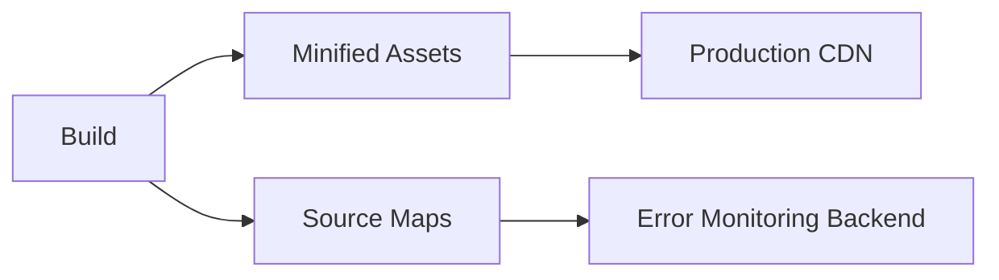

The monitoring system matches:

```text
release ID
+
generated file
```

to the correct source.

---

# 67. Error Grouping

If 20,000 users hit the same defect, the team needs:

```text
one issue with 20,000 occurrences
```

rather than:

```text
20,000 unrelated alerts
```

Error monitoring systems group similar events.

Grouping is imperfect.

Release/version metadata helps investigation.

---

# 68. Error Rate

A release can increase:

```text
frontend error rate
```

without causing total outage.

Example:

```text
0.2%
→
4.8%
```

after deployment.

A deployment health system should detect meaningful changes.

Raw error count is less useful without traffic context.

---

# 69. Network Error Monitoring

Frontends depend heavily on APIs.

Useful operational categories include:

```text
timeout
offline
5xx
429
authentication failure
validation failure
```

Do not combine all into:

```text
request failed
```

Different failures require different responses.

---

# 70. Client vs Server Error

If API returns:

```text
400
```

because user input is invalid, that is not necessarily an operational incident.

If API returns:

```text
500
```

for normal requests, that may be.

Telemetry should preserve domain meaning.

Otherwise alert systems become noisy.

---

# 71. User Context Without Oversharing

Sometimes support needs to know:

```text
which account/tenant was affected?
```

But telemetry should minimize personal data.

Possible approaches:

- internal opaque identifier;
- tenant ID;
- hashed identifier where appropriate.

Do not send:

```text
password
token
medical details
full form content
```

into generic monitoring systems.

Privacy is part of observability design.

---

# 72. Breadcrumbs

A breadcrumb is a small contextual event before an error.

Example:

```text
route changed to /checkout
user selected shipping method
API /cart succeeded
user clicked Pay
error occurred
```

This can make reproduction easier.

Breadcrumbs should describe technical/user events without becoming invasive surveillance.

---

# 73. Session Replay

Session replay can reconstruct aspects of user interaction.

Possible benefits:

- understand difficult UI bugs;
- reproduce visual context.

Risks:

- privacy;
- sensitive fields;
- data retention;
- cost.

This is Awareness depth.

Do not deploy replay by default.

If used, it requires:

- masking;
- access control;
- retention policy;
- legal/privacy review.

---

# 74. Observability Sampling

A high-traffic application may not send every telemetry event.

Sampling can reduce:

- network cost;
- storage;
- analysis cost.

But rare errors may be lost.

Possible strategy:

```text
100% errors
10% traces
1% normal performance events
```

The actual values depend on product scale and budget.

---

# 75. Head-Based vs Tail-Based Sampling

At awareness level:

### Head-based

Decide early whether to keep telemetry.

Simple and low cost.

### Tail-based

Decide after more of the trace is known.

Can preserve interesting slow/error traces.

More infrastructure complexity.

This is more relevant to distributed tracing than ordinary frontend error monitoring.

---

# 76. Telemetry Has Performance Cost

An observability SDK adds:

- JavaScript;
- network requests;
- CPU;
- memory.

This creates a paradox:

> The system measuring performance can degrade performance.

Measure observability overhead.

Do not instrument every DOM event.

---

# 77. Telemetry Buffering

Instead of sending one network request per event, clients may batch telemetry.

This reduces overhead.

But:

```text
page closes
```

before flush can lose data.

Browser APIs such as `sendBeacon()` can help selected end-of-session reporting.

Use appropriate mechanisms for small telemetry payloads.

---

# 78. `sendBeacon`

Conceptually:

```js
navigator.sendBeacon(
  "/telemetry",
  payload
);
```

can send a small asynchronous payload without requiring the page to remain open in the same way as ordinary work.

Use it for suitable telemetry.

It is not a general replacement for `fetch`.

---

# 79. Observability Naming

Use stable semantic event names.

Good:

```text
checkout.payment.failed
catalogue.search.completed
auth.session.expired
```

Weak:

```text
event1
button-click-42
misc-error
```

Naming determines whether telemetry remains understandable six months later.

---

# 80. Operational Dashboard

A frontend operational dashboard may include:

```text
deployments
error rate
LCP/INP/CLS
API failures
critical journey success
active feature rollout
```

The dashboard should answer:

> Is the application healthy?

not display every possible metric.

---

# 81. Alerting

An alert should indicate:

> Human attention may be required.

If every minor event triggers an alert, people ignore alerts.

Good alert candidates include:

- severe error-rate increase;
- checkout failure spike;
- availability drop;
- large performance regression.

Use dashboards for informational trends.

Use alerts for action.

---

# 82. Alert Fatigue

Suppose the team receives:

```text
80 alerts per day
```

and almost none require action.

The alert system has failed.

Tune:

- thresholds;
- grouping;
- duration;
- severity;
- ownership.

An alert should have an owner and response expectation.

---

# 83. Static Thresholds vs Anomaly Detection

Static:

```text
error rate > 5%
```

Anomaly:

```text
error rate is 4× normal baseline
```

Both can be useful.

Anomaly systems can detect unexpected patterns.

They can also create confusing false positives.

Start with understandable alerts for critical behavior.

---

# 84. Service-Level Indicators

A **Service-Level Indicator**, or SLI, is a measured aspect of service behavior.

Examples:

```text
successful checkout rate
page availability
p75 interaction latency
```

SLIs should represent user-visible service health.

---

# 85. Service-Level Objectives

A **Service-Level Objective**, or SLO, defines a target for an SLI.

Example:

```text
99.9% of checkout requests complete without system error
```

or:

```text
95% of important route transitions finish under target
```

SLOs help teams reason about reliability.

This is Working Knowledge rather than deep SRE theory.

---

# 86. Error Budget

If SLO allows:

```text
0.1% failure
```

that tolerance is sometimes described as an **error budget**.

Teams can use it to balance:

```text
release speed
vs
reliability work
```

If reliability is far below target, more engineering effort should shift toward stability.

---

# 87. Front-End SLOs Need Care

A frontend cannot control:

- user's entire network;
- browser extensions;
- device CPU.

Therefore service objectives should define:

- population;
- measurement method;
- routes;
- conditions.

Do not create impossible promises from uncontrolled environments.

---

# 88. Health Check

For server-rendered/front-end backend systems, health endpoints may expose:

```text
process alive
dependencies available
```

A static frontend has no process health in the same sense.

Its health depends on:

- asset availability;
- CDN;
- API availability.

Health architecture must match deployment topology.

---

# 89. Synthetic Production Monitoring

A scheduled synthetic browser can periodically:

```text
open site
sign in with test account
perform critical flow
```

This can detect:

- deployment failure;
- DNS issue;
- authentication problem;
- third-party outage.

It complements RUM.

RUM requires real users to encounter the issue first.

---

# 90. Synthetic Monitoring Trade-Off

Benefits:

- predictable path;
- works even at low traffic;
- good availability signal.

Limits:

- synthetic geography/device;
- synthetic data;
- not representative of every user.

Combine synthetic monitoring with real-user signals.

---

# 91. Deployment Verification

After production deployment, run checks such as:

```text
HTML reachable
expected version present
critical asset reachable
API connection works
critical smoke journey works
```

This catches:

```text
deployment succeeded
```

but:

```text
product is unusable
```

situations.

---

# 92. Automatic Rollback

Some delivery systems can roll back when health checks cross a threshold.

Concept:

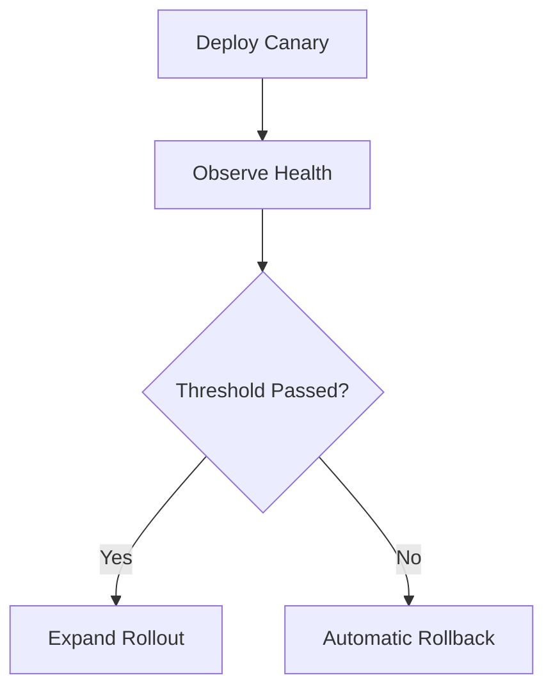

This can reduce incident duration.

It requires high-confidence telemetry.

Bad metrics can cause unnecessary rollback.

---

# 93. Progressive Delivery

**Progressive delivery** combines:

- controlled rollout;
- observability;
- automated decisions;
- feature management.

Examples:

```text
canary
feature flag rollout
region-by-region release
tenant-by-tenant release
```

This is broader than simply deploying an artifact.

---

# 94. Release Cohorts

A gradual feature can start with:

```text
internal staff
↓
beta customers
↓
5%
↓
25%
↓
100%
```

This lets product and engineering inspect behavior before full exposure.

Cohorts should be stable enough that users do not switch unpredictably between experiences.

---

# 95. Percentage Rollout Consistency

If a user is selected for:

```text
10% rollout
```

they should usually remain consistently in that cohort.

Randomizing independently on each page load can produce:

```text
new UI
old UI
new UI
```

which is confusing.

Flag systems often use stable hashing against an identifier.

---

# 96. Experimentation

A/B experiments compare behavior variants statistically.

They require:

- hypothesis;
- population;
- metrics;
- randomization;
- sample-size reasoning;
- analysis.

This is not simply:

```text
turn feature on for 50%
```

Experiment design belongs to product/data science as much as frontend engineering.

---

# 97. Guardrail Metrics

An experiment may improve:

```text
conversion
```

while harming:

```text
error rate
performance
accessibility
support volume
```

Guardrails prevent optimizing one business metric at unacceptable technical/user cost.

---

# 98. Kill Experiment Quickly When Harmful

If a rollout creates:

- severe errors;
- harmful user behavior;
- major performance regression;

the system should allow rapid shutdown.

Feature delivery and observability must connect.

---

# 99. Maintenance Is Architecture

Production systems age.

Dependencies update.

Browsers remove old behavior.

APIs evolve.

Design systems change.

Security vulnerabilities appear.

A system that cannot be maintained safely is not well architected.

---

# 100. Dependency Maintenance

Dependencies should be reviewed regularly.

Possible categories:

```text
security update
bug fix
minor capability
major upgrade
deprecated package
abandoned package
```

Do not treat all updates identically.

---

# 101. Update Continuously, Not Once Every Three Years

Ignoring dependencies can create an upgrade cliff.

Example:

```text
Framework v4
→ years pass
→ current v9
```

Now migration requires:

- multiple breaking changes;
- ecosystem replacements;
- build updates.

Smaller regular upgrades are often easier.

---

# 102. Dependency Update Automation

Automated tools can create pull requests when packages update.

Benefits:

- visibility;
- smaller changes;
- security response.

Risks:

- PR noise;
- blind merging;
- broken transitive behavior.

Automation should reduce detection effort.

It should not remove engineering judgment.

---

# 103. Grouping Updates

Possible grouping:

```text
patch updates weekly
tooling updates together
framework ecosystem together
major upgrades individually
```

This can reduce PR volume.

Do not group unrelated high-risk changes so broadly that failures are impossible to diagnose.

---

# 104. Security Advisories

A security update may require faster action than ordinary dependency maintenance.

A mature process defines:

```text
severity
owner
response time
testing path
emergency release
```

Chapter 13 discussed supply-chain security.

Maintenance operationalizes it.

---

# 105. Vulnerability Scanner Output Needs Triage

A scanner may report:

```text
critical vulnerability
```

in a package used only:

```text
during local documentation build
```

Another medium issue may affect:

```text
runtime authentication
```

Severity score alone is not enough.

Assess:

- exploitability;
- runtime reachability;
- environment;
- exposure.

---

# 106. Transitive Dependencies

Your project may not directly install a vulnerable package.

It may arrive through:

```text
A
→ B
→ C
```

Lockfiles make the resolved graph visible.

Use package-manager tools to understand:

```text
why is this dependency installed?
```

---

# 107. Removing Dependencies

Maintenance should also ask:

> Can this package disappear?

Unused dependencies create:

- security surface;
- install time;
- upgrade work;
- bundle risk.

Deletion is one of the best maintenance strategies.

---

# 108. Browser Support Maintenance

A browser support policy should be reviewed periodically.

Perhaps the product once supported:

```text
very old browser X
```

but usage is now:

```text
0.02%
```

Dropping it may allow:

- less transpilation;
- fewer polyfills;
- simpler CSS.

This is a product decision informed by real user data.

---

# 109. Do Not Drop Support from Global Statistics Alone

Your user population may differ from global browser usage.

An enterprise customer may require:

```text
specific managed browser
```

Use:

- RUM;
- contracts;
- customer requirements.

Support policy is contextual.

---

# 110. Deprecating Browser Support

A responsible process may include:

```text
measure usage
communicate change
test target removal
update build targets
remove polyfills
```

Do not silently break users without business approval.

---

# 111. API Maintenance

Frontend and backend contracts evolve.

Safe changes often follow:

```text
add new field
frontend starts using it
old field remains temporarily
old frontend population declines
remove old field later
```

This supports:

- cached clients;
- rolling deployments;
- rollback.

---

# 112. Backward-Compatible Change

Examples often safer:

```text
add optional field
add endpoint
accept old and new request form
```

Potentially breaking:

```text
rename field
change meaning
remove enum value assumption
change error shape
```

Version transitions need coordination.

---

# 113. Schema Monitoring

Runtime validation can detect unexpected backend responses.

If validation errors increase in production, this may indicate:

- API drift;
- partial deployment;
- bad data.

Telemetry should make boundary failures visible.

Chapter 5's parsers become production observability points.

---

# 114. Data Migration and Frontend Compatibility

A frontend may persist:

```text
IndexedDB
localStorage
```

across releases.

Version N+1 must handle data written by N.

This is a migration problem.

Do not test only:

```text
fresh install
```

Also test upgrade paths.

---

# 115. Local Storage Migration

Suppose old settings:

```json
{
  "theme":
    "dark"
}
```

New settings require:

```json
{
  "version":
    2,
  "theme":
    "dark",
  "density":
    "comfortable"
}
```

On load:

```text
read unknown
↓
detect version
↓
migrate
↓
validate
↓
use
```

Persistent browser data deserves schema evolution.

---

# 116. Service Worker Maintenance

Service Workers can keep old code alive.

A deployment can succeed while some clients remain controlled by previous Service Worker state.

Maintenance concerns include:

- cache versioning;
- update lifecycle;
- stale clients;
- old shell/new API compatibility.

Chapter 10's offline system becomes a delivery concern.

---

# 117. Stale Client Problem

A user may keep a tab open for days.

Production deploys versions:

```text
v10
v11
v12
```

The user is still running:

```text
v10 JavaScript
```

API changes must account for this.

Do not assume all users refresh immediately after deployment.

---

# 118. Update Notification

Some applications detect a new version and show:

```text
A new version is available.
Refresh to update.
```

This can be useful when:

- stale runtime causes incompatibility;
- critical fixes exist.

Avoid forcing refresh in the middle of unsaved work.

---

# 119. Long-Lived Session Compatibility

Dashboards, editors, and hospital systems may run all day.

A backend deploy should not suddenly make active clients unusable.

Compatibility windows are especially important for long-lived sessions.

---

# 120. Technical Debt

Technical debt is not simply:

```text
ugly code
```

It is a future cost created by a current decision.

Examples:

- temporary feature flag;
- duplicated component;
- old framework version;
- missing test coverage;
- manual release process.

Debt can be rational.

The mistake is leaving it invisible.

---

# 121. Debt Register

A team can maintain high-impact debt items with:

```text
problem
risk
owner
planned action
```

Do not create a giant catalog of every imperfect line of code.

Track debt that affects:

- reliability;
- delivery speed;
- security;
- performance.

---

# 122. Maintenance Budget

A roadmap that allocates:

```text
100% new features
```

forever is unrealistic.

Systems require time for:

- upgrades;
- dependency cleanup;
- observability;
- test maintenance;
- browser changes.

Maintenance capacity is part of product planning.

---

# 123. End-of-Life Policy

Libraries and internal platforms eventually need retirement.

A deprecation plan may include:

```text
announce
stop new adoption
provide migration path
set support date
remove
```

This applies to:

- design-system APIs;
- internal packages;
- old frontend apps;
- deployment systems.

---

# 124. Ownership

Every critical production capability needs ownership.

Examples:

```text
design system
CI templates
authentication SDK
RUM pipeline
production frontend
```

Ownership answers:

> Who maintains this when the original author leaves?

---

# 125. Runbooks

A **runbook** documents operational response.

Example:

```text
Frontend error rate suddenly increases after deployment

1. confirm release
2. inspect top errors
3. compare previous release
4. disable rollout or rollback
5. verify recovery
```

Runbooks reduce decision time during incidents.

---

# 126. Incident Response

A frontend incident may include:

- broken login;
- blank page;
- failed checkout;
- unusable mobile interaction;
- asset/CDN outage;
- severe performance regression.

Response should prioritize:

```text
reduce user impact
```

before:

```text
perfect root-cause analysis
```

---

# 127. Incident Lifecycle

A simplified flow:

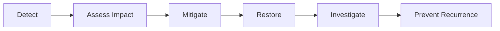

Mitigation may be:

- rollback;
- kill switch;
- disable integration;
- fallback mode.

---

# 128. Blameless Learning

An incident review should ask:

```text
Why did the system allow this failure?
Why was it not detected earlier?
Why was recovery slow?
```

rather than:

```text
Who made the mistake?
```

People operate inside systems.

Improve the system.

---

# 129. Post-Incident Actions

Useful actions might include:

- test;
- alert;
- rollback automation;
- feature flag;
- compatibility rule;
- documentation.

Avoid vague:

```text
be more careful
```

That is not an engineering control.

---

# 130. Maintenance Metrics

Possible signals:

- dependency age;
- flaky test count;
- deployment frequency;
- rollback frequency;
- mean recovery time;
- error budget;
- build duration;
- bundle growth.

Metrics should guide decisions.

Do not create an executive scoreboard with no engineering purpose.

---

# 131. Deployment Frequency Is Not Automatically a Quality Score

A team deploying:

```text
20 times/day
```

is not automatically better than one deploying weekly.

Release cadence should fit:

- risk;
- product;
- regulation;
- architecture.

The important capability is:

> Can the team release safely when needed?

---

# 132. Mean Time to Recovery

A useful operational question is:

```text
When a serious release problem occurs,
how quickly can we restore acceptable service?
```

Fast detection + rollback can matter more than trying to prevent every possible defect.

No system prevents all incidents.

---

# 133. Observability Completes Testing

Testing answers:

```text
What failures can we anticipate?
```

Observability answers:

```text
What failures actually happened?
```

They reinforce each other.

Production incidents should create new tests or guardrails when appropriate.

---

# 134. Production Feedback Loop

A mature system creates:

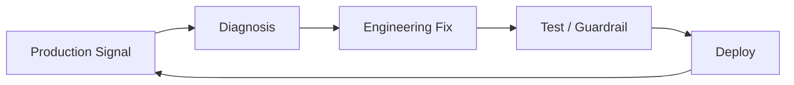

This is continuous engineering.

---

# 135. Privacy and Compliance

Observability can easily collect more information than necessary.

Before collecting an event, ask:

```text
Why do we need it?
How long is it stored?
Who can access it?
Does it contain personal/sensitive data?
```

Telemetry is data processing.

Treat it with governance.

---

# 136. Do Not Record Form Contents by Default

Generic error monitoring should not capture:

```text
passwords
medical notes
payment card data
private messages
```

Mask sensitive fields.

Configure SDKs intentionally.

Default capture settings should be reviewed.

---

# 137. Session Replay Requires Stronger Governance

If replay is used:

- mask text inputs;
- block sensitive screens;
- restrict staff access;
- define retention;
- audit access.

For sensitive domains, the right decision may be:

```text
do not use replay
```

Observability value does not override privacy.

---

# 138. Analytics vs Observability

Analytics asks questions such as:

```text
How many users clicked Upgrade?
```

Observability asks:

```text
Why did checkout fail?
```

The systems can overlap.

Their purposes should be clear.

Do not send technical errors into a marketing analytics tool simply because it is already installed.

---

# 139. Product Metrics vs Operational Metrics

Examples:

### Product

```text
conversion
feature usage
retention
```

### Operational

```text
error rate
latency
availability
```

A release decision may consider both.

But do not confuse:

```text
feature unpopular
```

with:

```text
feature broken
```

---

# 140. Business-Aware Observability

A technical error rate of:

```text
0.1%
```

may be critical if it affects:

```text
payments
```

A 2% failure in:

```text
optional recommendation widget
```

may have smaller impact.

Prioritize telemetry by user/business criticality.

---

# 141. Release Dashboard Example

A release dashboard might show:

```text
Release: 2026.09.23.3

Rollout:
25%

Errors:
0.18% → 0.19%

Checkout success:
99.4% → 99.3%

INP p75:
175 ms → 181 ms

LCP p75:
2.1 s → 2.1 s
```

This provides evidence for continuing rollout.

Do not require every metric to remain numerically identical.

Use meaningful thresholds.

---

# 142. Deployment Health Window

A canary should run long enough to observe meaningful traffic.

Too short:

```text
no failures seen
```

because only 12 users visited.

Too long:

```text
release blocked for unnecessary hours
```

Health windows depend on traffic and risk.

---

# 143. Low-Traffic Products

A small internal application may not receive enough traffic for statistical canary analysis.

Alternative safety mechanisms:

- preview;
- staging;
- smoke tests;
- pilot users;
- manual rollout.

Progressive delivery should fit scale.

---

# 144. Maintenance and Architecture Decisions

Chapter 18 will formalize trade-offs.

Maintenance cost should be considered when choosing:

- framework;
- state library;
- micro-frontends;
- custom build system;
- internal platform.

A solution with clever architecture but no maintainers is high risk.

---

# 145. Boring Technology Has Value

A mature organization may intentionally choose:

```text
well-understood
widely supported
easy to hire for
```

instead of:

```text
newest
most sophisticated
```

This is not anti-innovation.

Maintenance is part of total cost.

---

# 146. Upgrade Path Is a Selection Criterion

When evaluating a dependency, ask:

- Is it actively maintained?
- Are migrations documented?
- Does it use semantic versioning reasonably?
- Is the ecosystem healthy?
- Can we remove it later?

The cost of adoption includes future exit.

---

# 147. Avoid Undocumented Internal Platforms

An internal wrapper may initially save time.

Years later:

```text
original authors gone
no docs
100 apps depend on it
```

Maintenance becomes difficult.

Internal platforms need:

- documentation;
- ownership;
- versioning;
- migration.

Treat them like products.

---

# 148. Operational Readiness Review

Before launch, ask:

### Delivery

Can we deploy reproducibly?

### Rollback

Can we restore a previous version?

### Observability

Will errors be visible?

### Performance

Will real-user metrics be collected?

### Ownership

Who responds?

### Dependencies

Are external services understood?

### Privacy

Is telemetry safe?

### Support

Can we identify the running version?

This is more meaningful than asking only:

```text
Did QA approve?
```

---

# 149. Production Readiness Is Proportional

A hobby site does not need the same operational process as:

```text
banking
hospital
government
```

But every production system benefits from some answer to:

```text
How do we know it broke?
How do we restore it?
```

Apply rigor proportionally to risk.

---

# 150. A Complete Production Loop

The full lifecycle now looks like:

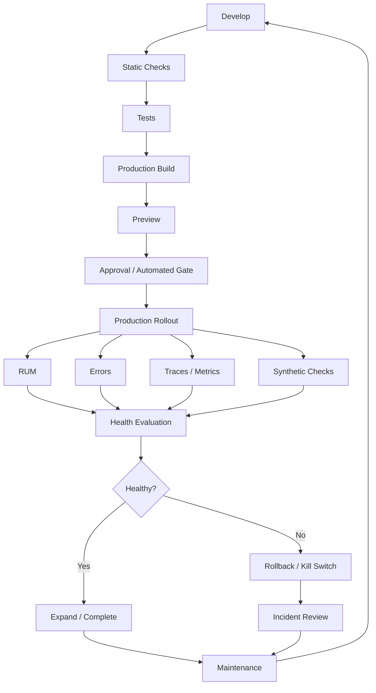

This is the operational architecture of a modern frontend.

---

# 151. Misconceptions to Leave Behind

## “CI means GitHub Actions.”

No.

GitHub Actions is one implementation.

CI is the automated integration/validation practice.

---

## “Continuous Delivery means every commit automatically deploys.”

No.

That is closer to Continuous Deployment.

Continuous Delivery means the system stays safely releasable.

---

## “If tests pass, deployment is safe.”

Not completely.

Configuration, CDN behavior, infrastructure, third parties, and real traffic can still create failures.

---

## “Staging is production without users.”

No.

Traffic, data, caching, geography, and user behavior differ.

---

## “Preview environments replace code review.”

No.

They enhance review by making behavior inspectable.

---

## “Build separately in each environment.”

Often avoidable.

Building one immutable artifact and promoting it reduces variation.

---

## “Feature flags are configuration constants.”

No.

Real flag systems are dynamic operational controls with lifecycle and governance.

---

## “Feature flags are authorization.”

No.

Server authorization must enforce protected access.

---

## “Flags can stay forever.”

Long-lived stale flags create branching complexity.

Remove completed release flags.

---

## “Canary and feature flag are the same.”

No.

Canary controls version exposure.

A feature flag controls behavior exposure.

---

## “Rollback is failure.”

No.

Rollback is a successful recovery capability.

---

## “Rollback will work because we still have the old frontend artifact.”

Not if backend/API changes broke backward compatibility.

---

## “Observability means logs.”

Logs are one signal.

Metrics, traces, errors, RUM, and synthetic checks provide other evidence.

---

## “`console.error()` is error monitoring.”

No.

Production errors need intentional collection, grouping, and release context.

---

## “More telemetry is always better.”

No.

Telemetry has performance, privacy, storage, and analysis cost.

---

## “OpenTelemetry means browser observability is completely standardized.”

Too strong.

OpenTelemetry is an important vendor-neutral direction, but browser instrumentation maturity and support should still be evaluated.

---

## “Session replay is harmless debugging.”

No.

It can capture highly sensitive user behavior and requires strict privacy controls.

---

## “Every error should page someone.”

No.

Alerts should correspond to actionable conditions.

---

## “Dependency updates should be merged automatically because tests pass.”

Not always.

Risk, behavior, and compatibility still require judgment.

---

## “Never update dependencies because upgrades are risky.”

That creates larger future migration risk and security debt.

---

## “A vulnerability score tells us exactly how urgent an issue is.”

No.

Reachability and product exposure matter.

---

## “Users always refresh after deployment.”

No.

Long-lived sessions and cached clients may run older code for hours or days.

---

## “Technical debt means bad engineering.”

Not necessarily.

Debt may be a deliberate trade-off.

Untracked debt is the bigger problem.

---

## “Maintenance is separate from architecture.”

No.

Maintainability is one of architecture's long-term quality attributes.

---

# Chapter Summary

Continuous delivery extends frontend engineering beyond implementation.

A mature pipeline answers:

```text
Can we validate?
Can we deploy?
Can we observe?
Can we recover?
Can we maintain?
```

CI provides automated validation in a clean/shared environment.

Continuous Delivery keeps software ready for release.

Continuous Deployment automatically releases accepted changes.

Build artifacts should be:

- reproducible;
- identifiable;
- preferably immutable between validation and production.

Preview environments allow real branch behavior to be reviewed before merge.

Production deployments can use protection rules, scoped secrets, and controlled concurrency.

Deployment strategies include:

- direct replacement;
- rolling release;
- blue-green;
- canary.

Feature flags decouple deployment from feature release.

They can support:

- hidden development;
- gradual rollout;
- operational kill switches;
- experiments.

But feature flags require lifecycle management.

Observability provides evidence from production.

Important signals include:

```text
logs
metrics
traces
errors
RUM
synthetic checks
```

Release identifiers connect telemetry to deployment history.

Source maps make minified browser errors understandable.

RUM reveals real-user performance.

Distributed traces can connect browser activity to backend work.

Observability should be sampled, structured, privacy-aware, and lightweight.

Alerts should be actionable.

Progressive delivery combines rollout and health evidence.

Rollback should be fast and tested.

Backend compatibility is necessary for frontend rollback.

Maintenance includes:

- dependency upgrades;
- vulnerability response;
- browser support;
- API evolution;
- persistent-data migration;
- Service Worker updates;
- technical debt;
- ownership.

The central principle is:

> **Production engineering creates a feedback loop in which every release can be identified, observed, evaluated, recovered, and improved.**

---

# Review Questions

1. Why is deployment part of frontend architecture?

2. What does Continuous Integration provide?

3. Why should CI run in a clean/shared environment?

4. What kinds of events can trigger CI?

5. Why should fast checks run early?

6. Why can CI jobs run in parallel?

7. What is the difference between a CI cache and a build artifact?

8. What makes a build reproducible?

9. What is Continuous Delivery?

10. How does Continuous Deployment differ?

11. What is a build artifact?

12. Why should deployed artifacts have a release identifier?

13. What is an immutable artifact?

14. Why is “build once, deploy same artifact” valuable?

15. What complications appear with SSR deployment artifacts?

16. What is the purpose of a development environment?

17. What is a preview environment?

18. Why are preview environments useful for non-developers?

19. What data risks exist in preview environments?

20. Why is staging not identical to production?

21. What controls should production provide?

22. What are deployment protection rules?

23. Why should production secrets be scoped?

24. How does least privilege apply to CI?

25. Why might deployments need concurrency control?

26. Why is deployment history operationally important?

27. What is release correlation?

28. What is a rolling deployment?

29. Why does version overlap require backward compatibility?

30. What is blue-green deployment?

31. What are blue-green trade-offs?

32. What is a canary release?

33. How does a canary reduce blast radius?

34. How is canary deployment different from feature flagging?

35. What is a feature flag?

36. Why are feature flags more than booleans?

37. Why can vendor-neutral flag APIs be useful?

38. Where can feature flags be evaluated?

39. Why should browser-delivered flag data not contain secrets?

40. Why are feature flags not authorization?

41. What is a release flag?

42. What is an operational flag?

43. What is an experiment flag?

44. Why do entitlement flags still require server enforcement?

45. What is a feature flag lifecycle?

46. What is flag debt?

47. What is a kill switch?

48. Why should kill switches be tested?

49. What is rollback?

50. Why should rollback be practiced?

51. How can API changes make frontend rollback impossible?

52. When might forward-fix be appropriate?

53. What is observability?

54. How does monitoring differ conceptually from observability?

55. What are logs, metrics, and traces?

56. What makes a log structured?

57. Why is the browser console not sufficient production monitoring?

58. What is a metric?

59. What is high cardinality?

60. What is a distributed trace?

61. What is a span?

62. Why is browser tracing challenging?

63. What is the purpose of OpenTelemetry?

64. Why should browser observability remain architecture-first rather than tool-first?

65. What can RUM contain beyond Web Vitals?

66. What does frontend error monitoring capture?

67. Why should global error capture not replace UI recovery?

68. Why are private production source maps useful?

69. What is error grouping?

70. Why is error rate more useful than raw count?

71. Why should network errors be categorized?

72. Why is a 400 response different operationally from a 500 response?

73. What privacy concerns exist in telemetry user context?

74. What are breadcrumbs?

75. What is session replay?

76. Why does session replay require privacy governance?

77. What is telemetry sampling?

78. Why might errors and traces use different sampling rates?

79. What is head-based sampling?

80. What is tail-based sampling?

81. Why can observability instrumentation hurt performance?

82. What is telemetry batching?

83. When can `sendBeacon()` be useful?

84. Why should observability event names be stable and semantic?

85. What should an operational dashboard answer?

86. What makes an alert useful?

87. What is alert fatigue?

88. What is an SLI?

89. What is an SLO?

90. What is an error budget conceptually?

91. Why do frontend SLOs need clearly defined populations?

92. What is synthetic production monitoring?

93. How does synthetic monitoring complement RUM?

94. What should post-deployment verification check?

95. What is automatic rollback?

96. Why does automatic rollback require trustworthy telemetry?

97. What is progressive delivery?

98. What is a release cohort?

99. Why should percentage rollout assignment be stable?

100. What distinguishes experimentation from ordinary feature rollout?

101. What are experiment guardrail metrics?

102. Why is maintenance part of architecture?

103. Why are regular smaller dependency upgrades useful?

104. What are the benefits and risks of automated dependency PRs?

105. Why should security advisories have a response process?

106. Why is vulnerability score alone insufficient for triage?

107. What are transitive dependencies?

108. Why is deleting unused dependencies valuable?

109. How should browser support policy evolve?

110. Why should browser-support decisions use your actual user population?

111. How should browser support be deprecated responsibly?

112. Why should APIs evolve with compatibility windows?

113. How can runtime schema validation help detect API drift?

114. Why does persistent browser data need migration?

115. What delivery problems can Service Workers create?

116. What is the stale-client problem?

117. Why can update notifications be useful?

118. Why are compatibility windows important for long-lived sessions?

119. What is technical debt?

120. Why can technical debt be rational?

121. What should a debt register contain?

122. Why should product planning include maintenance capacity?

123. What is an end-of-life policy?

124. Why does operational ownership matter?

125. What is a runbook?

126. What is the first priority during an incident?

127. What are the stages of incident response?

128. Why should incident reviews focus on systems rather than blame?

129. What makes a strong post-incident action?

130. Why is deployment frequency not automatically a quality score?

131. What is Mean Time to Recovery conceptually?

132. How do testing and observability complement one another?

133. What is the production feedback loop?

134. Why is telemetry a privacy concern?

135. Why should form content not be recorded by default?

136. How do analytics and observability differ?

137. Why should product and operational metrics be distinguished?

138. Why should technical severity be interpreted in business context?

139. What is a deployment health window?

140. Why do low-traffic applications need different rollout strategies?

141. Why is technology maintainability part of architecture selection?

142. Why can boring technology be valuable?

143. Why is upgrade path an important dependency-selection criterion?

144. What makes an internal platform maintainable?

145. What questions belong in an operational-readiness review?

146. Why should production-readiness rigor be proportional to product risk?

---

# End-of-Chapter Practical Lab — Build a Production Delivery and Observability Loop

Create:

```text
chapter-17-production/
├── app/
├── .github/
│   └── workflows/
├── observability/
├── release/
├── runbooks/
└── maintenance/
```

The tooling can be adapted to your platform.

GitHub Actions can be used as the reference CI/CD system.

Do not turn this into a provider-specific tutorial.

Focus on the operational architecture.

---

## Stage 1 — Create the CI Pipeline

Configure:

```text
install
lint
typecheck
unit tests
component/integration tests
production build
```

Make the fast checks fail before the expensive browser suite.

Draw the pipeline with Mermaid.

---

## Stage 2 — Add Parallel Jobs

Run:

```text
lint
types
unit tests
```

in parallel where appropriate.

Measure CI elapsed time.

Explain the trade-off between:

```text
elapsed time
```

and:

```text
compute consumption
```

---

## Stage 3 — Produce a Versioned Artifact

Create a production build.

Attach metadata:

```text
commit SHA
build ID
```

Store the artifact.

The same artifact should be used in later deployment stages where the architecture allows.

---

## Stage 4 — Create a Preview Deployment

For each pull request, conceptually or actually deploy:

```text
preview-<PR>.example.test
```

Use safe test data.

Review:

- responsive behavior;
- keyboard behavior;
- network requests.

---

## Stage 5 — Protect Production

Define production conditions:

```text
CI green
approved branch
authorized deployment identity
```

Optionally require a manual approval.

Explain why preview jobs should not automatically have production secrets.

---

## Stage 6 — Add Deployment Concurrency

Prevent two production deployments from running simultaneously.

Simulate:

```text
release A
release B
```

arriving close together.

Document which should proceed.

---

## Stage 7 — Expose the Release Version

Add a non-sensitive internal endpoint or application diagnostics view showing:

```text
release ID
build date
```

Include release ID in error-monitoring events.

---

## Stage 8 — Add a Preview Smoke Test

After preview deployment:

```text
open homepage
open catalogue
verify API connection
```

Fail deployment validation if the basic application cannot start.

---

## Stage 9 — Design a Canary Rollout

Do not require production traffic infrastructure for the lab.

Draw a release plan:

```text
5%
25%
50%
100%
```

For each stage define:

```text
error threshold
performance threshold
minimum observation window
```

Explain what would trigger rollback.

---

## Stage 10 — Add a Release Flag

Create:

```text
newCatalogueFilters
```

Default:

```text
off
```

Deploy both old and new paths.

Enable the new path for:

```text
internal test users
```

first.

---

## Stage 11 — Give the Flag an Owner

Create metadata:

```text
flag key
owner
purpose
created
expected removal
```

Document the deletion step after full rollout.

---

## Stage 12 — Create a Kill Switch

Add an operational flag for:

```text
liveRecommendations
```

Simulate the recommendation API failing badly.

Disable the feature without redeploying.

Ensure the core product still works.

---

## Stage 13 — Remove a Completed Flag

After:

```text
newCatalogueFilters = 100%
```

delete:

- old code path;
- flag evaluation;
- obsolete tests.

Document why completed flags should not remain forever.

---

## Stage 14 — Add Error Monitoring Conceptually or with a Tool

Capture:

```text
uncaught exception
unhandled rejection
framework error
```

Attach:

```text
release
route
browser context
```

Do not capture sensitive form data.

---

## Stage 15 — Upload Source Maps

Build minified production assets.

Store or upload source maps to the monitoring layer.

Trigger an intentional safe test error.

Verify that the production stack trace maps to original source.

---

## Stage 16 — Add RUM

Capture:

```text
LCP
INP
CLS
route
release
```

Create an event schema.

Do not attach personal content.

Draw:

```text
browser
→ telemetry collector
→ dashboard
```

with Mermaid.

---

## Stage 17 — Add a Custom Journey Metric

Measure:

```text
Search button click
↓
Results rendered
```

with User Timing or equivalent instrumentation.

Report it with:

```text
release
route
```

Explain why product-specific timing complements Core Web Vitals.

---

## Stage 18 — Create an Operational Dashboard

Design a dashboard containing:

```text
release
frontend error rate
API failures
LCP p75
INP p75
CLS p75
critical journey success
```

Do not include metrics without a purpose.

---

## Stage 19 — Define Alerts

Create example alerts for:

```text
severe error-rate increase
checkout failure
major performance regression
```

For each alert define:

```text
owner
severity
response action
```

Avoid alerting on every individual exception.

---

## Stage 20 — Add Synthetic Production Monitoring

Create a scripted browser journey against a safe environment:

```text
open app
search product
open product
```

Schedule it periodically.

Explain what synthetic checks detect that RUM may not.

---

## Stage 21 — Create a Rollback Procedure

Document:

```text
identify bad release
select previous artifact
redeploy/switch alias
verify smoke tests
confirm metrics recover
```

Practice the process in a test environment.

---

## Stage 22 — Simulate Compatibility Failure

Create:

```text
frontend v2
```

that expects a new API field.

Then try to rollback to:

```text
frontend v1
```

after removing an old API field.

Observe the problem.

Restore backward-compatible API evolution.

---

## Stage 23 — Create a Frontend Runbook

Write:

```text
RUNBOOK-FRONTEND-ERROR-SPIKE.md
```

Include:

1. check latest deployment;
2. inspect top error groups;
3. verify API health;
4. disable risky flag;
5. rollback if necessary;
6. verify recovery.

---

## Stage 24 — Create a Dependency Maintenance Workflow

List dependencies by:

```text
runtime
build
testing
development
```

Choose:

```text
weekly patch review
monthly minor review
major upgrades separately
```

The exact cadence is an exercise, not a universal rule.

---

## Stage 25 — Triage a Vulnerability

Use a safe example advisory.

Record:

```text
severity
which dependency path
runtime reachable?
browser shipped?
build only?
remediation
```

Explain why raw severity alone does not determine actual product risk.

---

## Stage 26 — Remove One Dependency

Find one package that can be replaced by:

```text
browser API
small internal function
existing dependency
```

Remove it.

Measure:

- bundle;
- install graph;
- maintenance surface.

---

## Stage 27 — Test an Upgrade Path

Store old application settings in:

```text
localStorage
```

Upgrade their schema.

Implement:

```text
read old
migrate
validate
save new
```

Test both:

```text
fresh install
existing user upgrade
```

---

## Stage 28 — Simulate a Long-Lived Client

Open application version:

```text
v1
```

Then deploy:

```text
v2
```

without reloading the tab.

Verify that the old client can still communicate with the current API for the agreed compatibility period.

---

## Stage 29 — Add Update Notification

Detect that a newer build is available.

Display:

```text
A new version is available.
```

Do not force immediate refresh while the user has unsaved changes.

Document the UX policy.

---

## Stage 30 — Create a Debt Register

Record only significant items:

```text
old chart library
legacy state store
stale feature flag
slow CI job
```

For each:

```text
risk
owner
next action
```

Do not catalog every imperfect code style.

---

## Stage 31 — Design SLOs

Choose two user-relevant indicators.

Example:

```text
catalogue availability
checkout system-error success rate
```

Define an objective and population.

Explain which factors are under your system's control.

---

## Stage 32 — Create the Final Production Architecture Diagram

Use Mermaid to show:

```text
developer
repository
CI
artifact store
preview
production
feature flag service
CDN
browser
error monitoring
RUM
synthetic monitoring
alerts
rollback
```

Show the feedback loop back to development.

---

# Key Terms

**Continuous Integration (CI)** — frequent automated validation of integrated code changes in a clean/shared environment.

**Continuous Delivery** — maintaining software in a state where it can be released safely and repeatedly.

**Continuous Deployment** — automatically deploying accepted changes to production without a manual release decision.

**Build artifact** — the identified output of a build process intended for deployment or later pipeline stages.

**Immutable artifact** — a build output promoted between environments without being rebuilt or modified.

**Preview environment** — an environment associated with a branch or pull request for reviewing a proposed version.

**Staging environment** — a pre-production environment intended to approximate important aspects of production.

**Production environment** — the environment serving real users and real operational workloads.

**Deployment protection rule** — a condition that must be satisfied before a deployment can proceed.

**Least privilege** — granting a process or identity only the permissions required for its task.

**Deployment concurrency** — control preventing conflicting deployments from running simultaneously against the same target.

**Release ID** — an identifier connecting deployed software with source/build history and telemetry.

**Release correlation** — associating errors, performance, or other signals with a particular deployment version.

**Rolling deployment** — gradually replacing old runtime instances or assets with a new release.

**Blue-green deployment** — maintaining old and new production-like versions and switching traffic between them.

**Canary release** — initially exposing a new version to a limited user/traffic population and expanding if healthy.

**Feature flag** — a runtime-controlled mechanism for changing product behavior without deploying different source code.

**Release flag** — a temporary flag used to hide or gradually enable newly deployed functionality.

**Operational flag** — a flag used to control production behavior for reliability or incident response.

**Kill switch** — a fast operational control for disabling problematic functionality.

**Flag debt** — complexity created by stale or excessive feature flags and their alternative code paths.

**Rollback** — restoring a previous known-safe version or behavior after a problematic release.

**Forward fix** — releasing a new correction instead of returning to a previous version.

**Observability** — the capability to understand production system behavior through emitted telemetry.

**Log** — a structured record describing an event.

**Metric** — aggregated numerical measurement tracked over time.

**Trace** — a connected representation of related operations across components or services.

**Span** — one timed operation within a distributed trace.

**OpenTelemetry** — a vendor-neutral observability project providing APIs, SDKs, and conventions for telemetry.

**Real User Monitoring (RUM)** — telemetry collected from real browser sessions.

**Error monitoring** — collection, grouping, and analysis of production application errors.

**Breadcrumb** — contextual event recorded before an error to help reconstruct the sequence leading to failure.

**Session replay** — tooling that reconstructs aspects of user interaction for debugging or analysis.

**Sampling** — collecting only a selected portion of telemetry to control overhead and cost.

**Synthetic monitoring** — scheduled automated monitoring using controlled requests or browser journeys.

**Alert** — a notification indicating a condition expected to require human or automated action.

**Alert fatigue** — reduced attention caused by excessive low-value alerts.

**Service-Level Indicator (SLI)** — a measured property representing some aspect of service behavior.

**Service-Level Objective (SLO)** — a target level for an SLI.

**Error budget** — the tolerated amount of unreliability implied by an SLO.

**Progressive delivery** — controlled release practices that combine gradual exposure with telemetry and operational decision-making.

**Release cohort** — a stable group of users or traffic receiving a particular version or feature treatment.

**Dependency maintenance** — the ongoing process of updating, replacing, auditing, and removing software dependencies.

**Transitive dependency** — a dependency introduced through another dependency rather than directly by the application.

**Compatibility window** — a period during which old and new software versions remain mutually compatible.

**Stale client** — a browser session continuing to run an older application version after newer releases are deployed.

**Technical debt** — future engineering cost intentionally or unintentionally created by current implementation decisions.

**Runbook** — documented operational procedure for responding to a known class of incident or maintenance task.

**Incident** — an unplanned event that significantly degrades expected service behavior.

**Mean Time to Recovery (MTTR)** — a measure of how quickly acceptable service is restored after a failure.

**Operational readiness** — the state in which a system has sufficient deployment, rollback, monitoring, ownership, and maintenance mechanisms for its risk level.

---

# Closing Perspective

The browser application that users experience is not the source code in Git.

It is:

```text
a particular build
deployed through a particular pipeline
running with a particular configuration
calling particular services
on a particular browser
at a particular moment
```

That means frontend engineering cannot stop at:

```text
the pull request was merged
```

A production-ready system needs a full lifecycle.

The change is integrated.

It is validated.

It becomes an identifiable artifact.

It is reviewed in a realistic environment.

It is deployed through controlled permissions.

It reaches users gradually when risk justifies gradual rollout.

Its errors and performance are observed.

Its release can be identified.

Its behavior can be disabled.

Its previous version can be restored.

Its dependencies can be upgraded.

Its stale code paths can be removed.

Its incidents can teach the team how to improve the system.

This is continuous engineering.

Feature flags illustrate the principle well.

They let deployment and feature release move separately.

But that flexibility has a cost.

Every flag introduces another possible application state.

If flags are not removed, the application becomes harder to reason about.

Observability has the same trade-off.

Telemetry can make production understandable.

But excessive telemetry creates cost, privacy risk, and noise.

Deployment automation can make releases safe and repeatable.

But overly complicated pipelines can become systems that nobody understands.

The goal is not maximum operational machinery.

It is proportional control.

A low-risk public content site may need:

```text
CI
preview
static deployment
basic error monitoring
```

A hospital, financial, or government application may require:

```text
protected production environments
release approval
rollback
feature kill switches
RUM
error monitoring
synthetic journeys
runbooks
compatibility policies
```

Architecture should reflect consequence.

This chapter completes the production-engineering foundation of the book.

The final chapter asks a broader question:

> **How should engineers choose among all of the techniques we have studied?**

Components, state stores, rendering topologies, build systems, security controls, monorepos, micro-frontends, performance strategies, testing, and delivery systems all introduce trade-offs.

The goal of architecture is not to use the most techniques.

It is to choose the smallest coherent system that satisfies the important quality attributes.

That is the subject of Chapter 18: **Front-End Architecture & Technical Decision-Making**.
