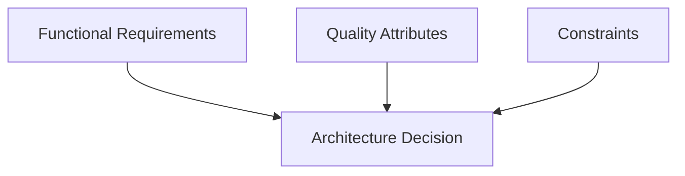
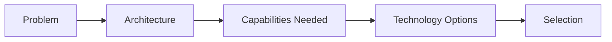
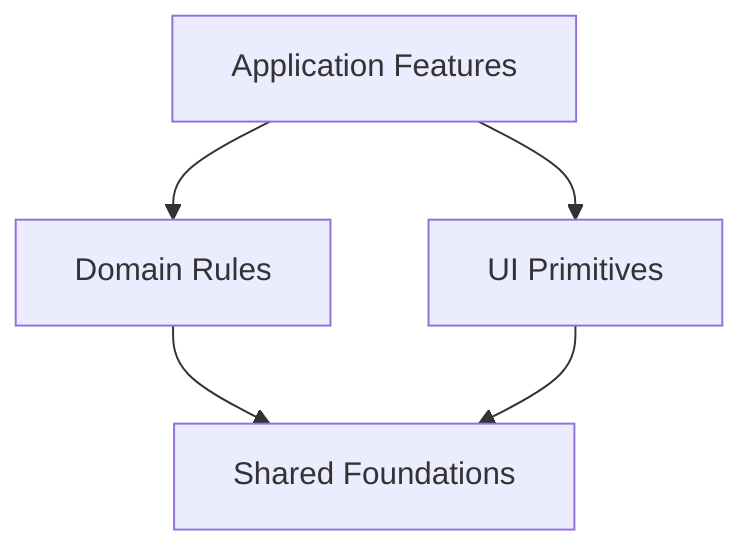
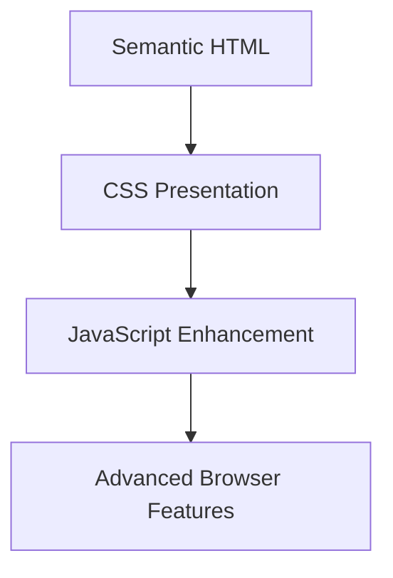
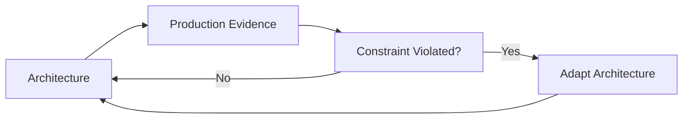
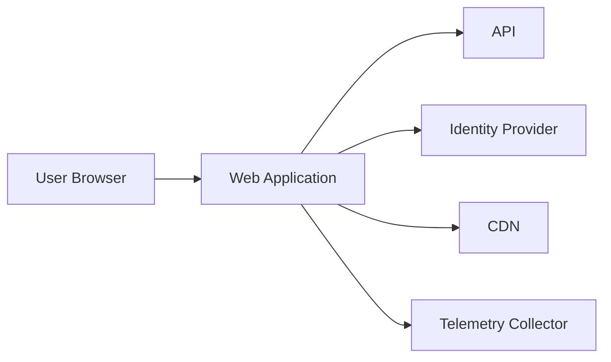
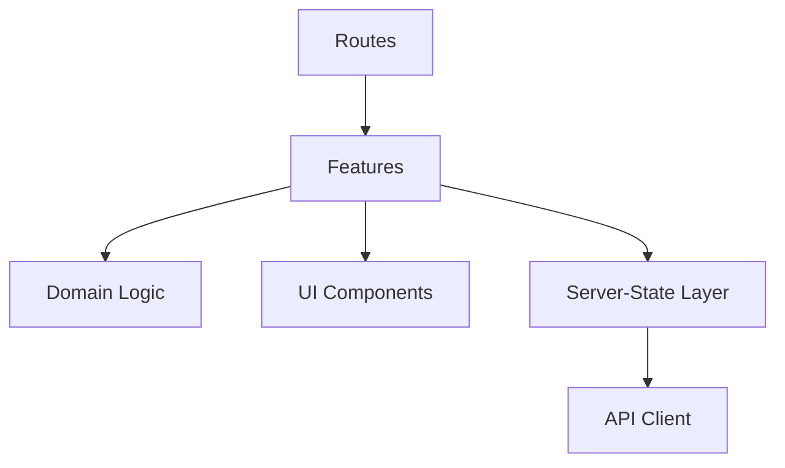
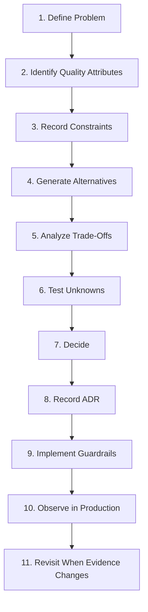
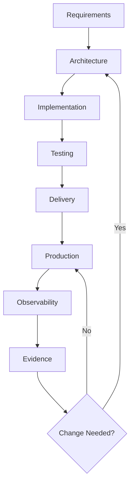

# Chapter 18 — Front-End Architecture & Technical Decision-Making

By this point, we have studied a large number of front-end engineering techniques.

We have discussed:

- browser internals;
- semantic HTML;
- accessibility;
- CSS architecture;
- JavaScript;
- TypeScript;
- components;
- state;
- routing;
- forms;
- APIs;
- caching;
- offline systems;
- rendering strategies;
- build systems;
- security;
- design systems;
- monorepos;
- micro-frontends;
- performance;
- testing;
- continuous delivery;
- observability.

The final architectural question is therefore not:

> What techniques exist?

It is:

> **Which of these techniques should we actually use for this product, this team, and this problem?**

That is harder.

Modern front-end engineering offers many legitimate options.

For example, a team might choose:

```text
CSR
SSR
SSG
hybrid rendering
```

or:

```text
local state
URL state
shared store
server cache
```

or:

```text
single repository
monorepo
multiple repositories
```

or:

```text
one application
several independently deployed applications
micro-frontends
```

Each can be correct.

Each can also be unnecessary.

Architecture is therefore not primarily the ability to name patterns.

It is the ability to make **trade-offs deliberately**.

A useful model is:


The central principle of this chapter is:

> **Good architecture is the smallest coherent set of decisions that satisfies the important requirements while keeping future change affordable.**

This chapter focuses on:

- quality attributes;
- constraints;
- trade-offs;
- complexity;
- architectural fitness;
- dependency selection;
- framework selection;
- build-versus-buy decisions;
- progressive enhancement;
- architecture decision records;
- evolutionary architecture;
- technical debt;
- decision review.

The purpose is not to prescribe one “best” frontend architecture.

The purpose is to make architecture explainable.

---

# 1. Architecture Is a Set of Decisions

Architecture is sometimes presented as a diagram.

For example:

```text
React
↓
Redux
↓
REST
↓
Node
```

That is not architecture by itself.

Those are technologies.

Architecture is the reasoning behind decisions such as:

```text
Why does this state live in the URL?
Why is this route server-rendered?
Why is this package shared?
Why is this feature isolated?
Why does this system need a client store?
Why is this dependency justified?
```

The diagram becomes useful only when it reflects deliberate boundaries.

---

# 2. Architecture Exists Because Not Everything Can Be Optimized at Once

Suppose we want:

```text
maximum performance
maximum flexibility
minimum complexity
maximum reuse
maximum autonomy
minimum cost
```

These goals can conflict.

For example:

### Maximum team autonomy

may encourage:

```text
independent deployments
separate applications
```

But that can increase:

```text
runtime integration complexity
duplicate dependencies
operational cost
```

Architecture exists because trade-offs are unavoidable.

---

# 3. Quality Attributes

A **quality attribute** describes how well a system should behave.

Common frontend quality attributes include:

- performance;
- accessibility;
- security;
- maintainability;
- reliability;
- scalability;
- testability;
- usability;
- deployability;
- observability;
- internationalization;
- offline resilience.

These attributes influence architecture more than technology fashion.

---

# 4. Functional Requirements vs Quality Attributes

Functional requirement:

```text
User can edit a product.
```

Quality attributes might say:

```text
Edit form must work with keyboard.
Changes must survive temporary network failure.
Save feedback should appear quickly.
Unauthorized users must not edit.
The feature should be maintainable by one team.
```

The function says:

> what the product does.

Quality attributes say:

> how well it must do it.

Architecture is heavily shaped by the second group.

---

# 5. Not Every Quality Attribute Has Equal Priority

A public documentation site may prioritize:

```text
performance
accessibility
SEO
maintainability
```

A trading dashboard may prioritize:

```text
responsiveness
real-time updates
reliability
```

A hospital application may prioritize:

```text
correctness
availability
security
auditability
```

A prototype may prioritize:

```text
speed of learning
```

Architecture should reflect business context.

---

# 6. Make Quality Attributes Explicit

Instead of saying:

> Performance matters.

Say:

```text
Public product pages should reach good LCP for at least 75% of target users.
```

Instead of:

> Security matters.

Say:

```text
Patient data must not be accessible to unauthorized roles, and sensitive browser storage should be minimized.
```

Specificity makes decisions testable.

---

# 7. Constraints

Architecture also depends on constraints.

Examples:

```text
team size
deadline
existing backend
browser support
legal requirements
hosting platform
skills
budget
legacy system
vendor contract
```

A technically elegant architecture can be inappropriate if it ignores constraints.

---

# 8. Constraint Example

Suppose the team has:

```text
3 developers
4-month deadline
one web application
Laravel backend
```

Introducing:

```text
micro-frontends
custom design-system infrastructure
multiple deployment platforms
```

may be technically interesting.

It may also be irresponsible.

Architecture should fit organizational capacity.

---

# 9. Requirements, Constraints, and Decisions

A useful flow:



No one input should dominate blindly.

---

# 10. Architecture Is Contextual

The same technology can be:

```text
excellent
```

for one product and:

```text
unnecessary
```

for another.

For example:

### WebSocket

Excellent for:

```text
live collaborative editing
```

Unnecessary for:

```text
static documentation
```

### Global state store

Useful for:

```text
complex cross-feature client workflows
```

Unnecessary for:

```text
three local toggles
```

Pattern quality depends on context.

---

# 11. Start with the Problem, Not the Tool

Weak architecture process:

```text
We want to use framework X.
What can we build with it?
```

Stronger process:

```text
What does the system need?
What constraints exist?
Which architecture satisfies them?
Which tools fit that architecture?
```

Tools should follow decisions.

---

# 12. Technology Selection Is Downstream

A durable sequence is:



Not:

```text
technology
→ justify architecture later
```

---

# 13. Architecture Decisions Are Often About Boundaries

Most important frontend decisions are boundary decisions.

Examples:

```text
server vs client
local vs shared
component vs feature
public vs private API
static vs dynamic
build-time vs runtime
one deployment vs many
trusted vs untrusted
```

Boundaries define:

- ownership;
- data flow;
- coupling;
- failure behavior.

---

# 14. Good Boundaries Reduce Change Cost

Suppose a component exposes:

```text
public props
```

while hiding internal state.

The implementation can change without consumers changing.

The same principle appears at larger scales.


Architecture is largely about deciding where these stable boundaries should exist.

---

# 15. Cohesion and Coupling

Two classic concepts remain useful.

## Cohesion

Things that belong together should be together.

## Coupling

Things that should change independently should avoid unnecessary dependency.

Good architecture tends toward:

```text
high cohesion
low unnecessary coupling
```

But zero coupling is impossible.

Systems must collaborate.

---

# 16. Cohesion Example

A Product feature may contain:

```text
ProductList
ProductFilters
ProductEditor
product API
product validation
```

These share one domain purpose.

Keeping them near each other can improve cohesion.

Scattering them across:

```text
components/
hooks/
utils/
services/
types/
```

may make one feature difficult to understand.

---

# 17. Coupling Example

Suppose:

```text
Button
```

imports:

```text
CheckoutStore
```

Now the generic UI primitive depends on checkout.

That is suspicious coupling.

The direction should usually be:

```text
Checkout feature
→ Button
```

not:

```text
Button
→ Checkout feature
```

---

# 18. Dependency Direction

A useful architecture often has dependencies flowing toward more stable abstractions.

Example:



If foundational packages depend on high-level features, reuse and change become harder.

---

# 19. Stable Dependencies

A package depended on by many applications should change carefully.

Example:

```text
@company/ui
```

used by:

```text
12 applications
```

has high blast radius.

Therefore it should have:

- stable API;
- tests;
- deprecation policy.

The more consumers a boundary has, the more important stability becomes.

---

# 20. Blast Radius

**Blast radius** describes how much of the system can be affected by one change or failure.

Examples:

```text
local component bug
→ one dialog

shared UI package bug
→ many pages

authentication package bug
→ entire platform
```

Architectural decisions should consider blast radius.

---

# 21. Centralization vs Local Autonomy

Centralizing behavior can improve:

- consistency;
- reuse;
- governance.

But can increase:

- coupling;
- coordination;
- blast radius.

Local ownership can improve:

- autonomy;
- speed;
- domain fit.

But can create:

- duplication;
- inconsistency.

Architecture finds a balance.

---

# 22. The Complexity Budget

Every architectural mechanism consumes complexity.

Examples:

```text
global store
service worker
micro-frontend
custom build plugin
feature flags
schema validation
runtime federation
```

Some complexity is necessary.

But complexity should have a budget.

A useful principle:

> **Introduce complexity only when it buys a capability the system genuinely needs.**

---

# 23. Accidental vs Essential Complexity

Some complexity belongs to the problem.

Example:

```text
multi-step insurance claim
```

may genuinely be complicated.

That is closer to **essential complexity**.

Other complexity comes from the chosen solution.

Example:

```text
five state libraries
three routing abstractions
custom event bus
```

may be **accidental complexity**.

Architecture should minimize the second kind.

---

# 24. Complexity Has Several Forms

Complexity can appear as:

- conceptual complexity;
- runtime complexity;
- deployment complexity;
- operational complexity;
- team coordination complexity.

A solution may simplify one while increasing another.

---

# 25. Example: Micro-Frontends

Micro-frontends may reduce:

```text
team release coordination
```

but increase:

```text
runtime integration
observability
dependency management
```

The architecture can still be correct.

The trade-off must be intentional.

---

# 26. Example: SSR

SSR may improve:

```text
initial content delivery
```

but increase:

```text
server infrastructure
hydration complexity
```

Again:

```text
benefit
vs
cost
```

not:

```text
modern
vs
outdated
```

---

# 27. Prefer Reversible Decisions

Some architectural decisions are easy to change.

Example:

```text
replace date library
```

Others are expensive.

Example:

```text
split one application into independently deployed micro-frontends
```

For uncertain areas, prefer decisions that are easier to reverse.

---

# 28. One-Way and Two-Way Doors

A useful metaphor:

### Two-way door

Easy to reverse.

Example:

```text
choose utility library
```

### One-way door

Expensive to reverse.

Example:

```text
define organization-wide micro-frontend platform
```

Spend more analysis on one-way doors.

---

# 29. Delay Irreversible Decisions When Information Is Weak

If a product is still uncertain:

```text
user workflow unclear
team ownership unclear
scale unknown
```

avoid hard-coding complex organizational boundaries too early.

A modular monolith may preserve learning better than premature distribution.

---

# 30. YAGNI

**You Aren't Gonna Need It** is a useful reminder against speculative architecture.

Example:

```text
We might eventually support 40 brands.
```

does not automatically justify a full multi-brand token platform today.

Build for known near-term requirements while preserving reasonable extension paths.

---

# 31. YAGNI Does Not Mean Ignore the Future

Bad interpretation:

> Only solve today's exact code.

Better interpretation:

> Do not pay today's complexity cost for a hypothetical future without evidence.

Good architecture leaves options without fully implementing them.

---

# 32. Premature Abstraction

Suppose two components look similar.

A team immediately creates:

```text
UniversalBusinessCard
```

with many configuration props.

Later, the use cases diverge.

The abstraction becomes harder than duplication.

A practical rule:

> Duplicate small things until the shared concept is clear.

Then extract.

---

# 33. Rule of Three

A useful heuristic:

```text
first use
→ solve clearly

second similar use
→ observe similarity

third use
→ consider abstraction
```

This is not a law.

It encourages evidence before abstraction.

---

# 34. Duplication Can Be Cheaper Than Coupling

Two 20-line functions may be less harmful than one 100-line generic abstraction used by unrelated features.

Do not optimize only for:

```text
number of repeated lines
```

Optimize for:

```text
change clarity
```

---

# 35. Locality

Code is easier to reason about when related things are nearby.

For example:

```text
feature component
feature query
feature validation
feature tests
```

may be easier to maintain together than distributed across global directories.

Locality reduces navigation and hidden dependencies.

---

# 36. Explicit Data Flow

Prefer architectures where data movement is visible.

Example:

```text
parent
→ props
→ child

child
→ event
→ parent
```

is easier to reason about than:

```text
global event bus
→ unknown subscribers
```

Explicitness improves debugging.

---

# 37. Hidden Coupling

Hidden coupling can come from:

- global mutable state;
- module side effects;
- implicit environment variables;
- magic dependency injection;
- global CSS;
- shared singleton caches.

These tools are not always wrong.

But they should be visible and constrained.

---

# 38. Global State Is an Architectural Decision

Before adding a global store, ask:

```text
Which state needs global ownership?
Which consumers require it?
Could URL/server/local state solve it?
```

Chapter 8 established:

> Keep state as close as practical to the code that owns it.

That is also an architecture principle.

---

# 39. Server State Is Not Ordinary Client State

If the server is the source of truth, prefer a server-state/cache model rather than duplicating everything into a global UI store.

This reduces synchronization problems.

Architecture improves when each state category has one clear owner.

---

# 40. Derived State Should Usually Remain Derived

If:

```text
total = price × quantity
```

do not store all three unless there is a real reason.

Duplicated state creates inconsistency.

This small rule scales into larger architecture:

> Avoid storing information that can be reliably derived from an authoritative source.

---

# 41. URL as Architecture

A URL is not just a string.

It is:

- navigation;
- history;
- shareable state;
- deep link;
- browser contract.

If:

```text
filters
pagination
search query
```

matter across reload/share/back, the URL may be the correct owner.

Architecture should use the platform.

---

# 42. Progressive Enhancement

**Progressive enhancement** starts with a functional baseline and adds richer capabilities where supported.

Example:

```text
HTML form works
↓
JavaScript enhances validation
↓
client navigation improves feedback
```

This is more than an accessibility pattern.

It is an architectural resilience strategy.

---

# 43. Progressive Enhancement as a Layered Model



Each layer adds capability.

The system should avoid unnecessary dependence on a higher layer when a lower layer can satisfy the requirement.

---

# 44. When Progressive Enhancement Is Especially Valuable

Strong candidates:

- public forms;
- content sites;
- government services;
- low-connectivity environments;
- accessibility-sensitive workflows;
- long-lived systems.

It can improve resilience.

---

# 45. Not Every Application Needs Full No-JavaScript Operation

A 3D design editor cannot realistically provide the same experience without JavaScript.

Progressive enhancement should be applied proportionally.

The principle is:

> Use the lowest platform layer that reasonably satisfies each responsibility.

Not:

> Every application must work identically without JavaScript.

---

# 46. Native Platform First

Before adding a library, ask:

```text
Can HTML do this?
Can CSS do this?
Can the browser API do this?
```

Examples:

```text
dialog
details
form validation
URL navigation
CSS grid
Intl
```

Using the platform can reduce dependencies and improve longevity.

---

# 47. Native Does Not Automatically Mean Better

Some native APIs may have:

- incomplete capability;
- browser differences;
- poor developer ergonomics;
- accessibility caveats.

Evaluate fit.

Platform-first means:

> Consider the built-in solution before adding abstraction.

It does not mean:

> Never use libraries.

---

# 48. Dependency Evaluation

Every dependency creates future obligations.

Questions to ask:

- What problem does it solve?
- How much code does it add?
- Is it actively maintained?
- Is the API stable?
- Does it duplicate platform capability?
- Does it support our browsers?
- Does it affect client bundle?
- Is migration feasible?
- Is the license acceptable?
- Does it create security exposure?

Dependencies are architecture decisions.

---

# 49. Small Dependency vs Internal Code

Suppose a library provides:

```text
one 15-line helper
```

Adding the package may create more maintenance than implementing the logic locally.

But implementing:

```text
date parsing across locales and time zones
```

from scratch would be irresponsible.

Evaluate domain complexity.

---

# 50. Build vs Buy vs Adopt

A capability can often be:

```text
built internally
bought as service
adopted as open source
```

Example:

```text
authentication
```

Build internally:
- maximum control;
- very high risk/cost.

Managed identity provider:
- less implementation;
- vendor dependency.

Open-source identity platform:
- operational burden;
- more control.

The decision is architectural.

---

# 51. Core vs Commodity

A useful question:

> Is this capability central to our product differentiation?

If not, custom engineering may be unnecessary.

Examples often commodity:

```text
date formatting
OAuth
analytics transport
generic modal primitives
```

Examples potentially core:

```text
unique medical workflow
specialized design editor
proprietary recommendation interface
```

Invest engineering where differentiation matters.

---

# 52. Framework Selection

Framework selection should begin with requirements.

Questions:

- rendering needs?
- ecosystem maturity?
- team familiarity?
- hiring?
- browser targets?
- accessibility support?
- deployment platform?
- migration path?
- library compatibility?

Do not choose solely through benchmark rankings.

---

# 53. Framework Benchmarks Are Contextual

A benchmark may test:

```text
render 10,000 rows
```

Your application may spend most time on:

```text
network
forms
authentication
```

Benchmark results can inform understanding.

They do not replace product-specific measurement.

---

# 54. React vs Vue Is Often Not the Main Architecture Decision

Both can support:

- components;
- routing;
- state;
- SSR;
- SSG;
- testing;
- TypeScript.

The more important decision may be:

```text
client-heavy SPA
vs
server-oriented hybrid
```

or:

```text
one app
vs
independent deployments
```

Framework choice matters.

But architecture often matters more.

---

# 55. Framework Lock-In

Every framework creates coupling.

Sources include:

- component model;
- router;
- rendering model;
- state conventions;
- framework-specific APIs.

Lock-in is not automatically bad.

The question is:

> Is the productivity gained worth the migration cost?

---

# 56. Reduce Unnecessary Lock-In at Boundaries

Good boundaries can remain framework-neutral.

Examples:

```text
domain functions
API schemas
validation
business rules
design tokens
```

These can often remain ordinary TypeScript/JavaScript.

UI components can remain framework-specific.

Do not force everything to be framework-neutral.

---

# 57. Architecture Fitness

An architecture is fit when it supports current requirements with acceptable cost.

It may become unfit later.

Signals include:

- release bottlenecks;
- performance problems;
- too many cross-team changes;
- fragile shared state;
- impossible testing;
- excessive build times.

Architecture should evolve when evidence appears.

---

# 58. Evolutionary Architecture

**Evolutionary architecture** expects systems to change.

Instead of designing the final perfect system, it creates:

- clear boundaries;
- measurable constraints;
- reversible decisions;
- feedback loops.

Conceptually:



This is more realistic than predicting every future requirement.

---

# 59. Fitness Functions

A **fitness function** is an automated or measurable check that protects an architectural property.

Examples:

```text
initial JS < budget
no package cycle
Core Web Vitals target
no forbidden dependency direction
critical accessibility check
```

Fitness functions make architecture partially executable.

---

# 60. Architecture Rule as Code

Suppose architecture says:

```text
shared UI cannot import product feature modules
```

A lint/import-boundary rule can enforce it.

Now the architectural boundary is not only documentation.

It becomes a testable constraint.

---

# 61. Fitness Functions Should Protect Important Properties

Do not create hundreds of architectural rules.

Protect properties with real value.

Examples:

- dependency direction;
- bundle size;
- public API boundaries;
- security requirements;
- accessibility.

Automation should reduce coordination cost.

---

# 62. Architecture Decision Records

An **Architecture Decision Record**, or ADR, captures a significant technical decision.

A simple ADR includes:

```text
Context
Decision
Alternatives
Consequences
Status
```

The goal is not bureaucracy.

It is preserving reasoning.

---

# 63. Why ADRs Matter

Six months later, a developer may ask:

> Why are we using SSR for Product pages?

Without context:

```text
because somebody chose it
```

With ADR:

```text
public SEO-sensitive pages
large client waterfall
need cacheable HTML
```

The decision becomes understandable.

---

# 64. ADRs Record Decisions, Not Meeting Minutes

Weak ADR:

```text
Monday meeting discussed React.
Polla liked Vue.
Team talked for 2 hours.
```

Strong ADR:

```text
Decision:
Use server-rendered product pages with client islands.

Reason:
Public content needs early HTML;
only cart controls require client state.

Trade-offs:
Server runtime required;
hydration remains for cart.
```

Keep ADRs concise and durable.

---

# 65. ADR Example

```markdown
# ADR-007: Use URL State for Catalogue Filters

## Context

Catalogue filters must:
- survive reload;
- support Back/Forward;
- be shareable;
- support server-rendered search pages.

## Decision

Store filter state in URL search parameters.

## Alternatives

- local component state;
- global client store.

## Consequences

Positive:
- shareable;
- browser history works;
- reload-safe.

Negative:
- values require parsing;
- URL schema must remain backward compatible.

## Status

Accepted
```

This makes architecture explicit.

---

# 66. ADR Status

Common states include:

```text
proposed
accepted
deprecated
superseded
```

If a decision changes, do not rewrite history.

Create a new ADR that supersedes the old one.

Architecture history is valuable.

---

# 67. Decision Scope

Not every coding choice needs an ADR.

Good ADR candidates:

- rendering topology;
- framework;
- state strategy;
- repository model;
- authentication architecture;
- micro-frontends;
- design-system ownership;
- major dependency.

Do not document:

```text
use 16px margin here
```

as architecture.

---

# 68. Decision Matrix

A decision matrix can help compare options.

Example:

| Criterion | CSR | SSR | SSG |
|---|---:|---:|---:|
| Personalization | High fit | High fit | Low |
| Public static content | Medium | Good | Excellent |
| Server cost | Low | Higher | Low |
| Initial JS dependency | Higher | Medium | Low–Medium |
| Build-time cost | Low | Low | Higher |

The table supports reasoning.

It should not become a universal scorecard.

---

# 69. Avoid Weighted Score Theater

A team may assign:

```text
React = 87
Vue = 84
```

based on arbitrary weights.

This can create false objectivity.

Scores are useful only when criteria and evidence are meaningful.

Architecture decisions often require discussion of trade-offs rather than one final number.

---

# 70. Proof of Concept

For uncertain high-impact decisions, build a small experiment.

Example:

```text
Can SSR meet our authenticated latency target?
```

Prototype:

- one representative route;
- realistic data;
- real deployment target.

Measure.

Do not build half the product as a “proof of concept.”

---

# 71. Spike

A **technical spike** is time-boxed investigation.

Goal:

```text
reduce uncertainty
```

not:

```text
produce production architecture immediately
```

Output may include:

- findings;
- risks;
- recommendation;
- unknowns.

Spikes are useful when evidence is missing.

---

# 72. Architecture Review

A review should ask:

- Which requirements drive this?
- Which trade-offs exist?
- What is the failure mode?
- How is it tested?
- How is it operated?
- How reversible is it?
- What does it cost?

Avoid reviews based on:

```text
I prefer pattern X.
```

---

# 73. Decision Confidence

Some decisions have:

```text
high evidence
```

Others:

```text
low evidence
```

Record uncertainty.

Example:

```text
We expect 5 teams to adopt this package,
but current adoption is 2.
```

Architecture should distinguish fact from assumption.

---

# 74. Assumption Register

For major projects, list important assumptions.

Example:

```text
A1:
product catalogue changes less than once per minute

A2:
admin users use modern evergreen browsers

A3:
three teams will own separate domains
```

If assumptions change, architecture may need review.

---

# 75. Architecture Risk

Risk can be thought of conceptually as:

```text
probability
×
impact
```

Example:

```text
third-party API outage
```

might be likely but low impact.

```text
authorization bypass
```

might be less likely but extremely high impact.

Engineering attention should reflect both.

---

# 76. Risk Reduction

Options include:

```text
avoid
mitigate
transfer
accept
```

Example:

```text
risk:
external chat widget slows page

mitigation:
lazy load after interaction
```

Architecture is partly risk management.

---

# 77. Failure Mode Analysis

For a proposed architecture, ask:

> What happens when each dependency fails?

Example:

```text
API unavailable
feature flag service unavailable
remote micro-frontend unavailable
CDN unavailable
local storage corrupted
```

Resilient systems define fallback behavior.

---

# 78. Graceful Degradation

If a recommendation service fails:

```text
product page should still work
```

If analytics fails:

```text
checkout should still complete
```

Separate critical from optional dependencies.

---

# 79. Critical Path

The **critical path** is the set of functions required for a key user task.

For checkout:

```text
cart
shipping
payment
confirmation
```

A recommendation widget should not sit on the critical path.

Architecture should isolate optional enhancements.

---

# 80. Availability Architecture

If a system requires high availability, avoid unnecessary critical dependencies.

Example:

```text
page render
depends on
analytics API
```

is poor architecture.

Analytics should fail independently.

---

# 81. Security Architecture

Security decisions should answer:

- Where is trust established?
- Where is authorization enforced?
- Where do secrets live?
- Which origins communicate?
- Which data enters dangerous sinks?

Security should be structural, not added at the end.

---

# 82. Performance Architecture

Performance decisions should answer:

- What is the critical rendering path?
- How much JS is required initially?
- Which resources are critical?
- Where is state computed?
- Which work runs on the main thread?

Performance is often a consequence of architecture.

---

# 83. Accessibility Architecture

Accessibility decisions should appear in:

- component design;
- interaction model;
- design system;
- testing;
- content.

Accessibility is not a final QA task.

If the design requires inaccessible interaction, implementation cannot fully repair it later.

---

# 84. Internationalization Architecture

Internationalization decisions include:

- locale data;
- directionality;
- translation ownership;
- content length;
- date/number formatting;
- font support.

Do not wait until after English UI is finished.

Architecture should avoid assumptions such as:

```text
text is always short
layout is always LTR
```

---

# 85. Testability as an Architecture Attribute

A system becomes easier to test when it has:

- explicit boundaries;
- pure domain logic;
- injectable external dependencies;
- deterministic state transitions;
- clear APIs.

Testing difficulty can be architecture feedback.

---

# 86. Observability as an Architecture Attribute

If production failures cannot be traced to:

```text
route
release
service
```

the system may lack observability boundaries.

Production diagnosis should be considered during design.

---

# 87. Deployability as an Architecture Attribute

Ask:

- Can we deploy independently?
- Do we need to?
- Can we roll back?
- Do versions overlap safely?
- Can a release be identified?

Deployability affects architecture more than CI syntax.

---

# 88. Maintainability

Maintainability includes:

- understandable structure;
- replaceable dependencies;
- documented decisions;
- ownership;
- testability;
- upgrade path.

Clean code is part of it.

Architecture extends beyond code style.

---

# 89. Reliability

Reliability means users can depend on the system.

Frontend reliability includes:

- predictable error recovery;
- offline resilience where required;
- tolerant API evolution;
- stable deployment;
- monitoring.

Reliability is not only backend uptime.

---

# 90. Scalability

Frontend scalability has several meanings:

```text
more users
more data
more teams
more features
more routes
```

Do not say:

> We need scalability.

Specify what is scaling.

---

# 91. User Scale

If user traffic grows:

- CDN;
- caching;
- server rendering capacity;
- API capacity

may matter.

Client architecture may not need major change.

---

# 92. Data Scale

If table data grows:

```text
100 rows
→
1,000,000 rows
```

architecture may need:

- pagination;
- server filtering;
- virtualization.

Do not download everything and hope faster rendering solves it.

---

# 93. Team Scale

If:

```text
1 team
→
20 teams
```

architecture may need:

- ownership;
- packages;
- design system;
- platform tooling;
- independent releases.

This is a different scaling problem.

---

# 94. Feature Scale

If product complexity grows, feature-oriented/domain-oriented decomposition becomes more valuable.

A simple folder structure may become hard to navigate.

Architecture should evolve with cognitive load.

---

# 95. Cognitive Load

A developer can hold only limited system context.

Architecture should help answer:

```text
Where does this behavior live?
Who owns it?
What can it depend on?
How do I change it?
```

Good architecture reduces the amount a developer must understand simultaneously.

---

# 96. Local Reasoning

A powerful quality is:

> Can a developer change one feature without understanding the entire application?

If yes, boundaries are helping.

If every change requires understanding:

```text
global store
global CSS
shared event bus
every route
```

the architecture has high cognitive coupling.

---

# 97. Architecture Documentation

Useful architecture documentation may include:

- system context;
- dependency diagrams;
- ADRs;
- ownership;
- deployment model;
- major data flows.

Avoid documentation that immediately becomes outdated.

Document stable decisions, not every implementation detail.

---

# 98. C4-Style Thinking

Even without formally using the C4 model, it is useful to think at levels:

```text
system
application/container
component
code
```

Do not put every class and function on one architecture diagram.

Choose the level appropriate to the decision.

---

# 99. Architecture Diagram Purpose

Every diagram should answer a question.

Examples:

```text
How does data move?
Which services communicate?
Where does rendering happen?
Which packages depend on which?
Where are trust boundaries?
```

A diagram with every detail often answers nothing.

---

# 100. Diagram Example: Frontend System Context



This answers:

> What external systems does the frontend interact with?

---

# 101. Diagram Example: Internal Application



This answers:

> What are the main internal responsibilities?

---

# 102. Avoid Architecture Astronautics

A diagram can become impressive while the product remains simple.

Warning signs:

```text
service mesh for one app
runtime federation for two developers
event bus for local button clicks
DDD terminology without domain complexity
```

Architecture should clarify.

Not decorate.

---

# 103. Simplicity Is a Feature

A simpler system can provide:

- faster onboarding;
- easier debugging;
- lower operational cost;
- fewer failure modes.

Do not confuse simplicity with lack of engineering.

Often simplicity is the result of better engineering.

---

# 104. Simple Does Not Mean Primitive

A system can use:

```text
one app
one router
server cache
well-structured features
```

and still support large business value.

Sophistication should match need.

---

# 105. Standards Before Custom Infrastructure

Prefer standards where they solve the requirement.

Examples:

```text
HTTP
URL
HTML
ARIA
ES Modules
OAuth/OIDC
Web APIs
```

Standards improve interoperability and longevity.

Custom infrastructure should justify its maintenance.

---

# 106. Platform Capabilities Age Better

A custom router invented in 2017 may be abandoned.

The URL and History APIs remain.

A custom accessibility abstraction may disappear.

Semantic HTML remains.

Architecture closer to web standards tends to age more gracefully.

---

# 107. Libraries Should Amplify the Platform

A strong library often makes platform capabilities easier to use.

A weak architecture may replace the platform entirely and create proprietary mental models.

Prefer tools that preserve understanding of:

```text
browser
HTML
HTTP
URL
JavaScript
```

This is one reason the book began with the platform.

---

# 108. Architecture and Team Skill

Architecture should fit the team's ability to operate it.

A team unfamiliar with:

```text
distributed runtime systems
```

should be cautious about adopting micro-frontends unless the benefit justifies learning cost.

Skill can be developed.

But it is still a real cost.

---

# 109. Hiring and Onboarding

A very custom stack may reduce long-term staffing flexibility.

Standard approaches can make onboarding easier.

Do not choose technology only because it is popular.

But ecosystem familiarity is a legitimate architectural factor.

---

# 110. Bus Factor

If only one person understands:

```text
build pipeline
deployment
state architecture
```

the system has operational risk.

Architecture should distribute knowledge through:

- documentation;
- conventions;
- automation;
- reviews.

---

# 111. Ownership

Every major architectural area should have a responsible owner.

Examples:

```text
design system
auth integration
platform tooling
observability
```

Ownership does not mean monopoly.

It means someone is accountable for health.

---

# 112. Build vs Platform Team

Product teams should own:

```text
business outcomes
```

Platform teams may own:

```text
shared infrastructure
```

Do not centralize domain decisions into the platform.

That creates bottlenecks.

---

# 113. Architecture Governance

Governance means defining where consistency matters.

Possible governed areas:

```text
security
accessibility
deployment
browser support
design system foundations
```

Less critical details may remain local.

Too much governance reduces autonomy.

Too little creates fragmentation.

---

# 114. Guardrails vs Gates

A **guardrail** automatically guides correct behavior.

Example:

```text
lint rule prevents forbidden import
```

A **gate** requires approval.

Example:

```text
security review before production
```

Prefer guardrails for repeatable rules.

Use human gates for high-risk judgment.

---

# 115. Paved Roads

Chapter 14 introduced paved roads.

A good architecture platform makes:

```text
secure
tested
observable
accessible
```

the easiest default.

This scales better than relying on documentation alone.

---

# 116. Architecture Debt

Architecture debt appears when structural choices make future change expensive.

Examples:

- shared package with 100 consumers and unstable API;
- one global store containing everything;
- undocumented runtime federation;
- impossible rollback;
- build pipeline only one engineer understands.

Architecture debt should be tracked when it materially slows change.

---

# 117. Refactoring Architecture

Architecture refactoring should be incremental.

Example:

```text
global store
↓
identify feature-owned state
↓
move local state
↓
move URL state
↓
retain only genuinely shared state
```

Avoid:

```text
rewrite everything
```

unless evidence strongly justifies it.

---

# 118. Strangler Strategy Revisited

A legacy architecture can be replaced piece by piece.

Example:

```text
old product routes
↓
new route one
↓
new route two
↓
old area shrinks
```

This reduces migration risk.

---

# 119. Big-Bang Rewrite Risk

Full rewrites often underestimate:

- undocumented behavior;
- edge cases;
- migration;
- time;
- operational knowledge.

A rewrite may be justified.

But the burden of proof should be high.

---

# 120. When Rewrite Is Justified

Possible reasons:

- platform no longer supported;
- security model fundamentally broken;
- architecture blocks required product direction;
- migration cost lower than continued repair.

Even then, preserve business knowledge through tests, contracts, and staged migration.

---

# 121. Technical Debt Prioritization

Not all debt should be fixed.

Prioritize debt that causes:

- repeated defects;
- slow delivery;
- security risk;
- performance risk;
- operational instability.

A mildly ugly helper that never changes may not deserve attention.

---

# 122. Cost of Change

A useful architecture metric is:

> How expensive is a typical change?

If adding one field requires modifying:

```text
12 files
4 packages
2 deployments
3 teams
```

the architecture may have excessive coupling.

---

# 123. Change Frequency

Things that change together should often live together.

Things that change independently should have boundaries.

This connects architecture to real development history.

Version-control history can reveal coupling.

---

# 124. Change Amplification

A small requirement:

```text
rename status label
```

should not require:

```text
backend migration
shared package major release
host redeploy
three micro-frontend updates
```

unless the domain truly demands it.

Architecture should avoid unnecessary amplification.

---

# 125. Architecture Evaluation Questions

For a candidate design, ask:

1. What problem does it solve?
2. Which quality attributes improve?
3. Which new complexity appears?
4. What are the failure modes?
5. How is it tested?
6. How is it deployed?
7. How is it observed?
8. How reversible is it?
9. Who owns it?
10. What happens when assumptions change?

These questions are broadly reusable.

---

# 126. Example Decision: Global Store

Problem:

```text
shared checkout state across several distant components
```

Options:

```text
lift state
context/provide-inject
global store
URL
server cache
```

Evaluate:

- ownership;
- persistence;
- sharing scope;
- debugging;
- future complexity.

Do not choose global store merely because the app is “large.”

---

# 127. Example Decision: SSR

Problem:

```text
public product pages load content too late
```

Options:

```text
optimize CSR
SSR
SSG with revalidation
```

Evaluate:

- freshness;
- personalization;
- server cost;
- cacheability;
- hydration.

Architecture follows requirements.

---

# 128. Example Decision: Monorepo

Problem:

```text
four applications share packages and require frequent atomic changes
```

Benefits:

```text
cross-app refactoring
shared tooling
```

Costs:

```text
larger CI
ownership complexity
```

If cross-app change is rare, separate repositories may remain simpler.

---

# 129. Example Decision: Micro-Frontends

Problem:

```text
15 autonomous teams blocked by one frontend release train
```

Candidate:

```text
runtime micro-frontends
```

Before choosing, ask:

```text
Can route-level separate apps solve it?
Can monorepo packages solve it?
Do teams truly need independent deployment?
```

Choose the smallest mechanism that removes the bottleneck.

---

# 130. Example Decision: Design System

Problem:

```text
six products have inconsistent components and repeated accessibility defects
```

A design system may provide:

- shared primitives;
- accessibility behavior;
- tokens;
- governance.

Do not start by publishing:

```text
100 components
```

Start with repeated foundational needs.

---

# 131. Example Decision: Offline Capability

Problem:

```text
field workers may lose connectivity
```

Offline architecture may require:

- cached shell;
- IndexedDB;
- outbox;
- conflict policy.

If users always have stable network, this complexity may not be justified.

---

# 132. Architecture Scenarios

Let us compare several realistic products.

---

# 133. Scenario A — Public Documentation

Characteristics:

```text
mostly static
public
searchable
light interactivity
```

Reasonable architecture:

```text
SSG
semantic HTML
minimal client JS
search island
CDN
```

No need for:

```text
global client store
micro-frontends
WebSocket
```

---

# 134. Scenario B — Internal Admin

Characteristics:

```text
authenticated
forms
tables
filters
moderate interaction
```

Reasonable architecture:

```text
SPA or hybrid
URL state
server cache
local form state
route splitting
```

Potentially unnecessary:

```text
full SSR for every route
```

unless requirements justify it.

---

# 135. Scenario C — E-Commerce

Characteristics:

```text
public catalogue
personalized cart
search
checkout
SEO-sensitive
```

Possible architecture:

```text
SSG/cached SSR for catalogue
client components for cart
server-authoritative checkout
RUM
feature flags
```

Hybrid rendering may fit naturally.

---

# 136. Scenario D — Collaborative Editor

Characteristics:

```text
high interaction
real-time
long-lived session
large client state
```

Likely needs:

```text
client-heavy architecture
WebSocket
state synchronization
conflict model
performance profiling
```

A mostly static islands architecture may be a poor fit.

---

# 137. Scenario E — Government Service

Characteristics:

```text
broad public access
accessibility
low-end devices
multilingual
high consequence
```

Architecture may prioritize:

```text
semantic HTML
progressive enhancement
server rendering
minimal JS
strong security
stable forms
observability
```

---

# 138. Scenario F — Large Enterprise Platform

Characteristics:

```text
many teams
multiple applications
shared brand
independent releases
```

Potential architecture:

```text
design system
monorepo or coordinated repositories
platform tooling
clear package ownership
possibly micro-frontends
```

Micro-frontends are considered only if deployment independence is a real bottleneck.

---

# 139. No Architecture Is Context-Free

The scenarios above are not templates.

They are examples of reasoning.

Do not copy:

```text
e-commerce = SSR
admin = SPA
enterprise = micro-frontends
```

Requirements differ.

Architecture is contextual.

---

# 140. Anti-Pattern: Resume-Driven Architecture

Choosing technology mainly because it is impressive on a résumé creates risk.

Example:

```text
distributed frontend
event sourcing
custom compiler
```

for a simple CRUD application.

Architecture should optimize for product outcomes.

---

# 141. Anti-Pattern: Cargo-Cult Architecture

A company copies a large technology company's architecture.

But the original architecture solved:

```text
10,000 engineers
global traffic
legacy constraints
```

Your organization has:

```text
5 developers
```

Context was lost.

Copy principles, not infrastructure blindly.

---

# 142. Anti-Pattern: Framework as Architecture

“We use React” does not answer:

- state ownership;
- data flow;
- rendering topology;
- package boundaries;
- deployment;
- security.

A framework is one implementation layer.

Architecture remains necessary.

---

# 143. Anti-Pattern: Pattern Collection

A codebase can contain:

```text
CQRS
DDD
micro-frontends
event bus
repository pattern
state machine
```

and still be poorly designed.

Patterns are tools.

Using more patterns does not create better architecture.

---

# 144. Anti-Pattern: Over-Generalization

A shared component with:

```text
42 props
```

may indicate several different components were forced together.

Abstraction should simplify usage.

If users need to understand dozens of combinations, the abstraction is not helping.

---

# 145. Anti-Pattern: Shared Everything

If every feature imports:

```text
shared
common
utils
global
```

boundaries disappear.

Shared code should be stable and genuinely shared.

---

# 146. Anti-Pattern: Hidden Architecture

If important decisions exist only in:

```text
one senior developer's memory
```

the system is fragile.

Use ADRs, diagrams, ownership, and automation.

---

# 147. Anti-Pattern: Architecture Freeze

Another extreme:

> Architecture must never change.

This turns decisions into dogma.

Architecture should remain stable enough to reduce chaos, but evolve when requirements and evidence change.

---

# 148. Architecture Review Cadence

Do not redesign monthly.

Possible triggers:

- major product direction change;
- repeated incidents;
- scaling bottleneck;
- team growth;
- major dependency end-of-life.

Architecture review should be event-driven and evidence-based.

---

# 149. Architectural Drift

Even with good initial design, code can drift.

Example:

```text
feature package
```

begins importing:

```text
private internals
```

from unrelated features.

Over time boundaries weaken.

Fitness functions and reviews can detect drift.

---

# 150. Refactoring Toward Boundaries

A practical recovery:

```text
identify cycle
define owner
create public API
move shared logic
remove private cross-imports
```

Do not fix architectural drift by adding more global helpers.

---

# 151. Measure Architecture Outcomes

Useful signals include:

- build time;
- deployment frequency;
- mean recovery time;
- cross-team coordination;
- dependency cycles;
- bundle size;
- defect concentration;
- onboarding time.

No single metric proves architecture quality.

Patterns over time can reveal problems.

---

# 152. Architecture Is Sociotechnical

Frontend architecture includes:

```text
software
+
teams
+
process
+
operations
```

A technically perfect modular structure can fail if ownership is unclear.

A simple codebase can scale well with strong team practices.

Architecture must consider both system and organization.

---

# 153. Conway's Law Revisited

Organizations tend to produce systems reflecting communication structures.

If teams communicate poorly across boundaries, integration becomes difficult.

Sometimes architecture should align with stable team boundaries.

Sometimes team structure should change because the architecture requires collaboration.

The relationship works both ways.

---

# 154. Architecture and Incentives

If teams are measured only on:

```text
shipping features
```

they may ignore:

- shared performance;
- design consistency;
- maintainability.

Architecture governance should align incentives with system health.

---

# 155. Platform Teams as Enablers

A platform team should reduce product-team cognitive load.

Good platform capability:

```text
new app template
CI
security defaults
observability
deployment
```

Bad platform outcome:

```text
product team waits two weeks for platform approval
```

Architecture should improve flow.

---

# 156. Architecture and Product Lifecycle

Early product:

```text
optimize learning
```

Growth phase:

```text
stabilize interfaces
```

Mature product:

```text
optimize reliability and maintenance
```

Architecture can evolve across lifecycle stages.

Do not overbuild a prototype.

Do not operate a mature critical product like a prototype.

---

# 157. Prototype Architecture

A prototype may accept:

```text
temporary duplication
manual deployment
limited tests
```

if the goal is learning.

But label the shortcuts.

Otherwise prototype decisions quietly become production architecture.

---

# 158. Productionization

Moving prototype to production should review:

- security;
- accessibility;
- data validation;
- performance;
- testing;
- deployment;
- observability;
- ownership.

Do not assume:

```text
the prototype works
```

means:

```text
the production architecture is ready
```

---

# 159. Architecture and Deadlines

Deadlines are real constraints.

A good architecture may deliberately choose:

```text
simple now
migration path later
```

instead of:

```text
complete future-proof system now
```

Document the trade-off.

---

# 160. Architecture and Future Change

We cannot predict the future.

But we can make change affordable through:

- modularity;
- stable boundaries;
- standards;
- tests;
- observability;
- ADRs.

That is better than speculative overengineering.

---

# 161. Decision Framework

A compact framework:



This process can scale from small to large decisions.

---

# 162. Step 1 — Define the Problem

Bad:

```text
We need micro-frontends.
```

Better:

```text
Six teams cannot release independently because every frontend change requires one coordinated deployment.
```

The problem should describe pain.

Not a preferred solution.

---

# 163. Step 2 — Identify Quality Attributes

Example:

```text
team autonomy
reliability
performance
maintainability
```

Rank them.

Architecture cannot optimize everything equally.

---

# 164. Step 3 — Record Constraints

Example:

```text
single domain
React skill set
existing CDN
must support modern browsers
six-month timeline
```

Constraints narrow options.

---

# 165. Step 4 — Generate Alternatives

For release bottleneck:

```text
improve monolith CI
split routes into independent apps
runtime micro-frontends
```

Do not compare only:

```text
current architecture
vs
favorite solution
```

Generate at least one simpler alternative.

---

# 166. Step 5 — Analyze Trade-Offs

For each option:

```text
benefits
costs
failure modes
operational burden
migration effort
```

Be explicit.

---

# 167. Step 6 — Test Unknowns

If unsure whether:

```text
runtime remote loading
```

meets performance goals, prototype one route.

Measure.

Replace assumption with evidence.

---

# 168. Step 7 — Decide

Decision should state:

```text
what
why
scope
```

Example:

```text
Use route-level independent applications for Account and Checkout.

Do not use runtime Module Federation yet.
```

Specific scope prevents overgeneralization.

---

# 169. Step 8 — Record ADR

Capture:

- context;
- alternatives;
- decision;
- consequences.

Keep it concise.

---

# 170. Step 9 — Implement Guardrails

If decision says:

```text
feature packages cannot import each other privately
```

add:

- lint rule;
- package exports;
- review.

Architecture should not rely entirely on memory.

---

# 171. Step 10 — Observe

After implementation, measure:

```text
Did release coordination improve?
Did performance regress?
Did incident rate change?
```

Architecture decisions should produce observable outcomes.

---

# 172. Step 11 — Revisit

If evidence changes:

```text
team count doubles
browser requirements change
route latency becomes poor
```

revisit.

Changing architecture with evidence is maturity.

Not failure.

---

# 173. A Full ADR Template

```markdown
# ADR-XXX: Decision Title

## Status

Proposed / Accepted / Superseded / Deprecated

## Context

What problem exists?

Which quality attributes matter?

Which constraints apply?

## Decision

What are we choosing?

What is explicitly not included?

## Alternatives Considered

### Option A
Benefits:
Risks:

### Option B
Benefits:
Risks:

## Consequences

Positive:
- ...

Negative:
- ...

Operational:
- ...

Migration:
- ...

## Validation

How will we know this decision is working?

## Revisit Trigger

What evidence should cause review?
```

The **revisit trigger** is especially useful.

It prevents permanent decisions based on temporary assumptions.

---

# 174. Revisit Trigger Examples

```text
If team count exceeds 8,
review repository/deployment model.

If p75 LCP exceeds 2.5 s,
review product-page rendering strategy.

If CI exceeds 20 minutes,
review affected-task strategy.
```

This converts vague future concern into an observable condition.

---

# 175. Architecture Decision Example — Catalogue State

## Context

Catalogue has:

```text
search
filters
sort
pagination
```

Requirements:

- shareable;
- reload-safe;
- Back/Forward works.

Decision:

```text
URL owns query/filter/sort/page state.
```

Local UI owns:

```text
modal open/closed
temporary hover state
```

Server cache owns:

```text
product results.
```

This avoids one global store containing everything.

---

# 176. Architecture Decision Example — Rendering

## Context

Product pages are:

- public;
- indexable;
- mostly shared;
- updated every few minutes.

Decision:

```text
cached server/static generation with revalidation
```

Client JS limited to:

```text
cart
wishlist
interactive gallery
```

Reason:

```text
fast shared HTML
+
limited hydration
```

---

# 177. Architecture Decision Example — Design System

## Context

Four applications duplicate:

```text
Button
FormField
Dialog
```

and accessibility bugs repeat.

Decision:

```text
create small shared design-system package
```

Initial scope:

```text
tokens
Button
FormField
Dialog
```

Not:

```text
every product-specific component
```

This keeps scope evidence-driven.

---

# 178. Architecture Decision Example — Micro-Frontends

## Context

Three teams share one frontend.

Release coordination:

```text
rare problem
```

Build time:

```text
8 minutes
```

Decision:

```text
do not adopt micro-frontends.
```

Instead:

```text
improve feature boundaries
add affected tests
```

Architecture decision can be:

> Do not add complexity.

That is still a valid decision.

---

# 179. Architectural No

Senior engineering includes saying:

> No, this problem does not justify that mechanism.

Examples:

```text
No global store for local form state.
No WebSocket for hourly updates.
No micro-frontend for one team.
No custom design system before repeated needs.
```

Restraint is an architectural skill.

---

# 180. Architectural Yes

Likewise, simplicity should not become stubborn minimalism.

If evidence shows:

```text
route bundle too large
```

add code splitting.

If:

```text
teams blocked on one release
```

consider stronger boundaries.

Architecture should respond to real constraints.

---

# 181. Architecture Is Not Neutral to User Experience

A technical boundary affects users.

Examples:

```text
server rendering
→ earlier content

micro-frontend runtime failure
→ unavailable feature

poor state ownership
→ inconsistent UI

bad caching
→ stale information
```

Architectural quality should ultimately improve user outcomes.

---

# 182. The Browser Is Still the Foundation

After all advanced architecture, the browser remains:

- document renderer;
- navigation system;
- security boundary;
- storage runtime;
- network client;
- accessibility platform.

Frameworks and architectures sit on top.

Do not lose the platform mental model.

---

# 183. HTML Is Architecture

Choosing:

```html
<button>
```

instead of:

```html
<div>
```

affects:

- keyboard;
- accessibility;
- browser behavior;
- testing.

Small platform decisions are architectural because they shape system behavior.

---

# 184. CSS Is Architecture

Choosing:

```text
logical properties
tokens
Grid
container queries
```

can determine:

- RTL support;
- component portability;
- design-system scalability.

CSS is not decoration after architecture.

---

# 185. JavaScript Is Architecture

Decisions around:

- module boundaries;
- concurrency;
- cancellation;
- data transformation

affect correctness and responsiveness.

The language model matters.

---

# 186. TypeScript Is Architecture Support

TypeScript can encode:

- domain states;
- API contracts;
- component boundaries.

But runtime validation remains necessary at trust boundaries.

Architecture should use each tool for the problem it actually solves.

---

# 187. Components Are Architecture

Component boundaries define:

- ownership;
- reuse;
- state scope;
- API.

Bad component boundaries create coupling.

Good boundaries support change.

---

# 188. State Is Architecture

State placement defines:

- authority;
- synchronization;
- persistence;
- sharing.

Many frontend bugs are architecture bugs disguised as state bugs.

---

# 189. Networking Is Architecture

API boundaries define:

- failure;
- caching;
- consistency;
- security.

Fetching data is not merely:

```js
fetch(...)
```

It is a system contract.

---

# 190. Rendering Is Architecture

CSR/SSR/SSG/hybrid decisions distribute:

- compute;
- latency;
- JavaScript;
- cacheability.

Rendering topology affects both operations and UX.

---

# 191. Tooling Is Architecture

Build and CI systems influence:

- feedback speed;
- reproducibility;
- dependency boundaries;
- deployment.

Tooling affects how safely architecture can evolve.

---

# 192. Security Is Architecture

Trust boundaries cannot be patched reliably at the end.

Security belongs in:

- origin design;
- authentication;
- rendering;
- data handling;
- deployment.

---

# 193. Scale Is Architecture

As teams grow, package boundaries, ownership, and deployment models become architectural.

Scale is not only traffic.

---

# 194. Performance Is Architecture

Most major performance characteristics emerge from:

- rendering;
- data flow;
- code loading;
- component design.

Performance tuning cannot fully repair poor architecture.

---

# 195. Testing Is Architecture Feedback

Difficult testing may reveal:

- hidden state;
- tight coupling;
- side effects;
- poor boundaries.

Tests do more than prevent bugs.

They reveal design quality.

---

# 196. Observability Is Architecture Feedback

Production telemetry reveals:

- assumptions that failed;
- user populations affected;
- boundaries causing latency;
- releases causing errors.

Architecture should learn from production.

---

# 197. Architecture Is Continuous

The final model of this book is:



Architecture is not a one-time design phase.

It is a continuous decision process.

---

# 198. Final Mental Model

When facing a frontend architecture question, ask:

```text
Who owns this?
Where should it live?
What is the source of truth?
Who depends on it?
What happens if it fails?
How much complexity does it add?
Can we test it?
Can we observe it?
Can we reverse it?
```

These questions are more durable than any framework API.

---

# 199. Out of Scope

This chapter deliberately does not attempt to teach:

- enterprise architecture frameworks;
- formal cost modeling;
- deep organizational design;
- software economics;
- advanced DDD;
- distributed-systems theory;
- formal methods.

The goal is practical frontend architectural judgment.

---

# Misconceptions to Leave Behind

## “Architecture is the technology stack.”

No.

The stack is part of implementation.

Architecture includes boundaries, ownership, trade-offs, and operational behavior.

---

## “A good architecture optimizes everything.”

Impossible.

Quality attributes conflict.

Architecture chooses trade-offs.

---

## “More abstraction means better architecture.”

No.

Abstraction should reduce meaningful complexity.

Premature abstraction often increases it.

---

## “Duplication is always bad.”

No.

Small duplication can be cheaper than harmful coupling.

---

## “Global state is required for large applications.”

No.

State architecture depends on ownership and sharing, not application size alone.

---

## “SSR is more architectural than CSR.”

No.

Both are rendering strategies with trade-offs.

---

## “Micro-frontends are the natural evolution of every frontend.”

No.

They mainly solve organizational/deployment problems.

---

## “A design system means every shared component belongs centrally.”

No.

Only stable, broadly reusable patterns should be centralized.

---

## “A monorepo means everything should share everything.”

No.

Strong dependency boundaries are still necessary.

---

## “Native platform always means best.”

No.

Consider native capability first, then evaluate whether abstraction adds real value.

---

## “Dependencies are free because npm install is easy.”

No.

Dependencies have security, maintenance, bundle, and upgrade costs.

---

## “Framework benchmark winner is the best framework.”

No.

Benchmarks measure specific scenarios.

Architecture selection must reflect the product.

---

## “Framework lock-in should always be avoided.”

No.

Lock-in can be acceptable when productivity and ecosystem value justify it.

---

## “ADRs are bureaucracy.”

Poorly written ADRs can be.

Concise ADRs preserve decision reasoning and reduce repeated debate.

---

## “Every technical choice needs an ADR.”

No.

Record significant decisions with durable consequences.

---

## “Once architecture is chosen, changing it means the original decision failed.”

No.

Requirements and evidence change.

Evolution is expected.

---

## “The most sophisticated architecture is the most scalable.”

No.

Complexity can reduce scalability by increasing coordination and failure modes.

---

## “Architecture should predict the future.”

No.

It should make future change affordable.

---

## “A rewrite is cleaner than incremental migration.”

Sometimes.

But rewrites carry high hidden-risk and knowledge-loss cost.

---

## “Technical debt must always be eliminated.”

No.

Debt should be prioritized by impact.

---

## “Simplicity means underengineering.”

No.

Simplicity often reflects disciplined engineering.

---

# Chapter Summary

Front-end architecture is the discipline of choosing boundaries and trade-offs deliberately.

Architecture is not merely:

```text
React
Vue
Next
Nuxt
Vite
```

It answers questions such as:

```text
Where does state live?
Where does rendering happen?
Which data is trusted?
Which code is shared?
Which teams own which boundaries?
How is the application deployed?
How does it fail?
```

Architecture decisions are driven by:

```text
functional requirements
quality attributes
constraints
```

Important quality attributes include:

- performance;
- accessibility;
- security;
- maintainability;
- reliability;
- scalability;
- testability;
- deployability;
- observability.

Architecture cannot maximize all attributes simultaneously.

Trade-offs are unavoidable.

Good boundaries have:

```text
high cohesion
low unnecessary coupling
```

The more consumers a boundary has, the more stability matters.

Every architectural mechanism has a complexity cost.

Use:

```text
global stores
service workers
micro-frontends
custom build systems
```

only when they solve a real problem.

Prefer reversible decisions where uncertainty is high.

Use progressive enhancement and native platform capabilities where they fit.

Dependencies should be evaluated for:

- capability;
- maintenance;
- security;
- bundle cost;
- migration path.

Framework selection should follow requirements rather than hype.

Architecture should evolve with evidence.

Fitness functions can automate important architectural constraints.

ADRs preserve the reasoning behind significant decisions.

A practical decision process is:

```text
define problem
identify quality attributes
record constraints
generate alternatives
analyze trade-offs
test unknowns
decide
record
enforce guardrails
observe
revisit
```

The central principle is:

> **Good frontend architecture is not the architecture with the most patterns. It is the simplest architecture that meets the system's important requirements while leaving change affordable.**

---

# Review Questions

1. Why is a technology stack not the same as architecture?

2. Why can quality attributes conflict?

3. What is a quality attribute?

4. How do functional requirements differ from quality attributes?

5. Why should quality attributes be prioritized?

6. Why should quality attributes be measurable where possible?

7. What is an architectural constraint?

8. Why should architecture fit organizational capacity?

9. Why is architecture contextual?

10. Why should the problem be defined before the tool?

11. Why is technology selection downstream from architecture?

12. Why are boundaries central to architecture?

13. How do stable boundaries reduce change cost?

14. What is cohesion?

15. What is coupling?

16. Why should related domain code often remain close together?

17. What is dependency direction?

18. Why do widely shared packages need stable APIs?

19. What is blast radius?

20. What is the trade-off between centralization and local autonomy?

21. What is a complexity budget?

22. What is essential complexity?

23. What is accidental complexity?

24. What types of complexity can architecture introduce?

25. Why can micro-frontends simplify one problem while complicating another?

26. Why should irreversible decisions receive more analysis?

27. What is a two-way-door decision?

28. When should a major architectural decision be delayed?

29. What is YAGNI?

30. Why does YAGNI not mean ignoring future change?

31. What is premature abstraction?

32. What is the Rule of Three?

33. Why can duplication be cheaper than coupling?

34. What is locality?

35. Why is explicit data flow valuable?

36. What is hidden coupling?

37. Why is global state an architectural decision?

38. Why should server state remain conceptually separate from ordinary UI state?

39. Why should derived values usually remain derived?

40. Why is URL state an architectural tool?

41. What is progressive enhancement?

42. Why is progressive enhancement also a resilience strategy?

43. When is progressive enhancement especially valuable?

44. Why does progressive enhancement not require every complex app to work without JavaScript?

45. What does platform-first architecture mean?

46. Why is native capability not automatically the best choice?

47. Which questions should be asked before adopting a dependency?

48. When is implementing a small helper locally reasonable?

49. What is the difference between build, buy, and adopt?

50. What is the distinction between core and commodity capability?

51. Which criteria should influence framework selection?

52. Why are framework benchmarks contextual?

53. Why may rendering topology matter more than React vs Vue?

54. What is framework lock-in?

55. How can unnecessary framework lock-in be reduced?

56. What is architecture fitness?

57. What is evolutionary architecture?

58. What is a fitness function?

59. How can architectural rules be automated?

60. Why should fitness functions protect only important properties?

61. What is an ADR?

62. Why are ADRs useful?

63. What makes a poor ADR?

64. What makes a strong ADR?

65. Which decisions deserve ADRs?

66. What is a decision matrix?

67. Why can weighted architecture scores create false objectivity?

68. When should a proof of concept be used?

69. What is a technical spike?

70. Which questions belong in an architecture review?

71. Why should uncertainty be recorded explicitly?

72. What is an assumption register?

73. How can architecture risk be conceptualized?

74. What are common risk-response strategies?

75. What is failure-mode analysis?

76. What is graceful degradation?

77. What is the critical path?

78. Why should optional dependencies remain off the critical path?

79. How does security influence architecture?

80. How does performance influence architecture?

81. Why is accessibility an architectural concern?

82. Why should internationalization be considered early?

83. Why is testability an architecture attribute?

84. Why is observability an architecture attribute?

85. Why is deployability an architecture attribute?

86. What makes a system maintainable?

87. What does frontend reliability include?

88. Why is “scalability” too vague by itself?

89. How does user scaling differ from data scaling?

90. How does team scaling differ from traffic scaling?

91. How does feature scaling affect decomposition?

92. What is cognitive load?

93. What is local reasoning?

94. What architecture documentation is usually useful?

95. Why should architecture diagrams have a specific purpose?

96. What is architecture astronautics?

97. Why is simplicity valuable?

98. Why does simple not mean primitive?

99. Why do standards often age better than custom infrastructure?

100. Why should libraries amplify rather than hide platform understanding?

101. How should team skills influence architecture?

102. Why are hiring and onboarding legitimate architecture concerns?

103. What is bus-factor risk?

104. Why does ownership matter?

105. What should platform teams own?

106. What is architecture governance?

107. What is the difference between a guardrail and a gate?

108. What is architecture debt?

109. How should architecture be refactored?

110. What is the strangler strategy?

111. Why are big-bang rewrites risky?

112. When can a rewrite still be justified?

113. How should technical debt be prioritized?

114. What does cost of change reveal?

115. What is change amplification?

116. Which questions should be asked when evaluating architecture?

117. How should a global-store decision be evaluated?

118. How should an SSR decision be evaluated?

119. How should a monorepo decision be evaluated?

120. How should a micro-frontend decision be evaluated?

121. When might a design system be justified?

122. When might offline architecture be justified?

123. Why are architecture scenarios not templates?

124. What is resume-driven architecture?

125. What is cargo-cult architecture?

126. Why is a framework not an architecture?

127. Why does using many design patterns not guarantee quality?

128. What is over-generalization?

129. What is the problem with “shared everything”?

130. What is hidden architecture?

131. Why should architecture not be frozen forever?

132. What should trigger architecture review?

133. What is architectural drift?

134. How can architecture outcomes be measured?

135. Why is architecture sociotechnical?

136. How does Conway's Law relate to frontend systems?

137. Why do team incentives affect architecture?

138. Why should platform teams act as enablers?

139. How should architecture evolve across product lifecycle stages?

140. What shortcuts are acceptable in prototypes?

141. What does productionization require?

142. How should deadlines influence architecture?

143. Why is making future change affordable better than predicting the future?

144. What are the eleven steps in the chapter's decision framework?

145. Why should a problem statement avoid naming the preferred solution?

146. Why should architecture alternatives include at least one simpler option?

147. Why should unknowns be tested before finalizing high-impact decisions?

148. What should a good architecture decision state?

149. What is a revisit trigger?

150. Why is “do not adopt this complexity” a legitimate architecture decision?

151. What questions form the final mental model of this book?

---

# End-of-Chapter Practical Lab — Make and Defend an Architecture Decision

The final lab brings together the entire book.

Create:

```text
chapter-18-architecture/
├── context/
├── alternatives/
├── adr/
├── diagrams/
├── experiments/
└── decision-report.md
```

Use one realistic application domain.

A good choice is:

```text
administrative catalogue
hospital system
university platform
government service
```

The purpose is not to create production code.

The purpose is to demonstrate architectural reasoning.

---

## Stage 1 — Define the Product

Write one page describing:

```text
users
main workflows
public/private areas
data sensitivity
expected scale
team size
```

Avoid technology names.

Focus on the problem.

---

## Stage 2 — List Functional Requirements

Examples:

```text
user searches records
authorized user edits record
system supports multilingual interface
```

Keep them observable.

---

## Stage 3 — Rank Quality Attributes

Choose the most important five.

Possible:

```text
security
accessibility
performance
maintainability
reliability
```

Rank them.

Explain why.

---

## Stage 4 — Record Constraints

Document:

```text
deadline
team skills
hosting
existing backend
browser support
budget
```

Distinguish hard constraints from preferences.

---

## Stage 5 — Define State Ownership

For:

```text
filters
modal state
server records
draft form
user session
```

assign ownership:

```text
URL
local component
server cache
form state
auth/session layer
```

Draw the state map with Mermaid.

---

## Stage 6 — Choose Rendering Topology

Compare:

```text
CSR
SSR
SSG
hybrid
```

for the main routes.

Do not choose one rendering mode for the whole product automatically.

Create a route decision table.

---

## Stage 7 — Choose Component Boundaries

Take one deliberately large page.

Break it into:

```text
feature components
shared primitives
domain-specific components
```

Explain which parts should remain private.

---

## Stage 8 — Decide on Shared State

Evaluate:

```text
local state
context/provide-inject
store
URL
server cache
```

for one cross-component workflow.

Write why rejected alternatives were unnecessary or weaker.

---

## Stage 9 — Choose API Boundary Strategy

Define:

```text
API client
runtime validation
error model
cache policy
```

Show:

```text
untrusted response
→ validation
→ trusted domain
```

with Mermaid.

---

## Stage 10 — Define Security Boundaries

Draw:

```text
browser
API
identity provider
third-party scripts
```

Mark:

```text
trust boundary
authentication
authorization
CORS
```

Explain where secrets live.

---

## Stage 11 — Define Performance Constraints

Choose:

```text
LCP
INP
CLS
initial JS
```

targets for relevant routes.

Do not choose arbitrary application-specific budgets without explanation.

---

## Stage 12 — Define Accessibility Requirements

Document:

```text
semantic HTML
keyboard support
focus behavior
RTL/LTR
automated checks
manual testing
```

Show how these affect component APIs.

---

## Stage 13 — Evaluate Dependencies

Pick three candidate dependencies.

For each record:

```text
problem solved
size/cost
maintenance
security
exit path
```

Reject at least one dependency if the platform or a small internal solution is better.

---

## Stage 14 — Evaluate Framework Fit

Compare:

```text
React
Vue
```

or your actual candidate set.

Do not rank by popularity.

Use:

```text
team skills
rendering needs
ecosystem
deployment
maintenance
```

Explain the decision without declaring the rejected option “bad.”

---

## Stage 15 — Decide Repository Structure

Evaluate:

```text
single app repo
monorepo
multiple repos
```

based on:

```text
team ownership
shared packages
deployment
```

Draw the dependency graph.

---

## Stage 16 — Evaluate Micro-Frontends

Ask:

```text
Do teams need independent deployment?
Is one release train a bottleneck?
Can packages solve the problem?
Can route-level separate apps solve it?
```

If not justified, explicitly record:

```text
Decision: no micro-frontends.
```

This is a successful architectural outcome.

---

## Stage 17 — Define Testing Layers

Create a table:

```text
behavior
unit
component
integration
E2E
```

Map major risks to the cheapest meaningful test layer.

Include accessibility-oriented queries.

---

## Stage 18 — Define Delivery

Draw:

```text
source
CI
build artifact
preview
production
rollback
```

Add:

```text
release ID
feature flag
```

where appropriate.

---

## Stage 19 — Define Observability

Specify:

```text
errors
RUM
release correlation
critical journey
```

Do not collect sensitive data unnecessarily.

---

## Stage 20 — Create Two Alternatives

Alternative A:

```text
simpler architecture
```

Alternative B:

```text
more flexible/complex architecture
```

Compare:

```text
benefits
costs
failure modes
migration
```

Do not create a false comparison where one is obviously absurd.

---

## Stage 21 — Run a Technical Spike

Choose the largest uncertainty.

Examples:

```text
SSR latency
IndexedDB offline storage
large table performance
runtime federation
```

Build the smallest experiment that reduces uncertainty.

Record evidence.

---

## Stage 22 — Write the ADR

Use the full ADR template.

Include:

```text
context
decision
alternatives
consequences
validation
revisit trigger
```

---

## Stage 23 — Add Fitness Functions

Choose at least three architectural guardrails.

Example:

```text
no cross-feature private imports
initial JS budget
automated accessibility checks
```

Describe how they are enforced.

---

## Stage 24 — Define Failure Modes

For each dependency:

```text
API
identity provider
feature flag service
third-party widget
```

write:

```text
failure
user impact
fallback
```

Keep optional dependencies outside the critical path where possible.

---

## Stage 25 — Define a Migration Path

Assume the system grows from:

```text
1 team
```

to:

```text
8 teams
```

Explain what architecture changes might become necessary.

Do not implement them now.

Identify revisit triggers.

---

## Stage 26 — Create the Final Architecture Diagram

Your final Mermaid diagram should include:

```text
browser
routes
features
state
API
auth
cache
rendering topology
shared packages
CI/CD
observability
```

Do not put every class/function into the diagram.

The diagram should remain readable.

---

## Stage 27 — Write the Decision Report

Create:

```text
decision-report.md
```

Structure:

```text
Problem
Quality Attributes
Constraints
Chosen Architecture
Alternatives
Trade-Offs
Risks
Guardrails
Revisit Triggers
```

Keep the report focused on reasoning.

---

# Key Terms

**Architecture** — the set of significant structural decisions governing boundaries, responsibilities, dependencies, quality attributes, and system evolution.

**Quality attribute** — a property describing how well a system behaves, such as performance, security, maintainability, or accessibility.

**Constraint** — a limitation or condition restricting architectural choices.

**Trade-off** — accepting a cost or weakness in one area to gain benefit in another.

**Boundary** — a defined separation between responsibilities, trust levels, ownership, or execution contexts.

**Cohesion** — the degree to which related responsibilities belong together.

**Coupling** — the degree of dependency between parts of a system.

**Dependency direction** — the intended flow of dependencies between architectural layers or packages.

**Blast radius** — the scope of impact caused by a change or failure.

**Complexity budget** — the amount of conceptual, runtime, operational, or organizational complexity the system can reasonably justify.

**Essential complexity** — complexity inherent in the problem domain.

**Accidental complexity** — complexity introduced by implementation choices rather than the underlying problem.

**Reversible decision** — a choice that can be changed with relatively low cost.

**YAGNI** — “You Aren't Gonna Need It,” a principle warning against implementing speculative future requirements without evidence.

**Premature abstraction** — generalizing code before the shared concept and future variation are sufficiently understood.

**Locality** — keeping related code and responsibilities near one another to improve reasoning.

**Progressive enhancement** — building a functional baseline with core web capabilities and adding richer features where supported or useful.

**Platform-first** — considering native web platform capabilities before introducing custom abstractions or third-party dependencies.

**Architecture fitness** — the degree to which an architecture satisfies current requirements and quality attributes at acceptable cost.

**Evolutionary architecture** — an approach that expects architecture to change over time through measurable feedback and controlled adaptation.

**Fitness function** — an automated or measurable check protecting an architectural property.

**Architecture Decision Record (ADR)** — a concise record of a significant architectural decision, its context, alternatives, and consequences.

**Revisit trigger** — an observable condition indicating that an architectural decision should be reviewed.

**Technical spike** — a time-boxed experiment intended to reduce technical uncertainty.

**Assumption register** — a list of important assumptions on which decisions depend.

**Failure mode** — a way in which a component, dependency, or system can fail.

**Graceful degradation** — preserving essential functionality when optional capabilities fail.

**Critical path** — the minimum set of capabilities required to complete an important user task.

**Cognitive load** — the amount of system context a developer must understand to work effectively.

**Local reasoning** — the ability to understand and modify one part of a system without needing full knowledge of unrelated parts.

**Guardrail** — an automated or structural mechanism guiding development toward supported architecture.

**Architecture debt** — future change cost created by structural architectural decisions.

**Change amplification** — the amount of additional system change required to implement one product requirement.

**Sociotechnical architecture** — architecture understood as a combination of software structure, team structure, process, and operations.

**Productionization** — the process of evolving a prototype or development system into one ready for real users and operational requirements.

---

# Closing Perspective

The modern frontend ecosystem gives engineers more power than ever.

We can render:

```text
in the browser
on the server
at build time
at the edge
```

We can split applications across:

```text
packages
repositories
teams
deployments
```

We can store state in:

```text
components
URLs
servers
caches
browsers
```

We can build:

```text
offline applications
real-time applications
streamed applications
resumable applications
```

But architecture is not the art of using all available capabilities.

It is the discipline of using the **fewest capabilities necessary to satisfy the important requirements well**.

That distinction matters.

A global store is useful when state is genuinely shared.

A WebSocket is useful when the product truly needs continuous bidirectional communication.

SSR is useful when server-rendered HTML solves a delivery problem.

A monorepo is useful when cross-project coordination matters.

A micro-frontend is useful when organizational and deployment independence justify runtime distribution.

A design system is useful when repeated interface decisions need coordinated ownership.

A custom abstraction is useful when it removes real repeated complexity.

The tool is not the achievement.

The solved problem is.

The most durable frontend architecture therefore begins with the browser and works outward:

```text
HTML
CSS
JavaScript
HTTP
URLs
browser security
accessibility
```

Then it adds:

```text
components
state
routing
data
rendering
tooling
```

And only when justified does it add:

```text
shared platforms
runtime distribution
advanced operational infrastructure
```

The strongest engineers are not the ones who know the most patterns.

They are the ones who know:

```text
when a pattern is needed,
when it is not,
what it costs,
and how they will know if the decision was correct.
```

That is architectural judgment.

And unlike a framework API, architectural judgment does not become obsolete when the next tool arrives.
