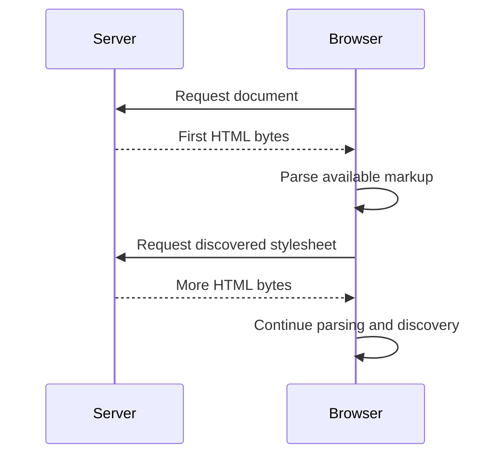
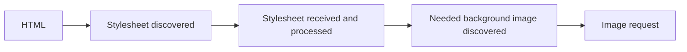
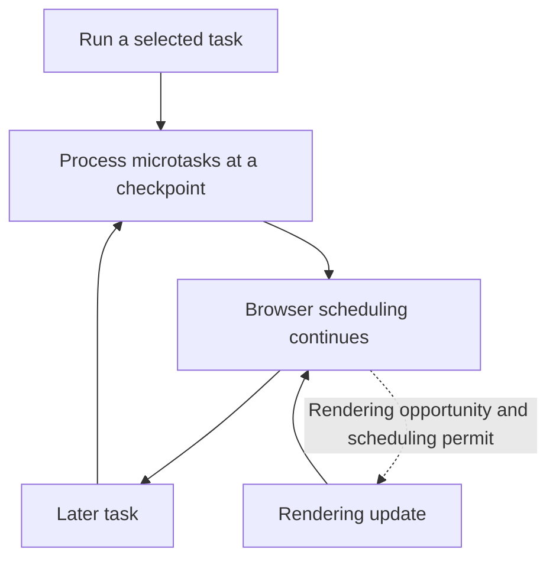
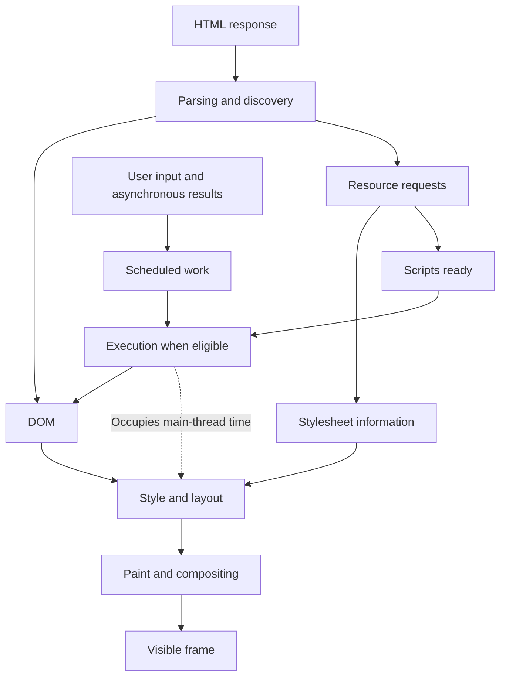

You open a product catalogue. Its heading appears, but the large image arrives later. You click **Load products** and nothing seems to happen. A moment later, the list and status message appear together. The network panel says the files have finished downloading, yet the page still feels slow.

Those symptoms can have different causes. The image URL might have been hidden inside JavaScript. The click handler might be doing too much synchronous work. The browser might have a changed document ready but no opportunity to present it. To distinguish these cases, we need to follow what the browser does between receiving a document and responding to a person.

This chapter follows that journey using a small page with a stylesheet, two scripts, an image, and a button. We will trace how resources become discoverable, how scripts interact with parsing, how the document becomes pixels, and how later work is scheduled. Then we will use DevTools to test those explanations. You need basic HTML, CSS, and JavaScript; no framework or browser-engine experience is assumed.

By the end, you should be able to explain a resource waterfall, predict the order of a small asynchronous example, and distinguish network delay from main-thread and rendering work. These are the foundations for the more detailed performance investigations in Chapter 15.

## The browser provides the runtime {#1-the-browser-as-an-application-runtime}

An application depends on more than the JavaScript language. The browser loads resources, constructs a document, applies styles, handles input, and presents frames. The JavaScript engine executes code within that environment, managing function calls, objects, and memory. Modern engines may interpret and compile code, including just-in-time optimization; understanding those implementation details is not a prerequisite for understanding the work our page causes.

The distinction between the language and its host explains why `document.querySelector()`, `fetch()`, timers, and `requestAnimationFrame()` are available in a browser. They are APIs provided by the environment, rather than language syntax like a function declaration. Storage APIs, including Web Storage, IndexedDB, and Cache Storage, extend that environment beyond the lifetime of a single function call. We will examine persistence in Chapter 10.

Browsers also use multiple processes and threads for such work as networking, image decoding, graphics, and isolation. The exact arrangement varies by browser and platform. A tab is not a reliable map of process boundaries, and a diagram of browser subsystems should not be mistaken for a literal thread diagram.

For this chapter, the important constraint is the page's **main thread**. Ordinary page JavaScript, DOM access, event handlers, and much of the style and layout work share limited execution time. Networking can progress while a script runs, but a long script can still delay the handling of input and the work needed for the next visible update. A worker can move some computation elsewhere; it does not give that worker direct access to the page's DOM.

We can now ask a more useful question about the catalogue: what must become available, and what work must finish, before the browser can show it?

## Follow the document from navigation to discovery {#2-from-navigation-to-resource-discovery}

Consider the address `https://shop.example.com/products?page=2`. The scheme is `https`, the host is `shop.example.com`, the path is `/products`, and the query string is `?page=2`. The URL identifies the resource being requested; later chapters will also use it to represent application state.

For a navigation that needs a network response, the browser may resolve the host through DNS and establish a secure connection. Cached DNS information and reusable connections can avoid some setup work. A fresh navigation to a new origin may incur those costs even when the requested file is small. This is why adding another origin for a font, image, or script can affect loading beyond the asset's byte size.

An HTTP request identifies the requested path and query. An illustrative HTTP/1.1 exchange begins like this:

```http
GET /products?page=2 HTTP/1.1
Host: shop.example.com
```

The response supplies metadata and a body:

```http
HTTP/1.1 200 OK
Content-Type: text/html; charset=utf-8
```

This is a readable representation, not the wire format of every HTTP version. Nor does every navigation require a fresh exchange: caches, service workers, and restored history entries can change the path. We will use an ordinary document response to understand the main dependencies.

### Processing can start before the response finishes

As HTML arrives, the browser can begin parsing it and discovering references to other resources. It does not generally wait for the entire document to download first.



This diagram shows dependencies and overlap, not measured durations. Response buffering, connection state, cache state, and browser scheduling all affect an actual waterfall.

### The page we will investigate {#a-small-running-example}

Use the following HTML as the common starting point for the chapter and its practical. The `legacy.js` name identifies a deliberately blocking script for comparison; it is not a recommendation to organize an application this way.

```html
<!doctype html>
<html lang="en">
  <head>
    <meta charset="utf-8">
    <meta name="viewport" content="width=device-width, initial-scale=1">
    <title>Browser Runtime Demo</title>
    <link rel="stylesheet" href="styles.css">
    <script src="legacy.js"></script>
    <script defer src="app.js"></script>
  </head>
  <body>
    <main>
      <h1>Products</h1>
      <button id="load-products" type="button">Load products</button>
      <p id="status" role="status"></p>
      
      <ul id="products"></ul>
    </main>
  </body>
</html>
```

The browser can discover `styles.css`, `legacy.js`, `app.js`, and `hero.webp` from this markup. Discovery alone does not tell us when each resource finishes or when its effects become visible. In particular, downloading a script and executing it are different events.

### Discovery creates dependencies {#resource-discovery-is-part-of-performance}

Compare the image in the HTML with this JavaScript alternative:

```js
const image = new Image();
image.alt = "Featured products";
image.width = 800;
image.height = 400;
image.src = "hero.webp";
document.querySelector("main").append(image);
```

Without another reference or hint for that image, the browser cannot discover this request until the script runs and assigns `src`. It does not have to wait for the element to be appended to start fetching. The image bytes are unchanged; the dependency that reveals their URL is different.

CSS can add another discovery step:

```css
.hero {
  background-image: url("hero-background.webp");
}
```

Here the browser must discover and process the stylesheet before it can identify the background resource through that rule. Whether a discovered resource is requested also depends on its use: declaring a font face, for example, does not necessarily download a font that no text needs. A preload or another reference can reveal the same URL earlier.



Resource size and discovery delay are separate questions. Compressing an image will not remove a two-second wait before JavaScript reveals its URL.

### Speculative discovery can look ahead {#the-preload-scanner-and-speculative-discovery}

The main HTML parser can pause for a script, but browsers may still inspect available markup ahead to find likely resource requests. This speculative mechanism is commonly called a **preload scanner**.

In our page, the main parser may be waiting for `legacy.js` while speculative discovery finds the deferred script or image farther down the available HTML. An image request beginning before normal parsing reaches the image is therefore not evidence that the parser ignored the blocking script.

The scanner cannot reliably discover resources that exist only as the result of executing JavaScript. It also cannot inspect HTML bytes that have not arrived or the contents of a stylesheet that has not been retrieved. Its exact implementation and scheduling vary; do not infer that every browser uses a particular dedicated thread.

### Resource hints should address an observed delay {#resource-hints}

When normal discovery is too late, a resource hint can expose useful information earlier:

| Hint | Intended purpose | Important limit |
| --- | --- | --- |
| `preload` | Start fetching a resource needed by the current page | Does not apply a stylesheet or execute a script by itself |
| `prefetch` | Speculatively fetch something for likely future use | May be ignored or deferred |
| `preconnect` | Start connection setup to an origin | Does not fetch the eventual resource |

For example, a font needed by the current page can be preloaded:

```html
<link rel="preload" href="/fonts/interface.woff2"
      as="font" type="font/woff2" crossorigin>
```

The eventual resource request needs compatible fetch settings so the preload can be reused. For fonts, the `crossorigin` attribute is relevant even for a same-origin preload. A preload that is unused or fetched incompatibly may waste bandwidth.

A possible next-page resource and a known remote origin use different hints:

```html
<link rel="prefetch" href="/next-page-data.json">
<link rel="preconnect" href="https://cdn.example.net">
```

These hints compete for finite network and processing resources. Add them to address an identified discovery or connection problem, then inspect whether they help. Speculative scanning is browser behavior; a preload link is information supplied by the author. They are related ideas, not the same mechanism.

## Build the DOM while scripts become available {#3-parsing-html-and-loading-scripts}

The HTML parser constructs the **Document Object Model**, or DOM. For the catalogue, it creates a `main` element containing a heading, button, status paragraph, image, and list. Text nodes and element relationships make this a live object structure that JavaScript can inspect and change.

HTML source and the DOM therefore describe different stages. This statement changes the DOM:

```js
document.querySelector("#status").textContent = "Products loaded";
```

It does not rewrite the original HTTP response. Comparing the response in the Network panel with the live document in the Elements panel makes that distinction visible.

### Why the parser waits for some scripts {#why-scripts-can-interrupt-parsing}

For an ordinary parser-inserted classic script such as `<script src="legacy.js"></script>`, parsing waits for the script to be available and execute. The script may inspect or modify the document at that point, so letting normal parsing continue past it could change observable behavior.

A classic script in the head cannot assume that the body has already been parsed. Our deliberately blocking script can demonstrate this safely:

```js
console.log("legacy sees heading:", Boolean(document.querySelector("h1")));
```

Placed as shown in the running example, it logs `false`. Moving the same script after the heading allows it to find the heading. That proves a difference in DOM availability, **not** a guarantee that the heading has already painted.

### Choose script timing deliberately {#classic-script-defer-async-and-modules}

The following comparison applies to scripts declared in the initial HTML, with external sources and successful loading. Dynamically inserted scripts have additional rules.

| Declaration | Fetching while parsing continues | Execution |
| --- | --- | --- |
| `<script src="app.js">` | Main parser waits when it reaches the script | At that parser position once ready |
| `<script defer src="app.js">` | Yes | After parsing, in document order among deferred classic scripts |
| `<script async src="app.js">` | Yes | When ready to execute; async scripts do not preserve document order |
| `<script type="module" src="app.js">` | Yes, including dependencies | Deferred by default; imports establish dependencies |

Each opening tag above needs its closing `</script>` tag in actual HTML. For example:

```html
<script defer src="library.js"></script>
<script defer src="application.js"></script>
```

The second deferred classic script runs after the first even if its download finishes earlier. By contrast, two async scripts must not depend on their order in the document. `async` changes when code becomes eligible; it does not move execution onto a background thread or make an expensive script harmless to input and rendering.

Modules support imports, exports, and module scope. They do not need `defer`; that attribute has no effect on module scripts. Adding `async` to a module changes the default deferred behavior. Later chapters will explore module graphs and asynchronous module evaluation; for this experiment, use a module without imports or top-level `await` so those do not obscure the loading comparison.

For external classic scripts, `defer` is useful when code needs the parsed document. It has no effect on an inline classic script. Putting a script at the bottom of the body can make preceding DOM nodes available, but explicit loading modes describe the intention more clearly than placement advice alone.

### Stylesheets can also delay script execution {#css-and-rendering}

A stylesheet does not normally stop the HTML parser directly. However, a parser-blocking script may need to wait for previously encountered stylesheets that block scripts. Scripts can inspect styles and geometry, so stylesheet readiness can affect their execution.

In the running page, `legacy.js` follows `styles.css`. A delayed stylesheet can therefore help hold the parser at the script even if the script has already downloaded. This indirect dependency explains why “CSS never affects parsing” would be misleading.

`DOMContentLoaded` marks a useful document-readiness milestone after parsing and the relevant deferred script processing. It does not mean all images have loaded or the page has painted. The window `load` event waits for additional load-delaying resources, but it is not a measure of continued responsiveness either. Neither event tells you that every future operation in the application is ready.

We now have a live document and rules for when scripts can change it. The next question is how the browser turns that state into a visible frame.

## Turn document state into pixels {#4-from-dom-and-cssom-to-pixels}

CSS contributes stylesheet information commonly described through the **CSS Object Model**, or CSSOM. Style calculation combines that information with the document: browser defaults, inheritance, selectors, and cascade rules determine the styles that apply. Chapter 3 explains how those rules are resolved.

For an initial page, applicable render-blocking stylesheets can delay presentation while the browser waits for necessary styling. This is distinct from stopping HTML parsing. A stylesheet for a nonmatching media condition, for example, does not have the same rendering effect as an applicable stylesheet in the head.

A useful conceptual pipeline is:


This is a model of responsibilities. Engines divide and cache the work differently, and an update need not repeat every stage.

### Style and layout determine what participates and where {#layout}

A DOM node does not necessarily generate a visible box. For example, `display: none` removes an element and its descendants from the generated box structure, while ordinary metadata in the head does not become page content. The term *render tree* is a useful way to explain the renderable structure, not a promise that all engines use one identical internal tree.

Layout calculates geometry: widths, heights, positions, and line wrapping. A card with `width: 50%` depends on its containing block, and a line of text depends on both available space and font metrics. New content or a changed font can therefore affect geometry elsewhere in the page.

Changing an element's width may invalidate layout for affected content:

```js
const list = document.querySelector("#products");
list.style.width = "300px";
```

Recalculating geometry is often called *reflow*. It does not imply that the browser starts the entire page from scratch. Engines try to limit and reuse work, and the extent of an update depends on the layout relationships involved.

### Paint, rasterization, and compositing produce the frame {#compositing}

Paint determines drawing information for text, backgrounds, borders, shadows, and images. Rasterization turns drawing information into pixels for surfaces or tiles. Compositing combines surfaces into the frame presented to the user.

Some transform and opacity updates can reuse existing painted content and avoid layout or additional paint. That depends on the content and the browser's layer decisions. Promoting everything to its own layer is not a general solution: layers consume memory and have management costs.

Compare these changes to an element:

```js
list.style.width = "320px";
list.style.transform = "translateX(20px)";
```

They are not equivalent visual operations. A width change can alter text wrapping and neighboring geometry; a transform changes visual placement without reallocating normal-flow space. Compare their trace categories to learn about rendering, not to conclude that one is an interchangeable replacement for the other.

### Reading geometry can bring layout forward {#layout-can-happen-again}

Browsers often defer rendering work so several mutations can be processed together. A synchronous geometry read can force the browser to update style and layout earlier if the requested result depends on invalidated information.

This example deliberately alternates a layout-affecting write and a geometry read for each row:

```js
const rows = [...document.querySelectorAll("#products li")];
const widths = [];
for (const row of rows) {
  row.style.width = "300px";
  widths.push(row.getBoundingClientRect().width);
}
console.log(widths);
```

Repeated write/read alternation can cause repeated layout work. If the program needs the new widths, it can instead perform the writes together and then collect the measurements:

```js
const rows = [...document.querySelectorAll("#products li")];
for (const row of rows) {
  row.style.width = "300px";
}
const widths = rows.map(row => row.getBoundingClientRect().width);
console.log(widths);
```

The first read may still require layout. The point is to avoid unnecessarily invalidating it between reads. Run these as separate alternatives after restoring the same starting styles. If the widths were already `300px`, repeating either snippet may do little, making the comparison misleading.

A geometry read making layout current still does not guarantee that the user has seen a new frame. Computation and presentation remain different events.

### The critical path is a dependency problem {#the-critical-rendering-path}

The critical rendering path is the work and dependencies needed to reach visible output. HTML provides structure, styles affect presentation, scripts may delay or change both, and images and fonts add availability and geometry considerations. Supplying an image's intended width and height can help reserve space, although the eventual layout still depends on CSS.

When the catalogue is slow, ask which dependency delayed the visible result. It may be the late discovery of an image, a required stylesheet, or work occupying the main thread. Chapter 15 develops measurement and optimization in depth; here the goal is to distinguish the categories before proposing a fix.

## Keep the page responsive after it loads {#5-javascript-scheduling-and-the-event-loop}

The page continues to run after its initial frame. A click invokes a handler, a timer becomes ready, a request completes, and application state changes. Those events need execution time, and some of their effects require another frame.

### The stack runs synchronous code to completion {#the-call-stack}

Function calls use an execution stack:

```js
function third() { console.log("third"); }
function second() { third(); }
function first() { second(); }
first();
```

At the deepest point, `third` is executing above `second` and `first`. As each call returns, its caller resumes. Ordinary synchronous code on this execution path is not interrupted by a timer callback just because the timer's delay has elapsed.

The browser tracks timers and other asynchronous operations outside the current call stack. Registering a click handler does not leave a function waiting on that stack; the handler is invoked when its event is dispatched. Calling a handler directly or dispatching an event from JavaScript can be synchronous, so not every function described as a “callback” implies a new task.

### Tasks and microtasks have different scheduling roles {#microtasks}

Timer callbacks and user-input processing are examples of work organized through tasks. The browser has multiple task sources; a single universal FIFO queue is too simple a model. Promise reactions and `queueMicrotask()` callbacks use microtasks, processed at checkpoints such as after a task finishes when JavaScript is no longer running.

Predict the output of this self-contained example:

```js
console.log("start");
setTimeout(() => console.log("timeout"), 0);
Promise.resolve().then(() => console.log("promise"));
console.log("end");
```

Its output is:

```text
start
end
promise
timeout
```

The synchronous logs run first. The reaction to the already-fulfilled Promise runs at a microtask checkpoint before the later timer task. A zero-delay timer does not mean “execute now”; its callback becomes eligible for later scheduling, subject to timer rules and other work. This example does not imply that every Promise settles before every timer - real network and other asynchronous operations have their own completion times.

### Rendering is scheduled, not promised after every task {#a-practical-event-loop-model}

For reasoning about this example, use the following model:



This is not a literal transcription of the specification's algorithms. Microtask checkpoints also occur in other specified places, and rendering has its own scheduling conditions. There need not be a paint between two timer callbacks or after every DOM mutation.

For a small visual update, `requestAnimationFrame()` asks for a callback associated with a rendering update:

```js
requestAnimationFrame(() => {
  document.querySelector("#products").style.transform = "translateX(20px)";
});
```

It is not an after-paint notification and does not make an expensive callback cheap. Frame opportunities depend on visibility, refresh conditions, and scheduling; do not assume a fixed 60 callbacks per second or use this API as a general background-work mechanism.

### A status change can be hidden by the work that follows {#dom-changes-do-not-instantly-become-pixels}

In `app.js`, this deliberately slow handler updates the DOM and then occupies the main thread:

```js
const button = document.querySelector("#load-products");
const status = document.querySelector("#status");
button.addEventListener("click", () => {
  status.textContent = "Working…";
  const start = performance.now();
  while (performance.now() - start < 200) {
    // A bounded demonstration of synchronous work, not application logic.
  }
  status.textContent = "Finished";
});
```

The intermediate DOM value exists during the handler, but the browser may never present it as a visible frame before it is replaced. The loop also delays other main-thread work. Some compositor activity can continue independently; the observation is not that every browser subsystem must stop.

Moving the same heavy calculation into a Promise callback would not turn it into background work. Neither does writing `async` before a function automatically move its synchronous body to a worker. Later chapters will discuss breaking up work and using workers when justified.

### A chain of microtasks can also delay progress {#microtasks-can-also-cause-problems}

A microtask checkpoint continues processing queued microtasks, including additional ones queued by callbacks. To observe the ordering without freezing a page indefinitely, use a bounded chain:

```js
let remaining = 100;
function next() {
  remaining -= 1;
  if (remaining > 0) queueMicrotask(next);
  else console.log("chain finished");
}
queueMicrotask(next);
setTimeout(() => console.log("timer ran"), 0);
```

The chain finishes before the timer callback. If each microtask added substantial work or the chain never ended, it could delay other tasks and rendering. Microtasks are useful for ordering work, not a way to escape main-thread cost.

Frameworks such as React and Vue change how updates are expressed and coordinated, but their eventual DOM work and page-level JavaScript still operate within these constraints. We will use this distinction when comparing their rendering models in Chapter 7.

## Test the model with DevTools {#6-seeing-the-browser-work-with-devtools}

Use a local HTTP server for the running example so script and module loading behave like a served page. A plain HTML/CSS/JavaScript folder is sufficient; a framework or build tool would add dependencies that are not needed for this investigation.

Different browsers expose different labels and tracks. The table describes the evidence to seek rather than a mandatory panel layout.

| Tool or view | Question to investigate | Limit of the evidence |
| --- | --- | --- |
| Elements / Inspector | How does the live document differ from the response? | A current DOM snapshot is not a record of past frames |
| Console | What values and callback order does the code produce? | Logging changes timing and does not prove a paint occurred |
| Network | When did requests start, and what initiated them? | A waterfall alone does not prove parser execution order |
| Sources / Debugger | What code ran, and which nodes existed at that point? | Pausing changes scheduling; do not benchmark a paused run |
| Performance / Profiler | Where did execution, layout, and painting consume time? | Track detail varies; absence of a labeled event is not universal proof |

`performance.getEntriesByType("resource")` can also expose timing entries for resources. It is not an unrestricted view of all network internals: cross-origin timing details may be restricted, and navigation timing is a separate entry type.

### Record conditions before comparing runs

Record the browser version, viewport, cache setting, and any network or CPU throttling. Keep those conditions stable across a comparison, then repeat it. Disabling a browser's HTTP cache does not necessarily clear every storage or service-worker effect. Use the small local page without a service worker for the first experiments.

The companion [Practical 01]() gives a complete observation brief. Its core investigations are:

1. **Resource discovery:** compare an image in markup with the same URL assigned by a delayed script. Use separate runs so an earlier request does not contaminate the comparison.
2. **Script timing:** change one loading declaration at a time and record DOM availability, execution order, and readiness events. Do not infer paint from a console message.
3. **Scheduling:** predict synchronous, microtask, and timer logs, then inspect a bounded slow handler in a trace.
4. **Rendering work:** compare a geometry change with a transform, and interleaved writes/reads with batched operations. Reset the initial state between runs.

These observations need not match a textbook's drawing pixel for pixel. A valuable result can be “the image was served from cache,” “the async script happened to run after parsing in these trials,” or “this trace does not expose compositing separately.” State what you observed and which explanation the evidence supports.

## Connect loading, rendering, and interaction {#7-putting-the-browser-mental-model-together}

Return to the page at the start of the chapter. The stylesheet and scripts are discovered from HTML, and speculative scanning may reveal later resources while the parser waits. The classic script can depend on an earlier stylesheet. The deferred application script can download early but waits for parsing before its normal execution. DOM and styling information then participate in rendering as scheduling permits; there is no universal rule that the first paint must precede or follow every deferred script.

After a click, a handler can change the DOM immediately while presentation happens later. The same page can therefore have finished its network requests and still respond poorly because computation or rendering work is expensive.



The arrows express relationships, not a compulsory total ordering or a map of engine threads. Keeping that distinction lets us use a simple model without turning its simplifications into false guarantees.

### Check the model against common misconceptions {#misconceptions-to-leave-behind}

| Claim | Better explanation |
| --- | --- |
| The browser waits for all HTML before starting | Parsing and discovery can proceed as bytes arrive |
| Download order determines script execution order | Script declarations and dependencies affect execution |
| CSS cannot delay parsing | A stylesheet can indirectly delay a parser-blocking script |
| Changing the DOM immediately paints the result | Rendering and presentation require later browser work |
| A Promise moves computation off the main thread | Promise reactions schedule microtasks in that environment |
| Every task is followed by a frame | Rendering opportunities and browser scheduling vary |
| Every mutation rerenders the whole page | Invalidated work depends on the change and layout relationships |
| More preloads or more layers are always faster | Both consume resources and need a measured justification |

## Chapter summary {#chapter-summary}

A page loads through dependencies that can overlap: bytes arrive, markup reveals requests, and scripts become eligible to execute. HTML supplies the source; the DOM is the live document scripts can change. Styles contribute to geometry and visual output, while paint, rasterization, and compositing help produce frames.

After loading, execution and presentation continue to compete for time. Tasks, microtasks, and rendering updates have distinct scheduling roles. A program can change state correctly and still respond poorly if it prevents the browser from making progress on the next interaction or frame.

Use that model to choose an investigation. Look at the waterfall for discovery and transfer questions, inspect the DOM for structural changes, and examine a performance trace for main-thread and rendering work. Identify the dependency or work involved before choosing an optimization.

## Review questions {#review-questions}

1. An image is small but starts loading two seconds after navigation. Which discovery paths would you investigate before compressing it further?
2. A stylesheet is still downloading and a later classic script has already arrived. Why might that script - and therefore parsing - still wait?
3. Two deferred classic scripts download in reverse order. Which executes first? How would `async` change the reasoning?
4. Why does a default module script not need `defer`? What assumption changes when `async` is added?
5. A script finds a heading in the DOM. What does that establish, and what does it not establish about the screen?
6. Why can a width change affect other elements? Why is a transform not necessarily an equivalent substitute?
7. What can cause a geometry read to force layout? How can batching reduce repeated work without eliminating layout altogether?
8. Explain `start`, `end`, `promise`, `timeout` in the scheduling example. Which parts of that example make the ordering predictable?
9. Why might “Working…” never be displayed in the slow click handler? Would replacing the loop with a Promise callback guarantee a frame?
10. How can a microtask chain delay a timer? Why is a bounded demonstration preferable to an endless chain?
11. How would you distinguish a request delay from an expensive handler using browser tools?
12. Which observations would you repeat under controlled conditions before making a performance claim?

## Practical: observe one page from navigation to interaction {#end-of-chapter-practical-lab--observe-a-page-from-navigation-to-interaction}

Complete [Practical 01: Browser observation]() using the running page. Submit your predictions, a small evidence table, and an explanation of one observation that differed from your expectation. The [Chapter 1 slides]() provide a shorter sequence for discussion or teaching.

The core task is observation and explanation. A fixed-height virtual list is an optional extension for readers ready to compare DOM size and rendering work. Its fuller performance investigation belongs with [Chapter 15](); it is not required to understand this chapter or a promise of improved performance.

## Key terms {#key-terms}

| Term | Meaning in this chapter |
| --- | --- |
| Browser runtime | The environment providing document, network, script, rendering, event, storage, and other services |
| DOM | The live object representation of the document |
| CSSOM | Object-model access to stylesheet information; engines also maintain internal style structures |
| HTML parser | The processing machinery that constructs a document from markup |
| Speculative resource discovery / preload scanner | Inspection of available markup ahead of normal parsing progress to find likely requests |
| Parser-blocking script | A script that makes the parser wait for its loading or execution |
| Critical rendering path | Dependencies and work needed to reach visible output |
| Style calculation | Resolving the styles that apply to elements |
| Layout / reflow | Calculating or recalculating geometry and positions |
| Paint | Producing drawing information for visual content |
| Rasterization | Turning drawing information into pixels |
| Compositing | Combining surfaces into a presented frame |
| Call stack | The active sequence of nested execution contexts |
| Task | A unit of scheduled work, such as timer callback processing |
| Microtask | Work such as a Promise reaction processed at a microtask checkpoint |
| Event loop | Coordination of scheduled work and microtask checkpoints in an execution environment |
| Deferred classic script | An external classic script that waits until parsing completes and preserves deferred-script order |
| Async script | A script eligible to execute when ready without document-order guarantees among async scripts |
| Module script | A script using module scope and dependencies, deferred by default unless made async |
| Preload | A request to fetch a current-page resource earlier |
| Prefetch | A speculative request for a resource likely to be useful later |
| Preconnect | A hint to start connection setup to an origin |

## From browser behavior to document meaning {#closing-perspective}

We can now explain why two pages with the same assets may load differently, and why a downloaded application may still feel unresponsive. The next step is to decide what the document should express before scripts enhance it. [Chapter 2]() takes that question into semantic structure, accessible interaction, language, and the DOM.
