A browser can render almost any page constructed entirely from unstyled `<div>` and `<span>` elements. With suitable CSS, two interfaces can appear visually identical on a screen. Yet to the browser runtime, to search engines, to assistive technologies, and to automated tools, they communicate completely different information.

Consider two markup choices for a public service header:

```html
<!-- Generic markup -->
<div class="heading">Citizen Services</div>
<div class="navigation">
  <div class="link" onclick="goTo('/')">Home</div>
  <div class="link" onclick="goTo('/requests')">My Requests</div>
</div>
```

```html
<!-- Semantic markup -->
<h1>Citizen Services</h1>
<nav aria-label="Primary">
  <a href="/">Home</a>
  <a href="/requests">My Requests</a>
</nav>
```

A stylesheet can make both look like polished navigation. But only the second version communicates what the elements *are*. The browser immediately knows that the text is the primary heading, that the links represent a navigation landmark, that keyboard users can tab between them using standard keys, and that assistive tools can present them in a structured table of contents.

Semantic HTML is not an aesthetic preference or an entry-level topic to be superseded by frameworks. It is the foundation of front-end architecture. The HTML document represents the canonical data structure of the user interface.

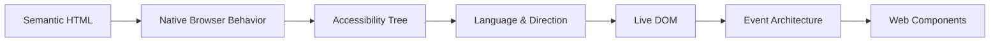

These layers are not separate concerns. The browser parses semantic HTML to construct the Document Object Model (DOM). From that DOM, it creates the accessibility tree, applies language and text-direction algorithms, manages focus and keyboard input, and dispatches events. When markup accurately models the interface, the browser does heavy lifting automatically. When markup degrades into generic containers, developers must write fragile JavaScript to reconstruct the missing behaviors.

In this chapter, we develop a cohesive mental model across these systems using a single running application: a multilingual public-service portal.

---

## 1. HTML Describes Meaning, Not Appearance {#1-html-describes-meaning-not-appearance}

HTML is an interface definition language. It declares the identity, hierarchy, and capabilities of content. When an author chooses an element, they declare its role to the platform:

* **Headings (`<h1>`–`<h6>`)** define the conceptual outline of the document.
* **Landmarks (`<main>`, `<nav>`, `<header>`, `<footer>`)** partition the page into major functional zones.
* **Interactive controls (`<button>`, `<a>`, `<input>`, `<select>`)** expose native states, focus hooks, and event contracts.
* **Language and direction metadata (`lang`, `dir`)** guide text shaping, punctuation ordering, and pronunciation engines.

CSS determines how content is rendered visually; HTML determines what content *means*.

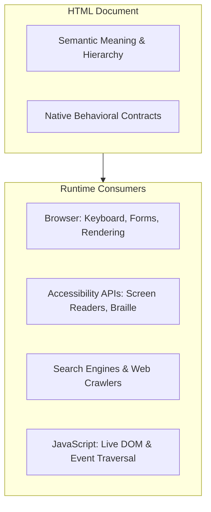

### The Running Example: A Multilingual Service Portal {#a-running-example-a-public-service-portal}

To observe how these platform layers interact, we will follow a public-service portal designed for citizens to request certificates and inspect previous applications. The interface includes:

1. A site header with primary navigation.
2. A main region containing a document request form with validation.
3. A table of recent service requests.
4. Bidirectional text support handling both English (`en`) and Central Kurdish (`ckb`) or Arabic (`ar`).
5. A lightweight custom notification element (`<service-alert>`) that encapsulates a status message without breaking semantic hierarchy.

---

## 2. Building a Meaningful Document Structure {#2-building-a-meaningful-document-structure}

Document structure creates the conceptual map that all consumers rely on. Sighted users deduce hierarchy from font sizes, margins, colors, and layout positions. Software agents, search indexes, and screen-reader users require explicit programmatic hierarchy.

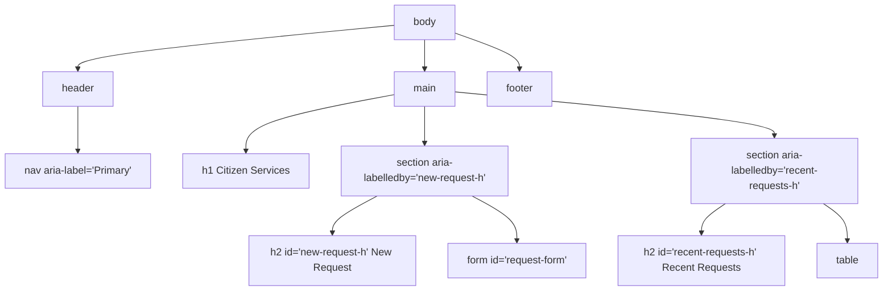

### Headings Create Content Hierarchy {#headings-create-content-hierarchy}

HTML provides six levels of headings, `<h1>` through `<h6>`. These tags declare levels in an outline, not font sizes:

```html
<h1>Citizen Services</h1>
<section>
  <h2>Identity & Civil Status</h2>
  <section>
    <h3>Request National ID Card</h3>
    <h3>Replace Damaged Document</h3>
  </section>
  <h2>Housing & Residency</h2>
  <section>
    <h3>Certificate of Residence</h3>
  </section>
</section>
```

A common anti-pattern is skipping heading levels (for example, jumping from `<h1>` directly to `<h4>`) to achieve a desired visual scale. Heading levels should advance incrementally without gaps. Visual appearance should be managed exclusively through CSS classes.

Screen readers provide shortcut commands enabling users to jump between headings or review the heading outline. A broken heading structure turns document navigation into an unpredictable puzzle.

### Do Not Rely on an Automatic Document Outline {#do-not-rely-on-an-imaginary-automatic-document-outline}

Early drafts of the HTML5 specification proposed an automatic heading outline algorithm where nesting `<h1>` tags inside `<section>` or `<article>` would dynamically compute heading levels. 

Browser vendors and assistive technology engines never implemented this algorithm due to performance and compatibility costs. Modern standards explicitly advise against relying on it. Developers must use explicit `<h1>` through `<h6>` tags reflecting real structural depth.

### Structural Landmarks and Sectioning Elements {#structural-elements-and-what-they-mean}

HTML landmark elements allow users to bypass repetitive content and navigate directly to significant page areas:

* `<main>`: Represents the dominant content unique to the document. There must be only one visible `<main>` landmark per page. It must not be nested within `<header>`, `<footer>`, or `<nav>`.
* `<nav>`: Identifies major navigation groups. When multiple `<nav>` landmarks exist on a page (such as primary site navigation and breadcrumb navigation), provide unique labels via `aria-label` to distinguish them:
  ```html
  <nav aria-label="Primary">...</nav>
  <nav aria-label="Breadcrumb">...</nav>
  ```
* `<header>`: Represents introductory content, commonly containing a site heading, logo, search tool, or navigation bar.
* `<footer>`: Contains metadata about its nearest sectioning ancestor or the page, including copyright, legal notices, and contact information.
* `<section>`: A generic standalone section of a document. A `<section>` should typically contain a heading defining its topic. If a container exists purely for CSS layout or styling hooks, use a `<div>` instead.
* `<article>`: An independent, self-contained composition that is syndicatable or reusable in another context, such as a blog post, news story, or user forum entry.
* `<aside>`: Content tangentially related to the main content, such as related links, callout cards, or glossaries.

### Data Structures: Lists, Tables, and Figures {#lists-tables-figures-and-media-carry-meaning-too}

Document data requires tailored markup to preserve relationship context:

* **Lists (`<ul>`, `<ol>`, `<dl>`)**: Screen readers inform users of the number of items in a list before reading them. Use `<ol>` when the sequential order is meaningful (e.g. procedural steps for an application) and `<ul>` when order is arbitrary. Use `<dl>` (description list) with `<dt>` (term) and `<dd>` (description) for glossaries, metadata key-value pairs, or settings.
* **Tables (`<table>`)**: Tables must be reserved for two-dimensional tabular data, never layout. Always include a `<caption>` summarizing the table's purpose, explicit headers (`<th>`) with `scope="col"` or `scope="row"`, and clean sectioning (`<thead>`, `<tbody>`):
  ```html
  <table>
    <caption>Recent Citizen Service Applications</caption>
    <thead>
      <tr>
        <th scope="col">Reference</th>
        <th scope="col">Service Type</th>
        <th scope="col">Submission Date</th>
        <th scope="col">Status</th>
      </tr>
    </thead>
    <tbody>
      <tr>
        <th scope="row">SR-1042</th>
        <td>Residence Certificate</td>
        <td>2026-09-12</td>
        <td>Under Review</td>
      </tr>
    </tbody>
  </table>
  ```
* **Images and Alternative Text (``)**: The `alt` attribute specifies an accessible description. If an image is informational, provide concise alternative text communicating its meaning. If an image is purely decorative, provide an empty attribute (`alt=""`) so screen readers skip it cleanly. Omitting `alt` entirely forces screen readers to announce the raw image URL.

---

## 3. Native Controls and Form Interaction Systems {#5-native-controls-are-more-powerful-than-they-look}

Building user interfaces on the web often tempts engineers to reinvent interactive controls using generic containers (`<div>` or `<span>`). This introduces significant accessibility and usability deficits.

### Buttons Versus Links {#buttons-perform-actions}

The distinction between `<button>` and `<a>` is fundamental:

| Element | Primary Purpose | Default Interaction | Expected Activation |
| :--- | :--- | :--- | :--- |
| `<button>` | Performs an in-page action, triggers a dialog, or submits data | Dispatches action logic without URL changes | `Enter` and `Space` |
| `<a href="...">` | Navigates the user to a new document, URL, or anchor fragment | Changes browser location and history | `Enter` |

Styling does not alter an element's identity. A button styled to look like plain blue text is still a button. A link styled to resemble a pill-shaped button is still a link. Choose the element based on whether the user is *performing an action* or *navigating to a destination*.

### The Clickable `<div>` Anti-Pattern {#the-clickable-div-problem}

Consider replacing a button with a `<div>`:

```html
<!-- Faulty custom button -->
<div class="submit-btn" onclick="submitRequest()">Submit Application</div>
```

To make this `<div>` equivalent to a native `<button>`, a developer must manually:
1. Add `tabindex="0"` to make it focusable in keyboard tab order.
2. Add `role="button"` so assistive technologies announce it as a control.
3. Add a `keydown` listener listening for `Enter` and `Space`.
4. Prevent default scrolling behavior on `Space`.
5. Manage `aria-disabled="true"` and block clicks when disabled.
6. Support form submission lifecycles.

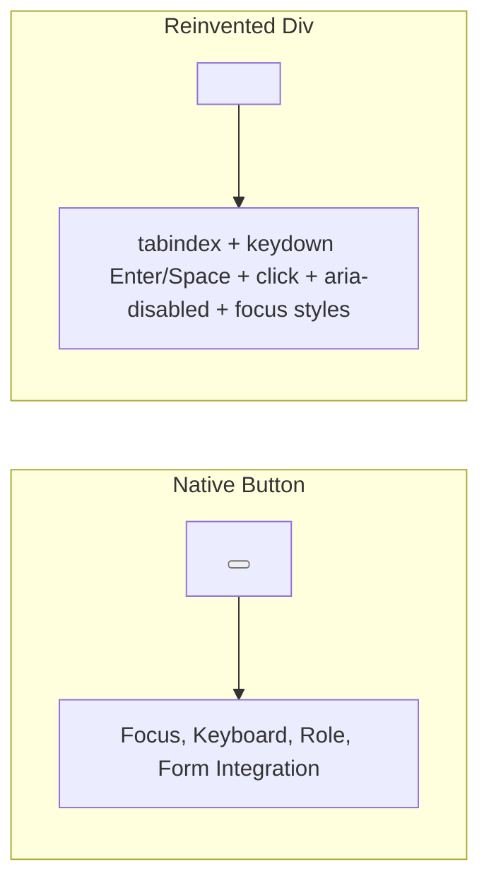

Native controls provide all of these behaviors automatically, robustly, and with zero custom JavaScript.

### Forms as an Accessible Interaction System {#9-forms-are-an-accessibility-system-not-just-input-boxes}

Forms represent the primary mechanism for collecting user data. A robust form coordinates labels, controls, grouping, validation, and error messaging:

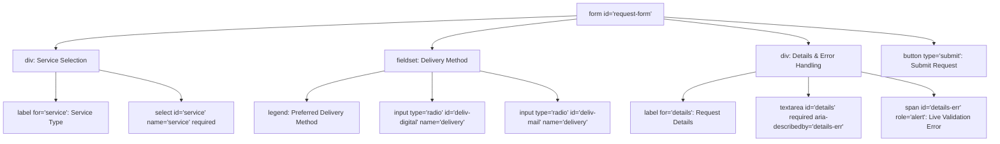

#### Explicit Labeling

Every form control must have an associated programmatic label. Placeholder text is not a substitute for a label: placeholders disappear once text is entered, often suffer from poor contrast, and are not reliably announced as labels by screen readers.

Use explicit `for` attributes matching control `id`s:

```html
<label for="user-email">Email Address</label>
<input type="email" id="user-email" name="email" required autocomplete="email">
```

#### Grouping Controls with `<fieldset>` and `<legend>`

When multiple controls together answer a single question - such as radio buttons or checkbox groups - group them inside a `<fieldset>` with an explanatory `<legend>`:

```html
<fieldset>
  <legend>Preferred Notification Channel</legend>
  <div>
    <input type="radio" id="channel-sms" name="channel" value="sms">
    <label for="channel-sms">SMS Text Message</label>
  </div>
  <div>
    <input type="radio" id="channel-email" name="channel" value="email" checked>
    <label for="channel-email">Email Notification</label>
  </div>
</fieldset>
```

When a user tabs into any radio button, assistive technologies announce both the specific radio button's label and the overarching group legend.

#### Validation and Error Associations

HTML provides declarative validation attributes such as `required`, `pattern`, `minlength`, `maxlength`, `min`, and `max`.

When an input is invalid, associate the error message directly with the input using `aria-describedby` and indicate the invalid state with `aria-invalid="true"`:

```html
<div>
  <label for="national-id">National ID Number</label>
  <input 
    type="text" 
    id="national-id" 
    name="national_id" 
    required 
    pattern="[A-Z]{2}[0-9]{6}" 
    aria-invalid="true" 
    aria-describedby="national-id-error national-id-hint"
  >
  <p id="national-id-hint">Format: 2 capital letters followed by 6 digits (e.g., AB123456).</p>
  <p id="national-id-error" role="alert">Please enter a valid National ID in the required format.</p>
</div>
```

---

## 4. Keyboard Interaction and Focus Management {#8-keyboard-interaction-is-part-of-the-interface}

Every function available via a mouse or touchscreen must be completely operable using only a keyboard.

### The Natural Focus Order {#focus-order}

By default, interactive HTML elements (`<a>`, `<button>`, `<input>`, `<select>`, `<textarea>`, `<details>`) are part of the sequential keyboard navigation order (the "tab sequence"). The tab order follows the document source order.

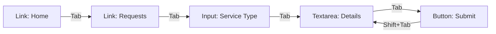

### The `tabindex` Attribute

* `tabindex="0"`: Inserts an element into the default sequential tab order according to its source position. Useful for custom focusable controls.
* `tabindex="-1"`: Removes an element from sequential tab navigation, but allows it to be focused programmatically via JavaScript (`element.focus()`). Essential for modal dialogs, error banners, and composite widgets.
* `tabindex="1"` (or any positive integer): **Anti-pattern.** Positive tabindex values override document order, creating confusing and fragile navigation jumps. Never use positive `tabindex`.

### Visible Focus Indicators

Browsers render a default focus outline around active elements. Removing this outline without a distinct replacement creates an inaccessible interface:

```css
/* Unacceptable: destroys keyboard usability */
:focus {
  outline: none;
}

/* Recommended: distinct, high-contrast focus rings */
:focus-visible {
  outline: 3px solid #005a9c;
  outline-offset: 2px;
}
```

The `:focus-visible` pseudo-class allows designers to display focus rings primarily when an element is operated via keyboard, avoiding intrusive rings during mouse clicks while preserving accessibility.

---

## 5. The Accessibility Tree and Accessible Names {#6-accessibility-begins-with-structure}

The browser parses the DOM and translates its semantic structure into the **Accessibility Tree**. Platform accessibility APIs (such as UI Automation on Windows, AXAPI on macOS, and ATK on Linux) expose this tree to assistive technologies.

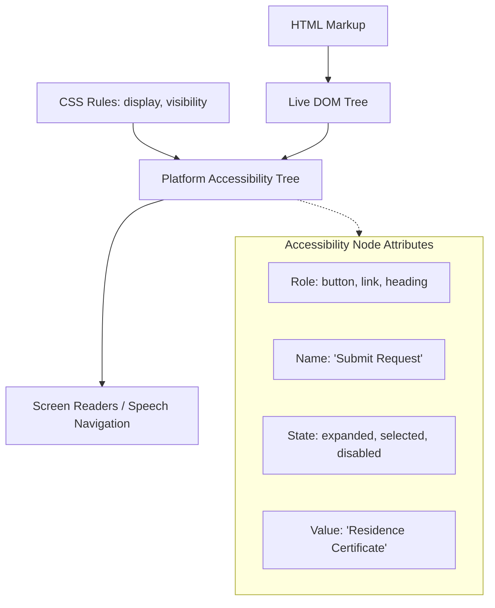

### Accessible Name Computation {#7-the-accessible-name}

Every interactive control must have an **accessible name** - the string announced by assistive technologies to describe the element's identity.

The browser computes an accessible name using a standardized priority sequence:

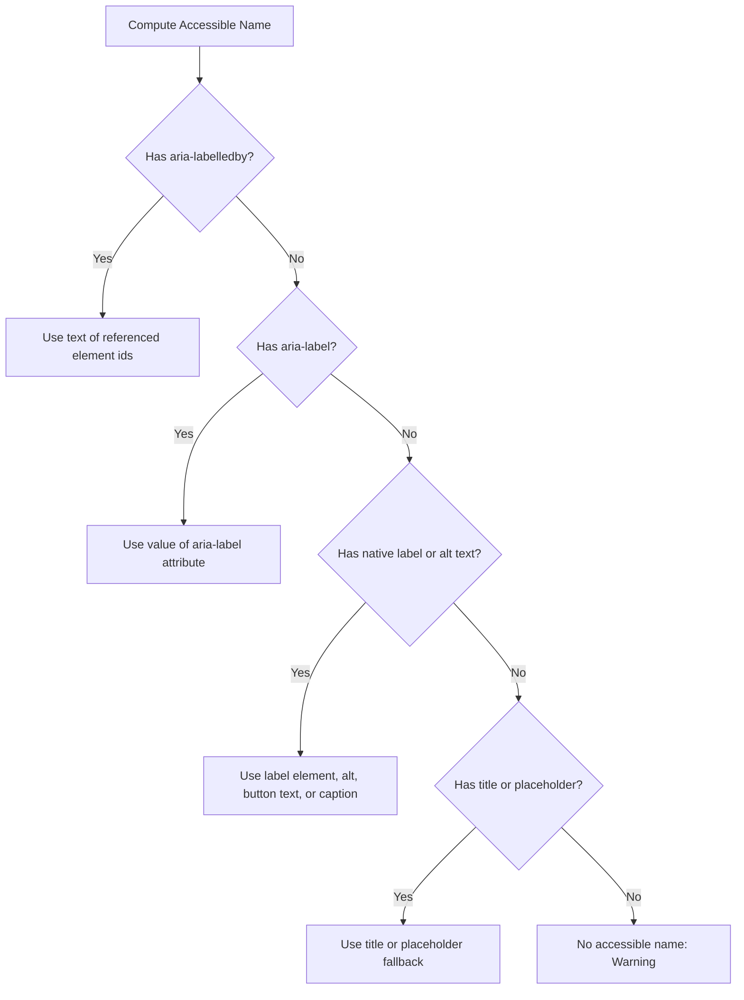

For buttons with icons, omitting text creates an unnamed control:

```html
<!-- Faulty: accessible name is empty -->
<button type="button">
  <svg aria-hidden="true" width="16" height="16">...</svg>
</button>

<!-- Correct: accessible name declared via aria-label -->
<button type="button" aria-label="Refresh requests">
  <svg aria-hidden="true" width="16" height="16">...</svg>
</button>
```

### The Rules of ARIA {#10-aria-add-semantics-only-when-html-cannot-express-them}

**WAI-ARIA** (Accessible Rich Internet Applications) provides attributes to supplement HTML semantics. ARIA does not alter browser behavior, handle events, or manage keyboard navigation; it only changes what is announced in the accessibility tree.

> **First Rule of ARIA:** If you can use an existing native HTML element or attribute with the semantics and behavior you require already built in, do so instead of re-purposing an element and adding ARIA.

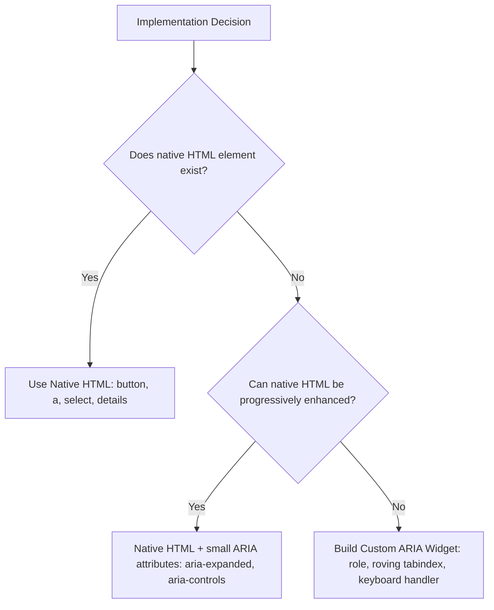

#### Common ARIA Attributes:

* `role`: Declares what an element represents (e.g. `role="status"`, `role="tab"`, `role="dialog"`).
* `aria-expanded="true|false"`: Communicates whether an associated collapsible section is open or closed.
* `aria-haspopup="dialog|menu|listbox"`: Informs users that activating the control triggers a popup container.
* `aria-live="polite|assertive"`: Defines a live region where dynamic text updates are announced to screen-reader users without interrupting current actions.

---

## 6. Internationalization: Language and Directionality {#11-internationalization-begins-in-html}

Web applications operate across global linguistic boundaries. Internationalization starts at the root of the document.

### Declaring Document Language {#declare-the-document-language}

The `lang` attribute declares the human language using standard BCP 47 language tags:

```html
<html lang="en">
```

For multilingual documents, declare language switches on child elements:

```html
<p lang="en">Your document application has been approved.</p>
<p lang="ckb" dir="rtl">داواکارییەکەت بۆ بەڵگەنامە پەسەند کرا.</p>
```

Declaring the correct language ensures:
* Screen readers choose appropriate phoneme pronunciation engines.
* Browsers apply correct hyphenation and spell-checking dictionaries.
* CSS `:lang(...)` selectors apply language-specific font pairings and quotation marks.

### Language Does Not Automatically Set Direction {#12-language-does-not-automatically-determine-direction}

A pervasive misconception is that setting an RTL language tag (such as `lang="ar"` or `lang="ckb"`) automatically sets text direction.

It does not. The `lang` attribute communicates vocabulary and pronunciation; the `dir` attribute communicates base text direction. Both must be declared explicitly:

```html
<!-- Fully declared RTL root -->
<html lang="ckb" dir="rtl">
```

The three valid values for `dir` are:
* `dir="ltr"`: Left-to-right text flow.
* `dir="rtl"`: Right-to-left text flow.
* `dir="auto"`: The browser inspects the first character of the element with strong directional property and dynamically applies LTR or RTL.

`dir="auto"` is essential for user-submitted content (such as search queries, comments, or citizen request notes) where the language cannot be predicted in advance.

### Bidirectional Text and Isolation {#13-bidirectional-text-is-more-than-alignment}

When right-to-left and left-to-right text are mixed in a single sentence, the **Unicode Bidirectional Algorithm (UBA)** determines ordering. Without explicit isolation, trailing punctuation or mixed Latin IDs can display in incorrect visual order.

```html
<!-- Faulty: Trailing ID can scramble adjacent punctuation -->
<p dir="rtl">ژمارەی داواکاری: SR-1042.</p>

<!-- Correct: Use <bdi> to isolate bidirectional runs -->
<p dir="rtl">
  ژمارەی داواکاری: <bdi>SR-1042</bdi>.
</p>
```

* `<bdi>` (Bidirectional Isolate): Isolates a text fragment so its internal bidirectional character properties cannot leak out and corrupt the direction of surrounding text.
* `<bdo>` (Bidirectional Override): Strictly overrides the bidirectional algorithm to render characters strictly in the declared visual order.

### RTL Is Not "Mirror Everything" {#14-rtl-is-not-mirror-everything}

Transitioning an interface to RTL layout flips structural flow (margins, padding, column order, navigation arrows), but several elements remain strictly LTR:
* Phone numbers (`+964 750 ...`) and mathematical formulas.
* Code snippets and URLs.
* Media playback timelines (audio/video progress bars advance left-to-right universally).
* Physical device icons (e.g. keyboards, volume sliders).

---

## 7. The Live DOM and Event Architecture {#15-the-dom-html-becomes-a-live-tree}

The Document Object Model (DOM) is an object-oriented representation of the web page. HTML is static source markup; the DOM is the live tree of nodes in browser memory that scripts read and modify.

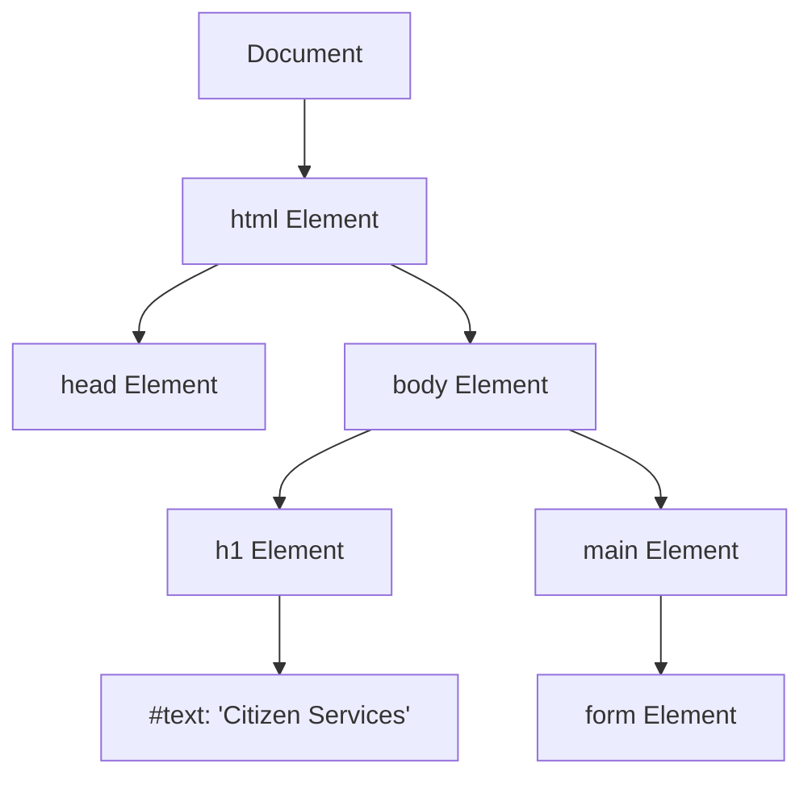

### Nodes Versus Elements {#16-nodes-and-elements}

* `Node`: The generic interface from which all objects in the DOM inherit. Includes elements, text nodes (`Text`), comment nodes (`Comment`), and the root document (`Document`).
* `Element`: A specific subclass of `Node` representing an HTML or SVG element (such as `<button>` or `<p>`).

When inspecting `node.childNodes`, text formatting whitespace creates text nodes. When inspecting `element.children`, only element nodes are returned.

### Querying and Safe DOM Mutation {#17-querying-the-dom}

Modern DOM programming relies on expressive query methods:
* `document.getElementById('id')`: Fastest lookup for known unique IDs.
* `element.querySelector('.selector')`: Returns the first matching element.
* `element.querySelectorAll('.selector')`: Returns a static `NodeList` of all matches.

```javascript
// Safe DOM node creation
const newRow = document.createElement('tr');

const refCell = document.createElement('th');
refCell.scope = 'row';
refCell.textContent = 'SR-1043'; // Safe from XSS: treated strictly as text

const serviceCell = document.createElement('td');
serviceCell.textContent = 'Residence Certificate';

newRow.append(refCell, serviceCell);
document.querySelector('#request-rows').append(newRow);
```

#### `textContent` Versus `innerHTML`

* `element.textContent`: Reads or sets the text content of a node and its descendants. It treats input purely as raw characters, preventing Cross-Site Scripting (XSS) attacks.
* `element.innerHTML`: Parses strings into HTML markup. Using `innerHTML` with unsanitized user data allows malicious actors to inject arbitrary scripts and compromise user sessions. Always prefer `textContent` or modern DOM creation APIs (`append`, `replaceChildren`).

### Attributes Versus Live DOM Properties {#20-attributes-and-properties-are-related-but-not-identical}

An **attribute** represents markup declared in HTML; a **DOM property** is a live property on the JavaScript object:

```html
<input type="text" id="username" value="guest">
```

```javascript
const input = document.getElementById('username');

console.log(input.getAttribute('value')); // 'guest' (the initial attribute)
console.log(input.value);                // 'guest' (the current property)

// User types 'polla' into the input box:
console.log(input.getAttribute('value')); // Still 'guest'!
console.log(input.value);                // 'polla' (reflects live state)
```

Attributes initialize properties. When writing interactive code, read live properties to access current state.

### Event Architecture: Propagation and Delegation {#21-the-event-system-connects-users-to-the-dom}

User interactions (clicks, keypresses, input changes) trigger events that traverse the DOM tree in three distinct phases:

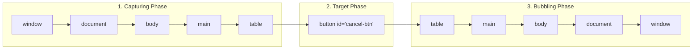

1. **Capturing Phase:** The event travels down from `window` through ancestors to the target element.
2. **Target Phase:** The event arrives at the innermost element that triggered the interaction (`event.target`).
3. **Bubbling Phase:** The event bubbles back up through ancestors toward `window`.

Most UI events bubble. This behavior enables **Event Delegation**: instead of attaching separate event listeners to dozens of individual buttons or table rows, attach a single listener to their common container.

```javascript
// Event Delegation on Table Container
const tableBody = document.querySelector('#request-rows');

tableBody.addEventListener('click', (event) => {
  // Find the closest actionable button within the clicked target hierarchy
  const button = event.target.closest('button[data-action]');
  if (!button || !tableBody.contains(button)) return;

  const action = button.dataset.action;
  const requestId = button.closest('tr')?.dataset.requestId;

  if (action === 'cancel' && requestId) {
    cancelRequest(requestId);
  }
});
```

#### Key Event Distinctions:

* `event.target`: The actual element where the event originated (e.g. an icon inside a button).
* `event.currentTarget`: The element to which the currently executing event listener is attached.
* `event.preventDefault()`: Prevents the browser's default action (such as submitting a form or following a link) without stopping event propagation.
* `event.stopPropagation()`: Stops the event from propagating further up or down the DOM tree.

---

## 8. The Complete Multilingual Service Interface {#26-a-multilingual-service-interface}

We now assemble these concepts into the comprehensive public-service portal.

```html
<!doctype html>
<html lang="en" dir="ltr">
  <head>
    <meta charset="utf-8">
    <meta name="viewport" content="width=device-width, initial-scale=1">
    <title>Citizen Service Portal</title>
    <link rel="stylesheet" href="styles.css">
    <script defer src="app.js"></script>
  </head>
  <body>
    <header>
      <a href="/" class="brand-link">Citizen Portal</a>
      <nav aria-label="Primary">
        <ul>
          <li><a href="/services" aria-current="page">Services</a></li>
          <li><a href="/requests">My Applications</a></li>
          <li><a href="/contact">Support</a></li>
        </ul>
      </nav>
    </header>

    <main id="main-content">
      <h1>Citizen Document Requests</h1>

      <section aria-labelledby="form-heading">
        <h2 id="form-heading">Submit a New Request</h2>

        <form id="request-form" novalidate>
          <div class="form-field">
            <label for="service-select">Select Service <span aria-hidden="true">*</span></label>
            <select id="service-select" name="service" required>
              <option value="">-- Choose an option --</option>
              <option value="residence">Certificate of Residence</option>
              <option value="identity">National ID Replacement</option>
              <option value="birth">Civil Record Copy</option>
            </select>
          </div>

          <div class="form-field">
            <label for="applicant-notes">Details / Statement <span aria-hidden="true">*</span></label>
            <textarea 
              id="applicant-notes" 
              name="notes" 
              dir="auto" 
              rows="4" 
              required 
              aria-describedby="notes-hint notes-error"
            ></textarea>
            <p id="notes-hint" class="hint">You may enter details in Kurdish, Arabic, or English.</p>
            <p id="notes-error" class="error-msg" role="alert" hidden></p>
          </div>

          <button type="submit">Submit Request</button>
        </form>

        <p id="submission-status" role="status" class="status-region" aria-live="polite"></p>
      </section>

      <section aria-labelledby="table-heading">
        <h2 id="table-heading">Recent Applications</h2>

        <table>
          <caption>Current processing queue for your account</caption>
          <thead>
            <tr>
              <th scope="col">Reference</th>
              <th scope="col">Service Type</th>
              <th scope="col">Notes (Multilingual)</th>
              <th scope="col">Status</th>
              <th scope="col">Actions</th>
            </tr>
          </thead>
          <tbody id="request-rows">
            <tr data-request-id="SR-1042">
              <th scope="row">SR-1042</th>
              <td>Certificate of Residence</td>
              <td><bdi dir="auto">نیشتەجێبوونی هەولێر</bdi></td>
              <td><span class="badge badge-pending">Processing</span></td>
              <td><button type="button" data-action="cancel" aria-label="Cancel application SR-1042">Cancel</button></td>
            </tr>
          </tbody>
        </table>
      </section>
    </main>

    <footer>
      <p>&copy; 2026 Directorate of Public Informatics & Citizen Services.</p>
    </footer>
  </body>
</html>
```

### The Accompanying Application Logic

```javascript
// app.js - Live DOM, Validation, Delegation, and Accessibility Updates
document.addEventListener('DOMContentLoaded', () => {
  const form = document.querySelector('#request-form');
  const serviceSelect = document.querySelector('#service-select');
  const notesTextarea = document.querySelector('#applicant-notes');
  const notesError = document.querySelector('#notes-error');
  const statusRegion = document.querySelector('#submission-status');
  const tableBody = document.querySelector('#request-rows');

  // Form submission handler with programmatic validation
  form.addEventListener('submit', (event) => {
    event.preventDefault();
    notesError.hidden = true;
    notesError.textContent = '';
    notesTextarea.removeAttribute('aria-invalid');

    if (!form.checkValidity()) {
      if (!notesTextarea.value.trim()) {
        notesTextarea.setAttribute('aria-invalid', 'true');
        notesError.textContent = 'Please provide statement details before submitting.';
        notesError.hidden = false;
        notesTextarea.focus();
      }
      return;
    }

    const serviceName = serviceSelect.options[serviceSelect.selectedIndex].text;
    const notesValue = notesTextarea.value.trim();
    const newId = `SR-${Math.floor(1000 + Math.random() * 9000)}`;

    // Create new table row safely using DOM APIs
    const tr = document.createElement('tr');
    tr.dataset.requestId = newId;

    const th = document.createElement('th');
    th.scope = 'row';
    th.textContent = newId;

    const tdService = document.createElement('td');
    tdService.textContent = serviceName;

    const tdNotes = document.createElement('td');
    const bdi = document.createElement('bdi');
    bdi.dir = 'auto';
    bdi.textContent = notesValue;
    tdNotes.append(bdi);

    const tdStatus = document.createElement('td');
    const badge = document.createElement('span');
    badge.className = 'badge badge-pending';
    badge.textContent = 'Submitted';
    tdStatus.append(badge);

    const tdActions = document.createElement('td');
    const cancelBtn = document.createElement('button');
    cancelBtn.type = 'button';
    cancelBtn.dataset.action = 'cancel';
    cancelBtn.setAttribute('aria-label', `Cancel application ${newId}`);
    cancelBtn.textContent = 'Cancel';
    tdActions.append(cancelBtn);

    tr.append(th, tdService, tdNotes, tdStatus, tdActions);
    tableBody.prepend(tr);

    // Announce update to assistive technology via live region
    statusRegion.textContent = `Application ${newId} for ${serviceName} has been submitted successfully.`;

    form.reset();
  });

  // Event delegation on table body for dynamic actions
  tableBody.addEventListener('click', (event) => {
    const actionBtn = event.target.closest('button[data-action="cancel"]');
    if (!actionBtn || !tableBody.contains(actionBtn)) return;

    const row = actionBtn.closest('tr');
    const id = row?.dataset.requestId;

    if (id && confirm(`Are you sure you wish to cancel application ${id}?`)) {
      row.remove();
      statusRegion.textContent = `Application ${id} has been cancelled.`;
    }
  });
});
```

---

## 9. Web Components: Extending HTML Responsibly {#28-web-components-extending-html}

Web Components are platform standards allowing developers to define reusable, encapsulated custom elements:

1. **Custom Elements (`customElements.define`)**: Extends HTML vocabulary with custom tags containing hyphens (e.g. `<service-alert>`).
2. **Shadow DOM**: Encapsulates an element's internal DOM subtree and CSS styles from the outer document.
3. **HTML Templates (`<template>`) and Slots (`<slot>`)**: Declares markup fragments that remain inert until cloned and rendered.

```javascript
class ServiceAlert extends HTMLElement {
  constructor() {
    super();
    const shadow = this.attachShadow({ mode: 'open' });

    shadow.innerHTML = `
      <style>
        :host {
          display: block;
          margin-block: 1rem;
          padding: 0.75rem 1rem;
          border-inline-start: 4px solid #005a9c;
          background: #eef5fb;
          border-radius: 4px;
        }
      </style>
      <div role="status" aria-live="polite">
        <slot></slot>
      </div>
    `;
  }
}

customElements.define('service-alert', ServiceAlert);
```

### Web Components Do Not Replace Semantic HTML {#32-web-components-do-not-replace-semantic-html}

Custom elements do not automatically possess accessibility semantics. Registering `<user-button>` does not grant it the accessibility role, keyboard behavior, or form integration of `<button>`. Unless built using the `ElementInternals` API, custom elements are treated as plain generic containers by accessibility engines. Use Web Components to encapsulate and package components, but build their internal structure using native semantic HTML elements.

---

## 10. Architectural Synthesis {#33-putting-the-chapter-together}

Every platform layer discussed in this chapter participates in a unified interface lifecycle:

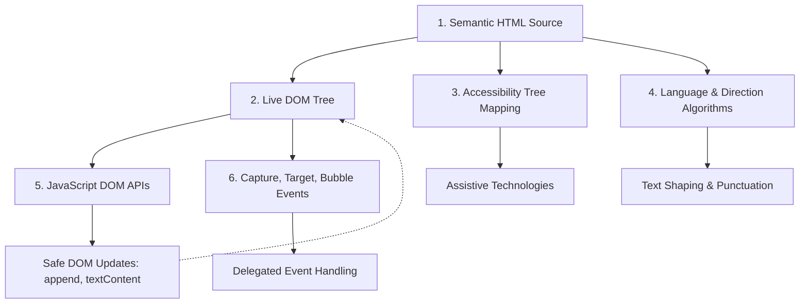

When markup is semantically precise, the browser automatically coordinates accessibility mapping, keyboard focus, form submission, and text direction. JavaScript can focus on genuine application logic rather than compensating for missing platform capabilities.

---

## Misconceptions to Leave Behind {#misconceptions-to-leave-behind}

* **“If it looks like a heading or button, it is one.”** Visual appearance is styling; element identity is structure. Assistive technologies and automation tools perceive only element identity and semantics.
* **“ARIA makes a custom `<div>` control accessible.”** ARIA only modifies how an element is announced in the accessibility tree. It does not provide keyboard focus, `Space`/`Enter` listeners, or form submission behavior.
* **“Placeholder text is a valid substitute for a `<label>`.”** Placeholders vanish upon text entry, suffer from poor contrast, and fail to announce stable accessible names. Always provide persistent visible labels.
* **“Accessibility only benefits screen-reader users.”** Accessibility directly impacts keyboard-only navigators, users with motor impairments, people operating under bright sunlight, users with temporary disabilities, and automated search engines.
* **“`lang="ar"` automatically sets RTL direction.”** `lang` declares language vocabulary; `dir="rtl"` declares physical text direction. Both must be explicitly specified.
* **“RTL means mirroring every element on the screen.”** Numbers, code, URLs, and audio/video playback bars remain strictly left-to-right in RTL contexts.
* **“Attributes and DOM properties are identical.”** Attributes represent static values serialized in HTML markup; properties represent live, dynamic values in memory.
* **“`event.stopPropagation()` prevents the default browser action.”** `stopPropagation()` only halts tree traversal. Use `event.preventDefault()` to cancel default browser actions.

---

## Chapter Summary {#chapter-summary}

1. **Semantic HTML** communicates the role, hierarchy, and capabilities of content to the browser, search engines, and assistive devices.
2. **Document Hierarchy** must be organized via incremental headings (`<h1>` through `<h6>`) and primary landmarks (`<main>`, `<nav>`, `<header>`, `<footer>`, `<section>`).
3. **Native Controls** (`<button>`, `<a>`, `<input>`) provide built-in focusability, keyboard contracts, and accessibility attributes that custom containers lack.
4. **Forms** require explicit `<label>` bindings, `<fieldset>`/`<legend>` groupings, and programmatic error associations (`aria-describedby`, `aria-invalid`).
5. **Keyboard Operability** requires maintaining natural source order, avoiding positive `tabindex`, and ensuring distinct `:focus-visible` styling.
6. **Accessible Names** are computed by the browser using a strict priority ladder (`aria-labelledby` > `aria-label` > native labels > fallbacks).
7. **Internationalization** requires pairing `lang` tags with explicit `dir` declarations (`ltr`, `rtl`, `auto`) and isolating mixed text runs with `<bdi>`.
8. **The DOM** is a live node tree manipulated through safe APIs (`textContent`, `createElement`, `append`).
9. **Event Propagation** consists of capture, target, and bubble phases, enabling scalable event delegation via `closest()`.
10. **Web Components** provide encapsulation via Custom Elements and Shadow DOM, but rely on semantic HTML for their internal accessibility.

---

## Review Questions {#review-questions}

1. Explain why two visually indistinguishable interfaces can have radically different accessibility trees.
2. Why is skipping heading levels (e.g. `<h1>` to `<h3>`) considered an accessibility flaw?
3. What was the HTML5 "outline algorithm", and why do modern standards reject it?
4. When should a developer use `<section>` versus `<div>`?
5. Under what circumstances should an author choose a `<button>` instead of an anchor `<a>`?
6. Detail the five browser behaviors that must be manually coded when replacing a native button with `<div role="button">`.
7. Why is placeholder text unacceptable as an exclusive form label?
8. How does `<fieldset>` with `<legend>` improve accessibility for radio button groups?
9. Explain the functional difference between `tabindex="0"`, `tabindex="-1"`, and positive `tabindex` values.
10. Describe the First Rule of ARIA and provide an example of its violation.
11. How does the browser compute an accessible name when an element has both a `<label>` and an `aria-label`?
12. Why does declaring `lang="ar"` fail to display an Arabic paragraph with correct right-to-left layout?
13. In what scenario is `dir="auto"` essential for content integrity?
14. What problem does the `<bdi>` element solve in bidirectional text rendering?
15. Which web interface components should remain left-to-right even when rendered inside an RTL page?
16. Distinguish between a DOM `Node` and an `Element`.
17. Why is `element.textContent` preferred over `element.innerHTML` for inserting dynamic text?
18. Contrast an HTML attribute with its corresponding DOM property using an `<input>` element's value.
19. Describe the three phases of DOM event propagation.
20. In an event handler, how does `event.target` differ from `event.currentTarget`?
21. What is the difference between `event.preventDefault()` and `event.stopPropagation()`?
22. Explain how event delegation works and why it improves runtime memory efficiency.
23. What role does the `closest()` method play in delegated event listeners?
24. What are the three core technologies that comprise the Web Components standard?
25. Why doesn't creating a custom element with `<my-button>` automatically make it accessible?
26. How does Shadow DOM encapsulation affect CSS styles and DOM queries from the outer page?

---

## Practical Lab Brief {#end-of-chapter-practical-lab--build-a-semantic-multilingual-service-interface}

Apply the principles of this chapter in the companion laboratory:
[Practical 02 - Accessible Composite Listbox and Semantic Interface]().

You will establish a native selection baseline, configure explicit labels and error associations, handle mixed English/Kurdish/Arabic directional text, and implement a composite multi-select widget with roving `tabindex`.

---

## Key Terms {#key-terms}

* **Semantic HTML**: Markup selected according to content meaning and role rather than visual appearance.
* **Landmark**: A structural HTML element (`<main>`, `<nav>`, `<header>`, `<footer>`) identifying major regions for rapid navigation.
* **Accessibility Tree**: The hierarchical representation of UI semantics generated by the browser for platform accessibility APIs.
* **Accessible Name**: The programmatically computed string identifying an element to assistive technology.
* **WAI-ARIA**: A W3C specification defining attributes to enhance accessibility semantics where native HTML is insufficient.
* **Tab Order**: The sequential order in which interactive controls receive focus when navigating via the `Tab` key.
* **`tabindex`**: An attribute controlling an element's focusability and participation in keyboard navigation.
* **BCP 47**: The Internet Engineering Task Force standard specifying language tags (e.g. `en`, `ar`, `ckb`).
* **`dir` Attribute**: The HTML attribute declaring the base directionality of text (`ltr`, `rtl`, `auto`).
* **`<bdi>` (Bidirectional Isolate)**: An element that isolates text from the bidirectional properties of surrounding content.
* **Unicode Bidirectional Algorithm (UBA)**: The algorithm defining how mixed left-to-right and right-to-left scripts are rendered.
* **Live DOM**: The in-memory tree of active node objects constructed by the browser from HTML markup.
* **Event Propagation**: The journey of an event through capturing, target, and bubbling phases.
* **Event Delegation**: Handling events for multiple child elements by attaching a single listener to a common ancestor.
* **Web Components**: A suite of platform technologies (Custom Elements, Shadow DOM, Templates) for reusable component encapsulation.
* **Shadow DOM**: A scoped, encapsulated DOM subtree attached to a host element.

---

## From Document Structure to Visual Systems {#closing-perspective}

A resilient web application begins with a rigorous document. When HTML accurately reflects meaning, accessibility, language, and interactive boundaries, the platform provides stability and built-in functionality.

With structure, interaction, and meaning established, the next architectural challenge is visual presentation: how can this document adapt responsively across diverse screen geometries, container constraints, and user preferences without degrading its underlying semantics?

[Chapter 3 - Modern CSS Architecture and Layout Systems]() answers that challenge by treating CSS not as cosmetic decoration, but as an architectural system built upon semantic foundations.
