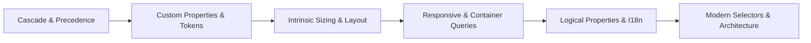
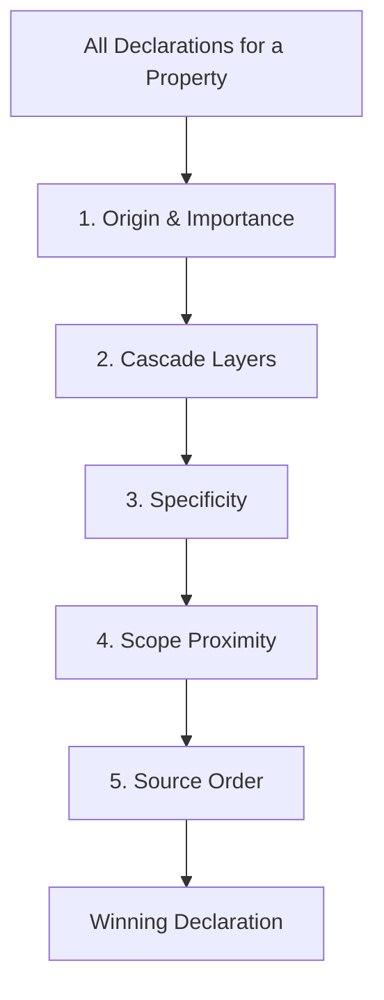
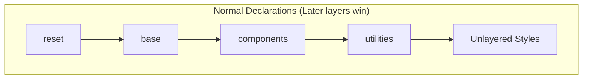
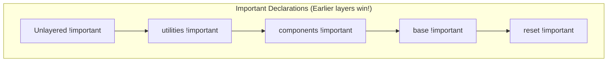
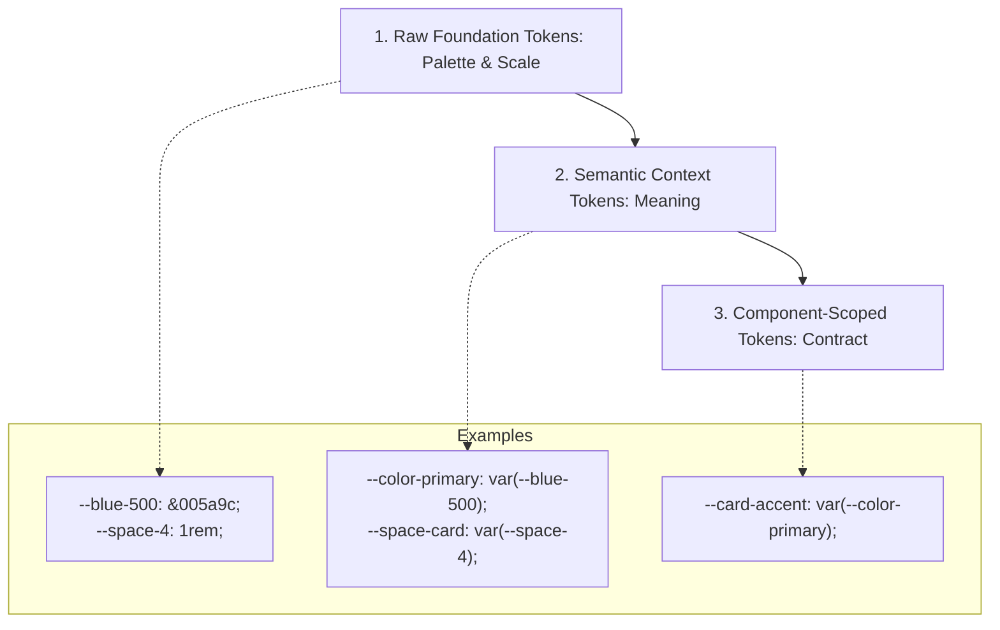
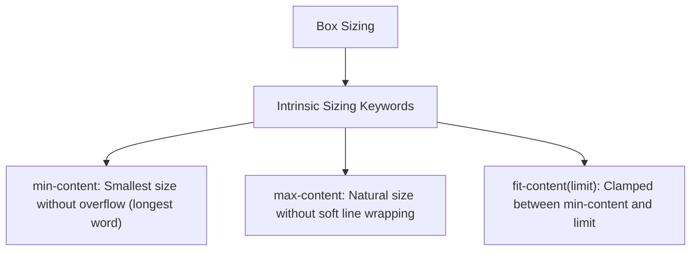
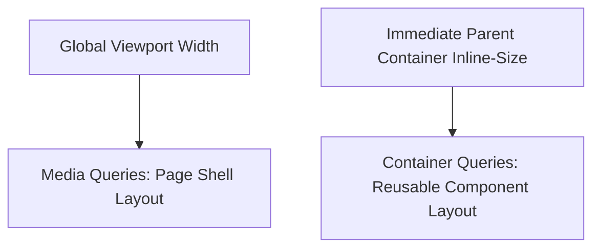
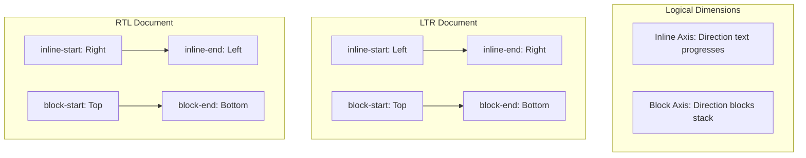

CSS is frequently introduced as the layer that makes HTML look attractive. In professional web engineering, that description is inadequate.

Modern CSS determines how elements participate in layout, how available space is calculated and distributed, how components adapt to varying screen widths and container geometries, how text direction changes layout flow, and how design decisions propagate through an enterprise codebase. CSS is both a **geometric layout system** and an **architectural precedence system**.

Consider a production application dashboard containing:
* a persistent navigation sidebar;
* summary metric cards that might appear in a wide three-column layout or stacked inside a narrow side panel;
* a catalog of products where card descriptions have wildly different lengths but buttons must align across rows;
* an interface that must seamlessly switch between English (`ltr`) and Central Kurdish or Arabic (`rtl`);
* style rules contributed by third-party design systems, application code, and local overrides.



To build such an interface reliably, an engineer must answer architectural questions: How do we prevent third-party components from stomping on application styles? How can cards adapt to their immediate container rather than the global viewport? How do we align sibling buttons without hardcoded heights or JavaScript resize observers?

In this chapter, we develop a rigorous mental model of modern CSS, connecting the cascade, design tokens, layout primitives (Flexbox, Grid, Subgrid), container-aware responsive design, and logical properties into one unified system.

---

## 1. The Cascade Is the Foundation {#1-the-cascade-is-the-foundation}

The first letter in CSS stands for **Cascading**. The cascade is an algorithm that resolves competing style rules from multiple sources into a single computed value for every property on every element.

When multiple declarations target the same property on an element, the cascade applies a strict priority ladder:



### Origins and Importance {#2-browser-user-and-author-styles}

CSS originates from three primary sources:
1. **User-Agent Origin:** Default styles supplied by the browser (e.g. display block on `<div>`, default margins on headings).
2. **User Origin:** Styles configured by the person using the browser (e.g. custom accessibility high-contrast sheets, minimum font sizes).
3. **Author Origin:** Styles written by the application developer.

For normal declarations, author styles override user styles, which in turn override user-agent styles. However, adding `!important` reverses this relationship to protect user accessibility: user `!important` declarations outrank author `!important` declarations.

### Specificity Without Arithmetic Obsession {#4-specificity-more-than-a-score}

When declarations originate from the same layer, the browser resolves conflicts using **specificity**. Specificity is evaluated as a three-component tuple: `(IDs, Classes/Attributes/Pseudo-classes, Elements/Pseudo-elements)`:

* `(1, 0, 0)`: ID selector (`#nav`)
* `(0, 1, 0)`: Class selector (`.card`), attribute selector (`[type="text"]`), or pseudo-class (`:hover`, `:focus`)
* `(0, 0, 1)`: Element selector (`button`) or pseudo-element (`::before`)

Tuples are compared from left to right: a single class outranks any number of element selectors. However, treating specificity as an arithmetic arms race leads to unmaintainable stylesheets full of artificially chained selectors (`.main .card .btn.btn-primary`). Modern architecture relies on **Cascade Layers** to manage precedence deliberately.

### Source Order {#5-source-order}

If origin, importance, layer, and specificity are all identical, the **last declaration encountered in source order** wins. Source order is a tie-breaker, not an architectural strategy.

---

## 2. Cascade Layers: Controlling Precedence Architecturally {#6-cascade-layers-controlling-precedence-architecturally}

Cascade Layers (`@layer`) allow developers to structure precedence explicitly, rendering selector specificity irrelevant across layer boundaries.



### The Rules of Cascade Layers

1. **Declared Order:** Layers are ordered from lowest to highest priority based on where their names first appear:
   ```css
   @layer reset, base, components, utilities;
   ```
2. **Layer Precedence Outranks Specificity:** A selector inside a higher layer always beats a selector inside a lower layer, regardless of specificity:
   ```css
   @layer base {
     #main-nav a { color: blue; } /* High specificity: (1,0,1) */
   }

   @layer components {
     .nav-link { color: green; } /* Lower specificity: (0,1,0), BUT WINS! */
   }
   ```
3. **Unlayered Normal Styles Outrank Layered Normal Styles:** Normal styles placed outside any `@layer` have the highest priority among normal author declarations. This allows legacy styles or localized overrides to win without adding specificity hacks.
4. **Important Declarations Reverse Layer Order:** The cascade reverses layer priority for `!important` declarations to allow foundational layers to enforce non-negotiable constraints:
   * **Layered `!important` outranks unlayered `!important`.**
   * **Earlier layers with `!important` outrank later layers with `!important`.**



### A Production Layer Architecture {#8-a-practical-layer-architecture}

Establish an explicit layer stack at the top of the main stylesheet:

```css
@layer reset, base, theme, components, utilities;

@layer reset {
  *, *::before, *::after {
    box-sizing: border-box;
    margin: 0;
  }
  img, picture, video {
    display: block;
    max-inline-size: 100%;
  }
}

@layer base {
  body {
    font-family: system-ui, -apple-system, sans-serif;
    line-height: 1.5;
    color: var(--color-text);
    background-color: var(--color-bg);
  }
}

@layer components {
  .dashboard-card {
    background: var(--card-bg, #fff);
    border-radius: var(--radius-md);
    padding: var(--space-md);
  }
}

@layer utilities {
  .visually-hidden {
    inline-size: 1px !important;
    block-size: 1px !important;
    overflow: hidden !important;
    clip-path: inset(50%) !important;
    white-space: nowrap !important;
  }
}
```

---

## 3. Design Tokens and Custom Properties {#9-custom-properties-values-that-participate-in-the-cascade}

CSS Custom Properties (`--variable-name`) are dynamic variables that participate in the cascade and inheritance tree. Unlike preprocessor variables (Sass/Less), custom properties are evaluated at runtime in browser memory.

### Token Hierarchy: Raw vs Semantic vs Component {#11-raw-tokens-and-semantic-tokens}

Scalable design systems partition tokens into three distinct tiers:



1. **Raw Tokens:** Literal design primitives (`--blue-600: #005a9c;`, `--radius-sm: 4px;`). Components must never consume raw tokens directly.
2. **Semantic Tokens:** Abstract roles expressing intent (`--color-action-primary: var(--blue-600);`, `--color-surface-elevated: var(--gray-100);`).
3. **Component Tokens:** Element-specific hooks (`--card-padding: var(--space-lg);`).

### Theming Without Duplication {#12-theming-with-custom-properties}

Because custom properties inherit through the DOM, themes can be toggled by switching token definitions at the container root:

```css
:root {
  --color-bg: #f8fafc;
  --color-text: #0f172a;
  --color-surface: #ffffff;
  --color-border: #e2e8f0;
}

[data-theme="dark"],
@media (prefers-color-scheme: dark) {
  :root:not([data-theme="light"]) {
    --color-bg: #0b0f19;
    --color-text: #f1f5f9;
    --color-surface: #1e293b;
    --color-border: #334155;
  }
}
```

Components simply consume `var(--color-surface)` and `var(--color-text)` without needing separate dark-mode selector overrides.

---

## 4. Intrinsic Sizing and Box Model Foundations {#19-intrinsic-sizing}

Traditional web development often forced explicit dimensions (`width: 300px; height: 450px;`) onto containers, resulting in clipped text, overflow bugs, and broken translations. Modern CSS designs around **intrinsic sizing** - allowing content volume to dictate space requirements.



* **`min-content`**: The smallest size an element can take without its content overflowing. For text, this is the width of the longest unbreakable string or word.
* **`max-content`**: The size required to display all content on a single line without wrapping.
* **`fit-content(limit)`**: Uses `max-content`, but never exceeds the specified limit or available container space.

```css
.badge {
  /* Fits its text precisely without taking 100% of parent width */
  inline-size: fit-content;
}
```

---

## 5. Modern Layout Systems: Flexbox, Grid, and Subgrid {#15-flexbox-layout-along-one-main-axis}

Modern CSS provides two primary layout engines: Flexbox for one-dimensional distribution, and Grid for two-dimensional coordinate placement.

### Choosing Between Flexbox and Grid {#21-grid-or-flexbox}

| Feature | Flexbox (`display: flex`) | Grid (`display: grid`) |
| :--- | :--- | :--- |
| **Dimensionality** | One-dimensional (along row OR column) | Two-dimensional (rows AND columns simultaneously) |
| **Philosophy** | Content-first (items push space) | Layout-first (container defines tracks; items occupy slots) |
| **Best Used For** | Navigation bars, button groups, badge lists, input addons | Application page shells, card grids, dashboard matrices |

### Flexbox Mechanics

Flexbox distributes items along a **main axis** and aligns them on a **cross axis**:

```css
.toolbar {
  display: flex;
  flex-direction: row;
  justify-content: space-between; /* Main axis alignment */
  align-items: center;            /* Cross axis alignment */
  gap: var(--space-sm);
}

.search-input {
  /* grow | shrink | basis */
  flex: 1 1 20rem; /* Absorbs spare space, shrinks if needed, starts at 20rem */
}
```

### CSS Grid and Autonomous Column Computation {#17-grid-two-dimensional-layout}

CSS Grid creates structured coordinates. Rather than writing fixed media queries for responsive card grids, use `repeat()`, `auto-fit` (or `auto-fill`), and `minmax()`:

```css
.card-grid {
  display: grid;
  grid-template-columns: repeat(auto-fit, minmax(min(100%, 18rem), 1fr));
  gap: var(--space-lg);
}
```

* `auto-fit`: Fills the row with as many columns as will fit, expanding existing columns to consume remaining space.
* `minmax(min(100%, 18rem), 1fr)`: Guarantees cards are at least `18rem` wide, but never exceed `100%` of narrow viewports.

### Subgrid: Aligning Nested Children Across Cards {#23-subgrid-inheriting-grid-tracks}

In standard grid layouts, cards are placed in rows, but the internal elements of each card (header, description, action button) live in separate sub-trees. If Card A has a two-line title and Card B has a four-line title, their action buttons will not align horizontally.

**Subgrid (`grid-template-rows: subgrid`)** allows nested children to participate directly in the parent grid's tracks:

```mermaid
flowchart TD
    ParentGrid[Parent Grid: repeat(auto-fit, minmax(280px, 1fr))]
    
    subgraph Card1["Card 1 (rows: subgrid)"]
        H1["Header (Row 1)"]
        D1["Short Description (Row 2)"]
        F1["Footer Button (Row 3: Aligned)"]
    end
    
    subgraph Card2["Card 2 (rows: subgrid)"]
        H2["Taller Header (Row 1)"]
        D2["Long Multiline Description (Row 2)"]
        F2["Footer Button (Row 3: Aligned)"]
    end

    ParentGrid --> Card1
    ParentGrid --> Card2
```

```css
.card-grid {
  display: grid;
  grid-template-columns: repeat(auto-fit, minmax(18rem, 1fr));
  /* Each card spans 3 rows: title, description, actions */
  grid-auto-rows: auto 1fr auto;
  gap: var(--space-lg);
}

.dashboard-card {
  display: grid;
  grid-row: span 3;
  grid-template-rows: subgrid;
}
```

With subgrid, all card titles share Row 1 height, all descriptions share Row 2 height, and all buttons snap to Row 3 along a clean horizontal datum line.

---

## 6. Responsive and Container-Aware Systems {#25-responsive-design-is-not-a-list-of-devices}

Responsive design is not a list of target phone screen resolutions. A responsive system adapts to available rendering space, font size scaling, split-screen desktop windows, and user accessibility settings.

### Fluid Sizing with `clamp()` {#26-begin-with-fluid-layout}

Avoid rigid font sizes and spacing that jump jarringly at fixed breakpoints. Use `clamp()` for smooth mathematical scaling:

```css
:root {
  /* clamp(minimum, preferred-rate, maximum) */
  --font-h1: clamp(1.75rem, 1.25rem + 2.5vw, 3rem);
  --space-gutter: clamp(1rem, 0.5rem + 2vw, 2.5rem);
}

h1 {
  font-size: var(--font-h1);
}
```

### Media Queries Versus Container Queries {#28-container-queries-responding-to-component-space}

* **Media Queries (`@media`)**: Inspect global viewport properties (screen width, orientation, color scheme).
* **Container Queries (`@container`)**: Inspect the dimensions of an element's ancestor container.



#### Why Container Queries Are Essential

A summary card might be rendered in the wide main content column on mobile, or inside a narrow sidebar on a high-resolution desktop screen. A media query cannot differentiate between these contexts because the viewport width is identical. Container queries solve this fundamentally:

```css
/* 1. Declare container context */
.card-wrapper {
  container-type: inline-size;
  container-name: card-container;
}

/* 2. Default compact card layout */
.service-card {
  display: flex;
  flex-direction: column;
  gap: var(--space-sm);
}

/* 3. Adapt when the immediate container exceeds 400px */
@container card-container (min-width: 400px) {
  .service-card {
    flex-direction: row;
    align-items: center;
  }
}
```

---

## 7. Internationalized Layout: Logical Properties {#35-css-has-logical-axes-not-just-left-and-right}

Traditional CSS relied on physical coordinates: `left`, `right`, `top`, `bottom`. When an application switches from English to right-to-left languages (such as Central Kurdish or Arabic), physical properties require authors to write duplicate, error-prone override rules:

```css
/* Anti-pattern: Fragile physical overrides */
.nav-item { margin-right: 1.5rem; }
[dir="rtl"] .nav-item { margin-right: 0; margin-left: 1.5rem; }
```

### Logical Coordinates

Modern CSS replaces physical coordinates with **logical axes**:



| Physical Property | Modern Logical Equivalent | Behavior |
| :--- | :--- | :--- |
| `width` | `inline-size` | Dimension along the text-flow axis |
| `height` | `block-size` | Dimension along the block-stacking axis |
| `margin-left` | `margin-inline-start` | Margin where text begins (left in LTR, right in RTL) |
| `margin-right` | `margin-inline-end` | Margin where text ends (right in LTR, left in RTL) |
| `padding-top` / `bottom` | `padding-block-start` / `end` | Padding perpendicular to text flow |
| `border-left` | `border-inline-start` | Leading border |
| `left` / `right` (in positioning) | `inset-inline-start` / `end` | Logical position offsets |

Using logical properties allows a single stylesheet to render flawlessly across both LTR and RTL scripts with zero overrides.

---

## 8. Modern Selectors and Architectural Organization {#40-modern-selectors-help-express-relationships-more-clearly}

Modern CSS includes powerful relational and functional selectors that eliminate the need for bloated utility scripts:

### `:has()` - The Relational Selector

`:has()` allows an element to style itself based on its descendants or following siblings:

```css
/* Style a form card specifically when it contains an invalid input */
.form-card:has(input:invalid) {
  border-inline-start: 4px solid var(--color-error);
}

/* Style a figure when a caption is present */
figure:has(figcaption) {
  background: var(--color-surface-muted);
}
```

### `:is()` and `:where()`

* `:is(.card, .panel, .widget) h2`: Groups selectors cleanly. The specificity of `:is()` equals that of its most specific argument.
* `:where(.card, .panel, .widget) h2`: Identical grouping syntax, but **carries zero specificity**. This makes `:where()` ideal for default component styles in design systems, enabling consumers to override them effortlessly.

### Native CSS Nesting

CSS now natively supports nesting without preprocessors:

```css
.metric-card {
  background: var(--color-surface);
  padding: var(--space-md);

  & .metric-value {
    font-size: var(--font-h1);
    font-weight: 700;
  }

  &:hover {
    border-color: var(--color-primary);
  }
}
```

---

## 9. The Complete Adaptive Dashboard Implementation {#48-a-practical-dashboard-implementation}

We assemble these systems into an adaptive, production-grade dashboard implementation:

```html
<!doctype html>
<html lang="en" dir="ltr">
  <head>
    <meta charset="utf-8">
    <meta name="viewport" content="width=device-width, initial-scale=1">
    <title>Executive Services Dashboard</title>
    <link rel="stylesheet" href="dashboard.css">
  </head>
  <body>
    <div class="dashboard-shell">
      <header class="app-header">
        <a href="/" class="brand">Citizen Services Analytics</a>
        <nav aria-label="Global navigation">
          <ul class="nav-list">
            <li><a href="/overview" aria-current="page">Overview</a></li>
            <li><a href="/requests">Requests</a></li>
            <li><a href="/settings">Settings</a></li>
          </ul>
        </nav>
      </header>

      <aside class="app-sidebar">
        <div class="sidebar-container">
          <section class="stat-card">
            <h3>Active Queue</h3>
            <p class="stat-value">1,248</p>
            <p class="stat-desc">Applications pending adjudication across all regional branches.</p>
          </section>
        </div>
      </aside>

      <main class="app-main">
        <h1>Service Operations Overview</h1>

        <section class="catalog-section">
          <h2>Regional Certificates</h2>
          <div class="card-grid">
            <article class="service-item">
              <h3 class="service-title">Residence Certificate</h3>
              <p class="service-desc">Proof of residency for official legal transactions, utility contracts, and government clearances.</p>
              <footer class="service-actions">
                <button type="button" class="btn btn-primary">Process Next (14)</button>
              </footer>
            </article>

            <article class="service-item">
              <h3 class="service-title">National Identity Replacement</h3>
              <p class="service-desc">Biometric identity issuance for damaged, stolen, or expired cards.</p>
              <footer class="service-actions">
                <button type="button" class="btn btn-primary">Process Next (3)</button>
              </footer>
            </article>

            <article class="service-item">
              <h3 class="service-title">Civil Record Archival Verification</h3>
              <p class="service-desc">Historical registry validation across municipal databases.</p>
              <footer class="service-actions">
                <button type="button" class="btn btn-primary">Process Next (8)</button>
              </footer>
            </article>
          </div>
        </section>
      </main>
    </div>
  </body>
</html>
```

### The Accompanying Stylesheet (`dashboard.css`)

```css
/* Declare explicit architectural layer order */
@layer reset, tokens, base, layout, components, utilities;

@layer tokens {
  :root {
    --blue-600: #005a9c;
    --blue-700: #004070;
    --slate-50: #f8fafc;
    --slate-200: #e2e8f0;
    --slate-800: #1e293b;
    --slate-900: #0f172a;

    --color-bg: var(--slate-50);
    --color-surface: #ffffff;
    --color-text: var(--slate-900);
    --color-text-muted: #64748b;
    --color-primary: var(--blue-600);
    --color-primary-hover: var(--blue-700);
    --color-border: var(--slate-200);

    --space-sm: 0.5rem;
    --space-md: 1rem;
    --space-lg: 1.5rem;
    --radius-md: 6px;

    --font-heading: clamp(1.5rem, 1.2rem + 1.5vw, 2.25rem);
  }
}

@layer reset {
  *, *::before, *::after {
    box-sizing: border-box;
    margin: 0;
  }
  body {
    line-height: 1.5;
    font-family: system-ui, -apple-system, sans-serif;
    color: var(--color-text);
    background: var(--color-bg);
  }
  ul {
    list-style: none;
    padding: 0;
  }
}

@layer layout {
  .dashboard-shell {
    display: grid;
    min-block-size: 100vh;
    grid-template-rows: auto 1fr;
    grid-template-columns: minmax(14rem, 18rem) 1fr;
    grid-template-areas:
      "header  header"
      "sidebar main";
  }

  @media (max-width: 48rem) {
    .dashboard-shell {
      grid-template-columns: 1fr;
      grid-template-areas:
        "header"
        "main"
        "sidebar";
    }
  }

  .app-header {
    grid-area: header;
    display: flex;
    justify-content: space-between;
    align-items: center;
    padding-inline: var(--space-lg);
    padding-block: var(--space-md);
    background: var(--color-surface);
    border-block-end: 1px solid var(--color-border);
  }

  .app-sidebar {
    grid-area: sidebar;
    background: var(--color-surface);
    border-inline-end: 1px solid var(--color-border);
    padding: var(--space-md);
    container-type: inline-size;
    container-name: sidebar-con;
  }

  .app-main {
    grid-area: main;
    padding: var(--space-lg);
  }
}

@layer components {
  .nav-list {
    display: flex;
    gap: var(--space-md);

    & a {
      text-decoration: none;
      color: var(--color-text);
      padding-block: var(--space-sm);
      border-block-end: 2px solid transparent;

      &[aria-current="page"] {
        border-color: var(--color-primary);
        color: var(--color-primary);
        font-weight: 600;
      }
    }
  }

  /* Grid with Subgrid alignment */
  .card-grid {
    display: grid;
    grid-template-columns: repeat(auto-fit, minmax(min(100%, 16rem), 1fr));
    grid-auto-rows: auto 1fr auto;
    gap: var(--space-md);
    margin-block-start: var(--space-md);
  }

  .service-item {
    display: grid;
    grid-row: span 3;
    grid-template-rows: subgrid;
    background: var(--color-surface);
    border: 1px solid var(--color-border);
    border-radius: var(--radius-md);
    padding: var(--space-md);

    & .service-desc {
      color: var(--color-text-muted);
      margin-block: var(--space-sm);
    }
  }

  .btn-primary {
    display: inline-flex;
    justify-content: center;
    padding-block: var(--space-sm);
    padding-inline: var(--space-md);
    background: var(--color-primary);
    color: #fff;
    border: none;
    border-radius: var(--radius-md);
    cursor: pointer;
    font-weight: 500;

    &:hover {
      background: var(--color-primary-hover);
    }

    &:focus-visible {
      outline: 3px solid var(--color-primary);
      outline-offset: 2px;
    }
  }

  /* Container Query in Sidebar */
  .stat-card {
    background: var(--color-bg);
    padding: var(--space-md);
    border-radius: var(--radius-md);

    & .stat-value {
      font-size: 2rem;
      font-weight: 700;
      color: var(--color-primary);
    }
  }

  @container sidebar-con (max-width: 250px) {
    .stat-card .stat-desc {
      font-size: 0.85rem;
    }
  }
}
```

---

## Misconceptions to Leave Behind {#misconceptions-to-leave-behind}

* **“Specificity always decides which selector wins.”** Layer order and origin outrank specificity. A single element selector in `@layer components` beats an ID selector inside `@layer base`.
* **“`!important` is bad practice that should never be used.”** `!important` is an intentional architectural tool when used inside cascade layers to enforce utility overrides or accessibility constraints.
* **“Responsive design means writing breakpoints for iPhone and iPad.”** Devices change every year. Design interfaces to adapt to content boundaries and container widths using `clamp()`, `minmax()`, and container queries.
* **“CSS variables are just preprocessor variables that run in the browser.”** Custom properties participate in the DOM cascade, inherit down the tree, and can be dynamically manipulated at runtime by JavaScript and container queries.
* **“Subgrid is just a polyfill for Flexbox.”** Subgrid allows nested child elements to align their rows or columns across separate sibling DOM containers, which Flexbox cannot do.
* **“RTL support means creating a separate stylesheet with reversed margins.”** Logical properties (`margin-inline-start`, `inset-inline-end`) adapt automatically to document direction without duplicate stylesheets.

---

## Chapter Summary {#chapter-summary}

1. **The Cascade** resolves competing declarations via Origin/Importance $\rightarrow$ Cascade Layers $\rightarrow$ Specificity $\rightarrow$ Scope Proximity $\rightarrow$ Source Order.
2. **Cascade Layers (`@layer`)** organize precedence architecturally. Later layers win for normal styles; earlier layers win for `!important` styles.
3. **Custom Properties** are cascade-aware variables that enable scalable design tokens and lightweight theming without code duplication.
4. **Intrinsic Sizing** (`min-content`, `max-content`, `fit-content`) allows content volume to dictate container sizing safely.
5. **Flexbox** handles 1D linear content distribution, while **CSS Grid** handles 2D coordinate space.
6. **Subgrid** extends track sizing into nested children, aligning card headers, descriptions, and footers across rows.
7. **Fluid Design** uses mathematical scaling (`clamp()`) to adapt typography and spacing without abrupt breakpoint jumps.
8. **Container Queries (`@container`)** enable components to adapt to their immediate parent container rather than the global viewport.
9. **Logical Properties** (`inline-size`, `margin-inline-start`) eliminate the need for physical LTR/RTL overrides.
10. **Modern Selectors** (`:has()`, `:is()`, `:where()`) enable expressive parent-child styling and zero-specificity baseline defaults.

---

## Review Questions {#review-questions}

1. What are the five criteria the browser uses to evaluate cascade precedence, in order?
2. In what way does `!important` alter the normal precedence order of cascade layers?
3. What is the difference between raw design tokens, semantic tokens, and component tokens?
4. How do CSS custom properties differ fundamentally from Sass build-time variables?
5. Define `min-content` and provide an example where it dictates layout.
6. When should an engineer choose Flexbox over CSS Grid?
7. Explain how `repeat(auto-fit, minmax(200px, 1fr))` dynamically computes columns without media queries.
8. What problem does `grid-template-rows: subgrid` solve in multi-card catalog layouts?
9. Why is designing for a fixed list of device widths considered an anti-pattern?
10. How does `clamp()` calculate fluid font sizes?
11. In what scenario is a container query required because a media query cannot work?
12. What property must be declared on an element to make it queryable by `@container`?
13. Distinguish between physical coordinates (`left`, `right`) and logical coordinates (`inline-start`, `inline-end`).
14. How does `margin-inline-start` behave when the document direction switches from LTR to RTL?
15. Which interface elements should remain LTR even within an RTL document?
16. How does the `:has()` pseudo-class eliminate the need for custom JavaScript state classes on parent containers?
17. What is the difference in specificity calculation between `:is()` and `:where()`?
18. Why does placing base component styles inside `:where()` benefit design system consumers?
19. How does unlayered normal CSS interact with layered normal CSS?
20. Why does `border-box` sizing simplify layout calculations compared to `content-box`?
21. What happens if an element has `flex: 1 1 0px` versus `flex: 1 1 auto`?
22. How does `container-type: inline-size` differ from `container-type: size`?
23. What are container query units (`cqi`, `cqb`)?
24. How can custom properties be scoped to a single subtree without polluting `:root`?
25. Describe how native CSS nesting handles the `&` parent selector.
26. How do cascade layers simplify the integration of third-party CSS component libraries?

---

## Practical Lab Brief {#end-of-chapter-practical-lab--build-an-intrinsic-container-aware-dashboard}

Apply the concepts of this chapter in the companion laboratory:
[Practical 03 - Intrinsic, Container-Aware Dashboard]().

You will construct an adaptive executive dashboard using CSS Grid with Subgrid, build an architectural cascade layer stack (`reset`, `base`, `components`, `utilities`), establish a 3-tier design token hierarchy, configure container queries for sidebar and main catalog cards, and verify seamless RTL layout transitions.

---

## Key Terms {#key-terms}

* **Cascade**: The algorithm that resolves competing style declarations to determine the final property value.
* **Cascade Layers (`@layer`)**: An explicit architectural mechanism for grouping and ordering CSS rules independently of selector specificity.
* **Specificity**: A tuple weighting system based on selector types (IDs, classes, elements) that resolves conflicts within a single layer.
* **Custom Property**: A cascade-aware, inherited CSS variable declared with the `--` prefix.
* **Intrinsic Sizing**: Sizing based on content requirements (`min-content`, `max-content`, `fit-content`) rather than fixed coordinates.
* **Flexbox**: A 1D layout model optimizing space distribution along a main axis.
* **CSS Grid**: A 2D layout model organizing elements along rows and columns simultaneously.
* **Subgrid**: A feature of CSS Grid allowing nested elements to participate in the track sizing of their parent grid.
* **Container Queries**: Conditional CSS rules evaluated against the dimensions of an ancestor container rather than the viewport.
* **Logical Properties**: Direction-agnostic properties (`inline-size`, `margin-inline-start`) that map dynamically based on text direction.
* **Relational Pseudo-Class (`:has()`)**: A selector that matches elements based on conditions present in their child or sibling trees.
* **Fluid Layout**: Layouts where dimensions and typography scale smoothly across a continuum using mathematical functions like `clamp()`.

---

## From Styling Architecture to Asynchronous Behavior {#closing-perspective}

CSS creates a resilient, adaptive visual hierarchy that respects content, containers, and user language. When styling is structured around cascade layers, design tokens, and intrinsic layout systems, interfaces remain stable without brittle layout scripts.

Yet modern web applications do more than adapt visually: they handle user interaction, request server resources, manage concurrency, and recover from failures. 

[Chapter 4 - Modern JavaScript and Asynchronous Programming]() examines how modern JavaScript coordinates runtime execution, manages async streams and cancellation, and prevents long tasks from freezing the very interfaces we have designed.
