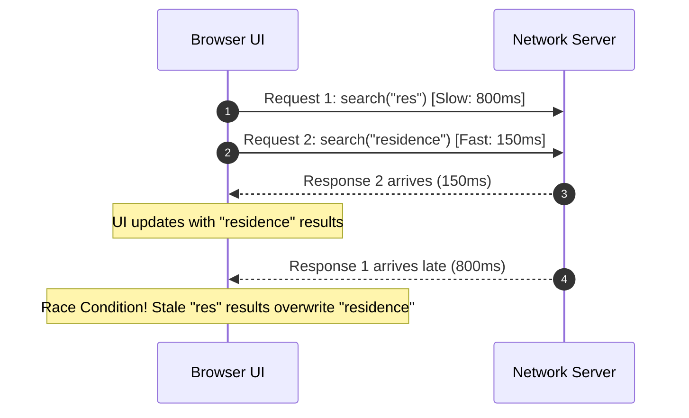
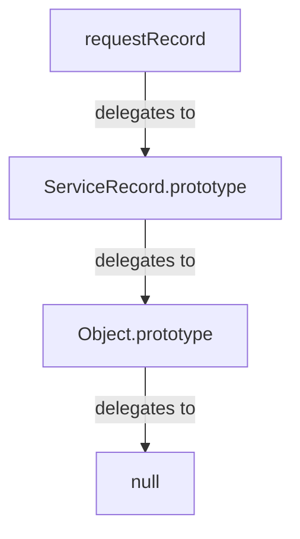
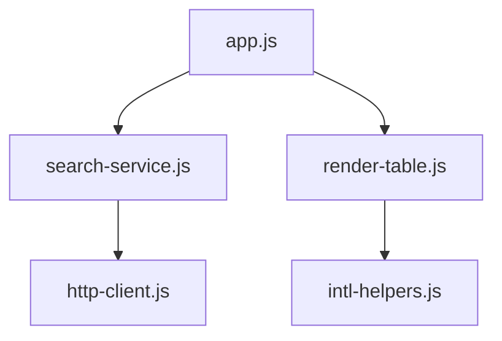
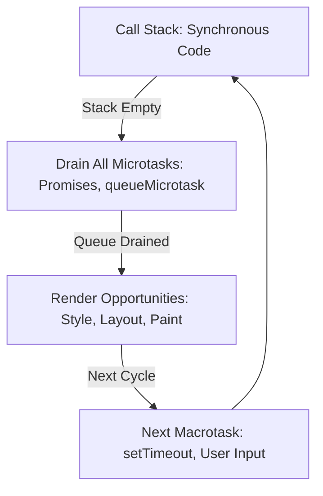

A user types into a live citizen-service search input. First they type `"res"`, then immediately continue typing `"residence"`. 

Under the hood, the application dispatches an asynchronous network request for each input state. The first request (`"res"`) encounters transient network delay or backend cache misses and takes 800 milliseconds to respond. The second request (`"residence"`) hits an edge cache and finishes in 150 milliseconds.



If the application naively renders every response as it resolves, the stale response arrives last. The user watches the correct results appear briefly, only to be overwritten by obsolete data matching `"res"`. The input field says `"residence"`, but the list displays results for `"res"`.

Single-threaded JavaScript does not protect you from race conditions. The call stack may execute one statement at a time, but asynchronous operations run concurrently across time.

To build reliable web applications, front-end engineers must look beyond basic JavaScript syntax. They need a robust mental model of:
* how variable bindings and closures retain state across asynchronous gaps;
* how ES modules enforce clean architectural boundaries;
* how the event loop and microtask queues schedule execution;
* how Promises and `async`/`await` coordinate concurrent data flows;
* how cooperative cancellation using `AbortController` terminates obsolete work.


In this chapter, we trace the language mechanisms that prevent race conditions, memory leaks, and unhandled rejections, culminating in an abortable, debounced search service.

---

## 1. Lexical Scope and Closures {#1-lexical-scope-where-a-name-can-be-used}

In JavaScript, **lexical scope** means that variable accessibility is determined strictly by the physical location of declarations within the source code:

* `const` and `let` create block-scoped bindings restricted to their enclosing `{ ... }` block.
* Functions create nested scope bubbles. An inner scope has access to its own variables and those of all parent ancestor scopes, terminating at the global scope.

### Closures: Retaining Lexical Environments {#2-closures-functions-remember-their-lexical-environment}

A **closure** is the combination of a function bundled together with references to its surrounding lexical environment. In JavaScript, functions retain access to their outer variables even after the outer function has completed execution and returned.

```javascript
function createSearchSession(endpoint) {
  let requestCount = 0; // Private state held in closure

  return async function search(query) {
    requestCount += 1;
    const url = `${endpoint}?q=${encodeURIComponent(query)}&seq=${requestCount}`;
    const response = await fetch(url);
    return response.json();
  };
}

const citizenSearch = createSearchSession('/api/services');
citizenSearch('residence'); // requestCount = 1
citizenSearch('id card');   // requestCount = 2
```

Here, `citizenSearch` continues to read and mutate `requestCount` and `endpoint` long after `createSearchSession` has exited. The JavaScript engine preserves these variables in heap memory because the inner function holds an active reference to that lexical environment.

### Closures in Practice: Debouncing User Input {#3-closures-in-front-end-development}

Closures are the primary mechanism for managing timing across repeated events. When a user types rapidly, firing a network request on every keystroke overwhelms servers and exacerbates race conditions.

A **debounce** higher-order function uses a closure to retain a timer ID across calls:

```javascript
function debounce(fn, delayMs = 300) {
  let timerId = null; // Captured in closure

  return function debounced(...args) {
    if (timerId !== null) {
      clearTimeout(timerId);
    }
    timerId = setTimeout(() => {
      fn.apply(this, args);
      timerId = null;
    }, delayMs);
  };
}
```

Every time the returned function is invoked, it cancels the pending timer held in its closure and schedules a new one. The target function executes only after keystrokes have paused for the specified duration.

### Memory Lifecycle and Accidental Retention {#4-closures-can-also-keep-data-alive}

Because closures keep referenced variables alive in the heap, retaining long-lived closures that reference large DOM nodes, caching dictionaries, or event listeners can lead to memory leaks. Detaching event listeners or setting references to `null` when a component unmounts allows the garbage collector to reclaim that memory.

---

## 2. Objects, Prototypes, and Modern Data Patterns {#5-objects-and-javascripts-prototype-model}

JavaScript's object model is based on **prototypal delegation**, not classical class instantiation.



When a property is accessed on an object, the runtime checks the object itself. If the property is absent, it walks up the prototype chain (`[[Prototype]]`) until it either locates the property or reaches `null`.

Modern `class` syntax is expressive syntactic sugar over this delegation system:

```javascript
class ServiceRecord {
  constructor(id, title) {
    this.id = id;
    this.title = title;
  }

  get summary() {
    return `[${this.id}] ${this.title}`;
  }
}
```

Methods defined inside `class` bodies are assigned to `ServiceRecord.prototype`, allowing all instances to share a single function reference in memory.

### Composition Over Inheritance {#9-composition-is-often-simpler-than-deep-inheritance}

Deep inheritance hierarchies (`Record` $\rightarrow$ `ServiceRecord` $\rightarrow$ `UrgentServiceRecord` $\rightarrow$ `LocalizedUrgentRecord`) create brittle coupling where changes to base classes ripple unpredictably down the tree.

Modern architecture favors **composition**: assembling objects from focused, discrete capabilities:

```javascript
const withTimestamp = (obj) => ({
  ...obj,
  createdAt: new Date().toISOString()
});

const withStatus = (obj, status = 'pending') => ({
  ...obj,
  status
});

// Composed plain data object
const newApplication = withStatus(withTimestamp({ id: 'SR-1044', service: 'residence' }));
```

### Immutability and Pure Data Transformations {#17-immutable-update-patterns}

In reactive user interfaces, mutating an object in-place (`record.status = 'approved'`) obscures change detection because the object reference remains identical.

**Immutable updates** create new object references containing the updated fields using object spread (`...`) and non-mutating array operations:

```javascript
// Adding an item immutably
const updatedList = [...requests, newApplication];

// Updating an item immutably
const modifiedList = requests.map(req => 
  req.id === targetId ? { ...req, status: 'approved' } : req
);

// Removing an item immutably
const remainingList = requests.filter(req => req.id !== targetId);
```

Non-mutating methods (`map`, `filter`, `reduce`, `toSorted`, `toReversed`) ensure predictable state changes that simplify UI reconciliation.

---

## 3. ES Modules as Architectural Boundaries {#21-es-modules-javascript-boundaries}

ECMAScript Modules (ESM) provide official, standardized boundaries for JavaScript applications.



### Named Exports Versus Default Exports {#22-named-exports}

Modern codebases strongly favor **named exports** over default exports:

```javascript
// search-service.js (Named exports)
export async function searchServices(query, signal) { ... }
export const SEARCH_TIMEOUT_MS = 5000;
```

* **Refactoring Safety:** Renaming a named export triggers compiler or bundler warnings across all import sites. Default exports can be arbitrarily renamed during import (`import anyName from './module.js'`), masking structural typos.
* **Tree Shaking:** Bundlers can statically identify unused named exports and eliminate them from production bundles.

### The Module Graph and Execution Lifecycle {#25-module-graphs}

Browsers process modules in three distinct phases:
1. **Construction:** Fetching and parsing source files into a Module Record.
2. **Instantiation:** Allocating memory slots for exported bindings and linking imports to exports (without executing code yet).
3. **Evaluation:** Executing the top-level statements in post-order traversal (dependencies execute before the modules that import them).

Modules execute in strict mode by default, execute only once per unique URL (singleton evaluation), and maintain separate top-level scope that never pollutes `window`.

### Dynamic Imports for Code Splitting {#26-dynamic-imports}

For capabilities not required on initial page load (such as an administrative report export or chart rendering), use dynamic `import()` to load modules on demand:

```javascript
button.addEventListener('click', async () => {
  const { exportToCsv } = await import('./csv-exporter.js');
  exportToCsv(tableData);
});
```

Dynamic imports return a Promise that resolves to the module namespace object, enabling bundlers to split that code into separate network chunks.

---

## 4. The Microtask Queue and Promises {#31-from-callbacks-to-promises}

Asynchronous operations in JavaScript rely on the platform's **Event Loop**.

As established in Chapter 1, the event loop coordinates execution between:
* **The Call Stack:** Executes synchronous code to completion.
* **The Microtask Queue:** Drains immediately when the call stack clears (Promise reactions, `queueMicrotask`, `MutationObserver`).
* **The Task Queue (Macrotasks):** Timers (`setTimeout`), I/O, user input events, and rendering frame callbacks.



### The Promise Contract {#32-a-promise-represents-a-future-result}

A `Promise` represents the eventual completion (or failure) of an asynchronous operation and its resulting value. A Promise exists in one of three mutually exclusive states:
1. **`pending`**: Initial state; neither fulfilled nor rejected.
2. **`fulfilled`**: The operation completed successfully, producing a permanent value.
3. **`rejected`**: The operation failed, producing a permanent rejection reason.

Once settled (fulfilled or rejected), a Promise's state and value are immutable. Subsequent attempts to resolve or reject it are ignored.

```javascript
function fetchServiceDetails(id) {
  return new Promise((resolve, reject) => {
    if (!id) {
      reject(new Error("Service ID is required"));
      return;
    }
    
    // Asynchronous network bridge
    apiClient.get(`/services/${id}`, (err, data) => {
      if (err) reject(err);
      else resolve(data);
    });
  });
}
```

### Promise Chaining and Microtask Execution Order {#35-promise-chaining}

`.then()` and `.catch()` return a brand-new Promise, allowing operations to be chained linearly. Their callbacks are always queued as microtasks:

```javascript
console.log("A");

Promise.resolve().then(() => {
  console.log("B");
}).then(() => {
  console.log("C");
});

console.log("D");

// Output: A -> D -> B -> C
```

`A` and `D` execute synchronously on the call stack. Once the stack empties, the microtask queue runs, executing `B`. The return of `B` enqueues `C` into the same microtask turn, draining completely before the browser presents the next frame.

---

## 5. Modern Asynchronous Flow: `async` and `await` {#37-async-and-await}

`async` and `await` provide clear, sequential syntax for writing Promise-based code without nested `.then()` callbacks.

* An `async` function **always** wraps its return value in a Promise.
* The `await` keyword pauses execution of the local `async` function until the awaited Promise settles. Crucially, it **does not block the main thread**; the browser remains responsive to events and rendering while the asynchronous operation is in flight.

```javascript
async function loadCitizenProfile(userId) {
  try {
    const profile = await fetchProfile(userId);
    const requests = await fetchRequests(userId);
    return { profile, requests };
  } catch (error) {
    console.error("Failed to load citizen data:", error);
    throw error; // Re-throw to caller
  } finally {
    hideLoadingSpinner();
  }
}
```

### Avoiding the Sequential Waterfall Trap

In the example above, `fetchRequests` does not begin until `fetchProfile` has completely finished. If these operations are independent, running them sequentially doubles the latency.

When operations can proceed concurrently, initialize both Promises before awaiting:

```javascript
// Parallel fetching
const profilePromise = fetchProfile(userId);
const requestsPromise = fetchRequests(userId);

// Await both concurrently
const profile = await profilePromise;
const requests = await requestsPromise;
```

---

## 6. Concurrency Combinators and Race Condition Prevention {#40-promise-combinators-managing-multiple-asynchronous-operations}

JavaScript provides four static Promise combinators to manage multiple concurrent operations:

| Combinator | Behavior | Resolution Condition | Rejection Condition |
| :--- | :--- | :--- | :--- |
| **`Promise.all`** | All-or-nothing parallel dependencies | Resolves with array of all values when **all** succeed | Rejects immediately on **first** failure |
| **`Promise.allSettled`** | Comprehensive batch processing | Resolves when **all** settle (each as `{status: 'fulfilled', value}` or `{status: 'rejected', reason}`) | Never rejects |
| **`Promise.race`** | Latency race | Settles with the state and value of the **first** settled promise | Settles with the state of the first settled promise |
| **`Promise.any`** | Redundant failover | Resolves with the **first successful** value | Rejects only when **all** fail (AggregateError) |

```javascript
// Bulk status check: continue even if one branch fails
const results = await Promise.allSettled([
  checkBranchStatus('Erbil-Central'),
  checkBranchStatus('Erbil-North'),
  checkBranchStatus('Sulaymaniyah')
]);

const onlineBranches = results
  .filter(r => r.status === 'fulfilled')
  .map(r => r.value);
```

---

## 7. Cooperative Cancellation with `AbortController` {#45-cancellation-with-abortcontroller}

Returning to our opening problem: how do we prevent a slow, stale search request from overwriting a newer result?

The standardized platform solution is **cooperative cancellation** using `AbortController` and `AbortSignal`.

```mermaid
flowchart LR
    AC[AbortController] -->|owns| AS[AbortSignal]
    AS -->|passed to| Fetch[fetch API]
    AS -->|passed to| Listeners[Event Listeners]
    AS -->|passed to| Custom[Custom Async Tasks]
    
    Trigger[ac.abort('New search started')] -.->|triggers| AS
    AS -.->|cancels| Fetch
    AS -.->|removes| Listeners
```

### Canceling Network Requests

Passing an `AbortSignal` to `fetch()` allows the browser to tear down the underlying network connection immediately:

```javascript
const controller = new AbortController();

fetch('/api/search?q=residence', { signal: controller.signal })
  .then(res => res.json())
  .catch(err => {
    if (err.name === 'AbortError') {
      console.log('Search request was aborted as expected.');
    } else {
      console.error('Network failure:', err);
    }
  });

// When user types a new character:
controller.abort();
```

When aborted, the `fetch()` Promise rejects with a DOMException named `AbortError`. Well-architected code treats `AbortError` as intentional control flow, not an application error.

### Composing Signals and Automated Timeouts

Modern runtimes provide built-in signal composition utilities:

* `AbortSignal.timeout(ms)`: Automatically triggers after a specified duration:
  ```javascript
  // Request fails automatically if server takes > 5 seconds
  const response = await fetch('/api/data', { signal: AbortSignal.timeout(5000) });
  ```
* `AbortSignal.any([signal1, signal2])`: Aborts when *either* signal fires. Useful for combining a user cancellation button with a hard timeout:
  ```javascript
  const timeoutSignal = AbortSignal.timeout(5000);
  const combinedSignal = AbortSignal.any([userCancelController.signal, timeoutSignal]);
  
  await fetch('/api/data', { signal: combinedSignal });
  ```

### Abortable Event Listeners: Effortless Cleanup

The `signal` option on `addEventListener` provides one-line teardown for multiple event listeners:

```javascript
const controller = new AbortController();
const { signal } = controller;

window.addEventListener('resize', onResize, { signal });
window.addEventListener('scroll', onScroll, { signal });
document.addEventListener('keydown', onKeyDown, { signal });

// Teardown everything in one operation when navigating away:
controller.abort();
```

---

## 8. Internationalization Formatting with `Intl` {#50-intl-formatting-dates-numbers-and-lists}

Building on the document-level internationalization from Chapter 2, JavaScript's built-in `Intl` namespace provides locale-aware formatting for data values without external libraries.

```javascript
// Number & Currency Formatting
const feeFormatter = new Intl.NumberFormat('ckb', {
  style: 'currency',
  currency: 'IQD',
  maximumFractionDigits: 0
});
console.log(feeFormatter.format(25000)); // "٢٥٬٠٠٠ د.ع."

// Relative Time Formatting
const rtf = new Intl.RelativeTimeFormat('en', { numeric: 'auto' });
console.log(rtf.format(-2, 'day')); // "2 days ago"

// List Formatting
const listFormatter = new Intl.ListFormat('en', { style: 'long', type: 'conjunction' });
console.log(listFormatter.format(['Residence ID', 'Birth Certificate', 'Passport']));
// "Residence ID, Birth Certificate, and Passport"
```

---

## 9. The Complete Cancelable Search Service {#55-the-complete-running-example}

We now combine lexical scope, closures, debouncing, `AbortController`, error classification, and DOM updates into a production-grade live search component that resolves the opening out-of-order race condition:

```javascript
/**
 * Creates an abortable, debounced search service.
 * Connects scope, closures, cancellation, and error boundaries.
 */
export function createLiveSearch({ inputElement, resultsElement, statusElement, endpoint }) {
  let activeController = null; // Closure captures current controller
  let searchSequence = 0;      // Request token

  async function executeSearch(query) {
    // 1. Cancel previous pending network request if still in flight
    if (activeController !== null) {
      activeController.abort('New search initiated');
    }

    const trimmed = query.trim();
    if (!trimmed) {
      resultsElement.replaceChildren();
      statusElement.textContent = 'Enter search query.';
      return;
    }

    // 2. Create fresh controller and sequence token for this operation
    activeController = new AbortController();
    const { signal } = activeController;
    const currentSeq = ++searchSequence;

    statusElement.textContent = `Searching for "${trimmed}"...`;

    try {
      const response = await fetch(`${endpoint}?q=${encodeURIComponent(trimmed)}`, { signal });
      
      if (!response.ok) {
        throw new Error(`HTTP ${response.status}: Failed to fetch search results`);
      }

      const data = await response.json();

      // 3. Confirm freshness: ignore if another search started in the interim
      if (currentSeq !== searchSequence) {
        return;
      }

      renderResults(data, resultsElement);
      statusElement.textContent = `Found ${data.length} services matching "${trimmed}".`;
    } catch (error) {
      // 4. Differentiate expected cancellation from real network failures
      if (error.name === 'AbortError') {
        // Ignored: superseded by newer query
        return;
      }
      
      statusElement.textContent = 'Search failed. Please try again.';
      console.error('Search error:', error);
    } finally {
      // 5. Cleanup controller reference if this was the last active search
      if (currentSeq === searchSequence) {
        activeController = null;
      }
    }
  }

  function renderResults(items, container) {
    const fragment = document.createDocumentFragment();
    for (const item of items) {
      const li = document.createElement('li');
      li.textContent = item.name;
      fragment.append(li);
    }
    container.replaceChildren(fragment);
  }

  // 6. Wrap execution in a debounced closure (300ms delay)
  const onInput = debounce((event) => {
    executeSearch(event.target.value);
  }, 300);

  inputElement.addEventListener('input', onInput);

  // Return a cleanup disposal handle
  return function destroy() {
    if (activeController !== null) {
      activeController.abort('Search destroyed');
    }
    inputElement.removeEventListener('input', onInput);
  };
}
```

---

## Misconceptions to Leave Behind {#misconceptions-to-leave-behind}

* **“Single-threaded JavaScript means race conditions cannot occur.”** The call stack is single-threaded, but network requests and asynchronous timers complete concurrently. Uncontrolled response order creates data races.
* **“`await` moves execution to a background thread.”** `await` does not spawn threads. It registers the remainder of the function as a microtask callback and yields main thread time back to the event loop.
* **“`Promise.all` runs operations in sequence.”** `Promise.all` does not start promises; it receives already-pending promises and monitors them concurrently.
* **“`AbortError` is an application failure that should be displayed to the user.”** Abortions are routine control flow generated when obsolete operations are superseded. They should be caught and dismissed cleanly.
* **“Closures automatically cause memory leaks.”** Closures are fundamental to JavaScript. Leaks occur only when long-lived roots accidentally retain references to large, obsolete data structures.
* **“`setTimeout(fn, 0)` executes immediately after the current line.”** A timer callback is placed in the macrotask queue. It executes only after all current synchronous code and all pending microtasks have completely drained.

---

## Chapter Summary {#chapter-summary}

1. **Lexical Scope** governs variable accessibility based on source structure; `const` and `let` enforce block scoping.
2. **Closures** enable functions to retain references to outer scope variables, providing private state and debouncing hooks.
3. **Prototypal Delegation** underpins object property lookup; composition is generally preferable to deep class inheritance.
4. **Immutability** using spread syntax and pure array transformations (`map`, `filter`, `reduce`) ensures safe, predictable state updates.
5. **ES Modules** establish static architectural boundaries with named exports, isolated module scope, and dynamic `import()`.
6. **The Microtask Queue** processes Promise callbacks immediately after the call stack clears, prioritizing them ahead of macrotasks and rendering frames.
7. **`async` and `await`** streamline asynchronous control flow without blocking the browser runtime.
8. **Concurrency Combinators** (`all`, `allSettled`, `race`, `any`) coordinate multi-request flows according to fault tolerance requirements.
9. **`AbortController` and `AbortSignal`** provide cooperative cancellation, eliminating race conditions in live search and enabling clean multi-listener teardown.
10. **`Intl`** provides standard, locale-sensitive formatting for numbers, currencies, dates, and relative times.

---

## Review Questions {#review-questions}

1. In the opening live search scenario, explain how an earlier network request can overwrite a later request.
2. What is a closure in JavaScript, and how does it retain access to variables after its parent function returns?
3. How does the `debounce` function use a closure to prevent firing redundant network requests?
4. What is the fundamental difference between prototypal delegation and classical class inheritance?
5. Why are immutable state updates preferred over in-place mutations in modern front-end architectures?
6. Contrast named exports with default exports regarding refactoring safety and tree shaking.
7. What are the three phases of the ES Module loading lifecycle?
8. Explain the difference between the microtask queue and the macrotask (task) queue in the event loop.
9. Given `Promise.resolve().then(...)` and `setTimeout(..., 0)`, which executes first and why?
10. Does awaiting a Promise move computation off the browser's main thread? Explain.
11. How can sequential waterfalls occur when using `await`, and how are they eliminated?
12. Under what conditions does `Promise.all()` reject?
13. When is `Promise.allSettled()` a better architectural choice than `Promise.all()`?
14. What problem does `Promise.any()` solve compared to `Promise.race()`?
15. How does `AbortController` communicate cancellation to an ongoing `fetch()` request?
16. What exception is thrown when an asynchronous operation is aborted via `AbortSignal`?
17. Why should `AbortError` typically be ignored in live search UI catch blocks?
18. How does `AbortSignal.timeout(ms)` simplify handling network request deadlines?
19. How does passing `{ signal }` to `addEventListener` improve component cleanup?
20. What is an async generator function, and how is it consumed?
21. What is the difference between shallow copying with spread syntax (`{ ...obj }`) and deep copying?
22. How does the nullish coalescing operator (`??`) differ from logical OR (`||`)?
23. Why should `reduce()` be used judiciously rather than as a universal replacement for all loops?
24. How does `Intl.RelativeTimeFormat` adapt time strings across multiple linguistic locales?
25. Explain the purpose of a sequence token (or transaction ID) in coordinating out-of-order asynchronous responses.
26. How does setting a closure variable to `null` assist the garbage collector?

---

## Practical Lab Brief {#end-of-chapter-practical-lab--build-a-typed-abortable-event-hub}

Apply the concepts of this chapter in the companion laboratory:
[Practical 04 - Abortable Event Hub]().

You will construct a resilient, framework-agnostic event hub in modern JavaScript that supports multi-channel event publishing, listener error isolation, single-operation teardown via `AbortSignal`, and ordered dispatch. In Chapter 5, you will extend this foundation with compile-time TypeScript contracts.

---

## Key Terms {#key-terms}

* **Lexical Scope**: Scope determined by the physical placement of variables and blocks in source code.
* **Closure**: A function bundled with references to its surrounding lexical environment.
* **Debounce**: A programming pattern that delays executing a function until a specified idle duration has elapsed since its last invocation.
* **Prototypal Delegation**: The mechanism whereby objects delegate unresolved property lookups to their prototype link.
* **Microtask**: High-priority tasks (Promises, `queueMicrotask`) executed immediately when the JavaScript call stack clears.
* **Event Loop**: The browser scheduling loop coordinating call stack execution, microtasks, rendering, and task queues.
* **Promise**: An object representing the eventual result of an asynchronous operation and its settled value.
* **`AbortController`**: A controller object that allows aborting asynchronous operations via an associated `AbortSignal`.
* **`AbortSignal`**: A signal object that communicates cancellation status to consumers (such as `fetch` or event listeners).
* **Race Condition**: A bug where system behavior depends on the uncontrolled ordering or timing of asynchronous operations.
* **ES Module**: Standardized JavaScript file modules with static import/export boundaries and isolated scope.
* **`Intl`**: The ECMAScript Internationalization API providing locale-sensitive collation, number formatting, and date formatting.

---

## From Dynamic Runtimes to Compile-Time Contracts {#closing-perspective}

JavaScript provides flexible execution, dynamic data structures, and asynchronous primitives. But as codebases scale across teams and services, dynamic flexibility can introduce runtime vulnerabilities: unexpected `undefined` properties, shape mismatches, and unvalidated network payloads.

[Chapter 5 - TypeScript and Runtime Contracts]() addresses this boundary. It explores how TypeScript provides compile-time verification, why type assertions alone cannot secure an application against external data, and how to build resilient runtime validation boundaries at the edge of your system.
