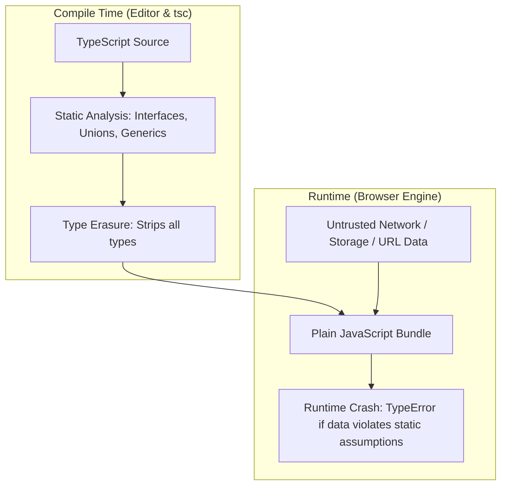
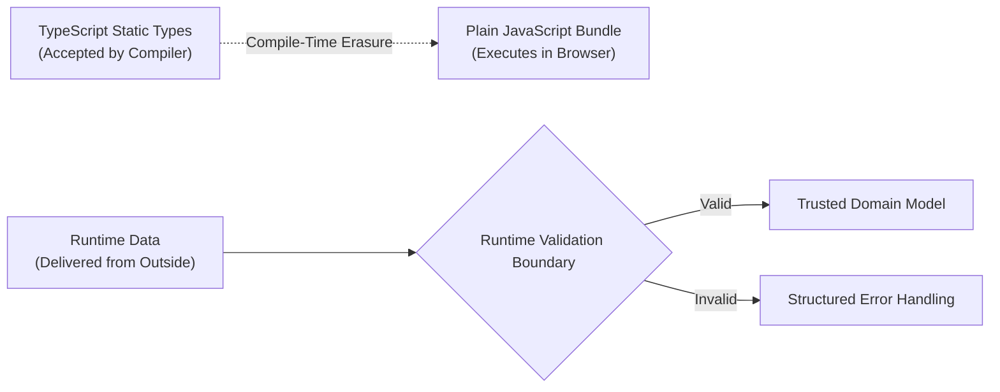
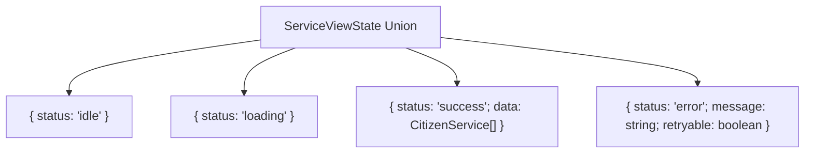
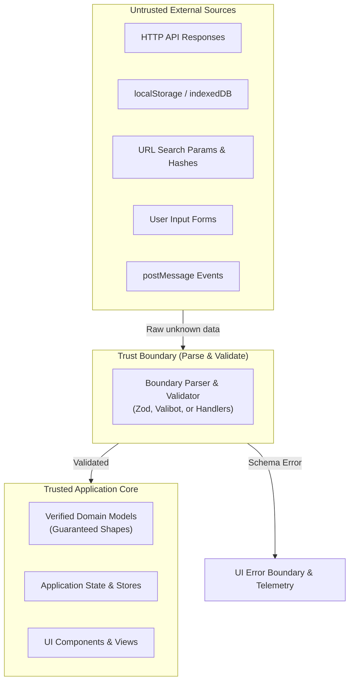

A front-end developer writes:

```typescript
interface CitizenService {
  id: string;
  name: string;
  fee: number;
  availableOnline: boolean;
}

async function loadService(id: string): Promise<CitizenService> {
  const response = await fetch(`/api/services/${id}`);
  return (await response.json()) as CitizenService;
}
```

The TypeScript compiler reports zero errors. The editor provides instant autocomplete for `service.name` and `service.fee`. The team feels protected by the type system.

Then the application deploys to production. 

A backend deployment introduces a breaking change, renaming `name` to `serviceName` and returning `fee` as an alphanumeric string (`"25000 IQD"`). Or the endpoint encounters a database timeout and returns a 200 OK with `{ "error": "Service temporarily unavailable" }`. 

The browser executes the JavaScript, passes the object straight into a calculation function, and crashes with:

```text
TypeError: Cannot read properties of undefined (reading 'toLowerCase')
```

The TypeScript annotation did nothing to stop the crash.

Why? Because **TypeScript types are completely erased at compile time**. The compiler analyzes source code to verify internal consistency, but the emitted JavaScript contains no runtime checks. An assertion (`as CitizenService`) is not a conversion, a validator, or a protective force field around external data. It is merely a command instructing the compiler to silence its doubts.



Reliable front-end architecture acknowledges this reality. External data - whether from an HTTP response, local storage, URL query parameters, user form input, or a third-party SDK - is **untrusted**.

In this chapter, we explore how to use TypeScript effectively: not as a superficial labeling mechanism, but as an architectural tool to model domain states, enforce exhaustive handling, and construct **runtime-validated boundaries** that convert untrusted input into verified, trusted application state.

---

## 1. Static Types Versus Runtime Values {#1-typescript-is-javascript-plus-static-type-analysis}

TypeScript enhances JavaScript with static type checking. Understanding where static analysis ends and runtime execution begins is the foundational skill of safe architecture:

* **Static Types:** Exist only in development and compilation. They describe what the developer and compiler *believe* about the code.
* **Runtime Values:** Exist in browser memory during execution. They represent what the outside world actually *delivered*.



### Type Inference First {#2-type-inference-first}

TypeScript's inference engine is sophisticated. Developers should allow TypeScript to infer local variables, loop indices, and straightforward return values automatically:

```typescript
// Unnecessary ceremony
const requestCount: number = 0;
const serviceName: string = "Residence Certificate";

// Clean, idiomatic inference
const requestCount = 0;
const serviceName = "Residence Certificate";
```

Explicit type annotations should be reserved for architectural boundaries: function signatures, interface contracts, complex data models, and places where inference would default to `any`.

---

## 2. Modeling State with Discriminated Unions {#5-model-data-do-not-merely-label-it}

One of the most frequent sources of UI bugs is representing state with loose, independent boolean flags:

```typescript
// Fragile state modeling
interface ServiceViewState {
  isLoading: boolean;
  error: string | null;
  data: CitizenService[] | null;
}
```

This model permits impossible runtime states: What if `isLoading` is `true` AND `error` is non-null? What if `isLoading` is `false`, but both `error` and `data` are `null`?

### Discriminated Unions Eliminate Impossible States {#12-discriminated-unions}

A **discriminated union** (or tagged union) uses a shared literal property (the "discriminant") to define a set of distinct, mutually exclusive variants:

```typescript
type ServiceViewState =
  | { status: 'idle' }
  | { status: 'loading' }
  | { status: 'success'; data: CitizenService[] }
  | { status: 'error'; message: string; retryable: boolean };
```

Every state is unambiguous. If `status === 'success'`, TypeScript automatically narrows the type so that `state.data` is guaranteed to exist. If `status === 'loading'`, attempting to read `state.data` produces a compile-time error.



### Exhaustiveness Checking with `never`

When rendering or handling a discriminated union, enforce exhaustive handling using the `never` type. If a new state variant is added in the future, the compiler will refuse to build until all `switch` branches are handled:

```typescript
function renderStatusBadge(state: ServiceViewState): string {
  switch (state.status) {
    case 'idle':
      return 'Waiting to start';
    case 'loading':
      return 'Fetching records...';
    case 'success':
      return `Loaded ${state.data.length} services`;
    case 'error':
      return `Error: ${state.message}`;
    default: {
      // If a new status is added, 'state' here is NOT never -> compile error!
      const _exhaustiveCheck: never = state;
      throw new Error(`Unhandled state variant: ${JSON.stringify(_exhaustiveCheck)}`);
    }
  }
}
```

---

## 3. The Honesty of `unknown` and Type Narrowing {#15-unknown-the-honest-type-for-untrusted-values}

In TypeScript, `any` and `unknown` represent two completely opposite philosophies:

* **`any` (The Escape Hatch):** Instructs the compiler to turn off all type checking. You can access arbitrary properties, call it as a function, or assign it anywhere. It silently disables type safety across your entire application.
* **`unknown` (The Honest Type):** Acknowledges that a value exists, but its shape is completely unknown. TypeScript forbids reading properties, indexing, or invoking an `unknown` value until you narrow it through runtime checks.

```typescript
// DANGEROUS: Type system is blind
const rawData: any = JSON.parse(storedString);
console.log(rawData.profile.name); // May crash at runtime!

// SAFE: Compiler enforces proof before access
const rawData: unknown = JSON.parse(storedString);
// rawData.profile.name -> Compile error: Object is of type 'unknown'.
```

### Type Narrowing Techniques

To safely use an `unknown` value, narrow its type using runtime JavaScript guards:

```typescript
function formatIdentifier(id: unknown): string {
  if (typeof id === 'string') {
    return id.toUpperCase(); // Narrowed to string
  }
  if (typeof id === 'number') {
    return `ID-${id.toFixed(0)}`; // Narrowed to number
  }
  throw new TypeError(`Expected string or number, received: ${typeof id}`);
}
```

### User-Defined Type Guards

A custom type guard uses a type predicate (`value is T`) in its return signature:

```typescript
interface ServicePayload {
  id: string;
  name: string;
}

function isServicePayload(value: unknown): value is ServicePayload {
  return (
    typeof value === 'object' &&
    value !== null &&
    'id' in value &&
    typeof (value as Record<string, unknown>).id === 'string' &&
    'name' in value &&
    typeof (value as Record<string, unknown>).name === 'string'
  );
}
```

> **Warning:** A type guard asserts truth to the compiler. If your boolean condition has a logic flaw (for example, failing to check `typeof name === 'string'`), TypeScript will accept the faulty object as valid. Hand-crafted type guards must be tested rigorously or replaced with schema parsing libraries.

---

## 4. Generics: Preserving Type Relationships {#20-generics-preserve-relationships-between-types}

Generics allow functions, interfaces, and classes to operate over multiple types while preserving the exact relationship between inputs and outputs.

Consider a standardized API response wrapper:

```typescript
type Result<T, E = Error> =
  | { ok: true; data: T }
  | { ok: false; error: E };

async function safeApiCall<T>(url: string, parser: (raw: unknown) => T): Promise<Result<T, string>> {
  try {
    const res = await fetch(url);
    if (!res.ok) {
      return { ok: false, error: `HTTP ${res.status}: ${res.statusText}` };
    }
    const json = await res.json();
    return { ok: true, data: parser(json) };
  } catch (err) {
    return { ok: false, error: err instanceof Error ? err.message : 'Unknown network failure' };
  }
}
```

Here, `safeApiCall` works for any domain model (`T`), returning either the parsed type `{ ok: true; data: T }` or a descriptive failure `{ ok: false; error: string }`.

---

## 5. Strictness and DOM Typing {#32-typing-the-dom}

In frontend programming, the DOM is an external system. Browser APIs return types that can be `null` or generic `Element` subclasses.

### Strict Compiler Flags

Enterprise projects must enable strict mode in `tsconfig.json`:

```json
{
  "compilerOptions": {
    "strict": true,
    "noImplicitAny": true,
    "strictNullChecks": true,
    "noUncheckedIndexedAccess": true
  }
}
```

With `strictNullChecks`, TypeScript prevents accessing properties on values that might be `null` or `undefined`.

### Querying the DOM Safely

Never use non-null assertions (`!`) on DOM queries:

```typescript
// ANTI-PATTERN: If HTML changes, this throws at runtime
const button = document.querySelector('#submit-btn')!;
button.addEventListener('click', () => {});

// SAFE: Treat null as an expected condition
const button = document.querySelector<HTMLButtonElement>('#submit-btn');
if (button) {
  button.addEventListener('click', () => {});
} else {
  console.warn('Button #submit-btn not found in active document.');
}
```

### Event Typing and CurrentTarget

When typing event handlers, prefer `event.currentTarget` over `event.target`:
* `event.target` is typed as `EventTarget | null` because the click could have originated on a nested `<span>` or `<svg>`.
* `event.currentTarget` represents the specific element to which the listener is bound (e.g. `HTMLFormElement`).

```typescript
function handleFormSubmit(event: SubmitEvent) {
  event.preventDefault();
  const form = event.currentTarget as HTMLFormElement;
  const formData = new FormData(form);
  // Process validated formData...
}
```

---

## 6. The Trust Boundary Architecture {#40-trust-boundaries}

A **trust boundary** is any perimeter where external, unverifiable data enters your application runtime:



### The Assertion Trap {#38-assertions-can-hide-bugs}

Avoid casting API responses directly with `as`:

```typescript
// THE DANGEROUS SHORTCUT
const data = (await res.json()) as CitizenService[];
```

An assertion produces zero bytes of runtime JavaScript. It silences compiler errors, but guarantees that any schema mismatch will surface as an unhandled exception deep inside your UI components.

---

## 7. Parse, Don't Validate {#48-parse-do-not-merely-check}

The phrase **"Parse, don't validate"** (coined by Alexis King) captures the distinction between checking a condition and transforming data:

* **Validation:** Checks if a value satisfies a condition and returns a boolean. The value remains untyped or loosely typed.
* **Parsing:** Inspects a raw value, verifies its structural conformity, and transforms it into a specialized, strongly typed data structure that cannot be created without passing through the parser.

### Runtime Schema Parsing with Libraries

Modern web engineering frequently employs schema libraries such as **Zod** or **Valibot**. These libraries allow developers to define a runtime validator and infer the static TypeScript type from it simultaneously:

```typescript
import { z } from 'zod';

// 1. Define runtime validation schema
export const CitizenServiceSchema = z.object({
  id: z.string().regex(/^SR-\d{4}$/, 'Invalid reference format'),
  name: z.string().min(1, 'Service name is required'),
  fee: z.number().nonnegative('Fee cannot be negative'),
  availableOnline: z.boolean(),
  department: z.enum(['Civil', 'Housing', 'Legal'])
});

// 2. Automatically derive static TypeScript type from schema
export type CitizenService = z.infer<typeof CitizenServiceSchema>;
```

If the backend changes or delivers malformed data, the parser rejects it at the boundary with an informative, structural error report before any application state is corrupted.

### Hand-Written Parser Alternative

For environments that avoid third-party dependencies, write explicit parser functions that return a discriminated `Result`:

```typescript
export function parseCitizenService(raw: unknown): Result<CitizenService, string> {
  if (typeof raw !== 'object' || raw === null) {
    return { ok: false, error: 'Expected object payload' };
  }

  const record = raw as Record<string, unknown>;

  if (typeof record.id !== 'string' || !/^SR-\d{4}$/.test(record.id)) {
    return { ok: false, error: 'Field "id" must match format SR-XXXX' };
  }
  if (typeof record.name !== 'string' || record.name.trim() === '') {
    return { ok: false, error: 'Field "name" must be a non-empty string' };
  }
  if (typeof record.fee !== 'number' || record.fee < 0) {
    return { ok: false, error: 'Field "fee" must be a non-negative number' };
  }
  if (typeof record.availableOnline !== 'boolean') {
    return { ok: false, error: 'Field "availableOnline" must be boolean' };
  }

  // Successfully parsed into trusted domain shape
  return {
    ok: true,
    data: {
      id: record.id,
      name: record.name.trim(),
      fee: record.fee,
      availableOnline: record.availableOnline
    }
  };
}
```

---

## 8. Optional Advanced Pattern: Branded Types {#52-branded-types}

Because TypeScript uses **structural typing**, two types with identical properties are interchangeable:

```typescript
type UserId = string;
type ServiceId = string;

function cancelApplication(user: UserId, service: ServiceId) { ... }

const user: UserId = "USR-99";
const service: ServiceId = "SR-1042";

// Silent bug: Arguments swapped! Compiler permits this because both are string!
cancelApplication(service, user);
```

### Simulating Nominal Types with Brands

A **branded type** attaches a unique phantom symbol to a primitive type:

```typescript
declare const BrandSymbol: unique symbol;

export type Branded<T, B> = T & { readonly [BrandSymbol]: B };

export type ServiceId = Branded<string, 'ServiceId'>;
export type UserId = Branded<string, 'UserId'>;

function cancelApplication(user: UserId, service: ServiceId) { ... }

// Now, swapping them produces a compile error:
// Argument of type 'ServiceId' is not assignable to parameter of type 'UserId'.
```

Branded types should remain an **optional pattern**. Use them strictly where domain mix-ups cause critical business errors (e.g. monetary balances, cryptographic keys, database IDs), and generate brands exclusively inside validation parsers.

---

## 9. The Complete Runtime-Validated Data Boundary {#55-the-complete-running-example}

We now assemble an end-to-end trusted boundary service for our Citizen Services application:

```typescript
// service-boundary.ts
export type Result<T, E = Error> =
  | { ok: true; data: T }
  | { ok: false; error: E };

export interface ServiceRecord {
  id: string;
  name: string;
  feeIqd: number;
  isAvailable: boolean;
}

export class BoundaryError extends Error {
  constructor(
    public readonly kind: 'transport' | 'schema',
    message: string,
    public readonly details?: unknown
  ) {
    super(message);
    this.name = 'BoundaryError';
  }
}

/**
 * Validates and transforms an untrusted API response into trusted domain state.
 */
export async function fetchServiceById(
  id: string,
  signal?: AbortSignal
): Promise<Result<ServiceRecord, BoundaryError>> {
  let response: Response;

  // 1. Transport phase
  try {
    response = await fetch(`/api/services/${encodeURIComponent(id)}`, { signal });
  } catch (err) {
    if (err instanceof Error && err.name === 'AbortError') {
      throw err; // Let caller manage intentional cancellation
    }
    return {
      ok: false,
      error: new BoundaryError('transport', 'Network transport failed to reach server', err)
    };
  }

  if (!response.ok) {
    return {
      ok: false,
      error: new BoundaryError('transport', `Server returned HTTP ${response.status}`)
    };
  }

  // 2. Ingestion phase (treat body as unknown)
  let rawJson: unknown;
  try {
    rawJson = await response.json();
  } catch (err) {
    return {
      ok: false,
      error: new BoundaryError('schema', 'Malformed JSON payload received', err)
    };
  }

  // 3. Validation and parsing phase
  return parseServiceRecord(rawJson);
}

function parseServiceRecord(raw: unknown): Result<ServiceRecord, BoundaryError> {
  if (typeof raw !== 'object' || raw === null) {
    return {
      ok: false,
      error: new BoundaryError('schema', 'Expected object payload')
    };
  }

  const rec = raw as Record<string, unknown>;

  if (typeof rec.id !== 'string' || !rec.id.startsWith('SR-')) {
    return {
      ok: false,
      error: new BoundaryError('schema', 'Missing or invalid service ID format (expected "SR-XXXX")')
    };
  }
  if (typeof rec.name !== 'string' || rec.name.trim().length === 0) {
    return {
      ok: false,
      error: new BoundaryError('schema', 'Service name must be a valid non-empty string')
    };
  }
  if (typeof rec.feeIqd !== 'number' || rec.feeIqd < 0) {
    return {
      ok: false,
      error: new BoundaryError('schema', 'Fee must be a non-negative number')
    };
  }
  if (typeof rec.isAvailable !== 'boolean') {
    return {
      ok: false,
      error: new BoundaryError('schema', 'Service availability must be a boolean flag')
    };
  }

  // Emits verified domain record
  return {
    ok: true,
    data: {
      id: rec.id,
      name: rec.name.trim(),
      feeIqd: rec.feeIqd,
      isAvailable: rec.isAvailable
    }
  };
}
```

### Component Consumption and Error Surfacing

```typescript
// app.ts - Consuming trusted domain records
async function renderServiceView(serviceId: string, statusContainer: HTMLElement) {
  const result = await fetchServiceById(serviceId);

  if (!result.ok) {
    if (result.error.kind === 'transport') {
      statusContainer.textContent = 'Connection error. Please check your internet or retry.';
    } else {
      statusContainer.textContent = 'Service record received in unexpected format. Admin notified.';
    }
    console.error(`[Boundary Failure: ${result.error.kind}]`, result.error.message);
    return;
  }

  // TypeScript guarantees result.data matches ServiceRecord!
  const service = result.data;
  statusContainer.textContent = `Service: ${service.name} (Fee: ${service.feeIqd.toLocaleString()} IQD)`;
}
```

---

## Misconceptions to Leave Behind {#misconceptions-to-leave-behind}

* **“If it compiles without errors, the runtime data is safe.”** Types are erased during compilation. External data from networks, storage, or forms bypasses compile-time checks completely unless validated at runtime.
* **“Type assertions (`as Type`) convert or sanitize data.”** Assertions only instruct the compiler to silence errors. They execute no runtime conversion or validation whatsoever.
* **“`any` and `unknown` are essentially the same.”** `any` disables type checking; `unknown` enforces type checking by requiring proof before access.
* **“Hand-written type guards (`value is T`) are always safe.”** A type guard is only as reliable as its internal boolean logic. If the guard checks three fields but your interface has four, the compiler will assume the fourth field is valid.
* **“Branded types should be used for every string and number.”** Nominal branding creates structural overhead and ceremony. Reserve brands for sensitive, easily confused identifiers (e.g. `UserId` vs `OrgId`).
* **“Validation errors should expose raw server payloads to users.”** Raw errors confuse users and may leak backend architecture or sensitive data. Translate validation errors into user-friendly diagnostic messages at the UI boundary.

---

## Chapter Summary {#chapter-summary}

1. **Type Erasure** means TypeScript types exist solely at compile time; runtime behavior is identical to plain JavaScript.
2. **Discriminated Unions** model application state unambiguously by pairing a discriminant property with exhaustive `never` checks.
3. **`unknown`** is the honest type for untrusted external data, forcing developers to narrow values before reading properties.
4. **Type Assertions (`as T`)** are hazardous at trust boundaries and must not replace runtime validation.
5. **Generics** preserve type relationships across asynchronous data fetching and utility operations.
6. **Strict Mode** (`strictNullChecks`, `noImplicitAny`) is essential for catching null dereferences and boundary flaws.
7. **Trust Boundaries** exist wherever data enters the runtime from outside (APIs, storage, URLs, forms).
8. **"Parse, Don't Validate"** converts raw input into verified domain structures, ensuring invalid states cannot enter application logic.
9. **Schema Libraries (Zod / Valibot)** synchronize runtime validation with static TypeScript type derivation.
10. **Branded Types** simulate nominal typing to prevent accidental confusion between structurally identical primitives.

---

## Review Questions {#review-questions}

1. What happens to TypeScript type annotations when code is compiled to JavaScript?
2. Explain why writing `const data = (await res.json()) as User` is dangerous at an API boundary.
3. How does a discriminated union prevent impossible states in an asynchronous UI component?
4. What role does the `never` type play in exhaustiveness checking?
5. Contrast `any` with `unknown` from both a compiler and runtime safety perspective.
6. Why does `typeof value === 'object'` fail to prove that `value` is not `null`?
7. What is a type predicate, and how is it declared in a custom type guard?
8. Explain the principle of "Parse, don't validate."
9. How do schema libraries like Zod derive static TypeScript types from runtime validators?
10. What is the difference between a transport failure and a schema validation failure?
11. Why should `strictNullChecks` always be enabled in professional TypeScript configurations?
12. How should an engineer handle a `document.querySelector` call without using the `!` assertion operator?
13. In an event listener, why is `event.currentTarget` generally typed more predictably than `event.target`?
14. What problem do branded (nominal) types solve in a structurally typed language?
15. In what layer of an application should branded types be created?
16. How does `noUncheckedIndexedAccess` change array and record indexing behavior in TypeScript?
17. What is the difference between an interface and a type alias in modern TypeScript?
18. Why is validating URL search parameters necessary even if the user navigated from an internal link?
19. How can a generic constraint (`<T extends Record<string, unknown>>`) protect a utility function?
20. Why shouldn't raw schema validation errors be displayed directly to end users?
21. What is the difference between shallow property checking and deep structural validation?
22. How does a discriminated `Result<T, E>` pattern improve on traditional `try...catch` blocks?
23. Why can generated API types (e.g. from OpenAPI or GraphQL) still fail at runtime?
24. How does structural typing allow two differently named interfaces to satisfy the same function parameter?
25. Describe the three phases of the Boundary Architecture: Ingestion, Validation, Mapping.
26. How can an event hub maintain typed event maps while keeping subscriber callbacks flexible?

---

## Practical Lab Brief {#end-of-chapter-practical-lab--build-a-runtime-validated-data-boundary}

Apply the concepts of this chapter in the companion laboratory:
[Practical 05 - Runtime-Validated Data Boundary]().

You will construct an API trust boundary that ingests `unknown` responses, parses and validates them against domain schemas, tests malformed, partial, and unexpected payloads, and surfaces structured diagnostics to the UI. You will also extend the Chapter 4 event hub with compile-time TypeScript type maps.

---

## Key Terms {#key-terms}

* **Type Erasure**: The process during compilation where all TypeScript types, interfaces, and annotations are stripped, leaving plain JavaScript.
* **Discriminated Union**: A union of object types that share a common literal discriminant property used for type narrowing.
* **Exhaustiveness Checking**: Using the `never` type to ensure every possible variant of a union is handled in a conditional or switch statement.
* **`unknown`**: A top type representing an unverified value that cannot be operated upon until narrowed through runtime checks.
* **Type Guard**: A runtime check that informs TypeScript's compiler of a more specific type within a given scope.
* **Trust Boundary**: The architectural perimeter where external, untrusted data enters the application.
* **Type Assertion (`as T`)**: A compile-time override instructing TypeScript to treat a value as a specific type without checking it at runtime.
* **"Parse, Don't Validate"**: The architectural practice of transforming unstructured input into structured, verified types.
* **Branded Type**: A technique attaching a unique phantom symbol to a primitive type to enforce nominal typing.
* **Structural Typing**: A typing system where type compatibility is determined solely by shape and properties, not explicit declarations.

---

## From Data Boundaries to Reusable Interfaces {#closing-perspective}

With runtime validation established at the perimeter, our application can safely rely on verified, predictable data models. The next architectural challenge is UI modularity: how can we structure components that consume this trusted data without creating tightly coupled, monolithic view hierarchies?

[Chapter 6 - Component-Driven Architecture and Design Patterns]() examines component responsibilities, state ownership, compound component patterns, and headless contracts that allow UI components to remain flexible, accessible, and resilient as products scale.
