A team deploys an initial release of a product catalogue for a municipal public-service portal. Initially, the feature resides entirely within a single file: `CataloguePage.tsx`. At 1,200 lines of code, it contains eighteen reactive state variables, three network fetch effects, inline SVG icons, complex filter algorithms, pagination mathematics, a modal confirmation dialog, and cart submission handlers.

In the first two weeks, development feels rapid. Everything is in one place; any variable can be accessed directly without passing props through intermediate layers.

Then requirements evolve:
1. Marketing requests that the product card appear inside a promotional carousel on the homepage.
2. An accessibility audit discovers that keyboard focus inside the detail modal leaks into the background pagination buttons.
3. A pricing change introduces volume discounts, and updating the calculation inadvertently breaks the category filter reset button.

In response, the team attempts a rapid refactor. Working under pressure, they extract every repeating `<div>` and HTML snippet into its own file. Two weeks later, the codebase suffers from the opposite pathology: **component explosion**. The project now has 38 miniature components - `HeaderWrapper`, `HeaderTitleContainer`, `CardRowLayout`, `PriceTypography` - where passing a single click callback requires drilling through six layers of inert wrappers. A developer attempting to trace what happens when a citizen clicks "Apply Now" must navigate across ten open files.

Both extremes stem from the same root misunderstanding: treating components as visual snippets or file-splitting conveniences rather than **architectural boundaries of responsibility**.

The difficult question in front-end architecture is never *how* to create a component - framework documentation answers that in minutes. The difficult question is:

> **Where should one component end and another begin?**

A good component boundary clarifies ownership. It isolates volatility, encapsulates private mechanics, exposes a minimal public contract, and creates natural units for testing and team collaboration. In this chapter, we explore component architecture from first principles: decomposing complex interfaces, designing stable public APIs, establishing controlled state boundaries, applying compound and headless patterns, and organizing systems by domain capabilities rather than incidental visual layout.

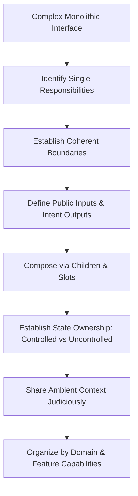

---

## 1. Why Components Exist Beyond Simple Reuse

In software engineering discussions, components are frequently introduced with a single justification: *code reuse*. While reuse is valuable, elevating it to the primary criterion for component extraction leads to severe design errors. Many of the most critical components in a production application - such as an `AnnualBudgetApprovalPanel`, a `CheckoutFlowCoordinator`, or an `InteractiveMapCanvas` - will only ever be instantiated once.

Components exist primarily to establish **boundaries of human reasoning**:

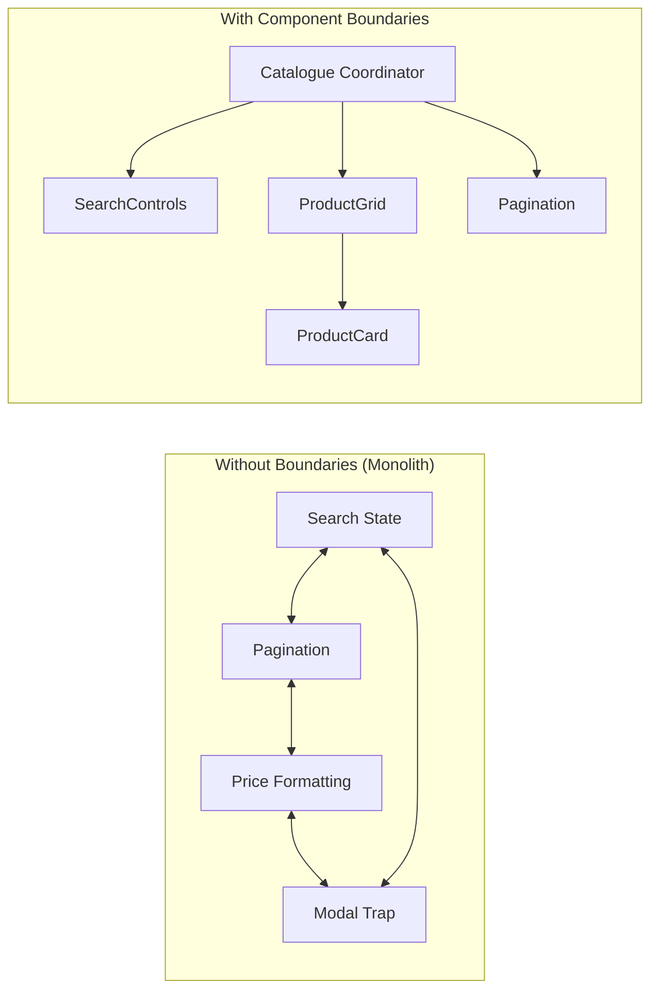

### 1.1 The Five Architectural Drivers

When evaluating whether an interface section deserves a component boundary, architects consider five interrelated concerns:

1. **Reasoning Boundaries (Cognitive Load Reduction):** A developer modifying the currency formatting rules for an item should not need to keep pagination indices, network error retries, and filter dropdown states in active working memory. A component boundary hides irrelevant complexity behind an understandable abstraction.
2. **Isolation and Encapsulation:** Components establish a privacy perimeter. Internal state variables, helper calculations, and intermediate DOM node references remain private. External consumers interact exclusively through a declared public contract.
3. **Change Isolation (Volatility Decoupling):** Different parts of an interface change for different reasons and at different rates. Visual themes change independently of business calculation rules; filter algorithms change independently of card layout. Placing volatile logic inside a boundary prevents ripples from destabilizing unrelated features.
4. **Testing Boundaries:** Testing a monolithic page requires simulating an entire browser environment with complete network fixtures, complex route setups, and multi-step user flows. An isolated component can be unit-tested or contract-tested in milliseconds against specific prop combinations.
5. **Team Ownership and Colocation:** In large engineering organizations, multiple teams collaborate within the same application. Well-defined component perimeters allow teams to work in parallel on adjacent features without merge collisions or shared mutable state conflicts.

### 1.2 The Two Bad Extremes

Front-end codebases typically swing between two design failures:

| Extreme | Manifestation | Architectural Failure | Consequence |
|---|---|---|---|
| **The God Component** | A 1,500-line file managing network, layout, validation, and child DOM nodes. | Zero encapsulation; all state is shared and mutable. | Fragile edits, merge conflicts, untestable permutations, high cognitive burden. |
| **Component Explosion** | Dozens of 10-line wrapper files (`Box`, `TextWrapper`, `ButtonInnerIcon`). | Excessive indirection; decomposition without responsibility. | High navigation latency, prop-drilling friction, obscured control flow, lost context. |

The goal of component architecture is neither maximum consolidation nor maximum fragmentation. A component should exist when and only when it owns a **coherent responsibility**.

---

## 2. Finding Coherent Component Boundaries

To establish whether a boundary is justified, architects evaluate five diagnostic questions before writing code or splitting files.

### 2.1 The Five Boundary Diagnostic Questions

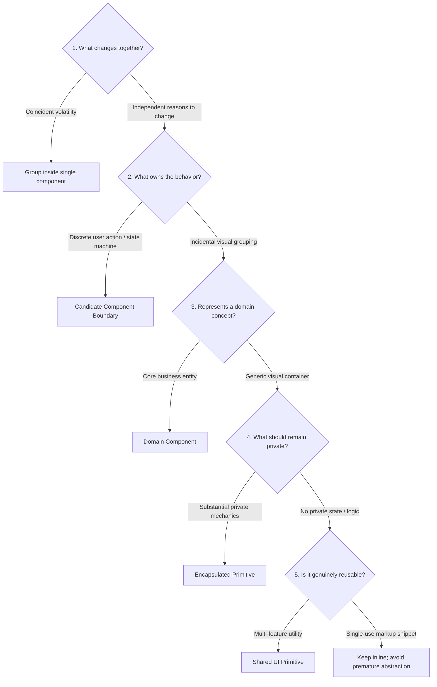

#### Question 1: What Changes Together?
If changing the design of a product price badge requires editing the same styles and markup every time, those elements belong together. Conversely, if the search input's debounce delay changes every time analytics requirements change, but the product grid layout changes when marketing updates typography, keeping them in the same component couples two independent axes of change.

#### Question 2: What Owns the Behavior?
Ask: *Which entity has the authority to make decisions about this interaction?* A date picker popup owns the calendar navigation behavior (moving between months, highlighting weekends). However, it does not own the business decision of whether a selected date is valid for an appointment; that decision belongs to the booking form coordinator.

#### Question 3: What Represents One Domain Concept?
Domain models provide natural component seams. In a healthcare portal, `PatientAllergyAlert`, `PrescriptionSchedule`, and `DosageCalculator` represent established business concepts with distinct rules. Structuring components around domain concepts ensures that code reflects business reality rather than accidental CSS layout boxes.

#### Question 4: What Should Remain Private?
If a button toggles an internal animated disclosure panel, the animation timing, SVG rotation classes, and DOM IDs should remain hidden inside the component. Callers should only need to know whether the disclosure is open or closed.

#### Question 5: What is Genuinely Reusable?
True reuse implies that multiple call sites share identical behavior and contracts across different features. If two buttons merely look similar today but serve different business purposes and will evolve under different stakeholder requirements, extracting a rigid shared abstraction prematurely creates expensive coupling.

### 2.2 Component Boundaries vs. State Boundaries

A critical architectural principle is that **a component boundary does not automatically constitute a state boundary**:

```mermaid
flowchart TD
    subgraph PageBoundary["Page State Boundary (Shared Truth)"]
        State["selectedItem: ItemId | null\nquery: string"]
        
        subgraph Comp1["Component Boundary 1: SearchToolbar"]
            Input["<input />"]
        end
        
        subgraph Comp2["Component Boundary 2: ProductGrid"]
            Card1["ProductCard"]
            Card2["ProductCard"]
        end
    end
    
    Input -->|emits onQueryChange| State
    State -->|supplies filteredItems| Comp2
```

Extracting markup into a child component (`ProductCard`) does not mean the child must own its selection state. If the parent page needs to synchronize selection with an external URL or open a side drawer, the state boundary remains at the parent level, while the visual and presentation boundary is delegated downward.

---

## 3. Component Inputs, Outputs, and Public Contracts

A component's public interface is a long-term engineering contract. Every prop accepted, event emitted, and slot exposed represents an API that callers will depend on.

### 3.1 Unidirectional Data Flow: Props Down, Events Up

Modern component frameworks (React, Vue, Svelte, Web Components) adhere to unidirectional data flow:

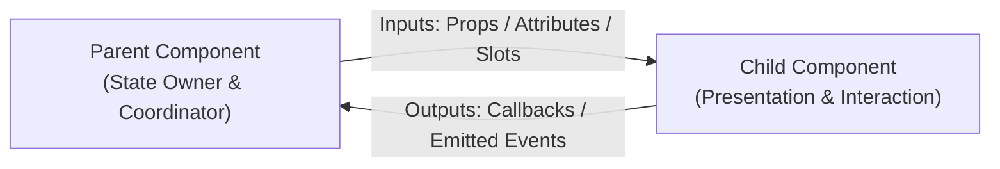

* **Inputs (Props):** Pure data structures and configuration passed downwards from parent to child. In pure component models, props are immutable inputs; children never mutate their incoming props directly.
* **Outputs (Events / Callbacks):** Signals emitted upwards to notify parents that a user interaction or internal state change occurred. The child does not decide how the application responds; it merely reports what happened.

### 3.2 Prefer Intent-Oriented APIs Over DOM-Leaking APIs

A common anti-pattern in component API design is exposing raw browser DOM events directly across domain component boundaries:

```typescript
// ❌ LEAKY DOM-ORIENTED API
// Forces the parent to inspect DOM synthetic events and know child internals
interface ServiceCardProps {
  service: CitizenService;
  onClick: (event: React.MouseEvent<HTMLButtonElement>) => void;
  onKeyDown: (event: React.KeyboardEvent<HTMLDivElement>) => void;
}
```

```typescript
//  INTENT-ORIENTED DOMAIN API
// Expresses domain semantics; encapsulates DOM mechanics inside the card
interface ServiceCardProps {
  service: CitizenService;
  onSelect: (serviceId: ServiceId) => void;
  onRequestAssistance: (serviceId: ServiceId) => void;
}
```

Intent-oriented APIs decouple the parent from whether the card triggers selection via a `<button>`, an `<a>` tag, a keypress, or a touch gesture. The parent receives meaningful domain notifications (`onSelect`) rather than raw pointer coordinates.

### 3.3 Composition via Children and Slots

Inheritance was historically used in object-oriented GUI frameworks to extend component behavior (e.g., `CustomButton extends BaseButton`). Modern front-end architecture decisively favors **composition over inheritance**.

Composition allows parents to assemble arbitrary child content inside designated insertion zones without the child needing to know what will be rendered:

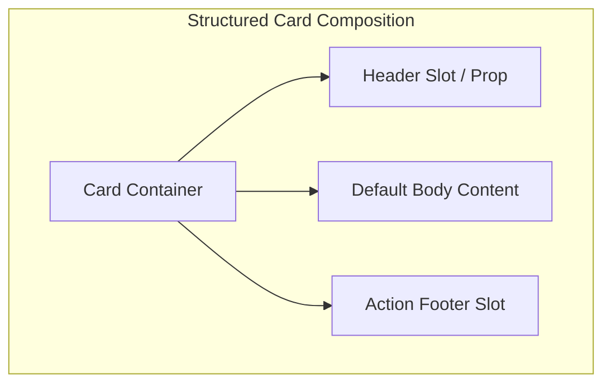

In React, composition is achieved via the `children` prop and specialized slot props:

```tsx
interface ModalProps {
  title: string;
  headerActions?: React.ReactNode;
  children: React.ReactNode;
  footerActions?: React.ReactNode;
}

export function Modal({ title, headerActions, children, footerActions }: ModalProps) {
  return (
    <div className="modal-dialog" role="dialog" aria-labelledby="modal-title">
      <header className="modal-header">
        <h2 id="modal-title">{title}</h2>
        {headerActions}
      </header>
      <div className="modal-body">{children}</div>
      {footerActions && <footer className="modal-footer">{footerActions}</footer>}
    </div>
  );
}
```

In Vue, the equivalent architectural pattern uses template slots (`<slot>` and named slots `v-slot:footer`):

```vue
<template>
  <div class="modal-dialog" role="dialog" aria-labelledby="modal-title">
    <header class="modal-header">
      <h2 id="modal-title">{{ title }}</h2>
      <slot name="header-actions" />
    </header>
    <div class="modal-body">
      <slot />
    </div>
    <footer v-if="$slots.footer" class="modal-footer">
      <slot name="footer" />
    </footer>
  </div>
</template>
```

### 3.4 Eliminating Boolean Prop Explosion

When requirements expand, poorly architected components accumulate a sprawling array of boolean flags:

```typescript
// ❌ BOOLEAN PROP EXPLOSION (2^8 = 256 possible permutations)
interface ButtonProps {
  primary?: boolean;
  secondary?: boolean;
  danger?: boolean;
  outline?: boolean;
  isLoading?: boolean;
  isDisabled?: boolean;
  isCompact?: boolean;
  isIconOnly?: boolean;
}
```

Boolean flags create nonsensical states that nobody designed: what happens if a caller passes `primary={true} secondary={true} danger={true}`? Does `isLoading` override `isDisabled`?

Architects eliminate boolean clutter by modeling mutually exclusive variants using union types:

```typescript
//  DISCRIMINATED STATE CONTRACT
export type ButtonVariant = 'primary' | 'secondary' | 'danger' | 'ghost';
export type ButtonSize = 'compact' | 'normal' | 'spacious';

export interface ButtonBaseProps {
  variant?: ButtonVariant;
  size?: ButtonSize;
  children: React.ReactNode;
}

export type ButtonActionProps =
  | { status: 'idle'; onClick: () => void; disabled?: boolean }
  | { status: 'loading'; loadingLabel?: string }
  | { status: 'success'; message?: string };

export type ButtonProps = ButtonBaseProps & ButtonActionProps;
```

---

## 4. Controlled vs. Uncontrolled Components: The State Ownership Contract

One of the most consequential decisions in front-end architecture is whether a component is **controlled** or **uncontrolled**. This distinction is an architectural contract regarding state ownership.

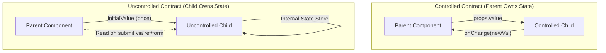

### 4.1 Comparing the Two Models

| Architectural Dimension | Controlled Component | Uncontrolled Component |
|---|---|---|
| **Source of Truth** | The parent component or external store. | The internal DOM node or internal component state. |
| **Data Propagation** | Receives current state via `value` prop; notifies parent via `onChange`. | Manages value internally; receives only optional initial state (`defaultValue`). |
| **External Interception** | Immediate: parent can format, reject, or transform every keystroke. | Delayed: parent only inspects value upon submission or boundary trigger. |
| **Performance Profile** | Re-renders parent component on every interaction unless memoized. | Localized re-renders; zero parent re-renders during active input. |
| **Primary Use Cases** | Live filtering, multi-field validation, synchronized tabs, undo stacks. | Simple forms, isolated transient inputs, large file upload fields. |

### 4.2 The Danger of Half-Controlled APIs

A dangerous flaw in component design is the ambiguous "half-controlled" component:

```tsx
// ❌ AMBIGUOUS OWNERSHIP BUG
function SearchBox({ value, defaultValue, onChange }) {
  const [internalValue, setInternalValue] = useState(value ?? defaultValue ?? "");
  // What happens when props.value updates externally?
  // What happens when internal keystrokes fire? Which state wins?
}
```

Half-controlled components result in desynchronization bugs where user typing is suddenly overwritten by parent prop updates, or external resets fail to update the displayed input.

A well-designed component explicitly branches its state machine:

```typescript
export function useControlledState<T>(
  controlledValue: T | undefined,
  defaultValue: T,
  onChange?: (val: T) => void
): [T, (next: T) => void] {
  const isControlled = controlledValue !== undefined;
  const [internalValue, setInternalValue] = useState<T>(defaultValue);

  const currentValue = isControlled ? controlledValue : internalValue;

  const updateValue = useCallback((next: T) => {
    if (!isControlled) {
      setInternalValue(next);
    }
    onChange?.(next);
  }, [isControlled, onChange]);

  return [currentValue, updateValue];
}
```

---

## 5. Advanced Composition Patterns: Compound Components and Headless UI

As user interfaces grow in sophisticated interaction requirements, simple prop configurations break down. Two advanced architectural patterns resolve this tension: **Compound Components** and **Headless Components**.

### 5.1 Compound Components

A compound component is a family of related components that coordinate together to deliver a single cohesive interaction model, sharing state implicitly through context rather than explicit prop drilling.

Classic examples include `<Select>`, `<Tabs>`, `<Accordion>`, and `<Table>`.

Consider a compound Tabs API:

```tsx
// Caller-facing consumption:
export function AccountSettings() {
  return (
    <Tabs defaultValue="profile">
      <Tabs.List aria-label="Account Sections">
        <Tabs.Tab value="profile">Profile</Tabs.Tab>
        <Tabs.Tab value="security">Security</Tabs.Tab>
        <Tabs.Tab value="billing">Billing</Tabs.Tab>
      </Tabs.List>

      <Tabs.Panel value="profile">
        <ProfileEditor />
      </Tabs.Panel>
      <Tabs.Panel value="security">
        <SecuritySettings />
      </Tabs.Panel>
      <Tabs.Panel value="billing">
        <BillingHistory />
      </Tabs.Panel>
    </Tabs>
  );
}
```

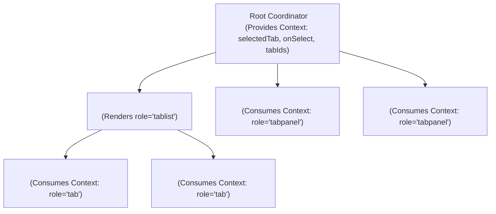

#### Why Compound Components Excel
1. **Structural Inversion:** The caller controls markup order and layout. You can place the `Tabs.List` on top, on the bottom, or inside a sticky sidebar without modifying the root component's props.
2. **Clean Separation:** Each sub-component owns its specific accessibility attributes (`role="tab"`, `aria-selected`, `aria-controls`).
3. **No Mega-Props:** Callers do not pass a fragile 50-line array of tab configuration objects.

### 5.2 Headless UI: Decoupling Behavior from Styling

In modern multi-platform and design-system engineering, UI components often need identical keyboard navigation, focus management, and ARIA state machines, but drastically different visual representations (e.g., desktop drawer vs. mobile modal sheet).

**Headless UI** separates interaction mechanics from visual markup:

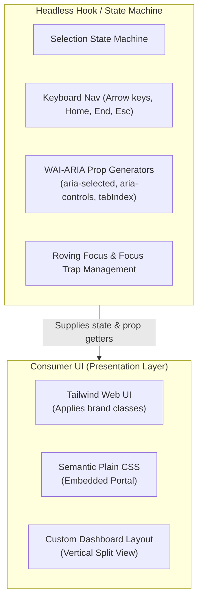

A headless hook returns state and **prop getters** that wire standard accessibility behavior directly onto whatever elements the caller renders:

```typescript
// Headless custom hook:
export function useTabsHeadless({ defaultValue, orientation = 'horizontal' }: TabsOptions) {
  const [selectedTab, setSelectedTab] = useState(defaultValue);
  const [focusedTab, setFocusedTab] = useState(defaultValue);

  const getTabProps = (tabId: string) => ({
    role: 'tab' as const,
    id: `tab-${tabId}`,
    'aria-selected': selectedTab === tabId,
    'aria-controls': `panel-${tabId}`,
    tabIndex: selectedTab === tabId ? 0 : -1,
    onClick: () => setSelectedTab(tabId),
    onFocus: () => setFocusedTab(tabId),
  });

  const getPanelProps = (tabId: string) => ({
    role: 'tabpanel' as const,
    id: `panel-${tabId}`,
    'aria-labelledby': `tab-${tabId}`,
    hidden: selectedTab !== tabId,
  });

  return { selectedTab, setSelectedTab, getTabProps, getPanelProps };
}
```

### 5.3 Context and Dependency Injection: Avoiding the Hidden Coupling Trap

Frameworks provide mechanisms to share values down a tree without manual prop drilling (React Context, Vue `provide`/`inject`). 

While context is essential for compound components, design tokens, and authenticated session state, architects use it judiciously:

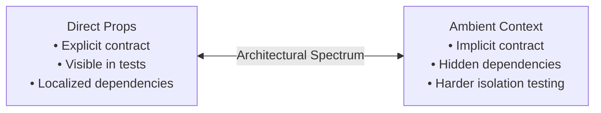

* **Good Context Usage:** Ambient, application-wide data that changes infrequently and is required by hundreds of components at varying depths: `CurrentLocale`, `ThemeTokens`, `AuthSession`.
* **Dangerous Context Usage:** Passing feature-specific parameters (e.g., `cartItemIndex`, `isCardExpanded`) via global context to bypass two layers of props. This destroys component reusability; the child can no longer be tested or rendered outside that specific context provider.

---

## 6. Design Methodologies: Atomic Design, Features, and Domain Decomposition

How should components be categorized and organized within an enterprise repository? Several design methodologies offer competing organizing lenses.

### 6.1 Atomic Design as a Visual Lens

Brad Frost's **Atomic Design** categorizes UI into five structural tiers:

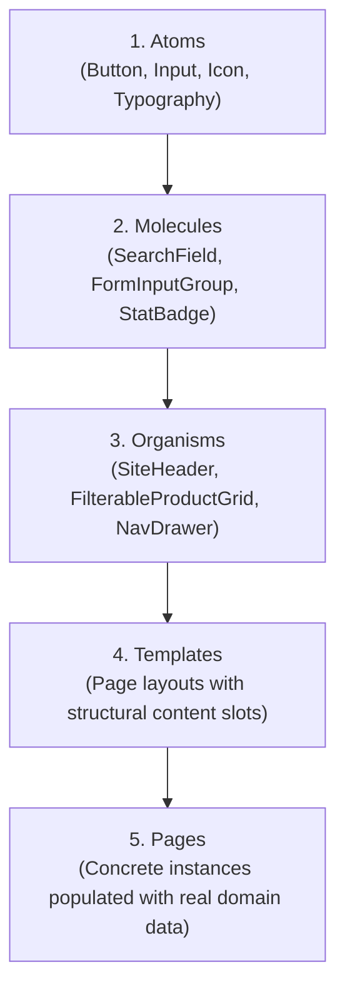

#### Strengths & Limitations of Atomic Design
* **Where It Shines:** Shared Design Systems. It provides design tokens, visual consistency, and a structured vocabulary for UI engineering libraries.
* **Where It Fails:** Complex Business Applications. In enterprise applications, categorizing a `DischargeMedicationReconciliationWidget` as a "molecule" or an "organism" creates endless semantic debate without delivering architectural value. It organizes code by *visual size* rather than *business capability*.

### 6.2 Feature- and Domain-Oriented Decomposition

Production applications scale best when organized by **business domains and features**:

```text
src/
├── shared/                         # Cross-domain generic layer
│   ├── ui/                         # Design-system primitives (Atoms/Molecules)
│   │   ├── Button/
│   │   ├── Dialog/
│   │   └── Tabs/
│   └── platform/                   # Storage, HTTP client, telemetry
│
├── domains/                        # Core business rules & entities
│   ├── identity/
│   ├── services/
│   └── payments/
│
└── features/                       # User-facing composite capabilities
    ├── service-catalogue/
    │   ├── components/
    │   │   ├── CatalogueToolbar.tsx
    │   │   ├── ServiceCard.tsx
    │   │   └── ServiceGrid.tsx
    │   ├── hooks/
    │   ├── api/
    │   └── ServiceCataloguePage.tsx
    └── application-submission/
```

### 6.3 Smart (Container) vs. Presentational (Dumb) Components

A durable architectural boundary separates data orchestration from rendering mechanics:

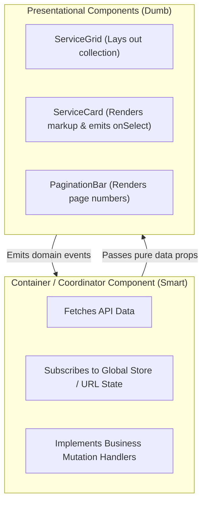

1. **Presentational Components:** Pure visual and interaction components. They receive data strictly via props, emit intent via callbacks, have zero knowledge of API clients or global stores, and can be rendered inside a component gallery (Storybook) in isolation.
2. **Container Components:** Feature coordinators. They connect to network services, read and write route search parameters, dispatch store actions, and compose presentational children.

### 6.4 Component Colocation

Maintainers should follow the principle of **colocation**: *keep things that change together as close together as possible*.

A feature component directory should encapsulate its styles, tests, helper functions, and types:

```text
ServiceCard/
├── ServiceCard.tsx             # Main component implementation
├── ServiceCard.module.css      # Scoped CSS styles
├── ServiceCard.test.tsx        # Unit and accessibility tests
└── ServiceCard.types.ts        # Public prop contracts and interfaces
```

Do not scatter a component across separate top-level `/styles`, `/tests`, `/interfaces`, and `/components` folders unless multi-project sharing strictly requires it.

---

## 7. Architecture Across Non-Functional Requirements

A component boundary directly influences runtime performance, accessibility trees, internationalization, and client security.

### 7.1 Accessibility (a11y) Across Boundaries

Component abstraction must not shatter the accessibility tree:
* **Label Relationships:** If an input is in `FormField.tsx` and the error message is in `ErrorMessage.tsx`, the parent must ensure `aria-describedby` points to the exact runtime DOM ID generated for the error.
* **List and Composite Semantics:** A `<ul>` element must only contain `<li>` direct children. Wrapping each item in a generic `<div className="item-wrapper">` to make a component boundary breaks screen reader list announcements.

### 7.2 Performance and Render Boundaries

In virtual DOM and reactive component frameworks, a component boundary is a **re-render isolation boundary**:
* When local state updates inside a child component, only that child and its descendants re-evaluate.
* Moving volatile state (such as a 60fps slider drag or active search keystroke) out of a massive parent page into a localized leaf component prevents entire page trees from running expensive reconciliation passes.

### 7.3 Internationalization (i18n) and Bidirectionality

Never bake directional assumptions into component APIs:
* Avoid props like `iconLeft` or `marginRight`. Use logical terms such as `leadingIcon`, `trailingIcon`, `marginInlineStart`, and `marginInlineEnd`.
* Allow text containers to adapt to dynamic translations where string lengths expand by 30–50% in different languages.

### 7.4 Security at the Boundary

Components rendering user-supplied markdown or raw HTML must enforce a strict trust boundary:
* Sanitize external rich text at the boundary using an established sanitizer (such as DOMPurify) before binding to `dangerouslySetInnerHTML` or `v-html`.
* Avoid creating generic "HTML Renderer" components that encourage callers to bypass escaping.

---

## 8. Practical Refactoring Case Study: From Monolith to Resilient Architecture

To synthesize these principles, we examine the step-by-step refactoring of the monolithic municipal catalogue introduced at the beginning of this chapter.

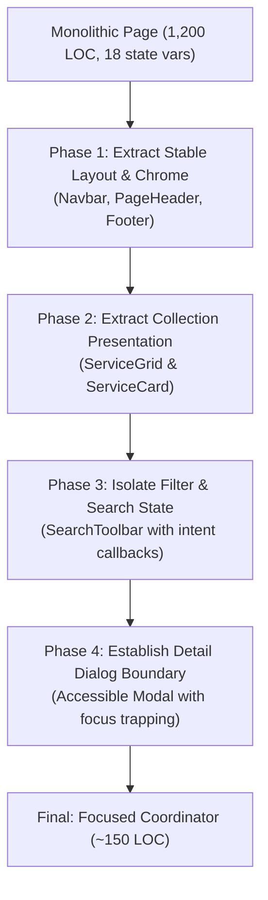

### 8.1 The Refactoring Sequence

1. **Map State and Change Seams:** Before splitting files, document which reactive variables are used by which UI sections. Identify which variables are shared across sections (e.g., `selectedCategory`, `searchQuery`) versus which are completely local (e.g., `isDropdownOpen`, `cardHoverIndex`).
2. **Extract Stable Layout Chrome First:** Move header bars, sidebar skeletons, and page shells outward. These change infrequently and rarely own business state.
3. **Extract Leaf Presentational Components:** Extract `ServiceCard`. Give it a clean, intent-oriented contract (`service: CitizenService`, `onApply: (id: string) => void`). Remove any direct fetch calls or route mutations from the card.
4. **Extract Collection Layout:** Wrap the cards in a `ServiceGrid` that owns responsive layout grids and empty state handling (`services.length === 0`).
5. **Establish Controlled Filter Boundaries:** Extract `CatalogueToolbar`. Keep the active `searchQuery` and `categoryFilter` state in the parent coordinator, passing them as controlled props down to the toolbar.

### 8.2 Architectural Comparison: React vs. Vue

The underlying architectural concepts remain identical regardless of whether a team utilizes React or Vue:

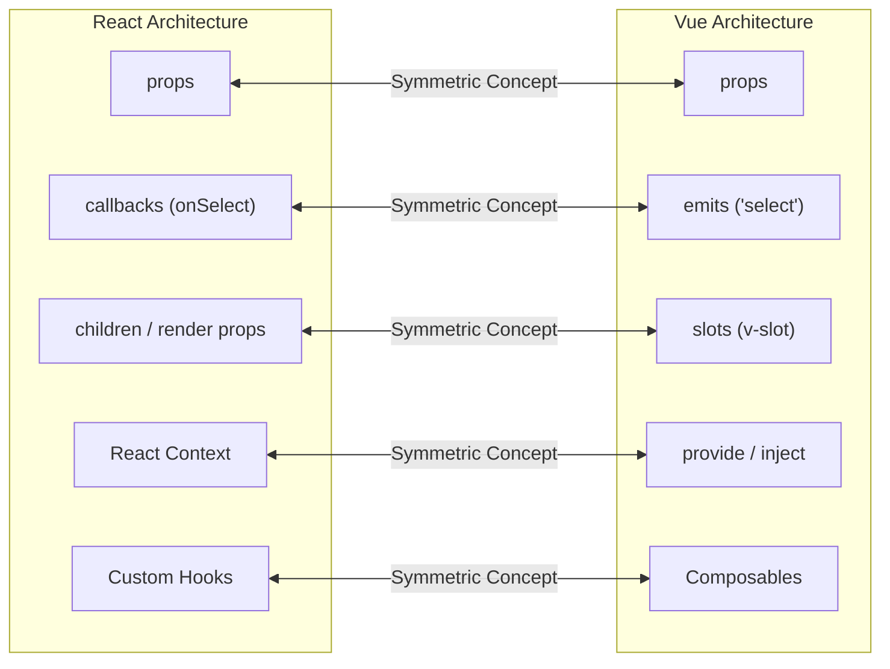

The syntax differs; the responsibility allocation, state contracts, and coupling considerations are identical.

---

## Chapter Summary

* **Components are reasoning boundaries first, reuse units second.** Components exist to limit cognitive load, isolate volatility, encapsulate implementation details, and establish clear team and testing perimeters.
* **Avoid the two extremes.** Guard equally against monolithic God components and over-fragmented component explosion.
* **Component boundaries $\neq$ state boundaries.** Markup can be cleanly extracted into visual children while leaving state authority in a parent coordinator.
* **Design intent-oriented public APIs.** Pass domain entities and intent callbacks (`onSelect`) rather than raw DOM pointer events (`onClick`).
* **Model variants over boolean flags.** Replace combinatorial boolean prop explosion with discriminated union states.
* **Respect state ownership contracts.** Ensure components are cleanly controlled or cleanly uncontrolled; never allow ambiguous half-controlled states.
* **Leverage compound and headless patterns for complex widgets.** Decouple interaction state machines, ARIA semantics, and keyboard navigation from visual presentation.
* **Organize by domain and feature capabilities.** Prefer domain colocation over rigid structural or visual taxonomies like pure Atomic Design.

---

## Review Questions

1. Why is code reuse an insufficient justification for creating a component boundary?
2. What are the symptoms of "component explosion," and what architectural friction does it cause?
3. What is the fundamental difference between an intent-oriented component API and a DOM-oriented component API?
4. When should a component be controlled, and when should it be uncontrolled?
5. What architectural problem occurs when a component attempts to be "half-controlled"?
6. How does the compound component pattern invert layout control for the consumer?
7. What is a headless UI component, and what specific engineering problems does it solve?
8. Why can excessive usage of React Context or Vue `provide`/`inject` damage component reusability?
9. Compare Atomic Design with Feature-Oriented Decomposition. In what context is each methodology most effective?
10. How can establishing a component boundary improve virtual DOM rendering performance?

---

## Practical Lab Brief

Apply the principles learned in this chapter by completing:
**[Practical 06 - Compound Headless Tabs and Component State Boundaries]()**

In this laboratory, you will build a compound headless tabs widget that completely isolates WAI-ARIA keyboard navigation and state machine contracts from presentation and styling.
