A citizen clicks "Book Appointment" on a public-service dashboard. In response, a booking counter decrements, an alert badge turns green, a selected time slot highlights, and a confirmation modal slides into view. 

To the user, this transformation feels instantaneous:

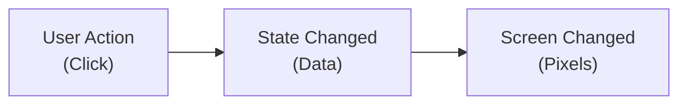

Yet between the moment memory updates and the moment pixels illuminate on the physical display, an engine performs complex orchestration. It must identify which values changed, determine which components depend on those values, schedule calculations, evaluate new interface descriptions, compare them against previous structures, compute the minimal set of host DOM mutations, apply changes without layout thrashing, and synchronize external side effects like network telemetry or focus management.

In early web development, engineers performed this orchestration by hand using imperative DOM APIs:

```javascript
// Imperative manual synchronization
let availableSlots = 5;

button.addEventListener('click', () => {
  availableSlots -= 1;
  slotBadge.textContent = `${availableSlots} slots remaining`;
  if (availableSlots === 0) {
    button.disabled = true;
    statusAlert.classList.add('sold-out');
  }
});
```

This manual approach works for small scripts. But as an interface grows to dozens of interrelated inputs, filters, notifications, and persistent stores, manual synchronization collapses. If five independent features can alter `availableSlots`, every feature must remember to update `slotBadge`, `button.disabled`, and `statusAlert`. Forgetting a single DOM mutation creates inconsistent, corrupted UI state.

Modern front-end architecture solves this through **declarative, state-driven reactivity**:

> **The visible interface is a pure derivation of application state: $UI = f(State)$. When state changes, the reactive system guarantees that the interface synchronizes automatically.**

However, different frameworks execute this guarantee through fundamentally different mechanics. React re-runs component functions to generate fresh virtual descriptions, delegating reconciliation to an engine. Vue tracks dependencies at the property level using reactive proxies. Modern signal systems bypass component-level diffing entirely, establishing direct links between reactive nodes and DOM text elements.

This chapter demystifies what happens between *state changed* and *screen changed*. We will trace render loops, virtual DOM diffing, component identity, state batching, derived computations, and side-effect boundaries across modern front-end architectures.

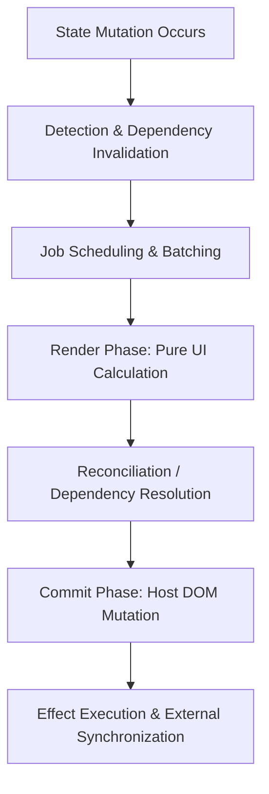

---

## 1. The Foundations of State-Driven UI

The central premise of modern web development is that developers should manage **data state**, not DOM nodes.

### 1.1 The Synchronous UI Function

In a state-driven architecture, the user interface at any point in time $t$ is expressed as a pure projection of the application's data at that instant:

$$\text{Interface}_t = \text{Render}(\text{State}_t)$$

When the user interacts with the application:
1. The event listener mutates or dispatches a new **State**.
2. The framework invokes **Render(State)** to produce a new description of the desired UI.
3. The runtime calculates the difference between the new description and the active DOM, applying the delta.

This declarative model provides immense cognitive clarity: an engineer debugging a corrupted screen state no longer needs to inspect a chronological history of eighty separate jQuery DOM manipulations. They only need to inspect `State_t`. If the state is correct, the UI is guaranteed to be correct.

### 1.2 The General Reactive Pipeline

Regardless of whether a framework uses virtual DOM reconciliation, fine-grained signals, or compiled templates, all reactive engines implement six conceptual stages:

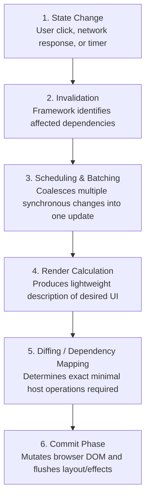

Understanding where a framework draws the boundary between **pure calculation (stages 1–4)** and **external mutation (stages 5–6)** is the key to writing bug-free, high-performance applications.

---

## 2. The React Rendering Pipeline

React models user interfaces as trees of pure component functions. Understanding React requires distinguishing between **Rendering**, **Reconciling**, and **Committing**.

### 2.1 The Render Phase: Pure Calculation

In React, "rendering" does not mean painting pixels or touching the browser DOM. Rendering is simply **calling your component function** to produce a tree of React Elements (commonly called Virtual DOM nodes).

```typescript
function ServiceSummary({ title, price }: { title: string; price: number }) {
  // Pure calculation: returns an immutable object describing desired DOM
  return (
    <article className="summary-card">
      <h3>{title}</h3>
      <p>{price} IQD</p>
    </article>
  );
}
```

When transpiled from JSX, this function returns a lightweight plain JavaScript object:

```javascript
{
  $$typeof: Symbol(react.element),
  type: 'article',
  props: {
    className: 'summary-card',
    children: [
      { type: 'h3', props: { children: 'Title' } },
      { type: 'p', props: { children: '5000 IQD' } }
    ]
  }
}
```

Creating plain JavaScript objects is extraordinarily cheap - a modern V8 engine can instantiate millions of plain objects per second. Because the render phase does not touch the browser DOM, React can pause, abort, or recalculate component trees concurrently in memory without causing visual flickering.

> [!IMPORTANT]
> **Purity Rule:** The Render Phase must be completely free of observable side effects. It must never initiate network requests, start timers, mutate global variables, or manipulate the DOM directly. Given the same props and state, a component's render execution must return the exact same element description.

### 2.2 Virtual DOM Without Mythology

The Virtual DOM (VDOM) has accumulated significant mythology. It is neither a magical performance booster nor a parallel browser engine. 

The Virtual DOM is simply a **retained tree of immutable JavaScript descriptions** representing what the UI should look like. Its purpose is architectural: it enables declarative programming by abstracting away the imperative DOM mutation APIs (`appendChild`, `removeChild`, `setAttribute`).

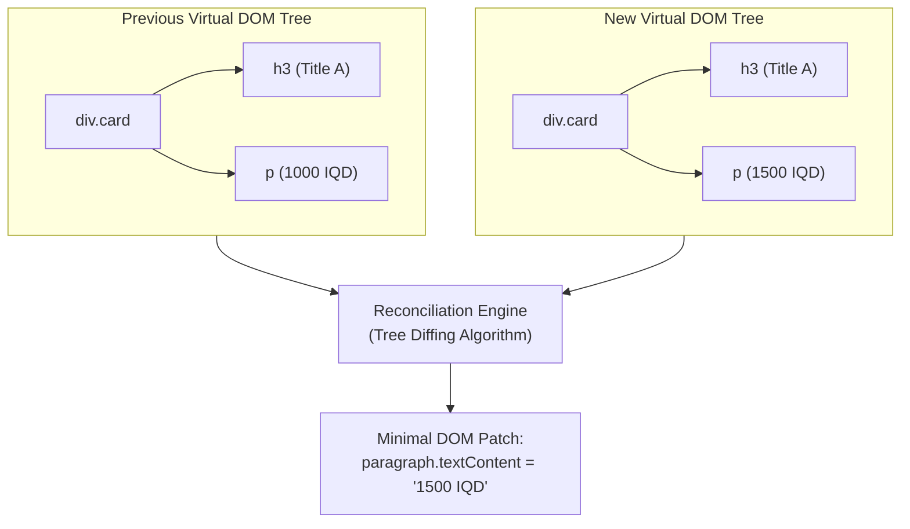

### 2.3 Reconciliation and the Commit Phase

Once React completes calling the component functions in an update tree, the **Reconciliation** algorithm compares the newly returned element tree with the previous tree.

React optimizes this comparison using a heuristic $O(n)$ diffing algorithm based on two assumptions:
1. Two elements of different types will produce completely different trees.
2. The developer can hint which child elements remain stable across renders using a persistent `key` prop.

Once the differences are calculated, React enters the **Commit Phase**:
1. In `react-dom`, React applies the minimal set of required mutations directly to the host DOM nodes.
2. Browser layout, styling, and paint occur.
3. React flushes layout effects (`useLayoutEffect`) synchronously and schedules passive effects (`useEffect`) asynchronously.

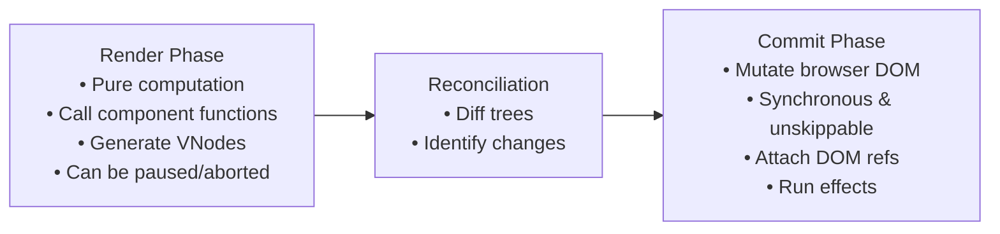

---

## 3. Component Identity, Keys, and State Preservation

A frequent source of front-end bugs is misunderstanding how frameworks track component identity across renders. State does not live inside the component function; **state is associated with a specific position in the rendered element tree**.

### 3.1 State Preservation Rules

When React reconciles a tree, it examines the element `type` at each position:

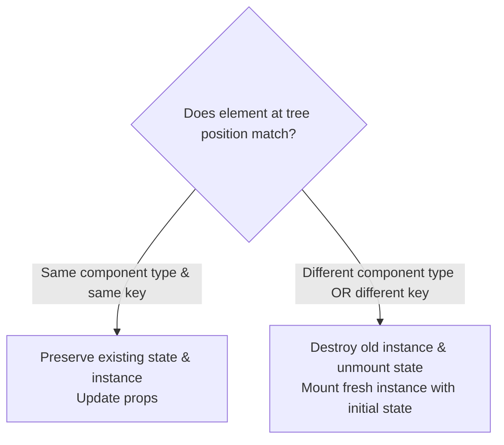

Consider this conditional render:

```tsx
// Example 1: Same type at same position
{isCitizenMode ? <UserProfile role="citizen" /> : <UserProfile role="admin" />}
```

Because `UserProfile` sits at the exact same tree position in both branches, React considers it the **same component instance**. Its internal state (e.g., active draft inputs, open dropdowns) is **preserved**, and only its `role` prop updates.

Conversely:

```tsx
// Example 2: Different type at same position
{isCitizenMode ? <CitizenEditor /> : <AdminEditor />}
```

Because the element type changed from `CitizenEditor` to `AdminEditor`, React completely tears down the old component tree, discarding all its internal state, and mounts a brand-new component instance.

### 3.2 The Critical Role of Keys

When rendering lists of dynamic items, position alone is insufficient to determine identity:

```tsx
// ❌ DANGEROUS: Using array index as key
{items.map((item, index) => (
  <ListItem key={index} item={item} />
))}
```

If an item is prepended to the array:
* The item formerly at index `0` moves to index `1`.
* React compares the old index `0` with the new index `0`. Because the key (`0`) and component type (`ListItem`) match, React **preserves the internal state of the previous item** and merely updates the `item` prop.
* If `ListItem` contained uncontrolled internal state (like an active text input or checkbox), the user sees their typed text stay on row 1 while the label changed to row 2!

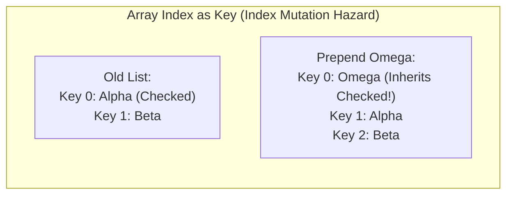

Always use stable, unique domain identifiers for keys:

```tsx
//  CORRECT: Stable domain identity
{items.map(item => (
  <ListItem key={item.id} item={item} />
))}
```

### 3.3 Keys as Intentional Reset Triggers

Keys are not just for lists; they are an architectural tool to intentionally reset state. If a user selects a different citizen record in a master-detail view, you can force the edit form to completely wipe its internal state by passing the unique record ID as a key:

```tsx
<CitizenEditForm key={selectedCitizen.id} citizen={selectedCitizen} />
```

When `selectedCitizen.id` changes, React treats `CitizenEditForm` as a completely new identity, tearing down previous draft state and initializing fresh state from props.

---

## 4. State Snapshots, Batching, and Scheduling

A foundational concept in React's mental model is that **state behaves like a snapshot in time**.

### 4.1 State as a Snapshot

Inside a single render pass, state variables are immutable constants:

```tsx
function Counter() {
  const [count, setCount] = useState(0);

  function handleClick() {
    setCount(count + 1);
    setCount(count + 1);
    setCount(count + 1);
    console.log(count); // Still logs 0!
  }

  return <button onClick={handleClick}>{count}</button>;
}
```

Why does `console.log(count)` output `0`, and why does clicking increment the counter to `1` instead of `3`?
1. In the execution of `handleClick`, `count` is a constant equal to `0`.
2. Calling `setCount(0 + 1)` three times schedules three updates to set the next snapshot value to `1`.
3. The component function will only receive the new `count` value when React calls it during the **subsequent render pass**.

To chain updates within a single execution cycle, use the **functional updater**:

```typescript
setCount(prev => prev + 1);
setCount(prev => prev + 1);
setCount(prev => prev + 1);
// Correctly schedules three incremental transformations: 0 -> 1 -> 2 -> 3
```

### 4.2 Automatic Batching and Scheduling

When multiple state updates occur within an event handler, network callback, or Promise resolution, executing a complete re-render for every single setter call would thrash browser performance:

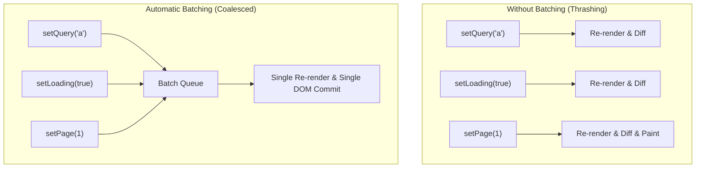

Modern React (version 18+) automatically batches all state updates occurring within the same microtask turn. The browser only recalculates the render tree and updates the DOM once all synchronous code has executed.

---

## 5. Source State vs. Derived State

One of the most pervasive anti-patterns in front-end architecture is duplicating state that could instead be computed:

```typescript
// ❌ ANTI-PATTERN: Duplicated State & Synchronization Hazards
function ProductCatalogue({ products }: { products: Product[] }) {
  const [query, setQuery] = useState("");
  const [filteredProducts, setFilteredProducts] = useState<Product[]>(products);

  useEffect(() => {
    // Redundant effect: introduces double renders and stale state risks!
    setFilteredProducts(products.filter(p => p.name.includes(query)));
  }, [products, query]);

  return <ProductList items={filteredProducts} />;
}
```

This pattern creates severe architectural defects:
1. **Double Rendering:** Changing `query` renders the component with stale `filteredProducts`, triggers the `useEffect`, and forces an immediate second re-render.
2. **Desynchronization Bugs:** If `products` updates from the server, there is a momentary flash where the list shows the new products un-filtered.

### 5.1 The Architectural Rule: Derive, Don't Duplicate

If a value can be computed from existing props or state, **calculate it directly during render**:

```typescript
//  ARCHITECTURAL EXCELLENCE: Pure Inline Derivation
function ProductCatalogue({ products }: { products: Product[] }) {
  const [query, setQuery] = useState("");

  // Pure calculation: executes synchronously during render phase
  const filteredProducts = products.filter(p => p.name.includes(query));

  return <ProductList items={filteredProducts} />;
}
```

### 5.2 When and How to Memoize

If the derivation involves tens of thousands of items or complex mathematical computations, calculating it on every render can impact frame rates.

Use memoization (`useMemo` in React, `computed` in Vue) strictly when measurements demonstrate a need:

```typescript
const visibleServices = useMemo(() => {
  return services.filter(service => matchesFilters(service, query, department));
}, [services, query, department]);
```

Memoization caches the resulting value and skips recalculation unless one of the listed dependencies (`services`, `query`, or `department`) changes referential identity.

---

## 6. The Vue Reactivity Model

While React relies on re-invoking component functions and diffing virtual DOM trees, Vue utilizes a **fine-grained reactive dependency tracking model**.

### 6.1 Reactivity via ES6 Proxies

In Vue 3, reactive objects are wrapped in an ES6 `Proxy`. When a template or computation reads a property, the proxy's `get` trap intercepts the operation and **tracks** the active subscriber. When code modifies a property, the proxy's `set` trap intercepts the write and **triggers** all registered subscribers:

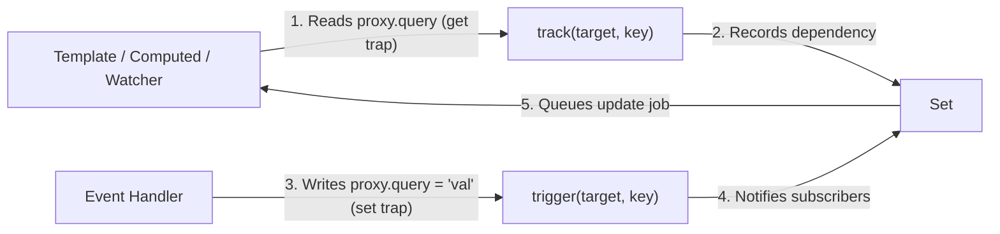

```javascript
// Conceptual mechanics of Vue's Proxy reactivity
function reactive(target) {
  return new Proxy(target, {
    get(obj, key, receiver) {
      track(obj, key); // Record active effect
      return Reflect.get(obj, key, receiver);
    },
    set(obj, key, value, receiver) {
      const result = Reflect.set(obj, key, value, receiver);
      trigger(obj, key); // Invalidate and notify subscribers
      return result;
    }
  });
}
```

### 6.2 `ref()` vs. `reactive()`

Vue provides two primary primitives for state:
* **`ref(primitive)`:** Wraps a value in an object with a `.value` property. Essential for primitives (`number`, `string`, `boolean`) because JavaScript cannot intercept direct assignments to primitive variables.
* **`reactive(object)`:** Directly creates a reactive proxy around an object or collection.

### 6.3 Computed Values vs. Watchers

Vue explicitly separates pure data derivation from imperative side effects:

* **`computed(() => calculation)`:** Declares a derived reactive value. Computed properties are **lazy** and **cached**: they do not evaluate until read, and they never re-evaluate unless an upstream tracked dependency changes.
* **`watch(source, callback)`:** An explicit side-effect trigger. Runs when specific reactive data changes; ideal for triggering API calls, route transitions, or storage writes.
* **`watchEffect(callback)`:** Automatically tracks any reactive property accessed inside the callback body and re-runs when those dependencies update.

```vue
<script setup lang="ts">
import { ref, computed, watch } from 'vue';

const query = ref('');
const services = ref<Service[]>([]);

// Pure derivation: cached and lazy
const filteredServices = computed(() => {
  return services.value.filter(s => s.name.includes(query.value));
});

// Imperative side effect: sync with URL router
watch(query, (newQuery) => {
  router.replace({ query: { q: newQuery } });
});
</script>
```

---

## 7. Signals, Fine-Grained Reactivity, and Build-Time Compilers

The front-end ecosystem has increasingly explored reactivity models that operate with even greater precision than virtual DOM frameworks: **Signals** and **Build-Time Compilers**.

### 7.1 Signals: Dependency Graphs Without Virtual DOM Diffing

A Signal is an atomic reactive primitive that encapsulates a value, an accessor getter, and a mutation setter. Frameworks like Solid.js, Preact Signals, and Angular Signals construct a runtime dependency graph:

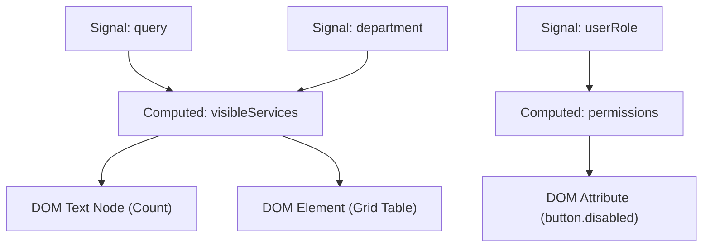

#### Why Signals Differ from React:
In React, when `query` changes, the entire `CataloguePage` component function re-executes, generating a new Virtual DOM tree that must be diffed against the previous tree.

In a pure Signal architecture, **the component function executes exactly once during initial mounting**. The signals establish direct subscriber links to the specific DOM text nodes and element attributes that read them. When `query` updates, the signal updates only the specific DOM node (`textNode.data = newValue`) directly, bypassing tree diffing entirely.

### 7.2 Compiler-Assisted Optimization

Modern frameworks increasingly shift reactive bookkeeping from client-side runtime to build-time compilation:
* **Svelte:** Analyzes variable assignments at build time and compiles reactive updates into surgical JavaScript statements (`$$invalidate`).
* **React Compiler (formerly React Forget):** Automatically analyzes JavaScript ASTs during compilation to infer dependency arrays and auto-memoize JSX expressions, eliminating the need for manual `useMemo` and `useCallback` annotations.

---

## 8. Effects, Lifecycle Boundaries, and Feedback Loops

Side effects represent the bridge between pure reactive state and the messy, stateful outside world: HTTP endpoints, browser storage, DOM measurements, animations, and WebSocket subscriptions.

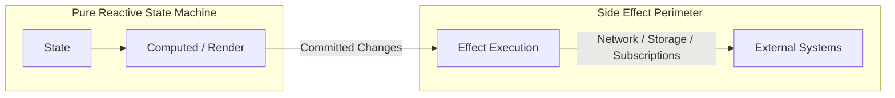

### 8.1 The Infinite Loop Hazard

The most common failure in effect programming is mutating reactive state inside an effect without a stopping condition:

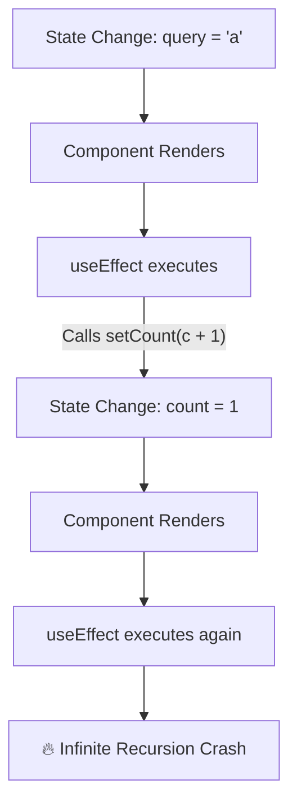

Before adding an effect, ask:
1. *Is this value directly calculable from state?* If yes, use inline calculation or a computed property.
2. *Does this action happen in direct response to a user click?* If yes, put the logic directly inside the event handler, not in an effect.
3. *Is this effect synchronizing an external system with committed state?* Only then is an effect architecturally appropriate.

### 8.2 The Cleanup Contract

External subscriptions, event listeners, and timers must be dismantled when dependencies change or the component unmounts:

```typescript
useEffect(() => {
  const controller = new AbortController();

  async function loadData() {
    try {
      const data = await fetchServices(query, controller.signal);
      setResults(data);
    } catch (err) {
      if (err.name !== 'AbortError') {
        setError(err);
      }
    }
  }

  loadData();

  // Cleanup callback: aborts in-flight request before the next run or on unmount
  return () => {
    controller.abort();
  };
}, [query]);
```

---

## Comprehensive Comparison: Reactivity Architectures

| Dimension | React | Vue 3 | Signals (Solid / Preact) |
|---|---|---|---|
| **Primary Mental Model** | Component recalculation & VDOM diffing. | Proxy dependency tracking & template compilation. | Atomic signal graph; surgical DOM node updates. |
| **Component Execution** | Runs on every state update. | Runs once per update; cached template blocks. | Runs once on initial mount only. |
| **State Primitives** | `useState`, `useReducer`. | `ref`, `reactive`. | `createSignal`, `signal`. |
| **Derived State** | Inline calculation, `useMemo`. | `computed()`. | `createMemo`, `computed()`. |
| **External Effects** | `useEffect`, `useLayoutEffect`. | `watch`, `watchEffect`. | `createEffect`, `effect`. |
| **Batching Strategy** | Automatic microtask batching. | Queued scheduler microtask flush (`nextTick`). | Microtask transaction batching. |
| **Primary Strength** | Simple mental model (UI as a snapshot). | Selective property updates; zero manual memo dependencies. | Extreme performance; zero virtual DOM overhead. |

---

## Chapter Summary

* **State-driven UI replaces imperative DOM manipulation.** The interface is a pure derivation of application state: $UI = f(State)$.
* **React Render $\neq$ DOM Mutation.** In React, rendering is calling component functions to produce a Virtual DOM description. The Commit phase applies the diff to the browser DOM.
* **Component identity is tied to tree position and keys.** Changing a component's key or element type unmounts it and discards its internal state. Using array indices as keys creates severe mutation bugs during list reordering.
* **State acts as a temporal snapshot.** State setters schedule updates for the subsequent render pass; they do not alter local variables within the currently executing frame.
* **Derive, do not duplicate.** Redundant state synchronized via effects causes double renders and data divergence. Compute derived values inline or cache them with memoization.
* **Vue uses fine-grained proxies.** Reads track dependencies (`get`), writes trigger updates (`set`), and computed values cache results until dependencies change.
* **Signals connect state directly to DOM nodes.** Signals bypass virtual DOM tree reconciliation by registering subscribers directly on individual DOM text nodes.
* **Effects belong at the boundary.** Effects should synchronize external systems (network, timers, storage), never perform ordinary data derivations.

---

## Review Questions

1. Explain the sequence of operations between a state change and the appearance of updated pixels on screen.
2. What is the fundamental difference between the Render Phase and the Commit Phase in React?
3. Why must component render functions remain completely pure?
4. What happens when an element's `key` changes between two consecutive renders?
5. Why does using an array index as a list item `key` cause UI corruption when items are sorted or deleted?
6. Explain why `console.log(count)` immediately after `setCount(count + 1)` logs the old value.
7. How does Vue's ES6 Proxy tracking avoid the need for React's explicit dependency arrays (`useMemo`, `useEffect`)?
8. What is the difference between coarse-grained (component-level) and fine-grained (node-level) reactivity?
9. When is an effect appropriate, and when should a computed derivation be used instead?
10. How does effect cleanup prevent race conditions during rapid asynchronous input?

---

## Practical Lab Brief

Apply the principles learned in this chapter by completing:
**[Practical 07 - Reactive Dependency Graph and State Derivation]()**

In this laboratory, you will build a transparent reactive engine from scratch with signals, lazy computed values, and cleanup-aware effects, observing how dependency discovery and invalidation operate at runtime.
