A citizen visits a regional municipal portal to apply for a business operating license. They spend five minutes configuring search filters: selecting their municipal district, filtering for "Commercial & Retail," setting the fee threshold to "Under 100,000 IQD," and paginating to page 4 of the results. They click on a promising permit to inspect its regulatory requirements.

Finding that it requires an additional fire-safety certificate, they click the browser's native **Back** button.

Instantly, their progress vanishes. The page resets to page 1, the search input is blank, and all category checkboxes return to their default states. Frustrated, they re-apply the filters, find the permit again, and copy the browser URL to send to their legal advisor. When the advisor clicks the link, they are greeted by a blank, generic dashboard: the URL in the address bar was simply `/permits`, containing none of the active filter state.

Later that afternoon, the citizen begins filling out an eight-section digital permit application. On section 5, they accidentally click a navigation link in the site header. The browser immediately unmounts the form, wiping twenty minutes of carefully typed registration numbers, business addresses, and uploaded document references, without a single confirmation prompt.

Every one of these failures stems from the same fundamental architectural defect: **treating "state" as a generic, monolithic bucket of client memory**.

State is not one thing. Different values possess radically different lifecycles, ownership scopes, sharing requirements, and persistence needs. A search filter belongs to the URL address bar so it can be shared and bookmarked; an in-progress text draft belongs to local component state; a cached list of government departments belongs to a server-state cache; and an unsaved multi-step form belongs to an explicit workflow state machine.

In this chapter, we develop a comprehensive architecture for front-end state: categorizing values by lifetime and owner, establishing unidirectional transitions with reducers and state machines, designing URL-driven navigation, and managing complex form lifecycles.

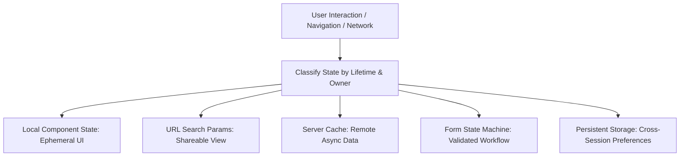

---

## 1. The Spectrum of State: A Systematic Taxonomy

In poorly architected codebases, teams frequently dump every piece of reactive data into a single global store (such as a massive Redux or Pinia root). This creates tight coupling, massive re-render trees, stale cache bugs, and impossible back-button navigation.

To establish clean boundaries, architects classify state across nine distinct categories:

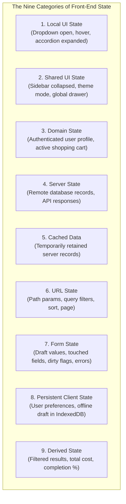

### 1.1 The Nine Categories Explained

| Category | Lifetime | Primary Owner | Storage Mechanism | Example |
|---|---|---|---|---|
| **Local UI State** | Component mount to unmount | Single component | `useState`, `ref` | `isDropdownOpen: boolean` |
| **Shared UI State** | Application session | UI Layout / Shell | Context, lightweight store | `isSidebarCollapsed: boolean` |
| **Domain State** | Active user workflow | Domain store / coordinator | Reducer, finite state machine | `currentUserSession`, `activeCart` |
| **Server State** | Owned by remote server | Remote database | Asynchronous API client | `permitApplications: Permit[]` |
| **Cached Data** | Ephemeral, time-to-live | Query cache | TanStack Query, SWR, RTK Query | `cachedMunicipalities` |
| **URL State** | Browser history entry | Browser address bar | `window.location`, router | `?district=erbil&page=4` |
| **Form State** | Active editing session | Form boundary | Form hook, reducer | `touched: Set`, `errors: Record` |
| **Persistent State** | Across reloads/sessions | Browser storage | `localStorage`, `IndexedDB` | `densityPreference: 'compact'` |
| **Derived State** | Synchronous calculation | Pure function / getter | `useMemo`, `computed` | `filteredCount = list.length` |

### 1.2 Server State Is Not Ordinary Client State

A critical realization of modern front-end architecture is that **server data is not client state; it is a remote, asynchronous snapshot that is always potentially stale**.

When an application fetches a list of permits:
* The client does not own the data; the database owns it.
* Another user or an automated background job may update or delete those permits milliseconds after the fetch.
* Managing server data requires background refetching, caching, deduplication, retry logic, and cache invalidation - concerns completely orthogonal to UI state like whether an accordion is open.

Conflating server state with client state in a single global store is the primary cause of bloated codebases. Server data belongs in specialized caching layers (e.g., TanStack Query, SWR), while client UI state remains localized.

---

## 2. State Placement Principles and Ownership Boundaries

The foundational rule of state architecture is:

> **Keep state as close as practical to the components that read and write it.**

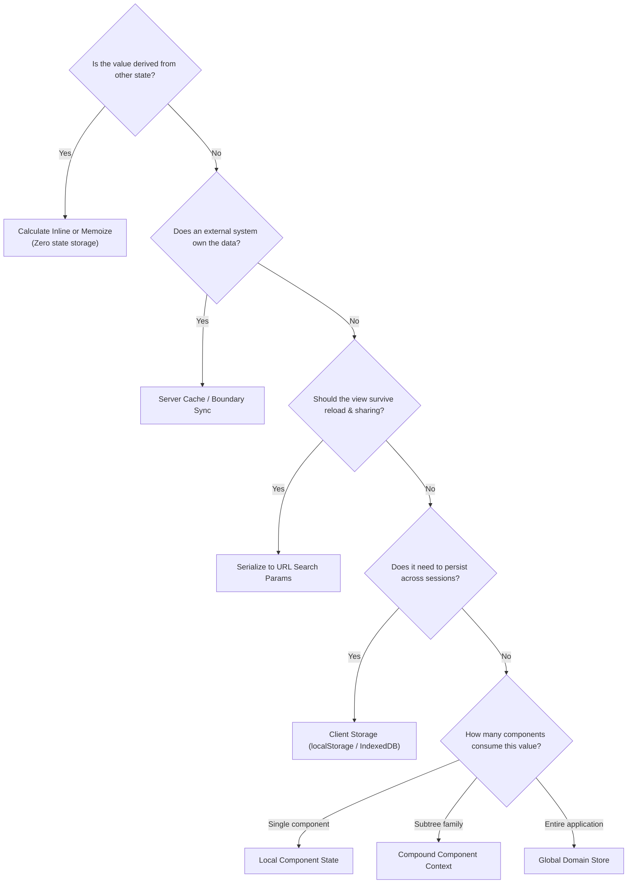

### 2.1 The Cost of Premature Global State

Putting state into a global store feels convenient initially, but imposes steep architectural taxes:
1. **Loss of Encapsulation:** Any component anywhere in the tree can read or mutate the value, making it impossible to reason about who caused a state change.
2. **Re-render Amplification:** When global state mutates, all components subscribed to that store re-evaluate unless meticulous selectors are maintained.
3. **Testing Friction:** Testing a component requires mocking the entire global store infrastructure rather than passing simple props.
4. **Lifecycle Leaks:** Global state never unmounts automatically. If a user leaves a form and returns later, stale values remain unless explicitly cleaned up.

State should only be "lifted" when two or more sibling components genuinely require synchronization.

---

## 3. Transitions and Determinism: Reducers and State Machines

When state transitions involve multiple interdependent fields or sequential workflow steps, scattered `setState` calls produce race conditions and invalid combinations.

### 3.1 Reducers and Unidirectional Data Flow

A **reducer** is a pure function that calculates the next state given the current state and an explicit action object:

$$\text{NextState} = \text{Reducer}(\text{CurrentState}, \text{Action})$$

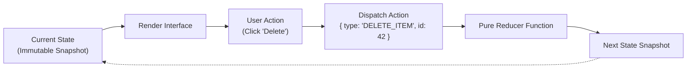

Reducers enforce **unidirectional data flow**:
* The UI cannot mutate state arbitrarily; it can only express *user intent* by dispatching named action objects (`{ type: 'FILTER_CHANGED', filter: 'active' }`).
* The reducer centralizes all transition rules in one testable function.

### 3.2 Finite State Machines (FSM): Eliminating Impossible States

In form submissions and asynchronous operations, boolean flag clustering is an anti-pattern:

```typescript
// ❌ ANTI-PATTERN: Boolean flag explosion (2^4 = 16 states, most invalid!)
interface FormState {
  isLoading: boolean;
  isSuccess: boolean;
  isError: boolean;
  canRetry: boolean;
}
```

What does it mean if `isLoading === true` and `isSuccess === true` simultaneously? These invalid combinations cause UI bugs where success banners and loading spinners flash at the same time.

A **Finite State Machine** models transitions between mutually exclusive states:

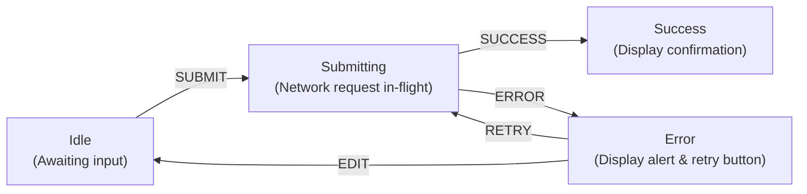

By modeling the workflow as a state machine, the system mathematically guarantees that illegal transitions cannot occur.

---

## 4. Routing as Core State Architecture

In single-page applications (SPAs), the router is not merely a page-switcher; **the router is a core state manager**.

### 4.1 Paths vs. Query Parameters

The browser URL provides two distinct channels for encoding state:

```text
https://portal.gov/permits/commercial/p-1042?view=summary&lang=ku
└─────────────┬─────────────┘└───┬───┘└──┬──┘ └──────────┬──────────┘
           Domain             Path   Resource          Query
```

* **Path Parameters (`/permits/:category/:id`):** Answer the question: *"Which unique resource or hierarchical view is the user inspecting?"* Path parameters define the fundamental identity of the screen.
* **Query Parameters (`?view=summary&sort=date&page=2`):** Answer the question: *"How should this resource or collection be filtered, sorted, paginated, or projected?"* Query parameters modify the presentation of the resource without changing its identity.

### 4.2 Nested and Layout Routes

Modern web applications structure routes hierarchically:

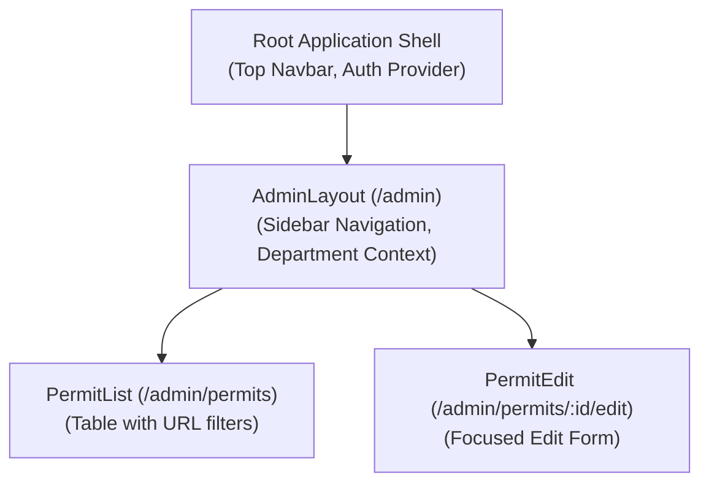

With nested routing:
1. When navigating from `/admin/permits` to `/admin/permits/104/edit`, the `RootLayout` and `AdminLayout` **remain mounted in the DOM**.
2. Their internal state (sidebar collapse, notifications, active user profile) is completely preserved.
3. Only the leaf component inside the `<Outlet />` swaps out, preventing full-page destruction and re-mounting.

### 4.3 History Semantics: `pushState` vs. `replaceState`

The HTML5 History API provides two mechanisms for updating the address bar:

* **`pushState`:** Pushes a brand-new entry onto the browser's history stack. The browser's Back button will step backward through this entry. Use for: navigating between pages, opening a major modal, or advancing pagination.
* **`replaceState`:** Overwrites the current history entry in place without creating a new history step. Use for: debounced search filter typing, sorting dropdowns, or canonicalizing URLs.

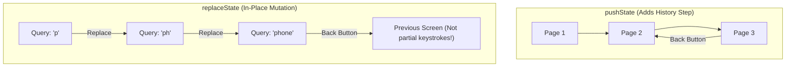

Using `pushState` on every keystroke in a search input is a catastrophic UX defect: a user typing ten characters must click the Back button eleven times just to leave the page!

---

## 5. The URL as the Single Source of Truth for Navigable State

When view state is shareable, the URL address bar must serve as the primary source of truth, not a secondary mirror.

### 5.1 Bi-Directional URL Synchronization

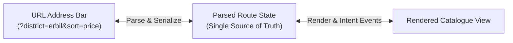

If an application maintains a local `const [sort, setSort] = useState('price')` alongside `?sort=price` in the URL without strict hierarchy, state divergence is guaranteed. The URL should be parsed directly into route state on render; changing a filter triggers a route navigation, which re-evaluates the view.

### 5.2 The Security Boundary: What MUST NEVER Enter the URL

The address bar is completely visible to bystanders, stored permanently in browser history, logged in plaintext by web proxies, and transmitted in the `Referer` HTTP header to external links:

| Classification | Forbidden Data Examples | Vulnerability / Impact | Proper Storage Solution |
|---|---|---|---|
| **Credentials & Secrets** | Bearer tokens, passwords, API keys | Credential theft via proxy logs, browser history, and Referer headers. | `httpOnly` secure cookies, private memory store. |
| **Personal Identifiers** | National IDs, phone numbers, health data | Privacy violation; logged by analytics and CDN edges. | Private encrypted session state. |
| **Volatile Drafts** | 2,000-word essay drafts, unsaved forms | Exceeds URL length limits; triggers encoding corruption. | Local component draft, IndexedDB offline cache. |

---

## 6. Routing User Experience (UX): Transitions, Skeletons, and Focus

Navigating between routes in a modern web application involves asynchronous operations: downloading code-split JavaScript chunks and fetching server data.

### 6.1 Loading Scopes and Skeleton Hierarchy

A single, application-wide spinner blocks the entire interface and destroys user context. High-quality routing employs **scoped loading feedback**:

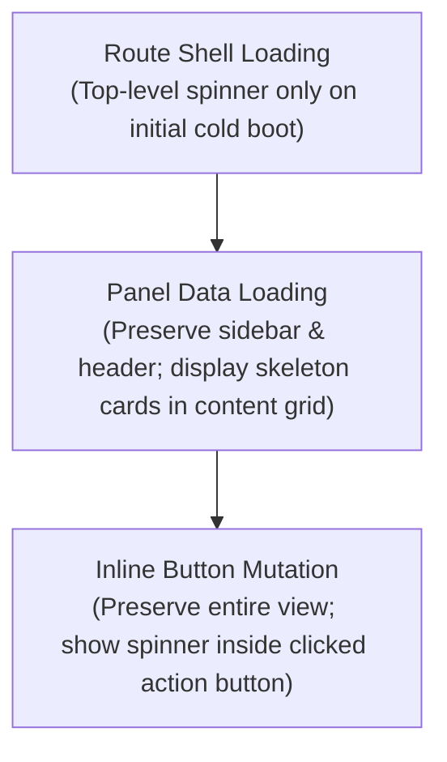

1. **Page-level fallback:** Reserved for cold visits where no layout shell exists yet.
2. **Skeleton panels:** The outer layout remains interactive while the content region displays placeholder wireframes matching the incoming content's geometry.
3. **Optimistic updates:** The UI updates immediately upon user click, initiating the network request in the background and rolling back only on failure.

### 6.2 Focus Management and Accessibility

In standard multi-page websites, navigating to a new URL causes the browser to reset keyboard focus to the top of the new document. In client-side single-page applications, **this focus reset does not happen automatically**.

Without intentional focus management:
* A blind screen-reader user presses Enter on a link in the footer.
* The route changes, rendering a new page at the top of the viewport.
* Focus remains trapped on the inactive link at the bottom of the page, leaving the user completely unaware that navigation occurred!

Architects implement route transition listeners that programmatically shift focus to the primary `<h1>` heading or the main `<main id="content">` landmark upon route commit.

---

## 7. Form Architecture: Managing Transient Input State

Forms represent the most complex state machines in front-end architecture because they capture unfinished, unvalidated, string-heavy user drafts before they can become trusted domain entities.

### 7.1 The Four Sub-States of a Form Field

A robust form engine tracks four independent dimensions for every field:

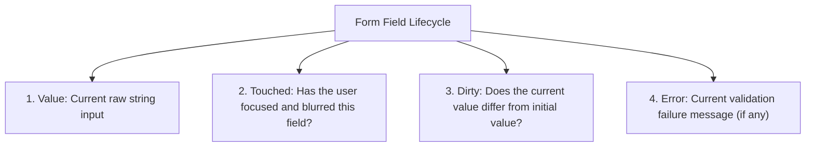

* **Values:** Raw string inputs (e.g. `"42"` or `""`).
* **Touched:** Boolean flag indicating whether the user has interacted with and blurred the input. Crucial for UX: **never display error messages on pristine, untouched fields** before the user has had a chance to type!
* **Dirty:** Boolean flag indicating whether the current draft differs from the initial baseline (`current !== initial`). Used to enable "Save" buttons and trigger unsaved-changes confirmation dialogs.
* **Error:** Validation message derived from business rules.

### 7.2 Validation Tiers

Validation must be executed across four distinct architectural tiers:

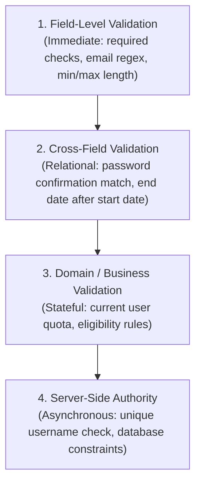

### 7.3 Multi-Step Wizards and Unsaved Changes Guards

In complex public-service workflows (such as multi-page permit applications), forms span multiple steps:

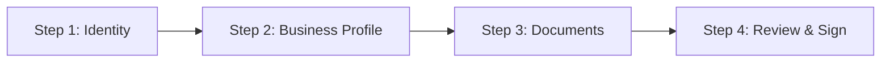

1. **URL Step Coordination:** Store the active wizard step in the URL (`/apply/permit?step=documents`) so users can reload or navigate back without restarting.
2. **Draft Isolation:** Keep unsubmitted form drafts in local component state or IndexedDB; do not prematurely overwrite the server cache.
3. **Unsaved Changes Guard:** Attach a `beforeunload` window listener and route navigation interceptor. If `isDirty === true`, warn the user with a confirmation modal before destroying their draft.

---

## 8. Practical Architecture: The Administrative Catalogue Case Study

To synthesize state categorization, URL synchronization, and form boundaries, we examine an administrative permit management application:

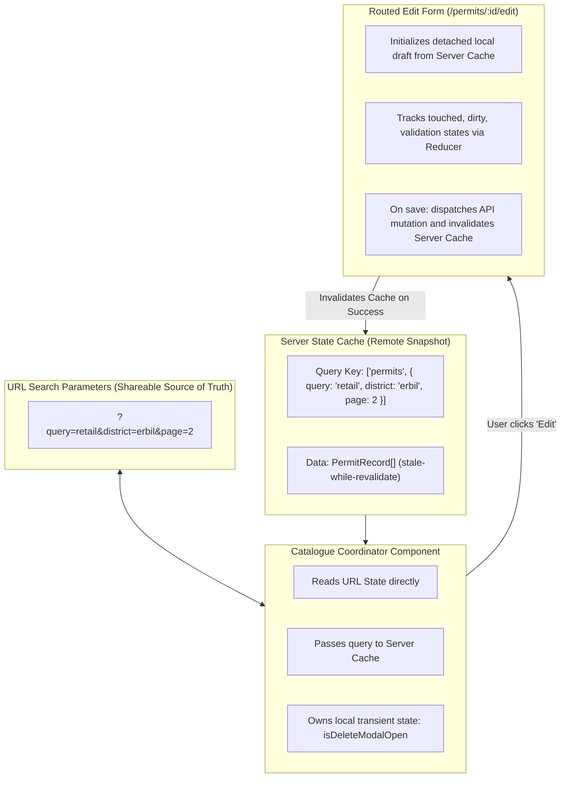

### 8.1 Key Architectural Decisions

1. **Zero State Mirroring:** The catalogue does not copy `?query=retail` into a local `query` state variable. The URL is the single source of truth. Changing a filter calls the router's `navigate` function.
2. **Two-Tier Search Input:** The search text input maintains a local, immediate keystroke state for responsive 60fps typing, debouncing updates to the URL by 300ms via `replaceState`.
3. **Detached Form Draft:** Opening `/permits/104/edit` copies the cached permit into a local form reducer draft. Editing fields does not mutate the server cache or the list view in the background. Only when the user clicks "Save" and the server returns a 200 OK is the server cache invalidated.

---

## Chapter Summary

* **State is not one thing.** Deconstruct state into its nine natural categories (local UI, shared UI, domain, server, cache, URL, form, persistent, and derived).
* **Server state is a remote snapshot.** Server data is asynchronous and potentially stale; manage it with specialized query caches, not generic global stores.
* **Keep state close to where it is used.** Lift state only when multiple consumers require coordination.
* **Reducers and state machines enforce determinism.** Unidirectional data flow and finite state machines eliminate impossible boolean flag combinations.
* **The URL is primary state.** Use paths for resource identity and query parameters for view presentation (filtering, sorting, pagination).
* **Respect history semantics.** Use `replaceState` for debounced typing and filters; use `pushState` for page navigation and discrete steps.
* **Never store secrets in URLs.** Keep tokens, passwords, and sensitive personal identifiers out of query parameters.
* **Track the four dimensions of form fields.** Values, touched, dirty, and errors provide the foundation for professional form user experiences.

---

## Review Questions

1. Why does storing all application state in a single global store lead to architectural degradation?
2. What is the fundamental difference between server state and client UI state?
3. Explain why using `pushState` on every keystroke in a search filter is a severe UX defect.
4. When should a value be placed in a path parameter versus a query parameter?
5. What data classifications must never be placed in a URL query string, and why?
6. How does a Finite State Machine prevent invalid UI states during form submission?
7. What is the difference between "touched" state and "dirty" state in form architecture?
8. Why should client-side single-page applications explicitly manage keyboard focus after route transitions?
9. Explain the two-tier search input pattern and why it prevents input lag.
10. What is an unsaved changes guard, and how does it utilize dirty state?

---

## Practical Lab Brief

Apply the principles learned in this chapter by completing:
**[Practical 08 - URL-Driven State Architecture and Form Boundaries]()**

In this laboratory, you will build a URL-synchronized catalogue with resilient boundary parsing, history semantics, two-tier input debouncing, and a routed edit form with an unsaved changes navigation guard.
