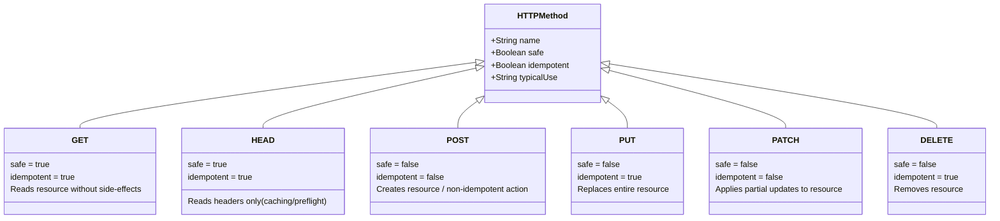
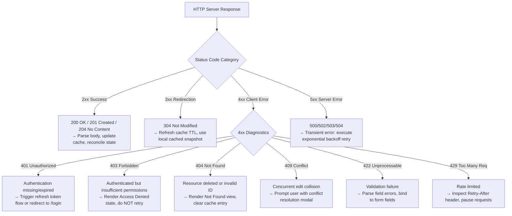
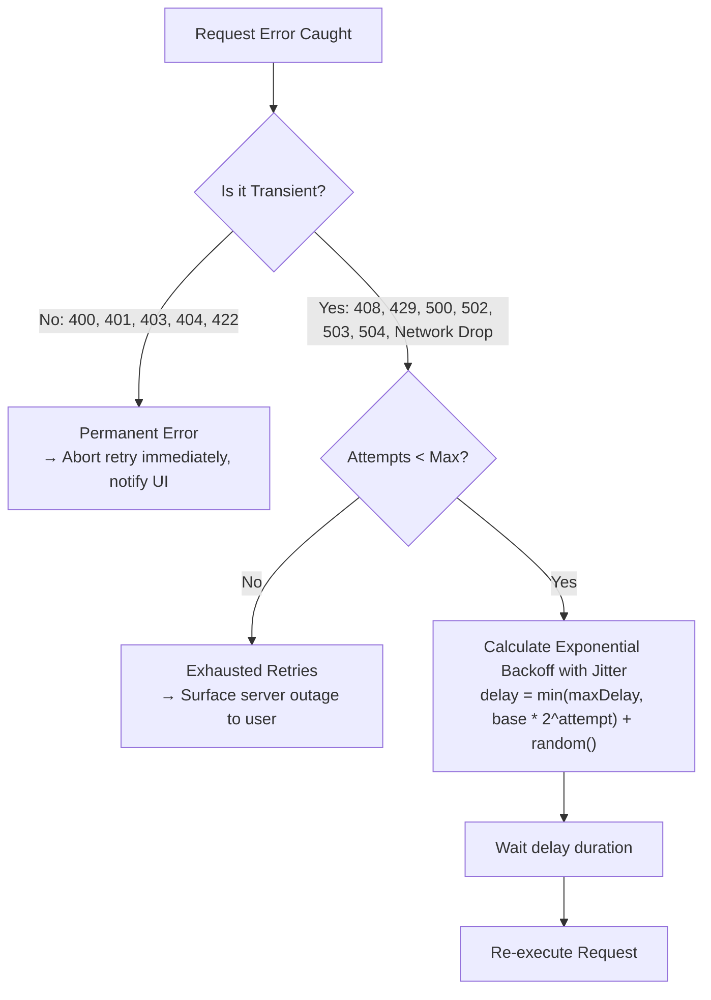
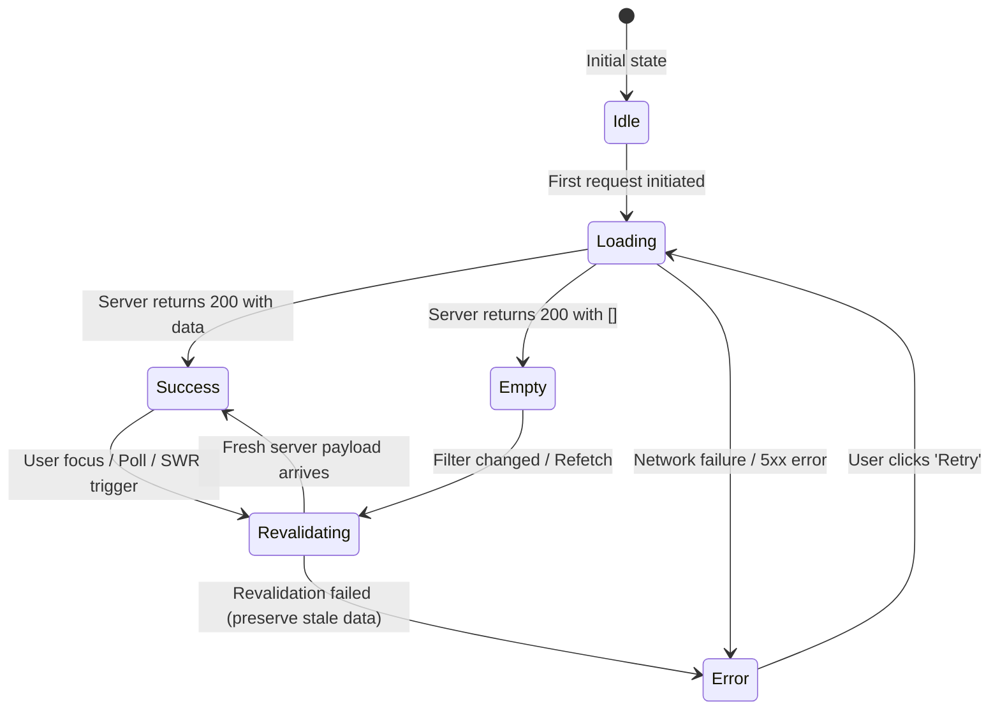
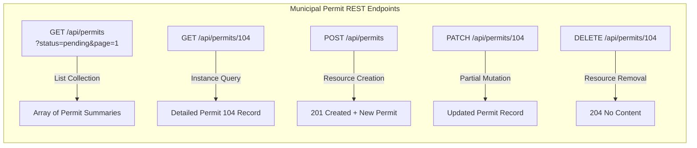
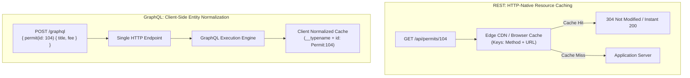
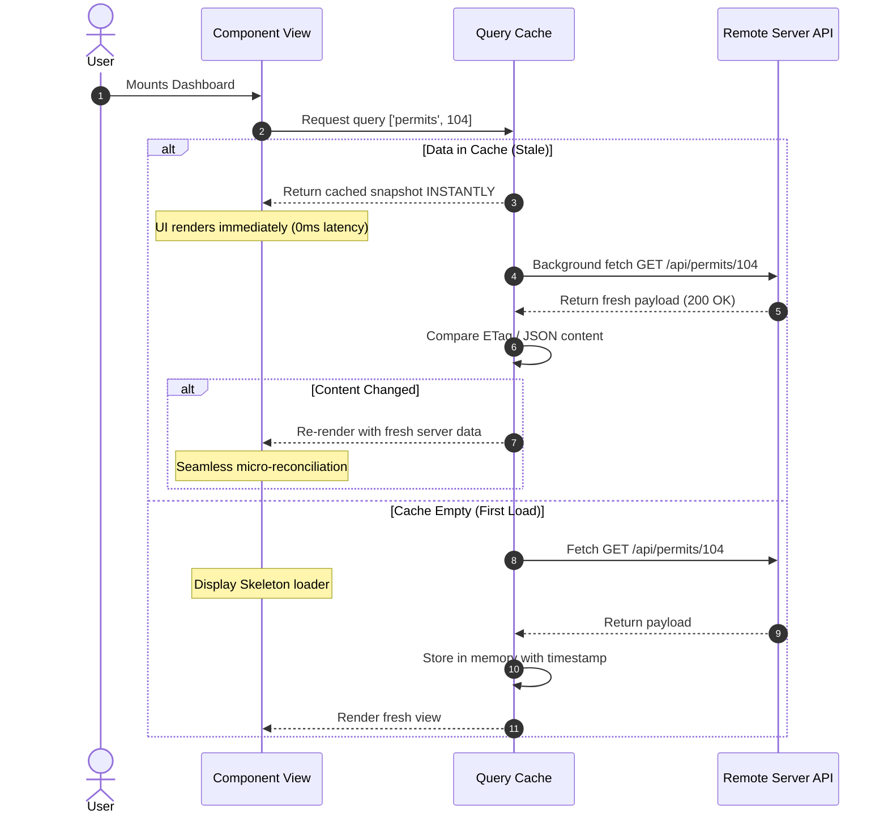
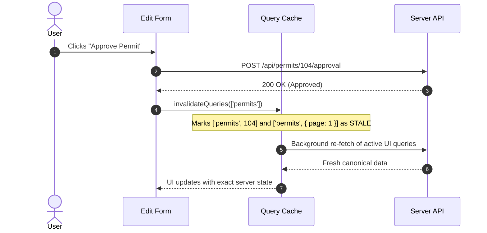
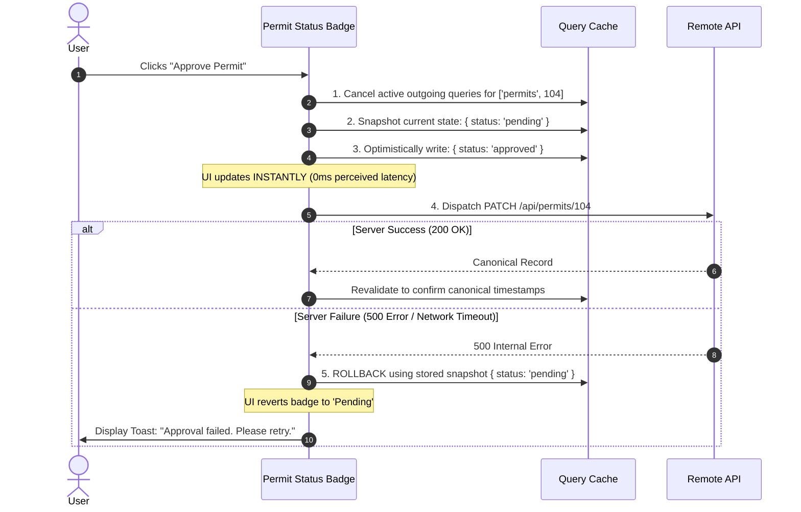
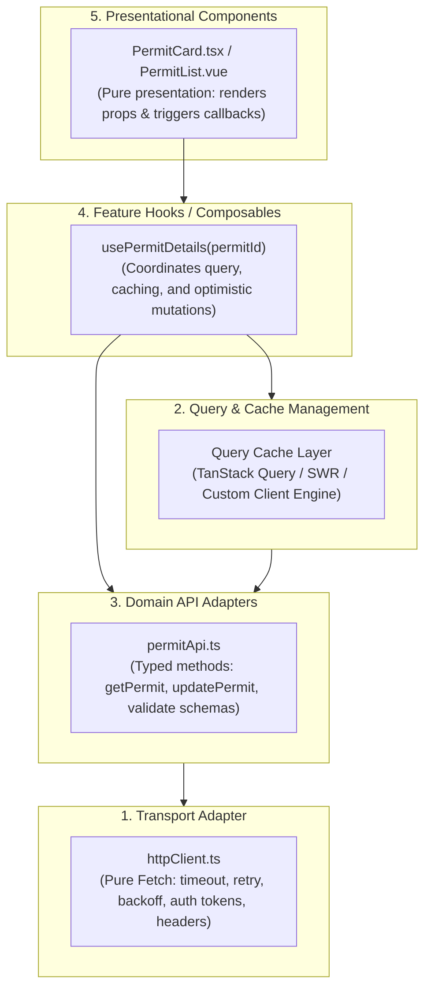

A citizen opens the regional municipal portal to renew a commercial operating license and pay the required annual fee. They navigate to the permit summary page, where three independent dashboard widgets mount simultaneously: a header status badge, a financial assessment summary, and an attached documents list.

In a naively built application, each of these three components immediately fires an independent `fetch('/api/permits/104')` request. The browser makes three redundant network roundtrips over cellular infrastructure for the exact same resource. 

The citizen clicks "Pay Annual Fee." The interface transitions into a loading spinner on the payment button. Halfway through the transaction, the citizen steps into an elevator, causing a three-second cellular drop. The naive `fetch()` call fails with a generic `TypeError: Failed to fetch`. Instead of retrying with exponential backoff, the application throws an uncaught error boundary, crashing the entire dashboard and displaying an unhelpful generic error screen: *"Something went wrong."*

The citizen exits the elevator, refreshes the browser, and tries again. This time, the payment succeeds. The button changes to "Paid," but the financial assessment widget elsewhere on the page continues to display *"Payment Pending: 150,000 IQD"* because the application's components communicate through disconnected local states without a shared server-state cache. Even worse, if the front-end attempts an uncoordinated optimistic update, a subsequent 500 server rejection leaves the user believing their fee was paid when the municipality's database never recorded the transaction.

Every one of these flaws originates from a fundamental architectural misconception: **treating remote server communication as local synchronous state with a delay**.

```mermaid
flowchart TD
    subgraph NaivePattern["Naive Fetch Pattern (Fragile & Redundant)"]
        W1["Widget 1: Header"] -->|fetch /permits/104| API1[Server API]
        W2["Widget 2: Finance"] -->|fetch /permits/104| API1
        W3["Widget 3: Docs"] -->|fetch /permits/104| API1
        P1["Payment Click"] -->|untracked POST| API1
        API1 -.->|Network Drop| Crash["Unhandled Rejection / UI Crash"]
    end

    subgraph ResilientArchitecture["Resilient Server-State Architecture (SWR & Cache)"]
        C1["Component 1"] & C2["Component 2"] & C3["Component 3"] --> Cache["Query Cache Layer\n(Deduplication & SWR)"]
        Cache -->|Single In-Flight Request| Adapter["HTTP Transport Adapter\n(Retry, Timeout, Abort)"]
        Adapter -->|Resilient HTTP| Server["Canonical Server API"]
        Mut["Mutation Action"] -->|Snapshot & Optimistic Update| Cache
        Mut -->|Idempotent POST| Adapter
        Adapter -.->|Failure (4xx/5xx)| Rollback["Automatic Cache Rollback & Toast"]
    end
```

Server state is not client state. As established in [Chapter 8](), server state is an **asynchronous, remote snapshot of external data owned by someone else**. The browser does not control it; the network between client and server is inherently unreliable, latent, and shared with thousands of concurrent actors.

In this chapter, we engineer front-end communication boundaries that withstand network failures. We examine HTTP semantics, encapsulate network transport through resilient fetch pipelines, construct multi-state remote data lifecycles, master Stale-While-Revalidate (SWR) caching with in-flight deduplication, and execute optimistic mutations with reliable snapshot rollback.

---

## 1. HTTP Foundations for Front-End Architecture

Modern front-end applications are distributed systems. Every time an application reads or mutates data, it participates in the HTTP protocol. Understanding HTTP semantics - specifically method safety, idempotency, header negotiation, and status code categories - is the prerequisite for solid data synchronization.

### Method Semantics: Safety and Idempotency

HTTP methods are defined by formal contracts regarding side effects and repeatability:



* **Safe Methods (`GET`, `HEAD`):** Safe methods do not alter the server's resource state. A user or browser pre-fetch engine can execute a `GET` request ten thousand times, and the system state remains untouched. Safe methods can be aggressively cached by browsers, edge content delivery networks (CDNs), and intermediate proxies.
* **Idempotent Methods (`GET`, `HEAD`, `PUT`, `DELETE`):** An operation is idempotent if executing it once yields the exact same server resource state as executing it multiple times in succession. If a network timeout occurs during a `PUT /api/permits/104` or `DELETE /api/permits/104`, the client can safely retry the request automatically without risking duplicate records.
* **Non-Idempotent Methods (`POST`, `PATCH`):** Executing `POST /api/permits/104/payments` twice may charge the citizen twice. The client cannot automatically retry a dropped `POST` request without an **Idempotency Key** header to guarantee that the server treats duplicate transmissions as a single transaction.

### Critical Headers for Front-End Data Flow

Headers dictate content negotiation, cache validation, and authorization between the browser and API:

| Header | Role in Front-End Architecture | Example |
| :--- | :--- | :--- |
| `Accept` | Tells server which content format the client expects. | `Accept: application/json` |
| `Content-Type` | Indicates format of outgoing payload body. | `Content-Type: application/json; charset=utf-8` |
| `Authorization` | Passes authentication credentials/bearer tokens. | `Authorization: Bearer eyJhbGci...` |
| `If-None-Match` | Conditional validation; sends client's cached `ETag`. | `If-None-Match: "w/33a2-nytU5"` |
| `ETag` | Unique hash/fingerprint of the resource version sent by server. | `ETag: "w/33a2-nytU5"` |
| `Cache-Control` | Directives governing freshness and validation rules. | `Cache-Control: private, max-age=60, stale-while-revalidate=300` |
| `Idempotency-Key` | Client-generated UUID ensuring safe retries on `POST`. | `Idempotency-Key: 9b1deb4d-3b7d-4bad-9bdd-2b0d7b3dcb6d` |

When the browser sends `If-None-Match: "w/33a2-nytU5"`, the server compares the hash against the current database record. If unchanged, the server returns an empty `304 Not Modified` response without a payload body, saving network bandwidth and compute overhead.

### Front-End Response Handling by Status Code Category

A production application must handle HTTP status codes systematically rather than treating everything outside `200 OK` as an undifferentiated failure:



---

## 2. The Fetch API and Transport Boundaries

The browser's native `fetch()` API replaced legacy `XMLHttpRequest` with a clean Promise-based interface. However, raw `fetch()` has several behavioral nuances that trip up inexperienced developers:

1. **`fetch()` does not reject on HTTP 4xx or 5xx.** It only rejects when a catastrophic network failure occurs (DNS lookup failure, unplugged network cable, blocked port, or offline status). An HTTP `500 Internal Server Error` or `404 Not Found` resolves successfully as a `Response` object.
2. **Body consumption is one-time.** The response stream (`response.json()` or `response.text()`) can only be read once.
3. **Cancellation requires an external signal.** Without an `AbortController`, an asynchronous fetch continues running in the background even if the user navigates away or unmounts the component.

### The Robust Transport Wrapper

To prevent leaking raw network concerns into the UI layer, we construct an isolated **Transport Adapter**. This adapter inspects `response.ok`, parses standardized error payloads, and attaches timeout and cancellation capabilities.

```typescript
// src/api/httpClient.ts
export class HttpError extends Error {
  constructor(
    public readonly status: number,
    public readonly statusText: string,
    public readonly data?: unknown
  ) {
    super(`HTTP ${status} ${statusText}`);
    this.name = 'HttpError';
  }

  get isClientError(): boolean {
    return this.status >= 400 && this.status < 500;
  }

  get isServerError(): boolean {
    return this.status >= 500 && this.status < 600;
  }
}

interface RequestOptions extends RequestInit {
  timeoutMs?: number;
  params?: Record<string, string | number | boolean | undefined>;
}

export async function httpClient<T>(url: string, options: RequestOptions = {}): Promise<T> {
  const { timeoutMs = 10000, params, ...fetchInit } = options;

  // 1. Construct serialized URL search params if provided
  let targetUrl = url;
  if (params) {
    const searchParams = new URLSearchParams();
    for (const [key, value] of Object.entries(params)) {
      if (value !== undefined) {
        searchParams.append(key, String(value));
      }
    }
    const queryString = searchParams.toString();
    if (queryString) {
      targetUrl += (targetUrl.includes('?') ? '&' : '?') + queryString;
    }
  }

  // 2. Set up Timeout via AbortSignal.timeout or fallback
  const timeoutSignal = AbortSignal.timeout(timeoutMs);
  const combinedSignal = fetchInit.signal 
    ? AbortSignal.any([fetchInit.signal, timeoutSignal])
    : timeoutSignal;

  const headers = new Headers(fetchInit.headers);
  if (!headers.has('Accept')) {
    headers.set('Accept', 'application/json');
  }
  if (fetchInit.body && !headers.has('Content-Type')) {
    headers.set('Content-Type', 'application/json');
  }

  try {
    const response = await fetch(targetUrl, {
      ...fetchInit,
      headers,
      signal: combinedSignal,
    });

    // 3. Inspect HTTP status boundary
    if (!response.ok) {
      let errorData: unknown;
      try {
        errorData = await response.json();
      } catch {
        errorData = await response.text();
      }
      throw new HttpError(response.status, response.statusText, errorData);
    }

    // 4. Handle empty 204 No Content responses cleanly
    if (response.status === 204) {
      return undefined as T;
    }

    return (await response.json()) as T;
  } catch (error: unknown) {
    if (error instanceof HttpError) {
      throw error;
    }
    if (error instanceof DOMException && error.name === 'AbortError') {
      throw new Error(`Request cancelled or timed out after ${timeoutMs}ms`);
    }
    throw new Error(error instanceof Error ? error.message : 'Unknown network failure');
  }
}
```

### Transient Error Classification and Exponential Backoff Retry

When a network request fails, blind immediate retries make outages worse (the "thundering herd" problem). A robust client identifies whether the failure is **transient** (recoverable through waiting) or **permanent** (fatal code or validation bug).



The mathematical formula for exponential backoff with full jitter is:

$$T_{\text{wait}} = \min(T_{\max},\; T_{\text{base}} \times 2^{\text{attempt}}) + \text{random}(0, \text{jitter})$$

This distributes retries across time, preventing millions of mobile clients from bombarding recovering application servers simultaneously.

```typescript
export async function withRetry<T>(
  operation: () => Promise<T>,
  options: {
    maxRetries?: number;
    baseDelayMs?: number;
    maxDelayMs?: number;
    isTransient?: (error: unknown) => boolean;
  } = {}
): Promise<T> {
  const {
    maxRetries = 3,
    baseDelayMs = 500,
    maxDelayMs = 8000,
    isTransient = defaultIsTransient,
  } = options;

  let attempt = 0;

  while (true) {
    try {
      return await operation();
    } catch (error: unknown) {
      attempt++;
      if (attempt > maxRetries || !isTransient(error)) {
        throw error;
      }

      // Calculate exponential backoff with random jitter
      const exponentialDelay = Math.min(maxDelayMs, baseDelayMs * Math.pow(2, attempt - 1));
      const jitter = Math.random() * 200;
      const totalDelay = exponentialDelay + jitter;

      await new Promise((resolve) => setTimeout(resolve, totalDelay));
    }
  }
}

function defaultIsTransient(error: unknown): boolean {
  if (error instanceof HttpError) {
    // 408 Request Timeout, 429 Too Many Requests, or 5xx Server Errors
    return error.status === 408 || error.status === 429 || error.isServerError;
  }
  // Generic network drops, connection resets, DNS failures are transient
  return true;
}
```

---

## 3. The Remote Data UI Lifecycle

Front-end components frequently reduce asynchronous state to two flags:

```typescript
// ANTIPATTERN: Incomplete remote data modeling
const [isLoading, setIsLoading] = useState(false);
const [isError, setIsError] = useState(false);
```

This boolean approach creates awkward UI contradictions. What should the UI render if both `isLoading` and `isError` are true? How does the application represent showing cached data while quietly checking the server for updates?

### The Complete Six-State Remote Lifecycle

A resilient interface models remote data as a comprehensive state machine:



1. **`idle`:** The query has not yet executed (useful for dependent queries that wait for user action or parent record selection).
2. **`loading`:** Initial fetch in flight; no data exists in memory; display skeleton placeholder.
3. **`success`:** Data is loaded and authoritative; display full interactive UI.
4. **`revalidating`:** Stale data is currently displayed, but a background fetch is checking for updates. **Never replace the screen with a fullscreen spinner during revalidation.** Keep the existing interface responsive, displaying a subtle background activity indicator.
5. **`empty`:** The query resolved successfully, but returned an empty dataset (`items.length === 0`). Render a dedicated empty-state view with an action button (e.g., *"No permits found matching this filter. Clear filters"*).
6. **`error`:** The request failed. Render an inline, contextual error message with a clear "Retry" button.

---

## 4. REST Consumption and Modern API Paradigms

Client-server contracts dictate how data is fetched, transformed, and cached. While REST remains the backbone of the web, modern applications balance REST with GraphQL and RPC architectures depending on their domain needs.

### Resource-Oriented REST Design

In a disciplined REST architecture, URLs identify resources (nouns), and HTTP methods define operations (verbs):



### REST vs. GraphQL: Architectural Trade-Offs

When designing front-end communication, engineering leads evaluate how network data structures interact with client caching:



| Dimension | REST | GraphQL |
| :--- | :--- | :--- |
| **HTTP Semantics** | Native methods (`GET`, `POST`, `PUT`, `DELETE`). | Almost exclusively `POST /graphql` (obscuring standard HTTP caching). |
| **Over/Under-Fetching** | Possible if endpoints return fixed server payloads. | Eliminated: Client requests exact fields required by UI view. |
| **Edge / CDN Caching** | Trivial: URLs map directly to cache keys in Varnish, Cloudflare, Fastly. | Difficult: Requires GET hashing or specialized edge GraphQL proxy. |
| **Client Cache Model** | Document/Query cache (`['permits', 104]`). | Normalized Graph Cache (stores entities by `__typename:id`). |
| **Bundle Footprint** | Lightweight (zero client library required, uses native `fetch`). | Heavier (requires Apollo Client, Relay, or Urql runtime parser). |

---

## 5. Server-State Caching Principles: SWR and Invalidation

In traditional web applications, navigating to a new page prompted a full server reload. In single-page applications, naive developers attempted to eliminate reloading by loading all data into a global Redux/Pinia store on initial boot. This caused catastrophic memory leaks, out-of-date records, and complex manual cache synchronization.

The modern paradigm treats server state as an **external cache** governed by **Stale-While-Revalidate (SWR)**.

### The Mechanics of Stale-While-Revalidate

Originally defined in HTTP RFC 5861, SWR balances instant rendering speed with data freshness:



### Deterministic Query Keys

In an SWR cache, every query is indexed by a **Query Key**. A query key is a unique, serialized coordinate identifying the resource:

```typescript
// Query Key Examples
['permits']                               // All permits collection
['permits', 104]                          // Specific permit record
['permits', { status: 'pending', page: 2 }] // Filtered, paginated collection
['users', 'current', 'permissions']       // Logged-in user permissions
```

Query keys must serialize deterministically. If two components query `['permits', { page: 1, sort: 'asc' }]` and `['permits', { sort: 'asc', page: 1 }]`, the cache manager must recognize them as identical:

```typescript
export function hashQueryKey(queryKey: unknown[]): string {
  return JSON.stringify(queryKey, (_, val) => {
    if (val !== null && typeof val === 'object' && !Array.isArray(val)) {
      // Sort object keys alphabetically for deterministic serialization
      return Object.keys(val)
        .sort()
        .reduce<Record<string, unknown>>((acc, key) => {
          acc[key] = (val as Record<string, unknown>)[key];
          return acc;
        }, {});
    }
    return val;
  });
}
```

### In-Flight Request Deduplication

When five different components on a dashboard mount simultaneously and request the exact same key (`['permits', 104]`), an uncoordinated system sends five identical HTTP requests.

A cache manager implements **in-flight deduplication** by retaining active `Promise` references:

```mermaid
flowchart TD
    C1["Component 1"] -->|Query ['permit', 104]| Cache{"Active Promise in flight?"}
    C2["Component 2"] -->|Query ['permit', 104]| Cache
    C3["Component 3"] -->|Query ['permit', 104]| Cache

    Cache -->|No| Net["Initiate 1 Network Request"]
    Cache -->|Yes| Join["Join Existing In-Flight Promise"]

    Net --> Server["Server API"]
    Server -->|200 OK Response| Distribute["Fulfill Single Promise\nDistribute Result to C1, C2, C3 Simultaneously"]
```

```typescript
class QueryCache {
  private cache = new Map<string, { data: unknown; updatedAt: number }>();
  private inFlight = new Map<string, Promise<unknown>>();

  async fetchQuery<T>(key: unknown[], fetcher: () => Promise<T>, staleTimeMs = 30000): Promise<T> {
    const serializedKey = hashQueryKey(key);
    const existingEntry = this.cache.get(serializedKey);
    const now = Date.now();

    // 1. If cached and fresh, return immediately without network call
    if (existingEntry && (now - existingEntry.updatedAt) < staleTimeMs) {
      return existingEntry.data as T;
    }

    // 2. If a request for this exact key is ALREADY in flight, share that promise
    if (this.inFlight.has(serializedKey)) {
      return this.inFlight.get(serializedKey) as Promise<T>;
    }

    // 3. Initiate single network request and register promise
    const promise = fetcher()
      .then((data) => {
        this.cache.set(serializedKey, { data, updatedAt: Date.now() });
        return data;
      })
      .finally(() => {
        this.inFlight.delete(serializedKey);
      });

    this.inFlight.set(serializedKey, promise);
    return promise;
  }
}
```

### Invalidation vs. Manual Cache Mutation

When a record changes on the server, front-end developers often attempt to manually splice arrays or mutate deep cache objects in client memory. This is brittle; it leads to inconsistencies when the server applies business logic (such as calculating taxes, updating timestamps, or incrementing sequence numbers) that the client did not replicate.

The robust pattern is **Declarative Invalidation**:



Invalidating a query marks it stale and automatically re-fetches any queries currently active on screen, guaranteeing that the client view mirrors the canonical database state.

---

## 6. Mutations, Form Submissions, and Error Handling

Fetching data is only half the contract; applications must also mutate remote resources. Submitting forms and mutations introduces unique synchronization requirements.

### Idempotency Keys in Mutation Pipelines

If a user clicks "Submit Payment" on a mobile connection, and the response times out, the browser cannot know whether the server completed the charge before dropping the connection. 

To prevent duplicate charges, the front-end generates a unique **Idempotency Key** (a UUID v4) for that specific transaction attempt:

```typescript
// Submitting a critical payment mutation
const transactionId = crypto.randomUUID();

await httpClient('/api/permits/104/payments', {
  method: 'POST',
  headers: {
    'Idempotency-Key': transactionId,
  },
  body: JSON.stringify({ amount: 150000, currency: 'IQD' }),
});
```

If the client retries the request with the identical key, the server identifies the duplicate request and returns the existing result without charging the citizen a second time.

### Structured Validation Error Contracts

When a form submission fails business validation, servers should return a standard `422 Unprocessable Entity` payload (such as RFC 7807 Problem Details):

```json
{
  "type": "https://api.erbil.gov.krd/errors/validation-failed",
  "title": "Validation Failed",
  "status": 422,
  "detail": "The permit application contains invalid field values.",
  "errors": {
    "applicantNationalId": ["Must be exactly 10 numeric digits."],
    "feeAmount": ["Payment amount does not match current municipal schedule."]
  }
}
```

The front-end mutation layer catches this structured error and routes the messages directly into the form's field-level error state (as structured in Chapter 8), highlighting the problematic inputs without wiping the user's entered draft.

---

## 7. Optimistic Updates and Rollback Architecture

On high-latency or mobile networks, waiting 800ms for a server confirmation before updating the UI feels sluggish. When a user clicks a "Star Document" or "Mark as Approved" button, the probability of server success is typically over 99%.

**Optimistic Updates** enhance perceived performance by immediately reflecting the intended change in the UI, while managing a background network mutation with an automated rollback fallback.



### Implementing Safe Optimistic Mutations

Here is the architectural pattern for optimistic mutation execution:

```typescript
interface MutationContext<T> {
  previousSnapshot: T;
}

export async function executeOptimisticMutation<TData, TVariables>(options: {
  queryKey: unknown[];
  cache: QueryCache;
  mutationFn: (variables: TVariables) => Promise<TData>;
  optimisticUpdate: (current: TData, variables: TVariables) => TData;
  variables: TVariables;
  onErrorToast?: (error: Error) => void;
}): Promise<void> {
  const { queryKey, cache, mutationFn, optimisticUpdate, variables, onErrorToast } = options;
  const serializedKey = hashQueryKey(queryKey);

  // 1. Cancel any active outgoing refetches so they don't overwrite our optimistic update
  cache.cancelInFlight(queryKey);

  // 2. Snapshot previous value for rollback safety
  const previousSnapshot = cache.getQueryData<TData>(queryKey);

  if (previousSnapshot) {
    // 3. Apply optimistic mutation directly into client cache
    const optimisticData = optimisticUpdate(previousSnapshot, variables);
    cache.setQueryData(queryKey, optimisticData);
  }

  try {
    // 4. Perform actual network mutation
    await mutationFn(variables);
    
    // 5. On success, invalidate to reconcile canonical server values
    cache.invalidateQueries(queryKey);
  } catch (err: unknown) {
    // 6. Rollback to snapshot if mutation rejected
    if (previousSnapshot) {
      cache.setQueryData(queryKey, previousSnapshot);
    }
    
    const error = err instanceof Error ? err : new Error('Mutation failed');
    onErrorToast?.(error);
  }
}
```

---

## 8. Separation of Architectural Responsibilities

A well-architected front-end organizes data communication into five distinct layers. A React or Vue component should never invoke `fetch()` directly; it should interact with custom domain hooks that consume a cached state layer.



### Responsibilities by Layer:

1. **Transport Layer (`httpClient.ts`):** Pure network plumbing. Knows nothing about municipal permits or user roles. Handles base URLs, HTTP status inspection, timeout signals, and authorization header injection.
2. **Query & Cache Layer (TanStack Query / SWR):** Manages asynchronous lifecycle, query keys, garbage collection timers, in-flight deduplication, and window focus revalidation.
3. **Domain API Adapters (`permitApi.ts`):** Defines typed functions returning verified domain models. Validates incoming server responses using runtime schema validators (Zod/Valibot as established in Chapter 5) before passing data to the application.
4. **Feature Hooks (`usePermits.ts`):** Bridges domain logic and UI. Exposes simple, declarative interfaces to components: `{ permit, isLoading, isError, approve }`.
5. **Presentational Components (`PermitCard.tsx`):** Pure or near-pure UI elements. Render skeletons, empty states, or error messages based on props.

---

## Architectural Case Study: The Municipal Permit Approval Pipeline

To observe these architectural layers functioning together, examine the complete lifecycle of a municipal inspector approving an operating license on a field tablet:

1. **Inspector opens the application:** The tablet mounts the `/permits/104` route.
2. **Instant Cache Render:** If the inspector opened this permit ten minutes ago at headquarters, the SWR cache renders the cached snapshot in 0 milliseconds.
3. **Silent Background Revalidation:** The cache manager fires `GET /api/permits/104` with `If-None-Match: "w/33a2"`. The server verifies that no other inspector modified the permit and returns `304 Not Modified`. The cache resets its freshness timer without triggering a re-render.
4. **Optimistic Action:** The inspector clicks "Approve." The badge instantly updates from yellow "Pending" to green "Approved" on the screen.
5. **Network Interruption:** As the approval `POST` dispatches, the tablet enters a concrete basement. The connection drops.
6. **Resilient Retry:** The transport adapter catches the dropped TCP connection, identifies it as transient, waits 500ms, and retries with an attached `Idempotency-Key`.
7. **Resolution:** Upon emerging from the basement, the retry succeeds. The server returns the final approved record with an official registration stamp. The cache updates smoothly, and the inspector continues their workday uninterrupted.

---

## Chapter Summary

* **Server state is a remote snapshot.** Unlike local UI state, server data is asynchronous, shared, and owned by external systems. Front-end code must account for uncertainty and latency.
* **Respect HTTP semantics.** Use `GET` for safe, cacheable queries; use `PUT` and `DELETE` for idempotent updates; use `POST` with idempotency keys for operations with side effects.
* **Wrap raw `fetch()`.** Native `fetch()` does not reject on 4xx/5xx status codes and requires external `AbortController` signals for cancellation and timeouts.
* **Categorize errors accurately.** Distinguish transient infrastructure failures (502, 503, network drops) eligible for exponential backoff retries from permanent client errors (400, 401, 403, 422).
* **Model the complete remote lifecycle.** Replace simplistic boolean `isLoading` flags with comprehensive state machines accounting for initial loading, stale revalidation, empty sets, and actionable error states.
* **Implement Stale-While-Revalidate (SWR).** Serve cached snapshots instantly while verifying freshness in the background. Deduplicate in-flight requests to eliminate redundant network traffic.
* **Use declarative invalidation.** Invalidate queries to synchronize with canonical server state instead of attempting complex manual cache mutations.
* **Protect optimistic updates with snapshots.** Perceived zero-latency interactions must always store a baseline snapshot to ensure clean rollback if server mutations fail.
* **Maintain layered boundaries.** Separate transport adapters, query caches, domain API modules, and UI components into isolated, testable layers.

---

## Review Questions

1. Why does `fetch()` resolve rather than reject when the server returns an HTTP `500 Internal Server Error`?
2. Explain the difference between safe and idempotent HTTP methods. Which category does `PATCH` belong to?
3. What is an Idempotency Key, and why is it essential when retrying failed `POST` mutation requests?
4. How does the `stale-while-revalidate` caching pattern improve both perceived performance and data freshness?
5. Why is in-flight request deduplication critical when multiple dashboard widgets share the same data source?
6. Describe the mathematical formula for exponential backoff with jitter and why random jitter is necessary.
7. How does a client application use the `ETag` and `If-None-Match` headers to eliminate unnecessary data downloads?
8. Explain the four steps required to execute a safe optimistic UI mutation with rollback capabilities.
9. What is the difference between an HTTP `401 Unauthorized` and an HTTP `403 Forbidden` response, and how should client UI routing respond to each?
10. Why is declarative query invalidation architecturally superior to manually mutating client-side cached arrays after an edit?

---

## Practical Lab Brief

Apply the principles learned in this chapter by completing:
**[Practical 09 - Cached Server-State Client with Optimistic Mutations]()**

In this laboratory, you will build a framework-agnostic asynchronous cache manager in TypeScript featuring deterministic query key hashing, in-flight request deduplication, Stale-While-Revalidate background polling, exponential backoff retries, and optimistic mutations with rollback snapshots.
