A municipal health and safety inspector begins their shift at the Erbil General Directorate of Municipalities. Their field tablet syncs with the central server, downloading today's queue of twenty commercial food and hospitality inspections.

At 10:30 AM, the inspector enters the second underground sub-basement of a commercial shopping complex to inspect a restaurant's industrial refrigeration system and emergency electrical shutoffs. Thick reinforced concrete walls block all radio frequencies; cellular signal drops to zero bars, and no municipal Wi-Fi is reachable.

In a naively built web application, the system immediately ceases functioning:
- Navigating to the next checklist tab triggers an unhandled network error, blanking the view into a browser default dinosaur offline screen.
- Form inputs disable themselves or silently fail when the inspector attempts to check off regulatory violations.
- If the inspector attempts to tap "Submit Inspection Report," the client executes a raw `fetch()` call that throws an uncaught error. The inspection draft—representing forty-five minutes of meticulous notes, temperature readings, and photographic references—is vaporized from memory.
- When the inspector returns to street level and network connectivity is restored, the application reloads to a blank initial screen. The inspector must re-enter the basement and perform the entire inspection a second time.

Every one of these failures stems from the same fragile architectural assumption: **designing web applications under the illusion of permanent, high-bandwidth connectivity**.

```mermaid
flowchart TD
    subgraph FragileWeb["Naive Online-Only Web App"]
        N1["User enters basement (0 bars)"] --> N2["Network fetch fails"]
        N2 --> N3["Uncaught Promise rejection"]
        N3 --> N4["App crashes / State wiped"]
        N4 --> N5["Inspector must re-do 45 mins of work"]
    end

    subgraph ResilientOffline["Durable Offline-First Architecture"]
        R1["User enters basement (0 bars)"] --> R2["App Shell loaded from Cache Storage"]
        R2 --> R3["Checklists read from local IndexedDB"]
        R3 --> R4["Inspection committed to IndexedDB Outbox"]
        R4 --> R5["Zero data loss; Inspector continues workflow"]
        R5 --> R6["Reconnection at street level"]
        R6 --> R7["Outbox syncs with Idempotency-Key & Backoff"]
    end
```

The web is an inherently mobile, distributed medium. Front-end engineers cannot treat network connectivity as a binary, guaranteed foundation. Instead, resilient applications are **designed for disconnection**: they leverage live push transports when real-time freshness is required, persist structured data locally in client storage, intercept network traffic with Service Workers, and synchronize mutations through durable outbox queues.

In this chapter, we engineer front-end systems capable of surviving hostile network topologies. We examine real-time push protocols, evaluate the browser persistence spectrum, construct Service Worker caching strategies, implement transactional outbox synchronization with exponential backoff, and resolve concurrent editing conflicts.

---

## 1. Real-Time Communication: Choosing Push Over Poll

Traditional HTTP communication is client-driven: the browser issues a request, the server responds, and the connection terminates. However, many modern features—such as live dispatch updates, multi-user document collaboration, and instant emergency notifications—require the server to push data to the client the moment an event occurs.

### The Real-Time Transport Spectrum

Architects must not treat "real-time" as a single technology. Real-time is a spectrum of freshness requirements, ranging from occasional background polling to sub-millisecond peer-to-peer data streaming:

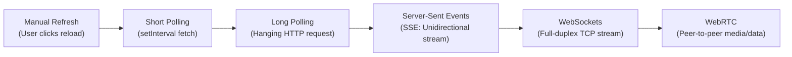

| Transport | Directionality | Protocol | Reconnection | Overhead | Best Suited For |
| :--- | :--- | :--- | :--- | :--- | :--- |
| **Short Polling** | Client $\rightarrow$ Server | HTTP/1.1 or HTTP/2 | Automatic (next interval) | High (repeated TCP/TLS handshakes & headers) | Low-frequency status checks (e.g. hourly job status). |
| **Long Polling** | Client $\rightarrow$ Server | HTTP/1.1 or HTTP/2 | Manual client loop | Moderate (connection stays open until event) | Legacy browser fallback when SSE/WebSockets unavailable. |
| **Server-Sent Events (SSE)** | Server $\rightarrow$ Client | HTTP/2 or HTTP/1.1 | Built-in native browser auto-reconnect | Very Low (standard HTTP text/event-stream) | Live dashboards, stock tickers, notification feeds, AI text streaming. |
| **WebSockets** | Bidirectional (Full Duplex) | WS / WSS (TCP upgrade) | Manual client implementation | Minimal (lightweight 2-byte frame overhead) | Interactive chat, collaborative whiteboards, multiplayer gaming. |
| **WebRTC** | Peer-to-Peer | UDP / SCTP | ICE / STUN / TURN renegotiation | Variable | Direct audio/video calling, mesh peer data transfer. |

### Server-Sent Events (SSE): The Elegance of Unidirectional Streams

When an application only requires the server to send updates to the browser (such as municipal assignment dispatchers pushing new tasks to an inspector's dashboard), **Server-Sent Events (SSE)** is almost always superior to WebSockets.

SSE operates entirely over standard HTTP (using the `text/event-stream` MIME type). Because it is standard HTTP, it traverses corporate firewalls, API gateways, and load balancers without special routing rules. It natively supports HTTP/2 multiplexing, carries standard authentication cookies and headers, and features automatic browser reconnection with `Last-Event-ID` tracking.

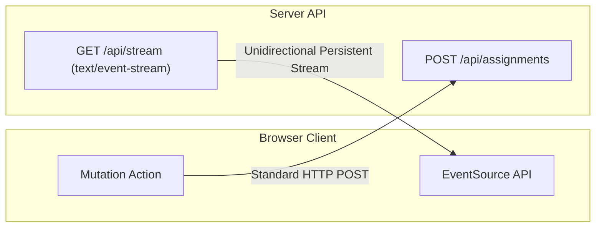

#### The SSE Wire Format
The server keeps the HTTP connection open indefinitely, emitting UTF-8 text blocks separated by double newlines (`\n\n`):

```http
HTTP/1.1 200 OK
Content-Type: text/event-stream
Cache-Control: no-cache
Connection: keep-alive

id: 1001
event: assignment.created
data: {"id": "insp-401", "facility": "Erbil Citadel Bakery", "priority": "high"}

id: 1002
event: assignment.updated
data: {"id": "insp-401", "status": "assigned", "inspectorId": "usr-88"}
```

In the browser, consuming this stream requires only the native `EventSource` interface:

```typescript
// src/realtime/sseClient.ts
export function subscribeToMunicipalEvents(url: string, onUpdate: (data: unknown) => void): () => void {
  const eventSource = new EventSource(url, { withCredentials: true });

  eventSource.addEventListener('assignment.updated', (event: MessageEvent) => {
    const payload = JSON.parse(event.data);
    onUpdate(payload);
  });

  eventSource.onerror = (err) => {
    // EventSource automatically retries connection in the background
    console.warn('SSE connection interrupted, browser auto-reconnecting...', err);
  };

  // Return cleanup teardown function
  return () => {
    eventSource.close();
  };
}
```

### WebSockets: High-Frequency Bidirectional Framing

When client-to-server latency must be sub-10ms and messages flow continuously in both directions (such as collaborative map pinning or live field-chat), the application upgrades from HTTP to **WebSockets** (`wss://`).

Unlike SSE, WebSockets do not operate over standard HTTP request-response semantics after the initial handshake. A single TCP socket remains open, transmitting lightweight binary or text frames. However, WebSockets lack built-in reconnection, authentication renewal, or event multiplexing; the engineering team must manage connection state explicitly.

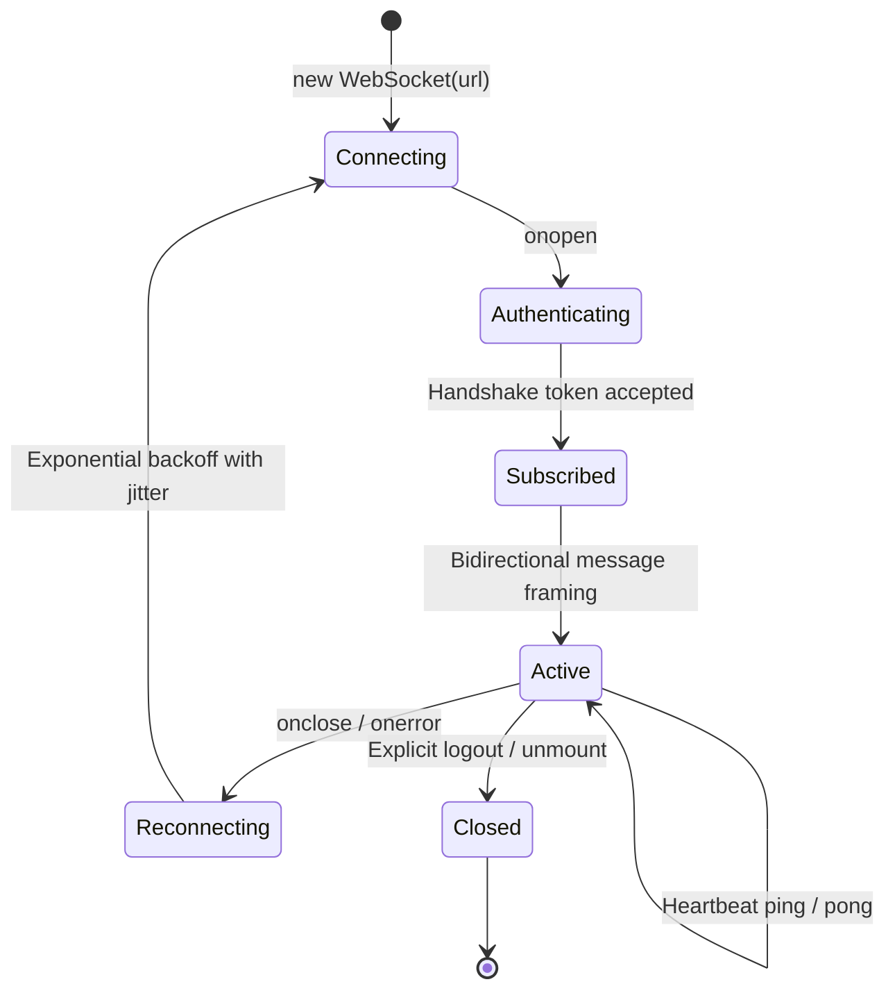

#### Reconnection with Bounded Backoff and Jitter
If a WebSocket connection drops, millions of mobile clients must not hammer the gateway at the same instant. Reconnection logic must implement exponential backoff with random jitter:

```typescript
// src/realtime/resilientSocket.ts
export class ResilientWebSocket {
  private ws: WebSocket | null = null;
  private attempt = 0;
  private isExplicitlyClosed = false;

  constructor(
    private readonly url: string,
    private readonly onMessage: (msg: unknown) => void,
    private readonly maxDelayMs = 10000,
    private readonly baseDelayMs = 500
  ) {
    this.connect();
  }

  private connect(): void {
    if (this.isExplicitlyClosed) return;

    this.ws = new WebSocket(this.url);

    this.ws.onopen = () => {
      this.attempt = 0; // Reset backoff upon successful connection
      console.log('WebSocket connected successfully');
    };

    this.ws.onmessage = (event) => {
      try {
        const parsed = JSON.parse(event.data);
        this.onMessage(parsed);
      } catch (e) {
        console.error('Malformed WebSocket frame payload', e);
      }
    };

    this.ws.onclose = () => {
      if (!this.isExplicitlyClosed) {
        this.scheduleReconnect();
      }
    };

    this.ws.onerror = (error) => {
      console.warn('WebSocket encountered error:', error);
      this.ws?.close();
    };
  }

  private scheduleReconnect(): void {
    this.attempt++;
    const delay = Math.min(this.maxDelayMs, this.baseDelayMs * Math.pow(2, this.attempt - 1));
    const jitter = Math.random() * 250;
    const totalDelay = delay + jitter;

    console.log(`Reconnecting WebSocket in ${Math.round(totalDelay)}ms (Attempt ${this.attempt})`);
    setTimeout(() => this.connect(), totalDelay);
  }

  public close(): void {
    this.isExplicitlyClosed = true;
    this.ws?.close();
  }
}
```

### Live Stream Deduplication Against Baseline Snapshots

A critical architectural pitfall in real-time systems is the **synchronization race condition**. When an application mounts, it fetches an initial REST data snapshot and simultaneously establishes a WebSocket/SSE connection. If an update occurs during the network handshake, the client risks applying an event twice or overwriting a fresh event with an older snapshot:

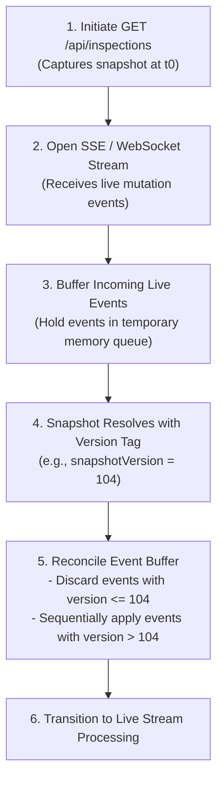

---

## 2. The Browser Storage Landscape: Choosing the Right Persistence

To operate without a continuous network connection, a front-end application must persist data locally on the user's device. However, browser storage mechanisms differ radically in performance, storage limits, data structures, and thread safety.

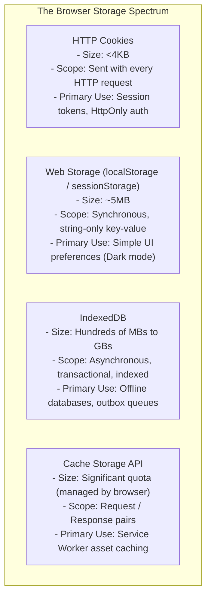

### The Pitfalls of `localStorage`

Many junior developers default to `localStorage` for offline data storage because its API is deceptively simple: `localStorage.setItem('key', JSON.stringify(data))`.

In professional architecture, **`localStorage` must never be used for domain records, inspection reports, or outbox queues**:
1. **Synchronous Main-Thread Blocking:** `localStorage` is completely synchronous. Reading or writing a 2MB JSON object blocks the browser's JavaScript event loop, causing frame drops, frozen typing animations, and unresponsive touch interactions.
2. **5MB Storage Ceiling:** Exceeding 5MB throws a fatal `QuotaExceededError`.
3. **No Indexing or Querying:** Searching for all "unassigned" inspections requires loading the entire dataset into memory and executing in-memory filtering.
4. **No Transactional Integrity:** If the browser crashes or the tab is closed while writing multiple related records, data is left in a corrupted, half-written state.
5. **Inaccessible to Service Workers:** Web Workers and Service Workers cannot access `localStorage` because of its synchronous design.

### IndexedDB: The Engine of Local-First Applications

**IndexedDB** is the browser's native database engine. It provides an asynchronous, non-blocking, transactional, indexed NoSQL object store capable of storing hundreds of megabytes of structured JavaScript objects, blobs, and typed arrays.

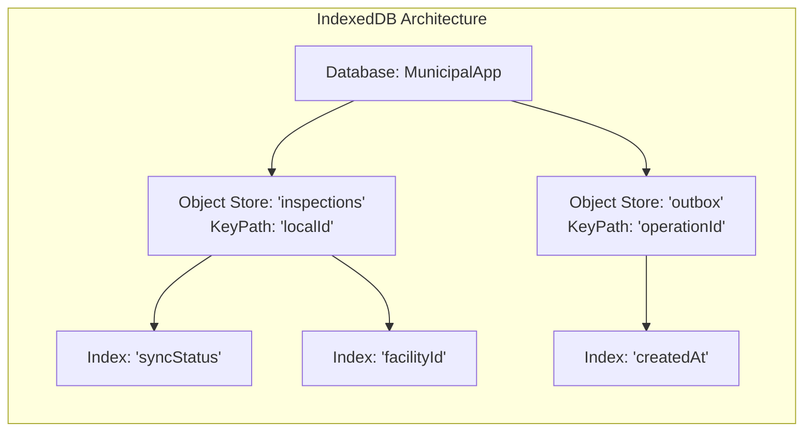

#### Transactional Atomicity in IndexedDB
The defining superpower of IndexedDB is **atomic multi-store transactions**. An operation can modify three separate stores simultaneously; if any constraint fails or an unhandled exception occurs, the entire transaction aborts automatically, guaranteeing zero database corruption:

```typescript
// Atomic write across domain store and outbox store
const tx = db.transaction(['inspections', 'outbox'], 'readwrite');

tx.oncomplete = () => console.log('Both inspection and outbox operation committed safely');
tx.onerror = () => console.error('Transaction aborted! Rollback executed automatically', tx.error);

const inspectionsStore = tx.objectStore('inspections');
const outboxStore = tx.objectStore('outbox');

// Step 1: Update local domain record
inspectionsStore.put(inspectionRecord);

// Step 2: Enqueue synchronization command
outboxStore.put(outboxCommand);
```

### Cache Storage API (`CacheStorage`)

While IndexedDB stores structured JavaScript application data, the **Cache Storage API** (accessible via `window.caches` and `self.caches`) stores raw **HTTP Request and Response objects**. 

`CacheStorage` is the storage foundation for Service Workers. It enables applications to store compiled JavaScript bundles, CSS stylesheets, HTML navigation documents, web fonts, and static imagery so they can be loaded instantly when the device is completely disconnected from the internet.

---

## 3. Service Workers and the Offline Application Shell

A traditional web page dies the moment network connectivity vanishes because the browser cannot load files from the server. A **Service Worker** eliminates this dependency by acting as a client-side programmable network proxy.

```mermaid
flowchart LR
    Page["Active Browser Window / UI"] <-->|fetch() / Navigation Request| SW["Service Worker\n(self.addEventListener('fetch'))"]
    SW <-->|Cache Match / Put| Cache["Cache Storage API"]
    SW <-->|Network Request| Net["Remote Network Gateway"]
```

A Service Worker:
- Runs in an isolated worker thread separate from the DOM.
- Has no direct access to window objects or DOM elements.
- Intercepts every network request (`fetch`) dispatched by pages within its scope.
- Decides programmatically whether to fulfill a request from the network, from the local `CacheStorage`, or from custom synthetic responses.

### The Service Worker Lifecycle

Unlike ordinary scripts that execute and vanish when a page closes, a Service Worker follows a distinct, event-driven lifecycle:

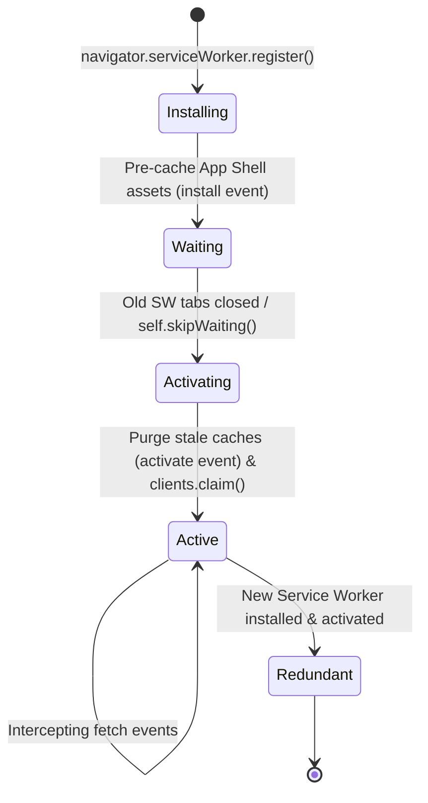

1. **`install`:** Fired when the browser downloads a new Service Worker script. This is where the application pre-caches its **App Shell** (the minimal HTML, CSS, JavaScript, and icons required to render the application frame). If any shell asset fails to download, installation fails, preventing corrupted offline states.
2. **`activate`:** Fired when the new worker takes control. This is where migrations and cache cleanups occur (e.g., deleting obsolete `CacheStorage` buckets from previous software versions).
3. **`fetch`:** Fired on every outgoing network request, allowing the worker to apply specialized caching topologies.

### Caching Topologies for Front-End Architecture

A production application does not apply a single caching strategy to all files. Different resources demand different topologies:

```mermaid
flowchart TD
    Req["Incoming HTTP fetch(event.request)"] --> Route{Classify Request Type}
    
    Route -->|Hashed Static Assets\n(main.8f2a.js, app.4b1c.css)| C1["Cache-First\nCheck cache → Return immediately\nFallback to network on miss"]
    Route -->|HTML Navigation Documents\n(/index.html, /permits)| C2["Network-First with Cache Fallback\nAttempt network → Update cache\nFallback to cached Shell on offline"]
    Route -->|Dashboard / Reference Data\n(/api/municipalities)| C3["Stale-While-Revalidate (SWR)\nReturn cached snapshot instantly\nRevalidate over network in background"]
    Route -->|Critical Mutations / Auth\n(/api/login, /api/payments)| C4["Network-Only\nNever cache; fail gracefully if offline"]
```

#### Implementing Caching Strategies in Service Worker Code

```javascript
// public/sw.js
const SHELL_CACHE = 'municipal-shell-v2';
const STATIC_ASSETS = [
  '/',
  '/index.html',
  '/assets/index.js',
  '/assets/index.css',
  '/assets/logo.svg',
  '/offline-fallback.html',
];

// 1. Install Event: Pre-cache App Shell
self.addEventListener('install', (event) => {
  event.waitUntil(
    caches.open(SHELL_CACHE).then((cache) => cache.addAll(STATIC_ASSETS))
  );
  self.skipWaiting();
});

// 2. Activate Event: Purge old cache versions
self.addEventListener('activate', (event) => {
  event.waitUntil(
    caches.keys().then((keys) =>
      Promise.all(
        keys.map((key) => {
          if (key !== SHELL_CACHE) {
            return caches.delete(key);
          }
        })
      )
    )
  );
  self.clients.claim();
});

// 3. Fetch Event: Intercept and route requests
self.addEventListener('fetch', (event) => {
  const url = new URL(event.request.url);

  // Strategy A: Cache-First for versioned immutable assets
  if (url.pathname.startsWith('/assets/')) {
    event.respondWith(
      caches.match(event.request).then((cached) => cached || fetch(event.request))
    );
    return;
  }

  // Strategy B: Network-First for HTML navigation with offline fallback
  if (event.request.mode === 'navigate') {
    event.respondWith(
      fetch(event.request).catch(() =>
        caches.match('/offline-fallback.html')
      )
    );
    return;
  }
});
```

---

## 4. Durable Local Writes and the Outbox Pattern

Reading cached data while offline is relatively straightforward. The true architectural challenge arises when the user must **create, edit, and delete data while completely offline**.

If an inspector completes a safety evaluation in a radio-shielded basement, the application cannot simply wait for network restoration before allowing the user to proceed. The application must treat local storage as the **primary authoring environment** and defer network transmission to a background synchronization engine.

### The Architecture of an Offline Outbox

The **Outbox Pattern** separates the user's intent to mutate data from the actual transport execution:

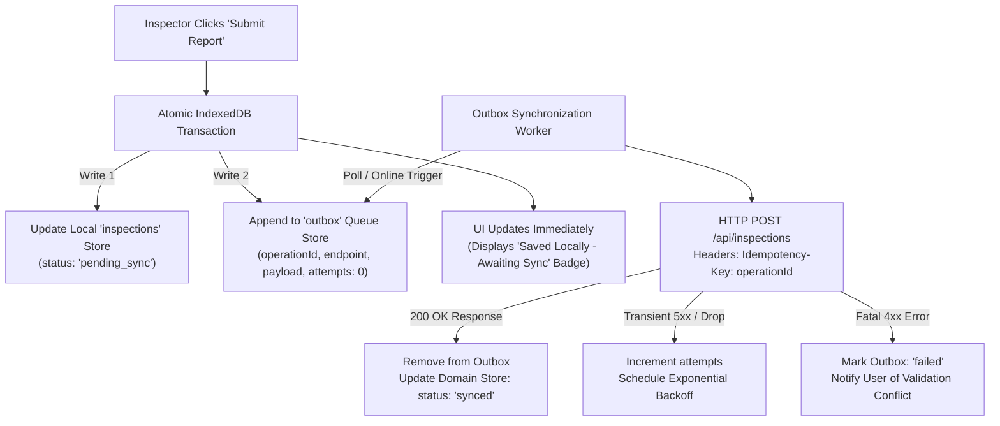

### The Identity Trinity: Local ID, Server ID, and Operation ID

To synchronize records cleanly across distributed systems, every entity must manage three distinct identifiers:

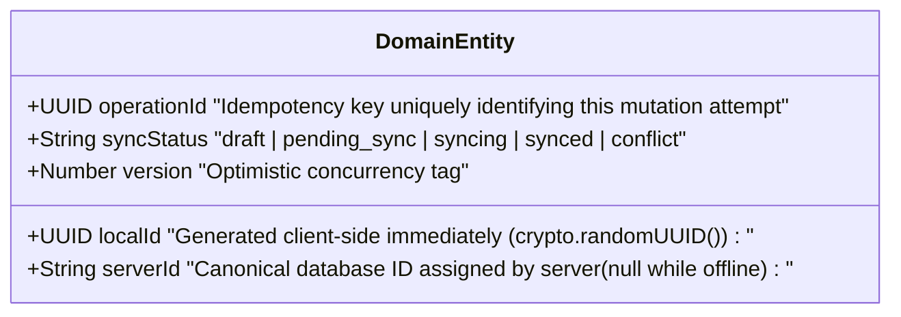

1. **`localId`:** A client-generated UUID (`crypto.randomUUID()`). Assigned the millisecond the record is created. Used as the primary key in local IndexedDB stores and for client-side routing (`/inspections/9b1deb4d-...`).
2. **`serverId`:** The authoritative ID assigned by the central municipal database (e.g. `INSP-2026-8812`). Remains `null` until the server successfully processes the outbox command.
3. **`operationId`:** A unique UUID assigned to each synchronization action. Transmitted in the HTTP request as the `Idempotency-Key` header.

---

## 5. Network Recovery, Egress Probing, and Idempotent Synchronization

When an inspector steps out of the basement into street sunlight, how does the application know it is safe to flush the outbox?

### The Fallacy of `navigator.onLine`

Many web applications contain code like this:

```typescript
// ANTIPATTERN: Blindly trusting navigator.onLine
if (navigator.onLine) {
  flushOutbox();
}
```

This code is brittle. In modern operating systems, `navigator.onLine` returns `true` if the device is connected to a local network interface (such as a local Wi-Fi router or cellular tower). It does **not** guarantee that packets can reach the public internet or your API server. 

A device exhibits a "lie-fi" condition when:
- Connected to an airport or hotel captive portal requiring login.
- Connected to an office router whose upstream ISP fiber connection is severed.
- Cell signal displays 3G, but packets are dropped due to tower congestion.

### Active Egress Probing (Heartbeats)

A resilient synchronization engine treats `window.addEventListener('online')` as an **unverified hint**. Before draining the outbox queue, it issues a lightweight heartbeat probe (`HEAD /api/health` with a strict 3-second timeout) to verify actual internet egress:

```typescript
// src/sync/heartbeat.ts
export async function verifyActiveEgress(probeUrl = '/api/health'): Promise<boolean> {
  // If the browser natively reports offline, egress is definitely impossible
  if (typeof navigator !== 'undefined' && !navigator.onLine) {
    return false;
  }

  try {
    const response = await fetch(probeUrl, {
      method: 'HEAD',
      cache: 'no-store',
      signal: AbortSignal.timeout(3000),
    });
    return response.ok;
  } catch {
    return false; // Connection timed out or DNS lookup failed
  }
}
```

### The Background Sync API: Reality and Progressive Enhancement

The W3C **Background Sync API** (`SyncManager`) allows web applications to register a sync tag with the browser:

```javascript
// Registering a background sync tag
navigator.serviceWorker.ready.then((registration) => {
  return registration.sync.register('sync-inspections');
});
```

If registered, the browser promises to wake up the Service Worker and fire a `sync` event even if the user has navigated away or closed the tab, as soon as connectivity is detected.

**However, architects must understand its browser support boundary**:
- **Supported:** Chromium-based browsers (Google Chrome, Microsoft Edge, Opera on Windows, macOS, Android).
- **Unsupported:** Apple Safari (macOS and iOS) and Mozilla Firefox.

Because iOS Safari does not support Background Sync, an offline outbox **must not rely on the Background Sync API as a hard requirement**. Instead, treat Background Sync as a **progressive enhancement**:
1. **Primary Sync Driver:** In-page lifecycle events (listening to `visibilitychange`, `focus`, and heartbeat-verified `online` events).
2. **Enhancement Driver:** If `'sync' in registration` is detected, register the sync tag so Chromium devices can synchronize in the background after the tab closes.

---

## 6. Concurrency, Conflicts, and Reconciliation

When multiple actors modify data independently without a continuous central lock, conflicts are mathematically inevitable.

Consider this timeline:
1. **9:00 AM:** Inspector A downloads Inspection #104 (Facility: Citadel Cafe; Status: Pending; Version: 1).
2. **10:00 AM:** Inspector A enters a basement and completes the inspection offline, recording Verdict: "Violation - Faulty Wiring" (Local Version: 2).
3. **10:15 AM:** Concurrently, a municipal supervisor at central headquarters receives an emergency fire-marshal report and updates Inspection #104 online to Status: "Revoked License" (Server Version: 2).
4. **11:00 AM:** Inspector A emerges from the basement. Their tablet attempts to sync Inspection #104.

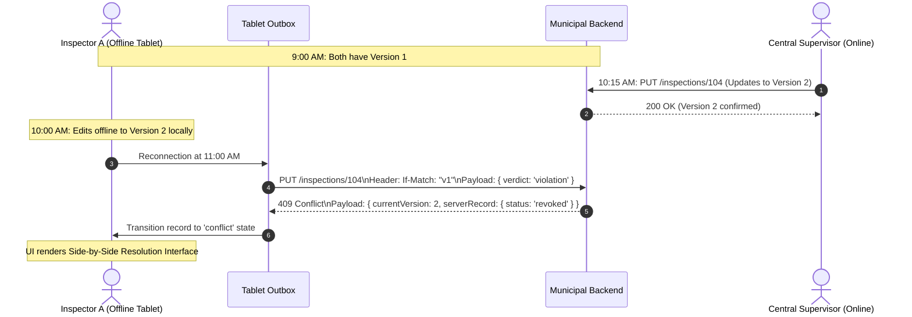

### Conflict Resolution Strategies

Architects select conflict resolution strategies based on domain safety requirements:

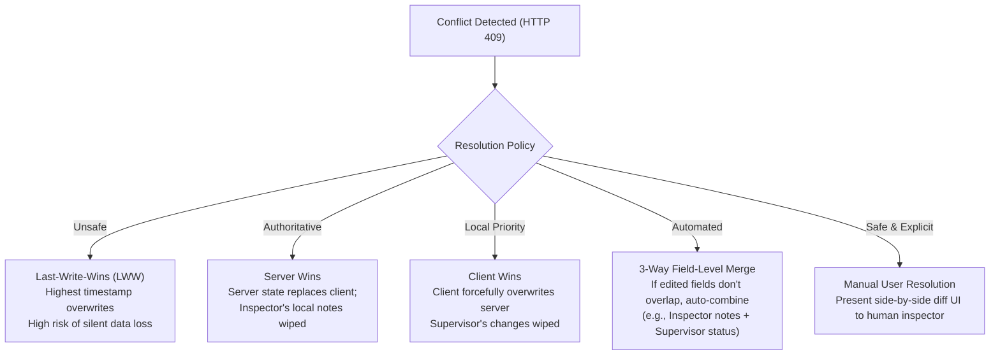

1. **Last-Write-Wins (LWW):** Compares timestamps. The mutation with the latest clock timestamp overwrites earlier changes. **Highly dangerous in field operations**: client device clocks can drift by minutes or hours, causing old data to silently destroy fresh records.
2. **Optimistic Locking (`If-Match` / Version Vectors):** The client transmits the version tag it originally based its edits upon (`If-Match: "v1"`). If the database is already at version 2, the server rejects the write with `409 Conflict`.
3. **Field-Level 3-Way Merge:** If the field inspector only modified `notes` and `temperatureReadings`, while the supervisor only modified `assignedOfficer`, the synchronization engine merges both changes automatically without human intervention.
4. **Manual Human Resolution:** When both actors edited the exact same field (e.g., conflicting compliance verdicts), the client marks the record as `syncStatus: 'conflict'` and renders a side-by-side visual diff modal, allowing the human inspector to review both versions and choose the final outcome.

---

## 7. Architectural Case Study: The Municipal Field-Inspection System

To observe these architectural concepts operating in harmony, consider the full system architecture of the Erbil Municipal Field Inspection Portal:

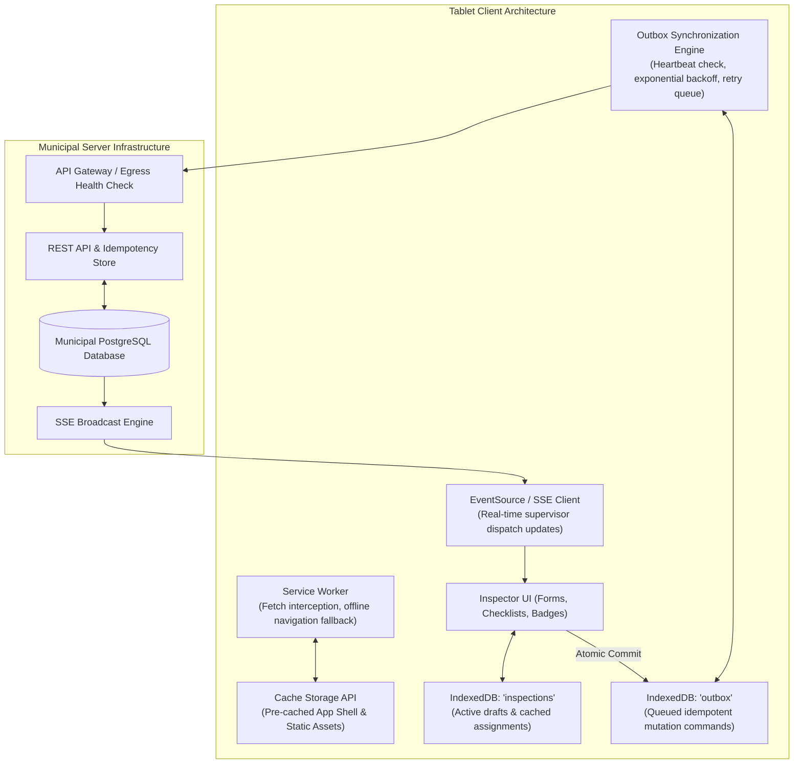

### Execution Flow: A Day in the Field

1. **Morning Boot at Headquarters (Online):**
   - Inspector opens the portal. The Service Worker installs and caches the App Shell in `CacheStorage`.
   - The application fetches today's twenty assignments, storing them into the IndexedDB `inspections` store.
   - An SSE stream connects to `GET /api/stream/inspector-88`.
2. **Entering the Sub-Basement (Complete Radio Blackout):**
   - The tablet loses connectivity. The SSE connection closes cleanly; the UI updates its live badge to *"Offline Mode — Local Persistence Active"*.
   - The inspector opens Inspection #104. The Service Worker intercepts the navigation and serves the cached App Shell from `CacheStorage`.
   - The application reads the checklist for Inspection #104 directly from IndexedDB.
   - The inspector fills out thirty inspection items and clicks "Submit Final Report."
   - An atomic IndexedDB transaction updates the inspection status to `pending_sync` and writes a `CREATE_INSPECTION_REPORT` command into the `outbox` store with a unique `operationId`.
   - The UI immediately renders a green checkmark with the status: *"Report Saved Locally (Queued for Sync)"*. The inspector proceeds to the next facility.
3. **Emergence and Synchronization (Street Level):**
   - The tablet detects cellular signals. The `online` event fires.
   - The synchronization engine issues a `HEAD /api/health` probe. The probe returns `200 OK` in 120ms, confirming true internet egress.
   - The engine queries the outbox for pending operations and finds the queued report.
   - The engine dispatches `POST /api/inspections/104/verdict` with `Idempotency-Key: 9b1deb4d-...`.
   - The server validates the payload, records the inspection, commits the transaction, and returns `200 OK` with canonical `serverId: "INSP-2026-9041"`.
   - The engine removes the item from the outbox and marks the local inspection as `synced`.
   - The SSE stream reconnects, receiving an acknowledgment that updates the regional dashboard simultaneously.

---

## Chapter Summary

* **Design for disconnection.** Front-end systems must operate under the reality of variable, hostile, and completely absent network connections.
* **Match transport to freshness requirements.** Use short polling for low-frequency checks, Server-Sent Events (SSE) for unidirectional server push, and WebSockets for high-frequency full-duplex communication.
* **Avoid `localStorage` for application data.** Its synchronous design blocks the main JavaScript thread, caps storage at 5MB, lacks transactions, and is inaccessible to Service Workers.
* **Use IndexedDB for local-first persistence.** IndexedDB provides asynchronous, non-blocking, indexed storage with atomic multi-store transactions and substantial storage quotas.
* **Cache assets with Service Workers.** Use `CacheStorage` to store the App Shell (HTML, CSS, JS), implementing Cache-First for static hashed assets and Network-First with offline fallback for navigation.
* **Decouple mutations with the Outbox Pattern.** Record user actions into a durable local outbox within the same atomic transaction that updates domain records.
* **Never trust `navigator.onLine` blindly.** Captive portals and dead routers report `onLine = true`. Verify real egress using lightweight heartbeat requests before draining outboxes.
* **Enforce idempotency on queued synchronization.** Send client-generated UUID `Idempotency-Key` headers so that retried outbox commands never produce duplicate server records.
* **Treat Background Sync as progressive enhancement.** Support foreground lifecycle sync triggers for Safari and Firefox, using the Background Sync API only when available.
* **Detect and manage conflicts explicitly.** Guard against concurrent multi-user edits using optimistic concurrency control (`If-Match`), and provide clear fallback policies or visual resolution interfaces.

---

## Review Questions

1. Why is Server-Sent Events (SSE) frequently a superior architectural choice over WebSockets for live status dashboards?
2. What is a "lie-fi" network condition, and why does relying strictly on `navigator.onLine` cause synchronization failures?
3. Explain why `localStorage` should never be used to store an offline outbox queue.
4. Describe the three distinct phases of the Service Worker lifecycle (`install`, `activate`, `fetch`) and their respective responsibilities.
5. In an offline field-inspection system, why is it necessary to maintain both a `localId` and a `serverId` for the same record?
6. How does an atomic IndexedDB transaction prevent orphaned outbox operations?
7. Explain the difference between the Cache-First and Stale-While-Revalidate caching strategies in Service Worker fetch handlers.
8. What is an Idempotency Key, and how does it prevent duplicate records when an outbox sync request times out?
9. Why is the Last-Write-Wins (LWW) conflict resolution policy dangerous when applied to mobile field-inspection devices?
10. How can an application reconcile real-time live push events with an initial REST snapshot without introducing race conditions?

---

## Practical Lab Brief

Apply the principles learned in this chapter by completing:
**[Practical 10 — Offline Outbox and Resilient Synchronization]()**

In this laboratory, you will construct a fully functioning offline synchronization engine using IndexedDB. You will implement atomic multi-store transactions, a durable outbox queue with exponential backoff and idempotency keys, active heartbeat egress probing, and optimistic conflict detection.
