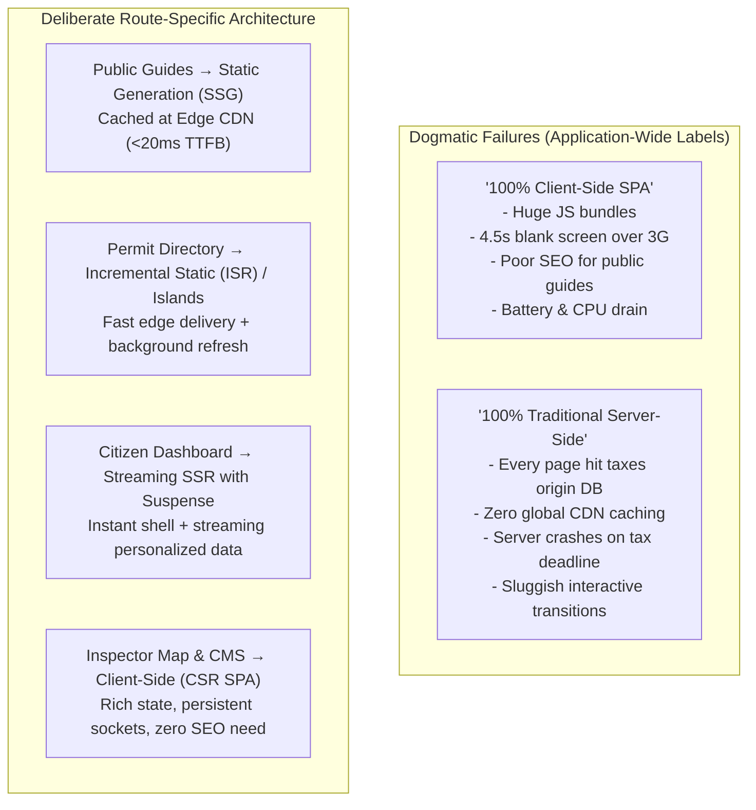
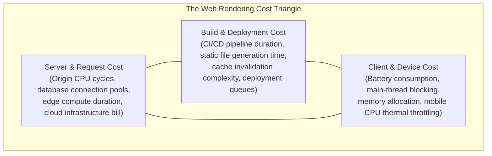
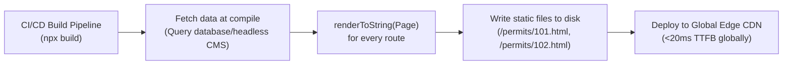
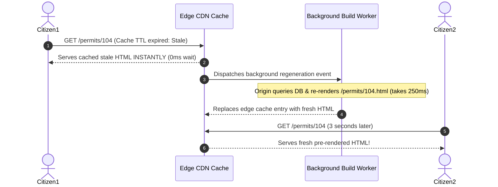
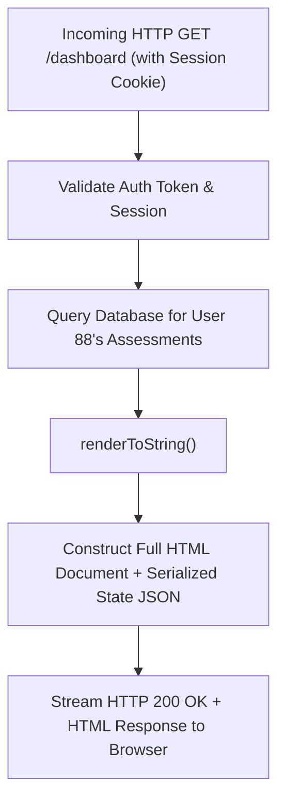
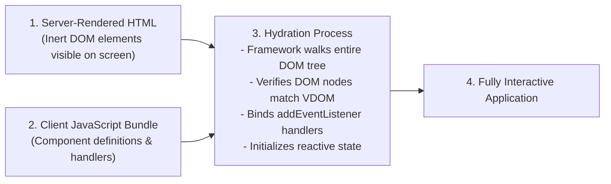
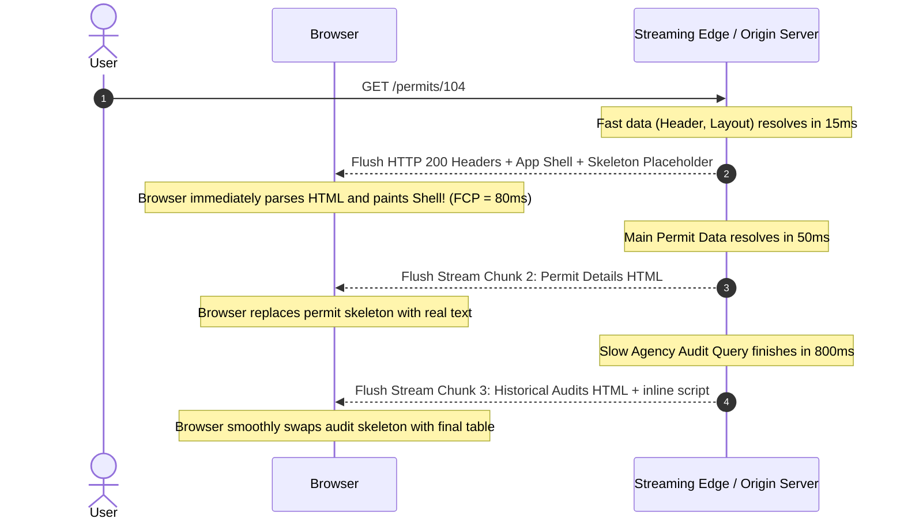
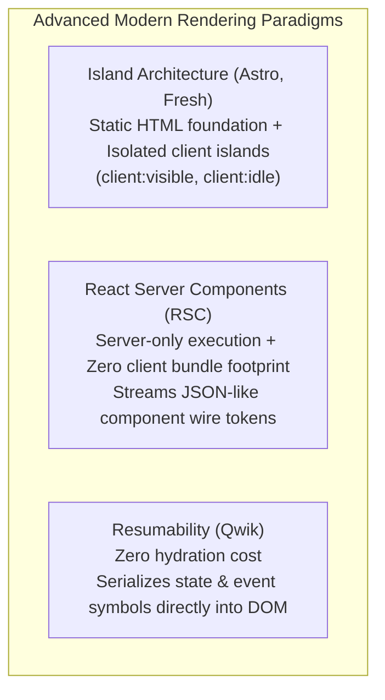
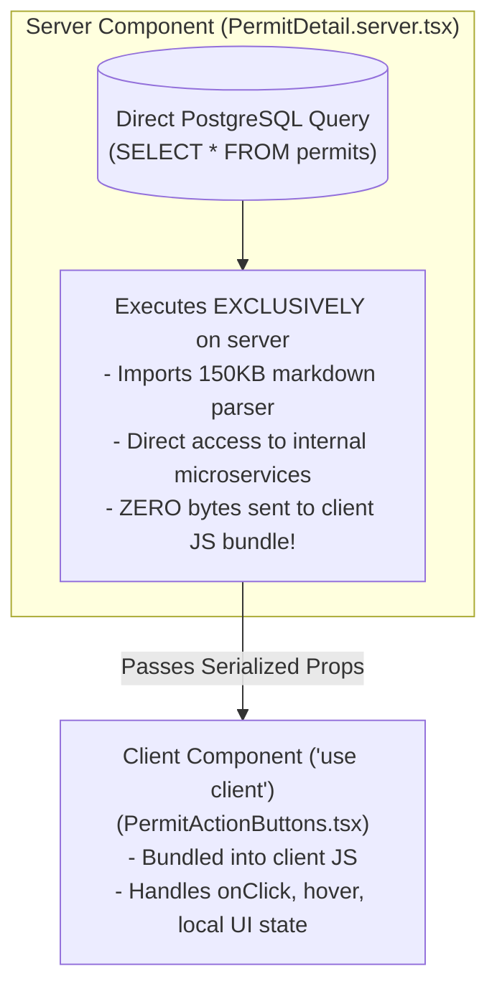
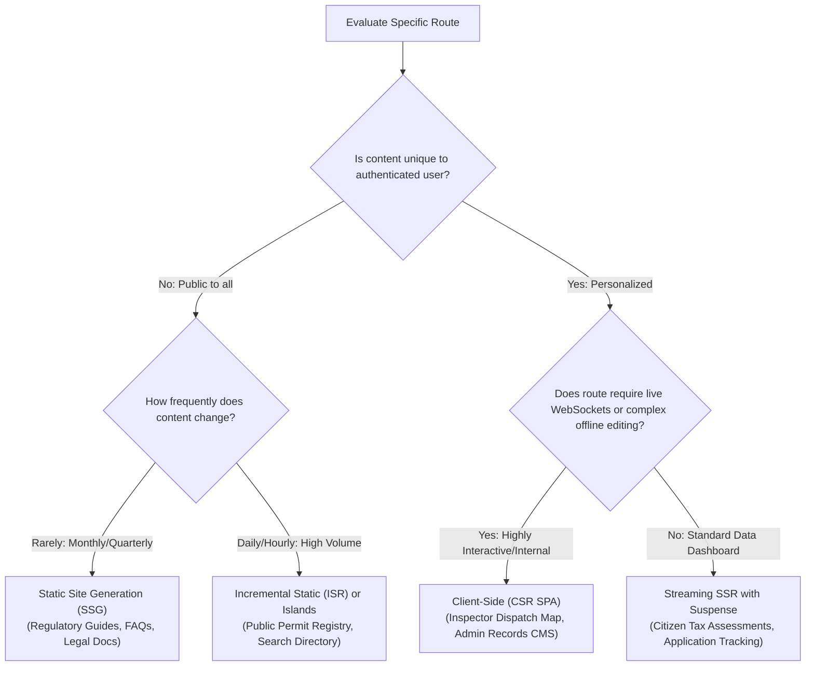

The engineering leadership of the Erbil General Directorate of Municipalities gathers to design a modern public E-Services portal. The portal serves three million citizens and businesses across five distinct sections:
1. **The Public Regulatory Guides:** Tens of thousands of citizens read municipal zoning regulations, business license bylaws, and fire safety codes. The content changes once a quarter, is public to all, and requires strong search engine indexing.
2. **The Public Business Permit Directory:** A searchable directory of 50,000 registered commercial licenses, updated daily as new permits are approved.
3. **The Citizen Service Dashboard:** An authenticated portal where logged-in property owners review private property tax assessments, pay municipal utility bills, and track active construction permit applications.
4. **The Inspector Dispatch Map:** A high-frequency operational console where municipal coordinators monitor field vehicles, assign emergency water-main repair tasks, and track inspector GPS coordinates via real-time WebSockets.
5. **The Municipal Content & Records CMS:** An internal back-office desktop suite where civil servants author regulatory changes, edit rich-text documents, and manage municipal records.

An inexperienced front-end architect proposes a single, application-wide decision: *"We will build the entire portal as a pure Client-Side Rendered Single-Page Application (CSR SPA) because our team knows React."*

The consequences are catastrophic:
- Citizens in rural districts with low-end Android phones and 3G cellular connections wait 4.5 seconds staring at a blank white screen while downloading a 1.4 megabyte JavaScript bundle just to read a static paragraph about residential garbage collection schedules.
- Search engine crawlers fail to reliably execute the complex client JavaScript bundles, causing commercial permits to disappear from public search results.
- Mobile device batteries drain rapidly as the browser's JavaScript engine parses, compiles, and executes hundreds of thousands of lines of client-side component code.

Panicking, a second developer suggests rewriting the entire application in traditional request-time Server-Side Rendering (SSR). Now, every visit to the public zoning guide hits the origin application server, executing database queries and template rendering on every page view. On annual municipal property tax deadline day, traffic spikes tenfold: the origin database CPUs max out at 100%, and the entire portal collapses - taking down the static public guides alongside the payment gateways.

Both failures stem from the same architectural fallacy: **treating rendering topology as an application-wide dogma rather than a route-specific placement of work**.



Modern web architecture does not ask: *"Is this application server-rendered or client-rendered?"* 

Instead, architects answer **The Four Defining Questions of Rendering**:
1. **Where does each part of the interface render?** (Build machine, edge worker, origin server, or client browser).
2. **When does that work happen?** (Build time, request time, background revalidation time, or user interaction time).
3. **What is transferred across the network?** (Static HTML, serialized JSON snapshots, client JavaScript bundles, streaming HTML chunks, or server component wire tokens).
4. **What must the browser execute before interactivity?** (Zero JavaScript, full-tree DOM hydration, selective island hydration, or event-driven resumable execution).

In this chapter, we evaluate the entire continuum of modern rendering topologies. We examine the trade-offs of CSR, SSG, SSR, streaming, island architectures, React Server Components (RSC), and resumability, establishing a concrete decision matrix to govern real-world applications.

---

## 1. The Rendering Cost Triangle

Every rendering decision is an economic trade-off. Moving work away from one part of a system invariably adds cost, complexity, or constraints to another. Architects visualize these trade-offs through the **Web Rendering Cost Triangle**:



* **Client-Side Rendering (CSR)** pushes all compute work onto the client device. Server hosting costs drop to near zero (static file hosting on commodity CDNs), and build times are short. However, the client pays the entire penalty in battery consumption, memory usage, and delayed First Contentful Paint.
* **Static Site Generation (SSG)** pushes rendering work into the build pipeline. Runtime server costs and client device costs are minimal; the browser receives raw HTML from edge caches in under 20 milliseconds. However, build costs explode: generating 100,000 pages can take hours of CI/CD time, and changes to content require rebuilding or complex incremental revalidation pipelines.
* **Server-Side Rendering (SSR)** pushes rendering work onto the origin or edge server at the exact moment a request arrives. The client receives pre-rendered HTML, and build times remain instantaneous. However, every page view consumes origin server CPU cycles and database connections, creating scaling bottlenecks during high-concurrency traffic spikes.

---

## 2. Client-Side Rendering (CSR) and the Single-Page Model

In pure Client-Side Rendering, the web server acts strictly as a static file host. When a user requests a URL, the server returns a minimal, virtually empty HTML document containing a root mounting element and a script tag:

```html
<!-- The Canonical CSR Response -->
<!DOCTYPE html>
<html lang="en">
<head>
  <meta charset="UTF-8">
  <title>Erbil Municipal Portal</title>
  <link rel="stylesheet" href="/assets/index.4b1c.css">
</head>
<body>
  <div id="root"></div>
  <script type="module" src="/assets/index.8f2a.js"></script>
</body>
</html>
```

### The CSR Execution Timeline & Network Waterfall

To render any visible content, the browser must traverse a multi-step sequential network waterfall:

```mermaid
sequenceDiagram
    autonumber
    actor User
    participant Browser
    participant CDN as Edge CDN (Static Host)
    participant API as Backend API Server

    User->>Browser: Enters URL /permits/104
    Browser->>CDN: GET /permits/104
    CDN-->>Browser: Returns 1.2KB Empty HTML Shell (<div id='root'>)
    Note over Browser: DOM parsed, but screen is 100% blank white!
    Browser->>CDN: GET /assets/index.8f2a.js (1.4 MB)
    CDN-->>Browser: Returns JavaScript Bundle
    Note over Browser: Parse & Compile JS (250ms on mobile CPU)
    Note over Browser: Framework initializes; mounts root component
    Browser->>API: GET /api/permits/104 (Fetch dynamic data)
    API-->>Browser: Returns JSON Payload
    Note over Browser: Calculate Virtual DOM; Paint DOM elements
    Note over Browser: Content finally visible! (FCP = 4.2s over 3G)
```

### When CSR is Architecturally Sound

Despite its initial loading penalties, CSR possesses compelling architectural advantages:
1. **Zero Origin Server Compute:** Static assets (HTML, JS, CSS) are distributed via globally distributed CDNs (Cloudflare, AWS CloudFront, Fastly). There is no Node.js origin server to crash during traffic surges.
2. **Instant Subsequent Route Transitions:** Once the initial bundle is cached, navigating between routes (`/permits` $\rightarrow$ `/inspections` $\rightarrow$ `/settings`) requires zero full-page browser reloads. The client router simply swaps components with instant 60fps transitions.
3. **Ideal for Heavy Desktop Applications:** Authenticated administrative portals, internal CRM dashboards, data-grid authoring suites, and offline-first field applications (as built in Chapter 10) benefit enormously from CSR. These routes do not require public search engine indexing, and users keep the application open for entire 8-hour work shifts.

---

## 3. Static Site Generation (SSG) and Incremental Revalidation

**Static Site Generation (SSG)** inverts the CSR model: rather than compiling components into HTML in the user's browser, the application executes components to HTML during the **build step** on a CI/CD server.



### The Performance Superpower of SSG

Because SSG compiles HTML ahead of time:
- **Instantaneous Time to First Byte (TTFB):** Edge CDN servers serve raw `.html` files directly from fast NVMe storage or memory caches in under 20ms worldwide.
- **Superior Core Web Vitals:** First Contentful Paint (FCP) and Largest Contentful Paint (LCP) occur almost instantly because the browser receives fully rendered typography and layout structures in the very first TCP packet.
- **Flawless Search Engine Optimization (SEO):** Web crawlers (Googlebot, Bingbot, social media preview scrapers) receive complete semantic HTML without executing a single line of client JavaScript.
- **Total Infrastructure Resilience:** Even if the municipal database suffers a catastrophic outage, the public documentation and regulatory guides continue serving smoothly from CDN edge nodes.

### The Limits of Pure SSG: The Build-Time Bottleneck

Pure SSG fails when applied to large, rapidly changing datasets. If an e-commerce platform or municipal registry has 200,000 records:
- Building 200,000 HTML pages at compile time can take 45 to 90 minutes.
- If a civil servant fixes a single spelling error on one page, the entire site must be rebuilt and redeployed.

### Incremental Static Regeneration (ISR)

To bridge this gap, modern edge platforms implement **Incremental Static Regeneration (ISR)** (or Stale-While-Revalidate at the Edge):



With ISR, individual routes regenerate in the background on demand or via explicit webhook invalidation (`revalidatePath('/permits/104')`), preserving instant static delivery without marathon build times.

---

## 4. Server-Side Rendering (SSR) and the Mechanics of Hydration

When content must be **real-time fresh** and **highly personalized** for authenticated users (such as a citizen's private tax balance or active permit applications), neither SSG nor ISR is viable. Static caches cannot safely store user-specific session data without leaking private records across citizens.

**Server-Side Rendering (SSR)** compiles components to dynamic HTML on the origin server upon **every incoming HTTP request**.



### The Hydration Phase: Breathing Life into Dead Markup

Server-rendered HTML is inert. The browser paints the document immediately, displaying buttons, tables, and navigation menus. However, none of the interactive JavaScript event listeners (`onClick`, `onKeyDown`, dropdown toggles, modal open triggers) exist yet in memory.

To make the page interactive, the browser must execute **Hydration**:



### The "Uncanny Valley" of SSR

Hydration creates a subtle but frustrating user experience defect known as the **Uncanny Valley of Interactivity**:
1. At $t = 400\text{ms}$, the user sees a complete, beautifully rendered "Submit Application" button (FCP).
2. The user instinctively taps the button.
3. **Nothing happens.** The browser is still downloading and parsing the 300KB client JavaScript bundle. The button looks clickable, but its `onClick` listener has not yet been registered.
4. At $t = 1200\text{ms}$, hydration completes. Now, tapping the button finally triggers the expected modal.

On low-powered mobile devices over slow networks, this gap between visual rendering and actual interactivity (Time to Interactive / Total Blocking Time) can stretch to several seconds.

### Hydration Mismatches: Causes and Prevention

During hydration, the client framework renders the component tree in memory and compares it node-by-node against the server-generated HTML DOM. If the client tree produces different markup than the server HTML, a **Hydration Mismatch Warning** is thrown:

```text
Warning: Text content did not match. Server: "Current Time: 10:30 AM" Client: "Current Time: 10:31 AM"
```

When a mismatch occurs, the framework must discard the pre-rendered DOM subtree and forcefully re-render it on the client, destroying the performance advantage of SSR and causing visible screen flickers.

#### The Three Primary Causes of Hydration Mismatches:
1. **Clock and Timezone Discrepancies:** The origin server runs in UTC (`2026-09-24T04:30:00Z`), while the user's browser renders in Erbil local time (`AST / UTC+3`). Formatting timestamps directly during rendering causes instant mismatches.
2. **Non-Deterministic Generators:** Invoking `Math.random()`, `crypto.randomUUID()`, or sequential ID counters directly inside component rendering logic produces different values on server and client.
3. **Browser-Only Globals:** Accessing `window.innerWidth`, `navigator.userAgent`, or `localStorage` during initial render. Because these globals do not exist in Node.js on the server, developers wrap them in conditions that render differently on client and server.

```typescript
// ANTIPATTERN: Guaranteed Hydration Mismatch
function Header() {
  // Server renders: "Desktop Layout" (window is undefined)
  // Client renders: "Mobile Layout" (window.innerWidth is 375)
  const isMobile = typeof window !== 'undefined' && window.innerWidth < 768;
  return <nav>{isMobile ? <MobileMenu /> : <DesktopMenu />}</nav>;
}

// ARCHITECTURAL PATTERN: CSS-Driven Responsive Layout (Zero Mismatches)
function SafeHeader() {
  return (
    <nav>
      {/* Both server and client render identical DOM; CSS controls visibility */}
      <div className="menu-mobile md:hidden"><MobileMenu /></div>
      <div className="menu-desktop hidden md:block"><DesktopMenu /></div>
    </nav>
  );
}
```

---

## 5. State Handoff and the Data Double-Fetch Problem

A major architectural trap of naive SSR is the **Data Double-Fetch Problem**.

Consider what happens if an application server fetches permit data, renders HTML, and sends it to the browser. When the client JavaScript bundle initializes in the browser, the component mounts:

```typescript
// ANTIPATTERN: The Double-Fetch Bug
function PermitView({ permitId }) {
  const [data, setData] = useState(null);

  useEffect(() => {
    // BUG: This fires in the browser on page load, 
    // re-fetching the exact data the server already fetched!
    fetch(`/api/permits/${permitId}`)
      .then(res => res.json())
      .then(setData);
  }, [permitId]);

  return <div>{data?.title}</div>;
}
```

The browser wastes network bandwidth and database resources fetching data it already has displayed on the screen.

### The Serialized State Handoff Solution

To solve this, the server must serialize its resolved query data into the HTML document inside a dedicated JSON script tag:

```html
<!-- Server Embeds Resolved State into the Document -->
<div id="root">
  <article class="permit-card"><h3>Citadel Hotel (P-101)</h3></article>
</div>

<!-- State Handoff Script -->
<script id="__PERMIT_DATA__" type="application/json">
  {"permitId":"P-101","title":"Citadel Hotel","status":"active","fee":250000}
</script>
<script type="module" src="/assets/hydrate.js"></script>
```

During client hydration, the framework reads from `__PERMIT_DATA__` directly in local memory (0ms network cost), seeding its client-side cache without issuing a duplicate network call.

### Security Audit: The Danger of Script Injection in State Handoff

Serializing server state into HTML requires strict sanitization. If user-generated content (such as an applicant's commercial business name) contains malicious HTML or script closing tags, it can break out of the script context and execute Cross-Site Scripting (XSS) attacks:

```javascript
// DANGEROUS: A malicious business name can break the script tag
const businessName = "</script><script>alert('XSS Attack!')</script>";
const html = `<script id="__DATA__">${JSON.stringify({ name: businessName })}</script>`;
```

#### Safe Serialization Rule:
Always serialize JSON data for HTML embedding by escaping the `<` character as unicode `\u003c`:

```typescript
export function serializeSafeState(data: unknown): string {
  return JSON.stringify(data).replace(/</g, '\\u003c');
}
```

Furthermore, **audit the serialized payload to ensure internal secrets never cross the boundary**. Never serialize raw backend database records containing password hashes, encryption salts, internal IP addresses, or unscrubbed administrative audit notes into the public HTML state payload.

---

## 6. Streaming SSR and Out-of-Order Execution

Traditional SSR suffers from an "all-or-nothing" bottleneck. If a page requires three database queries:
1. Fast Query: Header & User Profile (takes 15ms).
2. Medium Query: Primary Permit Document (takes 45ms).
3. Slow Query: Historical Violation Records & Cross-Agency Audits (takes 850ms).

In traditional SSR, the server cannot send a single byte of HTML to the browser until the slowest query (850ms) finishes. The user sits staring at a blank screen for nearly a full second.

### The Streaming SSR Architecture

**Streaming Server-Side Rendering** (enabled by modern standards like HTML5 Chunked Transfer Encoding and React Suspense / Vue Async Components) breaks this bottleneck.



By streaming HTML chunks as they resolve, the application delivers near-instant First Contentful Paint while asynchronously fulfilling heavy backend database queries.

---

## 7. Modern Hybrid Topologies: Beyond All-or-Nothing Hydration

Modern front-end architecture has moved beyond the crude dichotomy of "hydrate everything" or "hydrate nothing." Today, three advanced paradigms allow engineering teams to fine-tune client execution:



### 1. Island Architecture (Partial Hydration)

Pioneered by architectural systems like Astro and Fresh, **Island Architecture** treats the page as a pure static HTML document containing small, isolated "islands" of interactivity.

In a traditional React/Next.js or Vue/Nuxt application, even if 95% of a page is static text (such as an article or product description), the client browser must still download the entire React runtime, download component definitions for the static paragraphs, and walk the entire DOM tree during hydration.

In Island Architecture:
- The header, article text, table of contents, and footer are compiled to **pure static HTML with zero client JavaScript shipped**.
- Only the interactive elements (such as an autocomplete search input or an interactive image carousel) are declared as client islands.
- The developer explicitly defines hydration conditions:
  - `<Search client:load />` (hydrates immediately on boot).
  - `<Comments client:visible />` (hydrates only when the user scrolls the comments into the viewport).
  - `<Newsletter client:idle />` (hydrates during browser idle time).

### 2. React Server Components (RSC)

**React Server Components (RSC)** introduce a fundamental split between components that run exclusively on the server and components that run in the browser:



Unlike traditional SSR (which executes components on the server to produce HTML, and then re-executes the exact same components in the browser during hydration), **Server Components never re-execute in the browser**. Their code, dependencies, and internal database drivers are stripped completely from the client JavaScript bundle.

### 3. Resumability (Zero-Hydration Architecture)

Frameworks like Qwik reject hydration altogether. Hydration is fundamentally wasteful: the server already executed the application, calculated the state, and rendered the DOM. Hydration forces the client browser to duplicate that entire computation simply to attach event listeners.

**Resumability** serializes the application's entire reactive state, component boundaries, and event listener symbols directly into the HTML DOM itself:

```html
<!-- Resumable HTML Output -->
<button q:on="click:./button_onclick.js#handleClick">Submit</button>
```

When the page loads in the browser:
- **Zero client JavaScript is executed on boot.** No bundle downloads, no VDOM construction, no DOM walking.
- When the user clicks the button, the browser intercepts the native DOM event, inspects `q:on`, downloads a tiny 1KB chunk containing only that specific click handler, and executes it immediately.

---

## 8. The Route-Specific Architectural Decision Matrix

Rather than arguing over framework brands, architects evaluate each route across four concrete criteria:



### Applied Case Study: The Erbil Municipal Portal

By applying this decision matrix, the Erbil Municipal engineering team delivers a world-class architecture:

| Portal Section | Chosen Topology | Architectural Rationale | Core Metric Benefited |
| :--- | :--- | :--- | :--- |
| **1. Regulatory Guides** | **Pure SSG (Static)** | Read-only public text; changes quarterly. Served from global edge CDNs. | TTFB <20ms; instant mobile reading; zero origin load. |
| **2. Permit Directory** | **Islands / ISR** | 50,000 public records; fast edge HTML delivery with isolated client search islands. | Perfect Googlebot indexing; 85% reduction in client JS. |
| **3. Citizen Dashboard** | **Streaming SSR** | Private tax data; requires cookie authentication. Streams shell while database calculates bills. | Fast FCP (120ms); zero data leakage across citizens. |
| **4. Inspector Live Map** | **Pure CSR SPA** | Closed internal route; persistent WebSockets, offline outbox, complex canvas mapping. | Instant route switching; zero SEO requirement. |
| **5. Records CMS** | **CSR SPA** | Heavy desktop authoring tool with rich text editors and deep state trees used for 8 hours daily. | High interactive performance; zero origin template overhead. |

---

## Chapter Summary

* **Rendering is a spectrum, not a dogma.** The choice is not between "server" and "client," but rather the deliberate placement of work across build time, request time, and browser time.
* **Respect the Rendering Cost Triangle.** Moving work from the client (CSR) to the server (SSR) or build pipeline (SSG) incurs corresponding trade-offs in cloud infrastructure bills, database connection loads, or CI/CD deployment times.
* **CSR excels for interactive, private applications.** Client-Side Rendering provides instant route transitions and zero origin compute, making it ideal for administrative portals and offline-first tools.
* **SSG provides unparalleled edge performance.** Static precomputation yields sub-20ms TTFB and perfect SEO, but requires Incremental Static Regeneration (ISR) to scale across dynamic, high-volume datasets.
* **SSR solves personalization at the cost of server compute.** Server-Side Rendering generates dynamic HTML per request, but introduces the "uncanny valley" where content looks ready before hydration finishes binding listeners.
* **Prevent hydration mismatches.** Eliminate non-deterministic values (`Math.random()`, unformatted timezones, browser-only globals) during initial rendering passes.
* **Guard the state handoff boundary.** Always escape serialized JSON state (`\u003c`) to prevent XSS script injection, and strictly sanitize data to prevent private database credentials from leaking to public HTML.
* **Stream out-of-order to eliminate bottlenecks.** Streaming SSR flushes the outer App Shell immediately, streaming slow database-dependent chunks progressively via Suspense boundaries.
* **Leverage modern hybrid architectures.** Adopt Island Architecture to eliminate client JavaScript on content pages, React Server Components to strip server dependencies from bundles, or Resumability to eliminate hydration overhead entirely.

---

## Review Questions

1. Explain the "Rendering Cost Triangle" and identify the primary cost penalty of Client-Side Rendering (CSR).
2. What causes the "Uncanny Valley of Interactivity" in traditional Server-Side Rendering (SSR)?
3. Why does Static Site Generation (SSG) fail when applied to an authenticated citizen account dashboard?
4. How does Incremental Static Regeneration (ISR) solve the long build-time bottleneck of traditional SSG?
5. Describe the Data Double-Fetch Problem in naive SSR implementations and explain how a serialized state handoff script resolves it.
6. What is a Hydration Mismatch, and why does reading `window.innerWidth` during initial component render cause it?
7. How does Streaming SSR with Suspense improve perceived performance when a page depends on a slow database query?
8. In Island Architecture, how does declaring `<Comments client:visible />` reduce client JavaScript execution compared to standard Next.js or Nuxt hydration?
9. How do React Server Components (RSC) differ from traditional server-rendered HTML with respect to client bundle size?
10. What is Resumability, and how does it eliminate the DOM-walking hydration phase entirely?

---

## Practical Lab Brief

Apply the principles learned in this chapter by completing:
**[Practical 11 - Rendering Topology Comparison: CSR, SSR, and Static Delivery]()**

In this laboratory, you will implement the Municipal Permit Catalogue across three distinct topologies (CSR, SSG, and SSR). You will instrument local performance metrics (TTFB, FCP, TTI), construct safe state handoff payloads that prevent XSS vulnerabilities, and audit client hydration costs.
