A software engineer at the Erbil General Directorate of Municipalities writes a new component: `PermitApprovalCard.tsx`.

The component is written in TypeScript. It imports JSX syntax, uses modern ECMAScript optional chaining, imports scoped CSS modules, loads an SVG municipal coat-of-arms icon, references an environment variable `import.meta.env.VITE_API_URL`, and dynamically imports a heavy PDF generation library when an inspector clicks "Print Certificate."

None of these constructs are native to standard web browsers:
- Browsers do not understand TypeScript interfaces or type annotations.
- Browsers cannot execute JSX tags like `<article className={styles.card}>` without a runtime transform.
- Browsers cannot natively resolve bare package specifiers like `import { format } from 'date-fns'` without an explicit URL or import map.
- Browsers cannot read `.env` configuration files from local disk.

Between the code the engineer writes in their IDE and the raw bytes executing on a mobile browser in the field sits the **front-end build toolchain**.

In poorly architected teams, the build toolchain is treated as an opaque black box of magic incantations (`npm run build`). When the build breaks, development halts. When floating dependencies drift, the application works on one developer's laptop but crashes in production. When environment boundaries are misunderstood, private database passwords leak into public client JavaScript bundles. And when bundling is uncoordinated, users download five-megabyte JavaScript monoliths over mobile networks.

In this chapter, we deconstruct the front-end delivery pipeline. We follow a source module through resolution, transformation, module graph construction, and chunking; examine package determinism and lockfiles; dissect Hot Module Replacement (HMR); audit tree shaking and source maps; and engineer automated quality gates for scalable team workflows.

```mermaid
flowchart LR
    subgraph Authoring["1. Authoring (Source Modules)"]
        S1["PermitApprovalCard.tsx\n(TypeScript + JSX)"]
        S2["card.module.css\n(Scoped CSS)"]
        S3["seal.svg\n(Asset Reference)"]
    end

    subgraph Toolchain["2. Toolchain Pipeline"]
        P1["Resolver & Package Manager\n(Lockfile verification, exports mapping)"]
        P2["Transformer (esbuild / Rust)\n(Strip types, lower syntax, compile CSS)"]
        P3["Bundler & Tree Shaker (Rollup / Vite)\n(Construct DAG, dead code elimination)"]
        P4["Chunking & Fingerprinting\n(Dynamic split, content hashing)"]
    end

    subgraph Delivery["3. Production Artifacts"]
        D1["app.8f31c.js (45KB Core Shell)"]
        D2["reports.6d4b.js (180KB Lazy Chunk)"]
        D3["style.2e1a.css (12KB Minified CSS)"]
        D4["app.8f31c.js.map (Debug VLQ Map)"]
    end

    Authoring --> Toolchain --> Delivery
```

---

## 1. The Journey of a Module: From Source to Artifact

A build system is not simply a compiler; it is a **delivery pipeline**. It transforms high-level developer abstractions into standardized, hyper-optimized web platform primitives (HTML, CSS, JavaScript, WebAssembly, and static media).

To understand this pipeline, trace `PermitApprovalCard.tsx` through its six sequential transformation phases:

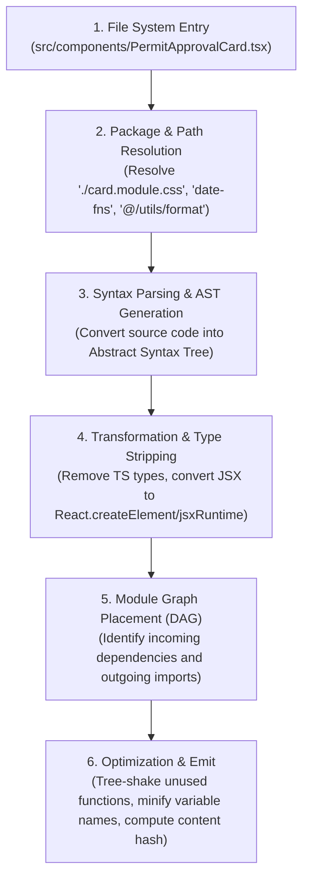

1. **Resolution:** The toolchain encounters `import { formatCurrency } from '../utils/math'`. It resolves the relative path to an absolute disk location, checking file extensions (`.ts`, `.tsx`, `.js`, `.json`) according to configured resolution algorithms.
2. **Parsing:** The parser reads the raw text characters and transforms them into an **Abstract Syntax Tree (AST)** - a structured tree representation of the code syntax in memory.
3. **Transformation:** Specialized compilers (such as esbuild, SWC, or Babel) walk the AST, stripping away TypeScript type definitions and converting modern JSX tags into executable JavaScript function calls.
4. **Module Graph Traversal:** The bundler links the module into a comprehensive **Directed Acyclic Graph (DAG)** representing every file in the project and their explicit relationships.
5. **Optimization (Tree Shaking & Minification):** Unreferenced export functions are pruned from the graph. Variable names are shortened (`formatCurrency` $\rightarrow$ `a`), whitespace is removed, and dead code branches are eliminated.
6. **Emitting Fingerprinted Assets:** The final code is written into chunk files with cryptographic content hashes in their filenames (`PermitCard.8f31c9a1.js`), ready for deployment to edge content delivery networks.

---

## 2. Package Management, Lockfiles, and Dependency Determinism

A production web application rarely consists solely of first-party code; it relies on hundreds of third-party open-source libraries. Managing these dependencies deterministically is the first line of defense against production failure.

### The Anatomy of `package.json`

The `package.json` file declares three distinct classes of dependencies:

| Dependency Category | Field in `package.json` | Purpose | Shipped to Browser? |
| :--- | :--- | :--- | :--- |
| **Runtime Dependencies** | `"dependencies"` | Libraries required for application execution (e.g. `date-fns`, `valibot`). | Yes (bundled into production chunks). |
| **Development Dependencies** | `"devDependencies"` | Tools required only to build, test, lint, or typecheck code (e.g. `typescript`, `vite`, `eslint`, `vitest`). | **Never** (stripped during production compilation). |
| **Peer Dependencies** | `"peerDependencies"` | Libraries expected to be provided by the consuming parent environment (critical for component libraries). | Managed by the root application. |

### The Danger of Floating SemVer Ranges

Semantic Versioning (SemVer) uses the format `MAJOR.MINOR.PATCH`:
- `1.2.3` $\rightarrow$ `MAJOR` (breaking changes), `MINOR` (backwards-compatible features), `PATCH` (backwards-compatible bug fixes).

When a developer installs a package with `npm install date-fns`, npm records a caret prefix:

```json
{
  "dependencies": {
    "date-fns": "^3.6.0"
  }
}
```

The caret (`^`) allows npm to automatically install any newer minor or patch version (e.g., `3.7.0` or `3.6.2`). 

**This creates the classic "Works on My Machine" defect**:
- Developer A installs dependencies on Monday and receives `date-fns@3.6.0`. Everything compiles cleanly.
- On Wednesday, the maintainers of `date-fns` publish `3.6.1`, which inadvertently introduces an export syntax regression.
- Developer B clones the repository on Thursday, runs `npm install`, and receives `3.6.1`. The application crashes.
- The CI/CD production deployment pipeline runs on Friday, pulls `3.6.1`, and breaks the live municipal portal.

### The Lockfile Contract: Absolute Determinism

To eliminate this vulnerability, package managers generate a **Lockfile** (`package-lock.json`, `pnpm-lock.yaml`, or `yarn.lock`):

```json
// Extract from package-lock.json
"node_modules/date-fns": {
  "version": "3.6.0",
  "resolved": "https://registry.npmjs.org/date-fns/-/date-fns-3.6.0.tgz",
  "integrity": "sha512-fRHTXiW2y...==",
  "dependencies": { ... }
}
```

The lockfile records:
1. The **exact** resolved version of every package and every sub-dependency in the tree.
2. The exact URL source of the tarball.
3. A cryptographic integrity hash (`sha512`) verifying that the downloaded code has not been tampered with.

#### The Golden CI Rule: `npm ci` vs. `npm install`
In continuous integration pipelines and production deployments, **never run `npm install`**. Always execute:

```bash
npm ci
```

`npm ci` (Clean Install) deletes existing `node_modules`, strictly enforces the exact versions in `package-lock.json`, and **throws an immediate fatal error** if the `package.json` and lockfile are out of synchronization.

---

## 3. The Development Engine: Native ESM and Hot Module Replacement

For a decade, front-end development was plagued by sluggish build times. In legacy bundlers (such as Webpack 4), saving a single file forced the bundler to crawl the entire module graph, re-bundle hundreds of files into memory, and reload the browser page. In large applications, a single code edit took 10 to 30 seconds before feedback appeared.

Modern front-end development tooling (pioneered by Vite) eliminated this overhead by separating development server mechanics from production bundling.

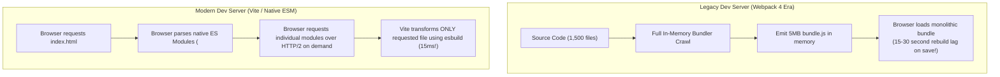

### Hot Module Replacement (HMR)

**Hot Module Replacement (HMR)** is the mechanism by which an application updates modified modules in the running browser runtime **without triggering a full page reload or discarding component state**.

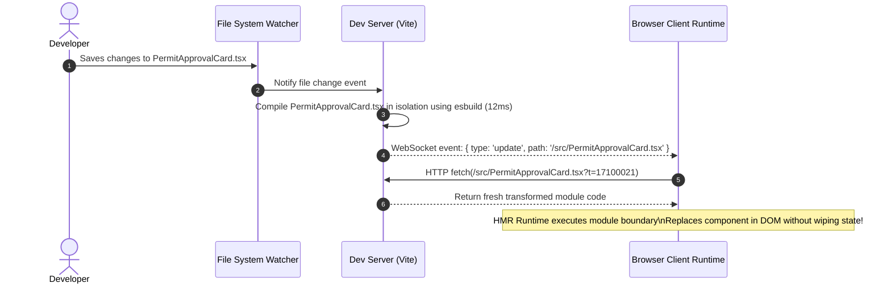

If an inspector is halfway through filling out a 20-field modal form, editing a CSS class or button label updates the UI on screen in under 50ms while preserving every character the inspector typed into the form.

---

## 4. The Production Bundler Pipeline: Graph Optimization

While unbundled native ES Modules are ideal for local development, **they are unacceptable for production delivery**.

If a production application ships 1,500 individual unbundled ES module files:
- Even over HTTP/2 multiplexing, initiating 1,500 roundtrips introduces latency overhead on mobile networks.
- Unbundled files cannot share compression dictionaries; Gzip and Brotli compression achieve much higher compression ratios when related code is combined into shared chunks.
- Dead-code elimination (tree shaking) cannot easily analyze cross-module dependencies across unbundled files.

Therefore, production pipelines use dedicated production bundlers (such as Rollup, esbuild, or Rolldown) to optimize the module graph.


### Tree Shaking: Dead Code Elimination (DCE)

**Tree Shaking** is the automated removal of unused exports from the final production JavaScript bundle.

Tree shaking relies strictly on the static syntax of **ES Modules** (`import` and `export`). Because ES Module imports cannot be dynamic or conditional at the top level, the bundler can determine with 100% mathematical certainty before running the code which exports are referenced.

```typescript
// src/utils/math.ts
export function calculateMunicipalTax(amount: number): number {
  return amount * 0.05;
}

// UNUSED EXPORT: Never imported anywhere in the project
export function calculateHeavyZoningPenalty(area: number): number {
  return area * 500;
}
```

```typescript
// src/components/Invoice.tsx
import { calculateMunicipalTax } from '../utils/math';

export function renderInvoice(amount: number) {
  return calculateMunicipalTax(amount);
}
```

During production bundling, the bundler marks `calculateHeavyZoningPenalty` as dead code. The function is completely excised from the emitted JavaScript bundle, saving bandwidth for end users.

#### The `/*#__PURE__*/` Annotation and `"sideEffects": false`
Compilers are conservative: if a statement appears to have potential runtime side effects (such as modifying a global object or executing an outer function call), the bundler must retain it even if its return value is unused.

Developers and library authors use the `/*#__PURE__*/` annotation to inform the bundler that an expression has zero side effects:

```javascript
// Bundler knows this can be safely pruned if AppConfig is unreferenced
const AppConfig = /*#__PURE__*/ initializeConfiguration();
```

In `package.json`, declaring `"sideEffects": false` guarantees to bundlers that none of the files in the package execute global mutations upon being imported, unlocking aggressive dead-code elimination across entire packages.

### Code Splitting: Breaking Monoliths into Route Chunks

A production application must never compile into a single, monolithic `bundle.js`. Loading the administrative portal's code when a citizen only wants to read the public homepage is a severe architectural failure.

**Code Splitting** divides the application into smaller chunks that load on demand:

```mermaid
flowchart TD
    Entry["main.ts (Application Entry)"] --> CoreChunk["app.8f31c.js (Core Shell - 45KB)\n- Navigation bar\n- Router setup\n- Theme engine"]
    
    CoreChunk -.->|Static Import| Vendor["vendor.2e1a.js (Shared Vendor - 70KB)\n- React / Vue framework\n- Query Cache runtime"]
    
    CoreChunk -->|Dynamic import('./routes/Home')| RouteHome["home.4a1c.js (Home View - 15KB)"]
    CoreChunk -->|Dynamic import('./routes/Permits')| RoutePermits["permits.7b2e.js (Permit Directory - 35KB)"]
    CoreChunk -->|Dynamic import('./routes/Analytics')| RouteAnalytics["analytics.9d4f.js (Heavy Charts - 220KB)"]
```

#### Dynamic `import()`: The Code-Splitting Boundary
Whenever the bundler encounters an ECMAScript dynamic import statement:

```typescript
// The router loads the analytics chunk ONLY when the route is visited
const AnalyticsRoute = React.lazy(() => import('./routes/Analytics'));
```

The bundler automatically slices the module graph at that exact boundary, generating a separate asynchronous chunk (`analytics.9d4f.js`) that is fetched over the network only when the user navigates to `/analytics`.

---

## 5. Asset Fingerprinting, Cache Busting, and Source Maps

How does a browser distinguish between an old version of `app.js` and a newly deployed bugfix?

### Content Hashing: The Science of Cache Busting

Modern build systems compute a cryptographic hash (such as SHA-256) of the compiled file contents and append an 8-to-16 character fingerprint to the filename:

```text
dist/assets/app.8f31c9a1.js
dist/assets/style.4b1c20e4.css
```

If Developer A edits a single line of CSS in `style.css`, only the hash of `style.[hash].css` changes. The hash of `app.[hash].js` remains identical.

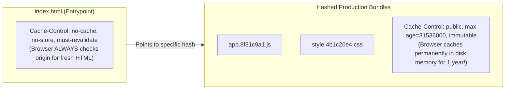

#### The Two-Tier Production Caching Strategy:
1. **HTML Entrypoint (`index.html`):** Configured with `Cache-Control: no-cache`. The browser must revalidate with the server on every page load to fetch the latest script tags.
2. **Fingerprinted Assets (`*.js`, `*.css`):** Configured with `Cache-Control: public, max-age=31536000, immutable`. Because the filename changes whenever the code changes, browsers can safely store the asset in disk cache for an entire year. Stale cache bugs are mathematically eliminated.

### Source Maps: Reverse Engineering the Production Stack Trace

In production, code is minified, mangled, and stripped of comments. A variable named `applicantNationalIdentifier` becomes `x`. If an uncaught runtime error occurs on an inspector's tablet in the field:

```text
TypeError: Cannot read properties of undefined (reading 'a')
    at vendor.8f31c9a1.js:1:4210
```

This stack trace is useless for debugging.

A **Source Map** (`.map` file) bridges this gap using **Variable-Length Quantity (VLQ)** base64 encoding. It maps every line and column in the minified production file back to the exact line, column, and identifier name in the original TypeScript source:

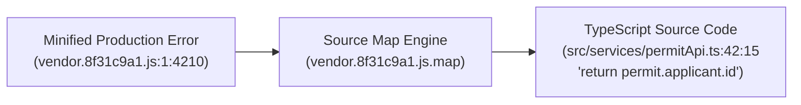

#### Security Audit: Protecting Source Maps in Production
Source maps reveal your entire uncompiled source code, internal comments, and file organization. 
- **High-Security Practice:** Never deploy `.map` files to public, internet-accessible CDNs. 
- Instead, configure your CI/CD pipeline to upload `.map` files directly to a private error monitoring system (such as Sentry or Datadog), and then delete them from the public distribution directory before publishing to the CDN.

---

## 6. Environment Boundaries: Build-Time vs. Runtime Configuration

A major security vulnerability in front-end architecture is confusing **Build-Time Variables** with **Runtime Server Secrets**.

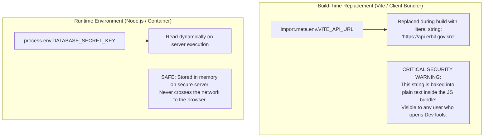

### The Rules of Front-End Environment Variables:
1. **Build-time environment variables are NOT secrets.** Bundlers replace variables like `import.meta.env.VITE_MAP_KEY` by physically searching for the token and replacing it with a string literal in the emitted JavaScript bundle. Anyone who opens the browser's Developer Tools can read the value.
2. **Never place private keys, database passwords, or JWT signing secrets in front-end code.** If an API requires a secret key to execute an action, that call must be proxied through a secure backend server.
3. **Prefix Guarding:** Modern tools enforce strict prefixes (e.g. `VITE_` in Vite, `NEXT_PUBLIC_` in Next.js). Any environment variable defined in `.env` without this prefix is ignored by the bundler, preventing accidental leakage of server variables.

---

## 7. Team Quality Gates and Automated CI Verification

In professional engineering organizations, software quality is guaranteed by automated pipelines rather than human memory. A robust front-end delivery pipeline enforces **The Five Quality Gates**:

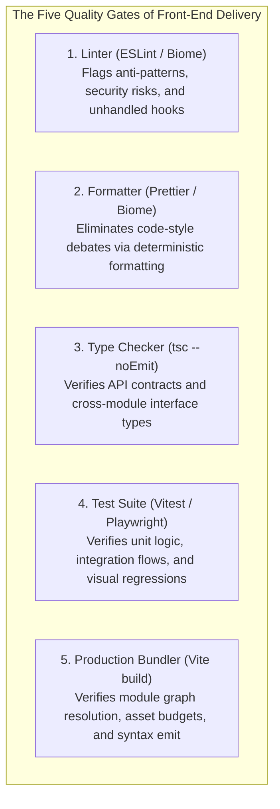

### The Feedback Hierarchy

To keep developers productive, checks execute in layers of increasing scope and duration:

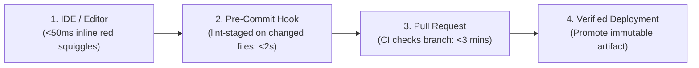

1. **Inner Loop (Editor):** The developer's IDE runs language servers that highlight type errors and lint warnings as they type (<50ms).
2. **Pre-Commit Hook (`lint-staged` + Husky):** Before Git records a commit, a hook runs ESLint and Prettier strictly on the staged files (<2 seconds), preventing syntax garbage from entering the Git tree.
3. **Continuous Integration (CI Pipeline):** When a pull request is submitted, GitHub Actions or GitLab CI spins up a clean container, runs `npm ci`, and executes the complete test and typechecking suite across the entire repository.
4. **Artifact Promotion (Build Once, Deploy Everywhere):** The CI pipeline builds the production artifacts **exactly once**. That identical, verified collection of hashed files is promoted from the staging environment to production, eliminating discrepancies caused by rebuilding in different environments.

---

## 8. Monorepos, Workspaces, and Architectural Boundaries

As engineering organizations grow, managing multiple related front-end applications (the Citizen Portal, Inspector App, Municipal CMS, and Shared UI Design System) in separate Git repositories leads to dependency hell and duplicated code.

A **Monorepo** coordinates multiple packages within a single Git repository using package manager **Workspaces** (supported natively by `pnpm`, `npm`, and `yarn`).

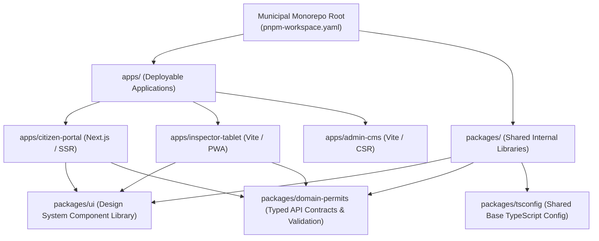

### The Dependency Direction Rule

Workspaces provide repository mechanics, but they do not automatically enforce sound software architecture. Teams must enforce strict **Dependency Direction Rules**:

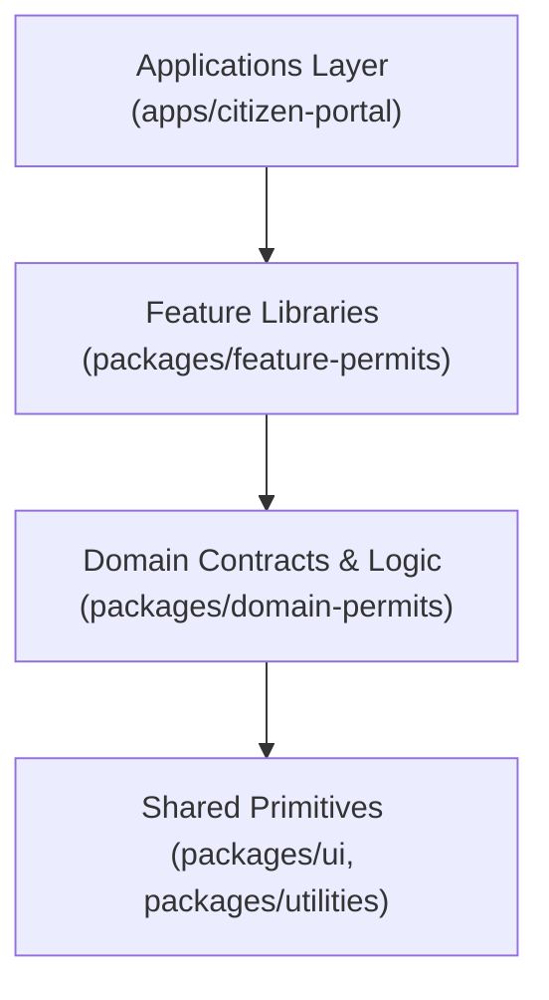

1. **Higher-level layers may depend on lower-level layers, but NEVER the reverse.** A UI component library (`packages/ui`) must never import from an application (`apps/citizen-portal`).
2. **Eliminate Circular Dependencies:** If Package A imports from Package B, Package B must never import from Package A. Circular dependencies create deadlocks during bundling and runtime initialization errors.

---

## Chapter Summary

* **The toolchain is a delivery architecture.** Build systems transform developer-centric abstractions (TypeScript, JSX, CSS modules) into hyper-optimized platform primitives (HTML, CSS, JS) while providing fast inner-loop feedback.
* **Lockfiles guarantee determinism.** Never use `npm install` in CI/CD pipelines. Enforce `npm ci` to prevent unpinned floating dependencies from introducing silent production regressions.
* **Embrace development and production duality.** Modern tools utilize unbundled native ES Modules and esbuild for instant dev server boot and sub-50ms HMR, while employing Rollup/Rust bundlers for optimized production chunking.
* **Tree shaking requires ES Module static structure.** Prune dead code from production bundles by maintaining strict `import`/`export` syntax, utilizing `/*#__PURE__*/` annotations, and declaring `"sideEffects": false`.
* **Break monoliths with dynamic code splitting.** Use ECMAScript dynamic `import()` boundaries to isolate heavy routes and analytics engines into asynchronous chunks that load only when requested.
* **Cache permanently with content hashing.** Deploy fingerprinted assets (`app.[hash].js`) with 1-year immutable cache headers, while serving `index.html` with `no-cache` to enable instant cache busting.
* **Never commit secrets to front-end environment files.** Build-time variables (`VITE_*`) are string literals baked directly into public client JavaScript bundles. Keep private database keys on the server.
* **Enforce the five quality gates.** Automate linting, formatting, typechecking, behavioral testing, and production build checks across layered feedback loops.
* **Maintain strict monorepo dependency hierarchy.** Structure workspaces so applications depend on features, features depend on domain models, and domain models depend on shared primitives - eliminating circular references.

---

## Review Questions

1. Explain the difference between `npm install` and `npm ci`, and why the latter is mandatory in production CI pipelines.
2. How does modern unbundled native ESM development (as used in Vite) achieve instant server boot compared to legacy Webpack bundling?
3. Describe the mechanics of Hot Module Replacement (HMR) and explain how it updates a component without wiping local form state.
4. Why is tree shaking ineffective when applied to dynamic CommonJS `require()` statements?
5. What is the purpose of the `/*#__PURE__*/` annotation in front-end compilation?
6. Explain how dynamic `import()` statements define code-splitting boundaries during production bundling.
7. Describe the two-tier caching strategy for single-page applications involving `index.html` and hashed asset files.
8. Why is it dangerous to place a secret database API key inside a `.env` file that is read by front-end client bundlers?
9. What are Source Maps, and why should they be uploaded to private error monitoring servers rather than public CDNs?
10. In a front-end monorepo, what is the Dependency Direction Rule, and why must circular package dependencies be prevented?

---

## Practical Lab Brief

Apply the principles learned in this chapter by completing:
**[Practical 12 - Inspect a Modern Front-End Toolchain and Module Graph]()**

In this laboratory, you will trace a TypeScript application through the entire delivery lifecycle. You will inspect unbundled native ESM network requests in development, implement dynamic route code splitting with `import()`, verify chunk isolation in production bundles, audit source map reverse-mappings, and verify environment variable security boundaries.
