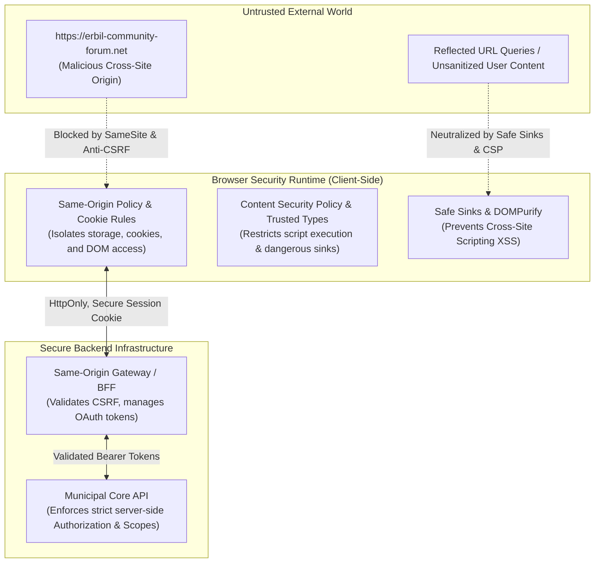
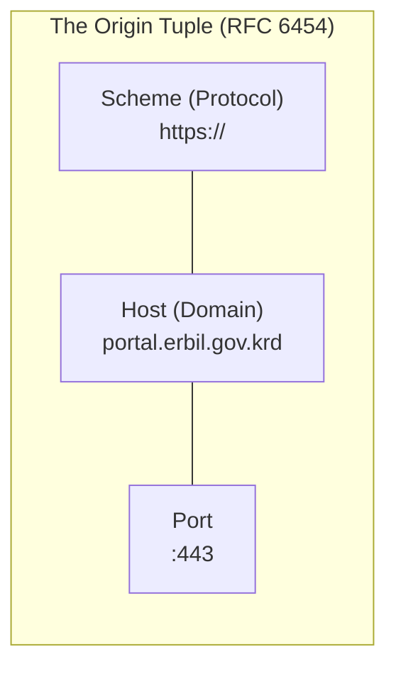
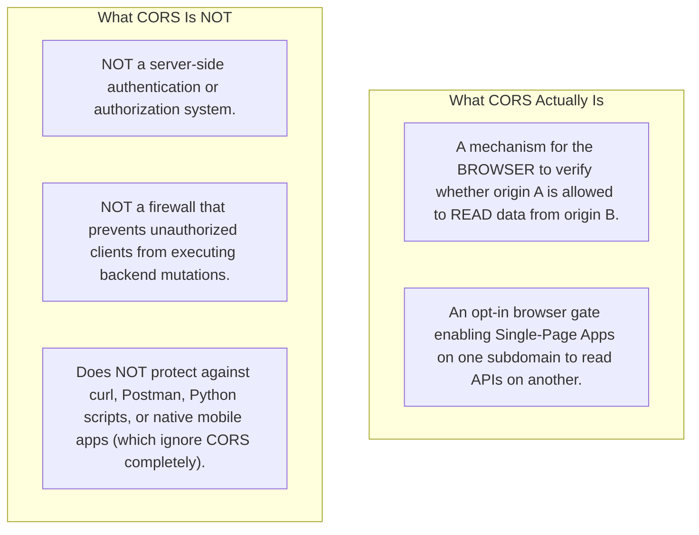
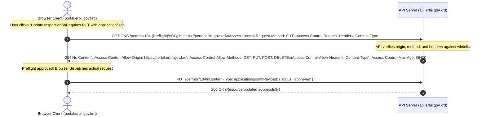
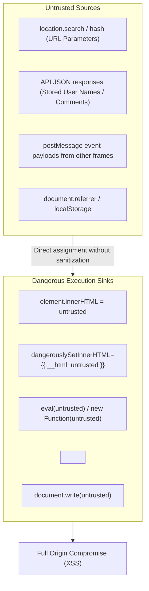
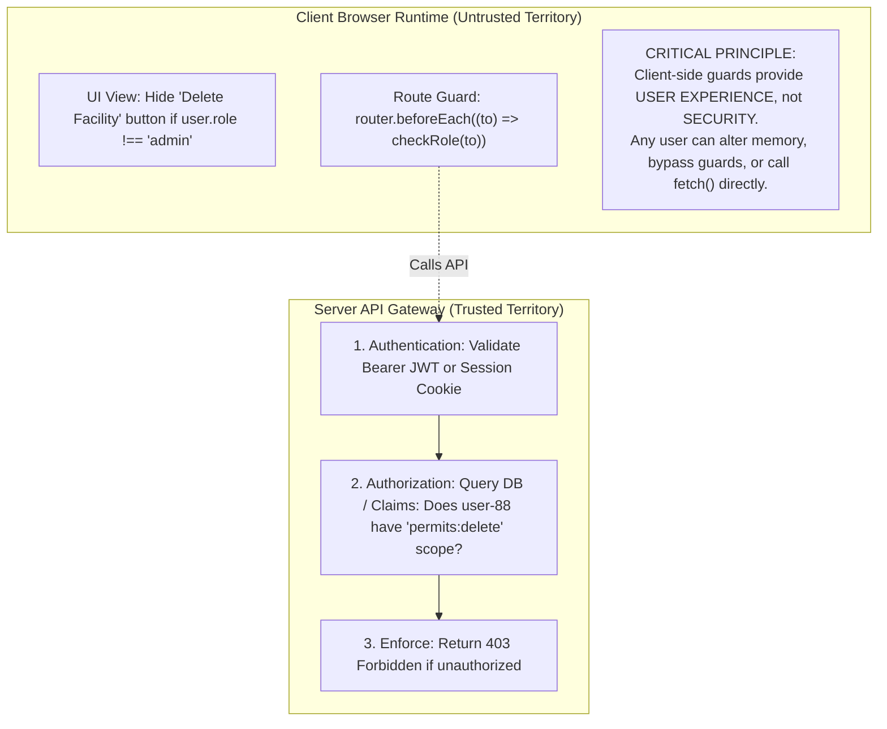
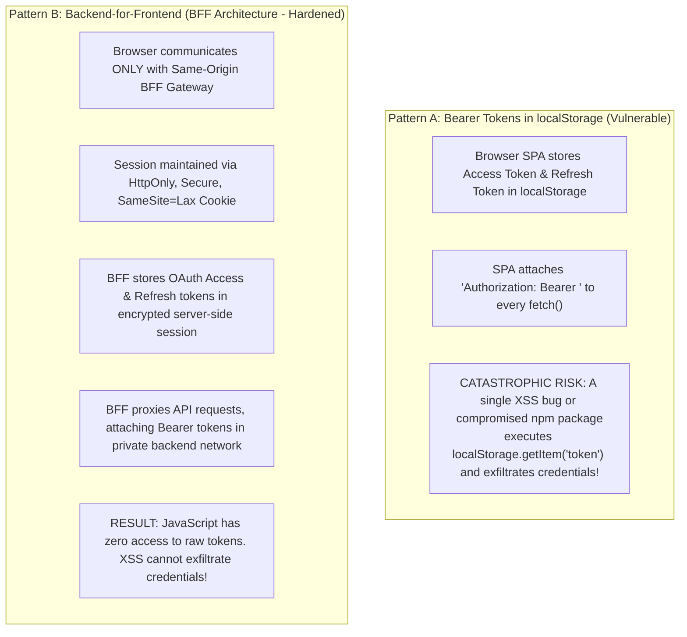
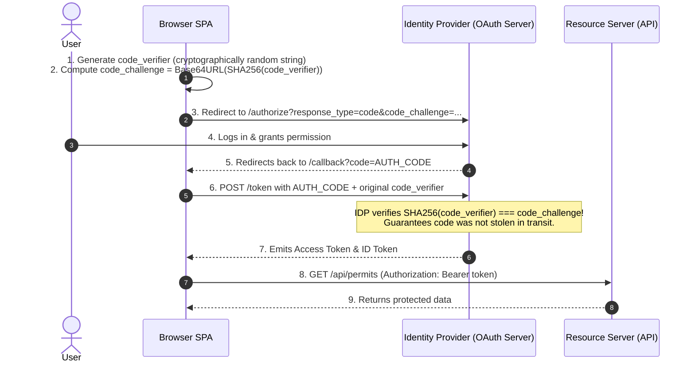

A citizen logs into the Erbil Municipal E-Services Portal at `https://portal.erbil.gov.krd` to pay a commercial operating tax assessment and review active building violations.

In another tab of the same browser, the citizen browses an untrusted local web forum hosted at `https://erbil-community-forum.net`. The forum page contains a malicious post authored by an attacker, designed to exploit the citizen's active municipal session.

In a naively built application, multiple security boundaries fail simultaneously:
- The forum page includes a hidden form that automatically submits a `POST` request to `https://portal.erbil.gov.krd/api/payments/transfer`. Because the municipal application uses ambient cookies without strict `SameSite` or anti-CSRF protections, the citizen's browser automatically attaches their authentication cookies, transferring funds to the attacker without the citizen's knowledge.
- The municipal portal features a search bar that echoes the citizen's query back into the DOM using `container.innerHTML = "Results for " + query`. A reflected query containing `` executes malicious JavaScript inside the trusted municipal origin, reading the citizen's session tokens and exfiltrating them to an external server.
- The portal team attempted to restrict access to municipal property records by implementing a client-side route guard: `if (user.role !== 'admin') router.push('/unauthorized')`. An attacker simply opens Chrome DevTools, edits the in-memory JavaScript user object to `{ role: 'admin' }`, and views administrative UI controls. When the client dispatches requests to `/api/admin/records`, the backend API assumes the client already verified authorization, exposing sensitive municipal records.

Every one of these breaches originates from a failure to understand the browser as a **multi-tenant security runtime**.



Front-end security is not a checklist of disjointed bug fixes, nor is it achieved by a single framework setting. Front-end security is the **disciplined design and enforcement of layered trust boundaries**. 

In this chapter, we analyze the browser's security architecture. We examine the Same-Origin Policy and demystify CORS; construct defenses against XSS, CSRF, and clickjacking; separate authentication from server-enforced authorization; evaluate token storage trade-offs between `localStorage` and Backend-for-Frontend (BFF) gateways; and configure advanced browser isolation primitives.

---

## 1. The Browser as a Security Runtime: Origins and the Same-Origin Policy

The modern web browser is a multi-tenant operating system. It simultaneously runs code from your bank, your employer, your government portal, and untrusted third-party advertising networks within the same application process.

The foundational security boundary separating these competing tenants is the **Origin**.

### The Origin Tuple (RFC 6454)

An origin is defined strictly by a three-part tuple:



Two URLs have the **same origin** if and only if their scheme, host, and port match exactly:

| Compared URL to `https://portal.erbil.gov.krd:443` | Same Origin? | Architectural Reason |
| :--- | :--- | :--- |
| `https://portal.erbil.gov.krd/permits/104` | **Yes** | Scheme, host, and port are identical (path does not affect origin). |
| `http://portal.erbil.gov.krd` | **No** | Scheme mismatch (`http` vs. `https`). |
| `https://api.erbil.gov.krd` | **No** | Host mismatch (`api` subdomain vs. `portal` subdomain). |
| `https://portal.erbil.gov.krd:8443` | **No** | Port mismatch (`8443` vs. `443`). |

### Origins vs. Sites (eTLD+1)

While origins require exact string matches across scheme, host, and port, the browser's cookie and process isolation systems frequently evaluate **Sites**.

A site is defined by the **Effective Top-Level Domain plus one label (`eTLD+1`)**:
- For `https://portal.erbil.gov.krd`, the public suffix (`eTLD`) is `.gov.krd`.
- The `eTLD+1` is `erbil.gov.krd`.
- Therefore, `https://portal.erbil.gov.krd` and `https://api.erbil.gov.krd` are **cross-origin**, but **same-site**.
- Conversely, `https://portal.erbil.gov.krd` and `https://erbil-community-forum.net` are both **cross-origin** and **cross-site**.

### The Same-Origin Policy (SOP)

The **Same-Origin Policy (SOP)** is the browser's default security model. It governs what code running in one origin is permitted to do regarding resources from another origin:

```mermaid
flowchart TD
    subgraph PermittedBySOP["Permitted Cross-Origin by Default"]
        P1["Cross-Origin Writing (Sending requests)\n- Submitting an HTML form to another origin\n- Firing a fetch() POST request"]
        P2["Cross-Origin Embedding\n- Loading <img>, <video>, <script src='...'>, <link rel='stylesheet'>\n- Embedding an <iframe>"]
    end

    subgraph BlockedBySOP["Strictly BLOCKED Cross-Origin by Default"]
        B1["Cross-Origin Reading\n- Reading the response body or headers of a fetch() call\n- Reading pixel data from a cross-origin image on a <canvas>"]
        B2["DOM Access\n- Accessing document, window, or DOM elements of an embedded <iframe>"]
        B3["Storage Access\n- Accessing localStorage, sessionStorage, or IndexedDB of another origin"]
    end
```



Crucially, **the Same-Origin Policy permits sending requests; it restricts reading responses**. This asymmetric rule is the exact reason why Cross-Site Request Forgery (CSRF) is possible without explicit defenses.

---

## 2. Cross-Origin Resource Sharing (CORS) Demystified

Few browser security mechanisms are as widely misunderstood as **Cross-Origin Resource Sharing (CORS)**. Junior developers frequently perceive CORS as an error or an attack; in reality, CORS is an HTTP-header-based mechanism that allows a server to **relax** the Same-Origin Policy selectively.

### What CORS Does and Does Not Do



### The CORS Execution Flow and Preflight Handshake

When a front-end script running on `https://portal.erbil.gov.krd` executes a simple `GET` request to `https://api.erbil.gov.krd`:
1. The browser attaches an `Origin: https://portal.erbil.gov.krd` request header.
2. The API server inspects the origin. If allowed, it returns the response with:
   `Access-Control-Allow-Origin: https://portal.erbil.gov.krd`
3. The browser inspects the response header. Because the origin matches, the browser allows the JavaScript code to read the JSON response.

However, if the request could alter server state (such as a `PUT`, `DELETE`, or a `POST` with `Content-Type: application/json`), the browser first dispatches an **OPTIONS Preflight Request**:



#### The Fatal Misconception:
If an API endpoint does not require preflight (e.g. a simple `POST` with `application/x-www-form-urlencoded`), **the server will execute the mutation in its database before sending the response**. The browser will subsequently block the calling script from reading the response due to missing CORS headers, but the state-changing mutation on the server has already executed!

---

## 3. Cross-Site Scripting (XSS): Anatomy, Defense & Trusted Sinks

**Cross-Site Scripting (XSS)** occurs when an attacker injects malicious executable JavaScript into an application, which is then executed within the security context of a trusted victim's browser session.

Once an attacker executes code in the user's origin, the browser's origin-based defenses collapse: the script can read the DOM, log keystrokes, capture form inputs, and dispatch API requests on the user's behalf.



### The Three Flavors of XSS:
1. **Reflected XSS:** The attack payload is delivered via an external link (e.g. `?search=<script>...`). The server or client echoes the unvalidated parameter directly into the page markup.
2. **Stored XSS:** The attacker submits malicious script into a database (e.g. entering `<script>steal()</script>` into a municipal permit business address field). Every citizen or civil servant who views that record executes the payload.
3. **DOM-Based XSS:** The vulnerability exists entirely within client-side JavaScript. The client script reads data from an untrusted source (like `location.hash`) and writes it directly to an execution sink (like `innerHTML`) without server involvement.

### Defense in Depth Against XSS

#### 1. Safe Sinks by Default
Modern frameworks like React and Vue automatically encode text bindings by default:
```jsx
// SAFE: React automatically escapes <, >, and quotes into HTML entities
<h1>{applicantName}</h1>
```
Never bypass framework escaping with `dangerouslySetInnerHTML` or `v-html` unless absolutely unavoidable. If text must be inserted via native DOM APIs, use `element.textContent` or `element.replaceChildren()`, never `element.innerHTML`.

#### 2. Reviewed Sanitization (DOMPurify)
When rendering rich-text markup (such as municipal announcements formatted with bolding or bullet points) is a genuine product requirement, pass the HTML through an audited sanitizer like **DOMPurify** with a strict tag whitelist:

```typescript
import DOMPurify from 'dompurify';

export function renderSanitizedHtml(container: HTMLElement, untrustedMarkup: string): void {
  const cleanMarkup = DOMPurify.sanitize(untrustedMarkup, {
    ALLOWED_TAGS: ['b', 'i', 'em', 'strong', 'a', 'p', 'ul', 'li'],
    ALLOWED_ATTR: ['href', 'title', 'target'],
  });
  container.innerHTML = cleanMarkup;
}
```

#### 3. Content Security Policy (CSP)
A **Content Security Policy (CSP)** is an HTTP response header that restricts the sources from which scripts, styles, images, and fonts may be loaded and executed:

```http
Content-Security-Policy: default-src 'self'; script-src 'self' 'nonce-rAnd0m123'; object-src 'none'; base-uri 'self';
```

- `'nonce-rAnd0m123'`: The browser executes `<script>` tags only if they contain the cryptographically random nonce generated by the server on that specific request. Any inline `<script>` injected by an attacker lacks the nonce and is blocked by the browser.
- `object-src 'none'`: Completely disables obsolete plugins (Flash, Java applets).

#### 4. W3C Trusted Types
In Chromium browsers, **Trusted Types** locks down dangerous sinks at the JavaScript engine level:

```javascript
// Enforcing Trusted Types
// An unformatted string passed to innerHTML throws a fatal TypeError!
const escapePolicy = trustedTypes.createPolicy('myEscapePolicy', {
  createHTML: (string) => DOMPurify.sanitize(string),
});

element.innerHTML = escapePolicy.createHTML(untrustedInput);
```

---

## 4. Cross-Site Request Forgery (CSRF) & Modern Cookie Defense

**Cross-Site Request Forgery (CSRF)** occurs when a malicious website tricks an authenticated user's browser into executing an unwanted state-changing action on a trusted application.

```mermaid
sequenceDiagram
    autonumber
    actor User as Citizen (Authenticated)
    participant Portal as Municipal Portal (portal.erbil.gov.krd)
    participant Evil as Attacker Site (erbil-community-forum.net)

    Note over User,Portal: User logs into portal; browser stores session cookie
    User->>Evil: User opens malicious forum in another tab
    Note over Evil: Page runs script with hidden form:<br/>POST https://portal.erbil.gov.krd/api/pay
    Evil->>Portal: Cross-Site POST /api/pay (Amount: 50,000 IQD)
    Note over Portal: Browser AUTOMATICALLY attaches session cookie!<br/>Server executes transaction thinking user intended it!
```

### Cookie Security Attributes

Cookies remain the gold standard for secure web sessions, provided they are configured with strict security flags:

```http
Set-Cookie: session_id=s%3A9b1deb4d...; Path=/; Secure; HttpOnly; SameSite=Lax; Max-Age=86400
```

* **`Secure`:** Instructs the browser to transmit the cookie strictly over encrypted HTTPS connections. It is never transmitted over plaintext HTTP.
* **`HttpOnly`:** Forbids client-side JavaScript from accessing the cookie via `document.cookie`. If an attacker discovers an XSS vulnerability, they cannot read or steal an `HttpOnly` session cookie.
* **`SameSite`:** Controls whether the cookie is attached to cross-site requests:
  * **`SameSite=Strict`:** The cookie is **never** sent on cross-site requests, even when a user clicks a regular link from an external email or search engine pointing to the portal.
  * **`SameSite=Lax`:** The modern browser default. Cookies are sent on top-level safe GET navigations (clicking a link), but are **blocked on cross-site POST, PUT, DELETE, and fetch mutations**.
  * **`SameSite=None; Secure`:** Cookies are sent across all cross-site contexts (required for embedded third-party widgets).

### Defense in Depth Against CSRF

While `SameSite=Lax` provides strong default protection, robust applications enforce two additional defenses:
1. **State-Changing Methods Must Be Idempotent or Guarded:** Never execute state mutations on HTTP `GET` requests (e.g. `/permits/104/delete`). `GET` requests are exempt from `SameSite=Lax` blocking during link clicks.
2. **Custom Header Verification:** Cross-origin HTML forms and `` tags cannot set custom HTTP headers. By requiring a custom header on mutation requests (`X-Requested-With: XMLHttpRequest` or an explicit `X-CSRF-Token` header validated against the user's session), cross-site form submissions are mathematically prevented from succeeding.

---

## 5. Authentication vs. Authorization in Front-End Architecture

A critical architectural flaw in modern single-page applications is blurring the boundary between **Authentication** and **Authorization**.



* **Authentication (AuthN) answers: *"Who is the user?"*** (Verified via session cookies, password verification, or OIDC ID tokens).
* **Authorization (AuthZ) answers: *"What is this authenticated user permitted to do?"*** (Verified via server-side role-based access control [RBAC] or permission scopes).

### The Golden Rule of Front-End Authorization:
> **The client browser is an untrusted runtime fully controlled by the user.**

Client-side route guards and conditional component rendering (`{user.isAdmin && <AdminPanel />}`) exist purely for **user experience** (preventing users from stumbling into broken screens). They provide **zero security enforcement**. Every state-changing API endpoint must independently inspect the caller's credentials and verify authorization on the server.

---

## 6. Token Storage Architecture: `localStorage` vs. Backend-for-Frontend (BFF)

In Single-Page Applications, architects must choose where to store authentication credentials. This choice presents a stark security trade-off between implementation simplicity and catastrophic XSS exposure.



### Why the Industry is Moving to the BFF Pattern

The Internet Engineering Task Force (IETF) OAuth 2.0 for Browser-Based Apps specification strongly discourages storing refresh tokens in browser storage (`localStorage` or `sessionStorage`).

In a **Backend-for-Frontend (BFF)** architecture:
1. The front-end code never sees an OAuth access token or refresh token.
2. The browser talks strictly to a lightweight same-origin reverse proxy (the BFF).
3. Authentication between the browser and the BFF relies on an encrypted `HttpOnly, Secure, SameSite` cookie.
4. The BFF securely stores tokens in memory or Redis, attaches the `Authorization: Bearer` token when communicating with internal microservices, and handles silent token refresh on the server.

### OAuth 2.0 Authorization Code Flow with PKCE

When a browser single-page app must authenticate directly against an identity provider (such as Keycloak, Auth0, or Microsoft Entra ID), it must use the **Authorization Code Flow with Proof Key for Code Exchange (PKCE)** (RFC 7636):



---

## 7. Browser Isolation and Advanced Defense in Depth

Beyond XSS and CSRF, modern web applications defend their execution environment using advanced browser isolation primitives:

### Clickjacking and Framing Defense
Attackers can embed your application inside a transparent `<iframe>` on a malicious website, overlaying a fake "Claim Free Gift" button directly over your application's "Confirm Transfer" button.

#### Defense:
Forbid framing using HTTP response headers:
```http
X-Frame-Options: DENY
Content-Security-Policy: frame-ancestors 'none';
```

### Subresource Integrity (SRI)
When loading third-party scripts from public CDNs (such as mapping libraries or analytics):
```html
<script 
  src="https://cdn.example.com/map.js"
  integrity="sha384-oqVuAfXRKap7fdgcCY5uykM6+R9GqQ8K/uxy9rx7HNQlGYl1kPzQho1wx4JwY8wC"
  crossorigin="anonymous">
</script>
```
If the third-party CDN is compromised and the script content is modified, the browser's cryptographic hash check fails, and the script is rejected with an error.

### Cross-Origin Isolation (COOP & COEP)
To protect against microarchitectural side-channel attacks (like Spectre) and enable high-performance browser APIs like `SharedArrayBuffer`:
* **`Cross-Origin-Opener-Policy: same-origin` (COOP):** Isolates your browsing context group. Other sites opening your page via `window.open()` cannot access your `window` object.
* **`Cross-Origin-Embedder-Policy: require-corp` (COEP):** Forbids the page from loading any cross-origin subresources that do not explicitly grant permission via Cross-Origin Resource Policy (CORP).

---

## 8. The Comprehensive Front-End Security Audit Checklist

Before releasing any front-end application to production, engineering teams must verify their architecture against this structured audit checklist:

| Security Domain | Specific Audit Check | Architectural Enforcement |
| :--- | :--- | :--- |
| **Input & Rendering** | Are all dynamic user strings rendered using safe text nodes? | Enforce `textContent` or framework text bindings. Ban raw `innerHTML`. |
| **Rich Text Markup** | Is rich text sanitized with strict tag and attribute whitelists? | DOMPurify with verified whitelist configuration. |
| **Script Execution** | Is a restrictive Content Security Policy deployed? | CSP header with `'self'`, script nonces, and `object-src 'none'`. |
| **Cross-Origin Reads** | Are CORS headers restricted to known, trusted origins? | Never reflect arbitrary `Origin` headers with `Access-Control-Allow-Credentials: true`. |
| **State Mutations** | Are mutations protected against CSRF? | `SameSite=Lax` cookies + custom header verification (`X-Requested-With`). |
| **Credential Storage** | Are sensitive tokens protected from XSS exfiltration? | Adopt Backend-for-Frontend (BFF) with `HttpOnly, Secure` cookies. |
| **Authorization** | Is role authorization enforced on every API route? | Server-side validation of JWT claims/scopes; never trust client route guards. |
| **Framing** | Is the application protected against clickjacking? | `frame-ancestors 'none'` in CSP. |
| **Third-Party CDNs** | Are external scripts verified with cryptographic hashes? | Subresource Integrity (`integrity="sha384-..."`). |

---

## Chapter Summary

* **Security is about trust boundaries.** The browser is a multi-tenant execution runtime. Security requires maintaining strict boundaries across origins, cookies, execution sinks, and server APIs.
* **Understand the Same-Origin Policy.** SOP permits cross-origin requests and embedding by default, but strictly blocks cross-origin response reading and storage access.
* **CORS is a relaxation mechanism, not a firewall.** CORS instructs the browser when it is permitted to read cross-origin responses. It does not authenticate callers or prevent servers from executing state-changing mutations.
* **Neutralize XSS at the sink.** Default to safe text rendering. If rich text is mandatory, sanitize with DOMPurify. Enforce Content Security Policy (CSP) and Trusted Types as defense-in-depth.
* **Harden session cookies against CSRF.** Deploy cookies with `HttpOnly, Secure, SameSite=Lax`, and require custom request headers (`X-Requested-With`) on state-changing endpoints.
* **Never rely on client-side authorization.** Client route guards provide user experience, not security. Authorization must be strictly and independently verified by backend servers on every API endpoint.
* **Prefer the BFF pattern over `localStorage` tokens.** Storing bearer JWTs in `localStorage` leaves them exposed to XSS exfiltration. A Backend-for-Frontend architecture isolates tokens behind `HttpOnly` session cookies.
* **Use Authorization Code with PKCE for SPAs.** The cryptographic `code_verifier` and `code_challenge` pair prevents authorization code interception in public clients.
* **Isolate browsing contexts.** Deploy `frame-ancestors 'none'` to eliminate clickjacking, Subresource Integrity (SRI) to protect against CDN tampering, and COOP/COEP for process isolation.

---

## Review Questions

1. Explain the three components of an Origin tuple (RFC 6454). Are `https://erbil.gov.krd` and `http://erbil.gov.krd` the same origin?
2. What is the fundamental difference between what the Same-Origin Policy blocks and what it permits by default?
3. Why does a preflight `OPTIONS` request occur before a `PUT` request with `Content-Type: application/json`?
4. Explain why CORS does not prevent a malicious third-party site from executing an unauthorized state-changing mutation on an unprotected API.
5. What is the difference between a Source and a Sink in DOM-Based Cross-Site Scripting?
6. Describe how the `HttpOnly` cookie attribute mitigates the impact of an XSS vulnerability.
7. Explain why client-side route guards (e.g. checking `user.role === 'admin'`) provide zero security against malicious actors.
8. What is the primary security vulnerability associated with storing OAuth access tokens in `localStorage`?
9. Describe how the Backend-for-Frontend (BFF) architecture protects client applications against token theft.
10. How does the Proof Key for Code Exchange (PKCE) mechanism prevent authorization code interception during OAuth authentication?

---

## Practical Lab Brief

Apply the principles learned in this chapter by completing:
**[Practical 13 - Security Boundary Review: XSS, CORS, and Authentication Boundaries]()**

In this laboratory, you will audit and harden an application boundary. You will trace untrusted input from sources into DOM sinks, eliminate XSS vulnerabilities using safe text rendering and DOMPurify, verify CORS preflight behavior, harden session cookies against CSRF, and audit client authorization boundaries.
