The Erbil General Directorate of Municipalities has expanded its digital engineering division. What began two years ago as a single agile team of five engineers maintaining one website has grown into forty software engineers distributed across six autonomous product squads:
- **Squad Citizen:** Builds the public citizen services portal and tax assessment viewer.
- **Squad Commerce:** Builds the commercial business licensing and renewal platform.
- **Squad Field Ops:** Builds the mobile offline inspection application used by municipal inspectors.
- **Squad Analytics:** Builds executive dashboards and municipal revenue reporting suites.
- **Squad Registry:** Builds internal administrative record-management systems.
- **Squad Platform:** A newly formed team chartered with shared infrastructure and tooling.

Within six months of this expansion, severe organizational and technical friction paralyzes delivery:
- **Visual and Behavioral Divergence:** Citizen services use one shade of municipal blue (`#1e40af`) with rounded pill buttons; the licensing portal uses a different blue (`#2563eb`) with sharp rectangular buttons. Citizens navigating across portals feel like they are visiting unrelated third-party websites. Screen readers break inconsistently because each team invented its own modal dialog and dropdown menu.
- **The Shared Library Dumping Ground:** To encourage reuse, Squad Platform created an internal package: `@municipal/shared`. Without clear architectural governance, product squads dumped hundreds of domain-specific components into it (such as `TaxBreakdownCard` and `InspectorSignaturePad`). When Squad Commerce modified a property in `TaxBreakdownCard`, it inadvertently broke the build in Squad Citizen's application, resulting in multi-day finger-pointing and release freezes.
- **Release Entanglement:** All applications were compiled into a single monolithic deployment pipeline. Squad Analytics could not deploy a critical two-line typo fix in the city council revenue chart without waiting for Squad Citizen to finish a two-week manual regression test of the payment gateway.
- **The Micro-Frontend Misadventure:** Desperate for release independence, a lead architect declared that all applications must immediately decompose into twenty runtime **Module Federation Micro-Frontends**. The result was catastrophic: users over mobile 3G networks were forced to download three separate versions of React and two conflicting versions of Tailwind CSS; CSS class collisions turned municipal navigation bars hot pink; and a single unhandled JavaScript exception in a third-party analytics widget crashed the entire browser viewport, blanking the screen for citizens attempting to renew their licenses.

Every one of these failures stems from the same fundamental misconception: **treating scaling as a problem solved by maximum sharing or maximum fragmentation**.

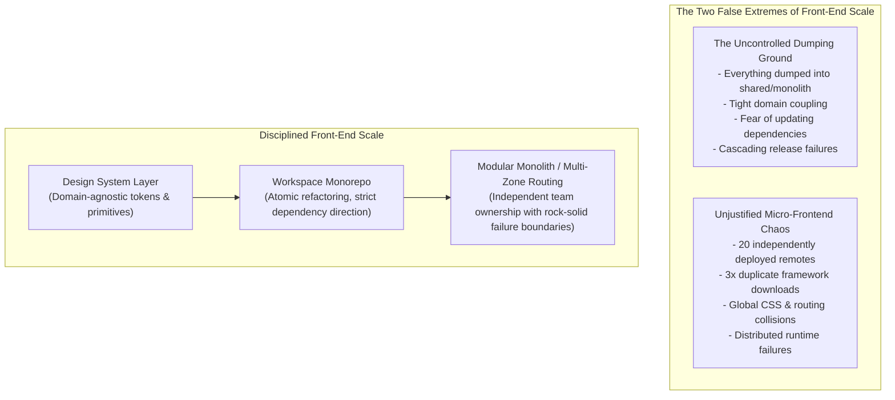

Scaling front-end architecture is not about declaring all code shared or all applications separate. Front-end scale is **the deliberate alignment of code boundaries, visual design systems, repository structures, team ownership, and deployment cadences**.

In this chapter, we engineer front-end systems that scale gracefully across dozens of teams and hundreds of thousands of lines of code. We construct token-driven design systems, establish package boundary governance, evaluate monorepos against polyrepos, define platform engineering paved roads, and evaluate micro-frontends as an expensive organizational trade-off.

---

## 1. The Dimensions of Front-End Scale

When engineers discuss "scaling," they often focus exclusively on technical metrics: bundle sizes, DOM node counts, or server requests per second. In enterprise front-end systems, however, architecture is governed by **three distinct dimensions of scale**:

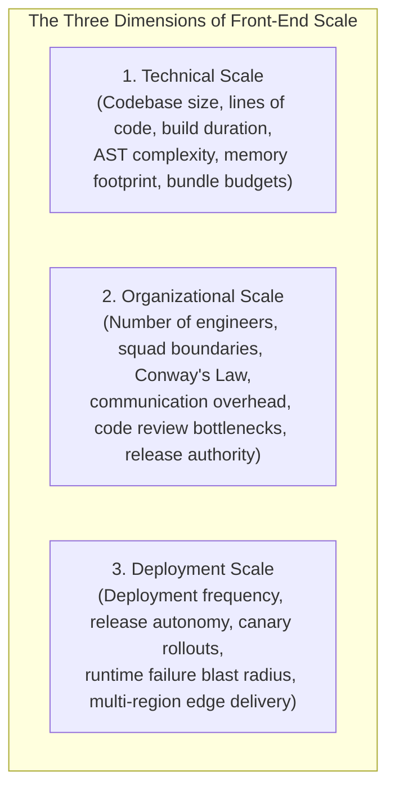

### Conway's Law in Front-End Architecture
In 1967, computer programmer Melvin Conway observed:
> *"Organizations which design systems are constrained to produce designs which are copies of the communication structures of these organizations."*

If an organization has six isolated product squads with separate budgets and release deadlines, forcing them to share a single, tightly coupled codebase without strict package boundaries will create constant political and technical conflict. Conversely, if a single team of four developers adopts a micro-frontend architecture with six independent deployment pipelines, the integration overhead will overwhelm their productive capacity.

### The Front-End Architectural Scale Ladder

Architects must navigate the **Scale Ladder**, starting with the simplest abstraction that satisfies organizational needs and adopting more complex models only when forced by demonstrable friction:

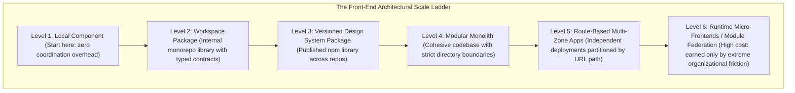

---

## 2. Design System Architecture: Beyond Component Libraries

A pervasive mistake in front-end engineering is conflating a **Component Library** with a **Design System**.

* A **Component Library** is merely a collection of code: a folder of React or Vue components (buttons, dropdowns, inputs) implemented in a particular framework.
* A **Design System** is an enterprise product. It encompasses design principles, a shared visual vocabulary (design tokens), accessible UI primitives, comprehensive usage guidelines, Figma asset sync, cross-platform implementations, and formal governance models.

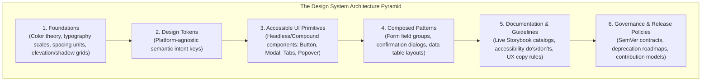

### The Three-Tier Design Token Architecture

**Design Tokens** are the atomic design decisions of an enterprise stored as platform-agnostic key-value pairs (typically defined in JSON or W3C Design Token Community Group format). 

To scale across multiple themes (Light, Dark, High-Contrast) and multiple platforms (Web, iOS, Android), architects structure tokens into **three distinct tiers**:

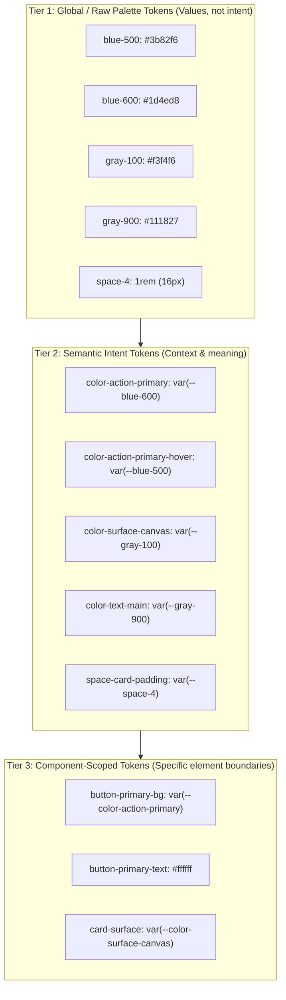

#### Why Semantic Tokens are Essential:
If an application hardcodes Tier 1 tokens directly into components (e.g. `background: var(--blue-600)`), implementing a Dark Mode requires hunting down thousands of CSS lines across dozens of files.

When components consume **Tier 2 Semantic Tokens** (`background: var(--color-surface-canvas)`), implementing Dark Mode requires remapping semantic variables inside a single root CSS class:

```css
/* Light Theme */
:root {
  --color-surface-canvas: var(--gray-100);
  --color-text-main: var(--gray-900);
}

/* Dark Theme (Zero component code changes required!) */
[data-theme="dark"] {
  --color-surface-canvas: var(--gray-900);
  --color-text-main: var(--gray-100);
}
```

### The Token Build Pipeline

Tokens are authored in platform-neutral JSON and compiled to platform-specific outputs using automated build tools like **Style Dictionary**:

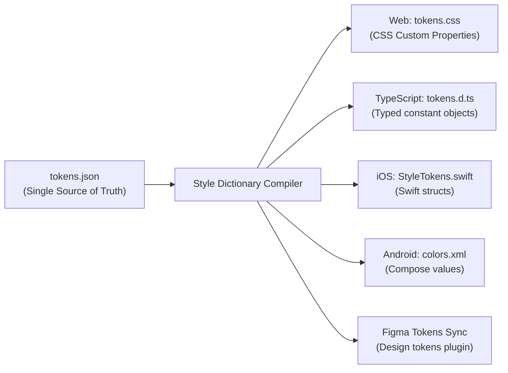

---

## 3. Package Governance: Boundaries, Encapsulation, and Versioning

A design system package must be protected from becoming a dumping ground for product-specific code.

### The Domain Boundary Rule
The foundational law of design system governance states:
> **Core design system primitives must possess zero knowledge of business domain logic.**

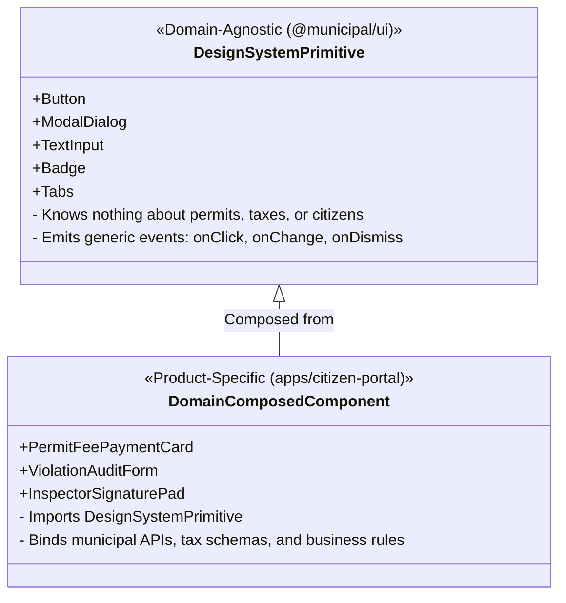

If a developer proposes adding `PermitCard` or `TaxCalculator` to `@municipal/ui`, the platform team must reject it. Domain components belong in product-specific feature packages, not in the foundational design system.

### Package Encapsulation via Modern Node.js `"exports"`

Historically, consuming applications could import arbitrary internal files from a package:
`import { helper } from '@municipal/ui/src/internal/privateDateUtils'`.

Modern build systems and runtimes enforce strict encapsulation using the `package.json` `"exports"` field:

```json
{
  "name": "@municipal/ui",
  "version": "2.4.0",
  "main": "./dist/index.js",
  "types": "./dist/index.d.ts",
  "exports": {
    ".": {
      "types": "./dist/index.d.ts",
      "import": "./dist/index.js"
    },
    "./tokens.css": "./dist/tokens.css",
    "./package.json": "./package.json"
  }
}
```

Any attempt to import an unexposed path (e.g. `@municipal/ui/dist/internalHelper.js`) triggers an immediate build-time error, protecting internal implementation details from becoming accidental public APIs.

### Semantic Versioning and Deprecation Lifecycles

Design systems must adhere strictly to Semantic Versioning (SemVer):
- **PATCH (`2.4.1`):** Backwards-compatible bug fixes (e.g. fixing an SVG alignment bug in `Button`).
- **MINOR (`2.5.0`):** Backwards-compatible new features (e.g. adding an `iconRight` prop to `Button`).
- **MAJOR (`3.0.0`):** Breaking changes requiring consumer code modifications (e.g. renaming `variant="danger"` to `tone="critical"`).

#### The Graceful Deprecation Lifecycle:
Platform teams must never remove a component or breaking prop abruptly in a minor release. Enterprise design systems follow an explicit five-phase deprecation roadmap:

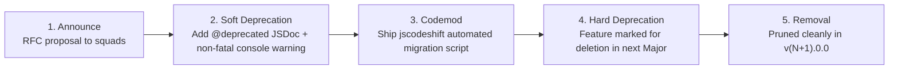

---

## 4. Repository Architecture: Monorepos vs. Polyrepos

As multiple applications and shared packages proliferate, engineering teams face a crucial architectural fork: should code live in multiple isolated Git repositories (**Polyrepo**) or a single coordinated repository (**Monorepo**)?

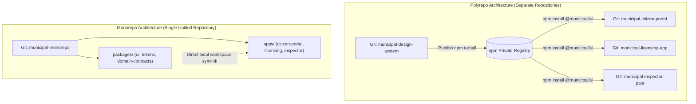

| Dimension | Polyrepo Model | Monorepo Model |
| :--- | :--- | :--- |
| **Cross-Package Changes** | Sluggish: requires PR in library $\rightarrow$ wait for CI $\rightarrow$ publish to npm $\rightarrow$ open PRs in 3 apps to bump version. | Instant & Atomic: a single PR updates a component in `packages/ui` and all three consuming `apps/` simultaneously. |
| **Dependency Desynchronization** | High: App A runs `@municipal/ui@1.2`, App B runs `@municipal/ui@1.8`, and App C runs `v2.1`. Visual divergence persists. | Eliminated: All applications consume the latest workspace source directly. |
| **Tooling & Configuration** | Duplicated: 5 separate ESLint configs, 5 separate CI workflows, 5 TypeScript configs that slowly drift. | Unified: Shared base `tsconfig`, shared ESLint rules, and centralized CI pipelines. |
| **CI Build Duration** | Isolated per repo, but total pipeline coordination is difficult. | Requires intelligent caching (Turborepo, Nx) to prevent rebuilding unchanged packages. |

### Monorepo Task Graphs and Affected Builds

In a monorepo containing forty packages, running `npm run build` naively across all packages on every pull request takes thirty minutes.

Modern monorepo build systems (such as **Turborepo** or **Nx**) model packages as a **Directed Acyclic Graph (DAG)** and evaluate Git diffs to build **only affected packages**:

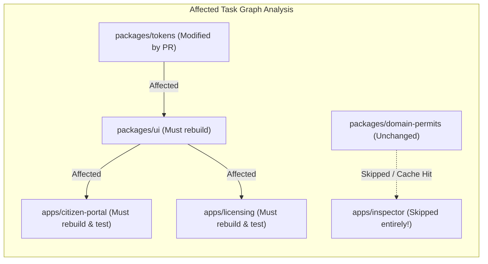

If a pull request only modifies `packages/tokens`:
- The monorepo engine identifies that `apps/inspector` has no dependency path to `tokens`.
- It executes builds and tests strictly for `packages/tokens`, `packages/ui`, and the two affected applications.
- Build outputs are cached cryptographically in a remote cache, slashing CI times from thirty minutes to ninety seconds.

---

## 5. Micro-Frontends: Runtime Independence and Its Heavy Costs

In enterprise environments with hundreds of developers, the desire for autonomous deployments leads teams to evaluate **Micro-Frontends**.

A **Micro-Frontend** is an architectural pattern in which independently deliverable front-end applications are composed into a unified user-facing browser interface:

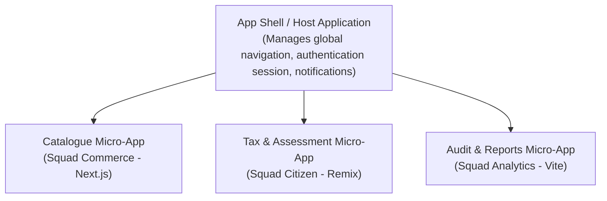

### The Honest Trade-Off: Micro-Frontends are an Organizational Tax

Micro-frontends are frequently sold as a modern silver bullet. In reality, **micro-frontends are an expensive organizational trade-off designed to solve team coordination bottlenecks at the expense of runtime performance and architectural simplicity**.

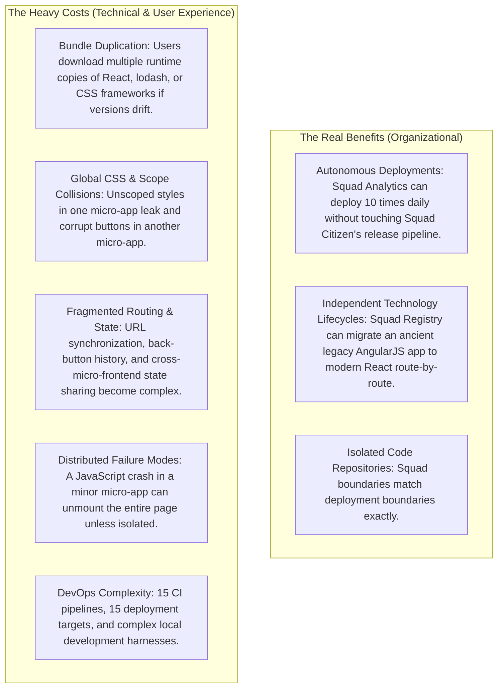

---

## 6. Integration Topologies: Build-Time vs. Runtime (Module Federation)

When an organization genuinely requires micro-frontends, architects must choose the point of integration:

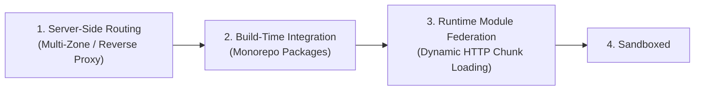

| Integration Topology | How it Works | Runtime Overhead | Deployment Autonomy | Best Suited For |
| :--- | :--- | :--- | :--- | :--- |
| **Server-Side / Multi-Zone** | Reverse proxy (NGINX/Cloudflare) routes `/permits` to App 1, and `/tax` to App 2. | Zero (Each app is an independent, complete application). | Complete (100% independent releases). | **The Recommended Pattern:** Cleanest boundaries, zero runtime coordination. |
| **Build-Time Packages** | Micro-apps are compiled as npm packages in a monorepo and bundled into a shell. | Zero bundle duplication (Single bundler pass). | Low (Shell must be rebuilt to ship changes). | Organizations wanting modular code with rock-solid performance. |
| **Module Federation** | Host application dynamically imports compiled chunks from remote servers at runtime. | Moderate (Shared singletons require careful version negotiation). | High (Remotes deploy without rebuilding host). | Large enterprises with 50+ engineers where multi-zone routing is impossible. |
| **Sandboxed `<iframe>`** | Host embeds remote micro-apps inside browser `<iframe>` elements. | Extremely High (Duplicate DOMs, isolated memory, heavy CPU). | Complete (Absolute isolation). | Embedding untrusted third-party widgets or legacy enterprise tools. |

### The Mechanics of Module Federation

Pioneered in Webpack 5 and supported in modern tools via plugins, **Module Federation** allows an application to dynamically load compiled JavaScript modules from another server at runtime while negotiating shared dependencies:

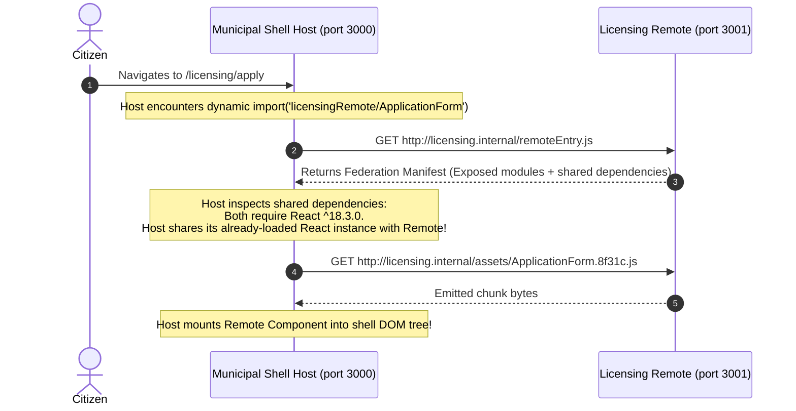

### Failure Containment: The Blast Radius Rule

In a micro-frontend architecture, an unhandled exception in an auxiliary feature (like an analytics widget or customer feedback popup) must **never** take down core user journeys (like permit application or payment submission).

Every remote micro-frontend must be isolated inside a resilient **Error Boundary**:

```typescript
// src/components/SafeRemoteWrapper.tsx
import React, { Component, ErrorInfo, ReactNode } from 'react';

interface Props {
  fallbackTitle: string;
  children: ReactNode;
}

interface State {
  hasError: boolean;
}

export class SafeRemoteWrapper extends Component<Props, State> {
  state: State = { hasError: false };

  static getDerivedStateFromError(): State {
    return { hasError: true };
  }

  componentDidCatch(error: Error, info: ErrorInfo): void {
    console.error(`[Micro-Frontend Failure] ${this.props.fallbackTitle}:`, error, info);
    // Send error telemetry to Datadog / Sentry
  }

  render(): ReactNode {
    if (this.state.hasError) {
      return (
        <aside className="remote-error-fallback" role="alert">
          <h4>{this.props.fallbackTitle} Temporarily Unavailable</h4>
          <p>This section failed to load. The rest of the municipal portal remains fully functional.</p>
          <button onClick={() => this.setState({ hasError: false })}>Retry Section</button>
        </aside>
      );
    }
    return this.props.children;
  }
}
```

---

## 7. The Modular Monolith: The Prudent Default at Scale

Because micro-frontends impose such heavy technical, cognitive, and performance penalties, modern front-end leaders advocate for the **Modular Monolith** as the primary default for 90% of scaling engineering teams.

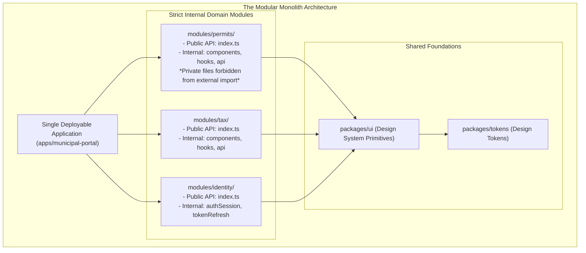

### Implementing a Modular Monolith:
1. **Single Git Repository, Single Build Pipeline:** Zero package publishing overhead, zero Module Federation version negotiation.
2. **Explicit Public Module APIs:** Every business module (`modules/permits/`) exposes an `index.ts` declaring its public interface. Internal implementation files (`modules/permits/internal/PermitMath.ts`) are strictly private.
3. **Automated ESLint Boundary Rules:** Enforce boundaries using tools like `eslint-plugin-import` or ESLint project boundaries:
   ```json
   {
     "rules": {
       "import/no-restricted-paths": ["error", {
         "zones": [
           { "target": "./src/modules/tax", "from": "./src/modules/permits/internal" }
         ]
       }]
     }
   }
   ```
   If a developer on Squad Tax attempts to import internal code from Squad Permits, the linter fails immediately in their IDE.
4. **Independent Domain Test Suites:** Each module maintains its own unit and integration test suites, allowing squads to verify their domain logic in isolation.

---

## Chapter Summary

* **Align technical and organizational boundaries.** Scaling front-end systems is an exercise in Conway's Law: ensure code structure, team ownership, and release processes reinforce one another.
* **Component libraries are code; design systems are products.** A design system encompasses principles, tokens, primitives, guidelines, accessibility guarantees, and governance.
* **Structure tokens into three tiers.** Raw palette constants (Tier 1) feed Semantic Intent tokens (Tier 2), which drive component-scoped styles (Tier 3), enabling effortless theming and dark mode.
* **Enforce the Domain Boundary Rule.** Design system primitives (`@municipal/ui`) must be 100% agnostic of municipal business logic. Domain components belong in product applications.
* **Protect package boundaries with `"exports"`.** Use modern package encapsulation to hide internal helpers and expose only official, versioned entry points.
* **Adopt monorepos for shared velocity.** Consolidate related applications and shared packages into a monorepo workspace to unlock atomic cross-package refactoring and unified tooling.
* **Accelerate CI with affected task graphs.** Use tools like Turborepo or Nx to build and test strictly the packages affected by a pull request, caching unchanged outputs.
* **Treat micro-frontends as an expensive organizational trade-off.** Adopt micro-frontends only when massive team size justifies the heavy costs of bundle bloat, CSS collisions, fragmented routing, and distributed runtime failures.
* **Contain micro-frontend failures.** Always isolate remote runtime components inside resilient Error Boundaries to protect core application workflows from auxiliary crashes.
* **Default to the Modular Monolith.** Most organizations scale faster and more reliably by combining strict directory boundaries, ESLint import restrictions, and shared design tokens within a single deployable application.

---

## Review Questions

1. Explain Conway's Law and describe how it influences front-end repository and package architecture.
2. What is the fundamental difference between a raw palette token and a semantic intent token?
3. Why should a core design system primitive like `Button` never contain business domain logic?
4. How does the modern `"exports"` field in `package.json` enhance package security and encapsulation?
5. Describe the five-phase deprecation roadmap used to retire breaking component APIs in an enterprise design system.
6. What is the primary difference between a Monorepo and a Polyrepo regarding cross-package pull requests and dependency synchronization?
7. How does a monorepo task graph (DAG) use Git diffs to accelerate continuous integration pipelines?
8. Identify three major technical penalties or failure modes introduced by runtime micro-frontend architectures.
9. Explain how Webpack / Vite Module Federation negotiates shared dependencies (such as React) between a host shell and a remote micro-app.
10. What is a Modular Monolith, and how can automated linting rules enforce module isolation without multiple deployment pipelines?

---

## Practical Lab Brief

Apply the principles learned in this chapter by completing:
**[Practical 14 — Design-System Package Governance and Ownership Mapping]()**

In this laboratory, you will construct a two-tier design token pipeline (`@municipal/ui`), build accessible domain-agnostic UI primitives, consume them within a product application, execute a backwards-compatible SemVer deprecation release, and establish a formal RACI team governance matrix.
