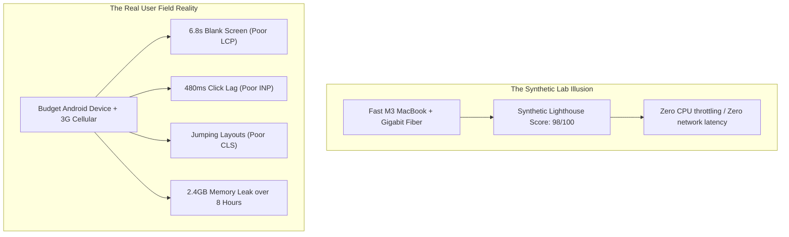
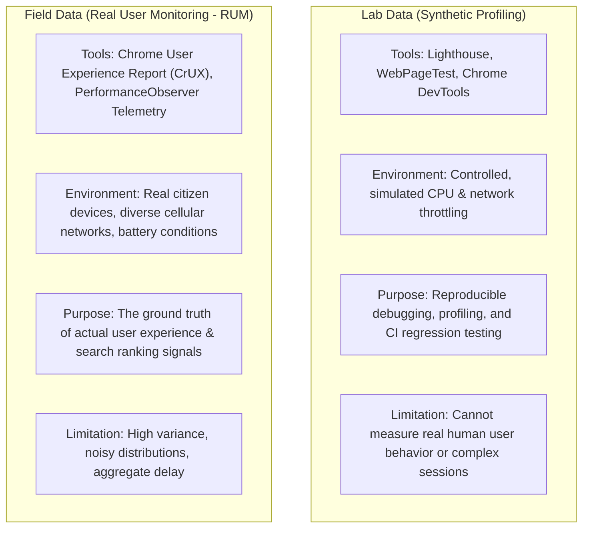
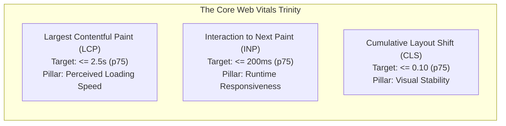
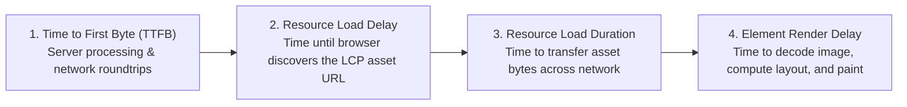
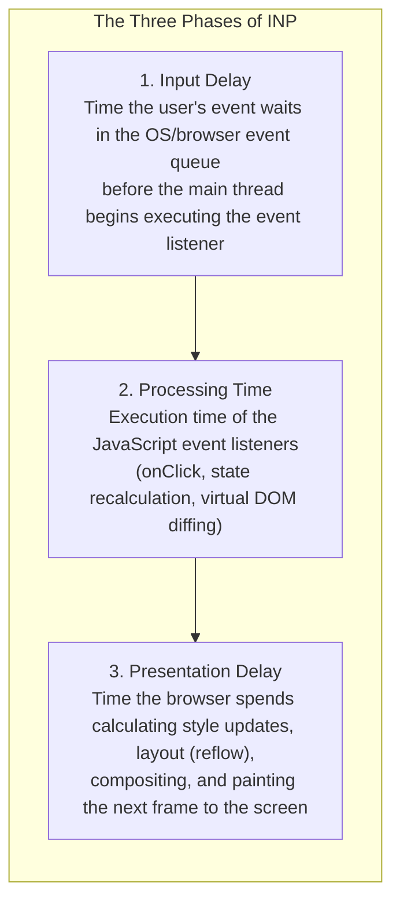
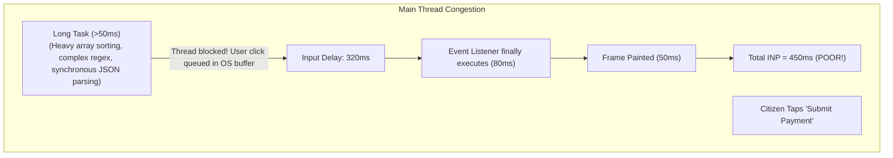
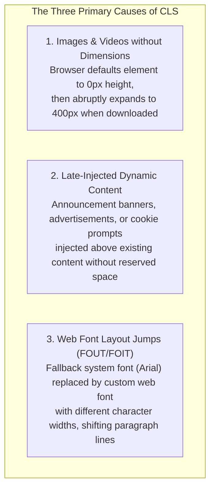
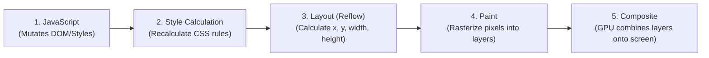
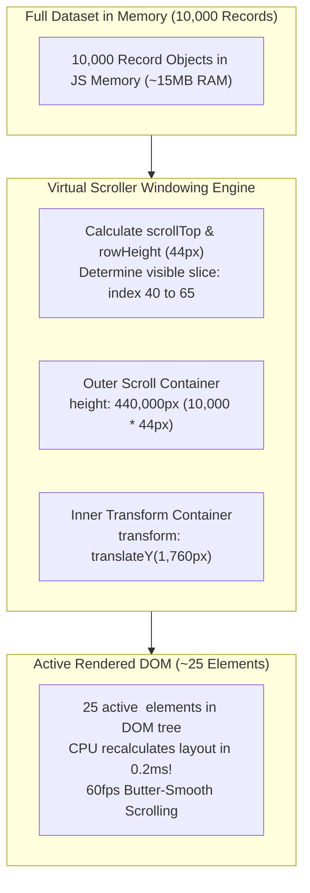

The Erbil Municipal Technology Directorate deploys its newly redesigned public E-Services portal. In the headquarters conference room, the development team tests the portal on top-tier developer laptops connected to gigabit municipal fiber. The synthetic Lighthouse audit flashes a near-perfect score: **98/100**. The team declares victory and goes home for the weekend.

On Monday morning, telemetry alerts and citizen complaint tickets flood the municipal helpdesk:
- In the mountain districts of Soran and Shaqlawa, citizens accessing the portal on entry-level Android smartphones over congested 3G cellular networks wait **6.8 seconds** staring at a completely blank white screen before the hero image of the municipal citadel renders.
- When an applicant attempts to click "Pay Permit Fee," the button does not respond for **480 milliseconds** because a heavy analytics bundle is executing a 350ms Long Task on the browser's single main thread. Believing their click was ignored, citizens tap the button repeatedly, triggering duplicate payment requests.
- Just as a citizen positions their thumb to tap "Cancel Application," a delayed municipal emergency notification banner injects at the top of the viewport. The entire page abruptly shifts downward by 80 pixels; the citizen's thumb accidentally taps "Submit Non-Refundable Application" instead.
- In municipal licensing offices, civil servants who leave the administrative dashboard open on their desks all day report that by 3:00 PM, their browser tabs consume **2.4 gigabytes of memory**, laptop cooling fans spin at maximum velocity, and typing in form inputs lags by half a second per keystroke.

Every one of these failures stems from the same dangerous engineering illusion: **evaluating performance through synthetic lab scores on powerful developer machines rather than measuring real human experience under field conditions**.



Performance is not a single vanity score. Performance is the study of how quickly, smoothly, and reliably users can see content, interact with controls, and complete their digital journeys.

In this chapter, we bridge high-level performance metrics with low-level browser mechanics. We deconstruct Google's **Core Web Vitals**—Largest Contentful Paint (LCP), Interaction to Next Paint (INP), and Cumulative Layout Shift (CLS); analyze the browser's rendering engine and layout thrashing; tame long main-thread tasks; implement DOM virtualization; and establish continuous real-user monitoring (RUM) pipelines.

---

## 1. The Reality of Web Performance: Field vs. Lab and the 75th Percentile

Front-end engineering evaluates performance across two distinct measurement methodologies:



### The 75th Percentile (p75) Standard
Never evaluate front-end performance using arithmetic averages. If ten citizens visit the portal:
- Nine citizens on fiber connections experience a fast 1.0s load.
- One citizen on a rural 3G connection experiences an agonizing 11.0s load.
- The arithmetic average is $2.0\text{s}$, which sounds acceptable—while masking the fact that 10% of your citizens suffered a completely broken experience.

To ensure applications remain accessible to the entire population, the industry and the World Wide Web Consortium evaluate the **75th Percentile (p75)**: 75% of all page visits must meet the "Good" threshold under real-world conditions.

---

## 2. The Core Web Vitals Trinity

Google's **Core Web Vitals** are three user-centric performance metrics that measure the primary pillars of the web user experience:



---

## 3. Largest Contentful Paint (LCP): Anatomy of Loading

**Largest Contentful Paint (LCP)** measures perceived loading speed. It marks the point on the page load timeline when the primary content element in the viewport—typically a large hero image, a video poster frame, or a large block of heading typography—has rendered on screen.

### The Four Sub-Parts of LCP

To diagnose an LCP problem, architects dissect the metric into its four constituent sub-parts:



$$\text{LCP} = \text{TTFB} + \text{Resource Load Delay} + \text{Resource Load Duration} + \text{Element Render Delay}$$

### The LCP Request Waterfall Anti-Pattern

In poorly architected Single-Page Applications, LCP candidate images are discovered through an asynchronous waterfall:

```mermaid
sequenceDiagram
    autonumber
    actor Browser
    participant CDN as Static Host
    participant API as Backend API

    Browser->>CDN: GET /permits/104 (Downloads HTML Shell)
    Note over Browser: Browser parses HTML shell; discovers script tag
    Browser->>CDN: GET /assets/app.js (1.2 MB Bundle)
    Note over Browser: Browser parses & compiles JS (takes 250ms)
    Browser->>API: GET /api/permits/104 (Fetches record JSON)
    API-->>Browser: Returns JSON with heroImageUrl: "/img/citadel.png"
    Note over Browser: Browser FINALLY discovers LCP image URL at t = 3.8s!
    Browser->>CDN: GET /img/citadel.png (Uncompressed 3.5MB PNG)
    Note over Browser: LCP Element Paints at t = 6.2s (POOR!)
```

### Engineering Remedies for LCP:
1. **Preload the LCP Candidate:** Eliminate the Resource Load Delay by declaring the image in the static HTML `<head>`:
   ```html
   <link rel="preload" as="image" href="/img/citadel.avif" type="image/avif" fetchpriority="high">
   ```
2. **Prioritize with `fetchpriority="high"`:** Instructs the browser's preload scanner to fetch the hero image ahead of non-critical stylesheets or deferred scripts.
3. **Modern Compressed Formats:** Replace legacy JPEGs and PNGs with **AVIF** and **WebP**, which reduce payload bytes by 50% to 80% at identical visual fidelity.
4. **Responsive Sizing (`srcset`):** Serve smaller 400px images to mobile screens rather than forcing a smartphone to download a 2400px desktop banner.

---

## 4. Interaction to Next Paint (INP): The Responsiveness Standard

In March 2024, **Interaction to Next Paint (INP)** officially replaced the legacy First Input Delay (FID) as a Core Web Vital.

* **Why FID was Inadequate:** FID only measured the *input delay* of the *first* click on a page. If an application responded quickly to the first click but froze for half a second on every subsequent tab switch, form submission, or search keystroke, FID scored a deceptive 100%.
* **What INP Measures:** INP assesses the responsiveness of **all user interactions** (mouse clicks, taps, keypresses) throughout the entire lifetime of the user's visit. The final INP value represents the worst interaction latency observed (typically at the 98th percentile).

### The Anatomy of an Interaction

When a citizen clicks a button, the total interaction latency consists of three distinct phases:



$$\text{INP} = \text{Input Delay} + \text{Processing Time} + \text{Presentation Delay}$$

### The Single Main Thread & Long Tasks

Browsers execute JavaScript, calculate layout reflows, parse HTML, and process user clicks on a **single main thread**. 

Any continuous JavaScript execution exceeding **50 milliseconds** is classified as a **Long Task**. While a long task runs, the main thread is completely deadlocked: user taps, keystrokes, and scroll events cannot be processed, causing severe input delay.



### Breaking Up Long Tasks with `scheduler.yield()`

To maintain an INP $\le 200\text{ms}$, heavy JavaScript operations must yield control back to the browser's rendering engine so it can paint the user's visual feedback before resuming work.

```typescript
// src/utils/scheduler.ts
export async function yieldToMain(): Promise<void> {
  // Use modern Chrome Task Scheduling API if available
  if ('scheduler' in window && 'yield' in (window as any).scheduler) {
    return (window as any).scheduler.yield();
  }
  // Microtask/macrotask fallback for Safari and Firefox
  return new Promise((resolve) => setTimeout(resolve, 0));
}

// Processing 10,000 municipal records without freezing the UI
export async function processLargeDataset(items: any[]): Promise<void> {
  for (let i = 0; i < items.length; i++) {
    computeRecord(items[i]);

    // Every 50 items, yield control to allow browser to paint pending clicks!
    if (i % 50 === 0) {
      await yieldToMain();
    }
  }
}
```

---

## 5. Cumulative Layout Shift (CLS): Visual Stability & Jitter

**Cumulative Layout Shift (CLS)** measures visual stability. It quantifies how much unexpected layout movement occurs on the page during its entire lifecycle.

A high CLS score indicates a frustrating, jittery user experience where buttons jump away from thumbs, reading text shifts mid-sentence, and users accidentally click wrong links.

$$\text{Layout Shift Score} = \text{Impact Fraction} \times \text{Distance Fraction}$$



### Engineering Remedies for CLS:
1. **Explicit Dimensions & Aspect Ratios:** Always define explicit `width` and `height` attributes on HTML `` elements, and enforce CSS `aspect-ratio`:
   ```css
   .card-image {
     width: 100%;
     height: auto;
     aspect-ratio: 16 / 9; /* Reserves exact layout space before image bytes arrive! */
   }
   ```
2. **Reserve Space for Dynamic Banners:** Never inject banners directly above visible content without pre-allocating space. Wrap dynamic widgets in containers with explicit `min-height`:
   ```css
   .emergency-announcement-slot {
     min-height: 72px; /* Layout space reserved 0ms after boot */
     contain: layout;   /* Isolates layout recalculations from surrounding page */
   }
   ```
3. **Font Metrics Overrides:** When using web fonts, use `font-display: swap` paired with CSS `@font-face` metric overrides (`size-adjust`, `ascent-override`, `descent-override`) to match fallback font dimensions perfectly, eliminating layout shifts when the web font swaps.

---

## 6. Rendering Pipeline Mechanics: Layout Thrashing

To optimize runtime animations and scrolling, engineers must understand the browser's internal rendering pipeline:



### The Layout Thrashing Anti-Pattern

Layout calculation is computationally expensive. Modern browsers optimize by batching style updates and deferring layout calculation until the end of the current microtask.

However, if JavaScript **interleaves reading geometric DOM properties with writing style properties**, it forces the browser to synchronously execute a full layout recalculation on every iteration:

```typescript
// ANTIPATTERN: Forced Synchronous Layout Thrashing
const cards = document.querySelectorAll('.permit-card');

cards.forEach((card) => {
  // READ: Forces browser to calculate layout immediately!
  const height = card.offsetHeight; 
  
  // WRITE: Dirties the layout!
  card.style.height = `${height + 10}px`; 
  
  // Next loop iteration will force ANOTHER synchronous layout recalc!
  // In a loop of 100 items, this recalculates layout 100 times, dropping frames!
});
```

#### The Batched Solution:
Separate reads from writes. Batch all DOM measurements first, then batch all style mutations inside a single `requestAnimationFrame()` pass:

```typescript
// ARCHITECTURAL PATTERN: Fast Batched DOM Manipulation
const cards = document.querySelectorAll('.permit-card');

// Phase 1: Batch all geometric reads
const heights = Array.from(cards).map(card => card.offsetHeight);

// Phase 2: Batch all geometric writes in the next paint frame
requestAnimationFrame(() => {
  cards.forEach((card, index) => {
    card.style.height = `${heights[index] + 10}px`;
  });
  // Exactly ONE layout recalculation is performed!
});
```

### Composite-Only Hardware Acceleration

Whenever possible, animate visual properties that bypass Layout and Paint entirely, executing directly on the GPU in the **Composite** phase:
- **Fast GPU Properties:** `transform: translate3d(...)`, `transform: scale(...)`, `opacity`.
- **Slow Layout Properties:** `top`, `left`, `width`, `height`, `margin`, `padding` (trigger expensive CPU reflows on every animation frame).

---

## 7. Large Datasets and Memory Management: Virtualization and Leaks

In enterprise applications (such as municipal record registries), rendering large datasets creates severe performance degradation.

### The Problem of DOM Bloat
If an application renders a table of 10,000 permit records, it creates roughly 70,000 DOM nodes. 
- The browser allocates hundreds of megabytes of RAM.
- Every style recalculation and hover state must evaluate thousands of DOM nodes.
- Scrolling stutters at 15 to 20 frames per second.

### The Virtualization (Windowing) Solution

**Virtualization** maintains the illusion of an infinite scrolling list while rendering **only the small subset of rows currently visible in the user's viewport** (typically 25 to 35 DOM nodes):



### Hunting Front-End Memory Leaks

In long-running single-page applications that civil servants keep open for 8-hour shifts, memory leaks lead to tab crashes and thermal throttling:

#### The Three Primary Front-End Memory Leaks:
1. **Uncleared Event Listeners on Unmount:** Adding `window.addEventListener('resize', handler)` inside a component without returning a cleanup function in `useEffect` or `onUnmounted` retains the component and its entire closure scope in memory forever.
2. **Detached DOM Trees:** Keeping references to removed DOM elements inside global arrays or module variables:
   ```javascript
   // MEMORY LEAK: Even though element was removed from the DOM,
   // the array reference prevents the garbage collector from freeing memory!
   globalCache.push(document.getElementById('deleted-modal'));
   ```
3. **Uncleared Intervals:** An active `setInterval()` callback retains all variables in its parent closure scope indefinitely until explicitly terminated with `clearInterval()`.

---

## 8. Performance Budgets, Instrumentation, and Team Culture

High performance is not achieved by an end-of-year audit; it is maintained through automated **Performance Budgets** enforced in CI pipelines and production telemetry.

### Native In-Browser Instrumentation (`PerformanceObserver`)

Front-end applications should monitor their own real-user Core Web Vitals in production and report metrics via `navigator.sendBeacon`:

```typescript
// src/telemetry/rum.ts
export function observeWebVitals(endpoint = '/api/telemetry'): void {
  if (typeof PerformanceObserver === 'undefined') return;

  // Observe Largest Contentful Paint (LCP)
  const lcpObserver = new PerformanceObserver((entryList) => {
    const entries = entryList.getEntries();
    const lastEntry = entries[entries.length - 1];
    reportMetric('LCP', lastEntry.startTime);
  });
  lcpObserver.observe({ type: 'largest-contentful-paint', buffered: true });

  // Observe Cumulative Layout Shift (CLS)
  let clsScore = 0;
  const clsObserver = new PerformanceObserver((entryList) => {
    for (const entry of entryList.getEntries()) {
      if (!(entry as any).hadRecentInput) {
        clsScore += (entry as any).value;
      }
    }
    reportMetric('CLS', clsScore);
  });
  clsObserver.observe({ type: 'layout-shift', buffered: true });
}

function reportMetric(name: string, value: number): void {
  const payload = JSON.stringify({ metric: name, value, url: window.location.pathname });
  navigator.sendBeacon('/api/telemetry', payload);
}
```

### The Performance Engineering Hypothesis Framework

When optimizing a slow interface, teams must formulate formal engineering hypotheses rather than guessing:

> **We believe that** [measured cause: e.g. uncompressed 3.5MB PNG hero banner]  
> **makes** [user journey: e.g. permit detail page loading]  
> **slow for** [target user segment: e.g. mobile 3G citizens].  
> **If we implement** [architectural remedy: e.g. AVIF preload + fetchpriority="high"],  
> **then** [primary signal: e.g. LCP p75]  
> **will improve from** [baseline: 4.8s] **to** [target: $\le 2.2\text{s}$]  
> **without degrading** [trade-off boundary: e.g. visual image fidelity].

---

## Chapter Summary

* **Performance is a field property, not a lab vanity score.** Synthetic Lighthouse scores on fast developer laptops mask real-world mobile friction. Measure real user experience using the 75th percentile (p75).
* **Master the Core Web Vitals trinity.** Optimize for Largest Contentful Paint (LCP $\le 2.5\text{s}$), Interaction to Next Paint (INP $\le 200\text{ms}$), and Cumulative Layout Shift (CLS $\le 0.10$).
* **Dissect LCP into its four phases.** Eliminate Resource Load Delay by hoisting and preloading LCP candidates in static HTML, setting `fetchpriority="high"`, and using modern compressed formats (AVIF/WebP).
* **Tame INP by eliminating Long Tasks.** Any task exceeding 50ms deadlocks the browser's single main thread. Yield execution to the rendering engine with `scheduler.yield()` to allow visual updates before heavy computation resumes.
* **Prevent CLS with reserved geometry.** Always declare explicit `aspect-ratio` or `width`/`height` on images, and reserve layout slots using `min-height` for late-injected dynamic announcements.
* **Avoid Layout Thrashing.** Never interleave reading geometric DOM properties (`offsetHeight`) with writing styles. Batch all reads first, then batch all writes inside `requestAnimationFrame()`.
* **Animate exclusively on the GPU.** Restrict runtime animations to composite-only properties (`transform` and `opacity`) to bypass expensive CPU Layout and Paint phases.
* **Virtualize massive lists.** Rendering thousands of DOM nodes causes memory bloat and scroll stutter. Use windowed virtualization to render only the ~30 rows actively visible in the viewport.
* **Guard against long-session memory leaks.** Always remove event listeners on component unmount, clear active intervals, and eliminate detached DOM references.
* **Cultivate an evidence-based performance culture.** Instrument in-browser metrics using `PerformanceObserver`, enforce automated performance budgets in CI, and form structured hypotheses before modifying code.

---

## Review Questions

1. Why is evaluating performance via arithmetic averages misleading compared to the 75th percentile (p75)?
2. Identify the four constituent sub-parts of Largest Contentful Paint (LCP) and explain how `<link rel="preload">` addresses Resource Load Delay.
3. Why did Interaction to Next Paint (INP) replace First Input Delay (FID) as an official Core Web Vital?
4. What is a "Long Task," and why does it inflate the Input Delay phase of INP?
5. How does `scheduler.yield()` prevent main-thread freezing during heavy JavaScript data processing?
6. Describe how unsized images and late-injected banners cause high Cumulative Layout Shift (CLS).
7. What is Layout Thrashing, and how does batching DOM reads and writes prevent it?
8. Why are animations utilizing `transform` and `opacity` dramatically faster than animations utilizing `top` and `left`?
9. Explain the mechanics of Virtualization (Windowing) and how it enables smooth 60fps scrolling across 10,000 table rows.
10. Describe the three most common front-end memory leaks in long-running Single-Page Applications.

---

## Practical Lab Brief

Apply the principles learned in this chapter by completing:
**[Practical 15 — Measure, Diagnose, and Optimize Core Web Vitals]()**

In this laboratory, you will diagnose and remediate a degraded municipal portal under 4x CPU throttling. You will instrument native `PerformanceObserver` metrics, optimize LCP through responsive preloaded images, eliminate CLS with aspect-ratio reservations, tame INP using `scheduler.yield()`, and implement a windowed virtual scroller.
