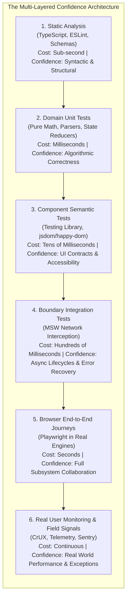
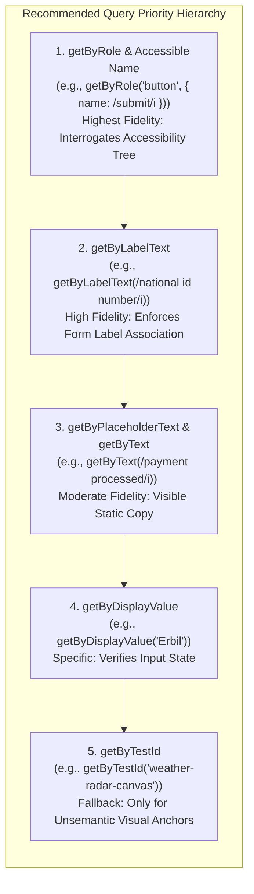
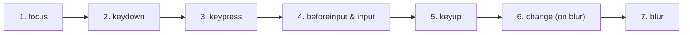
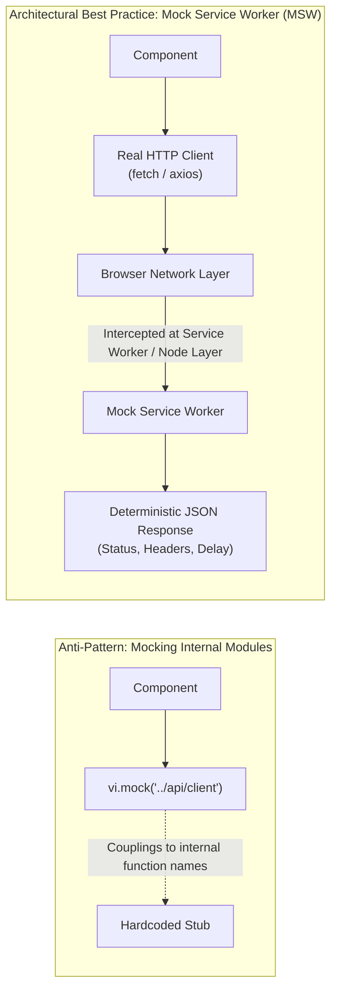
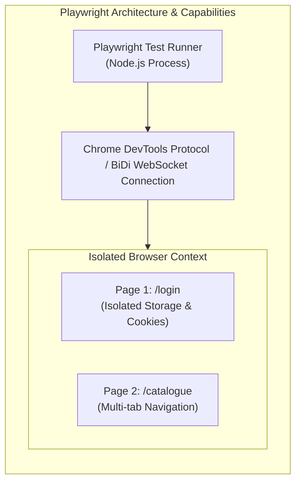

# Testing Strategies for Resilient Interfaces

A regional utility company in Erbil launched an overhauled online billing and customer portal to high internal acclaim. During pre-release automated testing, the engineering dashboard glowed emerald green: continuous integration reported 1,420 passing unit tests and an enviable 96% line coverage metric. The codebase appeared mathematically bulletproof.

Within two hours of production deployment, the customer service call center was overwhelmed. Citizens attempting to renew municipal permits reported that double-clicking the payment button charged their accounts twice. Search queries for public service offices yielded erratic results—typing quickly caused older, slower search queries to overwrite newer ones on the screen. Users navigating with screen readers became trapped inside an unclosable document verification modal. Mobile users on WebKit browsers found the checkout submission button pushed completely off-screen by a hidden CSS layout collision.

None of these catastrophic failures were detected by the 1,420 unit tests. When engineers audited the test suite, the root cause became glaringly apparent: the tests had been written to inspect internal framework variables (`expect(component.state.isLoading).toBe(true)`), mocked out the global `window.fetch` with simplistic immediate promises, and simulated user typing by invoking private component handler functions directly. The tests did not evaluate real user behavior, did not interrogate the browser's accessibility tree, did not test network transport boundaries, and did not execute inside a real layout engine.

This chapter establishes an architectural discipline for testing front-end web applications. You will learn to treat testing not as a bureaucratic compliance exercise measured in raw lines of code covered, but as **risk management**. You will learn how to design a multi-layered confidence strategy—spanning static analysis, isolated domain unit tests, accessible component tests, network boundary mocks, and real-browser end-to-end journeys—that catches defects early, survives code refactoring, and guarantees resilient user experiences.

---

## 16.1 Testing as Risk Management

Every software test is an economic trade-off. Running a static type check costs a few milliseconds of CPU time and provides immediate mathematical proof of type safety, but it cannot tell you whether a button responds to an enter keypress. Conversely, spinning up a real Chromium browser in an end-to-end cloud grid tests the entire browser rendering engine, layout tree, and network stack, but it requires seconds of wall-clock time, consumes substantial server infrastructure, and introduces non-deterministic timing variables.

Front-end web applications fail across six distinct, non-linear failure dimensions:

1. **Deterministic Logic Failures:** Pure calculation errors, such as miscalculating a regional VAT fee waiver or incorrectly serializing a URL query string.
2. **Component Semantics & Accessibility Regressions:** Omitting accessible names, failing to link form inputs to error text with `aria-describedby`, or breaking keyboard tab order.
3. **Asynchronous Lifecycle & Timing Collisions:** Race conditions where out-of-order network responses clobber current UI state, or unhandled promise rejections that freeze loading spinners.
4. **Network Transport & Recovery Breakdowns:** Unhandled 500 server crashes, malformed API payloads, or lack of rollback during optimistic mutations.
5. **Browser Engine & Layout Anomalies:** CSS stacking context collisions, mobile touch tap target issues, and WebKit-specific rendering quirks that only manifest in real rendering pipelines.
6. **Cross-System Integration Drift:** Backend microservices changing JSON schema contracts without prior coordination, breaking client consumption.



### The Cost-Confidence Spectrum

For decades, software engineering literature debated the rigid proportions of the classic "Testing Pyramid" (prescribing 80% unit tests, 15% integration tests, and 5% UI tests) versus the "Testing Trophy" (advocating that integration tests provide the highest return on investment). 

In modern front-end engineering, prescriptive geometric shapes are less useful than understanding the **Cost-Confidence Spectrum**. The core operational rule is simple:

> **Catch each specific risk at the lowest, fastest, and most deterministic boundary capable of observing it.**

If a risk involves a pure calculation—such as currency rounding—verifying it in an end-to-end browser test is wasteful and slow; it belongs in an isolated unit test. If a risk involves an asynchronous modal dialog trapping focus upon activation and returning focus to the trigger button upon pressing `Escape`, a unit test cannot observe it; it requires a component test querying the accessibility tree. If a risk involves a cookie being dropped across cross-site navigations on Safari, neither a unit test nor a simulated DOM can observe it; it demands a real browser runner.

| Testing Boundary | Primary Question Answered | Execution Speed | Execution Environment | Observes Rendering? |
| :--- | :--- | :--- | :--- | :---: |
| **Static Analysis** | Does the code violate structural contracts or type rules? | Milliseconds | Compiler / Linter | No |
| **Domain Unit** | Does this pure function produce expected output for all inputs? | < 1 ms | Pure Node / Bun | No |
| **Component Semantic** | Does this control provide correct accessible roles, names, and event reactions? | 10–50 ms | Simulated DOM (`jsdom`) | Partial |
| **Boundary Integration** | Does the feature recover from network failures, latency, and races? | 50–200 ms | Mock Service Worker (MSW) | Partial |
| **Browser E2E** | Does the critical path function across real browser layout engines? | 1–10 s | Real Chromium / WebKit | Yes |
| **Field Telemetry** | What unpredicted failures and performance drops occur in the wild? | Continuous | Real End-User Devices | Yes |

### What Static Analysis Proves (and What It Cannot)

TypeScript and modern linters form the essential baseline of this spectrum. A strict TypeScript configuration (`"strict": true`) eliminates entire classes of runtime errors: `TypeError: Cannot read properties of undefined`, invalid property access, misspelled object keys, and unhandled union cases in `switch` statements.

However, static analysis operates entirely at compile time. It has strict physical limits:
- It cannot verify whether an asynchronous network response conforms to the declared type interface unless runtime parsing (such as Zod) is employed.
- It cannot detect CSS layout bugs or element occlusion where a floating banner renders on top of a clickable link.
- It cannot observe browser event loop timing, race conditions, or unhandled promise rejections.
- It cannot verify whether an element has a meaningful accessible name or whether a keyboard user can navigate past a custom dropdown.

Static analysis eliminates cheap structural mistakes so that automated test suites can focus their execution time on dynamic behavior and risk.

---

## 16.2 Pure Logic & Unit Testing

A unit test exercises a single module of software logic in complete isolation from external collaborators, DOM rendering engines, and network transport systems.

The most common pathology in front-end unit testing is **testing the programming language** or **testing framework syntax**. Consider the following anti-pattern commonly found in legacy codebases:

```ts
// ANTI-PATTERN: Testing language syntax and trivial assignments
describe("UserCard", () => {
  it("renders a div element", () => {
    const wrapper = shallowMount(UserCard, { props: { name: "Sara" } });
    expect(wrapper.find("div").exists()).toBe(true);
  });

  it("assigns the prop to an internal variable", () => {
    const component = new UserCard({ name: "Sara" });
    expect(component.props.name).toBe("Sara");
  });
});
```

These tests provide zero confidence. They do not test application behavior; they test whether the framework's prop-passing mechanism functions, and whether an HTML `div` tag was instantiated. If an engineer refactors the component to use a semantic `<article>` tag, the test breaks despite the user-facing behavior remaining completely intact.

### Identifying Pure Unit Candidates

Unit tests excel when applied to **pure deterministic logic**: functions that accept inputs, return outputs, produce no side effects, and require no mock dependencies. In a modern web architecture, prime unit test candidates include:

1. **Domain Calculations:** Currency conversions, municipal fee waiver schedules, tax rules, and discount logic.
2. **Data Transformers & Normalizers:** Converting raw server DTOs into localized view models.
3. **URL & Query State Serializers:** Parsing and serializing complex search, filtering, and pagination parameters to and from `window.location.search`.
4. **State Machine Reducers:** Redux/Zustand pure state reducer functions that transition application state deterministically from `(State, Action) => NextState`.
5. **Runtime Validation Schemas:** Testing Zod or Valibot parsers against valid payloads, edge-case values, and corrupt schemas.

```ts
// src/domain/licensing.ts
export interface LicenseFeeRequest {
  baseAmountIqd: number;
  applicantType: "individual" | "commercial" | "ngo";
  isDisabilityExempt: boolean;
  lateMonths: number;
}

export function calculatePermitFee(req: LicenseFeeRequest): number {
  if (req.baseAmountIqd < 0) {
    throw new RangeError("Base fee cannot be negative.");
  }
  if (req.isDisabilityExempt) {
    return 0;
  }
  
  let multiplier = 1.0;
  if (req.applicantType === "commercial") multiplier = 1.5;
  if (req.applicantType === "ngo") multiplier = 0.5;

  const latePenalty = Math.max(0, req.lateMonths) * 5000;
  return Math.round(req.baseAmountIqd * multiplier + latePenalty);
}
```

```ts
// src/domain/licensing.test.ts
import { describe, it, expect } from "vitest";
import { calculatePermitFee } from "./licensing";

describe("calculatePermitFee (Domain Unit Logic)", () => {
  it("applies standard calculation for commercial applicant without penalties", () => {
    const fee = calculatePermitFee({
      baseAmountIqd: 100_000,
      applicantType: "commercial",
      isDisabilityExempt: false,
      lateMonths: 0,
    });
    expect(fee).toBe(150_000);
  });

  it("grants complete fee waiver for disability-exempt citizens", () => {
    const fee = calculatePermitFee({
      baseAmountIqd: 100_000,
      applicantType: "commercial",
      isDisabilityExempt: true,
      lateMonths: 4,
    });
    expect(fee).toBe(0);
  });

  it("accrues 5,000 IQD per late month accurately", () => {
    const fee = calculatePermitFee({
      baseAmountIqd: 50_000,
      applicantType: "individual",
      isDisabilityExempt: false,
      lateMonths: 3,
    });
    expect(fee).toBe(65_000);
  });

  it("throws a RangeError when base amount is negative", () => {
    expect(() =>
      calculatePermitFee({
        baseAmountIqd: -500,
        applicantType: "individual",
        isDisabilityExempt: false,
        lateMonths: 0,
      })
    ).toThrow(RangeError);
  });
});
```

Notice the characteristics of these unit tests:
- They execute in under 1 millisecond.
- They require no DOM setup, no browser shims, and no mock libraries.
- They test business requirements and boundary conditions, directly catching logic defects.

---

## 16.3 Component Testing & Accessible Semantics

When testing user interface components, how you query the document defines whether your test suite is an asset or a maintenance liability.

For many years, developers queried components using internal CSS selectors or element tag structures:

```ts
// FRAGILE ANTI-PATTERN: Couplings to styling and internal markup
const btn = container.querySelector(".theme-blue-btn.save-button-wrapper > button");
const err = container.querySelector("div.text-red-500.text-xs");
```

This query style creates brittle tests. If a designer changes the CSS utility class from `.theme-blue-btn` to `.action-primary`, or replaces the wrapping `<div>` with a `<span>`, the test breaks immediately even though the user perceives no change whatsoever.

### The Philosophy of Testing Library

The modern paradigm of front-end component testing, pioneered by Kent C. Dodds and codified in the DOM Testing Library family, rests on a foundational insight:

> **The more your tests resemble the way your software is used, the more confidence they can give you.**

Real users do not search for a button by traversing CSS class hierarchies (`.btn-primary`). Visual users locate buttons by reading their visible text ("Submit Application"). Screen-reader users locate buttons by listening to the accessibility tree announce their role and accessible name ("Submit Application, button"). Keyboard users navigate to controls using the `Tab` key and activate them with `Enter` or `Space`.

Therefore, robust component tests interact with the rendered document **strictly through the accessibility tree and visible user contracts**.



### Accessible Name Computation

When you execute `screen.getByRole("button", { name: "Save" })`, Testing Library does not perform a naive substring search. It executes the standard **W3C Accessible Name and Description Computation** algorithm against the DOM node.

An element's accessible name is derived through an explicit hierarchy:
1. An explicit `aria-labelledby` attribute pointing to another element's ID.
2. An explicit `aria-label` attribute on the element itself.
3. The element's native labelling mechanism (e.g., `<label for="x">` associated with `<input id="x">`).
4. The element's subtree text content (e.g., `<button>Save</button>`).
5. An image's native `alt` attribute.

```html
<!-- All three examples below expose the identical accessible contract: -->
<!-- Role: button | Accessible Name: "Confirm Registration" -->

<!-- Pattern A: Native subtree text -->
<button>Confirm Registration</button>

<!-- Pattern B: Icon button with aria-label -->
<button aria-label="Confirm Registration">
  <svg aria-hidden="true" class="icon-checkmark"></svg>
</button>

<!-- Pattern C: Labelling via external header -->
<h2 id="modal-title">Confirm Registration</h2>
<button aria-labelledby="modal-title">
  <span class="icon"></span>
</button>
```

A test written using `screen.getByRole("button", { name: /confirm registration/i })` passes across all three markup implementations. If an engineer replaces text with an icon button, the test passes if and only if the engineer provided an accessible name (`aria-label`). If they forget the accessible label, the test fails, immediately surfacing a severe accessibility regression before code is merged.

### When are Test IDs Legitimate?

Purists sometimes claim that `data-testid` attributes should never be used. This is incorrect. Test IDs are legitimate architectural escape hatches under three specific conditions:

1. **Unsemantic Visual Canvases:** WebGL contexts, HTML `<canvas>` elements, or complex SVG charts where individual sub-elements do not exist in the DOM or accessibility tree.
2. **Ambiguous Structural Containers:** Asserting on a list container or a table row boundary where querying by text would be ambiguous.
3. **Transient Ephemeral Containers:** Targeting an unlabelled animated transition wrapper where adding an artificial ARIA role would corrupt the accessibility tree for screen-reader users.

The architectural defect is not using `data-testid`; the defect is using `data-testid` to bypass fixing an inaccessible component. If you find yourself adding `data-testid="submit-btn"` to a button that lacks an accessible name, you are using the test ID as a crutch to avoid writing accessible software.

### The Limits of Role-Based Queries

While role-based queries provide a high-confidence signal, passing a Testing Library component test does **not** prove full accessibility compliance:

- It does not verify **color contrast ratios** between foreground text and background colors.
- It cannot observe whether a custom dropdown is clipped by an `overflow: hidden` parent container.
- It does not verify screen-reader **announcement timing** or whether live regions (`aria-live="polite"`) cause speech synthesizer queue congestion.
- It cannot guarantee that touch target sizes meet the minimum 24x24 CSS pixel boundary on mobile devices.

Automated component tests provide an indispensable foundation, but they must be complemented by automated axe scans and human assistive-technology reviews.

---

## 16.4 Asynchronous Interfaces, Boundary Mocking, and Race Conditions

Modern front-end user interfaces are asynchronous state machines. A component initiates data retrieval, renders intermediate skeleton layouts, handles errors, debounces search keystrokes, and executes optimistic cache updates.

Testing these asynchronous flows requires mastering three critical capabilities:
1. Realistic user event simulation.
2. Network boundary mocking.
3. Deterministic race condition testing.

### `userEvent` vs `fireEvent`

Many developers write component tests using `fireEvent`:

```ts
// FLAWED: Synthetic event dispatch
fireEvent.change(input, { target: { value: "passport" } });
fireEvent.click(button);
```

`fireEvent` simply dispatches a single synthetic browser DOM event. When a real user types into an input field, the browser does not dispatch a single isolated `change` event. The browser executes an entire cascade of micro-events:



If your application logic relies on `keydown` to intercept numeric input, or validates on `blur`, `fireEvent.change()` completely bypasses your code. Always prefer `@testing-library/user-event`, which accurately simulates the full browser input lifecycle:

```ts
// CORRECT: High-fidelity user event sequence
const user = userEvent.setup();
await user.type(screen.getByRole("searchbox", { name: /search services/i }), "passport");
await user.click(screen.getByRole("button", { name: /search/i }));
```

### Mocking at the Boundary: Mock Service Worker (MSW)

When testing a component that fetches remote data, how should you handle the network?



In legacy test suites, engineers routinely mock internal module imports: `vi.mock('../services/api')`. This is an architectural anti-pattern. If you refactor your component to rename `fetchUser()` to `getUserById()`, every test breaks even though the HTTP contract is unchanged. Furthermore, mocking internal functions bypasses your real HTTP client, header authorization interceptors, and response parsing logic.

**Mock Service Worker (MSW)** solves this cleanly by intercepting requests at the network boundary. In a Node testing environment (Vitest), MSW intercepts Node's native `fetch` using class interceptors; in a browser environment, it uses a real Service Worker.

```ts
// src/mocks/handlers.ts
import { http, HttpResponse, delay } from "msw";

export const handlers = [
  http.get("/api/v1/municipal-services", async ({ request }) => {
    const url = new URL(request.url);
    const query = url.searchParams.get("q");

    if (query === "timeout") {
      await delay(2000);
    }

    if (query === "error") {
      return HttpResponse.json({ message: "Database offline" }, { status: 503 });
    }

    if (query === "empty") {
      return HttpResponse.json({ services: [] });
    }

    return HttpResponse.json({
      services: [
        { id: "s1", name: "Water Connection Permit", fee: 15000 },
        { id: "s2", name: "Electricity Meter Transfer", fee: 25000 },
      ],
    });
  }),
];
```

### Deterministic Race Condition Testing

One of the most dangerous defects in web applications is the **asynchronous search race condition**. A user types `"erb"` (triggering Request 1), then quickly adds `"il"` to make `"erbil"` (triggering Request 2). If Request 1 experiences network latency and resolves *after* Request 2, an unresilient application will overwrite the newer results with the older ones!

Testing for this bug requires controlling the arrival order of network responses:

```ts
// src/components/ServiceSearch.test.ts
import { describe, it, expect, beforeEach } from "vitest";
import { screen, waitFor } from "@testing-library/dom";
import userEvent from "@testing-library/user-event";
import { http, HttpResponse } from "msw";
import { server } from "../mocks/server";
import { renderServiceSearchApp } from "./ServiceSearchApp";

describe("ServiceSearch Asynchronous Races", () => {
  beforeEach(() => {
    const container = document.createElement("div");
    document.body.replaceChildren(container);
    renderServiceSearchApp(container);
  });

  it("discards stale responses when newer queries finish first", async () => {
    const user = userEvent.setup();
    let resolveStaleRequest: () => void = () => {};

    // Intercept search queries and manually hold the first query
    server.use(
      http.get("/api/v1/municipal-services", ({ request }) => {
        const q = new URL(request.url).searchParams.get("q");

        if (q === "erb") {
          return new Promise((resolve) => {
            resolveStaleRequest = () => {
              resolve(HttpResponse.json({ services: [{ id: "old", name: "Old Stale Erbil Park" }] }));
            };
          });
        }

        // Fast resolution for the updated query
        return HttpResponse.json({
          services: [{ id: "new", name: "Erbil International Airport Facility" }],
        });
      })
    );

    const input = screen.getByRole("searchbox", { name: /search services/i });

    // User types "erb"
    await user.type(input, "erb");

    // User immediately types "il"
    await user.type(input, "il");

    // Verify newer query results are displayed
    expect(await screen.findByText("Erbil International Airport Facility")).toBeInTheDocument();

    // Now release the delayed, stale first request
    resolveStaleRequest();

    // Ensure the stale result does NOT clobber the current UI
    await waitFor(() => {
      expect(screen.queryByText("Old Stale Erbil Park")).not.toBeInTheDocument();
    });
  });
});
```

### Eliminating Arbitrary Sleeps

A ubiquitous anti-pattern in asynchronous tests is sprinkling arbitrary delays throughout test code:

```ts
// ANTI-PATTERN: Brittle, slow, arbitrary sleep
await new Promise(r => setTimeout(r, 1000));
expect(screen.getByText("Success")).toBeInTheDocument();
```

Arbitrary timeouts are destructive for two reasons:
1. If the operation takes 1,005 ms on a slow CI server, the test fails intermittently (flakiness).
2. If the operation finishes in 20 ms, the test wastes 980 ms doing nothing, dramatically slowing down test execution across a large suite.

Always use deterministic polling assertions: `findByRole`, `findByText`, or `waitFor`. These utilities poll the DOM at 50ms intervals until the condition is satisfied or a configurable timeout (default 1,000ms) expires, completing as soon as the DOM updates.

---

## 16.5 End-to-End Journeys in Real Browsers

While Vitest and Testing Library executing inside `jsdom` provide fast, high-fidelity feedback for component logic, they cannot observe the full reality of a web browser:

- `jsdom` has no **layout engine**: it does not calculate CSS margins, flexbox wraps, or element bounding boxes (`element.getBoundingClientRect()` returns all zeros).
- `jsdom` does not implement **real navigation**: clicking a standard `<a href="/checkout">` does not initiate a document fetch or tear down the window context.
- `jsdom` has no **GPU rasterization**: it cannot tell you if an element is hidden behind a modal overlay or pushed off-screen.

To gain complete confidence in your critical user paths, you need **End-to-End (E2E) testing** inside real browser binaries (Chromium, Firefox, WebKit) using **Playwright**.



### Auto-Waiting and Web-First Assertions

Legacy browser automation tools (such as Selenium) required manual waits and explicit thread sleeps, leading to notoriously brittle test suites. Playwright eliminates this via **actionability checks** and **web-first assertions**.

When you write `await page.getByRole("button", { name: "Submit" }).click()`, Playwright automatically waits for the element to satisfy six distinct criteria before clicking:
1. Attached to the DOM.
2. Visible (not `display: none` or `visibility: hidden`).
3. Stable (not animating or transitioning positions).
4. Receives pointer events (not obscured by another element).
5. Enabled (not possessing the `disabled` attribute).
6. Editable.

```ts
// e2e/citizen-registration.spec.ts
import { test, expect } from "@playwright/test";

test.describe("Citizen Registration Workflow", () => {
  test("completes form submission and verifies keyboard accessible modal", async ({ page }) => {
    await page.goto("/register");

    // Semantic Locators with auto-waiting
    const fullNameInput = page.getByLabel("Full Legal Name");
    await fullNameInput.fill("Dara Aziz");

    const districtSelect = page.getByLabel("Municipal District");
    await districtSelect.selectOption("Erbil Central");

    // Submit trigger
    await page.getByRole("button", { name: "Proceed to Verification" }).click();

    // Verify modal appears and has focus
    const dialog = page.getByRole("dialog", { name: "Identity Verification Required" });
    await expect(dialog).toBeVisible();
    await expect(dialog).toBeFocused();

    // Verify keyboard dismissal restores focus to trigger button
    await page.keyboard.press("Escape");
    await expect(dialog).not.toBeVisible();
    await expect(page.getByRole("button", { name: "Proceed to Verification" })).toBeFocused();
  });
});
```

### E2E Authentication and Data Isolation

A major mistake in E2E testing is logging in through the user interface at the beginning of every single test:

```ts
// SLOW & BRITTLE: Logging in via UI before every test
test.beforeEach(async ({ page }) => {
  await page.goto("/login");
  await page.fill("#username", "admin");
  await page.fill("#password", "secret");
  await page.click("#login-btn");
});
```

If you have 100 E2E tests, this logs in through the UI 100 times, adding 300+ seconds to CI execution and making every test vulnerable to login form flakiness.

Instead, use Playwright's **Authentication State Storage** (`storageState`). Log in once in an initial setup project, serialize the resulting session cookies and `localStorage` authentication tokens into a JSON file, and configure the test suite to launch new browser contexts with those credentials already pre-populated:

```ts
// playwright.config.ts
import { defineConfig, devices } from "@playwright/test";

export default defineConfig({
  projects: [
    { name: "setup", testMatch: /.*\.setup\.ts/ },
    {
      name: "chromium",
      use: {
        ...devices["Desktop Chrome"],
        storageState: "playwright/.auth/user.json",
      },
      dependencies: ["setup"],
    },
  ],
});
```

---

## 16.6 Specialized Verification: Visual, Contract, and Accessibility Checks

Beyond functional behavior, production resilience requires specialized automated verification tools.

### Automated Accessibility Scanning (`axe-core`)

You can integrate the industry-standard `axe-core` accessibility engine directly into Playwright and Vitest test suites:

```ts
import { test, expect } from "@playwright/test";
import AxeBuilder from "@axe-core/playwright";

test("catalogue page conforms to WCAG 2.1 AA rules", async ({ page }) => {
  await page.goto("/catalogue");

  const accessibilityScanResults = await new AxeBuilder({ page })
    .withTags(["wcag2a", "wcag2aa", "wcag21a", "wcag21aa"])
    .analyze();

  expect(accessibilityScanResults.violations).toEqual([]);
});
```

Axe scans evaluate color contrast, missing form labels, invalid ARIA roles, duplicated IDs, and missing document landmarks. However, keep in mind: **automated accessibility tools can detect approximately 30% to 40% of WCAG defects**. They cannot determine whether an image's `alt` text is meaningful, whether the tab navigation order is logical, or whether custom focus indicators are easily visible to people with low vision.

### Visual Regression Testing

Code assertions cannot easily determine if a CSS z-index bug or floating element occludes half of a registration form. **Visual regression testing** captures pixel-perfect screenshots of rendered pages or components and compares them against committed golden baseline images.

```ts
test("service card renders consistently across responsive themes", async ({ page }) => {
  await page.goto("/components/service-card-preview");
  await expect(page.locator(".service-card")).toHaveScreenshot("service-card-default.png", {
    maxDiffPixelRatio: 0.01, // Allow 1% pixel variance for sub-pixel anti-aliasing
  });
});
```

To prevent visual regression tests from creating developer fatigue:
1. **Mask dynamic data:** Mask timestamps, avatar photos, and fluctuating numbers using Playwright's `mask: [page.locator('.timestamp')]`.
2. **Standardize fonts and rendering environments:** Execute visual tests in Docker containers or dedicated Linux CI runners to prevent font-rendering discrepancies between macOS, Windows, and Linux.

### Consumer-Driven Contract Testing

In large distributed organizations, front-end teams depend on backend APIs managed by separate engineering groups. When a backend team updates an endpoint—for example, renaming `taxRate` to `vatMultiplier`—the front-end application can silently crash.

**Consumer-Driven Contract Testing** (using tools like Pact or OpenAPI schema validators) enables the front-end team to define a machine-readable contract declaring the exact endpoints, request formats, and response bodies it requires. The backend CI pipeline validates every pull request against this contract, guaranteeing that breaking API changes are caught before backend code reaches staging.

---

## 16.7 Test Architecture, Flakiness, and CI Resilience

The single greatest threat to an engineering organization's testing culture is **test flakiness**: tests that intermittently pass or fail without any changes to application code.

When a suite suffers from flakiness, engineers stop investigating test failures. They click "Re-run failed jobs" in CI until the suite arbitrarily turns green. Once a team normalizes flakiness, real production defects slip through undetected.

### The Anatomy and Cure of Flaky Tests

| Cause of Flakiness | Flaky Symptom | Architectural Cure |
| :--- | :--- | :--- |
| **Shared Mutable State** | Test B fails only when executed immediately after Test A. | Isolate state: use `beforeEach` to reset DOM; avoid global singleton state. |
| **Unawaited Promises** | Test passes locally but fails randomly under heavy CI load. | Ensure every asynchronous call is properly awaited with `waitFor` or `findBy*`. |
| **Non-Deterministic Time** | Tests fail at midnight, during daylight savings, or on the 31st of the month. | Freeze system clocks using `vi.setSystemTime(new Date("2026-03-15T12:00:00Z"))`. |
| **Network Fluctuation** | Tests fail when external third-party services experience latency. | Intercept all outbound HTTP requests at the boundary using MSW. |
| **CSS Animation Races** | Clicking an element while it is actively transitioning or sliding into view. | Disable CSS transitions in test environments or rely on Playwright auto-waiting. |

### Why Test Retries are Toxic if Normalized

Modern test runners offer automatic retries: `retries: 3`. While retries can prevent intermittent network drops from blocking deployments on master, **retries must never be treated as a permanent solution to flakiness**.

A flaky test that passes on retry is proving that a race condition exists in either your application code or your test harness. If a race condition exists in the test, it exists for real users in production under specific network timing conditions. 

When a test is identified as flaky:
1. **Quarantine the test** into a separate non-blocking test run.
2. File an urgent engineering ticket to investigate the underlying race condition.
3. Diagnose the failure using **Playwright trace artifacts** (which record DOM snapshots, console logs, and network timelines for every millisecond of execution).
4. Re-enable the test only after the root cause is resolved.

### Code Coverage: A Map, Not a Target

Many engineering managers mandate arbitrary coverage targets: *"All pull requests must achieve 90% branch coverage."*

Goodhart's Law dictates: *"When a measure becomes a target, it ceases to be a good measure."* When developers are forced to hit arbitrary coverage percentages, they write low-value assertions that exercise lines of code without verifying actual behavior:

```ts
// Low-value assertion written purely to pad coverage metrics
it("calls doSomething", () => {
  const spy = vi.spyOn(module, "doSomething");
  component.triggerAction();
  expect(spy).toHaveBeenCalled(); // Proves the function was called; proves nothing about outcomes!
});
```

Use coverage as a **diagnostic map**:
- Review coverage reports to discover **untested risk areas**, such as error recovery branches and edge-case exceptions that have zero test coverage.
- To verify the true strength of your test suite, employ **Mutation Testing** (e.g., using Stryker). Mutation testing deliberately injects subtle bugs into your source code (changing `>` to `>=`, replacing `true` with `false`, dropping function calls) and runs your test suite against each mutation. If your test suite still passes after a bug is introduced, your tests are weak; if your tests fail, they are robust.

---

## 16.8 Chapter Summary & Practical Lab Bridge

Building resilient front-end applications requires an intentional, multi-layered testing strategy that evaluates user-facing behavior rather than implementation trivia.

### Key Architectural Takeaways

1. **Testing is Risk Management:** No single test type can protect against all failure modes. Structure your confidence architecture across static checks, isolated unit tests, accessible component tests, boundary integration mocks, and real-browser E2E journeys.
2. **Prioritize Accessible Contracts:** Query the document through roles and accessible names (`getByRole`, `getByLabelText`) rather than brittle CSS selectors or internal component variables. Tests that verify the accessibility tree ensure that your application remains accessible to assistive technology.
3. **Mock at Stable Transport Boundaries:** Avoid mocking internal modules. Intercept network traffic at the HTTP boundary using Mock Service Worker (MSW) to verify real request formatting, header passing, and error recovery.
4. **Test the Asynchronous Lifecycle:** Robust user interfaces require comprehensive verification of loading states, empty search results, 500 server crashes, request cancellation (`AbortController`), and optimistic update rollbacks.
5. **Never Normalize Flakiness:** Treat flaky tests as urgent alarms indicating real race conditions. Quarantine flaky tests, diagnose them using Playwright trace artifacts, and eliminate arbitrary sleep delays in favor of web-first assertions.

---

### Conceptual Review Questions

1. Why does an application with 95% line coverage remain vulnerable to severe user-facing production outages?
2. Explain the Accessible Name Computation algorithm. How does querying an element via `getByRole("button", { name: "Submit" })` improve both test resilience and accessibility compliance?
3. What is the fundamental architectural difference between mocking an internal module (`vi.mock('./api')`) and intercepting requests with Mock Service Worker (MSW)?
4. Describe how an asynchronous race condition occurs when a user rapidly types search queries. How can you reliably simulate and test this failure mode in an automated test?
5. Why are arbitrary `setTimeout(..., 1000)` calls considered an anti-pattern in automated tests, and what deterministic alternatives should you use?
6. What failure modes can be observed in a real Chromium or WebKit browser that cannot be detected inside a simulated DOM environment like `jsdom`?

---

### Practical Lab Bridge

In the companion laboratory exercise, **[Practical 16: Resilient UI Integration Suite]()**, you will put these principles into practice. You will take an interactive civic services catalogue and build a comprehensive test suite covering pure domain fee calculations, accessible form validation, network boundary mocking with MSW, race condition cancellation with `AbortController`, optimistic UI updates with automatic server rollback, and a complete Playwright critical-path user journey.
