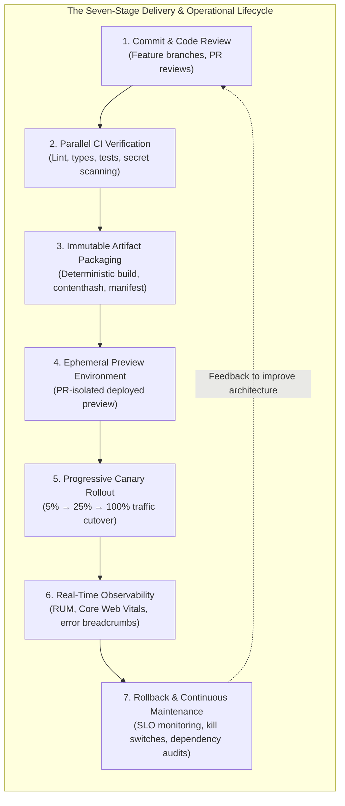
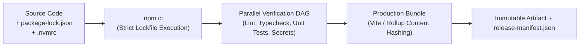
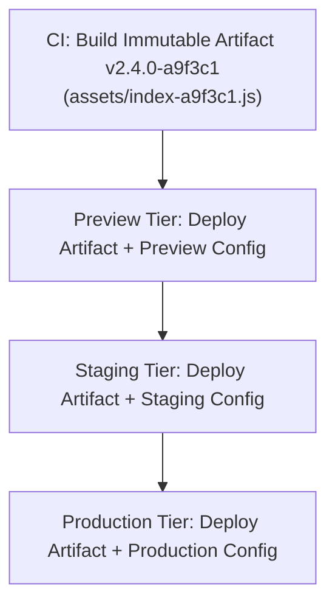
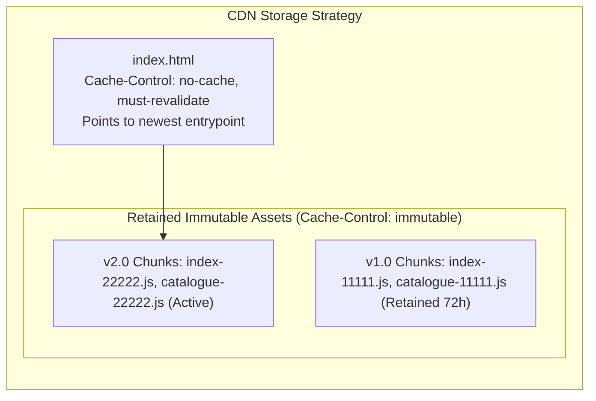
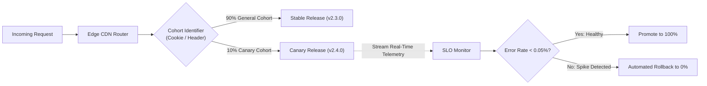
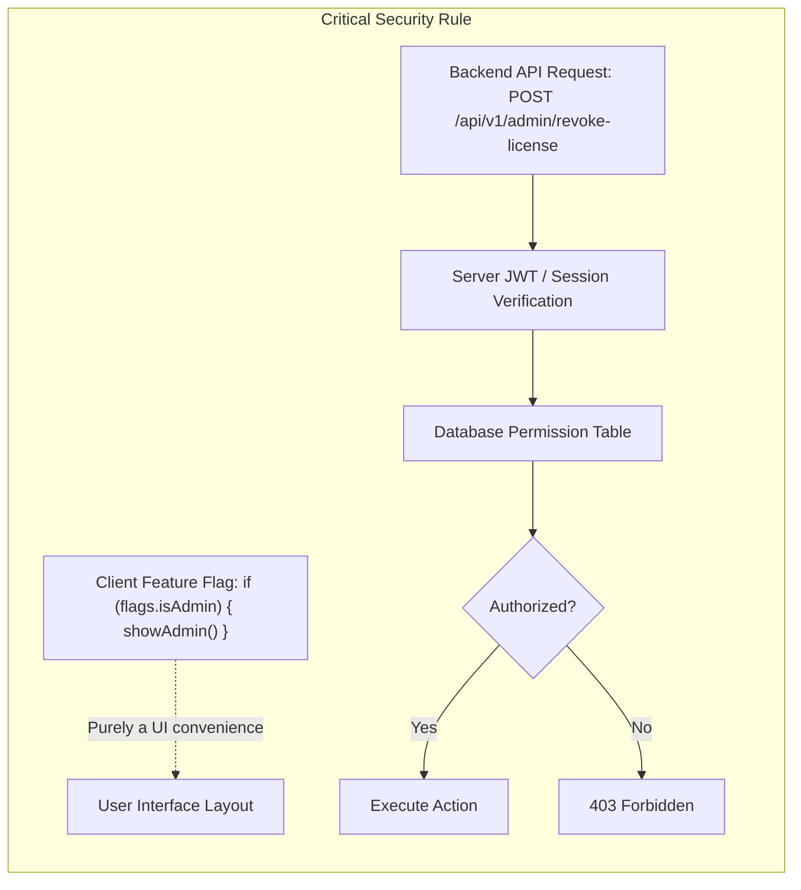
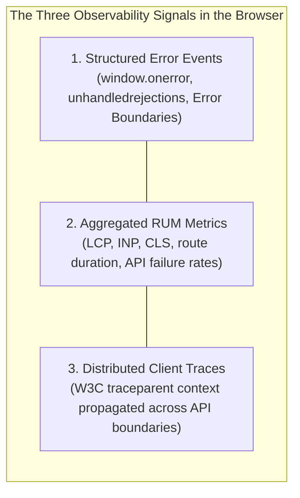
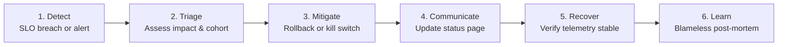
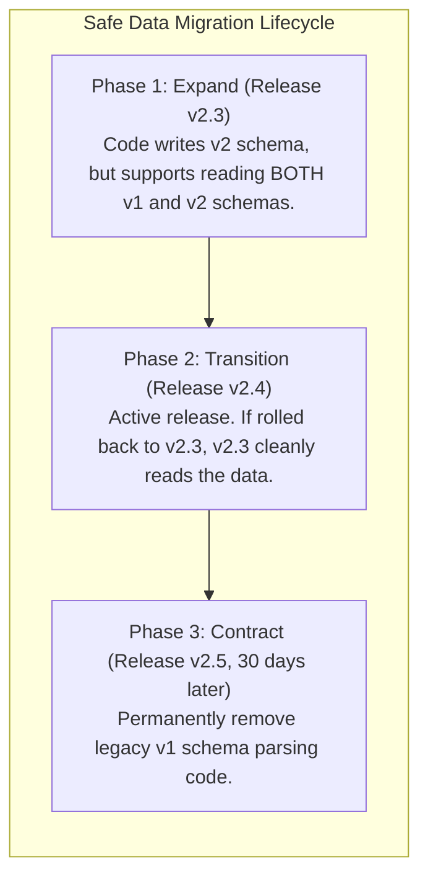
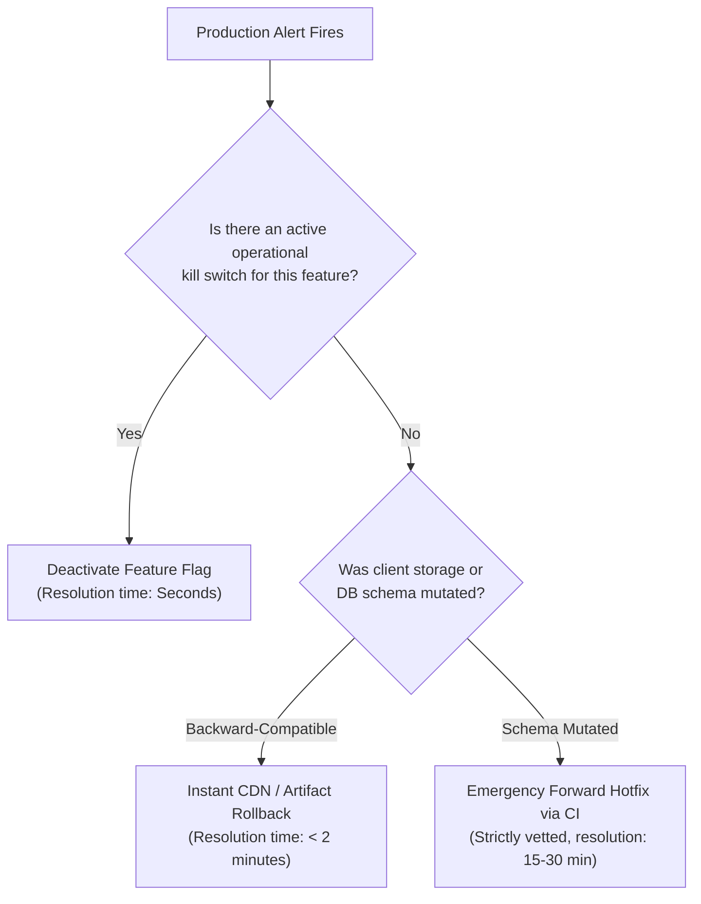

# Continuous Delivery, Observability, and Maintenance

At 4:15 PM on a Thursday, an engineering team supporting an administrative civic portal in Erbil received an urgent bug report: a small rounding defect in a regional tax calculation was preventing citizens from finalizing municipal fee payments. An engineer quickly wrote a one-line fix on their local machine, verified that it passed unit tests locally, and ran `npm run build` on their laptop. Eager to resolve the issue before the end of the business day, they uploaded the compiled `dist/` directory directly to the production cloud storage bucket, overwriting the existing static assets in-place.

Within five minutes, production traffic collapsed into chaos. 

Users who had the portal open in their browser tabs suddenly experienced complete application freezing. When their clients attempted to dynamically lazy-load additional route chunks, the CDN returned `404 Not Found` because the in-place upload had purged the previous build's content-hashed files while users still held the old `index.html`. Users who refreshed their browsers encountered a blank white screen: the hotfix had been built against the engineer's local `.env` file, which inadvertently hardcoded an internal `localhost:8080` API endpoint into the production bundle. To make matters worse, production error logging had been disabled months earlier to "save bandwidth," leaving the on-call team blind to the incoming error storm. And because the previous deployment files had been overwritten rather than versioned, there was no way to roll back.

The team spent the next five hours rebuilding the application from Git history, debugging broken environment variables, and purging global CDN caches while citizens were locked out of government services.

This catastrophic outage illustrates an inescapable reality of modern software engineering:

> **An architecture is incomplete if it only describes how software is written. It must also govern how software is safely built, verified, delivered, observed, rolled back, and maintained.**

Continuous delivery and observability are not administrative chores delegated to an operations team; they are foundational architectural disciplines. This chapter traces the complete lifecycle of a front-end release from commit to production telemetry, establishing the patterns required to ship resilient web applications with speed and confidence.

---

## 17.1 Delivery as an Architectural Discipline

Many engineering organizations treat the boundary between code and production as a series of disconnected steps: developers write code, push to a repository, and hope that automated deployment scripts function correctly. When releases are risky, stressful, and infrequent, teams accumulate massive batches of changes. Large releases dramatically increase the blast radius of every defect, make root-cause analysis nearly impossible, and paralyze development velocity.

In a resilient front-end architecture, **delivery is treated as a continuous operational loop**.



Every stage of this lifecycle answers a distinct architectural question:
- *Verification:* Did this change break any existing functional, security, or performance contracts?
- *Packaging:* Is the resulting artifact strictly identical across all environments, with immutable content hashes?
- *Preview:* Can stakeholders review the real rendered application in an isolated environment before merge?
- *Progressive Rollout:* Can we expose the release to a small fraction of users to verify operational health without endangering the entire user base?
- *Observability:* Does the application emit sufficient telemetry to diagnose unforeseen failures in production?
- *Rollback:* Can we revert to the previous known-good state in under sixty seconds if an unpredicted failure emerges?

---

## 17.2 Continuous Integration & Reproducible Artifacts

Continuous Integration (CI) is the automated process of validating changes against a clean, shared, and standardized environment. A passing test on an engineer's laptop proves only that the code runs on that specific machine with that specific operating system, cache state, and local environment variables. CI establishes an objective, reproducible gate.

### The Foundation of Reproducibility

A build is reproducible if anyone running the build against a specific commit hash produces an identical, bit-for-bit functional artifact. Front-end reproducibility requires three strict mechanisms:

1. **Deterministic Lockfile Installation:** Always use `npm ci` (or `pnpm install --frozen-lockfile` / `yarn --immutable`) in CI pipelines. Never run `npm install`, which allows transitive dependencies to resolve newer minor or patch versions, resulting in subtle non-deterministic build failures.
2. **Pinned Node and Tooling Runtimes:** Pin the exact Node.js runtime version via `.nvmrc` or `.node-version`, and reference that file directly in CI workflow definitions.
3. **Clean Environment Isolation:** Execute builds in isolated, ephemeral containers that do not inherit ambient environment variables or uncommitted local files.



### The Principle: Build Once, Promote Everywhere

One of the most dangerous anti-patterns in web deployment is rebuilding the application bundle for each target environment:

```text
// ANTI-PATTERN: Rebuilding from source for each tier
git checkout main
npm run build --mode=staging    --> Deploy to Staging
npm run build --mode=production --> Deploy to Production
```

Rebuilding from source creates two completely different sets of compiled artifacts. The JavaScript bundles deployed to production will have different chunk splits, different compiler optimizations, and potentially different resolved dependencies than the code tested in staging.

The architectural rule of continuous delivery is absolute:

> **Build the artifact once in CI. Test that exact artifact in staging, and promote that identical artifact to production.**



### Static Secrets Scanning and Variable Scoping

Because front-end code is distributed directly to end-user browsers, any secret baked into client bundles is instantly public. Once an API key or private token is committed and bundled into a client `.js` file, it must be considered permanently compromised.

To guarantee that private credentials never leak:
1. **Enforce Framework Prefix Conventions:** Modern build tools (such as Vite and Next.js) strictly restrict client exposure to variables with explicit prefixes (`VITE_PUBLIC_` or `NEXT_PUBLIC_`). Any variable without this prefix is excluded from client bundles at compile time.
2. **Automate Secret Scanning in CI:** Run automated secret scanners (such as GitLeaks or TruffleHog) on every pull request. These tools evaluate regular expressions and Shannon entropy to catch accidentally committed AWS tokens, private keys, database connection strings, and payment provider credentials before code is merged.

---

## 17.3 Environments, Release Identity, and Source Maps

A production release moves through an explicit hierarchy of environments, each serving a distinct verification objective.

| Environment | Purpose | Access Control | Data Source |
| :--- | :--- | :--- | :--- |
| **Local (Development)** | Rapid iteration, fast Hot Module Replacement (HMR). | Individual Developer | Mock data / MSW / local API |
| **Preview (Ephemeral)** | Isolated validation of a single Pull Request before merge. | Internal Team / Stakeholders | Staging API / Sanitized Read-Only |
| **Staging (Pre-Prod)** | Full multi-service integration and end-to-end testing. | Internal Engineering & QA | Mirrored Pre-Production DB |
| **Production** | Live end-user traffic and telemetry monitoring. | Public / Authenticated Citizens | Canonical Production Systems |

### Embedding Immutable Release Identity

When an unhandled exception occurs in a user's browser, the engineering team must know with absolute certainty which release generated the error. Without embedded release identity, debugging becomes guesswork - especially during rolling deployments when some users run the new release while others still have the previous release cached.

Inject release metadata at build time and expose it as a frozen global object:

```ts
// src/config/release.ts
export interface ReleaseInfo {
  readonly version: string;
  readonly commitSha: string;
  readonly buildTimestamp: string;
  readonly environment: "preview" | "staging" | "production";
}

declare global {
  interface Window {
    __RELEASE_INFO__: ReleaseInfo;
  }
}

export const RELEASE: ReleaseInfo = Object.freeze({
  version: import.meta.env.VITE_APP_VERSION || "v2.4.0",
  commitSha: import.meta.env.VITE_COMMIT_SHA || "unknown",
  buildTimestamp: import.meta.env.VITE_BUILD_TIME || new Date().toISOString(),
  environment: (import.meta.env.MODE as ReleaseInfo["environment"]) || "production",
});

if (typeof window !== "undefined") {
  window.__RELEASE_INFO__ = RELEASE;
}
```

Every outgoing error payload, telemetry beacon, and API request can attach this release metadata, allowing observability tools to correlate exceptions with specific code changes.

### The Source Map Dilemma

Minifying and bundling JavaScript turns clean TypeScript into dense, single-line code (`function a(e,t){return e.d(t)}`). When an error occurs in production, the browser's native stack trace points to `index-a9f3c1.js:1:34812`, which is completely useless for debugging.

Source maps (`.map` files) map minified production code back to the original TypeScript source lines. However, publishing source maps publicly creates a severe security and intellectual property risk: anyone can open Chrome DevTools, inspect the "Sources" tab, and download your entire unminified application source code, comments, and internal architectural structure.

The architectural solution is **Private Source Map Uploads**:
1. Build the production bundle with hidden source maps (`sourcemap: "hidden"`).
2. During the CI release step, upload the generated `.map` files directly to a private, access-controlled error-tracking server (such as Sentry, Datadog, or an internal symbols repository).
3. Delete all `.map` files from the public `dist/` directory before deploying assets to the public CDN.

This architecture ensures that on-call engineers can inspect full, de-minified TypeScript stack traces in their monitoring dashboard, while public web users never have access to the raw source maps.

---

## 17.4 Deployment Topologies & Progressive Delivery

Deploying a front-end application involves distributing static assets (HTML, CSS, JS, images) to a global Content Delivery Network (CDN) edge cache. How you coordinate asset caching and traffic switching dictates whether deployments are seamless or disruptive.

### The Cache Transition Problem

In a single-page application, `index.html` references content-hashed JavaScript files:

```html
<!-- index.html in v1.0 -->
<script type="module" src="/assets/index-11111.js"></script>
```

When you deploy version 2.0, the build generates `assets/index-22222.js` and updates `index.html`. If your deployment pipeline immediately deletes the old `assets/index-11111.js` from the CDN bucket, any user who currently has `index.html` v1.0 open in an active browser tab will crash when navigating to a new route. The browser requests `assets/about-11111.js`, receives an HTTP `404 Not Found`, and halts with an unhandled script load error.

To eliminate this failure mode, follow the **Immutable Asset Retention Rule**:
1. **Never delete old hashed asset chunks during a deployment.** Retain previous asset chunks in cloud storage for at least 72 hours following a release.
2. **Apply Divergent Caching Headers:**
   - **For Content-Hashed Assets (`/assets/*.js`, `/assets/*.css`):** Cache aggressively for one full year (`Cache-Control: public, max-age=31536000, immutable`). These files are cryptographically named; their contents will never change.
   - **For the Root Entrypoint (`index.html`):** Never cache permanently (`Cache-Control: public, max-age=0, must-revalidate` or `no-cache`). This guarantees that every new browser visit requests the latest `index.html` containing the newest asset chunk hashes.



### Progressive Canary Rollouts

Rather than switching 100% of global traffic to a new release simultaneously, high-reliability architectures use **Canary Releases**.

A canary release routes a small, controlled percentage of user traffic (typically 5% to 10%) to the new release while keeping the remaining 90% on the stable version. Modern edge platforms achieve this via edge middleware or cookie-based routing:



During the canary observation window (typically 15 to 30 minutes), observability dashboards monitor Core Web Vitals, unhandled exception rates, and user conversion metrics. If the canary release causes a statistically significant increase in error rates, the edge router automatically aborts the canary, routing 100% of users back to the stable release without human intervention.

### Feature Flags: Operational Controls, Not Authorization

Feature flags decouple **code deployment** from **feature release**. They allow engineers to merge code into the main branch continuously while keeping the user-facing capability inactive until it is ready for release.

Front-end feature flags fall into four distinct categories:
1. **Release Flags:** Temporary flags used to hide incomplete features in production during continuous integration.
2. **Operational Kill Switches:** Standing emergency switches designed to instantly shut down non-critical capabilities (e.g., disabling real-time live chat or complex animated visualizations during high-load traffic surges).
3. **Experiment Flags (A/B Testing):** Dynamic variants allocated to randomized user cohorts to measure business outcomes.
4. **Permission Flags:** Client-side flags that mirror user roles to adapt the UI (e.g., hiding an "Admin Portal" link from standard users).



> [!CAUTION]
> **A client-side feature flag is never an authorization mechanism.** 
> Any client-side flag can be altered by a user in DevTools. If an unauthorized user flips a client flag to `true`, the UI may render administrative buttons, but the backend API must strictly reject every unauthenticated or unauthorized request with `403 Forbidden`. Authorization must always be enforced by the server.

---

## 17.5 Front-End Observability & Telemetry

Traditional server-side monitoring tracks CPU utilization, memory pressure, and HTTP status codes. However, a server dashboard can be completely green while 100% of client users experience a broken interface - for example, if a client JavaScript syntax error halts execution before any network request is dispatched.

**Front-End Observability** is the capability to understand the real state of client applications running across millions of uncontrolled, heterogeneous user devices, operating systems, and network connections.

### The Three Telemetry Signals in the Browser



#### 1. Structured Error Events & Breadcrumbs

An error message alone (`TypeError: Cannot read properties of undefined`) is rarely sufficient to diagnose a production bug. To understand what caused the failure, the telemetry collector must capture **user interaction breadcrumbs**:

```json
// Example of a structured telemetry payload sent to an observability collector
{
  "release": {
    "version": "v2.4.0",
    "commit": "a9f3c1d8",
    "environment": "production"
  },
  "error": {
    "name": "TypeError",
    "message": "Cannot read properties of undefined (reading 'fee')",
    "stack": "TypeError: Cannot read...\n  at calculateTotal (fees.ts:42:15)"
  },
  "context": {
    "url": "/permit/renewal",
    "viewport": "390x844",
    "connection": "4g",
    "deviceMemory": 4
  },
  "breadcrumbs": [
    { "timestamp": 1727166010000, "category": "navigation", "data": { "to": "/permit/renewal" } },
    { "timestamp": 1727166012400, "category": "ui.click", "data": { "target": "button[name='Select Commercial Permit']" } },
    { "timestamp": 1727166014100, "category": "network", "data": { "method": "GET", "url": "/api/v1/tariffs/commercial", "status": 200 } },
    { "timestamp": 1727166015200, "category": "ui.click", "data": { "target": "button[name='Confirm and Pay']" } }
  ]
}
```

With this breadcrumb trail, an engineer immediately sees the exact sequence of actions that triggered the exception: the user navigated to `/permit/renewal`, selected commercial permits, received a 200 response from the tariff API, and clicked "Confirm and Pay," triggering the calculation error on line 42 of `fees.ts`.

#### 2. Real User Monitoring (RUM)

Lab benchmarks (like local Lighthouse audits) run on high-powered developer laptops over fast Wi-Fi. Real User Monitoring captures actual performance experienced by real citizens on varied mobile hardware across Erbil, Sulaymaniyah, and Duhok over congested 3G/4G cellular networks.

Collect Core Web Vitals using the standard `web-vitals` library and beacon them via `navigator.sendBeacon()`, which guarantees transmission even if the user navigates away or closes the browser tab:

```ts
import { onLCP, onINP, onCLS } from "web-vitals";
import { RELEASE } from "./config/release";

function sendVitalMetric(metric: { name: string; value: number; id: string }) {
  const payload = JSON.stringify({
    release: RELEASE,
    metric: metric.name,
    value: metric.value,
    vitalId: metric.id,
    route: window.location.pathname,
  });

  navigator.sendBeacon("/api/v1/telemetry/vitals", payload);
}

onLCP(sendVitalMetric);
onINP(sendVitalMetric);
onCLS(sendVitalMetric);
```

#### 3. Distributed Tracing (`traceparent`)

When a user submits an application and waits three seconds, where was that time spent? Was it client-side layout thrashing, edge network latency, API gateway routing, or a slow database query?

By injecting a standard W3C `traceparent` header into client `fetch` calls, the browser links its client span to the backend microservice traces:

```ts
// Example: Propagating distributed trace headers
const traceId = generateHex(16);
const spanId = generateHex(8);
const traceparent = `00-${traceId}-${spanId}-01`;

fetch("/api/v1/permit/submit", {
  method: "POST",
  headers: {
    "Content-Type": "application/json",
    "traceparent": traceparent,
  },
  body: JSON.stringify(formData),
});
```

The backend logs this `traceparent` across all microservices, allowing engineers to view a unified waterfall timeline showing the exact duration of each hop from browser button click to database transaction.

### Privacy, Data Minimization, and PII Scrubbing

Front-end telemetry must respect strict privacy ethics and data minimization regulations (such as GDPR):
1. **Never record Personally Identifiable Information (PII):** Sanitize and redact form input values before capturing breadcrumbs. Automatically mask credit card numbers, passwords, national identification numbers, and physical addresses.
2. **Scrub URL Query Parameters:** Sensitive authentication tokens and password reset keys are frequently transmitted in URL parameters (`/reset?token=secret123`). Always strip or hash query strings before beaconing URLs to external observability servers.
3. **Obtain Explicit Consent:** Implement an telemetry consent mechanism respecting user preferences and browser `DNT` (Do Not Track) / Global Privacy Control headers.

---

## 17.6 Production Incident Response & Rollback Engineering

When an incident occurs in production, speed of resolution is determined by how well the team has prepared its operational runbook and recovery procedures.



### Rollback is a Safety Feature, Not a Failure

In toxic engineering cultures, rolling back a deployment is viewed as a shameful failure, encouraging developers to attempt frantic, untested "forward hotfixes" directly on production systems. This frequently compounds the incident, introducing secondary outages.

In resilient architectures, **rolling back is a routine, celebrated safety mechanism**:

> **When production health degrades, mitigate the user impact first via rollback. Diagnose the root cause offline in a staging environment.**

### Artifact Rollback vs Data Compatibility

Before executing a rollback, you must understand a critical architectural distinction:

> **Rolling back an application artifact reverts the compiled JavaScript and HTML, but it does NOT revert changes already written to client storage or backend databases.**

Consider this disastrous failure scenario:
1. Version 2.4 changes the client's `localStorage` draft key structure from `{ version: 1, name: "Sara" }` to `{ version: 2, legalName: "Sara" }`.
2. Users open v2.4, and their client drafts are migrated to the v2 schema.
3. A critical bug is discovered in v2.4, and the operations team immediately rolls back to v2.3.
4. Users open the application, now running v2.3. The v2.3 code expects `draft.name`. Finding `undefined`, v2.3 crashes with a fatal JavaScript error! The rollback itself has bricked the application for all users who visited v2.4.

To make rollbacks safe, client-side data persistence must follow the **Expand-and-Contract Migration Pattern**:



By ensuring that the previous release version (v2.3) is forward-compatible with the new data format (v2.4), an artifact rollback can be executed instantly without corrupting user state.

### The Decision: Rollback vs Kill Switch vs Forward Fix

When an alert fires, choose the remediation path based on blast radius and risk:



---

## 17.7 Continuous Maintenance & Technical Debt

Software does not remain stable by being left alone. The external web platform continuously moves forward: browsers deprecate legacy APIs, operating systems update rendering engines, security vulnerabilities are discovered in third-party npm packages, and cloud provider APIs evolve.

Maintenance is an active architectural necessity.

### Dependency Governance Without Panic

Front-end applications often depend on hundreds of third-party npm dependencies. Managing these dependencies requires establishing a structured cadence rather than reacting in panic:

1. **Automate Vulnerability Audits:** Run `npm audit` in CI pipelines. Configure builds to fail only on `high` or `critical` severity CVEs that have reachable execution paths in browser bundles.
2. **Scheduled Dependency Updates:** Use automated dependency management tools (such as Dependabot or Renovate) to generate small, automated weekly pull requests for minor and patch updates. Small, continuous updates prevent the dreaded "annual dependency upgrade" that breaks dozens of systems simultaneously.
3. **Audit Package Licenses and Sizes:** Enforce automated CI gates that reject dependencies with restrictive licenses (such as GPL in proprietary commercial apps) or dependencies that exceed bundle weight budgets (e.g., pulling in a 200 KB utility library for a single helper function).

### Service Worker Maintenance & Emergency Unregistration

Service Workers act as persistent, programmable network proxies running on the user's device. If an engineer deploys a buggy Service Worker with an aggressive caching strategy and an infinite cache expiration header, the client browser may cache the broken application indefinitely, ignoring all future server deployments!

Every front-end architecture employing Service Workers must maintain an **Emergency Unregistration Kill Switch**:

```ts
// public/emergency-sw-reset.js
// If an unrecoverable Service Worker caching bug occurs, deploying this file
// forces all client browsers to unregister all active Service Workers and clear caches.
if ("serviceWorker" in navigator) {
  navigator.serviceWorker.getRegistrations().then((registrations) => {
    for (const registration of registrations) {
      registration.unregister();
    }
  });
}

if ("caches" in window) {
  caches.keys().then((keys) => {
    for (const key of keys) {
      caches.delete(key);
    }
  });
}
```

### The Architectural Debt Register

Technical debt is not bad code; it is an intentional architectural loan taken against future maintenance time to meet a pressing business need.

Every engineering team must maintain a living **Technical Debt Register** that records:
- The component or module name.
- The reason the shortcut was taken.
- The operational risk or performance penalty incurred.
- The cleanup owner and planned repayment milestone.

Allocate an explicit percentage of every engineering sprint (typically 15% to 20%) to debt retirement, dependency upgrades, and operational runbook rehearsal.

---

## 17.8 Chapter Summary & Practical Lab Bridge

Continuous delivery, observability, and maintenance form the operational bridge connecting architectural intent with real-world user satisfaction.

### Key Architectural Takeaways

1. **Build Once, Promote Everywhere:** Never rebuild assets for staging or production. Produce an immutable, content-hashed artifact in CI, and promote that exact artifact across all deployment tiers.
2. **Embed Release Identity:** Inject immutable Git commit metadata and build timestamps into client bundles (`window.__RELEASE_INFO__`) to attribute runtime errors and performance events to specific releases.
3. **Preserve Previous Asset Chunks:** Never overwrite or purge older hashed assets during deployment. Retain them for at least 72 hours to prevent active user sessions from crashing with 404 lazy-loading errors.
4. **Client Observability is Essential:** Server logs cannot observe client rendering crashes or unhandled promise rejections. Collect structured errors, user interaction breadcrumbs, and Core Web Vitals using `navigator.sendBeacon()`, with strict PII redaction.
5. **Rehearse Safe Rollbacks:** Rollback is an essential safety feature. Always design client storage and API contracts using the expand-and-contract pattern to ensure that rolling back the frontend code does not break local data compatibility.

---

### Conceptual Review Questions

1. Why does rebuilding a front-end application from source for each separate environment (staging vs. production) undermine deployment safety?
2. Explain the cache transition problem in single-page applications. How does combining `Cache-Control: no-cache` on `index.html` with `Cache-Control: immutable` on hashed assets solve this issue?
3. Why are public source maps considered a security risk, and what is the recommended architecture for debugging minified production stack traces?
4. Describe the three traditional observability signals (logs, metrics, traces) and how each is adapted to the physical constraints of the browser runtime.
5. What is the fundamental difference between an artifact rollback and data compatibility? How could a naive artifact rollback break an application for users who have local drafts saved in `localStorage`?
6. Why must client-side feature flags never be used to enforce security permissions or authorization?

---

### Practical Lab Bridge

In the companion laboratory exercise, **[Practical 17: Delivery, Observability, and Rollback Loop]()**, you will put these production concepts into practice. You will generate an immutable, content-hashed release artifact with a build manifest, implement an automated CI secret scanning and bundle budget script, construct a zero-dependency client telemetry collector with PII masking, and rehearse an active production failure and instant rollback scenario. Before deploying, cross-reference your configuration against **[Appendix C: Front-End Production Deployment Checklist]()**.
