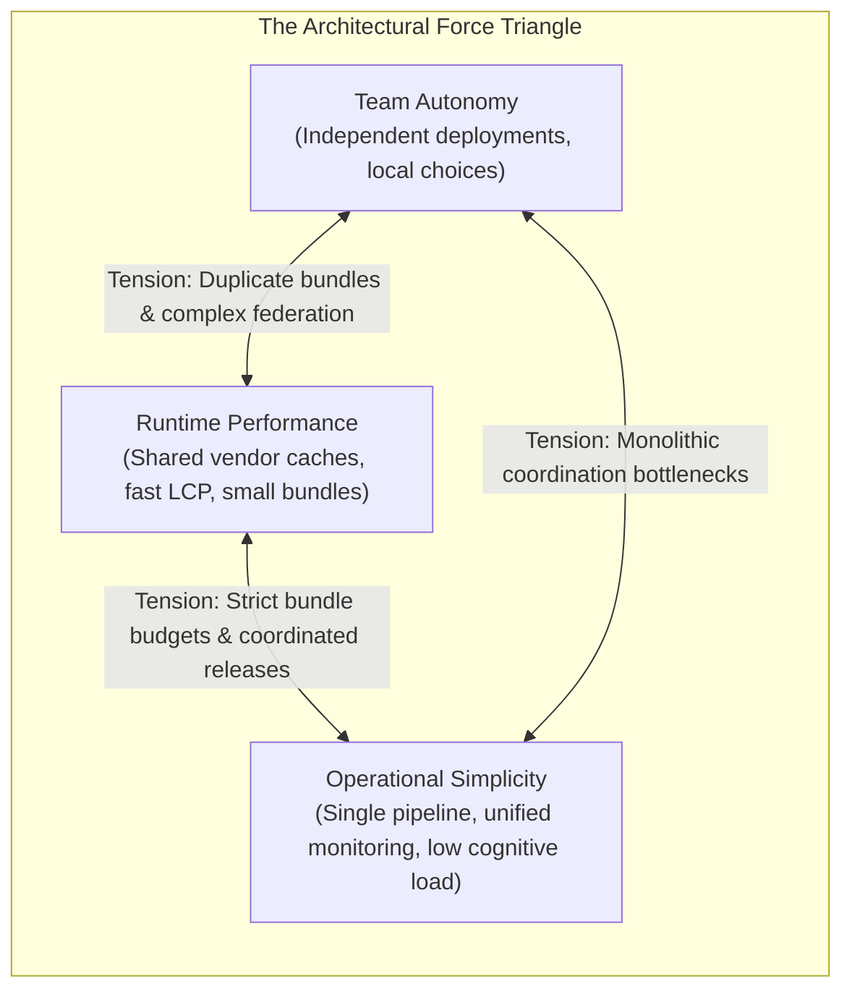
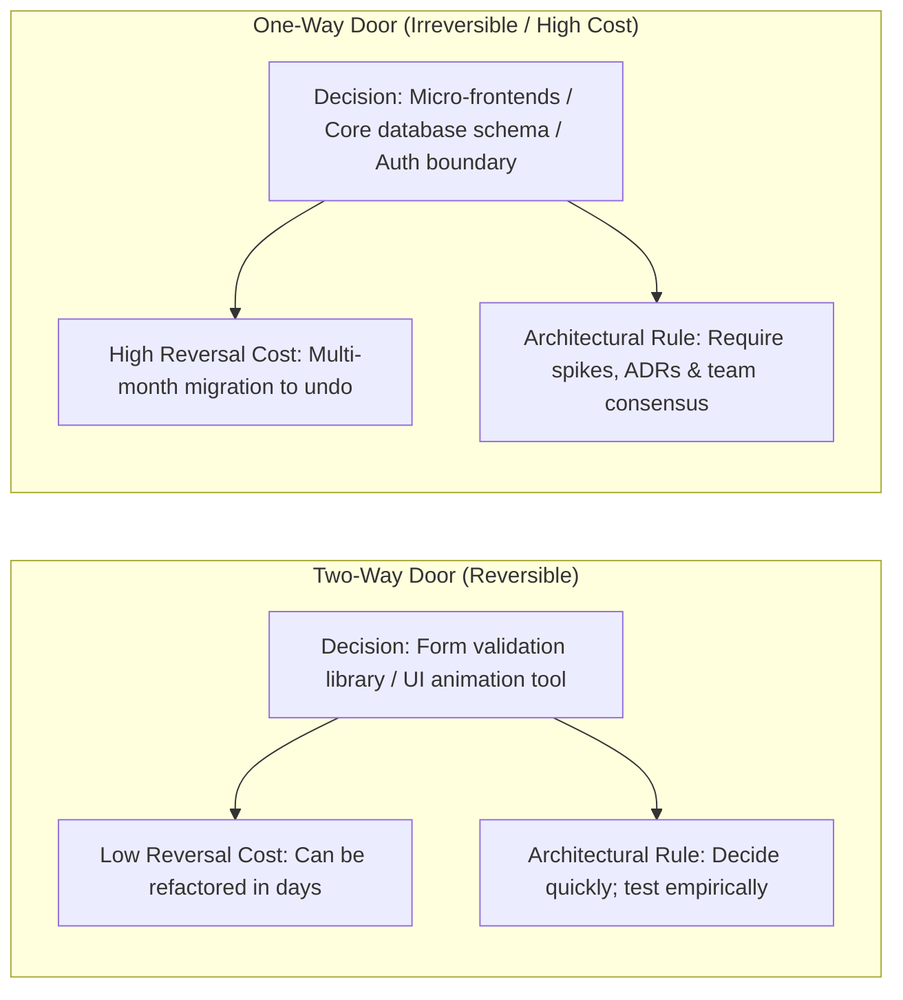
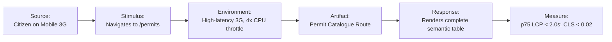
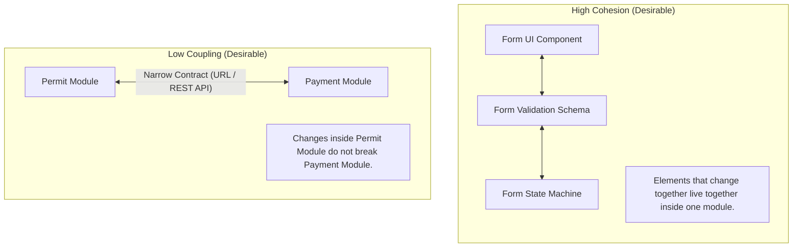
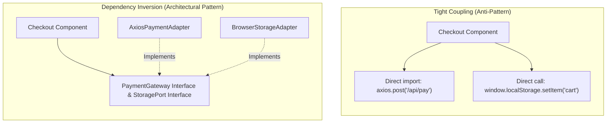
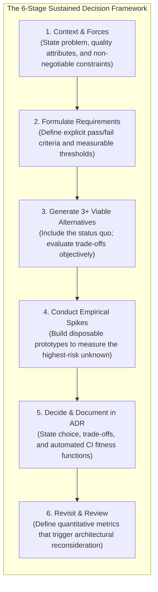
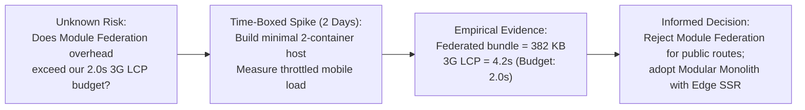
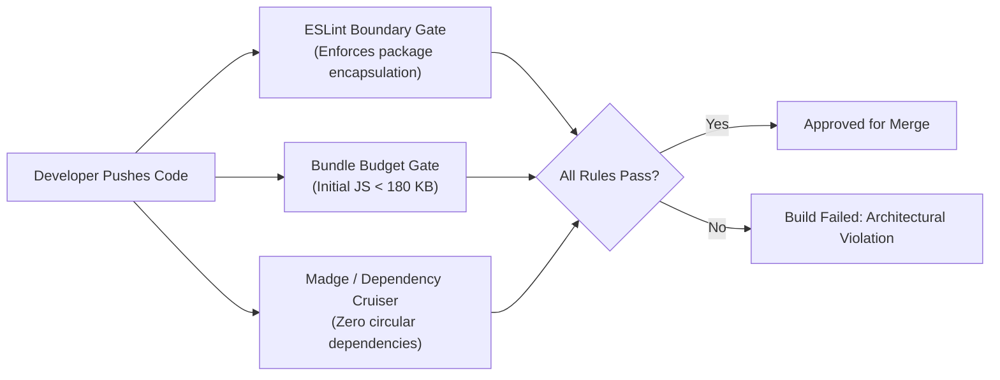
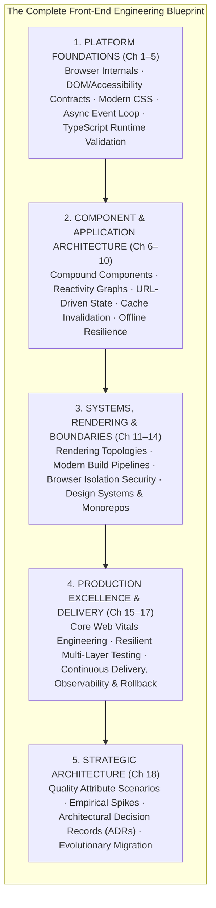

# Front-End Architecture & Technical Decision-Making

In a conference room in Erbil, four engineering team leads sat around a whiteboard, deadlocked in an intense debate over the technical direction of the Kurdistan Civic Services Platform.

The project was ambitious: consolidate municipal permit applications, vehicle registration, public clinic appointments, and business licensing into a single digital gateway. The business stakeholders had established aggressive requirements: the portal must launch within six months, must be fully crawlable by search engines for public legal circulars, and must provide sub-two-second load times on entry-tier mobile smartphones over congested 3G/4G cellular networks across the Kurdistan Region. Furthermore, regional legislation mandated strict compliance with WCAG 2.1 AA accessibility standards.

Each engineering lead championed a radically different technical solution based on their past experiences:
- The Transport squad lead demanded **Micro-Frontends with Module Federation**, arguing that their team needed absolute independence to deploy updates daily without coordinating with the other three teams.
- The Health squad lead argued for a **Pure Client-Side Single-Page Application (CSR)** with heavy offline caching, pointing out that clinic doctors often worked in rural areas with intermittent connectivity.
- The Commerce squad lead insisted on an **Edge Server-Side Rendered (SSR) Framework**, emphasizing that search engine indexing of official commercial gazettes was legally required and that mobile users on 3G connections could not afford to download megabytes of JavaScript.
- The Platform lead warned that adopting micro-frontends would introduce staggering operational complexity, duplicate vendor dependencies across bundles, and require managing complex distributed versioning schemes that a team of twenty engineers could not sustainably maintain.

Every lead had valid arguments. Every proposal solved an important problem. Yet, adopting all of them simultaneously was impossible.

This conference room debate represents the fundamental challenge of software architecture. Throughout the preceding seventeen chapters, we explored the physical mechanisms of the modern web: the browser rendering pipeline, semantic HTML and accessibility contracts, CSS layout engines, asynchronous event loops, TypeScript runtime validation, component design patterns, reactivity graphs, state and routing topologies, HTTP cache policies, offline outboxes, streaming rendering, module bundlers, browser isolation security, design systems, Core Web Vitals, automated test suites, and continuous delivery pipelines.

The final question of front-end engineering is not what tools exist. The final question is:

> **How do we make disciplined, defensible architectural decisions under competing constraints—and how do we ensure our systems remain resilient as requirements, organizations, and technologies inevitably change?**

This chapter establishes an architectural framework for front-end engineering. You will learn how to analyze trade-offs, formulate measurable quality attribute scenarios, conduct focused empirical spikes, document choices using Architectural Decision Records (ADRs), enforce architectural properties with automated fitness functions, and design systems with clear, reversible boundaries.

---

## 18.1 Architecture as the Management of Competing Constraints

In software engineering lore, "architecture" is frequently confused with technology selection: *"Our architecture is React, Next.js, Tailwind, and GraphQL."*

This is an error. Libraries, frameworks, and deployment platforms are downstream implementation mechanisms. Martin Fowler famously described software architecture as:

> **"The decisions that are hard to change."**

If you can change a styling utility library in two days with a search-and-replace script, that choice is not an architectural decision. But if choosing a distributed micro-frontend topology requires rewriting your deployment pipelines, refactoring your authentication session boundary, fragmenting your design system tokens, and restructuring your engineering teams, that is a profound architectural commitment.

### The Impossibility of Universal Optimization

Junior engineers often believe that an ideal architecture satisfies all desires simultaneously: maximum team autonomy, instant sub-second performance, zero operational complexity, complete offline resilience, and total technology freedom.

Senior architects recognize that **software architecture is the deliberate management of competing forces**:



Every architectural decision incurs a cost:
- If you maximize **team autonomy** by adopting independent micro-frontends, you pay in **runtime performance** (duplicate framework runtimes downloaded over mobile networks) and **operational complexity** (managing distributed versioning and host shell coordination).
- If you maximize **runtime performance** by using static HTML generation and aggressive server caching, you pay in **data freshness** and **client interactivity**.
- If you maximize **operational simplicity** by building a single modular monolith, you pay in **deployment coordination** as team size scales.

The goal of architecture is not to eliminate trade-offs; it is to make trade-offs **explicit, intentional, and aligned with product survival**.

### Essential vs. Accidental Complexity

Fred Brooks, in his seminal essay *No Silver Bullet*, distinguished between two types of complexity:
- **Essential Complexity:** The inherent difficulty of the business domain itself. For example, calculating regional municipal taxes across commercial exemptions, disability waivers, and late payment penalties is essential complexity. No framework can eliminate it.
- **Accidental Complexity:** Complexity introduced entirely by our chosen technical solutions. For example, if a team introduces distributed Webpack Module Federation, custom Web Worker state sync protocols, and three separate state management libraries to build a basic twenty-page form portal, all of that operational friction is self-inflicted accidental complexity.

The highest virtue of architectural design is **minimizing accidental complexity while cleanly isolating essential complexity**.

### Two-Way Doors vs. One-Way Doors

Jeff Bezos popularized a vital framework for institutional decision-making: categorizing decisions into **One-Way Doors** and **Two-Way Doors**.



In front-end engineering:
- **Two-Way Doors:** Choosing a local state management helper (e.g., Zustand vs. Nanostores), selecting a date formatting utility, or adopting a CSS animation utility. If the choice proves suboptimal, it can be migrated incrementally with minimal risk. These decisions should be made quickly by individual feature squads without administrative friction.
- **One-Way Doors:** Adopting a micro-frontend architecture, selecting an incompatible global rendering topology (e.g. static export vs. edge SSR), altering the user authentication session boundary, or breaking public design token schemas. Walking through a one-way door requires multi-month commitments that are excruciatingly difficult to reverse. These decisions demand rigorous trade-off analysis, formal ADRs, and empirical benchmarking spikes.

---

## 18.2 Quality Attributes & Constraints

When stakeholders define product goals, they speak in vague, unmeasurable adjectives: *"The portal must be fast, scalable, modern, and clean."*

These adjectives are architecturally useless:
- What does *"fast"* mean? Does it mean 60 frames-per-second animation smoothness on a high-end iPhone, or does it mean Largest Contentful Paint under 2.0 seconds on an entry-tier Android phone over 3G?
- What does *"scalable"* mean? Does it mean handling 50,000 concurrent citizen visits during tax season, or does it mean accommodating twenty new software developers joining the team next quarter?

To make sound architectural decisions, engineers must translate vague desires into **measurable Quality Attribute Scenarios (QAS)**.

### Structuring a Quality Attribute Scenario

A formal Quality Attribute Scenario defines six concrete elements:
1. **Source of Stimulus:** Who or what generates the stimulus (e.g., a citizen on a mobile device, a search engine crawler, an internal developer).
2. **Stimulus:** The condition that arrives (e.g., requesting the homepage, submitting a form, pushing a pull request).
3. **Environment:** The operating conditions (e.g., peak tax season traffic, poor 3G network connectivity, CI server under load).
4. **Artifact:** The specific subsystem stimulated (e.g., the permit catalogue route, the authentication boundary, the monorepo build pipeline).
5. **Response:** The required observable behavior (e.g., renders semantic HTML, returns cached data, builds bundle).
6. **Response Measure:** The quantifiable, testable threshold (e.g., p75 LCP < 1.8s, zero unhandled errors, build finishes in < 5 minutes).



### The Hierarchy of Constraints

While quality attributes describe desired performance, **constraints** define the non-negotiable boundaries within which the system must exist. Constraints cannot be bargained away:

1. **Organizational Constraints:** The size of the engineering staff, team geographic distribution, existing skill sets, and delivery deadlines. If your organization has six developers who know TypeScript and Vue, mandating a complex micro-frontend topology requiring specialized Webpack federation tooling is an architectural failure.
2. **Physical & Environmental Constraints:** The physical hardware and network conditions of the end users. In the Kurdistan Region, high mobile data latency and entry-tier smartphone hardware are physical constraints that directly dictate bundle size ceilings.
3. **Regulatory & Legal Constraints:** Legal mandates such as WCAG 2.1 AA accessibility compliance, data residency laws requiring citizen data to remain within sovereign national borders, and public disclosure requirements for municipal documents.
4. **Economic & Fiscal Constraints:** The monthly operational cloud compute budget. An edge serverless architecture that costs $20,000 per month in edge invocation fees is unviable if the agency's operational budget is $2,000 per month.

### Conway's Law in Front-End Architecture

In 1967, computer programmer Melvin Conway made a profound observation that has become an axiom of system design:

> **"Organizations which design systems are constrained to produce designs which are copies of the communication structures of these organizations."**

If your organization has three siloed, independent teams that rarely communicate, your software architecture will inevitably fragment into three separate systems. If you attempt to force three siloed teams to work inside a tightly coupled single-file codebase without clear boundaries, communication gridlock will bring development velocity to a standstill.

Conversely, adopting the **Inverse Conway Maneuver** means deliberately structuring engineering teams to reflect the desired software architecture: organizing autonomous cross-functional squads around stable business domains (e.g., Team Transport, Team Health) with clearly defined, contract-governed package boundaries.

---

## 18.3 Architectural Boundaries, Cohesion, and Coupling

The core activity of software architecture is drawing **boundaries**. A good boundary acts as a firewall: it allows software on one side to change, evolve, and refactor without forcing changes on the other side.

### Cohesion vs. Coupling

Two fundamental concepts govern boundary quality:



- **Cohesion** measures how strongly related the internal elements of a single module are. In front-end architecture, **high cohesion** means that everything required to understand, render, and test a specific user feature (its UI components, local state reducers, validation schemas, and unit tests) lives together. Splitting a feature by technical type—putting all components in `/components`, all reducers in `/reducers`, and all schemas in `/schemas` across the entire project—creates low cohesion and high maintenance friction.
- **Coupling** measures the degree of direct dependency between separate modules. **Tight coupling** occurs when Module A reaches into Module B's internal implementation details (e.g., inspecting private component state, importing deeply nested un-exported files, or relying on shared mutable global variables). When modules are tightly coupled, modifying Module A causes unexpected regressions in Module B.

### The Dependency Inversion Principle in Front-End Code

Robert C. Martin's Dependency Inversion Principle dictates:

> **High-level policies must not depend on low-level details. Both must depend on abstractions.**

In front-end architecture, your core business rules and user workflows (high-level policy) must not depend directly on specific third-party libraries, browser storage APIs, or HTTP client implementations (low-level details).



By decoupling your component from direct `localStorage` or `axios` calls through a domain interface, you gain two massive advantages:
1. **Testability:** You can test the checkout workflow in complete isolation by passing a mock storage adapter without needing `jsdom` or browser shims.
2. **Reversibility:** If the organization switches from REST to GraphQL, or replaces `localStorage` with an encrypted IndexedDB vault, only the adapter changes; the checkout component remains completely untouched.

### Calculating Blast Radius

Before approving an architectural change, ask: **What is the blast radius if this module fails or changes?**

- A defect in a localized `PermitFilterDropdown` component has a **narrow blast radius**: only citizens filtering permits on that specific page are affected.
- A defect in the global `AuthenticationSessionProvider` or a shared design system button primitive has a **catastrophic blast radius**: every single route, page, and feature across the entire platform collapses simultaneously.

Architectural effort must be distributed proportionally to blast radius. High-blast-radius foundational primitives require strict contract testing, formal change governance, and automated fitness functions; low-blast-radius feature components can be iterated upon rapidly with minimal oversight.

---

## 18.4 The Sustained Decision Process: Context to Options

Making an architectural decision is not an emotional debate or an exercise in executive decree; it is a structured, repeatable engineering process.



### Avoiding "Resume-Driven Development"

The most prevalent cognitive bias in software architecture is **Resume-Driven Development (RDD)**: selecting a technology not because it solves the product's actual problem, but because an engineer wants to gain experience with a trendy tool to enhance their marketability.

To protect an organization against RDD, enforce the **Rule of Three Viable Alternatives**:
- Never present a decision as a binary choice (*"Should we adopt Micro-Frontends or not?"*).
- Always formulate and objectively evaluate at least three genuinely viable options, including the **status quo** or the **smallest coherent solution**.
- If a proposal cannot articulate the negative consequences and trade-offs of the favored option, the analysis is incomplete. Every legitimate architecture has disadvantages; if you cannot see them, you do not understand the technology.

### The Build vs. Buy vs. Adopt Framework

Before writing custom infrastructure, evaluate where your solution belongs on the Build-Buy-Adopt spectrum:

| Strategy | When to Use | Front-End Example |
| :--- | :--- | :--- |
| **Build (Custom)** | Core strategic domain capabilities that provide unique competitive differentiation. | A municipal permit workflow engine; a proprietary Kurdish OCR visualization interface. |
| **Adopt (Open Source)** | Standard industry utilities where mature, active open-source solutions exist with acceptable governance. | Vitest for test execution; Zod for runtime schema parsing; Tailwind/CSS Modules for styling. |
| **Buy (SaaS / Commercial)** | Commodity infrastructure that is expensive to build, secure, and maintain in-house. | Managed error telemetry (Sentry); cloud browser testing grids (BrowserStack); identity providers (Auth0/OIDC). |

---

## 18.5 Investigative Spikes & Empirical Evidence

When evaluating competing architectural options, teams frequently find themselves trapped in circular arguments driven by opinion: *"Framework A is faster!"* versus *"Framework B scales better!"*

The cure for architectural paralysis is **empirical evidence gathered through an investigative spike**.

### The Anatomy of an Architectural Spike

A technical spike is a small, time-boxed, disposable investigation designed to answer a single specific technical question:
- A spike is **not** a production prototype.
- A spike does **not** require clean code, documentation, or 100% test coverage.
- The sole output of a spike is **data that eliminates an unknown**. Once the question is answered, the spike code is discarded.



### Benchmarking Under Real Operating Conditions

When benchmarking front-end spikes, synthetic developer environments produce dangerously misleading results. An un-throttled desktop browser running on a multi-core M3 processor over fiber-optic Wi-Fi will execute even the most bloated, un-optimized JavaScript bundle in under 150 milliseconds.

To produce valid architectural evidence, always benchmark under **representative user constraints**:
1. **CPU Throttling:** Apply 4x or 6x CPU throttling in Chrome DevTools or Playwright to emulate mid-tier mobile system-on-chip (SoC) performance.
2. **Network Throttling:** Enforce Fast 3G or Slow 4G network profiles (e.g., 1.6 Mbps download, 750 Kbps upload, 150ms round-trip latency).
3. **Cold Cache Verification:** Benchmark the critical path with an empty browser cache to observe first-time citizen experience.

---

## 18.6 Architectural Decision Records (ADRs) & Fitness Functions

Decisions that exist only in Slack threads or meeting notes are quickly forgotten. Six months later, new engineers join the team and wonder: *"Why did they choose this strange approach instead of the standard pattern?"* Lacking context, they attempt to refactor the architecture, inadvertently re-introducing the very bugs and constraints that the original team wrestled with.

An **Architectural Decision Record (ADR)** is a lightweight, version-controlled markdown document that captures a single significant architectural decision, its context, and its accepted consequences.

### The Canonical ADR Template

Every ADR in the repository should follow a standardized structure:

```markdown
# ADR-NNN: [Descriptive Title of the Decision]

- **Status:** [Proposed | Accepted | Superseded | Deprecated | Rejected]
- **Date:** [YYYY-MM-DD]
- **Deciders:** [List of participating leads and engineers]
- **Technical Story:** [Link to issue, ticket, or initiative]

## Context & Problem Statement
What is the specific business or technical problem we are facing? What forces (functional requirements, quality attributes, and constraints) make this decision necessary?

## Decision Drivers
- [Driver 1: e.g., p75 Mobile LCP must be under 2.0s over 3G networks]
- [Driver 2: e.g., WCAG 2.1 AA accessibility compliance across all forms]
- [Driver 3: e.g., Independent development velocity for 4 squads]

## Considered Options
- **Option 1:** [Candidate A]
- **Option 2:** [Candidate B]
- **Option 3:** [Candidate C]

## Decision Outcome
Chosen Option: **[Option X]**, because [justification anchored in forces and spike evidence].

### Positive Consequences
- [Positive consequence 1]
- [Positive consequence 2]

### Negative Consequences & Trade-offs
- [Accepted cost or limitation 1]
- [Accepted cost or limitation 2]

## Architecture Fitness Functions (Automated Guardrails)
How will this decision be enforced automatically in CI?
1. [Fitness Function 1: e.g. ESLint boundary rule preventing circular package imports]
2. [Fitness Function 2: e.g. Bundle size budget gate failing builds over 180 KB]

## Reversal Plan & Review Triggers
Under what exact observable conditions or metrics will this decision be reopened and reviewed?
```

### Automated Architecture Fitness Functions

Documenting a decision in an ADR is necessary, but human vigilance alone cannot protect an architecture over years of development. Developers under deadline pressure will inevitably take shortcuts—importing internal code across package boundaries or adding heavy dependencies that violate bundle budgets.

An **Architectural Fitness Function** is an automated check in the CI pipeline that continuously verifies that code conforms to architectural constraints:



Examples of automated front-end fitness functions:
1. **Dependency Boundary Enforcement:** Using `@nx/enforce-module-boundaries` or ESLint `no-restricted-imports` to strictly forbid feature packages (`@civic/transport`) from importing private internals of other feature packages (`@civic/health`).
2. **Bundle Budget Thresholds:** Using `@size-limit/preset-app` to automatically fail pull requests if an initial route chunk exceeds 180 KB uncompressed.
3. **Circular Dependency Detection:** Using tools like `madge` or `dependency-cruiser` in CI to detect and block circular dependency loops before code can be merged.

---

## 18.7 Reversibility, Migration Paths, and Evolution

The ultimate test of an architecture is not how pristine it appears on launch day, but how gracefully it evolves over five years of changing requirements.

### The Fallacy of the "Great Rewrite"

When an aging codebase accumulates technical debt, engineers often lobby for a total rewrite: *"This legacy application is unmaintainable. If we throw it away and rebuild it from scratch with modern tools, everything will be clean."*

In practice, full rewrites are catastrophic traps:
- The legacy system embodies years of bug fixes, edge-case handling, and subtle domain requirements that are undocumented and invisible to the rewrite team.
- While the team spends eighteen months building the replacement, the business cannot release new features on the old platform, paralyzing company growth.
- By the time the rewrite launches, the "modern" tools chosen at its inception are already outdated, and the team runs out of time, shipping an incomplete system with more bugs than the legacy platform.

### The Strangler Fig Pattern

Resilient architectures evolve through incremental replacement using the **Strangler Fig Pattern** (named after the Australian fig trees that gradually grow around an existing tree until they replace it):

```mermaid
flowchart LR
    User["Incoming Request"] --> Edge["Edge CDN / Reverse Proxy"]
    Edge --> RouteCheck{"Route Match?"}
    RouteCheck -->|/legacy-portal/*| Legacy["Legacy Monolith (PHP / ASP.NET)"]
    RouteCheck -->|/permits/* (Migrated)| Modern["Modern Front-End (Edge SSR / Vite)"]
```

1. Deploy an edge reverse proxy (or CDN router) in front of the application.
2. Route 100% of traffic to the legacy platform by default.
3. Identify a single, high-value, bounded domain route (e.g., `/permits/renew`).
4. Rebuild *only that specific route* using the modern architecture.
5. Update the edge proxy routing rule to direct `/permits/renew` to the modern application while all other routes continue hitting the legacy backend.
6. Repeat route by route over eighteen months. The legacy application shrinks continuously until it can be decommissioned safely with zero downtime.

---

## 18.8 Capstone Synthesis: The Complete Front-End Blueprint

Over the eighteen chapters of this curriculum, we examined the entire stack of modern front-end web engineering. We can now synthesize these concepts into a single, cohesive architectural mental model:



### The Seven Axioms of Front-End Engineering

1. **The Web Platform is Primary:** Frameworks rise and fall; the web platform remains permanent. Anchor your systems in standard platform primitives: semantic HTML, ARIA accessibility contracts, modern CSS layout, native asynchronous event scheduling, and standard HTTP transport mechanisms.
2. **Accessibility is Non-Negotiable:** An application that is inaccessible to keyboard and screen-reader users is broken software. Build accessibility into the foundation of your design tokens and component contracts; never attempt to retrofit accessibility as an afterthought.
3. **State Demands Clear Ownership:** Distinguish between local transient state, URL-synchronized query parameters, server cache mirrors, and persistent device storage. Assign a single owner to every piece of state.
4. **Network Boundaries Require Defense:** Treat every network boundary as untrusted. Validate all incoming and outgoing data using runtime schemas (Zod). Intercept networks at the transport boundary using Mock Service Worker (MSW) in automated tests.
5. **Optimize for the p75 User:** Test under realistic conditions: entry-tier mobile hardware, 4x CPU throttling, and high-latency cellular connections. Eliminate main-thread long tasks, reserve layout dimensions to prevent CLS, and prioritize critical LCP paths.
6. **Delivery is Part of Architecture:** Build immutable, content-hashed artifacts once and promote them across all tiers. Instrument client-side telemetry with PII masking, monitor Core Web Vitals in real-time, and always maintain an automated, rehearsed rollback path.
7. **Decide from Evidence, Not Fashion:** Structure technical choices around measurable quality attributes and non-negotiable constraints. Conduct empirical spikes to eliminate unknowns, document trade-offs in version-controlled ADRs, and automate guardrails with fitness functions.

---

### Conceptual Review Questions

1. Why is software architecture better defined as "the decisions that are hard to change" rather than simply the list of frameworks and libraries in `package.json`?
2. Explain the difference between Essential Complexity and Accidental Complexity. Provide an example of how choosing an inappropriate front-end technology can introduce massive accidental complexity.
3. What is the fundamental difference between a Two-Way Door decision and a One-Way Door decision? How should an engineering team's review process differ between the two?
4. How does Conway's Law influence front-end code organization? What is the Inverse Conway Maneuver, and how can it be used when designing front-end monorepos?
5. Describe the structure of a Quality Attribute Scenario. Why is a measurable scenario superior to stating that a system must be "fast and responsive"?
6. What is the primary purpose of an Architectural Fitness Function, and how does it prevent architectural drift over time?

---

### Capstone Practical Lab Bridge

In the final laboratory exercise, **[Practical 18: Make and Defend an Architecture Decision]()**, you will serve as the lead architect for the Unified Regional Civic Services Platform. You will formulate three competing candidate architectures, conduct an empirical technical spike comparing bundle weight and throttled LCP performance, draft a comprehensive Architectural Decision Record (ADR-018) with automated CI fitness functions, and establish a quantitative reversal plan. 

Before finalizing your architecture, review your design against the complete synthesis in **[Appendix A: Architectural Rosetta Stone]()**, **[Appendix B: Modern Browser APIs Reference]()**, and **[Appendix C: Front-End Production Deployment Checklist]()**.
