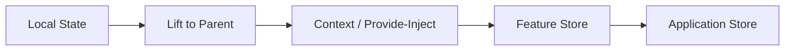
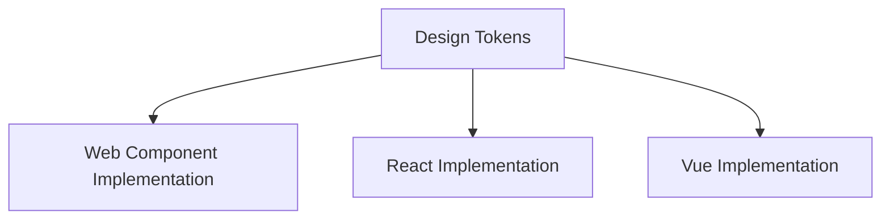
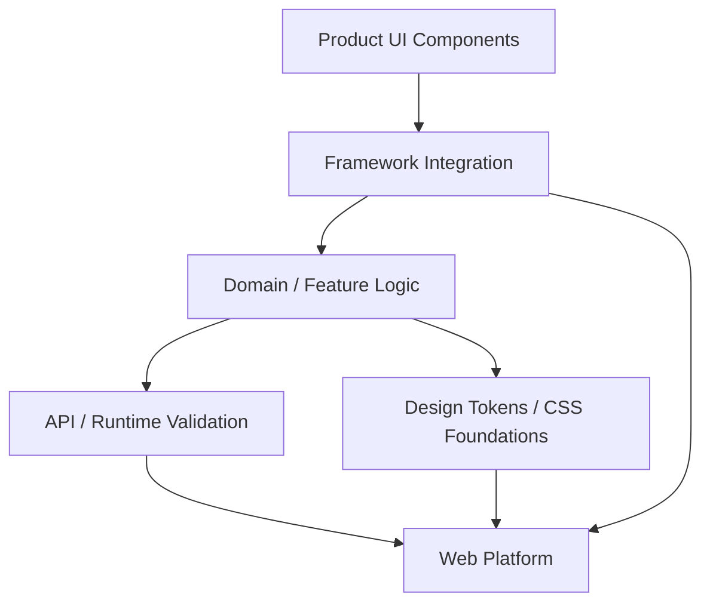
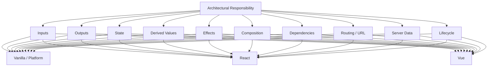

# Appendix A — Front-End Architectural Rosetta Stone

## Vanilla JavaScript, React, and Vue Compared by Architectural Concept

This appendix is a translation guide.

Its purpose is not to teach three separate technologies.

Instead, it takes the architectural ideas used throughout this book and shows how the **same responsibility** is commonly expressed in:

- browser-platform / Vanilla JavaScript;
- React;
- Vue.

The key word is **responsibility**.

The implementations are not identical.

For example:

- React primarily expresses UI as repeated render calculations followed by reconciliation and commit;
- Vue tracks reactive dependencies and updates affected rendering/effects;
- browser-platform JavaScript gives you lower-level DOM, events, classes, modules, Custom Elements, and Web APIs from which you build your own update model.

Therefore, this appendix should not be read as:

```text
React API X
=
Vue API Y
=
Vanilla API Z
```

It should be read as:

> **If I understand the architectural responsibility, what is the closest normal way to express it in each environment?**

That makes the appendix useful when:

- moving between React and Vue;
- reading an unfamiliar codebase;
- deciding whether a framework abstraction is actually necessary;
- translating a design pattern without copying framework-specific syntax;
- teaching frontend architecture independently of one library.

---

# 1. Quick Rosetta Stone

| Architectural responsibility | Browser / Vanilla JavaScript | React | Vue |
|---|---|---|---|
| UI unit | function/class/Custom Element/module | component | component |
| External input | function args, properties, attributes | props | props |
| Output to parent | callback, DOM `CustomEvent` | callback prop | emitted component event |
| Nested UI composition | DOM nodes, callbacks, templates | `children` / render props | slots / scoped slots |
| Local state | variables/objects + explicit update/render logic | `useState`, `useReducer` | `ref`, `reactive` |
| Derived value | function/getter | calculate during render, optionally `useMemo` | `computed` |
| Reaction to external system | event/subscription/lifecycle code | `useEffect` | `watch`, `watchEffect`, lifecycle hooks |
| Direct DOM reference | DOM query/reference | `useRef` | template ref |
| Deep dependency sharing | module/service/object reference | Context | `provide` / `inject` |
| Reusable stateful behavior | function/class/module | custom Hook | composable |
| Conditional rendering | DOM creation/removal | JavaScript condition in JSX | `v-if`, `v-show` |
| List rendering | loops + DOM creation | `map()` + `key` | `v-for` + `:key` |
| Controlled input | assign `value` + handle input event | `value` + `onChange` | `v-model` or `:value` + `@input` |
| Uncontrolled input | browser owns current value | `defaultValue` + ref/FormData | native DOM/form behavior or template ref |
| Lifecycle setup | explicit initialization | Effect/lifecycle abstraction | lifecycle hooks |
| Lifecycle cleanup | remove listener/cancel/close | Effect cleanup | `onUnmounted`, watcher cleanup |
| DOM event | `addEventListener` | JSX event prop | `v-on` / `@event` |
| Shared state | shared object/module/custom store | lift state / Context / store | lift state / provide-inject / store |
| URL state | `URL`, `URLSearchParams`, History API | router/framework APIs over URL/history | Vue Router APIs over URL/history |
| Async module loading | `import()` | `import()`, framework lazy APIs | `import()`, async component/router APIs |
| Network request | `fetch()` | `fetch()` / framework/data library | `fetch()` / framework/data library |
| Escape hatch to platform | already at platform level | refs, Effects, DOM APIs | template refs, lifecycle/watchers, DOM APIs |

The table is intentionally compact.

The rest of this appendix explains the important differences behind it.

---

# 2. Component: What Is the Unit of UI?

## Architectural responsibility

A component should own a coherent piece of interface responsibility.

It may define:

- structure;
- inputs;
- output events;
- local state;
- behavior;
- lifecycle.

The architectural question is:

> What belongs together, and what deserves its own boundary?

The answer should come before framework syntax.

---

## Browser / Vanilla JavaScript

There is no single mandatory component model.

A component can be represented by:

- a function returning DOM;
- a class;
- a factory;
- a Custom Element;
- a module that mounts/unmounts a region.

A simple function-based component:

```js
export function createStatusBadge(
  {
    label,
    status
  }
) {
  const element =
    document.createElement(
      "span"
    );

  element.className =
    `status-badge status-${status}`;

  element.textContent =
    label;

  return element;
}
```

Use:

```js
const badge =
  createStatusBadge({
    label:
      "Approved",

    status:
      "success"
  });

container.append(
  badge
);
```

The function creates one coherent UI unit.

---

## React

A component is normally a function returning JSX.

```jsx
function StatusBadge({
  label,
  status
}) {
  return (
    <span
      className={
        `status-badge status-${status}`
      }
    >
      {label}
    </span>
  );
}
```

React calls the component during rendering.

The returned JSX describes desired UI.

---

## Vue

A Vue Single-File Component often separates script and template while remaining one component boundary.

```vue
<script setup>
defineProps({
  label: String,
  status: String
});
</script>

<template>
  <span
    :class="[
      'status-badge',
      `status-${status}`
    ]"
  >
    {{ label }}
  </span>
</template>
```

Vue connects the template to reactive component state and props.

---

## Translation principle

```text
Component
≠
framework syntax
```

A component is an architectural boundary.

React and Vue provide standardized component runtimes.

Vanilla JavaScript makes you define more of that runtime behavior yourself.

---

# 3. Inputs: Properties Passed Into a Component

## Architectural responsibility

Components need external information.

Examples:

```text
label
product
selected
disabled
```

A healthy component input API should be:

- understandable;
- narrow;
- stable;
- explicit.

---

## Vanilla JavaScript

Function arguments:

```js
createButton({
  label:
    "Save",

  disabled:
    false
});
```

Custom Element properties:

```js
button.label =
  "Save";
```

Custom Element attributes for serializable markup-facing configuration:

```html
<app-button
  label="Save"
  disabled
></app-button>
```

Remember:

```text
attribute
and
JavaScript property
```

are related but not identical concepts.

---

## React

Props:

```jsx
<ActionButton
  label="Save"
  disabled={false}
/>
```

Inside:

```jsx
function ActionButton({
  label,
  disabled
}) {
  // props are component inputs
}
```

React props are read-only inputs for a render.

---

## Vue

Props:

```vue
<ActionButton
  label="Save"
  :disabled="false"
/>
```

Declaration:

```vue
<script setup>
const props =
  defineProps({
    label:
      String,

    disabled:
      Boolean
  });
</script>
```

Vue props follow a one-way-down data flow.

Children should normally request changes rather than mutate parent-owned values.

---

# 4. Outputs: How a Child Communicates Upward

A child often needs to say:

```text
clicked
selected
changed
closed
submitted
```

The architectural principle is:

> The child reports intent; the owner decides what state changes.

---

# 5. Callback Output

## Vanilla JavaScript

```js
function createDeleteButton({
  onDelete
}) {
  const button =
    document.createElement(
      "button"
    );

  button.textContent =
    "Delete";

  button.addEventListener(
    "click",
    () => {
      onDelete();
    }
  );

  return button;
}
```

---

## React

```jsx
function DeleteButton({
  onDelete
}) {
  return (
    <button
      onClick={
        onDelete
      }
    >
      Delete
    </button>
  );
}
```

Callback props are a normal React communication pattern.

---

## Vue

Vue can receive callback props too, but framework-native component communication commonly uses emitted events.

```vue
<script setup>
const emit =
  defineEmits([
    "delete"
  ]);
</script>

<template>
  <button
    @click="
      emit('delete')
    "
  >
    Delete
  </button>
</template>
```

Parent:

```vue
<DeleteButton
  @delete="
    handleDelete
  "
/>
```

---

# 6. DOM Events vs Component Events

These should not be confused.

DOM:

```js
button.addEventListener(
  "click",
  ...
);
```

React:

```jsx
<button
  onClick={...}
/>
```

Vue:

```vue
<button
  @click="..."
>
```

These represent browser interaction.

Component-level communication is conceptually higher-level:

```text
product-selected
dialog-closed
save-requested
```

A good component API often communicates domain intent rather than exposing every internal DOM event.

---

# 7. Custom Events in Vanilla Components

A Custom Element can emit a DOM `CustomEvent`.

```js
this.dispatchEvent(
  new CustomEvent(
    "product-selected",
    {
      detail: {
        productId:
          this.productId
      },

      bubbles:
        true
    }
  )
);
```

Consumer:

```js
element.addEventListener(
  "product-selected",
  event => {
    console.log(
      event.detail.productId
    );
  }
);
```

Architecturally, this is close to Vue component emits.

React usually expresses the same parent-child contract through callback props rather than DOM custom events.

---

# 8. Composition: Passing Interface Structure

Components should not need a prop for every possible layout variation.

Composition lets the parent provide child content or behavior.

---

# 9. Vanilla Composition

A function can accept DOM content:

```js
function createPanel({
  header,
  body
}) {
  const panel =
    document.createElement(
      "section"
    );

  panel.append(
    header,
    body
  );

  return panel;
}
```

Custom Elements can use native slots:

```html
<info-panel>
  <h2 slot="header">
    Profile
  </h2>

  <p>
    Account information
  </p>
</info-panel>
```

Shadow DOM template:

```html
<header>
  <slot name="header"></slot>
</header>

<div>
  <slot></slot>
</div>
```

Native Web Component slots and Vue slots are related composition ideas, though their runtimes differ.

---

# 10. React Composition

React uses `children`.

```jsx
function Panel({
  children
}) {
  return (
    <section
      className="panel"
    >
      {children}
    </section>
  );
}
```

Use:

```jsx
<Panel>
  <h2>
    Profile
  </h2>

  <p>
    Account information
  </p>
</Panel>
```

Multiple composition regions are commonly modeled as props:

```jsx
<PageLayout
  header={
    <Header />
  }

  sidebar={
    <Sidebar />
  }
>
  <Content />
</PageLayout>
```

---

# 11. Vue Composition

Default slot:

```vue
<template>
  <section
    class="panel"
  >
    <slot />
  </section>
</template>
```

Use:

```vue
<Panel>
  <h2>
    Profile
  </h2>

  <p>
    Account information
  </p>
</Panel>
```

Named slots:

```vue
<PageLayout>
  <template #header>
    <Header />
  </template>

  <template #sidebar>
    <Sidebar />
  </template>

  <Content />
</PageLayout>
```

---

# 12. Children and Slots Solve the Same Architectural Problem

The problem is:

> The container should own layout/behavior without knowing every concrete nested UI element.

React normally calls this:

```text
children / composition
```

Vue normally calls this:

```text
slots
```

Web Components use:

```text
slots
```

as a browser primitive.

Do not translate syntax mechanically.

Translate the responsibility.

---

# 13. Scoped Composition

Sometimes the container needs to expose data to parent-provided content.

Architectural idea:

```text
container owns behavior/data
consumer owns rendering
```

React may use a render prop:

```jsx
<DataSource>
  {data => (
    <ProductList
      products={data}
    />
  )}
</DataSource>
```

Vue may use a scoped slot:

```vue
<DataSource
  v-slot="{ data }"
>
  <ProductList
    :products="data"
  />
</DataSource>
```

Vanilla code may use a callback:

```js
createDataSource({
  render(data) {
    return createProductList(
      data
    );
  }
});
```

This is one of the clearest Rosetta Stone mappings.

---

# 14. Local State

## Architectural responsibility

Local state belongs to one UI boundary.

Examples:

```text
dialog open
selected tab
temporary input
hovered row
```

---

# 15. Vanilla Local State

You choose the update mechanism.

```js
function createCounter() {
  let count =
    0;

  const button =
    document.createElement(
      "button"
    );

  function render() {
    button.textContent =
      `Count: ${count}`;
  }

  button.addEventListener(
    "click",
    () => {
      count +=
        1;

      render();
    }
  );

  render();

  return button;
}
```

Here:

```text
state
→ explicit render function
```

---

# 16. React Local State

```jsx
import {
  useState
} from "react";

function Counter() {
  const [
    count,
    setCount
  ] =
    useState(0);

  return (
    <button
      onClick={
        () =>
          setCount(
            count + 1
          )
      }
    >
      Count: {count}
    </button>
  );
}
```

React state update:

```text
requests another render
```

React recalculates component output.

---

# 17. Vue Local State

```vue
<script setup>
import {
  ref
} from "vue";

const count =
  ref(0);
</script>

<template>
  <button
    @click="
      count++
    "
  >
    Count:
    {{ count }}
  </button>
</template>
```

Vue tracks the reactive `count` value used by the template.

Changing it causes dependent UI work.

---

# 18. Local State Translation

```text
Vanilla:
state + explicit update logic

React:
state update → render/reconcile/commit

Vue:
reactive dependency change → affected update
```

The user-visible responsibility is the same.

The runtime mechanism is not.

---

# 19. `ref` Means Different Things in React and Vue

This is an important terminology trap.

React:

```js
const elementRef =
  useRef(null);
```

commonly represents a mutable reference that does not itself trigger rendering when `.current` changes.

Vue:

```js
const count =
  ref(0);
```

normally creates a reactive value.

These concepts are not equivalent despite sharing the word `ref`.

Vue also has **template refs**, which are much closer to React DOM refs.

---

# 20. Object State

## Vanilla

```js
const state = {
  query:
    "",

  selectedId:
    null
};
```

You decide whether mutations require rendering.

---

## React

```jsx
const [
  filters,
  setFilters
] =
  useState({
    query:
      "",

    status:
      "all"
  });
```

Updates usually create a new value:

```js
setFilters(
  current => ({
    ...current,

    query:
      "monitor"
  })
);
```

Identity matters to React state/update patterns.

---

## Vue

```js
const filters =
  reactive({
    query:
      "",

    status:
      "all"
  });
```

Then:

```js
filters.query =
  "monitor";
```

Vue observes reactive property access/mutation.

Again, the programming models differ.

---

# 21. Derived State

Suppose:

```text
subtotal
=
price × quantity
```

Usually do not store all three.

Store:

```text
price
quantity
```

derive:

```text
subtotal
```

This architectural rule is framework-independent.

---

# 22. Vanilla Derived Value

```js
function subtotal(
  price,
  quantity
) {
  return (
    price *
    quantity
  );
}
```

or:

```js
const viewModel = {
  get subtotal() {
    return (
      this.price *
      this.quantity
    );
  }
};
```

---

# 23. React Derived Value

Usually calculate during render.

```jsx
function LineItem({
  price,
  quantity
}) {
  const subtotal =
    price *
    quantity;

  return (
    <output>
      {subtotal}
    </output>
  );
}
```

If the calculation is genuinely expensive and repeated unnecessarily, memoization may be appropriate:

```jsx
const result =
  useMemo(
    () =>
      expensiveTransform(
        data
      ),

    [data]
  );
```

Do not use an Effect merely to copy derived data into state.

---

# 24. Vue Derived Value

For simple expressions, the template can calculate directly.

For reusable/cached reactive derivation:

```js
const subtotal =
  computed(
    () =>
      price.value *
      quantity.value
  );
```

Vue tracks dependencies automatically.

---

# 25. Derived-State Rosetta Stone

| Need | Vanilla | React | Vue |
|---|---|---|---|
| Cheap derived value | function/getter | calculate during render | expression/function |
| Cached reactive derivation | custom memoization | `useMemo` when justified | `computed` |
| Store duplicate derived value? | usually no | usually no | usually no |

The principle is more important than the API.

---

# 26. Effects: Synchronizing with Something Outside Normal Rendering

An effect exists when UI state must synchronize with something external.

Examples:

- browser event listener;
- network subscription;
- third-party widget;
- media element;
- timer;
- WebSocket.

Effects should not become a general-purpose “run code when something changes” mechanism for ordinary derivation.

---

# 27. Vanilla Effect

```js
function mountOnlineStatus(
  output
) {
  function update() {
    output.textContent =
      navigator.onLine
        ? "Online"
        : "Offline";
  }

  window.addEventListener(
    "online",
    update
  );

  window.addEventListener(
    "offline",
    update
  );

  update();

  return () => {
    window.removeEventListener(
      "online",
      update
    );

    window.removeEventListener(
      "offline",
      update
    );
  };
}
```

The returned function is cleanup.

---

# 28. React Effect

```jsx
useEffect(
  () => {
    function handleStatus() {
      setOnline(
        navigator.onLine
      );
    }

    window.addEventListener(
      "online",
      handleStatus
    );

    window.addEventListener(
      "offline",
      handleStatus
    );

    return () => {
      window.removeEventListener(
        "online",
        handleStatus
      );

      window.removeEventListener(
        "offline",
        handleStatus
      );
    };
  },
  []
);
```

Architectural meaning:

```text
component is synchronized with an external system
```

React Effects should generally not be used merely to calculate render data.

---

# 29. Vue Watcher / Lifecycle Effect

One possibility:

```js
onMounted(
  () => {
    window.addEventListener(
      "online",
      update
    );

    window.addEventListener(
      "offline",
      update
    );
  }
);

onUnmounted(
  () => {
    window.removeEventListener(
      "online",
      update
    );

    window.removeEventListener(
      "offline",
      update
    );
  }
);
```

For state-change-triggered side effects:

```js
watch(
  query,
  async value => {
    // side effect
  }
);
```

or:

```js
watchEffect(
  () => {
    // reactive dependencies
    // used in this effect
  }
);
```

---

# 30. Effect Translation Warning

Do not mechanically translate:

```text
React useEffect
→ Vue watchEffect
```

They overlap conceptually but belong to different reactivity/rendering models.

Ask instead:

> What external system or side effect am I synchronizing?

Then choose the most natural mechanism.

---

# 31. Event Handler vs Effect

This distinction is architectural.

User presses:

```text
Buy
```

The purchase request is caused by that event.

Put it in the event path.

Do not create:

```text
state: shouldBuy = true
↓
Effect watches shouldBuy
↓
POST /buy
```

unless architecture truly requires indirection.

This principle holds across Vanilla, React, and Vue.

---

# 32. Lifecycle Setup and Cleanup

A component may acquire resources:

```text
listener
timer
subscription
socket
observer
```

It must release them.

---

## Vanilla

Explicit mount/unmount:

```js
const cleanup =
  mountFeature();

cleanup();
```

Custom Elements:

```js
connectedCallback() {
  // setup
}

disconnectedCallback() {
  // cleanup
}
```

---

## React

Effect setup + returned cleanup:

```jsx
useEffect(
  () => {
    const connection =
      connect();

    return () => {
      connection.close();
    };
  },
  []
);
```

---

## Vue

Lifecycle hooks:

```js
onMounted(
  () => {
    // setup
  }
);

onUnmounted(
  () => {
    // cleanup
  }
);
```

Watchers/effects also support cleanup mechanisms for invalidated async work.

---

# 33. Direct DOM Access

Declarative frameworks reduce direct DOM manipulation.

They do not eliminate it.

Legitimate examples:

- focus;
- measurement;
- third-party library integration;
- media control.

---

# 34. Vanilla DOM Reference

You already have direct platform access.

```js
const input =
  document.querySelector(
    "#search"
  );

input.focus();
```

Prefer keeping references when you already created the element rather than repeatedly querying.

---

# 35. React Ref

```jsx
const inputRef =
  useRef(null);

function focusSearch() {
  inputRef.current
    ?.focus();
}

return (
  <input
    ref={inputRef}
  />
);
```

A ref is an escape hatch to a rendered DOM node or other mutable value.

---

# 36. Vue Template Ref

```vue
<script setup>
import {
  useTemplateRef
} from "vue";

const input =
  useTemplateRef(
    "search"
  );

function focusSearch() {
  input.value
    ?.focus();
}
</script>

<template>
  <input
    ref="search"
  >
</template>
```

The exact helper syntax can vary with Vue version/style, but the architectural idea is:

```text
obtain a direct reference to rendered DOM
```

---

# 37. Do Not Use DOM References for Ordinary Data Flow

Weak architecture:

```text
parent queries child's DOM
to discover selected value
```

Stronger architecture:

```text
child reports value
through component API
```

Refs should remain escape hatches.

---

# 38. Conditional Rendering

## Vanilla

```js
if (
  user
) {
  container.append(
    createProfile(
      user
    )
  );
}
```

Or show/hide an existing node:

```js
panel.hidden =
  !open;
```

---

## React

```jsx
{
  user
    ? (
      <Profile
        user={user}
      />
    )
    : (
      <SignIn />
    )
}
```

or:

```jsx
{
  open &&
  <Dialog />
}
```

---

## Vue

```vue
<Profile
  v-if="user"
  :user="user"
/>

<SignIn
  v-else
/>
```

For visibility without removing the element:

```vue
<Panel
  v-show="open"
/>
```

---

# 39. Render vs Hide

Architectural distinction:

```text
not in DOM
```

vs:

```text
in DOM but hidden
```

This affects:

- lifecycle;
- state preservation;
- accessibility;
- performance.

Choose based on behavior, not syntax preference.

---

# 40. List Rendering

## Vanilla

```js
for (
  const product
  of products
) {
  list.append(
    createProductRow(
      product
    )
  );
}
```

If updating in place, you need your own identity strategy.

---

## React

```jsx
{
  products.map(
    product => (
      <ProductRow
        key={
          product.id
        }

        product={
          product
        }
      />
    )
  )
}
```

The key helps React reason about item identity across renders.

---

## Vue

```vue
<ProductRow
  v-for="
    product
    in products
  "
  :key="
    product.id
  "
  :product="
    product
  "
/>
```

Keys similarly express identity across list updates.

---

# 41. Key Means Identity, Not “Silence the Warning”

Good:

```text
database ID
stable product ID
```

Risky:

```text
array index
```

when ordering/insertion changes.

The architectural question is:

> What makes this logical item the same item across updates?

That question applies beyond frameworks.

---

# 42. Controlled and Uncontrolled Components

A **controlled** component receives its important state from an owner.

An **uncontrolled** component owns more of that state internally.

The terms are common in React but the architectural idea is universal.

---

# 43. Controlled Toggle — Vanilla

```js
function updateToggle(
  button,
  checked
) {
  button.setAttribute(
    "aria-pressed",
    String(
      checked
    )
  );
}
```

The caller owns:

```text
checked
```

and tells the view what to display.

---

# 44. Controlled Toggle — React

```jsx
function Toggle({
  checked,
  onChange
}) {
  return (
    <button
      aria-pressed={
        checked
      }

      onClick={
        () =>
          onChange(
            !checked
          )
      }
    >
      Toggle
    </button>
  );
}
```

State lives in the parent.

---

# 45. Controlled Toggle — Vue

```vue
<script setup>
defineProps({
  modelValue:
    Boolean
});

const emit =
  defineEmits([
    "update:modelValue"
  ]);
</script>

<template>
  <button
    :aria-pressed="
      modelValue
    "

    @click="
      emit(
        'update:modelValue',
        !modelValue
      )
    "
  >
    Toggle
  </button>
</template>
```

Parent can use:

```vue
<Toggle
  v-model="enabled"
/>
```

---

# 46. Uncontrolled Component

The component/browser owns state.

Example:

```text
input's current value
```

may remain in the DOM until submission.

Vanilla:

```js
const data =
  new FormData(
    form
  );
```

React uncontrolled input:

```jsx
<input
  name="email"
  defaultValue=""
/>
```

Then read through form submission/ref.

Vue often encourages reactive form bindings with `v-model`, but native form behavior remains available.

The right choice depends on ownership requirements.

---

# 47. Form Inputs

## Vanilla

```js
input.addEventListener(
  "input",
  event => {
    state.email =
      event.target.value;
  }
);
```

or use native form submission:

```js
const data =
  new FormData(
    form
  );
```

---

## React

Controlled:

```jsx
<input
  value={email}

  onChange={
    event =>
      setEmail(
        event.target.value
      )
  }
/>
```

Uncontrolled:

```jsx
<input
  name="email"
  defaultValue=""
/>
```

---

## Vue

```vue
<input
  v-model="email"
>
```

Conceptually, `v-model` connects:

```text
current JavaScript state
↔
appropriate input property/event
```

It is convenient syntax over a controlled synchronization pattern.

---

# 48. Form Architecture Does Not Reduce to Binding Syntax

For complex forms, the important questions remain:

- who owns values?
- what is dirty?
- what is touched?
- where is validation?
- what is server authority?
- how is draft state preserved?

React and Vue syntax differ.

The architecture does not.

---

# 49. Lifting State Up

When two siblings need coordinated state:

```text
Sibling A
Sibling B
```

move ownership to their closest sensible common owner.

---

## Vanilla

A parent/controller object may own:

```js
let selectedId =
  null;
```

and call both child update functions.

---

## React

Parent owns state:

```jsx
const [
  selectedId,
  setSelectedId
] =
  useState(null);

<List
  selectedId={
    selectedId
  }

  onSelect={
    setSelectedId
  }
/>

<Details
  productId={
    selectedId
  }
/>
```

---

## Vue

Parent owns reactive state:

```js
const selectedId =
  ref(null);
```

Template:

```vue
<ProductList
  :selected-id="
    selectedId
  "

  @select="
    selectedId = $event
  "
/>

<ProductDetails
  :product-id="
    selectedId
  "
/>
```

---

# 50. Single Source of Truth

The principle is:

```text
one authoritative owner
per piece of state
```

Not:

```text
all state must be global
```

A large application can have hundreds of local sources of truth, each for a different concern.

---

# 51. Dependency Sharing Through a Tree

Sometimes a deeply nested component needs:

```text
theme
locale
current account
form context
service
```

Passing the same prop through every intermediate component can be noisy.

---

# 52. Vanilla Dependency Sharing

Options include:

- module import;
- closure;
- service object;
- Custom Element property;
- DOM event;
- explicit dependency injection container.

Example:

```js
export function createApp({
  api,
  locale
}) {
  return createDashboard({
    api,
    locale
  });
}
```

Explicit dependency passing is often preferable to global singletons.

---

# 53. React Context

Create:

```jsx
const LocaleContext =
  createContext(
    "en"
  );
```

Provide:

```jsx
<LocaleContext
  value="ckb"
>
  <Application />
</LocaleContext>
```

A descendant can read the nearest provided value through the React Context API.

Context is useful for tree-wide dependencies.

It is not automatically a replacement for all state management.

---

# 54. Vue Provide / Inject

Provider:

```js
provide(
  "locale",
  locale
);
```

Descendant:

```js
const locale =
  inject(
    "locale"
  );
```

For larger applications/libraries, Symbol keys help avoid collisions.

Vue's model explicitly resembles dependency injection.

---

# 55. Context and Provide/Inject Are Closest Analogues

Both solve:

```text
make dependency available to descendants
without prop drilling through every intermediate layer
```

But do not overuse them.

Explicit props remain valuable when dependencies are part of the immediate component API.

---

# 56. Dependency Injection Is Not Global State

Good injected dependency:

```text
form controller
theme
locale
API service
```

Potentially poor injected dependency:

```text
every mutable value in the application
```

The pattern should reduce plumbing without hiding ownership.

---

# 57. Reusable Stateful Behavior

Sometimes several components need the same behavior without sharing the same rendered UI.

Examples:

- online status;
- debounced value;
- resize observer;
- API query logic.

---

# 58. Vanilla Reusable Behavior

A normal function or class often suffices.

```js
export function subscribeOnline(
  callback
) {
  function handle() {
    callback(
      navigator.onLine
    );
  }

  window.addEventListener(
    "online",
    handle
  );

  window.addEventListener(
    "offline",
    handle
  );

  handle();

  return () => {
    window.removeEventListener(
      "online",
      handle
    );

    window.removeEventListener(
      "offline",
      handle
    );
  };
}
```

---

# 59. React Custom Hook

```jsx
function useOnlineStatus() {
  const [
    online,
    setOnline
  ] =
    useState(
      navigator.onLine
    );

  useEffect(
    () => {
      function update() {
        setOnline(
          navigator.onLine
        );
      }

      window.addEventListener(
        "online",
        update
      );

      window.addEventListener(
        "offline",
        update
      );

      return () => {
        window.removeEventListener(
          "online",
          update
        );

        window.removeEventListener(
          "offline",
          update
        );
      };
    },
    []
  );

  return online;
}
```

A custom Hook packages reusable React stateful behavior.

---

# 60. Vue Composable

```js
export function useOnlineStatus() {
  const online =
    ref(
      navigator.onLine
    );

  function update() {
    online.value =
      navigator.onLine;
  }

  onMounted(
    () => {
      window.addEventListener(
        "online",
        update
      );

      window.addEventListener(
        "offline",
        update
      );
    }
  );

  onUnmounted(
    () => {
      window.removeEventListener(
        "online",
        update
      );

      window.removeEventListener(
        "offline",
        update
      );
    }
  );

  return {
    online
  };
}
```

A composable packages reusable Vue reactive/lifecycle behavior.

---

# 61. Custom Hook vs Composable

Closest conceptual mapping:

```text
React custom Hook
↔
Vue composable
```

Both can:

- package framework-aware state;
- package lifecycle;
- package derived values;
- package subscriptions.

They are not interchangeable source code.

They share an architectural purpose.

---

# 62. Pure Utility vs Hook/Composable

If code needs no framework reactivity/lifecycle:

```js
export function normalizeSearch(
  value
) {
  return value
    .trim()
    .toLowerCase();
}
```

keep it a normal function.

Do not turn every helper into:

```text
useSomething
```

or:

```text
composable
```

Pure domain logic remains easier to test and reuse.

---

# 63. Refs vs State

Use state/reactivity for values that should affect rendered UI.

Use mutable references for values that must persist but do not themselves require a render.

---

## React

State:

```jsx
const [
  count,
  setCount
] =
  useState(0);
```

Mutable reference:

```jsx
const requestId =
  useRef(0);
```

Changing:

```js
requestId.current
```

does not by itself request a render.

---

## Vue

Reactive state:

```js
const count =
  ref(0);
```

For non-reactive mutable data, use ordinary JavaScript variables/objects where appropriate.

A template ref is specifically for a DOM/component reference.

The terminology differs, so translate by behavior rather than name.

---

# 64. State Machine Thinking

A workflow may have explicit states:

```text
idle
editing
submitting
success
error
```

This can be expressed in every environment.

Vanilla:

```js
let status =
  "idle";
```

React:

```jsx
const [
  status,
  setStatus
] =
  useState(
    "idle"
  );
```

Vue:

```js
const status =
  ref(
    "idle"
  );
```

The architecture is the state transition model.

Framework APIs are storage mechanisms.

---

# 65. Reducer Pattern

A reducer expresses:

```text
current state
+
event/action
→
next state
```

Pure function:

```js
function reducer(
  state,
  action
) {
  switch (
    action.type
  ) {
    case "increment":
      return {
        ...state,
        count:
          state.count + 1
      };

    default:
      return state;
  }
}
```

This function is framework-neutral.

React has:

```text
useReducer
```

as a built-in component-state mechanism around reducer logic.

Vue can use the same reducer function inside reactive state management, but does not require one canonical reducer API for local components.

---

# 66. Routing

Routing is not fundamentally a framework feature.

It maps:

```text
URL
↔
application state/view
```

---

# 67. Browser Routing Primitives

Platform tools include:

```text
URL
URLSearchParams
location
history.pushState()
history.replaceState()
popstate
```

Example:

```js
const url =
  new URL(
    location.href
  );

const query =
  url.searchParams
    .get(
      "q"
    );
```

Navigation:

```js
history.pushState(
  null,
  "",
  "/products?q=monitor"
);
```

Then application code must render the new route and handle Back/Forward.

---

# 68. React Routing

React itself does not define one complete application router.

React applications commonly use:

- a routing library;
- a React framework with integrated routing.

The architectural concepts remain:

```text
path
parameters
query/search params
nested layouts
navigation
```

Do not confuse a particular router's API with routing itself.

---

# 69. Vue Routing

Vue's official ecosystem commonly uses Vue Router.

It maps:

```text
routes
route params
query
nested views
navigation
```

into Vue components/reactivity.

Again, the platform URL remains the underlying browser contract.

---

# 70. URL State

Same architectural rule in all three:

Use URL state when it should be:

- reload-safe;
- shareable;
- navigable through Back/Forward;
- bookmarkable.

Examples:

```text
search
filters
sort
page
selected tab when navigational
```

---

# 71. URL State Example

Desired URL:

```text
/products?q=monitor&page=2
```

Vanilla:

```js
const params =
  new URLSearchParams(
    location.search
  );

const query =
  params.get("q")
  ?? "";

const page =
  Number(
    params.get(
      "page"
    )
    ?? 1
  );
```

React/Vue routers expose convenience APIs around the same URL state.

The architecture should remain understandable without the convenience layer.

---

# 72. Navigation Is Not Just Rendered Component State

Weak:

```text
currentPage = "products"
```

with no URL change.

Now:

- Back may fail;
- refresh may lose state;
- sharing may fail.

If the state represents navigation, use the browser navigation model.

---

# 73. Async Data Fetching

All three ultimately depend on browser/network primitives.

```js
const response =
  await fetch(
    "/api/products"
  );
```

The architectural questions are:

- who starts the request?
- who owns loading/error state?
- is data cached?
- how is stale data handled?
- how is cancellation handled?
- does the framework/server prefetch it?

---

# 74. Vanilla Fetch

```js
async function loadProducts() {
  const response =
    await fetch(
      "/api/products"
    );

  if (
    !response.ok
  ) {
    throw new Error(
      "Request failed"
    );
  }

  return (
    await response.json()
  );
}
```

Then your own controller/view code manages state.

---

# 75. React Fetching

A simple component can fetch through an Effect.

But modern React applications often use:

- router loaders;
- framework server/data APIs;
- server-state libraries;
- server components/framework data mechanisms.

The architectural rule is:

> Avoid creating ad hoc request synchronization in every component when the application has a better data boundary.

---

# 76. Vue Fetching

A component can fetch in lifecycle code or a watcher.

Larger applications often use:

- route-level loading conventions;
- framework data APIs;
- server-state libraries;
- composables.

Again, architecture should centralize repeated request policy.

---

# 77. Do Not Translate Fetching as `useEffect` ↔ `watch`

Those are low-level mechanisms.

The stronger translation is:

```text
Where does the application own server state?
```

Possible answer:

```text
route
server cache
framework loader
feature query module
```

The same question applies in React and Vue.

---

# 78. Loading State

Vanilla:

```js
state.status =
  "loading";

render();
```

React:

```jsx
if (
  status ===
  "loading"
) {
  return (
    <Spinner />
  );
}
```

Vue:

```vue
<Spinner
  v-if="
    status ===
    'loading'
  "
/>
```

Syntax differs.

State modeling remains the important part.

---

# 79. Error State

Represent expected operational failure explicitly.

```text
idle
loading
success
error
```

Avoid:

```text
products = []
```

meaning both:

```text
not loaded
```

and:

```text
loaded but empty
```

State semantics should remain precise in every framework.

---

# 80. Cancellation

Platform primitive:

```js
const controller =
  new AbortController();

fetch(
  url,
  {
    signal:
      controller.signal
  }
);

controller.abort();
```

React/Vue architecture determines where the controller belongs and when cleanup occurs.

The cancellation mechanism itself is browser-standard.

---

# 81. Debounced Search

The pattern:

```text
user input
↓
wait briefly
↓
cancel outdated work
↓
request latest query
```

is independent of framework.

React may package it into a Hook.

Vue may package it into a composable.

Vanilla may package it into a controller/module.

The user problem is the same.

---

# 82. Dynamic Imports

Browser platform:

```js
const module =
  await import(
    "./reports.js"
  );
```

This is standardized JavaScript.

Frameworks build route/component lazy-loading APIs on top of it.

---

# 83. React Lazy Boundary

A React environment may use framework-specific lazy route/component capabilities.

Underlying idea:

```text
do not require code until the boundary is needed
```

Do not memorize one lazy API as the architectural concept.

---

# 84. Vue Async Component

Vue provides framework-level async component capabilities, and routers/frameworks can lazy-load route components.

Again:

```text
dynamic import
+
rendering integration
```

is the underlying pattern.

---

# 85. Direct DOM Events

### Vanilla

```js
button.addEventListener(
  "click",
  handleClick
);
```

### React

```jsx
<button
  onClick={
    handleClick
  }
/>
```

### Vue

```vue
<button
  @click="
    handleClick
  "
>
```

All eventually represent browser interaction.

Frameworks normalize integration into their component models.

---

# 86. Event Delegation

Vanilla:

```js
list.addEventListener(
  "click",
  event => {
    const button =
      event.target.closest(
        "[data-product-id]"
      );

    if (
      !button
    ) {
      return;
    }

    // ...
  }
);
```

React and Vue framework runtimes manage event integration, but event delegation as an application technique may still be useful in direct DOM/custom integration.

Do not assume framework event syntax means browser event propagation disappeared.

---

# 87. Preventing Default Behavior

Vanilla:

```js
event.preventDefault();
```

React:

```jsx
function handleSubmit(
  event
) {
  event.preventDefault();
}
```

Vue can call it directly or use a template event modifier:

```vue
<form
  @submit.prevent="
    handleSubmit
  "
>
```

The browser concept is still:

```text
cancel default action
```

---

# 88. Composition Over Inheritance

All three environments generally benefit from composing smaller responsibilities rather than building deep UI inheritance hierarchies.

Vanilla:

```text
functions
modules
Custom Elements
```

React:

```text
component composition
Hooks
```

Vue:

```text
component composition
slots
composables
```

Inheritance can exist in JavaScript.

It is rarely the primary UI composition strategy.

---

# 89. Wrapper Component

Architectural responsibility:

```text
add layout/behavior around nested content
```

Vanilla:

```js
function createCard(
  child
) {
  const card =
    document.createElement(
      "section"
    );

  card.className =
    "card";

  card.append(
    child
  );

  return card;
}
```

React:

```jsx
function Card({
  children
}) {
  return (
    <section
      className="card"
    >
      {children}
    </section>
  );
}
```

Vue:

```vue
<template>
  <section
    class="card"
  >
    <slot />
  </section>
</template>
```

---

# 90. Headless Behavior

A headless abstraction owns:

```text
state
interaction
accessibility behavior
```

while consumer owns:

```text
visual rendering
```

Possible forms:

Vanilla:

```text
controller + DOM/event contract
```

React:

```text
Hook + render composition
```

Vue:

```text
composable + slot/component API
```

The pattern is architectural.

Not tied to one framework.

---

# 91. Compound Components

Compound components expose several coordinated subcomponents.

Conceptual API:

```text
Tabs
Tabs.List
Tabs.Tab
Tabs.Panel
```

React can implement coordination through Context.

Vue can implement it through provide/inject.

Web Components can coordinate through DOM relationships, events, and properties.

The risk in every environment is hidden coupling.

Compound components should represent a genuinely cohesive widget.

---

# 92. Service / Dependency Object

Some dependencies are not UI.

Example:

```js
const api = {
  async getProduct(
    id
  ) {
    // ...
  }
};
```

This can remain plain JavaScript and be used from React or Vue.

Do not wrap every service inside framework state unless its lifecycle/reactivity requires it.

---

# 93. Domain Logic Should Stay Framework-Light

Example:

```js
export function canApprove(
  user,
  invoice
) {
  return (
    user.permissions
      .includes(
        "invoice.approve"
      )
    &&
    invoice.status ===
      "pending"
  );
}
```

This belongs to domain logic.

Use from React:

```jsx
const allowed =
  canApprove(
    user,
    invoice
  );
```

Use from Vue:

```js
const allowed =
  computed(
    () =>
      canApprove(
        user.value,
        invoice.value
      )
  );
```

The business rule itself remains framework-neutral.

---

# 94. Runtime Validation

Chapter 5's trust-boundary model remains identical.

```text
API response
→ unknown
→ runtime validation
→ trusted domain value
```

React and Vue do not change this requirement.

Framework typing is not runtime validation.

---

# 95. Component API Design

Same design questions:

```text
What inputs are required?
What does the component own?
What events does it report?
What content can consumers provide?
What should remain private?
```

React answers through:

```text
props
callbacks
children
Context
```

Vue answers through:

```text
props
emits
slots
provide/inject
```

Vanilla answers through:

```text
function args
properties
CustomEvents
DOM children/slots
explicit dependencies
```

---

# 96. Reusable vs Application-Specific

Shared:

```text
Button
Dialog
Tabs
FormField
```

Application-specific:

```text
PatientAdmissionPanel
InvoiceApproval
ProductStockEditor
```

This decision should not change merely because React makes components easy to create or Vue makes SFCs convenient.

Reuse is architectural.

---

# 97. State Store Escalation

A practical escalation path:



Do not jump directly to the right side.

At each step ask:

> Is the sharing scope genuinely this large?

---

# 98. Vanilla Shared Store

A tiny observable store can be built directly:

```js
export function createStore(
  initial
) {
  let state =
    initial;

  const listeners =
    new Set();

  return {
    getState() {
      return state;
    },

    setState(next) {
      state =
        next;

      for (
        const listener
        of listeners
      ) {
        listener(
          state
        );
      }
    },

    subscribe(listener) {
      listeners.add(
        listener
      );

      return () => {
        listeners.delete(
          listener
        );
      };
    }
  };
}
```

The interesting part is not the 25 lines.

It is the policy around:

- ownership;
- updates;
- subscriptions;
- persistence;
- debugging.

That is why mature state libraries exist.

---

# 99. React External Store

React can integrate external stores through dedicated subscription patterns/APIs.

The architecture still separates:

```text
store
```

from:

```text
React rendering integration
```

Do not assume a store must be built from Context alone.

---

# 100. Vue Store

Vue reactive primitives can support shared state, and larger applications may use a dedicated store library.

Again, the architecture should justify:

```text
global/shared ownership
```

before selecting the tool.

---

# 101. Memoization

Memoization caches previous computation.

Vanilla:

```text
custom cache/memoization
```

React:

```text
useMemo
memo
other framework/compiler optimizations
```

Vue:

```text
computed
framework dependency tracking
```

These are not direct equivalents.

Do not translate:

```text
React useMemo
=
Vue computed
```

without understanding why each exists.

---

# 102. Memoization Is an Optimization, Not State Architecture

Do not use memoization to repair:

- wrong ownership;
- giant components;
- unnecessary global updates.

First reduce unnecessary work structurally.

Then optimize measured remaining work.

---

# 103. Component Identity

Every framework/runtime needs some notion of:

```text
which logical UI entity is this?
```

React exposes this strongly through:

- component position;
- type;
- keys.

Vue also uses component/VNode identity and keys.

Vanilla code must manage DOM identity directly if it updates existing nodes rather than rebuilding.

Identity affects:

- state preservation;
- reset;
- list updates.

---

# 104. Resetting UI State

Sometimes the desired behavior is:

```text
different logical record
→
new component state
```

React often uses a changed `key` to establish new identity.

Vue can also use `key` to force replacement/recreation behavior.

Vanilla code explicitly destroys old UI and constructs new UI.

The architectural question is:

> Is this the same logical instance or a new one?

---

# 105. Template / JSX / DOM Construction

These are authoring mechanisms.

Vanilla:

```js
document.createElement(...)
```

or template cloning.

React:

```jsx
<ProductCard />
```

Vue:

```vue
<ProductCard />
```

with template compiler/runtime behavior.

Do not confuse syntax convenience with architectural responsibility.

---

# 106. Styling Boundary

Vanilla:

```text
CSS classes
Custom Element Shadow DOM
CSS Modules through build tooling
```

React:

```text
plain CSS
CSS Modules
utility CSS
CSS-in-JS
```

Vue:

```text
plain CSS
scoped SFC style
CSS Modules
utility CSS
```

Styling architecture from Chapter 3 remains independent of component framework.

---

# 107. CSS Custom Properties Work Everywhere

```css
:root {
  --color-action-primary:
    #1457c8;
}
```

Vanilla, React, and Vue components can consume the same tokens.

This is a good example of a framework-neutral architectural layer.

---

# 108. Accessibility Semantics Work Everywhere

Correct:

```html
<button>
  Save
</button>
```

is correct whether created through:

- DOM API;
- JSX;
- Vue template.

Frameworks do not replace semantic HTML.

---

# 109. Internationalization Works Across Frameworks

Platform:

```js
new Intl.NumberFormat(
  "ckb-IQ",
  {
    style:
      "currency",

    currency:
      "IQD"
  }
);
```

React can call it during rendering.

Vue can call it inside computed/render logic.

The `Intl` capability remains platform-level.

---

# 110. Directionality Is HTML/CSS, Not a Framework Feature

```html
<html
  lang="ckb"
  dir="rtl"
>
```

Logical CSS:

```css
margin-inline-start:
  1rem;
```

React/Vue do not change these fundamentals.

---

# 111. Browser Storage

Platform APIs:

```text
localStorage
sessionStorage
IndexedDB
Cache Storage
```

React/Vue merely decide how stored values enter their reactivity/rendering models.

Storage architecture should remain independent from framework state when possible.

---

# 112. Persistent State Is Not Automatically UI State

Example:

```text
theme preference
```

may have:

```text
persistent representation
+
current reactive/UI representation
```

Do not treat localStorage itself as the reactive store.

Read, validate, migrate, then synchronize intentionally.

---

# 113. WebSocket / SSE

Platform APIs:

```text
WebSocket
EventSource
```

Framework integration:

Vanilla:

```text
subscribe → manually update view/store
```

React:

```text
subscribe through Effect/store
```

Vue:

```text
subscribe through lifecycle/composable/store
```

The transport remains platform-level.

---

# 114. Service Worker

Service Worker lives outside the component runtime.

It is not:

```text
React state
```

or:

```text
Vue state
```

It is a browser worker lifecycle controlling requests/cache/offline behavior.

Applications communicate with it through browser APIs.

Frameworks are consumers.

---

# 115. Error Boundary

This concept has different framework support.

React provides error-boundary mechanisms in its rendering model/framework ecosystem.

Vue provides application/component error handling hooks.

Vanilla code uses:

- `try`/`catch`;
- Promise rejection handling;
- explicit component/controller fallback logic;
- global browser error events where appropriate.

Architecturally:

> Contain failure close to the feature when possible.

Do not assume all frameworks expose identical error-containment semantics.

---

# 116. Suspense / Loading Boundaries

Frameworks may provide special primitives for coordinating async rendering/loading boundaries.

There is no direct one-to-one Vanilla DOM API equivalent.

The platform primitives are lower-level:

```text
Promise
fetch
DOM
streaming
```

This is an example where Rosetta Stone mapping becomes approximate.

When a framework provides a higher-level scheduling/rendering feature, compare the architectural goal rather than searching for matching syntax.

---

# 117. Portals / Teleport

Sometimes UI should be owned by one component but rendered elsewhere in the DOM.

Example:

```text
Dialog
Tooltip
Popover
```

Vanilla:

```js
document.body.append(
  dialogElement
);
```

React:

```text
Portal
```

Vue:

```text
Teleport
```

Architectural responsibility:

```text
logical ownership
≠
physical DOM location
```

---

# 118. Transition / Animation Integration

Platform:

```text
CSS transitions
CSS animations
Web Animations API
```

React and Vue may provide helpers around enter/leave lifecycle.

Prefer platform animation primitives where sufficient.

Framework helpers are useful for coordinating component mount/unmount with those primitives.

---

# 119. Controlled Side Effects

A good architecture makes side effects explicit.

Examples:

```text
network request
storage write
subscription
analytics event
DOM measurement
```

Keep them at clear boundaries.

Pure render/domain logic becomes easier to test and reason about.

---

# 120. Testing Rosetta Stone

| Test responsibility | Vanilla | React | Vue |
|---|---|---|---|
| Pure domain logic | normal unit test | same | same |
| DOM behavior | DOM/browser test | component test | component test |
| Accessible semantics | role/name/label queries | role/name/label queries | role/name/label queries |
| Network boundary | intercept/mock request | same | same |
| E2E browser flow | browser automation | same | same |

Testing behavior should remain framework-light.

A test for:

```text
button named Save
```

should not care whether the button came from JSX or a Vue template.

---

# 121. Testing User Semantics

Prefer:

```text
role
accessible name
label
visible text
```

over:

```text
framework instance
internal state
private method
```

This is particularly valuable in a Rosetta Stone context because user semantics survive framework changes.

---

# 122. Design System Rosetta Stone

A design system can expose the same conceptual Button API:

```text
intent
size
disabled
loading
```

Implementation variants:

```text
Custom Element
React component
Vue component
```

Tokens can remain shared.

This suggests an important architecture:



But maintaining three component implementations has cost.

Only do this if products genuinely need it.

---

# 123. Web Components as Framework-Neutral Integration

A Custom Element can be used from:

- plain HTML;
- React;
- Vue;
- other frameworks.

This can be useful for organization-wide widgets or embedding boundaries.

But Web Components do not automatically solve:

- state management;
- routing;
- server rendering;
- application architecture.

Use them where browser-level component interoperability is valuable.

---

# 124. Framework Wrapper Around Web Component

A React/Vue wrapper may improve:

- typing;
- event integration;
- framework conventions.

Architecture:

```text
Web Component
↓
thin framework adapter
↓
product
```

This can be cleaner than rewriting the same complex widget several times.

But wrapping every trivial component may be unnecessary.

---

# 125. Server Rendering Translation

### Vanilla/server templates

Server returns HTML directly.

### React ecosystem

React frameworks can render component trees on the server and hydrate or use server-oriented component models.

### Vue ecosystem

Vue/Nuxt can server-render Vue component trees and hydrate on the client.

Architectural comparison:

```text
Where is HTML produced?
How much JS hydrates?
Where does data load?
```

Do not reduce SSR comparison to component syntax.

---

# 126. Static Generation Translation

All three can produce static HTML.

Vanilla:

```text
template/build script/static generator
```

React:

```text
framework static generation
```

Vue:

```text
framework static generation
```

Static generation is a deployment/render topology.

Not a React or Vue feature by definition.

---

# 127. Client-Side Rendering Translation

All three can render UI after JavaScript executes.

Vanilla:

```text
DOM creation/update
```

React:

```text
client component tree
```

Vue:

```text
client-mounted application
```

The performance and accessibility implications depend on implementation.

---

# 128. Progressive Enhancement Translation

Vanilla:

```text
semantic HTML first
enhance with JS
```

React/Vue:

possible when framework architecture preserves functional server/native baseline, especially through framework/server integration.

Do not assume:

```text
using React/Vue
=
SPA-only
```

Modern frameworks support multiple rendering topologies.

---

# 129. Package Boundary Translation

A shared package can contain:

```text
plain TypeScript
React components
Vue components
CSS/tokens
```

The architectural question is:

> Who is allowed to depend on what?

The package manager does not care whether the code is React or Vue.

Dependency direction remains architecture.

---

# 130. Event Bus

Vanilla can use:

```text
EventTarget
CustomEvent
```

React/Vue can also connect to event emitters.

But a global event bus can hide ownership in every environment.

Prefer:

- explicit callbacks;
- state owner;
- store;
- URL/server state

unless decoupled broadcasting is genuinely required.

---

# 131. Dependency Injection Rosetta Stone

| Responsibility | Vanilla | React | Vue |
|---|---|---|---|
| Explicit dependency | function arg / constructor arg | prop | prop |
| Deep tree dependency | service/module/DI | Context | provide/inject |
| App-wide infrastructure | module/service/container | root provider | app-level provide/plugin |
| Mutations owned by provider | explicit methods | provider actions/callbacks | provided mutation function |

The stable principle is:

> Keep mutation responsibility near the owner of the state/dependency.

---

# 132. Event Output Rosetta Stone

| Scenario | Vanilla | React | Vue |
|---|---|---|---|
| Native button click | `addEventListener("click")` | `onClick` | `@click` |
| Child says “save” | callback or `CustomEvent` | `onSave` callback prop | `emit("save")` |
| App-wide broadcast | `EventTarget`/store | store/context/event emitter | store/provide-inject/event emitter |
| Preferred for parent-child domain intent | callback / custom event | callback | component emit |

No mechanism should be chosen merely because it is available.

---

# 133. Composition Rosetta Stone

| Need | Vanilla | React | Vue |
|---|---|---|---|
| Default nested content | append child nodes | `children` | default slot |
| Named regions | explicit parameters / native slots | named props | named slots |
| Parent-controlled rendering with child data | callback | render prop | scoped slot |
| Reusable stateful behavior without UI | module/controller | custom Hook | composable |

---

# 134. State Rosetta Stone

| State kind | Vanilla | React | Vue |
|---|---|---|---|
| Local UI | variable/object + render | `useState` | `ref`/`reactive` |
| Complex transitions | reducer/store | `useReducer`/store | reducer-style function/store |
| Derived | function/getter | render calculation / `useMemo` | `computed` |
| Tree dependency | object/service | Context | provide/inject |
| Server state | custom cache | data/router/query layer | data/router/query layer |
| URL state | History/URL APIs | router APIs | router APIs |
| Persistent | storage API | storage + state integration | storage + reactivity integration |

---

# 135. Side-Effect Rosetta Stone

| Side effect | Vanilla | React | Vue |
|---|---|---|---|
| DOM listener | setup manually | Effect | lifecycle/composable |
| Subscription | subscribe/unsubscribe | Effect/external-store abstraction | lifecycle/watch/composable |
| User-triggered POST | event handler | event handler | event handler |
| Derived display value | function | render calculation | computed |
| Watch one reactive value to call external API | custom subscription | Effect if appropriate / data layer | `watch` or data layer |
| Cleanup | explicit | Effect return | unmount/watcher cleanup |

This table is especially important because misuse of effect mechanisms is a common source of complexity.

---

# 136. Framework Translation Anti-Patterns

## Anti-pattern 1 — Translating API names instead of responsibilities

Bad question:

```text
What is Vue's useEffect?
```

Better:

```text
I need to synchronize a component with a WebSocket. What is the natural Vue lifecycle/reactivity mechanism?
```

---

## Anti-pattern 2 — Rebuilding one framework inside another

A React developer moving to Vue may try to:

- make every value immutable;
- manually memoize everything;
- reproduce Hook structure mechanically.

A Vue developer moving to React may try to:

- mutate reactive-looking objects directly;
- expect automatic dependency tracking;
- reproduce watchers for ordinary derivation.

Learn the target runtime's model.

Preserve architecture, not implementation habits.

---

## Anti-pattern 3 — Treating Vanilla as “no architecture”

Vanilla code still needs:

- ownership;
- components/modules;
- lifecycle;
- cleanup;
- state boundaries.

A framework supplies conventions.

Without a framework, you must supply them deliberately.

---

## Anti-pattern 4 — Treating framework convenience as browser capability

Examples:

```text
React Context
Vue provide/inject
```

are framework abstractions.

Examples:

```text
URL
fetch
CustomEvent
Intl
WebSocket
```

are browser/platform capabilities.

Know which layer owns the concept.

---

# 137. Comparative Example — Search Panel

Let us implement the same responsibility three ways.

Requirements:

- search textbox;
- local query state;
- submit event;
- parent performs search;
- clear button.

This is intentionally small.

---

# 138. Vanilla Search Panel

```js
export function createSearchPanel({
  initialQuery =
    "",

  onSearch
}) {
  let query =
    initialQuery;

  const form =
    document.createElement(
      "form"
    );

  const label =
    document.createElement(
      "label"
    );

  label.textContent =
    "Search";

  const input =
    document.createElement(
      "input"
    );

  input.type =
    "search";

  input.value =
    query;

  const clear =
    document.createElement(
      "button"
    );

  clear.type =
    "button";

  clear.textContent =
    "Clear";

  input.addEventListener(
    "input",
    event => {
      query =
        event.target.value;
    }
  );

  clear.addEventListener(
    "click",
    () => {
      query =
        "";

      input.value =
        "";
    }
  );

  form.addEventListener(
    "submit",
    event => {
      event.preventDefault();

      onSearch(
        query
      );
    }
  );

  label.append(
    input
  );

  form.append(
    label,
    clear
  );

  return form;
}
```

Architecture:

```text
component owns draft query
parent owns search result behavior
```

---

# 139. React Search Panel

```jsx
import {
  useState
} from "react";

export function SearchPanel({
  initialQuery =
    "",

  onSearch
}) {
  const [
    query,
    setQuery
  ] =
    useState(
      initialQuery
    );

  function handleSubmit(
    event
  ) {
    event.preventDefault();

    onSearch(
      query
    );
  }

  return (
    <form
      onSubmit={
        handleSubmit
      }
    >
      <label>
        Search

        <input
          type="search"

          value={
            query
          }

          onChange={
            event =>
              setQuery(
                event
                  .target
                  .value
              )
          }
        />
      </label>

      <button
        type="button"

        onClick={
          () =>
            setQuery(
              ""
            )
        }
      >
        Clear
      </button>
    </form>
  );
}
```

Architecture is unchanged.

---

# 140. Vue Search Panel

```vue
<script setup>
import {
  ref
} from "vue";

const props =
  defineProps({
    initialQuery: {
      type:
        String,

      default:
        ""
    }
  });

const emit =
  defineEmits([
    "search"
  ]);

const query =
  ref(
    props.initialQuery
  );

function submit() {
  emit(
    "search",
    query.value
  );
}
</script>

<template>
  <form
    @submit.prevent="
      submit
    "
  >
    <label>
      Search

      <input
        v-model="
          query
        "

        type="search"
      >
    </label>

    <button
      type="button"

      @click="
        query = ''
      "
    >
      Clear
    </button>
  </form>
</template>
```

Same architecture:

```text
component owns draft
parent receives search intent
```

---

# 141. What the Search Example Teaches

Do not memorize:

```text
onChange
vs
v-model
```

Notice the deeper invariants:

```text
query draft has one owner
form submission reports intent
input has semantic label
browser form behavior is respected
```

Those concepts survive framework migration.

---

# 142. Comparative Example — Derived Filtered List

Requirements:

```text
products
query
visibleProducts derived from both
```

Do not store `visibleProducts` separately unless there is a strong reason.

---

## Vanilla

```js
function filterProducts(
  products,
  query
) {
  const normalized =
    query
      .trim()
      .toLowerCase();

  return products.filter(
    product =>
      product.name
        .toLowerCase()
        .includes(
          normalized
        )
  );
}
```

Call when rendering/updating.

---

## React

```jsx
const visibleProducts =
  products.filter(
    product =>
      product.name
        .toLowerCase()
        .includes(
          query
            .trim()
            .toLowerCase()
        )
  );
```

If proven expensive:

```jsx
const visibleProducts =
  useMemo(
    () =>
      filterProducts(
        products,
        query
      ),

    [
      products,
      query
    ]
  );
```

---

## Vue

```js
const visibleProducts =
  computed(
    () =>
      filterProducts(
        products.value,
        query.value
      )
  );
```

The architectural principle is:

```text
derive
rather than
synchronize duplicated state
```

---

# 143. Comparative Example — External Subscription

Requirement:

```text
show online/offline status
```

Source:

```text
browser online/offline events
```

The external system is the browser.

---

## Vanilla

```js
function subscribe(
  callback
) {
  function update() {
    callback(
      navigator.onLine
    );
  }

  addEventListener(
    "online",
    update
  );

  addEventListener(
    "offline",
    update
  );

  update();

  return () => {
    removeEventListener(
      "online",
      update
    );

    removeEventListener(
      "offline",
      update
    );
  };
}
```

---

## React

Package the subscription in a Hook or use the appropriate external-store abstraction.

The important structure:

```text
subscribe
read snapshot
cleanup
```

not the exact API.

---

## Vue

Package it in a composable:

```text
reactive status
+
mounted subscription
+
unmounted cleanup
```

Again, the architecture translates.

---

# 144. Comparative Example — Deep Locale Dependency

Requirement:

```text
many descendants need current locale
```

Bad architecture:

```text
pass locale through 11 components
that do not use it
```

Potential approaches:

Vanilla:

```text
explicit service/dependency object
```

React:

```text
Context
```

Vue:

```text
provide/inject
```

But if only one direct child needs locale:

```text
pass it explicitly
```

is still clearer.

---

# 145. Comparative Example — Dialog

Architectural responsibilities:

- open state;
- accessible label;
- focus;
- Escape handling;
- backdrop;
- close intent;
- portal/teleport/body placement if needed.

The framework syntax is secondary.

A design-system Dialog should provide the same behavioral contract whichever implementation technology is used.

---

# 146. Comparative Example — Shared Product Query

Requirement:

```text
ProductDetails
ProductPrice
StockBadge
```

all need Product `P-42`.

Possible architecture:

```text
one server-state query/cache
```

not:

```text
three independent fetch calls
```

React and Vue may use different query libraries or framework loaders.

Vanilla may use a shared request cache.

The architecture is:

```text
deduplicate ownership of remote state
```

---

# 147. When to Stay in Vanilla

Vanilla/platform code is especially strong when:

- behavior is small;
- DOM is mostly static;
- long framework lifecycle is unnecessary;
- interoperability matters;
- the platform already solves the problem.

Examples:

```text
small enhancement
Custom Element widget
simple form behavior
URL helper
domain logic
```

---

# 148. When a Component Framework Helps

A framework becomes useful when the UI has substantial:

- state-driven rendering;
- composition;
- repeated component patterns;
- lifecycle;
- team conventions;
- ecosystem needs.

The decision is not:

```text
Vanilla = simple
framework = professional
```

Both can be engineered well.

The question is whether the runtime/conventions reduce total complexity.

---

# 149. React Mental Translation

When reading React, think:

```text
component function
→ describes UI for current props/state

setState
→ request new rendering work

props
→ external inputs

callback prop
→ child reports intent

children
→ composition

Context
→ deep tree dependency

Effect
→ synchronize with external system

ref
→ mutable/direct reference escape hatch
```

This is more useful than memorizing Hooks independently.

---

# 150. Vue Mental Translation

When reading Vue, think:

```text
component
→ template + reactive logic

props
→ external inputs

emit
→ child reports intent

slot
→ composition

ref/reactive
→ reactive local state

computed
→ reactive derived state

watch/watchEffect
→ reactive side-effect mechanism

provide/inject
→ deep dependency sharing

template ref
→ direct rendered-node reference
```

---

# 151. Vanilla Mental Translation

When reading framework code from a platform perspective, ask:

```text
Where is the state?
What DOM should exist?
Which browser events change state?
What needs cleanup?
What network/storage API is underneath?
```

This prevents framework abstractions from becoming magic.

---

# 152. Migration Thinking — React to Vue

Preserve:

```text
component boundaries
state ownership
domain logic
URL model
server-state model
```

Translate:

```text
props
→ props

callback outputs
→ emits/callbacks as appropriate

children/render props
→ slots/scoped slots

local state
→ ref/reactive

derived render values
→ computed or plain derivation

Context
→ provide/inject where appropriate

custom Hooks
→ composables where appropriate
```

Do not try to reproduce React's render/effect semantics exactly.

---

# 153. Migration Thinking — Vue to React

Preserve:

```text
domain boundaries
state ownership
component APIs
route structure
server-state policy
```

Translate:

```text
props
→ props

emits
→ callback props

slots
→ children/named render props

ref/reactive state
→ useState/useReducer/store

computed
→ render-time derivation/useMemo where justified

provide/inject
→ Context where appropriate

composables
→ custom Hooks where React state/lifecycle is needed
```

Do not expect automatic dependency tracking in ordinary React code.

---

# 154. Migration Thinking — Framework to Vanilla

Do not simply delete framework APIs one by one.

First identify:

```text
component boundaries
state owners
effects
events
composition
```

Then choose platform structures:

```text
modules
DOM functions
Custom Elements
EventTarget
URL APIs
fetch
```

A framework replacement requires recreating the necessary runtime conventions.

---

# 155. Migration Thinking — Vanilla to Framework

Do not wrap every existing function as a component.

Keep:

```text
domain logic
validation
parsers
formatters
API schemas
```

as normal modules.

Move UI lifecycle/state responsibilities into framework components gradually.

This keeps architecture cleaner.

---

# 156. Framework-Neutral Layers

These often remain reusable across React and Vue:

```text
TypeScript domain types
runtime schemas
API clients
business rules
formatters
Intl helpers
design tokens
CSS foundations
test data builders
```

This is one reason separating domain logic from UI runtime is valuable.

---

# 157. Framework-Specific Layers

These often need dedicated implementations:

```text
rendering components
component lifecycle
Context/provide-inject integration
router bindings
framework-specific state integration
```

Do not spend excessive effort pretending these are framework-neutral.

Some coupling is legitimate.

---

# 158. Browser-Platform Layer

Always underneath:

```text
DOM
events
URL
History
HTTP/fetch
storage
workers
Intl
CSS
HTML
accessibility tree
```

React and Vue organize how you use the platform.

They do not replace it.

---

# 159. A Layered Architecture That Survives Framework Change



The more stable lower layers remain ordinary platform/TypeScript code, the easier framework evolution becomes.

But do not add artificial abstraction merely to claim portability.

---

# 160. Final Comparative Checklist

When you encounter unfamiliar code, ask these questions.

## Components

```text
What is the UI boundary?
```

## Inputs

```text
How does external information enter?
```

## Outputs

```text
How does the component report intent?
```

## State

```text
Who owns mutable information?
```

## Derived values

```text
What can be calculated instead of stored?
```

## Effects

```text
Which external system requires synchronization?
```

## Composition

```text
How does the consumer provide nested UI?
```

## Dependencies

```text
How is deep shared infrastructure provided?
```

## URL

```text
Which state belongs to navigation?
```

## Server data

```text
Who owns remote truth and caching?
```

## Lifecycle

```text
What resources must be cleaned up?
```

## DOM escape hatches

```text
Where is direct platform access required?
```

These questions translate much better than API names.

---

# 161. Compact Translation Dictionary

## `props`

React:

```text
props
```

Vue:

```text
props
```

Vanilla:

```text
arguments/properties/attributes
```

---

## Parent callback

React:

```text
callback prop
```

Vue:

```text
emit or callback prop
```

Vanilla:

```text
callback or CustomEvent
```

---

## `children`

React:

```text
children
```

Vue:

```text
default/named slots
```

Vanilla:

```text
DOM children/native slots/callback content
```

---

## Local reactive value

React:

```text
useState
```

Vue:

```text
ref/reactive
```

Vanilla:

```text
variable/object + explicit update mechanism
```

---

## Derived reactive value

React:

```text
render-time calculation
useMemo if needed
```

Vue:

```text
computed
```

Vanilla:

```text
function/getter/memoized calculation
```

---

## External synchronization

React:

```text
Effect
```

Vue:

```text
watch/watchEffect/lifecycle/composable
```

Vanilla:

```text
subscription/listener/setup code
```

---

## DOM reference

React:

```text
useRef
```

Vue:

```text
template ref
```

Vanilla:

```text
element reference/query
```

---

## Deep tree dependency

React:

```text
Context
```

Vue:

```text
provide/inject
```

Vanilla:

```text
explicit service/module/DI
```

---

## Reusable framework-aware behavior

React:

```text
custom Hook
```

Vue:

```text
composable
```

Vanilla:

```text
module/function/class/controller
```

---

## Form two-way synchronization

React:

```text
value + onChange
```

Vue:

```text
v-model
```

Vanilla:

```text
value/property + input/change listener
```

---

## List identity

React:

```text
key
```

Vue:

```text
:key
```

Vanilla:

```text
your DOM identity/reconciliation strategy
```

---

## Render elsewhere in DOM

React:

```text
Portal
```

Vue:

```text
Teleport
```

Vanilla:

```text
append/move node to target container
```

---

# 162. What Should Not Be Translated One-to-One

Some concepts look similar but should not be equated directly.

## React `useRef` and Vue `ref`

Not the same conceptual default.

## React `useEffect` and Vue `watchEffect`

Overlap, but different runtime models.

## React `useMemo` and Vue `computed`

Both can cache derived work, but Vue computed participates directly in dependency-tracked reactivity.

## React Context and a global store

Context distributes a value through a tree. It is not automatically a full store architecture.

## Vue provide/inject and a global store

Same warning.

## JSX and Vue templates

Both express UI structure, but compiler/runtime behavior differs.

## Virtual DOM

React and Vue may both use virtual DOM concepts, but their reactivity and update strategies are not identical.

---

# 163. What Does Translate Almost Perfectly

These concepts are stable across frameworks:

```text
single source of truth
derive rather than duplicate
keep state close to owner
semantic HTML
accessible names
URL as navigation state
runtime validation at trust boundaries
cancel stale async work
clean up subscriptions
stable component APIs
composition over deep inheritance
avoid premature abstraction
```

These are the architectural ideas worth remembering.

---

# 164. Final Rosetta Stone Diagram



The architecture comes first.

The implementation vocabulary comes second.

---

# 165. Closing Perspective

A developer who knows only one framework can easily confuse:

```text
framework habit
```

with:

```text
frontend architecture
```

This appendix is designed to prevent that.

React, Vue, and Vanilla JavaScript differ significantly in their rendering and reactivity models.

But mature applications in all three still need answers to the same questions:

```text
Where does state live?

What is derived?

What is an effect?

Who owns this behavior?

How does a child communicate?

What is the component API?

What belongs in the URL?

Which data comes from the server?

What needs cleanup?

Which dependency should remain explicit?

What should remain private?
```

Those questions are the transferable knowledge.

If you move from React to Vue, do not search only for renamed Hooks.

If you move from Vue to React, do not try to recreate automatic dependency tracking.

If you move to Vanilla JavaScript, do not abandon component boundaries merely because the browser does not impose one component model.

Instead:

1. identify the architectural responsibility;
2. understand the target runtime;
3. express the responsibility naturally in that runtime.

That is the purpose of a Rosetta Stone.

It translates meaning, not merely words.
