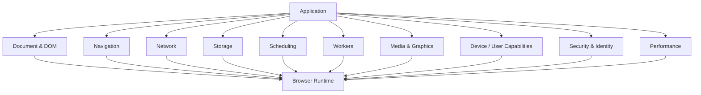
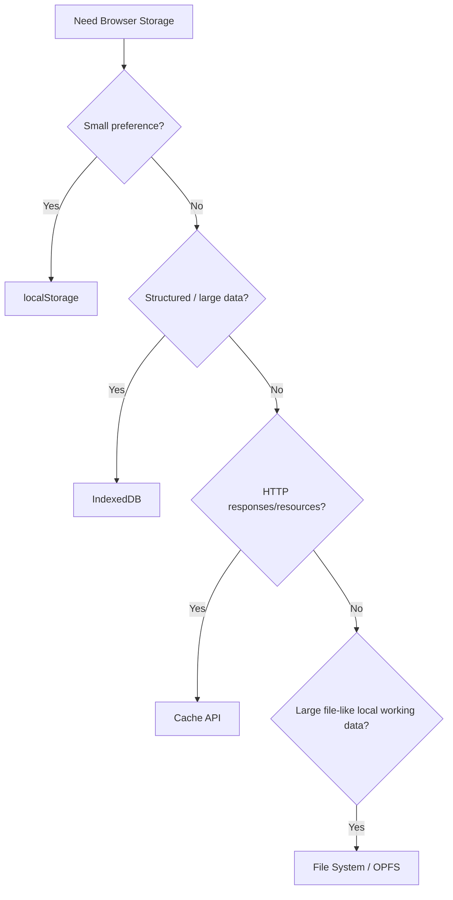
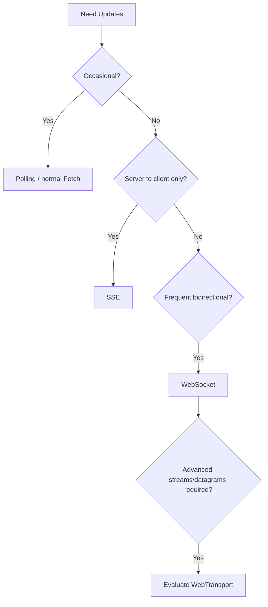
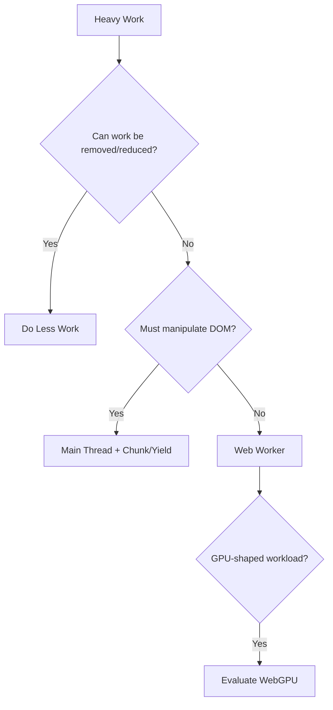

# Appendix B - Modern Browser APIs Reference

## A Capability-Oriented Guide to the Web Platform

The browser is much more than:

```text
HTML
CSS
JavaScript
```

Modern browsers provide APIs for:

- DOM interaction;
- navigation;
- networking;
- streaming;
- storage;
- background work;
- cross-tab communication;
- files;
- clipboard;
- media;
- graphics;
- authentication;
- performance;
- observers;
- device capabilities.

Frameworks such as React and Vue sit on top of these capabilities.

They may provide more convenient integration, but they do not replace the platform.

This appendix therefore answers a practical question:

> **Which browser capability should I consider when a frontend requirement appears?**

It is organized by problem domain rather than alphabetically.

---

# 1. How to Read This Appendix

Each API is described through four questions:

### What problem does it solve?

The architectural responsibility.

### Main interfaces

The names you are likely to encounter.

### Use it when

Representative situations where it fits.

### Watch for

Important architectural, performance, security, or compatibility concerns.

Where useful, the appendix also points back to chapters in this book.

---

# 2. Compatibility Labels

Browser capabilities evolve.

This appendix uses the following informal labels.

## Established

Broadly implemented and normal for production use.

Examples:

```text
Fetch
URL
IndexedDB
Web Workers
IntersectionObserver
```

## Newer but broadly available

Relatively recent platform capabilities that have reached broad modern-browser availability, but older devices or browser versions may still require fallback planning.

Examples as of 2026 include:

```text
Navigation API
View Transition API
Cookie Store API
Screen Wake Lock
CSS Custom Highlight API
WebTransport
```

## Limited / check compatibility

Useful APIs whose browser availability remains incomplete or whose deployment requirements deserve careful review.

Examples include:

```text
Prioritized Task Scheduling
File System Access
Web Share
WebGPU
Web Serial
Document Picture-in-Picture
Background Sync
```

Some APIs may be experimental.

Always verify actual target-browser support before making a production architecture depend on a less-established feature.

---

# 3. Core Browser Layers

A useful map of the platform is:



The browser is the runtime.

Frameworks are application abstractions inside it.

---

# Part I - Document, DOM & Events

# 4. DOM API

## Problem

Inspect and modify the document tree.

## Main interfaces

```text
Document
Element
Node
HTMLElement
DocumentFragment
Text
```

Common methods:

```text
querySelector()
querySelectorAll()
createElement()
append()
replaceChildren()
remove()
closest()
matches()
```

## Use it when

- manipulating DOM directly;
- integrating third-party libraries;
- building small framework-free features;
- implementing Custom Elements;
- measuring or focusing elements.

## Watch for

Direct DOM updates can conflict with framework ownership.

In React or Vue, use direct DOM access mainly as an escape hatch rather than as the primary rendering model.

Related chapters:

```text
Chapter 1
Chapter 2
Appendix A
```

---

# 5. `DocumentFragment`

## Problem

Build or manipulate a group of DOM nodes without immediately attaching them to the live document.

```js
const fragment =
  document.createDocumentFragment();

for (
  const item
  of items
) {
  const li =
    document.createElement(
      "li"
    );

  li.textContent =
    item;

  fragment.append(
    li
  );
}

list.append(
  fragment
);
```

## Use it when

- assembling DOM programmatically;
- cloning templates;
- performing grouped DOM construction.

## Watch for

Modern DOM methods already handle many common batching cases efficiently.

Do not assume `DocumentFragment` automatically makes every DOM operation faster.

Measure when performance matters.

---

# 6. `<template>` and Template Content

## Problem

Store inert HTML structure that can later be cloned.

```html
<template
  id="product-template"
>
  <article
    class="product"
  >
    <h2></h2>
  </article>
</template>
```

JavaScript:

```js
const template =
  document.querySelector(
    "#product-template"
  );

const clone =
  template.content
    .cloneNode(
      true
    );
```

## Use it when

- building reusable DOM fragments without a framework;
- Custom Elements;
- progressive enhancement.

## Watch for

The content is inert until cloned/inserted.

---

# 7. EventTarget and DOM Events

## Problem

Respond to events and create event-driven communication.

## Main interfaces

```text
EventTarget
Event
CustomEvent
PointerEvent
KeyboardEvent
InputEvent
SubmitEvent
FocusEvent
```

Common methods:

```text
addEventListener()
removeEventListener()
dispatchEvent()
```

Example:

```js
button.addEventListener(
  "click",
  handleClick
);
```

## Use it when

- reacting to browser interaction;
- creating framework-independent event emitters;
- implementing Custom Elements;
- communicating between loosely coupled local modules.

## Watch for

Global event buses can hide ownership.

Prefer explicit data flow for normal component relationships.

---

# 8. `CustomEvent`

## Problem

Create application-defined DOM events.

```js
element.dispatchEvent(
  new CustomEvent(
    "product-selected",
    {
      detail: {
        id:
          "P-42"
      },

      bubbles:
        true
    }
  )
);
```

## Use it when

- Custom Elements need to expose events;
- framework-neutral embedded widgets;
- DOM-level integration boundaries.

## Watch for

Event names and payloads become contracts.

Treat them as public APIs if multiple systems depend on them.

---

# 9. Pointer Events

## Problem

Handle pointer input through a unified model covering:

- mouse;
- pen;
- touch.

## Main interface

```text
PointerEvent
```

Example:

```js
element.addEventListener(
  "pointerdown",
  event => {
    // ...
  }
);
```

## Use it when

- dragging;
- drawing;
- custom gestures;
- resizable interfaces.

## Watch for

Do not create custom pointer behavior that breaks:

- keyboard access;
- scrolling;
- assistive technology.

Use semantic controls for ordinary buttons/forms.

---

# 10. Focus APIs

## Problem

Move and inspect keyboard focus.

Common APIs:

```text
element.focus()
element.blur()
document.activeElement
```

Example:

```js
searchInput.focus();
```

## Use it when

- dialog focus management;
- restoring focus;
- interactive widgets;
- validation error focus.

## Watch for

Do not move focus unexpectedly.

Focus is part of accessibility state.

---

# 11. Selection and Range APIs

## Problem

Represent selected text or arbitrary portions of a document.

Interfaces:

```text
Selection
Range
AbstractRange
```

Use:

```js
const selection =
  window.getSelection();
```

## Use it when

- editors;
- annotation tools;
- text selection;
- highlighting;
- rich-text interactions.

## Watch for

DOM mutations can invalidate assumptions about ranges.

Complex editors usually need carefully designed document models.

---

# 12. CSS Custom Highlight API

**Maturity: Newer but broadly available**

## Problem

Highlight arbitrary text ranges without wrapping them in extra DOM elements.

Key interfaces:

```text
Highlight
HighlightRegistry
CSS.highlights
Range
```

Example concept:

```js
const range =
  new Range();

const highlight =
  new Highlight(
    range
  );

CSS.highlights.set(
  "search-match",
  highlight
);
```

CSS:

```css
::highlight(
  search-match
) {
  background:
    yellow;
}
```

## Use it when

- search-result highlighting;
- code editors;
- spelling/grammar tools;
- document annotation.

## Watch for

Use it for visual highlighting, not as a replacement for semantic markup where semantics matter.

---

# 13. MutationObserver

## Problem

Observe DOM mutations.

```js
const observer =
  new MutationObserver(
    records => {
      // ...
    }
  );

observer.observe(
  target,
  {
    childList:
      true,

    subtree:
      true
  }
);
```

## Use it when

- integrating with code you do not control;
- observing externally generated DOM;
- custom infrastructure.

## Watch for

Do not use MutationObserver as a substitute for normal application state.

If your own code caused the change, you should usually already know about it.

---

# Part II - Layout, Visibility & Observation

# 14. ResizeObserver

## Problem

Observe changes in an element's size.

```js
const observer =
  new ResizeObserver(
    entries => {
      // ...
    }
  );

observer.observe(
  element
);
```

## Use it when

- charts need container dimensions;
- responsive JavaScript behavior;
- canvas resizing;
- complex widgets.

## Watch for

Prefer CSS:

```text
container queries
responsive layout
```

when the requirement is purely presentational.

Use ResizeObserver when JavaScript genuinely needs measurements.

---

# 15. IntersectionObserver

## Problem

Observe whether an element intersects a viewport or ancestor.

```js
const observer =
  new IntersectionObserver(
    entries => {
      // ...
    }
  );

observer.observe(
  target
);
```

## Use it when

- lazy initialization;
- infinite scroll sentinels;
- visibility analytics;
- loading expensive widgets near viewport.

## Watch for

Do not use it when native features already solve the problem.

Example:

```html

```

may be better than custom image-lazy-loading logic.

---

# 16. PerformanceObserver

## Problem

Observe browser performance entries.

```js
const observer =
  new PerformanceObserver(
    list => {
      for (
        const entry
        of list.getEntries()
      ) {
        // ...
      }
    }
  );
```

Possible entry categories include browser timing and user-experience signals.

## Use it when

- RUM;
- custom performance instrumentation;
- observing long tasks or resource timing where supported.

## Watch for

Use established Web Vitals libraries for complex metric calculations rather than casually recreating specification logic.

Related chapter:

```text
Chapter 15
```

---

# 17. ReportingObserver

## Problem

Receive browser-generated reports for selected classes of platform issues.

## Use it when

- monitoring deprecations;
- interventions;
- selected browser policy reports.

## Watch for

Support and report categories vary.

This is usually complementary observability, not the primary error-monitoring mechanism.

---

# Part III - Navigation & URL

# 18. URL API

## Problem

Parse and construct URLs safely.

```js
const url =
  new URL(
    "/products?q=monitor",
    location.origin
  );
```

Read:

```js
url.pathname;
url.searchParams;
url.origin;
```

## Use it when

- routing;
- link construction;
- parsing callback URLs;
- normalizing API endpoints.

## Watch for

Do not manipulate URLs through brittle string concatenation when URL APIs can express the structure.

---

# 19. URLSearchParams

## Problem

Read and modify query parameters.

```js
const params =
  new URLSearchParams(
    location.search
  );

const query =
  params.get(
    "q"
  );

params.set(
  "page",
  "2"
);
```

## Use it when

- search;
- filters;
- sort;
- pagination;
- shareable UI state.

Related chapter:

```text
Chapter 8
```

---

# 20. History API

## Problem

Modify and navigate session history without a full page navigation.

Core methods/events:

```text
history.pushState()
history.replaceState()
history.back()
history.forward()
popstate
```

## Use it when

- custom SPA routing;
- understanding router internals;
- modifying URL state without reloading.

## Watch for

History API has awkward edge cases for modern SPA routing.

Framework routers usually provide safer abstractions.

---

# 21. Navigation API

**Maturity: Newer but broadly available**

## Problem

Provide a more complete modern API for initiating, intercepting, and observing browser navigation.

Entry point:

```text
window.navigation
```

Representative capabilities:

```text
navigate
reload
traverse history entries
intercept navigation
observe current entries
```

## Use it when

- designing modern framework-free SPA navigation;
- building routing infrastructure;
- integrating navigation lifecycle behavior.

## Watch for

It is newer than the History API.

Older target environments may still require compatibility planning.

Framework routers may abstract it as ecosystem adoption develops.

---

# 22. Location API

## Problem

Inspect or cause document navigation.

```text
window.location
location.href
location.assign()
location.replace()
location.reload()
```

## Use it when

- performing full-document navigation;
- reading current URL;
- redirecting.

## Watch for

Full navigation is often the correct architectural choice.

Do not force SPA navigation across boundaries merely because it is possible.

---

# 23. `hashchange`

## Problem

Observe URL fragment changes.

```js
addEventListener(
  "hashchange",
  () => {
    // ...
  }
);
```

## Use it when

- simple fragment-based state;
- legacy hash routers;
- document anchor behavior.

## Watch for

Modern applications often prefer path/query-based routing.

---

# 24. View Transition API

**Maturity: Newer but broadly available**

## Problem

Animate transitions between:

- different DOM states in one document;
- compatible navigations between documents.

Same-document entry point:

```js
document.startViewTransition(
  () => {
    updateDOM();
  }
);
```

## Use it when

- route transitions;
- gallery transitions;
- list-to-detail animations;
- maintaining visual context across navigation.

## Watch for

Animation should support comprehension, not delay interaction.

Respect:

```css
@media (
  prefers-reduced-motion:
  reduce
) {
  /* reduce/remove motion */
}
```

Do not depend on view transitions for functional correctness.

---

# Part IV - Networking & Streams

# 25. Fetch API

## Problem

Make HTTP requests.

```js
const response =
  await fetch(
    "/api/products"
  );
```

## Main interfaces

```text
fetch()
Request
Response
Headers
AbortSignal
```

## Use it when

- API communication;
- loading documents/data;
- streaming responses;
- uploading.

## Watch for

`fetch()` does not reject merely because the server returned:

```text
404
500
```

Check:

```js
response.ok
```

or status explicitly.

Related chapter:

```text
Chapter 9
```

---

# 26. Request

## Problem

Represent an HTTP request as an object.

```js
const request =
  new Request(
    "/api/products",
    {
      method:
        "GET",

      headers: {
        Accept:
          "application/json"
      }
    }
  );
```

## Use it when

- request cloning;
- Service Worker handling;
- reusable request construction.

---

# 27. Response

## Problem

Represent an HTTP response.

Useful methods:

```text
json()
text()
blob()
arrayBuffer()
formData()
```

Example:

```js
if (
  !response.ok
) {
  throw new Error(
    "Request failed"
  );
}

const data =
  await response.json();
```

## Watch for

Parsed JSON remains:

```text
unknown/untrusted runtime data
```

until validated.

Related chapter:

```text
Chapter 5
```

---

# 28. AbortController & AbortSignal

## Problem

Cancel supported async operations.

```js
const controller =
  new AbortController();

fetch(
  url,
  {
    signal:
      controller.signal
  }
);

controller.abort();
```

## Use it when

- cancelling stale search;
- component cleanup;
- timeout composition;
- user cancellation.

## Watch for

Cancellation should be treated as an expected state rather than always as an application error.

Related chapters:

```text
Chapter 4
Chapter 9
```

---

# 29. Streams API

## Problem

Process data incrementally rather than waiting for the whole payload.

Core interfaces:

```text
ReadableStream
WritableStream
TransformStream
```

Example pipeline:

```js
stream
  .pipeThrough(
    transform
  )
  .pipeTo(
    destination
  );
```

## Use it when

- large downloads;
- streaming text;
- incremental transformation;
- compression;
- custom transport pipelines.

## Watch for

Streams add conceptual complexity.

Do not introduce them when ordinary:

```js
await response.json()
```

is sufficient.

---

# 30. TextEncoder / TextDecoder

## Problem

Convert between:

```text
JavaScript strings
and
binary byte representations
```

Example:

```js
const bytes =
  new TextEncoder()
    .encode(
      "Hello"
    );
```

## Use it when

- crypto;
- streams;
- binary protocols;
- compression;
- files.

---

# 31. Compression Streams API

**Maturity: Established / broadly available**

## Problem

Compress or decompress streaming data using browser-native primitives.

Interfaces:

```text
CompressionStream
DecompressionStream
```

Example:

```js
const compressed =
  inputStream.pipeThrough(
    new CompressionStream(
      "gzip"
    )
  );
```

## Use it when

- client-side archive/data workflows;
- local compression;
- processing compressed application data.

## Watch for

HTTP transport compression should normally be handled by server/CDN infrastructure.

Do not duplicate transport-layer compression unnecessarily.

---

# 32. EventSource / Server-Sent Events

## Problem

Receive a long-lived stream of server-to-client events over HTTP.

```js
const events =
  new EventSource(
    "/api/events"
  );

events.addEventListener(
  "message",
  event => {
    // ...
  }
);
```

## Use it when

- notifications;
- progress;
- dashboards;
- server-to-client updates where client messages do not need the same connection.

## Watch for

SSE is primarily one-way:

```text
server → browser
```

Use ordinary HTTP requests for client-to-server actions.

Related chapter:

```text
Chapter 10
```

---

# 33. WebSocket

## Problem

Maintain a bidirectional message channel between browser and server.

```js
const socket =
  new WebSocket(
    "wss://example.com/live"
  );
```

## Use it when

- collaborative applications;
- chat;
- multiplayer;
- live operational control;
- frequent bidirectional messages.

## Watch for

You still need application-level policy for:

- reconnect;
- authentication;
- ordering;
- deduplication;
- stale state recovery;
- backpressure strategy.

A WebSocket is a transport, not a synchronization architecture.

---

# 34. WebTransport

**Maturity: Newer but broadly available**

## Problem

Provide modern client-server transport over HTTP/3 with:

- bidirectional streams;
- unidirectional streams;
- datagrams;
- reliable and unreliable delivery options.

## Use it when

- advanced real-time communication;
- games;
- live media/data;
- transports needing more flexibility than WebSocket.

## Watch for

Server infrastructure must support WebTransport.

It is significantly more specialized than ordinary Fetch/SSE/WebSocket.

Do not adopt it merely because it is newer.

---

# 35. WebRTC

## Problem

Enable real-time peer communication for:

- audio;
- video;
- arbitrary data.

Key interfaces include:

```text
RTCPeerConnection
RTCDataChannel
MediaStream
```

## Use it when

- video calls;
- voice calls;
- peer-to-peer data channels.

## Watch for

WebRTC architecture also requires:

- signaling;
- ICE negotiation;
- STUN;
- often TURN relays.

WebRTC is not simply:

```text
browser A directly connects to browser B
```

in every real network.

Related chapter:

```text
Chapter 10
```

---

# 36. Beacon API

## Problem

Send a small amount of data asynchronously, particularly during page termination/navigation.

```js
navigator.sendBeacon(
  "/telemetry",
  payload
);
```

## Use it when

- selected telemetry;
- small end-of-session events.

## Watch for

It is not a general Fetch replacement.

Related chapter:

```text
Chapter 17
```

---

# Part V - Storage & Persistence

# 37. Web Storage

Interfaces:

```text
localStorage
sessionStorage
```

## Problem

Store small string key/value data synchronously.

```js
localStorage.setItem(
  "theme",
  "dark"
);
```

## Use it when

- small preferences;
- simple non-sensitive flags;
- small persistent values.

## Watch for

It is:

- synchronous;
- string-based;
- available to same-origin JavaScript;
- inappropriate for large structured datasets.

Do not store access tokens or sensitive data casually.

---

# 38. IndexedDB

## Problem

Store large structured data asynchronously.

Key concepts:

```text
database
object store
index
transaction
request
version
```

## Use it when

- offline records;
- drafts;
- large client datasets;
- structured caching;
- durable outbox.

## Watch for

Schema evolution and transaction design matter.

Wrap low-level APIs when application complexity justifies it.

Related chapter:

```text
Chapter 10
```

---

# 39. Cache API / Cache Storage

## Problem

Store HTTP Request/Response pairs.

```js
const cache =
  await caches.open(
    "app-v1"
  );

await cache.put(
  request,
  response
);
```

## Use it when

- Service Worker caching;
- offline resources;
- explicit response caching.

## Watch for

This is not the same as:

```text
HTTP browser cache
```

or:

```text
application query cache
```

Each layer has different ownership.

---

# 40. StorageManager

## Problem

Inspect and influence origin storage behavior.

Representative APIs:

```text
navigator.storage.estimate()
navigator.storage.persist()
navigator.storage.persisted()
```

Example:

```js
const {
  usage,
  quota
} =
  await navigator.storage
    .estimate();
```

## Use it when

- offline-heavy apps;
- large IndexedDB/Cache use;
- storage diagnostics.

## Watch for

Quota values are browser-managed estimates.

Do not assume unlimited durable storage.

---

# 41. Cookie Store API

**Maturity: Newer but broadly available**

## Problem

Provide asynchronous cookie access through a structured API.

Entry points include:

```text
cookieStore
CookieStore
```

Example concept:

```js
const cookie =
  await cookieStore.get(
    "theme"
  );
```

## Use it when

- application code needs asynchronous cookie interaction;
- Service Workers need cookie awareness.

## Watch for

Authentication cookies should commonly be:

```text
HttpOnly
```

and therefore intentionally inaccessible to frontend JavaScript.

The API does not change secure cookie architecture.

Related chapter:

```text
Chapter 13
```

---

# 42. Origin Private File System

## Problem

Provide origin-private filesystem-like storage.

Commonly used through File System API handles.

## Use it when

- large files;
- editors;
- local working data;
- structured offline applications.

## Watch for

This storage belongs to the origin and is not the same as letting the user edit arbitrary files on their desktop.

---

# Part VI - Service Workers & Background Capabilities

# 43. Service Worker API

## Problem

Run a browser-managed worker that can intercept network requests and enable offline/background behavior.

Main concepts:

```text
registration
install
activate
fetch event
clients
```

Example registration:

```js
const registration =
  await navigator
    .serviceWorker
    .register(
      "/sw.js"
    );
```

## Use it when

- offline application shell;
- explicit request caching;
- background behaviors;
- PWA infrastructure.

## Watch for

Service Workers add a second runtime lifecycle.

They can keep old code/caches alive.

Plan:

- versioning;
- upgrade;
- stale clients;
- rollback.

Related chapters:

```text
Chapter 10
Chapter 17
```

---

# 44. Clients API

## Problem

Allow Service Workers to inspect and communicate with controlled documents.

Representative interfaces:

```text
Clients
Client
WindowClient
```

## Use it when

- notifying open tabs;
- focusing/opening application windows;
- coordinating service-worker actions.

---

# 45. Background Sync

**Maturity: Limited / check compatibility**

## Problem

Ask a Service Worker to retry deferred synchronization when connectivity becomes suitable.

## Use it when

- outbox messages;
- deferred form submission;
- offline synchronization.

## Watch for

Do not make correctness depend on it across browsers.

Design an explicit fallback:

```text
retry when app opens/reconnects
```

Related chapter:

```text
Chapter 10
```

---

# 46. Periodic Background Sync

**Maturity: Experimental / limited**

## Problem

Request periodic work through a Service Worker.

Potential uses:

```text
refresh offline content
background update
```

## Watch for

Browser support and scheduling are strongly browser-controlled.

The requested period is not a guaranteed cron schedule.

Do not architect strict timing requirements around it.

---

# 47. Push API

## Problem

Allow a server to trigger messages that reach a Service Worker even when the application is not open normally.

## Use it when

- user-approved notifications;
- time-sensitive updates.

## Watch for

Push requires:

- user permission;
- push service integration;
- privacy/engagement discipline.

Do not request permission immediately on first page load without user context.

---

# 48. Notifications API

## Problem

Display system-level notifications with user permission.

```js
const permission =
  await Notification
    .requestPermission();
```

## Use it when

- user-requested alerts;
- reminders;
- incoming communication.

## Watch for

Notifications are high-interruption UX.

Use only when user value justifies interruption.

---

# Part VII - Cross-Context Communication & Coordination

# 49. `window.postMessage()`

## Problem

Communicate between:

- windows;
- iframes;
- popups;
- different origins under explicit rules.

```js
otherWindow.postMessage(
  message,
  "https://trusted.example"
);
```

Receiver:

```js
addEventListener(
  "message",
  event => {
    if (
      event.origin !==
      "https://trusted.example"
    ) {
      return;
    }

    // validate event.data
  }
);
```

## Use it when

- embedded widgets;
- auth popup communication;
- iframe integration.

## Watch for

Always validate:

```text
origin
payload
message type
```

Related chapter:

```text
Chapter 13
```

---

# 50. MessageChannel

## Problem

Create a pair of connected message ports.

Interfaces:

```text
MessageChannel
MessagePort
```

## Use it when

- explicit local communication channels;
- transferring a communication endpoint to a Worker/window.

## Watch for

Usually lower-level infrastructure.

Do not use where a simple callback is clearer.

---

# 51. BroadcastChannel

## Problem

Broadcast messages between browsing contexts of the same origin.

```js
const channel =
  new BroadcastChannel(
    "app"
  );

channel.postMessage({
  type:
    "logout"
});
```

## Use it when

- logout synchronization across tabs;
- preference changes across windows;
- leader coordination signals.

## Watch for

Messages are ephemeral.

Do not treat BroadcastChannel as persistent state storage.

---

# 52. Web Locks API

**Maturity: Established**

## Problem

Coordinate exclusive/shared work between same-origin tabs and workers.

Entry point:

```text
navigator.locks
```

Example:

```js
await navigator.locks
  .request(
    "sync-database",
    async () => {
      await syncDatabase();
    }
  );
```

## Use it when

- only one tab should perform synchronization;
- leader-election-like coordination;
- avoiding concurrent writes to shared browser resources.

## Watch for

Locks can deadlock if acquisition design is careless.

Keep lock scopes understandable and bounded.

---

# 53. SharedWorker

## Problem

Allow several same-origin documents to share one worker instance.

## Use it when

- shared connection;
- shared background computation across tabs.

## Watch for

Lifecycle and browser support expectations differ from Dedicated Workers.

BroadcastChannel plus dedicated workers may sometimes be simpler.

---

# Part VIII - Scheduling & Main-Thread Work

# 54. `setTimeout()` / `setInterval()`

## Problem

Schedule timers.

```js
const id =
  setTimeout(
    task,
    500
  );
```

## Use it when

- delay;
- timeout;
- polling where appropriate.

## Watch for

Timers are not precise real-time scheduling.

Browsers may throttle background tabs.

Clear timers when lifecycle ends.

---

# 55. `requestAnimationFrame()`

## Problem

Schedule visual work before a browser repaint.

```js
requestAnimationFrame(
  () => {
    updatePosition();
  }
);
```

## Use it when

- custom animation;
- visual measurement/update loops.

## Watch for

It does not make expensive work cheap.

Long callbacks still block frames.

Related chapter:

```text
Chapter 15
```

---

# 56. `requestIdleCallback()`

## Problem

Ask the browser to run lower-priority work during idle time.

## Use it when

- non-urgent background preparation;
- best-effort work.

## Watch for

Availability and scheduling behavior require compatibility awareness.

Do not use it for work that must happen by a strict deadline.

---

# 57. Prioritized Task Scheduling API

**Maturity: Limited / check compatibility**

Entry point:

```text
scheduler.postTask()
```

## Problem

Schedule tasks with explicit priorities such as user-visible/background work.

Conceptual example:

```js
await scheduler.postTask(
  task,
  {
    priority:
      "background"
  }
);
```

## Use it when

- sophisticated main-thread scheduling;
- prioritizing non-urgent work.

## Watch for

It is not yet a universal baseline for all target browsers.

Use progressive enhancement/fallback scheduling where appropriate.

---

# 58. `queueMicrotask()`

## Problem

Schedule a microtask after current synchronous work and before the browser continues with later tasks/rendering phases.

```js
queueMicrotask(
  () => {
    // ...
  }
);
```

## Use it when

- low-level library scheduling;
- batching synchronous API behavior.

## Watch for

Large chains of microtasks can delay rendering and other tasks.

Related chapter:

```text
Chapter 4
```

---

# 59. `scheduler.yield()` / Yielding Concepts

Where supported by modern scheduling APIs, yielding can break long work so the browser can service higher-priority tasks.

Architectural goal:

```text
long operation
→ smaller chunks
→ browser gets opportunities to respond
```

## Watch for

The best optimization may still be:

```text
do less work
```

or:

```text
move CPU work to a Worker
```

rather than repeatedly yielding.

---

# Part IX - Workers & Parallel Computation

# 60. Dedicated Web Worker

## Problem

Run JavaScript off the main thread.

Create:

```js
const worker =
  new Worker(
    "/worker.js",
    {
      type:
        "module"
    }
  );
```

Communicate:

```js
worker.postMessage(
  data
);
```

Worker:

```js
self.onmessage =
  event => {
    // ...
  };
```

## Use it when

- large computation;
- parsing;
- data transformation;
- image processing;
- expensive algorithms.

## Watch for

Workers cannot directly manipulate the page DOM.

Communication and data transfer have costs.

Related chapter:

```text
Chapter 15
```

---

# 61. Structured Clone

## Problem

Clone many JavaScript data structures when passing them across contexts.

Used implicitly by:

```text
postMessage()
IndexedDB
structuredClone()
```

Direct API:

```js
const copy =
  structuredClone(
    value
  );
```

## Use it when

- deep-cloning supported structured data;
- Workers;
- browser persistence.

## Watch for

Not every object type/behavior can be cloned meaningfully.

Functions are not cloned as executable behavior.

---

# 62. Transferable Objects

## Problem

Move ownership of selected underlying resources rather than copying them.

Common examples involve:

```text
ArrayBuffer
MessagePort
```

## Use it when

- moving large binary data to/from Workers.

## Watch for

After transfer, the original context may no longer own/use the transferred resource.

Understand ownership semantics.

---

# 63. SharedArrayBuffer

## Problem

Share memory across compatible JavaScript execution contexts.

## Use it when

- specialized high-performance parallel algorithms;
- low-level applications.

## Watch for

Requires strong cross-origin isolation policies in normal web deployment.

This is advanced infrastructure.

Related chapter:

```text
Chapter 13
```

---

# 64. Atomics

## Problem

Coordinate access to shared memory.

Use with:

```text
SharedArrayBuffer
typed arrays
```

## Use it when

- low-level worker synchronization.

## Watch for

This is specialist concurrent programming.

Most applications should use message-passing instead.

---

# Part X - Files, Clipboard & Sharing

# 65. File API

## Problem

Represent files selected or provided to the browser.

Interfaces:

```text
File
Blob
FileList
FileReader
```

Modern Blob/File methods often reduce the need for `FileReader`.

Example:

```js
const text =
  await file.text();
```

## Use it when

- uploads;
- local parsing;
- image previews;
- document processing.

## Watch for

A selected file can be large.

Avoid loading large files entirely into memory when streaming/chunking is more appropriate.

---

# 66. Blob

## Problem

Represent immutable binary data.

```js
const blob =
  new Blob(
    [
      "Hello"
    ],
    {
      type:
        "text/plain"
    }
  );
```

Useful APIs:

```text
blob.text()
blob.arrayBuffer()
blob.stream()
blob.slice()
```

---

# 67. Object URLs

## Problem

Create a temporary URL referring to a Blob/File.

```js
const url =
  URL.createObjectURL(
    file
  );
```

Cleanup:

```js
URL.revokeObjectURL(
  url
);
```

## Use it when

- image/video preview;
- download links;
- local binary resources.

## Watch for

Revoke URLs when they are no longer needed to release resources.

---

# 68. File System Access / File System API

**Maturity: Limited / check compatibility for user-visible local filesystem access**

## Problem

Allow user-authorized access to files/directories and support filesystem-style handles.

Possible capabilities:

```text
open file
save file
directory access
origin-private filesystem
```

## Use it when

- advanced editors;
- IDE-like tools;
- creative software;
- local document workflows.

## Watch for

User-facing device filesystem access has uneven browser availability.

Design:

```text
upload/download fallback
```

when broad browser support is required.

---

# 69. Clipboard API

## Problem

Read/write clipboard data with security and permission restrictions.

Common APIs:

```js
await navigator.clipboard
  .writeText(
    value
  );
```

and:

```js
const text =
  await navigator.clipboard
    .readText();
```

## Use it when

- Copy button;
- paste workflows;
- editor integration.

## Watch for

Clipboard access is security-sensitive and often requires:

- HTTPS;
- user activation/permission.

Always provide clear user intent.

---

# 70. Web Share API

**Maturity: Limited / check compatibility**

## Problem

Open the operating system's native share interface.

```js
await navigator.share({
  title:
    "Product",

  url:
    location.href
});
```

## Use it when

- mobile-oriented sharing;
- sharing files/links through installed applications.

## Watch for

Always provide fallback behavior such as:

```text
Copy link
```

because availability remains platform/browser dependent.

---

# 71. Drag and Drop API

## Problem

Support drag/drop interactions.

Interfaces:

```text
DragEvent
DataTransfer
```

## Use it when

- file drop;
- reorder interfaces;
- specialized desktop-like workflows.

## Watch for

Native drag-and-drop APIs can be awkward across devices.

Ensure non-drag alternatives for:

- keyboard;
- touch;
- accessibility.

---

# Part XI - Media, Camera & Audio

# 72. MediaDevices

## Problem

Access camera/microphone and enumerate allowed media devices.

Entry point:

```text
navigator.mediaDevices
```

Common API:

```js
const stream =
  await navigator
    .mediaDevices
    .getUserMedia({
      video:
        true,

      audio:
        true
    });
```

## Use it when

- video calls;
- camera capture;
- microphone recording;
- barcode/scanning interfaces.

## Watch for

Requires strong user permission and secure context.

Explain why access is needed before prompting.

---

# 73. MediaStream

## Problem

Represent one or more live media tracks.

Used by:

- camera;
- microphone;
- screen capture;
- WebRTC.

Interfaces:

```text
MediaStream
MediaStreamTrack
```

## Watch for

Stop tracks when no longer needed:

```js
for (
  const track
  of stream.getTracks()
) {
  track.stop();
}
```

This releases hardware/privacy indicators.

---

# 74. Screen Capture

API:

```text
getDisplayMedia()
```

Example:

```js
const stream =
  await navigator
    .mediaDevices
    .getDisplayMedia({
      video:
        true
    });
```

## Use it when

- screen sharing;
- recording;
- remote support.

## Watch for

Screen sharing is highly privacy-sensitive.

User selection/permission is central.

---

# 75. MediaRecorder

## Problem

Record MediaStream content.

```js
const recorder =
  new MediaRecorder(
    stream
  );
```

## Use it when

- voice recording;
- camera recording;
- screen recording.

## Watch for

Codec/container availability can vary.

Validate generated media on target browsers.

---

# 76. Web Audio API

## Problem

Build audio processing graphs.

Core interface:

```text
AudioContext
```

Use cases:

- audio visualization;
- synthesis;
- filters;
- mixing;
- analysis.

## Watch for

Audio playback/activation is constrained by user gesture policies.

It is a powerful specialist API.

---

# 77. HTMLMediaElement

Elements:

```html
<audio>
<video>
```

JavaScript interface:

```text
HTMLMediaElement
```

Capabilities:

```text
play()
pause()
currentTime
volume
playbackRate
```

## Use it when

ordinary audio/video playback is sufficient.

Do not jump to Web Audio/WebCodecs when native media elements solve the requirement.

---

# 78. Picture-in-Picture API

## Problem

Place supported video into an always-on-top Picture-in-Picture window.

## Use it when

- video calls;
- long video playback;
- instructional content.

## Watch for

Keep the primary application usable when PiP is unavailable.

---

# 79. Document Picture-in-Picture

**Maturity: Limited / check compatibility**

## Problem

Open an always-on-top window containing arbitrary HTML rather than only a video element.

Potential uses:

```text
video conference controls
compact productivity panel
floating custom player
```

## Watch for

Availability remains limited.

Treat it as progressive enhancement.

---

# 80. Media Session API

## Problem

Integrate media playback with operating-system/browser media controls.

Capabilities can include:

```text
metadata
play/pause handlers
next/previous actions
```

## Use it when

- music;
- podcast;
- long-form audio/video.

---

# 81. WebCodecs

## Problem

Provide low-level access to browser-native audio/video encoding and decoding.

Key types include:

```text
VideoEncoder
VideoDecoder
AudioEncoder
AudioDecoder
VideoFrame
AudioData
```

## Use it when

- video editors;
- streaming pipelines;
- advanced conferencing;
- frame-level processing.

## Watch for

This is much lower-level than:

```text
<video>
MediaRecorder
```

Use the highest-level API that satisfies the product.

---

# Part XII - Graphics & Visual Computation

# 82. Canvas 2D

## Problem

Imperatively draw pixels/shapes/text into a canvas.

```js
const context =
  canvas.getContext(
    "2d"
  );
```

## Use it when

- charts;
- drawing;
- image manipulation;
- simulations.

## Watch for

Canvas drawing is not automatically represented as semantic DOM.

If content conveys important meaning, provide accessible alternatives.

---

# 83. OffscreenCanvas

## Problem

Allow canvas rendering away from the visible DOM context and, where supported, inside Workers.

## Use it when

- expensive rendering;
- image processing;
- advanced visualizations.

## Watch for

Support and integration depend on rendering context/features.

Measure whether moving work improves user experience.

---

# 84. WebGL

## Problem

Access GPU-accelerated 2D/3D graphics through an OpenGL-ES-style API.

## Use it when

- 3D visualization;
- maps;
- games;
- scientific visualization.

## Watch for

Prefer a mature graphics library unless low-level rendering control is part of the product's core expertise.

---

# 85. WebGPU

**Maturity: Limited / check compatibility**

## Problem

Provide modern GPU access for:

- high-performance graphics;
- general-purpose GPU computation.

## Use it when

- advanced 3D;
- scientific compute;
- ML/compute workloads;
- professional creative tools.

## Watch for

Availability across target browsers/devices remains an architectural constraint.

Always plan an appropriate fallback or support policy.

---

# 86. Web Animations API

## Problem

Control animations through JavaScript using browser animation primitives.

```js
element.animate(
  [
    {
      opacity:
        0
    },

    {
      opacity:
        1
    }
  ],
  {
    duration:
      250
  }
);
```

## Use it when

- programmatic animation control;
- coordinated motion;
- animation timelines.

## Watch for

CSS transitions/animations may be simpler.

Respect reduced-motion preferences.

---

# Part XIII - Device & User Capabilities

# 87. Geolocation API

## Problem

Request the user's geographic position.

```js
navigator
  .geolocation
  .getCurrentPosition(
    success,
    error
  );
```

## Use it when

- maps;
- delivery location;
- nearby services.

## Watch for

Location is sensitive data.

Ask only when necessary and explain why.

Do not request precise location for features that can work with manually entered city/region.

---

# 88. Permissions API

## Problem

Inspect permission state for supported capabilities.

```js
const status =
  await navigator
    .permissions
    .query({
      name:
        "geolocation"
    });
```

Possible states:

```text
granted
denied
prompt
```

## Use it when

- adapting permission UX;
- understanding whether an explicit request is likely.

## Watch for

Not every browser capability is represented identically through this API.

Do not assume querying permission replaces requesting capability in its proper user context.

---

# 89. Screen Wake Lock

**Maturity: Newer but broadly available**

## Problem

Prevent the screen from dimming/locking while an active page genuinely needs it.

```js
const sentinel =
  await navigator
    .wakeLock
    .request(
      "screen"
    );
```

## Use it when

- recipes;
- presentations;
- turn-by-turn display;
- long monitoring workflow.

## Watch for

Wake locks can be released automatically when the document becomes inactive.

Provide visible indication and user control.

Battery cost matters.

---

# 90. Vibration API

## Problem

Trigger device vibration where supported.

## Use it when

- carefully chosen tactile feedback.

## Watch for

Support is not universal.

Do not depend on vibration for essential communication.

---

# 91. Device Orientation / Motion

## Problem

Receive physical device movement/orientation information.

## Use it when

- specialized games;
- AR-like interactions;
- measurement tools.

## Watch for

Permission and privacy restrictions have increased over time.

Compatibility and user consent need explicit design.

---

# 92. Battery Status API

This capability historically exposed battery information, but privacy concerns significantly limited availability.

Architectural lesson:

> Device-information APIs may be restricted or removed when they increase fingerprinting/privacy risk.

Do not build important product behavior around marginal device telemetry.

---

# 93. Web Serial

**Maturity: Limited / check compatibility**

## Problem

Communicate with serial devices.

Entry point:

```text
navigator.serial
```

## Use it when

- hardware configuration tools;
- laboratory equipment;
- embedded/industrial devices.

## Watch for

This is a specialized browser capability with limited support.

Use explicit support policy.

---

# 94. WebUSB

## Problem

Access user-authorized USB devices directly.

## Use it when

- specialized hardware applications;
- device configuration.

## Watch for

Browser/device support and security policy make this a specialist capability.

---

# 95. WebHID

## Problem

Communicate with HID-class devices not already handled by standard web input models.

## Use it when

- specialized controllers;
- custom devices.

## Watch for

User permission and browser availability are central.

---

# 96. EyeDropper API

**Maturity: Experimental / limited**

## Problem

Let users sample a color from the screen.

```js
const eyeDropper =
  new EyeDropper();

const result =
  await eyeDropper.open();
```

## Use it when

- image editors;
- design tools;
- color utilities.

## Watch for

Requires user activation and has limited support.

Provide a normal color-picker fallback.

---

# Part XIV - Internationalization & Localization

# 97. `Intl`

## Problem

Locale-aware formatting and language-sensitive operations.

Major capabilities include:

```text
Intl.NumberFormat
Intl.DateTimeFormat
Intl.RelativeTimeFormat
Intl.ListFormat
Intl.PluralRules
Intl.Collator
Intl.Segmenter
Intl.DisplayNames
```

## Use it when

- currencies;
- dates;
- plural rules;
- sorting;
- relative time;
- text segmentation.

## Watch for

Do not manually concatenate locale-sensitive strings when `Intl` can express the rule.

Related chapters:

```text
Chapter 2
Chapter 4
```

---

# 98. `Intl.NumberFormat`

```js
const formatter =
  new Intl.NumberFormat(
    "ckb-IQ",
    {
      style:
        "currency",

      currency:
        "IQD"
    }
  );

formatter.format(
  25000
);
```

Use for:

- currency;
- percentages;
- localized numbers.

---

# 99. `Intl.DateTimeFormat`

```js
const formatter =
  new Intl.DateTimeFormat(
    "ar-IQ",
    {
      dateStyle:
        "long"
    }
  );
```

## Watch for

Date formatting and time-zone conversion are separate concerns.

Always know whether your source timestamp represents:

```text
UTC instant
local date
local time
```

before formatting.

---

# 100. `Intl.Collator`

## Problem

Locale-aware comparison/sorting.

```js
const collator =
  new Intl.Collator(
    "ckb"
  );

items.sort(
  (
    a,
    b
  ) =>
    collator.compare(
      a.name,
      b.name
    )
);
```

Use instead of simplistic code-point sorting when linguistic ordering matters.

---

# 101. `Intl.Segmenter`

## Problem

Segment text by:

- grapheme;
- word;
- sentence.

## Use it when

- cursor/editor logic;
- word counting;
- language-aware truncation;
- token-like text processing.

## Watch for

JavaScript string indexing is based on UTF-16 code units, not user-perceived characters.

Segmentation matters for multilingual correctness.

---

# Part XV - Performance & Timing

# 102. Performance API

Entry point:

```text
performance
```

Common methods:

```text
performance.now()
performance.mark()
performance.measure()
performance.getEntriesByType()
```

## Use it when

- precise relative timing;
- custom user-journey metrics;
- development profiling.

Related chapter:

```text
Chapter 15
```

---

# 103. User Timing API

```js
performance.mark(
  "search-start"
);

await performSearch();

performance.mark(
  "search-end"
);

performance.measure(
  "search",
  "search-start",
  "search-end"
);
```

## Use it when

generic browser metrics do not represent your actual product workflow.

Examples:

```text
route transition
report generation
search results visible
```

---

# 104. Resource Timing

## Problem

Inspect detailed timing for loaded resources.

Possible data includes:

```text
fetch start
response start
response end
transfer sizes
```

## Use it when

- RUM;
- CDN/resource diagnosis;
- third-party performance analysis.

## Watch for

Cross-origin resource timing details may require server opt-in through timing-related headers.

---

# 105. Navigation Timing

## Problem

Describe document-navigation timing.

Use it when analyzing:

- navigation start;
- response;
- DOM milestones;
- load.

Do not interpret one navigation metric as complete application performance.

---

# 106. Long Tasks / Responsiveness Observation

Where relevant performance entries are available, long-task observation can help identify main-thread blocking.

## Watch for

Use actual interaction metrics such as INP for user-centered responsiveness rather than optimizing long-task counts in isolation.

---

# Part XVI - Security, Credentials & Identity

# 107. Web Crypto API

## Problem

Expose cryptographic primitives through the browser.

Entry point:

```text
crypto
crypto.subtle
```

Capabilities include:

- random values;
- hashing;
- signing;
- encryption;
- key operations.

Secure randomness:

```js
crypto.getRandomValues(
  array
);
```

## Use it when

- standards-based protocol implementation support;
- secure random IDs/nonces;
- client-side cryptographic applications.

## Watch for

Cryptography is easy to misuse.

Prefer established protocol/library designs rather than inventing cryptographic schemes.

---

# 108. `crypto.randomUUID()`

## Problem

Create a random UUID.

```js
const id =
  crypto.randomUUID();
```

## Use it when

- client-generated temporary IDs;
- correlation identifiers.

## Watch for

A random identifier is not automatically:

- authenticated;
- secret;
- authorization proof.

---

# 109. Credential Management API

## Problem

Provide browser-mediated credential management capabilities.

It also forms part of the broader ecosystem around newer authentication mechanisms.

## Use it when

- integrating supported authentication experiences.

## Watch for

Use established identity libraries/provider guidance rather than building authentication protocol flows from low-level browser APIs alone.

---

# 110. Web Authentication API / WebAuthn

**Maturity: Established**

## Problem

Use public-key credentials for strong authentication, including passkeys.

Main interface area:

```text
navigator.credentials
PublicKeyCredential
```

Use cases:

- passkeys;
- passwordless authentication;
- strong MFA.

## Watch for

WebAuthn requires server-side challenge/credential verification architecture.

The browser API is only one side of the protocol.

Related chapter:

```text
Chapter 13
```

---

# 111. Subtle distinction: Authentication vs Authorization

Browser identity APIs can help establish identity.

They do not decide:

```text
which patient record
this user may read
```

Authorization remains application/server policy.

---

# 112. Trusted Types

## Problem

Reduce DOM XSS by restricting dangerous DOM sinks to trusted typed objects under an enforced policy.

Conceptual pipeline:

```text
untrusted string
→ approved policy/sanitizer
→ TrustedHTML
→ sink
```

## Use it when

- strengthening large applications against DOM XSS;
- auditing raw HTML paths.

## Watch for

Trusted Types do not sanitize content automatically.

A bad policy can still trust unsafe content.

Related chapter:

```text
Chapter 13
```

---

# 113. Permissions Policy

## Problem

Control which browser capabilities are allowed in a document/embedded frame.

Delivered through HTTP policy and/or iframe `allow` attributes.

Can govern capabilities such as:

```text
camera
microphone
geolocation
screen wake lock
```

## Use it when

- embedding third-party content;
- reducing unnecessary capability access.

## Watch for

This is a browser capability policy.

It does not replace application authorization.

---

# 114. Cross-Origin Isolation Signals

Browser APIs/properties can tell whether a document is operating in a cross-origin-isolated environment.

This matters for capabilities such as:

```text
SharedArrayBuffer
```

Related controls:

```text
COOP
COEP
CORP
```

Related chapter:

```text
Chapter 13
```

---

# Part XVII - Sharing, Tabs & Window Management

# 115. Window API

Important capabilities include:

```text
window.open()
window.close()
window.opener
```

## Use it when

- authentication popup flows;
- external tools;
- specialized multi-window applications.

## Watch for

Popup behavior is security-sensitive and commonly restricted unless triggered by user activation.

Use `noopener`/appropriate policies where opener access is unnecessary.

---

# 116. Fullscreen API

## Problem

Request immersive fullscreen display.

```js
await element
  .requestFullscreen();
```

## Use it when

- presentations;
- video;
- games;
- dashboards.

## Watch for

Requires user intent in typical use.

Provide clear exit behavior.

---

# 117. Page Visibility API

## Problem

Know whether the document is visible.

```js
document.addEventListener(
  "visibilitychange",
  () => {
    if (
      document.hidden
    ) {
      // ...
    }
  }
);
```

## Use it when

- pause expensive animation;
- reduce polling;
- manage media;
- re-acquire wake lock.

## Watch for

Hidden does not necessarily mean the application no longer exists.

---

# 118. Screen API

Provides display-related information.

Use carefully for:

- presentation;
- fullscreen/multi-screen scenarios.

Do not infer more device identity than the product needs.

---

# Part XVIII - Emerging / Specialized APIs Worth Knowing

This section is intentionally awareness-level.

These APIs may become important in specific products, but should not be adopted simply because they are modern.

---

# 119. Prioritized Task Scheduling

Status:

```text
limited availability
```

Why it matters:

```text
better expression of main-thread task priority
```

Potential future importance:

- responsive large applications;
- browser scheduling primitives;
- framework/runtime schedulers.

Use a fallback strategy today when broad support matters.

---

# 120. Navigation API

Status:

```text
newer broadly available
```

Why it matters:

It addresses several weaknesses of the older History API for SPA-style navigation.

Expect routing ecosystems to increasingly take advantage of it.

Still architect routing around:

```text
URL
history semantics
navigation behavior
```

rather than direct API attachment.

---

# 121. View Transition API

Status:

```text
newer broadly available
```

Why it matters:

It brings increasingly powerful transition behavior into the platform for both SPA and compatible cross-document navigation.

It may reduce the need for framework-specific page-transition machinery.

Keep animations optional.

---

# 122. Cookie Store API

Status:

```text
newer broadly available
```

Why it matters:

It replaces awkward synchronous string manipulation of `document.cookie` with an asynchronous structured API and enables cookie observation/access in Service Workers.

It does not change secure session-cookie principles.

---

# 123. WebTransport

Status:

```text
newer broadly available
```

Why it matters:

It provides richer real-time transport primitives than classic WebSocket for specialized systems.

Most applications should still begin with:

```text
HTTP
SSE
WebSocket
```

and escalate only when requirements demand it.

---

# 124. CSS Custom Highlight

Status:

```text
newer broadly available
```

Why it matters:

Text-heavy applications can style logical ranges without injecting extra span elements.

This is particularly useful for:

- editors;
- search;
- annotations.

---

# 125. Screen Wake Lock

Status:

```text
newer broadly available
```

Why it matters:

It enables a browser-native solution for workflows that should keep a display active.

Use sparingly because battery/user autonomy matters.

---

# 126. File System Access

Status:

```text
limited
```

Why it matters:

It makes sophisticated desktop-like web applications more viable.

Good fits:

```text
IDE
image editor
CAD tool
document editor
```

Broad consumer sites should not depend on it without fallback.

---

# 127. WebGPU

Status:

```text
limited
```

Why it matters:

It provides a modern foundation for high-performance graphics and general GPU compute.

Potential domains:

```text
3D
scientific visualization
machine learning
creative tools
```

It is not a general UI rendering replacement.

---

# 128. Document Picture-in-Picture

Status:

```text
limited
```

Why it matters:

Arbitrary HTML in always-on-top PiP can support advanced productivity/media experiences.

Treat it as enhancement rather than baseline capability.

---

# 129. EyeDropper

Status:

```text
experimental / limited
```

Why it matters:

Creative applications can use browser-controlled screen color selection.

Always provide fallback.

---

# 130. Web Serial / WebUSB / WebHID

Status:

```text
specialized / limited
```

Why they matter:

The web can increasingly act as a hardware application platform.

This is valuable for:

- industrial tools;
- education;
- embedded development;
- device configuration.

Support policy is part of architecture.

---

# Part XIX - Choosing the Right API

# 131. Requirement: “I Need to Store Something”

Ask:



Do not use one storage API for every category.

---

# 132. Requirement: “I Need Live Data”



---

# 133. Requirement: “I Need Heavy Computation”



---

# 134. Requirement: “I Need to React to Element Visibility or Size”

```text
visibility relative to viewport
→ IntersectionObserver

element size
→ ResizeObserver

DOM mutation
→ MutationObserver
```

Do not poll layout repeatedly with timers when an observer exists.

---

# 135. Requirement: “I Need Cross-Tab Communication”

```text
simple broadcast
→ BroadcastChannel

exclusive cross-tab work
→ Web Locks

shared background runtime
→ SharedWorker

persistent truth
→ IndexedDB/server
```

Messages are not persistent storage.

---

# 136. Requirement: “I Need a User File”

```text
simple upload
→ <input type="file"> + File API

drag/drop upload
→ DataTransfer + File API

advanced desktop-like file editing
→ File System Access where supported
```

Start with the browser's simplest interoperable mechanism.

---

# 137. Requirement: “I Need Authentication”

Do not begin with:

```text
localStorage token
```

Begin with architecture.

Potential browser pieces include:

```text
cookies
Credential Management
WebAuthn
redirect navigation
Fetch
```

Identity requires server/provider participation.

Related chapter:

```text
Chapter 13
```

---

# 138. Requirement: “I Need a Better SPA Router”

First ask:

```text
Do I need to build a router?
```

Usually:

```text
framework/router library
```

is appropriate.

If building infrastructure, understand:

```text
URL
History API
Navigation API
scroll/focus
document title
accessibility
```

Routing is more than matching strings.

---

# 139. Requirement: “I Need Animation”

Escalation path:

```text
CSS transition
↓
CSS animation
↓
View Transition API
↓
Web Animations API
↓
specialized graphics/animation library
```

Use the lowest layer that meets the requirement.

---

# 140. Requirement: “I Need Offline”

Possible architecture:

```text
Service Worker
+
Cache API
+
IndexedDB
+
normal application state
```

Optional:

```text
Background Sync
```

Do not confuse:

```text
cached assets
```

with:

```text
complete offline business workflow
```

---

# Part XX - Browser API Design Principles

# 141. Prefer Native Semantics Before JavaScript APIs

Before JavaScript, ask whether HTML already provides:

```text
button
details/summary
dialog
form validation
file input
video
audio
progress
meter
```

Native HTML often includes:

- accessibility;
- keyboard behavior;
- browser integration.

Do not rebuild these casually.

---

# 142. Prefer CSS Before Measurement Scripts

For layout problems, consider:

```text
Grid
Flexbox
container queries
media queries
logical properties
```

before:

```text
ResizeObserver
window resize handlers
manual pixel calculations
```

JavaScript should not replace CSS layout unless behavior genuinely requires JavaScript.

---

# 143. Prefer Platform APIs Before Dependencies

Example:

Need:

```text
UUID
```

Consider:

```js
crypto.randomUUID();
```

before adding a UUID package.

Need:

```text
currency formatting
```

Consider:

```text
Intl.NumberFormat
```

before custom formatting logic.

Need:

```text
deep structured clone
```

Consider:

```js
structuredClone()
```

before a utility dependency.

Related chapter:

```text
Chapter 18
```

---

# 144. But Do Not Reimplement Mature High-Level Systems

Platform-first does not mean:

```text
write OAuth ourselves
write rich text editor ourselves
write full router ourselves
write date-time-zone engine ourselves
```

Use libraries when they add:

- correctness;
- high-level policy;
- ecosystem integration;
- maintainability.

The platform tells you what the library is built on.

---

# 145. Secure Context Requirements

Many powerful browser APIs require:

```text
HTTPS
```

Examples commonly include:

- camera;
- microphone;
- clipboard;
- WebAuthn;
- wake lock;
- Service Workers;
- device APIs.

Localhost often receives special development treatment.

Production should use HTTPS regardless.

---

# 146. User Activation

Some capabilities require a recent user gesture.

Examples can include:

- popups;
- clipboard operations;
- media playback;
- share;
- file/device chooser;
- eyedropper.

Architectural implication:

> Trigger permission-sensitive actions from a meaningful user action rather than from background startup code.

---

# 147. Permission Is Not Forever

Users can:

- deny;
- revoke;
- change browser settings.

Hardware can disappear.

A robust application handles:

```text
permission denied
device unavailable
permission later revoked
```

Do not model permission as a one-time irreversible boolean.

---

# 148. Feature Detection

When support may vary, test capability.

Example:

```js
if (
  "share"
  in navigator
) {
  // native share
} else {
  // fallback
}
```

Do not infer API support only from user-agent strings.

---

# 149. Progressive Enhancement

Architecture:

```text
baseline functionality
+
optional API enhancement
```

Example:

```text
Copy URL manually
+
Clipboard API Copy button
```

or:

```text
normal navigation
+
View Transition animation
```

This reduces compatibility risk.

---

# 150. Avoid Browser Fingerprinting Behavior

Do not collect device/browser information merely because APIs expose it.

Ask:

```text
Does the product actually need this?
```

Privacy restrictions increasingly shape browser API design.

Minimal data collection ages better.

---

# 151. Clean Up Resources

Many APIs acquire resources:

```text
event listener
observer
worker
socket
media track
timer
object URL
wake lock
```

Every acquisition should have a lifecycle plan.

Examples:

```js
observer.disconnect();

worker.terminate();

socket.close();

URL.revokeObjectURL(
  url
);
```

Resource cleanup is frontend reliability engineering.

---

# 152. Abort Long-Lived Async Work

Where supported, use:

```text
AbortSignal
```

to cancel work that is no longer relevant.

Examples:

- stale Fetch;
- scheduled task;
- event listener with signal support;
- custom APIs accepting signals.

Cancellation can become a shared application pattern.

---

# 153. Keep Browser APIs Behind Meaningful Boundaries

Instead of scattering:

```js
localStorage.getItem(...)
```

through 40 components, create a domain boundary:

```js
preferencesRepository
```

Instead of opening WebSockets in several components, create:

```text
liveUpdatesService
```

The browser API remains simple.

The application policy becomes centralized.

---

# 154. Do Not Hide the Platform Completely

A wrapper should clarify policy.

It should not make developers forget fundamental behavior.

Good:

```text
productRepository.load()
```

encapsulates:

- URL;
- validation;
- error policy.

Dangerous:

```text
magicDataThing()
```

hides:

- caching;
- cancellation;
- network;
- failures.

Abstraction should improve understanding.

---

# Part XXI - Cross-Reference by Book Chapter

# 155. Chapter 1 - Browser Runtime

Most relevant APIs:

```text
DOM
events
Performance
requestAnimationFrame
Workers
```

---

# 156. Chapter 2 - HTML, Accessibility & DOM

Most relevant:

```text
DOM
EventTarget
Focus
Selection
Range
Custom Elements
```

---

# 157. Chapter 3 - CSS Architecture

Related browser/platform capabilities:

```text
ResizeObserver
View Transition
CSS Custom Highlight
Web Animations
```

Use CSS itself before JavaScript measurement wherever possible.

---

# 158. Chapter 4 - JavaScript & Async

Relevant:

```text
Promise
AbortController
queueMicrotask
Streams
Workers
scheduler APIs
```

---

# 159. Chapter 5 - TypeScript & Boundaries

Relevant:

```text
Fetch Response
storage values
postMessage
file data
URL input
```

All remain runtime data requiring validation where trust matters.

---

# 160. Chapter 6 - Components

Relevant:

```text
CustomEvent
Custom Elements
DOM
slots
EventTarget
```

---

# 161. Chapter 7 - Reactivity & Rendering

Relevant:

```text
DOM
MutationObserver
ResizeObserver
requestAnimationFrame
```

Framework reactivity is above these platform layers.

---

# 162. Chapter 8 - State, Routing & Forms

Relevant:

```text
URL
URLSearchParams
History
Navigation
FormData
localStorage
```

---

# 163. Chapter 9 - APIs & Cache

Relevant:

```text
Fetch
Request
Response
Headers
AbortController
Streams
```

---

# 164. Chapter 10 - Real-Time & Offline

Relevant:

```text
WebSocket
EventSource
WebTransport
WebRTC
IndexedDB
Cache API
Service Worker
Background Sync
BroadcastChannel
Web Locks
```

---

# 165. Chapter 11 - Rendering Topologies

Relevant:

```text
Navigation
View Transition
Performance
DOM
Streams
```

Rendering topology is broader than browser API selection.

---

# 166. Chapter 12 - Tooling

Relevant underlying standards:

```text
ES Modules
dynamic import()
Web Workers
source maps
```

Build tools transform/package these platform concepts.

---

# 167. Chapter 13 - Security

Relevant:

```text
WebAuthn
Web Crypto
postMessage
Permissions Policy
Trusted Types
Cookie Store
cross-origin isolation
```

---

# 168. Chapter 14 - Scale

Relevant browser interoperability tools:

```text
Custom Elements
CustomEvent
postMessage
BroadcastChannel
```

But organizational architecture is larger than browser APIs.

---

# 169. Chapter 15 - Performance

Relevant:

```text
Performance
PerformanceObserver
User Timing
Resource Timing
requestAnimationFrame
Workers
IntersectionObserver
ResizeObserver
```

---

# 170. Chapter 16 - Testing

Browser tests should exercise real platform behavior around:

```text
focus
URL
storage
network
Service Workers
clipboard
media
```

when these capabilities are part of the product contract.

---

# 171. Chapter 17 - Production Engineering

Relevant:

```text
PerformanceObserver
sendBeacon
Service Worker lifecycle
Page Visibility
storage migration
```

---

# 172. Chapter 18 - Architecture

Use this appendix to ask:

> Can the platform solve this responsibility before we introduce a dependency or custom abstraction?

That does not mean always choosing the platform directly.

It means knowing the lowest-level capability first.

---

# Part XXII - Compact API Index by Problem

# 173. “I need to…”

## Manipulate document content

```text
DOM
DocumentFragment
template
```

## Respond to user input

```text
EventTarget
PointerEvent
KeyboardEvent
InputEvent
```

## Detect element visibility

```text
IntersectionObserver
```

## Detect element size

```text
ResizeObserver
```

## Observe DOM changes

```text
MutationObserver
```

## Parse/build URLs

```text
URL
URLSearchParams
```

## Manage SPA history

```text
History API
Navigation API
```

## Animate route/view changes

```text
View Transition API
```

## Request HTTP data

```text
Fetch
```

## Cancel async work

```text
AbortController
AbortSignal
```

## Stream data

```text
Streams API
```

## Receive one-way server updates

```text
EventSource / SSE
```

## Bidirectional live messaging

```text
WebSocket
```

## Advanced HTTP/3 transport

```text
WebTransport
```

## Peer audio/video/data

```text
WebRTC
```

## Store small preferences

```text
localStorage
```

## Store structured offline data

```text
IndexedDB
```

## Cache Request/Response pairs

```text
Cache API
```

## Add offline request interception

```text
Service Worker
```

## Synchronize later

```text
Background Sync
```

## Communicate across tabs

```text
BroadcastChannel
```

## Coordinate exclusive cross-tab work

```text
Web Locks
```

## Move CPU work off main thread

```text
Web Worker
```

## Read a chosen file

```text
File API
```

## Advanced local file editing

```text
File System Access
```

## Copy/paste

```text
Clipboard API
```

## Native operating-system sharing

```text
Web Share API
```

## Use camera/microphone

```text
MediaDevices
```

## Record media

```text
MediaRecorder
```

## Process audio

```text
Web Audio
```

## Low-level media encode/decode

```text
WebCodecs
```

## Draw custom graphics

```text
Canvas
```

## High-performance 3D

```text
WebGL
WebGPU
```

## Prevent screen sleep

```text
Screen Wake Lock
```

## Get user location

```text
Geolocation
```

## Strong authentication/passkeys

```text
WebAuthn
```

## Cryptographic primitives

```text
Web Crypto
```

## Locale-aware formatting

```text
Intl
```

## Measure application timing

```text
Performance
User Timing
PerformanceObserver
```

---

# 174. Final Architectural Checklist

Before choosing a browser API, ask:

```text
1. Is there a semantic HTML solution?

2. Is there a CSS solution?

3. Is there an established browser API?

4. Does it require HTTPS?

5. Does it require user activation?

6. Does it require permission?

7. Is support sufficient for our target users?

8. What fallback exists?

9. What resource/lifecycle cleanup is required?

10. Does the data have privacy or security implications?

11. Should this API be wrapped behind an application boundary?

12. Are we using a low-level API when a mature higher-level library would be safer?
```

These questions prevent browser capabilities from becoming ad hoc implementation details.

---

# 175. APIs That Deserve Special Caution

Do not casually build critical functionality around:

```text
experimental APIs
limited browser APIs
device fingerprinting signals
background scheduling assumptions
permission-sensitive hardware APIs
```

The web platform deliberately gives browsers and users control over many capabilities.

That control is part of the security model.

---

# 176. APIs That Should Feel Normal

Modern frontend engineers should be comfortable with:

```text
URL
URLSearchParams
Fetch
AbortController
DOM events
FormData
Intl
localStorage
IndexedDB
IntersectionObserver
ResizeObserver
Performance
Web Workers
```

You may not use every one weekly.

But they belong to the platform vocabulary.

---

# 177. APIs Worth Recognizing Even If You Rarely Use Them

```text
Service Worker
BroadcastChannel
Web Locks
WebRTC
WebTransport
WebAuthn
Streams
Web Audio
WebCodecs
WebGPU
File System Access
Navigation API
View Transition API
```

Architectural awareness helps you recognize when the browser already contains a capability that would otherwise appear to require a major library or service.

---

# 178. Avoid Memorizing the Whole Platform

The browser platform is too large to memorize.

A better skill is:

```text
recognize the category
know that a capability exists
understand its architectural role
verify current browser support
read the exact API when needed
```

This appendix is designed for that workflow.

---

# 179. Closing Perspective

Modern frontend engineering becomes much easier to reason about when the browser stops looking like a black box beneath the framework.

Many things developers describe as:

```text
React feature
Vue feature
framework feature
```

ultimately depend on browser capabilities such as:

```text
DOM
events
URL
History
Fetch
streams
storage
workers
media
performance timing
security boundaries
```

Frameworks remain enormously useful.

They provide:

- rendering models;
- component conventions;
- state integration;
- server/client orchestration;
- developer tooling.

But they work best when developers understand the platform they organize.

The browser is increasingly capable enough to solve problems that once required large dependencies:

```text
UUID generation
structured cloning
internationalization
observation
compression
view transitions
cross-tab coordination
strong authentication
```

That does not mean:

> Use browser APIs directly for everything.

It means:

> Know the platform capability before choosing an abstraction above it.

For a small feature, the native API may be sufficient.

For a complex product, a library may provide essential policy and ergonomics.

For a framework application, the best solution may be a framework abstraction around a platform API.

The architectural decision should remain visible.

When you encounter a frontend requirement, the strongest first question is often not:

> Which npm package solves this?

It is:

> **What capability does the browser already provide, and what additional abstraction does this application genuinely need?**

That question keeps modern frontend architecture connected to the platform on which it runs.
