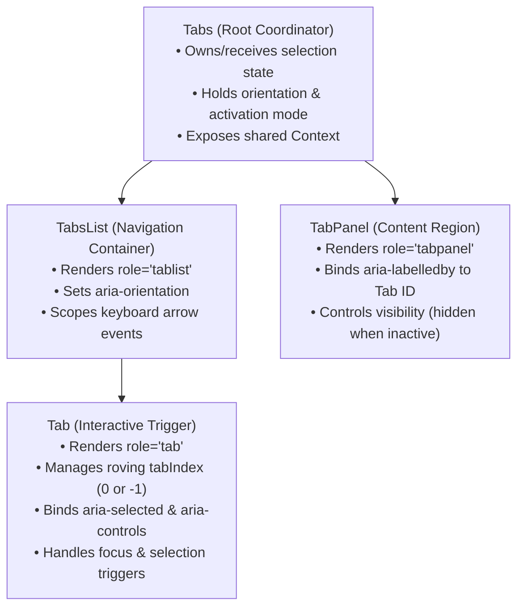

# Practical 06 — Compound Headless Tabs and Component State Boundaries

Related: [Chapter 6]() · [Lecture slides]()

## Objective

Build a resilient, headless compound tabs system that decouples interaction state machine logic, keyboard navigation, and WAI-ARIA semantics from presentation and styling. 

You will implement:
1. A **compound component hierarchy** (`Tabs`, `TabsList`, `Tab`, `TabPanel`) sharing state without prop drilling.
2. A dual **controlled and uncontrolled state contract** that prevents ambiguous state ownership.
3. A robust **WAI-ARIA accessible keyboard contract** featuring roving `tabindex`, automatic/manual activation modes, and bidirectional panel associations.
4. Independent verification confirming that consumer styling can change freely without breaking behavioral guarantees.

---

## Prerequisites and Workspace Setup

You need Node.js (v18+) and a modern front-end build environment (such as Vite with TypeScript and React or Vue 3).

Initialize your practical workspace:

```text
chapter-06-compound-tabs/
├── src/
│   ├── types.ts             # Compound interfaces, props, and accessibility types
│   ├── tabs-context.ts      # Context (React) or Provide/Inject (Vue) definition
│   ├── use-tabs-state.ts    # Headless state machine managing selection & focus
│   ├── components/
│   │   ├── Tabs.tsx         # Compound root and state coordinator
│   │   ├── TabsList.tsx     # Tab container with role="tablist"
│   │   ├── Tab.tsx          # Tab trigger with roving tabindex & ARIA attributes
│   │   └── TabPanel.tsx     # Associated content container with role="tabpanel"
│   ├── app.tsx              # Demonstration consumer showcasing custom styling
│   └── tabs.test.ts         # Automated behavioral tests
├── index.html
├── package.json
└── tsconfig.json
```

Ensure your TypeScript configuration enforces strict type checks (`"strict": true`).

---

## Stage 1 — Decompose Compound Responsibilities

Deconstruct the tabs widget into four distinct component boundaries. Each component must own a single, cohesive responsibility:



### Component Contract Definitions

In `src/types.ts`, define your public contracts:

```typescript
export type TabOrientation = 'horizontal' | 'vertical';
export type TabActivationMode = 'automatic' | 'manual';

export interface TabsRootProps {
  readonly value?: string;
  readonly defaultValue?: string;
  readonly onValueChange?: (value: string) => void;
  readonly orientation?: TabOrientation;
  readonly activationMode?: TabActivationMode;
  readonly children: React.ReactNode;
}

export interface TabsContextValue {
  readonly selectedValue: string;
  readonly orientation: TabOrientation;
  readonly activationMode: TabActivationMode;
  readonly registerTab: (id: string, value: string, disabled: boolean) => void;
  readonly unregisterTab: (value: string) => void;
  readonly selectTab: (value: string) => void;
  readonly getPanelId: (value: string) => string;
  readonly getTabId: (value: string) => string;
}
```

---

## Stage 2 — Controlled vs. Uncontrolled State Machine

A component must never exist in an ambiguous half-controlled state. Implement a unified state hook `useTabsState` that honors the state ownership contract:

* **Uncontrolled Mode:** If `props.value` is `undefined`, internal state is initialized to `props.defaultValue` (or the first registered tab) and managed locally.
* **Controlled Mode:** If `props.value` is defined, the component derives its active selection strictly from `props.value`. When user interactions trigger a selection, the component delegates the update via `props.onValueChange(newValue)`.

```typescript
// src/use-tabs-state.ts
import { useState, useCallback } from 'react';

export function useTabsState(
  controlledValue?: string,
  defaultValue?: string,
  onValueChange?: (value: string) => void
) {
  const isControlled = controlledValue !== undefined;
  const [internalValue, setInternalValue] = useState<string>(defaultValue ?? '');

  const currentValue = isControlled ? controlledValue : internalValue;

  const selectTab = useCallback((newValue: string) => {
    if (!isControlled) {
      setInternalValue(newValue);
    }
    onValueChange?.(newValue);
  }, [isControlled, onValueChange]);

  return { selectedValue: currentValue, selectTab, isControlled };
}
```

Verify that passing both `value` and `defaultValue` does not trigger uncontrolled state overwrites, and that controlled updates propagate without lag or double-render cycles.

---

## Stage 3 — Implement the WAI-ARIA and Keyboard Contract

The WAI-ARIA Tabs pattern requires strict accessibility attributes and precise keyboard behavior.

### 1. ARIA Relationship Wiring

For every tab and panel pair, establish explicit cross-linking IDs:
* The `Tab` element must render `id={`tab-${value}`}` and `aria-controls={`panel-${value}`}`.
* The `TabPanel` element must render `id={`panel-${value}`}` and `aria-labelledby={`tab-${value}`}`.
* When active, the `Tab` sets `aria-selected="true"`. Inactive tabs set `aria-selected="false"`.
* Inactive `TabPanel` containers must have the HTML `hidden` attribute applied.

### 2. Roving `tabindex` Focus Management

Tabs must not all be focusable with the `Tab` key:
* The **currently selected tab** has `tabIndex={0}`.
* All **unselected tabs** have `tabIndex={-1}`.
* When a keyboard user presses `Tab`, focus lands only on the active tab. Pressing `Tab` again moves focus completely out of the tablist (into the active panel or the next document control).

### 3. Arrow Key Navigation

Implement keyboard handling in `TabsList`:
* **Horizontal Orientation:** `ArrowRight` focuses the next enabled tab; `ArrowLeft` focuses the previous enabled tab.
* **Vertical Orientation:** `ArrowDown` focuses the next enabled tab; `ArrowUp` focuses the previous enabled tab.
* **Navigation Extremes:** `Home` focuses the first tab; `End` focuses the last tab.
* **Wrapping:** Moving past the end wraps focus to the beginning (and vice versa).
* **Activation Mode:**
  * In `automatic` mode, focusing a tab via Arrow keys immediately selects it and displays its panel.
  * In `manual` mode, moving focus with Arrow keys does not change the active panel until the user presses `Enter` or `Space`.

```typescript
// Inside TabsList keyboard event handler:
function handleKeyDown(event: React.KeyboardEvent) {
  const tabs = enabledTabsList;
  const currentIndex = tabs.findIndex(t => t.value === focusedValue);
  let nextIndex = -1;

  switch (event.key) {
    case 'ArrowRight':
    case 'ArrowDown':
      event.preventDefault();
      nextIndex = (currentIndex + 1) % tabs.length;
      break;
    case 'ArrowLeft':
    case 'ArrowUp':
      event.preventDefault();
      nextIndex = (currentIndex - 1 + tabs.length) % tabs.length;
      break;
    case 'Home':
      event.preventDefault();
      nextIndex = 0;
      break;
    case 'End':
      event.preventDefault();
      nextIndex = tabs.length - 1;
      break;
    case 'Enter':
    case ' ':
      if (activationMode === 'manual') {
        event.preventDefault();
        selectTab(focusedValue);
      }
      return;
    default:
      return;
  }

  const nextTab = tabs[nextIndex];
  if (nextTab) {
    focusTab(nextTab.value);
    if (activationMode === 'automatic') {
      selectTab(nextTab.value);
    }
  }
}
```

---

## Stage 4 — Verification Matrix and Optional Extensions

### Verification Matrix

Execute the following test cases to confirm architectural integrity:

| # | Action | Expected Observable Result | Status |
|---|--------|----------------------------|--------|
| **V1** | Press `Tab` from preceding document control | Focus lands on the currently active tab only (`tabIndex="0"`). All other tabs report `tabIndex="-1"`. | |
| **V2** | Press `ArrowRight` (in horizontal automatic mode) | Focus shifts to the next tab, `aria-selected="true"` moves to it, and its associated `TabPanel` becomes visible while the previous panel receives `hidden`. | |
| **V3** | Press `End` key | Focus jumps directly to the final tab in the list. | |
| **V4** | Switch to controlled mode (`value="tab2"`) | The second tab is active. Calling external setter changes selection without internal state desync. | |
| **V5** | Strip all visual CSS classes | The component functions completely identically: keyboard traversal, ARIA announcements, and panel switching remain intact. | |

### Optional Extensions

1. **Disabled Tabs:** Add a `disabled` boolean prop to `Tab`. Ensure disabled tabs receive `aria-disabled="true"`, cannot be activated via click/Enter, and are gracefully skipped during Arrow key traversal.
2. **Lazy Panel Loading:** Enhance `TabPanel` with a `lazy` prop. When `true`, panel contents are not mounted in the DOM until the tab is selected for the first time.

---

## Evaluation Rubric

| Criterion | Exemplary (4) | Proficient (3) | Developing (2) | Inadequate (1) |
|---|---|---|---|---|
| **Decomposition & API Design** | Clean compound components sharing context; consumer has full markup and styling freedom; zero boolean prop clutter. | Compound hierarchy used, but leaks presentation details into root props. | Flat component requiring large configuration object or array of tabs. | Single monolithic component with hard-coded markup. |
| **State Ownership Contract** | Pure controlled and uncontrolled modes supported seamlessly without conflicting state updates. | Supports both modes but shows brief flicker or console warnings on switch. | Only supports one mode (controlled or uncontrolled). | State is entangled and out of sync with external props. |
| **WAI-ARIA & Keyboard Semantics** | Flawless roving `tabindex`, correct ARIA cross-linking (`aria-controls`, `aria-labelledby`), Arrow, Home/End, and mode handling. | Keyboard navigation works, but missing `aria-controls` or Home/End keys. | Uses standard `Tab` key to focus every single tab button; missing roving `tabindex`. | No ARIA roles or keyboard handlers implemented. |
| **Headless Robustness** | Behavioral logic is completely decoupled from visual CSS; works across different themes and layouts. | Headless logic works but assumes specific layout or wrapper tags. | Visual styles are hard-coded into behavioral components. | Breaking styles breaks component interaction. |
