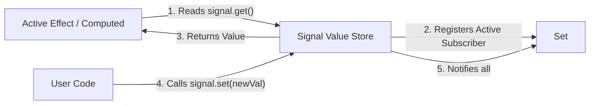

# Practical 07 — Reactive Dependency Graph and State Derivation

Related: [Chapter 7]() · [Lecture slides]()

## Objective

Build a transparent, educational reactive dependency graph in TypeScript from scratch. You will implement the core primitives that power modern reactive architectures:
1. **Signals (State Sources):** Observable containers that register subscribers on read and notify on write.
2. **Computed Values (Pure Derivations):** Lazy, cached derivations that re-evaluate only when an upstream dependency changes.
3. **Effects (Synchronization Boundaries):** Side-effect observers that react to dependency invalidations and execute explicit cleanup callbacks.

You will trace exact execution timelines, observe dynamic dependency switching, verify cache reuse, and demonstrate how cycles and infinite loops occur when side effects mutate source state.

> [!IMPORTANT]
> **Educational Model Notice:** This laboratory constructs a pedagogical reactive runtime (~100 lines of code) to make dependency discovery and caching mechanics visible. To keep concepts accessible, it deliberately omits advanced production features such as topological glitch-free resolution (diamond dependency sorting), weak reference garbage collection, multi-priority concurrent scheduling, and compiler-level AST transforms.

---

## Prerequisites and Workspace Setup

You need Node.js (v18+) and the TypeScript compiler.

Initialize your workspace:

```text
chapter-07-reactive-graph/
├── src/
│   ├── reactive.ts          # Core engine: signal, computed, effect, context stack
│   ├── types.ts             # Subscriber and dependency interfaces
│   ├── visualizer.ts        # ASCII / DOM graph inspector logging execution order
│   └── main.ts              # Running scenario: searchable list & URL sync
├── index.html
├── package.json
└── tsconfig.json
```

Ensure your `tsconfig.json` enforces strict mode:

```json
{
  "compilerOptions": {
    "target": "ES2022",
    "module": "ESNext",
    "moduleResolution": "bundler",
    "strict": true,
    "skipLibCheck": true
  }
}
```

---

## Stage 1 — The Signal Primitive and Subscriber Context

Reactivity requires discovering which computations depend on which data. In `src/reactive.ts`, implement a global subscriber stack and the `createSignal` primitive:



```typescript
// src/types.ts
export type Subscriber = {
  execute: () => void;
  dependencies: Set<Set<Subscriber>>;
};

// src/reactive.ts
let activeSubscriber: Subscriber | null = null;
const subscriberStack: Subscriber[] = [];

export function pushSubscriber(sub: Subscriber) {
  subscriberStack.push(sub);
  activeSubscriber = sub;
}

export function popSubscriber() {
  subscriberStack.pop();
  activeSubscriber = subscriberStack[subscriberStack.length - 1] ?? null;
}

export function createSignal<T>(initialValue: T) {
  let value = initialValue;
  const subscribers = new Set<Subscriber>();

  const get = (): T => {
    if (activeSubscriber) {
      subscribers.add(activeSubscriber);
      activeSubscriber.dependencies.add(subscribers);
    }
    return value;
  };

  const set = (nextValue: T | ((prev: T) => T)): void => {
    const resolved = typeof nextValue === 'function' 
      ? (nextValue as (prev: T) => T)(value) 
      : nextValue;

    if (!Object.is(value, resolved)) {
      value = resolved;
      // Copy to prevent infinite loops during subscriber iteration
      const toNotify = Array.from(subscribers);
      toNotify.forEach(sub => sub.execute());
    }
  };

  return [get, set] as const;
}
```

---

## Stage 2 — Lazy Computed Values and Invalidation

A computed value represents derived data. It must never perform eager calculation if nobody is reading it, and it must never recompute if its upstream dependencies have not changed.

Implement `createComputed`:

```typescript
export function createComputed<T>(fn: () => T) {
  let cachedValue: T;
  let isDirty = true;
  const subscribers = new Set<Subscriber>();

  const selfSubscriber: Subscriber = {
    execute: () => {
      if (!isDirty) {
        isDirty = true;
        subscribers.forEach(sub => sub.execute());
      }
    },
    dependencies: new Set(),
  };

  const get = (): T => {
    if (activeSubscriber) {
      subscribers.add(activeSubscriber);
      activeSubscriber.dependencies.add(subscribers);
    }

    if (isDirty) {
      // Clean previous dependency links before re-running to support dynamic branching
      selfSubscriber.dependencies.forEach(depSet => depSet.delete(selfSubscriber));
      selfSubscriber.dependencies.clear();

      pushSubscriber(selfSubscriber);
      try {
        cachedValue = fn();
        isDirty = false;
      } finally {
        popSubscriber();
      }
    }

    return cachedValue;
  };

  return get;
}
```

Verify that calling `get()` three times without modifying source signals invokes `fn()` exactly once.

---

## Stage 3 — Effects and Resource Cleanup

An effect bridges pure reactive state to imperative external systems (DOM rendering, network dispatch, storage persistence).

Implement `createEffect` with explicit cleanup:

```typescript
export function createEffect(fn: (onCleanup: (cb: () => void) => void) => void) {
  let cleanupFn: (() => void) | null = null;

  const onCleanup = (cb: () => void) => {
    cleanupFn = cb;
  };

  const selfSubscriber: Subscriber = {
    execute: () => {
      // Run cleanup from previous execution
      if (cleanupFn) {
        cleanupFn();
        cleanupFn = null;
      }

      // Clear old dependencies for dynamic branches
      selfSubscriber.dependencies.forEach(depSet => depSet.delete(selfSubscriber));
      selfSubscriber.dependencies.clear();

      pushSubscriber(selfSubscriber);
      try {
        fn(onCleanup);
      } finally {
        popSubscriber();
      }
    },
    dependencies: new Set(),
  };

  // Initial immediate run
  selfSubscriber.execute();

  // Return a teardown handle to dispose of the effect completely
  return () => {
    if (cleanupFn) cleanupFn();
    selfSubscriber.dependencies.forEach(depSet => depSet.delete(selfSubscriber));
    selfSubscriber.dependencies.clear();
  };
}
```

---

## Stage 4 — Verification Matrix and Cycle Analysis

### 1. Cycle Hazard Experiment

In `src/main.ts`, deliberately construct a cyclic dependency:

```typescript
const [count, setCount] = createSignal(0);

createEffect(() => {
  console.log('Count is:', count());
  setCount(c => c + 1); // ⚠️ CYCLIC HAZARD: Mutating source inside effect
});
```

Observe the resulting browser crash / stack overflow (`Maximum call stack size exceeded`). Explain why production systems (like Vue's queue watcher and React's loop detection) enforce maximum update depth thresholds (e.g., 50 or 100 iterations) and throw explicit architectural errors.

### 2. Verification Matrix

| # | Action | Expected Observable Result | Status |
|---|--------|----------------------------|--------|
| **V1** | Read a computed value 5 times sequentially without signal mutation | Underlying calculation function logs execution **exactly once** (cached). | |
| **V2** | Mutate unrelated signal | Computed function is **not** re-evaluated. | |
| **V3** | Mutate source dependency of an effect | Previous cleanup callback executes **before** the new effect body runs. | |
| **V4** | Conditional branch: `computed(() => useA() ? sigA() : sigB())` | When `useA` switches to `false`, mutations to `sigA` no longer trigger recalculation. | |
| **V5** | Dispose effect using teardown handle | Future signal changes do not trigger the disposed effect. | |

---

## Evaluation Rubric

| Criterion | Exemplary (4) | Proficient (3) | Developing (2) | Inadequate (1) |
|---|---|---|---|---|
| **Reactivity Architecture** | Clean implementation of subscriber stack, signal access, and notification decoupling. | Core reactivity works, but leaks subscribers across re-runs. | Manual subscription passing; lacks automatic dependency discovery. | Broken reactivity requiring explicit manual trigger calls. |
| **Derived State & Caching** | Computed values are strictly lazy; cached values served on repeated reads; invalidated only when dirty. | Computed values work, but calculate eagerly upon dependency change. | Calculates on every read; lacks caching. | Computed values fail to update when sources change. |
| **Effect & Cleanup Lifecycle** | Robust cleanup lifecycle (`onCleanup` runs before re-run and on disposal); prevents memory leaks. | Effect re-runs correctly, but cleanup is executed at the wrong phase. | Effects run, but lack any cleanup mechanism. | Effects cause uncaught infinite recursion on simple updates. |
| **Architectural Boundaries** | Clear distinction between pure derivation and imperative effects; models cycle detection and limitations. | Explains limitations, but misses the distinction between derivation and effects. | Confuses state derivation with effects. | No understanding of why cyclic mutations break reactive graphs. |
