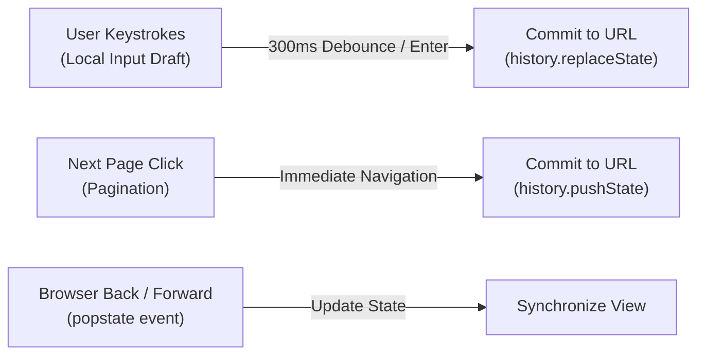

# Practical 08 - URL-Driven State Architecture and Form Boundaries

Related: [Chapter 8]() · [Lecture slides]()

## Objective

Build a resilient, URL-synchronized catalogue and administrative edit workflow that treats the browser address bar as a primary, shareable source of truth.

You will implement:
1. A **serializable URL state contract** that parses, validates, and serializes search filters, sort criteria, and pagination.
2. An intentional **history transition model** distinguishing `pushState` (navigating pages) from `replaceState` (filtering).
3. A **two-tier input architecture** that separates immediate keystroke drafts from committed URL parameters and background API queries.
4. A **form state machine** managing touched, dirty, validation, and unsaved changes confirmation during route transitions.

---

## Prerequisites and Workspace Setup

You need Node.js (v18+) and a modern bundler setup (Vite with TypeScript and React or Vue).

Initialize your practical workspace:

```text
chapter-08-url-catalogue/
├── src/
│   ├── types.ts             # URL state, form state, and domain interfaces
│   ├── url-state.ts         # Boundary parser, validator, and serializer
│   ├── use-url-sync.ts      # Custom hook / composable wiring history & popstate
│   ├── form-reducer.ts      # Form state machine (touched, dirty, errors)
│   ├── components/
│   │   ├── CatalogueView.tsx# Filter toolbar, product table, and pagination
│   │   └── ProductEdit.tsx  # Routed edit form with unsaved changes guard
│   └── main.tsx             # Application router entry point
├── index.html
├── package.json
└── tsconfig.json
```

---

## Stage 1 - Serializable URL Contract and Boundary Parser

The address bar accepts arbitrary strings from external sources. Raw query strings must be treated as untrusted boundaries and validated against strict schemas before entering application state.

### 1.1 State Contract Definition

In `src/types.ts`:

```typescript
export type SortOption = 'name' | 'price' | 'date';

export interface CatalogueURLState {
  readonly query: string;
  readonly category: string;
  readonly sort: SortOption;
  readonly page: number;
}

export const DEFAULT_CATALOGUE_STATE: CatalogueURLState = {
  query: '',
  category: 'all',
  sort: 'name',
  page: 1,
};
```

### 1.2 Boundary Parser and Serializer

In `src/url-state.ts`, implement resilient parsing with defaults and clean serialization:

```typescript
const VALID_SORTS: readonly SortOption[] = ['name', 'price', 'date'];

export function parseCatalogueParams(search: string): CatalogueURLState {
  const params = new URLSearchParams(search);

  // Validate sort enum
  const rawSort = params.get('sort');
  const sort: SortOption = VALID_SORTS.includes(rawSort as SortOption)
    ? (rawSort as SortOption)
    : DEFAULT_CATALOGUE_STATE.sort;

  // Validate positive integer page
  const rawPage = parseInt(params.get('page') ?? '1', 10);
  const page = Number.isInteger(rawPage) && rawPage > 0 ? rawPage : 1;

  return {
    query: params.get('q')?.trim() ?? DEFAULT_CATALOGUE_STATE.query,
    category: params.get('category')?.trim() || DEFAULT_CATALOGUE_STATE.category,
    sort,
    page,
  };
}

export function serializeCatalogueParams(state: CatalogueURLState): string {
  const params = new URLSearchParams();

  if (state.query) params.set('q', state.query);
  if (state.category !== 'all') params.set('category', state.category);
  if (state.sort !== 'name') params.set('sort', state.sort);
  if (state.page > 1) params.set('page', String(state.page));

  const str = params.toString();
  return str ? `?${str}` : '';
}
```

Verify that omitting default values keeps the URL clean (e.g. displaying `/products` rather than `/products?q=&category=all&sort=name&page=1`).

---

## Stage 2 - History Semantics and Two-Tier Debouncing

Do not push a new browser history entry on every keystroke. Separate immediate typing from committed URL state:



Implement `useURLSync`:
1. **Local Draft:** Bind the search text input to an immediate local state variable so typing feels fluid with zero input lag.
2. **Debounced Commit:** Debounce URL updates by 300ms. Use `history.replaceState` so that back-button navigation does not trap the user in twenty partial keystroke states.
3. **Discrete Actions:** When the user changes pagination or sorting, use `history.pushState` so that each page change creates an explicit back-button step.
4. **Popstate Listener:** Listen to `window.addEventListener('popstate')` to update local state when the user navigates using the browser's native Back/Forward buttons.

---

## Stage 3 - Form State Machine and Unsaved Changes Guard

When a user clicks "Edit" on an item, the application transitions to `/products/:id/edit`.

### 3.1 Detached Draft State

Never bind the edit form directly to cached server data. Initialize a local, detached draft:

```typescript
export interface ProductDraft {
  title: string;
  price: string;
  department: string;
}

export interface FormState {
  initial: ProductDraft;
  current: ProductDraft;
  touched: Set<keyof ProductDraft>;
  isSubmitting: boolean;
  submitError: string | null;
}
```

### 3.2 Form Reducer and Dirty State

Calculate dirty state purely: `isDirty = JSON.stringify(current) !== JSON.stringify(initial)`.

```typescript
export type FormAction =
  | { type: 'CHANGE'; field: keyof ProductDraft; value: string }
  | { type: 'BLUR'; field: keyof ProductDraft }
  | { type: 'SUBMIT_START' }
  | { type: 'SUBMIT_SUCCESS' }
  | { type: 'SUBMIT_ERROR'; error: string }
  | { type: 'RESET' };

export function formReducer(state: FormState, action: FormAction): FormState {
  switch (action.type) {
    case 'CHANGE':
      return {
        ...state,
        current: { ...state.current, [action.field]: action.value },
      };
    case 'BLUR':
      return {
        ...state,
        touched: new Set(state.touched).add(action.field),
      };
    case 'RESET':
      return {
        ...state,
        current: state.initial,
        touched: new Set(),
      };
    default:
      return state;
  }
}
```

### 3.3 Navigation Guard

Attach a `beforeunload` browser event handler and route transition interceptor: if `isDirty` is true and the user attempts to click away or close the tab, prompt for confirmation before discarding changes.

---

## Stage 4 - Verification Matrix and Security Boundaries

### 1. What Must NEVER Enter the URL

| Classification | Forbidden Data Examples | Architectural Hazard | Proper Storage Location |
|---|---|---|---|
| **Credentials & Auth** | Bearer tokens, passwords, API keys | Leaked via browser history, server access logs, and HTTP Referer headers. | In-memory token store, `httpOnly` secure cookies. |
| **Personal Identifiers** | National civil IDs, phone numbers, health records | Indexed by external analytics; visible over shoulders. | Private application state / Encrypted session. |
| **Volatile Drafts** | 2,000-word essay drafts, unsaved forms | Exceeds URL length limits; triggers encoding corruption. | Component draft state / IndexedDB offline store. |

### 2. Verification Matrix

| # | Action | Expected Observable Result | Status |
|---|--------|----------------------------|--------|
| **V1** | Apply filters `q=residence` and `page=3`, copy URL to incognito window | Incognito session opens exactly at page 3 with `residence` query pre-filled and filtered. | |
| **V2** | Manually edit URL to `?page=-99&sort=INVALID` | Boundary parser safely falls back to `page=1` and `sort=name` without application crash. | |
| **V3** | Type `"certificate"` into search bar, then click browser Back | Returns directly to the previous page/view without stepping through individual keystrokes. | |
| **V4** | Navigate: Page 1 $\rightarrow$ Page 2 $\rightarrow$ Page 3 $\rightarrow$ Click Back | Restores Page 2, URL reflects `?page=2`, and list updates correctly. | |
| **V5** | Edit product title, do not save, click navigation link | Browser alerts that unsaved changes will be lost before navigating away. | |

---

## Evaluation Rubric

| Criterion | Exemplary (4) | Proficient (3) | Developing (2) | Inadequate (1) |
|---|---|---|---|---|
| **URL State Architecture** | Strict typing, boundary parser with fallback defaults, clean serialization omitting defaults, bidirectional `popstate` sync. | URL parsing works, but crashes on malformed params or serializes redundant defaults. | Partial URL sync; missing pagination or sort support. | No URL state; all filters stored exclusively in memory. |
| **History & Debounce Semantics** | Flawless distinction between `pushState` for actions and `replaceState` for debounced typing; zero history pollution. | Debounces typing, but pushes history entries for every keystroke. | No debouncing; rapid typing creates lagging renders. | Direct page reloads required to update URL state. |
| **Form Lifecycle & Reducer** | Pure reducer managing draft, touched, dirty, and errors; detached from server cache; unsaved changes guard. | Form manages state, but mutates shared server data directly or lacks dirty tracking. | Basic form; validation occurs only on final submission. | Uncontrolled inputs with no state tracking or navigation safety. |
| **Security & Privacy Perimeter** | Zero sensitive data in URLs; strict validation of URL search params; clear boundary definition. | No sensitive data in URL, but lacks validation against XSS in query parameters. | Passes sensitive IDs or form draft payloads via query string. | Stores sensitive secrets or passwords directly in URL parameters. |
