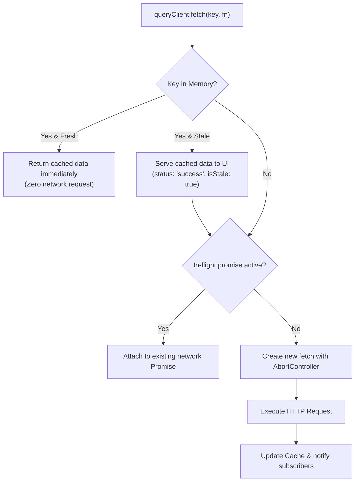

# Practical 09 — Cached Server-State Client with Optimistic Mutations

Related: [Chapter 9]() · [Lecture slides]()

## Objective

Build a resilient, framework-agnostic asynchronous server-state cache manager (a micro TanStack Query) from scratch in TypeScript. 

You will implement:
1. **Deterministic Query Key Hashing:** Storing and retrieving queries by composite serialized keys.
2. **Stale-While-Revalidate (SWR) Caching:** Serving cached snapshots instantly while asynchronously fetching fresh server data in the background.
3. **In-Flight Request Deduplication:** Merging concurrent duplicate calls into a single shared network promise.
4. **Transient Error Retry with Exponential Backoff:** Automatically retrying 5xx and network failures while respecting cancellation signals.
5. **Optimistic Mutations with Snapshot Rollback:** Updating cache entries immediately upon user action, reverting gracefully if the server rejects the request.

---

## Prerequisites and Workspace Setup

You need Node.js (v18+) and the TypeScript compiler.

Initialize your practical workspace:

```text
chapter-09-cache-client/
├── src/
│   ├── types.ts             # Cache entry, query options, and mutation types
│   ├── query-key.ts         # Deterministic key serialization
│   ├── query-cache.ts       # SWR store, deduplication map, and invalidation
│   ├── fetch-retry.ts       # Abortable fetch with exponential backoff
│   ├── mutation-manager.ts  # Optimistic execution and snapshot rollback
│   ├── app.ts               # Simulated REST server and UI demonstration
│   └── cache.test.ts        # Unit test suite for deduplication & retry
├── index.html
├── package.json
└── tsconfig.json
```

---

## Stage 1 — Deterministic Query Key Serialization

Query keys represent the semantic identity of a server request. Keys often contain nested objects (such as `{ sort: 'date', page: 2 }`), which cannot be compared with standard referential equality (`===`).

In `src/query-key.ts`, implement a deterministic serializer that sorts object keys alphabetically:

```typescript
export type QueryKey = readonly unknown[];

export function serializeKey(key: QueryKey): string {
  return JSON.stringify(key, (_, val) => {
    if (val !== null && typeof val === 'object' && !Array.isArray(val)) {
      return Object.keys(val)
        .sort()
        .reduce<Record<string, unknown>>((acc, k) => {
          acc[k] = val[k];
          return acc;
        }, {});
    }
    return val;
  });
}
```

Verify that `['permits', { page: 1, sort: 'name' }]` and `['permits', { sort: 'name', page: 1 }]` produce identical hash strings: `["permits",{"page":1,"sort":"name"}]`.

---

## Stage 2 — Stale-While-Revalidate and Request Deduplication

In `src/query-cache.ts`, implement the core SWR cache engine:



```typescript
// src/types.ts
export interface CacheEntry<T> {
  data: T;
  timestamp: number;
  isStale: boolean;
}

export interface QueryOptions {
  staleTime?: number; // ms before data is considered stale (default: 0)
}

// src/query-cache.ts
export class QueryClient {
  private cache = new Map<string, CacheEntry<unknown>>();
  private inFlight = new Map<string, Promise<unknown>>();
  private subscribers = new Map<string, Set<(data: unknown) => void>>();

  async fetch<T>(
    key: QueryKey,
    queryFn: (signal: AbortSignal) => Promise<T>,
    options: QueryOptions = {}
  ): Promise<T> {
    const serialized = serializeKey(key);
    const staleTime = options.staleTime ?? 0;
    const existing = this.cache.get(serialized) as CacheEntry<T> | undefined;

    const isFresh = existing && (Date.now() - existing.timestamp < staleTime);

    if (existing && isFresh) {
      return existing.data;
    }

    // Deduplicate in-flight requests
    if (this.inFlight.has(serialized)) {
      return this.inFlight.get(serialized) as Promise<T>;
    }

    const controller = new AbortController();
    const promise = (async () => {
      try {
        const data = await queryFn(controller.signal);
        this.cache.set(serialized, {
          data,
          timestamp: Date.now(),
          isStale: false,
        });
        this.notify(serialized, data);
        return data;
      } finally {
        this.inFlight.delete(serialized);
      }
    })();

    this.inFlight.set(serialized, promise);
    return existing ? existing.data : promise;
  }

  invalidate(keyPrefix: QueryKey): void {
    const prefixStr = serializeKey(keyPrefix).slice(0, -1); // Match array prefix
    for (const [key] of this.cache) {
      if (key.startsWith(prefixStr)) {
        const entry = this.cache.get(key);
        if (entry) entry.isStale = true;
      }
    }
  }

  private notify(serializedKey: string, data: unknown) {
    this.subscribers.get(serializedKey)?.forEach(cb => cb(data));
  }
}
```

---

## Stage 3 — Abortable Fetch with Exponential Backoff

In `src/fetch-retry.ts`, implement a transport wrapper that handles network dropouts and 5xx server errors with randomized exponential jitter:

```typescript
export interface RetryOptions {
  maxRetries?: number;
  initialDelayMs?: number;
}

export async function fetchWithRetry<T>(
  url: string,
  signal: AbortSignal,
  options: RetryOptions = {}
): Promise<T> {
  const maxRetries = options.maxRetries ?? 3;
  let delay = options.initialDelayMs ?? 1000;

  for (let attempt = 0; attempt <= maxRetries; attempt++) {
    if (signal.aborted) throw new DOMException('Aborted', 'AbortError');

    try {
      const res = await fetch(url, { signal });

      // Fail fast on client errors (4xx) - they should never be retried automatically
      if (res.status >= 400 && res.status < 500) {
        throw new Error(`Client error: ${res.status} ${res.statusText}`);
      }

      if (!res.ok) {
        throw new Error(`Server error: ${res.status}`);
      }

      return (await res.json()) as T;
    } catch (err) {
      const isAbort = (err as Error).name === 'AbortError';
      if (isAbort || attempt === maxRetries) throw err;

      // Add full jitter: delay * random(0.5, 1.5)
      const jitteredDelay = delay * (0.5 + Math.random());
      await new Promise(resolve => setTimeout(resolve, jitteredDelay));
      delay *= 2; // Exponential increase
    }
  }

  throw new Error('Unreachable');
}
```

---

## Stage 4 — Optimistic Mutations and Verification Matrix

### 1. The Optimistic Mutation Contract

In `src/mutation-manager.ts`, implement mutation execution with snapshot rollback:

```typescript
export async function executeOptimisticMutation<TData, TVariables>(
  client: QueryClient,
  queryKey: QueryKey,
  optimisticUpdate: (prev: TData, vars: TVariables) => TData,
  mutationFn: (vars: TVariables) => Promise<TData>,
  variables: TVariables
): Promise<void> {
  const serialized = serializeKey(queryKey);
  const previousData = client.getQueryData<TData>(queryKey);

  // 1. Snapshot and immediately apply optimistic prediction
  if (previousData) {
    const provisional = optimisticUpdate(previousData, variables);
    client.setQueryData(queryKey, provisional);
  }

  try {
    // 2. Perform authoritative network request
    const canonical = await mutationFn(variables);
    // 3. Confirm with server canonical response
    client.setQueryData(queryKey, canonical);
  } catch (err) {
    // 4. Rollback to pristine snapshot upon failure
    if (previousData) {
      client.setQueryData(queryKey, previousData);
    }
    throw err;
  }
}
```

### 2. Verification Matrix

| # | Action | Expected Observable Result | Status |
|---|--------|----------------------------|--------|
| **V1** | Mount three components calling `client.fetch(['permits'])` simultaneously | Exact single network call dispatched (`inFlight` deduplicated); all three resolve same data. | |
| **V2** | Read cached data within `staleTime` | Resolves synchronously from memory in 0ms without network dispatch. | |
| **V3** | Simulate 503 Service Unavailable on fetch | Client retries 3 times with exponentially increasing intervals before throwing error. | |
| **V4** | User edits permit title with optimistic update | UI updates title instantly. Simulated network error 500 triggers rollback to original title. | |
| **V5** | Mutation succeeds on server | Triggers `client.invalidate(['permits'])`, marking queries stale and triggering background refresh. | |

---

## Evaluation Rubric

| Criterion | Exemplary (4) | Proficient (3) | Developing (2) | Inadequate (1) |
|---|---|---|---|---|
| **Cache Key Architecture** | Deterministic key sorting, nested object support, zero collision between similar query structures. | Keys serialized, but sensitive to object property insertion order. | Flat string keys only; lacks object parameter serialization. | Cache uses URL strings directly with no key structure. |
| **Deduplication & SWR** | Flawless promise reuse for concurrent requests; stale data served instantly while background revalidation executes. | In-flight deduplication works, but lacks SWR background update capability. | Caches data, but duplicate simultaneous calls create duplicate HTTP requests. | No caching; every component fetch initiates independent network calls. |
| **Retry & Backoff Engine** | Exponential backoff with jitter; fails fast on 4xx client errors; respects `AbortSignal` cancellation. | Backoff implemented, but retries client 4xx errors or lacks jitter. | Retries with fixed timeout delay; no backoff. | No retry logic; single network dropout causes permanent failure. |
| **Optimistic Rollback** | Clean snapshot preservation, instant UI preview, automatic rollback on failure, authoritative confirmation on success. | Optimistic update works, but leaves UI in corrupted state if server rejects request. | Pessimistic updates only; UI waits for server round-trip. | Directly mutates local state without server synchronization. |
