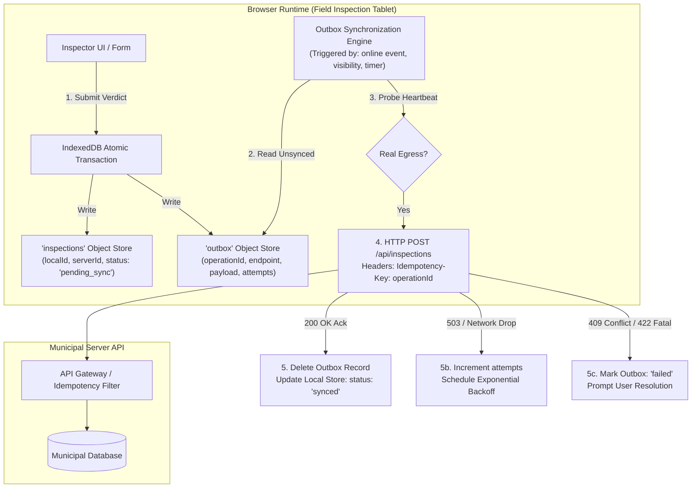
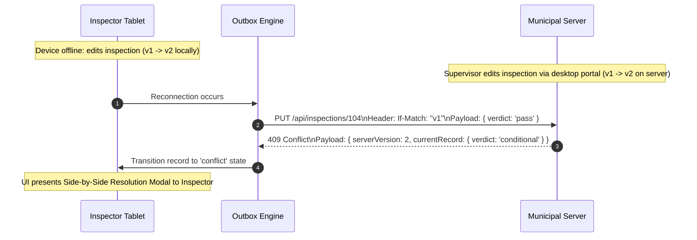

# Practical 10 — Offline Outbox and Resilient Synchronization

Related: [Chapter 10]() · [Lecture slides]()

## Objective

Build a resilient, local-first offline synchronization engine for a municipal field-inspection application using browser-native **IndexedDB** and a durable **Outbox Queue**.

You will engineer a client-side architecture that:
1. **Survives Complete Disconnection:** Allows inspectors to conduct inspections, draft notes, and record safety violation verdicts in offline basements with 0ms local latency.
2. **Maintains Transactional Integrity:** Commits domain record updates and outbox synchronization commands atomically using IndexedDB transactions.
3. **Recovers Seamlessly Across Browser Reboots:** Persists queued operations across page reloads, tab crashes, and device restarts.
4. **Guarantees Exactly-Once Server Processing:** Enforces client-generated `Idempotency-Key` headers to prevent duplicate record creation during network dropouts and retries.
5. **Classifies and Recovers from Failures:** Distinguishes retriable transient errors (HTTP 503 / dropped sockets) with exponential backoff from permanent validation rejections (HTTP 422), surfacing actionable conflict states to the user.



---

## Workspace Setup

Create a dedicated TypeScript practical directory:

```bash
mkdir -p practical-10-offline-sync/src
cd practical-10-offline-sync
npm init -y
npm install --save-dev typescript @types/node vitest
npx tsc --init
```

Ensure your `tsconfig.json` targets `ES2022` with `"moduleResolution": "node"` and `"lib": ["DOM", "ES2022"]`.

---

## Architecture and Core Types

Define the core domain contracts in `src/types.ts`:

```typescript
// src/types.ts
export type SyncStatus = 'draft' | 'pending_sync' | 'syncing' | 'synced' | 'conflict' | 'failed';

export interface FieldInspection {
  localId: string;              // Client-generated UUID (crypto.randomUUID())
  serverId: string | null;      // Canonical ID assigned by municipal backend
  facilityName: string;
  inspectorId: string;
  complianceVerdict: 'pass' | 'conditional' | 'violation';
  notes: string;
  updatedAt: number;
  serverVersion: number;        // Concurrency tag for optimistic locking
  syncStatus: SyncStatus;
}

export interface OutboxOperation {
  operationId: string;          // Unique idempotency key (UUID v4)
  entity: 'inspection';
  entityLocalId: string;
  endpoint: string;
  method: 'POST' | 'PUT' | 'PATCH';
  payload: Record<string, unknown>;
  createdAt: number;
  attempts: number;
  lastAttemptAt?: number;
  lastError?: string;
  status: 'queued' | 'syncing' | 'failed';
}

export interface ServerAcknowledgment {
  serverId: string;
  serverVersion: number;
  syncedAt: number;
}
```

---

## Stage-by-Stage Implementation

### Stage 1: IndexedDB Storage & Transactional Atomicity

Directly interacting with the callback-based `indexedDB` API is error-prone. Wrap database initialization and transactions in clean Promise boundaries:

```typescript
// src/db.ts
import { FieldInspection, OutboxOperation } from './types';

const DB_NAME = 'MunicipalInspectionDB';
const DB_VERSION = 1;

export async function openInspectionDatabase(): Promise<IDBDatabase> {
  return new Promise((resolve, reject) => {
    const request = indexedDB.open(DB_NAME, DB_VERSION);

    request.onerror = () => reject(request.error);
    request.onsuccess = () => resolve(request.result);

    request.onupgradeneeded = (event) => {
      const db = (event.target as IDBOpenDBRequest).result;

      // 1. Domain records store: indexed by localId
      if (!db.objectStoreNames.contains('inspections')) {
        const inspectionStore = db.createObjectStore('inspections', { keyPath: 'localId' });
        inspectionStore.createIndex('syncStatus', 'syncStatus', { unique: false });
        inspectionStore.createIndex('serverId', 'serverId', { unique: false });
      }

      // 2. Durable Outbox store: indexed by operationId
      if (!db.objectStoreNames.contains('outbox')) {
        const outboxStore = db.createObjectStore('outbox', { keyPath: 'operationId' });
        outboxStore.createIndex('status', 'status', { unique: false });
        outboxStore.createIndex('createdAt', 'createdAt', { unique: false });
      }
    };
  });
}
```

#### Requirement: Atomic Local Commit
When an inspector finishes a review, write both the updated inspection record and the new outbox command within the **same atomic database transaction**. If storage quota is exceeded or writing fails halfway through, the entire transaction rolls back, preventing orphaned outbox tasks:

```typescript
export async function commitInspectionLocally(
  db: IDBDatabase,
  inspection: FieldInspection,
  operation: OutboxOperation
): Promise<void> {
  return new Promise((resolve, reject) => {
    const tx = db.transaction(['inspections', 'outbox'], 'readwrite');
    
    tx.onerror = () => reject(tx.error);
    tx.oncomplete = () => resolve();

    const inspectionStore = tx.objectStore('inspections');
    const outboxStore = tx.objectStore('outbox');

    inspectionStore.put({ ...inspection, syncStatus: 'pending_sync' });
    outboxStore.put({ ...operation, status: 'queued' });
  });
}
```

---

### Stage 2: Outbox Consumer with Exponential Backoff

Construct `src/outboxEngine.ts`. The synchronization engine continuously observes the outbox queue, executing items sequentially while respecting backoff rules:

```typescript
// src/outboxEngine.ts
import { openInspectionDatabase } from './db';
import { OutboxOperation, ServerAcknowledgment } from './types';

export class OutboxEngine {
  private isProcessing = false;

  constructor(
    private readonly maxRetries = 4,
    private readonly baseDelayMs = 500,
    private readonly maxDelayMs = 8000
  ) {}

  /**
   * Drain pending outbox operations sequentially.
   */
  async processQueue(mockNetworkFetch: (op: OutboxOperation) => Promise<ServerAcknowledgment>): Promise<void> {
    if (this.isProcessing) return;
    this.isProcessing = true;

    try {
      const db = await openInspectionDatabase();
      const operations = await this.getQueuedOperations(db);

      for (const op of operations) {
        // Enforce exponential backoff delay before re-attempting
        if (op.attempts > 0 && op.lastAttemptAt) {
          const delay = Math.min(this.maxDelayMs, this.baseDelayMs * Math.pow(2, op.attempts - 1));
          const elapsed = Date.now() - op.lastAttemptAt;
          if (elapsed < delay) {
            continue; // Not ready for next retry window
          }
        }

        try {
          await this.markOperationStatus(db, op.operationId, 'syncing');
          const ack = await mockNetworkFetch(op);
          
          // Success: finalize domain record and clear outbox entry
          await this.completeOperation(db, op.entityLocalId, op.operationId, ack);
        } catch (error: unknown) {
          const isTransient = this.evaluateTransientError(error);
          const nextAttempts = op.attempts + 1;

          if (isTransient && nextAttempts < this.maxRetries) {
            await this.updateOperationRetry(db, op.operationId, nextAttempts, String(error));
          } else {
            // Permanent failure or retry limit exceeded
            await this.markOperationFailed(db, op.entityLocalId, op.operationId, String(error));
          }
        }
      }
    } finally {
      this.isProcessing = false;
    }
  }

  private evaluateTransientError(error: unknown): boolean {
    const errStr = String(error);
    // 5xx Server Errors and network drops are transient; 4xx are permanent
    return errStr.includes('503') || errStr.includes('500') || errStr.includes('NetworkError');
  }

  // Database helper methods for status transitions...
  private async getQueuedOperations(db: IDBDatabase): Promise<OutboxOperation[]> {
    return new Promise((resolve) => {
      const tx = db.transaction('outbox', 'readonly');
      const request = tx.objectStore('outbox').getAll();
      request.onsuccess = () => {
        const ops = (request.result as OutboxOperation[])
          .filter(o => o.status === 'queued' || o.status === 'syncing')
          .sort((a, b) => a.createdAt - b.createdAt);
        resolve(ops);
      };
    });
  }

  private async completeOperation(
    db: IDBDatabase, 
    localId: string, 
    operationId: string, 
    ack: ServerAcknowledgment
  ): Promise<void> {
    return new Promise((resolve, reject) => {
      const tx = db.transaction(['inspections', 'outbox'], 'readwrite');
      tx.oncomplete = () => resolve();
      tx.onerror = () => reject(tx.error);

      // Remove from outbox
      tx.objectStore('outbox').delete(operationId);

      // Reconcile domain record with server ID and synced status
      const inspStore = tx.objectStore('inspections');
      const getReq = inspStore.get(localId);
      getReq.onsuccess = () => {
        if (getReq.result) {
          inspStore.put({
            ...getReq.result,
            serverId: ack.serverId,
            serverVersion: ack.serverVersion,
            syncStatus: 'synced',
          });
        }
      };
    });
  }

  private async updateOperationRetry(
    db: IDBDatabase, 
    operationId: string, 
    attempts: number, 
    errorMsg: string
  ): Promise<void> {
    return new Promise((resolve, reject) => {
      const tx = db.transaction('outbox', 'readwrite');
      tx.oncomplete = () => resolve();
      tx.onerror = () => reject(tx.error);

      const store = tx.objectStore('outbox');
      const req = store.get(operationId);
      req.onsuccess = () => {
        if (req.result) {
          store.put({
            ...req.result,
            status: 'queued',
            attempts,
            lastAttemptAt: Date.now(),
            lastError: errorMsg,
          });
        }
      };
    });
  }

  private async markOperationStatus(db: IDBDatabase, operationId: string, status: 'syncing' | 'queued'): Promise<void> {
    return new Promise((resolve) => {
      const tx = db.transaction('outbox', 'readwrite');
      const store = tx.objectStore('outbox');
      const req = store.get(operationId);
      req.onsuccess = () => {
        if (req.result) {
          store.put({ ...req.result, status });
        }
      };
      tx.oncomplete = () => resolve();
    });
  }

  private async markOperationFailed(
    db: IDBDatabase, 
    localId: string, 
    operationId: string, 
    errorMsg: string
  ): Promise<void> {
    return new Promise((resolve, reject) => {
      const tx = db.transaction(['inspections', 'outbox'], 'readwrite');
      tx.oncomplete = () => resolve();
      tx.onerror = () => reject(tx.error);

      const outStore = tx.objectStore('outbox');
      const outReq = outStore.get(operationId);
      outReq.onsuccess = () => {
        if (outReq.result) {
          outStore.put({ ...outReq.result, status: 'failed', lastError: errorMsg });
        }
      };

      const inspStore = tx.objectStore('inspections');
      const inspReq = inspStore.get(localId);
      inspReq.onsuccess = () => {
        if (inspReq.result) {
          inspStore.put({ ...inspReq.result, syncStatus: 'failed' });
        }
      };
    });
  }
}
```

---

### Stage 3: Connectivity Probing & Triggers

Never rely solely on `window.addEventListener('online')` or `navigator.onLine`. Browsers frequently report `navigator.onLine = true` when trapped behind a public Wi-Fi portal or when connected to a router with no internet uplink.

Implement a composite sync listener:

```typescript
// src/connectivity.ts
export class ConnectivityManager {
  private listeners: Array<(isOnline: boolean) => void> = [];

  constructor(private readonly pingEndpoint = '/api/health') {
    window.addEventListener('online', () => this.verifyEgress());
    window.addEventListener('focus', () => this.verifyEgress());
    document.addEventListener('visibilitychange', () => {
      if (document.visibilityState === 'visible') {
        this.verifyEgress();
      }
    });
  }

  async verifyEgress(): Promise<boolean> {
    // If browser natively knows it's offline, don't bother probing
    if (typeof navigator !== 'undefined' && !navigator.onLine) {
      this.notify(false);
      return false;
    }

    try {
      const response = await fetch(this.pingEndpoint, {
        method: 'HEAD',
        cache: 'no-store',
        signal: AbortSignal.timeout(3000),
      });
      const reachable = response.ok;
      this.notify(reachable);
      return reachable;
    } catch {
      this.notify(false);
      return false;
    }
  }

  subscribe(listener: (isOnline: boolean) => void): () => void {
    this.listeners.push(listener);
    return () => {
      this.listeners = this.listeners.filter(l => l !== listener);
    };
  }

  private notify(isOnline: boolean): void {
    for (const listener of this.listeners) {
      listener(isOnline);
    }
  }
}
```

---

### Stage 4: Conflict Detection and Version Vectors

When an inspector reconciles an inspection report, the municipal server checks whether another supervisory officer modified the same record while the field inspector was offline:



---

## Verification and Testing Matrix

Validate your implementation against these required failure and recovery test scenarios:

| Test Case | Simulation Condition | Expected Behavioral Guarantee |
| :--- | :--- | :--- |
| **1. Cold Reboot Survival** | Queue 3 outbox inspections, immediately execute `window.location.reload()`. | All 3 operations remain in IndexedDB with `queued` status and uncorrupted payloads. |
| **2. Duplicate Prevention** | Trigger sync while network drops midway through response. Retry with identical `operationId`. | Server recognizes existing `Idempotency-Key` and returns acknowledgment without duplicating database records. |
| **3. Transient Backoff** | Mock API returns `503 Service Unavailable` for 2 attempts, then `200 OK`. | Engine backs off ($500\text{ms} \rightarrow 1000\text{ms}$), retries twice, and transitions record to `synced`. |
| **4. Permanent 422 Rejection** | Submit inspection with missing mandatory inspector signature (`422 Unprocessable`). | Engine halts retries immediately, marks outbox item `failed`, and surfaces validation message in the UI. |
| **5. Optimistic Concurrency** | Server returns `409 Conflict` (record modified by supervisor while inspector offline). | Record moves to `conflict` state; local draft is not deleted; inspector prompted with visual merge modal. |

---

## Deliverables & Submission Checklist

1. [ ] `src/types.ts`: Clean domain and outbox TypeScript interfaces.
2. [ ] `src/db.ts`: IndexedDB wrapper with atomic two-store transaction support.
3. [ ] `src/outboxEngine.ts`: Durable queue processor featuring exponential backoff, retry limits, and status transitions.
4. [ ] `src/connectivity.ts`: Egress heartbeat verifier that avoids trusting naive `navigator.onLine`.
5. [ ] `tests/outbox.test.ts`: Automated test suite covering the 5 scenarios in the verification matrix.
