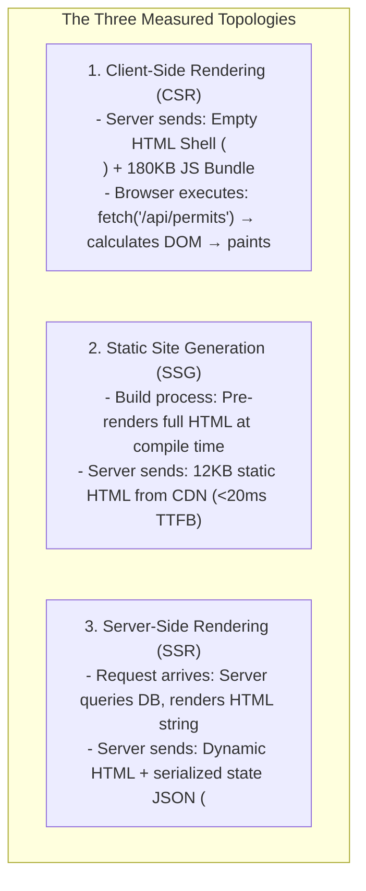

# Practical 11 — Rendering Topology Comparison: CSR, SSR, and Static Delivery

Related: [Chapter 11]() · [Lecture slides]()

## Objective

Evaluate and measure the concrete performance, architectural, and data-flow trade-offs between **Client-Side Rendering (CSR)**, **Server-Side Rendering (SSR)**, and **Static Site Generation (SSG)** across identical route requirements: the Municipal Public Permit Catalogue.

By completing this laboratory, you will:
1. **Instrument the Performance Triangle:** Measure runnable metrics—Time to First Byte (TTFB), First Contentful Paint (FCP), total transferred JavaScript bytes, and Time to Interactive (TTI)—across different topologies.
2. **Audit the State Handoff Boundary:** Inspect the serialized data payload transferred from server to client to prevent secret leakage and double-fetch overhead.
3. **Analyze Hydration Costs:** Observe the "uncanny valley" where server-rendered HTML is visible on screen but unclickable until client hydration finishes walking the DOM.
4. **Distinguish Runnable Measurements from Conceptual Topologies:** Conduct hands-on measurements for the core three topologies (CSR, SSR, SSG), while evaluating advanced topologies (Streaming and Islands) through structured architectural analysis.



---

## Workspace Setup

Set up a minimal Node.js / TypeScript environment with local instrumentation tools:

```bash
mkdir -p practical-11-rendering/src
cd practical-11-rendering
npm init -y
npm install --save-dev typescript @types/node vitest
npx tsc --init
```

Ensure your `tsconfig.json` targets `ES2022` with `"moduleResolution": "node"`.

---

## The Shared Catalogue Specification

All three implementations must render the exact same public data model and layout:

```typescript
// src/types.ts
export interface PermitSummary {
  id: string;
  permitNumber: string;
  businessName: string;
  category: 'Commercial' | 'Industrial' | 'Hospitality';
  status: 'active' | 'pending' | 'expired';
  issuedDate: string;
  feeAmountIQD: number;
}

export interface CatalogueViewModel {
  permits: PermitSummary[];
  generatedAt: string;
  topology: 'CSR' | 'SSR' | 'SSG';
}
```

---

## Stage-by-Stage Implementation

### Stage 1: The Client-Side Rendered (CSR) Baseline

In CSR, the web server acts merely as a dumb static file host. The server returns a near-empty HTML shell:

```html
<!-- dist/csr/index.html -->
<!DOCTYPE html>
<html lang="en">
<head>
  <meta charset="UTF-8">
  <title>Municipal Permits (CSR)</title>
  <link rel="stylesheet" href="/assets/style.css">
</head>
<body>
  <div id="root">
    <!-- Empty loading placeholder while JS executes -->
    <div class="skeleton-loader">Loading municipal permits...</div>
  </div>
  <script type="module" src="/assets/csr-bundle.js"></script>
</body>
</html>
```

In `src/csr-bundle.ts`, implement the client orchestrator:
1. When mounted, fire `fetch('/api/permits')`.
2. Await the JSON response.
3. Dynamically construct HTML strings or DOM elements and insert them into `#root`.
4. Measure the latency gap between DOMContentLoaded and First Contentful Paint.

---

### Stage 2: Pre-rendered Static Delivery (SSG / Edge HTML)

In SSG, the HTML is pre-computed at build time. There is zero server execution latency at request time:

```typescript
// src/ssg-builder.ts
import * as fs from 'fs';
import { PermitSummary } from './types';

export function buildStaticCatalogue(permits: PermitSummary[]): void {
  const permitRows = permits.map(p => `
    <article class="permit-card" data-id="${p.id}">
      <h3>${p.businessName} (${p.permitNumber})</h3>
      <p>Category: ${p.category} | Status: <span class="badge ${p.status}">${p.status}</span></p>
      <p>Issued: ${p.issuedDate} | Fee: ${p.feeAmountIQD.toLocaleString()} IQD</p>
    </article>
  `).join('');

  const html = `<!DOCTYPE html>
<html lang="en">
<head>
  <meta charset="UTF-8">
  <title>Municipal Permits (SSG)</title>
  <link rel="stylesheet" href="/assets/style.css">
</head>
<body>
  <header><h1>Municipal Permit Catalogue (Static Pre-rendered)</h1></header>
  <main id="catalogue-grid">${permitRows}</main>
  <footer><p>Generated at build time for instant CDN delivery.</p></footer>
</body>
</html>`;

  fs.writeFileSync('dist/ssg/index.html', html, 'utf-8');
}
```

#### Verification Requirement:
Serve `dist/ssg/index.html` using a simple HTTP server (`npx serve dist/ssg`). Verify that:
- TTFB is under 25ms.
- The document content is visible immediately without requiring client JavaScript execution.

---

### Stage 3: Server-Side Rendering (SSR) & State Handoff

In SSR, the server receives the incoming HTTP request, queries the database at request time, and generates dynamic HTML tailored to query parameters (e.g. `?category=Hospitality`):

```typescript
// src/ssr-server.ts
import { createServer, IncomingMessage, ServerResponse } from 'http';
import { PermitSummary } from './types';

const MOCK_DB: PermitSummary[] = [
  { id: '1', permitNumber: 'P-101', businessName: 'Citadel Hotel', category: 'Hospitality', status: 'active', issuedDate: '2026-01-15', feeAmountIQD: 250000 },
  { id: '2', permitNumber: 'P-102', businessName: 'Erbil Steelworks', category: 'Industrial', status: 'pending', issuedDate: '2026-02-01', feeAmountIQD: 750000 },
];

export const server = createServer(async (req: IncomingMessage, res: ServerResponse) => {
  const url = new URL(req.url || '/', `http://${req.headers.host}`);

  if (url.pathname === '/permits') {
    // 1. Server fetches fresh data
    const categoryFilter = url.searchParams.get('category');
    const filteredPermits = categoryFilter 
      ? MOCK_DB.filter(p => p.category.toLowerCase() === categoryFilter.toLowerCase())
      : MOCK_DB;

    // 2. Server renders HTML string
    const htmlCards = filteredPermits.map(p => `
      <article class="permit-card" data-id="${p.id}">
        <h3>${p.businessName}</h3>
        <button class="btn-inspect" data-permit-id="${p.id}">Inspect Details</button>
      </article>
    `).join('');

    // 3. Serialize data for client hydration handoff (preventing double-fetching)
    const serializedData = JSON.stringify(filteredPermits).replace(/</g, '\\u003c');

    const documentHtml = `<!DOCTYPE html>
<html lang="en">
<head>
  <meta charset="UTF-8">
  <title>Municipal Permits (SSR)</title>
  <link rel="stylesheet" href="/assets/style.css">
</head>
<body>
  <div id="root">${htmlCards}</div>
  
  <!-- State Handoff Script -->
  <script id="__PERMIT_DATA__" type="application/json">${serializedData}</script>
  <script type="module" src="/assets/ssr-client-hydrate.js"></script>
</body>
</html>`;

    res.writeHead(200, { 'Content-Type': 'text/html; charset=utf-8' });
    res.end(documentHtml);
    return;
  }

  res.writeHead(404);
  res.end('Not Found');
});
```

---

### Stage 4: The Hydration Script and Handoff Audit

In `src/ssr-client-hydrate.ts`, implement the client hydration phase:

```typescript
// src/ssr-client-hydrate.ts
import { PermitSummary } from './types';

// 1. Read serialized server snapshot from DOM script tag (0ms network cost)
const dataScript = document.getElementById('__PERMIT_DATA__');
if (dataScript) {
  const initialData: PermitSummary[] = JSON.parse(dataScript.textContent || '[]');
  console.log(`[Hydration] Successfully recovered ${initialData.length} records without refetching.`);
}

// 2. Attach interactive event listeners without re-creating existing DOM elements
document.querySelectorAll<HTMLButtonElement>('.btn-inspect').forEach(button => {
  button.addEventListener('click', (e) => {
    const permitId = (e.currentTarget as HTMLButtonElement).dataset.permitId;
    alert(`Opening inspection workflow for permit ${permitId}`);
  });
});
console.log('[Hydration] Event listeners bound. Page is now fully interactive.');
```

#### Security Audit Check:
Inspect the generated HTML source. Verify that:
1. No internal connection strings, database passwords, or unscrubbed administrative notes exist in `<script id="__PERMIT_DATA__">`.
2. All serialized JSON text escapes `<` as `\u003c` to eliminate Cross-Site Scripting (XSS) script breakout vulnerabilities.

---

## Architectural Comparison Matrix

Record your measurements and architectural observations in the following comparison table:

| Dimension | Client-Side Rendering (CSR) | Server-Side Rendering (SSR) | Static Site Generation (SSG) |
| :--- | :--- | :--- | :--- |
| **Initial HTML Size** | ~1.5 KB (skeleton only) | 12–40 KB (full markup + JSON) | 10–30 KB (full markup, 0 JSON) |
| **Time to First Byte (TTFB)** | ~20 ms (static edge host) | 80–300 ms (server DB query latency) | <20 ms (global CDN cache) |
| **First Contentful Paint (FCP)** | Slow (blocked by JS download & API) | Fast (instant paint of HTML) | Fastest (instant paint of static HTML) |
| **Time to Interactive (TTI)** | Synchronized with FCP | Lagging FCP (the "uncanny valley") | Immediate (or zero if no JS needed) |
| **SEO Indexability** | Reliant on search bot JS execution | Universal (raw HTML available) | Universal (raw HTML available) |
| **Server Compute Overhead** | Zero (static assets only) | High (CPU & memory per request) | Zero at runtime (build-time only) |
| **Content Freshness** | Always fresh (client queries API) | Real-time per request | Stale until next build/revalidation |

---

## Optional Conceptual Extensions

1. **Streaming SSR with Suspense:** Analyze how flushing HTTP headers and the outer App Shell immediately while streaming slow table rows in subsequent chunks eliminates the TTFB penalty of traditional SSR.
2. **Island Architecture (Astro / Fresh):** Evaluate how isolating client hydration strictly to the `.btn-inspect` buttons (leaving 95% of the page as unhydrated static HTML) eliminates the client JavaScript bundle overhead.

---

## Deliverables & Submission Checklist

1. [ ] `src/types.ts`: Domain models for the permit catalogue.
2. [ ] `dist/csr/index.html` & `src/csr-bundle.ts`: Fully working client-rendered baseline.
3. [ ] `src/ssg-builder.ts`: Static HTML compilation script.
4. [ ] `src/ssr-server.ts`: Node.js HTTP server rendering dynamic HTML with safe serialized state handoff.
5. [ ] `src/ssr-client-hydrate.ts`: Non-destructive DOM hydration script.
6. [ ] Completed **Architectural Comparison Matrix** with local measurements.
