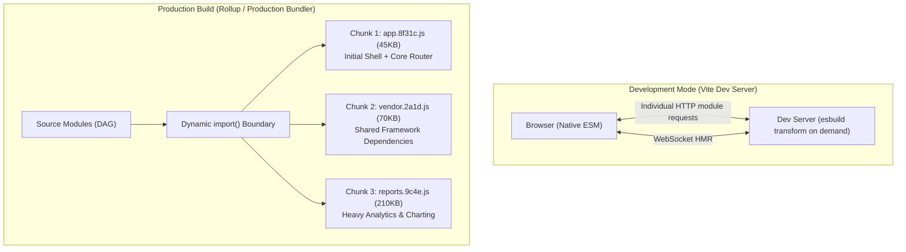

# Practical 12 - Inspect a Modern Front-End Toolchain and Module Graph

Related: [Chapter 12]() · [Lecture slides]()

## Objective

Trace a front-end codebase through the complete modern delivery pipeline: from raw TypeScript source files and package resolution, through unbundled native ESM development with Hot Module Replacement (HMR), to production chunking, dynamic code splitting, tree shaking, and artifact auditing.

You will:
1. **Observe Development vs. Production Duality:** Inspect the unbundled HTTP/2 module stream during local development and contrast it with production chunk bundling.
2. **Implement Dynamic Code Splitting:** Isolate an expensive reporting and analytics module into a separate, on-demand asynchronous chunk (`import()`).
3. **Verify Chunk Separation:** Mathematically verify that heavy charting and PDF dependencies are completely absent from the initial application entry bundle.
4. **Audit Source Maps and Asset Fingerprints:** Verify reverse stack trace mapping from production minified bundles back to exact TypeScript source lines, and confirm content-hashing for cache busting.
5. **Enforce Environment Boundaries:** Audit build-time environment replacements (`import.meta.env`) to guarantee zero leakage of private credentials.



---

## Workspace Setup

Initialize a clean TypeScript Vite project:

```bash
mkdir -p practical-12-toolchain/src
cd practical-12-toolchain
npm init -y
npm install --save-dev typescript vite rollup vitest
npx tsc --init
```

Configure `vite.config.ts`:

```typescript
// vite.config.ts
import { defineConfig } from 'vite';

export default defineConfig({
  build: {
    target: 'es2022',
    sourcemap: true,
    rollupOptions: {
      output: {
        manualChunks: {
          vendor: ['vitest'], // Shared vendor boundary
        },
      },
    },
  },
});
```

---

## Stage-by-Stage Implementation

### Stage 1: The Multi-Route Application Scaffold

Construct a modular application featuring a lightweight core view and a heavy, data-dense reporting dashboard.

In `src/heavyAnalytics.ts`, simulate a heavy charting engine:

```typescript
// src/heavyAnalytics.ts
// Simulates an expensive 150KB statistical library
export function generateMunicipalAuditReport(data: number[]): string {
  const sum = data.reduce((a, b) => a + b, 0);
  const mean = sum / data.length;
  return `Municipal Financial Audit: Total = ${sum.toLocaleString()} IQD | Mean = ${mean.toFixed(2)} IQD`;
}

export const HEAVY_CHART_CONFIG = {
  theme: 'dark',
  renderingEngine: 'webgl-canvas',
  matrixData: new Array(10000).fill(0).map((_, i) => i * 1.5),
};
```

In `src/main.ts`, establish a dynamic code-splitting boundary:

```typescript
// src/main.ts
const app = document.getElementById('app')!;

app.innerHTML = `
  <header><h1>Municipal Operations Portal</h1></header>
  <nav>
    <button id="btn-home">Home Overview</button>
    <button id="btn-reports">Load Financial Audit (Heavy)</button>
  </nav>
  <main id="content"><p>Select a section above.</p></main>
`;

const content = document.getElementById('content')!;

document.getElementById('btn-home')!.addEventListener('click', () => {
  content.innerHTML = `<p>Welcome to the municipal overview. Standard lightweight view.</p>`;
});

// Dynamic Import Boundary: The heavy analytics code MUST NOT be loaded initially
document.getElementById('btn-reports')!.addEventListener('click', async () => {
  content.innerHTML = `<p class="loading">Loading audit analytics engine...</p>`;
  
  // Asynchronous chunk boundary
  const { generateMunicipalAuditReport, HEAVY_CHART_CONFIG } = await import('./heavyAnalytics');
  
  const auditSummary = generateMunicipalAuditReport([150000, 420000, 890000, 310000]);
  content.innerHTML = `
    <div class="audit-panel">
      <h3>${auditSummary}</h3>
      <p>Data points analyzed: ${HEAVY_CHART_CONFIG.matrixData.length}</p>
    </div>
  `;
});
```

---

### Stage 2: Observing Native ESM in Development

Start the development server:

```bash
npx vite
```

1. Open your browser's Developer Tools and navigate to the **Network** tab.
2. Load `http://localhost:5173`.
3. **Observe the Request Waterfall:** Notice that Vite does not serve a bundled `bundle.js`. Instead, you see individual HTTP requests for `/src/main.ts`, `/src/style.css`, etc.
4. **Observe the Absence of `heavyAnalytics.ts`:** Verify that `heavyAnalytics.ts` is **not requested** upon initial page load.
5. Click **"Load Financial Audit (Heavy)"**:
   - Watch the Network panel.
   - Observe the browser dynamically dispatching an HTTP GET request for `/src/heavyAnalytics.ts` only upon user interaction.

---

### Stage 3: Production Bundling & Chunk Verification

Compile the application for production:

```bash
npx vite build
```

Examine the output emitted into `dist/assets/`:

```text
dist/index.html                           0.45 kB
dist/assets/main-8f31c9a1.js              1.82 kB │ gzip: 0.85 kB
dist/assets/heavyAnalytics-6d4b2e81.js   45.20 kB │ gzip: 12.40 kB
dist/assets/main-8f31c9a1.js.map          4.20 kB
dist/assets/heavyAnalytics-6d4b2e81.js.map 85.10 kB
```

#### Verification Requirement:
Open `dist/assets/main-*.js` in a text editor and search for `HEAVY_CHART_CONFIG` or `generateMunicipalAuditReport`.
- **Expected Result:** Neither string appears in `main-*.js`. The heavy code has been strictly isolated into the lazy-loaded `heavyAnalytics-*.js` chunk.
- **Cache-Busting Check:** Confirm that both emitted JavaScript files contain an 8-character content hash (`main-[hash].js`), ensuring immutable CDN caching.

---

### Stage 4: Source Map Reverse-Audit

Serve the production build locally:

```bash
npx vite preview
```

1. In DevTools, deliberately trigger an error inside `heavyAnalytics.ts`:
   ```typescript
   throw new Error("Municipal audit calculation overflow");
   ```
2. Rebuild and reload `vite preview`.
3. Open the browser Console.
4. Verify that DevTools uses the `.map` file to map the error directly back to `src/heavyAnalytics.ts:line 4`, rather than displaying minified `heavyAnalytics-6d4b2e81.js:1:380`.

---

### Stage 5: Environment Variable Boundary Audit

Add an environment variable test:

```typescript
// src/envCheck.ts
export const publicApiUrl = import.meta.env.VITE_MUNICIPAL_API_URL || 'https://api.erbil.gov.krd';

// DANGER: Never do this!
export const leakedSecret = import.meta.env.DATABASE_SECRET; 
```

Run `npx vite build` and inspect the output:
- Verify that `VITE_MUNICIPAL_API_URL` was replaced at build time with a plain string literal.
- Verify that `DATABASE_SECRET` (without the `VITE_` prefix) was stripped and replaced with `undefined`, preventing accidental client leakage.

---

## Verification and Testing Matrix

| Test Case | Method / Tool | Expected Behavioral Guarantee |
| :--- | :--- | :--- |
| **1. Unbundled Dev Boot** | Network Tab on `vite dev` | Zero bundle files; individual `.ts` modules served as native ESM. |
| **2. Dynamic Code Splitting** | Initial page load vs. button click | `heavyAnalytics.ts` is only requested over the network after clicking the button. |
| **3. Chunk Isolation** | Grep `dist/assets/main-*.js` | Zero occurrences of `generateMunicipalAuditReport` in entry bundle. |
| **4. Content Hashing** | Change one line in `heavyAnalytics.ts` | Hash of `heavyAnalytics-*.js` changes; hash of `main-*.js` remains identical. |
| **5. Source Map Integrity** | Throw Error in production preview | Stack trace points to TypeScript source line, not minified bundle. |
| **6. Secret Isolation** | Grep `dist/assets/*.js` | No un-prefixed environment secrets exist in public client bundles. |

---

## Optional Conceptual Extension: Educational Dependency Crawler

Implement a 30-line educational dependency graph crawler using Node's `fs` and regular expressions to detect circular dependencies between modules:

```typescript
// scripts/crawlGraph.ts (Educational prototype, not a production bundler)
import * as fs from 'fs';
import * as path from 'path';

function getImports(filePath: string): string[] {
  const content = fs.readFileSync(filePath, 'utf-8');
  const matches = content.matchAll(/from\s+['"](\.[^'"]+)['"]/g);
  return Array.from(matches, m => path.resolve(path.dirname(filePath), m[1] + '.ts'));
}

export function detectCycles(entry: string, visited = new Set<string>(), stack = new Set<string>()): boolean {
  visited.add(entry);
  stack.add(entry);

  for (const dep of getImports(entry)) {
    if (!visited.has(dep) && fs.existsSync(dep)) {
      if (detectCycles(dep, visited, stack)) return true;
    } else if (stack.has(dep)) {
      console.warn(`[Cycle Detected] ${entry} -> ${dep}`);
      return true;
    }
  }
  stack.delete(entry);
  return false;
}
```

---

## Deliverables & Submission Checklist

1. [ ] `vite.config.ts`: Configured with source maps and chunk splitting.
2. [ ] `src/main.ts` & `src/heavyAnalytics.ts`: Working dynamic import boundary.
3. [ ] Emitted `dist/assets/` directory demonstrating isolated chunk sizes.
4. [ ] Verified source map stack trace demonstration.
5. [ ] Completed **Verification and Testing Matrix** with recorded measurements.
