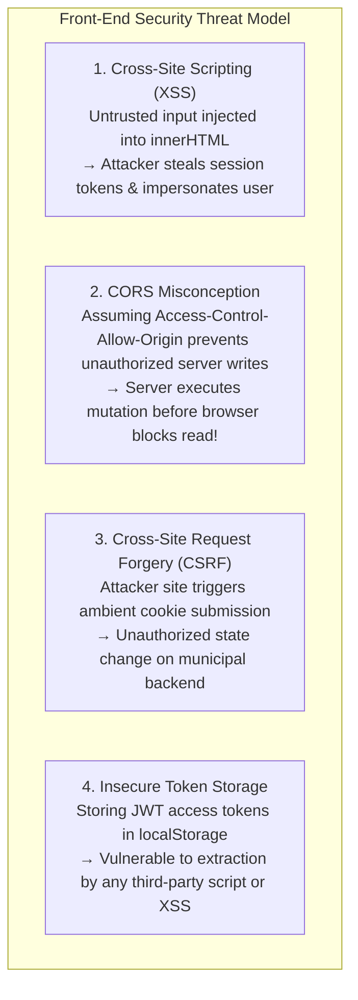
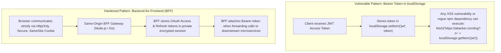

# Practical 13 - Security Boundary Review: XSS, CORS, and Authentication Boundaries

Related: [Chapter 13]() · [Lecture slides]()

## Objective

Conduct a rigorous threat-model review and hardening exercise on a simulated front-end application boundary. You will identify real-world vulnerabilities across Cross-Site Scripting (XSS), Cross-Origin Resource Sharing (CORS), Cross-Site Request Forgery (CSRF), and authentication token management.

By completing this laboratory, you will:
1. **Trace Untrusted Input from Source to Sink:** Track untrusted strings from URL parameters, API payloads, and form inputs into dangerous DOM execution sinks.
2. **Eliminate DOM-Based XSS:** Replace dangerous injection sinks with safe text rendering, context-aware encoding, and reviewed sanitization.
3. **Demystify the CORS Boundary:** Demonstrate why CORS is a browser-enforced response isolation mechanism rather than a server authorization check.
4. **Harden Mutation Endpoints against CSRF:** Configure `SameSite` cookie attributes and custom request headers to eliminate cross-site forged mutations.
5. **Architect Secure Credential Storage:** Evaluate the security trade-offs of browser-held bearer tokens in `localStorage` versus `HttpOnly, Secure, SameSite` cookies mediated by a Backend-for-Frontend (BFF).



---

## Workspace Setup

Create a minimal Node.js / TypeScript security test harness:

```bash
mkdir -p practical-13-security/src
cd practical-13-security
npm init -y
npm install --save-dev typescript @types/node vitest dompurify @types/dompurify jsdom
npx tsc --init
```

Ensure your `tsconfig.json` targets `ES2022` with `"lib": ["DOM", "ES2022"]`.

---

## Stage-by-Stage Implementation

### Stage 1: Tracing Untrusted Input to Dangerous DOM Sinks

In `src/vulnerableSearch.ts`, examine this typical search results component:

```typescript
// src/vulnerableSearch.ts
export function renderSearchSummary(container: HTMLElement, untrustedQuery: string): void {
  // VULNERABILITY: Direct string interpolation into innerHTML
  container.innerHTML = `
    <div class="search-feedback">
      You searched for: <span class="query-text">${untrustedQuery}</span>
    </div>
  `;
}
```

#### Exploit Simulation:
If an attacker crafts a malicious link:
`https://portal.erbil.gov.krd/search?q=`

When `renderSearchSummary` receives this string, the browser parses the `` tag, fails to load `src=x`, and immediately executes the `onerror` JavaScript payload inside the trusted origin's context.

---

### Stage 2: Hardening the Sink (Safe Text & Sanitization)

Refactor `renderSearchSummary` to enforce **Safe Sinks by Default**:

```typescript
// src/secureSearch.ts
import DOMPurify from 'dompurify';

// Defense 1: Safe Text Node Rendering (Immune to XSS)
export function renderSearchSummarySafe(container: HTMLElement, untrustedQuery: string): void {
  container.replaceChildren(); // Clear container cleanly

  const feedbackDiv = document.createElement('div');
  feedbackDiv.className = 'search-feedback';
  feedbackDiv.textContent = 'You searched for: ';

  const querySpan = document.createElement('span');
  querySpan.className = 'query-text';
  // textContent automatically encodes <, >, &, and quotes as pure text
  querySpan.textContent = untrustedQuery;

  feedbackDiv.appendChild(querySpan);
  container.appendChild(feedbackDiv);
}

// Defense 2: Reviewed Sanitization when Rich Text is MANDATORY
export function renderRichMunicipalAnnouncement(container: HTMLElement, untrustedHtml: string): void {
  // DOMPurify strips script tags, event handlers (onerror, onload), and javascript: URIs
  const cleanHtml = DOMPurify.sanitize(untrustedHtml, {
    ALLOWED_TAGS: ['b', 'i', 'em', 'strong', 'a', 'p', 'ul', 'li'],
    ALLOWED_ATTR: ['href', 'target'],
  });

  container.innerHTML = cleanHtml;
}
```

---

### Stage 3: Demystifying CORS and Preflight Handshakes

A frequent security misconception is believing that CORS protects APIs against unauthorized access. 

In `src/corsVerification.ts`, simulate a cross-origin HTTP interaction:

```typescript
// src/corsVerification.ts
export function analyzeCorsBoundary(): {
  corsProtectsServerData: boolean;
  corsAuthorizesClient: boolean;
  whoEnforcesCors: 'Browser' | 'Server';
} {
  return {
    // 1. CORS prevents the BROWSER from READING the response from an unauthorized origin
    corsProtectsServerData: true,
    
    // 2. CORS does NOT authorize the caller or prevent the server from EXECUTING the mutation!
    // A curl script or mobile app ignores CORS completely.
    corsAuthorizesClient: false,
    
    // 3. The BROWSER is the sole enforcement engine
    whoEnforcesCors: 'Browser',
  };
}
```

#### Key Architectural Lesson:
If an attacker sends a cross-origin `POST /api/permits/104/delete` from `https://malicious-site.com`, a naive server without CSRF defenses **will execute the deletion in its database** before sending the response back. The browser will then block `malicious-site.com` from reading the response due to CORS, but the damage is already done!

---

### Stage 4: CSRF Hardening for Cookie-Based Authentication

To prevent cross-site forged mutations, enforce a two-tier defense:

```typescript
// src/csrfProtection.ts
export interface SecureCookieConfig {
  name: string;
  value: string;
  httpOnly: boolean;
  secure: boolean;
  sameSite: 'Strict' | 'Lax' | 'None';
  path: string;
}

export function generateSessionCookie(sessionId: string): SecureCookieConfig {
  return {
    name: 'municipal_session',
    value: sessionId,
    httpOnly: true,     // Inaccessible to document.cookie (Defends against XSS theft)
    secure: true,       // Only transmitted over HTTPS
    sameSite: 'Lax',    // Blocked on cross-site state-changing POST / fetch requests
    path: '/',
  };
}

// Custom Header Anti-CSRF Verification
export function verifyCustomHeader(headers: Record<string, string>): boolean {
  // Browsers forbid cross-origin HTML forms from attaching custom headers
  // Any request with 'X-Requested-With' or 'X-CSRF-Token' was dispatched via explicit fetch/XHR
  return headers['x-requested-with'] === 'XMLHttpRequest' || headers['x-csrf-token'] !== undefined;
}
```

---

### Stage 5: Credential Storage Architecture (BFF vs. LocalStorage)

Compare the security boundaries of single-page application credential architectures:



---

## Verification and Testing Matrix

Validate your implementations against these required test assertions in `tests/security.test.ts`:

| Test ID | Vulnerability / Target | Verification Procedure | Expected Security Outcome |
| :--- | :--- | :--- | :--- |
| **SEC-01** | Reflected XSS in search input | Feed `<script>alert(1)</script>` into `renderSearchSummarySafe` | Rendered as plain text; zero script elements in DOM. |
| **SEC-02** | HTML Attribute Event Injection | Feed `` into `renderRichMunicipalAnnouncement` | DOMPurify strips `onerror`; tag rendered safely or removed. |
| **SEC-03** | `javascript:` URI Injection | Feed `<a href="javascript:steal()">Click</a>` into DOMPurify | `javascript:` protocol stripped; link neutralized. |
| **SEC-04** | Cookie Security Attributes | Inspect `generateSessionCookie` output | `httpOnly === true`, `secure === true`, `sameSite === 'Lax'`. |
| **SEC-05** | CSRF Header Gate | Pass request headers without `x-csrf-token` to mutation verifier | Request rejected with HTTP 403 Forbidden. |
| **SEC-06** | Server-Side Authorization | Inspect simulated client-side route guard | Verify client guard only controls UI display; API verifies JWT scopes. |

---

## Deliverables & Submission Checklist

1. [ ] `src/secureSearch.ts`: Hardened rendering functions utilizing safe text nodes and DOMPurify.
2. [ ] `src/corsVerification.ts`: Documented analysis of browser CORS enforcement mechanics.
3. [ ] `src/csrfProtection.ts`: Secure cookie generator and custom header CSRF validation logic.
4. [ ] `tests/security.test.ts`: Automated test suite passing all 6 assertions in the verification matrix.
5. [ ] Architectural brief summarizing why client-side route guards can never enforce security authorization.
