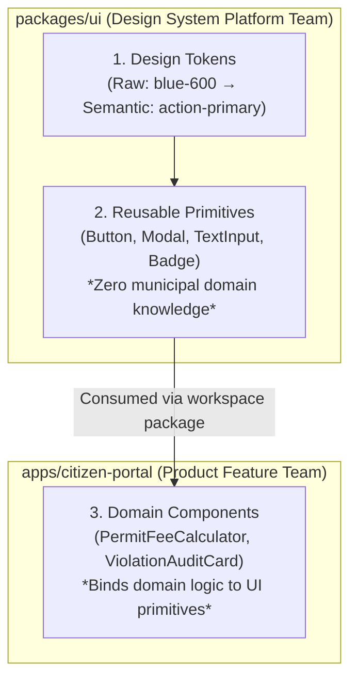

# Practical 14 — Design-System Package Governance and Ownership Mapping

Related: [Chapter 14]() · [Lecture slides]()

## Objective

Design, package, and govern a shared Design System UI package (`@municipal/ui`) consumed by a municipal citizen application (`apps/citizen-portal`) in a monorepo workspace.

By completing this laboratory, you will:
1. **Architect a Two-Tier Token Pipeline:** Separate raw palette constants from semantic intent tokens using CSS Custom Properties.
2. **Enforce Component Purity:** Implement reusable, accessible UI primitives that remain 100% agnostic of municipal domain logic.
3. **Manage a Breaking API Deprecation Lifecycle:** Execute a backwards-compatible SemVer release, providing deprecation console warnings and an automated migration path.
4. **Define Team Ownership Boundaries:** Create a formal RACI governance matrix preventing design system packages from becoming dumping grounds for product-specific code.



---

## Workspace Setup

Initialize a lightweight monorepo workspace:

```bash
mkdir -p practical-14-scaling/packages/ui/src
mkdir -p practical-14-scaling/apps/citizen-portal/src
cd practical-14-scaling
npm init -y
```

Configure `package.json` with native npm/pnpm workspaces:

```json
{
  "name": "municipal-monorepo",
  "private": true,
  "workspaces": [
    "packages/*",
    "apps/*"
  ]
}
```

---

## Stage-by-Stage Implementation

### Stage 1: Two-Tier Design Tokens

In `packages/ui/src/tokens.css`, define raw platform values and semantic intent tokens:

```css
/* packages/ui/src/tokens.css */
:root {
  /* Tier 1: Raw Palette Constants (Values, not intent) */
  --raw-color-blue-500: #2563eb;
  --raw-color-blue-600: #1d4ed8;
  --raw-color-red-600: #dc2626;
  --raw-color-gray-100: #f3f4f6;
  --raw-color-gray-900: #111827;
  --raw-space-2: 0.5rem;
  --raw-space-4: 1rem;
  --raw-radius-md: 0.375rem;

  /* Tier 2: Semantic Intent Tokens (Where & Why) */
  --color-action-primary: var(--raw-color-blue-600);
  --color-action-primary-hover: var(--raw-color-blue-500);
  --color-feedback-danger: var(--raw-color-red-600);
  --color-surface-canvas: #ffffff;
  --color-surface-muted: var(--raw-color-gray-100);
  --color-text-main: var(--raw-color-gray-900);
  --space-card-padding: var(--raw-space-4);
  --radius-interactive: var(--raw-radius-md);
}

/* Dark Theme Support via Semantic Token Remapping */
[data-theme="dark"] {
  --color-surface-canvas: #111827;
  --color-surface-muted: #1f2937;
  --color-text-main: #f9fafb;
}
```

---

### Stage 2: The Domain-Agnostic UI Primitive

In `packages/ui/src/Button.tsx`, build a primitive button. It must know nothing about permits, tax bills, or citizen records:

```typescript
// packages/ui/src/Button.tsx
import React from 'react';

export interface ButtonProps extends React.ButtonHTMLAttributes<HTMLButtonElement> {
  tone?: 'primary' | 'neutral' | 'critical';
  /** @deprecated Use `tone="critical"` instead of `variant="danger"` */
  variant?: 'danger'; 
  isLoading?: boolean;
}

export const Button: React.FC<ButtonProps> = ({
  tone = 'primary',
  variant,
  isLoading = false,
  children,
  className = '',
  disabled,
  ...props
}) => {
  // Graceful Deprecation Handling: Warn in development without crashing
  let activeTone = tone;
  if (variant === 'danger') {
    if (process.env.NODE_ENV !== 'production') {
      console.warn(
        `[DEPRECATION @municipal/ui] Button: 'variant="danger"' is deprecated and will be removed in v3.0. Please migrate to 'tone="critical"'.`
      );
    }
    activeTone = 'critical';
  }

  return (
    <button
      className={`btn btn-${activeTone} ${isLoading ? 'btn-loading' : ''} ${className}`}
      disabled={disabled || isLoading}
      aria-busy={isLoading}
      {...props}
    >
      {isLoading ? <span className="spinner" aria-hidden="true" /> : null}
      <span className="btn-content">{children}</span>
    </button>
  );
};
```

---

### Stage 3: Consuming in Product Application

In `apps/citizen-portal/src/PermitFeeCard.tsx`, the product team composes the primitive into their domain workflow:

```typescript
// apps/citizen-portal/src/PermitFeeCard.tsx
import React, { useState } from 'react';
import { Button } from '@municipal/ui';

interface PermitFeeCardProps {
  permitNumber: string;
  feeAmountIQD: number;
  onPayFee: (permitNumber: string) => Promise<void>;
}

export const PermitFeeCard: React.FC<PermitFeeCardProps> = ({
  permitNumber,
  feeAmountIQD,
  onPayFee,
}) => {
  const [isSubmitting, setIsSubmitting] = useState(false);

  const handlePayment = async () => {
    setIsSubmitting(true);
    try {
      await onPayFee(permitNumber);
    } finally {
      setIsSubmitting(false);
    }
  };

  return (
    <article className="permit-fee-card">
      <h3>License Renewal: {permitNumber}</h3>
      <p>Outstanding Municipal Fee: <strong>{feeAmountIQD.toLocaleString()} IQD</strong></p>
      
      {/* Consuming shared design-system primitive */}
      <Button tone="primary" isLoading={isSubmitting} onClick={handlePayment}>
        Pay Annual Assessment
      </Button>
    </article>
  );
};
```

---

### Stage 4: Package Boundary & Versioning Governance

Configure `packages/ui/package.json` to expose a clean, encapsulated public API:

```json
{
  "name": "@municipal/ui",
  "version": "2.4.0",
  "main": "./dist/index.js",
  "types": "./dist/index.d.ts",
  "exports": {
    ".": {
      "types": "./dist/index.d.ts",
      "import": "./dist/index.js"
    },
    "./tokens.css": "./src/tokens.css"
  },
  "sideEffects": ["**/*.css"],
  "peerDependencies": {
    "react": ">=18.0.0"
  }
}
```

#### The Package Boundary Rule:
Consumers can only import from exposed entry points (`@municipal/ui` and `@municipal/ui/tokens.css`). Internal implementation files (`packages/ui/src/internalHelpers.ts`) cannot be reached, preserving the platform team's freedom to refactor internals without breaking consuming apps.

---

### Stage 5: Design System Team Ownership (RACI Matrix)

To eliminate organizational friction, document the **RACI Ownership Map** in `packages/ui/GOVERNANCE.md`:

| Architectural Element | Design System Platform Team | Product Feature Teams | UX / Accessibility Council |
| :--- | :--- | :--- | :--- |
| **Raw & Semantic Tokens** | **Accountable (A)** | Consulted (C) | Responsible (R) |
| **UI Primitives (`Button`, `Modal`)** | **Responsible & Accountable (R/A)** | Consulted (C) | Informed (I) |
| **Domain Components (`PermitFeeCard`)** | Informed (I) | **Responsible & Accountable (R/A)** | Consulted (C) |
| **SemVer Major Releases** | **Responsible & Accountable (R/A)** | Consulted (C) | Informed (I) |

---

## Verification and Testing Matrix

| Test ID | Test Scenario | Verification Procedure | Pass Criteria |
| :--- | :--- | :--- | :--- |
| **PKG-01** | Token Abstraction | Check CSS output for `--color-action-primary` | Resolves to semantic CSS custom property; raw hex is not hardcoded in component. |
| **PKG-02** | Domain Isolation | Grep `packages/ui/src/` for "permit" or "tax" | Zero occurrences found; primitives are 100% domain-agnostic. |
| **PKG-03** | Deprecation Warning | Render `<Button variant="danger">` in test environment | Logs single deprecation warning to console; renders with `critical` tone styles. |
| **PKG-04** | Package Encapsulation | Attempt `import from '@municipal/ui/src/internalHelper'` | TypeScript & Bundler reject with package export encapsulation error. |
| **PKG-05** | Accessibility Baseline | Test `<Button isLoading={true}>` | Renders `aria-busy="true"` and `disabled` attribute. |

---

## Deliverables & Submission Checklist

1. [ ] `packages/ui/src/tokens.css`: Two-tier raw and semantic design tokens with dark-mode remapping.
2. [ ] `packages/ui/src/Button.tsx`: Accessible primitive with deprecation handling and loading state.
3. [ ] `packages/ui/package.json`: Encapsulated `"exports"` configuration with explicit CSS side-effects.
4. [ ] `apps/citizen-portal/src/PermitFeeCard.tsx`: Consuming domain component.
5. [ ] `packages/ui/GOVERNANCE.md`: Documented RACI team ownership matrix.
