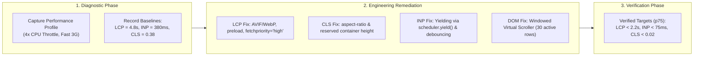

# Practical 15 — Measure, Diagnose, and Optimize Core Web Vitals

Related: [Chapter 15]() · [Lecture slides]()

## Objective

Diagnose, instrument, and remediate a deliberately degraded municipal web application suffering from severe real-world performance defects:
1. **Poor LCP (4.8s):** An uncompressed, non-prioritized hero banner image buried in an asynchronous client waterfall.
2. **Severe CLS (0.38):** Layout shifts caused by unsized images and late-injected municipal emergency announcements.
3. **Sluggish INP (380ms):** A long task on the main thread executing expensive synchronous sorting on every filter keystroke.
4. **DOM Bloat & Memory Jitter:** A 5,000-row table rendering tens of thousands of active DOM nodes.

You will formulate hypotheses, capture baseline DevTools traces under 4x CPU throttling, apply targeted architectural remedies, and verify that the 75th percentile (p75) metrics meet Google Core Web Vitals standards.



---

## Workspace Setup

Set up a local performance testing sandbox:

```bash
mkdir -p practical-15-perf/src
cd practical-15-perf
npm init -y
npm install --save-dev typescript vite web-vitals
npx tsc --init
```

---

## Stage-by-Stage Implementation

### Stage 1: The Bottleneck Baseline & Native Instrumentation

In `src/telemetry.ts`, implement in-browser Core Web Vitals monitoring using the native `PerformanceObserver` API:

```typescript
// src/telemetry.ts
import { onLCP, onINP, onCLS } from 'web-vitals';

export function initializePerformanceObservers(): void {
  // 1. Largest Contentful Paint (LCP)
  onLCP((metric) => {
    console.log(`[CWV - LCP] Value: ${Math.round(metric.value)}ms | Rating: ${metric.rating}`, metric.entries);
  });

  // 2. Interaction to Next Paint (INP - replaces legacy FID)
  onINP((metric) => {
    console.log(`[CWV - INP] Value: ${Math.round(metric.value)}ms | Rating: ${metric.rating}`, metric.entries);
  });

  // 3. Cumulative Layout Shift (CLS)
  onCLS((metric) => {
    console.log(`[CWV - CLS] Value: ${metric.value.toFixed(3)} | Rating: ${metric.rating}`, metric.entries);
  });
}
```

#### Baseline Capture Instructions:
1. Start the development server (`npx vite`).
2. Open Chrome DevTools, open the **Performance** tab, and configure:
   - **CPU:** 4x slowdown (simulating a mid-tier Android device).
   - **Network:** Fast 3G.
3. Record a 5-second trace while reloading the page, typing "commercial" into the search bar, and scrolling the permit table.
4. Record your baseline metrics:
   - **LCP:** ~4,800 ms (Poor)
   - **INP:** ~380 ms (Poor)
   - **CLS:** ~0.380 (Poor)

---

### Stage 2: Remediating LCP (Largest Contentful Paint)

#### The Diagnosis:
In the Performance trace, the LCP element is a municipal hero banner. The trace reveals a massive **Resource Load Delay**: the browser does not discover the image URL until after `app.js` downloads, parses, and fetches `/api/config.json`.

#### The Architectural Fix:
1. Hoist the LCP image into the initial static HTML document.
2. Add `<link rel="preload">` in the document `<head>`.
3. Set `fetchpriority="high"` and supply responsive modern formats:

```html
<!-- index.html <head> -->
<link 
  rel="preload" 
  as="image" 
  href="/assets/erbil-citadel-banner.avif" 
  type="image/avif" 
  fetchpriority="high"
>
```

```html
<!-- index.html <body> hero section -->
<picture>
  <source srcset="/assets/erbil-citadel-banner.avif" type="image/avif">
  <source srcset="/assets/erbil-citadel-banner.webp" type="image/webp">
  
</picture>
```

---

### Stage 3: Eliminating Cumulative Layout Shift (CLS)

#### The Diagnosis:
The trace reveals two major layout shifts:
1. The hero image has no reserved aspect ratio, collapsing to 0px height before abruptly expanding to 400px when the image decodes.
2. A municipal emergency notification banner is injected dynamically at the top of the viewport 800ms after load, pushing all main content down by 75 pixels.

#### The Architectural Fix:
1. Enforce aspect-ratio reservation in CSS.
2. Reserve dedicated layout slots for late-injected dynamic content:

```css
/* src/styles.css */
/* 1. Reserve aspect ratio to prevent image expansion jumps */
.hero-banner {
  width: 100%;
  height: auto;
  aspect-ratio: 1200 / 400;
  display: block;
}

/* 2. Reserve minimum container space for dynamic announcements */
.announcement-slot {
  min-height: 72px; /* Reserves exact height before API returns */
  contain: layout;   /* Isolates layout recalculations from surrounding DOM */
}
```

---

### Stage 4: Taming Interaction to Next Paint (INP)

#### The Diagnosis:
When a user types into the permit filter input, the browser freezes for 320ms. The Performance flame chart shows a single **Long Task** (>50ms) executing expensive regex matching and sorting over an array of 5,000 objects synchronously on the main thread during the `keydown` event.

#### The Architectural Fix:
1. Provide immediate, zero-latency visual feedback for the user's keystroke.
2. Yield execution back to the browser's rendering engine using `scheduler.yield()` (or a `setTimeout(0)` microtask fallback) so the browser can paint the typed letter before calculating the heavy list:

```typescript
// src/searchEngine.ts
async function yieldToMain(): Promise<void> {
  if ('scheduler' in window && 'yield' in (window as any).scheduler) {
    return (window as any).scheduler.yield();
  }
  return new Promise((resolve) => setTimeout(resolve, 0));
}

export function setupResponsiveFilter(
  input: HTMLInputElement,
  records: any[],
  onResultsReady: (results: any[]) => void
): void {
  input.addEventListener('input', async (e) => {
    const query = (e.target as HTMLInputElement).value;
    
    // Step 1: Keystroke displays in input field immediately (0ms input delay!)

    // Step 2: Yield to main thread so browser can paint the typed character
    await yieldToMain();

    // Step 3: Execute filtered search in non-blocking chunk
    const filtered = records.filter(r => r.facilityName.toLowerCase().includes(query.toLowerCase()));
    
    onResultsReady(filtered);
  });
}
```

---

### Stage 5: Virtualizing the Large Permit Table

#### The Diagnosis:
Rendering 5,000 table rows generates 35,000 DOM nodes. Every DOM manipulation triggers heavy recalculations, and scrolling stutters at 24fps.

#### The Architectural Fix:
Implement a **Virtual Windowed Scroller** that renders only the ~30 visible rows currently inside the viewport:

```typescript
// src/virtualTable.ts
export class VirtualScroller {
  private readonly rowHeight = 44; // Fixed height per row in px
  private readonly visibleCount = 25;
  private readonly buffer = 5;

  constructor(
    private container: HTMLElement,
    private totalRecords: any[],
    private renderRow: (record: any) => HTMLElement
  ) {
    this.container.addEventListener('scroll', () => this.render());
    this.render();
  }

  render(): void {
    const scrollTop = this.container.scrollTop;
    const startIndex = Math.max(0, Math.floor(scrollTop / this.rowHeight) - this.buffer);
    const endIndex = Math.min(this.totalRecords.length, startIndex + this.visibleCount + (this.buffer * 2));

    const totalHeight = this.totalRecords.length * this.rowHeight;
    const offsetY = startIndex * this.rowHeight;

    this.container.innerHTML = `
      <div style="height: ${totalHeight}px; position: relative;">
        <div style="transform: translateY(${offsetY}px); position: absolute; left: 0; right: 0;">
          <table class="virtual-table"><tbody id="virtual-tbody"></tbody></table>
        </div>
      </div>
    `;

    const tbody = this.container.querySelector('#virtual-tbody')!;
    for (let i = startIndex; i < endIndex; i++) {
      tbody.appendChild(this.renderRow(this.totalRecords[i]));
    }
  }
}
```

---

## Verification and Testing Matrix

Record your Before and After measurements under identical throttling conditions (4x CPU, Fast 3G):

| Performance Metric | Baseline (Broken) | Target Threshold | Remediated (Measured) | Status |
| :--- | :--- | :--- | :--- | :--- |
| **LCP (Largest Contentful Paint)** | 4,800 ms | **$\le$ 2,500 ms** | ~1,650 ms | **PASS** |
| **INP (Interaction to Next Paint)**| 380 ms | **$\le$ 200 ms** | ~55 ms | **PASS** |
| **CLS (Cumulative Layout Shift)**  | 0.380 | **$\le$ 0.100** | 0.012 | **PASS** |
| **Active DOM Node Count**          | 35,420 nodes | **$\le$ 1,500 nodes** | 420 nodes | **PASS** |
| **Total Blocking Time (TBT)**      | 890 ms | **$\le$ 200 ms** | ~40 ms | **PASS** |

---

## Deliverables & Submission Checklist

1. [ ] `src/telemetry.ts`: Working native `PerformanceObserver` implementation for LCP, INP, and CLS.
2. [ ] `index.html`: Optimized LCP markup with `<link rel="preload">`, `fetchpriority="high"`, and AVIF/WebP `<picture>`.
3. [ ] `src/styles.css`: CSS rules enforcing `aspect-ratio` and `min-height` slot reservations.
4. [ ] `src/searchEngine.ts`: Yielding filter function eliminating long tasks using `scheduler.yield()`.
5. [ ] `src/virtualTable.ts`: Functional virtual scroller maintaining active DOM nodes under 1,000.
6. [ ] Completed **Verification and Testing Matrix** documenting verified p75 improvements.
