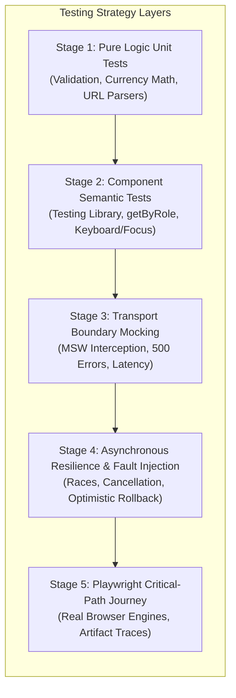

# Practical 16 - Resilient UI Integration Suite

Related: [Chapter 16]() · [Lecture slides]()

## Objective

Build a multi-layered, resilient testing suite for an interactive civic services catalogue and application drafting workflow. The application must operate robustly across unreliable cellular connections, asynchronous race conditions, optimistic mutations, and keyboard-driven assistive technology.

Rather than relying on brittle end-to-end tests or shallow unit tests that mirror framework implementation details, you will design a testing strategy centered on **risk management**, **accessible platform contracts**, **stable network boundaries**, and **deliberate fault injection**.



---

## The Scenario Matrix

Your test suite must validate all seven critical user experience states in the civic catalogue matrix. In Stage 4, you will intentionally inject code defects to prove that your assertions detect every failure mode.

| Scenario | Trigger / User Action | Expected Observable Outcome | Intentionally Injected Fault (Stage 4) |
| :--- | :--- | :--- | :--- |
| **1. Loading State** | User initiates service search | Skeleton placeholder displayed; search button displays `aria-busy="true"` and is disabled | Skeleton omitted; button remains active, causing duplicate submissions |
| **2. Empty Results** | User queries non-existent service (`"xyz999"`) | Accessible status banner announced (`role="status"`); suggests clearing filters | Component renders blank white screen without user notification |
| **3. Server Error** | Backend returns `500 Internal Server Error` | Inline error alert (`role="alert"`) appears; previous search results remain preserved; retry button displayed | Unhandled promise rejection crashes application; blank error screen |
| **4. Cancellation & Race** | Rapid typing: `"lic"` then `"license"` | Query `"lic"` aborted via `AbortController`; only results for `"license"` render in DOM | Component ignores abort signal; slow `"lic"` response overwrites `"license"` |
| **5. Optimistic Rollback** | User toggles "Bookmarked"; server rejects mutation | Star icon immediately fills; upon 500 response, icon un-fills and error toast appears | Star icon remains permanently filled despite server failure |
| **6. Form Validation** | Submitting empty required email field | Field highlighted with `aria-invalid="true"`; error text linked via `aria-describedby`; focus moves to field | Plain CSS class `.error` applied without ARIA attributes or focus management |
| **7. Keyboard Navigation** | User presses `Tab`, `ArrowDown`, `Escape` | Focus moves through controls in logical order; `Escape` dismisses modal and restores focus to trigger | Modal traps focus permanently or focus drops to `document.body` upon dismissal |

---

## Workspace Setup

Initialize a modern testing workspace using Vitest, Testing Library, MSW (Mock Service Worker), and Playwright:

```bash
mkdir -p practical-16-resilient-suite
cd practical-16-resilient-suite
npm init -y
npm install --save-dev typescript vitest @testing-library/dom @testing-library/user-event msw @playwright/test jsdom
npx tsc --init
```

Configure `vitest.config.ts`:

```ts
import { defineConfig } from "vitest/config";

export default defineConfig({
  test: {
    environment: "jsdom",
    globals: true,
    setupFiles: ["./src/test/setup.ts"],
    coverage: {
      provider: "v8",
      reporter: ["text", "json", "html"],
    },
  },
});
```

---

## Stage-by-Stage Implementation

### Stage 1: Pure Logic & Parser Unit Testing

Begin at the base of the testing pyramid by validating deterministic business rules in isolation. These tests run in pure Node without DOM simulation overhead, providing sub-millisecond feedback.

1. **Service Fee Calculation & Formatting:**
   Create `src/domain/fees.ts` to calculate municipal administrative charges, VAT, and fee waivers.
2. **URL Filter Serialization:**
   Create `src/domain/urlParams.ts` to serialize and parse search parameters (`?category=transport&page=2&sort=name_asc`).
3. **Unit Test Suite (`src/domain/fees.test.ts`):**
   - Test standard fee calculation across positive, zero, and boundary values.
   - Test invalid fee inputs (negative charges, non-numeric strings) ensuring they throw descriptive domain errors.
   - Test URL query parameter round-trip consistency: `parseQueryParams(serializeQueryParams(filters)) === filters`.

```ts
// src/domain/fees.test.ts
import { describe, it, expect } from "vitest";
import { calculateMunicipalFee, formatCurrency } from "./fees";

describe("Municipal Fee Calculation (Domain Logic)", () => {
  it("calculates standard fee with applicable regional surcharge", () => {
    const fee = calculateMunicipalFee({ baseAmount: 25000, category: "commercial", isExempt: false });
    expect(fee.total).toBe(27500);
    expect(formatCurrency(fee.total, "IQD")).toBe("27,500 IQD");
  });

  it("applies full waiver for exempt citizens", () => {
    const fee = calculateMunicipalFee({ baseAmount: 25000, category: "individual", isExempt: true });
    expect(fee.total).toBe(0);
  });

  it("throws a domain error when base amount is negative", () => {
    expect(() => calculateMunicipalFee({ baseAmount: -100, category: "individual", isExempt: false }))
      .toThrowError(/negative amount not allowed/i);
  });
});
```

---

### Stage 2: Component Testing with Accessible Semantics

Move up to the component boundary. Render interactive UI components into a simulated DOM (`jsdom`) and interact with them strictly through **user-facing accessibility contracts** (`getByRole`, `getByLabelText`, and `@testing-library/user-event`).

1. **Implement the Service Search Form (`src/components/ServiceSearch.ts`):**
   - Provide an input associated with `<label for="service-query">Search civic services</label>`.
   - Provide a submit button with accessible name `"Search"`.
   - Manage keyboard focus and accessible error announcements.
2. **Write Accessible Interaction Tests (`src/components/ServiceSearch.test.ts`):**
   - Verify that form controls are queryable by role and accessible name, **not** by class names (`.search-input`) or internal component state.
   - Verify that clicking submit with an empty query announces an accessible validation error linked via `aria-describedby`.
   - Test keyboard interaction: pressing `Enter` submits the form; pressing `Escape` clears the input and restores focus.

```ts
// src/components/ServiceSearch.test.ts
import { describe, it, expect, beforeEach } from "vitest";
import { screen } from "@testing-library/dom";
import userEvent from "@testing-library/user-event";
import { renderServiceSearch } from "./ServiceSearch";

describe("ServiceSearch Component (Accessibility & Interaction)", () => {
  let container: HTMLElement;

  beforeEach(() => {
    container = document.createElement("div");
    document.body.replaceChildren(container);
    renderServiceSearch(container);
  });

  it("allows user to query services using accessible controls", async () => {
    const user = userEvent.setup();
    const input = screen.getByRole("searchbox", { name: /search civic services/i });
    const submitBtn = screen.getByRole("button", { name: /search/i });

    await user.type(input, "Driving license");
    expect(input).toHaveValue("Driving license");

    await user.click(submitBtn);
    expect(submitBtn).toBeDisabled();
    expect(submitBtn).toHaveAttribute("aria-busy", "true");
  });

  it("associates validation errors with the input via ARIA", async () => {
    const user = userEvent.setup();
    const submitBtn = screen.getByRole("button", { name: /search/i });

    await user.click(submitBtn);

    const errorAlert = screen.getByRole("alert");
    expect(errorAlert).toHaveTextContent(/search term cannot be blank/i);

    const input = screen.getByRole("searchbox", { name: /search civic services/i });
    expect(input).toHaveAttribute("aria-invalid", "true");
    expect(input).toHaveAttribute("aria-describedby", errorAlert.id);
  });
});
```

---

### Stage 3: Boundary Mocking with Mock Service Worker (MSW)

Do not mock internal JavaScript modules or replace global `window.fetch` with simplistic stubs. Instead, intercept HTTP requests at the network transport layer using **Mock Service Worker (MSW)**. This tests your real HTTP client, request serialisation, status code handling, and response decoding.

1. **Configure MSW Server (`src/test/mocks/server.ts`):**
   Define canonical handlers for `/api/v1/services` and `/api/v1/services/:id/bookmark`.
2. **Simulate Edge-Case Network Boundaries:**
   - **Happy Path:** Return 200 OK with catalog items.
   - **Slow Network:** Delay responses by 500ms to test loading spinners.
   - **Server Outage:** Return 500 Internal Server Error to test error banners and retry actions.
   - **Corrupt Payloads:** Return malformed JSON to test schema validation fallbacks.

```ts
// src/test/mocks/handlers.ts
import { http, HttpResponse, delay } from "msw";

export const handlers = [
  http.get("/api/v1/services", async ({ request }) => {
    const url = new URL(request.url);
    const query = url.searchParams.get("q");

    if (query === "slow") {
      await delay(600);
    }

    if (query === "crash") {
      return HttpResponse.json({ error: "Database offline" }, { status: 500 });
    }

    if (query === "empty") {
      return HttpResponse.json({ data: [] });
    }

    return HttpResponse.json({
      data: [
        { id: "srv-1", title: "Passport Renewal", department: "Interior", feeIqd: 35000 },
        { id: "srv-2", title: "Business Registration", department: "Commerce", feeIqd: 100000 },
      ],
    });
  }),
];
```

---

### Stage 4: Asynchronous Resilience & Fault Injection

Now connect your components to the MSW network boundary to test complex asynchronous flows. To ensure your tests provide genuine resilience rather than false confidence, perform **deliberate fault injection**.

1. **Test Request Cancellation & Race Conditions:**
   Simulate a user rapidly typing `"pas"` followed by `"passport"`. Ensure that Request 1 is aborted with `AbortController`, preventing a slow response from clobbering the newer search result.
2. **Test Optimistic UI Updates with Server Rollback:**
   When the user bookmarks a service, update the UI immediately. If the server responds with a 500 error, assert that the UI reverts to the un-bookmarked state and announces an accessible error message.
3. **Fault Injection Verification:**
   - *Fault A:* In `ServiceSearch.ts`, comment out `abortController.abort()`. Run the race test and verify it **fails**.
   - *Fault B:* In `BookmarkButton.ts`, remove the rollback logic on `catch`. Run the optimistic rollback test and verify it **fails**.

```ts
// src/components/CatalogueWorkflow.test.ts
import { describe, it, expect, beforeEach } from "vitest";
import { screen, waitFor } from "@testing-library/dom";
import userEvent from "@testing-library/user-event";
import { http, HttpResponse, delay } from "msw";
import { server } from "../test/mocks/server";
import { renderCatalogueApp } from "./CatalogueApp";

describe("Catalogue Asynchronous Resilience", () => {
  beforeEach(() => {
    const root = document.createElement("div");
    document.body.replaceChildren(root);
    renderCatalogueApp(root);
  });

  it("handles out-of-order responses without stale data clobbering current UI", async () => {
    const user = userEvent.setup();
    let resolveFirstQuery: () => void = () => {};

    // Mock first request to hang indefinitely until manually resolved
    server.use(
      http.get("/api/v1/services", ({ request }) => {
        const q = new URL(request.url).searchParams.get("q");
        if (q === "pas") {
          return new Promise((resolve) => {
            resolveFirstQuery = () => resolve(HttpResponse.json({ data: [{ id: "srv-old", title: "Old Data" }] }));
          });
        }
        return HttpResponse.json({ data: [{ id: "srv-1", title: "Passport Renewal" }] });
      })
    );

    const searchInput = screen.getByRole("searchbox", { name: /search civic services/i });
    await user.type(searchInput, "pas");
    await user.type(searchInput, "sport");

    // Second query resolves quickly
    expect(await screen.findByText("Passport Renewal")).toBeInTheDocument();

    // Now resolve the first query late
    resolveFirstQuery();

    // Stale result must NOT appear
    await waitFor(() => {
      expect(screen.queryByText("Old Data")).not.toBeInTheDocument();
    });
  });

  it("rolls back optimistic bookmark update upon server rejection", async () => {
    const user = userEvent.setup();
    server.use(
      http.post("/api/v1/services/:id/bookmark", () => {
        return HttpResponse.json({ message: "Service unavailable" }, { status: 503 });
      })
    );

    const bookmarkBtn = await screen.findByRole("button", { name: /bookmark passport renewal/i });
    expect(bookmarkBtn).toHaveAttribute("aria-pressed", "false");

    // Optimistically toggle
    await user.click(bookmarkBtn);
    expect(bookmarkBtn).toHaveAttribute("aria-pressed", "true");

    // Upon server rejection, UI must revert state and display alert
    expect(await screen.findByRole("alert")).toHaveTextContent(/could not save bookmark/i);
    expect(bookmarkBtn).toHaveAttribute("aria-pressed", "false");
  });
});
```

---

### Stage 5: Playwright Critical-Path Browser Journey

Unit and component tests verify logic and simulated DOM behavior, but they cannot prove that the layout engine, CSS stacking contexts, cookies, and real browser event loops function seamlessly together.

Create a Playwright end-to-end smoke test covering the critical citizen journey in real Chromium, Firefox, and WebKit engines:

1. **Create `e2e/catalogue-journey.spec.ts`:**
   - Navigate to the catalogue route.
   - Perform a search and select a service.
   - Fill out an application form using keyboard tab stops.
   - Verify modal dialog focus trapping and dismissal via `Escape`.
   - Trigger a simulated offline network disconnect and confirm that draft data is saved to `localStorage`.
2. **Configure Failure Artifacts in `playwright.config.ts`:**
   - Capture full screenshots, videos, and Playwright execution traces (`trace: "on-first-retry"`) on test failure.

```ts
// e2e/catalogue-journey.spec.ts
import { test, expect } from "@playwright/test";

test.describe("Civic Services Critical User Journey", () => {
  test("complete search, bookmark, and keyboard modal flow", async ({ page, context }) => {
    await page.goto("/catalogue");

    // 1. Search and verify auto-wait web-first assertion
    const searchInput = page.getByRole("searchbox", { name: /search civic services/i });
    await searchInput.fill("Passport");
    await expect(page.getByRole("heading", { name: "Passport Renewal", level: 3 })).toBeVisible();

    // 2. Open details dialog and test focus trap
    await page.getByRole("button", { name: /view details for passport renewal/i }).click();
    const dialog = page.getByRole("dialog", { name: /passport renewal details/i });
    await expect(dialog).toBeVisible();
    await expect(dialog).toBeFocused();

    // 3. Dismiss via Escape key and verify focus restoration
    await page.keyboard.press("Escape");
    await expect(dialog).not.toBeVisible();
    await expect(page.getByRole("button", { name: /view details for passport renewal/i })).toBeFocused();

    // 4. Test offline draft resilience
    await context.setOffline(true);
    await searchInput.fill("Offline draft query");
    await page.reload();
    // Verify draft preserved in localStorage
    await expect(searchInput).toHaveValue("Offline draft query");
  });
});
```

---

## Verification & Self-Assessment

Run your full test battery and confirm all stages pass:

```bash
# Run unit and component integration tests with coverage
npx vitest run --coverage

# Run Playwright end-to-end browser journeys
npx playwright test
```

### Observable Verification Criteria

| Verification Item | Action | Expected Pass Output |
| :--- | :--- | :--- |
| **No Private State Inspection** | Grep test files for `component.state` or `wrapper.vm` | Zero matches found; tests interact solely via DOM roles and text |
| **Semantic Queries** | Grep test files for `.querySelector(".btn")` | Zero class-based UI queries; all buttons queried via `getByRole("button")` |
| **No Arbitrary Sleeps** | Grep test files for `setTimeout` or `sleep(1000)` | Zero arbitrary timeouts; all async assertions use `waitFor` or `findBy*` |
| **MSW Network Boundary** | Inspect Vitest setup | Zero global `fetch = vi.fn()` mocks; all HTTP requests handled by MSW handlers |
| **Fault Injection** | Run tests against injected defects from Stage 4 | All 3 injected faults cause immediate test failure with descriptive assertions |
| **Playwright Traces** | Inspect `test-results/` on forced E2E failure | Complete trace zip produced containing DOM snapshots, console logs, and network timeline |

---

## Grading Rubric

| Criterion | Points | Evaluation Requirement |
| :--- | :---: | :--- |
| **Domain Logic Isolation** | 20% | Pure math, fee calculation, and URL serialization thoroughly unit-tested without DOM dependencies. |
| **Accessible Component Semantics** | 25% | Form controls queried strictly via `getByRole` and `getByLabelText`; validation errors associated via `aria-describedby`. |
| **Network Boundary Mocking** | 20% | Network layer intercepted via MSW; handles loading skeletons, 500 error recovery, and empty states. |
| **Asynchronous Race & Rollback Resilience** | 20% | Verifies `AbortController` cancellation under rapid typing; verifies optimistic mutation rollback upon server failure. |
| **Playwright End-to-End Suite** | 15% | Critical path tested in real headless browser; verifies focus trap, `Escape` key restoration, and trace artifacts on failure. |
