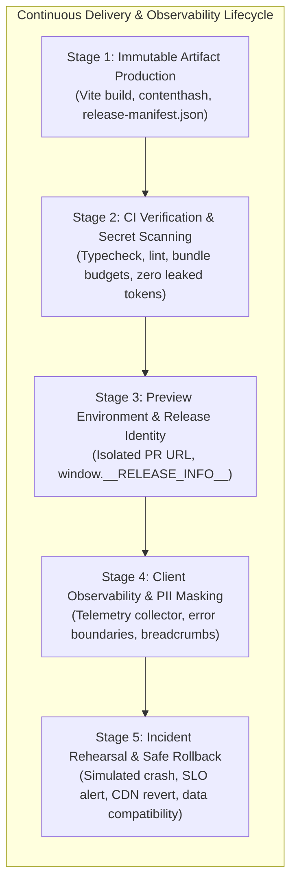

# Practical 17 - Delivery, Observability, and Rollback Loop

Related: [Chapter 17]() · [Lecture slides]() · [Appendix C: Production Deployment Checklist]()

## Objective

Design, execute, and rehearse an automated, safe front-end delivery and operational loop. Rather than treating deployment as an unverified "push to production" or assuming that passing tests guarantee operational safety, you will construct a delivery pipeline that:
1. Builds an **immutable, content-hashed artifact** tied to an exact Git commit SHA.
2. Enforces **strict CI verification gates**, including automated secret scanning and bundle size budgets.
3. Injects **immutable release identity metadata** to correlate runtime client telemetry.
4. Instruments a **PII-safe client-side observability collector** that captures unhandled exceptions, Core Web Vitals, and user interaction breadcrumbs.
5. Executes a **simulated production incident and rollback rehearsal**, verifying that reverting the deployed static assets does not break local client state compatibility or corrupt backend data contracts.



---

## Workspace Setup

Initialize a modern delivery sandbox using Vite, TypeScript, and a lightweight local static web server to simulate CDN and edge environments:

```bash
mkdir -p practical-17-delivery/src
cd practical-17-delivery
npm init -y
npm install --save-dev typescript vite vitest @playwright/test
npx tsc --init
```

---

## Stage-by-Stage Implementation

### Stage 1: Immutable Reproducible Artifact & Manifest Generation

In continuous delivery, you must **build once and promote the exact same artifact** across preview, staging, and production environments. Never rebuild assets from source for each separate environment.

1. **Configure Content-Hashed Asset Bundling (`vite.config.ts`):**
   Ensure all JavaScript, CSS, and asset filenames include cryptographic content hashes (`[name].[hash].js`). This guarantees that older versions can remain cached indefinitely on the CDN without cache collisions during rolling deployments.
2. **Generate `release-manifest.json` at Build Time:**
   Write a build hook in `scripts/generate-manifest.js` that records:
   - `releaseId`: The Git commit hash (or simulated semantic release identifier, e.g. `v2.4.0-a9f3c1`).
   - `buildTimestamp`: ISO 8601 UTC timestamp.
   - `environment`: Target tier (`preview`, `staging`, or `production`).
   - `entrypointChunk`: The exact hashed path of the primary entry bundle (`assets/index-a9f3c1b8.js`).
   - `bundleSizes`: File size breakdown to detect unexpected code bloat.

```json
// dist/release-manifest.json
{
  "releaseId": "v2.4.0-a9f3c1",
  "gitCommit": "a9f3c1d89b4e5f2a104",
  "buildTimestamp": "2026-09-24T08:30:00Z",
  "entrypointChunk": "/assets/index-a9f3c1b8.js",
  "totalBytes": 142850,
  "bundleBudgetMax": 200000
}
```

---

### Stage 2: Automated CI Verification & Secret Scanning

A reliable delivery pipeline halts before publishing if code violates quality gates or leaks private security credentials.

1. **Implement Bundle Budget Enforcement (`scripts/check-budget.js`):**
   Read the compiled output in `dist/assets/`. If total uncompressed JavaScript exceeds 200 KB, fail the build with an actionable error.
2. **Pre-Commit Secret Scanning Gate (`scripts/scan-secrets.js`):**
   Front-end client bundles are public to the entire internet. Write an automated scan regex that searches all source files and environment files (`.env*`) for:
   - Private keys (`BEGIN PRIVATE KEY`, `AWS_SECRET_ACCESS_KEY`).
   - Unprefixed environment variables. Only variables explicitly prefixed with `VITE_PUBLIC_` or `NEXT_PUBLIC_` may be included in client bundles.
   - Ensure that if an engineer attempts to commit a database password or private stripe key, the CI check exits with code 1.

```ts
// scripts/scan-secrets.ts
import fs from "node:fs";
import path from "node:path";

const FORBIDDEN_PATTERNS = [
  /-----BEGIN (RSA )?PRIVATE KEY-----/,
  /sk_live_[0-9a-zA-Z]{24}/,
  /AIza[0-9A-Za-z-_]{35}/, // Google API Key
  /postgres:\/\/[^:]+:[^@]+@/, // Database connection string
];

export function scanFileForSecrets(filePath: string): boolean {
  const content = fs.readFileSync(filePath, "utf-8");
  for (const pattern of FORBIDDEN_PATTERNS) {
    if (pattern.test(content)) {
      console.error(`[SECURITY FAILURE] Potential leaked secret in ${filePath} matching ${pattern}`);
      return false;
    }
  }
  return true;
}
```

---

### Stage 3: Preview Environments & Release Identity Injection

To diagnose production issues without guessing which code version a user is running, embed immutable release identity metadata directly into the client runtime.

1. **Inject Runtime Release Metadata (`src/config/release.ts`):**
   Expose an immutable global object on `window.__RELEASE_INFO__` containing the release version, commit SHA, and environment name.
2. **Private Source Map Handling:**
   Configure Vite to generate source maps (`sourcemap: "hidden"`). The `.map` files are generated on disk for upload to a secure, private error-tracking server (e.g., Sentry), but the `//# sourceMappingURL=` comment is stripped from the public bundle. This allows on-call engineers to read de-minified stack traces without exposing proprietary code to the public web.

```ts
// src/config/release.ts
export interface ReleaseMetadata {
  readonly version: string;
  readonly commitSha: string;
  readonly environment: "development" | "preview" | "staging" | "production";
  readonly deployedAt: string;
}

declare global {
  interface Window {
    __RELEASE_INFO__: ReleaseMetadata;
  }
}

export const RELEASE: ReleaseMetadata = {
  version: import.meta.env.VITE_APP_VERSION || "v2.4.0",
  commitSha: import.meta.env.VITE_COMMIT_SHA || "dev-local",
  environment: (import.meta.env.MODE as ReleaseMetadata["environment"]) || "development",
  deployedAt: new Date().toISOString(),
};

if (typeof window !== "undefined") {
  window.__RELEASE_INFO__ = Object.freeze(RELEASE);
}
```

---

### Stage 4: Client Observability, Telemetry & PII Masking

Server logs only capture HTTP requests that successfully reach the backend; they cannot detect client runtime crashes, syntax errors, or UI thread freezes.

Implement a lightweight, zero-dependency client telemetry module (`src/observability/telemetry.ts`):

1. **Global Unhandled Error Capture:**
   Listen to `window.onerror` and `window.onunhandledrejection`. Extract the error name, message, stack trace, and active route.
2. **User Interaction Breadcrumbs:**
   Maintain a ring buffer of the last 15 user actions (clicks on buttons, route changes, API request start/finish markers) to reconstruct user journeys leading up to a crash.
3. **Data Minimization & PII Redaction:**
   Before beaconing any error payload, scrub:
   - Form inputs with `type="password"`, name `"card"`, or name `"nationalId"`.
   - Query parameter tokens (e.g. `?token=...`, `?key=...`).
4. **Resilient Beaconing:**
   Transmit telemetry using `navigator.sendBeacon("/api/telemetry/errors", JSON.stringify(payload))`, ensuring messages are delivered even if the user immediately closes the browser tab.

```ts
// src/observability/telemetry.ts
import { RELEASE } from "../config/release";

interface Breadcrumb {
  timestamp: number;
  category: "ui.click" | "navigation" | "network";
  message: string;
}

const breadcrumbs: Breadcrumb[] = [];
const MAX_BREADCRUMBS = 15;

export function addBreadcrumb(crumb: Omit<Breadcrumb, "timestamp">) {
  breadcrumbs.push({ ...crumb, timestamp: Date.now() });
  if (breadcrumbs.length > MAX_BREADCRUMBS) breadcrumbs.shift();
}

export function initTelemetry() {
  window.addEventListener("error", (event) => {
    reportErrorPayload({
      type: "unhandled_error",
      message: event.message,
      filename: event.filename,
      lineno: event.lineno,
      stack: event.error?.stack || "No stack trace",
    });
  });

  window.addEventListener("unhandledrejection", (event) => {
    reportErrorPayload({
      type: "unhandled_promise_rejection",
      message: String(event.reason?.message || event.reason),
      stack: event.reason?.stack || "No stack trace",
    });
  });
}

function reportErrorPayload(errorDetails: Record<string, unknown>) {
  const payload = {
    release: RELEASE,
    url: window.location.pathname, // Redact query params
    userAgent: navigator.userAgent,
    breadcrumbs: [...breadcrumbs],
    error: errorDetails,
  };

  const endpoint = "/api/v1/telemetry/errors";
  if (navigator.sendBeacon) {
    navigator.sendBeacon(endpoint, JSON.stringify(payload));
  } else {
    fetch(endpoint, { method: "POST", body: JSON.stringify(payload), keepalive: true }).catch(() => {});
  }
}
```

---

### Stage 5: Simulated Disaster Rehearsal & Safe Rollback

A rollback plan that has never been tested is not a rollback plan - it is wishful thinking. In this stage, you will rehearse a full incident recovery cycle:

1. **Inject a Fatal Production Regression into v2.4:**
   In `src/pages/ApplicationForm.ts`, inject a syntax or runtime exception that triggers when users click "Submit Application" (e.g. invoking an undefined function or invalid regular expression).
2. **Observe the Canary Failure:**
   Simulate user traffic hitting the deployed application. Verify that client telemetry records the error spike, tags it with `v2.4.0-a9f3c1`, and captures the relevant breadcrumb trail.
3. **Execute the Rollback:**
   Trigger the rollback script (`scripts/rollback.sh` or local routing switch) to point the edge web server back to the v2.3.0 directory.
4. **Data Compatibility Verification:**
   Verify what a "successful rollback" actually means:
   - **Artifact Rollback vs Data Compatibility:** Confirm that users who loaded v2.4 did not have their local client state (`localStorage['app_draft']`) corrupted into an unparseable schema that crashes v2.3.
   - **API Schema Backwards-Compatibility:** Confirm that any pending backend requests sent by v2.4 can still be processed or cleanly rejected without breaking v2.3 client sessions.
5. **Draft a Blameless Post-Mortem:**
   Document the incident timeline: Time to Detect (TTD), Time to Mitigate (TTM), root cause, and preventative CI gate additions.

```mermaid
sequenceDiagram
    autonumber
    actor User as Citizen User
    participant App as Web App (v2.4.0)
    participant Telemetry as Telemetry Collector
    actor OnCall as On-Call Operator
    participant Edge as Edge Web Server

    User->>App: Clicks "Submit Application"
    Note over App: Uncaught TypeError in Form Submit Handler!
    App->>Telemetry: sendBeacon: { release: "v2.4.0", error: "TypeError", breadcrumbs }
    Telemetry-->>OnCall: High-Priority Pager Alert: Form Error Rate = 12% (>0.5% SLO)
    OnCall->>OnCall: Inspect breadcrumbs: all failures occur in v2.4.0 submission chunk
    OnCall->>Edge: Switch active traffic alias from v2.4.0 to v2.3.0
    Edge-->>User: Next page request serves v2.3.0 (Rollback complete: 2 minutes)
    User->>App: Retries form on v2.3.0; submission succeeds without data loss
```

---

## Verification & Self-Assessment

Run your delivery verification battery:

```bash
# 1. Run local CI verification gates
npm run lint && npm run typecheck && npm test

# 2. Build immutable release artifact
npm run build

# 3. Verify bundle size budget and secret scanning
node scripts/check-budget.js
node scripts/scan-secrets.js

# 4. Rehearse rollback switch
./scripts/rollback.sh --to=v2.3.0
```

### Observable Verification Criteria

| Verification Item | Action | Expected Pass Output |
| :--- | :--- | :--- |
| **Reproducible Artifact** | Inspect `dist/` | All asset files contain content hashes; `release-manifest.json` matches commit SHA |
| **Secret Scanning** | Inject dummy private key into source and run scanner | CI build aborts with exit code 1; identifies file and offending line |
| **Bundle Budget** | Run `scripts/check-budget.js` | Confirms JavaScript bundle size is within the 200 KB threshold |
| **Telemetry PII Scrubbing** | Submit form with email and password, inspect telemetry payload | Password and token fields are completely redacted (`[REDACTED]`) |
| **Rehearsed Rollback** | Execute rollback script | Traffic reverts to previous release in under 60 seconds; no local client crashes |
| **Appendix C Audit** | Cross-reference [Appendix C Checklist]() | All Section 1 (Build Integrity) and Section 5 (Observability) items checked |

---

## Grading Rubric

| Criterion | Points | Evaluation Requirement |
| :--- | :---: | :--- |
| **Artifact Reproducibility** | 20% | Production bundle uses immutable content hashes; generates complete `release-manifest.json`. |
| **CI Gates & Secret Scanning** | 20% | CI pipeline enforces type checks, bundle budgets, and blocks leaked private credentials. |
| **Release Identity & Source Maps** | 20% | Injects `window.__RELEASE_INFO__`; source maps are generated for private server upload without public leakage. |
| **Client Observability & PII Safety** | 20% | Global error handlers capture exceptions and breadcrumbs via `sendBeacon`; scrubs PII before transmission. |
| **Incident Rehearsal & Rollback** | 20% | Simulates production incident, executes rollback, validates `localStorage` schema compatibility, and writes post-mortem. |
